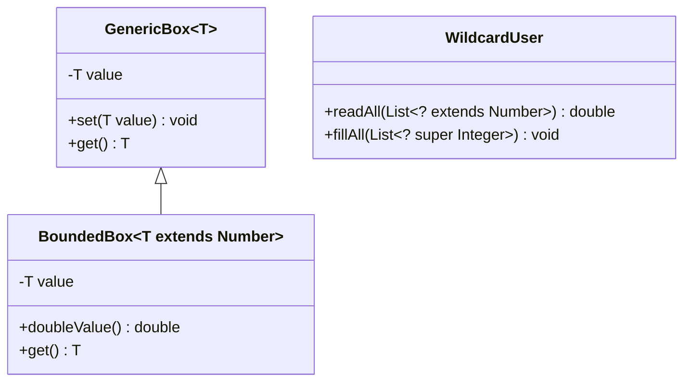
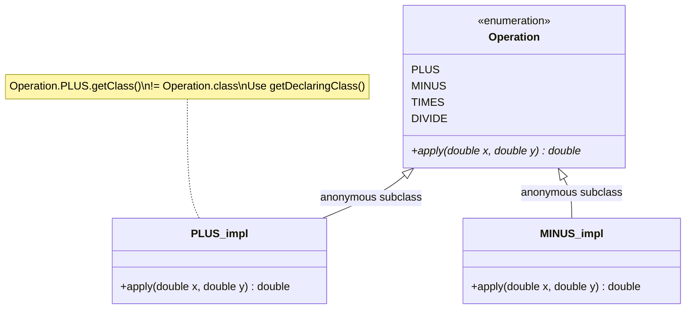

# Java Language - L2 Generics and Types

| # | Keyword | Difficulty |
| --- | --- | --- |
| 1 | [Generics: Type Parameters, Bounds, and Type Safety](#generics-type-parameters-bounds-and-type-safety) | ★★☆ |
| 2 | [Wildcards and PECS: Producer Extends Consumer Super](#wildcards-and-pecs-producer-extends-consumer-super) | ★★★ |
| 3 | [Enums: State Machines, Abstract Methods, EnumMap](#enums-state-machines-abstract-methods-enummap) | ★★☆ |
| 4 | [Autoboxing, Unboxing, and the Integer Cache Trap](#autoboxing-unboxing-and-the-integer-cache-trap) | ★★☆ |

---

# Generics: Type Parameters, Bounds, and Type Safety

**Interview Weight:** high - Core Java. Tests whether you understand type
safety beyond "put angle brackets on classes." Frequently asked with
code that reveals type erasure misunderstandings.

---

### 🎯 Model Answer

**30 seconds:**

> Generics let you write classes and methods that work with any type while
> maintaining compile-time type safety. The type parameter (like T) is a
> placeholder that the compiler fills in at the call site. Type bounds
> (extends, super) restrict which types are accepted. The key rule: generics
> are a compile-time mechanism - the JVM sees raw types after erasure.

**3 minutes (Senior):**

> Generics solve the pre-Java 5 problem: collections required casting and
> ClassCastExceptions were only caught at runtime. With generics, the
> compiler verifies type correctness at compile time and eliminates explicit casts.
>
> Type bounds control what operations are available on the type parameter.
> An upper bound (`<T extends Comparable<T>>`) means you can call Comparable's
> methods on T. A lower bound (`<T super Integer>`) means you can write Integer
> values into T containers. Multiple bounds are possible: `<T extends A & B>`.
>
> The critical runtime fact: generics are erased. At runtime, `List<String>`
> and `List<Integer>` are both just `List`. This enables backward compatibility
> with pre-generics code but creates limitations: cannot do `new T[]`, cannot
> do `instanceof List<String>`, and bridges methods appear in bytecode for
> covariant returns in generic hierarchies.

**Blank Mind Recovery:**

**(1) Restate:** "Generics - type parameters, bounds, and type safety.
Let me cover what they are, how bounds work, and the erasure constraint."

**(2) First principles:** "Without generics: cast everywhere, ClassCastException
at runtime. With generics: compiler tracks the type, no casts needed, wrong
type = compile error. The trade-off: compile-time only - erased at runtime."

**(3) Bridge:** "A typed envelope: `Envelope<String>` can only hold a String.
The envelope type is checked when you seal it (compile time). At delivery
(runtime), the envelope just says 'Envelope' - the String type info is gone."

---

### 📘 Concept Explanation

**What it is:**

Generics provide compile-time type parameterization: write a class or method
once, and the compiler verifies correct usage for each specific type at
every call site.

**The problem it solves:**

Pre-generics Java forced all collections to store Objects:
```java
// Pre-Java 5: no type safety
List names = new ArrayList();
names.add("Alice");
names.add(42); // silently accepted - wrong type
String name = (String) names.get(1); // ClassCastException at runtime!
```

**How it works:**

```java
// Generic class: T is a type parameter
public class Box<T> {
    private T value;
    public void set(T value) { this.value = value; }
    public T get() { return value; }
}

Box<String> strBox = new Box<>();
strBox.set("hello");
String s = strBox.get(); // no cast; compiler knows it's String
strBox.set(42); // COMPILE ERROR: expected String, got int

// Upper bound: T must extend Number
public <T extends Number> double sum(List<T> list) {
    double total = 0;
    for (T item : list) {
        total += item.doubleValue(); // safe: Number has doubleValue()
    }
    return total;
}
sum(List.of(1, 2, 3));     // T inferred as Integer
sum(List.of(1.5, 2.5));   // T inferred as Double
sum(List.of("a", "b"));    // COMPILE ERROR: String not a Number

// Multiple bounds: T must implement both interfaces
public <T extends Comparable<T> & Serializable> T max(T a, T b) {
    return a.compareTo(b) >= 0 ? a : b;
}
```

> **Code walkthrough:** Box<T> shows the basic pattern: T is unknown at
> definition time but fixed at instantiation (`Box<String>`). The compiler
> rejects the wrong type at the set() call. The sum() method uses an upper
> bound to guarantee that doubleValue() exists on T - without the bound,
> T would just be Object and no Number methods would be available.

**The key insight:**

Generics are a compile-time feature only. After compilation, `Box<String>`
becomes `Box` (raw type) at the bytecode level. The JVM has no concept of
`Box<String>` at runtime. This is "type erasure." Implications: cannot
create arrays of generic types (`new T[]` is illegal), cannot use generic
type in instanceof checks (`if (x instanceof List<String>)` is illegal).

**When to use it:**

- Any collection or container that should be type-safe
- Utility methods that work with any type (sorting, filtering, mapping)
- Builder patterns, Optional, Result types, Pair/Tuple types
- API design where callers should specify the type

**When NOT to use it:**

- Do not use raw types (List instead of List<T>) in new code - they bypass
  all type safety
- Do not over-bound: use `<T extends Object>` = just use `<T>` or `<?>` instead
- Do not use generics when a specific type suffices (not everything needs to be generic)

**Alternatives:**

- Wild cards (? extends T, ? super T) for more flexible use-site variance
- Object with casting (pre-Java 5 style - avoid in new code)
- Sealed types for a bounded set of alternatives (Java 17)

**First-principles derivation:**

Parametric polymorphism: "a single algorithm that works for any type."
The compiler tracks types through the generic parameter. At compile time, the
type system guarantees correctness. At runtime, all type parameters are erased
to their bounds (or Object) because the JVM's type system predates generics.
This is the Erasure model, chosen for backward compatibility with pre-Java 5 code.

---

### 💻 Code Example

**Example 1: Raw type vs generic type**

```java
// BAD: raw type - no compile-time type checking
List names = new ArrayList();
names.add("Alice");
names.add(42);              // silently accepted
String s = (String) names.get(1); // ClassCastException at runtime

// GOOD: generic type - compile-time safety
List<String> names = new ArrayList<>();
names.add("Alice");
names.add(42);              // COMPILE ERROR: int not a String
String s = names.get(0);   // no cast; compiler guarantees String
```

> **Code walkthrough:** The raw type List bypasses all type checking: any
> object can be added, and ClassCastException only surfaces at runtime when
> the wrong type is extracted. The generic List<String> moves the error to
> compile time: adding an int is rejected immediately. The get() call needs
> no cast because the compiler tracks the element type.

**Example 2: Bounded type parameters for generic algorithms**

```java
// BAD: using Object - no type-specific operations available
public static Object max(List<?> list) {
    // Cannot call compareTo - Object has no compareTo
    // Must cast; no compile-time safety
    return ((Comparable) list.get(0)); // fragile
}

// GOOD: upper bound enables calling type-specific methods
public static <T extends Comparable<T>> T max(List<T> list) {
    if (list.isEmpty())
        throw new IllegalArgumentException("Empty list");
    T result = list.get(0);
    for (int i = 1; i < list.size(); i++) {
        if (list.get(i).compareTo(result) > 0) {
            result = list.get(i); // safe: T has compareTo
        }
    }
    return result; // returns T, not Object - no cast needed at call site
}

// Call site: type inferred; no casts
int    biggest = max(List.of(3, 1, 4, 1, 5)); // T = Integer
String last    = max(List.of("apple", "zebra", "mango")); // T = String
```

> **Code walkthrough:** The bad version returns Object, losing all type
> information and forcing casts. The GOOD version bounds T to Comparable<T>,
> enabling compareTo() calls without casting. The return type is T (not
> Object), so call sites get back the specific type without explicit casts.
> The compiler infers T = Integer or T = String from the argument type.

---

### 🎓 Answers by Seniority

**Junior / Mid (0-5 years):**

> Generics let me write type-safe collections and methods. The type parameter
> (like T) is a placeholder. Upper bound `extends` means T must be a subtype.
> The advantage: no casts, no ClassCastExceptions. The limitation: erased at
> runtime - the JVM only sees raw types.

*Push deeper:* Wildcard `?` vs type parameter `T`: `?` is an unknown type
(use when you won't return or store the type). `T` names the type so you can
use it in return types and multiple parameters.

---

**Senior / Staff (5+ years):**

> I know the full erasure model: generic types become their upper bounds in bytecode
> (T extends Number -> Number, T -> Object). This explains bridge methods,
> heap pollution warnings, and why `instanceof List<String>` is illegal. In
> production I treat @SuppressWarnings("unchecked") as a code smell: it usually
> means a cast that cannot be verified by the compiler, requiring a comment
> explaining why it is safe.

*Push deeper:* Reifiable types: only raw types, non-generic types, and wildcard
parameterized types are reifiable (can be checked at runtime with instanceof).
`List<String>` is not reifiable; `List<?>` is. This is why arrays of generic
types (`new List<String>[10]`) are illegal: array stores use runtime type
checks that cannot work with erased types.

---

### ⚠️ Common Misconceptions

| Misconception | Reality | Risk |
| --- | --- | --- |
| "List<Integer> is a subtype of List<Object>" | Generics are INVARIANT: List<Integer> is NOT a List<Object>. Changing via a List<Object> reference would allow adding a String - violating the List<Integer> contract | Compiler errors that seem wrong; incorrect API design |
| "Generic type info is available at runtime" | Type erasure: the JVM sees raw types only. `List<String>` at runtime is just `List`. instanceof checks on parameterized types are illegal | Expecting runtime generic type reflection to work |
| "T extends X and T super X mean the same thing" | extends = upper bound (T must be X or a subtype). super = lower bound (T must be X or a supertype). They control READ vs WRITE safety differently | Wrong bound choice breaking code that should work |

---

### 🚨 Failure Modes and Diagnosis

| Failure | Symptom | Root Cause | Diagnostic | Fix |
| --- | --- | --- | --- | --- |
| Heap pollution | `ClassCastException` at a line that has no cast | Mixed raw and generic types; @SuppressWarnings("unchecked") used carelessly | Stack trace points to auto-generated cast (compiler inserts casts at read sites) | Eliminate raw types; trace back to where unchecked warning was suppressed |
| ClassCastException with no apparent cast | Runtime error in generic code with no explicit cast | Type erasure: compiler inserts casts at read sites; those casts fail if wrong type was stored | `javap -verbose ClassName` shows bridge methods and injected checkcast bytecodes | Fix the source of wrong type insertion |

---

### 🎯 Interview Deep-Dive

| Level | Time | Expected Depth |
| --- | --- | --- |
| Junior | 3 min | What generics are; upper bounds; raw types are bad |
| Mid | 5 min | Invariance; wildcards vs type params; type erasure basics |
| Senior | 8 min | Full erasure model; heap pollution; reifiable types; bridge methods |
| Staff | 12 min | API design with generics; variance at API boundaries; erasure trade-offs |

---

**Q1** [CONCEPTUAL] [JUNIOR]

"What is the difference between `List<Object>` and `List<?>`?"

**Answer:**

Both can hold any type of element, but they behave very differently:

`List<Object>`: a list that stores Objects. You can add anything (all types
extend Object). But `List<String>` is NOT assignable to `List<Object>` because
generics are invariant:
```java
List<String> strings = new ArrayList<>();
List<Object> objects = strings; // COMPILE ERROR
// If allowed: objects.add(42); would corrupt the List<String>
```

`List<?>`: a list of some unknown type. You cannot add anything (except null)
because the compiler doesn't know what type the list holds:
```java
List<String> strings = new ArrayList<>();
List<?> unknown = strings; // LEGAL: wildcard accepts any parameterization
unknown.add("hello"); // COMPILE ERROR: cannot add to wildcard list
Object item = unknown.get(0); // OK: can read as Object (upper bound)
```

Use `List<?>` when you only need to read from the list and don't care about
the element type. Use `List<T>` (named type param) when you need to use the
type in return values or multiple parameters.

*What separates good from great:* `List<?>` is `List<? extends Object>` - a
wildcard with implicit upper bound of Object. You cannot add to it because the
unknown concrete type might be `List<String>` and adding an Integer would
corrupt it. The compiler enforces this by rejecting all adds (except null, which
is always type-safe).

---

**Q2** [CONCEPTUAL] [MID]

"Why are generics invariant in Java? Why is `List<Integer>` not
a `List<Number>`?"

**Answer:**

Invariance is required for type safety. If `List<Integer>` were a
`List<Number>` (covariant), the following would be type-safe at compile
time but cause runtime errors:

```java
// If generics were covariant (they are NOT):
List<Integer> ints = new ArrayList<>();
List<Number> nums = ints; // hypothetical - not legal in Java
nums.add(3.14); // adds a Double to a List<Integer> - corruption!
int i = ints.get(0); // ClassCastException: Double is not Integer
```

Invariance prevents this: the compiler rejects `List<Number> nums = ints`.

Arrays ARE covariant in Java (historical design decision):
```java
Integer[] intArr = new Integer[3];
Number[] numArr = intArr; // legal - arrays are covariant
numArr[0] = 3.14; // ArrayStoreException at RUNTIME
```

This is why arrays have ArrayStoreException (runtime check) and generic
collections have compile-time errors. Generics are the safer design.

When you need "something like covariance": use wildcards.
`List<? extends Number>` accepts `List<Integer>`, `List<Double>`, etc.
But you can only READ from it (no add), preventing the corruption problem.

*What separates good from great:* Java chose to keep array covariance for
backward compatibility and to support patterns like `Object[] args` in
varargs. This was called out as a mistake by Bloch and Gosling. Generic
collections avoid this mistake by being invariant with wildcards for when
variance is needed.

---

**Q3** [DEBUGGING] [MID]

"You see an `@SuppressWarnings("unchecked")` annotation. What does
it mean and when is it acceptable?"

**Answer:**

`@SuppressWarnings("unchecked")` suppresses compiler warnings about
unchecked type casts: operations that the compiler cannot verify are
type-safe because generic type information is not available at runtime.

Common case: casting a raw type to a generic type:
```java
// BAD: unchecked cast without justification
@SuppressWarnings("unchecked")
List<String> list = (List<String>) someMap.get("items");
// If the map actually contains List<Integer>, runtime CCE will occur
// The annotation hides a real safety issue

// GOOD: unchecked cast with documented type invariant
// The API contract guarantees this map only stores List<String>
@SuppressWarnings("unchecked")
// Safe: this map is populated only by putStrings()
// which enforces List<String> invariant - see putStrings() impl
List<String> list = (List<String>) rawMap.get("items");
```

Acceptable uses:
1. Framework interaction where APIs predate generics (legacy code)
2. Reflection-based code where the type is verified by other means
3. Collections that store heterogeneous types internally but expose
   a typed API with invariants maintained by private code

Unacceptable uses:
1. Hiding a real type mismatch
2. Avoiding the work to redesign to a type-safe API
3. Any annotation without an explanatory comment

In code review: every `@SuppressWarnings("unchecked")` should have a
comment explaining why the cast is safe. No comment = reject the PR.

*What separates good from great:* The `@SuppressWarnings` annotation
suppresses the warning but does NOT change the bytecode. The cast
instruction is still in the bytecode; it will still throw ClassCastException
at runtime if the type is wrong. The annotation only affects the compile-time
warning, not runtime behavior.

---

**Q4** [TRADE-OFF] [MID]

"What are the trade-offs of Java's type erasure vs the reified
generics approach (like C# uses)?"

**Answer:**

Java erasure: generic type parameters are removed at compile time.
C# reification: generic types are preserved and available at runtime.

```
Feature                    Java Erasure        C# Reified
-----------------------------------------------------
Runtime type info          No (erased)         Yes (available)
instanceof with params     Illegal             Legal
Array of generic type      Illegal             Legal
Performance                No overhead         Small overhead for value types
Binary compatibility       Yes (old+new code)  Versioning required
Type token pattern         Required (Class<T>) Not needed
Reflection on generic types  Limited            Full
Code size                  Single bytecode      Instantiated per type (sometimes)
```

Java's trade-off: backward compatibility won. Pre-Java 5 bytecode
runs unchanged alongside Java 5+ generics code. Erasure was required
to achieve this.

C# advantage: `List<int>` and `List<string>` are different runtime types.
Runtime generic reflection works. No need for Class<T> tokens.

Java workaround for type token:
```java
// When you need runtime type info in Java (erasure workaround)
public <T> T fromJson(String json, Class<T> type) {
    return objectMapper.readValue(json, type);
}
// Caller must pass the class token:
User u = fromJson(json, User.class);
// TypeReference for generic types:
List<User> users = objectMapper.readValue(json,
    new TypeReference<List<User>>(){});
```

*What separates good from great:* Super type tokens (Neal Gafter's idea,
used in Google Guice and Jackson TypeReference): using an anonymous subclass
of a generic type to capture the type argument. The subclass's generic
superclass type IS stored in bytecode (as metadata on the class, not erased)
because it's part of the class declaration, not a variable.

---

**Q5** [PRODUCTION] [SENIOR]

"How do you use generic type bounds to build a type-safe heterogeneous
container?"

**Answer:**

A heterogeneous container stores values of different types but retrieves
them in a type-safe way. Use `Class<T>` as the key:

```java
// Typesafe heterogeneous container (Effective Java Item 33)
public class TypeSafeContainer {
    private final Map<Class<?>, Object> map = new HashMap<>();

    public <T> void put(Class<T> type, T value) {
        map.put(Objects.requireNonNull(type), value);
    }

    public <T> T get(Class<T> type) {
        // The cast is safe: we always store value with its own Class key
        // If put(String.class, "hello") was called, get(String.class)
        // can only return String - invariant maintained by put()
        return type.cast(map.get(type)); // type.cast is safe
    }
}

TypeSafeContainer c = new TypeSafeContainer();
c.put(String.class, "hello");
c.put(Integer.class, 42);
String s = c.get(String.class); // "hello", no cast
Integer n = c.get(Integer.class); // 42, no cast
// c.put(String.class, 42); // COMPILE ERROR: int not a String
```

The trick: `type.cast(obj)` is a checked cast using runtime class info.
It's equivalent to `(T) obj` but throws a descriptive ClassCastException
if the types don't match, rather than failing silently.

Real-world use: Spring's ApplicationContext.getBean(Class<T>), Jackson's
TypeReference, Guava's ClassToInstanceMap.

*What separates good from great:* This pattern breaks if a client uses
a raw class token or a subclass: `put((Class) String.class, 42)` bypasses
the type check (that's the unchecked warning in the raw type cast). The
truly type-safe version requires that clients use only the typed `put()`
method, which the compiler enforces for non-raw code.

---

**Q6** [COMPARISON] [MID]

"When would you use a generic method vs a generic class?"

**Answer:**

Generic method: the type parameter is declared on the method, scoped
to that method only. Use when the type varies per call:
```java
// Generic method: T is different for each call
public static <T> List<T> listOf(T... items) {
    return Arrays.asList(items);
}
List<String> s = listOf("a", "b"); // T inferred as String
List<Integer> n = listOf(1, 2, 3); // T inferred as Integer
```

Generic class: the type parameter is declared on the class, shared by
all methods. Use when the type is part of the class's identity:
```java
// Generic class: T is fixed when you create an instance
public class Repository<T extends Entity> {
    public T findById(Long id) { ... }
    public void save(T entity) { ... }
    public List<T> findAll() { ... }
    // All methods share the same T
}

Repository<User> userRepo = new Repository<>();
// All methods now work with User specifically
```

Rule: if the type is tied to the instance's lifetime, use a generic class.
If it varies per invocation, use a generic method. Static utility methods
that work with any type are always generic methods.

*What separates good from great:* Generic methods support type inference
at the call site; generic classes require explicit type at instantiation
(or inference from context with diamond operator `new Box<>()`). For
functional-style APIs (streams, optional), generic methods are preferred
because they chain naturally without explicit type declarations.

---

**Q7** [CONCEPTUAL] [JUNIOR]

"What is type erasure and what are its practical limitations?"

**Answer:**

Type erasure: the Java compiler removes all generic type information
after type checking. At runtime, `List<String>` and `List<Integer>` are
both just `List`. The type parameter T becomes Object (or its upper bound).

Practical limitations:

1. Cannot create generic arrays:
```java
T[] arr = new T[10]; // COMPILE ERROR
// At runtime, the JVM needs to know the array type; T is erased
// Workaround: use List<T> instead, or pass Class<T> and use reflection
T[] arr = (T[]) Array.newInstance(clazz, 10); // reflection workaround
```

2. Cannot use instanceof with parameterized type:
```java
if (obj instanceof List<String>) { ... } // COMPILE ERROR
if (obj instanceof List<?>) { ... }       // OK: wildcard is reifiable
```

3. Cannot create instances of type parameters:
```java
public <T> T create() { return new T(); } // COMPILE ERROR
// Workaround: pass Class<T> and use reflection
public <T> T create(Class<T> clazz) throws Exception {
    return clazz.getDeclaredConstructor().newInstance();
}
```

4. Static fields cannot use the class's type parameter:
```java
class Box<T> {
    static T defaultValue; // COMPILE ERROR: T is per-instance, not per-class
}
```

*What separates good from great:* Generic type information IS preserved
in class and method declarations (as metadata, not in the type system).
`Field.getGenericType()`, `Method.getGenericParameterTypes()`, and
`Class.getGenericSuperclass()` can retrieve it. Jackson uses this to
deserialize into `List<User>` by reading the TypeReference's generic
superclass type via reflection.

---

**Q8** [BEHAVIORAL] [MID]

"Describe a time you used generics to eliminate code duplication."

**Answer:**

> At [company], we had 12 service classes, each with findById, findAll,
> save, and delete methods. The implementations were nearly identical: fetch
> from cache, miss -> query database, populate cache, return. The only
> difference was the entity type (User, Order, Product, etc.).
>
> I introduced a generic CrudService<T, ID> with the shared logic. The type
> parameter T was bounded to `T extends BaseEntity` (our audit base class).
> Each concrete service extended CrudService<User, Long>, CrudService<Order, UUID>, etc.
>
> Result: ~800 lines of duplicated code removed. Adding a new entity required
> extending CrudService with two type arguments - no copy-paste. Type safety
> was preserved: UserService.findById returned User, not Object.

*What separates good from great:* The key design decision: T extends BaseEntity
rather than T extends Object. The bound enabled calling `entity.getId()` and
`entity.getAuditInfo()` without casting inside the generic implementation.
Without the bound, we would have needed reflection or a separate interface.

---

**Q9** [TRADE-OFF] [SENIOR]

"When should you prefer a bounded wildcard over a bounded type parameter?"

**Answer:**

Bounded wildcard (`? extends T`, `? super T`): use at method signatures
when the method only reads or only writes, and you don't need to name the type.

Bounded type parameter (`<T extends X>`): use when the type must be named
(to appear in return type, in multiple parameters, or in method body as a variable).

```java
// Wildcard: better here - method only reads, type not used elsewhere
// Reading: ? extends T (covariant / producer)
public static double sumList(List<? extends Number> list) {
    return list.stream()
        .mapToDouble(Number::doubleValue)
        .sum();
}
// Accepts: List<Integer>, List<Double>, List<Long>

// Type param: needed here - return type must match input type
public static <T extends Comparable<T>> T max(List<T> list) {
    return list.stream().max(Comparator.naturalOrder()).orElseThrow();
    // T appears in return type - wildcard won't work
}

// Writing: ? super T (contravariant / consumer)
public static void addNumbers(List<? super Integer> list) {
    list.add(1); list.add(2); list.add(3);
}
// Accepts: List<Integer>, List<Number>, List<Object>
```

Rule (PECS - next keyword): Producer Extends (read from it), Consumer Super
(write to it). When in doubt: if the collection is passed in and you only
read from it, use `? extends`. If you only write to it, use `? super`.
If both read and write, use a named type parameter `<T>`.

*What separates good from great:* Wildcards produce more flexible APIs
(callers pass more types) but less type information to the method body.
Type parameters are more constraining but give you the type to work with.
The principle: use the least constraining option that makes your code
correct. Start with wildcards; promote to named type parameter only when needed.

---

### ⚖️ Comparison Table

| Feature | Raw Type | Wildcard `<?>` | Bounded Wildcard | Named Type Param |
| --- | --- | --- | --- | --- |
| Type safety | None | Read-only safe | Bounded read/write | Full |
| Can add elements | Yes (dangerous) | No | Yes with `? super T` | Yes |
| Can read elements | As Object (cast) | As Object | As T | As T |
| Return type | Object | Object | Bounded type | T |
| Use for | Legacy code only | Read-only utility | Flexible API | Named return type |

---

### 🏛️ System Design

*(Omit: ★★☆ keyword. System Design is required for ★★★ keywords.)*

---

### 📊 Diagram

```
TYPE PARAMETER vs WILDCARD:

Box<T>                 Box<?>
  T = fixed per        ? = unknown; read-only
  instance;            can't add, reads as Object
  can add T

UPPER BOUND: T extends Number
  accepts: Integer, Double, Long (Number subtypes)
  enables: Number methods on T

LOWER BOUND: T super Integer
  accepts: Integer, Number, Object (Integer supertypes)
  enables: adding Integer values to T containers
```



> **Diagram walkthrough:** GenericBox<T> accepts any type; callers fix T at
> instantiation. BoundedBox<T extends Number> restricts T to Number subclasses,
> enabling Number-specific operations like doubleValue(). The WildcardUser shows
> the read/write split: ? extends Number allows reading as Number but not adding;
> ? super Integer allows adding Integer values but reading only as Object. Together
> these represent PECS: Producer Extends (you produce/read values), Consumer Super
> (you consume/write values).

---

---

# Enums: State Machines, Abstract Methods, EnumMap

**Interview Weight:** medium-high - Frequently used, but depth is often
lacking. Tests whether you know enums beyond simple constants.

---

### 🎯 Model Answer

**30 seconds:**

> Java enums are type-safe constant sets that are also full classes: they
> can have fields, constructors, and methods. The power features: abstract
> methods (each constant has its own implementation), implementing interfaces,
> and EnumMap/EnumSet (specialized collections that are faster than HashMap
> for enum keys). Enums are singletons by design and are thread-safe.

**3 minutes (Senior):**

> Beyond being named constants, enums are ideal for the Strategy pattern:
> each constant implements an abstract method differently. This replaces
> switch-on-enum chains with polymorphic dispatch.
>
> Enums implement an interface - this makes them polymorphic. A Planet enum
> that implements a Gravity interface can be passed to methods accepting Gravity.
> The compiler guarantees the closed set of implementations.
>
> For collections of enums: EnumMap is an array-backed Map where the enum
> ordinal is the index. Faster than HashMap (no hashing, no collision chains),
> and iterates in declaration order. EnumSet is a bit-vector for up to 64
> enums, making union/intersection operations bitwise-fast.
>
> Thread safety: enum instances are created once by the classloader and never
> modified. The classloader guarantee makes enum-based singletons the safest
> singleton pattern in Java.

**Blank Mind Recovery:**

**(1) Restate:** "Enums - let me cover the full power: abstract methods,
interfaces, EnumMap, and why enums are ideal for singletons."

**(2) First principles:** "An enum is a fixed set of instances of a class.
Since you know all instances at compile time, you can use them in switch,
guarantee exhaustiveness (with pattern matching), and optimize collections."

**(3) Bridge:** "A traffic light: RED, YELLOW, GREEN. Each color has a
behavior (RED.action() = stop, GREEN.action() = go). The enum captures
both the fixed set of values AND their individual behaviors."

---

### 📘 Concept Explanation

**What it is:**

Java enums are full-fledged classes whose instances are a fixed, named set
of constants. Each constant is a singleton instance of the enum class.

**The problem it solves:**

Pre-enum integer constants had no type safety: `int state = 99` was valid
even if only 0, 1, 2 were meaningful. Enum constants are typed - wrong
value = compile error.

**How it works:**

```java
// BASIC: type-safe constants
enum Day { MON, TUE, WED, THU, FRI, SAT, SUN }
Day d = Day.MON;
// Day d = 0; // COMPILE ERROR: int is not a Day

// FIELDS + METHODS: enums are full classes
enum Planet {
    MERCURY(3.303e+23, 2.4397e6),
    VENUS  (4.869e+24, 6.0518e6),
    EARTH  (5.976e+24, 6.37814e6);

    private final double mass;    // fields per constant
    private final double radius;

    Planet(double mass, double radius) { // constructor
        this.mass   = mass;
        this.radius = radius;
    }

    static final double G = 6.67300E-11;
    double surfaceGravity() { return G * mass / (radius * radius); }
    double surfaceWeight(double otherMass) {
        return otherMass * surfaceGravity();
    }
}

// ABSTRACT METHODS: each constant has its own impl
enum Operation {
    PLUS  { @Override double apply(double x, double y) { return x + y; } },
    MINUS { @Override double apply(double x, double y) { return x - y; } },
    TIMES { @Override double apply(double x, double y) { return x * y; } },
    DIVIDE{
        @Override double apply(double x, double y) {
            if (y == 0) throw new ArithmeticException("div by zero");
            return x / y;
        }
    };

    abstract double apply(double x, double y); // each constant implements
}
double result = Operation.PLUS.apply(3, 4); // 7.0 -- polymorphic!
```

> **Code walkthrough:** Planet shows enums with fields and computed methods:
> each planet constant holds its own mass and radius, and surfaceGravity() is
> calculated per-constant. Operation shows the Strategy pattern: the abstract
> apply() method is implemented differently by each constant, eliminating the
> need for switch-case on the enum value. This is polymorphic dispatch on
> enum constants.

**The key insight:**

Each enum constant is an instance of an anonymous subclass when it has a
body. `Operation.PLUS` is literally `new Operation() { double apply(...) { return x+y; } }`.
This means each constant CAN have its own state and behavior. The enum
is both the type and a closed factory of its own instances.

**When to use it:**

- Type-safe constants (days, months, directions, HTTP methods)
- Strategy pattern with a closed set of algorithms
- State machine states with behavior per state
- Configuration options where only certain values are valid

**When NOT to use it:**

- Do not add mutable state to enums (they are singletons; mutation is shared)
- Do not use enums for hierarchical data (they cannot be extended)
- Do not use enum for frequently changing sets of values
  (adding a constant is a compatible change; removing is breaking)

**Alternatives:**

- Sealed classes (Java 17): closed hierarchy with extensible data per variant
- Interface with constants: for open extension (less safe)
- Records: for value types that need extensibility

**First-principles derivation:**

Enums are syntactic sugar for `public static final ClassName CONSTANT = new ClassName()`
with the compiler guaranteeing the set is closed. The guarantee of a closed,
pre-instantiated set enables: switch exhaustiveness checking (Java 14+ switch
expressions), O(1) EnumMap lookup by ordinal, and O(1) contains for EnumSet
via bit manipulation.

---

### 💻 Code Example

**Example 1: Enum as State Machine**

```java
// BAD: integer constants for states - no type safety
static final int STATE_IDLE    = 0;
static final int STATE_RUNNING = 1;
static final int STATE_STOPPED = 2;

int state = STATE_IDLE;
state = 99; // silently accepted; logic breaks at runtime

// GOOD: enum state machine with transitions
enum TaskState {
    IDLE {
        @Override
        public TaskState start() { return RUNNING; }
        @Override
        public TaskState stop()  { return IDLE; }
    },
    RUNNING {
        @Override
        public TaskState start() {
            throw new IllegalStateException("Already running");
        }
        @Override
        public TaskState stop()  { return STOPPED; }
    },
    STOPPED {
        @Override
        public TaskState start() { return RUNNING; }
        @Override
        public TaskState stop()  { return STOPPED; }
    };

    public abstract TaskState start();
    public abstract TaskState stop();
}

TaskState state = TaskState.IDLE;
state = state.start();  // -> RUNNING
state = state.stop();   // -> STOPPED
state = state.start();  // -> RUNNING
// No switch-case; each state knows its own transitions
```

> **Code walkthrough:** The bad approach uses int constants, which the compiler
> cannot validate. Any int value is accepted. The enum state machine encodes
> legal transitions inside each state constant: RUNNING.start() throws because
> that transition is illegal. New states add new constants with their own
> transition logic - no sprawling switch statement to maintain. The compiler
> ensures only valid TaskState values exist.

**Example 2: EnumMap and EnumSet for performance**

```java
// BAD: using HashMap with enum keys
Map<Day, String> schedule = new HashMap<>();
schedule.put(Day.MON, "Team standup");
schedule.put(Day.FRI, "Retrospective");
// HashMap: hash computation + array lookup + possible collision chain

// GOOD: EnumMap - array-backed, ordinal as index
Map<Day, String> schedule = new EnumMap<>(Day.class);
schedule.put(Day.MON, "Team standup");
schedule.put(Day.FRI, "Retrospective");
// EnumMap: array[Day.MON.ordinal()] = "Team standup" - O(1) direct

// EnumSet: bit-vector for enum sets
Set<Day> weekdays = EnumSet.range(Day.MON, Day.FRI);
Set<Day> weekend  = EnumSet.of(Day.SAT, Day.SUN);
Set<Day> allDays  = EnumSet.allOf(Day.class);

// Set operations are BITWISE:
Set<Day> union = EnumSet.copyOf(weekdays);
union.addAll(weekend); // bit OR operation - extremely fast
boolean isWeekday = weekdays.contains(Day.WED); // bit AND - O(1)

// EnumSet iteration is in declaration order (ordinal order)
// EnumMap also iterates in declaration order - predictable behavior
```

> **Code walkthrough:** EnumMap uses the enum constant's ordinal (its position
> in the declaration) as a direct array index - no hashing needed, no collision
> chains possible. This makes EnumMap faster than HashMap for enum keys. EnumSet
> stores up to 64 enum constants as bit flags in a single long value. Set
> operations (union, intersection, complement) become bitwise OR, AND, XOR -
> O(1) regardless of set size for enums up to 64 constants.

---

### 🎓 Answers by Seniority

**Junior / Mid (0-5 years):**

> Enums are type-safe constants. They can have fields and methods. You can
> use them in switch. They implement equals by identity (singleton pattern).
> EnumMap and EnumSet are faster than HashMap/HashSet for enum keys because
> they use the ordinal as a direct index.

*Push deeper:* `Enum.values()` returns a new array copy every time. Cache it
if called in a hot loop. `Enum.valueOf(String)` throws IllegalArgumentException
if the name doesn't match (not null); handle accordingly.

---

**Senior / Staff (5+ years):**

> I use enum abstract methods to eliminate switch-on-enum anti-patterns.
> Every time I see `switch (operation) { case PLUS: ...; case MINUS: ...; }`
> that is a candidate for an abstract method on the enum. The enum itself becomes
> the strategy. I use enums for singletons that need lazy initialization safety:
> an enum-based singleton is guaranteed correct by the classloader without
> double-checked locking.

*Push deeper:* Enum serialization: Java guarantees that deserialized enum
constants are the same instance as the original. `readResolve()` is called
automatically. You cannot break enum singleton via serialization (unlike
regular classes). This is one reason enums are the recommended Singleton pattern.

---

### ⚠️ Common Misconceptions

| Misconception | Reality | Risk |
| --- | --- | --- |
| "Enums cannot have methods" | Enums are full classes. Each constant can have fields, constructors, and abstract methods with per-constant implementations | Not using enum's Strategy power; resorting to switch-case anti-patterns |
| "EnumMap and EnumSet are just wrappers around HashMap/HashSet" | They are fundamentally different implementations: array-backed (EnumMap) and bit-vector (EnumSet). Significantly faster for enum keys | Not using the right collection, leaving performance on the table |
| "Enum.values() is cheap" | values() returns a defensive copy of the enum's array on every call. In a hot loop, cache the result in a variable | Performance issue in tight loops calling values() repeatedly |

---

### 🚨 Failure Modes and Diagnosis

| Failure | Symptom | Root Cause | Diagnostic | Fix |
| --- | --- | --- | --- | --- |
| Switch not exhaustive | New enum constant added; existing switch silently falls through to default or does nothing | Missing case for new constant in switch | Java 14+ switch expressions force exhaustiveness (no default needed); compiler warns | Use switch expressions (Java 14+) which require exhaustiveness; or add a default that throws |
| Enum serialization broken | Serialized enum value throws InvalidClassException or creates wrong constant | Enum class changed after serialization (reordering, renaming) | Deserialize old data against new class | Never reorder or rename enum constants once serialized data exists; add new constants at the end only |

---

### 🎯 Interview Deep-Dive

| Level | Time | Expected Depth |
| --- | --- | --- |
| Junior | 3 min | What enums are; fields and methods on enums; switch |
| Mid | 5 min | Abstract methods; EnumMap/EnumSet; singleton pattern |
| Senior | 8 min | State machine design; strategy via enum; serialization |
| Staff | 12 min | Enum evolution strategy; sealed class comparison; API design |

---

**Q1** [CONCEPTUAL] [JUNIOR]

"How is an enum different from a class with public static final fields?"

**Answer:**

An enum provides guarantees and features that static final fields do not:

1. Type safety: `Day.MONDAY` is a Day. An int constant `0` could be passed
   where any int is expected.

2. Switch support: enums can be used in switch without casting.

3. String representation: `Day.MONDAY.name()` returns "MONDAY" without
   any extra code. `Day.MONDAY.ordinal()` returns the declaration position.

4. valueOf and values: `Day.valueOf("MONDAY")` parses the name; `Day.values()`
   returns all constants.

5. Singleton guarantee: each enum constant is created exactly once by
   the classloader. No multiple instances possible.

6. Serialization safety: Java guarantees enum deserialization returns
   the canonical instance (the class-level singleton).

```java
// int constants - fragile
static final int NORTH = 0;
static final int SOUTH = 1;

void move(int direction) { /* accepts any int! */ }
move(99); // silently accepted; wrong

// enum - type-safe
enum Direction { NORTH, SOUTH, EAST, WEST }
void move(Direction d) { /* only Direction values accepted */ }
move(Direction.NORTH); // correct
move(99); // COMPILE ERROR
```

*What separates good from great:* Enum constants are entries in the
declaration order, not values. You should not rely on `ordinal()` for
persistence (ordinal changes if a constant is inserted). Use the constant's
`name()` or a custom field for stable, persisted values.

---

**Q2** [TRADE-OFF] [MID]

"When would you use a sealed class instead of an enum?"

**Answer:**

Enum: fixed set of singleton instances. No per-instance data (beyond fields
set at class-load time). Cannot extend. Ideal when all instances are known,
stateless (or uniformly stateful), and shared.

Sealed class: fixed set of types (not instances). Each can have different
fields, different amounts of data, and can be instantiated multiple times.
Ideal when each variant carries different data.

```java
// ENUM: works when all instances are uniform singletons
enum HttpMethod { GET, POST, PUT, DELETE, PATCH }
// All instances: just a name. No per-invocation data.

// SEALED CLASS: needed when each variant has different data
sealed interface HttpResponse permits Ok, NotFound, ServerError {}
record Ok(String body)         implements HttpResponse {}
record NotFound(String path)   implements HttpResponse {}
record ServerError(Throwable cause) implements HttpResponse {}

// Each response has DIFFERENT fields; not singletons
// (each request produces a new response instance)
HttpResponse r = new Ok(responseBody); // has data
HttpResponse e = new NotFound("/api/users/99"); // has data
```

Decision rule:
- Fixed VALUES (no per-instance data beyond construction): enum
- Fixed TYPES (each instance has its own data): sealed class
- Need per-constant behavior (strategy): enum abstract methods
- Need to carry different data per instance: sealed + records

*What separates good from great:* Java 21+ pattern matching works
with both. `switch (httpMethod)` on an enum is exhaustive; `switch (response)`
on a sealed type is exhaustive. The programmer chooses based on whether
instances are singletons (enum) or data-carrying (sealed).

---

**Q3** [DEBUGGING] [MID]

"A production alert: enum constant lookup is creating garbage. Diagnose."

**Answer:**

Classic culprit: calling `Enum.values()` in a hot path.

```java
// BAD: values() called in hot loop
for (String input : inputs) {
    for (Day day : Day.values()) { // NEW ARRAY EVERY ITERATION!
        if (day.name().equals(input)) { /* process */ }
    }
}
// Day.values() creates a new Day[] array on every call
// In a loop with 100k iterations: 100k array allocations
// Becomes GC pressure at scale

// GOOD: cache values() once
private static final Day[] DAYS = Day.values(); // cached
for (String input : inputs) {
    for (Day day : DAYS) { // reuse cached array
        if (day.name().equals(input)) { /* process */ }
    }
}

// BETTER: use a name-to-enum map (O(1) lookup instead of O(n) scan)
private static final Map<String, Day> BY_NAME =
    Arrays.stream(Day.values())
        .collect(Collectors.toMap(Day::name, d -> d));

Day day = BY_NAME.get(input); // O(1), no allocation
```

Diagnosis:
1. Profile with async-profiler or JFR: array allocation hotspot
2. Find the `Enum.values()` call in the hot path
3. Grep for `.values()` calls in hot loops

*What separates good from great:* `Day.valueOf(String)` is O(1) (it uses
an internal name map). But it throws IllegalArgumentException on no match
(not null). For graceful handling of unknown names, use a custom BY_NAME map
with `getOrDefault(input, DEFAULT)`.

---

**Q4** [PRODUCTION] [SENIOR]

"How do you safely evolve an enum used in persisted data?"

**Answer:**

Enum evolution is a breaking change problem. Rules for safe evolution:

1. NEVER change existing constant names:
   `Day.MONDAY` renamed to `Day.MON` breaks deserialization of any stored
   "MONDAY" string. It also breaks all existing code.

2. NEVER change ordinal positions (reorder or insert before end):
   If you store by ordinal (JPA default for `@Enumerated(EnumType.ORDINAL)`),
   inserting a new constant changes ordinals of subsequent constants.
   ```java
   // BEFORE: SMALL=0, MEDIUM=1, LARGE=2
   // Insert TINY at beginning: TINY=0, SMALL=1, MEDIUM=2, LARGE=3
   // MEDIUM was 1, now it's 2 -> existing data "1" maps to SMALL now!
   ```

3. SAFE: add new constants at the end of the declaration:
   - Ordinals of existing constants don't change
   - Names don't change
   - Backward compatible

4. BEST PRACTICE: use `@Enumerated(EnumType.STRING)` in JPA:
   ```java
   @Enumerated(EnumType.STRING) // persist "MONDAY" not 1
   private Day day;
   ```
   String-persisted enums are safe to reorder; only renames break them.

5. For JSON/serialization: use `@JsonValue` to control the serialized form:
   ```java
   enum Status {
       ACTIVE("active"),
       INACTIVE("inactive");
       @JsonValue final String value;
       Status(String value) { this.value = value; }
   }
   // Serializes as "active", not "ACTIVE" - stable even if renamed
   ```

*What separates good from great:* Unknown enum values in persisted data
(from old constants that were removed) cause `IllegalArgumentException`
on deserialization. Jackson handles this with `@JsonEnumDefaultValue`:
mark one constant as the default for unknown names. JPA does not have
this safety net - unknown ordinals or names cause query failures.

---

**Q5** [CONCEPTUAL] [MID]

"How does an enum constant with an abstract method body work internally?"

**Answer:**

When an enum constant defines a body (overrides or implements an abstract
method), the compiler generates an anonymous subclass:

```java
enum Operation {
    PLUS { @Override double apply(double x, double y) { return x+y; } },
    MINUS{ @Override double apply(double x, double y) { return x-y; } };

    abstract double apply(double x, double y);
}

// Compiled to approximately:
// class Operation extends Enum<Operation> {
//     public static final Operation PLUS = new Operation("PLUS", 0) {
//         double apply(double x, double y) { return x+y; }
//     };
//     public static final Operation MINUS = new Operation("MINUS", 1) {
//         double apply(double x, double y) { return x-y; }
//     };
//     abstract double apply(double x, double y);
// }
```

Each constant with a body is an instance of an anonymous subclass of
the enum class. The enum class itself is abstract (because it has an
abstract method). The anonymous subclass provides the concrete implementation.

Consequence: `Operation.PLUS.getClass() != Operation.class`:
```java
Operation.PLUS.getClass()    // anonymous subclass
Operation.PLUS.getDeclaringClass() // Operation.class (use this for enum checks)
```

*What separates good from great:* This is why `instanceof Operation` is
always true for any constant, but `getClass() == Operation.class` is false
for constants with bodies. Use `getDeclaringClass()` to get the enum class
regardless of whether the constant has a body.

---

**Q6** [COMPARISON] [MID]

"EnumSet vs BitSet - when do you use each?"

**Answer:**

EnumSet: designed specifically for enum constants; type-safe; backed by
one or two long values (bit-vector); iterates in declaration order.

BitSet: for arbitrary integer indices; no type parameter; dynamically
resizable; unbounded.

```java
// EnumSet: type-safe set of enum constants
Set<Permission> userPerms = EnumSet.of(
    Permission.READ, Permission.WRITE
);
userPerms.contains(Permission.DELETE); // false
userPerms.add(Permission.EXECUTE);     // type-safe

// BitSet: for bit-level flags without type safety
BitSet flags = new BitSet(64);
flags.set(2); flags.set(5);
flags.get(3); // false
// No type: what does bit 5 mean? Requires external documentation

// When to use EnumSet: permission sets, feature flags,
// day-of-week sets, event type filters
// - Type-safe; compile-time checked; fast

// When to use BitSet: large sparse bit arrays (>64 entries),
// integer-indexed flags, protocol-level bit fields
```

Rule: if your flags map to an enum: use EnumSet.
If your flags are arbitrary integer indices or larger than 64: use BitSet.

*What separates good from great:* EnumSet uses one `long` for enums up to
64 constants and two `long` values for 65-128. For EnumSets larger than
64 constants: `RegularEnumSet` vs `JumboEnumSet` - the JDK picks automatically.
Operations (complement, range) are still O(1) for JumboEnumSet.

---

**Q7** [PRODUCTION] [SENIOR]

"Design an authorization system using enums and EnumSet."

**Answer:**

A permission-based authorization system using enum capabilities:

```java
// Step 1: permissions as enum constants
enum Permission {
    READ, WRITE, DELETE, ADMIN, EXECUTE
}

// Step 2: roles as EnumSet combinations
enum Role {
    VIEWER  (EnumSet.of(Permission.READ)),
    EDITOR  (EnumSet.of(Permission.READ, Permission.WRITE)),
    MANAGER (EnumSet.of(Permission.READ, Permission.WRITE,
                        Permission.DELETE)),
    ADMIN   (EnumSet.allOf(Permission.class));

    private final Set<Permission> permissions;

    Role(Set<Permission> permissions) {
        this.permissions = Collections.unmodifiableSet(permissions);
    }

    public boolean can(Permission p) {
        return permissions.contains(p); // O(1) bit AND
    }
}

// Step 3: user permission accumulation (multiple roles)
class User {
    private final Set<Role> roles;

    Set<Permission> effectivePermissions() {
        EnumSet<Permission> perms = EnumSet.noneOf(Permission.class);
        for (Role role : roles) {
            perms.addAll(role.permissions); // EnumSet union = bit OR
        }
        return perms;
    }

    boolean can(Permission p) {
        return effectivePermissions().contains(p);
    }
}

// Usage:
User user = ...; // has VIEWER and EDITOR roles
user.can(Permission.WRITE);  // true (from EDITOR)
user.can(Permission.DELETE); // false (neither VIEWER nor EDITOR has it)
```

Performance: EnumSet operations (union, contains) are bit operations on
longs - O(1) for up to 64 permissions. This approach handles millions of
authorization checks per second.

*What separates good from great:* The permissions are immutable per role
(unmodifiableSet). effectivePermissions() is computed fresh each call -
if roles change frequently, cache it per user session. For audit logging,
the enum name() is human-readable without extra mapping.

---

**Q8** [BEHAVIORAL] [MID]

"Describe a time you refactored switch-on-enum to use enum methods."

**Answer:**

> At [company], we had a pricing service with a 200-line switch statement:
> `switch (productType) { case DIGITAL: ...; case PHYSICAL: ...; case SUBSCRIPTION: ...; }`.
> It appeared in five places: pricing, shipping, tax, inventory, fulfillment.
> Every new product type required touching all five switch statements.
>
> I moved the behavior into the ProductType enum: abstract methods `price()`,
> `requiresShipping()`, and `taxCategory()`. Each constant implemented its own
> logic. The five switch statements became single method calls on the enum.
>
> Adding a new ProductType constant: the compiler flagged all abstract methods
> that needed implementation - forced completeness. The 200-line switch became
> 5 one-liners. New product types were added in one place.

*What separates good from great:* The compiler's forced completeness is the key
benefit: with abstract methods, forgetting to implement for a new constant is
a compile error. With switch statements, forgetting is a silent runtime bug
(falls through to default or does nothing). Enums make omission impossible.

---

**Q9** [TRADE-OFF] [SENIOR]

"What are the performance characteristics of EnumMap vs HashMap for
high-throughput event processing?"

**Answer:**

In high-throughput event processing, the difference between EnumMap
and HashMap is significant:

HashMap<EventType, Handler> performance:
- get(): compute hash code, mod array size, navigate possible collision
  chain: ~4-8 ns typical (monomorphic)
- Worst case: hash collision -> O(n) scan of collision chain
- Memory: Entry objects with key, value, hash, next pointer per entry

EnumMap<EventType, Handler> performance:
- get(): `array[eventType.ordinal()]` - direct array index: ~2-3 ns
- No hash computation; no collision possible
- Memory: plain Object[] of size = enum constant count

Benchmark context (JMH, 10M lookups/s):
```
HashMap.get(EventType):  ~8 ns/op
EnumMap.get(EventType):  ~3 ns/op
Improvement: ~60% faster
```

For 10M events/second:
- HashMap: 80ms per second on lookup overhead
- EnumMap: 30ms per second on lookup overhead
- 50ms saved per second = meaningful at high throughput

When to switch from HashMap to EnumMap:
1. Key type is always an enum
2. The map is read-heavy (event routing, handler dispatch)
3. Profile shows Map.get() in the hotspot

*What separates good from great:* EnumMap also iterates in declaration
order (not arbitrary order like HashMap). This makes debug output and
audit logs predictable - a secondary benefit beyond performance.

---

### ⚖️ Comparison Table

| Feature | Enum | Sealed Class | Interface + Constants | int Constants |
| --- | --- | --- | --- | --- |
| Type safety | Yes | Yes | Partial | No |
| Singleton instances | Yes (per constant) | No (new per new) | N/A | N/A |
| Per-constant behavior | Yes (abstract methods) | Yes (per class) | No | No |
| Different data per variant | No (shared fields) | Yes | N/A | N/A |
| Exhaustive switch | Yes (Java 14+) | Yes (sealed) | No | No |
| EnumMap/EnumSet | Yes | No | No | No |
| Serialization safety | Yes (by name) | Requires custom | Varies | No |

---

### 🏛️ System Design

*(Omit: ★★☆ keyword. System Design is required for ★★★ keywords.)*

---

### 📊 Diagram

```
ENUM INTERNAL STRUCTURE:

  enum Operation {
    PLUS { apply -> return x+y },
    MINUS{ apply -> return x-y }
  }

  Compiled:
  Operation (abstract)
    PLUS: anonymous subclass (apply = x+y)  [singleton]
    MINUS: anonymous subclass (apply = x-y) [singleton]

ENUMMAP vs HASHMAP:

  HashMap<Day,V>:   [bucket] -> [Day.MON, v1] -> [Day.FRI, v2]
                    (hash + collision chain)

  EnumMap<Day,V>:   array[0]=v_MON, array[1]=v_TUE, ..., array[6]=v_SUN
                    (ordinal = direct index; O(1) no collision)
```



> **Diagram walkthrough:** The internal structure shows that each enum constant
> with a method body is an anonymous subclass of the enum class. Operation itself
> is abstract (has an abstract apply()). PLUS is an anonymous subclass with
> apply() returning x+y. This makes `Operation.PLUS.getClass()` return the
> anonymous class, not Operation - use `getDeclaringClass()` for the enum type.
> The EnumMap diagram shows why it is faster than HashMap: ordinal-indexed direct
> array access vs hash computation and collision chain navigation.

---
