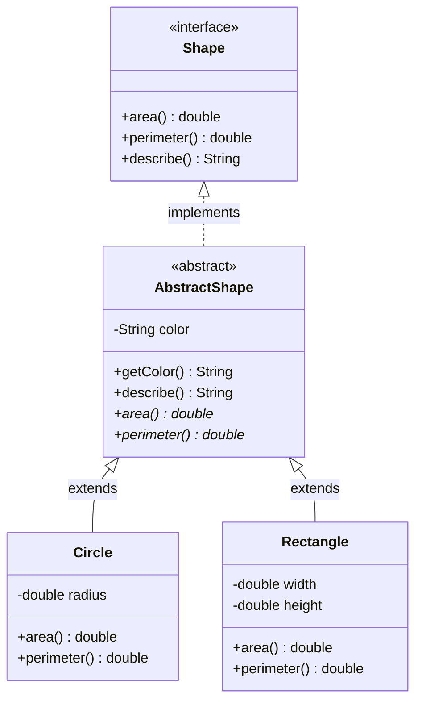
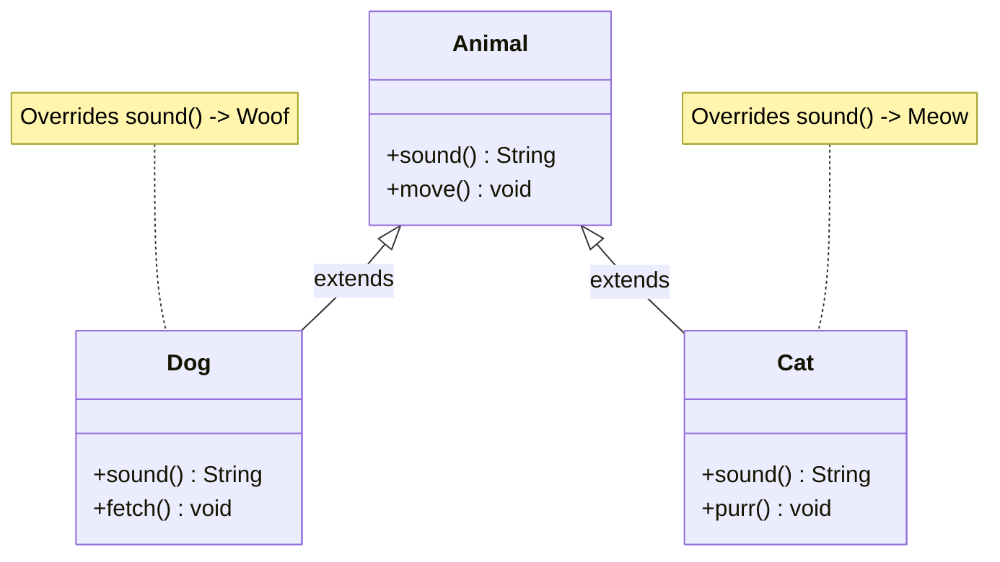
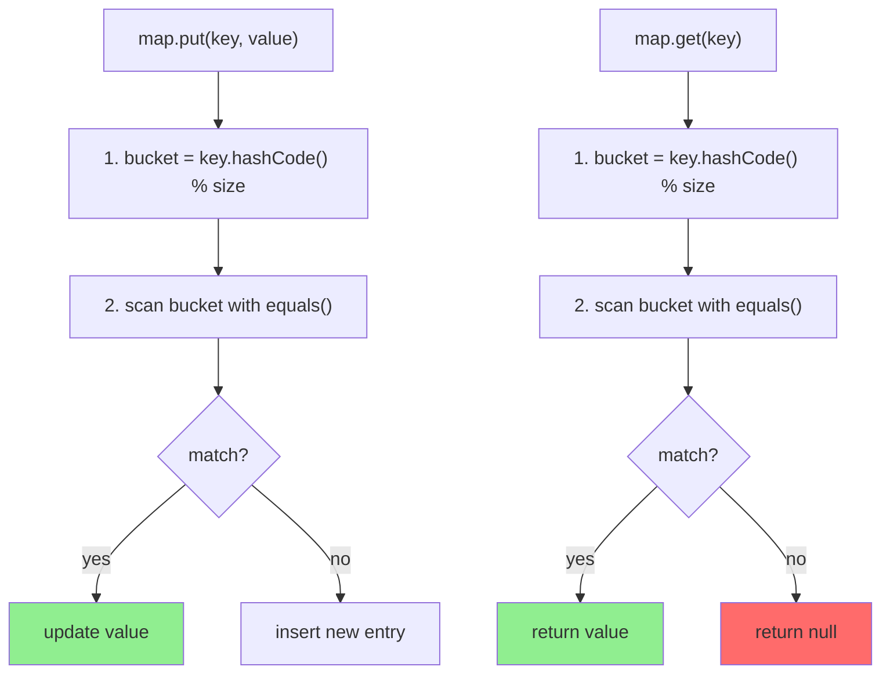

# Java Language - L2 Object Model

| # | Keyword | Difficulty |
| --- | --- | --- |
| 1 | [Classes, Abstract Classes, and Interfaces](#classes-abstract-classes-and-interfaces) | ★★☆ |
| 2 | [Inheritance, Overriding, and the Diamond Problem](#inheritance-overriding-and-the-diamond-problem) | ★★☆ |
| 3 | [The Object Class: equals, hashCode, toString, and clone](#the-object-class-equals-hashcode-tostring-and-clone) | ★★☆ |

---

# Classes, Abstract Classes, and Interfaces

**Interview Weight:** high - Tested in every Java interview above junior
level. The cornerstone of OOP design questions.

---

### 🎯 Model Answer

**30 seconds:**

> Java has three main type abstraction mechanisms: concrete classes
> (full implementation), abstract classes (partial implementation with
> a must-extend contract), and interfaces (pure contract, now also with
> default methods). The rule: use interfaces for behavioral contracts
> (what something does), abstract classes for shared partial implementations
> (what something is), and concrete classes for fully defined objects.

**3 minutes (Senior):**

> The design decision is about coupling and extensibility. Interfaces
> define contracts with zero implementation coupling: they describe what
> a type can do without saying how. Any class can implement multiple
> interfaces. This is Java's answer to multiple inheritance.
>
> Abstract classes provide partial implementations: they define shared
> state and behavior for a family of related types. They can have
> constructors, instance fields, and full method implementations. But
> they impose single inheritance: a class can extend only one abstract class.
>
> The modern view: Java 8 added default methods to interfaces, blurring
> the line. Interfaces can now have implementations. The remaining
> distinction: abstract classes can have instance fields (state) and
> constructors; interfaces cannot have mutable instance state (only
> constants). If you need to share state across subclasses, use an
> abstract class. If you need to define behavior without state, use an
> interface with default methods.
>
> My rule: start with an interface. Add abstract class only when multiple
> implementations need to share non-trivial state or initialization logic.

**Blank Mind Recovery:**

**(1) Restate:** "You are asking about the three type abstractions in
Java - let me cover when to use each."

**(2) First principles:** "Abstraction has two dimensions: what (contract)
and how (implementation). Interface = pure contract. Abstract class =
partial contract + partial implementation. Class = full implementation."

**(3) Bridge:** "A restaurant analogy: Interface = the menu (what you
can order). Abstract class = the chef's playbook (shared recipes that
all chefs follow but can customize). Class = a specific dish on a
specific day."

---

### 📘 Concept Explanation

**What it is:**

Classes, abstract classes, and interfaces are Java's three mechanisms
for defining types with different degrees of implementation completeness
and contractual obligation.

**The problem it solves:**

Code reuse and extensibility require abstraction. A database access
layer should work with any database - defined by an interface. An
audit-aware entity has shared state (createdAt, updatedAt) - defined
in an abstract class. A specific UserEntity implements both.

**How it works:**

```java
// INTERFACE:
public interface Payable {
    // Abstract method (must implement)
    void pay(BigDecimal amount);
    // Default method (can override)
    default String paymentSummary() { return "paid"; }
    // Static method (called on interface, not inherited)
    static Payable noOp() { return amount -> {}; }
    // Constant only (no mutable instance fields)
    int MAX_RETRIES = 3; // implicitly public static final
}

// ABSTRACT CLASS:
public abstract class Auditable {
    // Instance state: interfaces cannot have this
    private LocalDateTime createdAt = LocalDateTime.now();

    // Abstract method: subclass must implement
    public abstract String getEntityType();

    // Concrete method: shared implementation
    public LocalDateTime getCreatedAt() { return createdAt; }
}

// CONCRETE CLASS (implements both):
public class Order extends Auditable implements Payable {
    @Override
    public void pay(BigDecimal amount) { /* impl */ }

    @Override
    public String getEntityType() { return "ORDER"; }
}
// One abstract class + multiple interfaces = valid
// Two abstract classes = COMPILE ERROR (single inheritance)
```

> **Code walkthrough:** The interface Payable shows all three kinds of
> interface members: abstract (must implement), default (can override), and
> static (utility). The abstract class Auditable has an instance field - the
> one thing interfaces cannot have. Order combines both: it extends one
> abstract class and implements one interface. This is the canonical three-
> layer pattern.

**The key insight:**

The critical difference after Java 8 is state. Interfaces cannot have
mutable instance fields (only public static final constants). Abstract
classes can have private instance fields. When multiple implementations
need to share state (not just behavior), abstract class is required.
When they only need to share behavior: interface with default methods.

**When to use it:**

- Interface: defining a contract for different implementations
  (Repository, Comparator, Runnable, EventListener)
- Abstract class: sharing state and initialization across a family
  of related types (AbstractEntity with audit fields, AbstractHandler
  with shared configuration)
- Concrete class: the actual implementation

**When NOT to use it:**

- Do not use abstract classes for types that have no related subtypes
  (use interface instead - more flexible)
- Do not make everything abstract preemptively (YAGNI)
- Do not add state to interfaces by using static fields as mutable
  singletons (anti-pattern)

**Alternatives:**

- Composition over inheritance: instead of abstract class, use a
  concrete helper class injected via constructor
- Sealed interfaces (Java 17): define a closed set of interface
  implementations for exhaustive pattern matching
- Records: immutable value classes without inheritance

**First-principles derivation:**

Abstraction enables polymorphism: code that works with the abstraction
works with any concrete implementation. The three Java types map to
the three answers to "how much of the implementation do you commit to
in this abstraction?" None (interface), Some (abstract), All (class).
The trade-off: more implementation committed = less flexible for callers.

---

### 💻 Code Example

**Example 1: The design decision - interface vs abstract class**

```java
// BAD: abstract class where interface is more appropriate
// Forces single inheritance, no reason to mandate it
abstract class Formatter {
    abstract String format(Object value);
    // No shared state, no constructor - should be an interface!
}

// GOOD: interface is more flexible
interface Formatter {
    String format(Object value);
    default String formatList(List<?> items) {
        return items.stream()
            .map(this::format)
            .collect(Collectors.joining(", "));
    }
}
// Multiple formatters can implement this AND other interfaces

// GOOD: abstract class when state must be shared
abstract class AbstractEntity {
    private final UUID id = UUID.randomUUID();
    private LocalDateTime createdAt = LocalDateTime.now();

    public UUID getId() { return id; }
    public LocalDateTime getCreatedAt() { return createdAt; }

    // Template method: subclass must define display name
    public abstract String getDisplayName();

    // Hook: subclass can optionally override
    protected void beforeSave() {}
}

// Concrete: extends abstract class + implements interface
class UserEntity extends AbstractEntity
        implements Payable, Serializable {
    private String username;

    @Override
    public String getDisplayName() { return username; }

    @Override
    public void pay(BigDecimal amount) { /* impl */ }
}
```

> **Code walkthrough:** The bad Formatter forces callers to subclass it,
> blocking other inheritance. As an interface, Formatter can be combined
> with other interfaces and implemented by records or lambdas. The
> AbstractEntity shows the correct use of abstract class: shared UUID and
> timestamp state that every entity needs, but cannot be shared via interface.
> The Template Method pattern (getDisplayName abstract) forces subclasses to
> provide the display name while the abstract class provides infrastructure.

**Example 2: Default methods and the diamond conflict**

```java
// Two interfaces with potentially conflicting default methods
interface Loggable {
    default void logInfo(String msg) {
        System.out.println("[INFO] " + msg);
    }
}

interface Auditable {
    LocalDateTime getCreatedAt();
    default String auditSummary() {
        return "Created: " + getCreatedAt();
    }
}

// BAD: interfaces with same-named default methods conflict
interface A { default String name() { return "A"; } }
interface B { default String name() { return "B"; } }

class C implements A, B {
    // COMPILE ERROR: inherits unrelated defaults for name()
    // Must override to resolve:
    @Override
    public String name() {
        return A.super.name() + "+" + B.super.name();
    }
}

// GOOD: design interfaces to avoid name collisions
class Service implements Loggable, Auditable {
    private final LocalDateTime createdAt = LocalDateTime.now();

    @Override
    public LocalDateTime getCreatedAt() { return createdAt; }

    void doWork() {
        logInfo("Working...");      // from Loggable
        logInfo(auditSummary());    // from Auditable
    }
}
```

> **Code walkthrough:** Default methods enable interface evolution: adding
> logInfo to Loggable after the fact does not break existing implementors.
> The diamond problem with default methods (class C) requires explicit
> conflict resolution via InterfaceName.super.method() syntax. Java forces
> the programmer to state which default wins. This is different from
> classical multiple inheritance where the conflict may be silently resolved.

---

### 🎓 Answers by Seniority

**Junior / Mid (0-5 years):**

> Interface: defines what methods a class must implement; allows multiple
> implementation. Abstract class: like a class but some methods are
> unimplemented (abstract); provides shared implementation. The rule:
> interface when you have no implementation to share; abstract class when
> you do. A class can implement multiple interfaces but extend only one class.

*Push deeper:* Abstract classes can have constructors (called by subclass
via super()). Interfaces cannot have constructors. This is why sharing
initialization logic requires an abstract class.

---

**Senior / Staff (5+ years):**

> I prefer composition over inheritance for most shared behavior. Abstract
> classes create tight coupling: the subclass inherits the abstract class's
> implementation details. If the abstract class changes, all subclasses are
> affected. An alternative: inject a shared collaborator object (Strategy
> pattern) instead of inheriting from an abstract class. I use abstract
> classes specifically for Template Method pattern and for domain entity
> base classes (shared audit fields). For everything else: interface + composition.

*Push deeper:* Sealed interfaces (Java 17) change the calculus: when the
complete set of implementations is known at design time, use a sealed
interface. This enables exhaustive pattern matching and prevents
uncontrolled subtype proliferation.

---

### ⚠️ Common Misconceptions

| Misconception | Reality | Risk |
| --- | --- | --- |
| "Interface = no implementation" | Since Java 8: default methods provide implementation. Since Java 9: private methods in interfaces. Interfaces can have substantial logic now | Choosing abstract class over interface for historical reasons that no longer apply |
| "Abstract class is faster than interface" | Modern JVM inlines interface method calls for monomorphic call sites. Performance difference is negligible for well-designed code | Premature optimization driving wrong abstraction choice |
| "You can simulate multiple inheritance with abstract classes" | Java enforces single class inheritance. Only multiple interface implementation is supported | Design that requires extending two abstract classes - requires refactoring to composition |

---

### 🚨 Failure Modes and Diagnosis

| Failure | Symptom | Root Cause | Diagnostic | Fix |
| --- | --- | --- | --- | --- |
| Interface default method conflict | Compile error: "inherits unrelated defaults for X()" | Two implemented interfaces both define a default method with the same signature | Compiler error message is clear; identify the two conflicting interfaces | Override the conflicting method; use InterfaceName.super.method() to delegate |
| Abstract class added to existing hierarchy | New abstract class breaks all concrete subclasses (compile errors) | Abstract method added to abstract class without providing default | Compilation failure across all subclasses | Add a default implementation in the abstract class; subclasses can override optionally |

---

### 🎯 Interview Deep-Dive

| Level | Time | Expected Depth |
| --- | --- | --- |
| Junior | 3 min | Difference between class/abstract/interface; when to use each |
| Mid | 5 min | Default methods; diamond problem; design trade-offs |
| Senior | 8 min | Composition vs inheritance; sealed interfaces; framework design |
| Staff | 12 min | API evolution; backward compatibility; module system implications |

---

**Q1** [COMPARISON] [JUNIOR]

"What is the difference between an abstract class and an interface?"

**Answer:**

Both define types that cannot be instantiated directly, but differ
in implementation capabilities and inheritance rules:

```
Feature              Abstract Class  Interface (Java 8+)
-----------------------------------------------------------
Methods              abstract+concrete abstract+default+static
Instance fields      yes              no (static final only)
Constructors         yes              no
Multiple inheritance no (one extends) yes (implements many)
Lambdas              no               yes (functional interface)
```

When to use abstract class: shared state (fields) across related types;
shared initialization; Template Method pattern; "is-a" relationship.

When to use interface: behavioral contract for unrelated types;
multiple inheritance of behavior; lambdas/functional interfaces;
API contracts where implementations may change independently.

Modern rule: prefer interface. Add abstract class only when state must
be shared or constructors are needed.

*What separates good from great:* Java 8+ interfaces can have static
methods (utility methods on the interface namespace) and private methods
(Java 9+, for sharing logic between default methods). The gap between
abstract class and interface is narrower than in Java 7.

---

**Q2** [TRADE-OFF] [MID]

"Why is 'favor composition over inheritance' good advice?"

**Answer:**

Inheritance (especially from abstract classes) creates tight coupling:
the subclass depends on the parent's implementation. Changes to the
parent may unexpectedly break subclasses (the "fragile base class" problem).

```java
// BAD: inheritance for code reuse
class EmailService extends HttpClient {
    void sendEmail(String to, String body) {
        post("/email", buildPayload(to, body));
        // inherits ALL HttpClient methods including dangerous ones
    }
}
// Problem: callers can call emailService.get("/admin")

// GOOD: composition - EmailService uses HttpClient, not is-a
class EmailService {
    private final HttpClient client; // composition

    EmailService(HttpClient client) { this.client = client; }

    void sendEmail(String to, String body) {
        client.post("/email", buildPayload(to, body));
    }
    // Only exposes email operations; HttpClient injected for testing
}
```

Composition advantages:
1. Narrower API: expose only what EmailService should expose
2. Swappable: inject different HttpClient (mock, stub) in tests
3. No fragile base class: HttpClient changes don't affect EmailService
4. Multiple collaborators: inject multiple objects if needed

*What separates good from great:* The Liskov Substitution Principle (LSP)
is the test for valid inheritance: if you cannot substitute the subclass
wherever the parent is expected without breaking the program, the
inheritance is wrong. A Square extending Rectangle violates LSP because
a Square cannot behave as a Rectangle (setting width independently).

---

**Q3** [CONCEPTUAL] [MID]

"What are default methods in interfaces and why were they added?"

**Answer:**

Default methods are interface methods with a body, marked with `default`.
They were added in Java 8 to solve the interface evolution problem.

Without default methods, adding a method to an interface broke all
existing implementations. The Java Collections framework could not
evolve without breaking all user code.

```java
// Added in Java 8 without breaking existing List implementations:
interface Collection<E> {
    default Stream<E> stream() {
        return StreamSupport.stream(spliterator(), false);
    }
    default void forEach(Consumer<? super E> action) {
        Objects.requireNonNull(action);
        for (E e : this) { action.accept(e); }
    }
}
// ArrayList, LinkedList, etc. did NOT need to be updated
```

Rules: (1) Class method always wins over interface default. (2) More
specific interface wins over less specific. (3) If two unrelated
interfaces conflict: must override.

*What separates good from great:* Default methods enable "mixin interfaces":
add behaviors to classes without changing their hierarchy. But they are not
a full replacement for multiple inheritance: default methods cannot access
instance state (no fields). Mixins that need state still require composition.

---

**Q4** [DEBUGGING] [MID]

"A class implements two interfaces with the same default method name.
What happens and how do you fix it?"

**Answer:**

The compiler reports an error: the class inherits two unrelated defaults.

```java
interface A { default String greet() { return "Hello from A"; } }
interface B { default String greet() { return "Hello from B"; } }

// COMPILE ERROR: class C inherits unrelated defaults for greet()
class C implements A, B {
    // Must override to resolve:
    @Override
    public String greet() {
        return A.super.greet(); // explicitly select A's default
        // OR combine: A.super.greet() + " | " + B.super.greet()
        // OR new implementation: return "Hello from C";
    }
}
```

*What separates good from great:* If a parent CLASS and an interface both
provide a method, the class always wins - no override needed, no compile
error. Class P has greet(); class D extends P and implements interface A
(with default greet()): P's greet() wins silently.

---

**Q5** [PRODUCTION] [SENIOR]

"How would you design an interface for a repository layer that
needs to evolve over time without breaking clients?"

**Answer:**

Four patterns for backward-compatible evolution:

Pattern 1 - Default methods for additive behavior:
```java
interface UserRepository {
    User findById(Long id);
    void save(User user);

    // New method: default that throws until overridden
    default List<User> findByEmail(String email) {
        throw new UnsupportedOperationException(
            "Override findByEmail in your implementation");
    }
}
```

Pattern 2 - Extend interface (additive versioning):
```java
interface UserRepositoryV2 extends UserRepository {
    Page<User> findAll(Pageable pageable);
}
// Old code uses UserRepository; new code uses V2
```

Pattern 3 - Capability detection via marker interface:
```java
interface BatchCapable { void saveAll(Collection<?> items); }
if (repo instanceof BatchCapable b) { b.saveAll(list); }
```

Recommended: default methods for optional new capabilities (with an
UnsupportedOperationException default). Document the version added.

*What separates good from great:* Semantic versioning: adding a default
method = minor (non-breaking). Adding an abstract method = major (breaking).

---

**Q6** [COMPARISON] [MID]

"When should you use a sealed interface?"

**Answer:**

Sealed interfaces restrict which classes can implement them. Use when
the complete set of subtypes is known and fixed.

```java
sealed interface Shape permits Circle, Rectangle, Triangle {}
record Circle(double radius) implements Shape {}
record Rectangle(double w, double h) implements Shape {}
record Triangle(double a, double b, double c) implements Shape {}

// Benefit: exhaustive pattern matching
double area(Shape s) {
    return switch (s) {
        case Circle c    -> Math.PI * c.radius() * c.radius();
        case Rectangle r -> r.w() * r.h();
        case Triangle t  -> triangleArea(t);
        // No default needed: compiler knows all cases
    };
}
```

Use sealed when: variants are part of the API design; compile-time
exhaustiveness is needed; modeling fixed-variant domain types.

Do NOT use when: third-party code should add implementations.

*What separates good from great:* Sealed interface + records is Java's
equivalent of algebraic data types (Haskell sum types): a closed set
of variants, each with its own data.

---

**Q7** [CONCEPTUAL] [JUNIOR]

"Can an interface have a constructor?"

**Answer:**

No. Interfaces cannot have constructors because interfaces cannot be
instantiated. A constructor's purpose is to initialize an instance.

```java
interface Printable {
    // COMPILE ERROR: interfaces cannot have constructors
    // Printable() { ... }
    void print();
}
```

If shared initialization is needed across implementations, use:
1. Abstract class with constructor (subclass calls super())
2. Static factory method that creates and initializes
3. init() default method as an initialization hook

Note: anonymous class instances look like constructor calls but are
not interface constructors: `new Runnable() { ... }` creates an
anonymous CLASS that implements Runnable.

*What separates good from great:* This question tests understanding of
the instantiation model. Interfaces define a contract; the implementation
class handles initialization. The interface has no instance to initialize.

---

**Q8** [BEHAVIORAL] [MID]

"Tell me about a time you refactored code from inheritance to composition."

**Answer:**

> At [company], we had an AbstractBaseService extended by 12 service classes.
> It contained logging, metrics, caching, and retry logic. Over time some
> services needed caching but not retries; others needed retries but no caching.
> The abstract class was all-or-nothing.
>
> I introduced focused interfaces (LoggingSupport, CachingSupport, RetrySupport)
> with default implementations delegating to injected collaborators. Services
> that needed caching injected a CacheManager; those that did not simply omitted
> the interface. The abstract class was removed.
>
> Impact: 30% fewer lines in service classes (no unused overrides), clearer test
> setups (inject only relevant mocks), and two new services implemented without
> touching shared infrastructure.

*What separates good from great:* The testing improvement: composition allows
injecting only the mocks relevant to each test. With an abstract class, every
test inherits all abstract class behavior, making tests broader than necessary.

---

**Q9** [TRADE-OFF] [SENIOR]

"When does using an abstract class violate the Open/Closed principle?"

**Answer:**

The Open/Closed Principle: software entities should be open for extension
but closed for modification.

Abstract classes violate OCP when new behavior requires modifying the
abstract class rather than adding a new subclass:

```java
// BAD: every new payment type requires modifying this class
abstract class PaymentProcessor {
    void postProcess(Payment p) {
        if (p instanceof CreditCardPayment) { sendReceipt(p); }
        else if (p instanceof BankTransfer) { notifyBank(p); }
        // Adding new type = modify this class = OCP VIOLATION
    }
}

// GOOD: Template Method lets each subclass define postProcess
abstract class PaymentProcessor {
    protected abstract void postProcess(Payment p);
}
class CreditCardProcessor extends PaymentProcessor {
    @Override
    protected void postProcess(Payment p) { sendReceipt(p); }
}
// New payment type = add new class; no modification needed
```

*What separates good from great:* OCP is about the direction of change.
The test: "when I add a new variant, do I modify the abstract class or
add a new subclass?" If modifying: OCP violation.

---

### ⚖️ Comparison Table

| Feature | Interface | Abstract Class | Concrete Class |
| --- | --- | --- | --- |
| Instantiate directly | No | No | Yes |
| Instance fields | No (static final only) | Yes | Yes |
| Constructors | No | Yes | Yes |
| Multiple inheritance | Yes (implements many) | No (extends one) | No |
| Default methods (Java 8+) | Yes | N/A (use concrete methods) | N/A |
| Use for lambda | Yes (functional interface) | No | No |
| Sealed (Java 17) | Yes | Yes | N/A |

---

### 🏛️ System Design

*(Omit: ★★☆ keyword. System Design is required for ★★★ keywords.)*

---

### 📊 Diagram

```
JAVA TYPE HIERARCHY:

Interface           Abstract Class      Concrete Class
(contract only)     (partial impl)      (full impl)
  |                     |                   |
  +-- abstract methods  +-- instance fields |
  +-- default methods   +-- constructors    |
  +-- static methods    +-- abstract methods|
  +-- private methods   +-- concrete methods|
      (Java 9+)                             |
  Can implement many    Can extend one      |
                                            |
                       Instantiable: only Concrete Class
```



> **Diagram walkthrough:** The three-layer hierarchy shows each type's role.
> Shape (interface) defines the pure contract: what any shape can do. AbstractShape
> (abstract class) implements the interface partially and adds shared infrastructure:
> a color field (state - only abstract class can have this) and a concrete describe()
> method. Circle and Rectangle extend AbstractShape, providing shape-specific area
> and perimeter calculations. The pattern demonstrates: interface for contract,
> abstract class for shared state + partial impl, concrete class for specific behavior.

---

---

# Inheritance, Overriding, and the Diamond Problem

**Interview Weight:** high - Tests understanding of Java's polymorphism
and nuances of method dispatch. Frequently asked with code to trace.

---

### 🎯 Model Answer

**30 seconds:**

> Java supports single class inheritance: a class extends exactly one parent.
> Method overriding replaces the parent's implementation with the child's at
> runtime. The diamond problem - two parents sharing a common ancestor -
> occurs with default methods when a class implements two interfaces that
> both override a default method from a common ancestor. Java resolves it
> by requiring the implementing class to explicitly override.

**3 minutes (Senior):**

> Method overriding is the mechanism that makes polymorphism work. When you
> call a method on a reference, the JVM dispatches to the runtime type's
> implementation, not the declared type's. This is dynamic dispatch via the vtable.
>
> The key rules: the method signature must match exactly; the return type may
> be covariant (subtype of parent's return type); the access level may only be
> widened; and the throws clause may only narrow. @Override annotation is
> mandatory-in-spirit - it catches signature mismatches at compile time.
>
> Java prevents class-level diamond inheritance by enforcing single class
> inheritance. The diamond problem re-emerges with default methods. The JVM's
> resolution order: class > specific interface > general interface.

**Blank Mind Recovery:**

**(1) Restate:** "Inheritance and overriding - method dispatch, override
rules, and the diamond problem."

**(2) First principles:** "Overriding enables polymorphism: one interface,
multiple implementations. The JVM picks the right implementation at runtime
based on the actual object type."

**(3) Bridge:** "A business card says 'Engineer' (declared type) but the
actual role is 'Backend Engineer' (runtime type). Technical questions get
Backend Engineer answers, not generic Engineer answers."

---

### 📘 Concept Explanation

**What it is:**

Inheritance allows a class to extend another, gaining its fields and methods.
Overriding replaces an inherited method's implementation. Dynamic dispatch
selects the implementation based on the runtime type of the object.

**The problem it solves:**

Without overriding, polymorphic code would require explicit type checks
everywhere. Overriding is the mechanism that makes "one reference, many
behaviors" work in Java.

**How it works:**

```java
// DYNAMIC DISPATCH:
class Animal { String sound() { return "..."; } }
class Dog extends Animal {
    @Override String sound() { return "Woof"; }
}
class Cat extends Animal {
    @Override String sound() { return "Meow"; }
}

Animal a = new Dog(); // declared: Animal, runtime: Dog
a.sound();  // "Woof" -- JVM dispatches to Dog.sound()

// OVERRIDING RULES:
// 1. Same name + same parameter types
// 2. Return: same or covariant (subtype)
// 3. Access: same or wider (cannot reduce)
// 4. Exceptions: same or fewer, same or more specific

// DIAMOND WITH DEFAULT METHODS:
interface Root {
    default String name() { return "Root"; }
}
interface A extends Root {
    @Override default String name() { return "A"; }
}
interface B extends Root {
    @Override default String name() { return "B"; }
}
class C implements A, B {
    // COMPILE ERROR: inherits unrelated defaults for name()
    @Override
    public String name() { return A.super.name(); }
}
```

> **Code walkthrough:** The Animal/Dog/Cat example shows dynamic dispatch:
> the reference type is Animal but the runtime dispatch goes to Dog.sound().
> The diamond example shows why Java requires explicit resolution: both A
> and B override Root's default, so C inheriting from both has two candidates.
> Java makes this a compile error rather than silently picking one.

**The key insight:**

Dynamic dispatch is implemented via the vtable: each class has a table of
method pointers. Overriding an inherited method replaces the vtable entry.
JIT optimizes monomorphic call sites (one runtime type) to direct calls via
devirtualization. This is why Java virtual dispatch has near-zero overhead
in practice for well-structured code.

**When to use it:**

- Inheritance: genuine "is-a" relationship satisfying Liskov Substitution
- Override: whenever a subclass needs to specialize parent behavior
- @Override annotation: always - catches signature mismatches at compile time

**When NOT to use it:**

- Do not inherit just for code reuse (prefer composition)
- Do not override without calling super when the parent enforces invariants
- Do not use inheritance to change semantics (Square-Rectangle violates LSP)

**Alternatives:**

- Delegation: use a collaborator object instead of overriding
- Template Method: define the skeleton in the parent, override specific steps
- Strategy: externalize the varying behavior as an injected object

**First-principles derivation:**

Polymorphism requires a consistent mechanism for "same method call, different
behavior." The JVM implements this via the vtable: per-class array of method
pointers. Inheritance fills vtable entries from the parent; overriding
replaces specific entries. Every virtual method call is a vtable lookup at
the mechanistic level.

---

### 💻 Code Example

**Example 1: Virtual dispatch pitfall in constructors**

```java
// BAD: calling overridable method in constructor
class Animal {
    String name;
    Animal() {
        // Calls SUBCLASS's name() if overridden
        this.name = name(); // BAD: virtual dispatch in constructor
    }
    String name() { return "Animal"; }
}
class Dog extends Animal {
    String breed;
    Dog(String breed) {
        super(); // calls Animal() which calls name() -> Dog.name()
        this.breed = breed;
    }
    @Override
    String name() {
        return "Dog:" + breed; // breed is null at this point!
    }
}
Dog d = new Dog("Labrador");
// d.name is "Dog:null" (breed was null when name() was called)

// GOOD: avoid virtual method calls in constructors
class Animal {
    Animal() {} // no virtual method calls
    String name() { return "Animal"; }
}
class Dog extends Animal {
    private final String breed;
    Dog(String breed) { this.breed = breed; }
    @Override
    String name() { return "Dog:" + breed; }
}
```

> **Code walkthrough:** Calling an overridable method in a constructor is a
> classic Java pitfall. The subclass object is not yet fully initialized when
> the parent constructor runs, but the JVM dispatches to the subclass's override.
> The subclass fields are in their default state (null/0). The fix: keep
> constructors free of virtual method calls. final and private methods are safe
> because they cannot be overridden.

**Example 2: Covariant return types**

```java
// BAD: callers must cast
class Container {
    Object get() { return null; }
}
class StringContainer extends Container {
    @Override
    Object get() { return "hello"; }
}
String s = (String) new StringContainer().get(); // cast required

// GOOD: covariant return (Java 5+)
class StringContainer extends Container {
    @Override
    String get() { return "hello"; } // String is-a Object: valid
}
String s = new StringContainer().get(); // no cast needed

// The JVM uses a bridge method behind the scenes:
// StringContainer has TWO get() methods at bytecode level:
//   String get()  <- actual implementation
//   Object get()  <- BRIDGE: calls String get(), used for Container refs
```

> **Code walkthrough:** Covariant return types allow subclasses to narrow
> the return type, eliminating casts at call sites. The JVM implements this
> with a synthetic bridge method: the bridge Object get() delegates to the
> real String get(), maintaining backward compatibility for Container-typed
> references while providing the precise type for StringContainer references.

---

### 🎓 Answers by Seniority

**Junior / Mid (0-5 years):**

> Inheritance: extends one parent; inherits fields and methods. Overriding:
> provides new implementation for a parent method; JVM dispatches to runtime
> type. @Override verifies the signature. Diamond problem with default methods:
> must override to resolve. Always use @Override - it catches signature
> mismatches before runtime.

*Push deeper:* Static methods are hidden (not overridden). Calling a static
method through a parent reference calls the parent's static method, regardless
of runtime type. This is why static methods do not participate in polymorphism.

---

**Senior / Staff (5+ years):**

> I know the full override contract: covariant returns, exception narrowing,
> access widening, and bridge methods. I use @Override always. For deep
> hierarchies, I apply LSP as the validity test: if the subclass cannot honor
> the parent's contract in all contexts, the inheritance is wrong and must be
> redesigned.

*Push deeper:* JIT devirtualization: monomorphic call sites (one implementation)
are inlined completely - zero dispatch overhead. Bimorphic (two implementations):
fast two-way branch. Megamorphic (3+ implementations): vtable lookup. This is
why interfaces with many implementations can have lower throughput in very hot paths.

---

### ⚠️ Common Misconceptions

| Misconception | Reality | Risk |
| --- | --- | --- |
| "Overloading is the same as overriding" | Overloading: same name, different parameters - resolved at compile time. Overriding: same name AND parameters - resolved at runtime. @Override on an overloaded method = compile error | Thinking a method with different parameter types overrides the parent |
| "private methods can be overridden" | private methods are not polymorphic. Same-name private method in subclass is a new, independent method (hiding, not overriding) | Expecting polymorphic dispatch for private methods |
| "final methods improve performance significantly" | Modern JIT devirtualizes monomorphic call sites without final. final is primarily a design statement | Using final everywhere for "performance" |

---

### 🚨 Failure Modes and Diagnosis

| Failure | Symptom | Root Cause | Diagnostic | Fix |
| --- | --- | --- | --- | --- |
| Overloaded instead of overridden | Parent method still called despite "override" | Parameter types differ from parent; @Override would have caught it | Add @Override; compiler reports "method does not override" | Match parent's exact signature; add @Override |
| NPE from overridable method in constructor | NullPointerException during object construction | Subclass field not initialized when parent constructor calls virtual method | Stack trace shows constructor calling overridden method; fields are null | Remove virtual calls from constructors |

---

### 🎯 Interview Deep-Dive

| Level | Time | Expected Depth |
| --- | --- | --- |
| Junior | 3 min | Override rules; @Override; diamond problem basics |
| Mid | 5 min | Covariant returns; bridge methods; hiding vs overriding |
| Senior | 8 min | LSP; vtable dispatch; JIT devirtualization |
| Staff | 12 min | API design with inheritance; sealed classes; OCP |

---

**Q1** [CONCEPTUAL] [JUNIOR]

"What are the rules for overriding a method in Java?"

**Answer:**

To override a method:

1. Same method name (exact match)
2. Same parameter list (exact types in exact order)
3. Return type: same OR a covariant subtype (Java 5+)
4. Access modifier: same or more permissive (widening only)
5. Throws clause: fewer exceptions or more specific
6. Not static (static methods are hidden, not overridden)
7. Not final (final methods cannot be overridden)
8. Not private (private methods are not polymorphic)

```java
class Parent {
    protected Number getValue() throws IOException { return 1; }
}
class Child extends Parent {
    @Override
    // public (wider) Integer (covariant) throws FileNotFoundException (narrower)
    public Integer getValue() throws FileNotFoundException { return 2; }
}
```

The @Override annotation is not required but strongly recommended:
it causes a compile error if the method does not actually override,
catching signature mismatches early.

*What separates good from great:* Covariant return types enable fluent
builder APIs:
```java
class Builder { Builder withX(int x) { ...; return this; } }
class SpecialBuilder extends Builder {
    @Override SpecialBuilder withX(int x) { ...; return this; }
    // Callers keep SpecialBuilder type without casting
}
```

---

**Q2** [CONCEPTUAL] [MID]

"What is the Liskov Substitution Principle and how does it relate
to inheritance?"

**Answer:**

LSP (Barbara Liskov, 1987): if S is a subtype of T, then objects of
type T may be replaced with objects of type S without altering correctness.

In Java: every place that uses a Parent reference should work correctly
when a Child reference is used instead.

Classic violation - Rectangle/Square:
```java
class Rectangle {
    int width, height;
    void setWidth(int w)  { this.width  = w; }
    void setHeight(int h) { this.height = h; }
    int area() { return width * height; }
}
class Square extends Rectangle {
    @Override void setWidth(int w) {
        this.width = w; this.height = w;
    }
    @Override void setHeight(int h) {
        this.width = h; this.height = h;
    }
}

// LSP VIOLATION:
void doubleWidth(Rectangle r) {
    int originalHeight = r.height;
    r.setWidth(r.width * 2);
    assert r.area() == r.width * originalHeight; // FAILS for Square
    // Square changes height when width is set
}
```

Fix: make Rectangle immutable, or model Square and Rectangle as separate
types without inheritance.

*What separates good from great:* LSP applies to ALL contracts, not just
method signatures. Postconditions, preconditions, and invariants must all
be respected. Square's invariant (width == height) violates Rectangle's
postcondition (width and height are independent).

---

**Q3** [COMPARISON] [MID]

"What is the difference between method overriding and method hiding?"

**Answer:**

Overriding: instance methods, dynamic dispatch (runtime type).
Hiding: static methods, static dispatch (declared type).

```java
class Parent {
    static void staticM()  { System.out.println("Parent static"); }
    void instanceM()       { System.out.println("Parent instance"); }
}
class Child extends Parent {
    static void staticM()  { System.out.println("Child static"); }
    @Override
    void instanceM()       { System.out.println("Child instance"); }
}

Parent obj = new Child();
obj.staticM();   // "Parent static" (hiding: declared type)
obj.instanceM(); // "Child instance" (overriding: runtime type)
```

Static methods belong to the class, not instances. No "this" reference
means no runtime dispatch. The compiler resolves static calls at compile
time based on the declared type.

*What separates good from great:* Field hiding works the same as method
hiding: parent and child fields with the same name are resolved by the
declared type, not the runtime type. This is never intended and a common
source of confusion in inheritance hierarchies.

---

**Q4** [DEBUGGING] [MID]

"You expect a subclass method to be called but the parent's method
runs. What are the causes?"

**Answer:**

Five causes in order of likelihood:

1. Overloaded instead of overridden (wrong parameter types):
```java
class Parent { void process(String s) { ... } }
class Child extends Parent {
    void process(Object s) { ... } // OVERLOADS, does not override!
}
// Fix: add @Override -> compiler catches this
```

2. The method is static (hiding, not overriding):
   Called via a Parent reference -> Parent's static method runs.

3. The method is final in the parent:
   Cannot override. Fix: remove final (if you own it) or use composition.

4. Called from the parent constructor:
   The subclass fields are not yet initialized when super() runs.

5. Wrong signature (typo):
   `void process(String s)` vs `void process(string s)` (different types).

Diagnosis: add @Override to the child method. If it does not compile,
the signature does not match the parent.

*What separates good from great:* Cause 4 is subtlest: the parent constructor
IS calling the overridden method, but the child's fields are null. This
produces NPE or unexpected default values with no obvious connection to
the virtual dispatch in the constructor.

---

**Q5** [CONCEPTUAL] [JUNIOR]

"What is the diamond problem and how does Java handle it?"

**Answer:**

The diamond problem: a class inherits from two paths that share a common
ancestor with the same method.

```
    Root
   /    \
  A      B
   \    /
     C
```

Java's solutions:

Class inheritance: Java prevents class-level diamond by requiring single
class inheritance. No two-parent class inheritance is possible.

Interface default methods re-introduce the diamond:
```java
interface Root { default void m() { print("Root"); } }
interface A extends Root { @Override default void m() { print("A"); } }
interface B extends Root { @Override default void m() { print("B"); } }

class C implements A, B {
    // COMPILE ERROR: inherits unrelated defaults for m()
    @Override
    public void m() { A.super.m(); } // must explicitly resolve
}
```

If only one of A, B overrides: the more specific override wins (no conflict).
If neither overrides: Root's default is used (no conflict).

*What separates good from great:* The class > specific interface > general
interface resolution order. If a concrete class P provides m(), any class
extending P gets P's m() - no conflict, even if A and B both have conflicting
defaults.

---

**Q6** [TRADE-OFF] [SENIOR]

"What are the downsides of deep inheritance hierarchies?"

**Answer:**

Deep inheritance (4+ levels) creates maintenance problems:

1. Fragile base class: changes to a base class ripple through all
   descendants unexpectedly.
2. Constructor explosion: every added field in base class requires
   updating all constructors in all subclasses.
3. Test complexity: testing a level-5 class requires setting up all
   parent class invariants.
4. Navigation: understanding a method requires tracing through 4 parents.
5. Coupling to implementation: subclasses depend on the parent's
   private implementation details.

```java
// BAD: 5-level hierarchy
// BaseEntity -> AuditableEntity -> VersionedEntity
//     -> DomainEntity -> UserEntity

// GOOD: flat hierarchy with composition
class UserEntity {
    private final AuditInfo audit;    // composed, not inherited
    private final VersionInfo version;
    // Owns only what's specific to User
}
```

Rule: 2-level hierarchies (BaseEntity -> UserEntity) are acceptable.
Beyond 3: code smell. Consider composition.

*What separates good from great:* The "yo-yo problem": to understand
a method's behavior, you trace up and down the hierarchy. This yo-yo
navigation is a primary source of bugs in object-oriented codebases.

---

**Q7** [PRODUCTION] [SENIOR]

"How does method dispatch affect performance in hot paths?"

**Answer:**

JIT dispatch optimization by call site shape:

Monomorphic (one implementation): JIT inlines completely - zero overhead.
Bimorphic (two implementations): fast two-way branch - ~1 ns overhead.
Megamorphic (3+ implementations): vtable lookup - ~4-8 ns overhead.

```java
// Megamorphic impact: serialization, rendering, format pipelines
// where many different types pass through the same call site
for (Shape shape : shapes) {
    shape.draw(); // if shapes has 10+ types: megamorphic
}
// In tight loops at millions/sec: can be measurable
// Profile with async-profiler --events itimer
// vtable dispatch shows as overhead in the flame graph
```

For most application code: invisible. Matters only in:
- Tight loops (millions of calls/second)
- Hot serialization/deserialization paths
- High-frequency event processing

*What separates good from great:* JIT inlining threshold: methods larger
than ~35 bytecodes are not inlined by default. Small methods (accessors,
simple wrappers) always inline; large methods never do. This is why Java
accessor methods have zero overhead in production.

---

**Q8** [BEHAVIORAL] [MID]

"When have you used inheritance effectively in a production system?"

**Answer:**

> At [company], we had 20+ REST controllers needing consistent behavior:
> request tracing (correlationId in MDC), rate limit checks, and input
> validation. I considered an abstract class with automatic before/after hooks,
> but recognized this would couple all controllers to my infrastructure choices.
>
> Instead, I created a thin BaseController with three protected final utility
> methods: log(String message) delegating to the MDC logger, validateRequest(Request r)
> throwing on invalid input, and recordMetric(String name). Controllers that
> wanted consistent behavior called these methods explicitly.
>
> Result: consistent logging and validation across controllers, minimal coupling
> (controllers chose when to call), and clear test isolation (no inherited side effects).

*What separates good from great:* Noting that even good inheritance should
be evaluated periodically. When a new controller needs different logging,
the inheritance becomes a constraint - at that point, switching to composition
(inject a Logger collaborator) becomes the right choice.

---

**Q9** [TRADE-OFF] [SENIOR]

"How do sealed classes change the trade-offs of inheritance?"

**Answer:**

Sealed classes (Java 17) add a third option between open inheritance
and final: only the explicitly listed classes can extend.

```java
sealed class Result<T> permits Success, Failure, Pending {
    abstract T getValue();
}
final class Success<T> extends Result<T> {
    @Override T getValue() { return value; }
}
final class Failure<T> extends Result<T> {
    @Override T getValue() { throw new RuntimeException(error); }
}
final class Pending<T> extends Result<T> {
    @Override T getValue() { return null; }
}

// Exhaustive pattern matching:
String label = switch (result) {
    case Success<T> s -> "OK: " + s.getValue();
    case Failure<T> f -> "FAIL: " + f.getMessage();
    case Pending<T> p -> "PENDING";
    // No default: compiler knows all cases
};
```

Sealed vs open: sealed gives exhaustive pattern matching and prevents
unexpected third-party subtypes; open allows extension by clients.

Choose sealed when the hierarchy models a domain concept with a fixed
set of variants (HTTP response, payment result, AST node).

*What separates good from great:* Adding a new variant to a sealed hierarchy
is a coordinated change: every switch over the sealed type must handle the
new case or add a default. This makes extension planned and visible across
the codebase.

---

### ⚖️ Comparison Table

| Mechanism | Dispatch | Polymorphic? | Override/Hide? | Mockable? |
| --- | --- | --- | --- | --- |
| Instance method override | Runtime (vtable) | Yes | Override | Yes (Mockito) |
| Static method | Compile time | No | Hide (not override) | With mockStatic() |
| final method | Compile time | No | Cannot override | No |
| private method | Compile time | No | Hide (new method) | Not needed |
| default method override | Runtime | Yes | Override | Yes |

---

### 🏛️ System Design

*(Omit: ★★☆ keyword. System Design is required for ★★★ keywords.)*

---

### 📊 Diagram

```
METHOD DISPATCH (vtable):

Declared: Animal    Runtime: Dog
  Animal vtable       Dog vtable
  +----------+       +----------+
  | sound()  |------>| Dog.sound|  (overridden)
  | move()   |       | Dog.move |  (overridden)
  | sleep()  |       | Animal.sleep (inherited)
  +----------+       +----------+

DIAMOND (default methods):
       Root.name() [default]
          /         \
       A.name()   B.name()  (both override)
          \         /
          C.name()
          MUST override to resolve
```



> **Diagram walkthrough:** The vtable model shows how method dispatch works at
> the JVM level. Each class has its own vtable (method pointer table). Dog's vtable
> entry for sound() points to Dog.sound() (the override). An Animal reference to a
> Dog object uses Dog's vtable for virtual dispatch, returning "Woof". The diamond
> diagram shows why Java requires explicit resolution: when A and B both override
> Root's default, C inherits two conflicting implementations. Java's rule: class
> method > specific interface override > general interface default. If a class
> provides the method, it always wins without requiring an explicit override.

---

---

# The Object Class: equals, hashCode, toString, and clone

**Interview Weight:** critical - Asked in nearly every Java interview.
The equals/hashCode contract is one of the most common sources of production bugs.

---

### 🎯 Model Answer

**30 seconds:**

> Every Java class inherits from Object. The four methods to know: equals()
> (logical equality; default compares references), hashCode() (must be consistent
> with equals: equal objects must have equal hash codes), toString() (default
> is useless; always override for debugging), and clone() (avoid; use copy
> constructors instead). The critical rule: if you override equals(), you must
> override hashCode() with the same fields.

**3 minutes (Senior):**

> The equals/hashCode contract is the most important thing to get right in Java.
> If two objects are equal (a.equals(b) == true), they must have the same hash
> code. This is required for correct behavior of HashMap, HashSet, and any
> hash-based collection.
>
> The classic bug: override equals() but forget hashCode(). The object works
> with .equals() comparisons but fails silently in HashSet (duplicate elements
> stored) and HashMap (key not found after put). The correct implementation:
> use the same fields in both, using Objects.equals() for null-safe field
> comparison and Objects.hash() for hashCode.
>
> For modern Java: use a record (Java 16+) which generates correct equals and
> hashCode automatically. For toString(): always override to include key fields.
> For clone(): avoid it - Java's Cloneable mechanism is broken by design. Use
> copy constructors or factory methods.

**Blank Mind Recovery:**

**(1) Restate:** "Object class methods - let me cover the equals/hashCode
contract, toString, and why clone should be avoided."

**(2) First principles:** "Every object needs to define what 'equal' means
(equals), how to use it in hash structures (hashCode), how to display it
(toString), and how to copy it (clone or copy constructor)."

**(3) Bridge:** "equals/hashCode are like a person's name and employee ID.
Two people with the same name (equals) must have the same ID (hashCode) for
HR lookup systems to work. Different IDs can coincidentally share a name
(hash collision - that's OK)."

---

### 📘 Concept Explanation

**What it is:**

java.lang.Object is the root of all Java class hierarchies. Its methods
define the basic contracts for identity, equality, hashing, display, and
copying.

**The problem it solves:**

Collections like HashMap and HashSet need a consistent way to determine
equality and bucket objects. Without the equals/hashCode contract, these
fundamental data structures break silently.

**How it works:**

```java
// EQUALS CONTRACT (5 properties):
// 1. Reflexive:  a.equals(a) == true
// 2. Symmetric:  a.equals(b) == b.equals(a)
// 3. Transitive: a.equals(b) && b.equals(c) => a.equals(c)
// 4. Consistent: same result on repeated calls (if state unchanged)
// 5. Null-safe:  a.equals(null) == false (never NPE)

// HASHCODE CONTRACT:
// If a.equals(b) THEN a.hashCode() == b.hashCode()
// NOT required: same hashCode => equals (collisions are fine)

// HASHMAP OPERATION:
// put(key, value):
//   1. bucket = key.hashCode() % arraySize
//   2. In bucket: equals() to find matching entry
// get(key):
//   1. bucket = key.hashCode() % arraySize (must match put!)
//   2. equals() to find the right entry
```

> **Code walkthrough:** The HashMap two-step lookup (hashCode then equals)
> makes the contract clear: hashCode finds the bucket; equals confirms the match
> within the bucket. If equal objects have different hash codes, get() searches
> a different bucket than put() used - the entry is effectively lost.

**The key insight:**

The hashCode contract is a one-way implication: equals implies same hashCode.
The minimum valid hashCode: always return a constant. Valid (no violations),
but terrible performance (all objects in one bucket, O(n) every lookup).
The optimal: fast computation, minimal collisions.

**When to use it:**

- Override equals/hashCode: whenever the class is used as a Map key or
  in a Set, or when logical equality (same field values) matters
- Override toString: always - for logging and debugging
- clone(): never - use copy constructors

**When NOT to use it:**

- Do not include mutable fields in hashCode if objects will be used in
  sets/maps while those fields change (mutable key trap)
- Do not include all fields when only some define identity (entity pattern)
- Do not call super.equals() (Object's) when defining value equality

**Alternatives:**

- Records (Java 16+): auto-generated equals, hashCode, toString based on
  all components - correct by construction
- Lombok @EqualsAndHashCode: annotation-driven generation
- Objects.equals() and Objects.hash(): utilities for manual implementation

**First-principles derivation:**

A hash map needs two things to find an entry: the bucket (from hashCode)
and the key match (from equals). If equal objects hash to different buckets,
put() and get() use different buckets - get() returns null even though the
key was stored. The contract prevents this: equal objects hash to the same
bucket, making the match findable.

---

### 💻 Code Example

**Example 1: The classic equals/hashCode bug**

```java
// BAD: overrides equals but NOT hashCode
class Money {
    private final BigDecimal amount;
    private final String currency;

    @Override
    public boolean equals(Object o) {
        if (this == o) return true;
        if (!(o instanceof Money m)) return false;
        return amount.equals(m.amount)
            && currency.equals(m.currency);
    }
    // NO hashCode override! Inherits Object.hashCode() (identity-based)
}

Set<Money> prices = new HashSet<>();
prices.add(new Money(new BigDecimal("10.00"), "USD"));
prices.add(new Money(new BigDecimal("10.00"), "USD")); // duplicate?
System.out.println(prices.size()); // 2! Should be 1.
// Two equal objects have different identity-based hash codes
// -> different buckets -> no duplicate detection

Map<Money, String> labels = new HashMap<>();
Money key = new Money(new BigDecimal("10.00"), "USD");
labels.put(key, "Ten dollars");
Money lookup = new Money(new BigDecimal("10.00"), "USD");
labels.get(lookup); // null! (different hashCode -> wrong bucket)

// GOOD: consistent equals and hashCode
@Override
public int hashCode() {
    return Objects.hash(amount, currency); // same fields as equals
}
// HashSet correctly detects duplicate; HashMap correctly finds key
```

> **Code walkthrough:** The bad Money class breaks the hashCode contract:
> two equal Money objects have different identity-based hash codes from Object.
> HashSet uses hashCode to find the bucket; equals is only called within the
> bucket to confirm the match. With different hash codes, the second insertion
> goes to a different bucket - equals is never called - and the set grows to
> 2 elements. Objects.hash() uses the same fields as equals, satisfying the
> contract.

**Example 2: Correct canonical implementation and records**

```java
// BAD: fragile null handling, wrong type check
@Override
public boolean equals(Object o) {
    Money m = (Money) o;         // NPE if null; CCE if wrong type
    return amount.equals(m.amount); // NPE if amount is null
}

// GOOD: canonical implementation
@Override
public boolean equals(Object o) {
    if (this == o) return true;         // fast reflexive check
    if (!(o instanceof Money m)) return false; // null-safe + type
    return Objects.equals(amount, m.amount)    // null-safe compare
        && Objects.equals(currency, m.currency);
}
@Override
public int hashCode() {
    return Objects.hash(amount, currency); // same fields as equals
}
@Override
public String toString() {
    return "Money{amount=" + amount
        + ", currency=" + currency + "}";
}

// BEST for value objects: record (Java 16+)
record Money(BigDecimal amount, String currency) {
    // equals, hashCode, toString generated automatically
    // Correct by construction; no boilerplate
}
```

> **Code walkthrough:** The canonical equals pattern has four components:
> identity check (this == o), type check with instanceof pattern variable
> (handles null: null instanceof X is always false), null-safe field comparison
> with Objects.equals, and matching hashCode. Records eliminate all of this
> boilerplate: the compiler generates correct equals and hashCode for all
> record components.

---

### 🎓 Answers by Seniority

**Junior / Mid (0-5 years):**

> equals() determines logical equality; default checks reference identity.
> hashCode() must return the same value for equal objects. Always override
> both together. toString() should include key fields for debugging.
> clone() should be avoided; use copy constructors. Canonical implementation:
> Objects.equals() and Objects.hash().

*Push deeper:* Minimum violation test: define two equal objects, add to HashSet.
If size() > 1, the hashCode is wrong.

---

**Senior / Staff (5+ years):**

> I enforce equals/hashCode consistency in code review and in static analysis
> (Checkstyle EqualsHashCode rule). For new domain classes, I use records
> wherever the class is a value object. For mutable JPA entities, I implement
> equals on the natural business key (email, SKU) rather than the generated
> surrogate ID, because Hibernate entities may be transient (null ID) during
> a session. I never use clone(); copy constructors are explicit about deep vs
> shallow copy.

*Push deeper:* Entity equality strategy: new transient entity (id=null) must
not be equal to any existing persistent entity. Using id in hashCode would
change when persist() assigns the ID, breaking Set invariants. Use a UUID
assigned at construction (before persist) instead.

---

### ⚠️ Common Misconceptions

| Misconception | Reality | Risk |
| --- | --- | --- |
| "Overriding equals is enough for HashSet/HashMap" | Both equals AND hashCode must be overridden. Overriding only equals breaks hash-based collections silently | Duplicate entries in HashSet; keys not found in HashMap |
| "Same hashCode means the objects are equal" | Hash collision (same code, unequal objects) is allowed and common. hashCode only narrows the search; equals determines the final answer | Assuming collision = equality |
| "Lombok @EqualsAndHashCode is always correct" | Includes all fields by default. Including mutable fields (status, updatedAt) can break map keys when those fields change | Stale keys in maps; broken Set invariants |

---

### 🚨 Failure Modes and Diagnosis

| Failure | Symptom | Root Cause | Diagnostic | Fix |
| --- | --- | --- | --- | --- |
| Duplicates in HashSet | set.size() > expected; contains() returns false for equal object | hashCode not overridden (uses identity) | Add two equal objects; assert size == 1 | Override hashCode with same fields as equals |
| HashMap key not found after mutation | map.get(key) returns null even after put() | Object used as key was mutated; hashCode changed | Print hashCode() before and after mutation - they differ | Use immutable keys; or copy at put() time |
| Symmetric violation | a.equals(b) != b.equals(a) | Subclass and parent use inconsistent instanceof checks | Write assertion: assert a.equals(b) == b.equals(a) | Use getClass() or instanceof consistently in the hierarchy |

---

### 🎯 Interview Deep-Dive

| Level | Time | Expected Depth |
| --- | --- | --- |
| Junior | 3 min | equals/hashCode contract; what breaks when violated |
| Mid | 5 min | Canonical implementation; HashMap internals; mutable key bug |
| Senior | 8 min | Entity equality strategy; records; Hibernate implications |
| Staff | 12 min | Value objects in DDD; identity vs equality in distributed systems |

---

**Q1** [CONCEPTUAL] [JUNIOR]

"What is the equals/hashCode contract and why does it matter?"

**Answer:**

The contract: if two objects are equal (a.equals(b) == true), then
their hash codes must be equal (a.hashCode() == b.hashCode()).

Why it matters:

HashMap and HashSet use a two-step lookup:
1. hashCode() determines the bucket (index in internal array)
2. equals() confirms the exact match within the bucket

```java
// If equal objects hash to different buckets:
Map<Key, String> map = new HashMap<>();
Key k1 = new Key("x");
Key k2 = new Key("x"); // k1.equals(k2) = true, but different hashCode
map.put(k1, "value");
map.get(k2); // null! k2 hashes to different bucket than k1
             // get() searches wrong bucket, finds nothing
```

This breaks the fundamental map guarantee: if you put(k, v) and then
get(k') where k.equals(k'), you should get v.

The reverse implication is NOT required: same hashCode does not imply
equals. Hash collisions are fine - they reduce performance (O(n) bucket
scan) but do not break correctness.

*What separates good from great:* The minimum valid hashCode: always return
42. Valid contract (equal objects all return 42 = same hash code), but
catastrophic performance (all objects in one bucket). The ideal: fast
computation, good distribution, deterministic.

---

**Q2** [DEBUGGING] [MID]

"You added an object to a HashSet but contains() returns false for
an equal object. How do you diagnose it?"

**Answer:**

Classic sign of a broken equals/hashCode contract.
Step-by-step diagnosis:

Step 1: Verify equals is overridden:
```java
MyClass obj1 = new MyClass("same");
MyClass obj2 = new MyClass("same");
System.out.println(obj1.equals(obj2)); // should be true
```

Step 2: Verify hashCodes match for equal objects:
```java
System.out.println(obj1.hashCode()); // e.g., 12345
System.out.println(obj2.hashCode()); // must also be 12345
```
If different: hashCode not overridden or uses different fields.

Step 3: Check for mutation after insertion:
```java
Set<Point> set = new HashSet<>();
Point p = new Point(1, 2);
set.add(p);
p.x = 3; // MUTATION: now hashCode(p) returns different value!
set.contains(new Point(3, 2)); // false! p is in wrong bucket now
```

Fix: Override hashCode with the same fields as equals.
Better: use a record for value objects.
Best: write a contract test:
```java
@Test void equalsHashCodeContract() {
    var a = new Key("x"); var b = new Key("x");
    assertThat(a).isEqualTo(b);
    assertThat(a.hashCode()).isEqualTo(b.hashCode());
    assertThat(Set.of(a, b)).hasSize(1); // golden test
}
```

*What separates good from great:* This contract test should exist in the
test suite for every class that overrides equals. It catches regressions
when hashCode is accidentally not updated after adding a new field to equals.

---

**Q3** [TRADE-OFF] [MID]

"Should you include all fields in equals/hashCode or just some?"

**Answer:**

Depends on what "equal" means in the domain:

Value objects (Money, Point, EmailAddress): all semantic fields.
```java
record Money(BigDecimal amount, String currency) {
    // Auto-generated equals/hashCode includes both fields
}
```

Entities with identity (User, Order): identity field only:
```java
@Entity class User {
    @Id Long id;
    String name; // may differ across instances of same user

    @Override public boolean equals(Object o) {
        if (!(o instanceof User u)) return false;
        return id != null && id.equals(u.id);
    }
    @Override public int hashCode() { return Objects.hash(id); }
}
```

Dangerous: mutable fields in hashCode for map keys.
If status changes after map.put(), the key is in the wrong bucket.

Rule: include only fields that define logical identity for the use case.
For value objects: all fields. For entities: natural key or ID.

*What separates good from great:* Hibernate recommendation: use a natural
business key (email, ISIN, SKU) rather than the generated surrogate ID.
A transient entity (id=null) inserted into a Set would change hashCode
when the ID is assigned on persist(), breaking Set invariants.

---

**Q4** [CONCEPTUAL] [JUNIOR]

"Why should you always override toString()?"

**Answer:**

Object's default toString() returns: `ClassName@hexHashCode`
Example: `User@1b6d3586` - useless in logs.

In production logs this appears as:
```
ERROR Processing failed for User@1b6d3586
// Which user? Cannot tell without querying the database
```

With toString() overridden:
```java
@Override public String toString() {
    return "User{id=" + id
        + ", email=" + email
        + ", role=" + role + "}";
}
// Log: ERROR Processing failed for User{id=12345, email=alice@..., role=ADMIN}
```

toString() is used automatically in:
1. Logging frameworks (log.info("Found: {}", user))
2. Exception messages
3. Test failure output (AssertionError shows object values)
4. String concatenation ("User: " + user)
5. Debugger display

What to include: identifying fields (id, key attributes, status).
What to exclude: passwords, tokens, SSN, credit cards. Large collections.

*What separates good from great:* Records generate toString() automatically
with all components. Lombok @ToString(exclude = "password") handles exclusions
declaratively. Always review generated toString() for sensitive field exposure
before committing.

---

**Q5** [CONCEPTUAL] [SENIOR]

"Why is clone() considered broken and what should you use instead?"

**Answer:**

Java's clone() has several design flaws:

1. Cloneable is a marker interface with no clone() method. The actual
   contract is in Object.clone(), not in the interface. You cannot
   use Cloneable to ensure clone() is callable.

2. Object.clone() makes a SHALLOW copy. Mutable reference fields share
   the same object:
```java
class Order implements Cloneable {
    List<OrderItem> items = new ArrayList<>();

    @Override
    protected Order clone() throws CloneNotSupportedException {
        return (Order) super.clone(); // shallow!
    }
}

Order original = new Order();
original.items.add(new OrderItem("Widget"));
Order copy = original.clone();
copy.items.add(new OrderItem("Gadget"));
// original.items now has BOTH Widget AND Gadget (shared reference!)
```

3. Throws CloneNotSupportedException (checked) - boilerplate everywhere.

4. Bypasses constructors - final fields cannot be set correctly.

Use instead:

Copy constructor (recommended):
```java
class Order {
    List<OrderItem> items;

    public Order(Order source) {
        this.items = new ArrayList<>(source.items); // deep copy
    }
}
Order copy = new Order(original); // explicit, no exception
```

Static factory: `public static Order copyOf(Order source) { ... }`

For immutable objects: no copying needed.

*What separates good from great:* Joshua Bloch (Effective Java, Item 13):
"Cloneable is a poorly designed interface and it is not possible to implement
it well." The copy constructor is always cleaner. Arrays.copyOf() and
Collections.unmodifiableList() are the standard library's answers.

---

**Q6** [DEBUGGING] [SENIOR]

"An object is used as a HashMap key but after updating a field,
the value can no longer be found. What happened?"

**Answer:**

This is the mutable key trap - one of the most dangerous hashCode bugs:

```java
class ProductId {
    String sku; // mutable!

    @Override public boolean equals(Object o) {
        if (!(o instanceof ProductId p)) return false;
        return Objects.equals(sku, p.sku);
    }
    @Override public int hashCode() { return Objects.hash(sku); }
}

Map<ProductId, String> catalog = new HashMap<>();
ProductId id = new ProductId();
id.sku = "WIDGET-001";
catalog.put(id, "Widget");

id.sku = "WIDGET-002"; // MUTATED AFTER PUT!

catalog.get(id); // null!
// put() stored in bucket for hashCode("WIDGET-001")
// get() searches bucket for hashCode("WIDGET-002")
// Different buckets -> not found
// Entry is permanently unreachable (memory leak)
```

Diagnosis:
1. Print key.hashCode() before put, after mutation, before get
2. If they differ: mutable key mutation found

Fix:
```java
// Option 1: immutable key (best)
record ProductId(String sku) {} // fields are final

// Option 2: defensive copy at put time
catalog.put(new ProductId(id.sku), "Widget");
// Stored key is a snapshot; mutations to id don't affect it

// Option 3: only include immutable fields in hashCode
@Override public int hashCode() { return Objects.hash(this.immutableId); }
```

*What separates good from great:* This bug is a silent memory leak: the entry
is in the map but unreachable. Monitoring map.size() growing unboundedly
without corresponding remove() calls is a production signal for this bug.

---

**Q7** [PRODUCTION] [SENIOR]

"How do you handle equals/hashCode for JPA entities?"

**Answer:**

JPA entities have a lifecycle challenge: ID is null before persist(),
non-null after. Using the ID in hashCode would change the hashCode
mid-lifecycle, breaking Sets and Maps.

Three strategies:

Strategy 1 - Natural business key (recommended):
```java
@Entity class Product {
    @Id Long id;
    @Column(unique = true) String sku; // natural key, never changes

    @Override public boolean equals(Object o) {
        if (!(o instanceof Product p)) return false;
        return sku != null && sku.equals(p.sku);
    }
    @Override public int hashCode() { return Objects.hash(sku); }
}
```

Strategy 2 - UUID assigned at construction:
```java
@Entity class Order {
    @Id UUID id = UUID.randomUUID(); // stable from creation, before persist

    @Override public boolean equals(Object o) {
        if (!(o instanceof Order ord)) return false;
        return id.equals(ord.id); // stable hashCode; always non-null
    }
    @Override public int hashCode() { return id.hashCode(); }
}
```

Strategy 3 - Constant hashCode (Hibernate fallback):
```java
@Override public int hashCode() { return getClass().hashCode(); }
// All instances of same class share one bucket: correct but slow
```

Recommendation: natural business key or UUID. Avoid generated surrogate ID
for equals/hashCode unless it is always assigned before set/map operations.

*What separates good from great:* Spring Data JPA's AbstractPersistable
uses the null-check ID approach. If you extend it, you get consistent entity
equality without implementing it yourself. But transient entities (null ID)
are not equal to each other under this approach.

---

**Q8** [BEHAVIORAL] [MID]

"Describe a bug you found related to equals or hashCode."

**Answer:**

> At [company], we had a service caching product lookups in a ConcurrentHashMap
> keyed by ProductFilter objects (name field + categoryId). We overrode equals
> correctly and initially hashCode too. Cache hit rate was unexpectedly low -
> contains() frequently returned false for what should have been cache hits.
>
> Investigation: printed hashCode before and after cache lookup. They differed.
> Inspection revealed that categoryId was a Long that could be null for uncategorized
> products, and Objects.hash(name, null) returned a consistent value - so that
> was not the issue.
>
> The real bug: categoryId was fetched lazily from a database join. Two requests
> for the same product sometimes had different categoryId values (null vs fetched)
> because the lazy load happened at different times. equals() passed; hashCode
> differed because the field changed between put() and get().
>
> Fix: use only the name field (stable, always present) in equals/hashCode
> for cache key purposes; move categoryId to a value field, not a key field.

*What separates good from great:* This bug combined lazy loading with mutable
fields in hashCode - two separate issues that compounded. The diagnosis required
printing hashCodes at multiple points, not just checking the implementation.

---

**Q9** [TRADE-OFF] [SENIOR]

"When would you choose a record over a manually implemented value class?"

**Answer:**

Records (Java 16+): immutable value classes with auto-generated equals,
hashCode, toString, and accessors. Choose records when:

1. All fields define logical identity (value semantics):
```java
record Coordinate(double lat, double lng) {}
// Two Coordinates equal iff both lat and lng match
```

2. Immutability is desired (record fields are final).

3. No inheritance needed (records cannot extend other classes).

4. Validation fits in a compact constructor:
```java
record EmailAddress(String value) {
    EmailAddress {
        if (!value.contains("@"))
            throw new IllegalArgumentException("Invalid: " + value);
    }
}
```

Choose manual implementation when:

1. Some fields excluded from equals/hashCode (entity ID pattern).
2. The class needs to be mutable.
3. The class needs to extend another class.
4. Custom access semantics (lazy init, computed properties).
5. Only subset of fields defines identity (entity with natural key).

Migration path: start with records for new value objects. Convert
to class when requirements exceed record constraints.

*What separates good from great:* Records implement Serializable only
if explicitly declared. Their serial form is defined by the components,
not the field layout - making records preferable for DTOs and events
crossing process boundaries where serialization stability matters.

---

### ⚖️ Comparison Table

| Method | Default (Object) | Override Contract | When Required |
| --- | --- | --- | --- |
| equals() | Reference identity (a == b) | Reflexive, symmetric, transitive, consistent, null-safe | HashMap keys, HashSet, logical equality |
| hashCode() | Identity-based (memory addr) | Equal objects must have equal hashCode | Must match equals fields |
| toString() | ClassName@hexHashCode | Convention: include key fields | Logging, debugging, exceptions |
| clone() | Shallow copy (field-by-field) | Protected; CloneNotSupportedException | Avoid; use copy constructor |
| getClass() | Returns runtime Class | final; cannot override | Type comparison |

---

### 🏛️ System Design

*(Omit: ★★☆ keyword. System Design is required for ★★★ keywords.)*

---

### 📊 Diagram

```
HASHMAP BUCKET STRUCTURE:

  hashCode(key) % buckets -> bucket index

  bucket[0]: empty
  bucket[1]: [k1,v1] -> [k2,v2]  (collision chain)
  bucket[2]: [k3,v3]
  ...

EQUALS CONTRACT:
  a.equals(b) = true
     |
     REQUIRES: a.hashCode() == b.hashCode()
               (same bucket -> equals can confirm match)

  a.hashCode() == b.hashCode()
     |
     DOES NOT REQUIRE: a.equals(b)
     (hash collision: different keys, same bucket - OK)
```



> **Diagram walkthrough:** HashMap uses a two-step lookup. hashCode()
> narrows the search to a single bucket (index in the internal array).
> equals() confirms the exact key match within that bucket. If equal objects
> have different hash codes, they land in different buckets. put() stores in
> bucket A; get() searches bucket B; returns null because B does not contain
> the key. The broken contract means the value is "trapped" in bucket A,
> unreachable and causing a memory leak. The correct contract guarantees that
> put() and get() always use the same bucket for equal keys.

---
