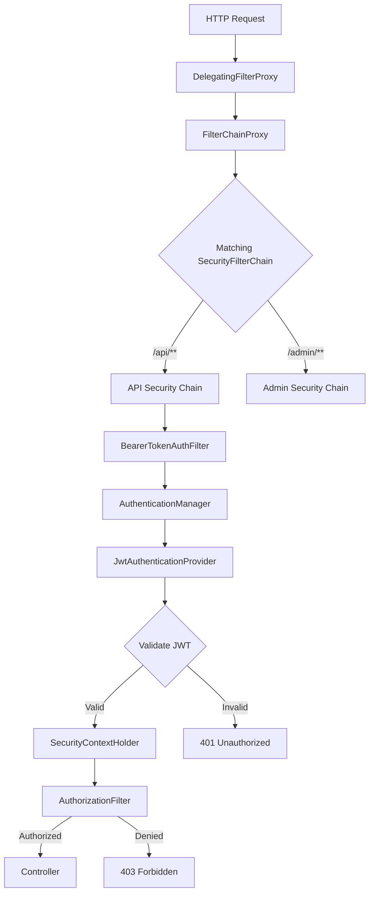

---

---

# Spring Security Architecture

**Interview Weight:** critical - Spring Security is in
every enterprise Spring application. Interviewers ask
about the filter chain, SecurityContext, and OAuth2/JWT
integration.

---

### 🎯 Model Answer

**30 seconds:**

> Spring Security is implemented as a servlet filter chain.
> The SecurityFilterChain contains ordered filters.
> Key filters: UsernamePasswordAuthenticationFilter
> (form login), BasicAuthenticationFilter (HTTP Basic),
> BearerTokenAuthenticationFilter (JWT/OAuth2), and
> AuthorizationFilter (authorization). Authentication
> result is stored in SecurityContextHolder (ThreadLocal
> by default). For JWT APIs: configure an oauth2ResourceServer,
> disable session creation, and use stateless security.

**3 minutes (Senior):**

> The DelegatingFilterProxy bridges the servlet container
> and Spring's bean context. It delegates to
> FilterChainProxy, which selects the matching
> SecurityFilterChain based on request matcher. Multiple
> SecurityFilterChains coexist (different rules for
> /api/** vs /admin/**).
>
> Authentication flow:
> 1. Request arrives at BearerTokenAuthenticationFilter
> 2. Filter extracts credentials
> 3. Creates Authentication token
> 4. Delegates to AuthenticationManager
> 5. AuthenticationManager → AuthenticationProvider
>    (e.g., JwtAuthenticationProvider)
> 6. Provider validates, returns authenticated token
>    with granted authorities
> 7. Authentication stored in SecurityContextHolder
> 8. AuthorizationFilter checks permissions
> 9. Request continues to controller
>
> Authorization: AuthorizationFilter checks
> SecurityContext authorities against
> HttpSecurity.authorizeHttpRequests() rules and
> @PreAuthorize SpEL expressions.

**Blank Mind Recovery:**

**(1) Restate:** "You are asking about how Spring Security
processes authentication and authorization for HTTP
requests."

**(2) First principles:** "Every request needs to be
identified (authentication: who are you?) and checked
for permissions (authorization: can you do this?).
Spring Security processes these as filters before the
request reaches the controller."

**(3) Bridge:** "Spring Security is an airport security
checkpoint: the filter chain is the security lane,
authentication is showing your boarding pass, authorization
is checking if your ticket allows lounge access."

---

### 📘 Concept Explanation

```
Spring Security Filter Chain:

HTTP Request
    ↓
DelegatingFilterProxy (servlet container bridge)
    ↓
FilterChainProxy
    ↓
SecurityFilterChain(s) [ordered, by matcher]
    ↓
[SecurityContextPersistenceFilter]
    ↓
[BearerTokenAuthenticationFilter (JWT)]
    ↓
[ExceptionTranslationFilter]
    ↓
[AuthorizationFilter]
    ↓
DispatcherServlet → Controller
```



> **Diagram walkthrough:** DelegatingFilterProxy is
> registered in the servlet container and bridges to
> Spring's FilterChainProxy bean. FilterChainProxy
> selects the matching chain by request path. The
> BearerTokenAuthenticationFilter extracts JWT and
> delegates to AuthenticationManager. JwtAuthenticationProvider
> validates the token and populates SecurityContextHolder.
> AuthorizationFilter checks authorities. 401 = not
> authenticated; 403 = authenticated but not authorized.

```java
// JWT Stateless Security Configuration
@Configuration
@EnableWebSecurity
public class SecurityConfig {

    @Bean
    public SecurityFilterChain apiSecurityChain(
            HttpSecurity http) throws Exception {
        return http
            .securityMatcher("/api/**")
            .csrf(AbstractHttpConfigurer::disable)
            .sessionManagement(session -> session
                .sessionCreationPolicy(
                    SessionCreationPolicy.STATELESS))
            .authorizeHttpRequests(auth -> auth
                .requestMatchers(
                    "/api/public/**").permitAll()
                .requestMatchers(
                    "/api/admin/**").hasRole("ADMIN")
                .anyRequest().authenticated())
            .oauth2ResourceServer(oauth2 -> oauth2
                .jwt(Customizer.withDefaults()))
            .build();
    }
}
```

> **Code walkthrough:** securityMatcher("/api/**") limits
> this chain to API paths only. CSRF is disabled for
> stateless APIs (JWT-based, no session cookies). STATELESS
> prevents session creation. authorizeHttpRequests sets
> path-level rules: public paths open, admin restricted,
> everything else authenticated. oauth2ResourceServer
> configures JWT validation using JwtDecoder auto-configured
> from spring.security.oauth2.resourceserver.jwt.issuer-uri.

---

### 🎓 Answers by Seniority

**Junior:** "Spring Security uses a filter chain. Filters
handle authentication and authorization before the
request reaches the controller. The authenticated user
is stored in SecurityContextHolder."

**Mid:** "I configure SecurityFilterChain with
HttpSecurity. For REST APIs: disable CSRF (no session),
use STATELESS session management, configure
oauth2ResourceServer for JWT. @PreAuthorize on controller
methods for method-level security."

**Senior:** "Multiple SecurityFilterChains with different
securityMatcher patterns handle different URL namespaces.
JwtAuthenticationConverter maps JWT claims to Spring
Security authorities. SecurityContext is ThreadLocal -
I configure MODE_INHERITABLETHREADLOCAL for @Async
methods or use DelegatingSecurityContextRunnable."

**Staff:** "Spring Security is defense in depth: filter
chain before controller, method security inside controller,
service-level @PreAuthorize at the boundary. I never
expose management endpoints without auth. I use
jwk-set-uri for automatic key rotation. I implement
custom AuthenticationProvider for API key authentication."

---

### ⚠️ Common Misconceptions

**1. "CSRF should always be disabled for REST APIs"**

Only disable CSRF if the API is stateless (JWT, no
cookies for auth). If the API uses session cookies,
CSRF protection is essential.

**2. "hasRole('ADMIN') and hasAuthority('ADMIN') are
the same"**

Wrong. hasRole('ADMIN') checks for authority
'ROLE_ADMIN' (adds ROLE_ prefix). hasAuthority('ADMIN')
checks for exact string 'ADMIN'. JWT claims typically
map to authorities without the ROLE_ prefix.

---

### 🚨 Failure Modes and Diagnosis

**Failure: SecurityContext not available in @Async thread**

Symptom: SecurityContextHolder.getContext() returns
empty in @Async method. NullPointerException on
authentication.

Root cause: @Async creates a new thread. ThreadLocal-
based SecurityContextHolder does not propagate.

Fix: Configure InheritableThreadLocal strategy:
```java
SecurityContextHolder.setStrategyName(
    SecurityContextHolder
        .MODE_INHERITABLETHREADLOCAL);
```
Or use DelegatingSecurityContextRunnable/Callable to
wrap async tasks.

---

### 🎯 Interview Deep-Dive

| Experience | Time | Depth |
|---|---|---|
| Mid | 4 min | Filter chain, SecurityContextHolder |
| Senior | 6 min | JWT config, method security, @Async issue |
| Staff | 8 min | OAuth2, custom providers, defense in depth |

---

**[SENIOR] Q1 - How does Spring Security validate JWT
tokens and map them to authorities?**

*Why they ask:* JWT is the dominant auth mechanism.

Configuration:
```yaml
spring:
  security:
    oauth2:
      resourceserver:
        jwt:
          issuer-uri: https://auth.company.com
```

This auto-configures JwtDecoder using OIDC metadata
from issuer-uri. The decoder validates signature,
expiry, issuer, and audience.

Custom authority mapping:
```java
@Bean
public JwtAuthenticationConverter jwtConverter() {
    var conv = new JwtAuthenticationConverter();
    conv.setJwtGrantedAuthoritiesConverter(
        jwt -> jwt.getClaimAsStringList("roles")
            .stream()
            .map(r -> new SimpleGrantedAuthority(
                "ROLE_" + r))
            .collect(Collectors.toList()));
    return conv;
}
```

> **Code walkthrough:** The default converter reads
> scope and scp claims. For role-based claims, provide
> a custom converter that reads the roles claim and
> maps each to ROLE_ROLENAME authorities. With this
> mapping, hasRole('ADMIN') works for a JWT with
> roles: ["ADMIN"].

*What separates good from great:* Knowing that the
default converter reads scope/scp claims, and that
custom JwtGrantedAuthoritiesConverter is needed for
role-based JWT claims.

---

**[SENIOR] Q2 - How do you secure a mix of public and
protected endpoints in one application?**

*Why they ask:* Real-world security configuration.

Multiple SecurityFilterChain beans with ordering:
```java
@Bean
@Order(1)  // First: public endpoints
public SecurityFilterChain publicChain(
        HttpSecurity http) throws Exception {
    return http
        .securityMatcher(
            "/api/public/**", "/actuator/health")
        .authorizeHttpRequests(auth ->
            auth.anyRequest().permitAll())
        .build();
}

@Bean
@Order(2)  // Second: protected API
public SecurityFilterChain apiChain(
        HttpSecurity http) throws Exception {
    return http
        .securityMatcher("/api/**")
        .authorizeHttpRequests(auth ->
            auth.anyRequest().authenticated())
        .oauth2ResourceServer(...)
        .build();
}
```

> **Code walkthrough:** @Order controls chain precedence.
> The public chain matches first for /api/public/**
> and permits all without authentication. The API chain
> catches remaining /api/** requests and requires
> authentication. Actuator health is permitted for
> Kubernetes probes without authentication.

*What separates good from great:* Using @Order correctly
and explaining that FilterChainProxy tries chains in
order - first match wins.

| Interviewer Type | Emphasis |
|---|---|
| Technical Panel | Filter chain internals, JWT validation, authority mapping. |
| Hiring Manager | Security misconfiguration = data breach. |
| Bar Raiser | Defense in depth, key rotation with jwk-set-uri, @Async SecurityContext propagation. |
| Peer Engineer | "hasRole vs hasAuthority confusion caused a production security bypass. Always test authorization rules." |

---

---

# Spring Performance Diagnostics

**Interview Weight:** high - Production performance
debugging is tested at L4 level. Interviewers want
real diagnostic commands, not theory.

---

### 🎯 Model Answer

**30 seconds:**

> Spring performance problems fall into: slow startup,
> slow request handling, memory pressure, and database
> latency. Diagnose with: Actuator /conditions (startup
> auto-config), /metrics/http.server.requests (request
> latency), /actuator/heapdump (memory analysis).
> For N+1 SQL: datasource-proxy to count queries per
> request. For request tracing: Micrometer Tracing with
> OpenTelemetry or Zipkin. For slow startup: spring.main
> .lazy-initialization=true reduces initial bean creation.

**3 minutes (Senior):**

> Five diagnostic categories with tools:
>
> Startup: --debug flag shows auto-config report.
> /actuator/conditions shows matched conditions.
> spring.main.lazy-initialization=true reduces startup
> time (beans created on first use, not at startup).
>
> Request latency: Micrometer timer metrics at
> /actuator/metrics/http.server.requests (by URI, method,
> status, percentiles). Distributed tracing with Micrometer
> Tracing for cross-service spans.
>
> Database: datasource-proxy logs SQL with real parameter
> values (unlike show-sql which logs ?). assertSelectCount
> in tests detects N+1 at CI time.
>
> Memory: /actuator/heapdump for heap analysis in Eclipse
> MAT. Add -XX:+HeapDumpOnOutOfMemoryError to JVM args
> for OOM analysis. Common Spring leaks: unbounded
> @Cacheable (no TTL), large ApplicationContext with
> unused beans.
>
> Threads: /actuator/threaddump for deadlock detection.
> /actuator/metrics/executor.active for thread pool
> saturation.

**Blank Mind Recovery:**

**(1) Restate:** "You are asking about diagnosing
performance problems in production Spring Boot
applications."

**(2) First principles:** "Performance issues have root
causes: too much work, waiting too long, or out of
resources. Diagnosis means measuring which category
and which code path before optimizing."

**(3) Bridge:** "Performance diagnosis is like a
detective investigation: gather evidence (metrics,
traces, heap dump), form a hypothesis, test it, fix
the root cause."

---

### 📘 Concept Explanation

```
Performance Diagnostics Toolkit

STARTUP (slow to start):
  --debug flag or /actuator/conditions
  spring.main.lazy-initialization=true (reduces start)

HTTP REQUESTS (slow endpoints):
  /actuator/metrics/http.server.requests
  Micrometer Tracing (Zipkin / OTLP)
  @Timed on methods

DATABASE (slow queries, N+1):
  spring.jpa.show-sql=true (dev, no params)
  datasource-proxy (parameterized logs + count)
  assertSelectCount() in @DataJpaTest

MEMORY (OOM, leaks):
  /actuator/heapdump + Eclipse MAT
  -XX:+HeapDumpOnOutOfMemoryError
  /actuator/metrics/jvm.memory.used

THREADS (deadlocks, pool exhaustion):
  /actuator/threaddump
  /actuator/metrics/executor.active
  /actuator/metrics/hikaricp.connections
```

```mermaid
flowchart TD
    A[Performance Issue] --> B{Symptom?}
    B -->|Slow startup| C[--debug + lazy init]
    B -->|High latency| D[Micrometer metrics]
    B -->|High DB load| E[datasource-proxy]
    B -->|OOM / memory| F[heapdump + MAT]
    B -->|Thread blocked| G[threaddump]
    D --> H[Which endpoint?]
    H --> I[Distributed trace]
    E --> J[Query count > 1?]
    J -->|N+1| K[@EntityGraph / FETCH JOIN]
    J -->|No| L[EXPLAIN ANALYZE]
```

> **Diagram walkthrough:** Each symptom maps to a specific
> diagnostic tool. High latency requires Micrometer to
> identify the slow endpoint, then distributed tracing
> to see which downstream call is slow. High DB load
> requires datasource-proxy to count queries per request.
> N+1 is the most common Spring/JPA issue and is fixed
> with @EntityGraph or FETCH JOIN at the repository level.

```java
// N+1 detection in tests (datasource-proxy)
@SpringBootTest
@ActiveProfiles("test")
class UserServiceTest {

    @Autowired UserService svc;

    @Test
    void getAllUsersWithDept_noNPlusOne() {
        // datasource-proxy assertSelectCount:
        // fails test if more than 1 query executed
        assertSelectCount(1, () ->
            svc.getAllUsersWithDepartment());
    }
}

// Fix: @EntityGraph
public interface UserRepository
        extends JpaRepository<User, Long> {

    @EntityGraph(
        attributePaths = {"department"})
    List<User> findAllWithDepartment();
}
```

> **Code walkthrough:** assertSelectCount fails the test
> if more than 1 SQL SELECT executes. This makes N+1
> a build failure before it reaches production.
> @EntityGraph on the repository method adds a JOIN
> FETCH to the generated query, loading users and
> departments in a single SQL query instead of N+1.

---

### 🎓 Answers by Seniority

**Mid:** "For slow endpoints I check
/actuator/metrics/http.server.requests. For database
issues I enable SQL logging. For startup I check
/actuator/conditions."

**Senior:** "I use datasource-proxy with assertSelectCount
in integration tests to prevent N+1. For production:
Micrometer + Prometheus + Grafana. Distributed tracing
with Micrometer Tracing to see cross-service spans.
Heap dump via /actuator/heapdump for memory analysis."

**Staff:** "Performance SLAs are deployment gates.
P99 latency thresholds in CI. assertSelectCount prevents
N+1 reaching production. -XX:+HeapDumpOnOutOfMemoryError
ensures forensics on every OOM. Lazy initialization
and virtual threads (JDK 21) reduce cold start for
containerized deployments."

---

### 🚨 Failure Modes and Diagnosis

**Failure: OOM in production with no heap dump**

Symptom: Service crashed with OutOfMemoryError, nothing
to analyze.

Root cause: JVM OOM dump not configured.

Fix: Add JVM argument:
```
-XX:+HeapDumpOnOutOfMemoryError
-XX:HeapDumpPath=/tmp/heapdumps/
```

Also set Kubernetes pod OOM limit to ensure the dump
file is written before the pod is killed.

**Failure: Slow P99 latency that disappears under
investigation**

Symptom: P99 spikes every 5 minutes, then resolves.
No slow queries in logs.

Root cause: GC pause (Full GC triggered by memory
pressure). GC pauses stop-the-world for 200-500ms.

Diagnosis: Enable GC logging: `-Xlog:gc*:file=/tmp/gc.log`.
Correlate GC logs with latency spikes.

Fix: Increase heap size (-Xmx). Or switch to ZGC
(concurrent, <1ms pauses): `-XX:+UseZGC`.

---

### 🎯 Interview Deep-Dive

| Experience | Time | Depth |
|---|---|---|
| Mid | 3 min | Actuator metrics, SQL logging tools |
| Senior | 5 min | datasource-proxy, Micrometer, tracing setup |
| Staff | 7 min | CI perf gates, GC tuning, virtual threads |

---

**[SENIOR] Q1 - How do you detect and prevent N+1
queries in a Spring Boot application?**

*Why they ask:* N+1 is the most common Spring/JPA
performance bug.

N+1 pattern: 1 query for parent entities + N queries
for each child entity. Symptom: 200 users = 201 queries.

Detection methods:
1. datasource-proxy + assertSelectCount in tests
2. SQL log analysis: count SELECT statements per request
3. Hibernate statistics: hibernate.statistics=true

Prevention:
1. @EntityGraph on repository method
2. JOIN FETCH in @Query JPQL
3. Batch fetching: hibernate.default_batch_fetch_size=100
   (groups N queries into batches of 100)

```java
// Hibernate statistics (dev only)
@Bean
public Properties hibernateProperties() {
    Properties p = new Properties();
    p.put("hibernate.generate_statistics", "true");
    return p;
}
// Logs: "Statistics: queries=201, time=3450ms"
```

*What separates good from great:* Knowing batch fetching
(hibernate.default_batch_fetch_size) as a middle-ground
fix that reduces N queries to N/100 queries without
JOIN FETCH.

---

**[STAFF] Q2 - How do you set performance thresholds
as deployment gates?**

*Why they ask:* Engineering quality at scale.

Three layers of performance gates:

1. **Unit/integration test assertions:**
   assertSelectCount for N+1. Response time assertions
   for critical paths.

2. **Load test stage in CI/CD:**
   Gatling or k6 load test against staging.
   Gate: P99 < 200ms at 100 concurrent users.
   Gate: error rate < 0.1%.

3. **Production monitoring alerts:**
   Prometheus AlertManager rule:
   P99 latency > threshold → PagerDuty alert.
   Memory usage > 80% → alert.

Deployment approval requires all three gates to pass.
Production anomalies trigger rollback via circuit breaker.

*What separates good from great:* Three-layer approach
(test → load test → prod monitoring) and specific
thresholds.

| Interviewer Type | Emphasis |
|---|---|
| Technical Panel | Real commands, datasource-proxy, Micrometer, tracing. |
| Hiring Manager | Performance issues prevent incidents and save money. |
| Bar Raiser | CI perf gates, GC tuning, virtual threads, systematic approach. |
| Peer Engineer | "assertSelectCount in CI has saved us from N+1 three times. It pays for itself on day one." |
