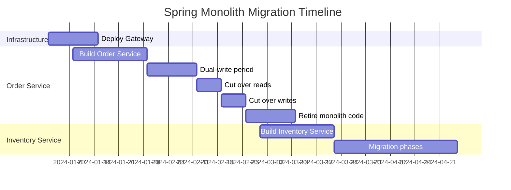
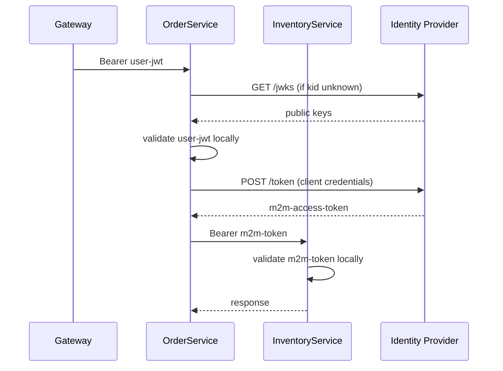

---

---

# Spring Cloud Service Discovery and Config

**Interview Weight:** critical - Service discovery and
centralized config are core Spring Cloud topics for
any distributed Spring system.

---

### 🎯 Model Answer

**30 seconds:**

> Spring Cloud Eureka provides service registration
> and discovery. Each service registers with the Eureka
> server at startup with its host, port, and health URL.
> Clients use @LoadBalanced WebClient with logical service
> names (http://order-service/api) instead of hardcoded
> URLs. Spring Cloud Config Server serves externalized
> configuration from a git repository. Services fetch
> config at startup via spring.config.import=configserver:.

**3 minutes (Senior):**

> Eureka architecture: Eureka Server holds the registry.
> Clients send heartbeats every 30s. If heartbeats stop,
> instance evicted after 90s. Clients cache the registry
> locally to survive Eureka restarts. Spring Cloud
> LoadBalancer selects an instance from the local cache
> using round-robin or custom strategy.
>
> Spring Cloud Config Server:
> - Git backend: files per service in a config git repo
>   (application.yml, order-service.yml,
>   order-service-prod.yml)
> - Priority: profile-specific > service-specific > shared
> - Clients use spring.config.import=configserver:url
> - @RefreshScope beans pick up config changes on
>   /actuator/refresh or Spring Cloud Bus broadcast
> - Vault backend for secrets (replaces git for sensitive
>   values)

**Blank Mind Recovery:**

**(1) Restate:** "You are asking how Spring services find
each other (discovery) and get their configuration
(Config Server)."

**(2) First principles:** "In dynamic environments,
service instances start and stop. Hardcoded URLs fail.
Discovery solves this: register yourself, find others
by name. Config externalization enables one artifact
per environment without rebuild."

**(3) Bridge:** "Eureka is the company directory: each
service announces itself and others look it up by name.
Config Server is the policy manual: one authoritative
source, services fetch their applicable section."

---

### 📘 Concept Explanation

```java
// Eureka Server
@SpringBootApplication
@EnableEurekaServer
public class EurekaServerApp { }

// Service auto-registers via spring.application.name
// and eureka.client.serviceUrl.defaultZone

// Load-balanced WebClient
@Configuration
public class WebClientConfig {
    @Bean
    @LoadBalanced
    public WebClient.Builder webClientBuilder() {
        return WebClient.builder();
    }
}

@Service
public class InventoryClient {
    private final WebClient webClient;

    public InventoryClient(
            WebClient.Builder builder) {
        // "inventory-service" resolved via Eureka
        this.webClient = builder
            .baseUrl("http://inventory-service")
            .build();
    }

    public Mono<StockDto> checkStock(Long itemId) {
        return webClient.get()
            .uri("/api/stock/{id}", itemId)
            .retrieve()
            .bodyToMono(StockDto.class);
    }
}
```

> **Code walkthrough:** @LoadBalanced on WebClient.Builder
> enables Eureka-aware name resolution. "inventory-service"
> matches the target service's spring.application.name.
> Spring Cloud LoadBalancer resolves it to a real IP:port
> from the Eureka cache. Multiple instances get round-robin
> load balancing automatically. No hardcoded URLs anywhere
> in application code.

```java
// Config Server
@SpringBootApplication
@EnableConfigServer
public class ConfigServerApp { }

// Config repo file structure:
// config-repo/
//   application.yml           <- shared all services
//   order-service.yml         <- service defaults
//   order-service-prod.yml    <- prod overrides

// Client config (application.yml):
// spring:
//   application:
//     name: order-service
//   config:
//     import: configserver:http://config:8888
//   profiles:
//     active: prod
```

> **Code walkthrough:** Config Server serves files based
> on service name and profile. order-service with
> profile=prod gets: application.yml + order-service.yml
> + order-service-prod.yml merged in priority order
> (prod file wins). This enables environment-specific
> config without rebuilding the artifact. The service
> fetches config at startup before ApplicationContext
> initialization.

---

### 🎓 Answers by Seniority

**Senior:** "Eureka: services register, clients resolve
by name via @LoadBalanced. Config Server: git-backed
with service + profile file hierarchy. @RefreshScope
beans refresh without restart via /actuator/refresh
or Cloud Bus broadcast."

**Staff:** "Eureka HA: 3-node cluster with peer replication.
Kubernetes alternative: use DNS (CoreDNS) instead of
Eureka for in-cluster service discovery. Config HA:
run Config Server behind a load balancer with git
repo sync. For secrets: Vault backend instead of git.
@RefreshScope limitation: recreates beans, losing
in-memory state. Use it only for stateless config
consumers."

---

### 🚨 Failure Modes and Diagnosis

**Failure: Load-balanced call fails with
"No instances available for service-name"**

Symptom: WebClient call fails immediately with
IllegalStateException: No instances available.

Root cause: Service not registered in Eureka (wrong
application.name, missing Eureka client dependency,
or Eureka server unreachable).

Diagnosis: Check Eureka dashboard (http://eureka:8761).
Is the service listed? Check service's Eureka client
config.

Fix: Verify spring.application.name matches the logical
name. Ensure eureka.client.enabled=true (default).
Check Eureka server URL in defaultZone.

---

### 🎯 Interview Deep-Dive

| Experience | Time | Depth |
|---|---|---|
| Senior | 5 min | Registration, @LoadBalanced, Config hierarchy |
| Staff | 8 min | HA, Kubernetes DNS, Vault, @RefreshScope limits |

---

**[SENIOR] Q1 - What happens to service-to-service calls
when the Eureka server is down?**

*Why they ask:* Resilience understanding.

Eureka clients cache the service registry locally.
When the Eureka server is unreachable:
1. New service registrations fail (services start but
   aren't visible to others)
2. Existing cached registrations continue to work
   (clients use local cache for discovery)
3. Registry staleness: eviction doesn't happen, so
   down instances may stay in cache

Mitigations:
- Run 3 Eureka instances with peer replication (HA)
- Clients cache registry with configurable cache TTL
  (default 30s refresh)
- Combine with circuit breakers: Eureka failure +
  service failure triggers circuit open

Self-preservation mode: Eureka server stops evicting
instances when heartbeats drop below a threshold.
Protects against network partition (not all clients
dead, just partition). Can cause stale routing.

*What separates good from great:* Knowing self-preservation
mode and when to enable/disable it.

| Interviewer Type | Emphasis |
|---|---|
| Technical Panel | Registration flow, local cache, Config hierarchy. |
| Hiring Manager | Centralized config = no per-env builds. |
| Bar Raiser | Eureka HA, self-preservation, Vault secrets, Kubernetes DNS alternative. |
| Peer Engineer | "Eureka's cache is what saves you when the registry goes down. Understand the TTL." |

---

---

# Spring Application Migration Strategy

**Interview Weight:** critical - Migration expertise is
a staff-level differentiator. Interviewers ask about
incremental approaches and managing data consistency.

---

### 🎯 Model Answer

**30 seconds:**

> Spring migration strategies depend on scope. Spring
> Boot version upgrades: follow the migration guide,
> fix deprecations incrementally, test with @SpringBootTest.
> Monolith to microservices: strangler fig - deploy
> Gateway, route bounded contexts to new services,
> dual-write data, cut over reads, retire monolith
> endpoints. Spring MVC to WebFlux: replace RestTemplate
> with WebClient first, add R2DBC, switch web layer last.

**3 minutes (Senior):**

> Strangler fig for monolith extraction:
> 1. Deploy Spring Cloud Gateway in front of monolith
>    (no code change to monolith yet)
> 2. Identify first bounded context to extract (start
>    with read-heavy, low-dependency service)
> 3. Create new Spring Boot service for that context
> 4. Configure Gateway route: /api/orders → new service
> 5. Data migration: dual-write to both, verify checksums,
>    cut over reads, cut over writes, retire monolith code
> 6. Repeat for next bounded context
>
> Key principles:
> - Never big-bang rewrite (fails 80% of time)
> - Always have rollback: Gateway route change is instant
> - Define done: no traffic to old endpoint + old code
>   deleted + old tables dropped
> - Team alignment: one team owns one bounded context
>   end-to-end

**Blank Mind Recovery:**

**(1) Restate:** "You are asking about strategies for
migrating large Spring applications incrementally."

**(2) First principles:** "Big bang rewrites fail because
they try to change everything at once. Incremental
migration keeps the system running, reduces risk per
step, and allows learning and correction."

**(3) Bridge:** "Strangler fig is named after the plant:
new service grows around the old, takes over its
responsibilities gradually, until the old can be safely
removed."

---

### 📘 Concept Explanation

```
Migration Phases

Phase 1: Gateway Insertion
  Before: [Client] → [Monolith]
  After:  [Client] → [Gateway] → [Monolith]
  Risk: zero (gateway is pass-through initially)

Phase 2: First Service Extraction
  [Client] → [Gateway] → [OrderService] (new)
                      ↘ [Monolith] (other routes)
  Rollback: 1 Gateway config change

Phase 3: Data Migration (dual-write)
  Monolith writes → existing DB
  OrderService writes → new DB
  CDC (Debezium) replicates old → new
  Verify checksums match

Phase 4: Cut Over
  Switch reads → OrderService
  Verify data consistency
  Switch writes → OrderService only
  Retire monolith code for orders
```



> **Diagram walkthrough:** Each service extraction takes
> 8-12 weeks (build + dual-write + cut over + retire).
> Services are extracted sequentially or in parallel by
> different teams. The Gateway insertion is a one-time
> prerequisite. The timeline is team-size-dependent;
> larger teams can run parallel extractions.

---

### 🎓 Answers by Seniority

**Senior:** "Strangler fig: Gateway → route to new service
→ dual-write data → cut over → retire. Never big bang.
Always maintain rollback path via Gateway config."

**Staff:** "Migration constraints: risk (system stays up),
velocity (features continue during migration), data
consistency (dual-write phase). I sequence: Gateway
first (lowest risk, highest leverage), then read-heavy
stateless services, then stateful services last. Exit
criteria defined upfront: endpoint retired, code deleted,
table dropped. Without exit criteria, migrations never end."

---

### 🎯 Interview Deep-Dive

| Experience | Time | Depth |
|---|---|---|
| Senior | 5 min | Strangler fig, data phases |
| Staff | 10 min | Risk management, exit criteria, team alignment |

---

**[STAFF] Q1 - How do you manage data consistency
during the dual-write migration phase?**

*Why they ask:* Data migration is the highest-risk phase.

Three patterns for dual-write consistency:

1. **CDC (Change Data Capture) with Debezium:**
   Debezium captures monolith DB changes (WAL log)
   and publishes to Kafka. New service consumes and
   replicates. Near-real-time sync. Zero application
   code change in monolith.

2. **Application dual-write:**
   Monolith writes to both databases in same request.
   Risk: partial failures (wrote to DB1, failed DB2).
   Mitigate with outbox pattern.

3. **Outbox + event consumer:**
   Monolith writes event to outbox table in same
   transaction. Event consumer writes to new DB.
   Guaranteed at-least-once delivery.

Verification: run checksums on critical tables every
hour. Alert on divergence. Do not cut over until
checksums match for 48 hours.

*What separates good from great:* CDC with Debezium as
the zero-application-change approach, and the checksum
verification gate.

| Interviewer Type | Emphasis |
|---|---|
| Technical Panel | Strangler fig phases, data migration sequence. |
| Hiring Manager | Incremental migration = business continuity. |
| Bar Raiser | CDC, exit criteria, consistency verification, failure scenarios. |
| Peer Engineer | "Define 'done' before you start. I have seen migrations run for years without completion." |

---

---

# Spring Security OAuth2 at Scale

**Interview Weight:** critical - OAuth2 and JWT at scale
is the key Spring Security topic at staff level.
Interviewers test key rotation, service-to-service auth,
and authorization design.

---

### 🎯 Model Answer

**30 seconds:**

> At scale, Spring Security as OAuth2 resource server
> validates JWT locally (no auth server round-trip)
> using cached JWKS keys. jwk-set-uri enables automatic
> key rotation: when a JWT uses an unknown kid, Spring
> fetches the updated JWKS. For service-to-service auth:
> client credentials flow with OAuth2AuthorizedClientManager
> manages token lifecycle automatically. Token relay in
> Spring Cloud Gateway propagates user tokens downstream.
> Fine-grained authorization uses @PreAuthorize with
> SpEL against JWT claims.

**3 minutes (Senior):**

> JWT validation at scale: JwtDecoder validates signature
> locally using the IdP's public keys from JWKS. Scales
> horizontally - every pod validates independently, no
> shared state. Key rotation: new key pair at IdP, new
> kid in JWT. NimbusJwtDecoder detects unknown kid and
> re-fetches JWKS automatically.
>
> Service-to-service (M2M auth):
> - Client Credentials flow: service authenticates with
>   client_id/secret, gets access token, attaches as
>   Bearer to downstream calls
> - OAuth2AuthorizedClientManager handles: token issuance,
>   caching, expiry detection, refresh
>
> Token relay in Gateway: TokenRelayGatewayFilterFactory
> extracts the incoming user token from the Authorization
> header and passes it downstream. Downstream services
> get the user's JWT and can read user identity.
>
> Fine-grained authz: @PreAuthorize("hasPermission(#entity,
> 'READ')") with custom PermissionEvaluator for resource-
> level access control.

**Blank Mind Recovery:**

**(1) Restate:** "You are asking about Spring Security's
OAuth2 resource server in a distributed system at high
scale, including token lifecycle and service auth."

**(2) First principles:** "At scale, stateless validation
(JWT + JWKS) eliminates auth server as a bottleneck.
Services don't call the auth server per request; they
validate locally. Key rotation is the security hygiene
mechanism: even if a key is compromised, it expires."

**(3) Bridge:** "JWKS with NimbusJwtDecoder is like
a self-updating passport verification book: customs
agents (resource servers) verify locally, and when
the government issues new stamps (key rotation), agents
automatically fetch the update."

---

### 📘 Concept Explanation

```java
// Resource server with JWKS for key rotation
@Bean
public JwtDecoder jwtDecoder(
        OAuth2ResourceServerProperties props) {
    return NimbusJwtDecoder
        .withJwkSetUri(
            props.getJwt().getJwkSetUri())
        .build();
    // Automatically re-fetches on unknown kid
}

// Service-to-service client credentials
@Bean
public WebClient inventoryClient(
        OAuth2AuthorizedClientManager manager) {
    var filter =
        new ServletOAuth2AuthorizedClientExchangeFilterFunction(manager);
    filter.setDefaultClientRegistrationId(
        "inventory-client");
    return WebClient.builder()
        .apply(filter.oauth2Configuration())
        .build();
}
// application.yml:
// spring.security.oauth2.client.registration
//   .inventory-client:
//     authorization-grant-type: client_credentials
//     client-id: order-service
//     client-secret: ${INVENTORY_CLIENT_SECRET}
```

> **Code walkthrough:** NimbusJwtDecoder with jwk-set-uri
> validates JWT signatures locally using cached JWKS.
> When a token has an unknown kid (key rotation in progress),
> it re-fetches JWKS from the IdP. No per-request auth
> server call. OAuth2AuthorizedClientManager handles the
> client credentials token: fetches a new token from
> the auth server, caches it, and automatically refreshes
> when it expires. The WebClient filter attaches the
> token as Bearer on every request.

```
OAuth2 Token Flow

User → Gateway → TokenRelayFilter
            ↓ (user token propagated)
       OrderService → Validate JWT (local, JWKS)
            ↓ (client credentials token for M2M)
       InventoryService → Validate M2M token

Key Rotation:
  IdP: generate new key pair (kid=v2)
  New JWTs: header.kid = v2
  NimbusJwtDecoder: kid=v2 unknown → fetch JWKS
  JWKS returns: kid=v1 (old, still valid) + kid=v2
  Gradual migration: old tokens (kid=v1) still valid
  After old token expiry: remove v1 from JWKS
```



> **Diagram walkthrough:** Gateway token relay sends the
> user's JWT to OrderService. OrderService validates it
> locally (JWKS fetch only on unknown kid - cached).
> For the downstream call to InventoryService, OrderService
> uses its own client credentials token (M2M). InventoryService
> validates the M2M token the same way. The IdP is only
> called for JWKS refresh and token issuance - not on
> every request.

---

### 🎓 Answers by Seniority

**Senior:** "NimbusJwtDecoder with jwk-set-uri for local
JWT validation and automatic key rotation. Client
credentials flow with OAuth2AuthorizedClientManager
for service-to-service auth. Token relay in Gateway
for user context propagation."

**Staff:** "OAuth2 at scale: stateless JWT validation
is the only viable approach (no per-request auth server
calls). Key rotation cadence: quarterly for long-lived
services, monthly for high-security. Token lifespan:
15-minute access tokens reduce blast radius of compromise.
Service tokens: separate client per service with minimal
scope (principle of least privilege). Revocation: JWT
revocation requires a blocklist (Redis) - adds latency.
Prefer short-lived tokens over revocation."

---

### 🚨 Failure Modes and Diagnosis

**Failure: Key rotation causes 401 for all users**

Symptom: Auth server rotated keys. All JWTs with new
kid return 401.

Root cause: JwtDecoder configured with withPublicKey()
(hardcoded key) instead of withJwkSetUri(). Cannot
update to new key.

Diagnosis: Check JwtDecoder configuration. Does it
use a hardcoded key or a JWKS URI?

Fix: Replace withPublicKey() with withJwkSetUri().
NimbusJwtDecoder will fetch the new key from JWKS.

**Failure: Service tokens leak when client secret
is compromised**

Symptom: Unauthorized requests using service tokens
from a compromised service.

Diagnosis: IdP audit logs show token issuance from
the compromised client_id.

Fix: Revoke the client credentials immediately at the
IdP. Rotate client secret. Issue new secret via secrets
manager (Vault). All service instances pick up new
secret without restart (dynamic secrets).

---

### 🎯 Interview Deep-Dive

| Experience | Time | Depth |
|---|---|---|
| Senior | 5 min | JWKS, key rotation, client credentials |
| Staff | 10 min | Fine-grained authz, token lifespan, revocation |

---

**[STAFF] Q1 - How do you implement fine-grained
authorization beyond RBAC in Spring Security?**

*Why they ask:* Real enterprise systems need resource-
level authorization.

Three approaches for fine-grained authz:

1. **JWT claim-based (scales well, no DB per check):**
```java
@PreAuthorize(
    "authentication.token.claims['orders'].contains("
    + "#orderId.toString())")
public Order getOrder(Long orderId) { ... }
```
JWT contains resource IDs the user can access.
Limitation: JWT size grows with permissions.

2. **Custom PermissionEvaluator (flexible, requires DB):**
```java
@PreAuthorize(
    "hasPermission(#orderId, 'Order', 'READ')")
public Order getOrder(Long orderId) { ... }

@Component
public class OrderPermissionEvaluator
        implements PermissionEvaluator {
    public boolean hasPermission(
            Authentication auth,
            Object targetId,
            String targetType,
            Object permission) {
        // Query ACL DB
        return aclService.check(
            auth.getName(),
            targetId, permission);
    }
}
```
Full flexibility, DB lookup per authorization check.

3. **OPA (Open Policy Agent) side-car:**
Centralized policy engine. Spring calls OPA via HTTP.
Policy defined in Rego language. Decouples auth logic
from application code.

*What separates good from great:* Knowing all three
approaches, their scalability characteristics (JWT =
stateless, DB = accurate, OPA = centralized policy),
and recommending based on use case.

| Interviewer Type | Emphasis |
|---|---|
| Technical Panel | JWKS, client credentials flow, token relay. |
| Hiring Manager | Secure service-to-service auth = compliance. |
| Bar Raiser | Fine-grained authz patterns, token revocation trade-offs, OPA. |
| Peer Engineer | "Hardcoded public keys are a deployment hazard. jwk-set-uri is non-negotiable in production." |
