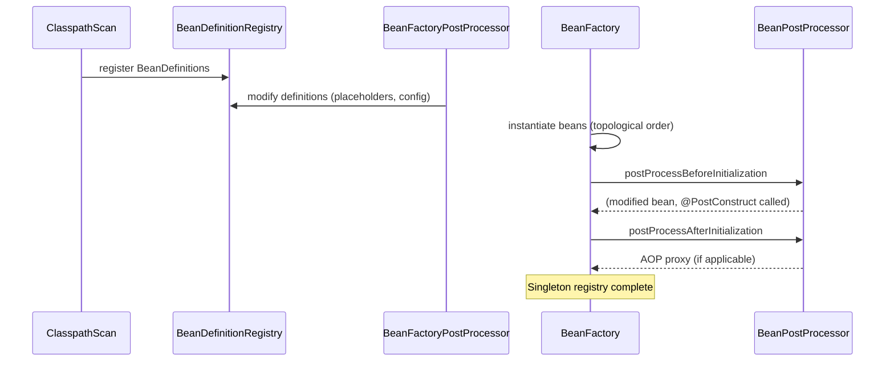

---

# Spring Container Design Internals

**Interview Weight:** critical - Understanding how the
Spring container works internally distinguishes engineers
who use Spring from engineers who understand Spring.
A core L6 theory topic.

---

### 🎯 Model Answer

**30 seconds:**

> The Spring IoC container is implemented by the
> ApplicationContext interface (extends BeanFactory).
> It reads BeanDefinitions (from XML, annotations, or
> Java config), applies BeanFactoryPostProcessors to
> modify definitions before instantiation, instantiates
> beans, injects dependencies via reflection, then runs
> BeanPostProcessors (before and after init) to decorate
> beans. The result is a registry of singleton beans
> keyed by name/type. Lazy initialization defers creation;
> prototype scope creates a new instance per request.

**3 minutes (Senior):**

> ApplicationContext lifecycle phases:
> 1. **Load BeanDefinitions**: scan @Component/@Bean,
>    parse XML, read @Configuration class bytecode.
>    Result: BeanDefinitionRegistry with all metadata.
> 2. **BeanFactoryPostProcessor phase**: BFPP run on the
>    registry. PropertySourcesPlaceholderConfigurer
>    resolves @Value placeholders. ConfigurationClassPostProcessor
>    processes @Configuration classes (generates CGLIB
>    proxy for @Bean method interception).
> 3. **Bean instantiation**: for each singleton, call
>    constructor (constructor injection) or default
>    constructor + setter injection.
> 4. **BeanPostProcessor phase**: BPPs run before and
>    after each bean's init method. AutowiredAnnotationBeanPostProcessor
>    handles @Autowired injection via reflection.
>    AbstractAutoProxyCreator creates AOP proxies.
>    @PostConstruct methods called via
>    InitDestroyAnnotationBeanPostProcessor.
> 5. **Context ready**: all singletons created and wired.
>    ApplicationContext publishes ContextRefreshedEvent.

**Blank Mind Recovery:**

**(1) Restate:** "You are asking how the Spring container
creates and wires beans internally."

**(2) First principles:** "The container's job is to
wire objects together without the objects knowing
how they are wired. It reads metadata (what should
exist and how), creates instances, applies extensions
(post-processors), and returns a ready-to-use registry."

**(3) Bridge:** "Spring's container is a factory with
a plugin architecture. BeanDefinitions are the blueprints.
BeanFactoryPostProcessors modify blueprints before
construction. BeanPostProcessors modify the built
objects. The result is a ready building where all
rooms are furnished."

---

### 📘 Concept Explanation

```
Spring Container Startup Phases

Phase 1: Load BeanDefinitions
  @ComponentScan → BeanDefinition per @Component
  @Configuration → BeanDefinition per @Bean
  Registry: BeanDefinitionRegistry

Phase 2: BeanFactoryPostProcessor (BFPP)
  PropertySourcesPlaceholderConfigurer:
    @Value("${server.port}") → @Value("8080")
  ConfigurationClassPostProcessor:
    @Configuration → CGLIB proxy class (intercepts
    @Bean method calls to return singletons)

Phase 3: Instantiation + Injection
  for each BeanDefinition (topological order):
    instantiate (constructor injection or default)
    inject setter/field dependencies

Phase 4: BeanPostProcessor (BPP)
  postProcessBeforeInitialization(bean, name)
    → @PostConstruct via InitDestroyAnnotationBPP
    → afterPropertiesSet() via InitializingBean
    → init-method
  postProcessAfterInitialization(bean, name)
    → AbstractAutoProxyCreator wraps with AOP proxy
```



> **Diagram walkthrough:** The startup sequence is
> strictly ordered. BeanDefinitions are registered
> before any instantiation. BFPPs run before instantiation
> to modify metadata (e.g., resolve property placeholders).
> BPPs run per-bean after instantiation: before-init
> calls @PostConstruct; after-init applies AOP proxies.
> The final beans in the singleton registry may be
> CGLIB/JDK proxies wrapping the original instance.

---

### 💻 Code Example

```java
// BAD: modifying beans after context is ready
// Cannot add new beans to a live context
@Component
public class BadConfig {
    @Autowired
    private ApplicationContext ctx;

    public void addBean() {
        // This fails - context is sealed after refresh
        ((ConfigurableApplicationContext)ctx)
            .getBeanFactory()
            .registerSingleton("dynamic", new Obj());
        // BPPs won't run → no AOP, no injection
    }
}

// GOOD: use BeanDefinitionRegistryPostProcessor
// to register beans before instantiation
@Component
public class DynamicBeanRegistrar
        implements BeanDefinitionRegistryPostProcessor {

    @Override
    public void postProcessBeanDefinitionRegistry(
            BeanDefinitionRegistry registry) {
        // Called before any beans are created
        var def = BeanDefinitionBuilder
            .genericBeanDefinition(MyDynamicBean.class)
            .getBeanDefinition();
        registry.registerBeanDefinition(
            "myDynamic", def);
        // This bean will go through full BPP lifecycle
    }

    @Override
    public void postProcessBeanFactory(
            ConfigurableListableBeanFactory bf) {
        // Can also modify existing definitions here
    }
}
```

> **Code walkthrough:** Registering a bean directly
> into a live BeanFactory bypasses BPPs: no @Autowired
> injection, no AOP proxy, no @PostConstruct. The correct
> approach is BeanDefinitionRegistryPostProcessor, which
> runs during Phase 2 (before instantiation). Beans
> registered here go through the full lifecycle including
> dependency injection and AOP proxy creation.

```java
// @Configuration CGLIB proxy internals
@Configuration
public class AppConfig {

    @Bean
    public ServiceA serviceA() {
        return new ServiceA(serviceB()); // calls serviceB()
    }

    @Bean
    public ServiceB serviceB() {
        return new ServiceB();
    }
    // Without @Configuration (using @Component):
    // serviceA() calls serviceB() directly,
    // creating a NEW ServiceB (not the Spring bean)
    // = NOT a singleton
    //
    // With @Configuration + CGLIB:
    // serviceA() calls serviceB() on the CGLIB proxy
    // Proxy intercepts, returns existing singleton
    // = true singleton guaranteed
}
```

> **Code walkthrough:** @Configuration creates a CGLIB
> subclass of AppConfig. CGLIB overrides @Bean methods
> to intercept calls: instead of creating a new object,
> the proxy checks the BeanFactory for an existing
> instance and returns it. This is why @Configuration
> guarantees singleton semantics when @Bean methods
> call each other. @Component does not create a CGLIB
> proxy, so @Bean method calls bypass the container.

---

### 🎓 Answers by Seniority

**Senior:** "Spring container: load BeanDefinitions,
run BFPPs (placeholders, @Configuration processing),
instantiate beans, run BPPs (@Autowired, AOP proxies,
@PostConstruct). @Configuration is CGLIB-proxied for
singleton semantics. BPPs decorate beans after creation."

**Staff:** "The container's extension points are the
key: BeanDefinitionRegistryPostProcessor for dynamic
bean registration, BeanFactoryPostProcessor for definition
modification, BeanPostProcessor for bean decoration
(AOP, injection, init). Spring's entire @Autowired,
AOP, @PostConstruct, and @Transactional are built on
BPPs. Understanding these extension points lets you
build framework-level components without Spring magic."

---

### ⚠️ Common Misconceptions

**1. "@Configuration vs @Component for @Bean methods
are equivalent"**

No. @Configuration creates a CGLIB proxy that intercepts
@Bean method calls to enforce singleton semantics.
@Component does not. If a @Component-annotated class
has a @Bean method that calls another @Bean method,
you get a NEW instance, not the Spring singleton.

**2. "BeanPostProcessors run before Spring creates beans"**

No. BPPs run AFTER instantiation, before and after
the init phase. They can't prevent instantiation, only
decorate. BeanFactoryPostProcessors run before any
bean creation.

---

### 🚨 Failure Modes and Diagnosis

**Failure: BPP itself triggers early bean creation,
breaking other BPPs**

Symptom: Beans that should have AOP proxies don't.
Beans miss @Autowired injection.

Root cause: A BPP or its dependencies trigger creation
of application beans before other BPPs are registered.
Those beans miss the un-registered BPPs.

Diagnosis: Spring logs WARN: "Bean 'X' of type [...] is
not eligible for getting processed by all BeanPostProcessors
(for example: not eligible for auto-proxying)."

Fix: BPPs should not depend on application beans
(services, repositories). Declare BPPs as simple
infrastructure beans with no application dependencies.

---

### 🎯 Interview Deep-Dive

| Experience | Time | Depth |
|---|---|---|
| Senior | 5 min | Container phases, CGLIB, BPP/BFPP |
| Staff | 10 min | Extension points, AOP proxy internals, BPP ordering |

---

**[STAFF] Q1 - How does Spring decide the order in
which beans are instantiated?**

*Why they ask:* Deep container knowledge.

Spring uses a topological sort based on dependencies:
1. BeanDefinitionRegistry knows each bean's dependencies
   (constructor params, @Autowired fields, @DependsOn)
2. Beans are created in topological order: dependency
   before dependent
3. @DependsOn explicitly forces ordering
4. BFPPs and BPPs are created before application beans
   (they are infrastructure; application beans may depend
   on them)

Circular dependencies: setter injection can resolve
them (Spring can create A partially, then inject B,
then inject B's dependency on A after A is in the
registry). Constructor injection cannot resolve circular
deps - fails at startup with BeanCurrentlyInCreationException.

Prototype beans are not in the singleton registry;
they are created fresh on each getBean() call.

*What separates good from great:* Knowing why constructor
injection circular deps fail (can't create A without B,
can't create B without A - deadlock) vs setter injection
resolution (partially-initialized bean can be injected).

**[STAFF] Q2 - What does the AbstractAutoProxyCreator
BPP do and when does it create proxies?**

*Why they ask:* AOP proxy internals.

AbstractAutoProxyCreator is a BPP that runs during
postProcessAfterInitialization. For each bean, it
checks whether any Advisors (from @Aspect classes,
@Transactional, @Async, etc.) match the bean's class.
If they do, it wraps the bean in a proxy (JDK dynamic
proxy for interfaces, CGLIB for classes).

The proxy intercepts method calls and applies advice
(before, after, around) before delegating to the target.

Implications:
1. Spring beans returned from getBean() may be proxies,
   not the original instance. getClass() returns the
   proxy class, not the target.
2. Self-invocation bypasses the proxy (this.method()
   calls the original, not the proxy - no advice applied).
3. @Transactional only works when called through the
   proxy. Self-invocation = no transaction.

*What separates good from great:* Connecting AbstractAutoProxyCreator
to the self-invocation anti-pattern.

| Interviewer Type | Emphasis |
|---|---|
| Technical Panel | Container phases, CGLIB @Configuration, BPP/BFPP distinction. |
| Hiring Manager | Deep framework knowledge = faster debugging. |
| Bar Raiser | AbstractAutoProxyCreator, extension point design, instantiation ordering. |
| Peer Engineer | "When you understand the BPP chain, Spring's magic disappears. It's just method calls and reflection." |
