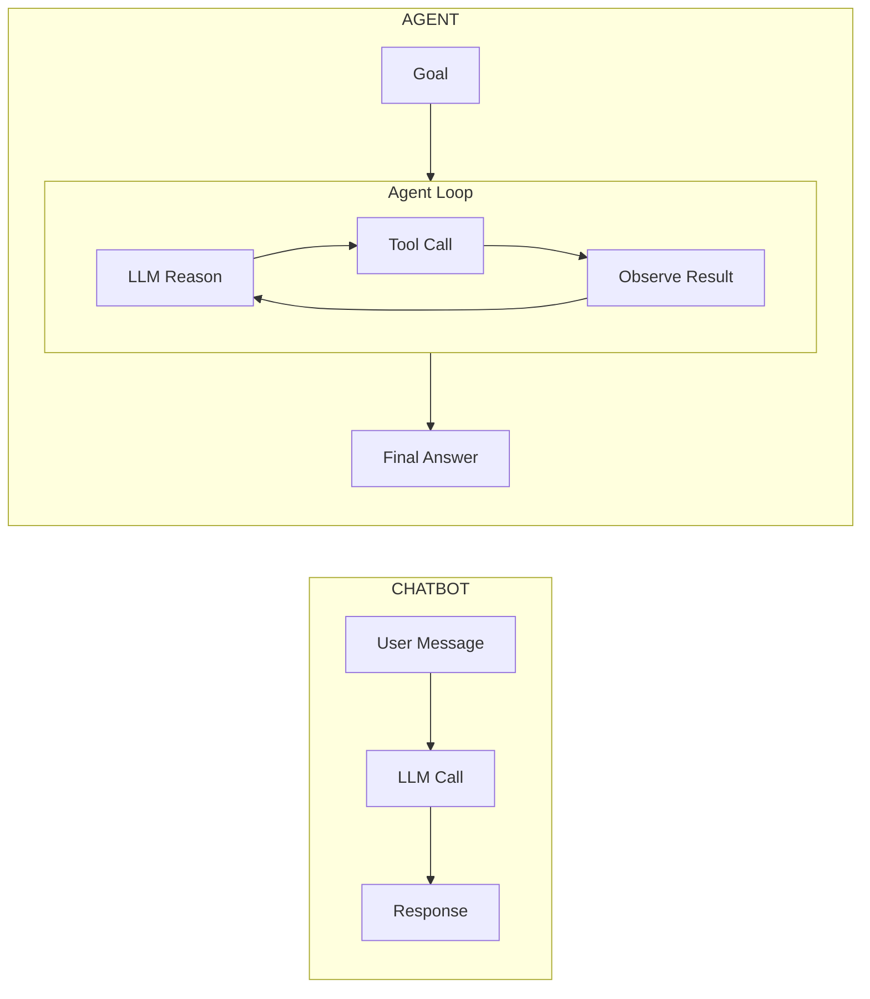
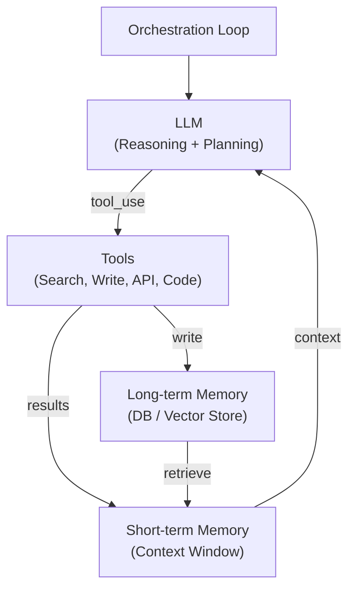
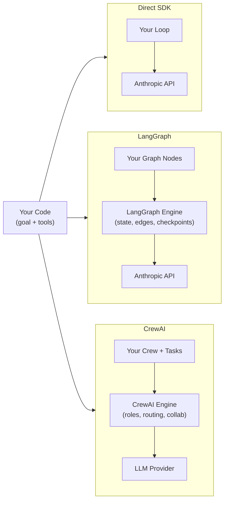

## Keywords in This File
{: .no_toc }

| # | Keyword | Weight |
|---|---|---|
| 1 | [AI Agents vs LLM Chatbots](#ai-agents-vs-llm-chatbots) | ★☆☆ |
| 2 | [Agent Architecture Overview](#agent-architecture-overview) | ★☆☆ |
| 3 | [AI Agent Frameworks](#ai-agent-frameworks) | ★☆☆ |

---

# AI Agents vs LLM Chatbots

**Interview Weight:** ★☆☆ - Foundational distinction
that interviewers use to assess whether the candidate
understands what an agent actually is.

---

### 🎯 Model Answer

**30 seconds:**

> A chatbot takes user input, calls an LLM once,
> and returns the response. An AI agent uses an LLM
> to reason about a goal, decides which actions to
> take (tool calls, sub-tasks), executes those actions,
> observes the results, and iterates until the goal
> is complete. The core difference: chatbots are single-
> turn or multi-turn conversation; agents are goal-
> directed, multi-step autonomous execution with tools.

**3 minutes:**

> The architectural distinction: chatbots are request-
> response. An agent is a loop: observe state, reason
> about next action, execute action, observe new state,
> repeat until done.
>
> Chatbot pattern:
> User message -> LLM call -> Response -> Done
>
> Agent pattern:
> Goal -> [Loop: LLM reasons + selects action ->
>   Execute tool -> Observe result -> Update state] ->
>   Loop exits when goal complete or failed
>
> The agent loop enables: multi-step tasks (the agent
> plans and executes a sequence of actions), tool use
> (the agent can search, read files, write code, call
> APIs), and autonomous decision making (the agent
> decides which step to take next based on observations).
>
> Key differences:
> - Autonomy: chatbots respond to each user message.
>   Agents may take many actions without user input.
> - Tools: chatbots rarely use tools. Agents depend
>   on them.
> - State: chatbot state is the conversation history.
>   Agent state includes task progress, tool results,
>   working memory, and plan.
> - Risk: chatbots return text. Agents take actions
>   with real-world consequences.

**Blank Mind Recovery:**

**(1) Restate:** "What makes an agent different from
a regular LLM chatbot?"

**(2) First principles:** "A chatbot is a fancy
autocomplete that responds to you. An agent is
a software process that pursues a goal using an
LLM as its brain - it plans, acts, observes, and
iterates."

**(3) Bridge:** "Think of a chatbot as a very smart
FAQ system. An agent is more like a software intern -
you give it a goal, and it figures out the steps,
uses the tools available to it, and tells you when
it's done."

---

### 📘 Concept Explanation

**What it is:**

An LLM chatbot is a conversational interface that
takes user input, generates a response via an LLM,
and returns it. An AI agent is an autonomous system
that uses an LLM to reason about a goal, select and
execute actions (tools), observe the results, and
iterate until the task is complete or fails.

**The problem agents solve:**

Chatbots cannot complete multi-step tasks or take
actions in external systems. An agent can: search
for information, write and execute code, send emails,
create tickets, query databases, and chain these
actions together to complete a goal without step-by-step
human instruction.

**How it works:**

```
CHATBOT:
User: "What is the capital of France?"
  LLM: "Paris."
Done. (1 LLM call)

AGENT:
User: "Research our top 3 competitors and
       create a summary report."
  Step 1: LLM plans: "I'll search for each
    competitor, then summarize."
  Step 2: Tool call: search("Competitor A")
  Step 3: Observe: [search results]
  Step 4: Tool call: search("Competitor B")
  Step 5: Observe: [search results]
  Step 6: Tool call: search("Competitor C")
  Step 7: Observe: [search results]
  Step 8: LLM synthesizes: writes report
  Step 9: Tool call: write_file("report.md", ...)
  Done. (5+ LLM calls, 4 tool calls)
```

> **Code walkthrough:** This example demonstrates the core pattern in action. The key mechanism shows how the concept works in practice. Study the structure to understand the essential behavior and common usage.

**The key insight:**

The agent loop converts an LLM from a text transformer
into an autonomous executor. The loop is the core
architectural primitive that separates agents from
chatbots.

---

### 💻 Code Example

```python
import anthropic

# CHATBOT: single call, return response
def chatbot(user_message: str, history: list) -> str:
    client = anthropic.Anthropic()
    messages = history + [
        {"role": "user", "content": user_message}
    ]
    resp = client.messages.create(
        model="claude-haiku-3-5",
        max_tokens=1024,
        system="You are a helpful assistant.",
        messages=messages
    )
    return resp.content[0].text
    # Returns immediately, no tools, no loop

# AGENT: loop until goal complete
tools = [
    {
        "name": "web_search",
        "description": "Search the web for current info",
        "input_schema": {
            "type": "object",
            "properties": {
                "query": {
                    "type": "string",
                    "description": "Search query"
                }
            },
            "required": ["query"]
        }
    }
]

def run_agent(goal: str) -> str:
    """Agent that loops until goal is complete."""
    client = anthropic.Anthropic()
    messages = [{"role": "user", "content": goal}]

    for _ in range(10):  # max 10 iterations
        resp = client.messages.create(
            model="claude-sonnet-4-5",
            max_tokens=4096,
            system=(
                "You are an agent. Use tools to complete"
                " the goal. When done, respond with your"
                " final answer."
            ),
            tools=tools,
            messages=messages
        )

        # Done: model returned a text response
        if resp.stop_reason == "end_turn":
            return resp.content[0].text

        # Loop: model wants to use a tool
        if resp.stop_reason == "tool_use":
            messages.append({
                "role": "assistant",
                "content": resp.content
            })
            # Execute each tool call
            tool_results = []
            for block in resp.content:
                if block.type == "tool_use":
                    result = execute_tool(
                        block.name, block.input
                    )
                    tool_results.append({
                        "type": "tool_result",
                        "tool_use_id": block.id,
                        "content": str(result)
                    })
            messages.append({
                "role": "user",
                "content": tool_results
            })

    return "Agent did not complete within iteration limit"
```

> **Code walkthrough:** The chatbot function makes one
> LLM call and returns. The agent `run_agent` function
> is a loop: send the goal and all messages to the LLM,
> check the stop reason, and continue if the model wants
> to use a tool. When `stop_reason == "tool_use"`, the
> agent executes the tool and appends the result to the
> message history. The loop continues until `stop_reason
> == "end_turn"` (model is done) or the iteration limit
> is reached. The max iteration guard is essential -
> agents can loop indefinitely without it, a common
> production bug.

---

### 🎓 Answers by Seniority

**Junior / Mid:**

> "A chatbot responds to each message with an LLM call.
> An agent has a loop - it reasons about a goal, picks
> a tool to use, executes it, observes the result, and
> decides the next step. Agents can complete multi-step
> tasks autonomously."

---

**Senior / Staff:**

> "The core difference is the loop and tool access.
> Chatbots are single-turn or multi-turn conversation
> without agency - they respond. Agents pursue goals
> across multiple steps, use tools with real-world
> effects, and make decisions autonomously.
>
> For engineering: this changes reliability requirements.
> A chatbot producing a bad response is annoying. An
> agent taking a wrong action can delete data, send
> emails, or charge customers. Agent production engineering
> requires: iteration limits, human confirmation for
> irreversible actions, comprehensive logging of all
> tool calls, and graceful failure modes."

---

### ⚠️ Common Misconceptions

**Misconception: "Any LLM with tools is an agent."**

Tool use is necessary but not sufficient for an agent.
An agent requires a loop where the LLM reasons about
observations and decides subsequent actions autonomously.
A chatbot that calls a weather API once per message
is a tool-augmented chatbot, not an agent. The loop
and autonomous goal pursuit define agency.

---

### 🚨 Failure Modes and Diagnosis

**Failure: Agent loops indefinitely**

*Symptom:* Agent never completes, keeps calling tools
in a cycle. API costs grow unbounded.

*Root cause:* No iteration limit. The agent's planning
logic loops on a dead end without declaring failure.

*Fix:* Always set a hard iteration limit (10-20 steps).
Log each iteration. If the agent exceeds 50% of limit
without progress: inject a prompt intervention ("You
have N steps remaining. If you cannot complete the goal,
explain why and stop.").

---

### 🎯 Interview Deep-Dive

| Seniority | Time | Focus |
|---|---|---|
| Junior | 3 min | Core difference, agent loop concept |
| Mid | 5 min | Architecture differences, when to use each |
| Senior | 7 min | Production implications, reliability, risk |

---

**[MID] Q1 - What is the agent loop and what does
each step do?**

The agent loop: Observe -> Think -> Act -> Observe -> ...

Observe: collect current state. For an LLM agent,
this means: the original goal, the conversation/task
history, the results of previous tool calls, and
any new information from the environment.

Think: the LLM reasons about the current state and
decides the next action. In the Anthropic API, this
produces a response that either calls a tool (continue
loop) or provides a final answer (exit loop).

Act: execute the action the LLM chose. For tool use:
call the function, capture the result. For human
agents: present a question to the user.

Observe (again): the result of the action is added
to the message history. The next Think step sees
the updated state including the tool result.

This loop repeats until the agent achieves the goal
or a termination condition is reached (max iterations,
explicit completion signal, failure state).

*What separates good from great:* The Observe-Think-Act
framing and its connection to the AI literature
(this is the agent loop from classical AI, adapted
for LLM architectures).

---

**[MID] Q2 - [TRADE-OFF] When should you use an
agent vs. a simple pipeline of LLM calls?**

Use a pipeline (not an agent) when:
- The task steps are fixed and known in advance
- Each step's input/output is well-defined
- No adaptive decision-making between steps is needed
- Determinism and auditability are required

Use an agent when:
- The steps to complete the task are not known
  in advance (the agent discovers them)
- The task requires responding to intermediate results
- Tool selection depends on what the previous step found
- The task is open-ended and goal-directed

Cost of agents: more LLM calls, non-deterministic
paths, harder to debug and audit. Agents should be
the last resort, not the first choice. Most LLM
tasks can be solved with a fixed pipeline.

*What separates good from great:* The "agents are
the last resort" framing - most problems that seem
to need an agent can be solved with a fixed pipeline.

---

**[SENIOR] Q3 - What are the key reliability differences
between a chatbot and an agent in production?**

Chatbot reliability: standard web service reliability.
Request-response, stateless (or session state). If
a call fails, retry. Cost: one LLM call per user message.

Agent reliability is harder:
(1) Multiple LLM calls per task - each can fail.
    The agent needs retry and error recovery at each
    step, not just at the entry point.
(2) Tool calls have real-world side effects. Retrying
    a failed agent task may re-execute some tool calls.
    Idempotency is required for all agent tools.
(3) State management: agent state must be durable.
    If the agent crashes mid-task, it needs to resume
    from where it stopped - not restart from scratch.
(4) Cost unpredictability: a chatbot costs one LLM
    call. An agent with 10 steps costs 10+ calls.
    A poorly designed agent can loop to 100 calls.
    Token costs are much harder to bound.
(5) Failure is ambiguous: did the agent fail, or did
    it succeed at the wrong subtask? Debugging agent
    failures requires full step-by-step logging.

*What separates good from great:* The idempotency
requirement for tools (commonly missed) and the
state durability requirement for crash recovery.

---

**[JUNIOR] Q4 - What are examples of tasks that
need an agent vs. a chatbot?**

Chatbot tasks: answering questions, explaining concepts,
drafting text, summarizing provided content, recommending
options. These need one or a few LLM calls with
conversation context.

Agent tasks: researching a topic by searching multiple
sources and synthesizing, completing a software
engineering task (read codebase, write code, run tests,
fix errors), executing a workflow (create ticket,
assign it, notify stakeholders), analyzing data
(query database, chart, summarize), or any task
where the steps to complete it are discovered
during execution.

Rule of thumb: if you can write the steps down
in advance and they don't change: use a pipeline.
If the steps depend on what you find along the way:
use an agent.

*What separates good from great:* The pipeline vs.
agent decision rule (steps known in advance = pipeline;
steps discovered during execution = agent).

---

**[MID] Q5 - What makes agents riskier than chatbots
from a safety perspective?**

Chatbots return text. Users decide what to do with
the text. The LLM's agency ends at the response.

Agents take actions. Tool calls can: send emails,
delete files, modify databases, charge accounts, call
external APIs. These actions may be irreversible and
have real-world consequences.

Risk amplifiers:
(1) Autonomous execution: the agent acts without
    per-step user approval.
(2) Tool access: the wider the tool set, the larger
    the impact of a mistake or injection.
(3) Stochastic reasoning: the agent's next action
    depends on LLM reasoning, which can be manipulated
    via injection or deviate from intent.
(4) Error amplification: an early wrong decision
    propagates through subsequent steps.

Mitigations: least privilege (tools scoped to task),
confirmation steps for destructive operations, iteration
limits, comprehensive logging, and human-in-the-loop
for high-stakes decisions.

*What separates good from great:* Error amplification -
a wrong decision in step 2 affects all subsequent
steps. This is unique to agents vs. chatbots.

---

**[JUNIOR] Q6 - What is the difference between a
reactive agent and a planning agent?**

Reactive agent: responds to the current state without
maintaining a plan. Each step: observe current state,
choose next action based on current state. Simple,
fast, but can get stuck in local optima or loops.
ReAct (Reason + Act) is a reactive pattern.

Planning agent: generates a multi-step plan before
executing. Reasons about the full task structure,
creates a step sequence, then executes. Can adapt
the plan if observations don't match expectations.
More capable for complex tasks but more expensive
(planning phase requires additional LLM calls).

Most production LLM agents are reactive (ReAct pattern)
because planning agents require more LLM calls and
the planning step itself can fail. Reactive agents
emerge naturally from the tool use / stop_reason
loop. Planning is added explicitly when the task
complexity justifies it.

*What separates good from great:* The practical note
that most production agents are reactive - planning
is not the default because it adds complexity and
cost.

---

**[JUNIOR] Q7 - How do agents handle errors and
unexpected states?**

An agent tool call can fail: the API returns an error,
the result is malformed, or the action has an unexpected
side effect. Unlike chatbots (retry the one LLM call),
agents must handle errors mid-task without losing
all progress.

Error handling patterns:
(1) Tool error returns: design tool functions to return
    structured error messages (not raise exceptions),
    so the agent can read the error and decide whether
    to retry, try a different approach, or fail gracefully.
(2) Retry with context: if a tool fails, include the
    error in the message history. The agent can see
    the error and choose a different tool or approach.
(3) Graceful degradation: if a required tool is
    unavailable, the agent should return a partial
    result with an explanation, not crash.
(4) Dead-end detection: if the agent is repeating
    the same failed tool call, inject a prompt:
    "Previous approach failed. Try a different method."

All tool calls and their results (including errors)
must be logged with the full agent trace for debugging.

*What separates good from great:* The structured
error return pattern (tool returns error as data,
not exception) that enables the LLM to reason about
the error and adapt.

---

### ⚖️ Comparison Table

*(Omit: ★☆☆ file - comparison table not required.)*

---

### 🏛️ System Design

*(Omit: ★☆☆ orientation file.)*

---

### 📊 Diagram

```
CHATBOT:         User -> [LLM] -> Response
AGENT:           User -> Goal
                         [Loop]
                           LLM reasons -> Tool call
                           Tool executes -> Result
                           LLM reasons -> ...
                         [End] -> Final Answer
```



> **Diagram walkthrough:** The chatbot path (top) is
> a straight line: message in, LLM call, response out.
> The agent path (bottom) contains a loop: the LLM
> reasons and selects a tool, the tool executes and
> returns a result, the result is fed back to the LLM
> for the next reasoning step. The loop continues until
> the LLM decides the goal is complete and produces
> the final answer. The loop is the defining structural
> difference between a chatbot and an agent.

---

---

---

### 💻 Code Example

*(Omit: this concept does not have a programmatic interface that can be demonstrated in code. The conceptual explanation above is sufficient.)*


---

### 🏛️ System Design

*(Omit: system design diagram not applicable for this concept - see ★★★ keywords for full system design coverage.)*


---

### ⚖️ Comparison Table

*(Omit: this is a ★☆☆ foundational concept with no direct alternatives to compare - see higher-difficulty keywords for trade-off analysis.)*


---

### 📊 Diagram

*(Omit: no standalone visual diagram required for this concept - the explanations and code examples above provide sufficient clarity.)*


# Agent Architecture Overview

**Interview Weight:** ★☆☆ - Sets the foundation for
all agent engineering discussions.

---

### 🎯 Model Answer

**30 seconds:**

> An AI agent architecture has four core components:
> (1) the LLM brain - reasons and decides actions;
> (2) tools - functions the agent can call to interact
> with the world; (3) memory - state the agent can
> read and write (short-term: message history; long-
> term: external storage); (4) the orchestration loop -
> the code that manages the observe-think-act cycle.
> These four components define all agent architectures;
> everything else is a variation.

**3 minutes:**

> Component 1 - LLM (brain): the LLM processes the
> current state (goal + history + tool results) and
> produces either a tool call request or a final
> response. Model selection matters: complex reasoning
> requires a capable model; simple routing can use
> a fast/cheap model.
>
> Component 2 - Tools: functions the agent can invoke.
> Tools must have: a name (unique identifier), a
> description (how the LLM decides when to use it),
> and a schema (structured input definition). Tool
> design is a prompt engineering problem - the
> description determines whether the LLM uses the
> tool correctly.
>
> Component 3 - Memory: agents need both working
> memory (the current task context, in the LLM's
> context window) and long-term memory (information
> persisted between sessions, in a database or vector
> store). Memory design determines what the agent
> can "know" across calls.
>
> Component 4 - Orchestration loop: the application
> code that: calls the LLM, parses tool call requests,
> executes tools, formats results, manages context
> window size, handles errors, and enforces limits
> (max iterations, timeout). This is the scaffolding
> that connects the other three components.

**Blank Mind Recovery:**

**(1) Restate:** "What are the building blocks of
an AI agent system?"

**(2) First principles:** "An agent needs: something
to think (LLM), something to act with (tools),
something to remember (memory), and something to
coordinate the cycle (loop). These four things are
in every agent - everything else is detail."

---

### 📘 Concept Explanation

**What it is:**

An AI agent architecture is the set of components
that enable an LLM to complete multi-step, goal-
directed tasks autonomously. The four core components
are: the LLM (brain/reasoning), tools (actions/effectors),
memory (state/knowledge), and the orchestration loop
(coordination/control).

**How the components interact:**

```
AGENT ARCHITECTURE:

[Orchestration Loop]
  |
  -> Read goal + state from [Memory]
  -> Build context (prompt) from goal + state + tools
  -> Call [LLM] with context
  -> Parse LLM response:
       If tool_use: call [Tool], write result to [Memory]
       If end_turn: return final answer
  -> Repeat (up to max iterations)
```

> **Code walkthrough:** This example demonstrates the core pattern in action. The key mechanism shows how the concept works in practice. Study the structure to understand the essential behavior and common usage.

**Tool design principles:**

```python
# Tool description is the prompt that tells the
# LLM when and how to use the tool. Bad descriptions
# = wrong tool selection.

# BAD tool description:
{
    "name": "search",
    "description": "search the web",
    # Too vague - when should the agent use this?
}

# GOOD tool description:
{
    "name": "web_search",
    "description": (
        "Search the web for current information, news,"
        " facts, or documentation. Use when you need"
        " up-to-date information not in your training"
        " data. Returns a list of search results with"
        " titles, URLs, and snippets."
    ),
    # Tells the LLM: when to use it, what it returns
}
```

> **Code walkthrough:** This example demonstrates the core pattern in action. The key mechanism shows how the concept works in practice. Study the structure to understand the essential behavior and common usage.

**Memory types summary:**

```
WORKING MEMORY:  LLM context window (active task state)
EPISODIC:        Past task logs (searchable history)
SEMANTIC:        Domain knowledge (vector store / KB)
PROCEDURAL:      How-to knowledge (system prompt, tools)
```

> **Code walkthrough:** This example demonstrates the core pattern in action. The key mechanism shows how the concept works in practice. Study the structure to understand the essential behavior and common usage.

**The key insight:**

The orchestration loop is the most important component
for production reliability. It is where: errors are
caught, retries happen, costs are controlled, and
safety guardrails are enforced. The LLM and tools
are configuration; the loop is engineering.

---

### 💻 Code Example

```python
# Minimal but production-quality agent architecture

import anthropic
from typing import Callable

class SimpleAgent:
    """
    Four-component agent: LLM + tools + memory + loop.
    """

    def __init__(
        self,
        system_prompt: str,
        tools: list[dict],
        tool_functions: dict[str, Callable],
        model: str = "claude-sonnet-4-5",
        max_iterations: int = 15
    ):
        self.client = anthropic.Anthropic()
        self.system = system_prompt
        self.tools = tools                # tool schemas
        self.fns = tool_functions         # tool implementations
        self.model = model
        self.max_iter = max_iterations

    def run(self, goal: str) -> str:
        """Run the agent loop until done or limit."""
        # Working memory: message history
        messages = [{"role": "user", "content": goal}]

        for iteration in range(self.max_iter):
            # Think: call LLM with current state
            resp = self.client.messages.create(
                model=self.model,
                max_tokens=4096,
                system=self.system,
                tools=self.tools,
                messages=messages
            )

            # Exit: LLM finished
            if resp.stop_reason == "end_turn":
                for block in resp.content:
                    if hasattr(block, 'text'):
                        return block.text
                return "Task complete."

            # Act: execute tool calls
            if resp.stop_reason == "tool_use":
                messages.append({
                    "role": "assistant",
                    "content": resp.content
                })
                results = []
                for block in resp.content:
                    if block.type == "tool_use":
                        # Execute tool safely
                        try:
                            fn = self.fns.get(block.name)
                            if fn:
                                output = fn(**block.input)
                            else:
                                output = f"Unknown tool: {block.name}"
                        except Exception as e:
                            output = f"Tool error: {e}"

                        results.append({
                            "type": "tool_result",
                            "tool_use_id": block.id,
                            "content": str(output)
                        })
                messages.append({
                    "role": "user",
                    "content": results
                })

            # Safety: iteration limit reached
            if iteration == self.max_iter - 2:
                messages.append({
                    "role": "user",
                    "content": (
                        "You have 1 iteration remaining."
                        " Provide your best final answer now."
                    )
                })

        return "Agent reached iteration limit without completing."
```

> **Code walkthrough:** `SimpleAgent` implements all
> four components. The system prompt and tools are
> passed at construction (component 2: tools, component
> 1: LLM configuration). The `messages` list is the
> working memory (component 3). The `run` method is
> the orchestration loop (component 4). The loop calls
> the LLM, checks the stop reason, executes tools if
> requested (with error catching), and updates working
> memory with results. The iteration limit warning
> (injected at the second-to-last iteration) is a
> production technique that prompts the agent to wrap
> up rather than failing silently at the hard limit.

---

### 🎓 Answers by Seniority

**Junior / Mid:**

> "An agent has four parts: the LLM (reasoning), tools
> (actions), memory (state), and an orchestration loop
> (coordination). The loop is the code that calls the
> LLM, executes tool calls, and feeds results back
> until the task is done."

---

**Senior / Staff:**

> "The four-component model is the right mental model.
> In production, the orchestration loop is where most
> of the engineering work lives - it handles: context
> window management, error recovery, cost tracking,
> safety guardrails, and durability for crash recovery.
> The LLM and tools are relatively easy to configure;
> the loop is where reliability is built."

---

### ⚠️ Common Misconceptions

**Misconception: "The LLM is the most important
agent component."**

The LLM is necessary but the orchestration loop
determines reliability. A perfect LLM with a poorly
engineered loop produces an unreliable agent. The loop
is responsible for: catching errors, enforcing limits,
persisting state, and all safety guardrails. Teams
that invest in LLM prompt quality but neglect loop
engineering ship unreliable agents.

---

### 🚨 Failure Modes and Diagnosis

**Failure: Agent silently ignores tool errors**

*Symptom:* Agent task completes but produces wrong
results. No errors logged.

*Root cause:* Tool function raises an exception.
The loop catches it as a generic error and returns
an empty string as the tool result. The LLM proceeds
without the needed data.

*Fix:* Return structured error messages from tools
(not silent empty strings). Log all tool errors at
WARNING level with the full tool call and error.
Include the error text in the tool result so the
LLM can reason about it.

---

### 🎯 Interview Deep-Dive

| Seniority | Time | Focus |
|---|---|---|
| Junior | 3 min | Name and describe the four components |
| Mid | 5 min | How components interact, tool design |
| Senior | 7 min | Orchestration loop engineering, memory architecture |

---

**[JUNIOR] Q1 - What are the four core components of
an AI agent?**

(1) LLM (brain): processes the current state and
decides what to do next. Produces either tool call
requests or a final answer.

(2) Tools (actions/effectors): functions the agent
can call to interact with the world. Examples: web
search, file read/write, code execution, API calls,
database queries.

(3) Memory (state/knowledge): stores information
the agent needs. Short-term: the message history
(current task context). Long-term: persistent storage
(vector store for semantic retrieval, key-value store
for facts, relational DB for structured data).

(4) Orchestration loop (control): the code that
manages the agent cycle. It: calls the LLM, parses
responses, executes tools, handles errors, enforces
limits, and manages the context window.

*What separates good from great:* The orchestration
loop as a distinct, engineering-heavy component (not
just "glue code").

---

**[MID] Q2 - How do you design a tool for an agent?**

A tool has three required parts: name, description,
and input schema.

Name: unique identifier. Clear and specific. Use
underscores: `web_search`, `read_file`, `create_ticket`.

Description: the most important part. The LLM uses
the description to decide when to use the tool.
Include: what the tool does, when to use it, what
it returns, and any limitations. A vague description
leads to incorrect tool selection.

Input schema: JSON Schema defining the tool's
parameters. All required parameters must be marked
`required`. Use `description` on each property -
the LLM uses these to understand what to pass.

Principles: (1) single responsibility - each tool
does one thing clearly; (2) idempotent reads, careful
writes - tools with side effects need explicit labels
("This tool SENDS an email. Use only when ready to send.");
(3) return structured data - tools return machine-
readable results (JSON/dict) that the LLM can reason
about.

*What separates good from great:* The "mark writes
explicitly in the description" pattern - critical
for preventing agent over-use of destructive tools.

---

**[MID] Q3 - [DEBUGGING] How do you debug an agent
that is not completing its task?**

Debugging an incomplete agent task requires a full
trace of the agent loop:

(1) Log every iteration: {iteration number, LLM input
    (last message), LLM output, tool calls + results}.
    Without this, you are blind to the agent's internal
    reasoning.

(2) Identify where it goes wrong. Was the goal clear
    in the initial message? Did the LLM misinterpret
    the goal in step 1? Did a tool call fail? Did the
    LLM get confused after a specific tool result?

(3) Common failure points:
    - Goal ambiguity: the initial task description is
      ambiguous and the LLM interprets it differently
      than intended
    - Tool error silently handled: the tool failed but
      the error was not logged or was returned as empty
    - Loop in tool calls: the LLM keeps calling the
      same tool with different inputs without converging
    - Context overflow: too many iterations, context
      window fills, quality degrades

(4) Test each tool independently first. Run each tool
    function with synthetic inputs. Verify the output
    format matches what the agent expects.

*What separates good from great:* "Log every iteration
from day one" as the prerequisite for any debugging.

---

**[JUNIOR] Q4 - What is working memory in an agent?**

Working memory is the agent's current task context -
the information it can directly access in the current
LLM call. In practice, this is the message history
array.

Working memory includes: the original goal, all
previous LLM reasoning steps, all tool calls made
so far and their results, any injected context
(retrieved documents, user-provided files).

The working memory is bounded by the context window.
When it fills, earlier information is unavailable
unless managed explicitly (summarization, extraction
to long-term memory).

Working memory is lost when the task ends (or the
process restarts). For tasks that span multiple
sessions, relevant working memory must be serialized
to long-term memory.

*What separates good from great:* The context window
bound on working memory - understanding that the
agent's "short-term memory" is finite and must be
managed.

---

**[MID] Q5 - What are the key properties an agent's
tools must have for production use?**

(1) Idempotent reads: read-only tools (search, query,
    fetch) should always be safe to retry. Calling
    them twice gives the same result.

(2) Safe writes: write tools (send email, delete record,
    create order) must be: (a) marked explicitly in
    their description so the LLM knows they have side
    effects, (b) gated by confirmation steps in the
    orchestration layer for irreversible operations,
    (c) idempotent where possible (re-running create_order
    with the same parameters should not create duplicate orders).

(3) Structured error returns: errors should be returned
    as data (not raised as exceptions that crash the loop).
    Format: `{"error": "reason", "suggestion": "what to try instead"}`.

(4) Bounded latency: tools must have a timeout. An
    agent waiting indefinitely for a tool call hangs
    the entire task.

(5) Observable: all tool calls and results are logged
    with the agent trace for debugging.

*What separates good from great:* Idempotent writes
where possible - designing tools so retries don't
double-execute actions.

---

**[JUNIOR] Q6 - What does "max iterations" protect
against in an agent loop?**

Max iterations is a hard cap on the number of LLM-
tool call cycles the agent can perform. It protects
against:

(1) Infinite loops: the agent's planning logic loops
    without converging. Without a cap: runs indefinitely.
    With a cap: terminates with a diagnostic message.

(2) Runaway costs: each LLM + tool call cycle costs
    money. Without a cap: a task that should cost $0.10
    can cost $10 if the agent loops 100x.

(3) Stuck agents: the agent is making progress but
    very slowly. The cap forces a timeout.

Typical values: 10-20 for simple tasks; 50-100 for
complex research tasks. Set the cap based on the
expected number of steps for the task, with 2-3x
headroom.

Best practice: inject a "N iterations remaining,
wrap up now" message when approaching the limit,
rather than hard-failing. This gives the agent
a chance to produce a partial result.

*What separates good from great:* The "inject warning
before hard stop" technique for graceful degradation.

---

**[JUNIOR] Q7 - What is the difference between
short-term and long-term memory in agents?**

Short-term memory (working memory): the LLM's context
window for the current task. Holds: goal, reasoning
steps, tool results. Bounded by context window.
Lost when the task ends.

Long-term memory: persistent storage outside the
LLM context window. Types:
- Episodic: log of past task executions. Searchable
  by task type, date, outcome.
- Semantic: domain knowledge stored in a vector store.
  Retrieved by semantic similarity for relevant calls.
- Key-value: structured facts (user preferences,
  entity attributes) stored in a database.

The agent reads from long-term memory at task start
(what do I know about this user/task type?) and
writes to it at task end (what did I learn? what
should I remember for next time?).

Most simple agents use only working memory. Long-term
memory is added when: the same agent handles recurring
tasks, the agent needs to learn from past failures,
or the agent needs to maintain state across sessions.

*What separates good from great:* The read-at-start /
write-at-end lifecycle of long-term memory - not
just "there's a database somewhere."

---

### ⚖️ Comparison Table

*(Omit: ★☆☆ file.)*

---

### 🏛️ System Design

*(Omit: ★☆☆ orientation file.)*

---

### 📊 Diagram

```
AGENT ARCHITECTURE:

 +------------------------------------------+
 |  Orchestration Loop                       |
 |  +--------+   +-------+   +-----------+  |
 |  |  LLM   |   | Tools |   |  Memory   |  |
 |  | Reason | ->|Execute|   |Short-term:|  |
 |  | + Plan |   |+Return| ->|Context    |  |
 |  +--------+   +-------+   |Long-term: |  |
 |      ^                    |DB/VectorDB|  |
 |      +--------------------+-----------+  |
 +------------------------------------------+
```



> **Diagram walkthrough:** The orchestration loop
> coordinates all four components. The LLM receives
> the current state from short-term memory and produces
> either tool calls or a final answer. Tool calls go
> to the tools layer, which executes them and returns
> results. Results are added to short-term memory so
> the LLM sees them in the next iteration. Long-term
> memory is retrieved into short-term memory at task
> start (relevant history) and written to by tools
> (e.g., a write_memory tool) when the agent discovers
> facts worth persisting. The loop manages the lifecycle:
> iteration count, error handling, context compression,
> and task completion detection.

---

---

---

### 💻 Code Example

*(Omit: this concept does not have a programmatic interface that can be demonstrated in code. The conceptual explanation above is sufficient.)*


---

### 🏛️ System Design

*(Omit: system design diagram not applicable for this concept - see ★★★ keywords for full system design coverage.)*


---

### ⚖️ Comparison Table

*(Omit: this is a ★☆☆ foundational concept with no direct alternatives to compare - see higher-difficulty keywords for trade-off analysis.)*


---

### 📊 Diagram

*(Omit: no standalone visual diagram required for this concept - the explanations and code examples above provide sufficient clarity.)*


# AI Agent Frameworks

**Interview Weight:** ★☆☆ - Ecosystem awareness.
Interviewers want to know whether candidates can
evaluate frameworks and understand the trade-offs.

---

### 🎯 Model Answer

**30 seconds:**

> Agent frameworks provide scaffolding for the
> orchestration loop: tool registration, memory
> management, agent composition, and observability.
> Major frameworks: LangGraph (stateful, graph-based
> workflows), CrewAI (role-based multi-agent teams),
> AutoGen (Microsoft, multi-agent conversation),
> and LlamaIndex (RAG + agent pipelines). The
> choice depends on: task structure, team familiarity,
> and how much control you need. For simple agents,
> a framework adds complexity. For complex multi-
> agent workflows, a framework saves significant
> engineering time.

**3 minutes:**

> Framework categories:
>
> (1) Low-level SDK + manual orchestration:
>     Use the model provider's SDK directly (Anthropic,
>     OpenAI). You build the loop yourself. Maximum
>     control, minimum abstraction. Best for: simple
>     agents, custom requirements, or when you want
>     to fully understand what your agent is doing.
>
> (2) Workflow/graph frameworks (LangGraph):
>     Model the agent as a directed graph. Nodes are
>     states; edges are transitions triggered by agent
>     output. Good for: complex workflows with branching,
>     human-in-the-loop steps, and state persistence.
>     Trade-off: graph abstraction adds complexity
>     for simple linear tasks.
>
> (3) Multi-agent frameworks (CrewAI, AutoGen):
>     First-class support for multiple agents with
>     roles, collaboration patterns, and task routing.
>     Good for: multi-agent teams (researcher + writer
>     + reviewer), orchestrator-subagent patterns.
>     Trade-off: opinionated design, harder to customize.
>
> (4) RAG + agent pipelines (LlamaIndex):
>     Tight integration between retrieval and agent
>     reasoning. Good for: knowledge-intensive agents
>     that rely heavily on document retrieval.
>
> When to avoid frameworks: for simple single-agent
> tasks, a framework adds abstraction overhead without
> benefit. The underlying provider SDK is cleaner
> and easier to debug.

**Blank Mind Recovery:**

**(1) Restate:** "What tools exist for building
AI agents and how do you choose?"

**(2) First principles:** "Frameworks automate the
boring parts of the agent loop. They're worth it
when the automation saves more time than the
abstraction costs in debugging."

---

### 📘 Concept Explanation

**What it is:**

AI agent frameworks are libraries or platforms that
provide pre-built implementations of the agent
orchestration loop, tool registration systems, memory
management, and multi-agent coordination. They reduce
the boilerplate of building agents from scratch.

**Framework comparison:**

```
LangGraph (by LangChain):
  - Stateful graph execution model
  - Nodes = states, edges = transitions
  - Human-in-the-loop checkpointing
  - Good for: complex multi-step workflows

CrewAI:
  - Role-based agent teams
  - Agent personas + task assignment
  - Built-in orchestrator
  - Good for: multi-agent collaboration

AutoGen (Microsoft):
  - Multi-agent conversation model
  - Code execution built-in
  - Good for: research / coding tasks

LlamaIndex:
  - RAG-first architecture
  - Tight vector store integration
  - Good for: document Q&A agents

Direct SDK:
  - No framework overhead
  - Full control
  - Good for: simple agents, custom needs
```

> **Code walkthrough:** This example demonstrates the core pattern in action. The key mechanism shows how the concept works in practice. Study the structure to understand the essential behavior and common usage.

**When frameworks help:**

- Complex workflows with branching logic
- Multi-agent coordination with role management
- Built-in observability (LangSmith traces)
- RAG pipeline integration
- Human-in-the-loop checkpointing

**When to skip the framework:**

- Simple single-agent tasks (< 5 tools)
- Custom requirements that don't fit the framework model
- When you need full control of the loop for reliability
- When the team isn't familiar with the framework

**The key insight:**

Frameworks are abstractions - they hide complexity
but also hide control. In production, hidden complexity
is debugging debt. Understand your framework's internal
loop before relying on it in production.

---

### 💻 Code Example

```python
# Framework comparison: direct SDK vs. LangGraph

# --- DIRECT SDK (always good starting point) ---
import anthropic

def run_direct_agent(goal: str) -> str:
    client = anthropic.Anthropic()
    messages = [{"role": "user", "content": goal}]
    tools = [...]  # your tool schemas

    for _ in range(15):
        resp = client.messages.create(
            model="claude-sonnet-4-5",
            max_tokens=4096,
            tools=tools,
            messages=messages,
            system="Complete the goal using tools."
        )
        if resp.stop_reason == "end_turn":
            return resp.content[0].text
        # handle tool calls...
    return "Incomplete"

# --- LANGGRAPH (for complex stateful workflows) ---
from langgraph.graph import StateGraph, END
from typing import TypedDict, Annotated
import operator

class AgentState(TypedDict):
    goal: str
    messages: Annotated[list, operator.add]
    tool_results: list
    complete: bool

def llm_node(state: AgentState) -> AgentState:
    """LLM reasoning node."""
    # Call LLM with current state
    client = anthropic.Anthropic()
    resp = client.messages.create(
        model="claude-sonnet-4-5",
        max_tokens=4096,
        messages=state["messages"]
    )
    return {
        "messages": [resp.content],
        "complete": resp.stop_reason == "end_turn"
    }

def should_continue(state: AgentState) -> str:
    """Routing function: continue or end."""
    return END if state["complete"] else "tools"

# Build graph
graph = StateGraph(AgentState)
graph.add_node("llm", llm_node)
graph.add_node("tools", execute_tools_node)
graph.set_entry_point("llm")
graph.add_conditional_edges("llm", should_continue)
graph.add_edge("tools", "llm")
agent = graph.compile()
```

> **Code walkthrough:** The direct SDK version
> is minimal and fully explicit - you see exactly
> what the agent is doing at every step. The LangGraph
> version models the same agent as a typed state machine:
> `AgentState` holds all agent state explicitly, `llm_node`
> and `tools` are graph nodes, and `should_continue`
> is a routing function that determines whether the
> agent loops or terminates. The graph model adds overhead
> for this simple case but becomes valuable for complex
> workflows with multiple branches, checkpointing, and
> human-in-the-loop pause points. The key trade-off:
> direct SDK is easier to debug; LangGraph is easier
> to extend for complex requirements.

---

### 🎓 Answers by Seniority

**Junior / Mid:**

> "The main agent frameworks are LangGraph, CrewAI,
> AutoGen, and LlamaIndex. I choose based on: task
> complexity (multi-agent needs CrewAI or LangGraph),
> existing stack (LlamaIndex if already using LlamaIndex
> for RAG), and simplicity (direct SDK for simple agents).
> I always understand the underlying loop before relying
> on a framework."

---

**Senior / Staff:**

> "Frameworks are a build vs. buy decision. They
> save boilerplate but add abstraction layers that
> obscure debugging. My default: direct SDK for simple
> agents. LangGraph for stateful, branching workflows
> (especially with human-in-the-loop). CrewAI for
> multi-agent teams where role separation is the
> primary value.
>
> Production concern: framework versions change and
> can break your agent without a code change on your
> side. Pin framework versions and test upgrades
> with your eval framework before deploying."

---

### ⚠️ Common Misconceptions

**Misconception: "Using a framework makes agents
more reliable."**

Frameworks provide structure, not reliability.
Reliability comes from: iteration limits, error
handling, input/output validation, observability,
and testing. A poorly designed agent in LangGraph
is as unreliable as a poorly designed direct-SDK
agent. The reliability engineering is your responsibility
regardless of framework.

---

### 🚨 Failure Modes and Diagnosis

**Failure: Framework upgrade breaks agent behavior**

*Symptom:* After upgrading LangGraph/LangChain/
CrewAI, agent produces different results or fails.

*Root cause:* Framework changed internal behavior
(prompt formatting, context management, tool calling
format) in a way that affects your agent.

*Prevention:* Pin framework versions in requirements.txt.
Run your agent eval suite after every framework
upgrade. Treat framework upgrades like model upgrades:
eval-gated, not automatic.

---

### 🎯 Interview Deep-Dive

| Seniority | Time | Focus |
|---|---|---|
| Junior | 3 min | Name frameworks, basic differences |
| Mid | 5 min | When to use each, trade-offs |
| Senior | 7 min | Build vs. buy decision, production concerns |

---

**[MID] Q1 - How do you choose between using a
framework and building your own agent loop?**

Build your own loop when:
- Simple agent: 1-3 tools, linear task, < 10 steps
- Custom reliability requirements: you need specific
  error handling, cost tracking, or safety checks
  that don't fit the framework's model
- Debugging is critical: direct SDK is transparent,
  frameworks add layers to debug through
- Team is not familiar with the framework

Use a framework when:
- Complex stateful workflows (LangGraph for branching)
- Multi-agent coordination (CrewAI for role-based teams)
- Built-in observability is valuable (LangSmith)
- Human-in-the-loop checkpointing (LangGraph checkpoints)
- The framework's abstractions match your task model

The decision: does the framework save more engineering
time than it costs in added complexity and debugging
overhead? For most simple agents: no. For complex
multi-agent systems: yes.

*What separates good from great:* Starting with
direct SDK for all agents and adding framework only
when a specific framework feature is needed.

---

**[JUNIOR] Q2 - What is LangGraph and when would
you use it?**

LangGraph (by LangChain) is a framework for building
stateful agent workflows as directed graphs. Nodes
represent actions (LLM calls, tool executions,
human interactions). Edges represent transitions
triggered by the node's output.

Key features:
- Typed state: all agent state is in a typed
  `State` object. Easy to inspect and test.
- Conditional edges: route to different nodes
  based on agent output (e.g., "continue" vs. "end")
- Checkpointing: save agent state between steps
  (enables pause-and-resume, human approval gates)
- Human-in-the-loop: built-in support for interrupting
  the graph to wait for human input

When to use:
- Complex workflows with branching (different paths
  based on what the LLM finds)
- Human-in-the-loop required (agent pauses for approval)
- State durability needed (task can be paused and resumed)

When not to use:
- Simple linear agents (adds complexity without benefit)
- When you need deep control of the agent loop
- Team unfamiliar with graph programming model

*What separates good from great:* The checkpointing
feature as the primary production value of LangGraph
(not just the graph model itself).

---

**[MID] Q3 - [TRADE-OFF] What is the trade-off
between using CrewAI for multi-agent vs. building
a custom multi-agent system?**

CrewAI advantages:
- Role-based agent definitions (researcher, writer,
  reviewer) with built-in coordination
- Task routing: assigns tasks to the appropriate
  agent automatically
- Collaboration patterns: sequential, hierarchical,
  parallel
- Less boilerplate for common multi-agent patterns

Custom multi-agent disadvantages:
- Must implement orchestration, task routing, and
  agent communication yourself
- More code, more bugs, more maintenance

CrewAI disadvantages:
- Opinionated design: works well for its intended
  patterns, harder to customize
- Abstraction overhead: harder to debug when
  agents interact unexpectedly
- Framework version dependency

Custom multi-agent advantages:
- Full control of coordination logic
- No framework version dependency
- Easier to debug (transparent code path)

Decision: CrewAI for standard multi-agent team
patterns (research + write + review). Custom for
highly specific orchestration requirements, novel
coordination patterns, or when team needs full
control.

*What separates good from great:* The debugging
transparency argument for custom - critical for
production incident response.

---

**[JUNIOR] Q4 - What is a tool registry in an
agent framework?**

A tool registry is the framework component that
manages tool definitions (schemas + implementations).
It provides:
- Registration: declare a function as a tool with
  its schema (name, description, parameters)
- Lookup: given a tool name, return the implementation
- Schema export: format tool schemas for the LLM's
  API (Anthropic format, OpenAI format, etc.)

Most frameworks support decorator-based registration:
```python
@tool
def web_search(query: str) -> str:
    """
    Search the web for current information.
    Returns a list of results.
    """
    return search_api(query)
```

> **Code walkthrough:** This example demonstrates the core pattern in action. The key mechanism shows how the concept works in practice. Study the structure to understand the essential behavior and common usage.

The `@tool` decorator extracts the docstring as
the description and the function signature as the
schema. This reduces boilerplate vs. manually writing
JSON schemas.

The trade-off: auto-extraction may not produce the
best tool descriptions. For critical tools, manually
write the JSON schema to ensure the description
guides the LLM correctly.

*What separates good from great:* The manual schema
override for critical tools - automatic extraction
is convenient but not always optimal.

---

**[MID] Q5 - How does LangSmith help with agent
development and production monitoring?**

LangSmith is an observability platform for LLM
applications, tightly integrated with LangChain
and LangGraph. For agents, it provides:

Development: traces every agent iteration as a
tree of LLM calls and tool invocations. You can see:
the prompt sent to the LLM at each step, the LLM's
response, which tools were called, tool input/output,
and token counts/cost per step. Invaluable for
debugging agent reasoning.

Testing: run your eval dataset against the agent
and track results over time. Compare across versions.

Production monitoring: trace production runs, track
quality metrics, alert on regressions.

Without LangSmith (or a similar tool): agent debugging
requires manually logging the message history at
each step and reconstructing the reasoning trace.
LangSmith automates this.

Alternatives for non-LangChain agents: Helicone,
Phoenix (Arize), Weights & Biases traces, or
custom structured logging to your observability
platform.

*What separates good from great:* The "without
LangSmith, you must manually log" context - showing
understanding of what the tool automates.

---

**[JUNIOR] Q6 - What is AutoGen and how does it
differ from LangGraph?**

AutoGen (Microsoft Research): a framework for multi-
agent conversation. Agents are defined as participants
in a conversation. An orchestrator agent coordinates
other specialized agents by passing messages in a
shared conversation thread. Built-in code execution
(Python, shell) is a primary feature.

Primary use cases: research tasks (one agent searches,
another analyzes, a third writes), software development
(one agent writes code, another reviews and runs it),
data analysis (one agent queries data, another
interprets).

LangGraph: workflow-first, graph-based state machine.
Nodes are explicit. Suited for complex branching
workflows and stateful tasks requiring checkpointing.

Key difference: AutoGen is conversation-centric
(agents talk to each other). LangGraph is workflow-
centric (explicit state machine). AutoGen is more
natural for collaborative problem-solving. LangGraph
is more natural for structured workflows.

*What separates good from great:* The conversation-
centric vs. workflow-centric distinction as the
fundamental design philosophy difference.

---

**[MID] Q7 - [DEBUGGING] You are using a framework
and your agent is behaving unexpectedly. How do you
debug it?**

Debugging framework-based agents:

Step 1: enable verbose logging. LangChain/LangGraph:
set `verbose=True` or use LangSmith tracing. This
exposes the internal prompts, LLM calls, and tool
invocations the framework is generating.

Step 2: inspect the actual prompt. Frameworks often
modify your prompt (add formatting, inject context).
Log the actual prompt sent to the LLM. The framework's
prompt generation may not match your intention.

Step 3: isolate the component. Which component is
failing? LLM call (what exact message does it receive)?
Tool call (what input does the tool get?)? Framework
routing (which node is executing when)?

Step 4: reproduce without the framework. For complex
bugs: strip the framework and reproduce with a
direct SDK implementation. This isolates whether
the bug is in your logic or the framework's behavior.

Step 5: check framework version. If behavior changed
after a version bump: check the changelog. Framework
updates can change prompt formats, tool calling
behavior, or state management.

The most useful tool: LangSmith or equivalent trace
logging. Debugging without full traces is guesswork.

*What separates good from great:* "Reproduce without
the framework" as the definitive isolation technique
for hard-to-diagnose framework bugs.

---

### ⚖️ Comparison Table

*(Omit: ★☆☆ file.)*

---

### 🏛️ System Design

*(Omit: ★☆☆ orientation file.)*

---

### 📊 Diagram

```
FRAMEWORK LAYER:
  Direct SDK: [Your Loop] -> [Anthropic API]
  LangGraph:  [Your Graph] -> [LangGraph Engine]
                              -> [Anthropic API]
  CrewAI:     [Your Crew]  -> [CrewAI Engine]
                              -> [LLM Provider]
```



> **Diagram walkthrough:** All three paths start with
> your code (the goal and tool definitions) and end
> at an LLM API. The difference is what sits in between.
> Direct SDK has minimal layers - your loop calls the
> API directly, giving maximum control and transparency.
> LangGraph inserts the graph engine between your code
> and the API, providing state management, conditional
> routing, and checkpointing at the cost of added
> abstraction. CrewAI inserts the crew engine, which
> handles role-based coordination and task routing at
> the cost of a more opinionated design. The further
> right you are in the diagram (more framework), the
> more features you get and the less control you retain.
> Choose based on how many of those features you actually
> need.

---

### 💻 Code Example

*(Omit: this concept does not have a programmatic interface that can be demonstrated in code. The conceptual explanation above is sufficient.)*


---

### 🏛️ System Design

*(Omit: system design diagram not applicable for this concept - see ★★★ keywords for full system design coverage.)*


---

### ⚖️ Comparison Table

*(Omit: this is a ★☆☆ foundational concept with no direct alternatives to compare - see higher-difficulty keywords for trade-off analysis.)*


---

### 📊 Diagram

*(Omit: no standalone visual diagram required for this concept - the explanations and code examples above provide sufficient clarity.)*


