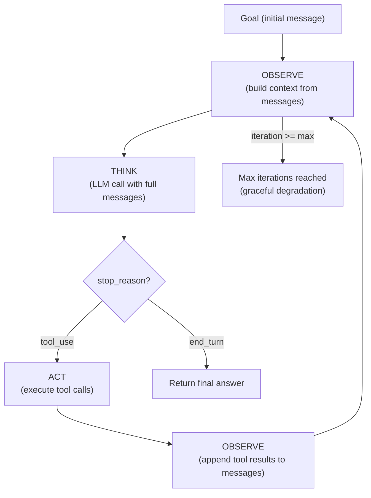
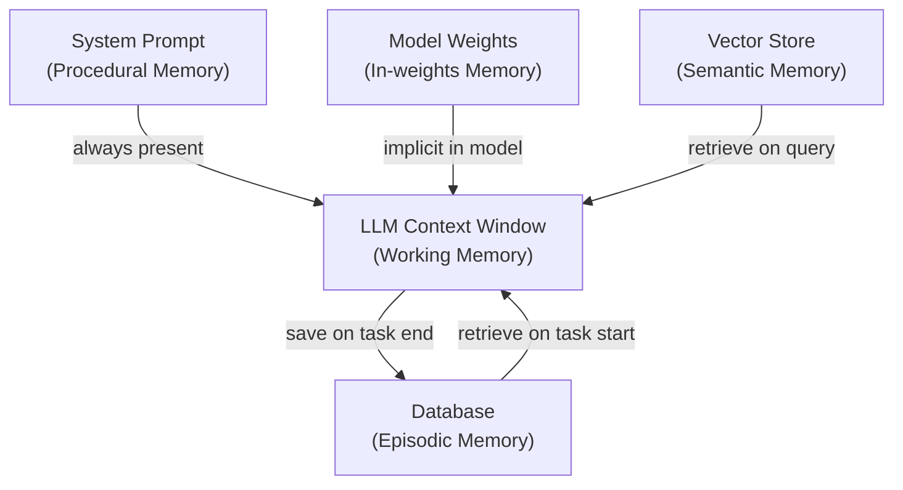

## Keywords in This File
{: .no_toc }

| # | Keyword | Weight |
|---|---|---|
| 1 | [Agent Loop - Observe-Think-Act](#agent-loop---observe-think-act) | ★☆☆ |
| 2 | [Tool Use in Agents](#tool-use-in-agents) | ★☆☆ |
| 3 | [Agent Memory Types](#agent-memory-types) | ★☆☆ |

---

# Agent Loop - Observe-Think-Act

**Interview Weight:** ★☆☆ - The fundamental building
block of all agent architectures.

---

### 🎯 Model Answer

**30 seconds:**

> The observe-think-act loop is the execution cycle
> of an AI agent. Observe: gather current state (goal,
> previous actions, tool results, context). Think:
> the LLM reasons about what to do next given the
> current state. Act: execute the chosen action
> (tool call or produce final answer). The loop
> repeats until the task is complete or a termination
> condition is met. All agent architectures are
> implementations of this loop.

**3 minutes:**

> Observe phase: building the LLM's context. This
> includes: the original goal or task description,
> the conversation/task history (all previous observe-
> think-act iterations), results from previous tool
> calls, any retrieved context (from RAG or memory),
> and constraints or instructions. Everything the
> LLM needs to decide its next action.
>
> Think phase: the LLM call. Given all observations,
> the model reasons and produces one of: (a) a tool
> use request (with tool name and arguments) - signals
> "continue the loop"; (b) a text response - signals
> "done, here is the answer." The model's "thinking"
> is implicit in its training; with Chain of Thought
> or ReAct prompting, the reasoning is made explicit
> in the output.
>
> Act phase: execute what the LLM decided. If tool_use:
> call the named function with the provided arguments,
> capture the result, format it as a tool_result message.
> If text response: return it as the final output.
>
> The loop in code: send messages to LLM -> if stop_reason
> is "tool_use": append LLM response + tool results to
> messages, repeat. If stop_reason is "end_turn": done.
>
> Termination conditions: the LLM signals completion
> (end_turn), max iterations reached (safety limit),
> timeout (wall clock limit), or explicit error
> (unrecoverable tool failure).

**Blank Mind Recovery:**

**(1) Restate:** "What is the basic execution cycle
of an AI agent?"

**(2) First principles:** "An agent needs to observe
its environment, decide what to do, and then do it.
This is the same as the control loop in any autonomous
system: sense - plan - act."

---

### 📘 Concept Explanation

**What it is:**

The observe-think-act loop is the core execution
model for AI agents. Each iteration: the agent
observes the current state (building the LLM context),
calls the LLM to decide the next action (think),
executes the action (act), and feeds the result
back into the next observation. The loop terminates
when the goal is achieved or a limit is hit.

**How it maps to the Anthropic API:**

```python
# The loop maps directly to the API:

messages = [goal_message]         # Initial observe

while True:
    # THINK: call LLM with observations
    response = anthropic.messages.create(
        messages=messages, tools=tools
    )

    if response.stop_reason == "end_turn":
        return response             # Loop done

    # ACT: execute tool calls
    results = execute_tools(response)

    # OBSERVE: add results to messages
    messages.append(response.content)    # LLM output
    messages.append(tool_results)        # Tool results
    # Next iteration: LLM sees updated messages
```

**Phases in detail:**

```
OBSERVE (what goes into messages[]):
  - Original goal (user message)
  - All previous assistant messages
    (LLM reasoning + tool call requests)
  - All previous tool results
    (tool execution outputs)
  - Any injected context (system prompt,
    retrieved docs)

THINK (the LLM call):
  - Receives all observations as messages
  - Produces: tool_use block OR text block
  - stop_reason: "tool_use" or "end_turn"

ACT (tool execution):
  - Call the named tool function
  - With the arguments the LLM specified
  - Return result as tool_result message
  - Append to messages for next observe
```

**The key insight:**

The loop is the agent. The quality of an agent
depends on: (1) what information is in the observe
phase (context quality), (2) how well the LLM reasons
in the think phase (model capability + prompting),
and (3) how reliable tools are in the act phase.
Engineering all three is agent development.

---

### 💻 Code Example

```python
import anthropic
import json

# The observe-think-act loop, explicitly annotated

def run_ota_loop(
    goal: str,
    tools: list[dict],
    tool_fns: dict,
    system: str = "Complete the goal using tools.",
    max_iter: int = 15
) -> str:
    client = anthropic.Anthropic()

    # INITIAL OBSERVE: start with the goal
    messages = [{"role": "user", "content": goal}]

    for i in range(max_iter):
        # ---- THINK ----
        response = client.messages.create(
            model="claude-sonnet-4-5",
            max_tokens=4096,
            system=system,
            tools=tools,
            messages=messages
        )

        # ---- DECIDE: done or act? ----
        if response.stop_reason == "end_turn":
            # Final answer
            for block in response.content:
                if hasattr(block, 'text'):
                    return block.text
            return "Done."

        if response.stop_reason != "tool_use":
            return f"Unexpected stop: {response.stop_reason}"

        # ---- ACT ----
        # Add LLM response to message history
        messages.append({
            "role": "assistant",
            "content": response.content
        })

        # Execute each tool call
        tool_results = []
        for block in response.content:
            if block.type != "tool_use":
                continue

            fn = tool_fns.get(block.name)
            if not fn:
                result = f"Error: unknown tool {block.name}"
            else:
                try:
                    result = fn(**block.input)
                    # Ensure result is a string
                    if not isinstance(result, str):
                        result = json.dumps(result)
                except Exception as e:
                    result = f"Tool error: {e}"

            tool_results.append({
                "type": "tool_result",
                "tool_use_id": block.id,
                "content": result
            })

        # ---- OBSERVE: add tool results ----
        messages.append({
            "role": "user",
            "content": tool_results
        })

    return "Agent reached iteration limit."
```

> **Code walkthrough:** The loop structure matches
> the observe-think-act model precisely. The `messages`
> list is the observation buffer - it accumulates
> the full history of the task. The `client.messages.create`
> call is the think phase. The `stop_reason` check
> determines whether the agent acts or terminates.
> Tool execution is the act phase - each tool call
> in the response is executed and its result appended
> to `messages`. The next iteration's think phase sees
> all previous observations plus the new tool results.
> The max_iter guard prevents infinite loops. Error
> handling in the act phase returns structured error
> text (not raised exceptions) so the LLM can read
> the error and adapt.

---

### 🎓 Answers by Seniority

**Junior / Mid:**

> "The observe-think-act loop: observe is building
> the LLM's context (goal + history + tool results),
> think is calling the LLM to decide the next action,
> act is executing the tool. The loop repeats until
> the LLM says it's done (end_turn) or we hit the
> max iteration limit."

---

**Senior / Staff:**

> "The OTA loop's quality is bounded by: observe
> quality (does the LLM have the right context?),
> think quality (does the model reason correctly
> given that context?), and act reliability (do
> tools return correct, usable results?). Engineering
> the loop means optimizing all three. Common
> production failures: observe too much (context
> overflow), think without direction (ambiguous goal),
> act without error handling (tool failures silently
> corrupt state)."

---

### ⚠️ Common Misconceptions

**Misconception: "The think phase is where all
the intelligence lives."**

The observe phase is equally important. The LLM's
reasoning quality depends on what it can see. A
capable model with a poor observation (missing context,
wrong tool results, corrupted state) produces wrong
decisions. Garbage in, garbage out applies to the
observe phase directly.

---

### 🚨 Failure Modes and Diagnosis

**Failure: Loop oscillates between two states**

*Symptom:* Agent alternates between the same two
tool calls without progress.

*Root cause:* The LLM is stuck in a reasoning loop.
Tool A produces a result that suggests tool B. Tool
B produces a result that suggests tool A.

*Fix:* Detect repetition in the loop. If the same
tool name is called with the same arguments in
consecutive iterations: inject an intervention message:
"Previous approach is not converging. Try a different
method or declare the task cannot be completed."

---

### 🎯 Interview Deep-Dive

| Seniority | Time | Focus |
|---|---|---|
| Junior | 3 min | Name and describe each phase |
| Mid | 5 min | How phases map to API, loop termination |
| Senior | 7 min | Loop engineering, failure modes, optimizations |

---

**[JUNIOR] Q1 - What are the three phases of the
agent loop and what happens in each?**

Observe: gather everything the agent knows. Concretely:
the message history array, including the original
goal, all previous LLM responses, and all previous
tool results. This is the LLM's full view of the task.

Think: call the LLM with all observations. The LLM
outputs either a tool call request (stop_reason =
"tool_use") or a final text response (stop_reason =
"end_turn"). This is the only step where the LLM
is involved; the other two are application code.

Act: if tool call requested - execute the named
function with the provided arguments, format the
result as a tool_result message. If final response -
return to caller.

*What separates good from great:* "Only think involves
the LLM" - the other two phases are application code,
which means they can be engineered, tested, and
debugged independently.

---

**[MID] Q2 - How do you implement graceful termination
when the iteration limit is reached?**

Without graceful termination: the loop exits and
returns a generic "limit reached" error. The user
gets no useful output.

With graceful termination: before the final iteration,
inject a message: "You have 1 iteration remaining.
Provide your best final answer using what you have
gathered so far. It's OK to acknowledge if the task
is incomplete."

This gives the LLM a chance to produce a partial
answer that summarizes progress, rather than failing
silently. The caller receives a useful response
instead of an error.

Implementation:
```python
if i == max_iter - 2:  # second-to-last iteration
    messages.append({
        "role": "user",
        "content": (
            "FINAL ITERATION: Provide your best answer "
            "now using what you have gathered. "
            "Acknowledge if task is incomplete."
        )
    })
```

*What separates good from great:* The second-to-last
injection (not the last - the LLM needs one more
iteration to respond to the warning).

---

**[MID] Q3 - [TRADE-OFF] How does adding more
context to the observe phase affect agent performance?**

More context advantages: the LLM has more information
to make decisions. Better decisions for complex tasks
with many dependencies.

More context disadvantages: (1) cost - more input
tokens per iteration; (2) quality - "lost in the
middle" effect: models attend less to information
in the middle of a long context; (3) latency - more
tokens = higher TTFT; (4) context overflow - if
context grows without bound across iterations, it
eventually hits the context window limit.

Balance strategy: include the minimum context needed
for the current decision. For retrieval-heavy agents:
inject retrieved context per iteration based on
the current subtask (not the full knowledge base
upfront). For long tasks: summarize completed steps
rather than including full detail.

*What separates good from great:* "Lost in the middle"
effect - a specific quality degradation mechanism
for long contexts, not just a vague "more is worse."

---

**[JUNIOR] Q4 - What is the stop_reason and why
does it matter in the agent loop?**

The `stop_reason` in an LLM API response indicates
why the model stopped generating. For agent loops,
the key values:

- `"end_turn"`: the model completed its response.
  This is the exit signal - the agent has a final
  answer.
- `"tool_use"`: the model wants to use a tool.
  This is the continue signal - execute the tool
  and loop.
- `"max_tokens"`: the response was truncated because
  it hit the max_tokens limit. This is a problem -
  the response may be incomplete. Increase max_tokens
  or detect this case and retry.
- `"stop_sequence"`: model hit a stop sequence.
  Usually a sign of incorrect prompting.

Always check stop_reason explicitly. Do not assume
that a successful API response means the agent is
done. A `"max_tokens"` stop often means a truncated
tool call that will crash parsing.

*What separates good from great:* The `max_tokens`
stop as a common production bug source (truncated
tool calls that fail JSON parsing).

---

**[MID] Q5 - How does the observe phase differ
between the first iteration and subsequent ones?**

First iteration: observe = just the goal. The agent
starts with the user's request and nothing else
(plus the system prompt).

Subsequent iterations: observe = goal + all previous
think outputs (LLM reasoning + tool call requests) +
all previous act outputs (tool results). Each iteration
accumulates: the LLM now sees its own previous reasoning
and what the tools returned.

The accumulation is why the message history is ordered:
user (goal) -> assistant (reasoning + tool call) ->
user (tool results) -> assistant (next reasoning) ->
... This alternating structure is required by the
Anthropic API (no two consecutive messages from the
same role).

Practical implication: the message history grows
with each iteration. After 10 iterations, the observe
phase may contain thousands of tokens. Context
window management becomes important for long tasks.

*What separates good from great:* The alternating
user/assistant role requirement and its connection
to context growth management.

---

**[JUNIOR] Q6 - What happens if a tool call fails
during the act phase?**

A tool call can fail in several ways:
(1) Function raises an exception
(2) Tool returns malformed data (not parseable)
(3) External service the tool calls is down
(4) Tool call arguments are invalid

In all cases, the agent loop must not crash. The
standard pattern: wrap tool execution in try/except,
catch all exceptions, return the error as a string
in the tool_result content:

```python
try:
    result = tool_fn(**args)
except Exception as e:
    result = f"Error: {str(e)}"
```

The LLM receives the error in the next observe phase
and can adapt: retry with different arguments, try
a different tool, or acknowledge that the task cannot
be completed.

Never let a tool exception propagate and crash the
loop. The error should be observable to the LLM,
not a crash.

*What separates good from great:* "The error should
be observable to the LLM" - the error as data the
agent reasons about, not an unhandled exception.

---

**[JUNIOR] Q7 - What is the max_iterations parameter
and how do you choose the right value?**

`max_iterations` is a hard cap on how many observe-
think-act cycles the agent can perform before being
forced to terminate.

Purpose: prevents infinite loops (agent reasoning
loops without converging) and bounds cost (each
iteration costs at least one LLM call).

How to choose: start with an estimate of how many
steps the task should take in the normal case. Multiply
by 2-3 for headroom. Examples:
- Simple lookup task (find a fact, summarize it):
  5-7 iterations
- Research task (search 5 sources, synthesize):
  15-20 iterations
- Complex coding task (read, write, test, fix):
  30-50 iterations

For background tasks: be generous. An agent that
hits the limit and fails is worse than one that
takes more steps than expected.

For user-facing real-time tasks: keep limits tight
(10-15 iterations) and handle limit gracefully
(return partial result, not error).

*What separates good from great:* The real-time
vs. background distinction - different limit strategies
based on UX requirements.

---

### ⚖️ Comparison Table

*(Omit: ★☆☆ foundational concept.)*

---

### 🏛️ System Design

*(Omit: ★☆☆ concept.)*

---

### 📊 Diagram

```
OBSERVE-THINK-ACT LOOP:

messages = [goal]
  THINK: LLM(messages) -> response
    |
    +-- stop=end_turn  -> return answer
    |
    +-- stop=tool_use  -> ACT: execute tool
                          OBSERVE: messages.append(result)
                          -> THINK (next iteration)
```



> **Diagram walkthrough:** The loop starts with the
> goal as the initial observation. The THINK phase
> (LLM call) checks the stop_reason. If "end_turn",
> the task is done and the answer is returned. If
> "tool_use", the ACT phase executes the requested
> tools. The results are appended to the messages
> array (OBSERVE update) and the loop returns to the
> top for the next THINK. The iteration counter guards
> against infinite loops. Every path through the diagram
> accumulates information in the messages array, giving
> each THINK phase more context than the previous one.

---

---

# Tool Use in Agents

**Interview Weight:** ★☆☆ - Tools are how agents
interact with the world. Every agent interview
covers this.

---

### 🎯 Model Answer

**30 seconds:**

> Tools are functions that an LLM agent can call
> to take actions or retrieve information. Each tool
> has a schema: name, description (how the LLM decides
> when to use it), and parameter definitions. The LLM
> produces tool call requests with arguments; the
> orchestration layer executes the actual function.
> Tool design is primarily a prompt engineering problem:
> the description determines whether the LLM uses
> the right tool at the right time.

**3 minutes:**

> Tool schema anatomy:
> - Name: unique identifier ("web_search", "read_file")
> - Description: tells the LLM what the tool does,
>   when to use it, what it returns, and any limitations.
>   This is the most important field - bad descriptions
>   cause wrong tool selection.
> - Input schema: JSON Schema defining parameters.
>   Properties and their descriptions tell the LLM
>   what values to pass.
>
> Tool categories: information retrieval (search, query,
> fetch), actions (write, delete, send, create), code
> execution (Python, shell), human interaction (ask user,
> request approval).
>
> Tool execution: the LLM does NOT execute tools. The
> LLM produces a tool_use block with the tool name and
> arguments. The application layer is responsible for
> actually calling the function and returning the result.
> This separation is important: you control what tools
> do, how they fail, and what they return.
>
> Tool design principles: (1) single responsibility,
> (2) informative return values (the LLM needs to
> understand what happened), (3) explicit descriptions
> for destructive tools ("This tool PERMANENTLY DELETES
> a record"), (4) idempotent reads, careful writes.

**Blank Mind Recovery:**

**(1) Restate:** "How do tools work in an LLM agent?"

**(2) First principles:** "Tools are the agent's
hands - how it affects the world. The LLM says 'I
want to do X' (tool call request), and your code
actually does X (tool execution)."

---

### 📘 Concept Explanation

**What it is:**

Tools (also called "function calling") are the
mechanism by which an LLM agent can take actions
beyond text generation. The LLM outputs a structured
request to call a named function with specified
arguments. The application layer executes the function
and returns the result. The result is added to the
message history for the LLM to observe.

**Tool schema structure (Anthropic format):**

```python
web_search_tool = {
    "name": "web_search",
    "description": (
        "Search the web for current information,"
        " news, or documentation. Use when you need"
        " information that may not be in your training"
        " data. Returns titles, URLs, and snippets."
        " Not suitable for private/internal information."
    ),
    "input_schema": {
        "type": "object",
        "properties": {
            "query": {
                "type": "string",
                "description": (
                    "A specific search query. "
                    "Use precise keywords."
                )
            },
            "num_results": {
                "type": "integer",
                "description": "Number of results, 1-10.",
                "default": 5
            }
        },
        "required": ["query"]
    }
}
```

**How tool execution works:**

```
LLM produces:
  {
    "type": "tool_use",
    "id": "toolu_01abc...",
    "name": "web_search",
    "input": {"query": "Python 3.12 new features"}
  }

Application executes:
  result = web_search(query="Python 3.12 new features")

Application returns to LLM:
  {
    "type": "tool_result",
    "tool_use_id": "toolu_01abc...",
    "content": "[{'title': '...', 'snippet': '...'}]"
  }
```

**The key insight:**

The LLM does not run code. It makes requests. The
application layer owns execution. This means: you
can add safety checks, confirmation gates, rate
limits, and logging around every tool call,
independently of the LLM.

---

### 💻 Code Example

```python
# BAD: poorly designed tool descriptions
BAD_TOOLS = [
    {
        "name": "db_query",
        "description": "query the database",
        # Too vague: what database? What query format?
        # When should the agent use this?
        "input_schema": {
            "type": "object",
            "properties": {
                "q": {
                    "type": "string"
                    # No description: what goes here?
                }
            }
        }
    }
]

# GOOD: well-designed tool descriptions
GOOD_TOOLS = [
    {
        "name": "query_customer_db",
        "description": (
            "Query the customer database to look up"
            " customer information by ID, email, or name."
            " Returns customer profile including: id,"
            " name, email, plan, created_at, status."
            " Use when you need customer details for"
            " a support or billing task."
            " READ-ONLY. Does not modify data."
        ),
        "input_schema": {
            "type": "object",
            "properties": {
                "identifier": {
                    "type": "string",
                    "description": (
                        "Customer lookup value: can be"
                        " customer ID (e.g. 'cust_123'),"
                        " email address, or full name."
                    )
                },
                "field": {
                    "type": "string",
                    "description": (
                        "Optional: specific field to"
                        " return (id, email, plan, status)."
                        " Omit for full profile."
                    )
                }
            },
            "required": ["identifier"]
        }
    },
    {
        "name": "update_customer_plan",
        "description": (
            "WRITE OPERATION: Updates a customer's"
            " subscription plan. This IMMEDIATELY changes"
            " the customer's billing. Only call when"
            " explicitly confirmed by the customer."
            " Returns the updated plan name."
        ),
        "input_schema": {
            "type": "object",
            "properties": {
                "customer_id": {
                    "type": "string",
                    "description": "Customer ID (cust_...)"
                },
                "new_plan": {
                    "type": "string",
                    "description": (
                        "Plan name: 'basic', 'pro',"
                        " or 'enterprise'"
                    )
                }
            },
            "required": ["customer_id", "new_plan"]
        }
    }
]
```

> **Code walkthrough:** The BAD tools have minimal
> descriptions and ambiguous parameter names. The LLM
> cannot determine from the schema alone when to use
> "db_query" or what to pass as "q". The GOOD tools
> tell the LLM exactly: what the tool does, when to
> use it, what it returns, whether it's read or write,
> and what format each parameter expects. The "WRITE
> OPERATION" and "IMMEDIATELY changes billing" warnings
> in the write tool description serve a safety function:
> the LLM is more likely to confirm with the user
> before calling a tool it recognizes as consequential.
> Tool description engineering is the primary lever
> for correct tool selection.

---

### 🎓 Answers by Seniority

**Junior / Mid:**

> "Tools are functions the LLM can call. Each tool
> has a name, a description (which tells the LLM when
> to use it), and a parameter schema. The LLM produces
> tool call requests; my code actually executes the
> function and returns the result. The most important
> design decision is the description - it's what
> the LLM reads to decide which tool to use."

---

**Senior / Staff:**

> "Tool design is primarily a prompt engineering
> problem. The description is the only information
> the LLM has about when and how to use the tool.
> Bad descriptions lead to wrong tool selection,
> wrong parameter values, and incorrect agent behavior.
>
> Safety critical: write tools (those with side effects)
> must be labeled explicitly in their description.
> The LLM will not know that 'update_customer' modifies
> a database unless the description says so. And the
> application layer should add a confirmation gate
> around all write tools, independent of what the
> description says."

---

### ⚠️ Common Misconceptions

**Misconception: "The LLM executes the tools."**

The LLM produces a structured request to call a
tool. The application layer (your code) executes
the actual function. This is why you can add safety
checks, rate limiting, logging, and confirmation
gates around every tool call - the execution is
entirely in your control.

---

### 🚨 Failure Modes and Diagnosis

**Failure: LLM calls the wrong tool or with wrong arguments**

*Symptom:* Agent uses tool A when it should use
tool B, or passes incorrect argument values.

*Root cause:* Tool description is ambiguous (too
short, or doesn't clarify when to use it), or
parameter descriptions don't explain the format.

*Diagnosis:* Log the tool call request from the LLM.
Compare the requested tool and arguments to the
expected behavior. Review the tool description -
is it clear enough to select the right tool?

*Fix:* Improve the description. Add examples of when
to use (and not use) the tool. Add `enum` constraints
on parameters where applicable to reduce the argument
space.

---

### 🎯 Interview Deep-Dive

| Seniority | Time | Focus |
|---|---|---|
| Junior | 3 min | Tool schema structure, how execution works |
| Mid | 5 min | Description design, safe vs. unsafe tools |
| Senior | 7 min | Tool design principles, production safety |

---

**[JUNIOR] Q1 - What are the required components
of a tool definition?**

Name: unique string identifier. Used by the LLM
to request the tool and by the application to route
the call to the right function.

Description: natural language description. This is
what the LLM reads to decide when to call the tool.
Include: what the tool does, when to use it, what
it returns, any limitations or warnings.

Input schema: JSON Schema object defining the
parameters. Each property should have a type and
description. Mark required parameters with `required`.

These three are the minimum. The description is the
most important.

*What separates good from great:* Emphasizing that
the description drives LLM behavior, not the name.

---

**[MID] Q2 - How do you make a tool safe for use
in a production agent?**

(1) Explicit description for write operations: "WRITE:
    This tool sends an email / deletes a record /
    charges a payment. Only call when explicitly
    authorized by the user."

(2) Application-layer confirmation: for irreversible
    operations, implement a confirmation step in
    the orchestration layer. Before executing the
    tool: present the proposed action to the user.
    Execute only if confirmed.

(3) Input validation: validate tool arguments before
    execution. Check: IDs exist in the database,
    values are in expected ranges, required fields
    are present. Return error to the LLM if invalid.

(4) Idempotency: design write tools so re-calling
    with the same arguments does not double-execute.
    Use idempotency keys (UUID passed with the request
    that deduplicates on the server).

(5) Minimal permissions: the tool function should
    only have access to what it needs. A read tool
    should not have write credentials.

*What separates good from great:* Idempotency keys
as a specific implementation technique for safe retries.

---

**[MID] Q3 - [DEBUGGING] How do you debug incorrect
tool selection by the LLM?**

Step 1: log the exact tool call request (tool name
+ arguments) and the messages that preceded it.
This shows exactly what the LLM decided and why.

Step 2: review the tool descriptions. Is the correct
tool's description clear about when to use it?
Is there ambiguity between two tools? Does the
correct tool's description say what the LLM would
expect from a relevant query?

Step 3: test tool selection in isolation. In the
Anthropic console or a test script, send just the
relevant message with all tools and ask the model
which tool it would use. Observe which tool is selected.

Step 4: add disambiguation. If two tools are similar,
add explicit disambiguation in both descriptions:
"Use this for customer billing questions (not order
queries)." "Use this for order status queries (not
billing)."

Step 5: add few-shot examples. If rule-based descriptions
are insufficient, add 1-2 examples in the system
prompt: "To look up a customer: use query_customer_db.
To send an email: use send_email."

*What separates good from great:* Few-shot examples
for disambiguation - when description text isn't
enough.

---

**[JUNIOR] Q4 - What is the tool_result message
and what should it contain?**

The tool_result message is sent by the application
to the LLM after executing a tool call. It tells
the LLM what happened.

Required: the tool_use_id (matching the LLM's tool
call request), and the content (the tool's output).

Content should be: a string (or structured text)
that the LLM can read and understand. If the tool
returns a dict, serialize it to JSON. If the tool
failed, return the error message.

Avoid: returning binary data or data structures
the LLM cannot parse. Return human-readable text
or JSON strings.

Example:
```python
{
    "type": "tool_result",
    "tool_use_id": "toolu_01abc...",
    "content": (
        '{"customer_id": "cust_123", '
        '"name": "Alice Smith", '
        '"plan": "pro", "status": "active"}'
    )
}
```

*What separates good from great:* The match between
tool_use_id and the original request - if they don't
match, the LLM won't associate the result with the
right tool call.

---

**[MID] Q5 - How many tools should an agent have?**

More tools = more power but more confusion. The LLM
must select the right tool from all available options.
As the tool count grows, tool selection accuracy
decreases (the LLM may pick the wrong tool from a
large set).

Practical guidelines:
- 3-5 tools: optimal for most tasks. Easy for the
  LLM to select correctly.
- 5-10 tools: still manageable. Use clear, non-
  overlapping descriptions.
- 10-20 tools: selection quality starts to degrade.
  Use tool groups (present only relevant tools for
  each task phase).
- 20+ tools: use dynamic tool loading. At each step,
  load only the tools relevant to the current sub-task.

Dynamic tool loading: instead of passing all 30 tools
to every LLM call, use a tool router (a second LLM
call or rule-based logic) to select the 5-7 most
relevant tools for the current step.

*What separates good from great:* Dynamic tool loading
for large tool sets - a real production technique.

---

**[JUNIOR] Q6 - What is the difference between
a tool that reads vs. one that writes?**

Read tools: retrieve information without side effects.
Examples: web_search, query_database, read_file,
fetch_url. Safe to retry. No confirmation needed.
The agent can call them multiple times with no harm.

Write tools: take actions with side effects. Examples:
send_email, create_record, delete_file, charge_payment,
update_status. May be irreversible. Should not be
retried without verification. Require confirmation
gates for high-stakes operations.

Design implications:
- Label write tools explicitly in their descriptions
- Add application-layer confirmation for irreversible writes
- Log all write tool calls with the agent trace ID
- Design writes to be idempotent where possible

Rule: when in doubt, err toward making a tool read-only
and exposing a separate explicit write tool. Splitting
"get_order" and "update_order" is better than one
"order_tool" that does both.

*What separates good from great:* "Split read and
write into separate tools" rather than combining
them - better tool selection and safer agent behavior.

---

**[JUNIOR] Q7 - What happens if the LLM calls a
tool with invalid arguments?**

The LLM may produce tool call arguments that are
invalid: wrong data type, out-of-range value, unknown
enum value, or a missing required parameter (rare,
since the schema is enforced by the API).

Application-layer validation: before calling the
actual function, validate the arguments. If invalid:
return a descriptive tool_result error message to
the LLM:

```python
def execute_tool_safe(name, args):
    # Validate customer_id format
    if name == "query_customer":
        cid = args.get("customer_id", "")
        if not cid.startswith("cust_"):
            return {
                "type": "tool_result",
                "tool_use_id": args["_id"],
                "content": (
                    "Error: customer_id must start"
                    " with 'cust_'. Got: " + cid
                )
            }
    return call_actual_function(name, args)
```

The LLM receives the error and can correct its
arguments on the next iteration.

*What separates good from great:* Returning the
correction hint ("must start with 'cust_'") so the
LLM can fix the argument rather than just failing.

---

### ⚖️ Comparison Table

*(Omit: ★☆☆ foundational concept.)*

---

### 🏛️ System Design

*(Omit: ★☆☆ concept.)*

---

### 📊 Diagram

*(Omit: tool use is fully described by the code
examples and text. A visual adds no clarity.)*

---

---

# Agent Memory Types

**Interview Weight:** ★☆☆ - Memory architecture
is fundamental to understanding what an agent can
know and for how long.

---

### 🎯 Model Answer

**30 seconds:**

> Agents have four memory types: (1) in-context working
> memory - the LLM's context window, holds the current
> task state; (2) external storage - databases, vector
> stores, key-value stores outside the context window;
> (3) in-weights memory - knowledge baked into the
> model via training; (4) in-cache memory - KV cache
> from prior computation. For engineering: working
> memory (context window management) and external
> storage (what to persist and retrieve) are the
> two you design. In-weights and in-cache are model
> infrastructure.

**3 minutes:**

> Working memory (in-context): the message history
> array in the current LLM call. Everything the agent
> can "see" and reason about. Bounded by the context
> window. Fast (already loaded). Expensive (every
> token in context costs money). Lost when the call ends.
>
> External storage: information that persists outside
> the context window. Three sub-types:
> (1) Episodic: log of past agent runs. What tasks
>     were done, what results were obtained. Retrieved
>     by recency or task similarity.
> (2) Semantic: domain knowledge. Facts, documents.
>     Stored in a vector store. Retrieved by semantic
>     search.
> (3) Procedural: how-to knowledge. What steps to
>     take for a given task. Often encoded in the
>     system prompt rather than retrieved dynamically.
>
> In-weights memory: knowledge the model learned
> during training. Can't be updated at runtime.
> The model knows what was in its training data.
> This is why hallucinations occur: the model fills
> gaps in its in-weights memory with plausible-sounding
> fabrications.
>
> The engineering questions: what information should
> be in working memory vs. retrieved from external
> storage? How do you decide what to store between
> agent runs? How do you retrieve the right information
> efficiently?

**Blank Mind Recovery:**

**(1) Restate:** "What kinds of memory does an
AI agent have?"

**(2) First principles:** "Memory is anything the
agent knows. Some knowledge is temporary (current
task context), some is stored between tasks (external
database), and some is baked into the model (training)."

---

### 📘 Concept Explanation

**What it is:**

Agent memory types are the different storage mechanisms
an AI agent uses to hold and access information:
working memory (in-context, current task), episodic
memory (past task logs), semantic memory (domain
knowledge in a vector store), procedural memory
(task instructions in the system prompt), and
in-weights memory (model training knowledge).

**The four types mapped to implementations:**

```
MEMORY TYPE     | STORAGE           | SCOPE         | SPEED
----------------|-------------------|---------------|------
Working memory  | LLM context window| Current call  | Fast
Episodic memory | Relational DB /   | Cross-session | Medium
                | document store    |               |
Semantic memory | Vector store      | Cross-session | Medium
Procedural mem. | System prompt     | Per-agent type| Fast
In-weights mem. | Model parameters  | Universal     | Instant
```

**When to use each:**

Working memory: facts needed for the current task.
Episodic memory: "what did I do last time for this
    user / task type?"
Semantic memory: "what domain knowledge do I need
    for this query?" (RAG)
Procedural memory: "how do I handle this type of task?"
    (system prompt instructions)
In-weights memory: general knowledge, no engineering
    needed (but verify for domain-specific facts)

**The key insight:**

The context window is the agent's working memory.
Everything the agent can "think about" must fit in
it. External storage extends memory beyond the
context window, but requires retrieval (an extra
step). Good memory architecture minimizes retrieval
overhead while ensuring the agent has the context
it needs.

---

### 💻 Code Example

```python
# Implementing episodic memory for an agent

import sqlite3, json, anthropic
from datetime import datetime

class AgentWithMemory:
    """Agent with episodic memory stored in SQLite."""

    def __init__(self, db_path: str = "agent_memory.db"):
        self.client = anthropic.Anthropic()
        self.conn = sqlite3.connect(db_path)
        self._init_db()

    def _init_db(self):
        self.conn.execute("""
            CREATE TABLE IF NOT EXISTS episodes (
                id INTEGER PRIMARY KEY AUTOINCREMENT,
                task TEXT,
                goal TEXT,
                outcome TEXT,
                key_facts TEXT,
                created_at TEXT
            )
        """)
        self.conn.commit()

    def _retrieve_similar_episodes(
        self, goal: str, limit: int = 3
    ) -> str:
        """Get recent related episodes."""
        # Simple: last N episodes
        # Production: semantic search
        rows = self.conn.execute(
            "SELECT goal, outcome, key_facts "
            "FROM episodes ORDER BY id DESC LIMIT ?",
            (limit,)
        ).fetchall()

        if not rows:
            return ""

        episodes = "\n".join(
            f"- Goal: {r[0]} | Result: {r[1]}"
            for r in rows
        )
        return f"Past similar tasks:\n{episodes}"

    def _save_episode(
        self, goal: str, outcome: str, facts: list
    ):
        """Save this agent run to episodic memory."""
        self.conn.execute(
            "INSERT INTO episodes "
            "(goal, outcome, key_facts, created_at) "
            "VALUES (?, ?, ?, ?)",
            (
                goal,
                outcome,
                json.dumps(facts),
                datetime.utcnow().isoformat()
            )
        )
        self.conn.commit()

    def run(self, goal: str) -> str:
        # 1. Retrieve relevant episodic context
        past = self._retrieve_similar_episodes(goal)

        # 2. Build system with episodic context
        system = (
            "You are an agent. Complete the goal.\n\n"
        )
        if past:
            system += (
                "Context from past similar tasks:\n"
                f"{past}\n\n"
            )

        # 3. Run agent loop (simplified)
        messages = [{"role": "user", "content": goal}]
        resp = self.client.messages.create(
            model="claude-sonnet-4-5",
            max_tokens=2048,
            system=system,
            messages=messages
        )
        result = resp.content[0].text

        # 4. Save to episodic memory
        self._save_episode(
            goal=goal,
            outcome=result[:200],
            facts=[goal, result[:100]]
        )

        return result
```

> **Code walkthrough:** `AgentWithMemory` implements
> episodic memory using SQLite. On each run, it retrieves
> the most recent related episodes and injects them
> into the system prompt as context ("past similar
> tasks"). This enables the agent to learn from prior
> runs: if it successfully handled a similar task before,
> that knowledge is available. After the run, the episode
> (goal + outcome + key facts) is stored for future
> retrieval. The retrieval here is simple (last N rows);
> production systems use semantic search (vector similarity)
> to retrieve the most relevant past episodes, not just
> the most recent.

---

### 🎓 Answers by Seniority

**Junior / Mid:**

> "Agents have four memory types: working memory
> (the LLM's context window for the current task),
> episodic memory (stored logs of past tasks), semantic
> memory (domain knowledge in a vector store for RAG),
> and in-weights memory (what the model learned from
> training). I engineer working memory (context window
> management) and external memory (what to store and
> retrieve) - the other two are model infrastructure."

---

**Senior / Staff:**

> "Memory architecture determines the agent's knowledge
> envelope. The context window is the bottleneck:
> everything the agent reasons about must fit in it.
> My architecture decisions: what is always in the
> system prompt (procedural), what is retrieved per
> task (semantic/episodic), and what is accumulated
> during execution (working memory). The goal is to
> have the minimum working memory that enables correct
> decisions - more context = more cost = more noise."

---

### ⚠️ Common Misconceptions

**Misconception: "Larger context windows eliminate
the need for external memory."**

Large context windows (200k+) reduce but don't
eliminate external memory needs: (1) cost - a 200k
context at Sonnet rates costs $0.60/call; (2) external
storage scales beyond any context window (a 10M
document knowledge base cannot fit in any current
context); (3) episodic memory spans across sessions
and must persist between process restarts.

---

### 🚨 Failure Modes and Diagnosis

**Failure: Agent makes the same mistake on repeated
tasks**

*Symptom:* Agent fails the same type of task it
has failed before. No learning across runs.

*Root cause:* No episodic memory. Each run starts
from scratch with no context from past runs.

*Fix:* Implement episodic memory. After each run:
store the goal, approach taken, outcome, and any
key learnings. On the next similar run: retrieve
and inject relevant episodes. Include failure cases:
"Last time we tried approach X for this type of
task, it failed with error Y. Try approach Z instead."

---

### 🎯 Interview Deep-Dive

| Seniority | Time | Focus |
|---|---|---|
| Junior | 3 min | Name four types, basic description |
| Mid | 5 min | Implementation of each type, trade-offs |
| Senior | 7 min | Memory architecture design, retrieval strategy |

---

**[JUNIOR] Q1 - What are the four types of agent
memory and what does each store?**

Working memory (in-context): the current task's
message history. What the agent is actively processing
right now. Bounded by context window. Lost after task.

Episodic memory (external): records of past agent
runs. "What happened when I did X task?" Stored in
a database. Persists between runs. Useful for learning
from past successes and failures.

Semantic memory (external): domain knowledge. Facts,
documents, code. Stored in a vector store. Retrieved
by semantic similarity to the current query. This
is what RAG uses.

Procedural memory (system prompt / in-context): how
to do things. Task instructions, agent persona,
workflow steps. Typically encoded in the system prompt
so it's always available.

In-weights memory: everything the model learned
during training. Not modifiable at runtime. Provides
general world knowledge but may be outdated or
incorrect for specific domains.

*What separates good from great:* Procedural memory
as the system prompt - making the connection between
an abstract memory type and a concrete implementation.

---

**[MID] Q2 - [TRADE-OFF] When should you use semantic
memory (RAG) vs. including information in the
system prompt?**

System prompt (always in context):
- Use for: core instructions, agent persona, workflow
  rules, 5-20 key facts always needed
- Pros: always available, no retrieval overhead,
  zero latency
- Cons: every token costs money on every call;
  cannot scale to large knowledge bases

Semantic memory / RAG:
- Use for: large knowledge bases (>50KB), dynamic
  information, domain-specific facts not in model
  training
- Pros: scales to millions of documents, only relevant
  content in context, knowledge can be updated
- Cons: retrieval latency (extra step), may miss
  relevant content (retrieval quality matters), adds
  pipeline complexity

Decision: if the information fits in < 2,000 tokens
and is always needed: put it in the system prompt.
If it's a large knowledge base that the agent needs
to query selectively: use RAG.

*What separates good from great:* The 2,000-token
heuristic as a practical boundary between the two approaches.

---

**[MID] Q3 - [DEBUGGING] How do you debug an agent
that is "forgetting" important context?**

Forgetting symptoms: the agent refers to something
it should know but contradicts it, or fails to use
information it was given earlier in the task.

Diagnosis:
(1) Context window overflow: check token count at
    each iteration. If the context is approaching
    the window limit, earlier messages may be truncated
    silently (by the framework or by a context manager
    that removes oldest messages first).
(2) Lost in the middle: even with a large context,
    models attend less to information in the middle.
    Important instructions at the start or end of
    the context are more reliably used.
(3) Excessive context: too much information in context,
    causing the model to "miss" the relevant piece.

Fix:
- If overflow: implement summarization of completed steps
- If lost in the middle: move critical instructions
  to the beginning of the system prompt or repeat
  them near the current query
- If excessive context: reduce injected content
  (tighter RAG top-K, shorter retrieved chunks)

*What separates good from great:* "Lost in the middle"
as a quality mechanism (not just overflow) that
affects attention even within a valid context window.

---

**[JUNIOR] Q4 - Why is in-weights memory unreliable
for domain-specific facts?**

In-weights memory is knowledge from the model's
training data. For general knowledge (Python syntax,
historical facts, scientific concepts) this is reliable.
For domain-specific facts (your company's product
details, your codebase, recent events after the
training cutoff), it is unreliable because:

(1) Training cutoff: the model does not know about
    events after its training data cutoff date.
(2) Not in training data: your internal product
    documentation, customer data, and proprietary
    processes were not in the training data.
(3) Hallucination: when the model "knows" something
    approximately but not exactly, it fills gaps with
    plausible-sounding fabrications.

Solution: for domain-specific knowledge, use RAG
(semantic memory). Do not rely on the model's
in-weights knowledge for facts that need to be
accurate for your specific context.

*What separates good from great:* The gap-filling
mechanism (hallucination = model fills gaps in
in-weights memory with plausible-sounding content).

---

**[MID] Q5 - What is the difference between episodic
and semantic memory in an agent?**

Episodic memory: records of specific events or
experiences. "What happened when the agent handled
task X for user Y on date Z?" Stored as log records.
Retrieved by recency (last N episodes) or task
similarity.

Use cases: learning from past successes and failures,
adapting behavior for returning users, debugging
("what happened in the session where the agent failed?").

Semantic memory: factual knowledge, not tied to
specific events. "What does term X mean?" "What
are the steps for process Y?" "What is the content
of document Z?" Stored in a vector store. Retrieved
by semantic similarity.

Use cases: domain Q&A (RAG), product knowledge base,
technical documentation, code repository.

Key difference: episodic is about what happened (events).
Semantic is about what is true (knowledge). An agent
might use both: semantic memory to answer "what is
our refund policy?" (knowledge), episodic memory to
adapt "this user has complained about billing twice
before, be extra helpful" (events).

*What separates good from great:* The combined use
case (semantic for facts, episodic for personalization)
that shows understanding of how they complement each other.

---

**[JUNIOR] Q6 - How do you decide what to store
in long-term memory between agent runs?**

The question: what information, if available in a
future run, would improve the agent's performance?

Store: (1) task outcomes (what succeeded or failed),
(2) key facts discovered (user preferences, entity
attributes, important decisions made), (3) failure
patterns (what approaches don't work for this task
type), (4) entity state (user profile, account status,
ongoing work items).

Don't store: (1) full conversation transcripts
(too verbose, low signal-to-noise), (2) LLM reasoning
chains (implementation details, not transferable),
(3) intermediate tool results that won't be relevant
again.

Memory write strategy: extract key facts at task
completion. Use a lightweight LLM call to summarize
the session into: goal, outcome, key entities
encountered, and key learnings (3-5 bullet points).
Store the summary, not the raw history.

*What separates good from great:* "Extract at task
completion using an LLM call" rather than raw history
storage - showing understanding of signal vs. noise.

---

**[JUNIOR] Q7 - What is the KV cache and how does
it help agents?**

The KV cache (key-value cache) is a hardware/software
optimization at the LLM inference level. When an
LLM processes a long prompt, the transformer computes
attention keys and values for each token. These
computations are expensive. For repeated prompts
with the same prefix, the KV cache stores the
attention computation for the prefix and reuses
it on subsequent calls - skipping recomputation.

For agents: the system prompt is a static prefix.
With KV caching (or Anthropic's extended prompt
caching), the system prompt computation is cached
after the first call and reused on subsequent calls.

Impact: significant latency reduction (TTFT) for
agents with large system prompts. Also reduces cost:
cached tokens are charged at ~10% of normal input
token rates.

How to use: use Anthropic's cache_control markers
to indicate the cache boundary:
```python
system = [
    {"type": "text", "text": long_system_prompt,
     "cache_control": {"type": "ephemeral"}}
]
```

For agents with long system prompts (>1,000 tokens),
prompt caching is a significant cost and latency
optimization.

*What separates good from great:* The concrete
cache_control implementation and the 10% cost
rate for cached tokens.

---

### ⚖️ Comparison Table

*(Omit: ★☆☆ foundational concept.)*

---

### 🏛️ System Design

*(Omit: ★☆☆ concept.)*

---

### 📊 Diagram

```
AGENT MEMORY ARCHITECTURE:

[LLM Context Window] <- Working Memory (current task)
        ^
        |  retrieve
        |
[Vector Store]  <- Semantic Memory (domain knowledge)
[SQLite/DB]     <- Episodic Memory (past task logs)
[System Prompt] <- Procedural Memory (instructions)
[Model Weights] <- In-weights Memory (training data)
```



> **Diagram walkthrough:** All four memory types
> contribute to the LLM's context window (working memory).
> Procedural memory (system prompt) and in-weights memory
> (model training) are always available without retrieval.
> Semantic memory (vector store) is retrieved on demand
> via semantic search. Episodic memory (database) is
> retrieved at task start (relevant past episodes) and
> written to at task end (current episode saved). The
> context window is the intersection point of all memory
> types - what the agent can "see" and reason about
> is determined by how well each memory type is populated
> and retrieved.
