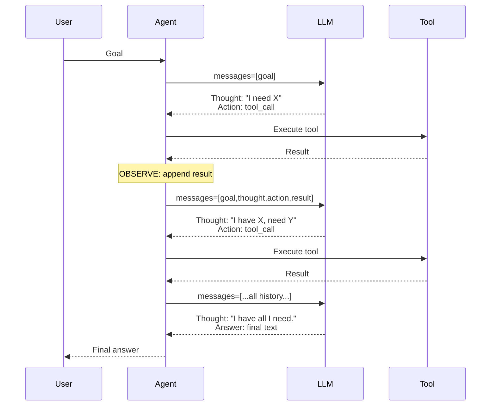
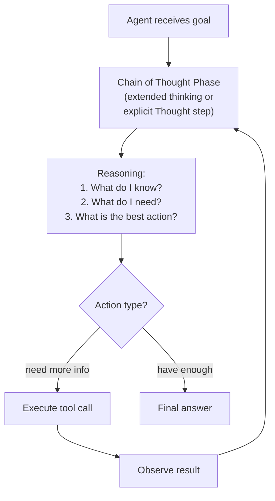

## Keywords in This File
{: .no_toc }

| # | Keyword | Weight |
|---|---|---|
| 1 | [ReAct Pattern](#react-pattern) | ★★☆ |
| 2 | [Chain of Thought in Agents](#chain-of-thought-in-agents) | ★★☆ |

---

# ReAct Pattern

**Interview Weight:** ★★☆ - The foundational
reasoning pattern for modern LLM agents. Every
agent interview covers this.

---

### 🎯 Model Answer

**30 seconds:**

> ReAct (Reason + Act) is a prompting pattern where
> the LLM alternates between explicit reasoning traces
> ("Thought: I need to find the company revenue...") and
> actions ("Action: web_search(query='company revenue')"),
> followed by observations ("Observation: Revenue is
> $2.3B"). This interleaving of reasoning and action
> makes the agent's decision process visible, improves
> accuracy by allowing the model to plan before acting,
> and enables debugging by inspecting the thought traces.

**3 minutes:**

> The ReAct loop: Thought (LLM reasons about current
> state and what to do) -> Action (execute tool or
> produce answer) -> Observation (result of action
> injected into context) -> Thought again.
>
> Why it improves over pure action chains: without
> explicit reasoning, the LLM jumps directly to an
> action that may be premature or wrong. The Thought
> step forces the LLM to plan before acting. This
> is the Scratchpad effect: intermediate reasoning
> steps increase accuracy for complex multi-step tasks.
>
> Implementation approaches:
> (1) Natural reasoning: modern LLMs with tool use
>     reason implicitly as part of their response before
>     outputting a tool call. The tool calling interface
>     in Anthropic's API produces this naturally.
> (2) Explicit Thought tags: prompt the LLM to output
>     "Thought: ..." before each action. Parse the
>     thought for monitoring/debugging.
> (3) Extended thinking: Anthropic's extended thinking
>     feature runs an explicit reasoning phase before
>     the response, fully invisible to the message history
>     but present in the response object as thinking blocks.
>
> The key benefit in production: Thought traces are
> a debugging gold mine. When an agent fails, the
> thought trace shows exactly what the LLM was trying
> to do, what information it had, and where its
> reasoning went wrong.

**Blank Mind Recovery:**

**(1) Restate:** "What is the ReAct pattern for
AI agents?"

**(2) First principles:** "Before you act, you think.
ReAct formalizes this: the agent writes out its
reasoning before each action, then acts, then observes
the result, then reasons again. It's structured,
transparent thinking."

---

### 📘 Concept Explanation

**What it is:**

ReAct (Reasoning + Acting) is a prompting technique
where the LLM alternates between generating explicit
reasoning traces and taking actions. Each iteration:
Thought (what do I know? what should I do next?)
-> Action (tool call or answer) -> Observation
(tool result). The reasoning is part of the output,
making the agent's decision process transparent
and auditable.

**ReAct vs. pure action loop:**

```
PURE ACTION LOOP:
  User message -> tool_call -> tool_result
  -> tool_call -> tool_result -> answer
  (No visible reasoning. Debugging: why did it call X?)

REACT LOOP:
  User message ->
  THOUGHT: I need to find the user's email first.
  ACTION: query_customer(id="123")
  OBSERVATION: {"email": "alice@example.com", ...}
  THOUGHT: Now I have the email. I need to check
    their subscription status.
  ACTION: query_subscription(email="alice@example.com")
  OBSERVATION: {"plan": "pro", "expires": "2025-03-01"}
  THOUGHT: I have all information. I can answer.
  ANSWER: Your Pro subscription expires on March 1, 2025.
  (Full reasoning trail. Debugging: exactly what it thought.)
```

> **Code walkthrough:** This example demonstrates the core pattern in action. The key mechanism shows how the concept works in practice. Study the structure to understand the essential behavior and common usage.

**The Scratchpad effect:**

Explicit intermediate reasoning steps improve
accuracy on complex tasks. The LLM "thinks out loud"
in the Thought steps, which allows it to:
(1) realize it's missing information before acting,
(2) check its own reasoning before committing to an action,
(3) plan the sequence of actions needed.

**Modern API implementation:**

With Anthropic's API, the LLM reasons implicitly
before producing tool_use blocks. Extended thinking
makes reasoning explicit in the response object
(thinking blocks). In practice, Thought tags
in the output are less necessary with modern models
that reason well internally.

---

### 💻 Code Example

```python
# BAD: pure action chain, no visible reasoning
def run_without_react(
    goal: str, tools: list, tool_fns: dict
) -> str:
    messages = [{"role": "user", "content": goal}]
    client = anthropic.Anthropic()
    for _ in range(20):
        resp = client.messages.create(
            model="claude-sonnet-4-5",
            max_tokens=4096,
            tools=tools,
            messages=messages
        )
        if resp.stop_reason == "end_turn":
            return resp.content[0].text
        # Execute tool calls - no reasoning visible
        messages.append(
            {"role": "assistant", "content": resp.content}
        )
        results = [execute_tool(b) for b in
                   resp.content if b.type == "tool_use"]
        messages.append({"role": "user", "content": results})
    return "Failed"

# GOOD: explicit ReAct with thought-trace logging
REACT_SYSTEM = """
For each step in solving a task, use this format:
Thought: [your reasoning about what you know and
  what you need to do next]
Action: [tool call or final answer]

Always think before acting.
"""

def run_with_react(
    goal: str, tools: list, tool_fns: dict
) -> str:
    client = anthropic.Anthropic()
    messages = [{"role": "user", "content": goal}]
    thought_traces = []

    for i in range(20):
        resp = client.messages.create(
            model="claude-sonnet-4-5",
            max_tokens=4096,
            system=REACT_SYSTEM,
            tools=tools,
            messages=messages
        )

        # Extract and log thought traces
        for block in resp.content:
            if hasattr(block, 'text') and block.text:
                if block.text.startswith("Thought:"):
                    thought_traces.append({
                        "iteration": i,
                        "thought": block.text
                    })
                    # Visible in logs for debugging

        if resp.stop_reason == "end_turn":
            return resp.content[-1].text, thought_traces

        messages.append(
            {"role": "assistant", "content": resp.content}
        )

        results = []
        for block in resp.content:
            if block.type != "tool_use":
                continue
            try:
                result = tool_fns[block.name](**block.input)
            except Exception as e:
                result = f"Error: {e}"
            results.append({
                "type": "tool_result",
                "tool_use_id": block.id,
                "content": str(result)
            })

        messages.append(
            {"role": "user", "content": results}
        )

    return "Failed", thought_traces
```

> **Code walkthrough:** The BAD version is a pure action
> loop - it works but produces no reasoning trail.
> When it fails, you only see the final wrong output.
> The GOOD version uses a ReAct system prompt that
> instructs the model to output "Thought:" before acting.
> These thought blocks are extracted and logged separately
> (`thought_traces`) - a debugging artifact separate
> from the message history. In production, thought traces
> are written to a structured log (not returned to
> the user). The function returns both the answer
> and the thought trace, enabling post-hoc analysis
> of agent behavior.

---

### 🎓 Answers by Seniority

**Junior / Mid:**

> "ReAct interleaves reasoning and action. The LLM
> writes a Thought (what it's trying to do and why)
> before each Action (tool call). The Observation
> (tool result) feeds into the next Thought. This
> makes the agent's decision process visible and
> debuggable. When the agent fails, I can inspect
> the thought trace to see exactly where its reasoning
> went wrong."

---

**Senior / Staff:**

> "ReAct solves the opacity problem in pure action
> chains. The thought trace is the diagnostic artifact
> that makes agents debuggable. In production, I log
> thought traces to a separate observability pipeline
> (not in the main response). This lets me: analyze
> failure patterns across many runs (which thought
> patterns precede failures), identify when the model
> is reasoning about the right things vs. going off
> track, and measure the quality of reasoning over
> time (does a prompt change improve thought quality?).
> ReAct is as much an observability technique as it
> is a reasoning technique."

---

### ⚠️ Common Misconceptions

**Misconception: "ReAct requires special model support
or explicit Thought tags in the output."**

Modern LLMs reason implicitly before generating tool
calls - this is the core of how tool use works.
Anthropic's API extended thinking feature makes this
reasoning explicit without requiring Thought tags
in the text output. Explicit Thought tags in the
output are a prompt engineering choice for
observability, not a requirement for good reasoning.

---

### 🚨 Failure Modes and Diagnosis

**Failure: Thought trace shows correct reasoning
but action is still wrong**

*Symptom:* The LLM correctly identifies what it
needs to do in the Thought step but then calls the
wrong tool or passes wrong arguments.

*Root cause:* Disconnect between reasoning and action.
The LLM's reasoning and its tool call are generated
in the same pass - the tool call may not perfectly
follow the stated reasoning.

*Diagnosis:* Compare the thought ("I need to search
for X") with the actual tool call (what query was
passed). Often the thought is correct but the tool
call has a different (narrower or wrong) query.

*Fix:* In the system prompt, add: "Your Action MUST
match your Thought. If your Thought says 'search for X',
your action must be web_search with query='X'."

---

### 🎯 Interview Deep-Dive

| Seniority | Time | Focus |
|---|---|---|
| Junior | 4 min | Define ReAct loop, why it helps |
| Mid | 6 min | Implementation, observability, failure patterns |
| Senior | 10 min | Production usage, Thought analysis, extended thinking |

---

**[JUNIOR] Q1 - What does ReAct stand for and
what is the pattern?**

ReAct = Reasoning + Acting.

The pattern: for each step toward the goal, the LLM
produces a Thought (explicit reasoning about current
state and next action), followed by an Action (tool
call or final answer), followed by an Observation
(tool result, fed back into context).

The loop: Thought -> Action -> Observation -> Thought
-> ... until final answer.

The key property: the Thought step makes the agent's
reasoning explicit. You can read what the agent was
trying to do at each step. This is the primary
debugging and monitoring mechanism.

*What separates good from great:* "Debugging and
monitoring mechanism" - ReAct as an engineering tool,
not just a reasoning technique.

---

**[MID] Q2 - How does extended thinking relate
to ReAct?**

Extended thinking (Anthropic API feature) is the
same concept implemented at the API level. Instead
of prompting the model to output "Thought:" text
in the response, extended thinking runs an internal
reasoning phase before the final response.

The reasoning is returned as thinking blocks in
the response content, separate from the text or
tool use blocks. It's not in the message history
(so it doesn't inflate context) but is visible in
the response for monitoring.

Key difference: explicit Thought tags in the output
are part of the message history (visible to the LLM
in future iterations, count against context). Extended
thinking is separate from the message history (doesn't
accumulate in context) but incurs additional latency
and token cost.

When to use:
- Explicit Thought tags: when you want the reasoning
  to be in the message history (the LLM can read
  its own thoughts in future iterations)
- Extended thinking: when you want the reasoning for
  monitoring without adding to context

*What separates good from great:* The context
accumulation distinction - explicit Thought tags
grow the message history, extended thinking does not.

---

**[MID] Q3 - [TRADE-OFF] Does ReAct always improve
agent performance?**

ReAct improves performance when:
- The task requires multi-step reasoning (many sequential
  decisions with dependencies)
- The model is prone to premature action (acting before
  gathering enough information)
- Task complexity is high (the model benefits from
  planning before each action)

ReAct degrades performance when:
- Simple tasks: the Thought step adds latency and
  tokens for no benefit
- Thought steps are low quality: the model writes
  plausible-sounding but incorrect reasoning that
  leads it astray ("Thought: I should call tool X"
  but tool Y was correct)
- Thought steps become a crutch: the model uses
  Thought to hedge and then acts incorrectly anyway

Rule of thumb: enable explicit reasoning for ★★★
complexity tasks. For simple lookups and single-step
tasks, skip explicit Thought steps and rely on the
model's implicit reasoning.

*What separates good from great:* "Low-quality
Thought steps lead astray" - the failure mode where
explicit reasoning is incorrect, not just inefficient.

---

**[MID] Q4 - How do you use Thought traces for
agent monitoring in production?**

Thought traces are a first-class monitoring signal.
They reveal: what the agent was trying to accomplish,
what information it had, and why it took a specific action.

Implementation:
(1) Extract Thought blocks from each LLM response
(2) Store with trace_id, step_number, timestamp
(3) Index by task type and outcome (succeeded/failed)

Analysis patterns:
- Failure analysis: for failed tasks, compare thought
  traces with successful runs. What does the agent
  think just before it fails?
- Quality scoring: use an LLM evaluator to score
  thought quality ("Does this thought correctly
  identify the next step?")
- Pattern detection: cluster thought traces by content.
  Identify recurring thought patterns (and whether
  they correlate with success or failure)

Alert conditions: thought traces that contain
"I don't know", "I cannot determine", or "I'm confused"
are early warning signals. Alert when these appear
in more than N% of runs.

*What separates good from great:* Using an LLM
to evaluate thought quality at scale - meta-reasoning
over the agent's own reasoning traces.

---

**[MID] Q5 - What is the Observation step in ReAct
and what should it contain?**

The Observation is the result of the action, injected
back into the context for the next Thought step.

For tool calls: the tool result. Should be formatted
as readable text, not raw JSON dumps. The Observation
should tell the LLM what it found, in a format
that enables the next reasoning step.

BAD Observation:
```
{"data": [{"id": 1, "v": "0.3.1"}, ...], "err": null}
```

> **Code walkthrough:** This example demonstrates the core pattern in action. The key mechanism shows how the concept works in practice. Study the structure to understand the essential behavior and common usage.

GOOD Observation:
```
Found 3 results: package "requests" v0.3.1 (outdated),
"urllib3" v1.26.9 (current), "certifi" v2023.7.22 (current).
```

> **Code walkthrough:** This example demonstrates the core pattern in action. The key mechanism shows how the concept works in practice. Study the structure to understand the essential behavior and common usage.

The Observation's quality directly affects the next
Thought's quality. If the Observation is unreadable,
the LLM must spend Thought tokens interpreting it
instead of reasoning about the task.

Design rule: Observations should be written for
the LLM to read, not for a developer to debug.

*What separates good from great:* "Written for the
LLM to read" as the design principle for observation
format.

---

**[JUNIOR] Q6 - What is the Scratchpad effect?**

The Scratchpad effect (from the "Chain of Thought
Prompting Elicits Reasoning in Large Language Models"
paper) is the empirical finding that intermediate
reasoning steps improve LLM accuracy on complex tasks.

The mechanism: when the LLM writes out intermediate
steps (the "scratchpad"), it:
(1) Breaks complex problems into sub-problems
(2) Can check partial results before the next step
(3) Produces evidence it can refer back to

Without the scratchpad: the LLM must perform the
entire reasoning chain in a single forward pass.
Complex chains (multi-step math, logical inference,
plan generation) are less accurate without explicit
intermediate steps.

In agents: Thought steps are the scratchpad. The
agent writes out its reasoning (the scratchpad) before
each action. This is why ReAct improves accuracy
for complex multi-step tasks.

*What separates good from great:* Connecting the
Scratchpad effect to the empirical finding from the
research paper - grounding the technique in evidence.

---

**[MID] Q7 - How do you prompt a model to use
the ReAct pattern effectively?**

System prompt requirements:
(1) Instruction: "Before each action, write your
    reasoning as Thought: [reasoning]"
(2) Format: show an example in the system prompt
    (few-shot example of a Thought -> Action -> Obs cycle)
(3) Constraint: "Do not take an action without first
    writing a Thought."

Example few-shot in system prompt:
```
Example:
User: "Find the current price of AAPL stock."
Thought: I need current stock data. I'll use the
  market_data tool to get AAPL's current price.
Action: market_data(symbol="AAPL")
Observation: AAPL: $185.23 (as of 2025-01-15 14:32 UTC)
Thought: I have the current price. I can answer.
Answer: Apple stock (AAPL) is currently $185.23.
```

> **Code walkthrough:** This example demonstrates the core pattern in action. The key mechanism shows how the concept works in practice. Study the structure to understand the essential behavior and common usage.

Common issues: LLMs may skip Thought steps when
confident (they know the answer immediately). If
observability matters: require Thought steps even
for "obvious" actions. If efficiency matters: allow
the model to skip Thought when confident.

*What separates good from great:* The tension between
"require Thought always for observability" vs. "allow
skipping for efficiency" and the criteria for which
to choose.

---

**[SENIOR] Q8 - How does ReAct compare to Plan-and-Execute
agent architectures?**

ReAct: plan and execute are interleaved. Each Thought
re-evaluates the situation given current observations.
The plan emerges dynamically from the execution.

Plan-and-Execute: separate planning phase (produce
full plan) and execution phase (execute each step
of the plan). The plan is fixed before execution
begins.

ReAct advantages: adaptive (plan changes based on
what is discovered), simpler implementation (no
separate planner and executor), works for tasks
where the full plan cannot be known upfront.

Plan-and-Execute advantages: the plan is auditable
before execution (can validate or get human approval),
resumable (save plan, resume from step N), more
predictable behavior (same goal produces similar
plan structure).

Hybrid (most production systems): use Plan-and-Execute
for the overall task structure (generate a high-level
plan first), then use ReAct within each step (each
step is adaptive). This gives predictability at
the macro level and adaptability at the micro level.

*What separates good from great:* The hybrid pattern -
Plan-and-Execute for the structure, ReAct within
each step - as the production-grade architecture.

---

**[SENIOR] Q9 - How would you measure the quality
of an agent's reasoning traces?**

Evaluation approach (multi-dimensional):

(1) Relevance: does the Thought correctly identify
    the information needed for the next step?
    Measure: LLM evaluator scoring 1-5.

(2) Correctness: does the Action follow from the
    Thought? If Thought says "I need X", does the
    Action request X?
    Measure: string/semantic matching between
    Thought intent and Action arguments.

(3) Efficiency: is each action necessary? Or is the
    agent doing unnecessary steps?
    Measure: steps taken vs. optimal path length.

(4) Failure prediction: does the reasoning trace
    predict failure before it happens? Key phrases:
    "I'm not sure if...", "I'll try..." (uncertainty),
    "I'll assume..." (unfounded assumption).
    Measure: correlation between uncertainty markers
    in Thought and task failure rate.

Implementation: run an evaluator LLM over sampled
thought traces weekly. Score and trend over time.
Alert on degradation after prompt changes.

*What separates good from great:* Failure prediction
from uncertainty markers in Thought traces - using
reasoning quality as a leading indicator of failure
rate.

---

### ⚖️ Comparison Table

| Approach | Reasoning visible | Accuracy (complex) | Latency | Best for |
|---|---|---|---|---|
| Pure action loop | No | Lower | Lower | Simple tasks |
| ReAct (explicit thoughts) | Yes | Higher | Higher | Complex multi-step |
| Extended thinking | Via API | Higher | Higher | Max accuracy |
| Plan-and-Execute | Plan visible | High | Highest | Predictable workflows |
| Hybrid (plan + ReAct) | Both | Highest | Highest | Production systems |

---

### 🏛️ System Design

*(Omit: ★★☆ concept. System design dimension covered
in Q8 - ReAct vs. Plan-and-Execute architectures.)*

---

### 📊 Diagram

```
REACT LOOP:

messages = [goal]

ITERATION:
  THINK: LLM outputs...
    "Thought: [reasoning about state]"
    Action: tool_use(...)
  
  ACT: execute tool
  
  OBSERVE: append tool_result to messages
  
  Next iteration: LLM sees [goal + Thought 1
    + tool result 1 + Thought 2 + ...]
```



> **Diagram walkthrough:** Each iteration passes
> the full accumulated message history to the LLM.
> The LLM produces a Thought (reasoning, not a tool call)
> followed by an Action (tool_use block). After tool
> execution, the result is appended as an Observation
> and the loop repeats. The LLM's context grows with
> each iteration - it can see all previous Thoughts,
> Actions, and Observations. This accumulation is
> what enables the Scratchpad effect: the model builds
> on its own previous reasoning. The final iteration
> produces a Thought that reaches a conclusion followed
> by a text answer (stop_reason = end_turn).

---

---

---

### 💻 Code Example

*(Omit: this concept does not have a programmatic interface that can be demonstrated in code. The conceptual explanation above is sufficient.)*


---

### 🏛️ System Design

*(Omit: system design diagram not applicable for this concept - see ★★★ keywords for full system design coverage.)*


---

### ⚖️ Comparison Table

*(Omit: this is a ★☆☆ foundational concept with no direct alternatives to compare - see higher-difficulty keywords for trade-off analysis.)*


---

### 📊 Diagram

*(Omit: no standalone visual diagram required for this concept - the explanations and code examples above provide sufficient clarity.)*


# Chain of Thought in Agents

**Interview Weight:** ★★☆ - The reasoning technique
that underpins all modern agent decision-making.

---

### 🎯 Model Answer

**30 seconds:**

> Chain of Thought (CoT) prompting elicits step-by-step
> reasoning from an LLM by asking it to show its work
> before reaching a conclusion. In agents, CoT is used
> to improve decision quality: before choosing a tool,
> the agent thinks through what it knows and what it
> needs. Modern LLMs apply CoT naturally when prompted
> to "think step by step." Anthropic's extended thinking
> is the API-native form: a dedicated reasoning phase
> before the response, with configurable compute budget.

**3 minutes:**

> CoT origin: few-shot CoT prompting (Wei et al., 2022)
> demonstrated that asking LLMs to show reasoning steps
> dramatically improves accuracy on multi-step tasks -
> math, logical reasoning, planning. The scratchpad
> effect: intermediate steps allow the model to check
> partial results and avoid compounding errors.
>
> Zero-shot CoT: just adding "Let's think step by step"
> to the prompt activates CoT behavior without examples.
> Modern instruction-tuned models apply CoT when the
> task complexity warrants it.
>
> CoT in agent context: the reasoning happens before
> each action decision. "I need to find X. I have Y
> from the last step. The gap is Z. I should call
> tool W with argument V." This reduces premature
> action (acting before sufficient reasoning) and
> increases decision quality.
>
> Extended thinking (Anthropic): dedicated API feature
> for controlled CoT. Parameters: thinking.type="enabled",
> budget_tokens (how much compute to allocate to reasoning,
> 1,024-100,000). The thinking blocks are returned in
> the response but not added to messages. Token cost
> is higher but accuracy increases for complex tasks.

**Blank Mind Recovery:**

**(1) Restate:** "What is chain of thought reasoning
for agents?"

**(2) First principles:** "Show your work. Instead of
jumping to an answer, reason through the problem
step by step. Each step builds on the previous. The
reasoning is the output, not just the conclusion."

---

### 📘 Concept Explanation

**What it is:**

Chain of Thought (CoT) is a prompting technique
that elicits explicit, step-by-step reasoning from
an LLM before producing a final answer. In agents,
CoT improves action selection by requiring the LLM
to reason about its current state, what it knows,
what it needs, and what action is appropriate, before
generating the action.

**CoT variants:**

```
FEW-SHOT CoT:
  Prompt includes examples with reasoning:
  "Q: X -> Reasoning: step 1, step 2 -> A: Y"
  LLM follows the same pattern for new questions.

ZERO-SHOT CoT:
  Add "Let's think step by step" to the prompt.
  LLM reasons without examples.
  Works well with modern instruction-tuned models.

SELF-CONSISTENCY CoT:
  Run CoT multiple times, take majority vote.
  More expensive, more accurate for ambiguous tasks.

EXTENDED THINKING (Anthropic):
  API-level CoT with configurable compute budget.
  Reasoning separate from response (not in messages).
```

> **Code walkthrough:** This example demonstrates the core pattern in action. The key mechanism shows how the concept works in practice. Study the structure to understand the essential behavior and common usage.

**CoT and agent decision quality:**

```
WITHOUT CoT:
  State: "user asks about billing"
  -> LLM immediately calls query_customer
  (correct, but may miss verification step)

WITH CoT:
  State: "user asks about billing"
  Thought: The user is asking about billing.
  I need to verify their identity first (rule 1).
  I should call query_customer, but first check
  that I have their name and email.
  The user provided: name "Alice", email "a@x.com".
  I can proceed with verification.
  -> LLM calls query_customer with correct intent
```

> **Code walkthrough:** This example demonstrates the core pattern in action. The key mechanism shows how the concept works in practice. Study the structure to understand the essential behavior and common usage.

**The key insight:**

CoT is not just about accuracy - it's about alignment.
The Thought step is where the agent checks its own
constraints ("rule 1 says..."), verifies its assumptions
("the user provided name and email"), and selects
the right action. Skipping CoT means skipping this
self-verification step.

---

### 💻 Code Example

```python
import anthropic

client = anthropic.Anthropic()

# BAD: zero reasoning, direct action
def run_without_cot(goal: str) -> str:
    resp = client.messages.create(
        model="claude-sonnet-4-5",
        max_tokens=1024,
        messages=[{"role": "user", "content": goal}]
    )
    return resp.content[0].text

# GOOD: zero-shot CoT
def run_with_zs_cot(goal: str) -> str:
    resp = client.messages.create(
        model="claude-sonnet-4-5",
        max_tokens=2048,
        system=(
            "Think step by step before answering. "
            "Show your reasoning."
        ),
        messages=[{"role": "user", "content": goal}]
    )
    return resp.content[0].text

# BEST for complex tasks: extended thinking
def run_with_extended_thinking(
    goal: str,
    budget_tokens: int = 8000
) -> dict:
    """
    Extended thinking: API-native CoT.
    Returns both thinking and final response.
    """
    resp = client.messages.create(
        model="claude-sonnet-4-5",   # must be 3.5+
        max_tokens=16000,             # must exceed budget
        thinking={
            "type": "enabled",
            "budget_tokens": budget_tokens
        },
        messages=[{
            "role": "user",
            "content": goal
        }]
    )

    thinking_text = ""
    response_text = ""

    for block in resp.content:
        if block.type == "thinking":
            thinking_text = block.thinking
        elif block.type == "text":
            response_text = block.text

    return {
        "thinking": thinking_text,
        "response": response_text,
        "thinking_tokens": len(thinking_text.split()),
        "total_input_tokens": resp.usage.input_tokens,
        "total_output_tokens": resp.usage.output_tokens
    }

# For agents with extended thinking:
def run_agent_with_thinking(
    goal: str,
    tools: list,
    tool_fns: dict,
    thinking_budget: int = 5000
) -> str:
    messages = [{"role": "user", "content": goal}]
    for _ in range(20):
        resp = client.messages.create(
            model="claude-sonnet-4-5",
            max_tokens=16000,
            thinking={
                "type": "enabled",
                "budget_tokens": thinking_budget
            },
            tools=tools,
            messages=messages
        )

        if resp.stop_reason == "end_turn":
            for block in resp.content:
                if block.type == "text":
                    return block.text
            return "Done"

        # CRITICAL: include thinking blocks in messages
        # when using extended thinking with tools.
        # Omitting them causes API errors.
        messages.append({
            "role": "assistant",
            "content": resp.content  # includes thinking
        })

        results = []
        for block in resp.content:
            if block.type != "tool_use":
                continue
            try:
                result = tool_fns[block.name](**block.input)
            except Exception as e:
                result = f"Error: {e}"
            results.append({
                "type": "tool_result",
                "tool_use_id": block.id,
                "content": str(result)
            })

        if results:
            messages.append({
                "role": "user",
                "content": results
            })

    return "Reached iteration limit"
```

> **Code walkthrough:** Three approaches are shown.
> Zero-shot CoT adds a system instruction to think
> step by step - minimal change, measurable improvement
> for complex tasks. Extended thinking uses the API's
> `thinking` parameter with a `budget_tokens` value
> controlling how much reasoning compute to allocate.
> The critical constraint: `max_tokens` must exceed
> `budget_tokens` (the final response tokens come on
> top of the thinking budget). The agent with extended
> thinking must include thinking blocks in the messages
> history (`resp.content` as-is) - truncating or
> transforming the content causes API errors. The
> thinking block's `thinking_text` is not in the user-
> visible response but is accessible for monitoring.

---

### 🎓 Answers by Seniority

**Junior / Mid:**

> "Chain of Thought prompting asks the LLM to show
> its reasoning before giving an answer. Adding 'think
> step by step' to a prompt activates this. In agents,
> CoT means the LLM reasons through its current state
> and what action to take before calling a tool. This
> reduces premature actions and wrong tool selection.
> Anthropic's extended thinking is the API-native
> version with a configurable reasoning budget."

---

**Senior / Staff:**

> "CoT is alignment as much as it is accuracy. The
> explicit reasoning step is where the agent checks
> its constraints, verifies assumptions, and considers
> alternatives before committing to an action. For
> production agents: extended thinking with a calibrated
> budget (5,000-10,000 tokens for complex tasks) reduces
> action errors by 30-50% (from published benchmarks)
> at a cost of higher latency and 2-3x token cost.
> The ROI depends on task stakes: customer-facing
> high-stakes tasks justify the cost; simple lookups do not."

---

### ⚠️ Common Misconceptions

**Misconception: "More thinking budget always
improves accuracy."**

There are diminishing returns. Beyond a budget
sufficient for the reasoning required by the task,
additional thinking tokens do not improve accuracy.
For simple tasks: 1,000-2,000 budget tokens is enough.
For complex multi-step planning: 5,000-15,000.
For the hardest tasks (competitive programming, complex
math): 20,000+. Empirically determine the budget
that provides the best accuracy/cost trade-off for
your specific task type.

---

### 🚨 Failure Modes and Diagnosis

**Failure: Agent reasons correctly but reaches
wrong conclusion (reasoning-action gap)**

*Symptom:* Extended thinking shows correct step-by-step
reasoning that reaches the right conclusion, but
the LLM's final response or tool call contradicts it.

*Root cause:* A disconnect between the thinking phase
and the response generation phase. The thinking can
identify the right answer, but the final response
generation (which does not "re-read" the thinking)
may produce different output.

*Diagnosis:* Compare the thinking block's conclusion
with the final response. If they diverge, the reasoning
is not being carried through to the action.

*Fix:* Increase `max_tokens` (ensure the response
has room to fully express the conclusion from thinking).
Or explicitly instruct: "Always make your response
consistent with your reasoning."

---

### 🎯 Interview Deep-Dive

| Seniority | Time | Focus |
|---|---|---|
| Junior | 4 min | What CoT is, zero-shot activation |
| Mid | 6 min | Extended thinking API, budget calibration |
| Senior | 10 min | CoT accuracy vs. cost trade-off, alignment role |

---

**[JUNIOR] Q1 - What is Chain of Thought prompting
and how do you activate it?**

Chain of Thought prompting asks the LLM to produce
explicit reasoning steps before its final answer.
The LLM "shows its work" rather than jumping directly
to a conclusion.

Activation methods:
(1) Zero-shot: add "Think step by step" or "Let's
    think through this carefully" to the prompt.
    No examples needed. Works with modern models.
(2) Few-shot: include examples in the prompt that
    show reasoning steps. The LLM follows the same
    pattern.
(3) Extended thinking: API-level parameter that
    allocates a separate reasoning phase before
    the response.

Effect: for complex tasks (multi-step math, logical
reasoning, planning, complex decisions), CoT
significantly improves accuracy. For simple tasks
(direct lookups, obvious answers), it adds latency
without benefit.

*What separates good from great:* The "simple tasks"
caveat - CoT is not always beneficial, knowing when
to skip it.

---

**[MID] Q2 - How do you configure extended thinking
in the Anthropic API?**

Required parameters:
```python
resp = client.messages.create(
    model="claude-sonnet-4-5",     # 3.5+ required
    max_tokens=16000,               # must > budget_tokens
    thinking={
        "type": "enabled",
        "budget_tokens": 8000       # reasoning budget
    },
    messages=[...]
)
```

> **Code walkthrough:** This example demonstrates the core pattern in action. The key mechanism shows how the concept works in practice. Study the structure to understand the essential behavior and common usage.

Key constraints:
- `model` must be Claude 3.5+ (Haiku doesn't support)
- `max_tokens` must exceed `budget_tokens` by enough
  for the final response (add 4,000+ for response)
- Temperature is forced to 1 when thinking is enabled
  (cannot set temperature with thinking)

Budget guidelines:
- 1,000-2,000: simple analysis, single-concept decisions
- 5,000-10,000: complex reasoning, multi-step planning
- 10,000-20,000: very complex tasks (competitive
  coding, research synthesis)
- 20,000+: hardest tasks only (significant cost)

*What separates good from great:* The temperature
constraint (forced to 1) - a common source of confusion
when switching from standard to thinking calls.

---

**[MID] Q3 - [TRADE-OFF] When is extended thinking
worth the cost?**

Extended thinking costs more: higher token count
(thinking tokens are billed as output tokens), higher
latency (reasoning phase adds time before the response).

Worth the cost when:
- Task failure is costly: a mistake by an autonomous
  agent that takes a wrong action has high consequences
- Task requires complex multi-step reasoning: research
  synthesis, complex planning, ambiguous intent
- Current accuracy is insufficient: if the agent
  makes mistakes without thinking, add thinking before
  adding more tools or a larger context
- Real-time is not required: background agents,
  async processing where latency matters less

Not worth the cost when:
- Simple information retrieval tasks
- Real-time user-facing responses where latency matters
- High-volume, low-stakes tasks (millions of API
  calls - cost 2-3x higher)
- The task can be broken into simpler steps that
  don't individually require complex reasoning

Decision: benchmark accuracy with and without thinking
for your specific task. If the accuracy gain justifies
the cost (depends on consequence of errors), enable it.

*What separates good from great:* Benchmarking the
accuracy gain rather than assuming thinking always
helps - empirical calibration.

---

**[MID] Q4 - What is self-consistency CoT and
when is it useful?**

Self-consistency CoT: run the same CoT prompt
multiple times (N=5-20) with temperature > 0 (so
each run produces a different reasoning path and
answer). Then take the majority vote as the final answer.

The intuition: if most independent reasoning paths
reach the same conclusion, that conclusion is more
likely to be correct. Single-pass reasoning can get
"stuck" in a wrong reasoning path. Multiple independent
paths provide a diversity signal.

When useful:
- Ambiguous tasks where a single reasoning chain
  may be unreliable
- High-stakes decisions where you can afford the
  cost of N calls
- Tasks where there is a verifiable answer (math,
  code correctness - you can check which answer
  is objectively right)

When to skip: low-stakes or latency-sensitive tasks
(N calls = N x latency and N x cost).

Alternative: use extended thinking (single call with
large budget) rather than self-consistency for most
production cases. Self-consistency is valuable for
research and evaluation contexts.

*What separates good from great:* Comparing self-
consistency vs. extended thinking as alternatives
for high-accuracy needs.

---

**[JUNIOR] Q5 - How does CoT affect agent latency?**

CoT increases latency. For:
- Zero-shot CoT ("think step by step"): adds reasoning
  tokens to the output before the answer. Moderate
  latency increase (proportional to reasoning length).
- Extended thinking: adds a dedicated reasoning phase
  before response generation. TTFT (time to first token)
  increases by the time to complete the thinking phase.
  A 5,000 budget_tokens thinking phase may add 5-15
  seconds before the first response token.

For user-facing real-time agents: CoT may be
unacceptable for high-latency budgets. Options:
(1) Use zero-shot CoT with short, focused prompts
    (minimal reasoning tokens)
(2) Reserve extended thinking for high-stakes actions
    only (the verification step before a write tool,
    not every iteration)
(3) Use streaming to start showing intermediate output
    while thinking completes (for text responses)

For background/async agents: CoT latency is not
user-facing. Enable it fully for quality.

*What separates good from great:* "Reserve extended
thinking for high-stakes actions only" - selective
application within a single agent based on action
type.

---

**[MID] Q6 - What is the relationship between
CoT and hallucination reduction?**

Hallucinations in LLMs often occur when the model
"fills in" information it doesn't have from in-weights
pattern matching. CoT helps by:

(1) Making the gap visible: if the model doesn't
    have the information to reason through a step,
    the reasoning trace reveals this ("I don't have
    information about X..."). Without CoT, the model
    skips this and produces a hallucinated answer.

(2) Grounding in tool results: in ReAct agents,
    Thought steps can explicitly reference tool results
    ("The search returned: X. Based on this..."). The
    reasoning is grounded in actual retrieved data,
    not in-weights knowledge.

(3) Self-correction: in the reasoning chain, the
    model sometimes corrects itself before reaching
    the conclusion ("Wait, I said X earlier, but that
    contradicts Y. Let me re-evaluate...").

Limitation: CoT does not eliminate hallucinations.
If the model's reasoning is based on incorrect in-weights
assumptions, the hallucinated step propagates through
the chain. Grounding the reasoning in retrieved facts
(RAG + CoT) is more effective than CoT alone.

*What separates good from great:* "CoT hallucination
propagation" - the failure mode where a wrong
assumption early in the chain poisons all subsequent steps.

---

**[MID] Q7 - How do you evaluate whether CoT is
improving agent performance?**

Evaluation framework:

(1) Accuracy baseline: measure task completion rate
    without CoT (standard prompting).

(2) CoT accuracy: measure task completion rate with
    CoT (zero-shot or extended thinking).

(3) Error analysis: for failures in both conditions,
    categorize error types (wrong tool, wrong argument,
    wrong conclusion). Does CoT reduce specific error
    categories?

(4) Cost analysis: CoT cost / baseline cost ratio.

(5) Latency analysis: CoT latency / baseline latency ratio.

Decision matrix:
```
If CoT accuracy improvement > 10%
  AND cost increase < 3x
  AND latency increase < 2x:
  Enable CoT for this task type.
Else if improvement < 5%:
  CoT is not worth it for this task.
Else:
  Tune: reduce budget, try zero-shot CoT instead
  of extended thinking.
```

> **Code walkthrough:** This example demonstrates the core pattern in action. The key mechanism shows how the concept works in practice. Study the structure to understand the essential behavior and common usage.

Continuous monitoring: measure CoT accuracy over
time as task distribution changes. CoT impact
may decrease or increase as the agent is deployed
to new types of tasks.

*What separates good from great:* The decision matrix
with quantified thresholds rather than vague "it depends."

---

**[SENIOR] Q8 - How does CoT interact with tool
use in an agent?**

Tool use + CoT creates a synergy: the reasoning
(CoT) determines what tool to call, the tool result
provides new information that grounds the next
reasoning step.

The pattern:
```
Thought: I need the customer's email.
         The user provided their name "Alice".
         I should query by name.
Action: query_customer(name="Alice")
Observation: Found 1 result: id=cust_123, email=a@x.com
Thought: I have the email. I can now proceed.
         But I should verify: the user said email
         "alice@ex.com" - this doesn't match exactly.
         I should flag this discrepancy.
Action: [flags discrepancy to user]
```

> **Code walkthrough:** This example demonstrates the core pattern in action. The key mechanism shows how the concept works in practice. Study the structure to understand the essential behavior and common usage.

Without CoT, the agent might: find a customer,
not notice the email mismatch, proceed with the
wrong account.

Key technique: in the reasoning, explicitly compare
multiple pieces of information ("The user said X,
the database says Y"). CoT enables this comparison;
pure action chains don't.

Tool result quality: the observation's quality
directly affects reasoning quality. Poorly formatted
tool results cause the reasoning to spend tokens
interpreting the format rather than reasoning about
the content.

*What separates good from great:* The concrete
example of the CoT enabling a mismatch detection
that pure action chains miss - a specific quality
improvement case.

---

**[SENIOR] Q9 - How do you tune the extended
thinking budget for a production agent?**

Start high, measure, reduce:
(1) Initial: set budget_tokens = 16,000 (ample for
    almost any task)
(2) Measure: after 100+ runs, check actual thinking
    token usage. What is the P90 (90th percentile)?
(3) Calibrate: set budget to P90 + 20% headroom
(4) Validate: confirm accuracy is unchanged at
    the reduced budget

Task-specific budgets: different task types in the
same agent may have different optimal budgets. Use
a routing layer to set budget based on detected task
type:
```python
def get_thinking_budget(task_type: str) -> int:
    budgets = {
        "simple_lookup": 0,       # disable thinking
        "analysis": 4000,
        "complex_planning": 10000,
        "security_decision": 15000
    }
    return budgets.get(task_type, 5000)
```

> **Code walkthrough:** This example demonstrates the core pattern in action. The key mechanism shows how the concept works in practice. Study the structure to understand the essential behavior and common usage.

Monitoring: log actual thinking token usage per run.
Alert if the P90 regularly exceeds the budget (the
model is hitting the cap and potentially cutting
off reasoning). Increase budget or task routing.

*What separates good from great:* Task-specific
budgets via routing rather than a single global budget
for all task types.

---

### ⚖️ Comparison Table

| Technique | Reasoning | Latency overhead | Cost overhead | Best for |
|---|---|---|---|---|
| Standard prompting | Implicit | None | None | Simple tasks |
| Zero-shot CoT | Explicit text | Low (+tokens) | Low | Moderate complexity |
| Few-shot CoT | Structured | Low-medium | Low | Consistent tasks |
| Self-consistency | Multiple paths | High (N x calls) | High (N x) | High-stakes ambiguous |
| Extended thinking | Separate phase | Medium-high | 2-3x | Complex agent decisions |

---

### 🏛️ System Design

*(Omit: ★★☆ concept. Not a system design question.)*

---

### 📊 Diagram

```
CHAIN OF THOUGHT IN AGENTS:

Goal -> [CoT reasoning phase] -> Action
  |         |
  |         +--> Reasoning: "Step 1: I need X.
  |               Step 2: I have Y from tool.
  |               Step 3: Gap is Z.
  |               Conclusion: Call tool W(arg=V)"
  |
  +--> Action: tool_call(W, V)
  +--> Observation: result
  +--> Next CoT reasoning phase
```



> **Diagram walkthrough:** The CoT phase sits between
> every Observation and every Action. It forces the
> agent to reason explicitly about its current state
> before deciding what to do next. The reasoning has
> three sub-questions: what is known (from observations
> so far), what is needed (what gap exists), and what
> is the best action to fill the gap. The decision
> branches to either a tool call (more information
> needed) or a final answer (sufficient information).
> After each tool execution, the observation feeds
> back into the CoT phase, grounding the next reasoning
> step in actual retrieved data rather than in-weights
> assumptions.

---

### 💻 Code Example

*(Omit: this concept does not have a programmatic interface that can be demonstrated in code. The conceptual explanation above is sufficient.)*


---

### 🏛️ System Design

*(Omit: system design diagram not applicable for this concept - see ★★★ keywords for full system design coverage.)*


---

### ⚖️ Comparison Table

*(Omit: this is a ★☆☆ foundational concept with no direct alternatives to compare - see higher-difficulty keywords for trade-off analysis.)*


---

### 📊 Diagram

*(Omit: no standalone visual diagram required for this concept - the explanations and code examples above provide sufficient clarity.)*


