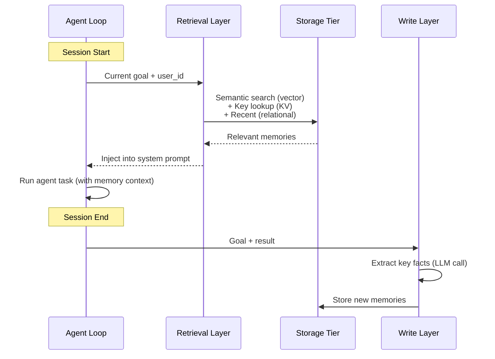
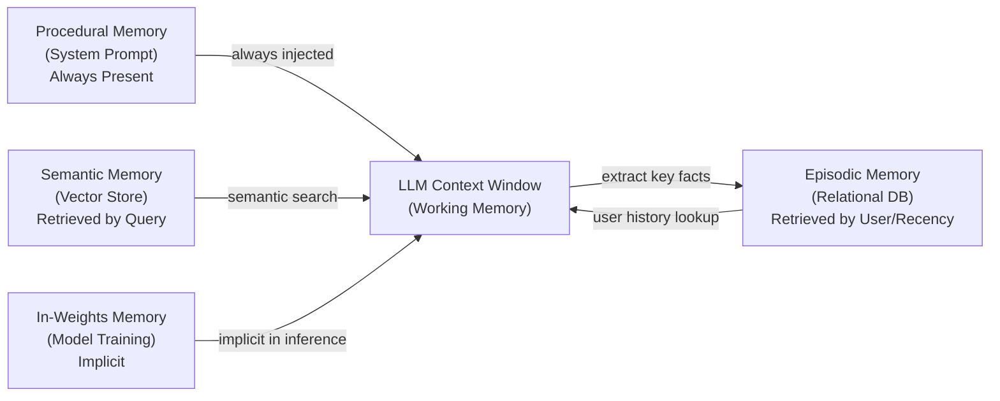

## Keywords in This File
{: .no_toc }

| # | Keyword | Weight |
|---|---|---|
| 1 | [Agent Long-Term Memory Architecture](#agent-long-term-memory-architecture) | ★★☆ |
| 2 | [Episodic vs Semantic vs Procedural Memory](#episodic-vs-semantic-vs-procedural-memory) | ★★☆ |

---

# Agent Long-Term Memory Architecture

**Interview Weight:** ★★☆ - How to design memory
systems that give agents continuity across sessions.

---

### 🎯 Model Answer

**30 seconds:**

> Long-term memory lets agents persist information
> beyond a single context window or session. Architecture
> layers: (1) storage tier - where facts are persisted
> (relational DB for structured, vector store for
> semantic, key-value for fast lookups); (2) retrieval
> layer - queries storage to bring relevant context
> into the current context window; (3) write layer -
> determines what is worth storing and when. The hard
> problems are retrieval quality (finding the right
> information at the right time) and write selectivity
> (not storing everything - noisy memory degrades
> performance).

**3 minutes:**

> Storage tier options: relational DB (episodic records,
> user preferences, structured entities), vector store
> (semantic search over document embeddings - Pinecone,
> Weaviate, pgvector), key-value store (fast exact lookups
> by ID - Redis, DynamoDB). Real systems combine all
> three for different access patterns.
>
> Retrieval layer: at each agent iteration, before
> calling the LLM, the retrieval layer queries relevant
> stores and injects results into the context. Query
> sources: the current goal (semantic similarity), the
> current user/session (key-value lookup), recent
> task history (recency query). The retrieved context
> is added to the system prompt or early in the messages.
>
> Write layer: the write decision - what to persist
> after a task. Options: write everything (noisiest
> but simplest), write only when the LLM signals
> high-value information, or use a post-task extraction
> LLM call (dedicated prompt: "Extract the 3 most
> important facts from this conversation to remember
> for future tasks").
>
> The key challenge: retrieval-augmented agents are
> only as good as their retrieval. Bad retrieval
> (wrong facts returned, relevant facts missed) degrades
> agent behavior. Retrieval quality is the most important
> metric for long-term memory systems.

**Blank Mind Recovery:**

**(1) Restate:** "How do you design memory for an
agent that needs to remember things across sessions?"

**(2) First principles:** "Memory = storage + retrieval.
You need somewhere to put information (storage) and
a way to find it when needed (retrieval). The challenge:
which information to store, and how to retrieve the
relevant bits at the right time."

---

### 📘 Concept Explanation

**What it is:**

Agent long-term memory architecture is the system
design for persisting agent knowledge beyond the
current context window. It consists of: a storage
tier (databases holding the memory), a retrieval
layer (queries that inject relevant memory into
the active context), and a write layer (logic that
decides what to store and when).

**Architecture layers:**

```
AGENT LOOP
  |
  v
RETRIEVAL LAYER
  Query: current goal + user context
  Sources queried:
    vector_store.search(goal, top_k=5)
    episodic_db.recent(user_id, limit=3)
    kv_store.get(f"user:{user_id}:preferences")
  Inject results into system prompt
  |
  v
LLM CALL (enriched with retrieved memory)
  |
  v
TOOL EXECUTION
  |
  v
WRITE LAYER (on task completion)
  Extract key facts via LLM call
  Store:
    episodic_db.insert(task_record)
    vector_store.upsert(new_fact_embeddings)
    kv_store.set(updated_entities)
```

**Storage tier comparison:**

```
STORE          | ACCESS       | DATA TYPE    | WHEN TO USE
---------------|--------------|--------------|-------------
Vector store   | Semantic     | Text, docs   | Open-ended
               | similarity   | embeddings   | retrieval
Relational DB  | Structured   | Records,     | User data,
               | queries      | events       | task history
Key-value      | Exact lookup | Any JSON     | Fast user
               | by key       | by ID        | preferences
In-context     | Always       | Critical     | Always-needed
(system prompt)| present      | instructions | facts
```

**The key insight:**

Memory architecture is a retrieval engineering problem.
Any fact can be stored. The hard question is: when
this agent needs this fact, will the retrieval layer
find it? Measure retrieval recall (of the relevant
facts, what % are retrieved) and precision (of the
retrieved facts, what % are relevant). Both matter.

---

### 💻 Code Example

```python
import json
from dataclasses import dataclass
import anthropic

# Simplified long-term memory system

@dataclass
class MemoryEntry:
    content: str
    category: str  # "fact", "preference", "skill"
    user_id: str
    session_id: str
    importance: int  # 1-5

class LongTermMemoryStore:
    """
    Simplified memory store (in-memory for demo;
    use vector DB + relational DB in production).
    """

    def __init__(self):
        self._entries: list[MemoryEntry] = []
        self._user_prefs: dict = {}

    def store(self, entry: MemoryEntry):
        self._entries.append(entry)

    def search(
        self,
        query: str,
        user_id: str,
        top_k: int = 3
    ) -> list[str]:
        """
        Simplified: return recent entries.
        Production: use semantic search (embeddings).
        """
        user_entries = [
            e for e in self._entries
            if e.user_id == user_id
        ]
        # Sort by importance desc, return top_k
        user_entries.sort(
            key=lambda e: e.importance,
            reverse=True
        )
        return [e.content for e in user_entries[:top_k]]

    def store_preference(self, user_id: str, pref: dict):
        self._user_prefs[user_id] = {
            **self._user_prefs.get(user_id, {}),
            **pref
        }

    def get_preferences(self, user_id: str) -> dict:
        return self._user_prefs.get(user_id, {})


class MemoryAgent:
    """Agent with long-term memory integration."""

    def __init__(
        self,
        memory: LongTermMemoryStore,
        user_id: str
    ):
        self.client = anthropic.Anthropic()
        self.memory = memory
        self.user_id = user_id

    def _build_context(self, goal: str) -> str:
        """Retrieval layer: inject relevant memories."""
        memories = self.memory.search(
            query=goal,
            user_id=self.user_id,
            top_k=3
        )
        prefs = self.memory.get_preferences(
            self.user_id
        )

        parts = []
        if prefs:
            parts.append(
                f"User preferences: {json.dumps(prefs)}"
            )
        if memories:
            mem_text = "\n".join(
                f"- {m}" for m in memories
            )
            parts.append(
                f"Relevant past context:\n{mem_text}"
            )
        return "\n\n".join(parts)

    def _extract_and_store(
        self, goal: str, result: str, session_id: str
    ):
        """Write layer: extract key facts and store."""
        resp = self.client.messages.create(
            model="claude-haiku-4-5",
            max_tokens=512,
            system=(
                "Extract important facts to remember "
                "from this conversation. Return a JSON "
                "array of objects with: "
                "content (string), "
                "category ('fact'|'preference'|'skill'),"
                " importance (1-5). "
                "Return only facts worth remembering "
                "for future tasks. Max 3 items."
            ),
            messages=[{
                "role": "user",
                "content": (
                    f"Goal: {goal}\n\nResult: {result}"
                )
            }]
        )
        try:
            facts = json.loads(resp.content[0].text)
            for fact in facts:
                self.memory.store(MemoryEntry(
                    content=fact["content"],
                    category=fact.get(
                        "category", "fact"
                    ),
                    user_id=self.user_id,
                    session_id=session_id,
                    importance=fact.get("importance", 3)
                ))
        except Exception:
            pass  # Fail silently on parse error

    def run(self, goal: str, session_id: str) -> str:
        # 1. Retrieval: inject relevant memories
        memory_context = self._build_context(goal)

        system = "You are a helpful agent."
        if memory_context:
            system += (
                f"\n\nContext about this user:\n"
                f"{memory_context}"
            )

        # 2. Run agent
        resp = self.client.messages.create(
            model="claude-sonnet-4-5",
            max_tokens=2048,
            system=system,
            messages=[{
                "role": "user", "content": goal
            }]
        )
        result = resp.content[0].text

        # 3. Write: extract and store key facts
        self._extract_and_store(
            goal, result, session_id
        )

        return result
```

> **Code walkthrough:** `LongTermMemoryStore` implements
> the storage tier (simplified in-memory; production
> uses vector DB for semantic search + relational DB
> for structured records). The retrieval layer in
> `_build_context` queries memories by user ID and
> formats them into the system prompt. The write layer
> in `_extract_and_store` uses a dedicated LLM call
> (claude-haiku for cost efficiency) to extract
> key facts from the conversation. The extraction
> prompt specifies: structured output (JSON array),
> category classification, importance scoring (1-5),
> and a max of 3 items (write selectivity). Writing
> everything without selectivity creates noisy memory
> that pollutes future retrievals - the extraction
> call is the selectivity gate.

---

### 🎓 Answers by Seniority

**Junior / Mid:**

> "Long-term memory architecture has three layers:
> storage (vector store for semantic, relational DB
> for records, key-value for fast lookups), retrieval
> (queries storage before each LLM call to inject
> relevant context), and write (determines what's
> worth storing after a task - usually via an extraction
> LLM call). The hard problems are retrieval quality
> and write selectivity."

---

**Senior / Staff:**

> "Memory architecture is primarily a retrieval
> engineering problem. Any storage system can hold
> the data. What degrades agent behavior is bad
> retrieval: missing relevant facts or injecting
> irrelevant noise. I measure: retrieval recall (of
> relevant facts in storage, what % come up in
> retrieval?) and precision (of retrieved facts,
> what % are actually relevant?). Low recall: retrieval
> strategy is wrong. Low precision: memory is too
> noisy. Fix precision first (better write selectivity),
> then recall (better retrieval strategy)."

---

### ⚠️ Common Misconceptions

**Misconception: "Storing more information improves
agent performance."**

Memory pollution is a real failure mode. If the
memory store contains many irrelevant or outdated
facts, retrieval precision drops - the agent gets
noisy context that distracts from the relevant
information. More memory is not better. Selective
memory (high importance threshold for writes,
expiration for old facts) outperforms comprehensive
memory in production.

---

### 🚨 Failure Modes and Diagnosis

**Failure: Agent uses stale memory from a prior
session incorrectly**

*Symptom:* Agent cites outdated information from
a past session as current fact. ("Your plan is Pro"
- but the user downgraded since then.)

*Root cause:* Memory entries don't have expiration.
Entity state (plan type, address, preferences) was
stored once and never invalidated.

*Fix:* (1) Add TTL (time-to-live) to entity state
entries. (2) For mutable entities (user plan, account
status), always retrieve from the live database
(via tool call) rather than from memory cache.
Memory is for: past conversation context, learned
preferences, domain knowledge. Not for live entity
state.

---

### 🎯 Interview Deep-Dive

| Seniority | Time | Focus |
|---|---|---|
| Junior | 4 min | Name three storage tiers, explain retrieval/write |
| Mid | 6 min | Implementation, retrieval quality, write selectivity |
| Senior | 10 min | Architecture trade-offs, retrieval metrics, scaling |

---

**[JUNIOR] Q1 - What are the three layers of a
long-term memory architecture?**

Storage tier: where information is persisted. Different
stores for different access patterns: vector store
for semantic search (find facts by meaning similarity),
relational DB for structured records (user history,
task records), key-value store for fast exact lookups
(user preferences by ID).

Retrieval layer: before each LLM call, query the
storage tier for relevant context. The query is
based on the current goal, current user, and recent
task history. The retrieved context is injected
into the system prompt.

Write layer: after task completion, determine what
to persist. Common approach: use a dedicated LLM
call to extract key facts from the conversation,
with selectivity criteria (importance threshold,
category filter, max count).

All three layers are required. A system with storage
and retrieval but no write layer can only use
pre-loaded memory. A system with storage and write
but no retrieval can't use what it stored.

*What separates good from great:* "All three are
required" with the specific failure of each missing
layer.

---

**[MID] Q2 - How do you implement semantic search
for agent memory retrieval?**

Semantic search: find memory entries by meaning
similarity, not exact keyword match. Implemented
via embeddings.

Process:
(1) On write: embed each memory entry using an
    embedding model (text-embedding-3-small). Store
    the embedding vector alongside the text in the
    vector store.
(2) On retrieval: embed the current query (the
    agent's goal or task description). Query the
    vector store for top-K entries with highest
    cosine similarity to the query embedding.

Implementation with pgvector:
```python
import anthropic

emb_client = anthropic.Anthropic()

def embed(text: str) -> list[float]:
    """Get embedding for text using OpenAI."""
    # (Using OpenAI for embeddings is common even
    # with Anthropic for the LLM)
    import openai
    resp = openai.embeddings.create(
        input=text,
        model="text-embedding-3-small"
    )
    return resp.data[0].embedding

def semantic_search(
    query: str, user_id: str, top_k: int = 5
) -> list[str]:
    query_emb = embed(query)
    # pgvector cosine similarity query:
    rows = db.execute(
        "SELECT content FROM memories "
        "WHERE user_id = %s "
        "ORDER BY embedding <=> %s::vector LIMIT %s",
        (user_id, query_emb, top_k)
    ).fetchall()
    return [r[0] for r in rows]
```

*What separates good from great:* The specific
operator (`<=>` for cosine distance in pgvector)
as a concrete implementation detail.

---

**[MID] Q3 - [TRADE-OFF] When should you use
semantic retrieval vs. keyword search for agent memory?**

Semantic retrieval (embedding similarity):
- Best for: natural language queries, concepts
  that can be expressed multiple ways ("subscription
  billing issue" should match "payment problem")
- Pros: finds conceptually related content; handles
  paraphrase
- Cons: requires embedding computation (latency + cost),
  less precise for exact matches (proper nouns, IDs)

Keyword search (BM25, full-text search):
- Best for: exact terms, proper nouns, specific IDs
- Pros: precise, fast, no embedding cost
- Cons: misses paraphrase, requires exact term match

Hybrid (most production systems): combine both.
Semantic retrieval for broad conceptual recall,
keyword search for exact matches. Merge results
and re-rank.

Rule of thumb: if the user might describe the same
concept in many ways, use semantic. If the user
will use exact terms (product names, IDs, commands),
use keyword. Use hybrid if both occur.

*What separates good from great:* The hybrid re-rank
approach rather than choosing one technique.

---

**[MID] Q4 - How do you prevent memory retrieval
from polluting the agent's context?**

Memory pollution: retrieved context that is not
relevant to the current task dilutes the LLM's
attention and may cause wrong behavior.

Prevention strategies:

(1) Retrieval threshold: only inject memory entries
    with similarity score above a threshold (e.g.,
    cosine similarity > 0.75). Low-scoring entries
    are dropped even if they are top-K.

(2) Category filtering: only retrieve memory
    categories relevant to the current task type.
    A billing task retrieves billing-related memories;
    a technical task retrieves technical memories.

(3) Relevance re-ranking: after initial retrieval,
    use a fast LLM call to score each retrieved
    entry for relevance to the current goal.
    Drop entries below the relevance score.

(4) Memory expiration: old memories (older than
    N days/sessions) are archived or expired.
    Only recent memories are retrieved by default.

(5) Injection format: clearly label retrieved memory
    in the system prompt: "PAST CONTEXT (may not
    apply to current task):" followed by the entries.
    This frames the memory as advisory, not authoritative.

*What separates good from great:* Relevance re-ranking
as a post-retrieval filter (a second LLM evaluation
of what was retrieved).

---

**[MID] Q5 - How do you scale a vector store for
agent memory?**

Single-user: in-process store (FAISS, SQLite +
pgvector extension). No network overhead, easy to
manage.

Multi-user, small scale: dedicated vector DB instance
(Weaviate, Qdrant, pgvector in Postgres). Each user
has a namespace or tenant partition.

Multi-user, large scale: managed vector DB service
(Pinecone, Weaviate Cloud). Horizontal scaling,
multi-tenant isolation, SLA guarantees.

Scaling challenges:
- Memory per user: if each user accumulates thousands
  of memory entries, total storage grows with user
  count. Implement per-user storage limits and
  tiering (active memory in hot tier, older memory
  in cold/archive tier).
- Retrieval latency: at high user counts, concurrent
  retrieval queries may saturate the vector DB.
  Cache frequent queries (user preference lookups),
  use read replicas for high-read workloads.
- Write consistency: if multiple agent sessions
  for the same user run concurrently, concurrent
  writes to the same user's memory partition may
  conflict. Use optimistic locking or write queues
  per user.

*What separates good from great:* Per-user memory
tiering (hot/cold) as a cost management technique
at scale.

---

**[MID] Q6 - What is the write selectivity problem
and how do you solve it?**

Write selectivity problem: if you write every fact
the agent encounters to long-term memory, the store
fills with noise (trivial facts, task-specific details
not useful in other sessions, contradictory facts).
High noise degrades retrieval precision.

Write strategies ranked by selectivity:

(1) Write everything (lowest selectivity): every
    tool result, every LLM response. Simple but
    creates maximum noise.

(2) Manual tagging: the agent marks specific outputs
    with "store this." Requires careful prompting;
    LLM may over- or under-tag.

(3) Post-task extraction LLM call: after task
    completion, use a dedicated extraction prompt
    to summarize key facts worth remembering.
    The extraction prompt specifies importance
    criteria. Best balance of automation + selectivity.

(4) Human curation: a human reviews suggested
    memories before they are stored. Highest quality
    but not scalable.

Production approach: post-task extraction with:
importance threshold (only store importance >= 3/5),
category classification (filter categories that
apply to this agent), deduplication (don't store
what's already in memory).

*What separates good from great:* Post-task extraction
as the production approach and the specific
filtering criteria (importance + category + dedup).

---

**[JUNIOR] Q7 - What is the difference between
in-session memory and long-term memory?**

In-session memory: the message history for the
current agent run. Lives in the messages array.
Exists only for the duration of the current task
(one LLM session). Automatically available to the
LLM (it's in context). Lost when the session ends.

Long-term memory: persisted in a database. Survives
session end. Not automatically available - must be
explicitly retrieved and injected into context for
the next session.

Relationship: long-term memory is built from in-session
memory. At session end, the write layer extracts
key facts from the in-session messages and persists
them to long-term storage. At session start, the
retrieval layer queries long-term memory and injects
relevant facts into the new session's context.

The bridge between sessions: write layer at session
end -> long-term storage -> retrieval layer at next
session start.

*What separates good from great:* The bridge pattern
(write -> store -> retrieve) connecting in-session
to long-term as a concrete data flow.

---

**[SENIOR] Q8 - How do you evaluate the quality
of an agent's memory system?**

Evaluation framework:

Retrieval recall: for a set of test queries, what
% of relevant memory entries were retrieved?
Measure: manually annotate the relevant entries for
each query. Run retrieval. Count what was found vs.
what should have been found.

Retrieval precision: of retrieved entries, what %
were actually relevant?
Measure: same annotation set. Count relevant vs.
total retrieved.

Memory contribution: does retrieved memory improve
task outcomes? A/B test: same task with and without
memory injection. Compare task completion rate.

Stale memory impact: does old memory degrade
performance? Compare task outcomes for users with
fresh memory vs. users with old (>30 days) memory.

Write quality: manual review sample. Are the stored
facts accurate? Are important facts being missed?
Is noise being filtered correctly?

Alert thresholds: retrieval recall < 60% = fix retrieval.
Precision < 70% = fix write selectivity. Memory
contribution negative (worse with memory) = urgent fix.

*What separates good from great:* The A/B test for
memory contribution - isolating whether memory
actually helps, not assuming it does.

---

**[SENIOR] Q9 - How do you handle conflicting
memories (two stored facts that contradict each other)?**

Conflicting memories occur when: entity state changes
(user upgrades plan, old "plan=basic" + new "plan=pro"),
task results change over time, or the extraction
LLM stored two different interpretations of the
same fact.

Detection: on retrieval, if two memory entries for
the same entity/topic have contradictory content,
flag the conflict.

Resolution strategies:
(1) Recency wins: the most recently stored entry
    is used. The older entry is archived. Simple
    but may discard legitimately relevant older context.
(2) Importance wins: the higher-importance entry
    is used. Requires accurate importance scoring
    at write time.
(3) LLM resolution: pass conflicting entries to
    an LLM evaluator: "These two facts conflict.
    Which is more likely current given the context?"
(4) Source authority: entries from authoritative
    sources (live database lookup) override entries
    from agent-extracted memory.

Best practice: for entity state (mutable: plan,
address, status), always retrieve from the live
database rather than from memory cache. Memory is
for immutable facts and learned preferences.

*What separates good from great:* The "don't cache
mutable entity state" principle - the distinction
between what should be in memory vs. what should
always come from a live query.

---

### ⚖️ Comparison Table

| Storage Type | Access Pattern | Latency | Best For | Limitation |
|---|---|---|---|---|
| Vector store | Semantic similarity | Medium | Open-ended queries | Requires embeddings |
| Relational DB | Structured queries | Low | Records, events, tasks | No semantic search |
| Key-value store | Exact key lookup | Very low | User preferences, IDs | No range/similarity |
| In-context (system prompt) | Always present | None | Critical instructions | Context window limited |
| Full-text search | Keyword matching | Low | Exact terms, IDs | No paraphrase handling |

---

### 🏛️ System Design

*(Omit: ★★☆ concept. Architecture in Q8 and storage
tier table.)*

---

### 📊 Diagram

```
LONG-TERM MEMORY FLOW:

Session N:
  Retrieval Layer -> inject context -> LLM Call
  Task completion ->
  Write Layer -> Extract facts -> Storage
  (Vector DB, Relational DB, KV Store)

Session N+1:
  Retrieval Layer -> query Storage ->
  inject relevant facts -> LLM Call
```



> **Diagram walkthrough:** At session start, the
> retrieval layer queries all three storage tiers
> simultaneously and injects relevant results into
> the system prompt. The agent then runs with this
> enriched context. At session end, the write layer
> uses a dedicated LLM extraction call to identify
> which facts are worth persisting. New memories are
> written to the appropriate storage tier based on
> their type (semantic -> vector store, structured
> records -> relational, preferences -> KV). The
> next session starts by querying these stores,
> creating a continuous learning loop across sessions.

---

---

# Episodic vs Semantic vs Procedural Memory

**Interview Weight:** ★★☆ - The three non-working
memory types from cognitive science applied to agents.

---

### 🎯 Model Answer

**30 seconds:**

> Episodic memory: records of specific past events
> ("I searched for X for user Y last Tuesday and
> found Z"). Semantic memory: general factual knowledge
> ("What is the refund policy?"). Procedural memory:
> how to do things ("To handle a billing dispute,
> follow these steps..."). In agents: episodic is a
> database of past task logs; semantic is a vector
> store of domain knowledge (RAG); procedural is the
> system prompt. All three are complementary - missing
> any one limits the agent's capability.

**3 minutes:**

> Episodic memory details: records of what happened.
> Per-session logs, per-user history, per-task
> outcomes. Retrieved by recency (last 3 sessions for
> this user), by similarity to current task (tasks
> that failed similarly), or by entity (all interactions
> for customer X). Used for: personalization, learning
> from past failures, providing continuity for returning
> users.
>
> Semantic memory details: factual knowledge about
> the world or domain. Typically stored in a vector
> store and retrieved via semantic search (RAG).
> The knowledge base: product docs, FAQs, policies,
> technical reference. Updated asynchronously (not
> during agent runs - the knowledge base is maintained
> separately). Retrieved based on what the current
> query is about.
>
> Procedural memory details: how to do things. How
> to handle a billing dispute, how to format responses,
> how to use each tool. Typically in the system prompt
> (always present) or in a retrievable instruction set
> (retrieved for specific task types). Critical for
> consistent behavior: if the agent doesn't know the
> procedure, it invents one.
>
> The combination: episodic provides context ("this
> user has complained about billing before"), semantic
> provides knowledge ("our refund policy is X"), procedural
> provides method ("to handle a refund, do A, B, C").
> All three together enable an agent that is knowledgeable,
> consistent, and personalized.

**Blank Mind Recovery:**

**(1) Restate:** "What are the three types of long-term
memory and what does each store?"

**(2) First principles:** "Episodic = what happened.
Semantic = what is true. Procedural = how to do it.
These map to the three things an agent needs to work:
history, knowledge, and process."

---

### 📘 Concept Explanation

**What it is:**

Episodic, semantic, and procedural memory are three
types of long-term memory from cognitive science
(Tulving, 1972), applied to AI agent architecture.
Each type stores a different kind of knowledge,
uses different storage media, is retrieved differently,
and serves different purposes in agent behavior.

**Three types compared:**

```
EPISODIC MEMORY:
  What: records of specific past events
  Examples: "Task X for user Y at time Z returned W",
            "User A asked about billing 3x this month"
  Storage: relational DB, document store
  Retrieval: by recency, by user, by task similarity
  Updated: after each agent run
  Used for: personalization, continuity, failure learning

SEMANTIC MEMORY:
  What: factual knowledge about the domain/world
  Examples: "Product pricing: $29/month for Pro plan",
            "Refund policy: 30-day, no questions asked"
  Storage: vector store (semantic search)
  Retrieval: by similarity to current query (RAG)
  Updated: asynchronously (knowledge base maintenance)
  Used for: domain Q&A, grounding agent responses

PROCEDURAL MEMORY:
  What: how to perform tasks / follow processes
  Examples: "To verify identity: check name + email",
            "To escalate: create ticket, give ID"
  Storage: system prompt, instruction set
  Retrieval: always present (system prompt) or
    retrieved by task type (instruction retrieval)
  Updated: by agent developers (system prompt change)
  Used for: consistent behavior, safety constraints
```

**The key insight:**

Each memory type has a different update mechanism.
Episodic: automatically updated every run. Semantic:
batch updated (new product, new policy). Procedural:
updated by developers (system prompt change). This
means each type has a different "freshness" requirement
and a different update process.

---

### 💻 Code Example

```python
import anthropic, json, sqlite3
from datetime import datetime

client = anthropic.Anthropic()

# Simulated memory stores (simplified)
# Production: use dedicated DB + vector store

# --- EPISODIC STORE ---
def record_episode(
    db: sqlite3.Connection,
    user_id: str, goal: str,
    outcome: str, key_learnings: list[str]
):
    db.execute(
        "INSERT INTO episodes "
        "(user_id, goal, outcome, learnings, ts) "
        "VALUES (?,?,?,?,?)",
        (user_id, goal, outcome,
         json.dumps(key_learnings),
         datetime.utcnow().isoformat())
    )
    db.commit()

def get_recent_episodes(
    db: sqlite3.Connection,
    user_id: str, limit: int = 3
) -> list[dict]:
    rows = db.execute(
        "SELECT goal, outcome, learnings "
        "FROM episodes WHERE user_id=? "
        "ORDER BY ts DESC LIMIT ?",
        (user_id, limit)
    ).fetchall()
    return [
        {"goal": r[0], "outcome": r[1],
         "learnings": json.loads(r[2])}
        for r in rows
    ]

# --- SEMANTIC STORE (simplified) ---
KNOWLEDGE_BASE = {
    "refund policy": (
        "30-day full refund, no questions asked. "
        "Contact billing@example.com."
    ),
    "pro plan pricing": (
        "Pro plan: $29/month or $290/year (17% savings)."
    ),
    "enterprise plan": (
        "Enterprise: custom pricing, contact sales."
    )
}

def semantic_search(query: str) -> str:
    """Simplified: keyword match. Production: embeddings."""
    query_lower = query.lower()
    matches = [
        v for k, v in KNOWLEDGE_BASE.items()
        if any(w in query_lower for w in k.split())
    ]
    return "\n".join(matches) if matches else ""

# --- PROCEDURAL MEMORY (system prompt) ---
PROCEDURES = """
## PROCEDURES

IDENTITY VERIFICATION:
  1. Ask for name and email.
  2. Look up customer by email.
  3. Verify name matches.
  4. Proceed only if both match.

REFUND REQUEST:
  1. Verify identity first.
  2. Check eligibility (within 30 days of charge).
  3. Process with process_refund tool.
  4. Confirm refund amount and timeline.

ESCALATION:
  If unable to resolve in 5 steps:
  1. Create support ticket.
  2. Give customer the ticket ID.
  3. Inform 1-2 business day response time.
"""

# --- AGENT WITH ALL THREE ---
def build_system_prompt(
    user_id: str, goal: str, db: sqlite3.Connection
) -> str:
    parts = [
        "You are a customer support agent.",
        PROCEDURES  # Procedural memory (always present)
    ]

    # Episodic: recent history for this user
    episodes = get_recent_episodes(db, user_id)
    if episodes:
        ep_text = "\n".join(
            f"- Previous: {e['goal']} -> {e['outcome']}"
            for e in episodes
        )
        parts.append(
            f"PAST INTERACTIONS:\n{ep_text}"
        )

    # Semantic: domain knowledge for current goal
    knowledge = semantic_search(goal)
    if knowledge:
        parts.append(
            f"RELEVANT KNOWLEDGE:\n{knowledge}"
        )

    return "\n\n".join(parts)
```

> **Code walkthrough:** The code shows all three memory
> types with distinct implementations. Episodic memory
> uses SQLite with a user_id + timestamp key - it
> accumulates a history of past interactions, retrieved
> by recency. Semantic memory is a simplified keyword-
> keyed dict (production uses vector embeddings +
> cosine search). Procedural memory is a static string
> constant - it never changes during runtime and is
> always injected into the system prompt. The `build_system_prompt`
> function is the retrieval layer: it queries episodic
> and semantic stores based on the current user and
> goal, then combines them with the static procedural
> memory into the final system prompt. This 3-source
> combination gives the agent history (episodic),
> knowledge (semantic), and method (procedural).

---

### 🎓 Answers by Seniority

**Junior / Mid:**

> "Three types of long-term memory: episodic (records
> of what happened - past task logs in a database),
> semantic (domain knowledge - vector store used for
> RAG), and procedural (how to do things - in the
> system prompt or instruction set). Each type is
> stored differently, updated differently, and retrieved
> for a different purpose. All three together give
> the agent history, knowledge, and consistent process."

---

**Senior / Staff:**

> "The three memory types have different update
> lifecycles: episodic updates every run (automatic),
> semantic updates with the knowledge base (batch,
> hours to days lag), and procedural updates when
> developers change the system prompt (release cycle).
> This means they have different staleness risks.
> Episodic staleness: yesterday's task record is stale
> if entity state changed. Semantic staleness: the
> pricing doc is stale if the product changed. Procedural
> staleness: if the business process changed but the
> system prompt wasn't updated. Each memory type needs
> its own freshness monitoring."

---

### ⚠️ Common Misconceptions

**Misconception: "RAG is the only type of long-term
memory an agent needs."**

RAG is semantic memory - one of three types. An
agent that uses RAG but has no episodic memory
starts every session with no user history. An agent
that uses RAG but has no procedural memory relies
on the LLM's in-weights knowledge for how to behave.
Most production agents need all three types for
different purposes.

---

### 🚨 Failure Modes and Diagnosis

**Failure: Agent inconsistently follows procedures**

*Symptom:* The agent correctly follows the billing
procedure on some runs but skips the identity
verification step on others.

*Root cause:* Procedural memory (the procedure) is
embedded in the system prompt, but the system prompt
is too long and the procedure is in the "middle" of
the prompt where LLM attention is lower (lost-in-the-
middle effect).

*Fix:* Move critical procedures to the beginning
or end of the system prompt. Use clear headers and
numbered steps. Repeat critical constraints (e.g.,
"ALWAYS verify identity first") at the start of the
system prompt regardless of where the detailed procedure is.

---

### 🎯 Interview Deep-Dive

| Seniority | Time | Focus |
|---|---|---|
| Junior | 4 min | Define each type, concrete examples |
| Mid | 6 min | Implementation, update mechanisms, retrieval |
| Senior | 10 min | Design trade-offs, staleness, combined retrieval |

---

**[JUNIOR] Q1 - What is episodic memory in an
AI agent and what does it store?**

Episodic memory stores records of specific past
events. In an AI agent: records of past agent runs
for a specific user or task type.

Content: what goal was attempted, what approach was
taken, what tools were called, what the outcome was,
and any key facts discovered.

Examples:
- "User asked about billing on 2025-01-10. Found
  account is on Pro plan. Issue resolved."
- "Task: generate report on X. Failed because data
  source was unavailable. User was notified."

Purpose: personalization (this user has a history
with the agent), continuity (resume a multi-session
task), and failure learning (don't repeat approaches
that failed before).

Retrieval: by user ID + recency (recent history for
this user), or by task similarity (similar past tasks).

*What separates good from great:* "Failure learning
as a specific use case - don't repeat approaches
that failed" connects episodic memory to agent
behavior improvement.

---

**[JUNIOR] Q2 - What is semantic memory and how
does it differ from episodic?**

Semantic memory stores general factual knowledge,
not specific events. The "what is true" memory.

Content: domain knowledge, product information,
policies, reference material.

Examples:
- "The Pro plan costs $29/month"
- "Refund policy: 30-day full refund"
- "The API rate limit is 1000 requests/minute"

Episodic vs. semantic:
- Episodic: "What happened to user X in session Y?"
  (specific event, time-anchored)
- Semantic: "What does our product offer?" (timeless
  fact, not event-specific)

Update mechanisms differ: episodic updates automatically
after each run (event log). Semantic updates when
the knowledge base changes (new product, policy change).

Implementation: semantic memory is typically a vector
store. Facts are embedded and stored. Retrieval
uses semantic search (find facts related to the
current query).

*What separates good from great:* The update mechanism
difference (automatic vs. batch) as the key
practical distinction.

---

**[JUNIOR] Q3 - What is procedural memory and
where is it typically stored?**

Procedural memory stores how to do things. The "know-how"
memory - step-by-step processes, workflows, decision
trees for specific situations.

Content: agent persona and role, step-by-step procedures
for common tasks, safety constraints (never do X
without Y), decision rules (if A then B, else C).

Storage: typically in the system prompt (always in
context, always applied). For large procedure sets:
a retrievable instruction set (indexed by task type,
retrieved when the relevant task is detected).

Update mechanism: procedural memory is updated by
developers when the business process changes. It's
not automatically updated by agent runs (unlike
episodic). This means procedural memory can become
stale if the real process changes without a system
prompt update.

Why it matters: inconsistent agent behavior is often
a procedural memory problem. The agent doesn't know
the right procedure and invents its own.

*What separates good from great:* Staleness from
developer-owned updates - highlighting the dependency
on the development cycle for procedural accuracy.

---

**[MID] Q4 - How do you retrieve from multiple
memory types simultaneously?**

Parallel retrieval: query all memory stores at the
same time, then combine the results.

```python
import asyncio

async def retrieve_all_memory(
    user_id: str, goal: str
) -> str:
    """Retrieve from all three memory types."""
    episodic_task = asyncio.create_task(
        get_episodic(user_id)
    )
    semantic_task = asyncio.create_task(
        semantic_search(goal)
    )
    # Procedural is always in system prompt - no query

    episodic, semantic = await asyncio.gather(
        episodic_task, semantic_task
    )

    parts = []
    if episodic:
        parts.append(f"Past history:\n{episodic}")
    if semantic:
        parts.append(f"Relevant knowledge:\n{semantic}")
    return "\n\n".join(parts)
```

Context budget allocation: how much context space
to allocate to each memory type matters.

Typical allocation (4,096 token context budget):
- Procedural (system prompt): 500-800 tokens
- Semantic (retrieved knowledge): 800-1,200 tokens
- Episodic (past history): 300-500 tokens
- Working memory (current task): 2,000-2,500 tokens

If retrieved memory exceeds its budget: truncate or
summarize. Working memory (current task) takes priority.

*What separates good from great:* Context budget
allocation by memory type - treating context space
as a scarce resource with explicit allocation rules.

---

**[MID] Q5 - [TRADE-OFF] Should procedural memory
always be in the system prompt?**

Advantages of always-in-system-prompt:
- Always available, zero retrieval overhead
- LLM can't miss the procedure (it's always in context)
- Simple implementation

Disadvantages:
- System prompt bloat: if you have procedures for
  20 task types, the system prompt grows large
- Lost in the middle: long system prompts mean
  the LLM attends less to procedures in the middle
- Irrelevant procedures distract (the billing procedure
  is noise for a technical task)

Alternative: retrieved procedural memory.
- Index procedures by task type
- Detect the current task type at the start of the run
- Retrieve only relevant procedures

When to use each:
- Always-in-prompt: fewer than 5-7 procedures, all
  critical for every task
- Retrieval: many procedures (10+), or procedures
  vary significantly by task type

Hybrid: core constraints in the system prompt (safety
rules, identity), task-specific procedures retrieved.

*What separates good from great:* The lost-in-the-middle
failure mode for long system prompts - a specific
quality degradation mechanism.

---

**[MID] Q6 - How does episodic memory enable
personalization?**

Personalization: adapting agent behavior to the
specific user's history, preferences, and patterns.
Episodic memory is the data source.

Examples of episodic-driven personalization:
- Communication style: "This user prefers bullet-point
  responses, not prose." (learned from explicit feedback
  in past sessions)
- Domain preferences: "This user is a developer,
  use technical terminology." (inferred from past
  questions)
- Pending tasks: "Last session: user asked about
  upgrading. Not yet resolved." (unfinished business)
- Warnings: "This user has escalated twice before.
  Prioritize resolution." (risk signal)

Implementation: the write layer extracts personalization
signals at the end of each session. A separate
"user_profile" table accumulates these signals.
The retrieval layer loads the user profile on session
start and injects into the system prompt.

Privacy consideration: episodic data is PII-adjacent
(specific user activity logs). Apply data retention
policies (delete records older than N days), provide
user opt-out from memory, comply with GDPR right
to erasure.

*What separates good from great:* GDPR right-to-erasure
as a concrete compliance requirement for episodic memory.

---

**[MID] Q7 - What is the difference between
semantic memory and in-weights memory?**

Semantic memory (external): stored in a vector store,
can be updated at any time. Contains domain-specific
knowledge about your product, policies, and codebase.
Retrieved dynamically based on the current query.

In-weights memory (internal): knowledge baked into
the model's parameters during training. Contains
general world knowledge. Cannot be updated without
retraining. Covers common topics but not your specific
domain.

Key differences:
- Updatability: semantic = update anytime; in-weights
  = requires retraining
- Coverage: semantic = your specific domain; in-weights
  = general world knowledge
- Accuracy: semantic = authoritative for your domain
  (you control it); in-weights = may be outdated
  or incorrect for your domain
- Reliability: semantic = verifiable source; in-weights
  = may hallucinate when queried on gaps

When to rely on each: use semantic memory for any
fact that must be authoritative for your product
(pricing, policies, product specs). Rely on in-weights
memory only for general knowledge where accuracy
is not critical (how does Python work, what is
a binary search tree).

*What separates good from great:* The updatability
contrast (real-time vs. retraining cycle) as the
architectural reason to prefer semantic memory for
domain-specific facts.

---

**[SENIOR] Q8 - How do you design a memory system
that handles conflicting episodic and semantic memory?**

Conflict scenario: semantic memory says "Pro plan
costs $29/month" (from the last knowledge base update
3 months ago). Episodic memory contains "User was
informed Pro plan costs $19/month" (from a promotional
session 1 month ago where the agent was given the
wrong price).

Two memories disagree. What should the agent believe?

Resolution strategies:
(1) Source authority: rank memory sources by trust.
    Semantic memory (knowledge base) > episodic
    (agent-inferred facts). In conflicts, semantic wins.
(2) Recency + authority: if the episodic record
    is more recent AND came from a verified source
    (tool result, not LLM inference), it takes precedence.
(3) Live verification: for any fact that may conflict,
    retrieve it from the live source of truth (the
    database, not memory). If the DB says $29, use $29.
(4) Flag for human review: surface the conflict to
    a human reviewer: "Memory conflict detected for
    price field. Manual review required."

Best practice: treat memory as advisory, not authoritative.
For facts with real consequences (prices, policies),
always retrieve from the live source. Memory is
for context (history, preferences), not for authoritative
facts.

*What separates good from great:* "Memory is advisory,
not authoritative" - the meta-principle that resolves
all memory conflict problems.

---

**[SENIOR] Q9 - How do you implement memory for
a multi-tenant SaaS agent?**

Multi-tenant memory architecture has three isolation
levels: global (shared across all tenants - product
documentation), tenant-level (knowledge specific
to this company - their products, policies, users),
and user-level (personalization within a tenant).

Storage isolation:
- Global semantic memory: shared vector store namespace.
  All tenants can query.
- Tenant semantic memory: tenant-specific namespace
  in the vector store. Only accessible by that tenant.
- Tenant episodic memory: row-level tenant isolation
  in the relational DB (WHERE tenant_id = ?).
- User episodic memory: row-level user + tenant
  isolation.

Retrieval isolation: every retrieval query must include
tenant_id filter. Never allow cross-tenant queries.
Enforce at the data layer, not just the application
layer.

Procedural memory: global agent behavior in the
system prompt + tenant-specific procedures (loaded
from a tenant config store at session start):
"This agent is deployed for Acme Corp. Their billing
process is: [Acme-specific procedure]."

Security: vector store tenant isolation must be
hard (namespaces, not just query filters). A bug
in the application layer should not be able to
accidentally cross tenant boundaries.

*What separates good from great:* "Enforce at the
data layer, not just the application layer" for
tenant isolation - defense in depth for data leakage.

---

### ⚖️ Comparison Table

| Memory Type | What it stores | Storage | Update mechanism | Retrieved by |
|---|---|---|---|---|
| Episodic | Past events, history | Relational DB | Automatic (after each run) | User ID + recency/similarity |
| Semantic | Domain facts, knowledge | Vector store | Batch (knowledge base update) | Semantic similarity to query |
| Procedural | How-to, processes | System prompt | Developers (release cycle) | Always present (system prompt) |
| Working (in-context) | Current task | Messages array | Each iteration | Always present (in context) |

---

### 🏛️ System Design

*(Omit: ★★☆ concept. Architecture covered in Q9 - multi-tenant design.)*

---

### 📊 Diagram

```
THREE MEMORY TYPES IN AN AGENT:

PROCEDURAL (system prompt):
  [Always in context] Agent role, procedures,
  constraints

SEMANTIC (vector store):
  [Retrieved on query] Domain knowledge, FAQs,
  policies

EPISODIC (relational DB):
  [Retrieved on session start] Past tasks, user
  history, learnings

                   -> LLM Context Window <-
```



> **Diagram walkthrough:** All memory types converge
> on the LLM context window (working memory). Procedural
> memory flows in unconditionally from the system prompt.
> Semantic memory is pulled in via a similarity query
> against the vector store (RAG). Episodic memory is
> retrieved based on the current user ID and task type.
> In-weights memory is always implicitly available
> (it's in the model itself). The feedback arrow from
> the context window to episodic memory represents
> the write layer: after each session, key facts
> are extracted and persisted to the episodic store,
> enabling learning across sessions. Semantic and
> procedural stores are updated asynchronously via
> knowledge base maintenance and system prompt changes,
> not during agent runs.
