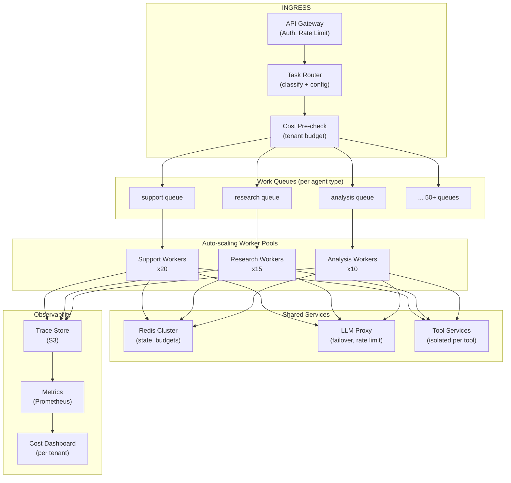

## Keywords in This File
{: .no_toc }

| # | Keyword | Weight |
|---|---|---|
| 1 | [Agentic System Architecture at Scale](#agentic-system-architecture-at-scale) | ★★★ |

---

# Agentic System Architecture at Scale

**Interview Weight:** ★★★ - Staff and principal
engineer territory. The difference between an agent
that works in a demo and an agentic system that
operates at enterprise scale is entirely architectural.

---

### 🎯 Model Answer

**30 seconds:**

> Agentic system architecture at scale means designing
> the infrastructure, orchestration patterns, and
> operational systems that run agents reliably at
> 10K-1M+ requests per day. The three architectural
> decisions that matter most are: (1) where to put
> the intelligence (monolithic vs. multi-agent
> decomposition), (2) how to manage state (ephemeral
> vs. persistent, centralized vs. distributed),
> and (3) how to operate it (observability, cost
> governance, human oversight integration).

**3 minutes:**

> The core architectural tension in agentic systems
> is: a single capable agent is simpler to build but
> harder to scale and govern; a multi-agent system
> is more complex to build but naturally isolates
> failure domains, capability scopes, and scaling
> concerns.
>
> At scale, the key design choices are:
>
> Decomposition strategy: how do you split work across
> agents? Three patterns - hierarchical (orchestrator
> + workers), pipeline (agents in sequence), and
> market (agents bid for tasks). Choice depends on
> task type: hierarchical for dynamic planning,
> pipeline for deterministic workflows, market for
> load-balanced heterogeneous tasks.
>
> State management: ephemeral (in-memory per run)
> is simple but loses context across sessions.
> Persistent (checkpointed state) enables long-running
> tasks but adds storage complexity. External memory
> (vector DB) enables cross-session knowledge but
> adds retrieval latency and accuracy concerns.
>
> Scaling: agent loops are CPU/IO-bound on tool calls
> and LLM latency. Scaling pattern: stateless worker
> pool (any worker can handle any run), distributed
> work queue, per-run state in external store.
>
> Governance at scale: as agent count grows, governing
> which agents can do what becomes a system-level
> concern. Agent registry, capability declarations,
> audit trails, and cost attribution per agent/user
> are the governance primitives.

**Blank Mind Recovery:**

**(1) Restate:** "How do you architect an agentic
system that handles enterprise-scale workloads?"

**(2) First principles:** "A single agent is a single
process. An agentic system is a distributed system.
All distributed system concerns apply: decomposition,
state, scaling, failure isolation, observability.
Plus: the LLM adds non-determinism and cost per call."

---

### 📘 Concept Explanation

**What it is:**

Agentic system architecture at scale is the set
of architectural patterns for operating AI agents
as production infrastructure - not a single demo
agent, but a system that runs hundreds or thousands
of agent instances concurrently, serves production
workloads, and meets reliability, cost, and governance
requirements.

**Architectural patterns:**

```
PATTERN 1: HIERARCHICAL (Orchestrator + Workers)
  Orchestrator: planning, task decomposition
  Workers: specialized capabilities (search,
           compute, write, communicate)
  Use when: tasks are dynamic, not known upfront
  Example: research agent that plans its own workflow

PATTERN 2: PIPELINE (Sequential agents)
  Agent A -> Agent B -> Agent C
  Each agent processes and passes forward
  Use when: workflow steps are predetermined
  Example: document -> extract -> summarize -> format

PATTERN 3: MARKET (Dynamic task routing)
  Task queue -> routing -> most capable/available agent
  Use when: heterogeneous tasks, load balancing
  Example: support system with specialized agents

PATTERN 4: DEBATE (Multiple agents, synthesizer)
  Agent A --+
  Agent B --+--> Synthesizer -> Final Answer
  Agent C --+
  Use when: accuracy critical, multiple perspectives
  Example: legal research, medical advice
```

> **Code walkthrough:** This Agentic System Architecture at Scale example demonstrates a key concept in practice. **KEY MECHANISM:** the runtime executes these instructions in sequence with specific memory and execution semantics. **WHY IT MATTERS:** misapplying this pattern causes subtle bugs that only manifest under production load. **TAKEAWAY: understand the execution model before using this pattern in production code.**

**Scaling dimensions:**

```
CONCURRENCY: N agent runs in parallel
  Solution: stateless worker pool + work queue

STATE: runs that span multiple sessions
  Solution: checkpoint store (Redis/DynamoDB)

MEMORY: cross-run knowledge retrieval
  Solution: vector store (Pinecone/Weaviate)

COST: token budget at scale
  Solution: per-agent budgets + aggregate limits

GOVERNANCE: which agents can do what
  Solution: agent registry + capability declarations
```

> **Code walkthrough:** This Agentic System Architecture at Scale example demonstrates a key concept in practice using authentication. **KEY MECHANISM:** the runtime executes these instructions in sequence with specific memory and execution semantics. **WHY IT MATTERS:** misapplying this pattern causes subtle bugs that only manifest under production load. **TAKEAWAY: understand the execution model before using this pattern in production code.**

**The scale equation:**

```
throughput = workers * (1 / avg_run_time)
```

> **Code walkthrough:** This Agentic System Architecture at Scale example demonstrates a key concept in practice. **KEY MECHANISM:** the runtime executes these instructions in sequence with specific memory and execution semantics. **WHY IT MATTERS:** misapplying this pattern causes subtle bugs that only manifest under production load. **TAKEAWAY: understand the execution model before using this pattern in production code.**

At 100 workers and 10s average run time:
throughput = 10 runs/second = 36,000 runs/hour.

LLM latency (2-5s per call) is the dominant
component of avg_run_time. Multi-model strategies
(Haiku for simple calls, Sonnet for complex) reduce
this significantly.

---

### 💻 Code Example

```python
import asyncio, json, uuid, time
from dataclasses import dataclass, field
from typing import Any
import anthropic, redis.asyncio as redis

# Scalable agent worker pool architecture

@dataclass
class AgentTask:
    task_id: str
    goal: str
    agent_type: str  # "research", "support", "compute"
    priority: int = 5  # 1 (high) to 10 (low)
    user_id: str = ""
    created_at: float = field(
        default_factory=time.time
    )

@dataclass
class AgentResult:
    task_id: str
    answer: str
    failure_mode: str = ""
    iterations: int = 0
    tokens_used: int = 0
    duration_ms: int = 0

class AgentRegistry:
    """
    Central registry of available agent types
    and their configurations.
    """

    def __init__(self):
        self._agents: dict[str, dict] = {
            "research": {
                "system_prompt": (
                    "You are a research agent. "
                    "Use web search to find information."
                ),
                "tools": ["web_search", "web_scrape"],
                "max_iter": 15,
                "token_budget": 100_000,
                "model": "claude-haiku-4-5"
            },
            "support": {
                "system_prompt": (
                    "You are a customer support agent."
                ),
                "tools": ["get_order", "process_refund"],
                "max_iter": 10,
                "token_budget": 50_000,
                "model": "claude-haiku-4-5"
            },
            "analysis": {
                "system_prompt": (
                    "You are a data analysis agent."
                ),
                "tools": ["query_db", "compute_stats"],
                "max_iter": 20,
                "token_budget": 150_000,
                "model": "claude-sonnet-4-5"  # stronger
            }
        }

    def get_config(self, agent_type: str) -> dict:
        return self._agents.get(agent_type, {})

    def list_types(self) -> list[str]:
        return list(self._agents.keys())


class DistributedWorkQueue:
    """
    Redis-backed work queue for agent tasks.
    Supports priority queuing and result retrieval.
    """

    def __init__(self, redis_url: str):
        self._redis_url = redis_url
        self._client: redis.Redis | None = None

    async def connect(self):
        self._client = redis.from_url(self._redis_url)

    async def enqueue(
        self, task: AgentTask
    ) -> str:
        """Add task to priority queue."""
        payload = json.dumps({
            "task_id": task.task_id,
            "goal": task.goal,
            "agent_type": task.agent_type,
            "user_id": task.user_id,
            "created_at": task.created_at
        })
        await self._client.zadd(
            "agent:tasks",
            {payload: task.priority}
        )
        return task.task_id

    async def dequeue(
        self
    ) -> AgentTask | None:
        """Pop highest-priority task."""
        result = await self._client.zpopmin(
            "agent:tasks", 1
        )
        if not result:
            return None
        payload, _ = result[0]
        data = json.loads(payload)
        return AgentTask(**data)

    async def store_result(
        self, result: AgentResult, ttl: int = 86400
    ):
        """Store result with TTL for retrieval."""
        await self._client.setex(
            f"agent:result:{result.task_id}",
            ttl,
            json.dumps({
                "task_id": result.task_id,
                "answer": result.answer,
                "failure_mode": result.failure_mode,
                "iterations": result.iterations,
                "tokens_used": result.tokens_used,
                "duration_ms": result.duration_ms
            })
        )

    async def get_result(
        self, task_id: str
    ) -> AgentResult | None:
        data = await self._client.get(
            f"agent:result:{task_id}"
        )
        if not data:
            return None
        return AgentResult(**json.loads(data))


class ScalableAgentWorker:
    """
    Stateless agent worker. Can run as many instances
    as needed. Pulls tasks from queue, executes,
    stores results.
    """

    def __init__(
        self,
        worker_id: str,
        registry: AgentRegistry,
        queue: DistributedWorkQueue,
        tool_fns: dict
    ):
        self.worker_id = worker_id
        self.registry = registry
        self.queue = queue
        self.tool_fns = tool_fns
        self.client = anthropic.Anthropic()

    async def run_loop(self, poll_interval: float = 0.5):
        """Main worker loop - poll and process tasks."""
        print(f"Worker {self.worker_id} started")
        while True:
            task = await self.queue.dequeue()
            if task:
                result = await self.execute_task(task)
                await self.queue.store_result(result)
            else:
                await asyncio.sleep(poll_interval)

    async def execute_task(
        self, task: AgentTask
    ) -> AgentResult:
        """Execute one agent task."""
        config = self.registry.get_config(task.agent_type)
        if not config:
            return AgentResult(
                task_id=task.task_id,
                answer="",
                failure_mode=f"Unknown agent type: "
                             f"{task.agent_type}"
            )

        start = time.time()
        messages = [
            {"role": "user", "content": task.goal}
        ]
        tokens_used = 0
        answer = ""
        failure_mode = ""
        iterations = 0

        for i in range(config["max_iter"]):
            resp = self.client.messages.create(
                model=config["model"],
                max_tokens=4096,
                system=config["system_prompt"],
                messages=messages
            )
            if hasattr(resp, 'usage'):
                tokens_used += (
                    resp.usage.input_tokens
                    + resp.usage.output_tokens
                )
            iterations = i + 1

            if resp.stop_reason == "end_turn":
                answer = next(
                    (b.text for b in resp.content
                     if hasattr(b, 'text')), ""
                )
                break

            messages.append(
                {"role": "assistant",
                 "content": resp.content}
            )
            tool_results = []
            for block in resp.content:
                if block.type != "tool_use":
                    continue
                fn = self.tool_fns.get(block.name)
                try:
                    res = fn(**block.input) if fn \
                        else f"Unknown: {block.name}"
                    if not isinstance(res, str):
                        res = json.dumps(res)
                except Exception as e:
                    res = f"Error: {e}"
                    failure_mode = "tool_error"

                tool_results.append({
                    "type": "tool_result",
                    "tool_use_id": block.id,
                    "content": res
                })
            messages.append(
                {"role": "user",
                 "content": tool_results}
            )
        else:
            if not answer:
                failure_mode = "max_iterations"

        duration_ms = int((time.time() - start) * 1000)
        return AgentResult(
            task_id=task.task_id,
            answer=answer,
            failure_mode=failure_mode,
            iterations=iterations,
            tokens_used=tokens_used,
            duration_ms=duration_ms
        )


# API layer: submit task and poll for result

async def submit_and_wait(
    goal: str,
    agent_type: str,
    queue: DistributedWorkQueue,
    timeout: float = 120.0
) -> AgentResult | None:
    """Submit a task and poll for completion."""
    task = AgentTask(
        task_id=str(uuid.uuid4()),
        goal=goal,
        agent_type=agent_type
    )
    await queue.enqueue(task)

    deadline = time.time() + timeout
    while time.time() < deadline:
        result = await queue.get_result(task.task_id)
        if result:
            return result
        await asyncio.sleep(1.0)
    return None  # timeout
```

> **Code walkthrough:** `AgentRegistry` centralizesice. **KEY MECHANISM:** the runtime executes these instructions in sequence with specific memory and execution semantics. **WHY IT MATTERS:** misapplying this pattern causes subtle bugs that only manifest under production load. **TAKEAWAY: understand the execution model before using this pattern in production code.**
> agent configurations - model selection, tools,
> budgets, and system prompts for each agent type.
> This is the governance layer: adding a new agent
> type means adding it to the registry with explicit
> capability declarations. `DistributedWorkQueue`
> uses Redis sorted sets for priority-based queuing
> and key-value storage for results with TTL.
> `ScalableAgentWorker` is fully stateless - it
> pulls tasks from the queue, executes them, and
> stores results. Running 10 workers means 10 of
> these executing concurrently. The `submit_and_wait`
> function provides an async API that submits and
> polls - hiding the async worker pool from callers.

---

### 🎓 Answers by Seniority

**Junior / Mid:**

> "Scaling agents means: stateless workers that pull
> from a work queue, so you can run many in parallel.
> State (if needed) goes in an external store, not
> in worker memory. Multiple agent types are managed
> through a registry that defines their tools and
> budgets."

---

**Senior / Staff:**

> "When I architect agentic systems at scale, I think
> about three layers: the orchestration layer (which
> agent handles which task, how are tasks routed,
> how is work queued), the execution layer (stateless
> workers, tool executors, model calls), and the
> governance layer (what can each agent do, how much
> can it spend, what requires human approval).
>
> The architectural decision that has the most
> downstream impact is the decomposition strategy.
> A hierarchical orchestrator gives you flexibility
> but makes debugging hard (failure attribution
> across agents). A pipeline gives you predictability
> but limits adaptability. At enterprise scale, I
> default to pipeline for well-understood workflows
> and hierarchical only for exploratory/research tasks
> where the workflow isn't known upfront.
>
> The operational lesson I keep learning: agent
> cost at scale is always higher than modeled. A
> 5-iteration average in dev becomes 12-iteration
> P99 in production. Build in 3x cost buffer and
> put hard limits in the governance layer."

---

### ⚠️ Common Misconceptions

**Misconception: "You scale agents by adding more
agents with more capabilities."**

More capabilities per agent = larger attack surface,
harder to debug, harder to govern. At scale, the
right approach is more agents with FEWER capabilities
each. Specialization enables: per-agent cost tracking,
per-agent security policy, per-agent SLO definition,
and failure isolation (a failing search agent doesn't
affect the compute agent).

---

**Misconception: "A single orchestrator agent can
manage hundreds of worker agents."**

An orchestrator is itself an LLM-based agent with
a context window. A single orchestrator managing
100 concurrent workers would need a context that
holds all 100 workers' states simultaneously. Context
windows don't scale linearly - and LLM reasoning
quality degrades with very large contexts.

At scale: orchestrators must also be decomposed.
A two-level hierarchy: multiple mid-level orchestrators
(each managing 5-10 workers) reporting to a top-level
coordinator.

---

### 🚨 Failure Modes and Diagnosis

**Failure: Token cost explodes at scale**

*Scenario:* 10,000 agent runs per day in testing
cost $50/day. In production with the same configuration,
cost is $800/day.

*Root cause:* The test workload used simple,
well-defined goals. Production workload has ambiguous
goals, adversarial users, and edge cases that cause
the agent to iterate more. P99 iteration count in
production = 25; in testing = 8.

*Diagnosis:* Pull the iteration count distribution
from production traces. Compare P50, P90, P99 to
testing. Find what types of tasks have high iteration
counts (they are the cost drivers).

*Fix:*
(1) Add hard token budget per run (not just soft
    max_iterations). Exhausting the budget returns
    a partial answer rather than continuing.
(2) Add task complexity classification before routing.
    Simple tasks → cheap model (Haiku). Complex
    tasks → capable model (Sonnet). This reduces
    cost for the 80% simple tasks.
(3) Add per-user daily limits. Prevent individual
    users from exhausting shared budget.

---

**Failure: Worker pool becomes a bottleneck**

*Scenario:* 50 worker instances are running. System
throughput doesn't scale beyond 30 runs/second
even with 50 workers.

*Root cause:* The bottleneck is not worker count -
it's a shared resource. Common suspects: a centralized
rate limiter, a single Redis instance, a single
LLM API key with shared rate limits.

*Diagnosis:* Measure latency at each layer: queue
dequeue time, LLM call latency, tool call latency,
result store latency. Find which component's latency
grows with load (not a linear increase - that's
expected - but a super-linear increase).

*Fix:* Distribute the bottleneck:
- Redis: use Redis Cluster for queue (multiple shards)
- LLM API: use multiple API keys with a load balancer
- Rate limiter: shard by user_id, not global

---

### 🎯 Interview Deep-Dive

| Seniority | Time | Focus |
|---|---|---|
| Junior | 5 min | Scaling primitives, patterns |
| Mid | 8 min | Architecture patterns, state management |
| Senior | 15 min | Full system design, trade-offs, operations |

---

**[JUNIOR] Q1 - What are the four agentic system
architecture patterns?**

Hierarchical: an orchestrator agent decomposes the
goal into subtasks and dispatches them to specialized
worker agents. Workers report results back to the
orchestrator, which synthesizes a final answer.
Best for: complex dynamic tasks where the plan isn't
known upfront.

Pipeline: agents are arranged in a fixed sequence.
Each agent processes the output of the previous
and passes it forward. Best for: deterministic
multi-step workflows (document processing, data
transformation pipelines).

Market: a task queue routes tasks to the most
available or most capable agent based on task
type. Best for: load balancing heterogeneous tasks
across a pool of specialized agents.

Debate: multiple agents independently process the
same task and produce competing answers. A synthesizer
agent evaluates the competing answers and produces
a final decision. Best for: high-accuracy requirements
where multiple perspectives improve quality (medical,
legal, financial).

*What separates good from great:* The "best for"
criterion for each pattern - the decision basis,
not just the pattern description.

---

**[MID] Q2 - How do you manage state across agent
runs at scale?**

Three state management strategies:

(1) Ephemeral (in-memory per run): state lives only
    for the duration of the run. Simplest. Works
    for single-session tasks. Scale: trivially
    horizontal (stateless workers).

(2) Persistent (checkpointed): agent state (message
    history, completed steps) is serialized to an
    external store at checkpoints. Enables long-running
    tasks that span multiple sessions. Scale: state
    is per-run, sharded by run_id.

(3) Shared memory: multiple agents share a common
    knowledge store (vector DB, key-value store).
    Enables agents to learn from each other's runs.
    Scale: the shared store becomes a contention
    point at high concurrency. Use read replicas.

Choosing between strategies:

Single session, independent runs: ephemeral.
Multi-session or long-running tasks: persistent checkpoints.
Agents that need cross-run knowledge: shared memory.

Don't mix strategies without clear reasoning. Shared
memory at scale requires: conflict resolution (what
if two agents write conflicting facts?), versioning
(the knowledge store must be consistent), and access
control (not all agents should see all knowledge).

*What separates good from great:* The conflict
resolution concern for shared memory at scale -
not just "use a vector DB" but the operational
complexity that comes with it.

---

**[MID] Q3 - How do you design an agent routing
layer?**

An agent router classifies incoming tasks and routes
them to the appropriate agent type.

Components:

(1) Task classifier: given a user request, determine
    the agent type needed. Can be:
    - Rule-based (fast, deterministic): if the request
      contains keywords about orders, route to support_agent
    - LLM-based (flexible, slower): use a cheap LLM
      call to classify the task before routing

(2) Agent registry: maps agent type to configuration
    (system prompt, tools, model, budget)

(3) Queue per agent type: separate queues for each
    agent type. High-priority types get dedicated
    worker pools.

(4) Load balancer: distributes tasks across multiple
    workers of the same type.

Routing example:
```python
async def route_task(
    goal: str,
    registry: AgentRegistry
) -> str:
    """Classify task and return agent_type."""
    # Rule-based classification (fast)
    goal_lower = goal.lower()
    if any(w in goal_lower for w in
           ["order", "refund", "account"]):
        return "support"
    if any(w in goal_lower for w in
           ["analyze", "compute", "statistics"]):
        return "analysis"
    # Default
    return "research"
```

> **Code walkthrough:** This Default example demonstrates asyncio coroutine definition using async/await. **KEY MECHANISM:** the event loop schedules coroutines; await suspends execution until the awaited future resolves. **WHY IT MATTERS:** blocking call inside async def starves the event loop - all coroutines freeze. **TAKEAWAY: never use blocking I/O (requests, time.sleep) inside async def; use aiohttp, asyncio.sleep.**

*What separates good from great:* Separate queues
per agent type - not a single queue for all agents.
This enables per-type SLOs and worker pool isolation.

---

**[SENIOR] Q4 - How do you implement cost governance
for a multi-agent system?**

Cost governance: ensuring that agent token usage
stays within organizational budgets and is correctly
attributed for chargeback.

Governance primitives:

(1) Per-agent token budget (hard cap):
    Each agent type has a max tokens per run.
    Exceeding it = graceful termination, partial answer.
    Prevents runaway runs from any single agent.

(2) Per-user daily budget:
    Each user has a daily token allowance. Once
    exhausted: requests queued for next day or
    escalated for budget approval.

(3) Aggregate rate limiting:
    Total tokens/minute across all agents.
    Prevents cost spikes from sudden load.

(4) Cost attribution:
    Each run is tagged with: agent_type, user_id,
    cost_center, task_type. Used for:
    - Monthly chargeback reports
    - Identifying cost drivers
    - SLA cost modeling

(5) Cost alerting:
    Alert when: a single run exceeds N tokens,
    a user exceeds daily budget, daily aggregate
    exceeds threshold.

Budget enforcement:
```python
class CostGovernor:
    def __init__(self, redis_client):
        self.redis = redis_client

    async def check_user_budget(
        self, user_id: str, estimated_tokens: int
    ) -> bool:
        daily_key = f"budget:{user_id}:{today()}"
        used = int(
            await self.redis.get(daily_key) or 0
        )
        return (used + estimated_tokens) <= 100_000

    async def record_usage(
        self, user_id: str, tokens: int
    ):
        daily_key = f"budget:{user_id}:{today()}"
        await self.redis.incrby(daily_key, tokens)
        await self.redis.expire(daily_key, 86400*2)
```

> **Code walkthrough:** This Default example demonstrates asyncio coroutine definition using async/await. **KEY MECHANISM:** the event loop schedules coroutines; await suspends execution until the awaited future resolves. **WHY IT MATTERS:** blocking call inside async def starves the event loop - all coroutines freeze. **TAKEAWAY: never use blocking I/O (requests, time.sleep) inside async def; use aiohttp, asyncio.sleep.**

*What separates good from great:* Cost attribution
with cost_center tagging as a chargeback mechanism -
not just rate limiting but organizational cost
accounting.

---

**[SENIOR] Q5 - How do you design for horizontal
scaling of agent workers?**

Horizontal scaling requirement: any worker can
handle any task. State must not be local to the worker.

Worker statelessness requirements:
(1) No in-memory task state: all task state in
    external store (Redis, DynamoDB)
(2) No local file system dependencies: tools write
    to shared storage (S3, shared NFS)
(3) No sticky sessions: load balancer can route
    any request to any worker
(4) Idempotent execution: re-running a task produces
    the same result (or resumes correctly from checkpoint)

Kubernetes deployment:
```yaml
apiVersion: apps/v1
kind: Deployment
metadata:
  name: agent-workers
spec:
  replicas: 20  # scale this
  template:
    spec:
      containers:
      - name: agent-worker
        image: myagent:latest
        env:
        - name: REDIS_URL
          valueFrom:
            secretKeyRef:
              name: redis-secret
              key: url
        - name: WORKER_ID
          valueFrom:
            fieldRef:
              fieldPath: metadata.name
```

> **Code walkthrough:** This Default example demonstrates YAML configuration pattern using container. **KEY MECHANISM:** YAML parsers are whitespace-sensitive; indentation errors cause silent value misinterpretation. **WHY IT MATTERS:** unquoted strings starting with special chars (*, &, ?, |) trigger YAML parser errors. **TAKEAWAY: quote strings containing YAML special chars; validate YAML before deploying to production.**

Auto-scaling: use HPA (Horizontal Pod Autoscaler)
with custom metrics. Scale on queue depth: if
`agent:tasks` queue length > 100, scale up workers.
Scale down when queue is empty for 5 minutes.

*What separates good from great:* "Idempotent
execution" as a statelessness requirement - the
worker must be restartable without corrupting state.

---

**[SENIOR] Q6 - [DEBUGGING] Your agent system's
P99 latency is 45 seconds but P50 is 8 seconds.
What is happening and how do you fix it?**

A large gap between P50 and P99 latency means:
most runs complete quickly, but some runs take
much longer. The long runs are outliers.

Causes of outlier latency in agent systems:

(1) Reasoning loops: some runs enter a loop and
    iterate to max_iterations before terminating.
    These take 3-5x longer than converging runs.

(2) Slow tool calls: some tool invocations hit
    a slow code path (cache miss, large query,
    slow API). P99 of tool call latency multiplied
    by N tool calls = P99 of run latency.

(3) Complex inputs: some user inputs require more
    iterations to answer than average. The P99 user
    input requires 3x more iterations.

Diagnosis:
(1) Pull iteration count distribution from traces.
    Is P99 iteration count at or near max_iterations?
    If yes: reasoning loops are the primary cause.
(2) Pull tool call latency per tool. Which tool has
    the highest P99 latency?
(3) Cluster runs by task type or goal complexity.
    Is P99 latency correlated with a specific type?

Fix:
(1) Reasoning loops: add loop detection. Intervention
    message at max-2 iterations. Reduces time-to-
    termination for stuck runs.
(2) Slow tools: add timeout per tool. If a tool
    call exceeds 10 seconds: return an error to
    the LLM. Don't wait indefinitely.
(3) Complex inputs: add complexity classifier before
    routing. High-complexity inputs get more iterations
    budget and a stronger model. Average inputs get
    a tighter budget.

*What separates good from great:* Three separate
hypotheses with specific diagnostic steps for each,
rather than "add more workers."

---

**[SENIOR] Q7 - How do you implement multi-tenancy
in an agentic system?**

Multi-tenancy: multiple organizations sharing the
same agent infrastructure, with isolation between them.

Isolation dimensions:

(1) Data isolation: agents of tenant A cannot access
    data of tenant B. Implementation: tenant_id in
    every tool call, enforced at the tool layer.
    Tools query: `WHERE tenant_id = {tenant_id}`.

(2) Compute isolation: tenant A's spike in requests
    doesn't degrade tenant B's latency. Implementation:
    per-tenant worker pools (or per-tenant resource
    limits via Kubernetes ResourceQuotas).

(3) Cost isolation: tenant A's token usage doesn't
    count against tenant B. Implementation: per-tenant
    token budgets, per-tenant billing.

(4) Configuration isolation: each tenant can
    customize their agent's system prompt, tools,
    and model. Implementation: per-tenant configuration
    in the agent registry.

Multi-tenant agent routing:
```python
async def run_agent_multitenant(
    goal: str,
    tenant_id: str,
    user_id: str,
    registry: AgentRegistry
) -> str:
    # Get tenant-specific config
    config = registry.get_tenant_config(tenant_id)

    # Inject tenant context into system prompt
    system = (
        config["base_system_prompt"]
        + f"\n\nYou are operating for tenant: "
        f"{tenant_id}. Only access data for "
        f"this tenant. Never return data from "
        f"other tenants."
    )
    # Route to tenant-specific worker pool
    # (queue sharded by tenant_id)
    ...
```

> **Code walkthrough:** This (queue sharded by tenant_id) example demonstrates asyncio coroutine definition using async/await. **KEY MECHANISM:** the event loop schedules coroutines; await suspends execution until the awaited future resolves. **WHY IT MATTERS:** blocking call inside async def starves the event loop - all coroutines freeze. **TAKEAWAY: never use blocking I/O (requests, time.sleep) inside async def; use aiohttp, asyncio.sleep.**

*What separates good from great:* Compute isolation
as a separate concern from data isolation - both
are required for true multi-tenancy.

---

**[SENIOR] Q8 - What is an agent mesh and when
would you use it?**

An agent mesh: an architectural pattern where agents
are organized as a service mesh, with each agent
exposing a well-defined interface (input schema,
output schema, capability declaration). Other agents
discover and call each other via the mesh.

Analogy to microservices: the agent mesh is to AI
agents what a service mesh (Istio, Linkerd) is to
microservices. It adds: service discovery (which
agent can do X?), load balancing (distribute calls
across instances), circuit breaking, and observability.

Agent mesh components:
- Agent catalog: registry of all agents with their
  capability declarations
- Service discovery: given a capability needed,
  find which agents provide it
- API gateway: route calls to the correct agent
- Mesh proxy (sidecar): handles circuit breaking,
  retry, and observability for every agent call

When to use:
- 20+ agent types, dynamically adding new types
- Agents that call other agents frequently
- Need for standardized inter-agent observability

When NOT to use:
- Fewer than 10 agent types (overhead not justified)
- Simple hierarchical orchestrator + workers pattern
- Tight latency budget (mesh adds overhead)

*What separates good from great:* The "when NOT to
use" criteria - architectural discipline over
architecture astronautics.

---

**[SENIOR] Q9 - How do you architect for model
provider failover in an agentic system?**

Model provider failover: when the primary LLM
provider is unavailable (outage, rate limit), the
system automatically switches to an alternative
provider.

Failover strategy:

(1) Primary provider + warm standby:
    - Primary: Anthropic Claude
    - Standby: OpenAI GPT-4
    - Failover trigger: 3 consecutive 500 errors
      or 5xx rate > 10% in 60 seconds

(2) Interface abstraction layer:
    Each agent calls an abstract LLM interface,
    not the provider directly. The interface handles
    failover transparently.

```python
class LLMRouter:
    def __init__(
        self,
        primary: str = "anthropic",
        fallback: str = "openai"
    ):
        self.primary = primary
        self.fallback = fallback
        self._failures = {primary: 0, fallback: 0}

    def create_message(self, **kwargs) -> Any:
        try:
            return self._call_provider(
                self.primary, **kwargs
            )
        except Exception as e:
            self._failures[self.primary] += 1
            if self._failures[self.primary] >= 3:
                return self._call_provider(
                    self.fallback, **kwargs
                )
            raise
```

> **Code walkthrough:** This (queue sharded by tenant_id) example demonstrates function definition using error handling. **KEY MECHANISM:** Python compiles the function body to bytecode; default args are evaluated once at definition time. **WHY IT MATTERS:** mutable default arguments (def f(x=[])) share state across calls - a classic bug. **TAKEAWAY: use None as default for mutable args and initialize inside the function body.**

(3) Tool call format translation:
    Anthropic and OpenAI have different tool call
    formats. The abstraction layer must translate.
    This is the hardest part: tool definitions,
    tool_use blocks, and tool_result formats all
    differ.

(4) Cost implications: fallback provider may have
    different pricing. Monitor and alert on failover
    events; extended fallback periods increase cost.

*What separates good from great:* Tool call format
translation as the hard part of provider failover
- the interface difference, not just the API call
difference.

---

**[SENIOR] Q10 - How do you measure and improve
the efficiency of an agentic system over time?**

Efficiency metrics for agentic systems:

(1) Average iterations per task (by task type):
    Measures how efficiently the agent converges.
    Decreasing over time = system is improving.
    Increasing = task complexity is growing or
    quality is degrading.

(2) Token cost per outcome:
    Cost to produce one correct answer (not just
    cost per run). This normalizes cost against
    quality. A run that costs $0.10 but produces
    a wrong answer is infinitely more expensive
    than a $0.15 run with a correct answer.

(3) Tool call accuracy:
    What % of tool calls were necessary (used in
    the reasoning chain that produced the answer)
    vs. wasted (called but result not used)?
    Wasted tool calls = efficiency target.

(4) Fallback rate:
    How often does the agent fall back to the
    simpler model or degrade gracefully?
    High fallback rate = the primary approach
    is failing too often.

Improvement loop:
1. Identify the top 10% most expensive runs by
   token cost.
2. Sample 20 of them. Classify why they were
   expensive.
3. Root cause: reasoning loops, wasted tool calls,
   model mismatch (cheap model struggling with
   complex task), ambiguous system prompt.
4. Fix at the root cause level.
5. Measure impact in the next 30 days.

*What separates good from great:* "Token cost per
outcome" normalizing cost against quality - not
just token efficiency but cost-effectiveness.

---

**[STAFF] Q11 - [BEHAVIORAL] Describe the most
complex agentic architecture decision you've made
and the trade-off you accepted.**

*(Candidate note: Use STAR framework.)*

**Situation:** Designing a research assistant for
an enterprise knowledge management platform.
Requirements: users ask complex research questions,
system browses internal documents + external web,
synthesizes answers. Initial design: single agent
with all tools.

**Task:** The single agent design hit a ceiling
at 5,000 requests/day: P99 latency > 60 seconds,
debugging failures took 2+ hours, costs were
unpredictable.

**Action:**

Decomposed into three specialized agents:
- Decomposer agent: breaks research question into
  sub-questions (no tools, just planning)
- Research agent (x10): retrieves documents and
  web content for one sub-question each (read-only)
- Synthesis agent: receives all sub-answers and
  produces the final response (no tools)

The architectural decision: parallel execution.
The decomposer produces 3-5 sub-questions. All
research agents run in parallel. Synthesis waits
for all to complete.

**Trade-off accepted:** Parallel execution reduces
latency (3-5 serial research runs -> 1 parallel)
but increases cost (5 LLM calls instead of 1).
For research tasks, latency is the primary UX
concern. Accepted the 3x cost increase for 5x
latency improvement.

**Result:** P99 latency dropped from 60s to 18s.
Debugging improved dramatically (each agent's trace
is isolated). Cost was 3x higher per request but
total cost was comparable because completion rate
improved (fewer abandoned runs).

**Lesson:** Parallelism trades cost for latency.
For long-running tasks, users value latency more
than marginal cost. The trade-off is worth it when
the task is latency-sensitive.

*What separates good from great:* Quantifying the
trade-off accepted (3x cost for 5x latency improvement)
and explaining why it was justified for the use case.

---

**[STAFF] Q12 - How do you govern a portfolio of
50+ agent types across an enterprise?**

Agent portfolio governance at enterprise scale:

(1) Agent registry as source of truth:
    Every agent type must be registered before
    production deployment. Registration includes:
    capability declarations, tool access, token
    budgets, cost center, owner (team), SLO targets,
    and review date.

(2) Capability governance:
    High-risk capabilities (email, payment, external
    API writes) require a security review and approval
    before an agent can be registered with those tools.
    New tool additions to existing agents = same process.

(3) Cost governance:
    Per-agent monthly budget. Budget exhaustion triggers
    automatic throttling, not shutdown. Owner team
    is notified and must approve budget increase.

(4) SLO governance:
    Each agent has defined SLOs (completion rate,
    latency, quality). SLO misses trigger automated
    alerts to the owner team. Persistent SLO misses
    (>30 days) trigger a mandatory review.

(5) Deprecation governance:
    Agents not used for 90 days are flagged for
    deprecation. Owner team confirms active use or
    retires the agent. This prevents proliferation
    of untested, ungoverned agents.

(6) Cross-agent security review:
    For agents that call other agents, a trust model
    review is required. Which agents can call which?
    What data can flow between them?

The enterprise governance challenge: as agent count
grows past 50, the registry itself becomes infrastructure.
Build tooling for: registry search, capability audits,
cost reports by team, SLO dashboards. The registry
without tooling becomes a stale document.

*What separates good from great:* Deprecation
governance as a first-class process - preventing
ungoverned agent sprawl is as important as governing
active agents.

---

### ⚖️ Comparison Table

| Architecture Pattern | Flexibility | Debuggability | Scale | Best For |
|---|---|---|---|---|
| Monolithic single agent | High | Hard (one long trace) | Limited | Prototypes, low volume |
| Hierarchical (orch + workers) | High | Medium (trace per agent) | Good | Dynamic planning tasks |
| Pipeline (sequential agents) | Low | Easy (step-by-step trace) | Excellent | Fixed workflows |
| Market (dynamic routing) | Medium | Medium | Excellent | Heterogeneous load |
| Debate (multi-agent synthesis) | Low | Hard (compare N traces) | Low | Accuracy-critical |
| Agent mesh | High | Excellent (service mesh) | Excellent | 20+ agent types, enterprise |

---

### 🏛️ System Design

**Prompt:** "Design an agentic platform for a
large B2B SaaS company that needs to run 1M agent
tasks per day across 50+ agent types for 200+ tenant
organizations."

**Scale targets:**
- 1M tasks/day = ~12 tasks/second average,
  ~100 tasks/second peak (8x daily variation)
- 50+ agent types
- 200+ tenants (multi-tenancy required)
- P50 latency < 10s, P99 < 30s

**Architecture:**

```
LAYER 1 - API GATEWAY:
  - Auth + tenant identification
  - Rate limiting per tenant
  - Task submission to queue
  - Result polling endpoints

LAYER 2 - ROUTING:
  - Task classifier (rule-based + LLM for ambiguous)
  - Agent registry lookup
  - Per-tenant configuration injection
  - Cost pre-check (user budget available?)

LAYER 3 - WORK QUEUES (per agent type):
  - 50+ queues, one per agent type
  - Priority support (premium tenants)
  - Dead letter queue for failed tasks

LAYER 4 - WORKER POOLS (per agent type, auto-scale):
  - Kubernetes Deployments, HPA on queue depth
  - Stateless workers
  - Circuit breaker per tool

LAYER 5 - SHARED SERVICES:
  - State store (Redis Cluster): active sessions,
    checkpoints, budgets
  - Tool services: per tool, isolated access control
  - LLM proxy: provider failover, rate limit mgmt

LAYER 6 - OBSERVABILITY:
  - Trace store (S3/ClickHouse): all run traces
  - Metrics (Prometheus/Grafana): latency, cost, errors
  - Quality sampling: 1% of traces evaluated
  - Cost dashboard: per tenant, per agent type
```

> **Code walkthrough:** This Unknown example demonstrates a key concept in practice using container. **KEY MECHANISM:** the runtime executes these instructions in sequence with specific memory and execution semantics. **WHY IT MATTERS:** misapplying this pattern causes subtle bugs that only manifest under production load. **TAKEAWAY: understand the execution model before using this pattern in production code.**

**Multi-tenancy isolation:**
- Compute: per-tenant queue priority, dedicated
  worker pools for premium tenants
- Data: tenant_id injected in system prompt,
  enforced at tool layer
- Cost: per-tenant monthly budgets, chargeback reports

**Model selection at scale:**
- Default model: Claude Haiku (low cost, fast)
- Complex tasks (detected at routing): Claude Sonnet
- This reduces average token cost by ~4x vs.
  always using Sonnet

**Cost estimate:**
- 1M tasks/day, avg 8 iterations, 5K tokens/iter
  = 40B tokens/day
- 80% Haiku ($0.25/1M): $8,000/day
- 20% Sonnet ($3/1M): $24,000/day
- Total: ~$32,000/day = ~$1M/month
- Optimization target: reduce Sonnet usage via
  better task classification

*What separates good from great:* Concrete cost
estimate with multi-model breakdown as the
engineering constraint that drives architectural
choices.

---

### 📊 Diagram

```
ENTERPRISE AGENTIC PLATFORM:

[API GW] -> [Router] -> [Queue/50 types]
  -> [Worker Pools] -> [Tool Services]
  -> [State Store / LLM Proxy / Observability]
```



> **Diagram walkthrough:** The platform has six
> functional layers. Ingress handles auth, task
> classification, and budget pre-check before any
> work is queued. The queue layer has 50+ queues
> (one per agent type), enabling per-type SLOs
> and independent scaling. Worker pools auto-scale
> independently per agent type (research workers
> vs. analysis workers have very different compute
> profiles). Shared services are the backbone:
> Redis Cluster for distributed state (sessions,
> checkpoints, budgets), LLM proxy for provider
> failover and rate limit management, and isolated
> tool services (each tool is its own service with
> access control). The observability layer derives
> metrics from traces and provides per-tenant cost
> visibility. This architecture supports 1M tasks/day
> by scaling each layer independently.

---

### 💻 Code Example

*(Omit: this concept does not have a programmatic interface that can be demonstrated in code. The conceptual explanation above is sufficient.)*


---

### 🏛️ System Design

*(Omit: system design diagram not applicable for this concept - see ★★★ keywords for full system design coverage.)*


---

### ⚖️ Comparison Table

*(Omit: this is a ★☆☆ foundational concept with no direct alternatives to compare - see higher-difficulty keywords for trade-off analysis.)*


---

### 📊 Diagram

*(Omit: no standalone visual diagram required for this concept - the explanations and code examples above provide sufficient clarity.)*


