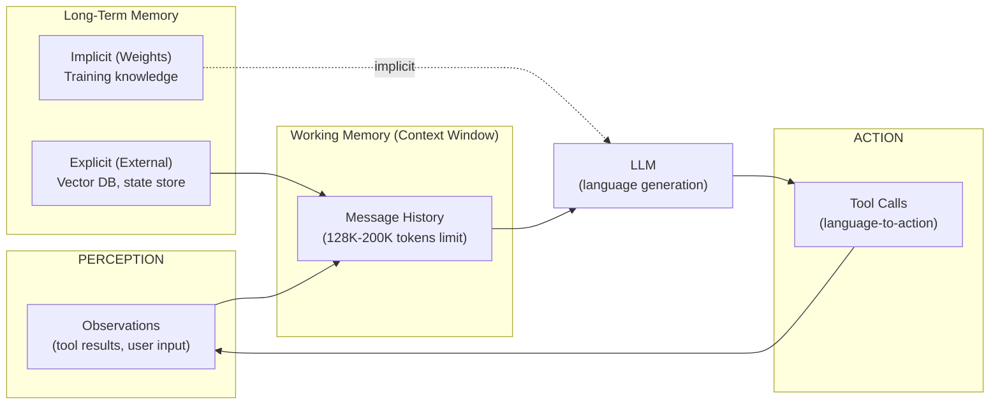
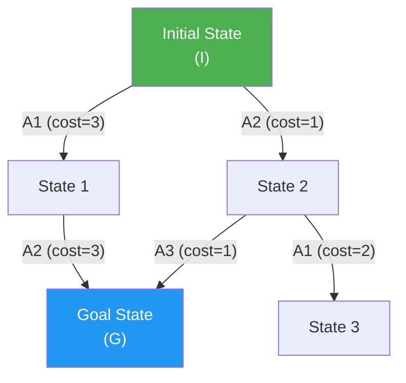

## Keywords in This File
{: .no_toc }

| # | Keyword | Weight |
|---|---|---|
| 1 | [Cognitive Architecture Theory](#cognitive-architecture-theory) | ★★☆ |
| 2 | [AI Planning Algorithms](#ai-planning-algorithms) | ★★☆ |

---

# Cognitive Architecture Theory

**Interview Weight:** ★★☆ - The theoretical foundation
that explains why LLM-based agents work and where
they differ from classical AI architectures.

---

### 🎯 Model Answer

**30 seconds:**

> Cognitive architecture theory studies the computational
> structures that enable intelligent behavior. Classical
> cognitive architectures (SOAR, ACT-R) had separate
> modules for perception, memory, and action. LLM-based
> agents implement a unified cognitive architecture
> where the language model serves all these roles:
> it perceives (processes observations), reasons
> (in natural language), maintains working memory
> (context window), and selects actions (tool calls).
> The theoretical insight is that language is a
> universal representation for cognition.

**3 minutes:**

> Classical cognitive architectures like SOAR and
> ACT-R were built on the hypothesis that intelligence
> requires: (1) a symbolic representation system
> (facts, rules, goals), (2) a working memory with
> limited capacity, (3) a long-term memory with
> learned patterns, and (4) a production system
> that selects actions based on current state and
> goals.
>
> LLM-based agents implement all four components,
> but in a radically different way:
> (1) Symbolic representation: natural language
>     serves as the representation format. LLMs can
>     represent arbitrary concepts in language without
>     hand-coded symbol systems.
> (2) Working memory: the context window. Limited
>     capacity (128K-200K tokens), not unlimited.
>     Information outside the context window is
>     not available for reasoning.
> (3) Long-term memory: the model's weights.
>     Contains compressed representations of training
>     data. Accessed implicitly via language generation,
>     not explicitly via retrieval.
> (4) Production system: the LLM's next-token
>     prediction is functionally equivalent to rule
>     selection. The "rule" that fires is determined
>     by the training distribution.
>
> The fundamental innovation: language as the universal
> interface. Previous architectures needed hand-coded
> bridges between perception, memory, and action.
> LLMs use language as the bridge. This is why
> "chain-of-thought" works: it externalizes the
> reasoning process in language, making it available
> for inspection and manipulation.

**Blank Mind Recovery:**

**(1) Restate:** "What cognitive architecture theory
explains how LLM-based agents work?"

**(2) First principles:** "What does any intelligent
agent need? Perception (see the world), memory
(store and recall), reasoning (process information),
action (change the world). How does an LLM do each?"

---

### 📘 Concept Explanation

**What it is:**

Cognitive architecture theory is the study of the
computational structures that enable intelligent
behavior. For AI agents, it provides the theoretical
vocabulary for understanding what a language model
is doing when it reasons, plans, and acts.

**Classical vs. LLM cognitive architectures:**

```
COMPONENT      CLASSICAL (SOAR/ACT-R)   LLM-BASED AGENT
-----------    ----------------------   ---------------
Perception     Feature extractors       Token input
               (domain-specific)        (universal)
Working        Symbolic buffers         Context window
Memory         (limited, structured)    (token-limited)
Long-term      Production rules +       Model weights
Memory         declarative memory       (implicit)
                                        + external stores
Reasoning      Rule application         Language generation
               (hand-coded rules)       (learned patterns)
Action         Procedural knowledge     Tool call generation
Selection      (explicit rules)         (language-to-call)
Learning       Rule compilation         Not at runtime
               (during execution)       (training only)
```

**The cognitive loop:**

```
Classical agent:
  perceive -> match rules -> fire rule -> act

LLM agent:
  perceive (observation -> tokens)
  -> store in context window (working memory)
  -> generate reasoning (language)
  -> generate action (tool call in language)
  -> observe result (update context)
  -> repeat
```

**Theoretical implications for engineering:**

```
Working memory limit:
  Context window = working memory capacity
  Implication: agent reasoning quality degrades
  when relevant information is near or over the
  context window limit

Long-term memory access:
  Model weights = implicit long-term memory
  Implication: agent "knows" things it wasn't
  explicitly told (from training data)
  Risk: confident but wrong (hallucination)

No runtime learning:
  LLMs don't update weights during inference
  Implication: agents don't learn from their
  mistakes within a run
  Mitigation: explicit memory injection (external
  notes added to context)
```

---

### 💻 Code Example

```python
# Demonstrating cognitive architecture components
# in an LLM agent

import anthropic

client = anthropic.Anthropic()

# Component 1: Working memory = context window
# This example shows context window as working memory

def reason_with_working_memory(
    observation: str,
    working_memory: list[dict],
    goal: str
) -> tuple[str, list[dict]]:
    """
    One cognitive cycle.
    observation: new perception
    working_memory: current context (simulated)
    Returns: (reasoning, updated_working_memory)
    """
    # Add observation to working memory
    working_memory.append({
        "role": "user",
        "content": f"[OBSERVATION] {observation}"
    })

    # Reason using working memory contents
    resp = client.messages.create(
        model="claude-haiku-4-5",
        max_tokens=512,
        system=(
            f"Goal: {goal}\n"
            f"Your working memory contains all "
            f"observations so far. Reason about "
            f"the current state and what to do next."
        ),
        messages=working_memory
    )
    reasoning = resp.content[0].text

    # Add reasoning to working memory (externalized)
    working_memory.append({
        "role": "assistant",
        "content": reasoning
    })

    return reasoning, working_memory


# Component 2: Long-term memory vs. context memory
# Showing the difference between implicit (weights)
# and explicit (injected) memory

def demonstrate_memory_types(
    factual_question: str,
    injected_fact: str = ""
) -> dict:
    """
    Compare: weights-only vs. injected knowledge.
    """
    # Weights-only: LLM uses training data
    resp_implicit = client.messages.create(
        model="claude-haiku-4-5",
        max_tokens=200,
        messages=[{
            "role": "user",
            "content": factual_question
        }]
    )

    # Injected fact: explicit context memory
    system_with_fact = (
        f"You have access to this fact: {injected_fact}\n"
        f"Use it to answer questions."
        if injected_fact else "Answer the question."
    )
    resp_explicit = client.messages.create(
        model="claude-haiku-4-5",
        max_tokens=200,
        system=system_with_fact,
        messages=[{
            "role": "user",
            "content": factual_question
        }]
    )

    return {
        "implicit_answer": resp_implicit.content[0].text,
        "explicit_answer": resp_explicit.content[0].text
    }


# Component 3: Externalized reasoning (CoT)
# Language as the medium for working through a problem

def reason_with_cot(
    problem: str
) -> tuple[str, str]:
    """
    Returns: (chain_of_thought, final_answer)
    Chain-of-thought externalizes working memory steps.
    """
    resp = client.messages.create(
        model="claude-haiku-4-5",
        max_tokens=1024,
        system=(
            "Think through this problem step by step. "
            "Use <thinking> tags for your reasoning. "
            "Provide your final answer after </thinking>."
        ),
        messages=[{
            "role": "user",
            "content": problem
        }]
    )
    response = resp.content[0].text

    # Extract components
    thinking = ""
    answer = response
    if "<thinking>" in response:
        start = response.find("<thinking>") + 10
        end = response.find("</thinking>")
        thinking = response[start:end].strip()
        answer = response[end + 11:].strip()

    return thinking, answer
```

> **Code walkthrough:** Three code examples illustrate
> the cognitive architecture components. `reason_with_working_memory`
> shows the context window as working memory - each
> observation is appended to the context, building
> up the agent's "current awareness." `demonstrate_memory_types`
> shows the difference between implicit memory (model
> weights - knowledge from training) and explicit
> memory (injected context - knowledge from the
> current run or external stores). `reason_with_cot`
> shows chain-of-thought as externalized cognition:
> the `<thinking>` block is the LLM writing out its
> working memory steps, making intermediate reasoning
> visible and inspectable.

---

### 🎓 Answers by Seniority

**Junior / Mid:**

> "Cognitive architectures define the components
> an intelligent agent needs: working memory, long-term
> memory, perception, and action selection. LLMs
> implement all of these: the context window is
> working memory, model weights are long-term memory
> (accessed implicitly via language), and tool calls
> are actions. Chain-of-thought works because it
> externalizes the reasoning process in language,
> making working memory steps visible."

---

**Senior / Staff:**

> "Cognitive architecture theory gives me three
> engineering constraints to reason about LLM agent
> behavior: (1) The context window constraint: working
> memory is finite and performance degrades near its
> limits - this drives all context management decisions.
> (2) The weights-as-memory constraint: the agent
> has implicit 'knowledge' it wasn't explicitly told,
> which is both a capability (world knowledge) and
> a risk (confident hallucination). (3) The no-runtime-
> learning constraint: the agent can't update its
> own knowledge without external memory mechanisms.
> These three constraints directly map to engineering
> solutions: context management, grounding via RAG,
> and external memory injection."

---

### ⚠️ Common Misconceptions

**Misconception: "LLMs don't have memory - they
start fresh every time."**

LLMs have two forms of memory. Weights-based (implicit)
long-term memory: the model's parameters encode
compressed representations of training data. This
is why the model "knows" facts, programming syntax,
and reasoning patterns without being told. Context-
based (explicit) working memory: the messages in
the current context window. This is why adding
information to the prompt changes behavior.
The distinction matters for engineering: some knowledge
can be relied on (from weights), but recent events
and task-specific facts must be injected explicitly.

---

### 🚨 Failure Modes and Diagnosis

**Failure: Agent reasons correctly in early iterations
but loses coherence in later iterations**

*Root cause:* Context window saturation. The agent's
"working memory" (context window) is full. Earlier
observations and reasoning are beyond the context
limit and no longer influence the agent's reasoning.
The agent effectively "forgets" its earlier work.

*Diagnosis:* Track approximate token count at each
iteration. Find the iteration where token count
crossed 70% of the context window limit. Does
coherence degrade from that point?

*Fix:* Active context management:
(1) At a token threshold, summarize older messages
    (keep the summary, discard the originals).
(2) Identify the key facts from earlier iterations
    that the agent must retain. Inject them as a
    "persistent state" block at the start of each
    new batch of messages.
(3) Use a state object separate from the message
    history for critical facts.

---

### 🎯 Interview Deep-Dive

| Seniority | Time | Focus |
|---|---|---|
| Junior | 4 min | Components, how LLMs map to them |
| Mid | 7 min | Engineering implications, CoT, memory |
| Senior | 10 min | Design decisions from theory, failure modes |

---

**[JUNIOR] Q1 - What are the four components of
a cognitive architecture?**

Perception: how the agent receives information from
its environment. In LLM agents: the token input
(text, structured data, tool results).

Working memory: the current information the agent
is actively reasoning about. Limited capacity.
In LLM agents: the context window. Typically 128K-
200K tokens - finite, not unlimited.

Long-term memory: stored knowledge that persists
beyond the current reasoning cycle. In LLM agents:
two types - model weights (implicit, from training)
and external stores (explicit, injected).

Action selection: how the agent decides what to
do. In classical architectures: rule matching.
In LLM agents: language generation that produces
tool calls.

*What separates good from great:* "Two types of
long-term memory" for LLMs - weights (implicit)
and external stores (explicit) - not treating memory
as a single concept.

---

**[MID] Q2 - Why does chain-of-thought prompting
work from a cognitive architecture perspective?**

Classical view: thinking is a purely internal,
unobservable process. A system either has the answer
or doesn't.

LLM cognitive architecture view: language is the
medium of cognition for LLMs. When an LLM generates
language, it is engaging its "thinking apparatus."
Generating reasoning steps in language = externalizing
the cognitive process.

Why CoT improves accuracy:
(1) Working memory expansion: the generated reasoning
    steps become part of the context window. The
    LLM can "see" its own earlier reasoning steps
    when generating later steps. This simulates
    scratch-pad working memory.
(2) Decomposition: complex problems are broken into
    sub-steps. Each sub-step is simpler. The LLM's
    accuracy is higher for simpler, more local steps.
(3) Self-correction: generating an intermediate step
    that is clearly wrong sometimes triggers
    self-correction in subsequent steps.

CoT limitation from cognitive architecture perspective:
(1) No runtime learning: CoT makes the LLM reason
    better in this context, but doesn't improve it
    for future queries. The weights don't change.
(2) Context cost: CoT increases token count significantly.

*What separates good from great:* "Working memory
expansion" as the mechanism (generated steps become
visible to subsequent generation) rather than just
"it makes the model think step by step."

---

**[MID] Q3 - How does the context window as
working memory constraint affect agent design?**

Classic working memory research (Miller's Law): human
working memory holds ~7 items. Context window: holds
~100,000+ tokens. Vastly larger, but still finite.

Engineering implications:

(1) Context exhaustion: if the task requires more
    iterations than fit in context, the agent will
    "forget" early context. Design for: context
    management (summarization), state extraction
    (pull key facts), and context window monitoring.

(2) Attention degradation: LLM attention is not
    uniform across the context window. Information
    at the very beginning and very end gets more
    attention than the middle ("lost in the middle"
    effect). Critical information should be placed
    at the end of the context (near the current query).

(3) Context pollution: injecting low-quality or
    irrelevant information into the context window
    degrades performance. Curate what goes into context.

(4) Effective working memory: not all tokens in the
    context window are equally usable. A 128K context
    window doesn't mean 128K tokens of high-quality
    reasoning capacity.

*What separates good from great:* The "lost in the
middle" effect as a specific LLM attention phenomenon
that directly affects where to place important
information in the context.

---

**[MID] Q4 - What is the difference between
in-weights knowledge and in-context knowledge?**

In-weights knowledge: information compressed into
the model's parameters during training. The model
"knows" things without being told. Examples: facts
about the world, programming syntax, mathematical
operations.

Characteristics:
- Always available (no retrieval needed)
- Fixed at training time (can't be updated)
- Not perfectly accurate (compressed, may be wrong)
- Potentially outdated (training cutoff)

In-context knowledge: information explicitly present
in the current context window. Examples: user-provided
documents, retrieved passages, injected state.

Characteristics:
- Only available if explicitly provided
- Overrides in-weights knowledge if contradictory
- Fresh and accurate (if the source is accurate)
- Token budget cost

Engineering use:
- For stable, general knowledge: rely on weights
- For fresh, specific, or task-specific knowledge:
  inject via context (RAG pattern)
- For proprietary knowledge (not in training data):
  must inject via context

*What separates good from great:* "In-context
overrides in-weights" as the priority ordering -
explicitly injecting a fact will override the model's
training-data belief.

---

**[SENIOR] Q5 - How do the theoretical limits of
LLM cognitive architectures drive design choices
for agents?**

Three theoretical limits → three design choices:

**Limit 1: No runtime learning**

Theory: model weights don't update during inference.
The agent can't "learn" from its current run.

Design consequence: implement explicit external memory.
For knowledge the agent should accumulate across
runs (user preferences, task history, domain facts),
use an external store (vector DB, key-value store)
that persists across sessions. Inject relevant
memories into the context window at the start of
each run.

**Limit 2: Context window as finite working memory**

Theory: context window is the agent's only working
memory. When it fills, older context is dropped.

Design consequence: active context management.
At N% of context limit: summarize old messages,
retain key facts as a state object, inject state
at the start of new messages. Critical: never let
the context fill silently.

**Limit 3: Probabilistic action selection**

Theory: tool call generation is probabilistic, not
rule-based. The same input can produce different
tool calls on different runs.

Design consequence: determinism where needed.
Use temperature=0 for reproducibility. Add explicit
action validation (before executing, confirm the
action is within scope). For critical decisions:
use structured output (constrained generation)
to limit the action space.

*What separates good from great:* Mapping each
theoretical limit to a specific, named engineering
pattern rather than general "handle uncertainty."

---

**[SENIOR] Q6 - [TRADE-OFF] What does LLM architecture
gain and lose vs. classical cognitive architectures?**

**GAIN:**

Generality: LLMs handle arbitrary domains without
domain-specific engineering. A classical cognitive
architecture needed hand-coded production rules
for each domain. An LLM agent operates in any domain
where language works.

Flexibility: LLMs can improvise (generate new
reasoning patterns not explicitly programmed).
Classical architectures only execute hand-coded rules.

Natural language interface: LLMs communicate naturally
with humans and between agents without protocol
translation.

World knowledge: training data provides broad world
knowledge as a foundation.

**SACRIFICE:**

Determinism: classical systems are fully deterministic
(same input, same output). LLMs are probabilistic.
This complicates testing and debugging.

Guaranteed termination: classical production systems
can be analyzed for termination. LLM-based loops
may not terminate (reasoning loop failure).

Controllable reasoning: in classical systems, you
can inspect and modify the exact rules being applied.
LLM reasoning is opaque - you can see the chain
of thought but not the underlying computation.

Symbolic manipulation: classical architectures
excel at formal logic, constraint satisfaction.
LLMs approximate these capabilities but with lower
reliability.

*What separates good from great:* "Guaranteed
termination" as a loss - formal analysis of LLM
agent termination is still an open research problem.

---

**[SENIOR] Q7 - How does the BabyAGI or AutoGPT
architectural approach differ from the current
multi-agent paradigm?**

Early autonomous agent systems (BabyAGI, AutoGPT,
2023) used a goal-decomposition loop:

1. LLM generates a task list
2. Execute the top task
3. LLM generates new tasks based on result
4. Repeat until goal achieved

Problems that emerged in practice:
- Unbounded loops (no reliable termination)
- Goal drift (task list drifted from original goal)
- Context management (task list + results filled
  context rapidly)
- Reliability (no error handling, no retry logic)

The architectural evolution to current multi-agent
paradigm addressed these:
- Explicit orchestrator/worker separation (bounded
  planning, bounded execution)
- Hard iteration limits (termination guarantee)
- Structured handoffs (typed messages between agents)
- Specialized agents (each agent has a scope limit)
- Human oversight checkpoints

The key theoretical insight: a single agent loop
trying to be "fully autonomous" is architecturally
fragile. The multi-agent paradigm accepts partial
autonomy: each agent is bounded; the system achieves
complex goals through composition of bounded agents.

*What separates good from great:* "Partial autonomy
through composition" as the theoretical advancement
over "full autonomy in a single agent."

---

**[SENIOR] Q8 - What open theoretical problems
remain in cognitive architecture for AI agents?**

(1) Sample efficiency: LLMs require enormous training
    data to learn cognitive capabilities. Classical
    architectures can learn rules from a few examples.
    Open question: how do we get the generality of
    LLMs with less data?

(2) Compositional generalization: LLMs struggle
    with systematic compositional reasoning (combining
    known operations in novel ways). Classical
    symbolic systems do this naturally. Open question:
    how to give LLMs reliable compositional reasoning?

(3) Causal reasoning: LLMs are strong at correlation-
    based pattern matching but weak at counterfactual
    causal reasoning ("What would have happened if...?").
    Open question: integrating causal models with LLMs.

(4) Meta-cognition: awareness of one's own reasoning
    quality. Humans know when they don't know.
    LLMs often generate confident wrong answers.
    Open question: reliable uncertainty quantification
    for LLMs.

(5) Online learning: current LLMs cannot update
    their weights from experience without full fine-
    tuning. Open question: efficient online learning
    that doesn't catastrophically forget.

Engineering implication: these open problems are
the frontier of what agents can't yet do reliably.
Knowing them prevents overbuilding systems that
depend on capabilities agents don't have.

*What separates good from great:* Meta-cognition
(knowing when you don't know) as a specifically
actionable open problem - it directly explains
why LLMs hallucinate confidently.

---

**[SENIOR] Q9 - [BEHAVIORAL] How do you apply
cognitive architecture theory when designing
a new agent?**

Cognitive architecture theory gives me a checklist
of questions before I write code:

(1) Working memory: what does this agent need to
    hold in context simultaneously? Does it fit
    within context window limits? If not, design
    context management first.

(2) Long-term memory: does this agent need knowledge
    that changes over time or is user-specific?
    That knowledge can't live in weights alone -
    design an external memory store.

(3) Action selection reliability: how critical is
    determinism in tool call generation? For high-
    stakes actions: use structured output + lower
    temperature + explicit validation. For exploratory
    tasks: higher temperature is acceptable.

(4) Reasoning transparency: do I need to inspect
    the agent's intermediate reasoning? If yes:
    use explicit chain-of-thought with logged thought
    traces. If no: direct tool call mode is more
    efficient.

(5) Learning requirements: does this agent need
    to improve from its mistakes within a session?
    (Standard LLMs: no.) Does it need to retain
    knowledge across sessions? (If yes: external
    memory with explicit injection.)

This framework prevents over-engineering: I don't
build external memory for agents that don't need
cross-session knowledge. I don't add CoT for agents
whose tasks don't require visible reasoning.

*What separates good from great:* "Preventing over-
engineering" as a concrete benefit of applying
theory - not just "theory informs design" but the
specific way it prevents unnecessary complexity.

---

### ⚖️ Comparison Table

| Architecture | Representation | Working Memory | LT Memory | Action Selection | Learning |
|---|---|---|---|---|---|
| SOAR | Symbolic rules | Limited buffers | Production rules | Rule matching | Rule compilation |
| ACT-R | Symbolic chunks | 7 items | Declarative + procedural | Utility theory | Activation learning |
| LLM agent | Natural language | Context window (finite) | Weights + external stores | Language generation | Not at runtime |
| Hybrid (LLM + symbolic) | Mixed | Context + formal buffers | Weights + knowledge graph | LLM + constraint check | Via external update |

---

### 🏛️ System Design

*(Omit: ★★☆ concept. Applied in cognitive-architecture-
informed agent design - see Q9 for the design framework.)*

---

### 📊 Diagram

```
LLM COGNITIVE ARCHITECTURE:

 PERCEPTION       WORKING MEMORY     ACTION
  (Input)          (Context Window)   (Tool Call)
    |                    |               |
[token input] -> [context messages] -> [LLM] -> [output]
                         |
              LONG-TERM MEMORY:
                [weights] + [external store]
```



> **Diagram walkthrough:** The four cognitive components
> of an LLM agent are mapped to their implementations.
> Perception feeds into Working Memory (the context
> window). Long-term memory has two pathways: implicit
> (model weights, always present but fixed) feeds
> directly into the LLM at inference time; explicit
> (external stores) is retrieved and injected into
> the context window. The LLM processes all context
> and generates language that becomes tool calls
> (action). Tool call results become new observations,
> closing the cognitive loop. The dashed arrow for
> weights shows that this memory is accessed implicitly
> during generation, not via explicit retrieval.

---

---

# AI Planning Algorithms

**Interview Weight:** ★★☆ - Understanding the
classical planning algorithms that LLM-based agents
approximate helps explain their strengths and
failure modes, and informs when to use formal
planning vs. LLM-based planning.

---

### 🎯 Model Answer

**30 seconds:**

> Classical AI planning algorithms (A*, STRIPS, PDDL)
> solve planning problems by searching a state space:
> given a current state, a goal state, and available
> actions, find the sequence of actions that transforms
> the current state into the goal state. LLM-based
> agents approximate this with: the current context
> as state, the agent goal as the goal condition,
> and tool calls as actions. The key difference is
> that classical planners are sound (they find
> guaranteed-optimal paths if one exists), while
> LLM planners are approximate but operate in
> open-ended domains that classical planners can't
> handle.

**3 minutes:**

> Classical planning frameworks: STRIPS (1971) defined
> planning as: given initial state I, goal condition
> G, and actions A (each with preconditions and effects),
> find a sequence of actions that transforms I into
> a state satisfying G. PDDL formalizes this in a
> domain definition language. A* (1968) is the search
> algorithm commonly used to find optimal paths.
>
> LLM-based agents approximate the planning problem
> without formal state models. The LLM reasons in
> natural language about what state it's in, what
> the goal is, and which action to take next. This
> is more flexible (works in any domain) but less
> reliable (no soundness guarantee).
>
> Modern hybrid approaches combine LLM flexibility
> with formal planning: LLM generates a high-level
> plan (sequence of subtasks), formal planners execute
> each subtask deterministically, LLM handles exceptions
> and adaptations.
>
> Where classical planning beats LLM planning:
> - Optimal path finding (A* guarantees minimum cost)
> - Constraint satisfaction (formal solvers are exact)
> - Loops and backtracking (formal planners handle
>   state revisits correctly)
>
> Where LLM planning beats classical:
> - Open-ended domains (no need to hand-code the
>   state space)
> - Natural language goals (no need to formalize
>   the goal condition)
> - Handling unexpected situations (LLMs improvise;
>   classical planners fail on unknown states)

**Blank Mind Recovery:**

**(1) Restate:** "How do classical planning algorithms
relate to LLM-based agent planning?"

**(2) First principles:** "Planning = given where
I am and where I want to be, find the steps to
get there. Classical AI solved this formally. LLMs
approximate it with language. Formal is better for
known domains; language-based is better for open
domains."

---

### 📘 Concept Explanation

**What it is:**

AI planning algorithms are formal methods for finding
sequences of actions that transform an initial state
into a goal state. They provide the theoretical
basis for understanding agent planning, including
where LLM-based planning is grounded and where
it diverges from optimal solutions.

**STRIPS-style planning:**

```
PLANNING PROBLEM:
  Initial state: I (set of true facts)
  Goal: G (conditions to make true)
  Actions: A = { (preconditions, effects) }

SOLUTION:
  Sequence of actions [a1, a2, ..., an] such that:
  - a1 preconditions satisfied in I
  - applying a1 produces state I'
  - a2 preconditions satisfied in I'
  ...
  - final state satisfies G
```

**A* search for planning:**

```
g(n): cost to reach state n from start
h(n): heuristic estimate of cost to goal
f(n): g(n) + h(n) (total estimated path cost)

A* expands the node with lowest f(n) first.
If h(n) is admissible (never overestimates),
A* finds the optimal path.
```

**LLM-based planning in STRIPS terms:**

```
STRIPS                    LLM EQUIVALENT
------------------        ------------------
State: set of facts       Context window content
Goal: formal condition    Natural language goal in prompt
Action: precond+effect    Tool call + inferred effects
Search: systematic        Heuristic (LLM next-token)
Soundness: guaranteed     Approximate
```

---

### 💻 Code Example

```python
import anthropic, json
from dataclasses import dataclass

# Comparing classical vs. LLM planning
# for a simple task scheduling problem

@dataclass
class PlanningState:
    """Explicit state for planning."""
    tasks_completed: list[str]
    resources_available: dict[str, int]
    current_step: int

    def to_prompt(self) -> str:
        return (
            f"Completed tasks: {self.tasks_completed}\n"
            f"Available resources: "
            f"{json.dumps(self.resources_available)}\n"
            f"Current step: {self.current_step}"
        )


# Classical planning approach (simplified BFS)
def classical_plan(
    initial_state: PlanningState,
    goal: str,
    actions: list[dict]
) -> list[str] | None:
    """
    Breadth-first search over action sequences.
    Returns a valid plan or None.
    Classical approach: systematic, exhaustive.
    """
    from collections import deque

    # State representation for search
    start = (
        tuple(initial_state.tasks_completed),
        frozenset(initial_state.resources_available.items())
    )
    queue = deque([(start, [])])
    visited = {start}

    while queue:
        (completed, resources), plan = queue.popleft()
        resources_dict = dict(resources)

        for action in actions:
            # Check preconditions
            prereqs = action.get("requires_tasks", [])
            resource_cost = action.get("resources", {})

            if not all(t in completed for t in prereqs):
                continue
            if not all(
                resources_dict.get(r, 0) >= cost
                for r, cost in resource_cost.items()
            ):
                continue

            # Apply effects
            new_completed = tuple(
                list(completed) + [action["name"]]
            )
            new_resources = {
                r: resources_dict.get(r, 0) - cost
                for r, cost in resource_cost.items()
            }
            new_resources.update({
                r: v for r, v in resources_dict.items()
                if r not in new_resources
            })

            new_state = (
                new_completed,
                frozenset(new_resources.items())
            )
            new_plan = plan + [action["name"]]

            # Check goal (simplified: check task completion)
            if goal in new_completed:
                return new_plan

            if new_state not in visited:
                visited.add(new_state)
                queue.append((new_state, new_plan))

    return None  # No plan found


# LLM-based planning approach
def llm_plan(
    initial_state: PlanningState,
    goal: str,
    available_actions: list[str]
) -> list[str]:
    """
    LLM generates a plan in natural language.
    More flexible, less systematic.
    """
    client = anthropic.Anthropic()

    resp = client.messages.create(
        model="claude-haiku-4-5",
        max_tokens=512,
        system=(
            "You are a planning assistant. "
            "Given a current state and goal, "
            "output a JSON list of action names "
            "that achieves the goal. "
            "Only use available actions."
        ),
        messages=[{
            "role": "user",
            "content": (
                f"Current state:\n"
                f"{initial_state.to_prompt()}\n\n"
                f"Goal: {goal}\n\n"
                f"Available actions: "
                f"{json.dumps(available_actions)}\n\n"
                f"Return a JSON list of action names."
            )
        }]
    )

    try:
        text = resp.content[0].text
        # Extract JSON list from response
        start = text.find("[")
        end = text.rfind("]") + 1
        if start >= 0 and end > start:
            return json.loads(text[start:end])
    except Exception:
        pass
    return []
```

> **Code walkthrough:** `classical_plan` implements
> BFS (breadth-first search) over action sequences.
> It systematically explores all possible action
> sequences until it finds one that satisfies the
> goal. This is sound (finds a valid plan if one
> exists) but only works for domains where the state
> space can be fully enumerated. `llm_plan` asks the
> LLM to generate a plan in natural language and
> parse it as a JSON list. This works for any domain
> but has no soundness guarantee - the LLM may suggest
> actions that aren't available, skip preconditions,
> or hallucinate steps. The engineering lesson: for
> well-defined, enumerable problems (scheduling,
> logistics) prefer classical planning; for open-ended
> problems (research, support) use LLM planning with
> validation steps.

---

### 🎓 Answers by Seniority

**Junior / Mid:**

> "Classical planning algorithms like STRIPS and A*
> solve the 'find steps to achieve a goal' problem
> formally - they guarantee finding a valid plan if
> one exists. LLM-based agents approximate this without
> formal state models: the context window is the
> state, the goal prompt is the goal condition, and
> tool calls are actions. LLMs are more flexible (work
> in any domain) but less reliable than formal planners."

---

**Senior / Staff:**

> "The classical planning literature gives me a precise
> vocabulary for what can go wrong with LLM-based
> planning. A classical planner is sound (guaranteed
> correct) and complete (finds a plan if one exists).
> LLM planners are neither. From this, I derive
> specific engineering safeguards: (1) Precondition
> checking - validate that the LLM's proposed action
> is actually executable before trying it. (2) Effect
> verification - verify the action had the expected
> effect after execution. (3) Loop detection - detect
> when the agent is revisiting states (sign of planning
> failure). These three safeguards compensate for
> LLM planners' lack of formal soundness and completeness."

---

### ⚠️ Common Misconceptions

**Misconception: "LLMs are better planners than
classical algorithms because they understand language."**

Better on some dimensions, worse on others. LLMs
excel at: open-ended domain planning, handling
unexpected situations, communicating plans in natural
language. LLMs are worse than classical planners
at: optimal path finding (A* is guaranteed optimal;
LLMs are not), constraint satisfaction (SAT/CSP
solvers are exact; LLMs approximate), and systematic
backtracking (classical planners can backtrack
efficiently; LLM agents typically don't).

For problems with formal structure (scheduling,
resource allocation, route planning), classical
algorithms remain superior. Use LLMs where the
domain can't be formalized.

---

### 🚨 Failure Modes and Diagnosis

**Failure: Agent generates a plan with unsatisfied
preconditions**

*Scenario:* The agent plans to "send a report to
the customer" but hasn't yet retrieved the customer's
email address. The action fails at execution.

*Root cause:* LLM planning is not formally sound.
The LLM generated an action sequence without tracking
which facts were actually established by previous
steps.

*Diagnosis:* Review the plan the agent generated
(if it verbalized a plan). Find the step that failed.
Check: what preconditions does this action require?
Were they satisfied in the preceding steps?

*Fix:* Add precondition checking before execution.
For each planned action, validate that its required
preconditions are satisfied in the current state.
If not: inject a planning prompt that makes the
missing precondition explicit.

---

### 🎯 Interview Deep-Dive

| Seniority | Time | Focus |
|---|---|---|
| Junior | 4 min | Classical planning, LLM approximation |
| Mid | 7 min | Formal properties, hybrid approaches |
| Senior | 10 min | Design implications, trade-offs, when to use |

---

**[JUNIOR] Q1 - What is the STRIPS planning model?**

STRIPS (Stanford Research Institute Problem Solver,
1971): a foundational planning formalism.

A planning problem in STRIPS has:
- Initial state I: the set of facts that are true
  at the start
- Goal G: the conditions that must be true for
  success
- Actions A: a set of actions, each with:
  - Preconditions: what must be true to execute
  - Add effects: what becomes true after execution
  - Delete effects: what becomes false after execution

STRIPS planning finds a sequence of actions [a1, a2,
..., an] that transforms I into a state satisfying G.

Example (simplified):
```
Initial: {has_data=false, report_sent=false}
Goal: {report_sent=true}

Action: fetch_data
  Pre: none
  Add: {has_data=true}

Action: send_report
  Pre: {has_data=true}
  Add: {report_sent=true}

Plan: [fetch_data, send_report]
```

LLM equivalent: the LLM reasons about what's true
in its context (initial state), what the goal is
(from the goal prompt), and which tool to call next
(action). Without formal state tracking.

*What separates good from great:* The concrete
example showing preconditions and effects - not
just the definition but the mechanism.

---

**[MID] Q2 - What are the formal properties of
A* and how do they relate to LLM planning?**

A* properties:

Completeness: if a solution exists and the graph
is finite, A* will find it. LLM agents: not complete.
An LLM agent can miss a valid plan if the LLM's
heuristic (its language-based intuition) doesn't
guide it toward the solution.

Optimality: if the heuristic is admissible (never
overestimates the remaining cost), A* finds the
minimum-cost path. LLM agents: not optimal. The
LLM doesn't search for minimum cost - it generates
the first plausible plan.

Time complexity: O(b^d) in the worst case (b=branching
factor, d=depth). For large action spaces: exponential.
Practical with good heuristics.

LLM planning properties:
- Not complete: may miss valid plans
- Not optimal: no minimum-cost guarantee
- Fast: generates a plan in one LLM call (not search)
- Flexible: works in open-ended domains

Engineering implication: for domains where optimality
matters (scheduling, resource allocation), use
classical planning. For domains where flexibility
matters (research, customer support), use LLM planning.
For high-stakes domains: use LLM to generate a plan,
verify the plan with classical checking before execution.

*What separates good from great:* "LLM generates
plan in one call vs. search" as the efficiency
advantage - LLM planning is O(1) LLM calls for
a plan, vs. O(b^d) for exhaustive search.

---

**[MID] Q3 - What is the difference between forward
planning and backward planning, and how does
an LLM agent compare?**

Forward planning (progression): start from the initial
state, apply actions, move toward the goal. Classical:
BFS/DFS forward from I. LLM: this is how LLMs
naturally plan - start from current context, generate
next action.

Backward planning (regression): start from the goal,
work backward to find what state would achieve it,
then what state would achieve that. Classical: STRIPS
backward chaining. LLM: not natural for LLMs.

For problems where the goal is complex and the number
of achieving states is small: backward planning is
more efficient (searches from the goal, not the
entire state space).

LLM agents implicitly do forward planning. They
are in a state (current context), generate what
to do next (forward direction). They don't naturally
do backward reasoning ("what do I need to be true
to achieve this goal? What would produce that?").

Engineering implication: for multi-step tasks with
complex dependencies, explicitly prompt the agent
to work backward: "To achieve [goal], what must
be true? What actions establish those conditions?"
This simulates backward planning and often produces
better plans.

*What separates good from great:* The engineering
implication (explicit backward-planning prompt)
as a concrete technique, not just the academic
distinction.

---

**[MID] Q4 - What is plan repair and why is it
important for LLM agents?**

Plan repair: when an action in a plan fails (unexpected
result, precondition unsatisfied at execution time),
repair the plan rather than re-planning from scratch.

In classical planning: plan repair algorithms identify
the failed step, find the minimal set of changes
needed to restore plan validity, and output the
repaired plan.

For LLM agents: plan repair is implicitly needed
in the agent loop. When a tool call returns an error
or unexpected result, the agent must update its
plan. Without explicit plan repair prompting, the
LLM may:
- Continue with the original plan (ignore the failure)
- Re-plan from scratch (wasting earlier work)
- Abandon the task entirely

Engineering implementation of plan repair prompting:
When a tool call fails, inject: "The following step
in your plan failed: [step]. The error was: [error].
Update your plan: identify the minimum changes needed
to achieve the goal given this failure."

This guides the LLM to perform minimal-impact plan
repair rather than wholesale re-planning.

*What separates good from great:* "Minimum changes"
as the key criterion for plan repair - not "start
over" but "fix only what broke."

---

**[SENIOR] Q5 - When should you use formal planning
vs. LLM-based planning in an agentic system?**

Decision framework:

**Use formal planning when:**
- The state space is fully enumerable
- Optimality matters (minimum steps/cost/time)
- Constraints must be satisfied exactly (no
  "approximately correct")
- The domain can be formally specified
- Examples: scheduling, routing, resource allocation,
  puzzle solving, workflow automation with fixed rules

**Use LLM-based planning when:**
- The domain is open-ended (can't enumerate all states)
- Goals are expressed in natural language
- Handling unexpected situations is required
- The action space includes natural language generation
- Examples: research, customer support, document
  processing, creative tasks

**Use hybrid when:**
- High-level planning is open-ended, but execution
  steps are formal
- Pattern: LLM decomposes goal into subtasks,
  formal planner executes each subtask optimally

Hybrid example: logistics agent
- LLM: understand the natural language request
  ("optimize our warehouse operations for Q4")
  and decompose into subtasks
- Formal solver: solve each subtask optimally
  (routing, scheduling, inventory optimization)
- LLM: synthesize results and communicate

*What separates good from great:* The concrete
hybrid example showing where each method applies
within the same problem.

---

**[SENIOR] Q6 - How do you implement plan verification
before execution?**

Plan verification: before an LLM agent executes a
multi-step plan, systematically check that the plan
is valid: actions are in the correct order, each
action's preconditions are satisfied, and the plan
would achieve the goal if executed correctly.

Implementation:
```python
def verify_plan(
    plan: list[str],
    action_preconditions: dict[str, list[str]],
    initial_state: set[str],
    action_effects: dict[str, dict]
) -> tuple[bool, str]:
    """
    Verify plan validity using STRIPS simulation.
    Returns: (is_valid, failure_reason)
    """
    state = set(initial_state)

    for i, action_name in enumerate(plan):
        preconditions = action_preconditions.get(
            action_name, []
        )
        unsatisfied = [
            p for p in preconditions
            if p not in state
        ]
        if unsatisfied:
            return (
                False,
                f"Step {i}: {action_name} requires "
                f"{unsatisfied} but state is {state}"
            )
        effects = action_effects.get(action_name, {})
        state.update(effects.get("add", []))
        state -= set(effects.get("delete", []))

    return True, ""
```

When to verify: before executing any multi-step plan
that involves irreversible actions (sending emails,
writing to databases, making API calls). For read-only
exploratory plans: verification overhead may not
be worth it.

Lightweight alternative: use an LLM verification
call. Ask a second LLM call: "Is this plan valid?
Does step N depend on step M? Are there any missing
preconditions?" This uses LLM common sense without
formal state tracking.

*What separates good from great:* "Lightweight LLM
verification call" as an alternative to formal
STRIPS simulation - practical for most agent tasks.

---

**[SENIOR] Q7 - What is MCTS and how could it
be applied to agent planning?**

MCTS (Monte Carlo Tree Search): a planning algorithm
that simulates possible futures (rollouts) to estimate
the value of actions. Used in AlphaGo and game-playing
AI.

Algorithm:
1. Selection: navigate the tree using UCB1 heuristic
2. Expansion: add a new node (new action/state)
3. Simulation: simulate to end state (rollout)
4. Backpropagation: update value estimates up the tree

Applied to agent planning:

Each node = agent state (context snapshot)
Each edge = action (tool call)
Rollout = simulate the rest of the agent run from
this state to estimate outcome quality

LLM + MCTS hybrid (called "LLM-MCTS" or "Tree of
Thoughts"):
- Use an LLM to evaluate the quality of partial
  plans (replacing the simulation rollout)
- Use MCTS to search over action sequences
- The LLM serves as the value function

Advantage over pure LLM planning: explores multiple
paths simultaneously rather than committing to the
first plausible plan. Better for high-stakes decisions.

Cost: expensive. Each MCTS rollout requires an LLM
call. For planning with branching factor b and depth
d: O(b^d) LLM calls. Use only for decisions where
the cost of a wrong plan exceeds the cost of N LLM
calls.

*What separates good from great:* "Tree of Thoughts"
as the practical LLM+MCTS application, and the
concrete cost formula (O(b^d) LLM calls) as the
engineering constraint.

---

**[SENIOR] Q8 - [TRADE-OFF] What is the value
and cost of adding formal planning to an agentic
system?**

**VALUE:**

Reliability: formal planners guarantee valid plans
for well-defined problems. For workflows with strict
ordering constraints, this eliminates a class of
agent failures (executing actions out of order,
missing preconditions).

Optimality: formal planners find minimum-cost paths.
For time-sensitive or resource-constrained workflows:
significant operational value.

Auditability: a formal plan is an explicit, inspectable
structure. Easier to audit and explain than LLM
reasoning traces.

**COST:**

Engineering overhead: formalizing the domain (defining
states, actions, preconditions, effects in PDDL or
a code representation) is labor-intensive. For complex
domains with many actions: weeks of engineering work.

Maintenance: when the domain changes (new tools,
changed workflows), the formal model must be updated.
LLM-based agents adapt automatically.

Brittleness: formal planners fail completely on
states outside the formal model. LLMs improvise.

Scope limitation: formal planning works for the
subset of the domain that has been formalized. The
agent still needs LLM planning for the unformalized
remainder.

Decision rule: add formal planning only when:
(1) A specific set of critical workflows can be
    fully formalized
(2) These workflows have optimality or strict
    correctness requirements
(3) The domain is stable (not changing frequently)

Otherwise: LLM planning with validation is more
practical.

*What separates good from great:* "Scope limitation"
as the hidden cost - formal planning doesn't replace
LLM planning; it supplements it for the formalized
subset.

---

**[SENIOR] Q9 - How do you debug a failing agent
plan?**

Plan debugging: identifying why the agent's plan
failed to achieve the goal.

Debugging framework based on planning theory:

(1) Completeness failure: the agent couldn't find
    any plan. Symptom: agent terminates saying
    "I can't accomplish this." Diagnosis: is the
    goal achievable with the available tools? Check
    if the required tools exist. If not: the agent's
    tool set is incomplete for this goal.

(2) Soundness failure: the agent had a plan but
    it was invalid (preconditions not satisfied,
    wrong order). Symptom: tool call fails with
    "precondition not met" or similar. Diagnosis:
    trace the message history. Find the step that
    assumed a fact that wasn't established.

(3) Optimality failure: the agent achieves the goal
    but via an unnecessarily long path. Symptom:
    high iteration count. Diagnosis: compare the
    agent's actual path to a minimum-step path (if
    you can compute it). Are there unnecessary steps?
    Root cause: suboptimal action ordering in the
    LLM's plan.

(4) Termination failure: the agent doesn't complete
    the plan (runs out of iterations or gets stuck
    in a loop). Symptom: max_iterations hit. Diagnosis:
    check if the plan is making progress toward the
    goal at each iteration. If not: the agent has
    lost its plan and is thrashing.

*What separates good from great:* The four failure
types mapped to four symptom patterns - actionable
diagnosis, not just "the plan failed."

---

### ⚖️ Comparison Table

| Planning Method | Optimal | Complete | Flexible | Cost | Use When |
|---|---|---|---|---|---|
| STRIPS/PDDL | Yes (with solver) | Yes | No (must formalize) | High (engineering) | Fixed formal domains |
| A* | Yes (admissible h) | Yes | No | O(b^d) time | Optimal path, known space |
| BFS/DFS | No/Yes | Yes | No | O(b^d) | Small search space |
| LLM planning | No | No | Yes | 1 LLM call/plan | Open-ended domains |
| LLM + STRIPS verify | No | No | Yes | 1 call + check | LLM plan + safety |
| MCTS + LLM | Near-optimal | Near | Yes | O(b^d) LLM calls | High-stakes decisions |
| Hybrid (LLM+formal) | Partial | Partial | High | Medium | Complex mixed domains |

---

### 🏛️ System Design

*(Omit: ★★☆ concept. Design implications covered
in Q5 (when to use formal vs. LLM) and Q6 (plan
verification).)*

---

### 📊 Diagram

```
CLASSICAL PLANNING SEARCH:

State 0 -> [A1] -> State 1 -> [A2] -> Goal
        -> [A2] -> State 2 -> [A1] -> State 3
                           -> [A3] -> Goal (shorter!)

A* picks State 2 -> [A3] as optimal
LLM picks State 1 -> [A2] (first plausible, not optimal)
```



> **Diagram walkthrough:** The state space graph
> shows why optimal planning matters. From the initial
> state, two action sequences reach the goal: I->S1->Goal
> (cost=6) and I->S2->Goal via A3 (cost=2). A* finds
> the optimal path (I->S2->Goal, cost=2) by exploring
> lowest-cost nodes first. An LLM agent would likely
> take the first plausible path it generates (I->S1->Goal)
> unless explicitly prompted to consider alternatives.
> For most agent tasks, the suboptimal path is
> acceptable. But for resource-constrained or time-
> critical workflows, the 3x cost difference matters.
> This is the formal argument for when to use classical
> planning vs. LLM planning.
