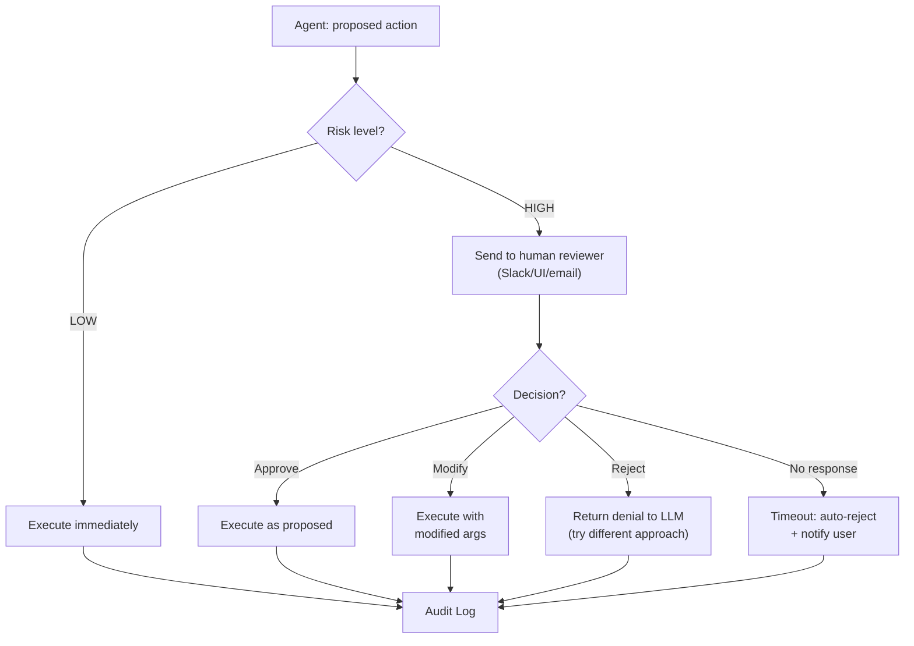
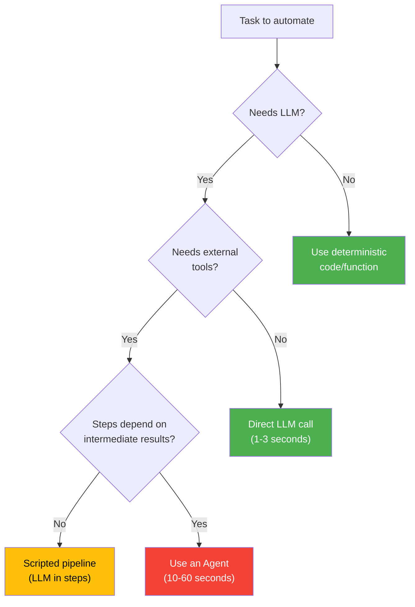

## Keywords in This File
{: .no_toc }

| # | Keyword | Weight |
|---|---|---|
| 1 | [Human-in-the-Loop Design Pattern](#human-in-the-loop-design-pattern) | ★☆☆ |
| 2 | [Autonomy vs Control Tradeoff](#autonomy-vs-control-tradeoff) | ★☆☆ |
| 3 | [When NOT to Use Agents](#when-not-to-use-agents) | ★☆☆ |

---

# Human-in-the-Loop Design Pattern

**Interview Weight:** ★☆☆ - A foundational design
pattern for any production agent that takes real-
world actions. Knowing when and how to involve
humans is a senior design skill.

---

### 🎯 Model Answer

**30 seconds:**

> Human-in-the-loop (HITL) is a design pattern where
> an AI agent pauses before high-stakes actions and
> waits for human confirmation. The pattern has three
> components: (1) risk classification - determine
> which actions require human approval; (2) pause
> mechanism - stop the agent loop and present the
> proposed action; (3) continuation - resume execution
> based on the human decision (approve, reject, modify).
> HITL is the primary mechanism for keeping humans
> in control of agents that have real-world capabilities.

**3 minutes:**

> Why HITL matters: an agent with tool access can
> take irreversible actions - send emails, write to
> databases, make API calls, process payments. If
> the agent makes a wrong decision, the consequences
> are real and may not be recoverable. HITL creates
> a safety checkpoint that allows humans to catch
> agent errors before they become incidents.
>
> Implementation: the agent generates a proposed
> action and the arguments it would use. Before
> calling the tool, the system pauses and presents
> the proposed action to a human reviewer in a UI,
> Slack message, or approval queue. The human can:
> approve (action proceeds as planned), reject (action
> is cancelled, agent is told to try another approach),
> or modify (human edits the arguments, revised action
> proceeds).
>
> When to use HITL:
> - HIGH risk actions: sending emails, processing
>   payments, modifying shared data
> - Low confidence: when the agent expresses uncertainty
>   or the task is ambiguous
> - First N runs: for new agents, require approval
>   on all actions until the team has confidence
>   in the agent's behavior
>
> When NOT to use HITL: read-only operations (no
> real-world consequence), high-volume low-risk tasks
> (HITL doesn't scale to 1000 requests/minute),
> well-tested workflows with high reliability history.

**Blank Mind Recovery:**

**(1) Restate:** "What is human-in-the-loop and
how do you implement it?"

**(2) First principles:** "Agents can make mistakes.
Some mistakes are reversible (bad answer, user can
ask again). Some are not (email sent, payment made).
HITL is for the non-reversible kind."

---

### 📘 Concept Explanation

**What it is:**

Human-in-the-loop is a design pattern where an AI
agent incorporates human judgment at defined checkpoints
in its execution, rather than operating fully
autonomously. It is the primary mechanism for
maintaining human control over AI agents with real-
world capabilities.

**HITL spectrum:**

```
FULL AUTOMATION          SUPERVISED          FULL HUMAN
(no HITL)                (selective HITL)    (HITL all)
    |                         |                   |
Agent acts on all    Agent acts on LOW risk  Agent proposes,
actions without      Pauses on HIGH risk     human decides
approval                                     everything
    |                         |                   |
Fast, scalable       Best for production     Slow, safe,
Risky for prod.      Most common pattern     for new agents
```

> **Code walkthrough:** This Human-in-the-Loop Design Pattern example demonstrates a key concept in practice using SQL. **KEY MECHANISM:** the runtime executes these instructions in sequence with specific memory and execution semantics. **WHY IT MATTERS:** misapplying this pattern causes subtle bugs that only manifest under production load. **TAKEAWAY: understand the execution model before using this pattern in production code.**

**Risk classification:**

```
LOW risk (no approval needed):
  - Read-only operations
  - Queries that have no side effects
  - Idempotent lookups

MEDIUM risk (log + optional approval):
  - Write operations that are reversible
  - Updates that can be undone

HIGH risk (always require approval):
  - Sends (email, message, notification)
  - Payments, financial transactions
  - Deletes (data, records)
  - External API writes
  - Actions affecting multiple users
```

> **Code walkthrough:** This Human-in-the-Loop Design Pattern example demonstrates a key concept in practice using SQL. **KEY MECHANISM:** the runtime executes these instructions in sequence with specific memory and execution semantics. **WHY IT MATTERS:** misapplying this pattern causes subtle bugs that only manifest under production load. **TAKEAWAY: understand the execution model before using this pattern in production code.**

**The approval lifecycle:**

```
1. Agent generates proposed action + args
2. Pause loop, store state
3. Send approval request (UI, Slack, email)
4. Human reviews: approve / reject / modify
5. Resume loop with decision
6. Log: action, approver, timestamp
```

> **Code walkthrough:** This Human-in-the-Loop Design Pattern example demonstrates a key concept in practice. **KEY MECHANISM:** the runtime executes these instructions in sequence with specific memory and execution semantics. **WHY IT MATTERS:** misapplying this pattern causes subtle bugs that only manifest under production load. **TAKEAWAY: understand the execution model before using this pattern in production code.**

---

### 💻 Code Example


```python
# BAD: anti-pattern - see GOOD example below
```

```python
import anthropic, json, time
from dataclasses import dataclass
from enum import Enum
from typing import Callable

class ApprovalStatus(Enum):
    PENDING = "pending"
    APPROVED = "approved"
    REJECTED = "rejected"
    MODIFIED = "modified"

@dataclass
class ApprovalRequest:
    request_id: str
    tool_name: str
    tool_args: dict
    context: str  # why agent wants to do this
    status: ApprovalStatus = ApprovalStatus.PENDING
    modified_args: dict | None = None
    reviewer: str = ""

# Simulated approval queue
# In production: replace with Slack API, UI webhook, etc.
_approval_queue: dict[str, ApprovalRequest] = {}

def submit_for_approval(
    tool_name: str,
    tool_args: dict,
    context: str
) -> str:
    """Submit action for human review."""
    import uuid
    request_id = str(uuid.uuid4())[:8]
    _approval_queue[request_id] = ApprovalRequest(
        request_id=request_id,
        tool_name=tool_name,
        tool_args=tool_args,
        context=context
    )
    print(
        f"\n[HITL] Approval required:\n"
        f"  ID: {request_id}\n"
        f"  Action: {tool_name}\n"
        f"  Args: {json.dumps(tool_args, indent=4)}\n"
        f"  Context: {context}"
    )
    return request_id

def wait_for_approval(
    request_id: str,
    timeout: float = 300.0
) -> ApprovalRequest:
    """Poll for human decision."""
    deadline = time.time() + timeout
    while time.time() < deadline:
        req = _approval_queue.get(request_id)
        if req and req.status != ApprovalStatus.PENDING:
            return req
        time.sleep(2.0)
    # Timeout = auto-reject (safety default)
    req = _approval_queue[request_id]
    req.status = ApprovalStatus.REJECTED
    req.reviewer = "system_timeout"
    return req


# BAD: no HITL for high-risk action
def bad_send_email(
    to: str, subject: str, body: str
) -> str:
    print(f"SENDING EMAIL to {to}: {subject}")
    return "Email sent."

def bad_agent_no_hitl(goal: str) -> str:
    """Agent that sends emails without approval."""
    client = anthropic.Anthropic()
    tools = [{
        "name": "send_email",
        "description": "Send an email",
        "input_schema": {
            "type": "object",
            "properties": {
                "to": {"type": "string"},
                "subject": {"type": "string"},
                "body": {"type": "string"}
            },
            "required": ["to", "subject", "body"]
        }
    }]
    messages = [{"role": "user", "content": goal}]
    resp = client.messages.create(
        model="claude-haiku-4-5",
        max_tokens=512, tools=tools,
        messages=messages
    )
    for block in resp.content:
        if block.type == "tool_use":
            return bad_send_email(**block.input)
    return resp.content[0].text


# GOOD: HITL for high-risk action
HIGH_RISK_TOOLS = {"send_email", "process_payment"}

def run_agent_with_hitl(
    goal: str,
    tool_fns: dict[str, Callable],
    tools: list[dict]
) -> str:
    """Agent loop with HITL for high-risk tools."""
    client = anthropic.Anthropic()
    messages = [{"role": "user", "content": goal}]

    for _ in range(10):
        resp = client.messages.create(
            model="claude-haiku-4-5",
            max_tokens=512, tools=tools,
            messages=messages
        )
        if resp.stop_reason == "end_turn":
            return next(
                (b.text for b in resp.content
                 if hasattr(b, 'text')), ""
            )

        messages.append(
            {"role": "assistant", "content": resp.content}
        )
        tool_results = []
        for block in resp.content:
            if block.type != "tool_use":
                continue
            result = ""
            if block.name in HIGH_RISK_TOOLS:
                # HITL checkpoint
                req_id = submit_for_approval(
                    block.name, block.input,
                    f"Agent plans to {block.name}"
                )
                approval = wait_for_approval(req_id)

                if approval.status == ApprovalStatus.APPROVED:
                    fn = tool_fns.get(block.name)
                    args = block.input
                    result = fn(**args) if fn else \
                        "OK"
                elif approval.status == \
                        ApprovalStatus.MODIFIED:
                    fn = tool_fns.get(block.name)
                    args = approval.modified_args or \
                        block.input
                    result = fn(**args) if fn else \
                        "OK"
                else:
                    result = (
                        f"Action {block.name} was not "
                        f"approved. Please try a "
                        f"different approach."
                    )
            else:
                fn = tool_fns.get(block.name)
                try:
                    r = fn(**block.input) if fn else \
                        f"Unknown: {block.name}"
                    result = r if isinstance(r, str) \
                        else json.dumps(r)
                except Exception as e:
                    result = f"Error: {e}"

            tool_results.append({
                "type": "tool_result",
                "tool_use_id": block.id,
                "content": result
            })
        messages.append(
            {"role": "user", "content": tool_results}
        )

    return "Task incomplete."
```

> **Code walkthrough:** The BAD example calls `send_email`ice. **KEY MECHANISM:** the runtime executes these instructions in sequence with specific memory and execution semantics. **WHY IT MATTERS:** misapplying this pattern causes subtle bugs that only manifest under production load. **TAKEAWAY: understand the execution model before using this pattern in production code.**
> directly when the agent decides to - zero human
> oversight for an irreversible action. The GOOD
> example checks if the tool is in `HIGH_RISK_TOOLS`
> before execution. If high-risk: submits an approval
> request and waits for human decision. The approval
> system supports three outcomes: approve (execute
> as planned), modified (execute with human-edited
> args), rejected (return denial message to the LLM).
> The timeout defaults to rejection (safety default:
> if no human responds in 5 minutes, action is denied).
> The LLM can then try an alternative approach when
> told the action was denied.

---

### 🎓 Answers by Seniority

**Junior / Mid:**

> "Human-in-the-loop pauses the agent before high-risk
> actions and waits for human approval. I classify
> tools by risk: read-only tools (no approval needed),
> write tools (log + optional approval), high-risk
> tools (email, payment, deletes - always require
> approval). The agent loop checks the tool's risk
> level before execution. If high-risk: pause, send
> approval request, wait for response, then execute
> or cancel based on the decision."

---

**Senior / Staff:**

> "HITL is not just a safety feature - it's a trust-
> building mechanism. New agents start with HITL on
> all actions. As we build confidence (through metrics:
> approval rate, modification rate, rejection rate),
> we progressively reduce HITL to only the genuinely
> high-risk actions. The approval data is also a
> training signal: every modification tells us where
> the agent's judgment differs from human judgment.
> Feed that back into system prompt improvement.
> Think of HITL as a quality gate that produces
> training data."

---

### ⚠️ Common Misconceptions

**Misconception: "HITL makes agents useless because
humans have to approve everything."**

Selective HITL (only for high-risk actions) has
minimal UX impact. In a well-designed agent: 90%+
of actions are read-only or low-risk and execute
automatically. HITL applies to the 10% that are
high-risk. For a customer support agent: lookup
(automatic), response drafting (automatic), refund
processing (HITL). Most users never see a HITL
prompt because most tasks don't require one.

---

### 🚨 Failure Modes and Diagnosis

**Failure: HITL timeout causes agent to fail silently**

*Symptom:* Agent starts a task, hits a HITL checkpoint,
reviewer doesn't respond within timeout, agent
returns an error. User doesn't know why it failed.

*Fix:* On HITL timeout: return a clear message to
the user ("This action requires approval from
[reviewer role]. Your request has been queued.
You'll be notified when it's approved."). Don't
silently fail. Store the pending task state so
it can be resumed when the reviewer responds.

---

### 🎯 Interview Deep-Dive

| Seniority | Time | Focus |
|---|---|---|
| Junior | 3 min | What HITL is, when to use it |
| Mid | 5 min | Implementation, risk classification, UX |
| Senior | 8 min | Trust building, metrics, scaling |

---

**[JUNIOR] Q1 - What is HITL and what are its
three approval outcomes?**

HITL pauses the agent before executing a high-risk
action and waits for human review.

Three outcomes:
(1) Approve: the human confirms the action. Agent
    executes as planned.
(2) Reject: the human cancels the action. Agent
    is told the action was denied and must try
    another approach.
(3) Modify: the human edits the action arguments
    (e.g., changes the email recipient or amount).
    Agent executes with the modified arguments.

Why three outcomes matter: "modify" is often the
most useful. The agent's proposed action was close
to right but needed a small correction. Rather than
rejecting and re-planning from scratch, the human
makes the correction and the task proceeds.

*What separates good from great:* "Modify" as the
most useful outcome in practice - human as a correction
mechanism, not just a gatekeeper.

---

**[MID] Q2 - How do you design the HITL approval
UI for a production agent?**

Key design requirements:

(1) Context: the reviewer must understand WHY the
    agent wants to take this action, not just what
    the action is. Show: the original user goal,
    the agent's reasoning (if available), and the
    proposed action + arguments.

(2) Time to review: approvals should take < 1 minute.
    Too much information = reviewer fatigue and
    rubber-stamping. Show only what's needed to
    make the decision.

(3) Modification support: if the reviewer wants
    to modify arguments, provide an edit interface
    (not just approve/reject). Pre-filled with the
    agent's proposed values.

(4) Timeout handling: always show the timeout
    deadline. Send reminders before timeout. Auto-reject
    or queue for another reviewer on timeout.

(5) Audit trail: every approval decision is logged
    with: reviewer identity, timestamp, original
    args, final args (if modified), decision.

Slack-based HITL pattern (common for internal tools):
Send a Slack message with action preview + approve/reject
buttons. Reviewer clicks a button. Webhook updates
approval status. Agent resumes.

*What separates good from great:* Context (WHY the
agent wants to act) as the most important UI element
- without it, reviewers can't make informed decisions.

---

**[MID] Q3 - How does HITL scale with request volume?**

HITL doesn't scale linearly - human reviewers are
the bottleneck. Design for volume:

Strategy 1: reduce HITL volume through better agent
calibration. Track approval rates: if 95%+ of
a specific action type is approved, consider removing
HITL for that action type (after sufficient volume).

Strategy 2: batch approval. For medium-risk actions
(not time-sensitive): batch 10-20 approvals into
a single review session rather than individual
notifications.

Strategy 3: tiered approval. For well-known patterns:
auto-approve below a threshold (e.g., refunds < $50
auto-approve, $50-$500 HITL, > $500 senior reviewer).

Strategy 4: async approval with queued execution.
For actions that aren't time-sensitive: queue them
for batch review. User sees "your request is
processing" rather than waiting synchronously.

*What separates good from great:* "Track approval
rate and remove HITL when rate is high enough" as
a data-driven scaling strategy, not just "hire
more reviewers."

---

**[SENIOR] Q4 - How do you use HITL data to improve
agent quality?**

Every HITL interaction is a quality signal:
- Approve: the agent's judgment was correct
- Reject: the agent's judgment was wrong
- Modify: the agent was close but not quite right

Aggregate analysis:
- Rejection rate per action type: high rejection
  rate = agent is proposing wrong actions for this
  type. Fix: improve system prompt for this scenario.
- Modification pattern: which arguments are most
  often modified? If the "recipient" field is
  modified 30% of the time: the agent has a systematic
  error in recipient selection. Fix: add explicit
  rules for recipient selection.
- Rejection reason: if reviewers leave comments
  when rejecting: analyze for common themes.

Feedback loop:
1. Analyze HITL data weekly
2. Find systematic modification patterns
3. Translate to system prompt improvements
4. Test improvement: monitor HITL modification rate
5. If modification rate drops: improvement worked

This transforms HITL from a safety mechanism into
a continuous improvement system.

*What separates good from great:* HITL as a training
signal (not just safety) - using the data to drive
system prompt improvement.

---

**[SENIOR] Q5 - How do you design a HITL system
that supports asynchronous long-running agents?**

Long-running agents (tasks that take hours or days)
can't pause synchronously for human approval - the
reviewer isn't waiting.

Architecture for async HITL:

(1) Serialize agent state before the HITL checkpoint.
    Store: full message history, last completed step,
    pending action, task_id.

(2) Notify the reviewer asynchronously (email, Slack,
    notification). Include a link to the approval
    interface with the task_id.

(3) Reviewer accesses the approval interface when
    available. Reviews context and proposed action.
    Makes a decision.

(4) On decision: resume the serialized agent state.
    Inject the decision into the context. Continue
    execution.

State serialization:
```python
async def serialize_for_hitl(
    task_id: str,
    messages: list,
    pending_action: dict
) -> str:
    checkpoint = {
        "task_id": task_id,
        "messages": messages,
        "pending_action": pending_action,
        "created_at": time.time()
    }
    # Store in DynamoDB with TTL=7 days
    await store_checkpoint(task_id, checkpoint)
    return task_id

async def resume_from_hitl(
    task_id: str,
    decision: str,
    modified_args: dict | None = None
) -> str:
    checkpoint = await get_checkpoint(task_id)
    messages = checkpoint["messages"]
    pending_action = checkpoint["pending_action"]
    # Inject decision and resume
    ...
```

> **Code walkthrough:** This Inject decision and resume example demonstrates asyncio coroutine definition using async/await. **KEY MECHANISM:** the event loop schedules coroutines; await suspends execution until the awaited future resolves. **WHY IT MATTERS:** blocking call inside async def starves the event loop - all coroutines freeze. **TAKEAWAY: never use blocking I/O (requests, time.sleep) inside async def; use aiohttp, asyncio.sleep.**

*What separates good from great:* State serialization
as the enabler of async HITL - the checkpoint must
contain everything needed to resume, not just the
pending action.

---

**[SENIOR] Q6 - [BEHAVIORAL] Describe a production
decision about where to place HITL checkpoints.**

**(STAR framework)**

**Situation:** Building a procurement automation
agent that processes vendor invoices: extract data,
match to purchase orders, approve payment, update
accounting system.

**Task:** Decide where to place HITL checkpoints.
All four steps could potentially require approval.
Adding HITL to all four would negate the automation
value.

**Action:** Risk-classified each action:
- Extract invoice data: read + OCR. No real-world
  effect. No HITL.
- Match to purchase order: database read. Low risk
  (no write). No HITL.
- Approve payment: write to payment system. HIGH
  RISK. Always HITL. Payment amount shown to reviewer.
- Update accounting: write to accounting system.
  MEDIUM risk (reversible). HITL only for amounts
  > $10,000.

**Trade-off accepted:** Payment approval HITL adds
~2 minutes to the workflow (reviewer response time).
For invoices < $1,000: this is probably over-cautious.
Accepted this conservatively in the first 90 days.
After 90 days, planned to review: if 98%+ of <$1,000
payments are approved without modification, reduce
HITL to > $1,000.

**Result:** 95% of workflow was automated. Humans
reviewed only payment approval. Reviewer feedback
loop revealed 3 systematic pricing errors in the
agent's PO matching logic - fixed in system prompt.
Now running at 99.5% straight-through processing
for <$1,000 invoices.

*What separates good from great:* "Start conservative,
use data to reduce HITL" as the operational pattern
for HITL placement over time.

---

**[SENIOR] Q7 - [TRADE-OFF] What do you gain and
lose with more vs. less HITL?**

**MORE HITL (conservative):**

Gain:
- Lower error rate (humans catch mistakes)
- Regulatory compliance (documented approval chain)
- User trust (visible control)
- Training data (every approval is a quality signal)

Lose:
- Throughput (human bottleneck)
- Agent value proposition (why automate if humans
  approve everything?)
- Reviewer fatigue (rubber-stamping without attention)

**LESS HITL (aggressive automation):**

Gain:
- Full automation value (speed, scale)
- Better UX (no waiting for approvals)
- Lower operational cost (fewer reviewers)

Lose:
- Error propagation (agent mistakes execute immediately)
- Compliance risk (no approval trail for regulated actions)
- Trust (users/regulators may be uncomfortable)

**Optimal position:**

HITL on genuinely irreversible or regulated actions.
Auto-approve on reversible or low-stakes actions.
Use data to tune the boundary over time.

For regulated industries: legal minimum is non-
negotiable. HITL exists regardless of automation
pressure.

*What separates good from great:* "Reviewer fatigue
(rubber-stamping)" as a real risk of too much HITL -
more HITL can reduce quality if reviewers stop
actually reviewing.

---

### ⚖️ Comparison Table

| HITL Level | Throughput | Error Rate | Compliance | Use When |
|---|---|---|---|---|
| None | Maximum | High | Risky | Read-only agents, low-stakes |
| Selective (high-risk only) | High | Low for critical | Good | Most production agents |
| Confidence-based | Medium | Low | Good | When agent expresses uncertainty |
| All actions | Low | Minimal | Excellent | New agents, regulated industries |

---

### 🏛️ System Design

*(Omit: ★☆☆ concept. System design considerations
covered in Q5 (async HITL architecture).)*

---

### 📊 Diagram

```
HITL FLOW:

Agent -> proposed action
  -> [risk check]
  -> LOW: execute directly
  -> HIGH: pause, notify reviewer
     -> approved: execute
     -> rejected: return denial to LLM
     -> modified: execute with changes
     -> timeout: auto-reject (safety default)
```



> **Diagram walkthrough:** Every proposed action
> is classified by risk level. LOW risk actions
> execute immediately (no delay, no reviewer burden).
> HIGH risk actions enter the HITL flow: notification
> to the reviewer with action preview and context.
> The four outcomes (approve, modify, reject, timeout)
> all route to the audit log - every HITL interaction
> is recorded regardless of outcome. Rejection and
> timeout both feed a "denial" message back to the
> LLM, which can then try an alternative approach.
> The audit log is the compliance artifact: who
> approved what, when, and with what arguments.

---

---

---

### 💻 Code Example

*(Omit: this concept does not have a programmatic interface that can be demonstrated in code. The conceptual explanation above is sufficient.)*


---

### 🏛️ System Design

*(Omit: system design diagram not applicable for this concept - see ★★★ keywords for full system design coverage.)*


---

### ⚖️ Comparison Table

*(Omit: this is a ★☆☆ foundational concept with no direct alternatives to compare - see higher-difficulty keywords for trade-off analysis.)*


---

### 📊 Diagram

*(Omit: no standalone visual diagram required for this concept - the explanations and code examples above provide sufficient clarity.)*


# Autonomy vs Control Tradeoff

**Interview Weight:** ★☆☆ - The meta-level design
tension in every agentic system. Understanding
this tradeoff lets you make principled decisions
about agent design.

---

### 🎯 Model Answer

**30 seconds:**

> The autonomy vs. control tradeoff: more agent
> autonomy enables more value (faster, handles more
> cases, scales better) but reduces control (harder
> to predict behavior, audit, and correct errors).
> More control reduces risk but also reduces the
> agent's value proposition. The resolution: calibrate
> autonomy to the stakes. Full autonomy for reversible,
> low-stakes actions. Human control for irreversible,
> high-stakes actions. Dynamic autonomy (autonomy
> grows as the agent demonstrates reliable behavior).

**3 minutes:**

> Why this tradeoff exists: autonomy and control
> compete along three dimensions: (1) speed - a fully
> autonomous agent is fast; a fully supervised agent
> is only as fast as human reviewers; (2) scale -
> autonomous agents scale indefinitely; supervised
> agents are bottlenecked by reviewer capacity;
> (3) accuracy - autonomous agents make errors that
> propagate; supervised agents catch errors before
> they propagate.
>
> Resolution strategies:
>
> Risk-based calibration: classify actions by their
> consequences. Reversible actions: full autonomy.
> Irreversible actions: human control. This is the
> most common approach.
>
> Dynamic autonomy: start with high control (human
> approval for most actions), measure agent reliability
> (approval rates, modification rates, rejection rates),
> gradually expand autonomy for action types where
> reliability is demonstrated.
>
> Confidence-based autonomy: the agent reports its
> confidence in each action. Low confidence = HITL.
> High confidence = auto-execute. This requires
> reliable confidence estimation (hard for LLMs,
> which often hallucinate confidently).
>
> Scope-based autonomy: the agent has full autonomy
> within a defined scope and no capability outside
> that scope. The scope defines the control boundary.

**Blank Mind Recovery:**

**(1) Restate:** "What is the autonomy vs. control
tradeoff in AI agents?"

**(2) First principles:** "More autonomy = faster,
cheaper, scales. More control = safer, auditable,
correctable. Both are real value. The question is:
for THIS task and THIS risk level, which matters more?"

---

### 📘 Concept Explanation

**What it is:**

The autonomy vs. control tradeoff is the fundamental
design tension in agentic systems: increasing an
agent's autonomy (its ability to act without human
review) increases its value (speed, scale, coverage)
but decreases control (human ability to catch errors,
enforce policy, and ensure accountability).

**Tradeoff dimensions:**

```
AUTONOMY INCREASES:   CONTROL DECREASES:
  Speed                 Error detection speed
  Scale                 Policy enforcement
  Cost efficiency       Auditability
  Task coverage         Accountability clarity
  User experience       Trust from stakeholders
```

> **Code walkthrough:** This Autonomy vs Control Tradeoff example demonstrates a key concept in practice. **KEY MECHANISM:** the runtime executes these instructions in sequence with specific memory and execution semantics. **WHY IT MATTERS:** misapplying this pattern causes subtle bugs that only manifest under production load. **TAKEAWAY: understand the execution model before using this pattern in production code.**

**Resolution framework:**

```
FOR EACH ACTION TYPE:
  1. What is the consequence if wrong?
     Minor / reversible -> high autonomy acceptable
     Major / irreversible -> control required
  2. What is the reliability of the agent for this action?
     High (>99% correct) -> high autonomy acceptable
     Low (<95% correct) -> control required
  3. What do stakeholders/regulators require?
     Regulated action -> control required regardless
```

> **Code walkthrough:** This Autonomy vs Control Tradeoff example demonstrates a key concept in practice. **KEY MECHANISM:** the runtime executes these instructions in sequence with specific memory and execution semantics. **WHY IT MATTERS:** misapplying this pattern causes subtle bugs that only manifest under production load. **TAKEAWAY: understand the execution model before using this pattern in production code.**

---

### 💻 Code Example

```python
# Dynamic autonomy: adjusting autonomy based on
# demonstrated reliability

from dataclasses import dataclass, field
from typing import Callable

@dataclass
class ActionAutonomyRecord:
    """Track reliability for each action type."""
    action_type: str
    approvals: int = 0
    rejections: int = 0
    modifications: int = 0

    def approval_rate(self) -> float:
        total = (
            self.approvals
            + self.rejections
            + self.modifications
        )
        return self.approvals / total if total > 0 else 0.0

    def total_reviews(self) -> int:
        return (
            self.approvals
            + self.rejections
            + self.modifications
        )

    def is_high_autonomy(
        self,
        min_reviews: int = 50,
        min_approval_rate: float = 0.95
    ) -> bool:
        """
        Action type earns high autonomy when:
        - Sufficient reviews collected (statistical basis)
        - Approval rate consistently high
        """
        return (
            self.total_reviews() >= min_reviews
            and self.approval_rate() >= min_approval_rate
        )


class DynamicAutonomySystem:
    """
    Starts conservative, expands autonomy as
    agent demonstrates reliability.
    """

    def __init__(self):
        self._records: dict[str, ActionAutonomyRecord] \
            = {}
        self._always_hitl: set[str] = {
            "process_payment",
            "delete_record",
            "send_external_email"
        }  # Regulated: always HITL regardless

    def should_require_hitl(
        self, action_type: str
    ) -> bool:
        # Regulated actions: always HITL
        if action_type in self._always_hitl:
            return True

        # Check if earned high autonomy
        record = self._records.get(action_type)
        if record and record.is_high_autonomy():
            return False  # Autonomy earned

        # Default: require HITL (conservative)
        return True

    def record_decision(
        self,
        action_type: str,
        outcome: str  # "approved", "rejected", "modified"
    ):
        if action_type not in self._records:
            self._records[action_type] = \
                ActionAutonomyRecord(action_type)
        rec = self._records[action_type]
        if outcome == "approved":
            rec.approvals += 1
        elif outcome == "rejected":
            rec.rejections += 1
        elif outcome == "modified":
            rec.modifications += 1

    def autonomy_report(self) -> list[dict]:
        return [{
            "action": k,
            "reviews": v.total_reviews(),
            "approval_rate": round(v.approval_rate(), 2),
            "status": (
                "HIGH AUTONOMY"
                if v.is_high_autonomy()
                else "SUPERVISED"
            )
        } for k, v in self._records.items()]
```

> **Code walkthrough:** `ActionAutonomyRecord` tracksice. **KEY MECHANISM:** the runtime executes these instructions in sequence with specific memory and execution semantics. **WHY IT MATTERS:** misapplying this pattern causes subtle bugs that only manifest under production load. **TAKEAWAY: understand the execution model before using this pattern in production code.**
> the approval/rejection/modification history per
> action type. `is_high_autonomy()` checks two
> conditions: enough reviews for statistical validity
> (50+) and a consistently high approval rate (95%+).
> `DynamicAutonomySystem.should_require_hitl()` starts
> conservative (HITL for everything unknown) but
> allows action types to "earn" high autonomy as
> the data accumulates. Regulated actions (`_always_hitl`)
> are never eligible for autonomy expansion - the
> control there is non-negotiable. The `autonomy_report()`
> shows the current state: which action types are
> supervised vs. autonomous, with the data backing
> each status.

---

### 🎓 Answers by Seniority

**Junior / Mid:**

> "The autonomy vs. control tradeoff: more agent
> autonomy is faster and scales better but is harder
> to control and audit. My approach: start with more
> control (require human approval for most actions),
> measure reliability, and expand autonomy for action
> types where the agent is demonstrably reliable.
> Some actions (regulated, irreversible) always
> require human control regardless of reliability."

---

**Senior / Staff:**

> "I model autonomy as a dial, not a switch. Every
> agent system I design starts with the dial turned
> toward control. As the agent demonstrates reliability
> on specific action types (tracked by approval rate
> and modification rate), I turn the dial toward
> autonomy for those types. Some actions are mechanically
> locked: legal requirements, regulatory compliance.
> The dial never moves for those. The business question
> is: how fast do you want to move the dial? Slower
> (more evidence required) means safer but slower
> to realize value. Faster means more risk but faster
> value."

---

### ⚠️ Common Misconceptions

**Misconception: "You have to choose between a
fully autonomous agent or a fully supervised one."**

The tradeoff is not binary. Selective autonomy
is the production pattern: read-only actions are
autonomous, high-risk actions are supervised. The
same agent can operate at different autonomy levels
for different action types. This is not a compromise
between the two extremes - it's the correct design
for mixed-risk agentic workflows.

---

### 🚨 Failure Modes and Diagnosis

**Failure: Agent earns autonomy, then behavior
drifts (model update causes regression)**

*Symptom:* An action type that had 99% approval
rate (and no HITL) suddenly produces errors in
production. No code change was made.

*Root cause:* Model provider silently updated the
underlying model. The agent's behavior drifted.
The autonomy was calibrated to the old model,
not the new one.

*Fix:* Model updates trigger an autonomy review.
When a provider updates a model, reset the autonomy
records for that deployment to zero and re-qualify.
Monitor quality metrics continuously for all
autonomous action types; an anomaly triggers a
HITL re-introduction.

---

### 🎯 Interview Deep-Dive

| Seniority | Time | Focus |
|---|---|---|
| Junior | 3 min | The tradeoff, resolution approach |
| Mid | 5 min | Risk-based calibration, dynamic autonomy |
| Senior | 8 min | Stakeholder management, regulatory constraints |

---

**[JUNIOR] Q1 - What is the autonomy vs. control
tradeoff in agent design?**

Autonomy: the agent acts without human review.
Value: speed, scale, cost efficiency.
Risk: errors execute without human check.

Control: humans review agent actions before execution.
Value: error catching, compliance, trust.
Cost: human bottleneck, slower, doesn't scale to
high volume.

The tradeoff: you can't have maximum autonomy AND
maximum control. Every point of control added reduces
autonomy. Every point of autonomy added reduces
control.

Resolution: calibrate to risk. Low-risk actions:
maximum autonomy. High-risk actions: control required.
This is not a compromise - it's the correct design.

*What separates good from great:* "Calibrate to
risk" as a principled resolution, not just "find
a balance."

---

**[MID] Q2 - How do you communicate the autonomy
vs. control tradeoff to non-technical stakeholders?**

Frame it as a business decision, not a technical one.

"We're building an agent that can act on your behalf.
Fast and scalable: it can handle 1000 requests
per minute without human review. But some of those
actions are irreversible - once it sends an email
or processes a payment, we can't un-do it.

Two options:
(A) High autonomy: it acts immediately on all requests.
    Maximum speed. If it makes a mistake, we find
    out when the customer calls to complain.
(B) Supervised execution: for irreversible actions,
    a reviewer sees the proposed action before it
    executes. Slightly slower. We catch mistakes
    before they affect customers.

Our recommendation: Option B for payments and
external communications (irreversible). Option A
for everything else (lookups, internal updates,
drafts). Best of both: fast for most things, safe
for the ones that matter."

This framing makes the tradeoff concrete and gives
stakeholders a clear choice.

*What separates good from great:* The non-technical
framing with a concrete example - making the tradeoff
tangible rather than abstract.

---

**[SENIOR] Q3 - How do regulatory requirements
interact with the autonomy vs. control tradeoff?**

Regulatory requirements set a minimum control level.
You can have more control than required; you cannot
have less.

Examples:
- Financial services: MiFID II, PCI-DSS require
  approval records for financial transactions. Minimum:
  HITL for all payment-related actions.
- Healthcare: HIPAA requires audit trails for all
  PHI access. Minimum: full logging of all data
  accesses.
- GDPR: processing decisions that significantly
  affect users require human review on request.
  Minimum: ability to provide human review on demand.

Design implication: regulatory requirements define
the floor for control. Build to that floor first.
Then apply the autonomy vs. control tradeoff for
everything above the floor.

Never let autonomy optimization reduce controls
below the regulatory floor - the risk is not just
technical (errors) but legal (fines, license loss).

*What separates good from great:* "The floor above
which you optimize" as the framing - regulatory
requirements as a constraint, not a suggestion.

---

**[SENIOR] Q4 - [TRADE-OFF] Describe a real
scenario where you would choose less autonomy
even though it reduces value.**

New agent deployment with write access to a production
database.

Even if testing showed 99% accuracy, I would start
with full HITL (low autonomy) for all write actions.

Reason: 1% error rate on write operations in production
(at volume) = potentially hundreds of incorrect
writes per day. At 1,000 write operations/day:
10 errors/day that require manual rollback and
investigation.

Even though the agent is "99% accurate," the
consequences of the 1% are high enough to justify
the control overhead. HITL adds 2 minutes per
write (reviewer response time) but prevents 10
errors/day that would each take 20+ minutes to
investigate and correct.

Cost/benefit: HITL overhead = 1,000 × 2 min = 33
hours/day of reviewer time. Error prevention saves
10 × 20 min = 3 hours/day. Wait - HITL is more
expensive.

Revised plan: HITL only for the high-value write
operations (those affecting customer billing or
critical data). Auto-approve low-value writes
(internal metadata). Target: HITL on 10% of writes
(100/day). Overhead: 100 × 2 min = 3 hours/day.
Error prevention: ~10 × 20 min = 3 hours/day.
Break-even, with the benefit of preventing high-
impact errors.

*What separates good from great:* The cost/benefit
calculation that shows HITL is not free - and the
revised strategy that makes it cost-effective.

---

**[SENIOR] Q5 - What is the role of trust in
the autonomy vs. control tradeoff?**

Trust is the accumulated evidence that the agent
behaves correctly in a given context. Autonomy
is appropriately granted proportionally to trust.

Trust sources:
- Empirical: measured reliability from production
  history (approval rate, error rate, quality score)
- Structural: the agent's design limits its possible
  actions (principle of least privilege, capability
  boundaries)
- External: independent audit (security review,
  red team) certifies the agent's behavior

Trust dimensions:
- Technical trust: the agent does what it's supposed
  to do (reliability)
- Ethical trust: the agent doesn't do harmful things
  it shouldn't do (safety)
- Regulatory trust: the agent complies with applicable
  rules (compliance)

Autonomy expansion requires trust on all three
dimensions. An agent with high technical reliability
but poor safety posture should not be given high
autonomy.

Trust can be lost: model updates, tool changes,
or scope expansions reset trust partially or fully
and require re-qualification.

*What separates good from great:* "Trust can be
lost" - the operational reality that autonomy is
not a permanent grant but an ongoing calibration.

---

**[SENIOR] Q6 - How does the autonomy vs. control
tradeoff manifest differently in consumer vs.
enterprise contexts?**

Consumer context:
- Users expect fast, frictionless responses
- High autonomy preference: users don't want to
  review agent actions
- Control mechanism: mostly post-hoc (complaints,
  refunds after error) rather than pre-execution
- Risk appetite: moderate - errors are annoying
  but usually recoverable
- Regulatory floor: consumer protection laws (GDPR,
  CCPA) for data processing

Enterprise context:
- Stakes are higher (larger transactions, more users
  affected, compliance requirements)
- Control preference: pre-execution review for
  significant actions
- Accountability matters: clear audit trails,
  defined approvers
- Regulatory floor: higher and more varied
  (financial regulations, healthcare regulations)
- Risk appetite: low - enterprise errors can cause
  financial loss, regulatory action, reputational damage

Design implication: a consumer agent can start with
more autonomy. An enterprise agent should start
with more control. Both can evolve along the dial
over time, but the starting point and pace differ.

*What separates good from great:* "Starting point
differs" as the concrete design difference between
consumer and enterprise - not just "enterprise
has more control" but WHY and what that means for
initial architecture.

---

**[SENIOR] Q7 - [BEHAVIORAL] How have you
convinced a team to accept more control over
their agent when they pushed for full autonomy?**

*(STAR framework)*

**Situation:** Team built a customer email response
agent. They wanted to deploy it fully autonomous
(no HITL) to get maximum speed benefit. The agent
had 96% quality score in testing.

**Task:** I believed 96% was not sufficient for
external customer communications. 4% error rate
= potentially thousands of wrong emails to customers
per month at scale.

**Action:** I proposed a compromise: deploy with
HITL for the first 30 days, review the data, and
set an autonomy expansion schedule tied to measured
performance.

Framing: "The 96% in testing may not reflect production
quality. Let's invest 30 days to measure production
quality and give ourselves a data-based justification
for autonomy expansion."

At day 30: production quality was 91% (worse than
testing due to more diverse inputs). Two error
categories found: wrong customer name usage and
incorrect refund amount references.

At day 60 (post-fixes): quality improved to 97.5%.
Team expanded autonomy for standard inquiry responses
(no financial content). Kept HITL for any email
containing financial information.

**Result:** Team accepted because the path to
autonomy was clear and data-driven, not a permanent
control decision. And the 30-day pilot caught
production errors that would have reached thousands
of customers.

*What separates good from great:* "Provide a data-
driven path to autonomy" rather than "say no to
autonomy" - collaborative approach that respects
the team's goal while managing risk.

---

### ⚖️ Comparison Table

| Autonomy Level | Speed | Scale | Risk | Auditability | Best For |
|---|---|---|---|---|---|
| Full autonomy | Maximum | Unlimited | High | Low | Read-only, low-stakes |
| High autonomy + logging | High | High | Medium | Medium | Reversible writes |
| Selective HITL | High | High | Low | High | Mixed-risk production |
| HITL all | Low | Bottlenecked | Minimal | Maximum | New agents, regulated |

---

### 🏛️ System Design

*(Omit: ★☆☆ concept. Architecture implications
covered in Q4 (cost/benefit) and Q2 (stakeholder
framing).)*

---

### 📊 Diagram

```
AUTONOMY DIAL:

Full Control          Selective HITL       Full Autonomy
    |                      |                    |
All actions          Risk-classified         All actions
need approval       HIGH=HITL, LOW=auto      execute auto
    |                      |                    |
Safe, slow         Best for production      Fast, risky
```

```mermaid
quadrantChart
    title Autonomy vs Control Positioning
    x-axis Control (High to Low)
    y-axis Value (Low to High)
    quadrant-1 High Value, Low Control (Risky)
    quadrant-2 High Value, High Control (Target)
    quadrant-3 Low Value, Low Control (Avoid)
    quadrant-4 Low Value, High Control (Conservative)
    Full Autonomy: [0.85, 0.90]
    Full Supervision: [0.10, 0.30]
    Selective HITL: [0.55, 0.85]
    New Agent: [0.15, 0.35]
    Mature Agent: [0.65, 0.88]
```

> **Diagram walkthrough:** The quadrant chart maps
> agent design positions by value delivered and
> control maintained. Full autonomy achieves high
> value but sacrifices control (top-right quadrant:
> risky). Full supervision is safe but delivers
> low value relative to potential. The target zone
> is the top-left: high value AND high control -
> achieved through selective HITL (right action
> types get the right level of control). New agents
> start conservative (bottom-left: low value, high
> control). As reliability is demonstrated, they
> move toward the target zone (mature agent position).
> The goal is not to minimize control but to maximize
> both value and control simultaneously.

---

---

---

### 💻 Code Example

*(Omit: this concept does not have a programmatic interface that can be demonstrated in code. The conceptual explanation above is sufficient.)*


---

### 🏛️ System Design

*(Omit: system design diagram not applicable for this concept - see ★★★ keywords for full system design coverage.)*


---

### ⚖️ Comparison Table

*(Omit: this is a ★☆☆ foundational concept with no direct alternatives to compare - see higher-difficulty keywords for trade-off analysis.)*


---

### 📊 Diagram

*(Omit: no standalone visual diagram required for this concept - the explanations and code examples above provide sufficient clarity.)*


# When NOT to Use Agents

**Interview Weight:** ★☆☆ - Knowing when NOT to
use a technology is the mark of engineering maturity.
This is often the question that reveals staff-level
thinking.

---

### 🎯 Model Answer

**30 seconds:**

> Don't use an agent when: (1) a direct LLM call
> solves the problem (agents add unnecessary latency
> and cost); (2) the task is deterministic and well-
> defined (use a regular function or script); (3)
> low latency is required (agent loops are slow);
> (4) the task requires perfect accuracy (agents
> are probabilistic); (5) you need a simple Q&A
> interface (no actions needed). Use an agent only
> when the task requires: using tools, multi-step
> reasoning with adaptive planning, or handling
> outcomes that aren't known upfront.

**3 minutes:**

> The agent overuse pattern: engineers see agents
> work in demos and start building agents for
> everything. An agent for answering FAQ questions.
> An agent for simple CRUD operations. An agent
> for generating reports from predefined templates.
> None of these need agents.
>
> The cost of unnecessary agents: (1) latency - every
> agent loop adds multiple LLM calls; a direct LLM
> call takes 1-3 seconds; an agent takes 10-60 seconds;
> (2) cost - multiple LLM calls vs. one; (3) complexity -
> agent failure modes, debugging, HITL, observability
> - all unnecessary for simple tasks; (4) reliability -
> agents fail in ways that simple LLM calls don't.
>
> Use a direct LLM call when: the task is answerable
> from training data (Q&A), the task is a single
> generation step (summarize, translate), there are
> no tools needed.
>
> Use a structured pipeline when: the task has known
> steps that can be implemented as functions. No
> need for LLM reasoning about which steps to take.
>
> Use an agent when: (1) the steps to accomplish
> the goal aren't known upfront (requires dynamic
> planning), (2) tools are needed and which tools
> to use depends on intermediate results, (3) the
> task spans multiple domains and requires adaptive
> decision-making.

**Blank Mind Recovery:**

**(1) Restate:** "When should you not use an AI agent?"

**(2) First principles:** "An agent is a loop + LLM
+ tools. If you don't need the loop (one step), or
don't need the LLM (deterministic logic), or don't
need tools (pure generation), you don't need an agent."

---

### 📘 Concept Explanation

**What it is:**

"When NOT to use agents" is the decision framework
for choosing between: a direct LLM call, a scripted
pipeline, a traditional software function, and an
agent loop. Agents are not the right tool for every
problem involving LLMs or automation.

**Decision tree:**

```
Does the task require dynamic planning?
(The steps are not known upfront)
  NO -> Does it require LLM generation?
          NO -> Use a deterministic function/script
          YES -> Use a direct LLM call or template
  YES -> Does it require using external tools?
          NO -> Use LLM with chain-of-thought
          YES -> Use an agent

Also NOT an agent when:
  - Latency < 2 seconds required
  - Perfect accuracy required (no hallucination tolerance)
  - Simple Q&A (no tools needed)
  - Single-step task (summarize, translate, classify)
  - Deterministic rules (use code, not LLM)
  - High-volume low-complexity (cost too high)
```

> **Code walkthrough:** This When NOT to Use Agents example demonstrates a key concept in practice. **KEY MECHANISM:** the runtime executes these instructions in sequence with specific memory and execution semantics. **WHY IT MATTERS:** misapplying this pattern causes subtle bugs that only manifest under production load. **TAKEAWAY: understand the execution model before using this pattern in production code.**

**Common agent overuse patterns:**

```
OVERUSE PATTERN              BETTER SOLUTION
-------------------          ---------------
FAQ answering                Direct LLM call with context
Simple CRUD operations       Deterministic code
Report generation            Template + LLM fill
Classification               Fine-tuned classifier
Structured data extraction   Structured output (no loop)
Simple lookup + response     LLM with retrieval (no loop)
```

> **Code walkthrough:** This When NOT to Use Agents example demonstrates a key concept in practice. **KEY MECHANISM:** the runtime executes these instructions in sequence with specific memory and execution semantics. **WHY IT MATTERS:** misapplying this pattern causes subtle bugs that only manifest under production load. **TAKEAWAY: understand the execution model before using this pattern in production code.**

---

### 💻 Code Example


```python
# BAD: anti-pattern - see GOOD example below
```

```python
import anthropic, json
from typing import Any

client = anthropic.Anthropic()

# The decision: agent vs. direct LLM call

# SCENARIO: Customer asks about their order status
# Does this need an agent?

# BAD: Using an agent for a simple lookup + response
def bad_order_inquiry_with_agent(
    customer_id: str, question: str
) -> str:
    """Overengineered: full agent for a simple lookup."""
    tools = [{
        "name": "get_order",
        "description": "Get order details",
        "input_schema": {
            "type": "object",
            "properties": {
                "customer_id": {"type": "string"}
            },
            "required": ["customer_id"]
        }
    }]

    messages = [{
        "role": "user",
        "content": f"Customer {customer_id}: {question}"
    }]

    # Full agent loop for... 1 tool call + 1 response
    for _ in range(10):
        resp = client.messages.create(
            model="claude-haiku-4-5",
            max_tokens=512, tools=tools,
            messages=messages
        )
        if resp.stop_reason == "end_turn":
            return resp.content[0].text
        messages.append(
            {"role": "assistant", "content": resp.content}
        )
        # ... tool execution ... (always just get_order)
    return "Error"


# GOOD: Direct lookup + LLM response (no loop)
def good_order_inquiry_direct(
    customer_id: str, question: str,
    get_order_fn: Any
) -> str:
    """
    Better: retrieve the data, then generate response.
    No loop needed. This is always 2 LLM calls max.
    """
    # Step 1: Deterministic data retrieval
    order_data = get_order_fn(customer_id)

    # Step 2: Direct LLM call with retrieved data
    resp = client.messages.create(
        model="claude-haiku-4-5",
        max_tokens=512,
        system=(
            "You are a customer support assistant. "
            "Answer the customer's question based "
            "only on the provided order data."
        ),
        messages=[{
            "role": "user",
            "content": (
                f"Order data: {json.dumps(order_data)}\n"
                f"Customer question: {question}"
            )
        }]
    )
    return resp.content[0].text


# SCENARIO: Determining which tool to use
# depends on the question - NOW an agent makes sense

def when_agent_is_needed(
    customer_id: str, question: str
) -> str:
    """
    Agent is justified when:
    - Which tool to call depends on the question
    - Multiple tools may be needed
    - Response depends on intermediate tool results
    """
    tools = [
        {
            "name": "get_order",
            "description": "Get recent order history",
            "input_schema": {
                "type": "object",
                "properties": {
                    "customer_id": {"type": "string"}
                },
                "required": ["customer_id"]
            }
        },
        {
            "name": "get_account",
            "description": "Get account details",
            "input_schema": {
                "type": "object",
                "properties": {
                    "customer_id": {"type": "string"}
                },
                "required": ["customer_id"]
            }
        },
        {
            "name": "create_support_ticket",
            "description": "Create a support case",
            "input_schema": {
                "type": "object",
                "properties": {
                    "customer_id": {"type": "string"},
                    "issue": {"type": "string"}
                },
                "required": ["customer_id", "issue"]
            }
        }
    ]
    # Here the agent is justified: which tool to call,
    # whether to open a ticket, whether to check
    # both order AND account data - all depend on
    # what the question is and what the data shows.
    # The path is NOT known upfront.
    messages = [{
        "role": "user",
        "content": (
            f"Customer {customer_id}: {question}"
        )
    }]
    # ... agent loop ...
    return "handled by agent"
```

> **Code walkthrough:** The BAD example wraps aice. **KEY MECHANISM:** the runtime executes these instructions in sequence with specific memory and execution semantics. **WHY IT MATTERS:** misapplying this pattern causes subtle bugs that only manifest under production load. **TAKEAWAY: understand the execution model before using this pattern in production code.**
> simple lookup + response in a full agent loop.
> The agent will always: call `get_order` once, then
> generate a response. This never required a loop -
> the steps were known upfront and deterministic.
> The GOOD example separates: (1) data retrieval
> (deterministic function, no LLM) and (2) response
> generation (one LLM call with the retrieved data).
> Two deterministic steps, one LLM call, no loop.
> Faster (2x), cheaper (one call), more reliable
> (no agent failure modes). The third function shows
> when an agent IS justified: the question might need
> order data, account data, a ticket, or some combination
> - the path depends on intermediate results, which
> is precisely what agents are for.

---

### 🎓 Answers by Seniority

**Junior / Mid:**

> "Don't use an agent if the task has known steps
> (use a scripted pipeline), doesn't need tools
> (use a direct LLM call), or needs sub-second latency
> (agents are too slow). Use an agent only when:
> which steps to take depends on what happens along
> the way, and tools are needed. The question to ask:
> 'Could I implement this as a fixed script with
> deterministic logic?' If yes: do that instead."

---

**Senior / Staff:**

> "I see three failure modes in agent adoption: (1)
> using agents for tasks that don't require dynamic
> planning (just use a pipeline); (2) using agents
> for tasks that need perfect accuracy (agents are
> probabilistic); (3) using agents for high-frequency
> simple tasks where the cost and latency of the
> agent loop is unjustifiable. My decision rule:
> if I can write the steps as a flowchart before
> running the task, it's a pipeline. If the flowchart
> depends on what the data says, it might be an agent.
> Always start with the simpler solution and add
> agent complexity only when the simpler solution
> fails."

---

### ⚠️ Common Misconceptions

**Misconception: "If it involves an LLM, it should
be an agent."**

LLMs can be used without agents. Direct LLM calls
(input, generate, output - no loop) handle most
Q&A, generation, summarization, translation, and
classification tasks. An agent is specifically the
pattern where: the LLM controls a loop, calls tools
based on results, and plans adaptively. Most LLM
use cases don't require this. Adding an agent where
a direct call suffices adds latency, cost, failure
modes, and debugging complexity with no benefit.

---

### 🚨 Failure Modes and Diagnosis

**Failure: Agent built for a structured extraction
task is slow and unreliable**

*Scenario:* An agent is built to extract structured
data (name, address, amount) from invoices. It's
slow (10-15 seconds) and occasionally makes mistakes.

*Root cause:* This task doesn't require an agent.
Structured data extraction from a known format
is a single LLM call with structured output.

*Fix:*
```python
# Instead of agent, use structured output directly:
resp = client.messages.create(
    model="claude-haiku-4-5",
    max_tokens=512,
    system=(
        "Extract the invoice data. "
        "Return JSON with keys: "
        "name, address, amount."
    ),
    messages=[{
        "role": "user",
        "content": invoice_text
    }]
)
# Parse resp.content[0].text as JSON
```

> **Code walkthrough:** This Parse resp.content[0].text as JSON example demonstrates context manager using authentication. **KEY MECHANISM:** __enter__ acquires the resource; __exit__ always runs for cleanup even on exception. **WHY IT MATTERS:** forgetting with for file/connection objects leaks file descriptors and DB connections. **TAKEAWAY: always use with for any resource with explicit cleanup.**

Result: 1-2 second response (vs. 10-15). One LLM
call (vs. 3-5 in agent loop). No tool call formatting
overhead. More reliable (no agent failure modes).

*Lesson:* Before building an agent for a task, ask:
"Can I solve this with a structured output call
and no loop?" For extraction, classification, and
generation tasks: almost always yes.

---

### 🎯 Interview Deep-Dive

| Seniority | Time | Focus |
|---|---|---|
| Junior | 3 min | The decision criteria |
| Mid | 5 min | Common overuse patterns, alternatives |
| Senior | 8 min | Engineering cost of wrong choice, decision framework |

---

**[JUNIOR] Q1 - Name three situations where you
should NOT use an agent.**

(1) Simple Q&A with no tools needed: a user asks
"What are your business hours?" The answer is
in the system prompt or context. One direct LLM
call is sufficient. An agent adds latency with
zero benefit.

(2) Deterministic multi-step task: you need to:
    (a) read a record, (b) apply a business rule,
    (c) update the record. All three steps are known
    upfront and don't change based on data. Write
    a function: `read -> apply_rule -> update`. No LLM
    needed at all.

(3) Single-step generation: "Summarize this document."
    One LLM call with the document and a summarize
    instruction. No tools, no loop, no planning needed.

The test: "Do the steps change based on what happens
along the way?" If no: not an agent.

*What separates good from great:* The test question
("Do the steps change?") as the decision criterion,
not just a list of examples.

---

**[MID] Q2 - What is the cost of using an agent
when a simpler solution would work?**

Latency cost: a direct LLM call takes 1-3 seconds.
An agent with 5 iterations takes 15-60 seconds.
For user-facing interactions, this degrades UX
significantly.

Token cost: each iteration = one input context +
one output. A 5-iteration agent costs 5x more
tokens than a direct call with the same content.

Complexity cost: agents require: loop implementation,
tool call handling, error handling, structured logging,
HITL design. A direct LLM call is 10-15 lines of
code. An agent is 100-300+ lines.

Reliability cost: agent failure modes (reasoning
loops, max_iterations, tool errors, context overflow)
are additional failure paths that don't exist in
direct calls. More failure modes = lower reliability.

Debugging cost: when an agent produces a wrong
answer, you must trace the message history across
multiple iterations. When a direct call produces
a wrong answer, you inspect one input and one output.

Concrete estimate: using an agent where a direct
call suffices:
- 5-10x more latency
- 5-10x more token cost
- 10x more code
- Multiple new failure modes

*What separates good from great:* Concrete multipliers
(5-10x) for each cost dimension rather than vague
"more complex."

---

**[MID] Q3 - What is the difference between an
agent and a scripted pipeline?**

Scripted pipeline: a fixed sequence of steps, each
implemented as code. The steps don't change based
on intermediate results. The flow is determined
by the programmer, not by an LLM.

Agent: the LLM decides which steps to take, in what
order, based on the current state and intermediate
results. The flow is determined by the LLM, not
pre-programmed.

Decision rule:
```
Can you draw a flowchart of the steps
BEFORE running the task?

YES -> Scripted pipeline
  (steps are known, LLM may be used in some steps
  for generation, but the flow is fixed)

NO -> Candidate for agent
  (steps depend on what the data says; different
  inputs produce different paths through the task)
```

> **Code walkthrough:** This Parse resp.content[0].text as JSON example demonstrates a key concept in practice. **KEY MECHANISM:** the runtime executes these instructions in sequence with specific memory and execution semantics. **WHY IT MATTERS:** misapplying this pattern causes subtle bugs that only manifest under production load. **TAKEAWAY: understand the execution model before using this pattern in production code.**

Examples:
- "Translate all documents in this folder": scripted
  pipeline. Steps: list files -> translate each -> save.
  Always the same steps.
- "Research this topic and write a summary": agent.
  The research steps (which sources to check, how
  many to read, when to stop) depend on what each
  source says.

*What separates good from great:* The "draw a flowchart
before running" test as a practical decision criterion.

---

**[MID] Q4 - When should you use structured output
instead of an agent for data extraction?**

Structured output: the LLM generates JSON (or other
structured format) directly in a single call. No
loop, no tool calls.

```python
resp = client.messages.create(
    model="claude-haiku-4-5",
    max_tokens=512,
    system=(
        "Extract data as JSON: "
        "{name, date, amount}"
    ),
    messages=[{"role": "user", "content": document}]
)
result = json.loads(resp.content[0].text)
```

> **Code walkthrough:** This Parse resp.content[0].text as JSON example demonstrates Python code pattern using authentication. **KEY MECHANISM:** Python evaluates expressions at runtime; objects are reference-counted for garbage collection. **WHY IT MATTERS:** mutable shared state between threads requires explicit locking - the GIL only protects CPython internals. **TAKEAWAY: use threading.Lock for shared mutable state; prefer multiprocessing for CPU-bound parallelism.**

Use structured output (not agent) when:
- The extraction schema is known upfront
- The data source is in the prompt/context
- No external tools needed to complete the extraction
- Multiple extraction passes aren't needed

Use an agent when:
- Extraction requires looking up additional data
  (e.g., extract invoice number, then look up the
  corresponding PO in the database)
- Extraction from multiple documents requires
  dynamic decisions about which to read
- Verification steps are needed that require
  tool calls

Rule: if the extraction can be described as "given
X, produce Y in format Z" - structured output.
If it requires "given X, decide what else to fetch
and then produce Y" - agent.

*What separates good from great:* "Given X, decide
what else to fetch" as the precise criterion that
distinguishes structured output from agent tasks.

---

**[SENIOR] Q5 - How do you apply the "agent vs.
not" decision when a non-technical stakeholder
wants an agent for everything?**

The "agent for everything" pattern often comes from
seeing a demo where an agent handles a complex task
impressively. The stakeholder concludes: this
technology solves all problems.

Reframe the conversation around requirements:

(1) "What's the acceptable response time?"
    If < 5 seconds: probably not an agent.
    Agents take 10-60 seconds.

(2) "Does the system need to handle situations
    that weren't anticipated when you designed it?"
    If yes: agent.
    If all cases are known: pipeline or function.

(3) "What happens if it makes a mistake?"
    If consequence is high: agent reliability
    (probabilistic) may not be acceptable. Consider
    if deterministic code can solve it.

(4) "What volume do you expect?"
    High volume (>100/min): agent cost and latency
    may be prohibitive. Evaluate direct calls.

Usually after answering these, the stakeholder
identifies 20% of cases that genuinely need agents
and 80% that can be handled with simpler solutions.

The outcome: a better system (simpler where simple
works, agent where needed) that's faster to build
and more reliable in production.

*What separates good from great:* "Volume" as a
decision criterion - high volume + agent latency/cost
is often the killer argument for simpler solutions.

---

**[SENIOR] Q6 - How do you refactor an over-engineered
agent into the correct architecture?**

Signs of over-engineering:
- Agent always calls the same 1-2 tools in the same
  order (should be a pipeline)
- Agent never calls more than 1 tool (should be a
  direct call + retrieval)
- Agent P99 latency > 30 seconds for simple tasks
- Agent costs 10x more per request than expected

Refactoring process:

(1) Audit the traces: review 50 production traces.
    What is the actual path? Is it always the same
    or does it genuinely vary?

(2) If path is always the same: extract it as a
    fixed pipeline. Replace the agent with:
    step1() -> step2() -> llm_response()

(3) If path varies only in the first tool call:
    Use a classifier (fast, cheap LLM call) to
    determine which path to take. Then execute
    the appropriate pipeline.

(4) If path genuinely varies based on intermediate
    results: agent is justified. Optimize instead:
    reduce max_iterations, use cheaper model,
    add caching.

Result of refactor: typically 5-10x latency reduction,
5-10x cost reduction, and higher reliability (no
agent failure modes).

*What separates good from great:* The trace-audit
approach to discovering that the agent is being
used as an over-engineered pipeline - data-driven
refactoring, not assumption-based.

---

**[SENIOR] Q7 - [BEHAVIORAL] Describe a time you
pushed back on using an agent when the team wanted
one.**

*(STAR framework)*

**Situation:** Team was building a "data analyst
assistant" that would answer questions about sales
data. Initial design: a full agent with database
query tools, calculation tools, and a charting tool.

**Task:** The team's assumption was that complex
natural language queries required an agent to handle
all the variability.

**Action:** I reviewed 200 sample questions from
users. 80% were variations of 5 question templates:
"show me [metric] for [time period]," "compare
[A] vs [B]," "which [entity] has the highest/lowest
[metric]?" etc.

I proposed: build a query classifier (single LLM call)
that maps the user question to one of 5 templates.
Then execute the appropriate template as a deterministic
function. For the 20% that don't fit a template:
escalate to the agent.

Pushback from team: "What about the questions that
don't fit templates?"

My response: "Those 20% are what the agent is for.
The other 80% get a 2-second response instead of
a 20-second response, at 10% of the cost."

**Result:** Deployed the hybrid: classifier + template
pipeline for 80% of traffic, agent for 20%. P50
response time: 2 seconds (vs. 18 seconds for full
agent). Cost: $0.03/request (vs. $0.30/request
for full agent). Users preferred the faster responses.
The agent handled the long tail well.

**Learned:** Always audit your actual query distribution
before designing for the "worst case." The worst
case is often a small fraction of real traffic.

*What separates good from great:* The query distribution
audit as the evidence that changed the design, plus
the concrete before/after metrics (2s vs. 18s,
$0.03 vs. $0.30).

---

### ⚖️ Comparison Table

| Solution | Latency | Cost | Flexibility | Use When |
|---|---|---|---|---|
| Direct LLM call | Fast (1-3s) | Low | Low | Single-step generation, Q&A |
| Structured output | Fast (1-3s) | Low | Low | Data extraction, classification |
| Scripted pipeline | Fast | Low | None | Known, fixed workflows |
| LLM + retrieval | Medium (3-8s) | Medium | Low | Q&A with external knowledge |
| AI Agent | Slow (10-60s) | High | High | Dynamic planning, adaptive tool use |

---

### 🏛️ System Design

*(Omit: ★☆☆ concept. Architecture decision framework
is covered in the Q&A above.)*

---

### 📊 Diagram

```
DECISION TREE:

Need LLM? -No-> Use deterministic code
  |
  v
Need tools? -No-> Direct LLM call
  |
  v
Steps known upfront? -Yes-> Pipeline (LLM in steps)
  |
  v
USE AGENT
```



> **Diagram walkthrough:** The decision tree asks
> three questions in order. First: does the task
> even need an LLM? Many automation tasks are pure
> code. Second: does it need external tools? Many
> LLM tasks are pure generation (no external state
> needed). Third: do the steps depend on intermediate
> results? This is the key question for agents. If
> the flow is known upfront, a pipeline (with LLM
> calls as individual steps) is better. Only when
> all three conditions are met (needs LLM, needs
> tools, AND dynamic flow) is an agent justified.
> The color coding reflects increasing complexity
> and cost: green (simple, fast) through yellow
> (moderate) to red (agent: most complex, slowest,
> most expensive).

---

### 💻 Code Example

*(Omit: this concept does not have a programmatic interface that can be demonstrated in code. The conceptual explanation above is sufficient.)*


---

### 🏛️ System Design

*(Omit: system design diagram not applicable for this concept - see ★★★ keywords for full system design coverage.)*


---

### ⚖️ Comparison Table

*(Omit: this is a ★☆☆ foundational concept with no direct alternatives to compare - see higher-difficulty keywords for trade-off analysis.)*


---

### 📊 Diagram

*(Omit: no standalone visual diagram required for this concept - the explanations and code examples above provide sufficient clarity.)*


