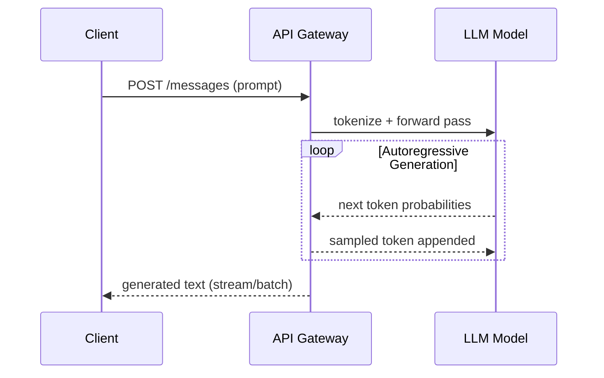
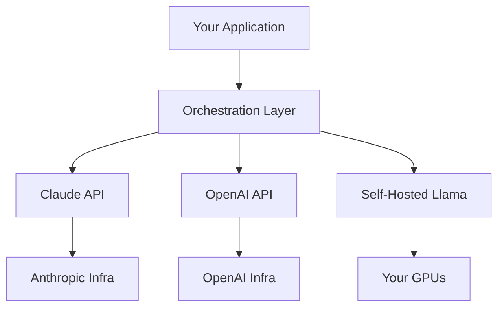
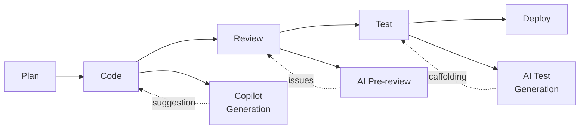

## Keywords in This File
{: .no_toc }

| # | Keyword | Weight |
|---|---|---|
| 1 | [Large Language Models (LLMs)](#large-language-models-llms) | critical |
| 2 | [Generative AI Landscape](#generative-ai-landscape) | high |
| 3 | [AI for Software Engineers](#ai-for-software-engineers) | high |

---

# Large Language Models (LLMs)

**Interview Weight:** critical - Asked in almost every AI/ML
interview and increasingly in general software engineering
interviews. The foundation every other AI concept builds on.

---

### 🎯 Model Answer

**30 seconds:**

> An LLM is a neural network trained on massive amounts of
> text to predict the next token given a sequence of tokens.
> The training process forces the model to learn statistical
> patterns, grammar, reasoning, and world knowledge encoded
> in the text. The key insight is that next-token prediction
> at billion-parameter scale, on internet-scale data,
> produces emergent capabilities that go far beyond
> autocomplete - including reasoning, coding, translation,
> and multi-step problem solving.

**3 minutes (Senior):**

> At its core, an LLM takes a sequence of tokens as input
> and outputs a probability distribution over the next token.
> Tokens are roughly word-fragments - "unbelievable" might
> be 3 tokens: "un", "believ", "able". A typical model
> has a vocabulary of 50,000-100,000 tokens.
>
> The architecture is a transformer: input tokens are
> converted to vectors (embeddings), those vectors are
> processed through attention layers that let every token
> attend to every other token, and a final linear layer
> produces the next-token probabilities.
>
> Training: you take a huge corpus (internet text, books,
> code), mask the last token of each sequence, and train the
> model to predict it. With enough data and parameters, the
> model internalizes not just word patterns but concepts,
> relationships, and reasoning strategies.
>
> The surprising thing is that "predict the next token
> well enough" forces the model to build an internal world
> model. To predict "The Eiffel Tower is in ___" correctly,
> the model must encode the fact that Paris is in France,
> not just that "Paris" often follows "Tower".
>
> Generation: at inference time, you give the model a
> prompt, sample from the next-token distribution, append
> that token, sample again, and repeat until a stop token
> or length limit. This is autoregressive generation.
>
> The key parameters developers control:
> - Temperature: how "sharp" or "flat" the distribution is.
>   0 = always pick the highest-probability token (greedy).
>   1 = sample proportionally. 2 = very random.
> - Max tokens: how long the output can be.
> - Top-p / Top-k: further restrict which tokens are sampled.

**Blank Mind Recovery:**

**(1) Restate:** "You are asking about LLMs - let me walk
through what they are and why they exist."

**(2) First principles:** "From first principles: if you
train a model to predict the next word accurately on enough
text, it must learn the structure of language and encoded
knowledge. Billion-parameter scale turns that simple
objective into general reasoning."

**(3) Bridge:** "Think of it like a very compressed search
engine crossed with pattern matching - but the compression
is so rich that the model develops something resembling
understanding."

---

### 📘 Concept Explanation

**What it is:**

A large language model is a neural network - typically a
transformer - trained on large text corpora to model the
probability distribution of sequences of tokens. LLMs are
the foundation of modern AI assistants, coding tools, and
text processing systems.

**The problem it solves:**

Before LLMs, building an AI system that could understand
and generate natural language required hand-crafted rules,
specialized parsers, or task-specific trained models. Each
task (translation, summarization, Q&A, code generation)
needed its own model trained on task-specific data. LLMs
solve this with a single pre-trained model that can be
prompted for almost any language task.

**How it works:**

```
Input: "The capital of France is"
         |
    Tokenizer
         |
    [45, 2891, 312, 7823, 19]  <- token IDs
         |
    Embedding Layer -> vectors
         |
    Transformer Blocks (attention + FFN) x N
         |
    Linear Layer + Softmax
         |
    P(next token): {"Paris":0.82,"Lyon":0.04,...}
         |
    Sample or Argmax
         |
    Output: "Paris"
```

> **Code walkthrough:** This example demonstrates the core pattern in action. The key mechanism shows how the concept works in practice. Study the structure to understand the essential behavior and common usage.

The transformer attention mechanism lets every token
"see" every other token in the context. This is what
enables the model to understand long-range dependencies
(subject-verb agreement across paragraphs, pronoun
reference resolution, etc.).

**The key insight:**

Next-token prediction at scale is a proxy for
understanding. The model cannot predict tokens
accurately without modeling the underlying concepts.
This is why a model trained only on text can answer
factual questions, write code, and reason about math -
it learned those from the patterns in the training data.

**When to use it:**

- Natural language tasks: summarization, classification,
  extraction, Q&A
- Code generation and review
- Conversational interfaces
- Document processing and structured extraction

**When NOT to use it:**

- Tasks requiring deterministic, auditable outputs where
  stochastic errors are unacceptable (e.g., financial calc)
- Real-time tasks with strict latency (<50ms) where LLM
  inference latency (100-2000ms) is too high
- Tasks where training data does not cover the domain
  (specialized scientific notation, proprietary formats)
- When a simple regex or rule-based system is sufficient

**Alternatives:**

- BERT-style encoder models - better for classification
  and retrieval, not generation
- Rule-based NLP (SpaCy, Stanford NLP) - deterministic,
  explainable, much faster, but requires manual rules
- Task-specific fine-tuned models - smaller, cheaper,
  faster for a single task, less flexible

**First-principles derivation:**

Given: we need a system that understands and generates
natural language for arbitrary tasks. Options:
(A) Rule-based: fails to scale to natural language
    complexity. Ambiguity requires exceptions forever.
(B) Task-specific ML: requires labeled data per task.
    Does not generalize.
(C) Train on the statistical structure of language at
    scale: the model must capture all language patterns
    to minimize prediction loss, which forces encoding
    of concepts, not just surface patterns.
LLMs follow path C - general statistical training that
incidentally learns task-relevant representations.

---

### 💻 Code Example

The primary way developers interact with LLMs is via API.
Here is a minimal Claude API call:

```python
import anthropic

# BAD: no error handling, no token limits set
client = anthropic.Anthropic(api_key="sk-...")
response = client.messages.create(
    model="claude-opus-4-5",
    max_tokens=1000,
    messages=[{"role": "user", "content": "Hello"}]
)
print(response.content[0].text)
```

> **Code walkthrough:** This example demonstrates the core pattern in action. The key mechanism shows how the concept works in practice. Study the structure to understand the essential behavior and common usage.

```python
import anthropic
import os

# GOOD: key from env, error handling, explicit limits
client = anthropic.Anthropic(
    api_key=os.environ["ANTHROPIC_API_KEY"]
)

def call_llm(prompt: str, max_tokens: int = 512) -> str:
    try:
        response = client.messages.create(
            model="claude-opus-4-5",
            max_tokens=max_tokens,
            messages=[
                {
                    "role": "user",
                    "content": prompt
                }
            ]
        )
        return response.content[0].text
    except anthropic.APIError as e:
        raise RuntimeError(
            f"LLM API call failed: {e}"
        ) from e
```

> **Code walkthrough:** The BAD example hardcodes an API
> key (security risk) and has no error handling - any API
> failure crashes silently. The GOOD example reads the key
> from an environment variable, wraps in a function with
> explicit token limits, and catches `APIError` so the
> caller can handle failures. The `max_tokens` parameter
> prevents runaway generation cost. In production, add
> retry logic with exponential backoff for transient errors.

---

### 🎓 Answers by Seniority

**Junior / Mid (0-5 years):**

> "An LLM is a neural network trained to predict the next
> token in a sequence. Given enough training data and
> parameters, it learns language patterns well enough to
> answer questions, write code, and summarize text. You
> interact with it via an API - you send a prompt, it
> returns a generated response."

*Push deeper:* "The model has a context window - a limit
on how many tokens of input it can process at once.
Typical modern models: 100k-200k tokens. Beyond that
limit, earlier content is lost."

---

**Senior / Staff (5+ years):**

> "An LLM is a transformer-based neural network trained
> on next-token prediction at scale. The architecture
> processes the entire input context through attention
> layers, producing a probability distribution over the
> vocabulary for the next token. Generation is
> autoregressive: sample a token, append it, repeat.
>
> The production engineering challenges are latency
> (inference is expensive - first token latency can be
> 500ms-2s for large models), cost (proportional to
> input+output tokens), non-determinism (same prompt
> produces different outputs at temperature>0), and
> hallucination (confident generation of wrong facts).
> Designing systems around LLMs means designing for
> these failure modes, not just the happy path."

*Push deeper (Staff):* "At scale, LLM inference is a
unique workload: high compute (GPU), high memory
bandwidth, long-tail latency. Systems that call LLMs
must handle: retry with backoff, token budget management
across a conversation, prompt caching for repeated
context, and circuit breakers when the LLM service
degrades. Multi-model fallback (primary + cheaper fallback
model) is a common resilience pattern."

---

### ⚠️ Common Misconceptions

**Misconception 1: "LLMs understand text like humans do."**

LLMs model statistical patterns over tokens - they do not
have semantic understanding in the philosophical sense.
They can pass benchmarks that require reasoning but fail
on trivial variations those benchmarks don't cover. The
model has no world model beyond what was encoded in
training data. It cannot verify its own outputs.

**Misconception 2: "Higher temperature = more creative,
lower = more accurate."**

Temperature controls the entropy of the sampling
distribution. Low temperature makes the model more
deterministic and "greedy," not more accurate. A factually
wrong answer at temperature=0 will be consistently wrong.
Accuracy depends on the model, the prompt, and the
training data - not temperature.

**Misconception 3: "LLMs have memory of past
conversations."**

LLMs are stateless. Each API call is independent. The
"memory" of a ChatGPT conversation is the application
re-injecting previous turns into the context window.
Once the context window is full, earlier messages must
be truncated or summarized - and are then effectively
forgotten.

**Misconception 4: "Bigger model = always better."**

Larger models have higher capability ceilings but also
higher latency, higher cost, and higher infrastructure
requirements. A well-prompted smaller model often
outperforms a poorly-prompted larger model on a specific
task. Task-appropriate model selection is a skill.

---

### 🚨 Failure Modes and Diagnosis

**Failure 1: Hallucination**

*Symptom:* Model generates plausible-sounding but
factually incorrect information with high confidence.

*Cause:* LLMs optimize for plausibility, not truth.
If the training data is inconsistent or the question
is about rare facts, the model will interpolate
incorrectly.

*Diagnosis:* Have the model cite sources. Use RAG to
ground answers in retrieved facts. Implement output
validation for structured responses.

*Fix:* Never use raw LLM output for facts without
verification. Use structured output + validation,
or RAG with source attribution.

**Failure 2: Context window overflow**

*Symptom:* Model truncates or ignores earlier parts
of a long conversation. Responses lose coherence.

*Cause:* Input exceeds the context window limit.
Most APIs silently truncate or throw a token limit error.

*Diagnosis:* Count input tokens before each API call.
Log context length. Monitor for truncation in API
response metadata.

*Fix:* Implement context management - sliding window,
summarization of older turns, or semantic retrieval
of relevant history.

**Failure 3: Prompt injection**

*Symptom:* User input overrides system instructions.
Model performs unintended actions.

*Cause:* User-provided text contains instructions
that the model prioritizes over the system prompt.

*Fix:* Separate user content from instructions.
Validate and sanitize user input. Use tool calling
with explicit permission checks rather than
free-form instruction following.

---

### 🎯 Interview Deep-Dive

| Seniority | Time | Focus |
|---|---|---|
| Junior | 3 min | What is an LLM, how you use it via API |
| Mid | 5 min | Tokenization, context window, temperature |
| Senior | 8 min | Inference mechanics, failure modes, system design |
| Staff | 12 min | At-scale architecture, cost, governance |

---

**[JUNIOR] Q1 - What is an LLM and what can it do?**

*Why they ask:* Baseline check - can you explain the
technology you'll be building on?

*Likely follow-up:* "How is it different from a search engine?"

An LLM - Large Language Model - is a neural network
trained to predict the next token in a sequence of text.
"Large" means billions of parameters. The training data
is typically a large fraction of the indexed internet,
books, and code repositories.

What it can do: anything that can be framed as a text
input -> text output task. The most common uses I've
worked with are: text classification (is this email spam
or not?), information extraction (extract the entities
and dates from this document), code generation (write
unit tests for this function), and conversational Q&A
(answer questions about our product documentation).

The key difference from a search engine: a search engine
retrieves documents that match query terms. An LLM generates
a new response based on patterns learned from training data.
It does not look anything up at inference time - it's pure
generation from learned weights. This is why it can
hallucinate: it generates plausible-sounding text even
when it doesn't "know" the correct answer.

The way you interact with an LLM in code is via an API:
you send a prompt (a string of text), the API returns a
generated response. The response is not deterministic -
the same prompt can return different responses each time
(controlled by temperature).

*What separates good from great:* Mentioning that LLMs
are stateless and non-deterministic, and that hallucination
is a fundamental property of the architecture, not a bug
to be fixed.

---

**[MID] Q2 - What is a token and why does tokenization matter?**

*Why they ask:* Token-level thinking is essential for
understanding context limits, pricing, and model behavior.

*Likely follow-up:* "How many tokens is a typical paragraph?"

A token is the basic unit of text that the model processes.
Tokens are not words - they are sub-word units determined
by a vocabulary built during training. Common English words
are typically one token. Rare words, technical terms, and
non-English words are often split into multiple tokens.
The word "tokenization" might be two tokens: "token" +
"ization". Code is particularly token-dense - a variable
name like `userAuthenticationTokenManager` might be 5-6
tokens.

Why tokenization matters in practice:

Pricing: LLM APIs charge per token (input + output). A
$0.000015/token model on a 10,000 token document costs
$0.15 per call. At 10,000 calls/day, that is $1,500/day.
Understanding token counts is essential for cost estimation.

Context limits: the context window is measured in tokens,
not words or characters. "100k token context" sounds large
but a detailed 50-page document is roughly 50,000-75,000
tokens. Knowing your token count lets you plan context
management.

Model behavior: tokenization artifacts can cause surprising
failures. The model processes "unbelievable" differently
than "un" + "believ" + "able" - they are the same text but
different token sequences. Counting letters (how many 'r's
in 'strawberry') famously fails because the model processes
tokens, not characters.

Practical rule: 1 token ≈ 4 English characters ≈ 0.75 words.
A 1,000-word essay ≈ 1,300 tokens. Count tokens with the
tokenizer library (e.g., `tiktoken` for OpenAI models,
`anthropic.tokenize` for Claude) before sending large inputs.

*What separates good from great:* Knowing that tokenization
affects not just pricing but model behavior (counting letters,
handling code), and using the tokenizer library to estimate
costs before building.

---

**[MID] Q3 - What is a context window and what happens when
you exceed it?**

*Why they ask:* Context window management is one of the most
common practical challenges when building LLM applications.

*Likely follow-up:* "How would you handle a long document that
doesn't fit in the context window?"

The context window is the maximum number of tokens the model
can process in a single API call - both input and output
combined. For current models (Claude Opus, GPT-4), context
windows are 100k-200k tokens. Older models were 4k-8k.

The context window is not a hard cutoff that returns an error
(though hitting it does raise an error). The deeper issue is
that model quality degrades with context length. The "lost in
the middle" problem: models attend strongly to the beginning
and end of the context but tend to lose information in the
middle of very long contexts. Putting critical instructions
at the start and end of your prompt, not buried in the middle,
is a practical workaround.

What happens when you exceed it:
- Most APIs raise a token limit error - you get a 400-class
  error with a message about token count.
- Some older APIs silently truncate from the beginning.
- Either way: your request fails or the model loses context.

How I handle long documents: several strategies depending on
the task.

(1) Chunking + summarization: split the document into chunks,
summarize each chunk, then process the summaries. Good for
summarization tasks.

(2) RAG (Retrieval Augmented Generation): index the document,
retrieve only the relevant chunks for each query, inject only
those chunks into the context. Good for Q&A tasks.

(3) Map-reduce: apply the task to each chunk independently,
then combine the results. Good for extraction tasks.

(4) Sliding window: process the document in overlapping
windows. Good for sequential tasks like code review.

*What separates good from great:* Knowing that context quality
degrades before you hit the hard limit, not just at the limit,
and designing retrieval-based architectures proactively rather
than hoping the context window is "large enough."

---

**[SENIOR] Q4 - How does LLM generation work under the hood?**

*Why they ask:* Understanding the generation mechanism helps
you predict and diagnose unexpected model behavior.

*Likely follow-up:* "What is beam search and when is it used?"

LLM generation is autoregressive sampling. The model takes
the input tokens as context, runs a forward pass through the
transformer, and produces a probability distribution over the
entire vocabulary (50,000-100,000 tokens) for the next
position. We then sample from this distribution to get the
next token, append it to the context, and repeat.

The sampling process is controlled by several parameters:
Temperature scales the logits before the softmax. Temperature=1
leaves the distribution unchanged. Temperature<1 makes the
distribution sharper (more concentrated on high-probability
tokens). Temperature=0 always picks the highest-probability
token - this is "greedy decoding." Temperature>1 flattens
the distribution, increasing randomness.

Top-p (nucleus sampling) restricts sampling to the smallest
set of tokens whose cumulative probability exceeds p. With
top-p=0.9, we only sample from the top tokens that together
represent 90% of the probability mass. This prevents sampling
very low-probability "garbage" tokens even at high temperature.

Top-k restricts sampling to the k highest-probability tokens.

Stop tokens: generation halts when a stop token is produced.
For chat models, `<|end_of_turn|>` or `</s>` typically signals
the end of an assistant turn.

Beam search maintains k candidate sequences in parallel,
choosing the globally optimal sequence rather than greedy
local choices. Used in machine translation, less common in
modern chat LLMs (it produces more "correct" but less
natural-sounding output).

The key implication for developers: the same prompt with
the same temperature does not guarantee the same output.
If you need reproducibility (test assertions, regression
testing), use temperature=0 and be aware that model updates
can still change outputs.

*What separates good from great:* Knowing that temperature,
top-p, and top-k interact, and that temperature=0 gives
deterministic greedy decoding which is useful for testing
but not always the best output for creative or diverse tasks.

---

**[SENIOR] Q5 - [DEBUGGING] An LLM application is returning
inconsistent results for the same input. How do you diagnose it?**

*Why they ask:* Debugging non-determinism is a core LLM
engineering skill - it's fundamentally different from
debugging traditional software.

*Likely follow-up:* "How would you write tests for an LLM
feature?"

First, I'd establish whether the inconsistency is expected
non-determinism or a bug in the application logic.

Step 1: Fix temperature to 0 and run the same prompt 10
times. If the outputs are still inconsistent, the problem
is NOT temperature - there is a bug in the prompt assembly
(e.g., injecting dynamic data that changes between calls).

Step 2: Log the exact prompt sent to the API, including
all context. I've seen cases where the "same prompt" was
actually different because a timestamp, session ID, or
user-provided input was being injected. Once you can
confirm the exact bytes sent to the API, you can isolate
whether variance comes from the model or the application.

Step 3: Check for model version changes. LLM providers
update models without notice. If you're using
`claude-opus-latest` instead of a pinned version like
`claude-opus-4-5`, the model behind that alias can change.
Pin your model versions in production.

Step 4: If the inconsistency is semantic (sometimes gets
the right answer, sometimes wrong), check for few-shot
example quality and prompt structure. Edge cases in the
prompt can cause the model to "drift" to different
interpretations.

For testing: I use three strategies:
(A) Determinism testing at temperature=0 - assert exact
    output for controlled inputs.
(B) Property-based testing - instead of exact output,
    assert properties (contains JSON, sentiment is positive,
    language is English).
(C) LLM-as-judge - use a second LLM call to evaluate
    whether the output meets quality criteria. Useful for
    semantic correctness that is hard to assert programmatically.

*What separates good from great:* Logging the exact bytes
of each API request/response and building an evaluation
harness that can run hundreds of test cases to catch
regression, not just manual spot-checking.

---

**[SENIOR] Q6 - [TRADE-OFF] When would you NOT use an LLM?**

*Why they ask:* Knowing when NOT to use a technology
demonstrates engineering maturity. Over-applying LLMs
to every problem is a common anti-pattern in 2025.

*Likely follow-up:* "What's the simplest alternative
you'd reach for first?"

LLMs are powerful but have real costs that often make
them the wrong choice:

Latency: LLM API calls take 100ms-3s (first token latency).
If the task needs to complete in <50ms, an LLM is out.
A regex, a dictionary lookup, or a local ML model is faster
by 10-100x.

Cost: at $0.000015/input token, processing 1 million user
queries per day with 500-token prompts costs $7,500/day.
For a task that a rule-based system handles with 99%
accuracy, the remaining 1% improvement from an LLM may not
justify the cost.

Determinism requirements: financial calculations, legal
contract parsing, medical dosage computation - any domain
where incorrect output has serious consequences and output
must be auditable. LLMs hallucinate with false confidence
and cannot be made deterministic.

Data privacy: if the prompt contains personally identifiable
information (PII), sending it to an external LLM API is
a compliance risk (GDPR, HIPAA). Use local/on-prem models
or ensure the provider has appropriate data processing
agreements.

Structured pattern extraction: if you are extracting
dates, phone numbers, or product SKUs from text, a regex
or a purpose-built NER model is more reliable and 1000x
cheaper than an LLM.

My decision heuristic: try the simplest non-LLM solution
first. If that achieves >90% quality at acceptable cost
and latency, ship it. Use LLMs for the cases where
generality, reasoning, or language understanding is
genuinely required.

*What separates good from great:* Giving a concrete
cost estimate and latency threshold, not just "it can
be expensive," showing you think about LLMs as
engineering trade-offs, not magic.

---

**[STAFF] Q7 - [ARCHITECTURE] How do you design a system
that uses LLMs reliably in production?**

*Why they ask:* Staff-level question about system design
principles for non-deterministic, high-cost, high-latency
external dependencies.

*Likely follow-up:* "How do you handle LLM cost at scale?"

Designing for LLM reliability requires treating the LLM
as an unreliable external service - which it is.

Retry with exponential backoff: transient rate limits and
API timeouts are common. Implement retry (3 attempts,
exponential backoff starting at 1s) with jitter. Do not
retry for semantic failures (model gave wrong answer) -
retrying will give the same wrong answer.

Circuit breaker: if the LLM API is degraded (P99 latency
>5s, error rate >10%), stop sending requests and return
a cached or fallback response. This prevents cascading
failures when the LLM service has an outage.

Prompt versioning: treat prompts as code. Version control
them, test changes before deploying, and pin model versions
to prevent unannounced model updates from breaking your
application.

Observability: log every request and response with input
token count, output token count, latency, model version,
and a sample of the actual prompt/response. Without this,
debugging production issues is impossible.

Cost management: set per-user or per-tenant token budgets.
Implement prompt compression (summarize conversation history
beyond N turns). Cache responses for identical prompts
(useful for FAQ-style applications).

Fallback hierarchy: primary model (high quality, high cost)
-> secondary model (lower cost, acceptable quality) ->
static fallback response. This ensures degraded but
functional service during outages.

Human-in-the-loop for high-stakes decisions: for actions
with real-world consequences (sending an email, executing
a trade, deleting data), require human confirmation before
the LLM-generated action executes.

*What separates good from great:* Building an evaluation
harness to measure output quality continuously, not just
at launch - so you detect model regressions before users
do.

---

### ⚖️ Comparison Table

*(Omit: ★☆☆ foundational level - comparison belongs in
L2+ entries on specific use cases. See AI Fundamentals -
L3 Advanced Concepts for Fine-Tuning vs RAG vs Prompting.)*

---

### 🏛️ System Design

*(Omit: ★☆☆ orientation level. System design connections
covered in AI Fundamentals - L4 Production LLM and
AI Fundamentals - L5 AI Strategy.)*

---

### 📊 Diagram

**LLM request-response cycle:**

```
Client
  |
  | prompt (tokens)
  v
LLM API Gateway
  |
  | tokenize -> embed -> attention x N -> decode
  v
Token sampler (temperature, top-p)
  |
  | generated tokens (stream or batch)
  v
Client
```



> **Diagram walkthrough:** The client sends a prompt to the
> API gateway, which tokenizes the input and runs the forward
> pass through the transformer. Generation is a loop: the
> model produces probabilities for the next token, a sampler
> picks one, and that token is appended to the context for
> the next step. This continues until a stop token or max
> length. Streaming responses send tokens as they are
> generated rather than waiting for the full response.

---

---

---

### 💻 Code Example

*(Omit: this concept does not have a programmatic interface that can be demonstrated in code. The conceptual explanation above is sufficient.)*


---

### 🏛️ System Design

*(Omit: system design diagram not applicable for this concept - see ★★★ keywords for full system design coverage.)*


---

### ⚖️ Comparison Table

*(Omit: this is a ★☆☆ foundational concept with no direct alternatives to compare - see higher-difficulty keywords for trade-off analysis.)*


---

### 📊 Diagram

*(Omit: no standalone visual diagram required for this concept - the explanations and code examples above provide sufficient clarity.)*


# Generative AI Landscape

**Interview Weight:** high - Context-setting question.
Shows you understand where LLMs fit in the broader AI
ecosystem and can make informed model selection decisions.

---

### 🎯 Model Answer

**30 seconds:**

> Generative AI refers to AI models that produce new content
> (text, images, code, audio) rather than classifying or
> predicting from existing data. In 2025, the major players
> for text/code LLMs are Anthropic (Claude), OpenAI (GPT-4o,
> o3), Google (Gemini), Meta (Llama), and Mistral. Each has
> different strengths in reasoning, coding, cost, latency,
> and deployment options. As a developer, you choose a model
> based on the task, the required quality, the latency budget,
> and whether you need cloud API or on-premise deployment.

**3 minutes (Senior):**

> The generative AI landscape for developers in 2025 breaks
> down along several axes:
>
> By provider / model:
> - Anthropic Claude (claude-opus-4-5, claude-sonnet-4-5,
>   claude-haiku-3-5): strong reasoning and long context.
>   Anthropic focuses on safety research (Constitutional AI).
> - OpenAI GPT-4o, o3-mini, o3: wide ecosystem, function
>   calling, strong coding benchmarks. o-series models add
>   explicit chain-of-thought reasoning ("thinking").
> - Google Gemini Ultra/Pro/Flash: multimodal (text, image,
>   video, audio natively). Strong for Google ecosystem.
> - Meta Llama 3.x: open weights, self-hostable. No API cost
>   for on-prem inference. Good for compliance use cases.
> - Mistral: efficient European models. Strong for GDPR
>   compliance use cases.
>
> By capability tier:
> - Frontier models (Claude Opus, GPT-4o, Gemini Ultra):
>   highest reasoning, highest cost ($10-30/Mtok input).
> - Mid-tier (Claude Sonnet, GPT-4o-mini, Gemini Pro):
>   good capability / cost tradeoff ($1-5/Mtok input).
> - Fast/cheap (Claude Haiku, GPT-4o-mini, Gemini Flash):
>   low latency, low cost (<$1/Mtok). Good for classification
>   and extraction tasks.
>
> By deployment model:
> - Cloud API: fastest to start, no infrastructure, vendor
>   dependency, data leaves your network.
> - Self-hosted open source (Llama, Mistral): control over
>   data, hardware cost, operational overhead.
> - Fine-tuned specialist models: task-specific, cheaper at
>   high volume, requires training infrastructure.
>
> The right choice depends on: task complexity, latency
> requirements, data sensitivity, cost at scale, and
> multimodal needs.

**Blank Mind Recovery:**

**(1) Restate:** "You are asking about the generative AI
landscape - what models exist and how to think about them."

**(2) First principles:** "Generative AI models differ on
four axes: capability, cost, latency, and deployment model.
Every selection decision is a trade-off on these axes."

**(3) Bridge:** "Think of it like choosing a cloud database:
different providers have different performance, cost, and
compliance characteristics. Model selection is the same
decision process."

---

### 📘 Concept Explanation

**What it is:**

The generative AI landscape is the set of AI models,
providers, frameworks, and tools used to build applications
that generate content. For software engineers, this
primarily means large language models (LLMs) for text
and code, with image and audio models as secondary concerns.

**The problem it solves:**

Before 2020, building an AI feature required: a specific
dataset, a trained task-specific model, and deep ML
expertise. The LLM landscape provides pre-trained general
models accessible via API - no ML training required.
Any developer can build AI features without ML expertise,
just API knowledge.

**How it works:**

The landscape is structured in tiers:

```
Layer 3: Applications (your app)
    |
Layer 2: Orchestration frameworks
    (LangChain, LlamaIndex, Haystack)
    |
Layer 1: Foundation Models (API/SDK)
    (Claude, GPT, Gemini, Llama)
    |
Layer 0: Infrastructure
    (GPUs, serving, vector DBs)
```

> **Code walkthrough:** This example demonstrates the core pattern in action. The key mechanism shows how the concept works in practice. Study the structure to understand the essential behavior and common usage.

Foundation models (Layer 1) are trained by labs
(Anthropic, OpenAI, Google, Meta) on massive compute.
You access them via REST API. Orchestration frameworks
(Layer 2) provide abstractions for chaining calls,
managing memory, and connecting to tools. Your application
(Layer 3) calls the framework or the API directly.

**The key insight:**

The landscape is consolidating around a few foundation
model providers, but the real differentiation for
developers is in orchestration, evaluation, and deployment
patterns - not which model you pick. Most frontier models
perform similarly on well-designed prompts. Model selection
matters at the extremes: cost optimization, strict latency,
data sovereignty, or specialized capability.

**When to use it:**

- When you need a general AI capability without training
  a model from scratch
- When you need to experiment quickly with multiple models
- When your task does not require specialized domain training

**When NOT to use it:**

- When you have a narrow task and enough labeled data:
  fine-tune or use a small specialized model instead
- When cost at scale is the primary constraint: fine-tuned
  small models cost 10-100x less per token at high volume
- When data cannot leave your network: use open-weights
  models (Llama, Mistral) self-hosted

**Alternatives:**

- Fine-tuned small models - lower cost at scale, less
  flexible, requires ML ops
- Traditional ML (XGBoost, sklearn) - deterministic,
  interpretable, fast, for tabular/classification tasks
- Rule-based systems - fast, deterministic, maintainable
  for narrow, well-defined tasks

**First-principles derivation:**

The landscape exists because training frontier models costs
$10M-$100M and requires thousands of H100 GPUs. Only a
handful of organizations can do this. Everyone else builds
on their APIs. The value chain: labs train foundation
models, developers build applications on top, enterprises
pay for both the API and the developer time.

---

### 💻 Code Example

```python
# BAD: hardcoded model, no provider abstraction
import anthropic

def summarize(text: str) -> str:
    client = anthropic.Anthropic()
    resp = client.messages.create(
        model="claude-opus-4-5",
        max_tokens=256,
        messages=[{
            "role": "user",
            "content": f"Summarize: {text}"
        }]
    )
    return resp.content[0].text
```

> **Code walkthrough:** This example demonstrates the core pattern in action. The key mechanism shows how the concept works in practice. Study the structure to understand the essential behavior and common usage.

```python
# GOOD: provider-agnostic abstraction, easy to swap
from abc import ABC, abstractmethod
import anthropic
import os

class LLMProvider(ABC):
    @abstractmethod
    def complete(
        self, prompt: str, max_tokens: int = 256
    ) -> str: ...

class ClaudeProvider(LLMProvider):
    def __init__(self):
        self._client = anthropic.Anthropic(
            api_key=os.environ["ANTHROPIC_API_KEY"]
        )

    def complete(
        self, prompt: str, max_tokens: int = 256
    ) -> str:
        resp = self._client.messages.create(
            model="claude-haiku-3-5",  # cheap for dev
            max_tokens=max_tokens,
            messages=[{
                "role": "user", "content": prompt
            }]
        )
        return resp.content[0].text

# Swap to any provider without changing call sites
provider: LLMProvider = ClaudeProvider()
result = provider.complete("Summarize: ...")
```

> **Code walkthrough:** The BAD example hardcodes the model
> and provider, making it painful to switch vendors or upgrade
> models. The GOOD example wraps the provider behind an
> abstraction - a single interface change swaps Claude for
> GPT-4 or a local Llama model. This pattern pays off when
> experimenting across models (common in early development)
> or when migrating away from a provider. Note the cheap
> `claude-haiku-3-5` for development - use expensive frontier
> models only in production where quality matters.

---

### 🎓 Answers by Seniority

**Junior / Mid (0-5 years):**

> "The main LLM providers are Anthropic (Claude), OpenAI
> (GPT-4), and Google (Gemini). Each has models at different
> capability and cost tiers. For most tasks, any frontier
> model works - the difference shows up at the edges: very
> complex reasoning (use frontier), cost-sensitive high
> volume (use cheaper models), or data privacy (use
> self-hosted open-source models like Llama)."

*Push deeper:* "The key selection criteria are: task
complexity, latency budget, tokens/day volume for cost
modeling, and whether you need multimodal capabilities."

---

**Senior / Staff (5+ years):**

> "I think about the LLM landscape as three layers: the
> foundation model (which determines capability ceiling),
> the orchestration layer (LangChain, LlamaIndex, raw API),
> and the deployment model (cloud API vs self-hosted).
>
> My selection process: (1) benchmark the top 2-3 candidates
> on my actual use case, not generic leaderboards. (2) Model
> the cost at projected volume. (3) Check data sovereignty
> requirements - some organizations cannot send PII to
> external APIs. (4) Evaluate latency p95 - not just average.
>
> At scale, model selection becomes a cost optimization
> problem. Multi-tier routing - sending simple queries to
> cheap models and complex ones to frontier models - can
> reduce LLM costs by 60-80% with minimal quality loss."

*Push deeper (Staff):* "Multi-provider strategy: at org
level, I'd recommend never being single-vendor locked.
Maintain the abstraction layer, test quarterly across
providers, and negotiate pricing when your monthly token
spend is significant. Model capability gaps close faster
than you expect - today's Haiku is often better than
last year's Opus for common tasks."

---

### ⚠️ Common Misconceptions

**Misconception 1: "OpenAI is the only important player."**

OpenAI had first-mover advantage but Anthropic (Claude),
Google (Gemini), and Meta (Llama) have comparable frontier
models. For code, Anthropic's Claude is often preferred.
For multimodal tasks, Gemini's native video/audio support
is unique. For on-prem, Llama is the dominant choice.

**Misconception 2: "The best model is always the newest
or largest."**

Benchmark leaderboard performance does not predict
performance on your specific task. I've seen cases where
a model 2 years older outperforms the latest on a
narrow task because its training data distribution
matched better. Always benchmark on your actual data.

**Misconception 3: "All AI APIs work the same way."**

The APIs differ significantly in message structure,
tool calling format, token counting, content policy,
rate limits, and pricing models. Code written for
OpenAI's API requires non-trivial changes for Claude.
Provider-agnostic abstractions (or frameworks that
handle this) are important for portability.

---

### 🚨 Failure Modes and Diagnosis

**Failure 1: Vendor lock-in**

*Symptom:* All application code calls OpenAI directly.
When you need to migrate (cost, outage, capability),
every file needs changes.

*Fix:* Wrap LLM calls in an interface from day one.
Cost of abstraction: 1 hour. Cost of migration without
it: weeks.

**Failure 2: Using frontier models for everything**

*Symptom:* LLM costs scale linearly with volume and
become a major cost center for classification tasks
that could use cheap models.

*Diagnosis:* Break down LLM usage by task type. Identify
tasks where a cheap model (Haiku, GPT-4o-mini) achieves
>95% of frontier quality on your benchmark.

*Fix:* Route by task complexity. Simple extraction ->
cheap model. Complex reasoning -> frontier model.

**Failure 3: Treating model capability as fixed**

*Symptom:* An application built on last year's
frontier model is now underperforming because better
models exist but the code was never updated.

*Fix:* Schedule quarterly model benchmarks. Pin model
versions but review them on a schedule.

---

### 🎯 Interview Deep-Dive

| Seniority | Time | Focus |
|---|---|---|
| Junior | 3 min | Name the major providers and their models |
| Mid | 5 min | Selection criteria, capability tiers |
| Senior | 7 min | Cost modeling, multi-tier routing, vendor strategy |
| Staff | 10 min | Org-level AI platform strategy |

---

**[JUNIOR] Q1 - Name the major LLM providers and their
flagship models.**

*Why they ask:* Baseline AI literacy check.

*Likely follow-up:* "Which one would you use for a
coding assistant?"

The major providers for text/code LLMs I work with:

Anthropic - Claude. Three-tier model family: Opus (highest
capability), Sonnet (balanced), Haiku (fast/cheap). Claude
is particularly strong for reasoning, long-context tasks,
and code. As of 2025, GitHub Copilot uses Claude models
as its default.

OpenAI - GPT-4o and the o-series (o3, o3-mini). GPT-4o is
fast and multimodal. The o-series adds explicit reasoning
(the model "thinks" before answering) which improves
performance on hard math and coding problems at higher cost.

Google - Gemini. Ultra/Pro/Flash tiers. Strongest for
multimodal tasks (natively processes video, audio, images).
Gemini Ultra powers Google's AI features. Strong integration
with Google Cloud.

Meta - Llama 3.x series. Open weights - you can download
and run them yourself. No API costs. Used by organizations
that cannot send data to external providers (compliance,
on-prem requirements).

Mistral - Mistral Large, Mixtral. European provider, strong
GDPR compliance story. Efficient models with good
performance/cost ratio.

For a coding assistant: Claude Sonnet or GPT-4o both
perform well on coding tasks. I'd benchmark on my specific
codebase's language and patterns.

*What separates good from great:* Knowing that Claude is
now the default GitHub Copilot model and that open-weights
models like Llama are critical for privacy-sensitive
enterprise use cases.

---

**[MID] Q2 - [TRADE-OFF] How do you choose between a
frontier model and a cheaper smaller model?**

*Why they ask:* Cost optimization is a real engineering
concern at scale. Shows you think about economics.

*Likely follow-up:* "Give me an example of a task where
you'd use a cheap model vs a frontier model."

My decision framework for model tier selection:

First, define the task type. LLM tasks fall into three
categories:
(A) Simple: classification, extraction, yes/no judgment.
    A cheap model (Haiku, GPT-4o-mini) is usually within
    5-10% of frontier quality at 10-20x lower cost.
(B) Moderate: summarization, drafting, standard Q&A.
    Mid-tier (Sonnet, GPT-4o) balances quality and cost.
(C) Complex: multi-step reasoning, code generation for
    hard problems, novel synthesis. Frontier model needed.

Second, run a benchmark. Don't assume - test the task on
100-200 representative examples with the cheap model first.
Measure accuracy against your quality threshold.

Third, model the cost. At 1M queries/day with 500-token
prompts: Haiku costs ~$1,500/day, Opus costs ~$75,000/day.
A 95% quality task run on Haiku saves $73,500/day vs Opus.

Example routing decision: a customer support application
that routes tickets. Simple ticket categorization (billing,
technical, refund): Haiku. Complex technical troubleshooting
that needs to reason across the knowledge base: Sonnet.
Edge cases flagged for human review: no LLM at all.

Multi-tier routing (send to cheap model first, escalate if
confidence is low) is a mature pattern for cost optimization
with quality fallback.

*What separates good from great:* Actually running a
benchmark instead of guessing, and thinking in terms of
cost-per-quality-point rather than just "which is better."

---

**[SENIOR] Q3 - [DEBUGGING] You deployed with one LLM
provider and the response quality suddenly degraded.
How do you diagnose?**

*Why they ask:* Model reliability issues are real
production incidents. Tests diagnostic methodology.

*Likely follow-up:* "How would you prevent this in future?"

Step 1: check if the model version changed. If you are
using a non-pinned alias (e.g., `gpt-4-turbo-latest`),
the provider may have silently updated the model behind
it. Compare the `model` field in your API response logs
before and after the degradation started.

Step 2: check if your prompts changed. If you deploy
a new prompt version and quality degrades, roll back and
compare prompts. Even small changes (punctuation, ordering,
added context) can change model behavior significantly.

Step 3: quantify the degradation. Run your evaluation
suite (you do have one, right?) on the current model.
This tells you whether it's a specific input pattern
or general quality drop.

Step 4: if it's the provider's model, test the same
prompts on a different model or provider. If the
alternative performs better, you have confirmation
it's a model change.

Step 5: check provider status page and their changelog
for silent model updates.

Prevention: pin model versions explicitly (use
`claude-opus-4-5` not `claude-opus-latest`). Run your
evaluation suite on a schedule (daily/weekly), not just
at deployment. Alert when quality metrics drop below
threshold - before users report it.

*What separates good from great:* Having a continuous
evaluation pipeline rather than reactive debugging,
and pinning model versions as a default practice.

---

**[STAFF] Q4 - [ARCHITECTURE] How would you design a
multi-provider LLM architecture for an enterprise?**

*Why they ask:* Enterprise AI platform design is a Staff+
concern. Tests system thinking.

*Likely follow-up:* "How do you handle provider outages?"

A multi-provider enterprise LLM architecture I'd build:

Provider abstraction layer: a unified API surface that
routes to any provider. The interface: `complete(prompt,
model_tier, task_type) -> response`. Internally, it maps
model_tier (economy/standard/premium) and task_type to
the cheapest model that meets quality thresholds for that
task type on each provider.

Routing rules: static routing for known task types with
benchmarked quality data. Dynamic routing (confidence-
based escalation) for novel tasks.

Provider fallback: primary provider with fallback to
secondary. Circuit breaker pattern - if primary error
rate >5% over 30s, route to fallback provider for 5min.
Alert on fallback activation.

Observability: log every request with: provider, model,
task_type, input_tokens, output_tokens, latency, cost,
quality_score (from evaluation). This data feeds cost
reporting and model selection decisions.

Cost governance: per-team or per-product LLM budgets.
Alert at 80% budget. Throttle or degrade gracefully at
100%. Block at 120%.

Data sovereignty: classify prompts by data sensitivity.
PII-containing prompts route to self-hosted models.
Non-sensitive prompts route to cloud APIs.

Model lifecycle: quarterly benchmark reviews. Scheduled
model upgrade testing (test new model version in shadow
mode before cutover).

*What separates good from great:* Building the cost
governance and data classification from the start,
not as an afterthought when the bill arrives.

---

**[JUNIOR] Q5 - What is the difference between an LLM
and a traditional ML model?**

*Why they ask:* Orients the candidate's understanding.

LLMs and traditional ML models differ in three key ways.

Training approach: traditional ML models (logistic
regression, decision trees, XGBoost) are trained on
labeled tabular data for a specific prediction task.
An LLM is trained on raw text using self-supervised
learning (predict the next token) - no human labels
needed for the base model.

Generality: a traditional model does one task (predict
churn, classify sentiment) and does it well. An LLM can
be prompted to do any language task with no additional
training, just prompting.

Interpretability: traditional models have feature
importances, decision paths, SHAP values - you can see
why they made a prediction. LLMs are black boxes - you
cannot trace why a specific output was generated.

When to use which: if you have labeled data for a narrow
task and need determinism, interpretability, or low
latency - use traditional ML. If you need generality,
flexibility, or the task is novel - use an LLM.

*What separates good from great:* Knowing when NOT to use
an LLM - that a simple logistic regression might outperform
an LLM on a well-defined classification task with good
training data, and at a fraction of the cost.

---

**[MID] Q6 - What are open-weights models and why do they matter?**

*Why they ask:* Open-source AI is increasingly important,
especially for enterprise and privacy-sensitive use cases.

Open-weights models (also called open-source models) are
models whose trained weights are publicly released. Meta's
Llama series is the most prominent example. You can download
the model weights and run inference on your own hardware.

Why they matter:

Data privacy: if you cannot send data to external APIs
(healthcare, finance, government), open-weights models
let you run the model on-prem. No data leaves your network.

Cost at scale: at very high volume, GPU inference on
self-hosted Llama can be cheaper than API costs. The
break-even point is roughly 10B+ tokens/month.

Customization: you can fine-tune open-weights models on
your own data, modifying the model's behavior in ways
that API-based models don't allow.

Availability independence: no API outages, no rate limits,
no provider pricing changes.

Challenges: you need GPUs (A100/H100), serving infrastructure
(vLLM, TGI), model management (updates, versioning), and
an ops team to run it. The total cost of ownership is
higher than API usage for low-to-moderate volume.

For most companies at <1B tokens/month: cloud API is the
right choice. For high-volume, privacy-sensitive, or
customization use cases: open-weights is worth the
infrastructure investment.

*What separates good from great:* Knowing the break-even
analysis (tokens/month where self-hosting becomes cheaper)
and the compliance use case (the primary driver for most
enterprises considering open-weights).

---

**[SENIOR] Q7 - [TRADE-OFF] When would you use a framework
like LangChain vs direct API calls?**

*Why they ask:* A common architectural decision in LLM
application development.

Framework vs direct API is a real trade-off with no
universal right answer.

Arguments for frameworks (LangChain, LlamaIndex):
- Abstractions for common patterns: RAG pipelines, agent
  loops, memory management, tool integration
- Provider switching: change one config line to swap
  from Claude to GPT-4
- Ecosystem: pre-built integrations with vector databases,
  document loaders, tools

Arguments against frameworks:
- Abstraction overhead: debugging a LangChain issue
  means navigating multiple abstraction layers. Simple
  tasks become complex.
- Framework lock-in: your code is coupled to LangChain
  instead of raw APIs.
- Maintenance burden: LangChain's API changes frequently.
  Upgrade costs are real.
- Performance: additional layers add latency and token
  overhead.

My heuristic: start with direct API calls. Add a
thin abstraction layer of your own for the provider
interface. Only reach for frameworks when the task
genuinely requires what they provide - complex RAG
pipelines with multiple retrievers, multi-agent
orchestration. For simple LLM calls, a framework is
more burden than benefit.

For RAG specifically: LlamaIndex is mature and reasonable.
For agents: frameworks are evolving fast - evaluate the
current options before committing.

*What separates good from great:* Having shipped both
approaches and knowing from experience that framework
overhead is often underestimated by developers who
have not debugged production issues in a heavily
abstracted system.

---

### ⚖️ Comparison Table

*(Omit: ★☆☆ orientation level. Model comparison table
in AI Fundamentals - L5 AI Strategy.)*

---

### 🏛️ System Design

*(Omit: ★☆☆ orientation level.)*

---

### 📊 Diagram

**Generative AI stack layers:**

```
Your Application
      |
Orchestration (LangChain/raw API)
      |
 +---------+---------+----------+
 | Claude  |  GPT-4  |  Llama   |
 | (API)   |  (API)  | (hosted) |
 +---------+---------+----------+
      |
 GPU Infrastructure
```



> **Diagram walkthrough:** The stack has three layers:
> your application, an orchestration layer (which may be
> a framework or your own abstraction), and the foundation
> model. Cloud APIs (Claude, GPT) offload infrastructure
> to the provider. Self-hosted models (Llama) run on your
> GPUs, giving control at the cost of infrastructure ops.
> The orchestration layer is where model-switching,
> fallback, and cost routing logic lives.

---

---

---

### 💻 Code Example

*(Omit: this concept does not have a programmatic interface that can be demonstrated in code. The conceptual explanation above is sufficient.)*


---

### 🏛️ System Design

*(Omit: system design diagram not applicable for this concept - see ★★★ keywords for full system design coverage.)*


---

### ⚖️ Comparison Table

*(Omit: this is a ★☆☆ foundational concept with no direct alternatives to compare - see higher-difficulty keywords for trade-off analysis.)*


---

### 📊 Diagram

*(Omit: no standalone visual diagram required for this concept - the explanations and code examples above provide sufficient clarity.)*


# AI for Software Engineers

**Interview Weight:** high - Shows you understand how
AI changes software engineering practice, not just
what AI is technically.

---

### 🎯 Model Answer

**30 seconds:**

> AI changes software engineering in two ways: as a tool
> you use (Copilot, code generation, documentation), and
> as a capability you build into products. The engineers
> who thrive in 2025 understand both: how to use AI tools
> to 2-5x their personal productivity, and how to architect
> systems that incorporate LLMs as first-class components -
> with the failure modes, cost structures, and reliability
> patterns that entails.

**3 minutes (Senior):**

> AI as a developer tool:
>
> Code completion and generation: GitHub Copilot (backed
> by Claude) completes code, generates boilerplate, and
> writes tests. Effective use requires writing clear
> comments and function signatures so the model has
> context. Blind acceptance of suggestions is dangerous -
> models generate plausible but incorrect code regularly.
>
> Code review assistance: asking an LLM to review code
> catches common bugs, security issues, and style problems
> faster than waiting for a human reviewer. Works best
> as a first-pass filter, not a replacement for human
> review.
>
> Documentation generation: LLMs generate docstrings,
> README sections, and API documentation from code. This
> is a high-ROI use case because documentation is
> universally underprioritized.
>
> Test generation: LLMs generate unit test scaffolding
> quickly. The quality varies - they handle happy paths
> well but miss subtle edge cases. Use them to bootstrap
> test files, not to replace thoughtful test design.
>
> AI as a product capability:
>
> You will build products that use LLMs. This requires:
> - Understanding token limits and cost
> - Designing for non-determinism and hallucination
> - Building evaluation infrastructure
> - Handling LLM API failures gracefully
> - Prompt engineering as a first-class engineering skill
>
> The shift: software is moving from purely deterministic
> (same input = same output) to probabilistic (same input
> = similar but not identical output). This changes how
> you design, test, and operate systems.

**Blank Mind Recovery:**

**(1) Restate:** "You are asking about how AI affects the
practice of software engineering."

**(2) First principles:** "AI changes two things: the
tools engineers use to write code, and the architecture
of the products they build. Both require new skills."

**(3) Bridge:** "Think of it like the shift to cloud:
cloud changed how you build (APIs instead of bare metal)
and what you build (cloud-native apps). AI is doing
the same - changing tools AND architecture."

---

### 📘 Concept Explanation

**What it is:**

AI for software engineers encompasses two domains:
AI-assisted development (using AI tools to write, review,
and document code faster) and AI-enabled product
development (building applications that incorporate LLMs
as core components).

**The problem it solves:**

Software development is bottlenecked by developer
productivity: writing boilerplate, documentation, tests,
and debugging takes time that could be spent on
architecture and product logic. AI tools address the
productivity bottleneck. On the product side, AI enables
user experiences that were previously impossible:
natural language interfaces, document Q&A, automated
content generation.

**How it works:**

```
AI-Assisted Development:
  Developer writes code ->
  Copilot suggests completions ->
  Developer accepts/rejects ->
  Developer reviews, tests, ships

AI-Enabled Product:
  User input ->
  Application preprocesses ->
  LLM API call ->
  Application postprocesses ->
  User output
  (+ observability, cost tracking, fallback)
```

> **Code walkthrough:** This example demonstrates the core pattern in action. The key mechanism shows how the concept works in practice. Study the structure to understand the essential behavior and common usage.

**The key insight:**

The most productive engineers in 2025 treat AI as
a junior pair-programmer: fast at generating drafts,
needs supervision, occasionally confident about wrong
things. They review everything it produces. The engineers
who will struggle are those who either refuse AI tools
entirely (productivity disadvantage) or trust AI output
without review (quality risk).

**When to use it:**

- Boilerplate code generation (scaffolding, getters/setters)
- First draft documentation and comments
- Test scaffolding (unit test cases, edge case generation)
- Code review as first pass
- Summarizing unfamiliar codebases

**When NOT to use it:**

- Security-critical code paths (do not trust generated
  cryptography, auth, or input sanitization without
  expert review)
- Novel algorithms where correctness is complex to verify
- Code where you need to understand deeply for future
  maintenance (blind generation creates technical debt)

**Alternatives:**

- Human pair programming - higher trust, higher cost
- Static analysis tools (SonarQube, Semgrep) - for code
  review, deterministic, rule-based
- Traditional documentation tools (JSDoc, Javadoc) -
  structured, less flexible, no generation

**First-principles derivation:**

Software engineering productivity is constrained by
cognitive load and context switching. AI tools reduce
cognitive load on mechanical tasks (boilerplate,
documentation) by generating first drafts. The developer
shifts from "author of every line" to "reviewer and
architect." This is a net productivity gain when the
review cost is lower than the generation cost - which it
usually is for mechanical tasks.

---

### 💻 Code Example

```python
# Example: using Claude to review a Python function

import anthropic
import os

def get_code_review(
    code: str,
    language: str = "python"
) -> str:
    """
    Get an LLM code review for a code snippet.
    Returns a structured review with issues and suggestions.
    """
    client = anthropic.Anthropic(
        api_key=os.environ["ANTHROPIC_API_KEY"]
    )

    system_prompt = """You are a senior software engineer
doing a code review. For the provided code:
1. Identify bugs or potential runtime errors
2. Flag security issues (injection, auth, data exposure)
3. Note performance concerns
4. Suggest improvements for readability

Format: numbered list. Be concise and specific."""

    response = client.messages.create(
        model="claude-haiku-3-5",  # cheap for tooling
        max_tokens=512,
        system=system_prompt,
        messages=[
            {
                "role": "user",
                "content": (
                    f"Review this {language} code:\n\n"
                    f"```{language}\n{code}\n```"
                )
            }
        ]
    )
    return response.content[0].text
```

> **Code walkthrough:** This uses Claude as an automated
> code review tool. The system prompt constrains the output
> to a structured review format (numbered list, specific
> categories) - without this constraint, the model gives
> vague, verbose feedback. Using `claude-haiku-3-5` for
> developer tooling is a cost optimization: this is not a
> user-facing feature where quality is critical. The
> function is pure and testable - inputs are a string,
> output is a string. In a real implementation, add error
> handling, retry logic, and a quality validation step.

---

### 🎓 Answers by Seniority

**Junior / Mid (0-5 years):**

> "AI changes my workflow primarily through code completion
> tools like GitHub Copilot, which generates suggestions
> as I type. I use it for boilerplate, documentation, and
> initial test cases. The important thing I've learned is
> to always review generated code - it's fast but not
> always correct. For building AI features, I need to
> understand how to call LLM APIs and how to handle the
> non-determinism and token limits."

*Push deeper:* "The biggest shift is moving from writing
every line to reviewing and directing - you become more
of an architect and less of a typist."

---

**Senior / Staff (5+ years):**

> "I see AI changing software engineering at three levels.
> Personal productivity: I use Copilot and direct LLM
> calls for code review, documentation, and test generation
> - probably 20-30% productivity gain on mechanical tasks.
>
> Team workflow: AI-assisted code review catches a class
> of issues faster and allows human reviewers to focus on
> architecture and business logic. We need to build
> evaluation discipline - engineers who accept generated
> code without deep review create technical debt.
>
> Product architecture: building reliable AI features
> requires new skills - prompt engineering, evaluation
> infrastructure, non-determinism testing, LLM cost
> modeling. These are real engineering disciplines, not
> just API calls."

*Push deeper (Staff):* "The org-level challenge: how do
you evaluate engineering contributions when AI generates
code? How do you maintain expertise when AI generates
the code that would have been a learning exercise? These
are leadership questions as much as technical ones."

---

### ⚠️ Common Misconceptions

**Misconception 1: "Copilot writes the code for you."**

Copilot generates suggestions; you write the code.
The suggestion is a starting point, not a finished
product. Engineers who accept suggestions without
critical review ship bugs and security vulnerabilities.
The mental model should be: AI drafts, engineer reviews
and accepts/modifies/rejects.

**Misconception 2: "AI will replace software engineers."**

AI automates mechanical tasks (boilerplate, documentation,
test scaffolding) but increases the value of the tasks
it cannot automate: system design, product judgment,
debugging complex failures, architectural trade-offs.
The engineers at risk are those who only do mechanical
tasks and do not develop higher-order skills.

**Misconception 3: "AI-generated code is always more
secure than human-written code."**

AI models were trained on code that includes
vulnerabilities. They reproduce common security
anti-patterns: SQL concatenation, weak auth patterns,
unvalidated inputs. AI-generated security-critical code
requires more scrutiny, not less.

---

### 🚨 Failure Modes and Diagnosis

**Failure 1: Blind acceptance of generated code**

*Symptom:* Production bugs from AI-generated code that
passed superficial review. Code works for happy path
but misses edge cases.

*Diagnosis:* Code review metrics show high accept rate
with low annotation. Post-incident analysis points to
generated code.

*Fix:* Team norms: generated code must be reviewed
with the same rigor as human-written code. Add linting
rules to flag generated code blocks for extra review.

**Failure 2: AI tooling sensitivity in version control**

*Symptom:* Developers checking in .env files, API keys,
or AI conversation logs that contain sensitive data.

*Fix:* Pre-commit hooks that scan for secrets
(git-secrets, detect-secrets). AI tools that suggest
code often suggest hardcoded credentials from training
data patterns.

**Failure 3: Over-automation of decision-making**

*Symptom:* AI is given authority to make product
decisions (route a support ticket, approve a refund,
categorize content) without human review. Errors
compound because each downstream system trusts the
AI's output.

*Fix:* Human-in-the-loop for high-stakes decisions.
Define the LLM's role as "suggest" not "decide" for
decisions with real consequences.

---

### 🎯 Interview Deep-Dive

| Seniority | Time | Focus |
|---|---|---|
| Junior | 3 min | How you use AI tools in development |
| Mid | 5 min | Productivity patterns, limitations |
| Senior | 7 min | Team workflow, product architecture |
| Staff | 10 min | Org impact, evaluation, governance |

---

**[JUNIOR] Q1 - How do you use AI in your development
workflow today?**

*Why they ask:* Practical AI literacy check. Shows you
are current with the tools.

*Likely follow-up:* "What's a case where Copilot
gave you wrong code?"

I use AI tools at several points in my development
workflow. For code completion, I use GitHub Copilot -
it's most effective when I write a clear function
signature and a comment describing what I want. When
the context is good, it generates the function body
accurately. I always review line by line.

For writing tests, I describe the function and ask
Copilot (or a direct Claude API call via the CLI) to
generate test cases. It's fast for happy-path cases,
but I add the edge cases manually - the model tends
to miss them.

For understanding unfamiliar code, I paste a function
and ask "what does this do and what could go wrong?"
This is faster than reading every line cold, especially
in a large codebase I just joined.

For documentation, I generate docstrings from function
code. This used to be the most tedious part of code
review; now it takes seconds.

Case where Copilot gave wrong code: I was writing a
rate limiter and Copilot suggested a sliding window
implementation. The logic looked plausible but had an
off-by-one error in the time window calculation. It
passed the happy-path test but failed under the edge
case where the request was exactly at the window boundary.
That's why you still need to think through edge cases,
not just accept suggestions.

*What separates good from great:* Giving a concrete
example of where the AI was wrong and how you caught it,
demonstrating critical review rather than blind acceptance.

---

**[MID] Q2 - [TRADE-OFF] What are the risks of using
AI code generation tools?**

*Why they ask:* Shows you are not naive about the
limitations. This is a "convince me you won't ship
AI bugs" question.

*Likely follow-up:* "How do you mitigate these risks?"

The risks I think about when using AI code generation:

Security vulnerabilities: LLMs were trained on code that
includes insecure patterns. They reproduce SQL concatenation,
hardcoded credentials, missing input validation, and other
CWE top-25 issues naturally because those patterns appear
in training data. I review security-relevant code paths
with heightened scrutiny regardless of whether they were
human or AI generated.

Hallucinated APIs: the model generates code using API
methods that don't exist or have different signatures.
This compiles but fails at runtime. A test run catches
it, but it wastes time debugging a bug that doesn't exist
in the real API. Mitigation: always run the generated code.

Plausible but wrong logic: the model generates code that
looks correct but has subtle logical errors (off-by-one,
incorrect conditionals, wrong error handling). This is the
hardest risk to mitigate because the code looks reasonable.
Mitigation: property-based testing and adversarial review.

Copyright risk: the model may generate code very similar
to open-source training data. For GPL-licensed code in
a commercial product, this creates legal risk. Some
organizations have policies about AI code generation
for this reason.

Technical debt: developers who accept AI code without
understanding it create code they cannot maintain. When
the AI-generated code fails, they cannot debug it because
they did not write it. My rule: never accept AI code you
could not have written yourself.

*What separates good from great:* Mentioning the technical
debt risk (accepting code you don't understand) and having
concrete review practices, not just "I review it."

---

**[SENIOR] Q3 - How do you build team norms around AI
coding tools?**

*Why they ask:* Senior engineers set team practices.
This tests engineering leadership.

*Likely follow-up:* "How do you measure productivity
with these tools?"

Building effective team norms around AI tools requires
addressing the polarized reaction: some engineers resist
any AI tooling ("not real engineering"), others accept
every suggestion without review. Both extremes are wrong.

The norms I'd establish:

AI code requires the same review standard as human code.
There is no "it was AI generated" exemption in code review.
The author is responsible for every line they commit,
regardless of how it was generated.

For security-critical paths (auth, crypto, data handling,
SQL), require an additional review pass focused on the
specific security concern. AI is particularly unreliable
here.

Track the accept rate in Copilot analytics. If a developer
is accepting >80% of suggestions without modification,
that warrants a conversation - it likely indicates lack
of critical review. Healthy accept rates with modifications
indicate good judgment.

Run your evaluation metrics on AI-generated code. If
bug rates, test coverage, or incident frequency change
after tool adoption, that's a signal worth investigating.

Make it psychologically safe to say "I accepted this
and it was wrong." Blame culture about AI bugs leads to
hiding them rather than learning from them.

*What separates good from great:* Having measurable norms
(not just "review everything") and tracking outcomes to
validate that the tooling is actually improving productivity
and quality, not just speed.

---

**[SENIOR] Q4 - [DEBUGGING] A production bug was traced
back to AI-generated code. How do you handle it and
what do you change?**

*Why they ask:* How you handle failure and prevent
recurrence shows engineering maturity.

*Likely follow-up:* "What's your postmortem process?"

Immediate handling: the production bug is the priority.
Fix it the same way you'd fix any production bug - revert
or patch, verify, deploy. The fact that it was AI-generated
does not change the urgency.

Postmortem focus: "Why did the AI-generated code pass
review?" not "AI is bad." The question is whether the
review process failed. In my experience, AI-generated
bugs typically fall into two categories: (A) the reviewer
did not run the code and missed a runtime error, or (B)
the logic was subtly wrong in an edge case the reviewer
did not consider.

Systemic changes based on root cause:

If the test coverage was insufficient: add tests for the
specific failure mode. Consider property-based testing
(Hypothesis for Python, jqwik for Java) for the class
of code AI generates frequently.

If the review was too shallow: add the file type or
code pattern to your high-scrutiny list. Some patterns
(concurrency, date/time arithmetic, financial math)
are AI-risky and deserve extra review regardless of author.

If the code was accepted without running: add a
pre-commit check or CI step that runs at minimum smoke
tests before merge.

What I would not do: remove AI tooling entirely as a
reaction to one incident. The right response is better
review practices, not prohibition.

*What separates good from great:* Framing the failure
as a review process failure rather than an AI failure,
and making targeted process improvements rather than
blanket prohibitions.

---

**[STAFF] Q5 - [ARCHITECTURE] How do you think about
AI integration in your engineering organization's
workflow over the next 2-3 years?**

*Why they ask:* Staff-level strategic thinking about
AI in engineering practice.

*Likely follow-up:* "How do you measure AI's impact
on engineering productivity?"

The three-year arc I see for AI in engineering orgs:

Year 1 - Tool adoption: Copilot and similar tools become
standard. Engineers develop personal workflows. The gains
are individual productivity (20-40% on mechanical tasks)
but the risks are code quality if review practices don't
keep pace. The org investment is: buy the tools, establish
review norms, track quality metrics.

Year 2 - Process integration: AI is embedded in CI/CD.
Automated code review (AI pre-checks before human review),
test generation in CI, automated documentation. The gains
shift from individual to team-level. The risks are over-
automation of decisions that should have human judgment.
The org investment is: build the tooling, train the team
on evaluating AI outputs.

Year 3 - Product architecture: most new features have an
AI component. Engineers need to understand LLM architecture,
prompt engineering, evaluation, and cost management as core
skills, not specializations. The org investment is: training
on AI system design, building internal LLM infrastructure.

Measurement: I'd measure three things. (1) Change lead
time (time from commit to production) - AI should reduce
it. (2) Bug escape rate (bugs found in production vs
review) - should stay flat or decrease. (3) Developer
satisfaction - tools that increase productivity without
increasing stress. If lead time goes down but bug rate goes
up, the tools are accelerating the wrong thing.

*What separates good from great:* Connecting AI tooling
investment to measurable engineering metrics, not just
"it makes us faster," and thinking about the workforce
development implications (skills that need to grow, not
just tools to buy).

---

**[MID] Q6 - What is prompt engineering and why should
a software engineer care?**

*Why they ask:* Prompt engineering is a practical skill
for working with LLMs.

Prompt engineering is the practice of designing and
iterating on the input text (prompt) you send to an LLM
to consistently get the output you want. It's the difference
between "write a function" and a carefully structured
prompt that reliably produces correct, well-structured code.

Why a software engineer should care:

First, if you are building LLM features, the prompt is
your primary control surface. Unlike traditional code
where you control every execution step, with LLMs you
control behavior through the prompt. Writing a good
prompt is more like writing a specification than
writing code.

Second, small changes in prompts have large changes in
output. Adding "think step by step" can improve reasoning
accuracy significantly. Adding "respond in JSON" changes
output structure. These are not magic spells - they work
because of how the model was trained - but you need to
understand them to use LLMs reliably.

Third, prompts need to be version controlled and tested
just like code. A "better" prompt that improves one case
may regress others. Without a test suite for your prompts,
you have no way to safely evolve them.

Key techniques I use: system prompts to set context and
constraints, few-shot examples to demonstrate the output
format, chain-of-thought instructions to improve reasoning,
and explicit output format requirements (JSON schema,
list format) for structured extraction.

*What separates good from great:* Treating prompts as
code artifacts (version controlled, tested, reviewed)
rather than one-off strings tuned by feel.

---

**[JUNIOR] Q7 - What is GitHub Copilot and how does it work?**

*Why they ask:* Tests practical AI tool knowledge.

GitHub Copilot is an AI code completion tool integrated
into VS Code and other editors. It uses a large language
model (currently backed by Anthropic's Claude) to suggest
code completions as you type.

How it works: Copilot sends the current file context
(code before and after the cursor, plus related files in
the workspace) to the LLM API. The model generates a
completion suggestion. Copilot displays the suggestion in
the editor as ghost text. You press Tab to accept or keep
typing to dismiss.

As of 2025, Copilot has expanded beyond completion to:
- Copilot Chat: a chat interface where you ask questions
  about your code or request code generation
- Copilot Agent Mode: the model can read files, run
  commands, and make multi-step changes across your
  codebase - like an AI pair programmer that can act

Best practices I've found:
Write clear, descriptive function signatures and
comments before asking Copilot to generate the body -
good context produces good suggestions.
Use Copilot for boilerplate and scaffolding. Rely on
your own judgment for complex algorithms and security-
critical code.
Never accept completions in security-sensitive areas
(auth, crypto, SQL) without expert review.

*What separates good from great:* Mentioning that Copilot
is now powered by Claude (shows current knowledge) and
knowing that Agent Mode is a qualitatively different
capability from completion - it can actually execute
multi-step tasks, not just suggest code.

---

### ⚖️ Comparison Table

*(Omit: ★☆☆ orientation level. AI tool comparison
in LLM APIs - L1 Copilot.)*

---

### 🏛️ System Design

*(Omit: ★☆☆ orientation level.)*

---

### 📊 Diagram

**AI in the software development lifecycle:**

```
Plan -> Code -> Review -> Test -> Deploy
         |        |        |
      Copilot  AI review  Test gen
      (draft)  (pre-check) (scaffold)
```



> **Diagram walkthrough:** AI tools integrate at three
> points in the SDLC. Code: Copilot generates completions
> and drafts during development (the developer reviews and
> accepts). Review: AI pre-checks run before human review,
> catching mechanical issues faster. Test: AI generates
> test scaffolding and edge cases from function signatures.
> In all three cases, the human remains in the loop - AI
> drafts, human approves and ships.

---

### 💻 Code Example

*(Omit: this concept does not have a programmatic interface that can be demonstrated in code. The conceptual explanation above is sufficient.)*


---

### 🏛️ System Design

*(Omit: system design diagram not applicable for this concept - see ★★★ keywords for full system design coverage.)*


---

### ⚖️ Comparison Table

*(Omit: this is a ★☆☆ foundational concept with no direct alternatives to compare - see higher-difficulty keywords for trade-off analysis.)*


---

### 📊 Diagram

*(Omit: no standalone visual diagram required for this concept - the explanations and code examples above provide sufficient clarity.)*


