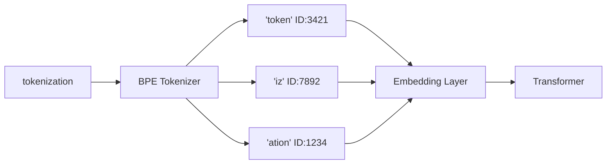
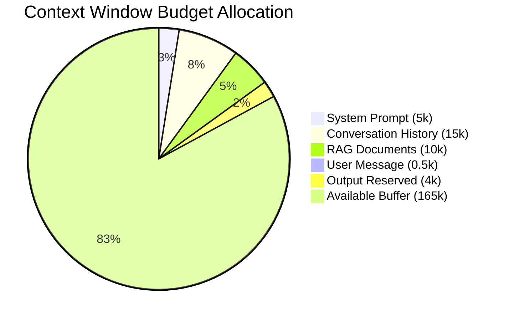
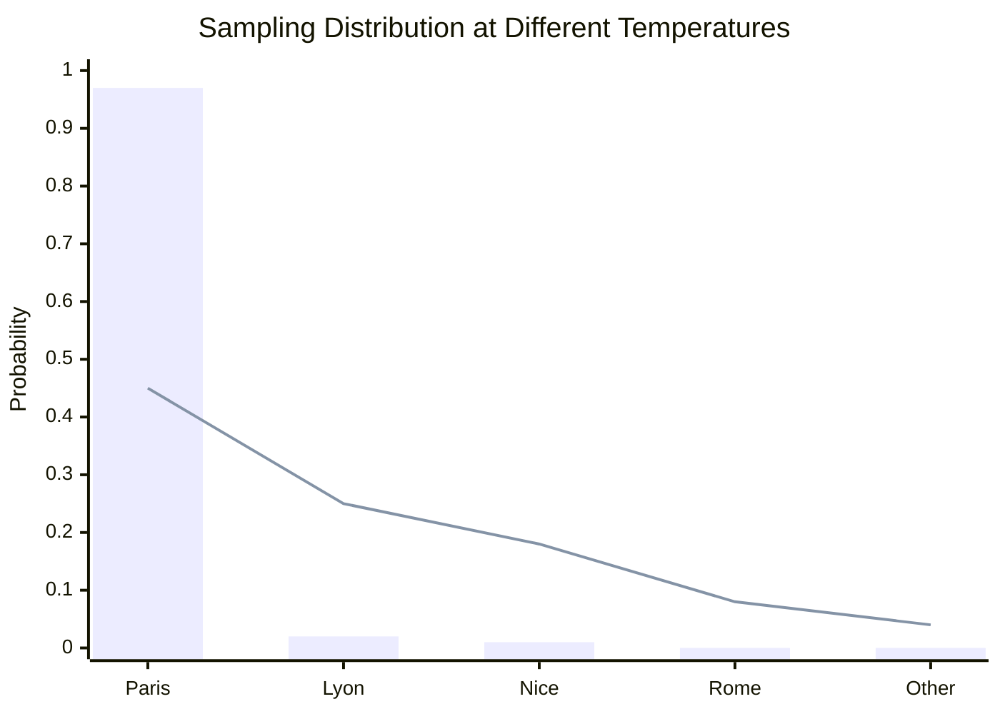

## Keywords in This File
{: .no_toc }

| # | Keyword | Weight |
|---|---|---|
| 1 | [Tokens and Tokenization](#tokens-and-tokenization) | critical |
| 2 | [Context Window](#context-window) | critical |
| 3 | [Temperature and Sampling](#temperature-and-sampling) | high |

---

# Tokens and Tokenization

**Interview Weight:** critical - Asked whenever someone
wants to confirm you actually understand how LLMs work,
not just how to call the API. Affects cost, behavior,
and debugging.

---

### 🎯 Model Answer

**30 seconds:**

> A token is the basic unit of text an LLM processes.
> Tokens are not words - they are sub-word fragments
> created by a tokenizer trained to split text into
> frequent chunks. Common English words are one token.
> Rare words, code identifiers, and non-English text
> are multiple tokens. This matters because LLM costs
> are priced per token, context windows are measured
> in tokens, and token boundaries cause surprising
> model behavior (like failing to count letters).

**3 minutes (Senior):**

> Tokenization is the process of converting raw text
> to integer IDs that the model can process. The most
> common algorithm is Byte Pair Encoding (BPE), which
> builds a vocabulary by iteratively merging the most
> frequent adjacent byte pairs in the training corpus.
> The result is a vocabulary of 50,000-100,000 subword
> units that covers all text efficiently.
>
> Practical implications:
>
> Cost: LLM APIs charge per token, not per character
> or word. "The quick brown fox" is 5 tokens. The word
> "tokenization" is 2-3 tokens. Code is expensive -
> variable names like `getUserAuthenticationToken` can
> be 5-7 tokens. Estimating token counts accurately
> before making API calls is a cost engineering skill.
>
> Context window limits: the 128k or 200k token context
> limit is tokens, not words. A 50,000-word novel is
> ~65,000 tokens. A large codebase quickly exceeds
> context limits.
>
> Model behavior: the model sees tokens, not characters.
> Letter-counting tasks ("how many 'r's in strawberry?")
> famously fail because 'strawberry' may be tokenized as
> ['str', 'aw', 'berry'] - the model never "sees" the
> individual characters.
>
> Language efficiency: English text tokenizes at roughly
> 1 token per 4 characters or 0.75 tokens per word.
> Non-English text, especially CJK languages, often uses
> 1 token per 1-2 characters - making them effectively
> more expensive to process.
>
> Code tokenization: Python and Java code tokenize at
> roughly 2-4x the rate of English prose (more tokens
> per semantic unit) because of identifiers, operators,
> and whitespace being split into many small tokens.

**Blank Mind Recovery:**

**(1) Restate:** "You are asking about tokens - the
unit of text that LLMs actually process."

**(2) First principles:** "From first principles,
neural networks process numbers, not text. Tokenization
is the bridge: it converts text into integer sequences
the model can process. The boundaries it chooses affect
everything from cost to model behavior."

**(3) Bridge:** "Think of tokens like bytes in a file
format - they are the atomic unit the system works with,
and everything else (cost, limits, behavior) is measured
in those units."

---

### 📘 Concept Explanation

**What it is:**

A token is the smallest unit of text that an LLM
processes. A tokenizer converts raw text to a sequence
of integer token IDs, and converts token IDs back to
text. The mapping is defined by a vocabulary - a lookup
table from token strings to integer IDs - built during
model training.

**The problem it solves:**

Neural networks process fixed-size numeric vectors, not
variable-length text. Tokenization is the pre-processing
step that converts text into a sequence of integers that
can be embedded into vectors and fed to the transformer.
The tokenizer must handle any input text using a finite
vocabulary while keeping the average sequence length
manageable.

**How it works:**

The most common algorithm is Byte Pair Encoding (BPE):

```
Start: character-level vocabulary
  {a-z, A-Z, 0-9, punctuation, byte fallback}

Iteration (repeated until vocab size reached):
  1. Count all adjacent token pairs in training corpus
  2. Merge the most frequent pair into a new token
  3. Add merged token to vocabulary

Example result:
  "the"  -> single token (high frequency)
  "cat"  -> single token (high frequency)
  "tokenization" -> ["token","ization"] (medium)
  "xkyzqw" -> byte-level tokens (unseen word)
```

> **Code walkthrough:** This Tokens and Tokenization example demonstrates a key concept in practice using authentication. **KEY MECHANISM:** the runtime executes these instructions in sequence with specific memory and execution semantics. **WHY IT MATTERS:** misapplying this pattern causes subtle bugs that only manifest under production load. **TAKEAWAY: understand the execution model before using this pattern in production code.**

At inference: text -> tokenizer -> [IDs] -> model
-> [IDs] -> detokenizer -> text.

**The key insight:**

The model never sees individual characters or words -
only tokens. This explains many "surprising" model
behaviors: counting individual letters fails because
they're not tokens, splitting words at unusual
boundaries can confuse the model, and non-English
languages cost more (more tokens per semantic content).

**When to use it:**

You use the tokenizer explicitly when:
- Counting tokens before an API call (cost estimation,
  context limit check)
- Debugging why a model handles a specific input poorly
- Building a chunking strategy (split at token
  boundaries, not character count)
- Fine-tuning (understanding token budgets)

**When NOT to use it:**

For most application code, you do not need to tokenize
manually - the API handles it. Only tokenize explicitly
when you need the count or when debugging edge cases.

**Alternatives:**

- Character-level models: process individual characters,
  no tokenization needed, but sequences are very long
- Word-level tokenization: split on whitespace,
  cannot handle unseen words
- SentencePiece: similar to BPE, used by Llama, T5

**First-principles derivation:**

Given: convert arbitrary text to a fixed-vocabulary
integer sequence for neural network input. Constraints:
(A) vocabulary must be finite, (B) any text must be
encodable (no OOV failures), (C) common text should be
compact. BPE satisfies all three: finite vocabulary,
byte-level fallback for unknown text, and merging common
substrings achieves compactness.

---

### 💻 Code Example

```python
# BAD: estimating tokens by word count
def estimate_tokens(text: str) -> int:
    # Wrong: ignores language, code, special chars
    return len(text.split())
```

> **Code walkthrough:** BAD pattern: This Wrong: ignores language, code, special chars example demonstrates function definition using authentication. **KEY MECHANISM:** Python compiles the function body to bytecode; default args are evaluated once at definition time. **WHY IT MATTERS:** mutable default arguments (def f(x=[])) share state across calls - a classic bug. **WHAT BREAKS: use None as default for mutable args and initialize inside the function body.**

```python
# GOOD: use the tokenizer for the actual model
import anthropic, os

client = anthropic.Anthropic(
    api_key=os.environ["ANTHROPIC_API_KEY"]
)

def count_tokens(text: str) -> int:
    """Count tokens via Anthropic token-counting API."""
    result = client.beta.messages.count_tokens(
        model="claude-opus-4-5",
        messages=[{"role": "user", "content": text}]
    )
    return result.input_tokens

def safe_llm_call(
    prompt: str, max_input: int = 4096
) -> str:
    tokens = count_tokens(prompt)
    if tokens > max_input:
        raise ValueError(
            f"Prompt too long: {tokens} tokens "
            f"(limit: {max_input})"
        )
    resp = client.messages.create(
        model="claude-opus-4-5",
        max_tokens=512,
        messages=[{"role":"user","content":prompt}]
    )
    return resp.content[0].text
```

> **Code walkthrough:** The BAD version estimates by wordice. **KEY MECHANISM:** the runtime executes these instructions in sequence with specific memory and execution semantics. **WHY IT MATTERS:** misapplying this pattern causes subtle bugs that only manifest under production load. **TAKEAWAY: understand the execution model before using this pattern in production code.**
> count - wrong by up to 50% for code or non-English text.
> The GOOD version calls the provider's token-counting
> endpoint (Anthropic `count_tokens`, OpenAI's `tiktoken`
> library) to get the exact count for that model's
> tokenizer. The `safe_llm_call` gates the API call on a
> token budget check, preventing expensive oversized
> requests. In production, cache counts for static prompt
> templates and only recount the dynamic portion.

---

### 🎓 Answers by Seniority

**Junior / Mid (0-5 years):**

> "A token is the unit of text that LLMs process -
> roughly word pieces. LLM APIs charge per token (input
> plus output), and the context window is measured in
> tokens. A rough estimate: 1 token is about 4 English
> characters or 0.75 words. For accurate counts, use
> the provider's tokenizer library."

*Push deeper:* "Non-English languages and code use more
tokens per semantic unit than English prose - important
for multilingual apps or code processing features."

---

**Senior / Staff (5+ years):**

> "Tokens are the atomic unit for everything in LLM
> engineering: cost, context limits, and model behavior.
> BPE builds subword units by merging frequent character
> pairs, so rare words and identifiers split into many
> tokens while common words are single tokens.
>
> In production I explicitly count tokens before API
> calls for cost budgeting and context management. I
> build token counting into the LLM wrapper and log
> actual usage from the API response so I can compare
> estimates to actuals and improve my budgeting models."

*Push deeper (Staff):* "Token efficiency is a cost
optimization lever. Prompt compression (removing verbose
instructions, using abbreviations the model understands)
reduces token counts 20-40% with no quality loss. At
10M tokens/day, a 30% compression is significant savings.
Prompt caching is the other lever - cache the static
prefix of a prompt so repeated calls only charge for
new content."

---

### ⚠️ Common Misconceptions

**Misconception 1: "1 token = 1 word."**

One English word is approximately 1.3-1.5 tokens on
average. Common words are single tokens. Technical terms
and rare words split into multiple tokens. Code is often
2-4 tokens per "word." Word count for token estimation
leads to budget overruns and unexpected truncation.

**Misconception 2: "Token limits only matter for very
long documents."**

In chat applications, token count grows with each turn
(the full conversation history is re-sent each call).
A 50-turn conversation can reach 20,000-50,000 tokens
even with short messages. Token management is relevant
at all scales.

**Misconception 3: "The tokenizer is the same across
all models."**

GPT-4o uses `cl100k_base`. Claude uses Anthropic's
tokenizer. Llama models use SentencePiece. The same
text can have different token counts on different models.
Always use the correct tokenizer for your model.

**Misconception 4: "LLMs can count letters."**

"How many 'r's are in strawberry?" - a famous LLM
failure. Because "strawberry" tokenizes into sub-word
fragments, the model cannot directly see the individual
letters. Character-level operations require code, not
an LLM.

---

### 🚨 Failure Modes and Diagnosis

**Failure 1: Context truncation without warning**

*Symptom:* Model responses become incoherent mid-
conversation. Earlier instructions are ignored.

*Cause:* Conversation history exceeded the context
window. The API truncated from the beginning.

*Diagnosis:* Log total token count per API call.
Alert when approaching 80% of context limit.

*Fix:* Implement sliding window or summarization
for conversation history.

**Failure 2: Unexpected API cost overruns**

*Symptom:* LLM bill is 3-5x projected cost.

*Cause:* Token counts were estimated by character/word
count, not actual tokenizer counts. Code or non-English
content uses more tokens than estimated.

*Diagnosis:* Log actual token counts from API responses
(available in the usage field). Compare to estimates.

*Fix:* Use the tokenizer library for accurate pre-call
estimates. Set per-request token limits.

**Failure 3: Character-level operation failures**

*Symptom:* Model gives wrong answer for letter counting,
palindrome detection, or character reversal.

*Cause:* The task requires character-level processing
but the model processes tokens.

*Fix:* Pre-process with code (Python string operations)
for character-level tasks rather than asking the LLM.

---

### 🎯 Interview Deep-Dive

| Seniority | Time | Focus |
|---|---|---|
| Junior | 3 min | What tokens are, rough size estimate |
| Mid | 5 min | BPE algorithm, token counting, cost impact |
| Senior | 7 min | Context management, optimization strategies |
| Staff | 10 min | Token efficiency at scale, cost governance |

---

**[JUNIOR] Q1 - What is a token in the context of LLMs?**

*Why they ask:* Baseline LLM literacy. If you cannot
explain tokens, you cannot reason about context limits
or costs.

*Likely follow-up:* "How many tokens is a typical paragraph?"

A token is the basic unit that an LLM processes. It is
not a word - it is a sub-word fragment produced by a
tokenizer algorithm. The tokenizer splits input text into
these fragments and maps each one to an integer ID. The
model never sees raw text - it sees sequences of integer
IDs, which are converted to vectors and fed through the
transformer.

Common English words are roughly one token. "The" is one
token. "cat" is one token. A less common word like
"tokenization" might be two tokens. Code identifiers
are often 3-6 tokens because they are long compound words.

Rough estimates:
- English prose: 1 token ≈ 4 characters ≈ 0.75 words
- A typical paragraph (100 words): 130-150 tokens
- A page of English text (500 words): 650-750 tokens
- A page of Python code (50 lines): 300-500 tokens

Why it matters: LLM APIs charge per token (input and
output). Context windows are measured in tokens. If you
are building an application that processes user documents,
the token count determines whether they fit in context
and how much each call costs.

*What separates good from great:* Knowing the rough
size ratios and being able to estimate token costs for
a given workload, and mentioning that code is more
token-dense than prose.

---

**[MID] Q2 - How does BPE tokenization work?**

*Why they ask:* Understanding the algorithm explains
token boundary behavior and model limitations.

*Likely follow-up:* "Why does the tokenizer matter
for model performance on specific tasks?"

BPE stands for Byte Pair Encoding. It is the algorithm
used to build the token vocabulary for most modern LLMs.

Training phase: Start with a character-level vocabulary
(all individual characters, including byte fallback for
unknown characters). Process a large text corpus. Count
all adjacent pairs of tokens. Find the most frequent
pair - say ("e", "r") appears 50,000 times. Merge that
pair into a new token "er". Add "er" to the vocabulary.
Repeat: count pairs including the new merged tokens.
Find the next most frequent pair, merge it. Continue
until the vocabulary reaches the target size (50,000-
100,000 tokens).

Result: the most common subword units in the training
corpus become single tokens. For English: common words
and word-beginnings are single tokens. Rare words split
into more tokens.

Why this matters for model behavior:

Token boundaries are where the model's processing unit
ends. For "strawberry": if it tokenizes as ["str", "aw",
"berry"], the model processes three tokens - it never
"sees" the individual letters as separate units. This is
why letter-counting tasks fail.

For code: variable names like `getUserById` might
tokenize as ["get", "User", "By", "Id"] - four tokens.
The model sees the components but not the full name as
a single unit.

For multilingual text: non-English characters often
split into more tokens per semantic unit than English,
making those inputs more expensive and token-dense.

*What separates good from great:* Connecting the BPE
algorithm to specific model behaviors (letter counting,
code identifier handling, multilingual costs) rather than
just describing the algorithm abstractly.

---

**[MID] Q3 - [TRADE-OFF] How do you handle token limits
in a production LLM application?**

*Why they ask:* Token limit management is one of the
most practical LLM engineering challenges.

*Likely follow-up:* "Walk me through how you'd
implement context compression."

Token limit management is a system design concern.
The strategies I use in order of when to apply them:

Strategy 1 - Count before you call. For variable input
sizes (user documents, conversation history), count
tokens before the API call. If over budget, handle it
before sending - not after getting an error back.

Strategy 2 - Sliding window for conversations. Maintain
only the last N turns in context by token count. When
total history exceeds 80% of the context window, drop
the oldest turns.

Strategy 3 - Summarize old context. Instead of dropping
old turns, summarize them: send the oldest N turns with
"summarize this conversation in 200 words," store the
summary, and use it as a compact replacement. This
preserves semantic content while reducing tokens.

Strategy 4 - RAG for long documents. Don't try to fit
a 100-page document in context. Index it, retrieve the
relevant chunks for each query, and inject only those
chunks. 3-5 chunks of 500 tokens each is more reliable
than hoping the document fits in context.

Strategy 5 - Prompt compression. Review your system
prompts. Verbose prompts can often be compressed 20-40%
with no quality loss. Remove filler instructions and
use precise language.

The trade-off: compression reduces cost but risks losing
relevant context. Test quality at different compression
levels. There is a threshold below which quality drops
faster than token count.

*What separates good from great:* Having concrete
thresholds (alert at 80% of context window) and multiple
strategies for different scenarios rather than one approach.

---

**[SENIOR] Q4 - [DEBUGGING] Tokens and unexpected model
behavior - what are the common cases?**

*Why they ask:* Understanding tokenization explains a
class of otherwise mysterious model failures.

*Likely follow-up:* "How would you debug if a model
gives inconsistent responses to similar inputs?"

Three classes of token-related unexpected behavior I've
encountered:

Case 1 - Character-level task failures. We built a tool
to count specific characters using an LLM. The model was
wrong about 30% of the time. Root cause: character
counting requires seeing individual characters, but the
model sees tokens. Fix: use Python string operations
(`text.count('a')`) for character-level work. Use the
LLM for the natural language interface only.

Case 2 - Language-dependent token count discrepancy.
We built a token budget based on English text benchmarks
(100 words ≈ 130 tokens). A French user's 50-word message
hit the token limit because French text with accent
characters was 40% more tokens per word than estimated.
Diagnosis: logged actual token counts from API responses.
Fix: count tokens before each call using the tokenizer,
not word count heuristics.

Case 3 - Inconsistent JSON at token boundaries. We were
generating JSON and occasionally got malformed output.
Root cause: the JSON structure straddled token boundaries
in a way that occasionally produced incomplete tokens.
Fix: use the structured output / JSON mode feature
(forces valid JSON generation) rather than relying on
prompt instructions alone.

General debugging approach: when a model behaves
unexpectedly on specific inputs, tokenize the input and
look at the actual tokens. The answer is often visible -
a word splits in an unexpected place, a number is broken
across tokens, special characters cause unusual splits.

*What separates good from great:* Giving concrete
production examples with root causes and fixes, and
the debugging methodology (tokenize the problematic
input directly).

---

**[SENIOR] Q5 - How do you optimize token usage to
reduce LLM costs?**

*Why they ask:* Cost optimization is a real concern
at scale.

*Likely follow-up:* "At what volume does token
optimization become worth the engineering effort?"

Token cost optimization strategies in order of effort-
to-impact:

Strategy 1 - Model tier selection (high impact, low effort).
A cheap model (Claude Haiku, GPT-4o-mini) costs 10-20x
less per token than frontier models. Benchmark the top
2-3 cheap candidates on your actual use case. If quality
difference is <5% for your task, ship the cheaper model.
Impact: 80-95% cost reduction for eligible tasks.

Strategy 2 - Prompt compression (medium impact, moderate
effort). Audit your system prompts. Verbose instructions
can be compressed 20-40% without quality loss. Remove
filler words, consolidate redundant instructions, use
precise language. Every token saved in the system prompt
saves that much on every API call.

Strategy 3 - Prompt caching (high impact for repeated
content). If your system prompt or a large context
document is the same across many calls, use prompt
caching. Anthropic charges 10% of normal price for
cached tokens. For a 10,000-token system prompt sent
100 times/day: uncached = 1M tokens/day, cached =
100k tokens/day.

Strategy 4 - Output length control. Set max_tokens to
the minimum necessary for the task. A classification
response needs 5 tokens, not 512. Unbounded output
lengths are a common cost leak.

Strategy 5 - Request batching. For offline processing
use batch APIs (async, slower, cheaper - typically
50% discount). For real-time use cases, batch multiple
user queries into one API call where feasible.

Break-even analysis: at $0.000015/token and 100M
tokens/month = $1,500/month. A 40% compression saves
$600/month. Two engineer-hours of prompt compression
pays off in the first month.

*What separates good from great:* Giving a concrete
break-even calculation and leading with the highest-
leverage action (model selection) before complex
caching strategies.

---

**[STAFF] Q6 - [ARCHITECTURE] How do you design a
token budget system for a multi-tenant LLM product?**

*Why they ask:* Enterprise LLM products require cost
governance. Staff-level system design.

*Likely follow-up:* "How do you handle a tenant that
exceeds their budget mid-month?"

A multi-tenant token budget system has three layers:

Budget definition: each tenant has a monthly token
budget (input + output combined). Budgets stored in
DB with tenant_id, budget_limit, current_usage,
reset_date. For tiered products, budget maps to
pricing tier.

Metering layer: every LLM API call logs input_tokens
and output_tokens from the API response. Write to an
append-only metering store with tenant_id, timestamp,
model, input_tokens, output_tokens. Do not update the
budget in the hot path - use async aggregation to
compute running totals.

Enforcement layer: before each API call, check the
tenant's remaining budget from a Redis counter (fast
read). If over 80%, emit a budget warning event. If
over 100%, block the call and return a quota exceeded
error. Use Redis INCR with the estimated tokens, compare
to limit. This is the only synchronous check in the hot
path.

Overflow handling: options depend on business model:
(1) block until next billing period, (2) auto-upgrade
tier, (3) overage at a higher per-token price, (4)
degrade to cheaper model tier. I typically implement
options 3 or 4 and notify the account owner.

Observability: per-tenant usage dashboard, daily
reports, cost anomaly alerts (usage >3x trailing
average triggers investigation - could be runaway
process or abuse).

*What separates good from great:* Separating the
metering path (async, high-throughput) from the
enforcement path (fast, synchronous) to prevent
metering from becoming a hot-path bottleneck.

---

**[JUNIOR] Q7 - Why does counting letters fail for LLMs?**

*Why they ask:* Famous LLM limitation. Understanding
it reveals how tokenization works.

The "how many 'r's in strawberry" question fails because
of tokenization. The model never sees individual
characters - it sees tokens. The word "strawberry"
tokenizes as something like ["str", "aw", "berry"] -
three tokens, not eleven characters.

When the model tries to count 'r' characters, it must
count across token boundaries: "str" (contains one 'r'),
"aw" (no 'r'), "berry" (contains two 'r's). To get the
correct answer (3), the model needs to decompose each
token into characters, count across all of them, and
sum. This multi-step character-level decomposition is
not what the model's next-token prediction architecture
is optimized for.

The practical fix: do not ask the LLM to count characters.
Use code: `text.count('r')` gives the correct answer
deterministically every time. This is the general
principle - LLMs are not calculators or parsers. Route
deterministic, character-level, or arithmetic tasks to
code. Use the LLM for what it excels at: natural language
understanding, generation, and reasoning.

In a production application that needs character counting:
use tool calling. Define a `count_char(text, char)` Python
function as an LLM tool. The LLM decides to call the
tool, the tool executes the Python code, the result is
returned to the LLM to use in its response.

*What separates good from great:* Not just explaining
WHY it fails, but also giving the production solution:
tool calling with deterministic code for character-level
operations.

---

### ⚖️ Comparison Table

*(Omit: ★☆☆ foundational level.)*

---

### 🏛️ System Design

*(Omit: ★☆☆ foundational level.)*

---

### 📊 Diagram

**BPE tokenization example:**

```
Input: "tokenization"

BPE splits:
  "token" -> ID 3421 (frequent in training)
  "iz"    -> ID 7892
  "ation" -> ID 1234

"strawberry" splits:
  "str"   -> ID 897
  "aw"    -> ID 1203
  "berry" -> ID 5512
  (NOT 11 individual characters)
```



> **Diagram walkthrough:** BPE splits "tokenization" into
> three subword tokens based on frequency in training data.
> Each token maps to an integer ID, which becomes a dense
> vector in the embedding layer. The transformer processes
> three vectors, not eleven characters. For "strawberry"
> the three-token split explains why letter-counting fails:
> the model's atomic units are "str", "aw", and "berry" -
> not the individual letters s, t, r, a, w, b, e, r, r, y.

---

---

---

### 💻 Code Example

*(Omit: this concept does not have a programmatic interface that can be demonstrated in code. The conceptual explanation above is sufficient.)*


---

### 🏛️ System Design

*(Omit: system design diagram not applicable for this concept - see ★★★ keywords for full system design coverage.)*


---

### ⚖️ Comparison Table

*(Omit: this is a ★☆☆ foundational concept with no direct alternatives to compare - see higher-difficulty keywords for trade-off analysis.)*


---

### 📊 Diagram

*(Omit: no standalone visual diagram required for this concept - the explanations and code examples above provide sufficient clarity.)*


# Context Window

**Interview Weight:** critical - Every LLM system design
question touches context window limits. Not understanding
this means you cannot architect reliable LLM systems.

---

### 🎯 Model Answer

**30 seconds:**

> The context window is the maximum number of tokens the
> model can process in a single API call - combining both
> input (prompt, history, documents) and output (generated
> response). Modern models support 100k-200k tokens. The
> critical design constraint: quality degrades before you
> hit the hard limit ("lost in the middle"), and exceeding
> the limit causes truncation or errors. Designing for
> context limits is a core LLM architecture skill.

**3 minutes (Senior):**

> The context window is a hard architectural constraint.
> The transformer's attention mechanism computes attention
> over all token pairs in the context, which is O(n^2) in
> sequence length - why early models had 4,096-token windows
> and large windows require engineering optimizations like
> flash attention.
>
> Current sizes (2025): Claude Opus/Sonnet: 200,000 tokens.
> GPT-4o: 128,000 tokens. Llama 3.1: 128,000 tokens.
> Gemini Pro: 1,000,000 tokens.
>
> The "lost in the middle" problem: models attend most
> strongly to the beginning and end of the context.
> Information placed in the middle of a very long context
> gets less effective attention weight. Stanford research
> demonstrated this: accuracy drops significantly for
> information at positions 50-90% of a long context.
> "Fits in context" is not the same as "will be processed
> well."
>
> Practical context budget for a typical application:
> - System prompt: 2,000-10,000 tokens
> - Conversation history (10 turns): 5,000-15,000 tokens
> - Retrieved documents (RAG): 5,000-20,000 tokens
> - User message: 10-500 tokens
> - Output reservation: 1,000-4,096 tokens
> Total: 15,000-50,000 tokens for a modest application.
>
> Output tokens count against the budget too. If you set
> max_tokens=4096, that consumes 4,096 of the context
> budget for the response. Input + output <= context limit.

**Blank Mind Recovery:**

**(1) Restate:** "You are asking about the context window -
the limit on how much text the model can process at once."

**(2) First principles:** "Transformers compute attention
over all input tokens pairwise. This has quadratic cost
in sequence length. The context window is the limit where
this remains tractable."

**(3) Bridge:** "Think of it like RAM in a computer -
the working memory the model has for one call. Finite,
shared between input and output, and quality degrades
as it fills up."

---

### 📘 Concept Explanation

**What it is:**

The context window is the maximum total tokens (input +
output) a model processes in a single forward pass. All
input tokens (system prompt, conversation history,
documents, user message) plus the generated output must
fit within this limit.

**The problem it solves:**

Transformer attention is quadratic in sequence length.
The context window bounds this computation to a tractable
size. Without it, processing arbitrarily long inputs
would require impractical compute.

**How it works:**

```
Context window (200,000 tokens budget):

[System Prompt]    [5,000 tokens]
[Conversation]     [15,000 tokens]
[Retrieved Docs]   [10,000 tokens]
[User Message]     [500 tokens]
[Max Output]       [4,096 tokens]
---------------------------------
Used:              34,596 tokens
Remaining:         165,404 tokens
```

> **Code walkthrough:** This Context Window example demonstrates a key concept in practice using authentication. **KEY MECHANISM:** the runtime executes these instructions in sequence with specific memory and execution semantics. **WHY IT MATTERS:** misapplying this pattern causes subtle bugs that only manifest under production load. **TAKEAWAY: understand the execution model before using this pattern in production code.**

At the hard limit: API returns a token limit error or
silently truncates from the beginning.
Quality degradation starts before the hard limit due
to the "lost in the middle" attention effect.

**The key insight:**

Fitting within the context window is necessary but
not sufficient for good performance. For retrieval
tasks, putting relevant information at the beginning
or end of the context (not buried in the middle)
improves recall. For very long contexts, RAG typically
outperforms full-document stuffing because of this
quality effect.

**When to use it:**

Context window determines your application architecture.
- Short context (<10k tokens): almost any approach works
- Medium context (10k-50k): conversation management needed
- Long context (50k+): RAG or active compression required

**When NOT to use it:**

Do not stuff the maximum possible content into context
hoping the model finds what it needs. Targeted retrieval
(RAG) outperforms full-context stuffing for Q&A tasks
at any scale beyond trivial.

**Alternatives:**

- RAG: retrieve only relevant chunks (better quality
  for Q&A, requires infrastructure)
- Summarization: compress old content before adding new
- Hierarchical processing: chunk, process, combine

**First-principles derivation:**

Transformers compute self-attention: each token attends
to every other token. For sequence length n, this is
O(n^2) attention computations. At 128k tokens, that's
~16 billion attention pairs. Modern hardware handles
this with flash attention optimizations, but there is
a practical ceiling. Context window limits exist to
keep inference latency and cost tractable.

---

### 💻 Code Example

```python
# BAD: no context management, grows unbounded
messages = []

def chat(user_msg: str, client) -> str:
    messages.append({"role":"user","content":user_msg})
    resp = client.messages.create(
        model="claude-opus-4-5",
        max_tokens=1024,
        messages=messages  # unbounded growth!
    )
    reply = resp.content[0].text
    messages.append({"role":"assistant","content":reply})
    return reply
```

> **Code walkthrough:** BAD pattern: This BAD: no context management, grows unbounded example demonstrates function definition using authentication. **KEY MECHANISM:** Python compiles the function body to bytecode; default args are evaluated once at definition time. **WHY IT MATTERS:** mutable default arguments (def f(x=[])) share state across calls - a classic bug. **WHAT BREAKS: use None as default for mutable args and initialize inside the function body.**

```python
import anthropic, os

client = anthropic.Anthropic(
    api_key=os.environ["ANTHROPIC_API_KEY"]
)

MAX_INPUT_TOKENS = 96_000   # 96k of 100k budget
OUTPUT_RESERVE   = 4_096    # max output tokens
MODEL            = "claude-opus-4-5"

def trim_to_budget(messages: list) -> list:
    """Drop oldest messages to stay within budget."""
    if len(messages) <= 1:
        return messages
    while len(messages) > 1:
        result = client.beta.messages.count_tokens(
            model=MODEL, messages=messages
        )
        if result.input_tokens <= MAX_INPUT_TOKENS:
            break
        # drop oldest non-system message
        messages = [messages[0]] + messages[2:]
    return messages

def chat_managed(
    user_msg: str, history: list
) -> tuple[str, list]:
    """Context-managed chat with sliding window."""
    history.append({
        "role": "user", "content": user_msg
    })
    history = trim_to_budget(history)
    resp = client.messages.create(
        model=MODEL,
        max_tokens=OUTPUT_RESERVE,
        messages=history
    )
    reply = resp.content[0].text
    history.append({
        "role": "assistant", "content": reply
    })
    return reply, history
```

> **Code walkthrough:** The BAD version lets the messageice. **KEY MECHANISM:** the runtime executes these instructions in sequence with specific memory and execution semantics. **WHY IT MATTERS:** misapplying this pattern causes subtle bugs that only manifest under production load. **TAKEAWAY: understand the execution model before using this pattern in production code.**
> list grow forever - the 51st turn will hit the context
> limit and either error or silently lose the earliest
> context. The GOOD version counts tokens before each
> call using the provider API and drops the oldest
> messages to stay within budget. Key decisions: always
> keep the most recent user message (current intent),
> reserve output budget so the model can always respond,
> and keep the system message (index 0) since it defines
> the model's role. In a production system, summarize
> dropped messages rather than silently deleting them.

---

### 🎓 Answers by Seniority

**Junior / Mid (0-5 years):**

> "The context window is the maximum tokens the model
> can process in one call - input and output combined.
> Current models are 100k-200k tokens. For chat apps,
> you need to manage conversation history so it doesn't
> grow past the limit. For documents, you may need to
> chunk rather than sending whole."

*Push deeper:* "The 'lost in the middle' problem means
you should put the most important information at the
beginning or end of the context, not buried in the middle."

---

**Senior / Staff (5+ years):**

> "Context window is the primary architectural constraint
> for LLM applications. It fills fast: a system prompt,
> 10 conversation turns, and a few RAG chunks can use
> 30-50k tokens before the user's question. I design for
> context from the start: compact system prompts, sliding-
> window or summarization for history, RAG rather than
> full-document stuffing.
>
> The 'lost in the middle' effect means I put the user's
> actual question and the most specific context first and
> last. Critical instructions go at the beginning of the
> system prompt. The most relevant retrieved chunk goes
> immediately before the user question."

*Push deeper (Staff):* "At org scale, context window is
an economic variable. Larger context = higher cost per
call. A product with 10k tokens of injected context at
1M queries/day at $0.000015/token = $150/day in input
costs alone. Context budget is a product and pricing
design decision, not just a technical parameter."

---

### ⚠️ Common Misconceptions

**Misconception 1: "Larger context window = always better."**

A 200k context window does not mean you should use 200k
tokens. Larger contexts are slower, more expensive, and
quality degrades for content buried in the middle. Use
the minimum context necessary for the task.

**Misconception 2: "If it fits, the model reads it."**

The "lost in the middle" effect means content at position
50-90% of a very long context gets less attention.
Fitting within the window is necessary but not sufficient
for quality.

**Misconception 3: "Context limits only affect long docs."**

Chat applications accumulate tokens with every turn.
50 turns at 300 tokens/turn = 15,000 tokens of history
alone, before any documents or system prompts. Context
management is necessary for all conversational apps.

---

### 🚨 Failure Modes and Diagnosis

**Failure 1: Token limit error on long conversations**

*Symptom:* `400 Bad Request: max tokens exceeded` after
many conversation turns.

*Diagnosis:* Log total input token count per request.
Alert at 80% of context limit.

*Fix:* Implement sliding window or summarization. Never
let history grow unbounded.

**Failure 2: Degraded quality in long contexts**

*Symptom:* Model correctly answers questions about
info at start/end of document but misses the middle.

*Cause:* Lost-in-the-middle attention degradation.

*Fix:* Use RAG to retrieve only relevant sections, or
restructure the prompt to put critical info first/last.

**Failure 3: Output truncation**

*Symptom:* Model's response cuts off mid-sentence.
`stop_reason` is "max_tokens" not "end_turn."

*Cause:* max_tokens parameter is too small for the
response the model wants to generate.

*Fix:* Increase max_tokens, or add instructions to
"respond concisely in under N words."

---

### 🎯 Interview Deep-Dive

| Seniority | Time | Focus |
|---|---|---|
| Junior | 3 min | What it is, why it matters |
| Mid | 5 min | Lost in the middle, context strategies |
| Senior | 7 min | Architecture patterns, cost implications |
| Staff | 10 min | Context as product constraint, governance |

---

**[JUNIOR] Q1 - What is a context window?**

*Why they ask:* Baseline LLM architecture literacy.

*Likely follow-up:* "What happens when you exceed it?"

The context window is the maximum number of tokens a
model can process in a single API call. It covers both
the input (everything you send: system prompt, history,
documents, the user message) and the output (the
generated response). Everything the model can "know"
during a single generation must fit in this window.

Unlike a database, the model cannot look up information
outside this window - it only knows what's in the context.
Between API calls, the model has no memory (it is
stateless). The "memory" in a chat application is the
application re-injecting previous turns into the context
on every call.

Current sizes (2025): Claude supports 200,000 tokens.
GPT-4o supports 128,000 tokens.

When you exceed it: the API returns a 400 error with
a token limit message, or in some configurations
silently truncates from the beginning. Either way, your
request fails or loses context. This is why you must
proactively manage what goes into the context.

*What separates good from great:* Mentioning that the
model is stateless between calls (the context window is
the only "memory") and that quality can degrade before
hitting the hard limit due to lost-in-the-middle.

---

**[MID] Q2 - What is the "lost in the middle" problem?**

*Why they ask:* A real production failure mode.

*Likely follow-up:* "How do you work around it?"

The "lost in the middle" problem is a documented quality
degradation when relevant information is placed in the
middle of a very long context. Models attend more strongly
to the beginning and end of the context than to the middle.

Stanford research (Liu et al., 2023) showed this
systematically: models retrieved information significantly
less accurately when it was placed at position 50-90%
of a long context versus at positions 0-10% or 90-100%.

Why it happens: attention patterns show recency bias
(strong attention to recent tokens) and primacy bias
(strong attention to early context containing the task
description). Middle content competes with both and gets
lower effective attention weight.

Practical design responses:

For RAG: place the most relevant retrieved chunks at
the start and end of the context. Do not sandwich them
between a long system prompt and background text.

For system prompts: front-load the most critical
instructions. The role definition, output format, and
key constraints go first because those get the strongest
attention weight.

For conversation history: the most recent turn matters
most. Older turns should be summarized rather than kept
verbatim.

For long documents: instead of injecting the full
document in the middle of your context, retrieve the
specific relevant sections and inject them closer to
the user's question.

*What separates good from great:* Citing the empirical
research and having concrete prompt design strategies
(front-load critical instructions, place relevant
chunks first/last) rather than just knowing the problem.

---

**[SENIOR] Q3 - [TRADE-OFF] RAG vs. long context - when
do you use each?**

*Why they ask:* Core LLM architecture trade-off.

*Likely follow-up:* "At what document size do you switch
from full-context to RAG?"

This is a genuine trade-off with measurable dimensions.

Long context (inject full document):
- Simpler: no retrieval infrastructure, chunking, or
  embedding model needed
- Better for full-document synthesis (summarize everything,
  find contradictions across sections)
- Better for small documents (<10k tokens) where RAG
  overhead is not justified
- Fails as document size grows (cost, lost-in-the-middle,
  hitting context limits)

RAG (retrieve relevant chunks):
- More complex: requires chunking, embedding model, vector
  store, retrieval pipeline
- Better for Q&A ("what does section 7 say about X?")
  where only part of the document is relevant
- Better for large document collections
- Reduces cost (inject only relevant chunks, not full docs)
- Requires tuning (chunk size, retrieval strategy, reranking)

My decision thresholds:
- Document <20k tokens AND task is synthesis: long context
- Document >20k tokens OR >10 documents: RAG
- Task is specific Q&A: RAG regardless of doc size
  (less noise, better quality)
- Task requires "what is NOT in the document": long
  context (model needs the full picture)

For medium documents (20k-50k) with mixed tasks: benchmark
both approaches. The winner depends on document structure
and query distribution.

*What separates good from great:* Giving concrete size
thresholds and task-type criteria rather than "it depends,"
and acknowledging that both are sometimes the answer and
benchmarking is required.

---

**[SENIOR] Q4 - [DEBUGGING] How do you debug a context-
related quality regression?**

*Why they ask:* Context issues are common production
quality regressions.

*Likely follow-up:* "How do you detect this proactively?"

When I see a quality regression that might be context-
related, my diagnosis process:

Step 1: Check context growth over time. Log total input
token count per request. A gradual quality regression
that correlates with growing context (more history, more
injected documents) is a context management issue, not
a model issue.

Step 2: Reproduce on a minimal example. Does the quality
regression happen on a fresh conversation (no history)?
If no, the issue is context accumulation. If yes, the
issue is the prompt itself.

Step 3: Test context placement. If relevant information
is in the middle of a long context, move it to the
beginning and retest. If quality improves significantly,
it is the "lost in the middle" problem.

Step 4: Check stop_reason in API responses. If you see
"max_tokens" instead of "end_turn," the output is being
truncated - the model's complete response is being cut.

Step 5: Compare token counts before and after the
regression started. If a code change started injecting
more documents, that is the cause.

Proactive monitoring: track a quality metric (LLM-as-
judge score or human ratings) alongside context token
counts. Alert when quality drops while context grows.
This catches context-driven regressions before incidents.

*What separates good from great:* Having the telemetry
(token counts per request, quality scores, stop_reason)
to diagnose proactively rather than reactively.

---

**[STAFF] Q5 - How does context window constrain
product design?**

*Why they ask:* Staff engineers connect technical
constraints to product decisions.

*Likely follow-up:* "Design a knowledge-base assistant
for 10,000 documents."

Context window is a first-class product constraint.

Feature feasibility: "chat with your full codebase"
sounds compelling, but a 100k-line codebase is millions
of tokens - far exceeds any context window. The product
must be "chat with relevant files" using retrieval.
Managing this expectation gap early is a Staff engineering
responsibility, not something to discover at launch.

UX design: when context management drops old turns, the
UX must communicate this to users ("I no longer have
access to what we discussed 20 messages ago"). Silent
context loss destroys user trust. The product design
must surface this technical constraint.

Cost model: context size drives LLM cost per query.
A product with 10,000 tokens per query at 1M queries/day
at $0.000015/token = $150/day in input costs alone.
Context is a cost driver that feeds into pricing.

Architecture: context window determines whether you
need RAG infrastructure. For small documents and low
volume, RAG overhead may not be justified. For large
documents or high volume, RAG is mandatory.

For 10,000 documents: RAG is required. Design: chunk at
ingestion (semantic chunking by paragraph/section),
embed chunks, store in a vector DB with document metadata
for filtering. At query time: embed query, retrieve top-k
chunks with metadata filtering, inject into context.
Surface source attribution in the product UX.

*What separates good from great:* Connecting the context
constraint to product UX, cost modeling, and architecture
decisions - not just treating it as a technical parameter.

---

**[MID] Q6 - What is prompt caching and how does it help?**

*Why they ask:* Prompt caching is a key cost optimization.

Prompt caching is a feature that caches a prefix of your
prompt so it is not re-processed (and not fully re-priced)
on subsequent API calls with the same prefix.

How it works: if your system prompt and a large static
document are the same across many requests, you mark
that prefix as cacheable. The API processes and caches
it on the first call. On subsequent calls with the same
cached prefix, you are charged at a reduced rate.
Anthropic charges 10% of normal input token price for
cached tokens versus 100% for uncached.

Constraints: cached tokens still count against the
context window limit - caching reduces cost but not
context length. Caches have a TTL (typically 5 minutes
of inactivity at Anthropic) - caching only helps if
you're making multiple calls within the TTL window.

High-value use case: a 50,000-token knowledge base or
system prompt sent in 10,000 API calls per hour.
Uncached: 50,000 * 10,000 = 500M tokens/hour charged
at full rate. With caching: 500M tokens/hour charged
at 10% rate. 90% cost reduction for static context.

Not valuable: short contexts (overhead not worth it),
contexts that change per user (can't be shared), low-
volume applications where absolute cost is small.

*What separates good from great:* Knowing the TTL
constraint and the 10% pricing structure, not just
"caching saves money."

---

**[JUNIOR] Q7 - How long is 200,000 tokens in practice?**

*Why they ask:* Intuition for context window size helps
with architecture decisions.

200,000 tokens is approximately:
- 150,000 English words - about 600 pages of a novel
- ~400 pages of technical documentation
- ~5,000-8,000 lines of Java code (code uses more tokens
  per line than prose - roughly 2-4x more tokens per
  semantic unit)
- About 50,000-80,000 lines of Python
- About 15 hours of meeting transcripts

That sounds large, but a real application fills it fast:
- System prompt: 2,000-10,000 tokens
- 10 conversation turns: 5,000-15,000 tokens
- RAG-retrieved documents: 5,000-20,000 tokens
- Current user message: 10-500 tokens

A typical enterprise application might use 30,000-50,000
tokens per call before the user types a word.

For a codebase: a mid-size codebase (50k lines of Java)
is roughly 150,000-300,000 tokens - it barely fits in a
200k window and hits the lost-in-the-middle zone
immediately. Large codebases are impossible to stuff
in context. RAG over the codebase is the required
architecture.

*What separates good from great:* Being able to give
rough estimates for common input types and explaining
that even a "large" context window fills up quickly
in practice.

---

### ⚖️ Comparison Table

*(Omit: ★☆☆ foundational level.)*

---

### 🏛️ System Design

*(Omit: ★☆☆ foundational level. See RAG - L5 Architecture
for context window in system design.)*

---

### 📊 Diagram

**Context window budget breakdown:**

```
|<--- 200,000 tokens (budget) --->|
|Sys  |Conv  |RAG  |User|Out|Buf  |
|5k   |15k   |10k  |0.5k|4k |165k |
```



> **Diagram walkthrough:** The context window is shared
> between all input tokens and the reserved output budget.
> In a typical LLM application, the system prompt, history,
> and retrieved documents consume 20-40k tokens before the
> user speaks. The buffer exists for injecting larger
> documents during complex queries. When the buffer is
> exhausted, either older history must be dropped or
> the RAG chunk budget must shrink. This budget allocation
> is a product design decision as much as a technical one.

---

---

---

### 💻 Code Example

*(Omit: this concept does not have a programmatic interface that can be demonstrated in code. The conceptual explanation above is sufficient.)*


---

### 🏛️ System Design

*(Omit: system design diagram not applicable for this concept - see ★★★ keywords for full system design coverage.)*


---

### ⚖️ Comparison Table

*(Omit: this is a ★☆☆ foundational concept with no direct alternatives to compare - see higher-difficulty keywords for trade-off analysis.)*


---

### 📊 Diagram

*(Omit: no standalone visual diagram required for this concept - the explanations and code examples above provide sufficient clarity.)*


# Temperature and Sampling

**Interview Weight:** high - Distinguishes candidates who
understand model behavior from those who just call APIs.

---

### 🎯 Model Answer

**30 seconds:**

> Temperature controls the randomness of an LLM's output
> by scaling the probability distribution over possible
> next tokens before sampling. Temperature=0 means always
> pick the highest-probability token (greedy, deterministic).
> Temperature=1 means sample proportionally. Higher
> temperature increases randomness. Use temperature=0 for
> structured extraction and parsing, 0.7-1.0 for creative
> tasks.

**3 minutes (Senior):**

> The model produces a probability distribution over its
> entire vocabulary for each next token. Temperature works
> by scaling the logits (raw scores) before softmax.
> Dividing logits by temperature T:
> - T < 1: sharpens the distribution (top token becomes
>   even more dominant, low tokens even less likely)
> - T = 1: no change (sample from raw distribution)
> - T > 1: flattens the distribution (more tokens become
>   roughly equally likely - more randomness)
> - T = 0: always select argmax (greedy decoding)
>
> The sampling interaction: top-p (nucleus sampling)
> restricts sampling to the smallest set of tokens whose
> cumulative probability > p. At top-p=0.9, the long
> tail of very low probability tokens is excluded. This
> prevents garbage tokens even at high temperature.
> Top-k restricts to the top k tokens by probability.
> Most practitioners use temperature OR top-p, not both.
>
> Typical production settings:
> - JSON / structured extraction: temperature=0
> - Code generation with tests: temperature=0-0.2
> - Factual Q&A: temperature=0.2-0.5
> - Conversational: temperature=0.5-0.7
> - Creative writing / brainstorming: temperature=0.7-1.0
>
> The testing implication: temperature=0 tasks can use
> exact-assertion unit tests. temperature>0 tasks require
> property-based or LLM-as-judge evaluation.

**Blank Mind Recovery:**

**(1) Restate:** "You are asking about temperature - the
parameter that controls how random the LLM's outputs are."

**(2) First principles:** "From first principles: the
model outputs a probability distribution over the next
token. Temperature scales that distribution before
sampling. Scale down (T<1): more concentrated and
deterministic. Scale up (T>1): more uniform and random."

**(3) Bridge:** "Think of it like adjusting image contrast.
Low temperature = high contrast (the dominant choice stands
out clearly). High temperature = low contrast (everything
looks similar, so the model explores more)."

---

### 📘 Concept Explanation

**What it is:**

Temperature is a hyperparameter that scales the logit
distribution before sampling the next token. It is one
of several sampling parameters controlling the
stochasticity of model output. Others: top-p (nucleus
sampling), top-k, and presence/frequency penalties.

**The problem it solves:**

Greedy decoding (always picking the highest probability
token) is deterministic but not always optimal for long
sequences. For creative tasks the model needs to explore
lower-probability paths. For deterministic tasks you want
consistency. Temperature lets you tune this trade-off
per use case.

**How it works:**

```
Logits from model:
  "Paris": 3.2   "Lyon": 1.1   "Nice": 0.8

After temperature T=0.5 (divide logits by 0.5):
  "Paris": 6.4   "Lyon": 2.2   "Nice": 1.6

After softmax:
  T=0:   "Paris": 1.00  (argmax always)
  T=0.5: "Paris": 0.95  (sharper)
  T=1.0: "Paris": 0.82  (natural)
  T=2.0: "Paris": 0.65  (flatter)
```

> **Code walkthrough:** This Temperature and Sampling example demonstrates a key concept in practice. **KEY MECHANISM:** the runtime executes these instructions in sequence with specific memory and execution semantics. **WHY IT MATTERS:** misapplying this pattern causes subtle bugs that only manifest under production load. **TAKEAWAY: understand the execution model before using this pattern in production code.**

Top-p filtering (applied after temperature scaling):
Only sample from the tokens whose cumulative probability
exceeds p. At top-p=0.9: exclude the bottom 10% of the
distribution (the garbage tokens), regardless of temperature.

**The key insight:**

Temperature does not make the model "smarter" or "dumber."
It controls exploration vs. exploitation. For tasks with
one right answer (extract the date, fix the syntax error),
low temperature exploits the model's best guess. For
tasks where diversity adds value (brainstorm 5 approaches),
higher temperature explores alternatives.

**When to use it:**

- temperature=0: extraction, classification, JSON output
- temperature=0.1-0.3: code generation, factual Q&A
- temperature=0.5-0.7: conversational, general chat
- temperature=0.7-1.0: creative writing, brainstorming

**When NOT to use it:**

High temperature does not guarantee creative output.
It makes the model more random, not more creative.
A well-designed prompt with moderate temperature
outperforms a poorly-designed prompt with high temperature.

**Alternatives:**

- Structured output / JSON mode: forces valid structured
  output regardless of temperature
- Frequency/presence penalties: reduce repetition without
  changing overall randomness

**First-principles derivation:**

Temperature is from statistical mechanics (Boltzmann
distribution). Dividing logits by T before softmax is
equivalent to raising probabilities to the 1/T power.
For T < 1: high probabilities get higher (sharpening).
For T > 1: probabilities converge to uniform (flattening).
For T = 0: approaches argmax selection. Applied to
neural network sampling as a clean information-theoretic
handle on the entropy of the output distribution.

---

### 💻 Code Example

```python
import anthropic, os

client = anthropic.Anthropic(
    api_key=os.environ["ANTHROPIC_API_KEY"]
)

# BAD: same temperature for all task types
def llm_call(prompt: str) -> str:
    return client.messages.create(
        model="claude-haiku-3-5",
        max_tokens=256,
        temperature=0.7,  # wrong for extraction!
        messages=[{"role":"user","content":prompt}]
    ).content[0].text
```

> **Code walkthrough:** BAD pattern: This BAD: same temperature for all task types example demonstrates function definition using authentication. **KEY MECHANISM:** Python compiles the function body to bytecode; default args are evaluated once at definition time. **WHY IT MATTERS:** mutable default arguments (def f(x=[])) share state across calls - a classic bug. **WHAT BREAKS: use None as default for mutable args and initialize inside the function body.**

```python
# GOOD: task-appropriate temperature per use case

def extract_json(prompt: str) -> str:
    """Structured extraction: temperature=0."""
    return client.messages.create(
        model="claude-haiku-3-5",
        max_tokens=512,
        temperature=0,
        messages=[{"role":"user","content":prompt}]
    ).content[0].text

def answer_qa(prompt: str) -> str:
    """Factual Q&A: mostly deterministic."""
    return client.messages.create(
        model="claude-opus-4-5",
        max_tokens=512,
        temperature=0.3,
        messages=[{"role":"user","content":prompt}]
    ).content[0].text

def generate_ideas(prompt: str) -> str:
    """Brainstorming: explore distribution."""
    return client.messages.create(
        model="claude-opus-4-5",
        max_tokens=1024,
        temperature=1.0,
        messages=[{"role":"user","content":prompt}]
    ).content[0].text
```

> **Code walkthrough:** The BAD version uses temperature=0.7ice. **KEY MECHANISM:** the runtime executes these instructions in sequence with specific memory and execution semantics. **WHY IT MATTERS:** misapplying this pattern causes subtle bugs that only manifest under production load. **TAKEAWAY: understand the execution model before using this pattern in production code.**
> for all tasks - fine for creative writing but problematic
> for extraction (you want deterministic JSON, not random
> JSON). The GOOD version uses task-appropriate temperatures:
> 0 for structured extraction (maximally deterministic),
> 0.3 for factual Q&A (mostly stable), 1.0 for ideation
> (explore the probability space). This also affects
> testability: temperature=0 tasks can use exact-string
> unit test assertions; temperature=1.0 tasks require
> property-based or LLM-as-judge evaluation.

---

### 🎓 Answers by Seniority

**Junior / Mid (0-5 years):**

> "Temperature controls how random the model's outputs
> are. Temperature=0 gives the most likely output every
> time - deterministic. Higher temperature increases
> randomness. For tasks that need consistent structured
> output (JSON extraction, classification), use
> temperature=0. For creative tasks, use 0.7-1.0."

*Push deeper:* "Temperature interacts with top-p.
top-p=0.9 restricts sampling to the top 90% of
probability mass, preventing very low-probability
tokens even at higher temperatures."

---

**Senior / Staff (5+ years):**

> "Temperature scales the logits before softmax, changing
> the sharpness of the probability distribution. Low
> temperature exploits the model's most probable path;
> higher temperature explores less probable but sometimes
> globally better sequences.
>
> In production I set temperature by task type: 0 for
> any structured output (determinism for testing and
> reliability), 0.3-0.5 for conversational, 0.7-1.0 for
> creative. I benchmark at multiple temperatures before
> setting production values - the right temperature is
> task and model specific, and benchmark results from one
> model don't transfer to another."

*Push deeper (Staff):* "Temperature interacts with testing
infrastructure. temperature=0 tasks use assertion-based
unit tests (exact string matching). temperature>0 tasks
require probabilistic evaluation: LLM-as-judge, pass-rate
assertions across N samples, or property-based tests.
Building the evaluation infrastructure early makes it safe
to experiment with temperature changes."

---

### ⚠️ Common Misconceptions

**Misconception 1: "Higher temperature = more accurate."**

Temperature does not affect the model's underlying
knowledge. A wrong answer at temperature=0 will be
consistently wrong. A wrong answer at temperature=1.0
will be randomly wrong and occasionally right - that
is not accuracy, it is noise. Accuracy is a function
of the model and the prompt, not temperature.

**Misconception 2: "Temperature=0 gives the best output."**

Greedy decoding gives the locally most probable output
at each step. For some tasks this is optimal. For longer
generation, it can produce repetitive or monotonous
output. Temperature=0.1-0.3 often outperforms strict
zero for longer text generation.

**Misconception 3: "Temperature is the only randomness
control."**

Temperature interacts with top-p and top-k. Top-p
prevents sampling very low-probability tokens regardless
of temperature. Most practitioners use temperature OR
top-p, not both. Using both adds complexity without
clear benefit for most tasks.

---

### 🚨 Failure Modes and Diagnosis

**Failure 1: Non-deterministic structured output failures**

*Symptom:* JSON extraction works 95% of the time but
occasionally returns malformed JSON. Hard to reproduce.

*Cause:* temperature > 0 allows sampling tokens that
break JSON structure.

*Fix:* Set temperature=0 for all structured output tasks.
Better: use provider's structured output / JSON mode which
forces valid JSON regardless of sampling.

**Failure 2: Repetitive output in long generation**

*Symptom:* Model repeats phrases in long-form output.
Output feels robotic and circular.

*Cause:* Low temperature (greedy) causes the model to
loop back to high-probability sequences.

*Fix:* Increase temperature to 0.5-0.7. Add a frequency
penalty to penalize recently used tokens.

**Failure 3: Incoherent outputs at high temperature**

*Symptom:* Creative writing is random-sounding, mixing
topics, using wrong or unusual words.

*Cause:* Temperature too high (>1.5) - too many unlikely
tokens sampled, breaking coherence.

*Fix:* Reduce temperature. Use top-p=0.9 to prevent
the lowest-probability tokens from being selected.

---

### 🎯 Interview Deep-Dive

| Seniority | Time | Focus |
|---|---|---|
| Junior | 3 min | What temperature is, rough guidance |
| Mid | 5 min | Sampling parameters, task-appropriate settings |
| Senior | 7 min | Testing implications, production reliability |
| Staff | 10 min | Temperature governance, evaluation infrastructure |

---

**[JUNIOR] Q1 - What does temperature do in an LLM?**

*Why they ask:* Baseline LLM parameter knowledge.

*Likely follow-up:* "What temperature would you use
for extracting data from text?"

Temperature controls how random the model's output is.
At temperature=0, the model always picks the most
probable next token at each step - deterministic output,
same every time. At temperature=1, the model samples
proportionally from the probability distribution - some
randomness. At temperatures above 1, the model becomes
more exploratory and can produce unusual outputs.

Practical guidance:
- Extracting structured data (JSON, dates, names):
  temperature=0. I need the same answer every time.
- Answering factual questions: temperature=0.1-0.3.
  Mostly deterministic with a little flexibility.
- Conversational chat: temperature=0.5-0.7. Natural,
  varied responses.
- Creative writing: temperature=0.7-1.0. Explore the
  model's range.

Key point: temperature doesn't make the model smarter
or dumber. It only controls how consistently it picks
the most probable output vs. exploring alternatives.

*What separates good from great:* Knowing that
temperature=0 is required for production structured
output tasks and being able to give a specific value
recommendation with a reason.

---

**[MID] Q2 - How do temperature and top-p interact?**

*Why they ask:* Shows you understand sampling parameters
beyond the basics.

*Likely follow-up:* "Which would you use and when?"

Temperature and top-p both modify the token sampling
process but work differently.

Temperature scales the entire logit distribution globally:
every token's relative probability shifts. Low temperature
sharpens (the highest-probability token becomes even more
dominant). High temperature flattens (tokens become more
equally likely).

Top-p truncates the long tail: with top-p=0.9, only
sample from the tokens that together account for 90% of
the probability mass. The remaining 10% (the lowest-
probability tokens) are excluded from sampling entirely.
This prevents garbage tokens from being selected even
at high temperature.

How they interact: temperature affects the shape of
the distribution before top-p filtering. At temperature=1
with top-p=0.9: sample from the top 90% of the unmodified
distribution. At temperature=2 with top-p=0.9: sample
from the top 90% of a very flat distribution - more
diverse, but still filtered.

Practical guidance: most providers recommend using one
or the other, not both. If adjusting temperature, leave
top-p at 1.0. If adjusting top-p, leave temperature at 1.0.
Using both adds complexity without clear benefit for
most tasks.

*What separates good from great:* Knowing that most
practitioners use one or the other (not both) and
understanding that top-p is about preventing garbage
tokens, not just "another randomness dial."

---

**[SENIOR] Q3 - [TRADE-OFF] How does temperature affect
testing strategy?**

*Why they ask:* Tests whether you connect LLM parameters
to engineering practices.

*Likely follow-up:* "How do you test a feature with
temperature=0.7?"

Temperature fundamentally changes how you test LLM
features.

Temperature=0 tasks can use deterministic unit tests.
With temperature=0 and a pinned model version, the same
input always produces the same output. You can write
exact assertions: `assert extract_date("meeting on March 15") == "2026-03-15"`.
Fast, reliable, catches regressions precisely.

Temperature>0 tasks require probabilistic testing:

Property-based tests: assert properties of the output
rather than exact values. "The output is valid JSON"
instead of "the output equals this specific JSON."
"The sentiment is one of [positive, negative, neutral]"
not the exact word.

LLM-as-judge evaluation: use a second LLM call to score
whether the output meets quality criteria. Run on 50-100
test cases. Assert the mean score is >= threshold.

Statistical sampling: run the same test case 10-20 times.
Assert the pass rate is >80%. This acknowledges variance
and tests aggregate behavior.

Production monitoring: sample a percentage of real
requests and run them through an offline evaluation
pipeline. Alert on quality drops.

The bottom line: temperature>0 requires probabilistic
testing infrastructure. More expensive to build but
essential for production confidence. "LLMs are non-
deterministic" is not an excuse to skip testing - it
is a reason to build better tooling.

*What separates good from great:* Describing a complete
probabilistic testing strategy rather than saying "it's
hard to test non-deterministic systems."

---

**[SENIOR] Q4 - [DEBUGGING] LLM output is inconsistent
for the same prompt. How do you isolate temperature as
the cause?**

*Why they ask:* Diagnostic methodology for the most
common LLM behavior question.

*Likely follow-up:* "What other causes of inconsistency
would you rule out?"

Isolating temperature requires ruling out other sources
first, because there are several:

Cause 1 - High temperature (the expected case): set
temperature=0 and run the same prompt 5 times. If output
is now consistent, temperature was the cause. If still
inconsistent, it's something else.

Cause 2 - Inconsistent prompt (code bug): log the exact
bytes sent to the API on each call. I have seen bugs where
a timestamp, user ID, or session variable was being
injected, making the "same" prompt different on each call.

Cause 3 - Model version changed: if you use a "latest"
alias rather than a pinned version, the provider may have
silently updated the model. Check the model field in API
response logs.

Cause 4 - Context accumulation: in a chat app, even with
temperature=0, different conversation history produces
different outputs. Test with a clean context to isolate.

Cause 5 - Provider infrastructure non-determinism: even
at temperature=0, some providers have non-determinism at
the hardware/quantization level. This is rare but
documented.

My diagnostic sequence: (1) set temperature=0, test.
(2) log exact prompt bytes, verify they're identical.
(3) pin model version, test. (4) test with clean context.
(5) file a support ticket if all else fails.

*What separates good from great:* Starting with
temperature=0 as the first isolation step, and knowing
that even temperature=0 has multiple other sources of
inconsistency that must be ruled out.

---

**[MID] Q5 - What is the difference between temperature=0
and temperature=0.1?**

*Why they ask:* Tests precise understanding of the
sampling math.

*Likely follow-up:* "Is temperature=0 always better
for deterministic tasks?"

Temperature=0 is greedy decoding: always select the
token with the highest probability. Fully deterministic.
Same prompt = same output (given same model version).

Temperature=0.1 is very sharp sampling: logits are
divided by 0.1 (multiplied by 10), making the highest-
probability token's probability much higher. The highest-
probability token is selected almost always, but
occasionally the second or third choice is selected.

In practice: for most tasks, 0 and 0.1 produce nearly
identical outputs. The difference becomes visible in
long sequences where an occasional alternative token
at 0.1 can branch the output to a different path.

Why prefer 0.1 over 0: greedy decoding can produce
repetitive outputs in long sequences because the same
high-probability tokens keep appearing. Temperature=0.1-0.2
avoids strict repetition while remaining highly
deterministic.

Why prefer 0 over 0.1: strict reproducibility. Temperature=0
guarantees the same output for the same input (within
provider consistency). Temperature=0.1 introduces small
variance - important when you need exact assertion tests.

For production extraction and parsing: temperature=0 is
correct because you need the most deterministic behavior
and your output validation (JSON parsing, schema validation)
is the primary quality gate.

*What separates good from great:* Knowing that 0 and 0.1
differ in strict reproducibility, and explaining when that
distinction matters for unit testing.

---

**[STAFF] Q6 - How do you govern temperature parameters
across an LLM platform?**

*Why they ask:* Platform engineers build systems for
others. Parameter governance is a platform concern.

For an LLM platform serving many feature teams, I would
approach temperature governance as follows:

Sensible defaults by task type: define defaults teams
get automatically without specifying temperature.
Classification: 0. Extraction: 0. Q&A: 0.3. Conversation:
0.7. Creative: 1.0. Teams that do not specify temperature
inherit the default for their declared task_type.

Allowable ranges: for safety-critical use cases (customer
data extraction, financial processing), cap maximum
temperature at 0.3. Log an audit event when a team
requests a temperature above the default for their task
type.

Configuration in code, not magic numbers: temperature
should reference a named configuration value
(`temperature=config.EXTRACTION_TEMPERATURE`) that is
documented, versioned, and changeable without a code
deploy. This centralizes the parameter for A/B testing.

Monitoring: track average temperature per task type per
team. Alert if a team's effective temperature for a
classification task is >0.5 - could indicate
misconfiguration. Track quality metrics segmented by
temperature value to identify the performance frontier.

*What separates good from great:* Framing temperature as
a platform configuration concern with governance, defaults,
and monitoring - not just a per-developer choice made
ad hoc in each call site.

---

**[JUNIOR] Q7 - When would you set temperature to 0?**

*Why they ask:* Quick practical judgment check.

*Likely follow-up:* "What problem does setting it to
0 cause?"

I set temperature to 0 when I need consistent,
deterministic output - when the "most likely" answer
is the correct one and I need it to be the same every
time.

Concrete situations:

Structured data extraction: I need to extract the invoice
total from a text field. The answer is in the text. I want
the model to return it consistently. At temperature=0,
running the same input 10 times gives me the same output
10 times. This makes testing and monitoring predictable.

JSON output: when the model must generate valid JSON,
temperature=0 reduces the chance of malformed tokens.
(JSON mode is even better, but temperature=0 is a floor
for structured output reliability.)

Factual lookup: "What country is Paris in?" There is one
right answer. Temperature=0 means I get "France"
consistently.

Classification: routing a support ticket to "billing",
"technical", or "account" - one right answer per ticket.
Temperature=0 maximizes consistency.

The problem temperature=0 causes: for long generation
(paragraphs, essays), greedy decoding can produce
repetitive output. The model loops back to high-probability
words. For short, structured outputs this is rarely an
issue - the output completes before repetition sets in.

*What separates good from great:* Knowing the specific
exception (long-form generation repetition) and recognizing
it rarely matters for the most common production use cases
(extraction, classification) where the output is short.

---

### ⚖️ Comparison Table

*(Omit: ★☆☆ foundational level.)*

---

### 🏛️ System Design

*(Omit: ★☆☆ foundational level.)*

---

### 📊 Diagram

**Temperature effect on token probability distribution:**

```
Low T=0.2:             High T=1.5:
"Paris"  0.97          "Paris"  0.45
"Lyon"   0.02          "Lyon"   0.25
"Nice"   0.01          "Nice"   0.18
(always picks Paris)   (random across options)
```



> **Diagram walkthrough:** The bar chart shows the
> probability distribution at low temperature (T=0.2):
> "Paris" dominates at 97%, making sampling nearly
> deterministic. The line shows the same distribution
> at high temperature (T=1.5): "Paris" drops to 45%,
> with significant probability mass spread across
> alternatives. At T=0, the argmax is always selected
> (100% for Paris). Choose low temperature when the
> most likely answer is correct (extraction); choose
> high temperature when diversity across plausible
> answers adds value (brainstorming).

---

### 💻 Code Example

*(Omit: this concept does not have a programmatic interface that can be demonstrated in code. The conceptual explanation above is sufficient.)*


---

### 🏛️ System Design

*(Omit: system design diagram not applicable for this concept - see ★★★ keywords for full system design coverage.)*


---

### ⚖️ Comparison Table

*(Omit: this is a ★☆☆ foundational concept with no direct alternatives to compare - see higher-difficulty keywords for trade-off analysis.)*


---

### 📊 Diagram

*(Omit: no standalone visual diagram required for this concept - the explanations and code examples above provide sufficient clarity.)*


