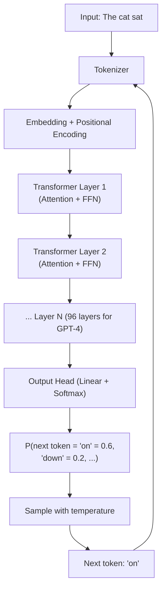
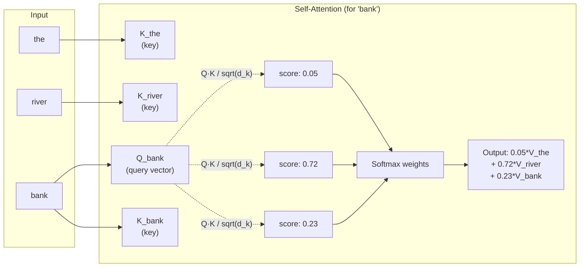

## Keywords in This File
{: .no_toc }

| # | Keyword | Weight |
|---|---|---|
| 1 | [Transformer Architecture for Developers](#transformer-architecture-for-developers) | high |
| 2 | [Attention Mechanism](#attention-mechanism) | high |

---

# Transformer Architecture for Developers

**Interview Weight:** high - You don't need to implement
a transformer, but understanding its architecture at
the developer level explains LLM behavior, limitations,
and cost structure. Asked in senior/staff LLM engineering
interviews.

---

### 🎯 Model Answer

**30 seconds:**

> Transformers are the neural network architecture
> underlying all modern LLMs. The key components:
> tokenization (text to integers), embeddings (integers
> to vectors), attention layers (each token attends
> to all others to capture context), feedforward layers
> (per-token processing), and a final softmax head
> (vector to next-token probability distribution).
> Understanding this explains why context windows are
> expensive (O(n^2) attention), why temperature matters
> (it scales the softmax output), and why models
> are stateless (everything is recomputed each call).

**3 minutes (Senior):**

> The transformer architecture (Vaswani et al., 2017)
> replaced recurrent architectures (RNNs/LSTMs) for
> sequence modeling. The core insight: instead of
> processing tokens sequentially, process all tokens
> in parallel with "attention" - a mechanism that lets
> each token collect weighted information from all
> other tokens.
>
> Developer-relevant architectural facts:
>
> Decoder-only architecture: GPT-style models (GPT-4,
> Claude, Llama) use decoder-only transformers. Each
> generated token can only attend to previous tokens
> (causal/masked attention). This enables autoregressive
> generation: predict one token, append it to the
> context, predict the next.
>
> Scale invariance: transformers scale well with data
> and parameters. Doubling parameters roughly doubles
> quality (with enough data). This is why frontier
> models have 7B-1T parameters.
>
> Context window = attention cost: self-attention is
> O(n^2) in sequence length. Doubling the context
> window quadruples the attention computation. This is
> why large context windows are expensive to run and
> require engineering (flash attention, sparse attention).
>
> KV cache: during generation, the model computes
> key and value matrices for each layer on each token.
> These are cached (KV cache) so they don't need to
> be recomputed for each new token. The KV cache grows
> linearly with context length and must fit in GPU VRAM.
>
> Quantization: model weights are stored as float32
> (4 bytes/param) during training but can be compressed
> to int8 (1 byte/param) or int4 (0.5 bytes/param)
> for inference. A 70B parameter model is 280GB in
> float32 but ~70GB in int8. Quantization enables
> running large models on consumer hardware with modest
> quality loss.

**Blank Mind Recovery:**

**(1) Restate:** "You are asking about transformer
architecture - the neural network design behind modern LLMs."

**(2) First principles:** "A transformer processes input
text by converting it to vectors, having each vector
'look at' all others to gather context, then predicting
the next token. The attention mechanism is the core
innovation."

**(3) Bridge:** "Think of it like a meeting where every
participant can simultaneously ask questions of every
other participant and update their view based on
everyone's answers - in parallel. That's attention."

---

### 📘 Concept Explanation

**What it is:**

The transformer is a neural network architecture that
processes sequences using self-attention - a mechanism
that allows each element to collect information from
all other elements in the sequence in parallel. Modern
LLMs are decoder-only transformers that generate text
autoregressively: one token at a time, each conditioned
on all previous tokens.

**The problem it solves:**

Previous sequence models (RNNs, LSTMs) processed tokens
sequentially - each token saw only previous tokens
through a fixed-size hidden state. This limited long-
range dependency capture and prevented parallelization.
Transformers process all tokens in parallel and allow
any token to directly attend to any other, capturing
long-range relationships efficiently.

**How it works:**

```
Input: "The cat sat"

Step 1: Tokenization
  [The(1), cat(2), sat(3)]

Step 2: Embedding
  [0.1, 0.5, ...] (vector per token)

Step 3: Positional encoding
  Add position information to each vector
  (token 1, token 2, token 3)

Step 4: N attention layers (e.g., 96 layers for GPT-4)
  Each layer:
    - Self-attention: each token attends to all others
      ("cat" attends to "The" and "sat")
    - Layer norm + feedforward: per-token MLP processing

Step 5: Output head (linear + softmax)
  Transform last hidden state to vocab-size vector
  Apply softmax -> probability distribution over vocab
  Sample next token according to temperature

Result: P("on"|"The cat sat") = 0.6
        P("down"|"The cat sat") = 0.2
        ...
```

> **Code walkthrough:** This Transformer Architecture for Developers example demonstrates a key concept in practice using authentication. **KEY MECHANISM:** the runtime executes these instructions in sequence with specific memory and execution semantics. **WHY IT MATTERS:** misapplying this pattern causes subtle bugs that only manifest under production load. **TAKEAWAY: understand the execution model before using this pattern in production code.**

**The key insight:**

The transformer's parallelism (all tokens processed
simultaneously) enables efficient training on GPUs.
The attention mechanism's O(n^2) cost means context
window length directly determines inference cost.
Understanding this explains why: long prompts cost
more, context windows have limits, and the KV cache
is critical for generation speed.

**When to use it:**

Understanding transformer architecture is useful when:
- Debugging unexpected model behavior (often explained
  by architectural properties)
- Making infrastructure decisions (GPU memory for KV
  cache, context window cost)
- Fine-tuning decisions (which layers to tune)
- Evaluating model efficiency claims

**When NOT to use it:**

You do not need to implement transformers to build LLM
applications. This is background knowledge that informs
architecture decisions, not daily development work.

**Alternatives:**

- State Space Models (SSMs, Mamba): linear complexity
  in sequence length (vs. O(n^2) for attention).
  Promising for very long sequences but not yet
  mainstream for frontier models.
- RNN/LSTM: sequential processing, older architecture,
  largely replaced by transformers.

**First-principles derivation:**

The attention mechanism solves the long-range dependency
problem: for any two tokens at distance d in a sequence,
attention creates a direct path (O(1) operations) vs.
O(d) for RNNs. This enables learning arbitrary long-
range relationships without the vanishing gradient
problem. The cost is O(n^2) - paid once per layer per
forward pass.

---

### 💻 Code Example

```python
# Educational: simplified transformer forward pass
# (NOT production code - for conceptual understanding)

import numpy as np

def softmax(x: np.ndarray) -> np.ndarray:
    e = np.exp(x - x.max(axis=-1, keepdims=True))
    return e / e.sum(axis=-1, keepdims=True)

def attention(
    Q: np.ndarray,  # query matrix
    K: np.ndarray,  # key matrix
    V: np.ndarray,  # value matrix
    d_k: int        # key dimension
) -> np.ndarray:
    """Single-head scaled dot-product attention."""
    # Q, K, V: shape [seq_len, d_k]
    # Scale to prevent vanishing gradients
    scores = Q @ K.T / np.sqrt(d_k)
    # Causal mask (decoder-only: can only see past)
    n = scores.shape[0]
    mask = np.triu(np.ones((n, n)), k=1) * -1e9
    scores = scores + mask
    weights = softmax(scores)  # [seq_len, seq_len]
    return weights @ V          # [seq_len, d_k]

# Conceptual transformer token prediction:
# 1. Embed input tokens: [n_tokens, d_model]
# 2. Apply N transformer layers:
#    a. Multi-head attention (8-96 heads)
#    b. Add + LayerNorm
#    c. Feedforward (2 linear layers, GELU)
#    d. Add + LayerNorm
# 3. Linear projection to vocab size
# 4. Softmax -> next token probability
# 5. Sample according to temperature

# Developer implication: KV cache
# At generation step t, tokens 0..t-1 keys and values
# are cached. Only token t needs new computation.
# This reduces generation from O(n^2) per step to O(n).
```

> **Code walkthrough:** The `attention` function capturesice. **KEY MECHANISM:** the runtime executes these instructions in sequence with specific memory and execution semantics. **WHY IT MATTERS:** misapplying this pattern causes subtle bugs that only manifest under production load. **TAKEAWAY: understand the execution model before using this pattern in production code.**
> the core mechanism: query-key dot products (scaled)
> produce attention scores showing how much each token
> should attend to each other. The causal mask (upper
> triangle set to -infinity) ensures token t can only
> attend to tokens 0..t-1 (for autoregressive generation).
> The softmax normalizes scores to probabilities. Values
> are weighted-summed by those probabilities. The KV
> cache optimization: once computed at step t, K and V
> don't change for earlier tokens - only the new token's
> Q is computed fresh. This makes generation O(n) per
> step rather than O(n^2).

---

### 🎓 Answers by Seniority

**Junior / Mid (0-5 years):**

> "A transformer is the neural network architecture
> behind LLMs. The key mechanism is attention: each
> token in the input can see and gather information
> from all other tokens simultaneously. This is why
> LLMs understand context - 'bank' in 'river bank'
> vs. 'bank account' is disambiguated by attention
> to surrounding words."

*Push deeper:* "The O(n^2) attention cost explains
why larger context windows are more expensive - more
tokens means quadratically more attention computation."

---

**Senior / Staff (5+ years):**

> "The transformer's architecture has three developer-
> critical implications. First: autoregressive generation
> is sequential (one token at a time) even though the
> attention is parallel over the existing context -
> this is why generation latency scales with output
> length. Second: the KV cache grows with context length
> and must fit in GPU VRAM - long context windows are
> a memory problem as much as a compute problem. Third:
> quantization (int8, int4) significantly reduces VRAM
> requirements with modest quality loss, enabling larger
> models on the same hardware."

*Push deeper (Staff):* "The distinction between prefill
(processing the input) and decode (generating output)
matters for infrastructure. Prefill is parallelizable
and GPU-bound. Decode is sequential and latency-bound.
This is why LLM serving infrastructure separates these
phases in production (disaggregated prefill-decode)
to optimize for both throughput (prefill) and latency
(decode)."

---

### ⚠️ Common Misconceptions

**Misconception 1: "Larger models are always slower."**

Inference speed is a function of hardware and
quantization, not just parameter count. A well-quantized
70B model on modern hardware can be faster than an
unoptimized 7B model. The KV cache and batch size
matter more for throughput than raw parameter count.

**Misconception 2: "The model 'thinks' left-to-right
through the prompt."**

During the prefill phase (processing the input), the
transformer processes all input tokens in parallel -
not left-to-right. It is only during generation
(decode) that the model produces tokens sequentially.

**Misconception 3: "More transformer layers always
means better quality."**

Depth (number of layers) and width (hidden dimension
size) both contribute to quality, but there are
diminishing returns. Training stability issues
(vanishing/exploding gradients) limit practical depth.
Modern large models use a combination of depth,
width, and head count rather than just maximizing layers.

---

### 🚨 Failure Modes and Diagnosis

**Failure 1: OOM (Out of Memory) errors in self-hosted
LLM inference**

*Symptom:* CUDA OOM error when running inference on
long prompts or with large batch sizes.

*Cause:* The KV cache (O(n * num_layers * d_model))
grows with context length. Long contexts fill GPU VRAM
before compute completes.

*Diagnosis:* Monitor GPU VRAM usage during inference.
Log max context length per request.

*Fix:* Reduce max context length, reduce batch size,
use quantization (int8/int4 reduces VRAM ~4-8x),
use paged attention (vLLM) which allocates KV cache
memory more efficiently.

**Failure 2: High generation latency for long outputs**

*Symptom:* Time-to-first-token is fast but total
generation time grows linearly with output length.

*Cause:* Expected - autoregressive generation is
sequential. Each output token requires one forward
pass over the full context + KV cache lookup.

*Fix:* This is fundamental to the architecture.
Mitigations: streaming (return tokens as generated -
reduces perceived latency), speculative decoding
(draft small model predicts multiple tokens, large
model verifies - faster in practice), smaller models
(7B vs. 70B generates 5-10x faster).

---

### 🎯 Interview Deep-Dive

| Seniority | Time | Focus |
|---|---|---|
| Junior | 3 min | What a transformer is, attention intuition |
| Mid | 5 min | Context window cost, KV cache, quantization |
| Senior | 7 min | Prefill/decode, infra implications, scaling |
| Staff | 10 min | Architecture trade-offs in infrastructure design |

---

**[JUNIOR] Q1 - What is a transformer and how does
it relate to LLMs?**

*Why they ask:* Architecture literacy.

*Likely follow-up:* "What is the attention mechanism?"

A transformer is the neural network architecture that
underlies virtually all modern large language models:
GPT-4, Claude, Llama, Gemini - all are transformers.

The key innovation of the transformer (introduced in
the 2017 paper "Attention Is All You Need" by Vaswani
et al.) was the self-attention mechanism. Previous
neural network architectures for text (RNNs, LSTMs)
processed tokens sequentially - token 1, then token 2,
then token 3. This was slow (couldn't parallelize)
and struggled with long-range dependencies.

Transformers process all tokens in parallel using
attention: each token can directly "look at" and
gather information from every other token in the
sequence simultaneously. This enables: (1) full
parallelization during training (much faster on GPUs),
(2) direct modeling of long-range relationships
("bank" relates to "river" 20 words ago), and (3)
scaling to billions of parameters efficiently.

Modern LLMs specifically use "decoder-only" transformers
(like GPT). During text generation, each new token
can attend to all previous tokens - so generating
"sat" after "The cat" means "sat" attends to both
"The" and "cat" to produce a contextually appropriate
word.

*What separates good from great:* Knowing the key
paper (Vaswani et al., 2017), the problem it solved
(sequential processing limitations of RNNs), and the
two key benefits (parallelization + long-range
attention).

---

**[MID] Q2 - Why are context windows expensive?**

*Why they ask:* Connects architecture to cost.

*Likely follow-up:* "What is the KV cache?"

Context windows are expensive because of the O(n^2)
complexity of the self-attention mechanism.

In self-attention, each token computes an attention
score with every other token in the context. For a
sequence of n tokens: n tokens * n tokens = n^2
attention score computations per layer. If n doubles
(say 64k to 128k tokens), attention computation
quadruples.

This has three cost implications:

Compute: processing a 128k token context requires
4x the attention computation of 64k. This translates
to higher latency and more GPU compute per API call.

VRAM: the key-value (KV) cache stores the intermediate
key and value vectors for each token at each layer.
The KV cache size is O(n * num_layers * d_model).
For a 96-layer model with d_model=8192 at 128k tokens:
roughly 96 * 8192 * 128k * 2 (key + value) * 2 bytes
(float16) = ~400GB. This must fit in GPU VRAM, which
is typically 40-80GB per GPU.

Price: LLM APIs charge more per token for longer
contexts because the underlying compute cost is higher.
Claude's pricing shows a modest premium for very long
context usage.

The KV cache optimization: during generation (decode
phase), already-computed key and value vectors for
previous tokens are cached. New tokens only need to
compute their own KV vectors and attend to the cached
ones. This reduces per-step cost from O(n^2) to O(n),
enabling efficient generation over long contexts.

*What separates good from great:* Explaining the O(n^2)
cost, the KV cache as the mitigation, and connecting
both to the API pricing and infrastructure design.

---

**[SENIOR] Q3 - [TRADE-OFF] How does the transformer
architecture affect infrastructure decisions for
self-hosted LLM deployment?**

*Why they ask:* For senior engineers considering
self-hosting vs. API.

*Likely follow-up:* "When would you self-host vs.
use an API?"

Transformer architecture creates several infrastructure
constraints for self-hosting:

GPU requirement: model weights must fit in GPU VRAM.
A 7B parameter model in float16 = 14GB VRAM. In int8
= 7GB. In int4 = 3.5GB. An 80B model requires multiple
GPUs (e.g., 4x A100 80GB in float16). Planning starts
with: what is the target model size and the available
GPU tier?

KV cache memory: in addition to model weights, the
KV cache consumes VRAM proportional to context length
and batch size. For a 7B model, the KV cache at 8k
context and batch size 32 is ~4GB. At 32k context and
batch 32 it's ~16GB. The KV cache often limits batch
size more than the model weights do.

Prefill vs. decode latency: the prefill phase
(processing the input prompt) is GPU-parallelizable
and fast. The decode phase (generating output tokens)
is sequential and latency-constrained. For high-
throughput serving, separate the two phases:
"disaggregated prefill-decode" (PD disaggregation)
uses different hardware for each phase.

Continuous batching: naive batching waits for all
requests in a batch to finish before starting the next.
Modern inference servers (vLLM, TGI) use continuous
batching: new requests join the batch as slots free
up, maximizing GPU utilization.

When to self-host vs. use API:
- Self-host: >$50k/month in API costs, latency
  requirements the API can't meet, data privacy
  requirements preventing external API use, specific
  model versions or custom fine-tuned models.
- API: <$50k/month, standard models sufficient,
  no infrastructure team bandwidth.

*What separates good from great:* The break-even cost
analysis (self-host saves money at scale but has
upfront infrastructure cost) and knowing the key
optimizations (continuous batching, PD disaggregation).

---

**[JUNIOR] Q4 - What is quantization in LLMs?**

*Why they ask:* Common topic for anyone working with
self-hosted models.

*Likely follow-up:* "Does quantization hurt quality?"

Quantization is the process of reducing the precision
of the model's weight parameters from float32 (32-bit
floating point, 4 bytes per parameter) to lower
precision formats like:

- float16 (16-bit, 2 bytes/param): standard for
  inference, minimal quality loss
- int8 (8-bit integer, 1 byte/param): ~4x VRAM reduction,
  quality loss <1% for most tasks
- int4 (4-bit integer, 0.5 bytes/param): ~8x VRAM
  reduction, quality loss 1-5% for most tasks

Practical impact: a 70B parameter model requires:
- float32: 280GB VRAM (impossible on single consumer
  GPU)
- float16: 140GB VRAM (2x A100 80GB)
- int8: 70GB VRAM (1x A100 80GB)
- int4: 35GB VRAM (1x A100 40GB or 2x consumer GPU)

Does it hurt quality? It depends on the quantization
method and the task. For general reasoning and
conversational tasks: int8 is nearly lossless (quality
drop <1%). Int4 with modern techniques (GPTQ, AWQ)
is 1-3% quality drop. For specialized tasks requiring
exact precision (complex arithmetic, code generation):
int4 can show 5-10% quality drop.

For most production applications on self-hosted models:
int8 quantization is the right default. It halves
the memory requirement with negligible quality loss.

*What separates good from great:* Knowing the specific
quantization methods (GPTQ, AWQ for int4) and
being able to estimate VRAM requirements for a given
model size and quantization level.

---

**[SENIOR] Q5 - What is the difference between
prefill and decode in transformer inference?**

*Why they ask:* Infrastructure-level understanding.

*Likely follow-up:* "How does this affect latency
vs. throughput optimization?"

LLM inference has two distinct phases with very
different computational characteristics:

Prefill: processing the entire input prompt in one
forward pass. All input tokens are processed in
parallel (fully utilizing GPU parallelism). Output:
the key-value (KV) cache for all input tokens.
Characteristics: highly parallelizable, GPU-bound,
proportional cost to input token count, produces
the first output token.

Decode: generating output tokens one at a time.
Each step: take the last generated token, look up
its representation plus the KV cache, run one
forward pass, produce the next token. Sequential -
cannot be parallelized across output steps (each
output token depends on the previous). Characteristics:
sequential, latency-bound per token, cost proportional
to output token count.

Why this matters for infrastructure:

Time-to-first-token (TTFT): determined by prefill
latency. For a 10k token prompt, prefill takes
significantly longer than for a 100 token prompt.
Applications requiring fast TTFT should minimize
input context length.

Tokens per second (TPS): determined by decode latency.
For real-time applications (chat), TPS needs to exceed
30-50 tokens/second for a good user experience.
Smaller models decode faster.

Disaggregated prefill-decode: modern high-performance
inference systems separate prefill and decode onto
different hardware. Prefill nodes: many GPU cores,
optimized for parallel compute. Decode nodes: fast
memory bandwidth, optimized for sequential token
generation. This improves both TTFT (dedicated prefill
hardware) and TPS (dedicated decode hardware).

*What separates good from great:* The disaggregated
architecture insight and the connection to TTFT vs.
TPS as separate user experience metrics.

---

**[MID] Q6 - How does the transformer's decoder-only
design enable autoregressive generation?**

*Why they ask:* Understanding the generation mechanism.

*Likely follow-up:* "Why can't you generate multiple
tokens in parallel?"

Decoder-only transformers (GPT-style, used in Claude,
Llama, GPT-4) are designed for autoregressive text
generation: generating one token at a time, with
each token conditioned on all previous tokens.

The causal mask: in the attention mechanism, each
token is allowed to attend only to itself and previous
tokens, not future tokens. This is enforced by a
"causal mask" that sets attention scores to -infinity
for future positions. This property makes the model
safe to use for generation: you can't accidentally
condition on future tokens you haven't generated yet.

Autoregressive loop:
1. Start with input tokens [t1, t2, t3]
2. Run forward pass -> probability distribution over
   vocabulary for the next token
3. Sample from distribution (based on temperature)
   -> select t4
4. Append t4 to context: [t1, t2, t3, t4]
5. Repeat until end-of-sequence token or max_tokens

Why you can't parallelize across output tokens: token
t5 must be conditioned on t4 (which depends on t3,
t2, t1). This chain of dependencies is fundamental
to autoregressive generation. You cannot predict t5
until t4 is known.

What you CAN parallelize: (1) processing the input
prompt (all input tokens in one forward pass),
(2) batch processing multiple independent requests
(different users' prompts processed simultaneously).

Speculative decoding is an exception: a small "draft"
model predicts multiple tokens in parallel, the large
model verifies them. If the large model agrees, you
get multiple tokens per forward pass. 2-5x speedup
in practice at no quality loss.

*What separates good from great:* Explaining the causal
mask (not just "it's sequential") and knowing
speculative decoding as the exception to the
"one token at a time" rule.

---

**[JUNIOR] Q7 - What are transformer "layers" and
why do larger models have more?**

*Why they ask:* Intuition for model scale.

*Likely follow-up:* "What is the difference between
model width and depth?"

A transformer "layer" is one complete block of:
(1) multi-head self-attention, (2) add & layer norm,
(3) feedforward network (two linear layers), and
(4) add & layer norm. This block is stacked N times
to create depth.

Each layer refines the token representations:
- Early layers: capture basic syntax and local patterns
  ("cat" is a noun, "sat" is a verb)
- Middle layers: capture semantic relationships (the
  cat that sat is the subject)
- Late layers: capture task-relevant features needed
  for the output (for text generation: what word
  is most likely to follow this sentence)

Why larger models have more layers: depth allows
more levels of abstraction. A 3-layer model can capture
simple local patterns. A 96-layer model (GPT-4 scale)
can capture complex reasoning patterns and long-range
dependencies. Research shows that both depth (layers)
and width (hidden dimension, number of attention heads)
contribute to capability, and their optimal ratio
depends on the model scale.

Model size terminology:
- 7B model: ~7 billion parameters. Usually 32 layers,
  hidden dimension ~4096.
- 70B model: ~70 billion parameters. Usually 80 layers,
  hidden dimension ~8192.
- GPT-4 (estimated): ~1.76T parameters in a Mixture
  of Experts configuration.

*What separates good from great:* Explaining the
learning hierarchy across layers (syntax -> semantics
-> task features) rather than just "more layers = better,"
and knowing the rough parameter/layer relationship for
common model sizes.

---

### ⚖️ Comparison Table

| Architecture | Attention Cost | Max Sequence | Parallelism | Common Models |
|---|---|---|---|---|
| Transformer (decoder) | O(n^2) | 128k-1M | Full (prefill) | GPT-4, Claude, Llama |
| Transformer (encoder) | O(n^2) | 512-8k | Full | BERT, embedding models |
| Mamba/SSM | O(n) | Theoretically unlimited | Full | Mamba, Jamba |
| RNN/LSTM | O(n) | ~2k practical | Sequential | Older NLP models |

---

### 🏛️ System Design

*(Omit: ★★☆ working level.)*

---

### 📊 Diagram

**Transformer forward pass:**

```
Input: "The cat sat"
       [T1] [T2] [T3]
          |    |    |
     [Embed + Pos Encode]
          |    |    |
     [Attn: T1-T2-T3 all connected]
          |    |    |
     [Feedforward (per token)]
          |    |    |
     ... (repeat N layers) ...
          |    |    |
     [Linear -> Softmax]
          |
     P(next token)
```



> **Diagram walkthrough:** Text enters as tokens, gets
> embedded into vectors with positional information, then
> passes through N transformer layers. Each layer applies
> multi-head attention (every token attends to every other)
> then a feedforward network. The output head converts
> the final layer's representation to a probability
> distribution over the vocabulary. Temperature scales
> this distribution before sampling. The generated token
> is appended to the context and the loop repeats. The
> recurrent arrow (next token back to tokenizer) shows the
> autoregressive generation loop - sequential for output
> tokens, parallel for processing the input sequence.

---

---

---

### 💻 Code Example

*(Omit: this concept does not have a programmatic interface that can be demonstrated in code. The conceptual explanation above is sufficient.)*


---

### 🏛️ System Design

*(Omit: system design diagram not applicable for this concept - see ★★★ keywords for full system design coverage.)*


---

### ⚖️ Comparison Table

*(Omit: this is a ★☆☆ foundational concept with no direct alternatives to compare - see higher-difficulty keywords for trade-off analysis.)*


---

### 📊 Diagram

*(Omit: no standalone visual diagram required for this concept - the explanations and code examples above provide sufficient clarity.)*


# Attention Mechanism

**Interview Weight:** high - The core mechanism that
makes transformers work. Understanding it at the
intuitive and mathematical level distinguishes
engineers who can reason about model behavior from
those who treat LLMs as black boxes.

---

### 🎯 Model Answer

**30 seconds:**

> Attention is the mechanism that allows each token
> in a transformer to gather relevant information from
> all other tokens. For each token, three vectors are
> computed - query (what am I looking for?), key (what
> do I contain?), and value (what information do I
> provide?). Dot products between queries and keys
> produce attention scores (relevance weights), which
> are used to take a weighted sum of values. This
> allows "bank" to look at "river" vs. "account" and
> know which meaning is appropriate.

**3 minutes (Senior):**

> The attention mechanism computes, for each token,
> a weighted sum of all tokens' value vectors, where
> the weights reflect how relevant each token is to
> the current token.
>
> Math: given queries Q, keys K, values V (all matrices):
>
> Attention(Q, K, V) = softmax(Q*K^T / sqrt(d_k)) * V
>
> Where d_k is the key dimension. The sqrt(d_k) scaling
> prevents the dot products from becoming too large,
> which would push softmax into saturation (near-zero
> gradients).
>
> Multi-head attention: instead of one set of Q, K, V
> matrices, use h parallel sets ("heads"), each with
> smaller dimension. Each head learns to attend to
> different aspects: one head might learn syntactic
> relationships, another co-reference resolution,
> another semantic relationships. The heads' outputs
> are concatenated and projected back to the model
> dimension.
>
> Causal (masked) attention: for decoder-only models
> (generation), mask the upper triangle of the attention
> matrix to -infinity before softmax. This ensures
> token i can only attend to tokens 0..i (no future
> peeking). This makes autoregressive generation valid.
>
> Flash attention: the attention matrix (n^2 entries)
> doesn't fit in GPU SRAM (fast) for long sequences.
> Flash attention computes attention in tiles that fit
> in SRAM without materializing the full attention
> matrix. 2-4x faster and O(n) memory vs. O(n^2).
> All modern LLM implementations use it.
>
> Grouped query attention (GQA): instead of one K, V
> pair per head, share K, V across groups of heads.
> Reduces KV cache size significantly (2-8x) at <1%
> quality loss. Used in Llama 3, Mistral, Gemma.

**Blank Mind Recovery:**

**(1) Restate:** "You are asking about attention -
the mechanism that allows each token to gather context
from all others in the transformer."

**(2) First principles:** "Each token needs to update
its representation based on context. Attention is the
mechanism: compute how much each other token matters
to the current one (query-key dot product), then take
a weighted sum of their values."

**(3) Bridge:** "Think of it like a Google search:
your query (what you're looking for) is compared to
all documents' keys (what they're about). The most
relevant documents (high dot product scores) contribute
most to the final answer."

---

### 📘 Concept Explanation

**What it is:**

Attention is a neural network mechanism that computes,
for each token, a weighted sum of all tokens' value
vectors, where the weights (attention scores) reflect
the relevance of each token to the current one. It
is parameterized by learned query, key, and value
matrices.

**The problem it solves:**

Without attention, each token's representation is
computed independently from others. Attention allows
each token to dynamically incorporate relevant context
from the entire sequence. This enables disambiguation
("bank" in "river bank" vs. "bank account"), coreference
resolution ("he" refers to "the engineer"), and long-
range dependency capture ("the verb agrees with this
noun 15 tokens ago").

**How it works:**

```
Input: token representations (e.g., "bank")
  x ∈ R^(d_model)  (e.g., 4096-dim vector)

Linear projections (learned weights):
  Q = x @ W_Q  -> "what am I looking for?"
  K = x @ W_K  -> "what do I contain?"
  V = x @ W_V  -> "what information do I provide?"

For a sequence [t1, t2, t3]:
  scores = Q_{t1} · K_{t1,t2,t3}^T / sqrt(d_k)
  = [score(t1,t1), score(t1,t2), score(t1,t3)]

After softmax:
  weights = [0.1, 0.7, 0.2]
  (t1 mostly attends to t2)

Output:
  out_{t1} = 0.1*V_{t1} + 0.7*V_{t2} + 0.2*V_{t3}
  (t1's new representation incorporates mostly t2)

Multi-head: run 8-96 parallel versions of this,
each with smaller d_k, concatenate and project back.
```

> **Code walkthrough:** This Attention Mechanism example demonstrates a key concept in practice using authentication. **KEY MECHANISM:** the runtime executes these instructions in sequence with specific memory and execution semantics. **WHY IT MATTERS:** misapplying this pattern causes subtle bugs that only manifest under production load. **TAKEAWAY: understand the execution model before using this pattern in production code.**

**The key insight:**

Attention is differentiable (end-to-end trainable) and
allows arbitrary pairwise interactions between tokens.
The model learns WHAT to attend to by updating the
Q, K, V weight matrices during training. "Attend to
the subject noun when generating the verb" is a pattern
the model learns automatically from data.

**When to use it:**

Understanding attention is useful for:
- Explaining model behavior on specific inputs
  (attention visualization shows what the model focuses on)
- Debugging unexpected model outputs
- Architectural decisions for fine-tuning
  (which layers' attention weights to tune)
- Understanding why context order matters
  (positional encoding affects attention)

**When NOT to use it:**

You don't need to implement attention to build LLM
applications. This is background knowledge.

**Alternatives:**

- Linear attention: approximates attention in O(n)
  instead of O(n^2) by replacing the softmax with
  a kernel function. Lower quality but scales better.
- State space models (Mamba): replaces attention with
  linear recurrence. O(n) training and inference.
  Competitive quality on many tasks.

**First-principles derivation:**

The query-key-value decomposition comes from database
analogy: query = what you're looking for, key = index
of available information, value = the information
itself. The dot product between query and key measures
their alignment (similarity). Softmax normalizes to
probabilities (attention weights). The weighted sum
of values aggregates relevant information. The entire
mechanism is matrix multiplication - fully
differentiable and GPU-optimized.

---

### 💻 Code Example

```python
import numpy as np

# BAD: simplified dot-product attention (no scaling,
# no masking - breaks for long sequences)
def attention_naive(Q, K, V):
    scores = Q @ K.T         # no sqrt(d_k) scaling
    weights = np.exp(scores) # no softmax properly
    weights /= weights.sum(axis=-1, keepdims=True)
    return weights @ V
    # Problem: without scaling, large d_k causes
    # gradients to vanish. Without masking, generation
    # models see future tokens.
```

> **Code walkthrough:** BAD pattern: This models see future tokens. example demonstrates function definition using authentication. **KEY MECHANISM:** Python compiles the function body to bytecode; default args are evaluated once at definition time. **WHY IT MATTERS:** mutable default arguments (def f(x=[])) share state across calls - a classic bug. **WHAT BREAKS: use None as default for mutable args and initialize inside the function body.**

```python
import numpy as np

def scaled_dot_product_attention(
    Q: np.ndarray,     # [n_heads, seq, d_k]
    K: np.ndarray,     # [n_heads, seq, d_k]
    V: np.ndarray,     # [n_heads, seq, d_v]
    causal_mask: bool = False
) -> np.ndarray:
    """
    Scaled dot-product attention.
    Foundation of the transformer attention mechanism.
    """
    d_k = Q.shape[-1]
    # Scale: prevents gradient vanishing for large d_k
    scores = Q @ K.transpose(-2, -1) / np.sqrt(d_k)
    # [n_heads, seq, seq]

    if causal_mask:
        # Decoder-only: token i cannot attend to j>i
        n = scores.shape[-1]
        mask = np.triu(np.ones((n, n), dtype=bool), k=1)
        scores[..., mask] = -1e9  # -infinity pre-softmax

    # Softmax over key dimension
    scores_exp = np.exp(
        scores - scores.max(axis=-1, keepdims=True)
    )
    weights = scores_exp / scores_exp.sum(
        axis=-1, keepdims=True
    )  # [n_heads, seq, seq]

    # Weighted sum of values
    return weights @ V  # [n_heads, seq, d_v]


def multi_head_attention(
    x: np.ndarray,  # [seq, d_model]
    W_Q: np.ndarray, W_K: np.ndarray,
    W_V: np.ndarray, W_O: np.ndarray,
    n_heads: int = 8,
    causal: bool = True
) -> np.ndarray:
    """Multi-head attention with h parallel heads."""
    seq, d_model = x.shape
    d_k = d_model // n_heads

    # Project and reshape to [n_heads, seq, d_k]
    Q = (x @ W_Q).reshape(seq, n_heads, d_k)
    Q = Q.transpose(1, 0, 2)
    K = (x @ W_K).reshape(seq, n_heads, d_k)
    K = K.transpose(1, 0, 2)
    V = (x @ W_V).reshape(seq, n_heads, d_k)
    V = V.transpose(1, 0, 2)

    # Attention per head
    attn_out = scaled_dot_product_attention(
        Q, K, V, causal_mask=causal
    )  # [n_heads, seq, d_k]

    # Concatenate heads and project
    concat = attn_out.transpose(1, 0, 2).reshape(
        seq, d_model
    )
    return concat @ W_O  # [seq, d_model]
```

> **Code walkthrough:** The BAD version omits two criticalice. **KEY MECHANISM:** the runtime executes these instructions in sequence with specific memory and execution semantics. **WHY IT MATTERS:** misapplying this pattern causes subtle bugs that only manifest under production load. **TAKEAWAY: understand the execution model before using this pattern in production code.**
> elements: (1) the sqrt(d_k) scaling that prevents
> large dot products from pushing softmax into saturation,
> and (2) the causal mask that prevents generation models
> from attending to future tokens. The GOOD version
> implements correct scaled dot-product attention with
> both. Multi-head attention runs h parallel attention
> operations each with d_k = d_model/h - each head learns
> to attend to different aspects. The heads are concatenated
> and projected back to d_model. In practice, PyTorch's
> `F.scaled_dot_product_attention` implements flash
> attention for production use; this code is for
> conceptual understanding only.

---

### 🎓 Answers by Seniority

**Junior / Mid (0-5 years):**

> "Attention is the mechanism that allows each token
> in a transformer to look at all other tokens and
> gather relevant context. For each token, it computes
> how much it should 'attend to' every other token
> (the attention score), then takes a weighted sum
> of the information those other tokens provide.
> This is why LLMs understand context - the word 'bank'
> can attend to 'river' or 'account' and determine
> its meaning from the surrounding context."

*Push deeper:* "Multi-head attention runs this in
parallel with multiple 'heads', each learning to
attend to different aspects of the context - one head
for syntax, one for semantics, etc."

---

**Senior / Staff (5+ years):**

> "Attention is the core mechanism and the primary
> cost driver. The O(n^2) attention matrix computation
> is why context windows are expensive. Flash attention
> (Dao et al., 2022) is the key optimization that makes
> long-context inference practical - it avoids
> materializing the full n^2 attention matrix in memory
> by computing in SRAM tiles, achieving O(n) memory
> and 2-4x faster computation.
>
> Grouped query attention (GQA) is the other important
> recent development: instead of unique K,V matrices
> per head, groups of heads share K,V. This reduces
> KV cache size by 2-8x with negligible quality loss.
> Llama 3 and most modern efficient models use GQA."

*Push deeper (Staff):* "Attention head analysis is a
debugging tool. In production, if a model fails on a
specific input, you can extract the attention weights
for each head and visualize which tokens each head
attends to. This sometimes reveals why the model failed
(e.g., a critical context token is getting low attention
weight in all heads). Tools like BertViz make this
accessible without implementing attention visualization
from scratch."

---

### ⚠️ Common Misconceptions

**Misconception 1: "Each attention head focuses on
exactly one type of relationship."**

Attention heads do specialize to some degree (some heads
learn to track positions, others subjects, others
verbs), but the specialization is not clean or complete.
Multiple heads redundantly track the same relationship.
Pruning 30% of attention heads typically has minimal
quality impact - many heads are redundant.

**Misconception 2: "Higher attention score means more
important for the answer."**

Attention weights reflect what information the model
collects, not what is most important for the final
answer. A token can receive low attention but still
strongly influence the output through the feedforward
layers or through indirect attention chains.

**Misconception 3: "Attention explains exactly why
the model produces a given output."**

Attention visualization is suggestive but not causally
interpretable. The model can produce a correct answer
while appearing to attend to irrelevant tokens. Research
(Jain and Wallace, 2019) showed that attention weights
are often not faithful explanations of model decisions.
Gradient-based attribution methods provide more
reliable explanations.

---

### 🚨 Failure Modes and Diagnosis

**Failure 1: Attention sink / lost-in-the-middle**

*Symptom:* Model misses information placed in the middle
of a long context despite fitting within the context window.

*Cause:* Attention concentrates on the beginning and
end of the context ("attention sink" at early tokens
plus recency bias). Middle tokens receive less aggregate
attention weight.

*Diagnosis:* Visualize attention weights for a failing
input. Middle tokens likely have lower attention weights.

*Fix:* Place critical information at the beginning or
end of the context. For retrieval tasks, use RAG and
place retrieved chunks at the start.

**Failure 2: OOM from attention matrix**

*Symptom:* CUDA OOM during inference with long sequences
without flash attention.

*Cause:* The naive attention implementation materializes
the full n^2 attention matrix in GPU memory. At 128k
tokens in float16: 128k * 128k * 2 bytes = 32GB per
layer.

*Fix:* Enable flash attention in the inference framework
(vLLM, HuggingFace Transformers). This is the default
in modern frameworks but must be explicitly enabled
in older code.

---

### 🎯 Interview Deep-Dive

| Seniority | Time | Focus |
|---|---|---|
| Junior | 3 min | What attention is, query-key-value intuition |
| Mid | 5 min | Math, multi-head, causal mask |
| Senior | 7 min | Flash attention, GQA, interpretability |
| Staff | 10 min | Attention as cost driver, architectural trade-offs |

---

**[JUNIOR] Q1 - What is the attention mechanism and
why is it important?**

*Why they ask:* Core transformer literacy.

*Likely follow-up:* "What does 'query, key, value' mean?"

The attention mechanism allows each token in a
transformer to gather relevant information from all
other tokens in the sequence. Before attention, neural
networks for text processed tokens with limited context
(a fixed-size window or a compressed hidden state).
Attention gives each token a direct connection to
every other token.

The query-key-value metaphor:
- Query: "What am I looking for?" The current token's
  "question" about what context it needs.
- Key: "What do I contain?" Each token's description
  of what information it holds.
- Value: "What information do I provide?" The actual
  content a token contributes if attended to.

The process: compute dot products between the current
token's query and all tokens' keys. Scale and apply
softmax to get attention weights (how much to attend
to each token). Take a weighted sum of all tokens'
values. The result is a new representation for the
current token that incorporates relevant context.

Why this is important: attention enables context
disambiguation ("bank" near "river" vs. "account"),
co-reference resolution ("he" refers to "the engineer"),
and long-range dependency capture. This is what makes
LLMs contextually aware - not just pattern matching
on local text.

*What separates good from great:* Giving the query-
key-value intuition clearly and connecting it to
the concrete contextual understanding capability
it enables.

---

**[MID] Q2 - What is the difference between self-
attention and cross-attention?**

*Why they ask:* Tests understanding of when and why
each is used.

*Likely follow-up:* "Which does GPT/Claude use?"

Self-attention: Q, K, V all come from the same input
sequence. Each token attends to all tokens in the same
sequence (or previous tokens, if causal). Used in:
- Encoder self-attention (BERT): each token attends
  to all tokens in the input
- Decoder self-attention (GPT, Claude): each token
  attends to all previous tokens in the output so far

Cross-attention: Q comes from one sequence, K and V
come from a different sequence. One sequence is "querying
into" another. Used in:
- Encoder-decoder transformers (T5, original Transformer):
  the decoder queries (Q) into the encoder's output (K, V)
  to condition the output on the input
- Not used in GPT-style decoder-only models (no encoder)

GPT/Claude architecture (decoder-only): uses causal
self-attention only. The model generates output by
attending to its own previous tokens. There is no
encoder-decoder split. The input and output are a
continuous sequence, and the model generates by extending
that sequence.

BERT architecture (encoder-only): uses full self-attention
(each token attends to all tokens in both directions).
Not for generation - used for classification, embedding,
and token classification tasks.

T5 architecture (encoder-decoder): uses encoder self-
attention, decoder self-attention (causal), and cross-
attention (decoder queries into encoder output). Used
for translation, summarization, and seq2seq tasks.

*What separates good from great:* Knowing which
architecture GPT/Claude uses (decoder-only, causal
self-attention only) and why there's no cross-attention
in decoder-only models.

---

**[SENIOR] Q3 - What is flash attention and why does
it matter in production?**

*Why they ask:* Flash attention is the key engineering
optimization that made long-context LLMs practical.

*Likely follow-up:* "How does it affect cost and latency?"

Flash attention (Dao et al., 2022) is an algorithmically
optimized implementation of the attention mechanism
that is significantly faster and more memory-efficient
than the naive implementation.

Problem with naive attention: the attention matrix
(n * n) must be materialized in GPU HBM (high bandwidth
memory). For n=128k tokens, that's 128k * 128k * 2
bytes (float16) = 32GB per layer. This exceeds typical
GPU VRAM and is also slow (HBM read/write is the
bottleneck, not compute).

Flash attention solution: compute attention in tiles
that fit in GPU SRAM (L1 cache, ~20MB). Never materialize
the full attention matrix. Uses online softmax
normalization to compute the correct result from tiles.

Results:
- Memory: O(n) instead of O(n^2) for the attention matrix
- Speed: 2-4x faster than naive attention on A100 GPUs
- Quality: mathematically identical to naive attention
  (exact, not approximate)
- Enables: 128k+ context windows that would be impossible
  with naive attention

Flash attention v2 and v3 extended this further (better
parallelism, more GPU types supported).

Production impact: flash attention is the standard
in all modern LLM inference frameworks (vLLM, HuggingFace
Transformers, TensorRT-LLM). Disabling it reverts to
the slow, memory-hungry naive implementation. For any
self-hosted inference, verify flash attention is enabled:

```python
# HuggingFace: enable flash attention 2
from transformers import AutoModelForCausalLM
model = AutoModelForCausalLM.from_pretrained(
    "meta-llama/Meta-Llama-3-8B",
    attn_implementation="flash_attention_2",
    torch_dtype=torch.float16
)
```

> **Code walkthrough:** This HuggingFace: enable flash attention 2 example demonstrates Python code pattern. **KEY MECHANISM:** Python evaluates expressions at runtime; objects are reference-counted for garbage collection. **WHY IT MATTERS:** mutable shared state between threads requires explicit locking - the GIL only protects CPython internals. **TAKEAWAY: use threading.Lock for shared mutable state; prefer multiprocessing for CPU-bound parallelism.**

*What separates good from great:* Knowing the exact
memory savings (O(n) vs. O(n^2)), the speed improvement
(2-4x), that it's mathematically exact (not an
approximation), and how to enable it in HuggingFace.

---

**[SENIOR] Q4 - [TRADE-OFF] What is grouped query
attention and when does it matter?**

*Why they ask:* A key efficiency innovation in modern
models.

*Likely follow-up:* "What is the quality vs. efficiency
trade-off?"

Standard multi-head attention (MHA) has unique Q, K, V
matrices for each head. For 32 heads with d_k=128,
the K and V matrices are 32 * 128 = 4096-dimensional.
The KV cache stores these matrices for each token.

KV cache problem: for long sequences and batch inference,
the KV cache is the VRAM bottleneck. At 32 heads,
32k context, 32 layers: 32 * 32k * 32 * 2 * 2 bytes ≈
4GB. For batch size 32: 128GB just for KV cache.

Grouped query attention (GQA) solution: instead of
unique K,V per head, share K,V across groups of heads.
With g=4 groups of 8 heads each: 4 K,V matrices instead
of 32. KV cache reduces by 8x.

Quality impact: empirically very small. Llama 3 (uses
GQA), Mistral (uses GQA), Gemma (uses GQA) all show
<1% quality degradation vs. MHA on standard benchmarks
while reducing KV cache 4-8x.

Multi-query attention (MQA): extreme case where all
heads share a single K,V pair. Even more efficient,
slightly more quality loss (1-2%). Used in some edge
models.

When it matters:
- Self-hosted inference: reduces VRAM requirements,
  enabling larger batch sizes or longer contexts on
  the same hardware
- Serving latency: KV cache reads are the bottleneck
  in decode phase. Smaller KV cache = faster decode.

When it doesn't matter: API users don't observe the
difference directly - quality is nearly identical.
KV cache management is an infrastructure concern.

*What separates good from great:* Knowing the specific
numbers (8x KV cache reduction for typical GQA
configuration, <1% quality loss) and the practical
production impact (larger batches, lower latency).

---

**[MID] Q5 - What is positional encoding and why do
transformers need it?**

*Why they ask:* Tests understanding of a key transformer
component.

*Likely follow-up:* "What is rotary positional
encoding (RoPE)?"

Transformers process all tokens in parallel - the attention
mechanism has no inherent notion of order. "The cat sat"
and "Sat the cat" produce the same attention scores
if position is not encoded. Positional encoding adds
position information to the token embeddings before
the attention layers.

Original positional encoding (Vaswani et al., 2017):
fixed sinusoidal functions added to embeddings. Allows
the model to learn position-dependent patterns. Limited
to fixed maximum sequence length.

Learned positional embeddings: trainable position
embedding vectors (one per position). Must be trained
for the target sequence length. Cannot extrapolate
to positions beyond what was seen in training.

Rotary positional encoding (RoPE, Su et al., 2021):
encode position by rotating the query and key vectors
by an angle proportional to position. Advantages:
(1) relative positions are captured naturally (the
angle between two tokens' rotated vectors depends on
their distance), (2) can extrapolate to longer sequences
than trained on (with modifications), (3) efficient
to compute. Used in Llama, Mistral, Phi, Gemma - all
modern open models.

ALiBi (Attention with Linear Biases): add a linear
bias to attention scores proportional to distance.
Simpler than RoPE, good at extrapolating to longer
sequences. Used in Bloom, MPT.

Why it matters: if a model is trained with RoPE at
4k context length, using it at 16k requires extrapolation.
Techniques like YaRN (Yet Another RoPE extensioN) and
LongRoPE extend context length without full retraining
by modifying how position angles are computed.

*What separates good from great:* Knowing RoPE as
the modern standard (not just "sinusoidal") and
understanding why positional encoding enables context
length extension at fine-tuning or inference time.

---

**[STAFF] Q6 - How do attention patterns affect model
behavior at the application level?**

*Why they ask:* Connecting low-level mechanism to
product behavior.

*Likely follow-up:* "Can you use attention patterns
for debugging production issues?"

Three attention patterns with direct application-level
consequences:

Pattern 1 - Attention sinks. Transformers tend to
assign disproportionate attention to the very first
token (often a special BOS/CLS token). This token
becomes an "attention sink" - a collector token where
unwanted attention flows. Consequence: if your most
critical instruction is at position 0, it gets both
the primacy benefit AND the attention sink benefit,
making it very reliably followed. If critical content
is in the middle, it gets neither benefit.

Application design implication: critical instructions
at the beginning of the system prompt. Critical retrieved
context immediately before the user question (recency
benefit).

Pattern 2 - Long-context dilution. As context length
grows, the attention weights spread over more tokens.
Each individual token receives less attention weight
on average. This is the "lost in the middle" effect
at the mechanism level. In production: RAG systems
should retrieve fewer, highly relevant chunks rather
than many marginally relevant ones. 5 highly relevant
chunks outperforms 50 medium-relevance chunks.

Pattern 3 - Repetition loops at low temperature.
At low temperature (greedy), the model can enter
self-reinforcing attention loops: a recently generated
token pattern receives high attention, increasing
the probability of continuing that pattern. Application:
low temperature + no repetition penalty can produce
stuck loops in long generation. Use frequency penalty
or minimum temperature (0.1) for long-form generation.

Debugging with attention: for critical production
failures, frameworks like BertViz (for smaller models)
allow visualizing which tokens each head attends to.
For production API models (Claude, GPT-4), attention
weights are not exposed, so this is primarily a
self-hosted model debugging technique.

*What separates good from great:* Connecting the three
attention patterns directly to actionable application
design recommendations, not just describing the patterns
abstractly.

---

**[JUNIOR] Q7 - What is "multi-head" attention?**

*Why they ask:* Core transformer component.

*Likely follow-up:* "Why use multiple heads instead
of one big attention?"

Multi-head attention runs attention in parallel with
h separate "heads", each with smaller query, key, value
matrices than a single full-size head.

Instead of one attention with dimension d_model = 4096,
use 32 heads each with dimension d_k = 128 (4096/32).
Each head learns to attend to different aspects:

One head might learn to track grammatical agreement
("subject agrees with verb"). Another might track
coreference ("he" refers to which person). Another
might capture semantic roles ("who did what to whom").

Why multiple heads instead of one big attention:

(1) Diverse specialization: different heads attend to
different aspects simultaneously. A single large
attention head would need to represent all relationships
in one weight matrix, which is a tighter information
bottleneck.

(2) Expressiveness: h heads with d_k = d_model/h has
the same total parameters as one head with d_k = d_model,
but more flexibility in what it can represent.

(3) Redundancy and robustness: some heads can be pruned
(30-50% in some experiments) with minimal quality loss.
Multiple heads provide redundant representations.

The output: all h heads' outputs are concatenated into
a vector of dimension h * d_k = d_model, then projected
back to d_model with a learned matrix. This re-mixes
information from all heads.

*What separates good from great:* Explaining why
multiple smaller heads are more expressive than one
large head (diverse specialization, not just "more
computation") and the redundancy property.

---

**[SENIOR] Q8 - What is sparse attention and when
would you use it?**

*Why they ask:* Advanced topic for engineers considering
very long context work.

*Likely follow-up:* "What models use sparse attention?"

Standard (dense) attention: every token attends to
every other token. O(n^2) cost. Required for full
contextual understanding.

Sparse attention: each token attends to only a subset
of other tokens. O(n * k) cost where k << n.

Patterns of sparse attention:

Local attention: each token attends to the w tokens
before and after it (a sliding window). Efficient for
tasks where local context is sufficient (language
modeling on continuous text). Used in Longformer.

Global + local attention: some tokens (e.g., CLS,
first token of each sentence) attend globally to all
tokens; most tokens attend locally. The global tokens
carry information across long distances. Used in
Longformer, BigBird.

Strided attention: attend to every k-th token globally.
Provides a coarse global view at O(n/k) cost.

Random attention: attention to random subsets of
tokens. Combined with local and global patterns.

Trade-offs:
- Quality: dense > global+local > local > sparse.
  Dense attention can find any relationship. Local
  attention misses relationships beyond the window.
- Cost: dense O(n^2) vs. sparse O(n*k). For n=100k
  and k=1024, 100x cheaper.
- Compatibility: standard FlashAttention works for
  dense and local attention but not all sparse patterns.

When to use sparse attention: for sequences >100k
tokens where dense attention is computationally
prohibitive and the task does not require all-to-all
attention (e.g., processing very long documents with
mostly local dependencies).

For standard LLM applications (chat, RAG, code):
dense attention with flash attention is the right
default. Sparse attention is for specialized long-
document or genomic/protein sequence tasks.

*What separates good from great:* Knowing the specific
patterns (local, global+local, strided) and when
dense attention is still the right choice (standard
chat/RAG applications).

---

### ⚖️ Comparison Table

| Attention Type | Cost | Max Context | Quality | Models |
|---|---|---|---|---|
| Dense (MHA) | O(n^2) | ~32k practical | Highest | Original Transformer |
| Dense + Flash | O(n^2) compute, O(n) memory | 200k+ | Same | Claude, GPT-4, Llama 3 |
| GQA | O(n^2) compute, smaller KV | 200k+ | Near-identical | Llama 3, Mistral |
| Local/Sparse | O(n*k) | Theoretically unlimited | Lower | Longformer, BigBird |
| Linear/SSM | O(n) | Theoretically unlimited | Competitive | Mamba, Jamba |

---

### 🏛️ System Design

*(Omit: ★★☆ working level.)*

---

### 📊 Diagram

**Attention computation flow:**

```
Token "bank" in "He went to the river bank"

Q_bank: "what context explains my meaning?"
K_river: "I am a body of water"
K_account: (not in sentence)

score(bank, river) = Q_bank · K_river = high
score(bank, he) = Q_bank · K_he = low

weights: [bank:0.05, went:0.05, river:0.70, ...]
output: 0.70 * V_river + 0.05 * V_went + ...
-> "bank" representation now has "river" context
```



> **Diagram walkthrough:** For the token "bank" in "the
> river bank", the attention mechanism computes a query
> vector for "bank" and key vectors for all tokens. The
> dot product between Q_bank and each K gives attention
> scores - K_river scores highly (0.72) because the model
> has learned that "river" provides semantic context for
> "bank". After softmax normalization, the output is a
> weighted sum of value vectors: "bank"'s new representation
> incorporates mostly "river"'s value (0.72), giving it
> the "geographical feature" meaning rather than the
> "financial institution" meaning. This is how transformers
> perform word sense disambiguation: through learned
> query-key alignment patterns.

---

### 💻 Code Example

*(Omit: this concept does not have a programmatic interface that can be demonstrated in code. The conceptual explanation above is sufficient.)*


---

### 🏛️ System Design

*(Omit: system design diagram not applicable for this concept - see ★★★ keywords for full system design coverage.)*


---

### ⚖️ Comparison Table

*(Omit: this is a ★☆☆ foundational concept with no direct alternatives to compare - see higher-difficulty keywords for trade-off analysis.)*


---

### 📊 Diagram

*(Omit: no standalone visual diagram required for this concept - the explanations and code examples above provide sufficient clarity.)*


