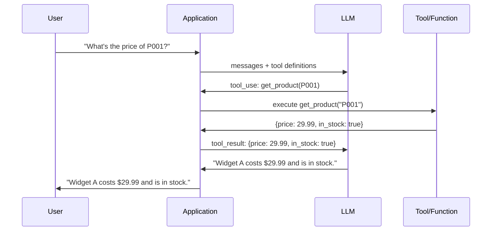
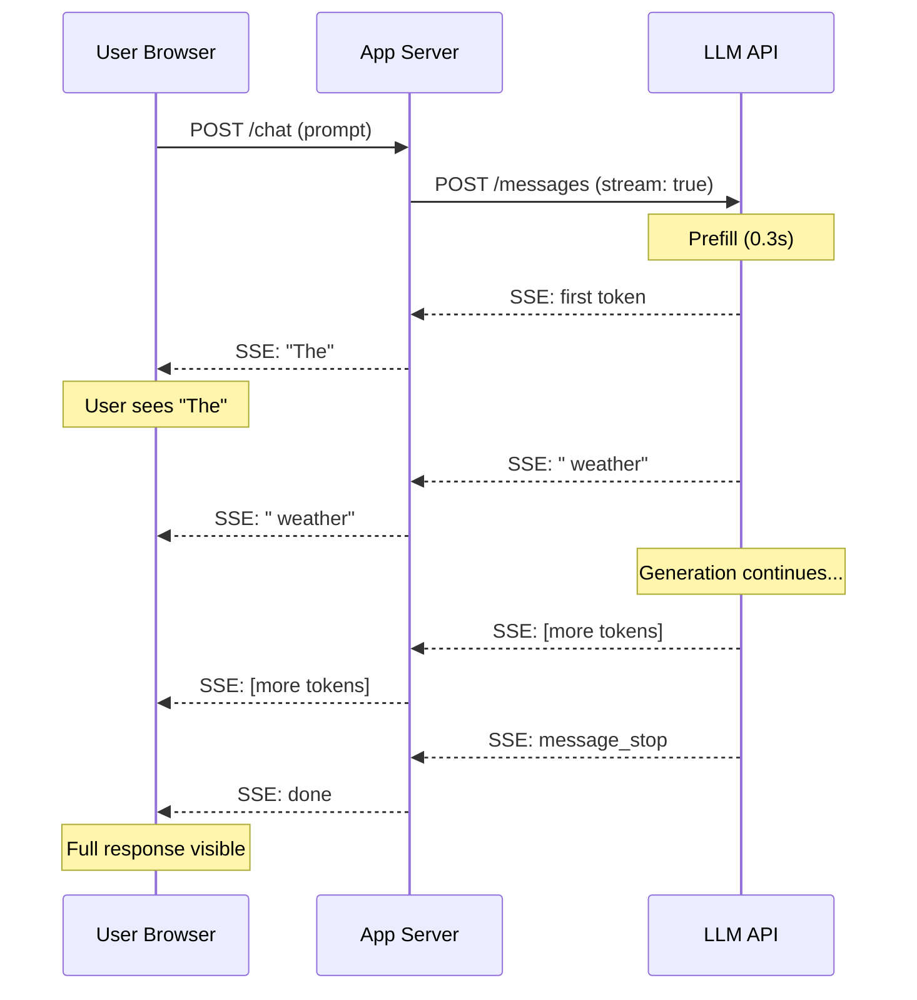

## Keywords in This File
{: .no_toc }

| # | Keyword | Weight |
|---|---|---|
| 1 | [Function Calling and Tool Use](#function-calling-and-tool-use) | critical |
| 2 | [Streaming LLM Responses](#streaming-llm-responses) | high |

---

# Function Calling and Tool Use

**Interview Weight:** critical - The mechanism that
transforms LLMs from answer generators into action
takers. Required knowledge for anyone building agents,
assistants, or LLM-powered features that interact
with APIs, databases, or code.

---

### 🎯 Model Answer

**30 seconds:**

> Function calling (OpenAI terminology) or tool use
> (Anthropic terminology) allows an LLM to invoke
> pre-defined functions rather than only generating
> text. The developer defines a function signature
> (name, description, JSON Schema parameters). When
> the model decides a function should be called,
> it generates a structured tool call with schema-
> conforming arguments. The developer executes the
> function and returns the result to the model.
> The model uses the result to generate its final answer.

**3 minutes (Senior):**

> Tool use extends the LLM from a read-only text
> generator to an action-taking component. The key
> insight: the model decides WHEN to call a tool and
> WITH WHAT ARGUMENTS. The developer decides WHICH
> tools are available and WHAT THEY DO.
>
> The full agentic loop:
>
> 1. System prompt: define role + available tools
> 2. User message: task or question
> 3. LLM decides: answer directly OR call a tool
> 4. If tool call: generate schema-conforming arguments
> 5. Developer executes the function
> 6. Return function result to model as a tool_result
> 7. Model generates final answer using the result
> 8. Repeat (multi-tool calls, agentic loops)
>
> Tool design matters enormously. Good tools are:
> atomic (do exactly one thing), reliable (always return
> structured results, never crash), and well-described
> (the description is all the model has to decide
> whether to call the tool).
>
> Tool selection is a generation problem. The model
> selects tools based on the tool description and the
> current context. A tool with a vague or misleading
> description will be called inappropriately. A tool
> that can fail without a clear error return will
> confuse the model on subsequent steps.
>
> Parallel tool calls: modern LLMs can request multiple
> tool calls in a single response (Claude, GPT-4 support
> this). Execute them in parallel when possible.
>
> Tool use vs. structured output: tool use is the
> recommended way to get structured output because the
> model's tool call arguments are schema-constrained.
> Forced tool calls (tool_choice="required") are the
> standard structured output mechanism.

**Blank Mind Recovery:**

**(1) Restate:** "You're asking about function calling -
how you give an LLM the ability to call functions in
your code."

**(2) First principles:** "An LLM generates text. With
tool use, some of that text is a structured request
to call a function. Your code executes the function
and returns the result. The model incorporates the
result into its next generation."

**(3) Bridge:** "It's like a capable analyst who can
request data from the database team. The analyst (LLM)
knows what question to answer, but needs a tool
(database query) to get the data. They specify what
they need, you retrieve it, they use it."

---

### 📘 Concept Explanation

**What it is:**

Function calling / tool use is an API pattern where
the LLM can generate a structured request to call
a developer-defined function. The developer provides
tool definitions (name, description, JSON Schema for
parameters). When the model determines a tool call
is appropriate, it generates a tool call block with
schema-conforming arguments instead of (or in addition
to) text. The developer executes the function and
returns the result.

**The problem it solves:**

LLMs have a knowledge cutoff, can't access real-time
data, can't execute code, and can't interact with
external systems. Tool use solves all of these by
giving the LLM the ability to request data retrieval,
code execution, API calls, and database queries.

**How it works:**

```
Request (with tool definition):
  tools: [{
    name: "get_weather",
    description: "Get current weather for a city",
    input_schema: {
      type: object,
      properties: {
        city: { type: string, description: "City name" },
        units: {
          type: string,
          enum: ["celsius", "fahrenheit"]
        }
      },
      required: ["city"]
    }
  }]
  messages: [{ role: user, content: "Weather in Tokyo?" }]

Response (model requests tool call):
  content: [{
    type: tool_use,
    name: "get_weather",
    input: { city: "Tokyo", units: "celsius" }
  }]
  stop_reason: tool_use

Developer executes: weather_api.get("Tokyo", "celsius")
  -> {"temp": 22, "conditions": "sunny"}

Follow-up request (with tool result):
  messages: [
    { role: user, content: "Weather in Tokyo?" },
    { role: assistant, content: [tool_use block] },
    { role: user, content: [tool_result: {...}] }
  ]

Final response:
  "The current weather in Tokyo is 22°C and sunny."
```

> **Code walkthrough:** This Function Calling and Tool Use example demonstrates a key concept in practice. **KEY MECHANISM:** the runtime executes these instructions in sequence with specific memory and execution semantics. **WHY IT MATTERS:** misapplying this pattern causes subtle bugs that only manifest under production load. **TAKEAWAY: understand the execution model before using this pattern in production code.**

**The key insight:**

The model's tool selection is an inference problem.
The model reads the tool descriptions and the context,
then generates the most appropriate continuation -
which may be a text answer, a tool call, or multiple
tool calls. The quality of the tool description
determines the quality of tool selection. Treat tool
descriptions as code: precise, unambiguous, with
clear examples.

**When to use it:**

- Real-time data retrieval (weather, prices, news)
- Structured output extraction (forced tool call)
- External API calls (payments, calendar, email)
- Code execution (calculations, data analysis)
- Database queries (user data, product catalog)
- Any task where the LLM's knowledge is insufficient
  or needs verification

**When NOT to use it:**

- Simple Q&A where the model's knowledge is sufficient
- Tasks that are fully specifiable in the system prompt
- Latency-sensitive paths where an extra API call
  is unacceptable (tool calls add at least one round
  trip)

**Alternatives:**

- Inline code execution: some platforms (Claude's
  computer use, OpenAI code interpreter) execute code
  directly rather than via tool call APIs
- RAG: for knowledge retrieval, RAG (pre-retrieved
  documents) may be faster than a tool call that
  queries a vector DB at runtime

**First-principles derivation:**

Tool use is an application of structured output to
function dispatch. The tool call is a schema-conforming
JSON object where the schema is defined by the function
signature. The model learned from training data that
includes many examples of function calls and API
interactions. The decision to call a tool vs. answer
directly is a generation choice conditioned on the
current context and tool descriptions.

---

### 💻 Code Example

```python
import anthropic, os, json
from datetime import datetime

client = anthropic.Anthropic(
    api_key=os.environ["ANTHROPIC_API_KEY"]
)

# BAD: asking model to provide data it doesn't have
def bad_product_lookup(product_id: str) -> str:
    resp = client.messages.create(
        model="claude-haiku-3-5",
        max_tokens=256,
        messages=[{
            "role": "user",
            "content": (
                f"What is the current price and "
                f"stock for product {product_id}?"
            )
        }]
    )
    return resp.content[0].text
    # Model halluccinates prices and stock levels
```

> **Code walkthrough:** BAD pattern: This Model halluccinates prices and stock levels example demonstrates function definition using authentication. **KEY MECHANISM:** Python compiles the function body to bytecode; default args are evaluated once at definition time. **WHY IT MATTERS:** mutable default arguments (def f(x=[])) share state across calls - a classic bug. **WHAT BREAKS: use None as default for mutable args and initialize inside the function body.**

```python
# GOOD: tool use for real-time product lookup

# Simulated product database
PRODUCTS = {
    "P001": {"name": "Widget A", "price": 29.99, "stock": 42},
    "P002": {"name": "Widget B", "price": 49.99, "stock": 0},
}

def get_product_info(
    product_id: str
) -> dict:
    """Real implementation would query a database."""
    product = PRODUCTS.get(product_id)
    if not product:
        return {"error": f"Product {product_id} not found"}
    return {
        "product_id": product_id,
        "name": product["name"],
        "price": product["price"],
        "in_stock": product["stock"] > 0,
        "stock_count": product["stock"],
        "retrieved_at": datetime.utcnow().isoformat()
    }

TOOLS = [{
    "name": "get_product_info",
    "description": (
        "Retrieve current price and stock information "
        "for a product by ID. Use this tool whenever "
        "the user asks about product pricing, "
        "availability, or stock levels. "
        "Do not guess or estimate these values."
    ),
    "input_schema": {
        "type": "object",
        "properties": {
            "product_id": {
                "type": "string",
                "description": (
                    "The product ID (e.g., 'P001'). "
                    "Found in previous messages or "
                    "provided by the user."
                )
            }
        },
        "required": ["product_id"]
    }
}]

def product_assistant(question: str) -> str:
    """
    Product assistant that uses tool calls for
    real-time product data.
    """
    messages = [{"role": "user", "content": question}]

    while True:
        resp = client.messages.create(
            model="claude-haiku-3-5",
            max_tokens=512,
            system=(
                "You are a product information assistant. "
                "Always use the get_product_info tool for "
                "current pricing and availability. "
                "Never guess product data."
            ),
            tools=TOOLS,
            messages=messages
        )

        if resp.stop_reason == "end_turn":
            # Final text response
            return next(
                b.text for b in resp.content
                if hasattr(b, "text")
            )

        if resp.stop_reason == "tool_use":
            # Process all tool calls (may be multiple)
            tool_results = []
            for block in resp.content:
                if block.type != "tool_use":
                    continue
                if block.name == "get_product_info":
                    result = get_product_info(
                        block.input["product_id"]
                    )
                    tool_results.append({
                        "type": "tool_result",
                        "tool_use_id": block.id,
                        "content": json.dumps(result)
                    })

            # Add assistant response and tool results
            messages.append({
                "role": "assistant",
                "content": resp.content
            })
            messages.append({
                "role": "user",
                "content": tool_results
            })
```

> **Code walkthrough:** The BAD version asks the modelice. **KEY MECHANISM:** the runtime executes these instructions in sequence with specific memory and execution semantics. **WHY IT MATTERS:** misapplying this pattern causes subtle bugs that only manifest under production load. **TAKEAWAY: understand the execution model before using this pattern in production code.**
> about current prices - it will hallucinate confidently.
> The GOOD version defines a `get_product_info` tool with
> a clear description including the instruction "Do not
> guess or estimate these values." The agentic loop runs
> until `stop_reason == "end_turn"`: on `tool_use`, it
> extracts all tool call blocks, executes the actual
> database lookup, and appends the results to the message
> history. The model's next generation uses the real data.
> The while loop handles multi-tool-call turns, including
> when the model calls the tool multiple times in sequence.
> Tool description quality is critical: the sentence
> "Do not guess or estimate these values" reduces
> hallucination significantly.

---

### 🎓 Answers by Seniority

**Junior / Mid (0-5 years):**

> "Tool use lets the LLM call functions in your code.
> You define the function's name, description, and
> parameter schema. When the model decides a tool call
> is needed, it generates a JSON object with the
> function name and arguments. You execute the function,
> return the result, and the model uses it in its answer.
> The tool description is how the model knows when to
> call it."

*Push deeper:* "Parallel tool calls: the model can
request multiple tool calls in one response. Execute
them in parallel to minimize latency."

---

**Senior / Staff (5+ years):**

> "Tool use is the building block for agents. The
> quality of the tool definitions determines agent
> reliability. I treat tool definitions as critical
> code: clear single-responsibility name, precise
> description that says when AND when NOT to use the
> tool, explicit required vs. optional parameters with
> examples.
>
> Error handling is critical: if a tool can fail, it
> should return a structured error result (not raise
> an exception). The model needs to process the error
> and decide whether to retry, use a different tool,
> or explain the failure to the user.
>
> Tool use adds latency: each tool call round-trip
> adds API call latency + function execution time.
> For time-sensitive applications, cache tool results
> where possible and minimize the number of tool calls
> in the critical path."

*Push deeper (Staff):* "Tool call logging is essential
for debugging agent behavior. I log: which tools were
called, in what order, with what arguments, and what
results were returned. This enables replay debugging
(run the agent again with the same tool results)
and quality analysis (which tool combinations produce
better answers)."

---

### ⚠️ Common Misconceptions

**Misconception 1: "The model executes the tool."**

The model REQUESTS a tool call - generates the tool
name and arguments. The developer's code executes
the function. This distinction matters for security:
tool execution happens in the developer's environment
with the developer's credentials. The model never
has access to your credentials or code execution
environment.

**Misconception 2: "More tools = better agent."**

More tools increase the model's decision complexity.
With 20+ tools, the model may select the wrong tool
or fail to select any tool. Keep the tool set focused:
5-10 well-designed tools typically outperform 20+
mediocre ones. If more tools are needed, use dynamic
tool selection (inject only relevant tools based on
the current context).

**Misconception 3: "Tool descriptions don't affect
quality significantly."**

Tool description quality has the largest impact on
tool selection accuracy. The model reads the description
to decide whether the tool is appropriate. A description
that says "look up information" is far less reliable
than "retrieve current stock price for a given stock
ticker. Use this ONLY for current prices, not historical
data." Description precision directly determines
when the model calls the tool and when it doesn't.

---

### 🚨 Failure Modes and Diagnosis

**Failure 1: Model calls wrong tool for the task**

*Symptom:* Agent calls a similar-sounding tool when
a different one is correct.

*Cause:* Tool descriptions are too similar or too vague.
The model cannot distinguish between them.

*Diagnosis:* Log all tool calls. Identify the most
common incorrect tool calls. Compare the descriptions
of the confused tools.

*Fix:* Add negative examples to the description:
"Use this tool for X. Do NOT use this for Y (use
[other_tool] instead)." Make descriptions explicitly
differentiate between similar tools.

**Failure 2: Infinite tool call loop**

*Symptom:* Agent calls the same tool repeatedly
with the same arguments, never producing a final answer.

*Cause:* Tool returns an error or ambiguous result.
The model keeps retrying without making progress.

*Diagnosis:* Log the tool call sequence. Is the tool
returning errors? Is the result ambiguous?

*Fix:* (1) Add a max_iterations guard in the agentic
loop. (2) Ensure all tool error responses include
actionable guidance: "Product not found. Do not retry.
Tell the user the product ID was not found in the catalog."

**Failure 3: Tool arguments missing required fields**

*Symptom:* The model omits required arguments in
tool calls, causing function execution failures.

*Cause:* The information needed for the required
argument is not in the context.

*Fix:* Make fields optional if they may not always
be present. Add validation: if the model calls the
tool without required information, return an error
result that tells the model what it needs before
calling the tool again.

---

### 🎯 Interview Deep-Dive

| Seniority | Time | Focus |
|---|---|---|
| Junior | 3 min | What tool use is, the loop |
| Mid | 5 min | Tool design, parallel calls, error handling |
| Senior | 7 min | Agent design, tool selection quality, logging |
| Staff | 10 min | Multi-agent systems, tool governance, security |

---

**[JUNIOR] Q1 - What happens in a tool use API call?**

*Why they ask:* Core mechanism literacy.

*Likely follow-up:* "What is the message structure?"

A tool use API call follows a specific multi-turn
message pattern:

Turn 1 - Initial request: developer sends user message
+ tool definitions. The tool definitions include the
function name, a description, and a JSON Schema for
the input parameters.

Turn 1 - Model response: the model either responds
with text (if no tool call needed) or a tool_use
content block. The tool_use block contains: the tool
name, a unique ID, and the schema-conforming input
arguments. `stop_reason: "tool_use"` signals that
the model wants a tool call executed.

Turn 2 - Developer executes: the developer's code
receives the tool_use block, extracts the function
name and arguments, executes the corresponding
function, and collects the result.

Turn 2 - Tool result sent: the developer appends
both the model's response and a tool_result content
block to the message history. The tool_result contains
the tool_use ID (to match the request) and the result
as a JSON string.

Turn 3 - Final response: the model generates a final
text response using the tool result. This turn typically
has `stop_reason: "end_turn"`.

The full loop in pseudo-code:
```
messages = [user_message]
while True:
    resp = llm.create(messages, tools)
    if resp.stop_reason == "end_turn":
        return resp.text
    execute tool calls
    append resp + tool_results to messages
```

> **Code walkthrough:** This Unknown example demonstrates a key concept in practice. **KEY MECHANISM:** the runtime executes these instructions in sequence with specific memory and execution semantics. **WHY IT MATTERS:** misapplying this pattern causes subtle bugs that only manifest under production load. **TAKEAWAY: understand the execution model before using this pattern in production code.**

*What separates good from great:* Knowing the exact
message structure (both the tool_use and tool_result
must be in the conversation history) and the stop_reason
loop pattern.

---

**[MID] Q2 - How do you design effective tool
descriptions?**

*Why they ask:* Tool description quality is the largest
lever in agent reliability.

*Likely follow-up:* "How many tools should an agent have?"

Effective tool descriptions answer these questions
for the model:

What does the tool do? "Retrieve the current price
and availability of a product from the inventory
system." One sentence. Specific noun phrases, no
vague words like "get information about" or "help with."

When should the model use it? "Use this tool when
the user asks about pricing, availability, or stock
levels for any product." Explicit trigger conditions.

When should the model NOT use it? "Do NOT use this
for historical pricing, product specifications, or
returns. Use [other_tool] for those." Explicit negative
conditions prevent wrong tool selection.

Parameters: describe each parameter's purpose, format
example, and optionality. "product_id: the 5-character
alphanumeric product identifier (e.g., 'P0042'). Required."

Error behavior: "Returns a JSON object. If the product
is not found, returns {'error': 'product_not_found'}.
Do not retry with the same ID if you receive this error."

How many tools: 3-10 focused tools per agent call.
Each tool should be atomic - do exactly one thing.
Compound tools ("get product info and also update
inventory") are harder for the model to use correctly
and harder to debug. If you need more tools, use
dynamic tool injection: provide only the relevant
subset of tools based on the current conversation context.

*What separates good from great:* The negative condition
instruction ("Do NOT use this for...") and knowing
to limit the tool set per call (3-10, not 20+).

---

**[SENIOR] Q3 - [TRADE-OFF] How do you handle parallel
tool calls vs. sequential?**

*Why they ask:* Performance optimization pattern.

*Likely follow-up:* "How does the model decide when
to call multiple tools?"

Modern LLMs (Claude, GPT-4) can request multiple
tool calls in a single response. This enables
parallelism.

Sequential tool calls: the model calls tool A, gets
the result, then calls tool B. Required when tool B
depends on tool A's result. Adds one extra LLM round
trip per sequential dependency.

Parallel tool calls: the model requests both tool A
and tool B in a single response. The developer executes
them concurrently and returns both results. No extra
LLM round trip for the parallel calls.

When the model uses parallel calls: when the tool
calls are independent (neither depends on the other's
output) and when the system prompt encourages it.
Add to the system prompt: "When multiple independent
tools are needed to answer a question, call them
all in a single response."

Implementation with asyncio:

```python
import asyncio

async def execute_tool(name, args):
    if name == "get_weather":
        return await async_weather(args["city"])
    elif name == "get_price":
        return await async_price(args["product_id"])

async def run_tool_calls(tool_use_blocks):
    tasks = [
        execute_tool(b.name, b.input)
        for b in tool_use_blocks
    ]
    return await asyncio.gather(*tasks)
```

> **Code walkthrough:** This Unknown example demonstrates asyncio coroutine definition using async/await. **KEY MECHANISM:** the event loop schedules coroutines; await suspends execution until the awaited future resolves. **WHY IT MATTERS:** blocking call inside async def starves the event loop - all coroutines freeze. **TAKEAWAY: never use blocking I/O (requests, time.sleep) inside async def; use aiohttp, asyncio.sleep.**

Latency impact: 3 sequential tool calls at 200ms each
= 600ms. 3 parallel tool calls = ~200ms. For user-facing
agents, parallel execution is essential.

*What separates good from great:* Implementing parallel
execution with asyncio.gather, the system prompt
instruction to encourage parallel calls, and quantifying
the latency benefit.

---

**[SENIOR] Q4 - [DEBUGGING] How do you debug an agent
that makes wrong tool calls?**

*Why they ask:* Agent debugging is a distinct skill.

*Likely follow-up:* "What is replay debugging?"

Agent debugging with wrong tool calls requires
isolating where the decision went wrong.

Step 1: Log everything. Every agent execution should
log: (1) the full system prompt, (2) the full message
history, (3) every tool call requested (tool name,
arguments, timestamp), (4) every tool result returned,
(5) the final answer.

Step 2: Reproduce the failure deterministically. Set
temperature=0 to eliminate randomness. Use the exact
same inputs. Run twice - if the failure is consistent
at temperature=0, you can debug it reliably.

Step 3: Replay debugging. Capture the full conversation
including tool results. Replay the agent's execution
with the same tool results (mocking the tool calls).
This allows you to re-run the agent without re-executing
actual tool calls (important for idempotency).

Step 4: Isolate the wrong decision. Remove all tools
except the one being called incorrectly. Does the
model still call it incorrectly? If yes, the tool
description is at fault (the model thinks this is
the right tool even in isolation). If no, another
tool is competing and the descriptions are too similar.

Step 5: Compare tool descriptions. If two tools are
confused, print their descriptions side-by-side.
The overlap in language is the source of confusion.
Add disambiguation language to both descriptions.

Step 6: LLM-as-judge evaluation. After fixing the
description, run the agent on 50 test cases and use
an LLM to judge whether each tool call was appropriate.
This gives you a tool selection accuracy metric.

*What separates good from great:* The replay debugging
pattern (decouple tool execution from agent logic),
the isolation test (one tool at a time), and having
a measurable tool selection accuracy metric.

---

**[MID] Q5 - How do you handle tool execution errors
in an agentic loop?**

*Why they ask:* Error handling in agents is non-trivial.

*Likely follow-up:* "What is the difference between
a tool error and an exception?"

Tool errors require specific handling to avoid agent
failure modes:

Principle: tools should never raise exceptions in the
agent loop. Exceptions break the loop. Tools should
always return a result - either the success result
or a structured error result.

Structured error returns:
```python
def get_product(product_id: str) -> dict:
    try:
        product = db.get(product_id)
        if not product:
            return {
                "error": "not_found",
                "message": f"Product {product_id} not found.",
                "guidance": (
                    "Do not retry. Tell the user the "
                    "product was not found."
                )
            }
        return product
    except Exception as e:
        return {
            "error": "system_error",
            "message": "Database unavailable.",
            "guidance": "Try again once. If still failing, "
                "apologize and suggest the user try later."
        }
```

> **Code walkthrough:** This Unknown example demonstrates function definition using error handling. **KEY MECHANISM:** Python compiles the function body to bytecode; default args are evaluated once at definition time. **WHY IT MATTERS:** mutable default arguments (def f(x=[])) share state across calls - a classic bug. **TAKEAWAY: use None as default for mutable args and initialize inside the function body.**

The guidance field in error returns: the model reads
the tool result and uses the guidance to decide the
next step. Without guidance, the model may retry
endlessly or give up without informing the user.

Retry policy: in the agent loop, add a max_retries
counter per tool. If a tool returns the same error
twice, do not call it a third time. Pass the error
to the model with a message that no more retries
are available.

User-visible error reporting: when a tool error
prevents task completion, the model should inform
the user clearly. Add to the system prompt: "If a
tool returns an error that prevents completing the
task, explain to the user what happened and what
they can do next."

*What separates good from great:* The guidance field
pattern in error returns (the model acts on the guidance
to decide next steps) and the max_retries guard.

---

**[STAFF] Q6 - How do you design a multi-agent system
using tool calls?**

*Why they ask:* Architecture at scale.

*Likely follow-up:* "What are the security
considerations for multi-agent tool use?"

Multi-agent systems use tool calls as the coordination
mechanism: one agent's tool call invokes another agent.

Orchestrator-worker pattern: an orchestrator agent
decomposes a complex task into subtasks. Each subtask
is dispatched to a specialized worker agent via tool
call. The orchestrator collects results and synthesizes
the final answer.

```
Orchestrator tools:
  - research_agent(query: str) -> research results
  - coding_agent(task: str) -> code output
  - review_agent(code: str) -> review feedback

Orchestrator system prompt:
  "You coordinate a team of specialized agents.
  For research tasks, use research_agent.
  For code generation, use coding_agent.
  For code review, use review_agent.
  Compose their results into the final deliverable."
```

> **Code walkthrough:** This Unknown example demonstrates a key concept in practice. **KEY MECHANISM:** the runtime executes these instructions in sequence with specific memory and execution semantics. **WHY IT MATTERS:** misapplying this pattern causes subtle bugs that only manifest under production load. **TAKEAWAY: understand the execution model before using this pattern in production code.**

Agent-as-tool implementation: each worker agent is
wrapped in a function that runs the full agent loop
(including the agent's own tool calls) and returns
the final result. The orchestrator sees only the
worker's input/output, not its internal tool calls.

Security boundaries: each agent should have the
minimum permissions needed. The orchestrator should
not have direct access to production databases. Worker
agents should have scoped access. Multi-agent systems
are a privilege escalation risk: if the orchestrator
is prompt-injected, it may instruct worker agents
to take unauthorized actions.

Defense: define a tool call approval layer for
destructive operations (write, delete, external API
calls). The approval layer checks: is this call
authorized by the original user request? If not,
reject.

Observability: log the full agent call tree (orchestrator
calls, worker calls, worker tool calls). Without this,
debugging multi-agent failures is impossible. Attach
a request ID that propagates through all agent and
tool calls.

*What separates good from great:* The prompt injection
privilege escalation risk (orchestrator injected ->
worker agents take unauthorized actions) and the
approval layer pattern for destructive operations.

---

**[JUNIOR] Q7 - What is the difference between tool
use and RAG?**

*Why they ask:* These are often conflated.

*Likely follow-up:* "When would you use both?"

Both tool use and RAG bring external information to
the LLM, but through different mechanisms for different
purposes.

RAG (Retrieval-Augmented Generation): at request time,
a retrieval system searches a pre-indexed document
store and injects the relevant documents into the
context window. The LLM uses the documents as context.
The LLM has no control over what is retrieved - the
retrieval is driven by the query.

Tool use: the LLM proactively decides to call a tool
to retrieve information. The LLM controls WHEN to
call the tool, WHICH tool to call, and WHAT arguments
to pass. The retrieval is driven by the model's
reasoning about what information it needs.

Key differences:
- Control: RAG retrieval is automatic (happens before
  the LLM runs). Tool use retrieval is model-driven
  (the model decides to call it).
- Specificity: RAG retrieves semantically similar
  documents. Tool use can retrieve exact records
  (e.g., get_order(order_id="12345")).
- Latency: RAG adds one retrieval round trip (parallel
  with the LLM call possible). Tool use adds at least
  one LLM round trip.

When to use both: use RAG to inject background context
(product documentation, policy) automatically, and
tool use for specific data lookups (user account,
order status). Combined: the system prompt includes
RAG-retrieved policy docs, and the agent uses tool
calls for specific database queries.

*What separates good from great:* The control distinction
(RAG is automatic, tool use is model-driven) and the
specificity distinction (RAG = semantic similarity,
tool use = exact record lookup).

---

### ⚖️ Comparison Table

| Mechanism | Model Control | Specificity | Latency | Use Case |
|---|---|---|---|---|
| RAG | None (automatic) | Semantic similarity | Low (parallel possible) | Background context |
| Tool Use | Full (model decides) | Exact queries | Medium (1+ round trips) | Real-time data, actions |
| Fine-tuning | N/A | N/A | None (in weights) | Stable domain knowledge |

---

### 🏛️ System Design

*(Omit: ★★☆ working level.)*

---

### 📊 Diagram

**Tool use agentic loop:**

```
[User] -> [LLM] -> tool_use block?
              NO -> final text answer
              YES -> [Developer code: execute tool]
                  -> tool_result -> [LLM] -> repeat
```



> **Diagram walkthrough:** The user's question triggers
> an initial LLM call with the tool definitions attached.
> The model determines a tool call is needed (the question
> requires real-time data) and returns a tool_use block
> instead of a text answer. The application executes
> the corresponding function and returns the result as
> a tool_result in the next message. The model receives
> the real data and generates the final grounded answer.
> The key architectural insight: the LLM never executes
> code directly - it only generates structured requests.
> All execution happens in the developer's code. This
> separation maintains security boundaries and enables
> the developer to validate and sanitize tool arguments
> before execution.

---

---

---

### 💻 Code Example

*(Omit: this concept does not have a programmatic interface that can be demonstrated in code. The conceptual explanation above is sufficient.)*


---

### 🏛️ System Design

*(Omit: system design diagram not applicable for this concept - see ★★★ keywords for full system design coverage.)*


---

### ⚖️ Comparison Table

*(Omit: this is a ★☆☆ foundational concept with no direct alternatives to compare - see higher-difficulty keywords for trade-off analysis.)*


---

### 📊 Diagram

*(Omit: no standalone visual diagram required for this concept - the explanations and code examples above provide sufficient clarity.)*


# Streaming LLM Responses

**Interview Weight:** high - Required for production
chat applications. Streaming transforms user experience
from "wait 5 seconds for a response" to "see the
response as it's typed." A production LLM engineer
must know how to implement it correctly.

---

### 🎯 Model Answer

**30 seconds:**

> Streaming delivers LLM output tokens to the client
> as they are generated, rather than waiting for the
> complete response. The user sees text appear word
> by word, dramatically improving perceived latency.
> Implemented via Server-Sent Events (SSE) or
> WebSockets. Key concerns: handling partial JSON
> for structured output, error handling mid-stream,
> and token buffering for rate-limited UI updates.

**3 minutes (Senior):**

> Streaming is critical for production chat applications
> because LLM generation latency is dominated by
> time-to-complete-response (TTCR), not time-to-first-
> token (TTFT). A 500-token response at 50 tokens/second
> takes 10 seconds to generate. Without streaming:
> the user sees a 10-second blank screen, then the
> full response appears. With streaming: the user sees
> the first tokens in 200-300ms (TTFT), and the
> response progressively fills in.
>
> Implementation: the LLM API sends Server-Sent Events
> (SSE). Each event contains a delta with the new tokens.
> The client accumulates these deltas into the full
> response. Final event signals completion.
>
> Server-side concerns:
> - Long-lived HTTP connections: streaming requires
>   HTTP/1.1 keep-alive or HTTP/2. Load balancers must
>   support long-lived connections (configure timeout >
>   model max generation time).
> - Backpressure: the client must be able to consume
>   tokens at least as fast as the model generates
>   them. Buffer on the server side if needed.
> - Error handling: errors can occur mid-stream
>   (network loss, rate limits). The client must handle
>   partial responses gracefully.
>
> Structured output + streaming: streaming and structured
> output (tool use) can be combined. The model streams
> tool call arguments token-by-token. The full tool call
> is assembled from the stream before execution. The
> model does not execute tool calls mid-stream.
>
> UI rendering: don't render every individual token event
> in React/Vue - this causes excessive re-renders.
> Buffer tokens and update the UI every 50-100ms (rAF
> schedule or debounce).

**Blank Mind Recovery:**

**(1) Restate:** "You're asking about streaming - how
to deliver LLM output to the user as it's generated
rather than waiting for the complete response."

**(2) First principles:** "LLMs generate tokens
sequentially. Each token is available the moment
it's generated. Streaming forwards each token to
the client immediately rather than accumulating them
and sending all at once."

**(3) Bridge:** "Streaming is like watching a document
being typed in real-time vs. waiting for the entire
document to be saved before you can read it."

---

### 📘 Concept Explanation

**What it is:**

Streaming is an API pattern where the LLM provider
sends response tokens to the client incrementally
as they are generated, using Server-Sent Events (SSE)
or WebSocket protocol. The client renders tokens
progressively rather than waiting for the complete
response.

**The problem it solves:**

Without streaming, the user waits for the entire
LLM generation to complete before seeing any output.
At 30-50 tokens/second, a 300-token response takes
6-10 seconds. This is unacceptable for interactive
chat. Streaming exposes the inherently incremental
nature of LLM generation to the user.

**How it works:**

```
STREAMING PROTOCOL (Server-Sent Events):

POST /messages (with stream: true)

Server sends events:
  event: message_start
  data: {"message": {"id": "...", ...}}

  event: content_block_delta
  data: {"delta": {"type": "text_delta", "text": "The"}}

  event: content_block_delta
  data: {"delta": {"type": "text_delta", "text": " weather"}}

  ... (one event per generated token or small batch)

  event: message_stop
  data: {}

CLIENT:
  for each event:
    if content_block_delta:
      display_text += delta.text
      update_ui(display_text)
```

> **Code walkthrough:** This Streaming LLM Responses example demonstrates a key concept in practice using SQL. **KEY MECHANISM:** the runtime executes these instructions in sequence with specific memory and execution semantics. **WHY IT MATTERS:** misapplying this pattern causes subtle bugs that only manifest under production load. **TAKEAWAY: understand the execution model before using this pattern in production code.**

**The key insight:**

Streaming is primarily a UX optimization, not a quality
or cost optimization. The total tokens generated and
cost are identical with or without streaming. The
benefit is purely in perceived latency: TTFT (time
to first token) instead of TTCR (time to complete
response) as the user-visible latency.

**When to use it:**

Any interactive, user-facing application with responses
longer than 50 tokens. Chat interfaces, code generation,
long-form writing. Streaming makes the response feel
instant even when total generation time is long.

**When NOT to use it:**

Batch processing pipelines where output is consumed
by code. Server-to-server integrations where the
client processes the complete response. Tool call
evaluation (you need the full tool call before
you can execute it).

**Alternatives:**

- Polling: client polls for generation status. Higher
  server load, worse UX than streaming.
- WebSocket: bidirectional streaming, better for
  multi-turn conversations but more complex to implement
  than SSE.

---

### 💻 Code Example

```python
import anthropic, os

client = anthropic.Anthropic(
    api_key=os.environ["ANTHROPIC_API_KEY"]
)

# BAD: wait for complete response (blocking)
def generate_blocking(prompt: str) -> str:
    resp = client.messages.create(
        model="claude-haiku-3-5",
        max_tokens=1024,
        messages=[{"role": "user", "content": prompt}]
    )
    return resp.content[0].text
    # User waits 5-15 seconds with no feedback
```

> **Code walkthrough:** BAD pattern: This User waits 5-15 seconds with no feedback example demonstrates function definition using authentication. **KEY MECHANISM:** Python compiles the function body to bytecode; default args are evaluated once at definition time. **WHY IT MATTERS:** mutable default arguments (def f(x=[])) share state across calls - a classic bug. **WHAT BREAKS: use None as default for mutable args and initialize inside the function body.**

```python
# GOOD: streaming with proper event handling
def generate_streaming(prompt: str) -> str:
    """
    Stream response tokens to stdout in real-time.
    Returns the complete accumulated response.
    """
    full_response = ""
    with client.messages.stream(
        model="claude-haiku-3-5",
        max_tokens=1024,
        messages=[{"role": "user", "content": prompt}]
    ) as stream:
        for text in stream.text_stream:
            print(text, end="", flush=True)
            full_response += text
    print()  # newline after streaming completes
    return full_response

# PRODUCTION: streaming with FastAPI (SSE endpoint)
from fastapi import FastAPI
from fastapi.responses import StreamingResponse
import json

app = FastAPI()

async def token_stream_generator(prompt: str):
    """
    Async generator for Server-Sent Events.
    Yields SSE-formatted events for each token.
    """
    try:
        with client.messages.stream(
            model="claude-haiku-3-5",
            max_tokens=1024,
            messages=[{"role": "user", "content": prompt}]
        ) as stream:
            for text in stream.text_stream:
                # SSE format: "data: {...}\n\n"
                yield f"data: {json.dumps({'text': text})}\n\n"
        # Send completion event
        yield f"data: {json.dumps({'done': True})}\n\n"
    except Exception as e:
        yield f"data: {json.dumps({'error': str(e)})}\n\n"

@app.post("/chat/stream")
async def stream_chat(body: dict):
    prompt = body.get("prompt", "")
    return StreamingResponse(
        token_stream_generator(prompt),
        media_type="text/event-stream",
        headers={
            "Cache-Control": "no-cache",
            "Connection": "keep-alive",
            "X-Accel-Buffering": "no"  # Disable nginx buffering
        }
    )
```

> **Code walkthrough:** GOOD pattern: This Send completion event example demonstrates asyncio coroutine definition using Stream. **KEY MECHANISM:** the event loop schedules coroutines; await suspends execution until the awaited future resolves. **WHY IT MATTERS:** blocking call inside async def starves the event loop - all coroutines freeze. **TAKEAWAY: never use blocking I/O (requests, time.sleep) inside async def; use aiohttp, asyncio.sleep.**

```python
# STREAMING WITH TOOL USE: accumulate tool calls
# before execution (cannot execute mid-stream)
def streaming_with_tools(
    messages: list, tools: list
) -> tuple[str, list]:
    """
    Stream text + accumulate tool calls.
    Returns (text_response, tool_calls_list).
    """
    text = ""
    tool_calls = []

    with client.messages.stream(
        model="claude-haiku-3-5",
        max_tokens=1024,
        tools=tools,
        messages=messages
    ) as stream:
        for event in stream:
            # Accumulate text tokens as they arrive
            if hasattr(event, 'delta') and \
               hasattr(event.delta, 'text'):
                text += event.delta.text
                print(event.delta.text, end="", flush=True)

        # Get final message (includes complete tool calls)
        final = stream.get_final_message()
        for block in final.content:
            if block.type == "tool_use":
                tool_calls.append(block)

    return text, tool_calls
```

> **Code walkthrough:** The BAD version blocks untilice. **KEY MECHANISM:** the runtime executes these instructions in sequence with specific memory and execution semantics. **WHY IT MATTERS:** misapplying this pattern causes subtle bugs that only manifest under production load. **TAKEAWAY: understand the execution model before using this pattern in production code.**
> the full response arrives. The GOOD streaming version
> prints each token immediately using `stream.text_stream`.
> The FastAPI SSE endpoint wraps the stream in an async
> generator, formatting each token as an SSE event
> (`data: {...}\n\n`). The `X-Accel-Buffering: no` header
> prevents nginx from buffering the SSE stream (a common
> production gotcha). The tool use streaming version
> accumulates text tokens for display but waits for
> `get_final_message()` before extracting tool calls -
> you cannot execute a tool call from a partial stream.

---

### 🎓 Answers by Seniority

**Junior / Mid (0-5 years):**

> "Streaming delivers LLM tokens to the client as
> they are generated, so the user sees the response
> building in real-time instead of waiting for the
> complete response. This dramatically improves perceived
> latency for chat applications. Implemented with
> Server-Sent Events. The model generates at the same
> speed - streaming changes when the client receives
> the output, not how fast it's generated."

*Push deeper:* "Streaming is a UX optimization, not
a cost optimization. The total tokens generated and
API cost are identical with or without streaming."

---

**Senior / Staff (5+ years):**

> "Streaming is mandatory for any chat interface.
> The infrastructure challenges are more interesting
> than the API call: (1) load balancers must be
> configured for long-lived connections (no 30-second
> timeouts that kill streaming responses), (2) nginx
> buffering must be disabled (X-Accel-Buffering: no),
> (3) client-side rendering must batch UI updates
> (every token event triggers a re-render in naive
> React implementations - use requestAnimationFrame
> or debounce to limit renders to 60fps).
>
> Streaming + tool use is the production pattern for
> agents: stream the text response while accumulating
> tool call arguments silently. When streaming completes,
> execute tool calls asynchronously, then stream the
> next turn."

*Push deeper (Staff):* "Streaming metrics: measure
time-to-first-token (TTFT) and tokens-per-second (TPS)
separately. TTFT is the user-perceived response start
time. TPS determines how smoothly the text appears.
For most users, TTFT < 500ms feels instant. TPS > 20
tokens/second feels smooth. Monitor both in production
as separate SLOs."

---

### ⚠️ Common Misconceptions

**Misconception 1: "Streaming is faster than non-streaming."**

Streaming has the same total generation time as non-
streaming. The model generates at the same rate
regardless of streaming mode. Streaming improves
TTFT (time to first token visible to user) but does
not reduce TTCR (total completion time). The perception
of speed improves; actual generation speed does not.

**Misconception 2: "You can process tool calls mid-stream."**

Tool call arguments are streamed token-by-token. You
cannot execute a tool call until the complete arguments
have been received. The safe pattern: accumulate the
full stream, then extract and execute tool calls from
the final message. Do not attempt to parse and execute
tool call arguments from partial stream events.

**Misconception 3: "Streaming works the same on all
infrastructure."**

Streaming breaks silently when: (1) nginx or a reverse
proxy buffers the response (enable pass-through mode),
(2) load balancer has a short timeout (60s is insufficient
for long generations), (3) gzip compression is enabled
on the streaming endpoint (buffering undermines streaming).
Always test streaming specifically in the production
infrastructure configuration.

---

### 🚨 Failure Modes and Diagnosis

**Failure 1: Streaming works locally but not in
production**

*Symptom:* Streaming works in development but the
production endpoint delivers the full response at once.

*Cause:* nginx or CDN is buffering the response.

*Diagnosis:* Check response headers in production.
Look for Transfer-Encoding: chunked (streaming) vs.
Content-Length (buffered).

*Fix:* Add `X-Accel-Buffering: no` header to disable
nginx buffering. Disable gzip on the streaming endpoint.
Configure the load balancer timeout to exceed the maximum
generation time.

**Failure 2: Client rendering performance degrades
on long responses**

*Symptom:* UI becomes sluggish when streaming long
responses (>1000 tokens). CPU usage spikes.

*Cause:* Each SSE event triggers a React re-render.
At 50 tokens/second, this is 50 state updates/second,
each triggering a re-render.

*Fix:* Buffer incoming tokens. Update UI state at
most 30-60 times per second (requestAnimationFrame).
Accumulate tokens between frames, update once per
frame.

**Failure 3: Mid-stream error handling**

*Symptom:* Stream connection drops mid-generation.
The user sees partial text with no error indication.

*Cause:* Network interruption, rate limit error,
or model generation error mid-stream.

*Fix:* Implement reconnect logic for SSE. If the
stream closes before a completion event, display
a partial response indicator. Track the token offset
so reconnection can resume from where it left off
(if the API supports resume, else restart).

---

### 🎯 Interview Deep-Dive

| Seniority | Time | Focus |
|---|---|---|
| Junior | 3 min | What streaming is, SSE basics |
| Mid | 5 min | Implementation, infrastructure gotchas |
| Senior | 7 min | Production issues, streaming + tools |
| Staff | 10 min | Metrics, architecture, backpressure |

---

**[JUNIOR] Q1 - What is streaming and why is it
important for chat applications?**

*Why they ask:* Core UX pattern for LLM apps.

*Likely follow-up:* "What is SSE?"

Streaming is the pattern of delivering LLM output
to the client token-by-token as it is generated,
rather than waiting for the full response to complete.

Why it matters for chat applications: LLM generation
takes time - a 400-token response at 40 tokens/second
takes 10 seconds. Without streaming, the user stares
at a blank screen for 10 seconds, then the full
response appears instantly. This feels slow and broken.

With streaming, the user sees the first token in
200-500ms (TTFT - time-to-first-token). The response
appears word by word over the same 10 seconds. This
feels interactive and responsive, even though the
total time is identical.

SSE (Server-Sent Events): the standard protocol for
streaming. The server keeps the HTTP connection open
and sends newline-delimited event messages:
```
data: {"text": "The"}\n\n
data: {"text": " weather"}\n\n
data: {"done": true}\n\n
```
> **Code walkthrough:** This Get final message (includes complete tool calls) example demonstrates a key concept in practice. **KEY MECHANISM:** the runtime executes these instructions in sequence with specific memory and execution semantics. **WHY IT MATTERS:** misapplying this pattern causes subtle bugs that only manifest under production load. **TAKEAWAY: understand the execution model before using this pattern in production code.**

The client subscribes to the event stream with the
browser's EventSource API or a library.

User experience impact: streaming is the difference
between a product that feels like a chatbot (streaming)
and one that feels like a slow form submission (non-
streaming). For any interactive text generation feature,
streaming is non-negotiable.

*What separates good from great:* The distinction
between TTFT (latency the user perceives) vs. TTCR
(actual generation time) - they are different metrics
and streaming improves only the former.

---

**[MID] Q2 - What are the infrastructure requirements
for streaming in production?**

*Why they ask:* Streaming has specific infrastructure
requirements that are non-obvious.

*Likely follow-up:* "What is backpressure in streaming?"

Infrastructure requirements for SSE streaming:

Long-lived connection support: the HTTP connection
stays open for the duration of the generation (10-60
seconds). Load balancers and proxies have connection
timeout defaults that may be shorter. Configure:
- ALB (AWS): idle timeout ≥ 120s
- nginx proxy_read_timeout ≥ 120s
- CloudFront: origin response timeout ≥ 120s

No response buffering: nginx and CDNs buffer responses
by default. Buffering accumulates the full response
before forwarding, destroying the streaming effect.
Disable for SSE endpoints:
- nginx: `proxy_buffering off;`
- Application response header: `X-Accel-Buffering: no`
- CDN: disable caching + buffering for /stream/* paths

No gzip on streaming endpoints: gzip requires the
full response before compression, destroying streaming.

HTTP/1.1 or HTTP/2: SSE requires chunked transfer
encoding (HTTP/1.1) or HTTP/2 DATA frames. HTTP/1.0
does not support SSE.

Backpressure: the server generates tokens faster than
the client can consume them if the client connection
is slow. The server must implement backpressure:
slow down generation if the client buffer is full.
In FastAPI/asyncio: the async generator naturally
applies backpressure because it awaits each write
to the response.

*What separates good from great:* The nginx buffering
disable configuration (the most common production
streaming failure) and understanding that backpressure
is handled by the async generator pattern.

---

**[SENIOR] Q3 - How do you implement streaming with
tool use in a production chat application?**

*Why they ask:* Combining streaming and tool use is
the production pattern for agents.

*Likely follow-up:* "How do you handle the latency
between streaming and tool execution?"

Streaming + tool use requires managing two different
modes in the same response:

Text streaming: tokens arrive one by one, displayed
in real-time to the user.

Tool call streaming: tool call arguments are streamed
token-by-token, but they must not be displayed to
the user (the arguments are internal). They must be
accumulated until complete before execution.

Production implementation pattern:

```python
async def stream_with_tools(messages, tools):
    full_text = ""
    pending_tool_calls = []
    tool_call_buffer = {}  # id -> partial args

    async with client.messages.stream(
        model="claude-opus-4-5",
        max_tokens=2048,
        tools=tools,
        messages=messages
    ) as stream:
        async for event in stream:
            if event.type == "content_block_start":
                if event.content_block.type == "tool_use":
                    # Start accumulating this tool call
                    tool_call_buffer[event.index] = {
                        "id": event.content_block.id,
                        "name": event.content_block.name,
                        "args": ""
                    }
            elif event.type == "content_block_delta":
                if event.delta.type == "text_delta":
                    # Stream text to user
                    yield {"type": "text",
                           "text": event.delta.text}
                    full_text += event.delta.text
                elif event.delta.type == \
                     "input_json_delta":
                    # Accumulate tool call args
                    idx = event.index
                    if idx in tool_call_buffer:
                        tool_call_buffer[idx]["args"] += \
                            event.delta.partial_json
            elif event.type == "content_block_stop":
                if event.index in tool_call_buffer:
                    tc = tool_call_buffer.pop(event.index)
                    pending_tool_calls.append(tc)

    # Execute tool calls after stream completes
    for tc in pending_tool_calls:
        result = await execute_tool(
            tc["name"],
            json.loads(tc["args"])
        )
        yield {"type": "tool_result",
               "id": tc["id"],
               "result": result}
```

> **Code walkthrough:** This Execute tool calls after stream completes example demonstrates asyncio coroutine definition using async/await. **KEY MECHANISM:** the event loop schedules coroutines; await suspends execution until the awaited future resolves. **WHY IT MATTERS:** blocking call inside async def starves the event loop - all coroutines freeze. **TAKEAWAY: never use blocking I/O (requests, time.sleep) inside async def; use aiohttp, asyncio.sleep.**

User experience pattern: display a "processing..."
indicator while the tool call executes. When the
result is available, stream the next text response.

*What separates good from great:* The event type
handling (text_delta vs. input_json_delta), the buffer
pattern for accumulating tool call arguments, and
the UX consideration (show loading indicator during
tool execution).

---

**[MID] Q4 - What metrics do you monitor for a
streaming LLM API?**

*Why they ask:* Observability for production LLM apps.

*Likely follow-up:* "What are acceptable SLOs for
streaming?"

Two distinct latency metrics for streaming:

Time-to-First-Token (TTFT): the time from the API
call to the first token appearing in the client.
This is the user-perceived response start time.
Influenced by: model load, server queuing, network
latency. Target: < 500ms for interactive chat, < 1s
for complex queries.

Tokens-per-Second (TPS): the rate of token generation
after the first token. Determines how smoothly the
text appears. Influenced by: model size, hardware,
quantization, batch size. Target: > 20 TPS for smooth
user experience, > 40 TPS for fast-feel.

Total Completion Time (TCT): TTFT + (output_tokens /
TPS). The time until the full response is available.
Relevant for batch processing, not interactive UX.

Infrastructure metrics:
- Stream connection success rate: percentage of streams
  that complete without connection error (target: 99.5%+)
- Stream abort rate: streams aborted by the client
  before completion (high rate = model too slow for users)
- Token error rate: streams that complete with an error
  event mid-stream

Dashboard setup: track TTFT and TPS as p50/p95/p99
percentiles. Alert on p95 TTFT > 2s or TPS < 15.

*What separates good from great:* Defining TTFT and
TPS as the two separate streaming-specific metrics
(not just "latency") and the specific target values.

---

**[SENIOR] Q5 - [DEBUGGING] How do you debug a
streaming integration where the user sees garbled
or incomplete text?**

*Why they ask:* Streaming debugging is non-trivial.

*Likely follow-up:* "How does Unicode affect streaming?"

Garbled text and incomplete responses in streaming
have specific failure causes:

Cause 1 - UTF-8 multi-byte character split. Unicode
characters can be 1-4 bytes. SSE events may split a
multi-byte character across two events. The client
receives half a UTF-8 character, which renders as
the garbled replacement character (???).

Diagnosis: reproduce with non-ASCII input (Japanese,
Chinese, emoji). Check if garbling correlates with
non-ASCII characters.

Fix: the client must buffer incomplete UTF-8 sequences
across event boundaries. Use TextDecoder(utf-8) with
`stream: true` in browser environments. Or buffer
raw bytes and decode only complete sequences.

Cause 2 - Markdown rendering mid-stream. Markdown
renderers process tokens eagerly. A partial code
block (```py without closing ```) renders as broken
HTML.

Diagnosis: does the garbling correlate with code blocks
or markdown syntax?

Fix: delay markdown rendering until the stream is
complete. Or use a streaming-aware markdown renderer
that gracefully handles incomplete syntax (rehype-react
with streaming-aware parser).

Cause 3 - Concurrent stream writes. If multiple async
handlers write to the same SSE stream simultaneously,
events interleave incorrectly.

Diagnosis: check if garbling occurs more under load
(multiple concurrent users).

Fix: use a single writer for each SSE connection.
Queue writes if needed.

Cause 4 - Proxy buffering partial events. If the
proxy buffers less than a full event, the client
receives split events.

Fix: ensure `X-Accel-Buffering: no` is set. Verify
with curl that events arrive individually.

*What separates good from great:* The UTF-8 multi-byte
character split issue (a real production problem,
not obvious) and the TextDecoder stream mode fix.

---

**[JUNIOR] Q6 - What is time-to-first-token and why
does it matter?**

*Why they ask:* Core streaming metric literacy.

*Likely follow-up:* "What factors affect TTFT?"

Time-to-First-Token (TTFT) is the time elapsed from
when the API request is sent to when the first token
of the response is received by the client.

Why it matters for user experience: TTFT determines
whether the interface feels responsive. Human perception
research shows:
- < 100ms: feels instantaneous
- < 1000ms (1 second): feels responsive
- > 1000ms: feels slow, user may think nothing is happening
- > 3000ms: user may abandon

Without streaming, users wait for TTCR (complete
response time) which can be 5-30 seconds. With
streaming, users wait only for TTFT, which is 200-500ms
for most LLM APIs.

Factors affecting TTFT:
- Model size: larger models have higher TTFT due to
  more computation for the prefill phase
- Prompt length: longer prompts = longer prefill
  (TTFT scales with prompt token count)
- Server load: queuing adds to TTFT when servers
  are busy
- Network latency: round-trip from client to API

The prefill insight: TTFT is dominated by the prefill
phase (processing the input prompt). A 10,000-token
system prompt adds significant prefill time. For TTFT-
sensitive applications, minimize prompt length. Use
prompt caching where available (cached prompts have
lower TTFT because the prefill computation is cached).

*What separates good from great:* Explaining why prompt
length affects TTFT (longer prompt = longer prefill),
not just listing TTFT as a metric.

---

**[MID] Q7 - [TRADE-OFF] When would you NOT use streaming
and prefer to wait for the full response?**

Streaming improves perceived latency for interactive
UIs. However, there are cases where streaming is wrong:

(1) Post-processing required before display: if you
    must format, validate, or transform the full response
    before showing it (JSON parsing, content filtering,
    translation), you need the complete response first.
    Streaming tokens are not useful until complete.

(2) Downstream API calls: if your app reads the response
    and makes a follow-up API call based on it, you need
    the full response before proceeding. Streaming adds
    no value.

(3) Batch processing and pipelines: no human is watching
    the screen. Streaming overhead (connection management,
    SSE parsing) is wasted.

(4) Very short responses: for responses under ~50 tokens,
    the TTFT difference between streaming and non-streaming
    is minimal. The complexity of streaming is not justified.

(5) Client can't handle SSE: some HTTP clients, proxies,
    or mobile environments don't support long-lived
    connections. Non-streaming is more compatible.

Rule of thumb: stream when a human is waiting and watching.
Don't stream when a machine is processing.

*What separates good from great:* Candidates who can list
when NOT to use a pattern demonstrate production experience
beyond happy-path thinking. The key insight: streaming
trades complexity for perceived latency. When perceived
latency is irrelevant (batch, automation), the trade is unfavorable.

---

### ⚖️ Comparison Table

| Delivery | User Experience | Latency Type | Infrastructure | Use Case |
|---|---|---|---|---|
| Blocking (non-streaming) | Wait for complete response | TTCR (total) | Simple | Batch, API integrations |
| SSE streaming | Progressive display | TTFT (first token) | Long-lived connections | Chat, interactive UI |
| WebSocket streaming | Bidirectional | TTFT | Complex (stateful) | Multi-turn agent UI |

---

### 🏛️ System Design

*(Omit: ★★☆ working level.)*

---

### 📊 Diagram

**Streaming vs. non-streaming user experience:**

```
NON-STREAMING:
  t=0s  Request sent
  t=10s Full response received, displayed
  User sees: ........[10s blank]...[text appears]

STREAMING:
  t=0s  Request sent
  t=0.3s First token received, displayed
  t=0.3-10s  Tokens streaming, text growing
  User sees: [0.3s]...[The][ weather][in Tokyo]...
```



> **Diagram walkthrough:** The streaming flow shows how
> tokens flow from LLM to server to browser as they are
> generated. After a short prefill phase (processing
> the input), the first token arrives at ~300ms. Each
> subsequent token is forwarded through the server to
> the browser immediately. The user experiences the
> response appearing word-by-word, starting at 300ms,
> rather than waiting for the full 10-second generation.
> The app server acts as a transparent proxy for the
> SSE stream - it receives each event from the LLM API
> and immediately forwards it to the browser, maintaining
> the low-latency streaming chain. Any buffering at
> any point in this chain destroys the streaming effect.

---

### 💻 Code Example

*(Omit: this concept does not have a programmatic interface that can be demonstrated in code. The conceptual explanation above is sufficient.)*


---

### 🏛️ System Design

*(Omit: system design diagram not applicable for this concept - see ★★★ keywords for full system design coverage.)*


---

### ⚖️ Comparison Table

*(Omit: this is a ★☆☆ foundational concept with no direct alternatives to compare - see higher-difficulty keywords for trade-off analysis.)*


---

### 📊 Diagram

*(Omit: no standalone visual diagram required for this concept - the explanations and code examples above provide sufficient clarity.)*


