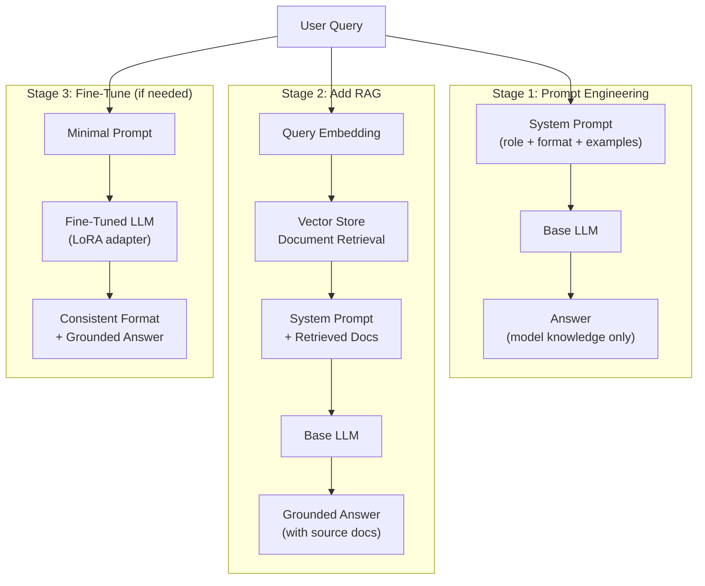
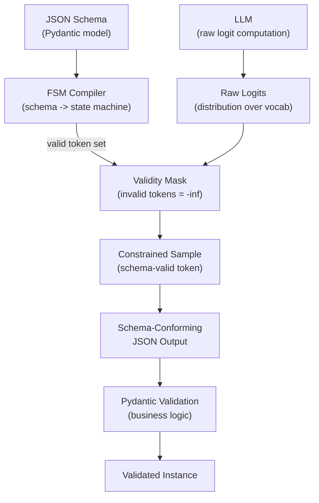

## Keywords in This File
{: .no_toc }

| # | Keyword | Weight |
|---|---|---|
| 1 | [Fine-Tuning vs RAG vs Prompt Engineering](#fine-tuning-vs-rag-vs-prompt-engineering) | critical |
| 2 | [Structured Output and JSON Mode](#structured-output-and-json-mode) | high |

---

# Fine-Tuning vs RAG vs Prompt Engineering

**Interview Weight:** critical - The central architecture
decision for every LLM application. Staff and principal
engineers are expected to reason through this trade-off
clearly. Getting this wrong wastes months of engineering
effort.

---

### 🎯 Model Answer

**30 seconds:**

> Prompt engineering is free and instant - start here.
> RAG adds external knowledge retrieval - use when
> the task requires information the model doesn't have
> or that changes over time. Fine-tuning updates model
> weights on task-specific data - use when you need
> consistent behavior, style, or domain knowledge that
> can't be injected at inference time. They are not
> mutually exclusive and production systems often
> combine all three.

**3 minutes (Senior):**

> The three techniques address different gaps:
>
> Prompt engineering solves the "how to ask" problem.
> The base model has most of the knowledge needed -
> the prompt determines whether the model uses it
> correctly. It's free, instant to iterate, and should
> always be your starting point. It fails when: (1)
> the model lacks the required knowledge, (2) the
> desired style or behavior is too complex to describe
> in words, or (3) you need sub-100ms latency (system
> prompts add tokens).
>
> RAG (Retrieval-Augmented Generation) solves the
> "what to know" problem. The model can only use
> information in its context window. RAG dynamically
> injects relevant information at query time: embed
> the query, retrieve the k most relevant documents,
> inject them into the context, generate. It's the
> right choice when information changes frequently
> (product catalog, news, prices), when information
> is too large to fit in the model's training data,
> or when information is proprietary and can't be
> in a public model.
>
> Fine-tuning solves the "how to behave" problem.
> Updates model weights via gradient descent on
> task-specific examples. The model learns the behavior
> through training, not instructions. It's the right
> choice when: the desired behavior is consistent and
> well-defined (a specific output style, formatting
> convention, reasoning pattern), when prompt engineering
> produces the right behavior but token cost is
> prohibitive at scale, or when you need the behavior
> to be consistent across any input (not just when
> the prompt is written carefully).
>
> The combination that wins in production: prompt
> engineering (defines behavior) + RAG (provides
> knowledge) + optional fine-tuning (when baseline
> model behavior is wrong or expensive to correct
> with long prompts). Invest in prompt engineering
> first, then RAG, then fine-tuning only when the
> others are insufficient.

**Blank Mind Recovery:**

**(1) Restate:** "You're asking how to choose between
fine-tuning, RAG, and prompt engineering for a given
LLM application requirement."

**(2) First principles:** "Three problems: how to ask
(prompt engineering), what to know (RAG), how to behave
(fine-tuning). Match the technique to the problem."

**(3) Bridge:** "Prompt engineering is writing better
job instructions. RAG is giving the employee access
to a reference library. Fine-tuning is sending the
employee for specialized training."

---

### 📘 Concept Explanation

**What it is:**

Three distinct approaches to improving LLM performance
on specific tasks:

- **Prompt engineering:** crafting system prompts,
  few-shot examples, and instruction formats to
  improve output quality without modifying the model.
- **RAG:** injecting relevant external information
  at inference time through retrieval, so the model
  can use information outside its training data.
- **Fine-tuning:** updating model weights on task-
  specific training examples, baking the desired
  behavior into the model itself.

**The problem it solves:**

Default LLM behavior is general-purpose. For any
specific application, performance can be improved.
The question is: which improvement technique is
appropriate for each gap? Using the wrong technique
wastes time and money.

**How it works:**

```
PROMPT ENGINEERING (no model change)
  Input -> [System Prompt + Examples + User Query]
        -> Model (unchanged weights)
        -> Output
  Cost: higher per-call token cost
  Update: edit prompt, instant effect

RAG (knowledge injection at runtime)
  Input -> Query Embedding
        -> Vector DB Retrieval (top-k documents)
        -> [System Prompt + Retrieved Docs + Query]
        -> Model (unchanged weights)
        -> Output
  Cost: retrieval latency + extra context tokens
  Update: update document store, instant effect

FINE-TUNING (model weight update)
  Training Examples -> Gradient Updates
                    -> Fine-Tuned Model (new weights)
  Input -> [Minimal Prompt] -> Fine-Tuned Model
        -> Output
  Cost: training run ($50-$5000) + deployment
  Update: requires new training run (hours-days)
```

**The key insight:**

These techniques compose. The right architecture is
often: (1) strong system prompt to define behavior,
(2) RAG to inject task-specific knowledge, and
(3) fine-tuning only when (1) and (2) are insufficient.
Fine-tuning is an amplifier of the model's behavior
quality - but if the base behavior is wrong, fine-
tuning perpetuates the wrong behavior on new examples.
Fix prompt first, then fine-tune if needed.

**When to use it:**

| Technique | Use When |
|---|---|
| Prompt Engineering | First step always |
| + RAG | Task requires external knowledge |
| + Fine-Tuning | Style/format consistency, cost reduction at scale |

**When NOT to use it:**

Fine-tuning: don't fine-tune to fix hallucinations or
factual errors. Fine-tuning teaches style, not facts.
Factual errors require RAG (inject correct facts) or
a more capable base model.

RAG: don't use RAG for behavior/style changes. RAG
injects knowledge, not behavior. Use the system prompt
for behavior.

**Alternatives:**

- RLHF (Reinforcement Learning from Human Feedback):
  advanced fine-tuning used to align model values.
  Not available as a user-level option for API models.
- Model distillation: train a smaller model on a larger
  model's outputs. Combines fine-tuning with the large
  model's quality.
- Tool use/function calling: for deterministic tasks
  (math, database queries, APIs), replace generation
  with code. More reliable than prompting.

**First-principles derivation:**

LLMs have two knowledge sources: (1) parametric
knowledge (encoded in weights during pre-training),
and (2) contextual knowledge (from the input context).
Fine-tuning updates parametric knowledge. RAG enriches
contextual knowledge. Prompt engineering determines
how the model uses both. Each technique targets
a different part of the knowledge-behavior pipeline.

---

### 💻 Code Example

```python
# Decision framework: prompt engineering -> RAG ->
# fine-tuning progression in code

import anthropic, os
client = anthropic.Anthropic(
    api_key=os.environ["ANTHROPIC_API_KEY"]
)

# STAGE 1: Start with prompt engineering only
# (always try this first - no infrastructure cost)

PROMPT_ONLY_SYSTEM = """You are a customer support
specialist for Acme Corp software products.
Answer questions concisely and accurately.
If you don't know a specific product detail,
say 'I don't have that specific information.'
"""

def answer_prompt_only(question: str) -> str:
    resp = client.messages.create(
        model="claude-haiku-3-5",
        max_tokens=512,
        system=PROMPT_ONLY_SYSTEM,
        messages=[{"role":"user","content":question}]
    )
    return resp.content[0].text

# Problem: model lacks specific product version info.
# "What's new in Acme v4.2?" -> hallucinated answer.
# Solution: add RAG.
```

```python
# STAGE 2: Prompt engineering + RAG
# (add when model lacks specific knowledge)

from typing import Optional

def retrieve_relevant_docs(
    query: str,
    top_k: int = 3
) -> list[str]:
    """
    Vector similarity search over product docs.
    Returns top_k most relevant document snippets.
    (Implementation uses your vector DB of choice.)
    """
    # In production: embed query, search vector DB
    # Placeholder for illustration:
    return [
        f"[Retrieved doc {i} for: {query}]"
        for i in range(top_k)
    ]

RAG_SYSTEM = """You are a customer support specialist
for Acme Corp software products.
Answer questions using ONLY the provided documentation.
If the documentation does not contain the answer,
say 'I don't have that specific information.'
Do not use knowledge outside the provided documents.
"""

def answer_with_rag(question: str) -> str:
    docs = retrieve_relevant_docs(question)
    doc_context = "\n---\n".join(docs)
    user_msg = (
        f"Documentation:\n{doc_context}\n\n"
        f"Question: {question}"
    )
    resp = client.messages.create(
        model="claude-haiku-3-5",
        max_tokens=512,
        system=RAG_SYSTEM,
        messages=[{"role":"user","content":user_msg}]
    )
    return resp.content[0].text

# Limitation: model still generates verbose, inconsistent
# formatting for support tickets. 100+ tokens/call for
# system prompt + format examples.
# At 10M calls/month, this is expensive.
# Solution: fine-tune for consistent format.
```

```python
# STAGE 3: Fine-tuning evaluation decision
# Use this framework to decide if fine-tuning
# is worth the investment.

def should_fine_tune(
    monthly_calls: int,
    system_prompt_tokens: int,
    price_per_token: float,
    training_cost: float,
    months_to_recoup: int = 6
) -> dict:
    """
    Break-even analysis for fine-tuning.
    Fine-tuning enables shorter system prompts
    because behavior is in model weights.
    Assume fine-tuning reduces system prompt by 70%.
    """
    current_monthly = (
        monthly_calls * system_prompt_tokens
        * price_per_token
    )
    # Fine-tuned model uses minimal system prompt
    ft_prompt_tokens = system_prompt_tokens * 0.30
    ft_monthly = (
        monthly_calls * ft_prompt_tokens
        * price_per_token
    )
    monthly_savings = current_monthly - ft_monthly
    breakeven_months = (
        training_cost / monthly_savings
        if monthly_savings > 0 else float('inf')
    )
    return {
        "current_monthly_cost": round(current_monthly, 2),
        "ft_monthly_cost": round(ft_monthly, 2),
        "monthly_savings": round(monthly_savings, 2),
        "breakeven_months": round(breakeven_months, 1),
        "recommendation": (
            "fine-tune" if breakeven_months <= months_to_recoup
            else "keep RAG + prompt engineering"
        )
    }

# Example: 5M calls/month, 1000 token system prompt,
# $0.000001/token (Haiku input), $200 training cost
result = should_fine_tune(
    monthly_calls=5_000_000,
    system_prompt_tokens=1000,
    price_per_token=0.000001,
    training_cost=200.0
)
# monthly_savings: $3500, breakeven: 0.1 months
# -> fine-tune is clearly justified at this scale
```

> **Code walkthrough:** Shows the three-stage progression
> that should guide every LLM application. Stage 1: pure
> prompt engineering - zero infrastructure cost, validate
> the base quality first. Stage 2: add RAG when the model
> lacks task-specific knowledge - inject retrieved docs
> into context, instruct the model to use only provided
> documents. Stage 3: break-even analysis for fine-tuning
> - fine-tuning is justified when the monthly token savings
> exceed the training cost within a reasonable payback
> period. The key insight: always validate prompt
> engineering first. Do not invest in RAG or fine-tuning
> until prompt-only performance is fully characterized.

---

### 🎓 Answers by Seniority

**Junior / Mid (0-5 years):**

> "Prompt engineering is free and fastest to iterate -
> always start here. RAG adds retrieval of external
> knowledge so the model can answer questions about
> documents or data it wasn't trained on. Fine-tuning
> updates the model weights to bake in consistent behavior
> or style. The decision: try prompt engineering first,
> add RAG if the model lacks knowledge, fine-tune if
> the behavior is inconsistent even with good prompts."

*Push deeper:* "Fine-tuning and RAG solve different
problems. Don't use RAG for style consistency, and
don't use fine-tuning for factual grounding. Match
technique to problem."

---

**Senior / Staff (5+ years):**

> "The progression I follow: prompt engineering first
> (costs nothing, teaches you whether the model can
> even do the task), then RAG (for knowledge gaps),
> then fine-tuning only when I have 1000+ high-quality
> examples and prompt-based behavior is still inconsistent
> at scale.
>
> The mistake I see most often: teams jump to fine-tuning
> because it 'seems more technical', but their prompt
> engineering is poor. Fine-tuning amplifies the model's
> behavior - if the base behavior is wrong, fine-tuning
> on bad prompts makes it worse consistently.
>
> The combination: for a production customer support
> system, I'd use fine-tuning (format/style consistency)
> + RAG (product knowledge) + a minimal system prompt
> (identity and safety rails). This gives consistent
> format from fine-tuning, current knowledge from RAG,
> and low per-call token cost."

*Push deeper (Staff):* "Fine-tuning and RAG also have
different knowledge staleness characteristics. Fine-
tuned knowledge is static until the next training run
(days to weeks to update). RAG knowledge is updated
instantly (update the document store, changes take
effect immediately). For rapidly changing information
(prices, inventory, recent events), RAG is the only
option. For stable knowledge (company voice, output
format, domain-specific reasoning patterns), fine-tuning
is more efficient."

---

### ⚠️ Common Misconceptions

**Misconception 1: "Fine-tuning reduces hallucinations."**

Fine-tuning teaches style and format, not facts.
If you fine-tune on data where the model confidently
generates incorrect facts, the fine-tuned model will
confidently generate incorrect facts more consistently.
To reduce hallucinations: use RAG to provide grounding
facts, use a system prompt instructing the model to
say "I don't know" when uncertain, or use a more
capable base model.

**Misconception 2: "RAG always improves accuracy."**

RAG is only as good as the retrieval step. If the
retrieval returns irrelevant documents (low retrieval
precision), the model generates answers based on
irrelevant context, which can be worse than no RAG.
Measure both retrieval precision and generation quality
separately. A common failure: the RAG system retrieves
syntactically similar but semantically irrelevant
documents.

**Misconception 3: "Fine-tuning requires thousands
of examples."**

Modern PEFT (Parameter-Efficient Fine-Tuning) techniques
like LoRA and QLoRA can fine-tune effectively with
100-500 high-quality examples. The threshold is lower
than pre-PEFT wisdom suggested. That said: more high-
quality examples = better results. The minimum is not
the optimal.

---

### 🚨 Failure Modes and Diagnosis

**Failure 1: Fine-tuned model performs worse than
baseline on out-of-distribution inputs**

*Symptom:* Fine-tuned model quality is worse on inputs
not similar to training examples.

*Cause:* Catastrophic forgetting - fine-tuning updates
weights, causing the model to "forget" general
capabilities not represented in training data.

*Diagnosis:* Evaluate on held-out set that is
deliberately different from training examples. Compare
to base model on the same inputs.

*Fix:* Use LoRA (Low-Rank Adaptation) instead of full
fine-tuning. LoRA adds small adapter layers, leaving
base weights unchanged. The base model retains its
general capabilities while the adapters specialize
for the task.

**Failure 2: RAG system produces wrong answers despite
correct documents in the store**

*Symptom:* The document store contains the correct
answer. The model still generates a wrong answer.

*Cause:* Retrieval failure - the correct document was
not retrieved (query embedding too dissimilar to
document embedding), or context overload (too many
retrieved documents, correct answer buried in the
middle).

*Diagnosis:* Log retrieved documents for failing queries.
Check if the correct document was retrieved (recall)
and its rank among retrieved results.

*Fix:* Improve retrieval: hybrid search (dense +
BM25 keyword), reranking (use a cross-encoder to
rerank retrieved results), reduce k (fewer but better
documents), improve document chunking strategy.

---

### 🎯 Interview Deep-Dive

| Seniority | Time | Focus |
|---|---|---|
| Junior | 3 min | What each is, when to use |
| Mid | 5 min | Decision framework, trade-offs |
| Senior | 7 min | Failure modes, composition, LoRA |
| Staff | 10 min | Org strategy, cost analysis, knowledge staleness |

---

**[JUNIOR] Q1 - When would you use RAG instead of
fine-tuning?**

*Why they ask:* Core architecture decision.

*Likely follow-up:* "Can you combine them?"

Use RAG when:
1. The task requires information that changes over time
   (prices, news, product documentation updates). RAG
   is updated by updating the document store - instant
   effect. Fine-tuning requires re-training (hours to days).

2. The task requires information that was not in the
   model's pre-training data (private company documents,
   proprietary data, post-training information).

3. The task requires the model to cite specific sources.
   RAG has access to the retrieved documents and can
   include source references in its answer.

Use fine-tuning when:
1. The task requires consistent behavior, format, or
   style that is difficult to specify in a system prompt.
2. The per-call token cost of the system prompt is
   prohibitive at scale (fine-tuning can reduce the
   system prompt size significantly).
3. You have 500+ high-quality labeled examples covering
   the task distribution.

Can you combine them? Yes - this is common in production.
A fine-tuned model for format/style consistency + RAG
for knowledge grounding is more powerful than either alone.
The fine-tuned model knows how to format answers; RAG
provides the facts to answer with.

*What separates good from great:* Knowing the knowledge
staleness trade-off (RAG = instant updates, fine-tuning
= requires retraining) as the most common deciding factor.

---

**[MID] Q2 - [TRADE-OFF] What is LoRA and why is it
preferred over full fine-tuning?**

*Why they ask:* Modern fine-tuning standard.

*Likely follow-up:* "What is QLoRA?"

Full fine-tuning updates all model weights via gradient
descent. For a 7B model in float32: 7B parameters *
4 bytes = 28GB just for the model, plus gradients and
optimizer state (Adam: 2x model size) = ~84GB. Requires
multiple A100 GPUs. Also risks catastrophic forgetting
(overwriting valuable base model knowledge).

LoRA (Low-Rank Adaptation): instead of updating all
weights, add small trainable "adapter" matrices to
specific layers. For a weight matrix W (d * k), add:
W' = W + A * B where A is d * r and B is r * k,
r << d (e.g., r=8 or r=16). Only A and B are trained.

The rank-r decomposition means the total additional
parameters are tiny: for a 4096 * 4096 weight matrix
with r=16: 4096*16 + 16*4096 = 131k parameters vs
4096^2 = 16.7M. About 1% of the original.

Benefits:
- VRAM: 7B LoRA adapter is 10-200MB vs. 28GB for
  full model. Trainable on a single consumer GPU.
- No catastrophic forgetting: base weights are unchanged.
  The adapter adds task-specific behavior on top.
- Multiple adapters: run one base model, swap LoRA
  adapters per customer or task. No separate deployment
  per task.

QLoRA (Quantized LoRA): run the base model in 4-bit
quantization (reduces 7B from 28GB to 3.5GB) while
training LoRA adapters in float16. Enables fine-tuning
a 7B model on a single consumer GPU (8-10GB VRAM).
Near-identical quality to full LoRA on most tasks.

The modern default: QLoRA for resource-constrained
fine-tuning (single GPU, consumer hardware). Full
LoRA for production quality where VRAM is available.
Full fine-tuning only for cases where LoRA quality
is measurably insufficient.

*What separates good from great:* The mathematical
decomposition (W + AB), the VRAM comparison (200MB
adapter vs. 28GB full model), and QLoRA as the
consumer-accessible variant.

---

**[SENIOR] Q3 - How do you build an evaluation
framework for comparing these three approaches?**

*Why they ask:* Engineers who build evaluation systems
make better architectural decisions.

*Likely follow-up:* "How do you prevent data leakage?"

Evaluation framework for RAG vs. fine-tuning vs.
prompt engineering:

Step 1: Define the task precisely. Write 5-10 examples
of ideal input-output pairs. If you can't define what
"good" looks like, you can't evaluate anything.

Step 2: Build a labeled test set. 200-500 (input,
expected_output) pairs. Must be representative of
the production distribution. Must include edge cases
(ambiguous inputs, out-of-scope inputs, adversarial
inputs). Hold this out - never use it for training,
few-shot selection, or retrieval document curation.

Step 3: Define metrics per task type:
- Classification/extraction: F1, exact match, precision,
  recall
- Generation quality: LLM-as-judge (1-5 score per
  dimension: accuracy, completeness, format compliance)
- Safety/compliance: pass/fail on defined safety criteria

Step 4: Baseline sequence. Measure in order:
1. Zero-shot baseline (model, no system prompt)
2. System prompt only (prompt engineering)
3. System prompt + few-shot (prompt engineering v2)
4. System prompt + RAG (if applicable)
5. Fine-tuned model (if applicable)
6. Fine-tuned model + RAG (combination)

Step 5: Statistical validity. N=200 test cases gives
±5% accuracy confidence at 95% confidence level.
Only declare a result better if it exceeds the noise floor.

Step 6: Cost accounting. For each configuration:
- Input tokens per call (average)
- Output tokens per call (average)
- Latency (p50, p95)
- Total cost per 1M calls (training + inference)

Step 7: Interpret results on the cost-quality Pareto
frontier. The question is not "which is best" but
"which gives the best quality per unit cost for this
use case and scale."

Preventing data leakage: the test set is locked before
any technique evaluation begins. Fine-tuning training
data and RAG document store are separate from the
test set. Validate this with a hash check on the test
set before and after the evaluation.

*What separates good from great:* The structured
baseline sequence (measure each step separately to
understand contribution), statistical validity requirements,
and the cost-quality Pareto framing.

---

**[SENIOR] Q4 - [DEBUGGING] A RAG system retrieves
the right documents but still generates wrong answers.
How do you diagnose it?**

*Why they ask:* Debugging the generation step of RAG.

*Likely follow-up:* "What is context overload in RAG?"

This is a specific RAG failure mode: retrieval succeeds
(correct documents found) but generation fails. Causes
and diagnosis:

Cause 1 - Context overload. Too many retrieved documents
(k > 5-7 for most models). The model "loses" the
relevant information in the middle of a long context.
Diagnosis: log k and context length for failing queries.
Reduce k to 3-5 and measure quality delta.

Cause 2 - Conflicting information. Two retrieved
documents contain contradictory facts. The model
averages or picks one without the ability to reason
about which is correct. Diagnosis: inspect retrieved
documents for the failing queries - look for
contradictions. Fix: add a citation requirement to
the system prompt. The model must reference the
specific document. Review conflicts in the document
store.

Cause 3 - Prompt-context mismatch. The system prompt
says "use only the provided documentation" but the
question requires synthesizing across multiple document
chunks and the model is using parametric knowledge
instead. Diagnosis: remove the retrieved documents
from the prompt. Does the model give the same answer?
If yes, it's not using the documents.

Cause 4 - Irrelevant retrieved documents alongside
relevant ones. The model is distracted by the
irrelevant documents. Diagnosis: test with only the
relevant document (known by oracle). Does quality
improve? If yes, add a reranking step (cross-encoder
reranker to filter retrieved results before injection).

Cause 5 - Chunking artifact. The answer spans a chunk
boundary - it's split across two documents but only
one was retrieved. Diagnosis: search the document store
directly for the complete answer. Fix: overlap chunks,
use semantic chunking (chunk at paragraph boundaries),
or use larger chunk sizes.

*What separates good from great:* Diagnosing each
cause separately (not treating them as one issue) and
knowing reranking as the solution to retrieval noise.

---

**[JUNIOR] Q3 - What is catastrophic forgetting in
fine-tuning?**

*Why they ask:* Common fine-tuning failure mode.

*Likely follow-up:* "How does LoRA prevent it?"

Catastrophic forgetting: when you fine-tune a language
model on task-specific data, gradient updates shift
the weights to minimize loss on the training examples.
These updates can overwrite general capabilities the
model learned during pre-training.

Example: fine-tune a general-purpose LLM on customer
support conversations. After fine-tuning, the model
is better at customer support format but has degraded
performance on unrelated tasks (code generation, math,
general reasoning) because those capabilities were
partially overwritten.

Why it happens: gradient descent minimizes loss on
the training distribution. All weights are updated,
including weights encoding general capabilities that
are not represented in the fine-tuning dataset.

How LoRA prevents it: LoRA adds small adapter matrices
(A * B) to specific layers. The base weights W are
frozen - never updated. Only the adapter parameters
A and B are trained. Since W is unchanged, all general
capabilities encoded in W are preserved. The adapter
learns the task-specific delta: W' = W + A*B.

Practical implication: for production fine-tuning,
always measure performance on both the target task
AND a set of general capability benchmarks. If general
capabilities degrade, the fine-tuning is causing
catastrophic forgetting. Switch from full fine-tuning
to LoRA.

*What separates good from great:* Describing the
mechanism (gradient updates overwriting general weights)
not just the symptom, and knowing LoRA as the standard
mitigation.

---

**[STAFF] Q5 - How do you design a multi-tenant LLM
system where different customers need different model
behaviors?**

*Why they ask:* Architecture at org scale.

*Likely follow-up:* "How do you manage the trade-off
between shared and per-tenant infrastructure?"

Multi-tenant LLM behavior customization architecture:

Tier 1 - System prompt customization (free, instant,
no infrastructure). Each tenant has a custom system
prompt stored in the application database. Loaded at
inference time: tenant_id -> system_prompt. No separate
model deployments. Supports: role, tone, domain focus,
output format, safety rules. Limitation: all tenants
share the same base model behavior.

Tier 2 - RAG with per-tenant document stores. Each
tenant has an isolated namespace in the vector database.
Retrieval is scoped to the tenant's documents. Supports:
tenant-specific knowledge, product catalogs, private
documents. No separate model deployments. Higher cost
(more retrieval infrastructure) but instant updates.

Tier 3 - Per-tenant LoRA adapters. Each tenant has
a custom LoRA adapter trained on their data. One base
model deployment + dynamic adapter loading per request.
Supports: domain-specific style, specialized reasoning
patterns. Higher cost (training per tenant + adapter
storage) but better behavior customization than
system prompts alone. Requires 500+ examples per tenant.

Tier 4 - Separate fine-tuned model deployments. Each
tenant has a fully independent fine-tuned model.
Highest quality, highest cost (separate GPU deployment
per tenant). Only for enterprise customers with large
contract value.

Decision framework by tenant contract value:
- <$1k/month: system prompt customization only
- $1k-10k/month: system prompt + RAG
- $10k-100k/month: system prompt + RAG + LoRA adapter
- >$100k/month: consider dedicated deployment

Infrastructure note: LoRA adapter serving at scale
requires a serving framework that supports dynamic
adapter loading (e.g., vLLM with LoRA support). Test
this before promising per-tenant adapters - not all
serving frameworks support efficient adapter swapping.

*What separates good from great:* The tiered architecture
by contract value (practical constraint), the LoRA
adapter serving requirement (not all frameworks support
it), and the per-tenant namespace isolation for RAG.

---

**[MID] Q6 - What is the difference between
instruction tuning and task-specific fine-tuning?**

*Why they ask:* Different goals for different fine-
tuning types.

*Likely follow-up:* "Does Claude need instruction tuning?"

Two distinct fine-tuning purposes:

Instruction tuning: train the model to follow arbitrary
natural language instructions. This is what transforms
a base pre-trained model (which only predicts the next
token) into a chat model (which follows instructions).
Training data: diverse instruction-following examples
covering many tasks and domains. Output: a model
that follows any well-specified instruction. This is
how Alpaca, Vicuna, and the chat versions of Llama
were created from base models. Claude, GPT-4, and
similar frontier models are already instruction-tuned.

Task-specific fine-tuning: train an already-instruction-
tuned model to be better at one specific task (customer
support, legal document review, medical coding). Training
data: examples of the specific task. Output: a model
that is better at that task than the general model,
often with more consistent format and style.

When you're using an API (Claude, GPT-4, GPT-4o):
the model is already instruction-tuned. You're doing
task-specific fine-tuning on top of an instruction-
tuned model. You don't need to teach it to follow
instructions - it already can. Your fine-tuning
teaches it the specific output format, domain
vocabulary, and task patterns you need.

Practical consequence: task-specific fine-tuning
typically needs far fewer examples than instruction
tuning (100-500 vs. thousands) because the base model
is already a capable instruction follower.

*What separates good from great:* Knowing that Claude/GPT-4
are already instruction-tuned (you're task-fine-tuning
a capable model, not teaching instruction following
from scratch) and why this requires fewer examples.

---

**[SENIOR] Q7 - [BEHAVIORAL] You've been asked to
evaluate whether to fine-tune a model or use RAG for
a legal research assistant. How do you approach
the decision?**

*Why they ask:* Real-world decision framing.

*Likely follow-up:* "What if you need both?"

I approach this as a problem decomposition, not a
binary choice.

First, I define the specific problems the legal
research assistant needs to solve:

Problem A: Answering questions about case law (requires
specific legal precedents, statutes, and case holdings).
This is a knowledge problem - the model doesn't have
access to specific case records or recent rulings.
RAG is the right tool: build a vector store of legal
documents, retrieve relevant cases and statutes per
query.

Problem B: Formatting legal analysis in the firm's
preferred citation format and tone. This is a behavior
problem. RAG doesn't help with format. Fine-tuning
on 500+ examples of the firm's well-formatted legal
analysis would internalize the format. Alternatively,
a well-designed system prompt might achieve this
without fine-tuning.

Problem C: Reducing hallucination of case names and
holdings. This is a grounding problem. Fine-tuning
won't fix this - you can't teach the model to not
invent case names through training. RAG with a precise
retrieval (exact case names as anchors) and a system
prompt instructing the model to only cite cases
that appear in the retrieved documents is the fix.

My recommendation: start with RAG + strong system prompt.
This addresses problems A and C (knowledge + hallucination).
Measure if Problem B (format consistency) is sufficient.
If not, fine-tune for format. The combination is likely:
instruction-tuned base model + LoRA for format consistency
+ RAG for legal knowledge grounding.

Legal-specific risk: hallucinated case names or statutes
are a serious liability issue. The system must be
designed so that all cited cases can be traced to
a source document in the RAG store. This is a hard
requirement that RAG addresses and fine-tuning does not.

*What separates good from great:* Decomposing into
problem types (knowledge vs. behavior vs. grounding),
the hallucination-as-liability insight, and the specific
tracing requirement (all citations must link to source
documents in the RAG store).

---

### ⚖️ Comparison Table

| Technique | Solves | Update Speed | Cost (Training) | Cost (Inference) | Data Required |
|---|---|---|---|---|---|
| Prompt Engineering | How to ask | Instant | $0 | Higher (more tokens) | 0 examples |
| RAG | What to know | Instant | Low (embeddings) | Medium (retrieval + tokens) | 0 examples |
| LoRA Fine-Tuning | How to behave | Hours | $50-500 | Lower (shorter prompts) | 100-1000 examples |
| Full Fine-Tuning | How to behave | Days | $500-5000 | Lowest | 1000+ examples |

---

### 🏛️ System Design

*(Omit: ★★☆ working level - system design in L4-L5.)*

---

### 📊 Diagram

**Three-technique comparison:**

```
PROMPT ENGINEERING ONLY:
  Query -> [SysPrompt + Query] -> LLM -> Answer
  (fast, cheap, model knowledge only)

RAG PIPELINE:
  Query -> Embed -> Vector Search -> Docs
        -> [SysPrompt + Docs + Query] -> LLM -> Answer
  (adds external knowledge, instant updates)

FINE-TUNED + RAG:
  Query -> Embed -> Vector Search -> Docs
        -> [Short Prompt + Docs + Query]
        -> Fine-Tuned LLM -> Answer
  (consistent format + external knowledge)
```



> **Diagram walkthrough:** The three stages form a
> progression of increasing investment and capability.
> Stage 1 (prompt engineering only) is the mandatory
> starting point - it validates whether the task is
> feasible with the base model and costs nothing to
> iterate. Stage 2 adds retrieval from a vector store,
> injecting external knowledge into the context. The
> model's instructions now include source documents, so
> answers are grounded in actual data rather than model
> memory. Stage 3 replaces the heavy system prompt with
> a fine-tuned model (LoRA adapter) that has internalized
> the desired format/style - the system prompt shrinks,
> reducing per-call cost while maintaining quality. The
> correct approach: run stage 1, measure quality, add
> stage 2 if knowledge grounding is needed, add stage 3
> only if the cost-quality analysis justifies training.

---

---

# Structured Output and JSON Mode

**Interview Weight:** high - Required for any LLM
integration where output is consumed by code. A
production LLM application that does not use structured
output is a reliability risk.

---

### 🎯 Model Answer

**30 seconds:**

> Structured output forces the LLM to generate valid,
> schema-conforming output (JSON, XML, typed responses)
> instead of free-form text. This is essential for any
> LLM output that will be parsed by code. Options:
> (1) ask nicely (unreliable), (2) JSON mode (valid
> JSON but no schema enforcement), (3) structured
> output with schema (valid JSON matching your schema,
> most reliable). Always use option 3 for production
> integrations.

**3 minutes (Senior):**

> Free-form text output from an LLM is a parsing
> nightmare in production. The model might return
> valid JSON, or a sentence containing JSON, or markdown-
> wrapped JSON, or JSON with a trailing comment that
> makes it invalid. Any of these breaks downstream
> parsing.
>
> Structured output solves this at the API level.
> Three mechanisms, increasing in reliability:
>
> Method 1 - Prompt-based: "Output only valid JSON".
> Unreliable. The model sometimes outputs explanatory
> text before or after the JSON. Parse failures happen.
>
> Method 2 - JSON mode: a model flag that guarantees
> valid JSON at the lexical level. The model will
> always output parseable JSON. It does not guarantee
> schema conformance: the JSON might have the wrong
> fields or wrong types.
>
> Method 3 - Schema-constrained structured output:
> provide a JSON Schema (or Pydantic model, TypeScript
> interface). The model is constrained at the token
> level to only generate tokens that produce a valid
> output conforming to the schema. Guarantees both
> valid JSON and schema conformance. This is what
> Anthropic's tool_choice API, OpenAI's structured
> output, and the Instructor library provide.
>
> The mechanism: schema-constrained decoding uses
> a finite state machine or grammar to constrain
> which tokens are valid at each generation step.
> If the next token would produce invalid JSON or
> schema-nonconforming output, it is masked out
> (set to -infinity before softmax). Only valid
> continuations are sampled.
>
> Tool calling: the canonical implementation of
> structured output. Define a "tool" with a JSON
> Schema input specification. Call the model with
> tool_choice="required" (force a tool call). The
> model's response is a tool call with schema-
> conforming arguments. More reliable than JSON mode
> and more explicit about the intended use.
>
> When to use: any time LLM output is consumed by
> code (parsed, validated, stored). Any time the
> output has required fields. Any time the output
> must conform to a type system.

**Blank Mind Recovery:**

**(1) Restate:** "You're asking about structured
output - how to make an LLM return JSON or typed
data reliably instead of free text."

**(2) First principles:** "LLMs generate tokens.
Without constraints, any token is possible. Schema-
constrained generation restricts which tokens are
valid at each position to those that produce schema-
conforming output."

**(3) Bridge:** "Think of it like a form with required
fields and type validation. Without structured output,
you ask the user to describe a date. With structured
output, you give them a date picker - only valid dates
are possible."

---

### 📘 Concept Explanation

**What it is:**

Structured output is the practice of constraining
LLM output to a defined schema - JSON Schema, Pydantic
model, TypeScript interface, or XML schema - such
that the output is always valid and parseable by code.
It removes the parsing ambiguity of free-form text.

**The problem it solves:**

LLM output is probabilistic text. Without constraints,
the model might produce:
- Valid JSON (parseable)
- Valid JSON with extra prose: "Here is the JSON: {...}"
- Markdown-wrapped: "```json\n{...}\n```"
- JSON with a comment (invalid): {"key": "val" // comment}
- JSON with wrong types: {"age": "42"} vs. {"age": 42}
- Missing required fields
- Schema-violating extra fields

Any of these breaks downstream code. Structured output
makes parsing deterministic.

**How it works:**

```
WITHOUT STRUCTURED OUTPUT:
  prompt: "Extract name and age from: John Doe, 42"
  response: "The person is John Doe, aged 42 years old."
  or: '{"name": "John", "age": "42"}'  # wrong type
  or: '```json\n{"name": "John", "age": 42}\n```'

WITH JSON MODE:
  response: '{"name": "John", "age": 42}'  # valid JSON
  but: '{"person_name": "John", "years": 42}'  # wrong schema

WITH SCHEMA-CONSTRAINED STRUCTURED OUTPUT:
  Schema: {"name": string, "age": integer}
  response: '{"name": "John", "age": 42}'  # guaranteed
  Never: wrong types, wrong fields, extra text
```

**The key insight:**

Schema-constrained structured output is not just
a formatting request - it is a constraint on the
generation process. The schema is compiled into a
token-level constraint (grammar/FSM). Only tokens
that produce schema-conforming output can be sampled.
This makes it fundamentally more reliable than any
prompt instruction.

**When to use it:**

Always, when LLM output is consumed by code. Exceptions:
free-form content generation (blog posts, creative
writing) where schema is not applicable.

**When NOT to use it:**

When the output is purely for human consumption
(chat responses, explanations, summaries). Structured
output constrains the model's expression and may
reduce naturalness. Use it only for machine-consumed
output.

**Alternatives:**

- Output parsing with retry: generate free text, parse
  with try-except, retry if parse fails. Works but
  adds latency (retry calls) and is unreliable.
- Template-based extraction: post-process the text
  with regex or a structured extractor. Works for
  simple patterns, breaks on complex ones.

**First-principles derivation:**

Grammar-constrained decoding: at each generation step,
the model produces a probability distribution over
the vocabulary. Normally, you sample from this
distribution. With grammar-constrained decoding, you
first apply a mask that sets all invalid next tokens
(tokens that would violate the grammar/schema) to -infinity
before softmax. This forces the model to sample only
from the valid continuation tokens. The schema is
converted to a finite state machine or context-free
grammar to determine which tokens are valid at each
step.

---

### 💻 Code Example

```python
import anthropic, os, json

client = anthropic.Anthropic(
    api_key=os.environ["ANTHROPIC_API_KEY"]
)

# BAD: asking for JSON in the prompt (unreliable)
def extract_contact_bad(text: str) -> dict:
    resp = client.messages.create(
        model="claude-haiku-3-5",
        max_tokens=256,
        messages=[{
            "role": "user",
            "content": (
                f"Extract name, email, phone. "
                f"Output JSON only. Text: {text}"
            )
        }]
    )
    # Might fail if model outputs prose or invalid JSON
    return json.loads(resp.content[0].text)
    # ParseError: "Here is the extracted JSON: {...}"
```

```python
from pydantic import BaseModel, EmailStr
from typing import Optional

# GOOD: tool_use for schema-constrained output
class ContactInfo(BaseModel):
    name: str
    email: Optional[str] = None
    phone: Optional[str] = None

def extract_contact(text: str) -> ContactInfo:
    """
    Extract contact info using tool_use (schema-
    constrained structured output).
    Guaranteed to return a schema-conforming response.
    """
    tool_definition = {
        "name": "extract_contact",
        "description": (
            "Extract name, email, and phone from text."
        ),
        "input_schema": {
            "type": "object",
            "properties": {
                "name": {
                    "type": "string",
                    "description": "Full name"
                },
                "email": {
                    "type": "string",
                    "description": "Email address"
                },
                "phone": {
                    "type": "string",
                    "description": "Phone number"
                }
            },
            "required": ["name"]
        }
    }
    resp = client.messages.create(
        model="claude-haiku-3-5",
        max_tokens=256,
        tools=[tool_definition],
        tool_choice={
            "type": "tool",
            "name": "extract_contact"
        },
        messages=[{
            "role": "user",
            "content": f"Extract contact info: {text}"
        }]
    )
    # tool_use block always contains valid schema JSON
    tool_use = next(
        b for b in resp.content
        if b.type == "tool_use"
    )
    return ContactInfo(**tool_use.input)
```

```python
# Using the Instructor library (wraps any API)
# Cleaner Pydantic-first workflow
import instructor

inst_client = instructor.from_anthropic(client)

def extract_contact_instructor(
    text: str
) -> ContactInfo:
    """Instructor provides Pydantic validation
    + automatic retry on validation failure."""
    return inst_client.messages.create(
        model="claude-haiku-3-5",
        max_tokens=256,
        response_model=ContactInfo,
        messages=[{
            "role": "user",
            "content": f"Extract contact info: {text}"
        }]
    )

# Instructor advantages:
# 1. Automatic validation and retry on parse failure
# 2. Clean Pydantic model as the only interface
# 3. Works with OpenAI, Anthropic, Groq, Gemini
# 4. Async support, streaming, partial parsing
```

> **Code walkthrough:** The BAD version uses a text
> instruction to request JSON - the model may add
> prose, wrap in markdown, or produce invalid JSON.
> The GOOD version uses the `tool_use` API with a
> JSON Schema definition and `tool_choice` forced to
> a specific tool. The model is constrained to produce
> a valid schema-conforming tool call argument. The
> response is guaranteed to parse into the Pydantic model.
> The Instructor version wraps this pattern cleanly:
> pass a Pydantic class, get a validated instance back.
> For new code, Instructor is the recommended approach -
> it handles validation, retries, and cross-provider
> compatibility.

---

### 🎓 Answers by Seniority

**Junior / Mid (0-5 years):**

> "Structured output makes the LLM return valid,
> schema-conforming JSON instead of free-form text.
> This is required when LLM output is consumed by
> code. Use the tool_use API (Anthropic) or structured
> output API (OpenAI) to specify a JSON Schema. The
> model is constrained to only generate output that
> matches the schema. Alternatively, the Instructor
> library provides a clean Pydantic interface."

*Push deeper:* "The difference between 'ask for JSON
in the prompt' (unreliable) vs. schema-constrained
tool use (reliable) is that tool use enforces the
schema at the token generation level - invalid tokens
are masked out."

---

**Senior / Staff (5+ years):**

> "I treat structured output as mandatory for any
> LLM output that touches code. The failure mode of
> unstructured LLM output in production is messy:
> intermittent parse failures, wrong types silently
> accepted, schema drift.
>
> My production stack: Instructor + Pydantic for
> the interface layer, tool_use/structured output
> at the API level. Instructor adds validation with
> automatic retry (if the response doesn't validate
> against the Pydantic model, it retries with the
> validation error in the prompt). For high-volume
> pipelines: cache schema compilation (the JSON Schema
> to FSM compilation is expensive for complex schemas)
> and measure the latency overhead of structured output."

*Push deeper (Staff):* "Schema design matters for
quality. A schema with too many optional fields gives
the model freedom to omit important information.
Required fields force the model to populate them.
But required fields on information that may genuinely
be absent (e.g., 'company name' in a resume that
doesn't have one) cause hallucination - the model fills
in invented data rather than leaving the field empty.
Design schemas with Optional for genuinely optional
information and required only for always-present fields.
Add description fields to every schema property -
descriptions improve extraction accuracy by telling
the model what it's extracting."

---

### ⚠️ Common Misconceptions

**Misconception 1: "JSON mode guarantees schema
conformance."**

JSON mode guarantees syntactically valid JSON. It does
not guarantee: (1) the correct fields are present,
(2) the correct types, (3) the values are valid (email
format, enum constraints). Schema-constrained structured
output (tool_use / Instructor) is the correct choice
for schema conformance.

**Misconception 2: "Structured output reduces model
quality."**

Grammar-constrained decoding limits which tokens
are valid, which can prevent the model from choosing
its most natural continuation. This can reduce quality
if the schema is very restrictive. However, for typical
extraction and classification schemas, the quality
impact is minimal (<2%). The reliability improvement
(zero parse failures) far outweighs the quality cost.

**Misconception 3: "Structured output works for
everything."**

Some outputs are inherently unstructured: creative
writing, conversational responses, long-form analysis.
Forcing a schema on these adds constraints the model
fights against, producing lower quality output.
Structured output is for machine-consumed data, not
human-consumed prose.

---

### 🚨 Failure Modes and Diagnosis

**Failure 1: Model returns null for required fields**

*Symptom:* Required schema fields contain null or
empty string despite the information being available
in the input.

*Cause:* The field name or description is ambiguous.
The model is uncertain how to map the input to the
schema field.

*Diagnosis:* Log the raw tool_use input for failing
cases. Check if the field is genuinely null in the
input or if the model failed to map it.

*Fix:* Add a detailed description to the schema
property. Change the field name to be more self-
explanatory. Add an example value in the description.
Make the field optional if it can genuinely be absent.

**Failure 2: Hallucinated values in structured output**

*Symptom:* Required fields are populated but with
invented values not present in the input.

*Cause:* Required fields force the model to fill them,
even when the information is absent. The model halluccinates
rather than returning null (which is forbidden by
the schema).

*Diagnosis:* Check if the input actually contains
the required field's information. If not, the schema
requires information that may not always be present.

*Fix:* Change the field to optional. Add to the field
description: "If this information is not explicitly
stated in the input, use null." The model respects
these instructions when extraction vs. generation
is ambiguous.

**Failure 3: Structured output latency regression**

*Symptom:* Response latency increased after switching
to structured output.

*Cause:* Grammar-constrained decoding adds CPU overhead
for the FSM computation at each token. For complex
schemas (many nested objects, large enums), this
overhead is non-trivial.

*Diagnosis:* Measure time-to-first-token (TTFT) and
total generation time before and after.

*Fix:* Simplify the schema (fewer fields, simpler
nesting). For enum fields with many values (>50),
consider using string with validation in a post-
processing step instead of an enum in the schema.

---

### 🎯 Interview Deep-Dive

| Seniority | Time | Focus |
|---|---|---|
| Junior | 3 min | Why structured output, tool_use basics |
| Mid | 5 min | Instructor, schema design, validation |
| Senior | 7 min | Grammar-constrained decoding, failure modes |
| Staff | 10 min | Production reliability, schema governance |

---

**[JUNIOR] Q1 - Why is asking for JSON in the prompt
insufficient for production?**

*Why they ask:* Establishes the need for proper
structured output.

*Likely follow-up:* "What is the alternative?"

When you ask the model "output JSON only," you're
making a request. The model is a probabilistic text
generator - it does not have a guarantee mechanism
that enforces your request at every output token.

Common failures:

(1) Prose prefix: the model generates "Here is the
requested information in JSON format:\n{...}". Valid
JSON exists in the response but is not the entire
response. `json.loads()` fails.

(2) Markdown wrapper: "```json\n{...}\n```". The
model formats it nicely for humans. Your parser fails.

(3) Trailing comment: `{"key": "value" // my note}`.
JSON5 format, not valid JSON. `json.loads()` fails.

(4) Wrong types: `{"age": "42"}` instead of
`{"age": 42}`. Parses successfully but your schema
validation fails, or silently accepts wrong types.

(5) Extra fields: the model adds fields you didn't
ask for. May break downstream strict schema validation.

At low volume (dev/testing), these failures are
manageable. At production volume (100k calls/day),
1% failure rate = 1000 failed parses/day. Each failure
potentially causes a user-visible error or requires
a retry (doubling the cost).

The alternative: use the tool_use API (Anthropic) or
structured output (OpenAI), where the schema is enforced
at the token generation level. The model physically
cannot produce output that doesn't conform to the
schema.

*What separates good from great:* Quantifying the
failure rate impact at scale (1% failure at 100k
calls/day = 1000 failures/day) rather than just
listing failure modes.

---

**[MID] Q2 - How does grammar-constrained decoding
work?**

*Why they ask:* Mechanism question for structured
output.

*Likely follow-up:* "What is the performance impact?"

Standard LLM decoding: at each step, the model produces
a probability distribution over the full vocabulary
(e.g., 100,000 tokens). You sample one token from
this distribution (based on temperature).

Grammar-constrained decoding: before sampling, apply
a validity mask to the distribution. A finite state
machine (FSM) or context-free grammar (CFG) tracks
the current state of the generated output and computes
which tokens are valid continuations. Invalid tokens
are set to -infinity (effectively zero probability).
You sample only from valid tokens.

Example: generating {"name": "..."}
After generating {"name": ", the FSM knows we are
in a string value context. Valid tokens: printable
characters and closing ". Invalid tokens: }, numbers
without quotes, etc.

For JSON Schema specifically: the schema is compiled
to an FSM that tracks the JSON parse state. The FSM
knows at each step: which keys are still required,
which values are valid for the current key's type,
whether we're in a string, number, array, etc.

Performance impact: FSM computation is O(vocabulary_size)
per token generation step. For simple schemas:
negligible (<1ms/token). For complex schemas with
large enum fields (e.g., a field with 1000 valid values):
the FSM may have many states and the computation
can add 5-20ms per token.

Practical mitigation: for large enums, use string
type with post-processing validation instead of
an enum in the schema. This avoids the large-FSM
state computation overhead.

*What separates good from great:* Explaining the FSM
mechanism (not just "it constrains tokens"), the
O(vocabulary_size) complexity, and the large-enum
mitigation strategy.

---

**[SENIOR] Q3 - [TRADE-OFF] When should you use tool
calling vs. structured output mode for extraction?**

*Why they ask:* Two mechanisms with different use cases.

*Likely follow-up:* "What is the semantic difference?"

Tool calling and structured output mode are both
schema-constrained generation mechanisms, but with
different semantics and use cases.

Tool calling (function calling): the model decides
whether to call a tool, and if so, which tool with
what arguments. The response includes a tool_use block
with the tool name and a schema-conforming arguments
object. Semantics: "I need to take an action or
retrieve information."

Structured output mode (OpenAI) / Forced tool call
(Anthropic tool_choice="tool"): the model is forced
to produce a schema-conforming response. Semantics:
"I need to extract/classify information."

When to use tool calling (with free tool choice):
- The model may or may not need to call a tool
  (e.g., an AI assistant that can search, calculate,
  or answer from memory depending on the question)
- Multiple tools are available, and the model should
  choose the appropriate one

When to use forced structured output:
- Extraction tasks: always extract from this text
- Classification: always classify this input
- Transformation: always convert this input to schema

The forced structured output is more appropriate for
batch data processing pipelines where every input
requires schema-conforming output. Tool calling with
free choice is for agents that may or may not take
actions.

Quality difference: forcing a schema can reduce quality
for complex, nuanced extractions where the model needs
flexibility. In these cases, use the Instructor approach:
allow free generation with Pydantic validation and
retry. The model generates naturally, and only if the
output doesn't validate against the schema is a retry
triggered with the validation error in the prompt.

*What separates good from great:* The semantic distinction
(action-taking vs. extraction) and the Instructor
retry pattern as a quality-preserving alternative to
hard constraint.

---

**[JUNIOR] Q4 - What is Instructor and when would
you use it?**

*Why they ask:* A widely-used library in production.

*Likely follow-up:* "What does it add over the raw API?"

Instructor is a Python library that wraps LLM API
clients to provide Pydantic-first structured output.
Instead of writing JSON Schema manually and parsing
the tool_use response, you:

1. Define a Pydantic model for your desired output
2. Call `instructor_client.messages.create(response_model=YourModel,...)`
3. Get back a validated Pydantic instance directly

What Instructor adds over the raw API:

Automatic schema generation: it converts the Pydantic
model to JSON Schema automatically. You don't write
JSON Schema by hand.

Validation with retry: if the model's response fails
Pydantic validation (wrong type, missing required field,
invalid enum value), Instructor automatically retries
with the validation error in the prompt. Typically
resolves validation failures in 1-2 retries.

Cross-provider compatibility: the same code works with
Anthropic, OpenAI, Groq, Gemini, local Ollama models,
and others. Swap the client, same Pydantic interface.

Nested schemas: complex nested Pydantic models (objects
containing lists of objects) are handled correctly,
which raw JSON Schema construction often gets wrong.

When to use: any production extraction or classification
pipeline where output is consumed by code. Use Instructor
unless you have a specific reason to avoid the dependency
(package size, compatibility).

When not to use: simple prototyping where the dependency
is not worth it. Ultra-high-performance systems where
the retry overhead is not acceptable (measure first).

*What separates good from great:* The automatic validation
and retry feature (the key value-add over raw tool_use)
and the cross-provider compatibility.

---

**[SENIOR] Q5 - How do you design schemas to minimize
hallucination in structured extraction?**

*Why they ask:* A nuanced schema design question.

*Likely follow-up:* "What happens if you make a
non-present field required?"

Schema design directly affects hallucination rate
in structured extraction. Key principles:

Required vs. optional: required fields force the model
to produce a value. If the information is genuinely
absent in the input, a required field causes hallucination.
The model invents a value rather than leaving the
field empty. Rule: make a field required only if it
is always present in valid input. For everything else:
Optional with a description of when to use null.

Description quality: every field should have a
description that explains: (1) what the field captures,
(2) when to use null or empty, (3) an example value.
Better descriptions = better extraction accuracy.
Without descriptions, the model maps input to fields
based on field name alone, which is ambiguous for
similar concepts.

Type strictness: use specific types for validation.
Email fields: use string with "must be a valid email
address or null". Phone fields: "E.164 format or null".
This prevents the model from storing partial matches.

Enum fields: for classification fields, use enum
types. This constrains the model to valid labels.
Include an "unknown" or "other" enum value for inputs
that don't fit cleanly into any category. Without this,
the model forces ambiguous inputs into the nearest
category.

Avoid over-extraction: schemas with 20+ fields often
produce lower quality than schemas with 5 focused
fields. The model attends to fewer fields more carefully
than many fields less carefully. Break complex schemas
into multiple targeted extraction calls if needed.

Confidence fields: add an optional "confidence" float
field (0.0-1.0) for each extracted value. Ask the
model to express its confidence. Filter on confidence
in post-processing. This is not a Pydantic-enforced
schema guarantee but provides useful signal for
downstream validation.

*What separates good from great:* The required vs.
optional reasoning (required = hallucination risk),
the confidence field pattern, and the recommendation
to split complex schemas.

---

**[MID] Q6 - How do you validate LLM structured output
beyond schema conformance?**

*Why they ask:* Production validation beyond basic
parsing.

*Likely follow-up:* "What is the Guardrails library?"

Schema conformance (valid JSON, correct types) is
necessary but not sufficient. Additional validation
layers:

Business logic validation: verify extracted values
are semantically plausible. Email contains "@". Date
fields are valid dates. Age is between 0 and 150.
Phone numbers are parseable. These are Pydantic
validators:

```python
from pydantic import validator, BaseModel
class Contact(BaseModel):
    email: Optional[str]
    age: Optional[int]

    @validator('email')
    def email_format(cls, v):
        if v and '@' not in v:
            raise ValueError('invalid email')
        return v

    @validator('age')
    def age_range(cls, v):
        if v is not None and not (0 <= v <= 150):
            raise ValueError('implausible age')
        return v
```

Consistency validation: multi-field constraints.
Start date must precede end date. Total must equal
sum of items. Address city must match country code.

Completeness validation: required fields populated
with non-trivial values. "John" is a complete name.
"null" stored as a string is an extraction failure.

Source grounding: for RAG-based extraction, verify
that extracted values appear (verbatim or close to
verbatim) in the source document. Extracted values
not present in the source = hallucination.

Confidence thresholds: if using confidence fields,
define a minimum confidence threshold below which
extracted values are marked as "low confidence" and
routed to human review.

The Guardrails library provides a framework for
defining these validation rules as "guards" that
run on LLM output, with automatic retry if guards
fail. Similar to Instructor but more focused on
safety and business logic validation.

*What separates good from great:* The source grounding
validation (extracted values must appear in the source
document) as the most important hallucination check
for RAG-based extraction, and knowing Guardrails as
the library-level solution.

---

**[SENIOR] Q7 - [DEBUGGING] Structured output is
occasionally returning wrong values in production
despite schema validation passing. How do you debug it?**

*Why they ask:* A subtle production debugging scenario.

*Likely follow-up:* "What is schema validation vs.
semantic validation?"

This is the distinction between schema validity
(correct type and structure) and semantic validity
(correct value). Schema-constrained generation
guarantees the former, not the latter.

Debugging approach:

Step 1: Classify the failure type. Is the wrong value:
(a) present in the input but mapped to the wrong field
(field mapping error), (b) absent from the input but
filled with an invented value (hallucination), or (c)
a genuinely ambiguous input where both values are
plausible (ambiguity)?

Step 2: For field mapping errors - log the raw input
alongside the extracted output. Is the correct value
clearly present? If yes, the field name or description
is too similar to another field. Add specificity to
the field description. Use more distinct field names.
Add negative examples: "This field captures X, NOT Y."

Step 3: For hallucinations - the field is required
but the information is absent. Change to optional.
Add to the description: "Use null if not explicitly
stated." Test with inputs where the field is definitely
absent.

Step 4: For ambiguity - the input is genuinely
ambiguous. These are correct behavior, not bugs.
Add a confidence field. Route low-confidence extractions
to human review. If too many are ambiguous, reconsider
the schema or the task - some extractions require
human judgment.

Step 5: Check model version. If the production
model was updated by the provider, schema adherence
characteristics may have changed. Lock model versions
in production (use "claude-haiku-3-5-20241022" not
"claude-haiku").

*What separates good from great:* The three-way
classification (mapping error vs. hallucination vs.
ambiguity) - each has a different fix, and conflating
them leads to fixing the wrong thing.

---

### ⚖️ Comparison Table

| Method | Valid JSON | Schema Conformance | Reliability | Use Case |
|---|---|---|---|---|
| Prompt-only | Usually | No | Low (90-95%) | Prototyping only |
| JSON mode | Always | No | Medium (parse OK) | Simple key-value |
| Tool use (forced) | Always | Yes (schema) | High (99%+) | Production extraction |
| Instructor + Pydantic | Always | Yes (with retry) | Very high (99.9%+) | Production (recommended) |

---

### 🏛️ System Design

*(Omit: ★★☆ working level.)*

---

### 📊 Diagram

**Structured output generation mechanism:**

```
WITHOUT STRUCTURED OUTPUT:
  LLM -> softmax over full vocab
       -> sample: any token (text, JSON, prose)

WITH GRAMMAR-CONSTRAINED OUTPUT:
  Schema -> Compile -> FSM/Grammar
  LLM -> raw logits
       -> mask (FSM: valid next tokens only)
       -> softmax over valid tokens only
       -> sample: schema-conforming token only
```



> **Diagram walkthrough:** The schema is compiled into
> a finite state machine (FSM) that tracks the current
> JSON parse state. At each generation step, the LLM
> produces raw logits over the full vocabulary. The FSM
> computes the set of valid next tokens for the current
> state (e.g., "we're in a string value, valid tokens
> are any character or closing quote"). All invalid tokens
> are masked to -infinity before softmax. The model then
> samples only from the valid token distribution. This
> guarantees schema-conforming JSON at every token.
> Pydantic validation runs on the final output as a
> second layer, catching semantic errors and triggering
> retries. The two-layer approach (grammar constraint +
> Pydantic validation) achieves near-100% reliability
> for production extraction pipelines.
