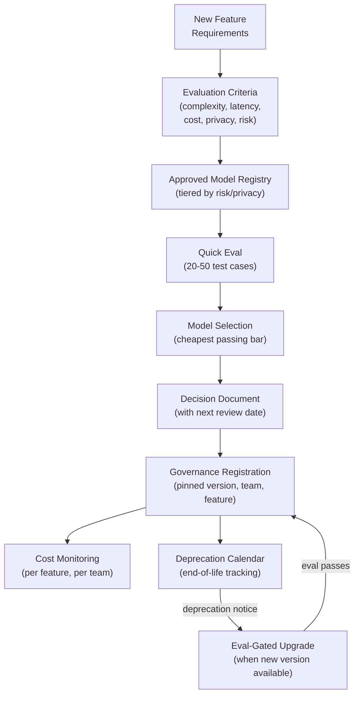

## Keywords in This File
{: .no_toc }

| # | Keyword | Weight |
|---|---|---|
| 1 | [AI Model Selection and Governance Strategy](#ai-model-selection-and-governance-strategy) | critical |

---

# AI Model Selection and Governance Strategy

**Interview Weight:** critical (★★★) - Distinguishes
engineers and architects who can make strategic AI
decisions from those who only implement features.
Asked in principal/staff interviews and any role that
shapes AI platform decisions.

---

### 🎯 Model Answer

**30 seconds:**

> AI model selection and governance is the practice
> of choosing the right AI model for each use case
> and managing models as production infrastructure.
> Selection criteria: task fit (capability vs. complexity),
> latency requirements, cost per call, privacy and
> data residency constraints, and provider risk.
> Governance covers: model versioning and change
> management (providers silently update models),
> org-wide standards (which models are approved,
> how cost is attributed), and compliance requirements
> (data processing agreements, auditability). The
> core failure mode: treating model selection as a
> one-time technical decision rather than an ongoing
> strategic function.

**3 minutes (Senior/Staff):**

> Model selection is a multi-criteria engineering
> decision that must be revisited on a regular cadence
> - models change, your requirements change, and
> better/cheaper alternatives emerge.
>
> Framework for model selection:
> (1) Task fit: what capability is required? Some
> tasks (classification, extraction, simple QA) work
> well on small, fast models. Others (complex reasoning,
> code generation, multi-step planning) need frontier
> models. Do not default to the most capable model.
> Start with the cheapest model that meets your
> quality threshold.
> (2) Latency: TTFT and total response time must
> fit your UX requirements. Streaming changes this
> equation (perceived latency < actual latency),
> but batch jobs differ from real-time UX.
> (3) Cost: model cost directly drives feature
> economics. At scale, 10x cost difference between
> haiku and opus is the difference between a profitable
> feature and an unprofitable one.
> (4) Privacy / data residency: do your inputs
> contain PII, trade secrets, or regulated data?
> Some regulations (HIPAA, GDPR, SOC2) may require
> data residency guarantees or BAA agreements with
> the provider. Self-hosted models (Ollama, vLLM)
> or cloud providers with data residency options
> (Azure, AWS Bedrock) address this.
> (5) Provider risk: what is your plan if the
> provider has an outage, changes pricing, or
> discontinues the model? Multi-provider architecture
> reduces this risk but adds complexity.
>
> Governance:
> Model governance is the set of policies and processes
> for managing AI models in production:
> - Approved model registry: which models are approved
>   for production and what are the requirements?
> - Model version pinning: production features pin
>   to specific model versions to prevent silent
>   quality changes.
> - Cost attribution and budgeting: cost is tracked
>   per feature, per team, per month.
> - Change management: model upgrades go through
>   eval-gated review, not direct deployment.
> - Compliance: data processing agreements in place
>   with all model providers. Audit logs for regulated
>   use cases.
>
> Build vs. buy decision: should you use a hosted
> API (Anthropic, OpenAI, Gemini) or self-host
> an open model (Llama 3, Mistral, Qwen)? API:
> low operational overhead, no GPU management,
> best frontier models. Self-hosted: data residency
> control, no per-call cost at scale (only infrastructure),
> customization via fine-tuning. The tipping point:
> when API cost > self-hosted infrastructure cost
> AND you have the ML ops capability to run it.

**Blank Mind Recovery:**

**(1) Restate:** "You're asking how to choose which
AI models to use and how to manage them at an org
level."

**(2) First principles:** "Model selection is the
same as any build vs. buy or vendor selection
decision, with two AI-specific twists: models are
non-deterministic and change over time without
notice. That means you need both an evaluation
framework (to measure quality) and governance
policies (to manage change)."

**(3) Bridge:** "Think of model selection like
cloud infrastructure selection - you pick based
on fit, cost, and reliability, and you need policies
for how teams use it. The difference is that a
cloud provider doesn't randomly change your CPU's
behavior; an AI provider might change your model's
output quality in a silent update."

---

### 📘 Concept Explanation

**What it is:**

AI model selection is the process of choosing the
appropriate AI model for each use case based on
capability, cost, latency, privacy, and provider
considerations. AI governance is the set of
organizational policies, standards, and processes
for managing AI models in production: versioning,
change management, cost control, compliance, and
responsible use. Together they form the strategic
and operational framework for sustainable AI
capability at an organization.

**The problem it solves:**

Without model selection strategy: teams default
to the most expensive frontier model, costs scale
unpredictably, and quality is not systematically
measured. Without governance: a provider silently
upgrades a model and a production feature degrades
with no alert; a team uses a model that violates
data residency requirements; costs balloon with
no attribution.

**The five selection criteria:**

```
TASK FIT SPECTRUM:
Simple tasks                     Complex tasks
[Extraction, classification, QA] [Reasoning, planning, code]
   |                                 |
Haiku / Mistral 7B               Sonnet / Opus / GPT-4o
$0.000001/tok                    $0.000015/tok
30ms TTFT                        200ms TTFT

LATENCY REQUIREMENTS:
Real-time chat/autocomplete -> fast model (Haiku)
Background batch processing -> quality model (Sonnet)
User-facing generation      -> streaming any model

COST MODEL:
Token usage * price/token = cost per call
Feature economics: revenue per feature / cost per call > 1
Cost optimization: model tiering, caching, prompt compression

PRIVACY:
PII in inputs -> requires BAA / data residency
Trade secrets -> self-hosted or private endpoint
Public data   -> any hosted provider

PROVIDER RISK:
Single provider -> outage risk, pricing risk
Multi-provider  -> resilience, complexity
Self-hosted     -> full control, operational burden
```

**The key insight:**

Model selection is not a one-time decision. It requires
periodic reassessment: new models are released
quarterly, pricing changes, your quality requirements
evolve, and your traffic volume changes the cost
economics. Build a model evaluation loop into your
development process.

**When to use this framework:**

For any new LLM feature, any model upgrade decision,
any new AI product category, and in annual AI
infrastructure reviews.

---

### 💻 Code Example

```python
# Model selection decision framework as code

from dataclasses import dataclass
from enum import Enum

class TaskComplexity(Enum):
    SIMPLE = "simple"    # classification, extraction
    MEDIUM = "medium"    # QA, summarization, analysis
    COMPLEX = "complex"  # reasoning, planning, code

class LatencyRequirement(Enum):
    REAL_TIME = "real_time"   # < 500ms TTFT
    INTERACTIVE = "interactive" # < 2s TTFT
    BATCH = "batch"           # any latency OK

class PrivacyRequirement(Enum):
    PUBLIC = "public"         # no restrictions
    PII = "pii"               # requires BAA
    REGULATED = "regulated"   # HIPAA/SOC2 requires
                              # on-prem or private endpoint

@dataclass
class ModelSpec:
    name: str
    cost_input_per_token: float   # USD
    cost_output_per_token: float  # USD
    ttft_ms_p50: int              # median TTFT
    max_complexity: TaskComplexity
    supports_regulated: bool

# BAD: always use the most capable model
def select_model_bad(task: str) -> str:
    return "claude-opus-4-5"
    # Costs 15x more than needed for simple tasks

# GOOD: select by requirements
MODEL_REGISTRY = {
    "claude-haiku-3-5": ModelSpec(
        name="claude-haiku-3-5",
        cost_input_per_token=0.000001,
        cost_output_per_token=0.000005,
        ttft_ms_p50=300,
        max_complexity=TaskComplexity.MEDIUM,
        supports_regulated=False
    ),
    "claude-sonnet-4-5": ModelSpec(
        name="claude-sonnet-4-5",
        cost_input_per_token=0.000003,
        cost_output_per_token=0.000015,
        ttft_ms_p50=600,
        max_complexity=TaskComplexity.COMPLEX,
        supports_regulated=False
    ),
    "claude-opus-4-5": ModelSpec(
        name="claude-opus-4-5",
        cost_input_per_token=0.000015,
        cost_output_per_token=0.000075,
        ttft_ms_p50=1500,
        max_complexity=TaskComplexity.COMPLEX,
        supports_regulated=False
    ),
}

def select_model(
    complexity: TaskComplexity,
    latency: LatencyRequirement,
    privacy: PrivacyRequirement,
    max_cost_per_1k_tokens: float = 0.01
) -> str:
    """
    Select the cheapest model that meets all
    requirements.
    """
    if privacy == PrivacyRequirement.REGULATED:
        # Must use on-prem / private deployment
        return "self-hosted-llama3-70b"

    candidates = []
    for name, spec in MODEL_REGISTRY.items():
        # Filter by complexity
        if spec.max_complexity.value < complexity.value:
            continue
        # Filter by latency
        if (latency == LatencyRequirement.REAL_TIME
                and spec.ttft_ms_p50 > 500):
            continue
        # Filter by cost
        avg_cost = (spec.cost_input_per_token * 500
                    + spec.cost_output_per_token * 500)
        if avg_cost * 1000 > max_cost_per_1k_tokens:
            continue
        candidates.append((avg_cost, name, spec))

    if not candidates:
        raise ValueError(
            "No model meets all requirements"
        )

    # Return cheapest candidate
    candidates.sort(key=lambda x: x[0])
    selected = candidates[0][1]
    return selected
```

```python
# Model governance: version pinning and change management

MODEL_VERSIONS = {
    # Pin to dated versions in production
    "support_chatbot": "claude-haiku-3-5-20241022",
    "code_reviewer": "claude-sonnet-4-5-20251001",
    "document_analyzer": "claude-sonnet-4-5-20251001",
}

def get_model_for_feature(feature_name: str) -> str:
    """
    Returns the pinned model version for a feature.
    Fails loudly if feature is not in the registry
    (enforces governance: no ad-hoc model use).
    """
    if feature_name not in MODEL_VERSIONS:
        raise ValueError(
            f"Feature '{feature_name}' has no approved"
            f" model in the governance registry. "
            f"Register the model before use."
        )
    return MODEL_VERSIONS[feature_name]

# Model upgrade workflow (enforced by governance):
# 1. Engineer proposes upgrade in PR
# 2. CI runs eval on new model version
# 3. If eval passes (no regression > 2%): approved
# 4. Update MODEL_VERSIONS in code
# 5. Deploy via normal CI/CD
# 6. Monitor for 48h
```

> **Code walkthrough:** The BAD version shows the
> default anti-pattern: always use the most capable
> model, which costs 15x more than needed for simple
> tasks. The `select_model` function encodes the
> selection criteria framework as code: it filters
> the model registry by complexity, latency, privacy,
> and cost constraints, then returns the cheapest
> model that meets all requirements. The privacy check
> routes regulated workloads to self-hosted infrastructure
> regardless of other criteria. The `get_model_for_feature`
> function enforces model governance: production features
> must declare their model version in the registry,
> enabling centralized oversight and preventing ad-hoc
> frontier model adoption. The `MODEL_VERSIONS` dictionary
> uses dated model versions (not floating aliases like
> `claude-haiku`) to prevent silent quality changes
> from provider-side model updates.

---

### 🎓 Answers by Seniority

**Junior / Mid (0-5 years):**

> "Model selection is about choosing the right model
> for the task. I consider: how complex is the task
> (simple extraction vs. complex reasoning), what
> latency is needed, and what does it cost. For most
> tasks, a smaller, cheaper model is sufficient.
> I only use expensive frontier models when the
> task genuinely needs their reasoning capability.
> I also pin to specific model versions in production
> so provider updates don't silently change behavior."

*Push deeper:* "What happens if you use a too-simple
model for a complex task? It fails in production,
and you've already shipped it to users."

---

**Senior / Staff (5+ years):**

> "Model selection and governance is a strategic
> function, not just a technical choice. My framework:
> five criteria (task fit, latency, cost, privacy,
> provider risk) applied to each feature, with the
> cheapest model that meets all thresholds as the
> selection.
>
> Governance is the part most teams skip. Without
> it: a provider silently updates the model, quality
> degrades, no one notices until user complaints
> arrive. My governance requirements for production:
> (1) pin to dated model versions, (2) eval-gated
> upgrade process, (3) cost attribution per feature,
> (4) approved model registry (teams can only use
> models on the list).
>
> Build vs. buy decision: I model the break-even
> point. API cost at target volume vs. self-hosted
> infrastructure cost + ML ops headcount. For most
> teams below 10M calls/day, API is cheaper. Above
> that, and with an ML ops team, self-hosted may
> win economically - but the operational complexity
> is significant.
>
> Provider strategy: I recommend a primary + fallback
> provider architecture. Primary: the best model for
> your use case. Fallback: compatible API (OpenAI-
> compatible interface) that can handle traffic if
> the primary provider has an outage. This requires
> the LLM client to be provider-agnostic."

*Push deeper (Staff):* "The hardest governance
challenge: moving fast vs. staying safe. Teams want
to use the latest models immediately. Governance
requires eval-gated upgrades, which takes 1-2 days.
The solution: a fast-lane process for low-risk
features (read-only, no PII, no agentic) and a
full-track process for high-risk. This balances
innovation speed with control."

---

### ⚠️ Common Misconceptions

**Misconception 1: "Use the most capable model for
every task."**

Capability overkill is a common anti-pattern. A
75-cent-per-1k-token frontier model doing text
classification that a 1-cent model handles equally
well wastes 75x the budget. Always establish the
quality threshold first, then find the cheapest
model that meets it. The eval framework from
production engineering makes this measurable.

**Misconception 2: "Model selection is a one-time
decision."**

Models are updated quarterly. Providers deprecate
old versions. New competing models are released
regularly. Your quality requirements change. Your
traffic volume changes the cost economics. Model
selection must be a recurring review (at least
quarterly), not a one-time architectural decision.

**Misconception 3: "A data processing agreement
(DPA) with the provider is sufficient for all
regulated workloads."**

A DPA addresses how the provider handles your data
contractually. It does not address: data residency
(does your data leave your jurisdiction?), auditability
(can you show regulators a full audit trail of what
data was processed?), or model training opt-out
(was your data used to train the provider's model?).
Regulated workloads often require additional controls:
private endpoints, self-hosted models, or providers
with specific compliance certifications.

---

### 🚨 Failure Modes and Diagnosis

**Failure 1: Silent quality regression from model
update**

*Symptom:* User satisfaction metrics decline 2-3
weeks after a deployment. No code changes were made.

*Root cause:* The LLM provider updated the model
version without notice. The new version behaves
differently on edge cases.

*Diagnosis:*
- Check whether your feature is using a floating
  model alias (e.g., "claude-haiku") vs. a dated
  version ("claude-haiku-3-5-20241022")
- Run your eval test set on the current model version
  and the previous pinned version. Compare scores.
- Check provider changelog for recent model updates.

*Prevention:* Pin to dated model versions in production.
Monitor provider changelogs. Run evals before upgrading.

**Failure 2: LLM feature economics are negative**

*Symptom:* The LLM feature costs more to operate
than the business value it generates.

*Root cause:* Model was selected without cost modeling
at target scale. Token usage was not instrumented.
Cost per call exceeded estimates.

*Diagnosis:*
```python
# Cost per call = tokens_in * input_rate
#                + tokens_out * output_rate
# Feature economics = revenue_per_call / cost_per_call
# Break-even: revenue_per_call > cost_per_call
```

*Prevention:* Model cost per call at design time.
Instrument actual token usage. Set cost budget per
feature. Alert on cost-per-call anomalies.

**Failure 3: Compliance incident due to unsanctioned
model**

*Symptom:* A team ships a feature using a new model
that processes PII without a DPA in place with the
new provider.

*Root cause:* No model governance - teams can
self-select any model without review.

*Prevention:* Approved model registry. Any model
not in the registry requires a governance review
before production use. Automated CI check: reject
deployments using unapproved model names.

---

### 🎯 Interview Deep-Dive

| Seniority | Time | Focus |
|---|---|---|
| Junior | 3 min | How to choose a model for a task |
| Mid | 5 min | Five selection criteria, cost modeling |
| Senior | 7 min | Governance, versioning, build vs. buy |
| Staff | 10 min | Org-wide AI strategy, multi-provider, compliance |

---

**[STAFF] Q1 - How do you build an AI model governance
framework for an engineering organization?**

*Why they ask:* Staff-level organizational design.

*Likely follow-up:* "How do you balance governance
with team autonomy?"

AI model governance framework components:

1. Approved model registry. A curated list of models
approved for production use, organized by risk tier:
```
Tier 1 (self-service approved):
  claude-haiku-3-5-*: public data, no PII
  gpt-4o-mini-*: public data, no PII

Tier 2 (platform team review required):
  claude-sonnet-4-5-*: any data with DPA
  claude-opus-4-5-*: high-cost, require justification

Tier 3 (security + compliance review):
  any model with PII or regulated data
  any self-hosted model deployment
  any model not from Anthropic/OpenAI/Google/AWS
```

2. Change management process. Model upgrades for
production features go through:
- Eval run on the new version (CI automated)
- Cost estimate for the new version
- 24-hour canary (5% traffic)
- Full rollout if eval score within 2% of baseline

3. Cost governance. Monthly cost attribution dashboard:
team -> feature -> model -> cost. Each team has a
monthly budget. Alerts at 70%, 90%, 100% of budget.

4. Compliance requirements. All production model
use requires: DPA in place with provider, model
version logged per request (for audit), output
retention policy aligned with data policy.

5. Security requirements. All production model
features must complete the LLM security review
checklist (OWASP LLM Top 10 assessment) before launch.

Balancing governance with autonomy: tier the governance.
Tier 1 is self-service. Teams can use approved models
without review. Tier 2 requires a lightweight review
form (10 min). Tier 3 requires a full review meeting.
Most features are tier 1 - governance overhead is
minimal. The friction is proportional to the risk.

*What separates good from great:* The three-tier
model registry (self-service vs. review vs. security)
and the explicit proportionality principle (friction
proportional to risk).

---

**[STAFF] Q2 - [TRADE-OFF] When should an organization
self-host open-source models vs. use a hosted API?**

*Why they ask:* Build vs. buy decision with
organizational stakes.

*Likely follow-up:* "What is the operational cost
of self-hosting?"

Build vs. buy for AI models - the key dimensions:

Dimension 1 - Cost economics.
API cost: tokens * price/token. At 10M calls/day
with 1000 tokens/call average, Claude Haiku costs
~$5,000/day ($1.8M/year).
Self-hosted Llama 3 70B on 8x H100 GPUs: ~$50-80/hour
per node on cloud, or ~$300k/year for owned hardware
+ $150k/year for ML ops engineer + infra overhead.
Break-even: approximately when API cost > $300k/year.
At 10M calls/day, Haiku API costs $1.8M/year vs.
$450k/year self-hosted. Self-hosting wins economically
at this scale.

Dimension 2 - Quality.
Frontier models (Claude, GPT-4o, Gemini) significantly
outperform open-source alternatives on complex tasks.
Open-source 70B models are competitive for simple
tasks (classification, extraction, short QA) but
lag on reasoning, long-context, and complex code.
If your use case requires frontier quality: API only.

Dimension 3 - Data privacy / residency.
If your data cannot leave your infrastructure: self-
hosted only (or private cloud deployment with a
provider's private endpoint offering). This is often
the decisive factor for healthcare, finance, defense.

Dimension 4 - Operational complexity.
Self-hosting requires: GPU infrastructure management,
model serving framework (vLLM, Triton), auto-scaling,
monitoring, model version management, update patching.
This requires an ML ops team or significant engineering
investment. Not appropriate for teams without ML ops
capability.

Dimension 5 - Customization.
Fine-tuning is significantly cheaper and easier
on self-hosted models. If your use case requires
extensive domain adaptation: self-hosted enables
a fine-tuning pipeline that APIs make expensive
and complex.

Decision framework:
```
Self-hosted if:
  - Data residency required AND hosted private endpoint
    not available OR too expensive
  - API cost > $300k/year AND ML ops team exists
  - Extensive fine-tuning required

Hosted API if:
  - Frontier quality needed
  - Team lacks ML ops capability
  - API cost < $300k/year
  - Speed to production is critical
```

Hybrid: use hosted API for frontier tasks; self-
hosted for high-volume, simple tasks where cost
matters and open-source quality is sufficient.

*What separates good from great:* The specific cost
break-even calculation ($1.8M/year Haiku API vs.
$450k/year self-hosted at 10M calls/day) and the
decision framework with explicit thresholds.

---

**[SENIOR] Q3 - [DEBUGGING] How do you diagnose
unexpected model behavior after a provider update?**

*Why they ask:* Silent model changes are a real
production issue.

*Likely follow-up:* "How do you prevent this in
the future?"

Step 1: confirm the model changed. Check the provider
changelog and model version used in production.
If using a floating alias ("claude-haiku"), the
provider may have updated the underlying model.
Compare the current model version to the one in
production at the time quality was last known good.

Step 2: run the eval test set on both versions.
If you have an eval framework: run the labeled test
set on the current model version and the pinned
previous version. Compare quality metrics. If the
current version scores lower: confirmed regression
from model update.

Step 3: characterize the regression. Which test
categories regressed? Was it a specific task type,
language, or edge case? This narrows whether it is
a general quality regression or a narrow behavioral
change.

Step 4: rollback. If you have pinned model versions:
revert the feature configuration to the previous
pinned version. Evaluate whether the previous version
is still available from the provider.

Step 5: if the previous version is deprecated. The
provider may no longer serve it. Options:
- Prompt adaptation: update the system prompt to
  compensate for the new behavior
- Alternative model: test a competing provider's
  equivalent model (e.g., gpt-4o-mini if Haiku
  regresses)
- Accept regression and schedule a prompt engineering
  sprint

Step 6: process improvement. Switch to pinned dated
model versions. Add provider changelog monitoring
to your weekly review. Add the regression case to
your eval test set.

*What separates good from great:* The practical
response when the previous version is deprecated
(not just "rollback") and the process improvement
to prevent future silent regressions.

---

**[SENIOR] Q4 - How do you build a multi-provider
LLM strategy for resilience?**

*Why they ask:* Resilience architecture is an
important AI system design concern.

*Likely follow-up:* "How do you handle API
incompatibilities between providers?"

Multi-provider strategy for resilience:

Architecture: provider-agnostic LLM client layer.
All LLM calls go through an abstraction that can
route to any provider:

```python
class MultiProviderLLMClient:
    def __init__(self, primary: str, fallback: str):
        self.primary = primary
        self.fallback = fallback
        self.providers = {
            "anthropic": AnthropicClient(),
            "openai": OpenAIClient(),
        }

    def call(self, messages, system, **kwargs):
        try:
            return self.providers[
                self.primary
            ].call(messages, system, **kwargs)
        except ProviderDownError:
            return self.providers[
                self.fallback
            ].call(messages, system, **kwargs)
```

Provider selection for fallback: choose a provider
with compatible API interface. OpenAI's API format
has become a de facto standard; many providers
support it (Mistral, Groq, Together AI). This
simplifies the abstraction layer.

Quality alignment: the primary and fallback models
must produce acceptably similar output for your use
case. Run your eval test set on both. If the fallback
quality is significantly lower: the fallback is
a degraded mode, not a transparent failover.

Cost implications: the fallback provider has
different pricing. Account for the cost impact
of extended fallback periods.

Failure modes in multi-provider:
- API incompatibilities: message format differences,
  token counting differences, tool format differences.
  Test the fallback path regularly.
- Eval misalignment: fallback model produces different
  quality for your specific use case. Monitor quality
  during fallback periods.
- Dependency on abstraction: the abstraction layer
  is itself a potential failure point. Keep it simple.

When to invest: for customer-facing, high-availability
LLM features. Not necessary for internal tools or
low-priority features.

*What separates good from great:* The specific note
that the fallback is often a degraded mode (not
transparent failover) due to quality differences,
and the recommendation to test the fallback path
regularly.

---

**[SENIOR] Q5 - What is the model selection process
for a new AI feature from scratch?**

*Why they ask:* Practical application of the framework.

*Likely follow-up:* "How long does model selection take?"

Model selection process for a new feature:

Step 1: define the task (30 min). What is the feature
doing? Classify the task:
- Type: classification, extraction, generation,
  reasoning, code
- Complexity: simple (1-2 step) vs. complex (multi-step)
- Latency: real-time (< 500ms) vs. interactive
  (< 2s) vs. batch
- Volume: calls/day and expected growth
- Privacy: PII? Regulated?

Step 2: check the approved model registry. What
models are approved for this privacy tier?

Step 3: build a quick eval (2-4 hours). Create 20-50
test cases covering the expected input distribution.
Not a full eval framework yet - this is a quick
quality bar check. Run the task on:
- The cheapest model in the registry
- The mid-tier model
- Compare quality

Step 4: cost model. At target volume, what does each
model cost per month?
```
Cheapest model: $/call * calls/day * 30
Mid-tier: $/call * calls/day * 30
```

Step 5: select. Cheapest model that passes the
quality bar at acceptable cost.

Step 6: document the decision.
```
Feature: customer-support-classifier
Selected model: claude-haiku-3-5-20241022
Reason: passes quality bar (94% accuracy on
  20-case eval), costs $45/month at target volume.
  Sonnet passes at 97% but costs $135/month.
  3% quality improvement not justified.
Reviewed by: [team lead]
Date: 2025-01-15
Next review: 2025-07-15
```

Step 7: register in governance registry.

Total time: 4-8 hours for a well-scoped feature.
Not a weeks-long process. The discipline is doing
it for every new feature, not treating it as a
one-time architectural decision.

*What separates good from great:* The documented
decision artifact with explicit rationale (3%
quality improvement not justified at 3x cost)
and the next review date (prevents it from being
a one-time decision).

---

**[MID] Q6 - What is model version pinning and why
is it a production engineering requirement?**

*Why they ask:* Basic governance practice.

*Likely follow-up:* "How do you handle the upgrade
process when you are pinned to an older version?"

Model version pinning: explicitly specifying a dated
model version identifier in production code rather
than a floating alias.

```python
# BAD: floating alias - provider can update anytime
model = "claude-haiku"
model = "claude-3-5-haiku-latest"

# GOOD: pinned to specific dated version
model = "claude-haiku-3-5-20241022"
```

Why required for production:
LLM providers update their models regularly. A "model
update" can mean: improved average quality, changed
behavior on edge cases, different formatting defaults,
changed safety thresholds. Any of these can affect
your production feature's behavior without any code
change on your side.

Without pinning: your production feature's behavior
is determined by the provider's update schedule,
not by your engineering process.

With pinning: model behavior is stable until you
explicitly choose to upgrade. Upgrades go through
your change management process (eval-gated).

Upgrade process when pinned:
1. Provider announces new version (subscribe to
   provider changelog)
2. Run your eval test set on the new version
3. If eval passes (no regression > 2%): update the
   pinned version in code
4. Deploy via normal CI/CD
5. Monitor for 48h

Version expiration: providers eventually deprecate
old versions. Subscribe to deprecation notices.
Plan upgrades before deprecation deadlines.

*What separates good from great:* The specific
deprecation process (subscribe to notices, plan
before deadlines) rather than treating pinning as
a set-and-forget practice.

---

**[STAFF] Q7 - How do you handle AI model compliance
requirements in a regulated industry?**

*Why they ask:* Compliance is a real constraint for
healthcare, finance, and government.

*Likely follow-up:* "What is a Business Associate
Agreement (BAA) and why does it matter for AI?"

AI compliance requirements by industry:

HIPAA (healthcare):
- PHI (Protected Health Information) cannot be
  sent to a provider without a Business Associate
  Agreement (BAA)
- BAA: a legal contract where the provider agrees
  to safeguard your users' PHI and comply with
  HIPAA security requirements
- Anthropic, OpenAI (Azure), and Google (Vertex AI)
  offer BAA agreements for enterprise customers
- Without a BAA: using a general API to process
  PHI is a HIPAA violation

GDPR (EU data):
- Personal data of EU residents must be processed
  under GDPR rules
- Data residency may be required (data stays in EU)
- Providers must have appropriate data processing
  agreements
- Users have data deletion rights: your audit log
  of model calls containing PII must support deletion

SOC 2 (enterprise trust):
- Your AI feature's data handling must be documented
  in your SOC 2 controls
- Audit trails for what data was processed, by
  which model, when

Compliance architecture:
(1) Inventory: which features process what data
    types? Map features to compliance requirements.
(2) DPA coverage: ensure all providers processing
    covered data have appropriate agreements.
(3) Data minimization: don't send more data to
    the model than needed. Remove PII before LLM
    calls where the feature doesn't require it.
(4) Audit logging: log all model calls with data
    type (not raw content) and retention aligned
    to your compliance requirements.
(5) Self-hosted for strictest requirements: if
    regulations require that data never leaves
    your infrastructure, self-hosted is the only
    option.

BAA details: a BAA covers the provider's handling
of your data. It does not cover: your application's
security, your prompts and instructions, or model
training (most enterprise agreements include a
training opt-out clause - verify this).

*What separates good from great:* The data minimization
principle (remove PII before LLM calls where possible)
and the clarification of what a BAA does NOT cover.

---

**[SENIOR] Q8 - [TRADE-OFF] How do you evaluate
a new frontier AI model for potential adoption?**

*Why they ask:* Model evaluation is a recurring
strategic responsibility.

*Likely follow-up:* "How long does a model evaluation
take?"

Model evaluation process for a new frontier model:

Phase 1: initial capability assessment (1 day).
Run 10-20 representative task samples manually.
Calibrate: does this model handle the task types
we care about? Is quality noticeably different?
Focus on: complex reasoning, edge cases, formatting
compliance, instruction following.

Phase 2: systematic eval against existing test set
(2-4 hours). Run your existing labeled eval test set
on the new model. Compare:
- Quality score vs. current production model
- Cost per call vs. current model
- Latency (TTFT, total time) vs. current model

Phase 3: cost modeling.
```
Current model cost (annual): $X
New model cost at same volume: $Y
Quality delta: +Z%
Decision: if Y < X AND quality >= current: adopt
          if Y > X: requires Z% quality justification
```

Phase 4: security assessment. Run your OWASP LLM
security checklist against the new model. Test
injection resistance, output safety, jailbreak
resistance. Newer models from reputable providers
are generally safer, but verify.

Phase 5: integration test. Test API compatibility:
message format, tool calling format, streaming
format. Ensure your LLM client abstraction handles
any differences.

Phase 6: decision and documentation. Document:
quality comparison, cost comparison, security
assessment result, API compatibility notes,
recommendation.

Typical evaluation timeline: 1-3 days for a
well-instrumented team with an eval framework.
Without an eval framework: weeks (manual testing).
This is the ROI of investing in evaluation infrastructure.

*What separates good from great:* The cost modeling
with explicit formula and the note that evaluation
speed scales directly with eval infrastructure maturity.

---

**[SENIOR] Q9 - [BEHAVIORAL] How have you made a
model selection decision that saved significant cost?**

*Why they ask:* Real-world application of cost
optimization.

*Likely follow-up:* "How did you measure the quality
impact?"

STAR framing with specific numbers:

"We launched a document classification feature using
Claude Sonnet because it was the most reliable model
we knew. After 3 months in production, we had good
quality metrics and traffic had grown to 2M calls/day.

Situation: the feature was working well but costing
$45,000/month in API costs. We needed to reduce costs
to expand the feature to more users.

Task: reduce cost without significant quality regression.

Action:
(1) Ran a model tiering analysis. Profiled the task
    distribution: 60% of documents were standard
    business filings (simple, repetitive), 40% were
    complex edge cases.
(2) Built a quick eval: 200 labeled examples
    across the task distribution.
(3) Tested haiku on the eval: 96% accuracy on the
    simple documents, 78% on complex edge cases.
    Sonnet: 98% and 95% respectively.
(4) Designed a routing approach: classify document
    complexity first (using haiku, cheap), then route
    simple documents to haiku and complex to sonnet.
(5) Complexity classifier: fine-tuned a small
    classifier on 500 labeled examples to predict
    simple vs. complex. Cost: 0.00005/call.

Result: 60% of calls now handled by Haiku. Monthly
cost dropped from $45k to $17k. Quality on Sonnet-
routed documents actually improved slightly (fewer
distractions from simple documents). Accuracy on
overall test set: 96.5% vs. 97% for all-Sonnet.
0.5% quality drop accepted for 62% cost reduction.

What I'd do differently: build the model tiering
analysis into the initial design phase, not after
traffic grows. The cost reduction was always available;
we just needed the usage data to quantify the opportunity."

*What separates good from great:* The specific
numbers ($45k -> $17k, 96.5% vs. 97% quality), the
routing architecture (not just "use cheaper model")
and the retrospective insight about designing for
tiering from the start.

---

**[STAFF] Q10 - What is the organizational AI
platform strategy and when does an org need one?**

*Why they ask:* At scale, individual team AI decisions
become an organizational capability.

*Likely follow-up:* "What does an AI platform team own?"

An AI platform strategy becomes necessary when:
- Multiple teams are independently building LLM features
- Total LLM API spend exceeds $50k/month
- Security or compliance incidents have occurred due
  to unsanctioned model use
- Teams are duplicating common AI infrastructure
  (prompt caching, eval frameworks, LLM clients)

AI platform team responsibilities:

1. Common infrastructure. Shared LLM client library
with: rate limiting, retry, fallback, observability,
caching, cost attribution. All product teams import
this library rather than each building their own.
Governance enforcement is built into the library.

2. Model governance. Approved model registry.
Change management process. Cost monitoring dashboard.

3. Eval platform. Common eval harness that all teams
can use to register and run their labeled test sets.
Results feed a shared dashboard. CI integration
available to all teams.

4. LLM security standards. OWASP LLM Top 10 review
checklist. Red-team testing capability. Security
review process (tiered by risk).

5. Compliance. DPA coverage for all approved models.
Audit logging standards. Data residency guidance.

What the platform team does NOT own: product feature
prompts (product teams own these), product eval test
sets (product teams own these), or feature quality
standards (product teams own these). The platform
team provides the pipes; product teams run the water.

Timeline: a dedicated AI platform team is justified
when LLM development spans 5+ engineering teams or
total AI spend exceeds $100k/month. Before that,
a "virtual platform" (one engineer per team who
shares standards and tools informally) is sufficient.

*What separates good from great:* The explicit "what
the platform team does NOT own" (avoids the centralized
bottleneck anti-pattern) and the timeline guidance
for when to invest in a formal platform team.

---

**[SENIOR] Q11 - How do you handle model deprecations
from providers?**

*Why they ask:* Practical governance challenge.

*Likely follow-up:* "How much lead time do providers
typically give?"

Model deprecations are a recurring operational
challenge. Providers typically announce deprecations
3-6 months in advance for actively used models.

Deprecation response process:

1. Monitoring. Subscribe to provider changelog
notifications (email, RSS, or changelog API). Assign
a team member to check provider announcements weekly.
Track your pinned model versions in a deprecation
calendar: what is each model's announced end-of-life
date?

2. Impact assessment. When a deprecation is announced:
which production features use this model? What is
the urgency (how far away is end-of-life)?

3. Evaluation for successor model. Run your existing
eval test set on the replacement model. Compare
quality scores. If quality is within 2%: proceed
with upgrade. If quality drops significantly:
investigate prompt adaptation.

4. Prompt adaptation (if needed). New model versions
often behave better with updated prompting. Try:
clearer instruction format, updated few-shot examples,
adjusted temperature. Test on your eval set.

5. Upgrade deployment. Upgrade features in priority
order: highest traffic / most user-visible first.
Deploy through normal CI/CD with eval check. Monitor
for 48h after each upgrade.

6. Emergency deprecation (model disappears without
full notice). Have a known-good fallback model for
each production feature, tested and ready to deploy.
This reduces emergency response time from days to
hours.

Provider lead time in practice: Anthropic typically
gives 6-12 months. OpenAI has given as little as
1-2 months for some versions. Plan upgrades well
before the deprecation deadline.

*What separates good from great:* The deprecation
calendar (proactive) vs. being surprised by the
deprecation, and the emergency fallback model as
a pre-planned safety net.

---

**[JUNIOR] Q12 - What is the difference between
using a hosted API vs. a self-hosted model?**

*Why they ask:* Foundational awareness of the
deployment landscape.

*Likely follow-up:* "When would you choose each?"

Hosted API (Anthropic, OpenAI, Gemini):
- You send requests to the provider's cloud
- You pay per token
- The provider manages the infrastructure
- You get access to frontier models
- Data leaves your infrastructure (privacy consideration)
- No ML ops required
- Scales automatically with demand

Self-hosted open-source model (Llama 3, Mistral,
Qwen on your own infrastructure):
- You run the model on your own servers (often GPUs)
- You pay for infrastructure, not per token
- You manage the infrastructure (GPU servers, model
  serving, scaling, updates)
- Quality limited to what open-source models offer
- Data stays in your infrastructure (privacy control)
- Requires ML ops expertise
- Scales with your infrastructure planning

When to use each:

Hosted API: most use cases. Fast to start, no GPU
management, best quality models. The right default.

Self-hosted: (1) data cannot leave your infrastructure
(privacy/compliance), (2) volume is high enough
that per-token cost exceeds infrastructure cost,
(3) you need fine-tuning capability at scale.

Hybrid: hosted API for complex, low-volume tasks;
self-hosted for high-volume, simple tasks where
open-source quality is sufficient.

*What separates good from great:* The hybrid pattern
and the specific conditions for each choice (not
just listing the general trade-offs).

---

### ⚖️ Comparison Table

| Dimension | Hosted API | Self-Hosted Open-Source | Private Endpoint (e.g., Azure) |
|---|---|---|---|
| Quality | Frontier (best) | Open-source (7B-70B) | Same as hosted API |
| Cost model | Per token | Infrastructure flat cost | Per token + infra overhead |
| Privacy | Data leaves infra | Data stays in infra | Data stays in region/tenant |
| ML ops burden | None | High (GPU mgmt, serving) | Low-medium |
| Customization | Prompt only | Fine-tuning possible | Prompt + limited fine-tune |
| Break-even (volume) | N/A | ~10M+ calls/day | N/A |
| Compliance (HIPAA, etc.) | BAA required | Full control | BAA typically available |

---

### 🏛️ System Design

**AI Platform Architecture:**

```
[Product Teams]
  -> [Common LLM Client Lib]
       (retry, fallback, cost attribution, observability)
  -> [Model Registry] (approved versions by tier)
  -> [LLM Provider Primary]  [LLM Provider Fallback]
  -> [Self-hosted Models]    (for regulated/high-volume)

[Platform Team]
  -> [Eval Harness] (shared, all teams)
  -> [Cost Dashboard] (per team, per feature)
  -> [Security Review] (OWASP checklist, red-team)
  -> [Governance Registry] (DPA, versions, deprecation)
```

**Flow:**

1. Product team builds feature using common LLM client
2. Client enforces model governance at call time
3. Cost is attributed to team and feature automatically
4. Eval results feed shared dashboard
5. Security review is required before launch
6. Platform team monitors deprecation calendar and
   alerts teams to upcoming model end-of-life

---

### 📊 Diagram

```
SELECTION CRITERIA:
Task Fit -> Complexity -> Cheapest Model Meeting Bar
Latency  ->|
Cost     ->|  -> Model Registry -> Approved Model
Privacy  ->|
Provider ->|

GOVERNANCE:
Code -> [Approved Registry Check] -> CI Pass/Fail
Prod -> [Version Pinning] -> Stable Behavior
Ops  -> [Cost Attribution] -> Budget Alerts
       [Deprecation Monitor] -> Upgrade Process
```



> **Diagram walkthrough:** The model selection and
> governance lifecycle starts with requirements gathering.
> The approved model registry filters candidates by
> privacy tier and compliance requirements before
> evaluation begins. A quick eval (20-50 test cases)
> tests only the candidates that pass the registry
> filter. Selection chooses the cheapest model meeting
> the quality bar. The decision is documented with a
> next review date, making model selection a recurring
> process rather than a one-time decision. Governance
> registration pins the version, enabling stable
> production behavior. Cost monitoring and deprecation
> tracking run continuously. When a deprecation notice
> arrives, an eval-gated upgrade process ensures the
> new model version meets quality standards before
> replacing the pinned version in production. This
> closed loop prevents both quality regressions from
> silent model updates and missed deprecations from
> causing emergency incidents.
