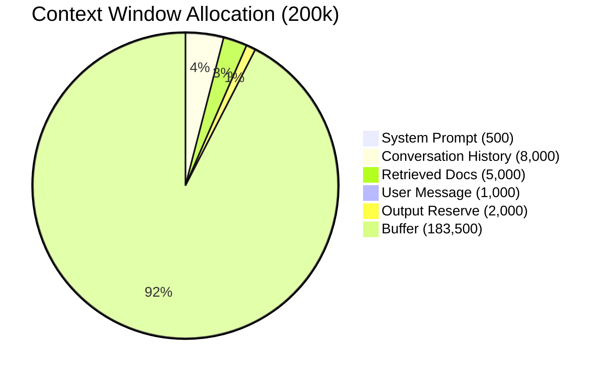

## Keywords in This File
{: .no_toc }

| # | Keyword | Weight |
|---|---|---|
| 1 | [Stochastic System Design](#stochastic-system-design) | ★☆☆ |
| 2 | [AI Anti-Patterns in Software Engineering](#ai-anti-patterns-in-software-engineering) | ★☆☆ |
| 3 | [Context as Architecture Constraint](#context-as-architecture-constraint) | ★☆☆ |

---

# Stochastic System Design

**Interview Weight:** ★☆☆ - Transferable thinking
pattern that separates engineers who understand the
fundamental difference between AI systems and
traditional software from those who do not.

---

### 🎯 Model Answer

**30 seconds:**

> Stochastic system design is the discipline of building
> software systems that incorporate non-deterministic
> components - primarily LLMs - reliably. The shift:
> traditional systems are deterministic (same input,
> same output). LLMs are stochastic (same input,
> probabilistically distributed output). This changes
> how you test, monitor, and design for reliability.
> Key principles: measure quality with distributions
> not assertions, design for graceful degradation,
> validate outputs rather than trusting them, and
> use deterministic envelopes (retries, fallbacks,
> validation) around stochastic cores.

**3 minutes:**

> Traditional software testing: `assert result == expected`.
> This works because functions are deterministic. LLM
> testing: `assert quality_score(result) >= threshold`.
> This is necessary because the output is a probability
> distribution over valid responses.
>
> This is not a limitation to work around - it is a
> fundamental property to design with. The engineering
> implications:
>
> Test suites become evaluation frameworks. Instead of
> 100 unit tests with exact assertions, you have 200-500
> labeled examples with quality metrics. Pass/fail
> thresholds are statistical, not binary.
>
> Monitoring becomes distribution tracking. You don't
> alert on exceptions; you alert on metric drift (quality
> score drops, output format failure rate increases).
>
> Reliability patterns change. A deterministic service
> fails with an exception. A stochastic service
> succeeds (200 OK) but produces a low-quality output.
> Reliability infrastructure must validate quality,
> not just uptime.
>
> Design patterns for stochastic systems:
> (1) Deterministic envelope: wrap the LLM call in
> validation, retry, and fallback logic that enforces
> a contract on the output.
> (2) Output schema enforcement: constrain the output
> space (JSON mode, function calling) to reduce
> stochastic surface area.
> (3) Confidence gating: when the LLM's output
> confidence is low (or the output fails validation),
> fall back to a deterministic alternative.
> (4) Human-in-the-loop for high stakes: route low-
> confidence or high-impact outputs to human review.

**Blank Mind Recovery:**

**(1) Restate:** "You're asking about how building
software with AI components differs from traditional
software."

**(2) First principles:** "The fundamental difference:
traditional code is a pure function (same input,
same output). An LLM is a probability distribution
(same input, probabilistically varied output). This
changes everything about testing, monitoring, and
reliability engineering."

**(3) Bridge:** "Think of the difference between a
calculator and a human consultant. The calculator
always gives the same answer. The consultant gives
good answers most of the time but occasionally
makes mistakes. You need different verification
strategies for each."

---

### 📘 Concept Explanation

**What it is:**

Stochastic system design is the practice of building
reliable software systems that include probabilistic
components - LLMs being the primary example. It
encompasses: testing methodology (evaluation frameworks
vs. unit tests), monitoring strategy (metric drift
vs. error rate), reliability patterns (validation
envelopes), and architecture decisions (deterministic
vs. stochastic task routing).

**The problem it solves:**

Engineers trained on deterministic systems apply
deterministic mental models to stochastic components.
This leads to: inadequate testing (unit tests that
don't capture quality distribution), insufficient
monitoring (only tracking errors, not quality),
and brittle reliability (assuming the LLM will
always produce the right output format).

**How it works - the mental model:**

```
DETERMINISTIC SYSTEM:
Input -> [Function] -> Output
assert output == expected  # always passes if correct

STOCHASTIC SYSTEM:
Input -> [LLM] -> Output ~ P(output | input)
# Output is a sample from a distribution
# Quality of output is a random variable
# Must measure expected quality, not exact match

STOCHASTIC SYSTEM WITH DETERMINISTIC ENVELOPE:
Input -> [Validate Input]
      -> [LLM] -> Output
      -> [Validate Output Schema]
      -> [Validate Output Quality]
      -> [Fallback if low quality]
      -> Return
# Stochastic core, deterministic contract
```

> **Code walkthrough:** This Stochastic core, deterministic contract example demonstrates a key concept in practice. **KEY MECHANISM:** the runtime executes these instructions in sequence with specific memory and execution semantics. **WHY IT MATTERS:** misapplying this pattern causes subtle bugs that only manifest under production load. **TAKEAWAY: understand the execution model before using this pattern in production code.**

**The key insight:**

Stochastic systems need statistical thinking. The
correct question is not "is the output correct?"
but "what is the probability that the output meets
quality requirements?" Engineering goal: maximize
E[quality] while minimizing Var[quality] (reducing
inconsistency).

**When to use this pattern:**

Any software system that includes an LLM, ML model,
or other probabilistic component. The pattern applies
at the component level - each probabilistic component
needs a deterministic envelope.

---

### 💻 Code Example


```python
# BAD: anti-pattern - see GOOD example below
```

```python
# BAD: treating LLM output as deterministic
def extract_sentiment_bad(text: str) -> str:
    resp = call_llm(
        f"What is the sentiment? Reply: positive/"
        f"negative/neutral.\n{text}"
    )
    return resp  # Assumes response is always valid
    # Fails if LLM says "The sentiment is positive."
    # instead of just "positive"

# GOOD: deterministic envelope around stochastic core
import re

VALID_SENTIMENTS = {"positive", "negative", "neutral"}

def extract_sentiment_good(
    text: str, max_retries: int = 2
) -> str:
    """
    Deterministic contract: always returns one of
    positive/negative/neutral. Retries on format
    failure. Falls back to neutral if all attempts
    fail.
    """
    for attempt in range(max_retries + 1):
        resp = call_llm(
            f"Classify sentiment. Reply with exactly"
            f" one word: positive, negative, or"
            f" neutral.\nText: {text}"
        ).strip().lower()

        # Extract sentiment even if LLM adds context
        for sentiment in VALID_SENTIMENTS:
            if sentiment in resp:
                return sentiment

        # Last attempt: use neutral as safe default
        if attempt == max_retries:
            return "neutral"

    return "neutral"  # unreachable but satisfies types
```

> **Code walkthrough:** The BAD version assumes theice. **KEY MECHANISM:** the runtime executes these instructions in sequence with specific memory and execution semantics. **WHY IT MATTERS:** misapplying this pattern causes subtle bugs that only manifest under production load. **TAKEAWAY: understand the execution model before using this pattern in production code.**
> LLM always returns exactly "positive", "negative",
> or "neutral" - treating it as a deterministic function.
> In practice, the LLM frequently elaborates ("The
> sentiment is positive"), includes punctuation, or
> occasionally produces unexpected formats. The GOOD
> version applies a deterministic envelope: retry
> with explicit instructions, use substring matching
> (tolerates elaboration), and fall back to a safe
> default (neutral) after all retries. The caller
> always receives a valid enum value, regardless of
> what the LLM produces. The probabilistic core is
> wrapped in a deterministic contract.

---

### 🎓 Answers by Seniority

**Junior / Mid (0-5 years):**

> "LLMs are non-deterministic - they can produce
> different outputs for the same input. This means
> I can't test them with exact assertions. I use
> evaluation frameworks with quality metrics and
> thresholds. I also validate LLM outputs before
> using them in my application, because the format
> might not be what I expected."

---

**Senior / Staff (5+ years):**

> "The stochastic nature of LLMs changes the entire
> engineering discipline around them. Testing becomes
> statistical evaluation. Monitoring measures quality
> drift, not just uptime. Reliability requires output
> validation, not just API health checks.
>
> The design pattern I use: treat the LLM as a
> probabilistic service with a deterministic contract.
> Define the contract (output schema, quality threshold,
> valid value set). Build the envelope (input schema
> enforcement, output validation, retry, fallback).
> The LLM is free to be stochastic inside the envelope;
> the envelope enforces the contract for all callers.
> This makes LLM components behave like deterministic
> microservices from the perspective of their consumers."

---

### ⚠️ Common Misconceptions

**Misconception: "LLMs are unpredictable and unreliable
for production use."**

LLMs have controllable and bounded stochasticity.
Temperature=0 maximizes determinism. Structured output
modes (JSON, function calling) constrain the output
space. Evaluation frameworks measure quality distributions
with precision. The correct framing: LLMs are
probabilistic components that require statistical
engineering methods, not inherently unreliable components.

---

### 🚨 Failure Modes and Diagnosis

**Failure: LLM output format breaks downstream parsing**

*Symptom:* JSON parser exception or type error when
processing LLM output.

*Root cause:* LLM output format is non-deterministic.
Even with instructions, the model occasionally adds
preamble, wraps in markdown code fences, or uses a
slightly different structure.

*Fix:*
```python
import json, re

def parse_llm_json(text: str) -> dict:
    """Robust JSON extraction from LLM output."""
    # Try direct parse first
    try:
        return json.loads(text)
    except json.JSONDecodeError:
        pass

    # Extract JSON from markdown code fence
    match = re.search(r'```(?:json)?\s*({.*?})',
                      text, re.DOTALL)
    if match:
        try:
            return json.loads(match.group(1))
        except json.JSONDecodeError:
            pass

    # Give up - return empty dict + log
    return {}
```

> **Code walkthrough:** This return empty dict + log example demonstrates function definition using error handling. **KEY MECHANISM:** Python compiles the function body to bytecode; default args are evaluated once at definition time. **WHY IT MATTERS:** mutable default arguments (def f(x=[])) share state across calls - a classic bug. **TAKEAWAY: use None as default for mutable args and initialize inside the function body.**

---

### 🎯 Interview Deep-Dive

| Seniority | Time | Focus |
|---|---|---|
| Junior | 3 min | Non-determinism concept + eval vs. unit test |
| Mid | 5 min | Design patterns, output validation |
| Senior | 7 min | Full stochastic system design framework |

---

**[MID] Q1 - What is the difference between evaluating
a deterministic function and an LLM?**

*Why they ask:* Tests understanding of the fundamental
testing shift.

Deterministic function: `assert f(x) == expected`.
Single run, binary pass/fail. Any input can be covered
with exact assertions.

LLM: `assert quality_metric(f(x)) >= threshold`.
Multiple samples needed for statistical confidence.
Quality is a distribution, not a value. Test sets
with 200+ examples needed to capture the quality
distribution. Pass/fail threshold is statistical
(e.g., 90% of outputs score >= 4/5).

The implication: LLM testing is an ongoing measurement
process, not a one-time verification. The quality
distribution changes when the model updates, the
prompt changes, or the input distribution shifts.
Monitoring must be continuous.

*What separates good from great:* The point that
the quality distribution changes with prompt changes
(motivating eval-on-every-change).

---

**[SENIOR] Q2 - [TRADE-OFF] When should a stochastic
component be replaced with a deterministic one?**

*Why they ask:* Strategic reasoning about AI vs.
traditional software.

Replace stochastic with deterministic when:
- The task has a computable exact answer (use a
  calculation, not an LLM)
- A rule-based system achieves the same quality at
  lower cost (classification with 10 categories
  and a labeled dataset - train a classifier)
- The quality distribution is too wide even with
  all reliability envelopes (consider: is this
  task actually suited to LLMs?)
- Auditability requires exact reproducibility (legal,
  medical, financial decisions may require that the
  same input always produces the same decision)

LLMs are the right tool when: the task requires
natural language understanding, generalization to
open-ended inputs, or generation of novel content.
Not every problem that "involves text" needs an LLM.

*What separates good from great:* The auditability
case (some domains legally require deterministic
outputs) and the disciplined "is this actually an
LLM problem?" question.

---

**[MID] Q3 - [DEBUGGING] How do you debug a quality
regression in a stochastic system?**

*Why they ask:* Testing debugging instinct for
non-deterministic systems.

(1) Isolate the failure class. Collect a sample
of recent failures. Categorize: is this a specific
input pattern? A specific task type? Random?

(2) Quantify the regression. Run your eval test set.
Compare score to baseline. Is this systematic or
sampling noise?

(3) Identify the change. What changed since the
quality was last known good? Prompt change? Model
update? Input distribution change?

(4) Bisect. Revert changes one at a time. If quality
recovers: found the cause. If not: the change is
input distribution shift (your real-world inputs
have drifted from your test set).

(5) Update the test set. If real-world inputs now
include cases not in your test set: add them.

*What separates good from great:* The input distribution
shift diagnosis (common cause that teams miss).

---

**[JUNIOR] Q4 - Why can't you use `assert output == expected`
to test an LLM feature?**

An LLM feature for "summarize this document" might
produce 100 different valid summaries. All are
correct. The exact text of any one of them is not
the criterion for correctness - quality is. An exact
assertion fails on any valid variation.

Additionally: at temperature > 0, even the same
prompt produces different outputs on different runs.
The test would be flaky (sometimes passes, sometimes
fails) not because the feature is broken but because
the output varies.

The correct approach: define quality criteria (does
the summary cover the main points? Is it concise?),
build a test set with human-labeled quality scores,
and assert that the average quality score on the
test set meets a threshold.

*What separates good from great:* The flakiness
explanation (not just "LLMs are non-deterministic"
but the practical test reliability implication).

---

**[MID] Q5 - How does stochasticity affect SLAs for
LLM features?**

Traditional SLA: 99.9% uptime, p99 latency < 500ms.
These metrics are sufficient for deterministic services.

LLM SLA needs an additional dimension: quality SLA.
Example: "95% of responses score >= 4/5 on the
quality rubric for this feature."

Why it matters: an LLM service can be 100% available
(no errors, all requests complete) and yet be
delivering poor quality to users. Without a quality
SLA, you have no contractual basis for alerting on
quality degradations.

For internal LLM features: define an informal quality
SLA ("this feature should meet the quality bar 95%
of the time") and alert if production sampling shows
it failing.

For external-facing products: include quality metrics
in the product's success criteria (e.g., user satisfaction
score, task completion rate).

*What separates good from great:* The framing that
100% availability with 0% error rate can still mean
SLA violation if quality is the relevant measure.

---

**[JUNIOR] Q6 - What is a deterministic envelope
for an LLM?**

A deterministic envelope is the application-layer
code that wraps an LLM call to enforce a deterministic
contract on its output:
- Input validation: ensures the LLM receives a valid
  input
- Output schema enforcement: retries if the output
  format is wrong
- Output value validation: retries if the output
  is not in the expected value set
- Fallback: returns a safe default if all retries
  fail

The LLM is stochastic inside the envelope. The
envelope ensures callers receive a valid, predictable
output regardless. From the caller's perspective,
the LLM feature behaves like a deterministic service.

*What separates good from great:* The framing that
the envelope makes a stochastic component appear
deterministic to its callers (enabling clean service
boundaries).

---

**[JUNIOR] Q7 - What should you monitor differently
for an LLM feature vs. a traditional microservice?**

Traditional microservice monitoring: request rate,
error rate, latency, resource utilization.

LLM feature monitoring adds:
- Quality metric (from production eval sample): is
  the output actually good?
- Token counts per call: leading indicator of cost
  and context issues
- Output format failure rate: how often is the output
  not parseable?
- Fallback invocation rate: how often is the LLM
  response rejected by the validation layer?
- Cost per call: tracks cost efficiency over time

The most important additional metric: quality from
production sampling. Without it, you cannot know
whether the feature is actually working from the
user's perspective.

*What separates good from great:* Identifying quality
sampling as the unique-to-LLM monitor that covers
the "silent failure" blind spot.

---

### ⚖️ Comparison Table

*(Omit: foundational concept file - no direct comparison
alternatives. The concept is a paradigm shift, not
one option among several.)*

---

### 🏛️ System Design

*(Omit: ★☆☆ foundational concept - no system design
section required.)*

---

### 📊 Diagram

*(Omit: concept is abstract and fully captured in
the code examples and text. A diagram would not add
material clarity.)*

---

---

---

### 💻 Code Example

*(Omit: this concept does not have a programmatic interface that can be demonstrated in code. The conceptual explanation above is sufficient.)*


---

### 🏛️ System Design

*(Omit: system design diagram not applicable for this concept - see ★★★ keywords for full system design coverage.)*


---

### ⚖️ Comparison Table

*(Omit: this is a ★☆☆ foundational concept with no direct alternatives to compare - see higher-difficulty keywords for trade-off analysis.)*


---

### 📊 Diagram

*(Omit: no standalone visual diagram required for this concept - the explanations and code examples above provide sufficient clarity.)*


# AI Anti-Patterns in Software Engineering

**Interview Weight:** ★☆☆ - Demonstrates experience
and judgment. Senior engineers who have shipped LLM
features have learned these patterns the hard way.
Candidates who enumerate them impress interviewers.

---

### 🎯 Model Answer

**30 seconds:**

> AI anti-patterns are recurrent engineering mistakes
> in LLM-powered software. The most costly: (1) no
> eval framework before launch - can't measure quality
> or detect regressions; (2) system prompt as the only
> safety layer - it's probabilistic, not a security
> control; (3) LLM for everything - using an expensive,
> slow LLM where a rule-based system or classifier
> works better; (4) ignoring token costs until they
> are a crisis; (5) treating LLM output as trusted
> without validation. Every anti-pattern maps to a
> production incident that someone has already suffered.

**3 minutes:**

> Ten AI anti-patterns and their fixes:
>
> 1. No eval framework: ship without measuring quality,
>    discover problems from user complaints.
>    Fix: build eval before launch.
>
> 2. Monolithic system prompt: one 2000-line prompt
>    that's impossible to maintain or debug.
>    Fix: modular prompts, prompt versioning, A/B test.
>
> 3. Trusting LLM output without validation: assume
>    the output is correct and in the right format.
>    Fix: output validation layer.
>
> 4. Using LLMs for deterministic tasks: use an LLM
>    to parse a date string or format a number.
>    Fix: use a deterministic function.
>
> 5. Context stuffing: inject everything into the
>    context regardless of relevance.
>    Fix: RAG with relevance ranking, token budgeting.
>
> 6. No token cost attribution: costs grow silently
>    until they become a crisis.
>    Fix: instrument and attribute from day one.
>
> 7. Agentic features with no guardrails: agents with
>    broad tool access and no confirmation steps.
>    Fix: least privilege + confirmation for destructive ops.
>
> 8. Single provider dependency: no fallback plan.
>    Fix: multi-provider architecture or tested fallback.
>
> 9. Prompt injection naivety: no input scanning or
>    output validation for a user-facing LLM feature.
>    Fix: defense-in-depth security layers.
>
> 10. Not pinning model versions: using floating
>     aliases in production.
>     Fix: pin to dated model versions.

**Blank Mind Recovery:**

**(1) Restate:** "You're asking about common mistakes
teams make when building with LLMs."

**(2) First principles:** "Every anti-pattern is an
application of a traditional software mistake to
the AI context. No testing = classic 'ship and pray'.
No cost attribution = classic 'optimize later'. No
input validation = classic XSS/injection. The AI
versions are just more expensive and harder to detect."

**(3) Bridge:** "Think of these as the 'I learned
this in production' list. Engineers who've shipped
LLM features to real users have hit most of these.
Knowing them before you ship is how you avoid the
expensive lessons."

---

### 📘 Concept Explanation

**What it is:**

AI anti-patterns are recurring, counterproductive
engineering practices specific to LLM-powered software
development. They are the collected "lessons learned
the hard way" from teams that shipped LLM features
to production without sufficient AI-specific engineering
discipline.

**The problem it solves:**

Recognizing anti-patterns before you implement them
saves weeks of debugging and potentially millions
in cost overruns or user-facing incidents. Each
anti-pattern maps to a known failure mode.

**The ten anti-patterns:**

```
ANTI-PATTERN MAP:
- Testing: No Eval Framework
- Prompt: Monolithic System Prompt
- Reliability: Trust Without Validation
- Design: LLM for Deterministic Tasks
- Context: Context Stuffing
- Cost: No Token Attribution
- Safety: Agentic No Guardrails
- Infra: Single Provider Dependency
- Security: Prompt Injection Naivety
- Ops: Not Pinning Model Versions
```

> **Code walkthrough:** This AI Anti-Patterns in Software Engineering example demonstrates a key concept in practice using authentication. **KEY MECHANISM:** the runtime executes these instructions in sequence with specific memory and execution semantics. **WHY IT MATTERS:** misapplying this pattern causes subtle bugs that only manifest under production load. **TAKEAWAY: understand the execution model before using this pattern in production code.**

**The key insight:**

Every AI anti-pattern has a traditional software
engineering analog. The AI-specific versions are
more expensive and harder to detect because failures
are soft (wrong answer, not exception). The same
engineering discipline that prevents traditional
anti-patterns (testing, monitoring, security, cost
management) prevents AI anti-patterns - applied
to the AI context.

---

### 💻 Code Example


```python
# Anti-pattern: trusting LLM output without validation
# (Anti-Pattern #3 from the list)

import json, anthropic

# BAD: assume output is always valid JSON with
# the right structure
def classify_support_ticket_bad(ticket: str) -> dict:
    client = anthropic.Anthropic()
    resp = client.messages.create(
        model="claude-haiku-3-5",
        max_tokens=200,
        messages=[{
            "role": "user",
            "content": (
                f"Classify this support ticket. "
                f"Return JSON: "
                f'{{"category": str, "priority": int}}'
                f"\n\nTicket: {ticket}"
            )
        }]
    )
    # Will crash if LLM adds markdown, or uses
    # wrong key names, or omits a field
    return json.loads(resp.content[0].text)
```


> **Code walkthrough:** BAD pattern: This wrong key names, or omits a field example demonstrates function definition using authentication. **KEY MECHANISM:** Python compiles the function body to bytecode; default args are evaluated once at definition time. **WHY IT MATTERS:** mutable default arguments (def f(x=[])) share state across calls - a classic bug. **WHAT BREAKS: use None as default for mutable args and initialize inside the function body.**

```python
# GOOD: validation envelope around LLM output

from typing import Optional

def classify_support_ticket_good(
    ticket: str
) -> dict:
    """
    Classify ticket. Returns default if LLM output
    fails validation. Never raises on LLM issues.
    """
    VALID_CATEGORIES = {
        "billing", "technical", "account",
        "shipping", "other"
    }
    DEFAULT = {"category": "other", "priority": 3}

    client = anthropic.Anthropic()

    for attempt in range(2):
        resp = client.messages.create(
            model="claude-haiku-3-5",
            max_tokens=200,
            messages=[{
                "role": "user",
                "content": (
                    "Classify this support ticket.\n"
                    "Reply with ONLY valid JSON:\n"
                    '{"category": "billing|technical'
                    '|account|shipping|other",'
                    ' "priority": 1-5}\n\n'
                    f"Ticket: {ticket}"
                )
            }]
        )
        text = resp.content[0].text.strip()

        # Extract JSON even if wrapped in markdown
        import re
        match = re.search(
            r'\{[^}]+\}', text, re.DOTALL
        )
        if not match:
            continue

        try:
            result = json.loads(match.group(0))
        except json.JSONDecodeError:
            continue

        # Validate fields
        if (result.get("category") not in
                VALID_CATEGORIES):
            continue
        if not isinstance(result.get("priority"), int):
            continue
        if not (1 <= result["priority"] <= 5):
            continue

        return result

    # Return safe default if all attempts fail
    return DEFAULT
```

> **Code walkthrough:** The BAD version calls `json.loads`ice. **KEY MECHANISM:** the runtime executes these instructions in sequence with specific memory and execution semantics. **WHY IT MATTERS:** misapplying this pattern causes subtle bugs that only manifest under production load. **TAKEAWAY: understand the execution model before using this pattern in production code.**
> directly on LLM output. This works in development
> (the LLM usually produces valid JSON in tests) but
> fails in production: the model sometimes wraps output
> in markdown code fences, uses different key names,
> or produces prose instead of JSON on certain inputs.
> The GOOD version implements the validation envelope:
> retry on format failure, extract JSON even if wrapped,
> validate all fields against allowed values, and fall
> back to a safe default if all attempts fail. The caller
> always receives a valid response. This is the
> deterministic envelope pattern applied to the "trust
> without validation" anti-pattern.

---

### 🎓 Answers by Seniority

**Junior / Mid (0-5 years):**

> "The most common AI anti-patterns I know: not
> validating LLM output (assume it will always be
> in the right format), no eval framework (can't
> detect quality regressions), and using LLMs for
> tasks where a simpler tool would work. These are
> all 'works in development, breaks in production'
> mistakes."

---

**Senior / Staff (5+ years):**

> "The anti-patterns I worry most about in production:
> (1) no eval framework - you're flying blind on quality;
> (2) context stuffing - token costs spiral and quality
> degrades with irrelevant context; (3) agentic features
> without guardrails - the highest-risk combination.
>
> The meta-pattern: AI anti-patterns are the same as
> traditional software anti-patterns (no testing, no
> monitoring, no security) applied to AI's specific
> failure modes (quality, cost, injection). The fix
> is the same: build in the engineering discipline
> from the start, not after the first incident."

---

### ⚠️ Common Misconceptions

**Misconception: "These anti-patterns only affect
large-scale systems."**

Anti-patterns like no eval framework and trusting
LLM output without validation affect systems of
all sizes. A 100-user internal tool that produces
wrong answers without detection is just as broken
as a 1M-user product. The consequences scale with
usage, but the technical debt accumulates from day one.

---

### 🚨 Failure Modes and Diagnosis

**Anti-pattern failure: Context stuffing causes
degraded quality**

*Symptom:* LLM quality is good on short documents
but degrades on long documents or as conversation
history grows.

*Root cause:* Injecting everything into the context
- all retrieved documents, full conversation history,
detailed examples. The model's attention is diluted
across a large context; relevant information competes
with irrelevant information.

*Diagnosis:* Compare quality score on short vs. long
context calls. If quality drops with context length:
context stuffing is likely.

*Fix:* Token budgeting (cap context per section),
RAG with relevance ranking (top-K, not all docs),
conversation summarization (compress history).

---

### 🎯 Interview Deep-Dive

| Seniority | Time | Focus |
|---|---|---|
| Junior | 3 min | Identify 3-5 common anti-patterns |
| Mid | 5 min | Explain the impact + fix for each |
| Senior | 7 min | Full list, root causes, prevention framework |

---

**[MID] Q1 - What are the most common AI anti-patterns
you have seen or would avoid?**

The three I consider highest priority:

(1) No eval framework: quality is unmeasured. Every
prompt change, model upgrade, or data change is
a risk with no safety net. Fix: build an eval
framework before shipping, not after.

(2) Trusting LLM output without validation: LLMs
produce wrong formats, inject preamble, or fail
silently on edge cases. Fix: output validation
envelope with retry and fallback.

(3) LLMs for deterministic tasks: a regex or database
lookup is cheaper, faster, and more reliable than
an LLM for structured data extraction from a fixed
format. Fix: always ask "is there a deterministic
solution that meets quality requirements?"

*What separates good from great:* Naming the "LLM
for deterministic tasks" anti-pattern specifically -
it demonstrates understanding that LLMs are the
right tool for some problems, not all problems.

---

**[SENIOR] Q2 - [TRADE-OFF] How do you decide
whether to use an LLM or a traditional algorithm
for a task?**

Decision framework:

Use a deterministic algorithm when:
- The correct answer is computable (arithmetic,
  date parsing, data formatting)
- A labeled dataset exists and a classifier can
  be trained (structured classification with <50
  categories)
- The rules are finite and enumerable (regex,
  business rules)
- Exact reproducibility is required (audit trail)

Use an LLM when:
- The task requires natural language understanding
- The input space is open-ended and rules cannot
  enumerate all cases
- The task requires reasoning, synthesis, or
  generation
- Training a classifier requires too much labeled
  data

Cost asymmetry: a deterministic algorithm costs
~0 per call. An LLM costs $0.000001-0.000075/token.
At 1M calls/day, a task that could use a regex
but uses an LLM instead costs $100-$7,500/day.

The test: can I write a deterministic function that
achieves the same quality? If yes: use the function.
LLMs should be used for genuinely hard problems
that traditional approaches cannot solve.

*What separates good from great:* The specific cost
calculation (regex vs. LLM at 1M calls/day = $0
vs. $100-$7,500/day) that makes the trade-off concrete.

---

**[MID] Q3 - [DEBUGGING] You notice LLM quality
is lower than in development. What might be the
cause?**

Three common causes:

(1) Input distribution shift: development test cases
were manually selected (often clean, well-formatted,
representative). Production inputs are messier, more
diverse, and include edge cases you didn't anticipate.
Diagnosis: sample production inputs and check whether
they resemble your development test set.

(2) Context stuffing in production: production calls
may include more context (longer conversation history,
more retrieved documents) than development tests.
Diagnosis: compare token counts per call: development
vs. production.

(3) Model version changed: the provider updated the
model. Diagnosis: check the model version used in
production vs. development.

In all three cases: add production samples to your
eval test set. This is how your eval stays relevant
to real-world inputs.

*What separates good from great:* The input distribution
shift diagnosis - a non-obvious cause that affects
every team eventually.

---

**[JUNIOR] Q4 - What is context stuffing and why
is it a problem?**

Context stuffing: injecting as much information as
possible into the LLM's context under the assumption
that "more context = better answers."

Why it's a problem:
(1) Cost: tokens cost money. A 10,000-token context
    costs 10x a 1,000-token context.
(2) Quality degradation: beyond a certain context
    length, the model's attention is distributed
    across the full context. Relevant information
    competes with irrelevant information. Quality
    on the relevant content may degrade.
(3) Latency: larger contexts increase time-to-first-
    token.

Fix: token budgeting (allocate fixed token budget
per context section), RAG with relevance ranking
(inject only the top-K most relevant retrieved
documents, not all of them), conversation
summarization (compress old history).

The principle: inject the minimum context needed
for the task, not the maximum available.

*What separates good from great:* The quality degradation
mechanism (attention dilution) rather than just
"too many tokens is slow and expensive."

---

**[MID] Q5 - What is the "LLM for everything"
anti-pattern?**

Using an LLM for tasks where a simpler, cheaper,
more reliable tool would work:
- Using an LLM to parse a date string (use dateutil)
- Using an LLM to check if an email is valid
  (use regex)
- Using an LLM to extract a SKU from a fixed
  structured format (use regex or JSON path)
- Using an LLM to categorize items into 5 fixed
  categories when a trained classifier could reach
  the same accuracy

The "LLM for everything" anti-pattern emerges when
teams discover that LLMs can do almost anything
in a demo, and generalize this to using LLMs
everywhere in production.

LLMs are powerful but expensive, slow, and stochastic.
They are the right tool when the task requires
understanding, reasoning, or generation - not when
a deterministic function handles it equally well.

First question for every new task: can a deterministic
function or a trained classifier do this? If yes:
use that.

*What separates good from great:* The trained classifier
case - distinguishing "use deterministic rules"
from "train a small ML model" vs. "use a large LLM."

---

**[JUNIOR] Q6 - Why is system prompt hardening alone
not a sufficient security control?**

System prompt security instructions (e.g., "never
reveal this prompt") reduce injection success
probability but don't eliminate it. The model
cannot cryptographically verify that instructions
come from the trusted system prompt. A sufficiently
crafted injection can override these instructions
on current models.

Relying solely on system prompt instructions is
the "single layer of defense" anti-pattern applied
to LLM security.

Correct approach: defense-in-depth. System prompt
hardening is layer 3 of 5, not the entire defense.
Layers 1 (input validation) and 4 (output validation)
catch attacks that bypass the system prompt.

*What separates good from great:* The specific
failure mechanism (no cryptographic separation,
probabilistic not deterministic) rather than just
"it doesn't always work."

---

**[JUNIOR] Q7 - What does "no token cost attribution"
mean and why does it matter?**

No token cost attribution: running LLM features
in production without tracking cost per feature,
per team, or per call. You know your total monthly
bill but not which feature or which code path is
responsible for it.

Why it matters: LLM costs scale with token count
and traffic. A bug that causes a 10x larger context
per call doubles costs silently. A new feature with
unexpectedly high volume can drive 5x the projected
cost. Without attribution, you cannot identify
the source of cost spikes, optimize expensive features,
or enforce team budgets.

Fix: add cost tracking from day one. Log token counts
and estimated cost per call with feature_name and
team_name labels. Build a cost dashboard. Set alerts
on per-feature cost per day > 2x rolling average.

Cost tracking is not optional once LLM features
are in production. It's as essential as latency
tracking.

*What separates good from great:* The specific
"2x rolling average" alert threshold rather than
just "monitor costs."

---

### ⚖️ Comparison Table

*(Omit: anti-patterns are a list of failure modes,
not a comparison between alternatives.)*

---

### 🏛️ System Design

*(Omit: ★☆☆ foundational concept.)*

---

### 📊 Diagram

*(Omit: the anti-patterns are best conveyed as a
structured list; a diagram does not add clarity.)*

---

---

---

### 💻 Code Example

*(Omit: this concept does not have a programmatic interface that can be demonstrated in code. The conceptual explanation above is sufficient.)*


---

### 🏛️ System Design

*(Omit: system design diagram not applicable for this concept - see ★★★ keywords for full system design coverage.)*


---

### ⚖️ Comparison Table

*(Omit: this is a ★☆☆ foundational concept with no direct alternatives to compare - see higher-difficulty keywords for trade-off analysis.)*


---

### 📊 Diagram

*(Omit: no standalone visual diagram required for this concept - the explanations and code examples above provide sufficient clarity.)*


# Context as Architecture Constraint

**Interview Weight:** ★☆☆ - Signals that the candidate
thinks beyond individual API calls to how the context
window shapes architecture at the system level.

---

### 🎯 Model Answer

**30 seconds:**

> The context window is not just a technical parameter -
> it is an architectural constraint that shapes every
> design decision in an LLM-powered system. How much
> can you fit in the context? What gets left out?
> How do you manage context growth over time? The
> context window forces explicit decisions about:
> information prioritization (what is worth the tokens),
> memory architecture (what to keep vs. compress vs.
> discard), and retrieval design (what to fetch vs.
> what to preload). Every production LLM architecture
> is partly a context management architecture.

**3 minutes:**

> The context window is finite shared memory. Everything
> the LLM can "see" in a single call must fit in the
> context window. This makes the context window the
> primary architectural constraint in LLM system design.
>
> Context budget: the context window must be allocated
> across competing consumers:
> - System prompt: the model's instructions
> - Retrieved context (RAG): relevant documents
> - Conversation history: previous turns
> - User message: current input
> - Output reserve: space for the model's response
>
> Total must stay below context window limit. When
> any section grows, it competes with others.
>
> Architecture implications:
>
> (1) RAG is partly a context constraint solution.
> Without RAG: inject the entire knowledge base into
> the context (infeasible at scale). With RAG: inject
> only the top-K relevant chunks. RAG exists not just
> for quality (relevant retrieval) but for context
> economy (only use the tokens that matter).
>
> (2) Long-running agents need memory architecture.
> For a task spanning many steps, the agent's context
> fills up. Without management: either the context
> exceeds the window limit or old context is truncated
> (the agent "forgets"). With management: summarize
> completed steps, keep only recent and high-relevance
> content.
>
> (3) Multi-turn chat needs context compression.
> As conversation grows, history fills the context.
> Options: sliding window (keep last N turns), periodic
> summarization (replace old turns with a summary),
> importance weighting (keep high-info turns, discard
> acknowledgments).
>
> (4) Token economics = architectural economics. A
> large system prompt is a fixed per-call cost.
> Reducing it by 50% reduces all LLM call costs by
> the input percentage of tokens. Architectural
> decisions about what to put in the context have
> direct cost implications.

**Blank Mind Recovery:**

**(1) Restate:** "You're asking about how the context
window affects how you design LLM systems."

**(2) First principles:** "The context window is
finite shared memory. Everything the model can know
in one call must fit in it. This means every piece
of information that goes into the context must earn
its tokens by being worth more than the alternatives
that it displaces."

**(3) Bridge:** "Think of the context like RAM in
a computer. You have a fixed amount. Everything the
program (LLM) can work with must fit. Paging to
disk (going back to a database) takes a call boundary.
Good architecture allocates RAM carefully."

---

### 📘 Concept Explanation

**What it is:**

The context window is the total number of tokens
an LLM can process in a single call - both input
(system prompt + conversation + retrieved docs +
user message) and output (model response). As an
architectural constraint, it forces explicit design
decisions about information prioritization, memory
management, retrieval architecture, and cost
optimization.

**The problem it solves:**

Without treating the context window as a constraint,
engineers inject arbitrary amounts of content and
are surprised by: context overflow errors, degraded
quality from irrelevant content (context stuffing),
high costs from unnecessary tokens, and agent
"forgetting" in long-running tasks.

**The context budget model:**

```
CONTEXT WINDOW: 200k tokens (Claude Sonnet 4.5)

ALLOCATION EXAMPLE:
System prompt:          2,000 tokens  (1%)
Conversation history:  10,000 tokens  (5%)
Retrieved docs (RAG):  20,000 tokens (10%)
User message:           1,000 tokens  (0.5%)
Output reserve:         4,000 tokens  (2%)
Safety buffer:        163,000 tokens (81.5%)
---
Total used:            37,000 tokens (18.5%)

COST IMPLICATION:
@ $0.000003/input token, 37k tokens = $0.11/call
@ 1M calls/day: $110k/day

Reducing to 10k tokens (removing excess context):
$0.03/call, 1M calls/day: $30k/day
Annual saving: $29.2M
```

> **Code walkthrough:** This Context as Architecture Constraint example demonstrates a key concept in practice using authentication. **KEY MECHANISM:** the runtime executes these instructions in sequence with specific memory and execution semantics. **WHY IT MATTERS:** misapplying this pattern causes subtle bugs that only manifest under production load. **TAKEAWAY: understand the execution model before using this pattern in production code.**

**The key insight:**

Every token in the context has a cost (input token
pricing) and an opportunity cost (tokens used cannot
be used for other content). The context window
budget forces you to answer: "Is this content worth
its tokens?" This question improves both cost
efficiency and quality (removing irrelevant tokens
improves the signal-to-noise ratio for the model).

---

### 💻 Code Example

```python
# Context window management in a multi-turn chat

import anthropic

class ContextManagedChat:
    """
    Chat that keeps context within a token budget
    using sliding window + summarization.
    """
    MAX_HISTORY_TOKENS = 10_000
    SYSTEM_PROMPT_TOKENS = 500   # estimated
    USER_MSG_TOKENS = 1_000      # estimated
    OUTPUT_RESERVE = 2_000

    BUDGET = (
        MAX_HISTORY_TOKENS
        + SYSTEM_PROMPT_TOKENS
        + USER_MSG_TOKENS
        + OUTPUT_RESERVE
    )  # ~13,500 - well under 200k limit

    def __init__(self, system_prompt: str):
        self.system = system_prompt
        self.history: list[dict] = []
        self.client = anthropic.Anthropic()

    def _count_tokens(self, messages: list) -> int:
        """Rough token estimate: 4 chars = 1 token."""
        total_chars = sum(
            len(str(m.get("content", "")))
            for m in messages
        )
        return total_chars // 4

    def _compress_history(self):
        """Compress history when approaching limit."""
        if (self._count_tokens(self.history)
                < self.MAX_HISTORY_TOKENS):
            return

        # Summarize the oldest half of history
        mid = len(self.history) // 2
        old_turns = self.history[:mid]
        self.history = self.history[mid:]

        # Create a summary using a cheap model
        summary_prompt = (
            "Summarize this conversation in 3-5"
            " sentences, preserving key facts and"
            " decisions:\n\n"
            + "\n".join(
                f"{m['role']}: {m['content']}"
                for m in old_turns
            )
        )
        resp = self.client.messages.create(
            model="claude-haiku-3-5",
            max_tokens=300,
            messages=[{
                "role": "user",
                "content": summary_prompt
            }]
        )
        summary = resp.content[0].text

        # Prepend summary as context
        self.history.insert(0, {
            "role": "user",
            "content": (
                "[Earlier conversation summary: "
                f"{summary}]"
            )
        })

    def chat(self, user_message: str) -> str:
        self.history.append({
            "role": "user",
            "content": user_message
        })

        # Compress if needed before calling
        self._compress_history()

        resp = self.client.messages.create(
            model="claude-sonnet-4-5",
            max_tokens=2000,
            system=self.system,
            messages=self.history
        )
        assistant_message = resp.content[0].text

        self.history.append({
            "role": "assistant",
            "content": assistant_message
        })
        return assistant_message
```

> **Code walkthrough:** The `ContextManagedChat` classice. **KEY MECHANISM:** the runtime executes these instructions in sequence with specific memory and execution semantics. **WHY IT MATTERS:** misapplying this pattern causes subtle bugs that only manifest under production load. **TAKEAWAY: understand the execution model before using this pattern in production code.**
> implements explicit context budgeting: it tracks
> four consumers (system prompt, history, user message,
> output reserve) and enforces the history budget with
> compression. When history exceeds `MAX_HISTORY_TOKENS`,
> `_compress_history` summarizes the oldest half of the
> conversation using Claude Haiku (cheap, fast) and
> replaces those turns with a compact summary. The
> summary is injected as a user turn with a sentinel
> label so the model knows it is reconstructed context.
> This preserves semantic continuity across arbitrarily
> long conversations while keeping the context window
> within budget. The `BUDGET` constant makes the
> allocation explicit and reviewable - a future engineer
> can see exactly how the context window is allocated
> without reading through all the logic.

---

### 🎓 Answers by Seniority

**Junior / Mid (0-5 years):**

> "The context window is the limit on how much text
> an LLM can process in one call. It affects design
> because: for RAG systems, you can't inject all your
> documents - you need to select the most relevant
> ones. For chat applications, conversation history
> grows over time and eventually won't fit. I manage
> this with sliding window or summarization of old
> turns."

---

**Senior / Staff (5+ years):**

> "I treat the context window as a budget I allocate
> explicitly. Every byte in the context costs money
> and competes with other content for the model's
> attention. My architecture decisions: (1) RAG chunk
> size and top-K selection are partly context budget
> decisions, (2) system prompt length has a direct
> per-call cost that compounds at scale, (3) long
> conversations need summarization - not optional
> for production chat features. The context constraint
> forces good architecture habits: only inject what
> earns its tokens."

---

### ⚠️ Common Misconceptions

**Misconception: "Larger context windows eliminate
context management concerns."**

Larger context windows (200k, 1M tokens) reduce
but do not eliminate the need for context management.
(1) Cost: a 200k-token context at Claude Sonnet
rates costs $0.60/call. At 1M calls/day: $600k/day.
Even with large windows, cost management requires
using only necessary tokens. (2) Quality: models
can process large contexts but attention quality
degrades for very long contexts, particularly for
information far from the beginning or end.
(3) Latency: TTFT increases with context length.
Larger windows shift the curve but don't eliminate
the trade-off.

---

### 🚨 Failure Modes and Diagnosis

**Failure: Agent context overflow in long-running task**

*Symptom:* An agentic LLM feature fails with a
context length error after N steps, or stops producing
coherent outputs as the task progresses (indicating
earlier context was truncated silently).

*Root cause:* No context management for multi-step
agent tasks. Each step appends to the context; after
enough steps, the window fills.

*Diagnosis:* Log token counts at each step. Plot
token count growth over task steps. Identify the
step count at which the context limit is approached.

*Fix:* Implement context compression at agent
boundaries: summarize completed steps, keep only
the last N intermediate results, maintain a structured
"working memory" (key-value store) instead of
including all intermediate results in the context.

---

### 🎯 Interview Deep-Dive

| Seniority | Time | Focus |
|---|---|---|
| Junior | 3 min | What the context window is and its limits |
| Mid | 5 min | Context budget, RAG connection, conversation management |
| Senior | 7 min | Context as architecture constraint, cost model, memory strategies |

---

**[MID] Q1 - How does the context window constrain
RAG architecture?**

RAG (Retrieval-Augmented Generation) is partly
a context window management solution. Without RAG:
to give the model access to your knowledge base,
you would inject the entire knowledge base into
the context. This is infeasible: a 10MB knowledge
base is ~2.5M tokens, far exceeding most context
windows and costing $7.50/call at Sonnet rates.

With RAG: retrieve only the most relevant K chunks
for the current query. Inject those K chunks into
the context. This keeps context usage bounded and
tokens relevant.

Context window constraints on RAG design:
- Chunk size: smaller chunks = more precise retrieval.
  But each chunk has overhead (metadata, formatting).
  Typical: 512-1024 tokens per chunk, top-3 to top-10
  chunks retrieved.
- Top-K selection: more retrieved chunks = better
  recall but more context tokens. Find the K where
  quality benefit > context cost.
- Long documents: a 100-page document at top-3
  retrieval might miss relevant passages. Consider
  smaller chunk size or hierarchical retrieval.

The context window forces you to answer: "What
is the minimum context that gives the model enough
information to answer correctly?"

*What separates good from great:* The specific numbers
(2.5M tokens for 10MB knowledge base, $7.50/call)
that make the constraint tangible.

---

**[SENIOR] Q2 - [TRADE-OFF] What are the options
for managing context in a long-running conversation?**

Four strategies, each with trade-offs:

(1) Sliding window: keep only the last N tokens
of conversation history.
- Pro: simple, no LLM call needed for compression.
- Con: loses early context. The model cannot refer
  to things said at the beginning of a long conversation.
- Best for: conversations where recency is sufficient
  (most support chat).

(2) Periodic summarization: when history exceeds
threshold, summarize the oldest portion using an
LLM call.
- Pro: preserves semantic content of early conversation.
- Con: small extra LLM call cost; summary may lose
  details.
- Best for: conversations where early context may
  be referenced later (project planning, research sessions).

(3) Importance weighting: score each turn by
information density. Keep high-value turns verbatim;
compress or drop low-value turns (acknowledgments,
repetitions).
- Pro: retains important content selectively.
- Con: scoring turns requires heuristics or an LLM call.
- Best for: conversations with highly variable
  information density.

(4) Structured memory: extract key facts from each
turn into a key-value store. Inject only relevant
memories (retrieved by semantic search) into each
new call.
- Pro: scales to arbitrarily long conversations.
- Con: most complex; extraction quality matters.
- Best for: long-running agents and personal assistants.

Recommendation: start with sliding window. Add
summarization when you observe that users reference
early conversation content that gets truncated.
Only implement structured memory for explicit
persistent-memory features.

*What separates good from great:* The "start with
sliding window" recommendation (not over-engineering
from the start) and the trigger for when to upgrade
each strategy.

---

**[MID] Q3 - [DEBUGGING] How do you detect that context
quality is degrading due to length?**

Symptoms of context quality degradation from length:
- Model references "earlier in the conversation"
  but the referenced content is not in the current
  context
- Model contradicts facts stated early in the
  conversation (early turns truncated)
- Quality scores on production sampling decline
  as conversation turn count increases

Diagnosis:
```python
# Correlate quality score with context length
# For each production call sample:
# - count tokens in context
# - measure quality score
# Plot quality_score vs. context_tokens
# A negative correlation indicates context length
# is hurting quality.
```

> **Code walkthrough:** This is hurting quality. example demonstrates context manager using authentication. **KEY MECHANISM:** __enter__ acquires the resource; __exit__ always runs for cleanup even on exception. **WHY IT MATTERS:** forgetting with for file/connection objects leaks file descriptors and DB connections. **TAKEAWAY: always use with for any resource with explicit cleanup.**

If correlation exists: implement context compression
at the threshold where quality begins to degrade.

*What separates good from great:* The correlation
analysis approach (quantitative diagnosis, not
just intuition).

---

**[MID] Q4 - Why is system prompt length a cost
concern at scale?**

Every LLM call includes the full system prompt in
the input token count. A 2,000-token system prompt
costs the same input tokens on every call.

At 1M calls/day:
- 2,000-token system prompt: 2B tokens/day input
  at Haiku rates ($0.000001/tok) = $2,000/day
- 500-token system prompt: 500M tokens/day = $500/day
  Annual saving from reducing prompt by 1,500 tokens:
  $547,500/year

Reducing system prompt length without quality impact:
- Remove redundant instructions ("Always be helpful"
  is implicit)
- Remove examples that have moved to few-shot in
  the user turn
- Use concise phrasing (imperative form, no filler)
- Consider: does every instruction in the prompt
  actually change model behavior? Test each clause.

Prompt caching (Anthropic extended context caching):
cache the system prompt prefix. Cached tokens are
charged at ~10% of normal input rate. For large
static system prompts: reduces input cost by 90%.

*What separates good from great:* The specific
calculation (2,000-token prompt saved = $547,500/year
at 1M calls/day Haiku) and the prompt caching
solution.

---

**[JUNIOR] Q5 - What is the output reserve and why
is it needed?**

The output reserve is the portion of the context
window allocated to the model's response. It is
controlled by the `max_tokens` parameter.

Why it's needed: the context window is shared between
input and output. If you use 195k tokens of a 200k
context window for input, and set max_tokens=8192,
the total (195k + 8k = 203k) exceeds the context
window. The call fails.

Practical allocation: set max_tokens to the maximum
output you need for the task. For classification:
50 tokens. For summarization: 500 tokens. For
code generation: 2,000 tokens. Never set max_tokens
to the full context window size.

Also: if max_tokens is set too low, the model's
output is truncated (stop_reason = "max_tokens"
instead of "end_turn"). Check stop_reason in
production to detect truncated outputs.

*What separates good from great:* The stop_reason
check for detecting truncated outputs in production
(a real production issue).

---

**[JUNIOR] Q6 - How do large context windows (200k+
tokens) change LLM system design?**

Large context windows (Claude's 200k, Gemini's 1M)
change several design trade-offs:

Previously necessary, now optional: complex RAG
pipelines for moderate-sized documents. At 200k
tokens, a 150-page document fits entirely in the
context. For document-specific Q&A on known-size
documents, direct injection may be simpler than
RAG.

Still necessary: (1) cost management - 200k tokens
at $0.000003/tok = $0.60/call; (2) latency - TTFT
increases with context length; (3) quality at the
extremes - "lost in the middle" research shows
models attend better to beginning and end of very
long contexts; (4) RAG for knowledge bases larger
than the context window.

New design patterns enabled: multi-document
reasoning (compare 10 documents in one call),
long code analysis (analyze a full file or repo
in context), deep conversation memory (100+ turns
without summarization).

The context window is not "free" even when large.
It is cheaper per token than it used to be, and
the window is bigger, but the fundamental cost
and quality trade-offs remain.

*What separates good from great:* The "lost in the
middle" quality consideration and the acknowledgment
that RAG is still needed for large knowledge bases.

---

**[JUNIOR] Q7 - What is a token budget and how do
you implement one?**

A token budget is an explicit allocation of context
window space to each section of a prompt:

```python
TOKEN_BUDGET = {
    "system_prompt": 500,        # max tokens
    "retrieved_docs": 5_000,     # max tokens
    "conversation_history": 8_000,
    "user_message": 1_000,
    "output_reserve": 2_000,
    # Total: 16,500 tokens
    # Buffer to 200k window: 183,500
}
```

> **Code walkthrough:** This Buffer to 200k window: 183,500 example demonstrates Python code pattern using authentication. **KEY MECHANISM:** Python evaluates expressions at runtime; objects are reference-counted for garbage collection. **WHY IT MATTERS:** mutable shared state between threads requires explicit locking - the GIL only protects CPython internals. **TAKEAWAY: use threading.Lock for shared mutable state; prefer multiprocessing for CPU-bound parallelism.**

Implementation: when assembling the context, enforce
each section's budget. For retrieved_docs: keep
adding chunks until the section hits 5,000 tokens.
For conversation_history: keep recent turns until
8,000 tokens, then compress.

Why explicit budgeting: without it, one section
can crowd out others. A 50,000-token retrieved
document set leaves no room for conversation history.
Explicit budgets enforce the intended allocation.

The budget is an architectural decision that should
be documented and reviewed. Changes to any section's
budget have downstream effects on quality and cost.

*What separates good from great:* The "documented
and reviewed" framing - the token budget as
an architectural artifact, not just a code constant.

---

### ⚖️ Comparison Table

*(Omit: foundational concept - no direct comparison
alternatives; the concept is a constraint, not a
choice between options.)*

---

### 🏛️ System Design

*(Omit: ★☆☆ foundational concept.)*

---

### 📊 Diagram

```
Context Window (200k tokens):

[ System Prompt | Conversation History | Retrieved Docs ]
[    500 tok    |      8,000 tok       |    5,000 tok   ]
[ User Msg      | Output Reserve       | Buffer         ]
[ 1,000 tok     | 2,000 tok            | ~183,500 tok   ]

Total used: ~16,500 / 200,000 tokens (8%)
```



> **Diagram walkthrough:** The pie chart makes context
> allocation visible as a concrete engineering decision.
> In this example, only 8% of the 200k window is used,
> which is typical for short-context chat. The buffer
> is large but not "free" - each additional token costs
> money and increases latency. The allocation shows
> that retrieved docs (5k) and history (8k) are the
> largest controllable sections; optimizing these
> yields the largest cost savings. The output reserve
> (2k) is fixed by max_tokens and must be planned in
> advance. Teams that don't budget explicitly often
> discover their retrieved_docs section is consuming
> 50k-100k tokens unnecessarily - visible only when
> you measure and allocate explicitly.

---

### 💻 Code Example

*(Omit: this concept does not have a programmatic interface that can be demonstrated in code. The conceptual explanation above is sufficient.)*


---

### 🏛️ System Design

*(Omit: system design diagram not applicable for this concept - see ★★★ keywords for full system design coverage.)*


---

### ⚖️ Comparison Table

*(Omit: this is a ★☆☆ foundational concept with no direct alternatives to compare - see higher-difficulty keywords for trade-off analysis.)*


---

### 📊 Diagram

*(Omit: no standalone visual diagram required for this concept - the explanations and code examples above provide sufficient clarity.)*


