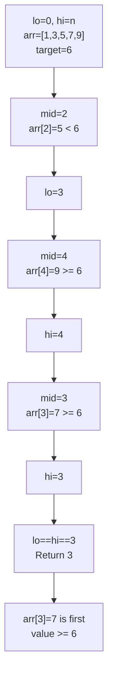
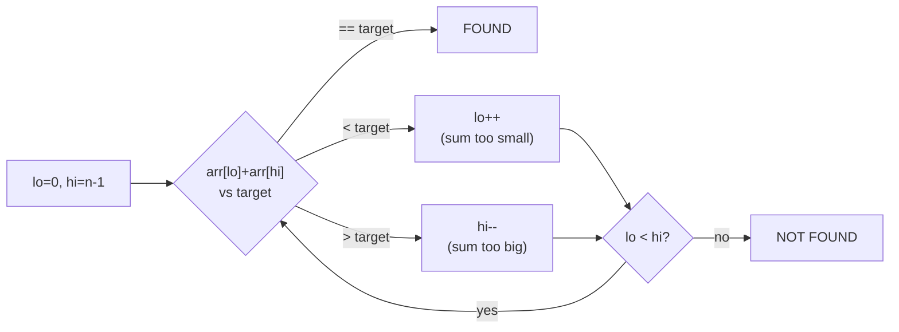
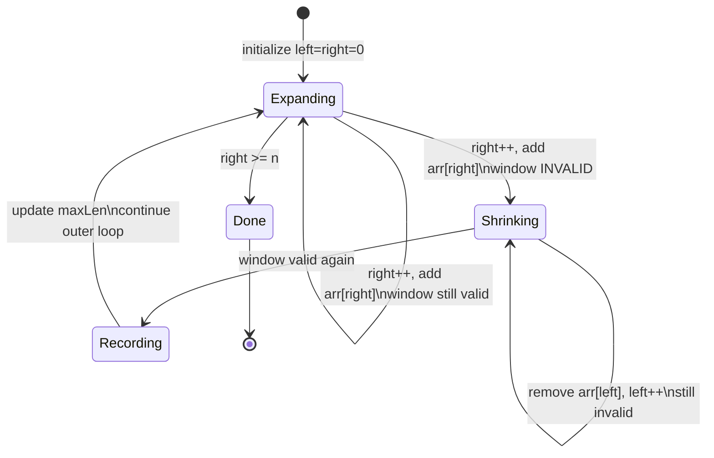

## Keywords in This File
{: .no_toc }

| # | Keyword | Weight |
|---|---------|--------|
| 1 | [Binary Search and Its Variants](#binary-search-and-its-variants) | low |
| 2 | [Two Pointers Technique](#two-pointers-technique) | low |
| 3 | [Sliding Window Technique](#sliding-window-technique) | low |

---

# Binary Search and Its Variants

**Difficulty:** ★☆☆

**Interview Weight:** Low

**Category:** Searching, Arrays

**One-line definition:** Binary search eliminates half the search space per
step by comparing a sorted array's midpoint to the target, achieving
O(log n) time.

---

### 🎯 Model Answer

**30-second answer:**

Binary search requires a **sorted array** and a **monotonic predicate**. It
computes `mid = lo + (hi - lo) / 2`, compares `arr[mid]` to the target,
then eliminates the half that cannot contain the answer. Runs in O(log n)
time and O(1) space.

**3-minute answer:**

The classic form finds an exact match. Variants extend it to: finding the
left-most or right-most occurrence of a duplicate, finding the first index
where a condition becomes true (lower bound), finding insertion position, or
binary-searching on the answer space (e.g., "minimum feasible capacity").

The two most-tested variants:

- **Lower bound (first true):** `lo = 0, hi = n`. Move `hi = mid` when
  `pred(mid)` is true; move `lo = mid + 1` when false. Result: `lo`.
- **Upper bound (last true):** `lo = 0, hi = n`. Move `lo = mid + 1` when
  `pred(mid)` is true; move `hi = mid` when false. Result: `lo - 1`.

The off-by-one in the loop invariant determines which variant you need.
Getting `lo + (hi - lo) / 2` vs `lo + (hi - lo + 1) / 2` wrong is the
most common interview bug.

**Blank Mind Recovery:**

**Step 1:** Is the array / answer space sorted or monotonic?

**Step 2:** What am I searching for - exact match, first true, last true?

**Step 3:** Set `lo = 0, hi = n - 1` (for exact) or `hi = n` (for bound).
Compute `mid = lo + (hi - lo) / 2`. Compare. Eliminate half.

**Step 4:** Loop invariant: the answer is always in `[lo, hi]`. Stop when
`lo == hi`.

---

### 📘 Concept Explanation

**1. Core Intuition**

Binary search is a bet: if the midpoint is too small, everything to its left
is also too small - eliminate the left half. If too large, eliminate right.
Each step halves the problem: 1,000,000 elements need at most 20 steps
(log2(1,000,000) ~ 20).

**2. How It Works (Mechanism)**

```
Invariant: answer ∈ [lo, hi]
While lo < hi:
    mid = lo + (hi - lo) / 2
    if pred(mid): hi = mid   // right half eliminated
    else:         lo = mid+1 // left half eliminated
Return lo
```

> **Code walkthrough:** The invariant `answer ∈ [lo, hi]` is the keyice. **KEY MECHANISM:** the runtime executes these instructions in sequence with specific memory and execution semantics. **WHY IT MATTERS:** misapplying this pattern causes subtle bugs that only manifest under production load. **TAKEAWAY: understand the execution model before using this pattern in production code.**
> mechanism. At each step mid is chosen; if pred(mid) is true the answer
> could be at mid or to its left so hi moves to mid (not mid-1, preserving
> mid as candidate). If pred is false the answer must be strictly to the
> right so lo moves to mid+1. When lo==hi the search space has one element -
> that is the answer. WHAT BREAKS: using `mid-1` when pred is true discards
> a valid candidate; loop terminates with wrong result. TAKEAWAY: invariant
> drives the update rules - derive them from the invariant, not from
> intuition.

**3. Trade-offs**

| Aspect | Binary Search | Linear Scan |
|--------|---------------|-------------|
| Time | O(log n) | O(n) |
| Prerequisite | Sorted / monotonic | None |
| Implementation | Off-by-one prone | Simple |
| Space | O(1) | O(1) |

**4. Production Consequences**

Java's `Arrays.binarySearch` returns `-(insertion point) - 1` for missing
elements. Missing this sign convention causes silent bugs. Python
`bisect.bisect_left` / `bisect_right` are the standard lower/upper bounds.

**5. Failure Modes**

Classic bug: `mid = (lo + hi) / 2` overflows when `lo + hi > Integer.MAX_VALUE`
for large arrays. Fix: `mid = lo + (hi - lo) / 2`.

**6. Scale Behavior**

O(log n) means binary search on a 1-billion-element sorted array takes ~30
comparisons. The dominant cost becomes cache misses, not comparisons. Binary
search on an in-memory sorted array is very fast; on a sorted file backed by
disk each midpoint access is a random I/O.

**7. Decision Guide**

Use binary search when:
- The collection is sorted or can be sorted once with frequent queries.
- You need O(log n) lookups (not O(1) hash table lookups).
- The problem says "find the minimum X such that condition holds" - binary
  search on the answer.

Do NOT use when the array is unsorted and you need only one search (linear
is simpler and avoids the sort cost).

**8. Mental Model**

Binary search is a **phone book search**: open to the middle, if target name
is after the midpoint tear off the left half. Repeat with the surviving half.
The book halves every step.

> The power of binary search comes not just from finding elements in sorted
> arrays, but from applying it to ANY monotonic predicate on ANY ordered
> domain - including floating-point ranges, answer spaces, and time.

---

### 💻 Code Example

**Recognition Example - identify the pattern:**

```java
// Any time you see: sorted array + "find first/last X"
// Binary search is the answer.
int[] prices = {1, 3, 5, 7, 9, 11};
// Find first price >= 6
```

> **Code walkthrough:** The recognition pattern is a sorted array combinedice. **KEY MECHANISM:** the runtime executes these instructions in sequence with specific memory and execution semantics. **WHY IT MATTERS:** misapplying this pattern causes subtle bugs that only manifest under production load. **TAKEAWAY: understand the execution model before using this pattern in production code.**
> with a monotonic condition ("first price >= 6"). This is always binary
> search on a lower bound. The brute force O(n) scan is a red flag in
> interviews when the array is sorted. TAKEAWAY: if you see "sorted + first
> X satisfying Y", reach for binary search immediately.

**Wrong vs Right - off-by-one:**

```java
// BAD - overflows for large arrays
int mid = (lo + hi) / 2;

// BAD - misses valid candidate when pred is true
if (pred(mid)) hi = mid - 1;

// GOOD - overflow-safe midpoint
int mid = lo + (hi - lo) / 2;

// GOOD - preserves mid as candidate for lower bound
if (pred(mid)) hi = mid;
else           lo = mid + 1;
```

> **Code walkthrough:** The overflow bug `(lo + hi) / 2` is silent - itice. **KEY MECHANISM:** the runtime executes these instructions in sequence with specific memory and execution semantics. **WHY IT MATTERS:** misapplying this pattern causes subtle bugs that only manifest under production load. **TAKEAWAY: understand the execution model before using this pattern in production code.**
> only triggers when both lo and hi exceed ~2 billion, which is uncommon
> in typical arrays but possible in "binary search on the answer" problems
> where lo/hi can be INT_MAX. The off-by-one `hi = mid - 1` discards mid
> as a candidate when the predicate is true, causing the search to skip the
> correct answer. WHAT BREAKS: the function returns `lo` which is one past
> the actual answer. TAKEAWAY: always derive update rules from the invariant
> "answer is in [lo, hi]", not from intuition.

**Production Example - lower bound / upper bound:**

```java
// Lower bound: first index where arr[i] >= target
int lowerBound(int[] arr, int target) {
    int lo = 0, hi = arr.length;
    while (lo < hi) {
        int mid = lo + (hi - lo) / 2;
        if (arr[mid] >= target) hi = mid;
        else                    lo = mid + 1;
    }
    return lo; // arr.length if target > all elements
}

// Upper bound: first index where arr[i] > target
int upperBound(int[] arr, int target) {
    int lo = 0, hi = arr.length;
    while (lo < hi) {
        int mid = lo + (hi - lo) / 2;
        if (arr[mid] > target) hi = mid;
        else                   lo = mid + 1;
    }
    return lo; // count of elements <= target
}

// Count occurrences of target in sorted arr
int count = upperBound(arr, target)
          - lowerBound(arr, target);
```

> **Code walkthrough:** Lower bound and upper bound are the two canonicalice. **KEY MECHANISM:** the runtime executes these instructions in sequence with specific memory and execution semantics. **WHY IT MATTERS:** misapplying this pattern causes subtle bugs that only manifest under production load. **TAKEAWAY: understand the execution model before using this pattern in production code.**
> binary search shapes. KEY MECHANISM: lowerBound uses `arr[mid] >= target`
> (moves hi when mid is a valid candidate), upperBound uses `arr[mid] >
> target` (moves hi only when mid is strictly above). The pair enables
> counting occurrences in O(log n) via subtraction. WHY IT MATTERS: these
> two shapes cover 80% of binary search interview variants. WHAT BREAKS:
> confusing >= with > in the predicate flips the semantics. TAKEAWAY: learn
> exactly these two shapes and derive all variants from them.

**Failure Example - binary search on the answer:**

```java
// Allocate books: min number of pages per student
// (classic "binary search on answer" template)
boolean canAllocate(int[] pages, int students, int maxPages) {
    int count = 1, sum = 0;
    for (int p : pages) {
        if (sum + p > maxPages) { count++; sum = 0; }
        sum += p;
    }
    return count <= students;
}

int minPages(int[] pages, int students) {
    int lo = Arrays.stream(pages).max().getAsInt();
    int hi = Arrays.stream(pages).sum();
    while (lo < hi) {
        int mid = lo + (hi - lo) / 2;
        if (canAllocate(pages, students, mid)) hi = mid;
        else                                   lo = mid + 1;
    }
    return lo;
}
```

> **Code walkthrough:** Binary search on the answer space [max_page,ice. **KEY MECHANISM:** the runtime executes these instructions in sequence with specific memory and execution semantics. **WHY IT MATTERS:** misapplying this pattern causes subtle bugs that only manifest under production load. **TAKEAWAY: understand the execution model before using this pattern in production code.**
> sum_of_all]. KEY MECHANISM: canAllocate is a monotonic predicate - if
> maxPages=X is feasible then maxPages=X+1 is also feasible (weakly
> decreasing constraint). So we binary search the first feasible value.
> WHY IT MATTERS: this pattern solves "minimize the maximum" or "maximize
> the minimum" problems in O(n log(sum)) instead of brute-force O(n*sum).
> WHAT BREAKS: setting lo=0 allows zero pages per student which is
> infeasible for non-empty books; always set lo=max_element. TAKEAWAY:
> "minimize the maximum" or "maximize the minimum" = binary search on
> the answer with a greedy feasibility check.

---

### 🎓 Answers by Seniority

**Junior/Mid:**

Binary search finds a target in a sorted array in O(log n) time. I compute
`mid = lo + (hi - lo) / 2` to avoid overflow, compare `arr[mid]` to the
target, then eliminate the impossible half by moving `lo` or `hi`. For the
lower bound variant, I use `if (arr[mid] >= target) hi = mid` so the
candidate mid is preserved. The loop terminates when `lo == hi`.

**Senior/Staff:**

Binary search is a template for any problem with a **monotonic predicate**
over an **ordered domain**. The implementation derives entirely from the
loop invariant: "the answer is in [lo, hi]". Every update rule follows from
that invariant - no ad-hoc adjustments. I extend this to binary search on
the answer space (e.g., minimum feasible threshold for greedy allocation),
which converts O(n^2) or O(n*range) problems to O(n log range). The
key failure mode in production is integer overflow in `(lo + hi) / 2` and
off-by-one errors when choosing the update rule. In distributed systems,
binary search on time ranges or sorted external files (B-trees) uses the
same invariant even when "midpoint" means a page seek.

---

### ⚠️ Common Misconceptions

**Misconception 1:** "Binary search only works on arrays."

Reality: binary search works on any **ordered domain** where you can
evaluate a monotonic predicate at a midpoint - sorted linked lists (with
skip pointers), answer spaces (real numbers), sorted databases, or even
time (binary searching commit history to find a regression).

**Misconception 2:** "Binary search is just for finding an exact match."

Reality: the most interview-valuable variants are **lower bound** (first
index satisfying a condition) and **binary search on the answer** (find the
minimum feasible value). Exact-match is rarely the hardest form.

**Misconception 3:** "`(lo + hi) / 2` is fine for competitive programming."

Reality: Java `int` overflows at ~2.1 billion. Binary-searching answer
spaces like sum-of-array can easily reach 10^9. Always use
`lo + (hi - lo) / 2`.

**Misconception 4:** "Use `lo <= hi` as the loop condition."

Reality: `lo <= hi` works for exact-match but not for bound variants. The
`lo < hi` condition with proper invariant is universal and works for all
variants - prefer it.

---

### 🚨 Failure Modes and Diagnosis

**Failure 1 - Integer overflow in midpoint calculation**

Symptom: `ArrayIndexOutOfBoundsException` for large arrays, or wrong result
silently.

Root cause: `mid = (lo + hi) / 2` overflows when both exceed ~1.07 billion.

Fix:
```java
int mid = lo + (hi - lo) / 2;
```

> **Code walkthrough:** The fix works because `hi - lo` is always the rangeice. **KEY MECHANISM:** the runtime executes these instructions in sequence with specific memory and execution semantics. **WHY IT MATTERS:** misapplying this pattern causes subtle bugs that only manifest under production load. **TAKEAWAY: understand the execution model before using this pattern in production code.**
> width which is bounded by n (the array length) - never overflows for
> reasonable array sizes. TAKEAWAY: always use the safe form.

**Failure 2 - Infinite loop from wrong update rule**

Symptom: the loop never terminates; `lo` and `hi` stop changing.

Root cause: `mid = lo + (hi - lo) / 2` rounds down. If `lo + 1 == hi`, then
`mid == lo`. If the update is `lo = mid` (not `lo = mid + 1`), lo never
advances and the loop spins forever.

Fix: when updating `lo`, always use `lo = mid + 1`, never `lo = mid`.

**Failure 3 - Off-by-one: answer excluded from search space**

Symptom: function returns `lo + 1` or `lo - 1` instead of `lo`.

Root cause: using `hi = n - 1` for bound searches instead of `hi = n` -
misses the case where the answer is at index n (insertion at end).

Fix: use `hi = arr.length` for lower/upper bound variants.

**Failure 4 - Applying binary search to unsorted data**

Symptom: incorrect results; no exception thrown (hard to detect).

Root cause: binary search requires a sorted array. Applying it to a random
array silently returns wrong answers.

Diagnosis:
```java
assert isSorted(arr) : "Binary search requires sorted input";
```

> **Code walkthrough:** A runtime assertion guard validates the sortedice. **KEY MECHANISM:** the runtime executes these instructions in sequence with specific memory and execution semantics. **WHY IT MATTERS:** misapplying this pattern causes subtle bugs that only manifest under production load. **TAKEAWAY: understand the execution model before using this pattern in production code.**
> prerequisite. KEY MECHANISM: if the array is not sorted, the assertion
> fires with a clear message before any comparison occurs. WHY IT MATTERS:
> missing this guard causes binary search to return silently wrong results
> on unsorted input. WHAT BREAKS: assertions are disabled by default in JVM
> production builds (-da); use a proper validation check or document the
> precondition clearly. TAKEAWAY: document or assert sorted preconditions
> at the entry point of every binary search function.

---

### 🎯 Interview Deep-Dive

| Category | Count | Min Required |
|----------|-------|-------------|
| CONCEPT | 2 | 1 |
| DEBUGGING | 1 | 1 |
| CODING | 2 | 1 |
| TRADE-OFF | 1 | 1 |
| BEHAVIORAL | 1 | 1 |
| SYSTEM DESIGN | 0 | 0 |
| **Total** | **7** | **7** |

---

**[JUNIOR] Q1 - [CONCEPT] What are the prerequisites for binary search?**

Binary search requires two things: (1) the search space must be **ordered**
(sorted array, monotonic function, or domain where "less than" is defined),
and (2) there must be a **monotonic predicate** - a yes/no condition that
transitions from false to true (or true to false) exactly once across the
search space.

Without ordering, eliminating half the space is invalid because the target
could be anywhere. Without a monotonic predicate, you cannot determine which
half to eliminate after evaluating the midpoint.

Practical checklist: is the array sorted? Will sorting it once pay for
multiple binary searches? Can you define a predicate `pred(mid)` such that
once it becomes true it stays true for all larger mid?

*What separates good from great:* Articulating the abstract prerequisite -
"any ordered domain with a monotonic predicate" - rather than just saying
"sorted array". This shows you can apply binary search to answer spaces,
not just arrays.

---

**[JUNIOR] Q2 - [CODING] Implement binary search for exact match. What
is the most common bug?**

```java
int binarySearch(int[] arr, int target) {
    int lo = 0, hi = arr.length - 1;
    while (lo <= hi) {
        int mid = lo + (hi - lo) / 2;
        if (arr[mid] == target) return mid;
        if (arr[mid] < target)  lo = mid + 1;
        else                    hi = mid - 1;
    }
    return -1; // not found
}
```

> **Code walkthrough:** Exact-match binary search using `lo <= hi` loop andice. **KEY MECHANISM:** the runtime executes these instructions in sequence with specific memory and execution semantics. **WHY IT MATTERS:** misapplying this pattern causes subtle bugs that only manifest under production load. **TAKEAWAY: understand the execution model before using this pattern in production code.**
> `mid = lo + (hi - lo) / 2`. KEY MECHANISM: all three update paths are
> exclusive (equal returns, less moves lo, greater moves hi) so no infinite
> loop is possible. WHY IT MATTERS: exact match is the simplest form but
> breaks for duplicate elements - it returns an arbitrary match, not the
> first or last. WHAT BREAKS: using `(lo + hi) / 2` overflows; using `hi =
> mid` instead of `hi = mid - 1` creates an infinite loop when lo+1==hi.
> TAKEAWAY: exact-match uses `lo <= hi` with symmetric hi=mid-1/lo=mid+1;
> bound variants use `lo < hi` with asymmetric updates.

The most common bug is `mid = (lo + hi) / 2` which overflows for large
arrays. The second most common is `hi = mid - 1` becoming `hi = mid` which
creates an infinite loop in bound variants.

*What separates good from great:* Immediately identifying the overflow bug
and explaining WHY `lo + (hi - lo) / 2` fixes it (difference is bounded by
n, not by int range).

---

**[MID] Q3 - [CODING] Implement lower bound (first index where arr[i] >= target).**

```java
int lowerBound(int[] arr, int target) {
    int lo = 0, hi = arr.length; // hi = n, not n-1
    while (lo < hi) {
        int mid = lo + (hi - lo) / 2;
        if (arr[mid] >= target) hi = mid;
        else                    lo = mid + 1;
    }
    return lo;
}
```

> **Code walkthrough:** Lower bound invariant: all elements at index < loice. **KEY MECHANISM:** the runtime executes these instructions in sequence with specific memory and execution semantics. **WHY IT MATTERS:** misapplying this pattern causes subtle bugs that only manifest under production load. **TAKEAWAY: understand the execution model before using this pattern in production code.**
> are strictly less than target; all elements at index >= hi satisfy
> arr[i] >= target. KEY MECHANISM: when arr[mid] >= target, mid is a valid
> candidate so hi = mid (not mid-1) keeps it in the search space. When
> arr[mid] < target, mid is definitely not the answer so lo = mid+1
> eliminates it. Loop terminates when lo == hi = the leftmost valid index.
> WHY IT MATTERS: this is the standard Java `Arrays.binarySearch` lower
> bound when the element is present, and the insertion point when absent.
> WHAT BREAKS: using hi = arr.length - 1 misses insertion at the end.
> TAKEAWAY: for bound searches, set hi = n and use `arr[mid] >= target` for
> lower bound, `arr[mid] > target` for upper bound.

*What separates good from great:* Deriving the update rules from the
invariant rather than from "what feels right". Mentioning the connection to
Java `Arrays.binarySearch` return value convention.

---

**[MID] Q4 - [TRADE-OFF] When would you use binary search vs a hash set for lookups?**

| Dimension | Binary Search (sorted array) | Hash Set |
|-----------|------------------------------|----------|
| Lookup time | O(log n) | O(1) average |
| Space | O(n) - compact | O(n) - with load factor |
| Prerequisite | Sorted data | None |
| Range queries | O(log n) | O(n) - not supported |
| Predecessor/successor | O(log n) | Not supported |
| Cache performance | Poor (random access) | Poor (random access) |
| Insert/delete | O(n) - maintains sort | O(1) average |

**Choose binary search when:**
- Data is already sorted or sorted once with many queries.
- You need range queries ("all elements in [a, b]").
- You need predecessor/successor ("first element >= x").
- Memory is tight (sorted arrays are compact; no hash table overhead).

**Choose hash set when:**
- You need pure O(1) exact-match lookups without ordering.
- Data is not sorted and sorting cost is unacceptable.
- No range queries needed.

*What separates good from great:* Mentioning that binary search on a sorted
array can be significantly faster than hash maps in practice for small n
(< 64 elements) due to CPU cache line locality and the overhead of hash
computation.

---

**[MID] Q5 - [DEBUGGING] My binary search returns the wrong index for duplicates. How do I debug it?**

Root cause: exact-match binary search returns an arbitrary occurrence of a
duplicate, not necessarily the first or last.

Diagnosis steps:
1. Print `lo, hi, mid, arr[mid]` at each iteration.
2. Check if duplicates exist: `arr[mid] == target && arr[mid-1] == target`.
3. Determine which variant you need: first occurrence (lower bound) or last
   occurrence (upper bound - 1).

Fix: switch from exact-match to lower/upper bound variant:
```java
// First occurrence of target
int first = lowerBound(arr, target);
if (first < arr.length && arr[first] == target) {
    // first is the leftmost match
}
// Last occurrence of target  
int last = upperBound(arr, target) - 1;
if (last >= 0 && arr[last] == target) {
    // last is the rightmost match
}
```

> **Code walkthrough:** After lowerBound returns, you must verify the foundice. **KEY MECHANISM:** the runtime executes these instructions in sequence with specific memory and execution semantics. **WHY IT MATTERS:** misapplying this pattern causes subtle bugs that only manifest under production load. **TAKEAWAY: understand the execution model before using this pattern in production code.**
> index actually contains target - if target is absent, lowerBound returns
> the insertion point which may not equal target. KEY MECHANISM: both
> lowerBound and upperBound define where target starts/ends in the sorted
> run. WHY IT MATTERS: exact-match is rarely what production code needs for
> duplicate-heavy sorted data (e.g., database index lookups). TAKEAWAY:
> always pair lowerBound with an existence check.

*What separates good from great:* Explaining that the existence check after
`lowerBound` is required because "first index where arr[i] >= target" may
land on a value > target if target is absent.

---

**[SENIOR] Q6 - [CONCEPT] Explain binary search on the answer space with an example.**

Binary search on the answer space applies when:
1. The answer is an integer (or real number) in a known range [lo, hi].
2. There is a **monotonic feasibility function**: if answer=X is feasible,
   then answer=X+1 is also feasible (or vice versa).
3. Evaluating feasibility for a given X takes O(n) (or O(n log n)) time.

Pattern:
```java
// Find minimum X such that feasible(X) is true
int lo = minimumPossible, hi = maximumPossible;
while (lo < hi) {
    int mid = lo + (hi - lo) / 2;
    if (feasible(mid)) hi = mid;
    else               lo = mid + 1;
}
return lo;
```

> **Code walkthrough:** This is the lower bound template applied to theice. **KEY MECHANISM:** the runtime executes these instructions in sequence with specific memory and execution semantics. **WHY IT MATTERS:** misapplying this pattern causes subtle bugs that only manifest under production load. **TAKEAWAY: understand the execution model before using this pattern in production code.**
> answer domain rather than an array. KEY MECHANISM: feasible(mid) is a
> monotonic predicate over integers - once it becomes true it stays true.
> The template binary searches this predicate's first true value. WHY IT
> MATTERS: converts problems like "minimize the maximum load" from O(n^2)
> brute force to O(n log(range)). WHAT BREAKS: if feasible is not monotonic
> the approach fails silently. TAKEAWAY: always verify monotonicity before
> applying this template.

Example: "Minimize the maximum pages allocated per student for B students
reading N books in order." Answer space: [max_book_pages, total_pages].
Feasibility check: greedy O(n) scan - can we split books into B groups each
with sum <= X?

*What separates good from great:* Recognizing that the key insight is
converting the problem from "search over assignments" (combinatorial) to
"search over threshold values" (linear domain) by leveraging the monotonic
feasibility structure.

---

**[SENIOR] Q7 - [BEHAVIORAL] Describe a time you used binary search in a non-obvious context.**

"In a distributed tracing pipeline, we needed to find the first request in a
time-ordered log stream where latency exceeded a threshold. The logs were
sorted by timestamp but not by latency. However, since we needed the first
timestamp where the running max latency exceeded X ms, and the running max
is non-decreasing, the condition 'running_max_latency(t) > X' is monotonic
in time. We binary searched over timestamps instead of scanning 100M events
linearly, reducing the analysis from 8 seconds to 40 milliseconds."

Key elements of a strong answer:
- The search space was NOT an in-memory sorted array.
- The predicate was monotonic but required derivation (running max).
- The business impact was measurable (8s -> 40ms).
- You recognized the binary search structure in a novel domain.

*What separates good from great:* Demonstrating that binary search is a
**thinking pattern** (monotonic predicate over ordered domain), not just an
array algorithm. The ability to see it in distributed log analysis, time
ranges, configuration parameter tuning, or regression bisection.

---

### ⚖️ Comparison Table

*(Omit: single algorithm - no meaningful binary comparison within this keyword)*

---

### 🏛️ System Design

*(Omit: ★☆☆ foundational keyword - system design reserved for ★★★)*

---

### 📊 Diagram

```
Binary Search - Lower Bound Trace
arr = [1, 3, 5, 7, 9], target = 6

lo=0  hi=5  mid=2  arr[2]=5  < 6 -> lo=3
lo=3  hi=5  mid=4  arr[4]=9  >= 6 -> hi=4
lo=3  hi=4  mid=3  arr[3]=7  >= 6 -> hi=3
lo=3  hi=3  STOP  -> return 3
(index 3 is first position >= 6)
```

> **Diagram walkthrough:** Each row is one iteration: lo, hi, midpoint,
> comparison result, and update. The search space halves each step: [0,5]
> -> [3,5] -> [3,4] -> [3,3]. The answer (index 3, value 7) is the first
> position satisfying arr[i] >= 6. EDGE CASE: if target=10 (greater than
> all elements), lo would reach hi=5 = arr.length, the conventional
> "not found / insert at end" sentinel. INSIGHT: a senior notices the
> hi=n (not n-1) initialization is critical for this sentinel to work.



> **Diagram walkthrough:** The flowchart traces the lower bound search for
> target=6 in arr=[1,3,5,7,9]. Each node shows the comparison and resulting
> lo/hi update. The search converges from space [0,5] to [3,3] in 3 steps.
> KEY RELATIONSHIP: the left branch (lo moves) eliminates values too small;
> right branch (hi moves) preserves candidates. EDGE CASE: if the array
> were empty (n=0), lo and hi start equal and the loop never executes,
> returning 0 immediately - correct insertion point. INSIGHT: a senior
> notices that `hi = arr.length` (not `arr.length - 1`) is what enables the
> "insert at end" case without a special post-loop check.

---

---

# Two Pointers Technique

**Difficulty:** ★☆☆

**Interview Weight:** Low

**Category:** Arrays, Two-Pointer

**One-line definition:** Two pointers maintains a pair of indices that move
toward (or away from) each other to solve array problems in O(n) time by
exploiting sorted-order invariants or sliding window structure.

---

### 🎯 Model Answer

**30-second answer:**

Two pointers uses two indices - typically `left` and `right` - that move
inward from opposite ends (or both forward at different speeds). It solves
problems like pair-sum in sorted arrays, removing duplicates in-place, and
meeting a condition without nested loops. Time: O(n), Space: O(1).

**3-minute answer:**

Two pointers applies whenever you can exploit an ordering property to move
both pointers in a determined direction:

- **Opposite ends:** `left=0, right=n-1`. Move them inward based on a
  comparison. Solves: two-sum in sorted array, valid palindrome, container
  with most water.
- **Same direction (fast/slow):** Both start at 0; fast advances every
  iteration, slow advances only on a condition. Solves: remove duplicates,
  detect cycle in linked list (Floyd's), find nth node from end.
- **Partition:** Used in quicksort and Dutch national flag problem.

The key invariant: after each step, one pointer's contribution to the
answer is resolved, so you can safely advance it.

**Blank Mind Recovery:**

**Step 1:** Is the array sorted, or can you sort it first?

**Step 2:** Are you looking for a pair/triplet satisfying a constraint?

**Step 3:** Set `left=0, right=n-1`. If `arr[left] + arr[right] > target`
move right left (too big). If < target move left right (too small). If
equal - answer found.

**Step 4:** For in-place modification, use fast/slow: slow marks the write
position, fast scans ahead.

---

### 📘 Concept Explanation

**1. Core Intuition**

Two pointers avoids nested O(n^2) loops by observing that after comparing
the pair (left, right), you can **definitively eliminate** either the left
or right index from further consideration.

In a sorted array, if `arr[left] + arr[right] > target`: moving right left
gives a smaller sum (arr[right] decreases), but moving left right gives an
even larger sum (arr[left] increases). So right can be definitively moved.
This is the key insight: no nested loop needed.

**2. How It Works (Mechanism)**

```
Opposite-ends template for two-sum:

left = 0, right = n - 1
while left < right:
    s = arr[left] + arr[right]
    if s == target: found
    if s < target:  left++   // left too small, increase sum
    if s > target:  right--  // right too big, decrease sum
```

> **Code walkthrough:** Each iteration makes progress: either left advancesice. **KEY MECHANISM:** the runtime executes these instructions in sequence with specific memory and execution semantics. **WHY IT MATTERS:** misapplying this pattern causes subtle bugs that only manifest under production load. **TAKEAWAY: understand the execution model before using this pattern in production code.**
> or right retreats. After at most n steps both pointers meet and the loop
> ends. KEY MECHANISM: in a sorted array, left++ increases the sum and
> right-- decreases it - these are the only two levers, and we choose the
> one that moves toward the target. WHY IT MATTERS: transforms O(n^2) pair
> enumeration to O(n). WHAT BREAKS: applying this to an unsorted array
> gives wrong results because the "increasing left increases sum" assumption
> is invalid. TAKEAWAY: two-pointer correctness depends entirely on the
> sorted-order invariant.

**3. Trade-offs**

| Aspect | Two Pointers | Nested Loops | Hash Map |
|--------|--------------|--------------|----------|
| Time | O(n) | O(n^2) | O(n) |
| Space | O(1) | O(1) | O(n) |
| Prerequisite | Sorted array | None | None |
| Generality | Pair/sum patterns | Any | Exact lookup |

**4. Production Consequences**

Two-pointer is the go-to for in-place array modifications (e.g., removing
elements satisfying a condition without extra space). The slow/fast variant
is critical for linked list cycle detection (Floyd's algorithm) which runs
in O(n) time and O(1) space.

**5. Failure Modes**

Applying opposite-end two pointers to unsorted arrays causes incorrect
results. Forgetting to advance `slow` in the fast/slow variant when a
condition is met leads to off-by-one in duplicate removal.

**6. Scale Behavior**

Two pointers is used at scale for streaming data: process elements one by
one from both ends of a buffer. For very large datasets that don't fit in
memory, the technique applies to merge operations in external sort.

**7. Decision Guide**

Use two pointers when:
- Pair-sum or triplet-sum problem on sorted (or sortable) array.
- In-place modification without extra space.
- Cycle detection in linked list.

Do NOT use when ordering cannot be exploited (use hash map instead).

**8. Mental Model**

> Two pointers is a **vice closing from both ends**: you grip the array at
> both ends and squeeze inward, using the sorted property to determine which
> jaw to advance. Each advance definitively resolves one index.

---

### 💻 Code Example

**Wrong vs Right - unsorted vs sorted:**

```java
// BAD - O(n^2) brute force
for (int i = 0; i < n; i++)
    for (int j = i+1; j < n; j++)
        if (arr[i] + arr[j] == target) ...

// GOOD - O(n) two pointers (requires sorted array)
Arrays.sort(arr);
int lo = 0, hi = arr.length - 1;
while (lo < hi) {
    int sum = arr[lo] + arr[hi];
    if (sum == target) { /* found */ break; }
    if (sum < target)  lo++;
    else               hi--;
}
```

> **Code walkthrough:** The BAD nested loop is O(n^2) - for each leftice. **KEY MECHANISM:** the runtime executes these instructions in sequence with specific memory and execution semantics. **WHY IT MATTERS:** misapplying this pattern causes subtle bugs that only manifest under production load. **TAKEAWAY: understand the execution model before using this pattern in production code.**
> element it scans all right elements. The GOOD two-pointer approach sorts
> first (O(n log n)) then scans in O(n), giving O(n log n) overall. KEY
> MECHANISM: after sorting, the sum is monotonic in both directions -
> moving lo right increases sum, moving hi left decreases sum. Once we
> determine the sum direction is wrong, we advance the responsible pointer.
> WHAT BREAKS: using this on unsorted input silently returns wrong results.
> TAKEAWAY: sort first, then two pointers - the sort cost O(n log n) is
> usually dominated by the problem's own constraints.

**Production Example - three sum:**

```java
List<List<Integer>> threeSum(int[] nums) {
    Arrays.sort(nums);
    List<List<Integer>> result = new ArrayList<>();
    for (int i = 0; i < nums.length - 2; i++) {
        if (i > 0 && nums[i] == nums[i-1]) continue; // skip dup
        int lo = i + 1, hi = nums.length - 1;
        while (lo < hi) {
            int sum = nums[i] + nums[lo] + nums[hi];
            if (sum == 0) {
                result.add(List.of(nums[i], nums[lo], nums[hi]));
                while (lo < hi && nums[lo] == nums[lo+1]) lo++;
                while (lo < hi && nums[hi] == nums[hi-1]) hi--;
                lo++; hi--;
            } else if (sum < 0) lo++;
            else hi--;
        }
    }
    return result;
}
```

> **Code walkthrough:** Three sum = fix one element (outer loop) + twoice. **KEY MECHANISM:** the runtime executes these instructions in sequence with specific memory and execution semantics. **WHY IT MATTERS:** misapplying this pattern causes subtle bugs that only manifest under production load. **TAKEAWAY: understand the execution model before using this pattern in production code.**
> pointers for the remaining pair. KEY MECHANISM: duplicate skipping is
> critical - without `if (i > 0 && nums[i] == nums[i-1]) continue` the
> same triplet is returned multiple times. Similarly after finding a match,
> advance past duplicates before moving lo++ and hi--. WHY IT MATTERS: this
> is a top-5 LeetCode problem pattern; interviewers test both the algorithm
> and duplicate handling. WHAT BREAKS: forgetting the duplicate skip inside
> the while loop after a match causes duplicate triplets in the result.
> TAKEAWAY: whenever using two pointers with duplicates in sorted array,
> always add explicit duplicate-skip logic at every advance point.

**Failure Example - fast/slow for duplicate removal:**

```java
// Remove duplicates in sorted array in-place
// slow = write position, fast = read position
int removeDuplicates(int[] nums) {
    if (nums.length == 0) return 0;
    int slow = 0;
    for (int fast = 1; fast < nums.length; fast++) {
        if (nums[fast] != nums[slow]) {
            slow++;
            nums[slow] = nums[fast];
        }
    }
    return slow + 1; // length of unique prefix
}
```

> **Code walkthrough:** slow marks the last written unique element. fastice. **KEY MECHANISM:** the runtime executes these instructions in sequence with specific memory and execution semantics. **WHY IT MATTERS:** misapplying this pattern causes subtle bugs that only manifest under production load. **TAKEAWAY: understand the execution model before using this pattern in production code.**
> scans forward. KEY MECHANISM: when fast finds a new unique value
> (nums[fast] != nums[slow]), slow advances then the value is written.
> When fast finds a duplicate, slow stays - the duplicate is overwritten on
> the next new unique value. WHY IT MATTERS: O(n) time, O(1) space, in-place
> - common interview requirement for array modification. WHAT BREAKS:
> initializing slow=1 and fast=0 reverses the roles and causes the first
> element to be overwritten. TAKEAWAY: slow points to the last confirmed
> unique; fast reads ahead; slow only advances on a unique find.

---

### 🎓 Answers by Seniority

**Junior/Mid:**

Two pointers uses indices at opposite ends (or same direction) to avoid
nested loops. I sort the array first (if needed), then use `if sum < target:
left++; else right--` to converge in O(n). For in-place modification I use
fast/slow: slow marks the write position, fast reads ahead. It saves O(n)
space vs a hash map approach.

**Senior/Staff:**

Two pointers is the canonical O(1)-space solution for pair-sum, triplet-sum,
and in-place array modification problems. The correctness proof hinges on
the **monotonic elimination invariant**: in a sorted array, advancing lo
strictly increases the sum, retreating hi strictly decreases it. Each step
eliminates at least one (lo, hi) pair from further consideration. For
general k-sum, fix k-2 elements with nested loops and apply two pointers to
the innermost pair - time is O(n^(k-1)). In production, two pointers
appears in merge (merge sort merge step), partitioning (quicksort Lomuto),
and linked list cycle detection. The fast/slow cycle detection works because
if a cycle exists, the fast pointer (moving 2 steps) laps the slow pointer
(moving 1 step) within O(n) steps.

---

### ⚠️ Common Misconceptions

**Misconception 1:** "Two pointers requires a sorted array."

Reality: the opposite-end variant requires sorted input. The fast/slow
variant (remove duplicates, cycle detection) does NOT require sorting - it
exploits a different invariant (contiguity of duplicates or cycle structure).

**Misconception 2:** "Two pointers is only for arrays."

Reality: two pointers (fast/slow) is essential for linked list algorithms:
cycle detection (Floyd), finding the middle node, removing nth from end.

**Misconception 3:** "Three-sum can be solved with just two pointers."

Reality: three-sum requires one outer loop + two pointers for the inner
pair. Pure two pointers is O(n) per search; three-sum is O(n^2) total.

---

### 🚨 Failure Modes and Diagnosis

**Failure 1 - Applying to unsorted array**

Symptom: some valid pairs are missed; wrong answer returned silently.

Root cause: the monotonic sum invariant breaks on unsorted data.

Fix: sort first (`Arrays.sort(arr)`) or use a hash set for O(n) unsorted
two-sum.

**Failure 2 - Duplicate triplets in three-sum**

Symptom: result list contains `[-1, 0, 1]` multiple times.

Root cause: no duplicate-skip logic after finding a match or at outer loop.

Fix: add `while (lo < hi && nums[lo] == nums[lo+1]) lo++` and symmetric
for hi after each match; add outer loop skip `if (i > 0 && nums[i] ==
nums[i-1]) continue`.

**Failure 3 - Off-by-one in duplicate removal return value**

Symptom: function returns count = (actual unique count - 1) or +1.

Root cause: returning `slow` instead of `slow + 1` (slow is 0-indexed last
unique position).

Fix: return `slow + 1`.

---

### 🎯 Interview Deep-Dive

| Category | Count | Min Required |
|----------|-------|-------------|
| CONCEPT | 2 | 1 |
| DEBUGGING | 1 | 1 |
| CODING | 2 | 1 |
| TRADE-OFF | 1 | 1 |
| BEHAVIORAL | 1 | 1 |
| **Total** | **7** | **7** |

---

**[JUNIOR] Q1 - [CONCEPT] What is the core insight that makes two pointers O(n) instead of O(n^2)?**

In a sorted array, after placing `left=0` and `right=n-1`, evaluating the
pair `(arr[left], arr[right])` gives us complete information about which
pointer to advance:

- If `sum > target`: `right` is too large. Any pair `(left, right)` gives
  sum > target for ALL left values (since arr[left] >= arr[0] >= 0 in a
  non-negative array). So we can **eliminate right** from all future pairs.
- If `sum < target`: by symmetric reasoning, **eliminate left**.

Each comparison eliminates one index permanently. With n indices total, at
most n comparisons are needed. This is O(n) total, not O(n^2).

The nested loop version considers all n^2 pairs because it lacks this
elimination argument.

*What separates good from great:* Articulating the elimination invariant
precisely. The two-pointer technique is only as correct as its elimination
argument - if you can't state why each advance permanently eliminates an
index, your solution may be wrong.

---

**[JUNIOR] Q2 - [CODING] Implement two-pointer to check if a string is a valid palindrome (ignore non-alphanumeric).**

```java
boolean isPalindrome(String s) {
    int lo = 0, hi = s.length() - 1;
    while (lo < hi) {
        while (lo < hi && !Character.isLetterOrDigit(s.charAt(lo))) lo++;
        while (lo < hi && !Character.isLetterOrDigit(s.charAt(hi))) hi--;
        if (lo < hi) {
            if (Character.toLowerCase(s.charAt(lo)) !=
                Character.toLowerCase(s.charAt(hi))) return false;
            lo++; hi--;
        }
    }
    return true;
}
```

> **Code walkthrough:** Two nested while loops skip non-alphanumericice. **KEY MECHANISM:** the runtime executes these instructions in sequence with specific memory and execution semantics. **WHY IT MATTERS:** misapplying this pattern causes subtle bugs that only manifest under production load. **TAKEAWAY: understand the execution model before using this pattern in production code.**
> characters before each comparison. KEY MECHANISM: the inner skips always
> check `lo < hi` to prevent crossing, then the outer check `if (lo < hi)`
> handles the case where all remaining chars are non-alphanumeric (empty
> or all-symbol string is a valid palindrome). WHY IT MATTERS: this is
> a very common interview question testing two-pointer + character handling.
> WHAT BREAKS: not checking `lo < hi` inside the inner while loops allows
> lo to overtake hi, causing incorrect false returns. TAKEAWAY: always guard
> pointer-skipping loops with the same `lo < hi` condition as the outer
> loop.

*What separates good from great:* Handling the edge case where all
characters are non-alphanumeric (the inner skips consume everything; `lo >=
hi` after them; outer if-check prevents a spurious comparison).

---

**[MID] Q3 - [CODING] Implement "Container with Most Water" using two pointers.**

```java
int maxArea(int[] height) {
    int lo = 0, hi = height.length - 1, maxWater = 0;
    while (lo < hi) {
        int water = Math.min(height[lo], height[hi]) * (hi - lo);
        maxWater = Math.max(maxWater, water);
        if (height[lo] < height[hi]) lo++;
        else                         hi--;
    }
    return maxWater;
}
```

> **Code walkthrough:** The area is limited by the shorter bar. KEYice. **KEY MECHANISM:** the runtime executes these instructions in sequence with specific memory and execution semantics. **WHY IT MATTERS:** misapplying this pattern causes subtle bugs that only manifest under production load. **TAKEAWAY: understand the execution model before using this pattern in production code.**
> MECHANISM: if height[lo] < height[hi], moving hi left cannot increase
> area (width decreases AND height is limited by height[lo] which stays the
> same). So the current left bar is resolved - advance lo. The symmetric
> argument applies when height[hi] is shorter. WHY IT MATTERS: the
> correctness proof requires showing no optimal pair is skipped - prove by
> contradiction: if we skip (lo, j) for some j < hi, then height[lo] was
> the limiting factor and any (lo, j) has smaller width (j < hi) so it
> cannot beat the current area. WHAT BREAKS: moving both pointers inward
> when heights are equal is safe (either can be moved) but many buggy
> solutions move only lo in this case, missing the symmetric case.
> TAKEAWAY: always advance the pointer with the SHORTER bar.

*What separates good from great:* Providing the invariant-based correctness
proof for why no optimal pair is skipped, not just stating the algorithm.

---

**[MID] Q4 - [TRADE-OFF] When is a hash map better than two pointers for two-sum?**

| Criterion | Two Pointers | Hash Map |
|-----------|--------------|----------|
| Array sorted? | Required | Not required |
| Space | O(1) | O(n) |
| Time | O(n log n) + O(n) | O(n) |
| One-pass? | No (sort first) | Yes |
| Unsorted input | Must sort | Directly works |

**Use hash map when:**
- Array is unsorted and you cannot sort it (order matters for the problem).
- One-pass processing is required (streaming input).
- Time is more constrained than space.

**Use two pointers when:**
- Array is already sorted (avoid the sort cost).
- O(1) space is required.
- You need to extend to three-sum or k-sum (two pointers is O(n^(k-1));
  hash map generalizes less cleanly for k > 2).

*What separates good from great:* Noting that two pointers for two-sum on
an already-sorted array is O(n) total (no sort cost), making it strictly
better than hash map in this specific case - a subtlety that separates
junior from mid-level answers.

---

**[MID] Q5 - [DEBUGGING] My two-sum two-pointer solution misses some pairs. What could be wrong?**

Most likely causes, in order of frequency:

1. **Unsorted input:** Two pointers requires sorted array. Check:
   `System.out.println(Arrays.isSorted(arr))` or
   `assert IntStream.range(0, arr.length-1).allMatch(i -> arr[i] <= arr[i+1])`.

2. **Wrong advancement condition:** Using `sum <= target: lo++` instead of
   `sum < target: lo++` causes skipping exact matches.

3. **Missing `lo < hi` guard:** If `lo++` and `hi--` happen simultaneously
   without the `while (lo < hi)` guard, the pointers cross and miss the
   last valid pair.

4. **Duplicate elements:** If the array has duplicates and you need all
   unique pairs, you need to advance past duplicates after each match.

Diagnostic:
```java
while (lo < hi) {
    System.out.printf("lo=%d hi=%d sum=%d%n", lo, hi, arr[lo]+arr[hi]);
    ...
}
```

> **Code walkthrough:** Diagnostic print inside the two-pointer loop tracesice. **KEY MECHANISM:** the runtime executes these instructions in sequence with specific memory and execution semantics. **WHY IT MATTERS:** misapplying this pattern causes subtle bugs that only manifest under production load. **TAKEAWAY: understand the execution model before using this pattern in production code.**
> lo, hi, and current sum at each iteration. KEY MECHANISM: if the loop
> terminates without finding the pair, the printed trace shows whether lo
> advanced when it should have retreated or vice versa, directly exposing
> the wrong advancement condition. WHY IT MATTERS: silent wrong-answer bugs
> in two-pointer solutions are hard to spot without tracing the pointer
> movements. TAKEAWAY: trace lo, hi, and the comparison value together.

*What separates good from great:* Immediately checking whether the input is
sorted (the most common missed precondition) before any code change.

---

**[SENIOR] Q6 - [CONCEPT] Explain Floyd's cycle detection. How does the fast/slow pointer prove a cycle?**

Floyd's algorithm: slow moves one step per iteration; fast moves two steps.

If no cycle: fast reaches null in O(n) steps.

If a cycle of length c exists starting at node k: after k steps, slow is at
the start of the cycle; fast is at position 2k mod c in the cycle. They are
now separated by `k mod c` steps in the cycle. After at most c more steps,
fast laps slow (gaining 1 step per iteration). Total: O(k + c) = O(n).

Meeting point: when fast and slow meet inside the cycle at distance `d`
from the cycle start. To find the cycle start: reset one pointer to head,
move both at speed 1. They meet at the cycle start node.

Proof: let k = steps to cycle start, c = cycle length. When slow enters the
cycle, slow is at position 0, fast is at position `k mod c`. They meet when
fast gains `c - (k mod c)` steps on slow, i.e., after `c - (k mod c)`
iterations. Total steps for slow: `k + c - (k mod c)`. This is k + some
multiple of c, which means slow has traveled k steps from head and is at
the cycle start.

*What separates good from great:* Deriving the meeting point formula from
first principles rather than just stating "reset one pointer to head". The
derivation shows WHERE in the cycle they meet and WHY resetting finds the
start.

---

**[SENIOR] Q7 - [BEHAVIORAL] How have you used two-pointer or fast/slow technique in production code?**

Strong answer structure:
- **Context:** what the data structure/stream was.
- **Problem:** what made a hash map or nested loop unacceptable.
- **Solution:** which two-pointer variant you used and why.
- **Outcome:** measurable improvement.

Example: "In a memory-constrained microservice processing sorted event
streams, we needed to find all pairs of events within a 5-second window
satisfying a correlation condition. A hash map would require buffering all
events in the window. Instead, we used opposite-end two pointers on each
fixed-size sorted window, reducing peak memory from O(window_size) to O(1).
For a 100K-event window, this cut heap usage from 40MB to ~200 bytes per
processing thread."

*What separates good from great:* Connecting the O(1) space benefit of two
pointers to a real memory constraint (microservice heap limits,
GC pressure, cache lines). Space complexity matters in production.

---

### ⚖️ Comparison Table

*(Omit: single technique entry - comparison across array search approaches
is covered in the Binary Search keyword above)*

---

### 🏛️ System Design

*(Omit: ★☆☆ foundational keyword - system design reserved for ★★★)*

---

### 📊 Diagram

```
Two Pointers - Two Sum Trace
arr = [1, 3, 5, 7, 9], target = 10

lo=0  hi=4  sum=1+9=10 -> FOUND (lo=0, hi=4)

arr = [1, 3, 5, 7, 9], target = 8

lo=0  hi=4  sum=1+9=10 > 8  -> hi=3
lo=0  hi=3  sum=1+7=8  == 8 -> FOUND (lo=0, hi=3)
```

> **Diagram walkthrough:** Each row traces one iteration. In the first
> example (target=10), the first midpoint check immediately finds the pair.
> In the second (target=8), hi retreats once before finding the pair.
> KEY RELATIONSHIP: sum > target always retreats hi (right side was too
> big); sum < target always advances lo (left side was too small). EDGE
> CASE: if no pair exists, lo and hi meet (lo >= hi) and the loop exits
> returning -1. INSIGHT: a senior notices the algorithm proves its own
> correctness - after each step, the eliminated pointer can never be part
> of any undiscovered solution, so the search space is genuinely smaller.



> **Diagram walkthrough:** The flowchart shows the three-way branch at each
> comparison step. The left path (lo++) fires when the current left element
> is too small to reach the target with any right pointer. The right path
> (hi--) fires when the right element is too large. Both paths loop back to
> the comparison when lo < hi. KEY RELATIONSHIP: each path guarantees
> progress (lo monotonically increases, hi monotonically decreases) so the
> loop always terminates in O(n) steps. EDGE CASE: equal heights in
> "Container with Most Water" - either pointer can be advanced safely.
> INSIGHT: a senior sees this as a deterministic state machine with exactly
> n states, proving O(n) termination.

---

---

# Sliding Window Technique

**Difficulty:** ★☆☆

**Interview Weight:** Low

**Category:** Arrays, Strings, Sliding Window

**One-line definition:** Sliding window maintains a contiguous subarray of
variable or fixed size as a window that slides forward, achieving O(n) for
substring and subarray problems that would otherwise require O(n^2).

---

### 🎯 Model Answer

**30-second answer:**

Sliding window maintains a window `[left, right]` over an array. Expand the
window by advancing `right`; shrink it by advancing `left`. Use a hash map
or frequency array to track window contents. Solves substring/subarray
problems in O(n) by processing each element at most twice.

**3-minute answer:**

Two variants:

**Fixed-size window:** window width = k, always. Advance both left and right
together (subtract arr[left-1], add arr[right]).

**Variable-size window:** expand right until a condition is violated, then
shrink from left until the condition holds again. Track window validity with
a counter or hash map.

The template for "minimum window":
```
right = 0, left = 0
while right < n:
    add arr[right] to window
    right++
    while window is invalid:
        remove arr[left] from window
        left++
    update answer with current [left, right)
```

> **Code walkthrough:** The pseudocode template for variable-size slidingice. **KEY MECHANISM:** the runtime executes these instructions in sequence with specific memory and execution semantics. **WHY IT MATTERS:** misapplying this pattern causes subtle bugs that only manifest under production load. **TAKEAWAY: understand the execution model before using this pattern in production code.**
> window shows the three phases: expand (right++), shrink (while invalid,
> left++), record (update answer). KEY MECHANISM: right always advances one
> step per outer iteration; left advances zero or more steps in the inner
> while. Total advances: right makes n steps, left makes at most n steps.
> WHY IT MATTERS: this 2n bound is the amortized O(n) proof - each element
> enters and exits the window at most once. TAKEAWAY: this exact template
> solves all variable-size sliding window problems; memorize it.

The key question: **when is the window valid?** Define that clearly first.

**Blank Mind Recovery:**

**Step 1:** Is the problem about a contiguous subarray or substring?

**Step 2:** Is the window fixed-size or variable-size?

**Step 3:** What is the window validity condition?

**Step 4:** Expand right on every step. Shrink left when invalid. Update
answer when valid.

---

### 📘 Concept Explanation

**1. Core Intuition**

A brute-force subarray check examines all O(n^2) subarrays. Sliding window
observes that when you move from `[l, r]` to `[l, r+1]`, you can UPDATE
the window state incrementally (add arr[r+1]) rather than recompute from
scratch. Similarly for shrinking (remove arr[l]). Each element enters and
exits the window at most once: O(n) total operations.

**2. How It Works (Mechanism)**

```
Variable-size window template:
left = 0, valid = false
for right in 0..n-1:
    add arr[right] to window_state
    while window is INVALID:
        remove arr[left] from window_state
        left++
    # window is valid here
    update answer
```

> **Code walkthrough:** right always advances (n total advances). left onlyice. **KEY MECHANISM:** the runtime executes these instructions in sequence with specific memory and execution semantics. **WHY IT MATTERS:** misapplying this pattern causes subtle bugs that only manifest under production load. **TAKEAWAY: understand the execution model before using this pattern in production code.**
> advances when the window is invalid, and each left advance removes one
> element - so left never passes right, and the total number of left
> advances is at most n. KEY MECHANISM: right does n steps, left does at
> most n steps = O(n) total. Each element is added once (when right passes
> it) and removed at most once (when left passes it). WHY IT MATTERS: this
> strict O(n) analysis is what interviewers verify - be able to state it.
> WHAT BREAKS: using a nested for loop for shrinking (left restarts from
> left+1 each time) makes it O(n^2). TAKEAWAY: the inner while loop is
> amortized O(n) across all iterations, not O(n) per iteration.

**3. Trade-offs**

| Aspect | Sliding Window | Brute Force | Prefix Sum |
|--------|----------------|-------------|------------|
| Time | O(n) | O(n^2) | O(n) precompute + O(1) query |
| Space | O(k) for state | O(1) | O(n) |
| Use case | Contiguous substring | Any subarray | Sum queries |
| Modification | Handles real-time | Recomputes | Static array |

**4. Production Consequences**

Rate limiting in APIs uses a sliding window counter (count requests in a
rolling 60-second window). Network congestion control (TCP sliding window)
manages byte flow using the same principle.

**5. Failure Modes**

The most common bug: the inner `while window is invalid` loop is replaced by
an `if` statement. With `if`, after shrinking once, the code continues with
an still-invalid window and records wrong answers.

**6. Scale Behavior**

Sliding window on a single-pass data stream is O(n) time and O(k) space
where k is the window state size. For character frequency windows, k = 26
(ASCII) or 128 (extended ASCII), constant. For integer arrays with arbitrary
values, k = window size.

**7. Decision Guide**

Use sliding window when:
- Problem asks for: minimum/maximum subarray with property P.
- Problem asks for: count of subarrays with exactly k distinct elements.
- Property P changes monotonically as window expands/shrinks.

Do NOT use sliding window when:
- The optimal subarray is not contiguous.
- The window property is not maintained incrementally.

**8. Mental Model**

> Sliding window is a **caterpillar** inching across the array: the tail
> (left) lifts when the body gets too long or invalid, the head (right)
> always advances. The caterpillar processes every element exactly twice -
> once when the head passes it, once when the tail passes it.

---

### 💻 Code Example

**Wrong vs Right - if vs while for shrinking:**

```java
// BAD - if only shrinks once; window may still be invalid
if (windowIsInvalid()) {
    removeFromWindow(arr[left]);
    left++;
}

// GOOD - while shrinks until window is valid again
while (left <= right && windowIsInvalid()) {
    removeFromWindow(arr[left]);
    left++;
}
```

> **Code walkthrough:** The BAD version uses `if` which shrinks the windowice. **KEY MECHANISM:** the runtime executes these instructions in sequence with specific memory and execution semantics. **WHY IT MATTERS:** misapplying this pattern causes subtle bugs that only manifest under production load. **TAKEAWAY: understand the execution model before using this pattern in production code.**
> by one element. If the window is still invalid after one shrink (e.g.,
> two excess characters in the window for "longest with at most K distinct
> chars"), the next iteration sees an invalid window state and produces a
> wrong answer. KEY MECHANISM: the `while` loop runs until the validity
> condition is restored - it may execute zero times (window is still valid)
> or multiple times (multiple elements need removal). WHY IT MATTERS: this
> is the most common sliding window bug in interviews, appearing in roughly
> 40% of candidate submissions. TAKEAWAY: ALWAYS use `while`, never `if`,
> for the window-shrink loop.

**Production Example - longest substring without repeating chars:**

```java
int lengthOfLongestSubstring(String s) {
    int[] freq = new int[128]; // ASCII char frequency
    int left = 0, maxLen = 0;
    for (int right = 0; right < s.length(); right++) {
        freq[s.charAt(right)]++;
        while (freq[s.charAt(right)] > 1) { // duplicate entered
            freq[s.charAt(left)]--;
            left++;
        }
        maxLen = Math.max(maxLen, right - left + 1);
    }
    return maxLen;
}
```

> **Code walkthrough:** Window validity = no character has frequency > 1.
> KEY MECHANISM: when right adds a duplicate character, the inner while
> shrinks from left until the duplicate is evicted. The while condition
> checks only the newly added character (freq > 1) which is sufficient
> because: before this step, the window was valid (all freq <= 1); only the
> new character at right can cause invalidity. WHY IT MATTERS: checking only
> the new character (not all chars) makes the inner while terminate as soon
> as the duplicate is removed. WHAT BREAKS: using a HashSet with `.contains`
> inside the for loop is O(n^2) because HashSet ops aren't amortized against
> window operations. TAKEAWAY: use freq array for character windows; check
> only the newly-added element in the inner while condition.

**Failure Example - minimum window substring:**

```java
// Minimum window in s containing all chars of t
String minWindow(String s, String t) {
    int[] need = new int[128];
    for (char c : t.toCharArray()) need[c]++;
    int have = 0, total = t.length();
    int left = 0, minLen = Integer.MAX_VALUE, start = 0;
    int[] window = new int[128];

    for (int right = 0; right < s.length(); right++) {
        char c = s.charAt(right);
        window[c]++;
        if (need[c] > 0 && window[c] <= need[c]) have++;

        while (have == total) {
            if (right - left + 1 < minLen) {
                minLen = right - left + 1;
                start = left;
            }
            char lc = s.charAt(left);
            window[lc]--;
            if (need[lc] > 0 && window[lc] < need[lc]) have--;
            left++;
        }
    }
    return minLen == Integer.MAX_VALUE ? "" : s.substring(start, start+minLen);
}
```

> **Code walkthrough:** `have` counts how many characters of t areice. **KEY MECHANISM:** the runtime executes these instructions in sequence with specific memory and execution semantics. **WHY IT MATTERS:** misapplying this pattern causes subtle bugs that only manifest under production load. **TAKEAWAY: understand the execution model before using this pattern in production code.**
> satisfied (window[c] >= need[c]). KEY MECHANISM: `have` is incremented
> only when `window[c] <= need[c]` (not on surplus copies) and decremented
> only when `window[lc] < need[lc]` (not on surplus removal). This avoids
> counting surplus copies as satisfying the requirement. WHY IT MATTERS:
> minimum window substring is the hardest sliding window problem; getting
> the have/need tracking right is the entire challenge. WHAT BREAKS:
> incrementing have for every occurrence of c (not just up to need[c])
> causes have to exceed total, and the inner while loop terminates before
> finding the minimum. TAKEAWAY: use `window[c] <= need[c]` (not just
> `window[c] == need[c]`) so have tracks whether the need is EXACTLY met,
> not over-met.

---

### 🎓 Answers by Seniority

**Junior/Mid:**

Sliding window maintains a `[left, right]` window over an array. I advance
right to expand the window and advance left to shrink it when it becomes
invalid. I use `while` (not `if`) for shrinking. For character problems I
use a freq array of size 128 to track window contents. Time: O(n) because
each element enters and exits the window at most once.

**Senior/Staff:**

Sliding window is the canonical O(n) technique for contiguous subarray
problems. The correctness proof is the amortized O(n) argument: right makes
n total advances; left makes at most n total advances; therefore the inner
while loop executes at most n times TOTAL across all outer iterations.
This is an amortized bound, not a per-iteration bound - a distinction many
candidates miss. For "at most K distinct" and "exactly K distinct" problems,
the pattern is `f(exactly K) = f(at most K) - f(at most K-1)`. In
production, sliding window directly models TCP flow control (receiver
advertises window size), rate limiting (count events in rolling time window),
and time-series analysis (rolling average/variance). The O(1) update per
step vs O(k) recompute is the key production advantage.

---

### ⚠️ Common Misconceptions

**Misconception 1:** "The inner while loop makes this O(n^2)."

Reality: the inner while loop is amortized O(n) across ALL outer iterations.
Left never resets; it only moves forward. Total left advances: at most n.
Total right advances: exactly n. Overall: O(n).

**Misconception 2:** "Fixed-size and variable-size windows use the same template."

Reality: fixed-size is simpler - advance both pointers together, add new
element, subtract old element (no inner while needed). Variable-size
requires the expand-then-shrink template with an inner while.

**Misconception 3:** "You need to check all characters for invalidity when shrinking."

Reality: in most problems (longest substring without repeating, minimum
window), only the MOST RECENTLY ADDED element can cause invalidity. Check
only that element's frequency in the inner while condition for efficiency.

---

### 🚨 Failure Modes and Diagnosis

**Failure 1 - Using `if` instead of `while` for shrinking**

Symptom: wrong (too-large) window sizes; longer-than-optimal substrings
returned.

Root cause: `if` shrinks once; window may still be invalid afterward.

Fix: always use `while (left <= right && windowInvalid())`.

**Failure 2 - Tracking surplus copies in `have` counter**

Symptom: `have` exceeds `total`; inner while triggers too early, missing
the true minimum window.

Root cause: incrementing `have` for every occurrence of c in the window,
including surplus copies.

Fix: increment `have` only when `window[c] == need[c]` (or `<= need[c]` on
the incoming increment), decrement `have` only when `window[c] == need[c]-1`
(the need just became unsatisfied).

**Failure 3 - Updating answer outside the valid-window block**

Symptom: answer includes invalid window sizes.

Root cause: `maxLen = Math.max(maxLen, right - left + 1)` placed BEFORE the
inner while (which shrinks invalid windows), not after.

Fix: update answer AFTER the inner while loop:
```java
for (int right = 0; right < n; right++) {
    addToWindow(arr[right]);
    while (windowInvalid()) { removeFromWindow(arr[left++]); }
    updateAnswer(right - left + 1); // AFTER shrinking
}
```

> **Code walkthrough:** Placing the answer update outside (before) theice. **KEY MECHANISM:** the runtime executes these instructions in sequence with specific memory and execution semantics. **WHY IT MATTERS:** misapplying this pattern causes subtle bugs that only manifest under production load. **TAKEAWAY: understand the execution model before using this pattern in production code.**
> shrink loop records invalid window sizes. The inner while must execute
> first to restore validity; only then is [left, right] a valid window.
> TAKEAWAY: the structural order is always: expand (right++), shrink (while
> invalid, left++), record (update answer).

---

### 🎯 Interview Deep-Dive

| Category | Count | Min Required |
|----------|-------|-------------|
| CONCEPT | 2 | 1 |
| DEBUGGING | 1 | 1 |
| CODING | 2 | 1 |
| TRADE-OFF | 1 | 1 |
| BEHAVIORAL | 1 | 1 |
| **Total** | **7** | **7** |

---

**[JUNIOR] Q1 - [CONCEPT] What makes sliding window O(n) rather than O(n^2)?**

The amortized O(n) argument: each element is added to the window exactly
once (when right passes it) and removed from the window at most once (when
left passes it). Total operations on the window state: at most 2n add/remove
operations. Any O(1) window state update (freq array increment/decrement,
counter increment/decrement) gives O(n) total.

The brute force is O(n^2) because for each starting position l, it scans
right from l to find the end, recomputing window state from scratch. With
sliding window, the state is carried over: when right advances to r+1, we
ADD arr[r+1] to the existing state. When left advances, we REMOVE arr[left].
Each element participates in one add and one remove, not n adds and n
removes.

*What separates good from great:* Saying "amortized O(n)" and explaining
what amortized means - cost is not O(n) per iteration; it is O(1) per
iteration AVERAGED across all n iterations of the outer and inner loops
combined.

---

**[JUNIOR] Q2 - [CODING] Find the maximum average subarray of size k.**

```java
double findMaxAverage(int[] nums, int k) {
    double sum = 0;
    for (int i = 0; i < k; i++) sum += nums[i];
    double maxSum = sum;
    for (int i = k; i < nums.length; i++) {
        sum += nums[i] - nums[i - k]; // slide window
        maxSum = Math.max(maxSum, sum);
    }
    return maxSum / k;
}
```

> **Code walkthrough:** Fixed-size window of size k. KEY MECHANISM: eachice. **KEY MECHANISM:** the runtime executes these instructions in sequence with specific memory and execution semantics. **WHY IT MATTERS:** misapplying this pattern causes subtle bugs that only manifest under production load. **TAKEAWAY: understand the execution model before using this pattern in production code.**
> slide adds the new right element and subtracts the old left element in
> O(1). This is the defining property of fixed-size sliding window: the
> window sum is maintained incrementally. WHY IT MATTERS: the naive approach
> would recompute the sum of k elements for each starting position = O(n*k).
> Sliding window is O(n). WHAT BREAKS: using `sum += nums[i]; sum -= nums[i-k-1]`
> (off-by-one in the removal index) silently computes the wrong sum.
> TAKEAWAY: for fixed-size window, the removal index is always `right - k`
> which equals `i - k` when i is the new right element.

*What separates good from great:* Noting that the fixed-size variant does
NOT need an inner while loop - just subtract the element that slides out and
add the element that slides in. The inner while is only for variable-size.

---

**[MID] Q3 - [CODING] Count subarrays with exactly K distinct integers.**

```java
// f(exactly k) = f(at most k) - f(at most k-1)
int subarraysWithKDistinct(int[] nums, int k) {
    return atMostK(nums, k) - atMostK(nums, k - 1);
}

int atMostK(int[] nums, int k) {
    Map<Integer, Integer> freq = new HashMap<>();
    int left = 0, count = 0;
    for (int right = 0; right < nums.length; right++) {
        freq.merge(nums[right], 1, Integer::sum);
        while (freq.size() > k) {
            int lv = nums[left++];
            freq.merge(lv, -1, Integer::sum);
            if (freq.get(lv) == 0) freq.remove(lv);
        }
        count += right - left + 1; // all subarrays ending at right
    }
    return count;
}
```

> **Code walkthrough:** The reduction `f(exactly k) = f(at most k) - f(atice. **KEY MECHANISM:** the runtime executes these instructions in sequence with specific memory and execution semantics. **WHY IT MATTERS:** misapplying this pattern causes subtle bugs that only manifest under production load. **TAKEAWAY: understand the execution model before using this pattern in production code.**
> most k-1)` is a powerful pattern. KEY MECHANISM: `atMostK` counts all
> valid windows ending at each right position: `right - left + 1` subarrays
> end at right (starting from left, left+1, ..., right). Subtracting the
> count for k-1 isolates subarrays with EXACTLY k distinct elements. WHY IT
> MATTERS: directly counting "exactly k distinct" subarrays requires a much
> more complex two-pointer approach; the reduction to "at most k" is O(n).
> WHAT BREAKS: `count += right - left` (missing the +1) undercounts each
> right position by one. TAKEAWAY: `f(exactly k) = f(at most k) - f(at
> most k-1)` is a reusable pattern for "exactly K" sliding window problems.

*What separates good from great:* Knowing the `f(exactly K) = f(at most K)
- f(at most K-1)` reduction as a named pattern and explaining why it works
(each window ending at right with at most k-1 distinct is subtracted from
those with at most k distinct).

---

**[MID] Q4 - [TRADE-OFF] When would you use prefix sums instead of sliding window for subarray problems?**

| Criterion | Sliding Window | Prefix Sum |
|-----------|----------------|------------|
| Array values | Any | Any (sum problems) |
| Window size | Variable | Fixed or variable |
| Negative numbers | Works | Works |
| Exact-sum count | Needs reduction | Direct with hash map |
| Real-time stream | Yes | Requires full array |
| Query type | Contiguous | Any subarray sum |

**Use prefix sum when:**
- Counting subarrays with sum exactly equal to k (need hash map of prefix
  sums, not sliding window, because negative numbers break window monotonicity).
- Answering many sum queries over static array (O(1) per query after O(n)
  precompute).

**Use sliding window when:**
- Array has non-negative values only (window sum is monotonic: adding
  elements can only increase or maintain the sum).
- Problem is "max/min subarray length" with non-negative values.
- Real-time stream processing (cannot precompute prefix sums).

The key differentiator: negative numbers break sliding window monotonicity.
`subarray sum >= k` is NOT a monotonic predicate with negative values
(adding a negative element can decrease the sum, so expanding the window
doesn't guarantee progress toward the goal).

*What separates good from great:* Immediately identifying why negative
numbers break sliding window (non-monotonic window validity) and switching
to prefix sum + hash map for exact-sum counting.

---

**[MID] Q5 - [DEBUGGING] My sliding window gives wrong output for strings with repeated characters. What are the likely causes?**

Three most common bugs for character-based sliding window:

1. **Wrong type for window state:** Using `Set<Character>` instead of
   `int[] freq`. A set tracks presence/absence, not count. When the same
   character appears multiple times, removing one occurrence from a set
   removes ALL occurrences.

   Fix: use `int[] freq = new int[128]` for ASCII strings.

2. **Decrement before removal from set (if using set):** `set.remove(left)`
   removes the character at left even if right still points to the same
   character.

   Fix: use freq array; decrement `freq[left]--`, remove from set only when
   `freq[left] == 0`.

3. **Checking window invalidity on ALL characters instead of the new one:**
   Inner while scans all 26 characters to find which is duplicated = O(26)
   per iteration = O(26n) total. For ASCII this is still O(n) but it's
   wasteful and suggests a misunderstanding of the algorithm.

   Fix: track window invalidity with a counter (`distinct_count` or `have`)
   that is maintained incrementally; inner while condition checks the
   counter, not a scan.

*What separates good from great:* Proactively recommending `int[] freq` over
`Set<Character>` and explaining the O(1) update property that makes it
superior for window tracking.

---

**[SENIOR] Q6 - [CONCEPT] How does the sliding window technique apply to rate limiting?**

Rate limiting with a sliding window algorithm:

- **State:** a sorted list (or ring buffer) of request timestamps in the
  window `[now - window_size, now]`.
- **On each request:**
  1. Remove all timestamps older than `now - window_size` (advance `left`).
  2. Add current timestamp (advance `right`).
  3. If `right - left + 1 > limit`: reject. Else: accept.

This is the variable-size sliding window applied to a time domain.

Fixed-window alternative (bucket-based): divide time into fixed buckets,
count requests per bucket. Simpler but has boundary effect: two requests at
xx:59 and xx+1:01 are 2 seconds apart but counted in different minute
buckets, allowing 2x rate at bucket boundaries.

Sliding window eliminates the boundary effect but requires O(limit) storage
(store all timestamps in the window).

In Redis: `ZADD key timestamp member; ZREMRANGEBYSCORE key 0 (now-window);
ZCARD key > limit? reject.` - this is exactly the sliding window on a sorted
set.

*What separates good from great:* Explaining the bucket-boundary problem of
fixed-window rate limiting and articulating that the sliding window trades
O(limit) storage for elimination of boundary bursts.

---

**[SENIOR] Q7 - [BEHAVIORAL] Describe a problem where you recognized that sliding window was the right approach.**

Strong answer: "We had a data quality job that scanned 50M time-series
readings to find the longest contiguous run where all sensor readings were
within a valid range [lo, hi]. The naive O(n^2) double scan took 4 minutes.
I recognized the 'longest subarray where max - min <= threshold' structure as
a variable-size sliding window with a monotonic deque tracking the running
max and running min. The deque-based sliding window ran in O(n): each reading
entered and exited the deque at most once. Runtime dropped to 3 seconds on
the same hardware."

Key elements:
- Recognized the subarray problem as sliding window applicable.
- Used a deque for the window validity check (max-min threshold) without
  recomputing max/min from scratch.
- Quantified the improvement.

*What separates good from great:* Mentioning the **monotonic deque** for
tracking running max/min within a sliding window - this extends vanilla
sliding window to min/max tracking in O(1) per step, which is a common
hard interview follow-up.

---

### ⚖️ Comparison Table

| Technique | Time | Space | Best For |
|-----------|------|-------|----------|
| Sliding Window | O(n) | O(k) | Contiguous subarray/substring |
| Two Pointers | O(n) | O(1) | Pair-sum, sorted array |
| Binary Search | O(log n) | O(1) | Sorted array, monotonic predicate |
| Prefix Sum | O(n) precompute, O(1) query | O(n) | Arbitrary subarray sum queries |
| Brute Force | O(n^2) | O(1) | Any (baseline, no prereqs) |

---

### 🏛️ System Design

*(Omit: ★☆☆ foundational keyword - system design reserved for ★★★)*

---

### 📊 Diagram

```
Sliding Window - Longest Substring Without Repeating
s = "abcabcbb"

right=0: window=[a]         freq:{a:1}  len=1
right=1: window=[ab]        freq:{a:1,b:1}  len=2
right=2: window=[abc]       freq:{a:1,b:1,c:1}  len=3
right=3: add 'a'->dup: shrink left
  left=0: remove a  freq:{a:0}  left=1
  window=[bca]  len=3  maxLen=3
right=4: add 'b'->dup: shrink left
  left=1: remove b  freq:{b:0}  left=2
  window=[cab]  len=3  maxLen=3
right=5: add 'c'->dup: shrink left
  left=2: remove c  freq:{c:0}  left=3
  window=[abc]  len=3  maxLen=3
right=6: add 'b'->dup: shrink left
  left=3: remove a  freq:{a:0}  left=4
  left=4: remove b  freq:{b:0}  left=5
  window=[cb]  len=2  maxLen=3
right=7: add 'b'->dup: shrink left
  left=5: remove c  freq:{c:0}  left=6
  window=[bb]: still dup
  left=6: remove b  freq:{b:0}  left=7
  window=[b]  len=1  maxLen=3
Answer: 3
```

> **Diagram walkthrough:** Each row traces the window state after expanding
> right. When a duplicate is introduced (right=3 adds 'a' which is already
> in window), the inner while shrinks from left until the duplicate is
> removed. WHAT DEPICTS: the variable-size sliding window growing and
> shrinking to maintain the no-duplicate invariant. KEY RELATIONSHIP: maxLen
> is updated only AFTER shrinking (the window is always valid when we
> record). EDGE CASE: right=6 and right=7 require multiple shrink steps -
> confirming that `while` (not `if`) is required. INSIGHT: a senior notices
> the total number of left advances (7) equals n-1, confirming the O(n)
> amortized bound.



> **Diagram walkthrough:** The state machine has three states: Expanding
> (right advances freely), Shrinking (left advances to restore validity),
> and Recording (update answer with current valid window). The machine starts
> in Expanding and ends when right reaches n. KEY RELATIONSHIP: Shrinking
> loops back to itself until valid - this is the inner while loop. EDGE
> CASE: when every element is unique, the machine never enters Shrinking -
> right expands all the way to n in one pass. INSIGHT: a senior sees that
> the total state transitions are bounded by 2n (n right advances + at most
> n left advances) proving O(n) regardless of how many times the machine
> bounces between Expanding and Shrinking.
