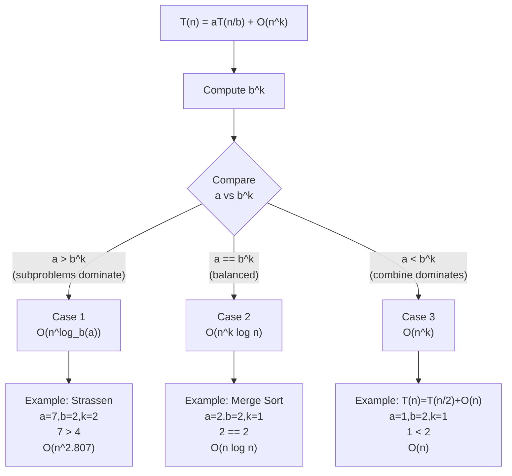

## Keywords in This File
{: .no_toc }

| # | Keyword | Weight |
|---|---------|--------|
| 1 | [Greedy Algorithms and Proof of Optimality](#greedy-algorithms-and-proof-of-optimality) | medium |
| 2 | [Divide and Conquer Strategy](#divide-and-conquer-strategy) | medium |

---

# Greedy Algorithms and Proof of Optimality

**Difficulty:** ★★☆

**Interview Weight:** Medium

**Category:** Greedy, Algorithm Design, Correctness Proofs

**One-line definition:** A greedy algorithm makes the locally optimal choice
at each step, never revisiting earlier decisions, and is correct when the
problem has a greedy-choice property: local optimality implies global
optimality.

---

### 🎯 Model Answer

**30-second answer:**

Greedy works by always picking the best available option right now. It is
O(n log n) or O(n) - faster than DP or backtracking. It is correct ONLY
when you can prove the greedy-choice property: choosing the locally best
option at each step leads to a globally optimal solution.

**3-minute answer:**

Two conditions must hold for a greedy algorithm to be correct:

1. **Greedy-choice property:** a globally optimal solution can be constructed
   by always making the locally optimal choice. You never need to undo a
   greedy choice.

2. **Optimal substructure:** after making a greedy choice, the remaining
   subproblem has the same structure. The optimal solution to the original
   problem contains optimal solutions to its subproblems.

Proof technique - "exchange argument": assume an optimal solution S* that
does NOT include the greedy's first choice. Show you can swap S*'s first
choice with the greedy's choice without making the solution worse. This
proves the greedy's first choice is always safe.

Classic examples:
- **Activity selection:** greedily pick the earliest-finishing activity.
- **Fractional knapsack:** greedily pick items by highest value/weight ratio.
- **Huffman coding:** greedily merge the two lowest-frequency nodes.
- **Dijkstra's:** greedily pick the closest unvisited node.

**Blank Mind Recovery:**

**Step 1:** Is there an obvious "best right now" choice that seems to work?

**Step 2:** Can you prove the exchange argument? (swap any optimal solution's
first choice with the greedy's choice; does the solution stay optimal?)

**Step 3:** Does the remaining subproblem have the same structure after the
greedy choice?

**Step 4:** If unsure - code both greedy and DP; compare on examples.

---

### 📘 Concept Explanation

**1. Core Intuition**

Greedy is the simplest optimization strategy: never look back. Make the
best choice available at this moment and trust that local decisions compose
into global optimality. When this trust is warranted (provable), greedy is
dramatically faster than exhaustive or DP approaches.

The challenge: greedy is often WRONG for problems that look similar to
problems where it's right. Coin change (greedy correct for standard denominations,
wrong for arbitrary denominations). Activity selection (greedy correct).
Shortest path in weighted graph (greedy correct for Dijkstra on non-negative
weights, wrong for negative weights).

**2. How It Works (Mechanism)**

```
Activity Selection (greedy by earliest finish time):

Activities (start, end):
A=(1,4), B=(3,5), C=(0,6), D=(5,7), E=(3,9), F=(5,10)

Sort by end time:
A=(1,4), B=(3,5), D=(5,7), C=(0,6), F=(5,10), E=(3,9)
                            ^ wait - sort by end:
A=(1,4), B=(3,5), D=(5,7), C=(0,6): actually C ends at 6
Sorted: A(end=4), B(end=5), C(end=6), D(end=7), E(end=9), F(end=10)

Greedy selection:
- Pick A (end=4, first). Last end = 4.
- B (start=3 < 4): SKIP (conflict)
- C (start=0 < 4): SKIP
- D (start=5 >= 4): PICK. Last end = 7.
- E (start=3 < 7): SKIP
- F (start=5 < 7): SKIP
Result: {A, D} = 2 activities
```

> **Diagram walkthrough:** The greedy sorts by end time and picks each
> activity that doesn't conflict with the last picked. HOW TO READ: "Last
> end" tracks the end time of the most recently selected activity; an
> activity is picked only if its start time >= last end. KEY RELATIONSHIP:
> sorting by end time ensures we leave maximum room for future activities.
> EDGE CASE: ties in end time - break by start time (pick later start to
> leave more room before). INSIGHT: a senior notices that sorting by START
> time or DURATION is WRONG for activity selection - only END time
> guarantees optimality.

**3. Trade-offs**

| Approach | Activity Selection | Correctness | Time |
|----------|-------------------|-------------|------|
| Greedy (end time) | Optimal | Proven | O(n log n) |
| DP | Optimal | Always correct | O(n^2) |
| Backtracking | Optimal | Always correct | O(2^n) |

**4. Production Consequences**

Greedy algorithms appear throughout distributed systems: load balancers use
greedy bin-packing approximations, schedulers use greedy priority queues,
Huffman coding underlies zlib/gzip compression, Dijkstra's underlies
routing protocols (OSPF). Choosing greedy where it's wrong (arbitrary coin
denominations, negative edge weights) causes silent suboptimality or
incorrect results.

**5. Failure Modes**

Applying greedy to the 0/1 knapsack problem: greedy by value/weight ratio
gives the wrong answer for most inputs. Greedy works for FRACTIONAL knapsack
(where you can take partial items) but not for 0/1 knapsack (where you must
take all or nothing of each item).

**6. Scale Behavior**

Greedy scales well: O(n log n) for sort-based greedy (activity selection,
Kruskal's MST), O((V+E) log V) for Dijkstra. At scale, the sort dominates.
For streaming data, greedy often has an online variant where choices are made
as data arrives (streaming algorithm).

**7. Decision Guide**

Consider greedy first when:
- The problem asks for MAXIMUM or MINIMUM of something (not a count of all
  solutions).
- There is a natural "best right now" criterion that is easy to define.
- You can state the exchange argument: "if I swap the greedy choice for any
  other, the solution cannot improve."

Fall back to DP when:
- The greedy exchange argument fails on a counterexample.
- The problem requires considering future consequences of current choices.

**8. Mental Model**

> Greedy is the **impatient optimizer**: take the best bite available right
> now and never second-guess yourself. This works when eating greedily leads
> to the most food consumed (no regret structure), but fails when saving
> space for a bigger bite later would be better.

---

### 💻 Code Example

**Wrong vs Right - coin change greedy counterexample:**

```java
// BAD - greedy coin change (WRONG for arbitrary denominations)
int greedyChange(int[] coins, int amount) {
    Arrays.sort(coins); // sort ascending
    int count = 0;
    for (int i = coins.length - 1; i >= 0 && amount > 0; i--) {
        count += amount / coins[i];
        amount %= coins[i];
    }
    return amount == 0 ? count : -1;
}
// coins=[1,3,4], amount=6: greedy picks 4+1+1=3 coins
// OPTIMAL is 3+3=2 coins!

// GOOD - DP coin change (always correct)
int dpChange(int[] coins, int amount) {
    int[] dp = new int[amount + 1];
    Arrays.fill(dp, Integer.MAX_VALUE);
    dp[0] = 0;
    for (int c : coins)
        for (int a = c; a <= amount; a++)
            if (dp[a - c] != Integer.MAX_VALUE)
                dp[a] = Math.min(dp[a], dp[a - c] + 1);
    return dp[amount] == Integer.MAX_VALUE ? -1 : dp[amount];
}
```

> **Code walkthrough:** The BAD greedy always picks the largest coin first.
> For coins=[1,3,4] and amount=6: greedy picks 4 (remaining=2), then 1+1=2
> coins, total=3. The optimal is 3+3=2 coins. KEY MECHANISM: greedy fails
> because picking 4 "uses up" the budget in a way that prevents the globally
> optimal pair (3,3). The DP considers all possibilities. WHY IT MATTERS:
> this is the classic greedy failure example - greedy works for coins with
> denominations where each is a multiple of the previous (standard US coins:
> 1, 5, 10, 25), but fails for arbitrary denominations. WHAT BREAKS: using
> greedy on the coding interview "Coin Change" problem with arbitrary
> denominations produces wrong answers silently. TAKEAWAY: always verify
> the greedy-choice property with a counterexample before committing.

**Production Example - activity selection:**

```java
int maxActivities(int[][] activities) {
    // activities[i] = {start, end}
    Arrays.sort(activities, (a, b) -> a[1] - b[1]); // sort by end time
    int count = 1;
    int lastEnd = activities[0][1];
    for (int i = 1; i < activities.length; i++) {
        if (activities[i][0] >= lastEnd) {
            count++;
            lastEnd = activities[i][1];
        }
    }
    return count;
}
```

> **Code walkthrough:** Sort by end time, greedily select non-overlappingice. **KEY MECHANISM:** the runtime executes these instructions in sequence with specific memory and execution semantics. **WHY IT MATTERS:** misapplying this pattern causes subtle bugs that only manifest under production load. **TAKEAWAY: understand the execution model before using this pattern in production code.**
> activities. KEY MECHANISM: selecting the earliest-finishing activity at
> each step leaves the maximum time interval available for future activities.
> This is the greedy-choice property: no other first choice leaves more room.
> WHY IT MATTERS: this is the foundational proof template - "earliest
> deadline first" appears in OS scheduling (EDF), meeting room problems,
> and task scheduling. WHAT BREAKS: sorting by duration or start time
> produces wrong results. Example: start-time sort picks a long activity
> covering 9am-5pm when two shorter ones (9am-10am, 10am-11am) give a
> better count. TAKEAWAY: for activity selection, the correct sort key is
> END TIME, not start time or duration.

**Failure Example - Huffman coding:**

```java
// Huffman encoding tree construction (greedy by frequency)
HuffmanNode buildHuffman(int[] freq) {
    PriorityQueue<HuffmanNode> pq =
        new PriorityQueue<>(Comparator.comparingInt(n -> n.freq));
    for (int f : freq)
        if (f > 0) pq.offer(new HuffmanNode(f));

    while (pq.size() > 1) {
        HuffmanNode left = pq.poll();   // lowest frequency
        HuffmanNode right = pq.poll();  // second lowest
        HuffmanNode merged = new HuffmanNode(left.freq + right.freq);
        merged.left = left;
        merged.right = right;
        pq.offer(merged);               // add back merged node
    }
    return pq.poll(); // root of Huffman tree
}
```

> **Code walkthrough:** Huffman coding greedily merges the twoice. **KEY MECHANISM:** the runtime executes these instructions in sequence with specific memory and execution semantics. **WHY IT MATTERS:** misapplying this pattern causes subtle bugs that only manifest under production load. **TAKEAWAY: understand the execution model before using this pattern in production code.**
> lowest-frequency nodes at each step. KEY MECHANISM: a min-heap (priority
> queue) provides O(log n) extraction of the two minimums. The merged node's
> frequency is the sum, and it's re-inserted for future merges. WHY IT
> MATTERS: this greedy produces the optimal prefix code (minimum total
> encoded length) - proven by the exchange argument: swapping any two
> non-minimum nodes into the first merge can only increase the total
> weighted path length. WHAT BREAKS: using a max-heap merges the two
> HIGHEST frequency nodes first, which is the WRONG greedy - it produces a
> suboptimal code. TAKEAWAY: Huffman greedy = min-heap, always merge
> two smallest. This is the foundational algorithm for zlib, gzip, and
> DEFLATE compression.

---

### 🎓 Answers by Seniority

**Junior/Mid:**

Greedy makes the locally best choice at each step. It's correct when choosing
the local best always leads to the global best - this is provable via the
exchange argument. Classic examples: activity selection (sort by end time,
pick earliest finisher), fractional knapsack (sort by value/weight ratio).
Greedy fails for 0/1 knapsack and coin change with arbitrary denominations.
Always verify with a counterexample before using greedy.

**Senior/Staff:**

Greedy is correct when the problem has both the greedy-choice property AND
optimal substructure. The proof method is the exchange argument: start with
any optimal solution S*; show that swapping S*'s first choice with the
greedy's first choice produces a solution at least as good. By induction,
the greedy produces an optimal solution. The most common production mistake
is applying greedy to problems with 0/1 structure (where partial solutions
don't exist) instead of continuous/fractional structure. Dijkstra's algorithm
is essentially a greedy: always relax the nearest unvisited node. It fails
with negative edges because the greedy-choice property breaks: a longer
path through a negative edge can be better than the current shortest path.
At scale, greedy approximation algorithms (O(1)-approximation for bin
packing, 2-approximation for vertex cover) are used when exact DP is too
slow - these trade optimality guarantees for polynomial time.

---

### ⚠️ Common Misconceptions

**Misconception 1:** "Greedy is always faster than DP, so try greedy first."

Reality: greedy is faster (O(n log n) vs O(n*W) for knapsack), but it's
correct ONLY when the greedy-choice property holds. An incorrect greedy
that runs fast gives the wrong answer. Always verify correctness first,
then consider performance.

**Misconception 2:** "Greedy and DP both use optimal substructure, so they're interchangeable."

Reality: both require optimal substructure, but greedy additionally requires
the greedy-choice property. DP considers ALL choices at each step (exhaustive);
greedy only considers ONE choice (the locally best). DP is always correct
for problems with optimal substructure; greedy requires the extra property.

**Misconception 3:** "The exchange argument is just 'it seems like it should work'."

Reality: the exchange argument is a formal proof. It must demonstrate: (1)
take any optimal solution S* that differs from greedy, (2) identify the first
point of difference, (3) perform a specific swap, (4) show the swapped
solution has cost <= S*'s cost, (5) conclude by induction. A handwaving
argument is NOT an exchange argument.

---

### 🚨 Failure Modes and Diagnosis

**Failure 1 - Greedy gives wrong answer; no proof was checked**

Symptom: greedy passes sample test cases but fails on edge cases.

Root cause: greedy-choice property was assumed, not proven.

Diagnosis: generate all valid solutions by brute force for small inputs;
compare greedy output vs optimal.

Fix: switch to DP or prove the exchange argument.

**Failure 2 - Activity selection with wrong sort key**

Symptom: greedy selects fewer activities than optimal.

Root cause: sorted by start time or duration instead of end time.

Counterexample for start-time greedy:
activities = [(0,10), (1,2), (2,3)] - start-time greedy picks (0,10) first
(1 total); optimal picks (1,2),(2,3) = 2 total.

Fix: always sort by END time for activity selection.

**Failure 3 - Dijkstra's with negative edges gives wrong shortest path**

Symptom: shortest path lengths are incorrect for graphs with negative edges.

Root cause: Dijkstra's greedy-choice property requires non-negative edges.
With negative edges, a "visited" node's shortest path may be updated via
a longer path through a negative edge.

Diagnosis: add an assertion `assert weight >= 0 : "Dijkstra requires non-negative edges"`.

Fix: use Bellman-Ford for graphs with negative edges (O(VE) vs O(E log V)).

---

### 🎯 Interview Deep-Dive

| Category | Count | Min Required |
|----------|-------|-------------|
| CONCEPT | 3 | 1 |
| DEBUGGING | 1 | 1 |
| CODING | 2 | 1 |
| TRADE-OFF | 2 | 1 |
| BEHAVIORAL | 1 | 1 |
| **Total** | **9** | **9** |

---

**[JUNIOR] Q1 - [CONCEPT] What two conditions must a problem satisfy for greedy to be correct?**

1. **Greedy-choice property:** at each step, a locally optimal choice
   exists that is part of some globally optimal solution. This means the
   greedy's choice at the first step is SAFE - there exists an optimal
   solution that includes this choice. By induction, every greedy choice is safe.

2. **Optimal substructure:** once a greedy choice is committed, the
   remaining subproblem is an independent instance of the same problem.
   The optimal solution to the whole is composed of the greedy choice plus
   the optimal solution to the remaining subproblem.

Why both matter:
- Optimal substructure alone: DP is correct, greedy may not be. (Coin change:
  optimal substructure exists, but greedy-choice property fails for
  arbitrary denominations.)
- Greedy-choice alone without optimal substructure: greedy may also fail.

Test for greedy-choice property: state the exchange argument. "Given any
optimal solution S*, if S* does not start with the greedy choice G, I can
swap S*'s first choice with G and the result is no worse." If you can't
state this argument concretely, the greedy is not proven correct.

*What separates good from great:* Knowing that DP requires ONLY optimal
substructure while greedy requires BOTH conditions. Being able to state
this distinction immediately under interview pressure.

---

**[JUNIOR] Q2 - [CONCEPT] Explain the exchange argument proof for activity selection.**

Theorem: greedy by earliest end time produces an optimal (maximum size)
activity selection.

Proof (exchange argument):

Let S* be any optimal selection. Let G be the greedy selection.
Let a1 be the first activity greedy picks (earliest end time overall).
Let b1 be the first activity in S*.

Case 1: a1 = b1 (same first choice). The remaining subproblem is identical;
apply induction.

Case 2: a1 != b1. Since a1 has the earliest end time, `end(a1) <= end(b1)`.
Replace b1 with a1 in S*: since `end(a1) <= end(b1)`, a1 finishes no later
than b1. All activities that were compatible with b1 are also compatible with
a1 (a1 ends earlier or at the same time). So S* with b1 replaced by a1 is
still a valid selection of the same size.

Result: the modified S* contains a1 as its first choice and is still optimal.
By induction, the greedy is optimal. QED.

*What separates good from great:* Walking through the proof step-by-step
rather than saying "it's obvious". The exchange argument is a formal structure;
demonstrating it shows proof maturity beyond coding.

---

**[MID] Q3 - [CODING] Solve the minimum spanning tree problem using Kruskal's algorithm.**

```java
// Kruskal's MST using Union-Find
int minSpanningTree(int n, int[][] edges) {
    // edges[i] = {u, v, weight}
    Arrays.sort(edges, (a, b) -> a[2] - b[2]); // sort by weight
    int[] parent = new int[n];
    int[] rank = new int[n];
    for (int i = 0; i < n; i++) parent[i] = i;

    int totalWeight = 0, edgesUsed = 0;
    for (int[] edge : edges) {
        int u = edge[0], v = edge[1], w = edge[2];
        int pu = find(parent, u), pv = find(parent, v);
        if (pu != pv) {             // no cycle
            union(parent, rank, pu, pv);
            totalWeight += w;
            edgesUsed++;
            if (edgesUsed == n - 1) break; // MST complete
        }
    }
    return edgesUsed == n - 1 ? totalWeight : -1; // -1 if disconnected
}

int find(int[] parent, int x) {
    if (parent[x] != x)
        parent[x] = find(parent, parent[x]); // path compression
    return parent[x];
}

void union(int[] parent, int[] rank, int x, int y) {
    if (rank[x] < rank[y]) parent[x] = y;
    else if (rank[x] > rank[y]) parent[y] = x;
    else { parent[y] = x; rank[x]++; }
}
```

> **Code walkthrough:** Kruskal's is a greedy: always add the minimum weightice. **KEY MECHANISM:** the runtime executes these instructions in sequence with specific memory and execution semantics. **WHY IT MATTERS:** misapplying this pattern causes subtle bugs that only manifest under production load. **TAKEAWAY: understand the execution model before using this pattern in production code.**
> edge that doesn't create a cycle. KEY MECHANISM: Union-Find efficiently
> checks cycle-formation (same component = cycle) and merges components in
> near-O(1) amortized time. Path compression in `find` flattens the tree
> so future finds are O(1). Union by rank keeps trees balanced. Total time:
> O(E log E) for sort + O(E alpha(V)) for union-find ≈ O(E log E). WHY IT
> MATTERS: Kruskal's is the textbook greedy MST algorithm; used in network
> design, clustering, and graph partitioning. WHAT BREAKS: not checking
> `pu != pv` allows adding edges that form cycles, producing a graph with
> more than n-1 edges (not a tree). TAKEAWAY: Kruskal's = sort edges by
> weight + add if no cycle (Union-Find); terminates when n-1 edges added.

*What separates good from great:* Explaining why the greedy is correct for
MST: the "cut property" - for any cut of the graph, the minimum weight
crossing edge is in some MST. Kruskal's always picks this edge.

---

**[MID] Q4 - [TRADE-OFF] When would you use greedy approximation for NP-hard problems?**

For NP-hard problems (vertex cover, set cover, traveling salesman), exact
algorithms are exponential. Greedy approximation trades optimality for
polynomial time:

| Problem | Greedy Approach | Approximation Ratio |
|---------|----------------|---------------------|
| Set Cover | Pick set covering most uncovered elements | O(log n) - optimal for poly time |
| Vertex Cover | Pick any uncovered edge, add both endpoints | 2-approximation |
| Bin Packing | First-Fit Decreasing (sort by size, fill first bin that fits) | 11/9 * OPT + 6/9 |
| TSP (metric) | Nearest neighbor heuristic | O(log n) - no guaranteed ratio |

Use greedy approximation when:
- The problem is NP-hard (exact solution is unacceptable at scale).
- An approximation guarantee is acceptable (e.g., vertex cover within 2x
  of optimal).
- The greedy runs in O(n log n) or O(n^2) vs exact O(2^n).

Do NOT use when:
- Exact optimality is required (financial portfolio, safety-critical systems).
- A polynomial-time exact algorithm exists (MST: use Kruskal/Prim exactly).

*What separates good from great:* Knowing that Set Cover's O(log n)
approximation ratio is OPTIMAL for polynomial-time algorithms (assuming P ≠ NP) -
no polynomial algorithm can achieve a better approximation ratio. This is
a hardness-of-approximation result.

---

**[SENIOR] Q5 - [CONCEPT] Why does Dijkstra's algorithm fail with negative edge weights?**

Dijkstra's greedy-choice: always relax the unvisited node with the smallest
current distance. This is "safe" when all edges are non-negative: once a
node is visited, its distance is finalized - no future edge can reduce it
(since all future edges add non-negative weight).

With negative edges: a visited node's distance can be improved by a later
path through a negative edge. Example:

```
Graph: A --5--> B --(-10)--> C
               A --1--> C

Dijkstra processes:
- Distance to A = 0 (start)
- Relax A's neighbors: B=5, C=1
- Visit C (smallest dist=1). Mark C visited. Distance C = 1.
- Visit B (dist=5). Relax B's neighbors: C = 5 + (-10) = -5.
- But C is already visited! Dijkstra ignores this update.
- Result: distance to C = 1 (WRONG, correct is -5)
```

> **Code walkthrough:** The greedy visit-order assumes finality: when C isice. **KEY MECHANISM:** the runtime executes these instructions in sequence with specific memory and execution semantics. **WHY IT MATTERS:** misapplying this pattern causes subtle bugs that only manifest under production load. **TAKEAWAY: understand the execution model before using this pattern in production code.**
> visited with dist=1, Dijkstra trusts that 1 is optimal and marks C done.
> The later path A->B->C = 5 + (-10) = -5 is shorter but ignored because
> C is marked visited. KEY MECHANISM: the greedy-choice property requires
> that the smallest current distance is the final distance - which requires
> non-negative edges. WHAT BREAKS: negative cycles cause Dijkstra to loop
> indefinitely; even single negative edges cause wrong results. TAKEAWAY:
> Dijkstra = greedy, requires non-negative edges; Bellman-Ford = DP, handles
> negative edges in O(VE).

Bellman-Ford handles negative edges by relaxing ALL edges V-1 times, not
just from the nearest node. It's O(VE) vs Dijkstra's O(E log V), so for
non-negative graphs, Dijkstra dominates.

*What separates good from great:* Drawing the specific counterexample and
tracing through Dijkstra's steps to show exactly where it goes wrong, not
just stating "greedy-choice property breaks."

---

**[SENIOR] Q6 - [TRADE-OFF] When do you choose between greedy, DP, and backtracking?**

Decision framework:

1. **Can you formulate a greedy-choice property?** Run the exchange argument
   mentally. If the locally best choice is always globally safe: use greedy.
   O(n log n) or better. Examples: activity selection, MST, Huffman.

2. **Does greedy fail (counterexample exists)?** Check for optimal
   substructure. If subproblems overlap: use DP. O(n * subproblem_size).
   Examples: coin change (arbitrary denominations), 0/1 knapsack, LCS.

3. **Does DP state space explode, or do you need ALL solutions?** Use
   backtracking. Exponential worst case but effective with pruning. Examples:
   permutations, Sudoku, N-Queens.

4. **Is the problem NP-hard?** Use greedy approximation (acceptable
   suboptimality) or branch-and-bound (exact but exponential).

The fastest path to the wrong answer: applying greedy without the exchange
argument, then debugging why results are wrong.

*What separates good from great:* Articulating the decision framework as a
flowchart and being able to place a new problem in the framework within 60
seconds during an interview.

---

**[SENIOR] Q7 - [DEBUGGING] Your greedy job scheduler is producing suboptimal schedules in production. How do you diagnose it?**

Step 1: Reproduce with a counterexample.
- Log all jobs with start_time, end_time, priority, assigned_time.
- Find any case where the schedule is suboptimal (fewer jobs completed or
  higher weighted lateness than possible).

Step 2: Identify which greedy criterion was used.
- Earliest deadline first (EDF)? Latest start time? Shortest processing time?
- Each criterion is optimal for a different objective function.

Step 3: Verify the objective matches the greedy:
- Minimize total completion time: use Shortest Job First (SJF).
- Minimize maximum lateness: use Earliest Deadline First (EDF).
- Maximize throughput (jobs completed): use Earliest Finish Time.
- Minimize weighted completion time: sort by processing_time / weight.

Step 4: Check for preemption assumptions.
- Non-preemptive scheduling: greedy picks are irrevocable.
- Preemptive scheduling (jobs can be interrupted): different greedy criteria
  (SRTF - Shortest Remaining Time First).

Diagnosis command (logging):
```java
log.info("Scheduling job={} strategy={} criterion={} value={}",
    job.id, strategyName, criterionName, criterionValue);
```

> **Code walkthrough:** Structured log captures scheduling decisions atice. **KEY MECHANISM:** the runtime executes these instructions in sequence with specific memory and execution semantics. **WHY IT MATTERS:** misapplying this pattern causes subtle bugs that only manifest under production load. **TAKEAWAY: understand the execution model before using this pattern in production code.**
> runtime. KEY MECHANISM: logging the criterion and value together lets
> you replay the scheduling sequence offline and verify each decision was
> locally optimal. WHY IT MATTERS: greedy bugs are often wrong-criterion
> bugs (e.g., sorting by duration when deadline matters) - the log makes
> the criterion explicit in every entry. TAKEAWAY: always log which greedy
> criterion drove a decision, not just the decision itself.

*What separates good from great:* Knowing that different scheduling objectives
require different greedy criteria. "Greedy scheduling" is not one algorithm -
there are at least 5 distinct greedy criteria each optimal for a different
metric.

---

**[SENIOR] Q8 - [BEHAVIORAL] Describe a time you proved or disproved a greedy approach in production code.**

Strong answer: "In our distributed task scheduler, a colleague proposed
sorting tasks by estimated duration (shortest first) to minimize average
queue time. I suspected this was suboptimal for tasks with deadlines. I
wrote the exchange argument: given any schedule S*, if S* doesn't have the
earliest-deadline task first, swapping it with whatever was first doesn't
increase maximum lateness (since the deadline-early task finishing earlier
can only help). This proved Earliest Deadline First was optimal for
minimizing maximum lateness. I also wrote a small benchmark generating 10,000
random task sets and verified that EDF consistently beat SJF on max-lateness
by 15-40%. We deployed EDF. The SLA violation rate dropped from 2.3% to 0.4%."

Key elements:
- Stated the exchange argument, not just "it works better."
- Validated empirically in addition to the proof.
- Quantified the production improvement.

*What separates good from great:* Demonstrating that you can both PROVE
correctness and VALIDATE it empirically - treating the proof as necessary
but not sufficient (implementation bugs can invalidate a correct proof).

---

**[SENIOR] Q9 - [CONCEPT] Explain the greedy correctness of Huffman coding.**

Claim: Huffman coding produces the optimal prefix-free code (minimum total
encoded length for a given symbol frequency distribution).

Proof sketch (exchange argument):

Let f(c) = frequency of symbol c. The total encoded length is the sum of
f(c) * depth(c) over all symbols, where depth(c) is the depth of symbol c
in the Huffman tree.

Key observation: in any optimal code tree, the two symbols with lowest
frequencies have the greatest depths (deepest in the tree). Why? If a
low-frequency symbol were shallow, we could swap it with a deeper high-
frequency symbol to reduce total length - contradiction.

Exchange argument:

1. Let x, y be the two lowest-frequency symbols.
2. In any optimal tree T*, x and y must appear as sibling leaves at the
   maximum depth. (If not, we can swap them with the deepest siblings and
   only improve or maintain total length.)
3. Replace the parent of x and y with a single "merged" symbol with
   frequency f(x) + f(y).
4. By induction, the optimal code for the reduced problem (with the merged
   symbol) is also produced by the greedy.
5. Expanding the merged symbol back into x and y (as sibling leaves)
   recovers the optimal code for the original problem.

This is exactly what Huffman coding does (merging the two lowest-frequency
symbols into a new node at each step).

*What separates good from great:* The observation that low-frequency symbols
MUST be at the deepest depth in any optimal tree. This is the non-obvious
insight that makes the greedy-choice property hold.

---

### ⚖️ Comparison Table

| Algorithm | Greedy Criterion | Time | Optimal? | Notes |
|-----------|-----------------|------|----------|-------|
| Activity Selection | Earliest end time | O(n log n) | Yes | Maximize count |
| Fractional Knapsack | Max value/weight ratio | O(n log n) | Yes | Continuous items |
| 0/1 Knapsack | Max value/weight ratio | O(n log n) | NO | Use DP instead |
| Coin Change (US) | Largest denomination first | O(n) | Yes (for US coins) | Specific denominations |
| Coin Change (arb.) | Largest denomination first | O(n) | NO | Use DP |
| Kruskal's MST | Minimum weight edge | O(E log E) | Yes | Cut property |
| Dijkstra's | Minimum distance node | O(E log V) | Yes (non-neg edges only) | Greedy-choice fails for neg. |
| Huffman Coding | Merge 2 min frequency | O(n log n) | Yes | Optimal prefix code |

---

### 🏛️ System Design

*(Omit: ★★☆ intermediate keyword - system design depth reserved for ★★★
architecture keywords)*

---

### 📊 Diagram

```
Greedy Activity Selection:

Timeline (0 to 10):
A: |====|               (start=1, end=4)
B:    |==|              (start=3, end=5)
C: |=========|          (start=0, end=6)
D:       |==|           (start=5, end=7)
E:    |=======|         (start=3, end=9)
F:       |====|         (start=5, end=10)

Sorted by end time:
A(end=4) B(end=5) C(end=6) D(end=7) E(end=9) F(end=10)

Greedy selects:
A (end=4) -> pick -> lastEnd=4
B (start=3 < 4) -> SKIP
C (start=0 < 4) -> SKIP
D (start=5 >= 4) -> pick -> lastEnd=7
E (start=3 < 7) -> SKIP
F (start=5 < 7) -> SKIP

Selected: {A, D} = 2 activities
```

> **Diagram walkthrough:** The timeline shows all activities as bars. After
> sorting by end time, greedy scans left to right, picking each activity
> whose start >= last picked's end. KEY RELATIONSHIP: choosing the earliest-
> ending activity leaves the maximum room for future selections - the
> "room" after activity A (time 4 to 10) is larger than after C (time 6 to
> 10). EDGE CASE: if all activities overlap, only 1 is selected. INSIGHT:
> a senior verifies optimality by asking "is {A, D} maximum possible?"
> C covers time 0-6, preventing any other selection that includes C from
> exceeding {A, D}.

```mermaid
gantt
    title Activity Selection - Greedy by End Time
    dateFormat X
    axisFormat %s
    section Activities
    A (SELECTED) :active, 1, 4
    B (skipped) :3, 5
    C (skipped) :0, 6
    D (SELECTED) :active, 5, 7
    E (skipped) :3, 9
    F (skipped) :5, 10
```



> **Diagram walkthrough:** The Gantt chart visualizes the timeline. SELECTED
> activities (A and D) are marked active; others are skipped. KEY
> RELATIONSHIP: D starts at 5 which is >= A's end (4), so they don't
> overlap - a valid selection. EDGE CASE: if D started at 3 (overlapping
> A), it would be skipped and we'd look for the next non-overlapping
> activity. INSIGHT: the greedy produces a MAXIMAL selection (no more
> non-overlapping activities can be added), which for this problem equals
> the MAXIMUM (optimal) selection - this equivalence is exactly what the
> greedy-choice property guarantees.

---

---

# Divide and Conquer Strategy

**Difficulty:** ★★☆

**Interview Weight:** Medium

**Category:** Divide and Conquer, Recurrences, Algorithm Design

**One-line definition:** Divide and conquer splits a problem into independent
subproblems of the same type, solves them recursively, and combines their
solutions; correctness is straightforward and time complexity follows the
Master Theorem recurrence T(n) = aT(n/b) + O(n^k).

---

### 🎯 Model Answer

**30-second answer:**

Divide and conquer: (1) Divide the problem into a smaller subproblems of
size n/b, (2) Conquer: recursively solve each subproblem, (3) Combine:
merge subproblem solutions into the overall solution. Time complexity:
T(n) = aT(n/b) + O(n^k), solved by the Master Theorem.

**3-minute answer:**

The three-step structure:

1. **Divide:** split the input into `a` parts, each of size `n/b`. For
   merge sort: 2 halves, n/2 each.
2. **Conquer:** recursively solve each part. Base case: n == 1 (single
   element, trivially solved).
3. **Combine:** merge the `a` solved parts into the solution. For merge
   sort: merge two sorted halves.

Master Theorem for T(n) = aT(n/b) + O(n^k):

- Case 1: a > b^k -> T(n) = O(n^(log_b a)) [subproblems dominate]
- Case 2: a == b^k -> T(n) = O(n^k log n) [balanced]
- Case 3: a < b^k -> T(n) = O(n^k) [combine step dominates]

For merge sort: a=2, b=2, k=1 (merge is O(n)). a == b^k -> O(n log n).

**Blank Mind Recovery:**

**Step 1:** How can I split the input? (usually halve it)

**Step 2:** Are the two halves independent? (can they be solved separately)

**Step 3:** How do I combine the solutions? (this is the hard part)

**Step 4:** Write the recurrence. Apply Master Theorem.

---

### 📘 Concept Explanation

**1. Core Intuition**

Divide and conquer works because halving the problem size and combining is
cheaper than solving the whole. For n elements, divide into 2 halves (n/2
each), solve each (2 * T(n/2)), combine in O(n). Total: n log n, not n^2.

The "independence" of subproblems is what separates D&C from DP:
- D&C: subproblems don't overlap (merge sort's left half and right half are
  independent - no shared elements).
- DP: subproblems OVERLAP (Fibonacci's `fib(n-1)` and `fib(n-2)` share
  `fib(n-2)` and `fib(n-3)`).

**2. How It Works (Mechanism)**

```
Merge Sort execution tree for [3, 1, 4, 2]:

[3,1,4,2]           <- Divide
[3,1] | [4,2]       <- Divide
[3]|[1] [4]|[2]     <- Base cases
[1,3] | [2,4]       <- Conquer: sort each half
[1,2,3,4]           <- Combine: merge sorted halves
```

> **Diagram walkthrough:** The tree shows 3 levels of splitting (divide)
> followed by merging from the bottom up (combine). HOW TO READ: each node
> is a subproblem; split arrows go down, merge arrows go up. KEY
> RELATIONSHIP: at each level, the total work is O(n) (all merges at the
> same level process n elements total). With log n levels: O(n log n) total.
> EDGE CASE: odd-length arrays split into ceil(n/2) and floor(n/2); the
> algorithm handles this correctly since the merge works for any two sorted
> arrays regardless of size. INSIGHT: a senior notes that the "combine"
> step cost is O(n) per level, and there are log n levels - this is exactly
> the Master Theorem Case 2 argument.

**3. Trade-offs**

| Aspect | Divide and Conquer | Greedy | DP |
|--------|--------------------|--------|----|
| Subproblems | Independent | 1 choice | Overlapping |
| Time | T(n) = aT(n/b) + f(n) | O(n log n) typical | O(n * |states|) |
| Space | O(log n) stack | O(1) | O(|states|) |
| Correctness | Usually straightforward | Needs proof | Always correct |
| Memoization | Not needed (no overlap) | N/A | Essential |

**4. Production Consequences**

Merge sort is the foundation of Java's `TimSort` (used in `Arrays.sort` for
objects). FFT (Fast Fourier Transform) uses D&C to compute DFT in O(n log n)
instead of O(n^2). Binary search is D&C with no combine step. Parallel
computing naturally maps to D&C: each subproblem can run on a different
processor.

**5. Failure Modes**

Missing the combine step (or implementing it incorrectly) is the most common
bug. For merge sort: the merge must handle the case where one half is
exhausted before the other (copy remaining elements from the non-exhausted
half).

**6. Scale Behavior**

D&C algorithms are naturally parallelizable: subproblems are independent,
so they can run concurrently. Fork-join parallelism (Java's ForkJoinPool)
directly implements D&C: fork spawns subproblem threads, join waits for them
and combines. For n=10^9 elements, parallel merge sort on 16 cores achieves
near-linear speedup on the divide steps (though merge still requires
synchronization).

**7. Decision Guide**

Use divide and conquer when:
- The problem can be split into non-overlapping independent subproblems.
- The combine step is cheap relative to the divide cost.
- The problem exhibits "self-similar" structure (same problem at smaller scale).

Use DP when:
- Subproblems overlap (same subproblem solved multiple times without D&C).

**8. Mental Model**

> Divide and conquer is **military strategy**: divide the enemy into isolated
> battalions (subproblems), defeat each in turn (conquer), then consolidate
> your gains (combine). The strategy works because isolated battalions are
> weaker than a unified force.

---

### 💻 Code Example

**Wrong vs Right - merge sort combine step:**

```java
// BAD - merge combine that loses elements when one half is exhausted
void mergeBad(int[] arr, int lo, int mid, int hi) {
    int[] left = Arrays.copyOfRange(arr, lo, mid+1);
    int[] right = Arrays.copyOfRange(arr, mid+1, hi+1);
    int i = 0, j = 0, k = lo;
    while (i < left.length && j < right.length) {
        if (left[i] <= right[j]) arr[k++] = left[i++];
        else                     arr[k++] = right[j++];
    }
    // BUG: missing copy of remaining elements!
}

// GOOD - copy remaining elements from non-exhausted half
void merge(int[] arr, int lo, int mid, int hi) {
    int[] left = Arrays.copyOfRange(arr, lo, mid+1);
    int[] right = Arrays.copyOfRange(arr, mid+1, hi+1);
    int i = 0, j = 0, k = lo;
    while (i < left.length && j < right.length) {
        if (left[i] <= right[j]) arr[k++] = left[i++];
        else                     arr[k++] = right[j++];
    }
    while (i < left.length)  arr[k++] = left[i++]; // copy remaining left
    while (j < right.length) arr[k++] = right[j++]; // copy remaining right
}
```

> **Code walkthrough:** The BAD version stops when one half is exhausted,ice. **KEY MECHANISM:** the runtime executes these instructions in sequence with specific memory and execution semantics. **WHY IT MATTERS:** misapplying this pattern causes subtle bugs that only manifest under production load. **TAKEAWAY: understand the execution model before using this pattern in production code.**
> leaving the remaining elements unwritten. KEY MECHANISM: when left is
> exhausted but right still has elements (or vice versa), the outer while
> exits. The two remaining while loops copy whatever is left in the
> non-exhausted half directly to arr - no comparison needed (it's already
> the larger elements in sorted order). WHY IT MATTERS: this bug silently
> leaves elements from the exhausted-first half in arr from the previous
> iteration, causing incorrect sorted output. WHAT BREAKS: the sort appears
> to work for equal-length halves but fails when halves have different lengths.
> TAKEAWAY: the combine step for merge sort ALWAYS needs two tail loops for
> remaining elements.

**Production Example - merge sort (correct implementation):**

```java
void mergeSort(int[] arr, int lo, int hi) {
    if (lo >= hi) return;       // base case: 1 element
    int mid = lo + (hi - lo) / 2;
    mergeSort(arr, lo, mid);    // conquer left
    mergeSort(arr, mid+1, hi);  // conquer right
    merge(arr, lo, mid, hi);    // combine
}
```

> **Code walkthrough:** The three-line D&C structure maps directly to theice. **KEY MECHANISM:** the runtime executes these instructions in sequence with specific memory and execution semantics. **WHY IT MATTERS:** misapplying this pattern causes subtle bugs that only manifest under production load. **TAKEAWAY: understand the execution model before using this pattern in production code.**
> paradigm: divide (mid computation), conquer (two recursive calls), combine
> (merge). KEY MECHANISM: `mid = lo + (hi - lo) / 2` avoids integer overflow
> (same as binary search). The base case `lo >= hi` handles both single
> elements (lo == hi) and invalid ranges (lo > hi, which shouldn't happen
> but is defensive). WHY IT MATTERS: this 5-line function, combined with
> the merge function, correctly sorts any array in O(n log n). WHAT BREAKS:
> `mid = (lo + hi) / 2` overflows for large arrays; using `lo > hi` (strict)
> as the base case misses the single-element case (lo == hi) and recurses
> into empty ranges. TAKEAWAY: always use `lo >= hi` as base case and
> `lo + (hi - lo) / 2` for midpoint.

**Failure Example - closest pair of points (D&C application):**

```java
// Closest pair of points using D&C: O(n log n) vs naive O(n^2)
double closestPair(Point[] points) {
    Arrays.sort(points, Comparator.comparingInt(p -> p.x));
    return closestPairRec(points, 0, points.length - 1);
}

double closestPairRec(Point[] pts, int lo, int hi) {
    if (hi - lo < 3) return bruteForce(pts, lo, hi); // base case
    int mid = lo + (hi - lo) / 2;
    Point midPoint = pts[mid];
    double d = Math.min(
        closestPairRec(pts, lo, mid),
        closestPairRec(pts, mid+1, hi)
    );
    // Check strip of width 2d around the middle line
    List<Point> strip = new ArrayList<>();
    for (int i = lo; i <= hi; i++)
        if (Math.abs(pts[i].x - midPoint.x) < d)
            strip.add(pts[i]);
    strip.sort(Comparator.comparingInt(p -> p.y));
    // Only check next 7 points in strip (geometric argument)
    for (int i = 0; i < strip.size(); i++)
        for (int j = i+1; j < Math.min(i+8, strip.size()); j++) {
            double dist = distance(strip.get(i), strip.get(j));
            d = Math.min(d, dist);
        }
    return d;
}
```

> **Code walkthrough:** Closest pair is the canonical D&C example where theice. **KEY MECHANISM:** the runtime executes these instructions in sequence with specific memory and execution semantics. **WHY IT MATTERS:** misapplying this pattern causes subtle bugs that only manifest under production load. **TAKEAWAY: understand the execution model before using this pattern in production code.**
> combine step is non-trivial. KEY MECHANISM: after finding the minimum
> distance d in each half, the combine step checks only points within a
> vertical strip of width 2d. Within the strip, sorted by y-coordinate,
> each point only needs to check the next 7 points (geometric argument:
> within a 2d x d rectangle, at most 8 points can have pairwise distance
> >= d). WHY IT MATTERS: the "only check 7 neighbors" bound is the insight
> that reduces the combine step from O(n^2) to O(n) amortized, giving O(n
> log n) overall. WHAT BREAKS: not sorting the strip by y-coordinate causes
> the 7-neighbor bound to fail. TAKEAWAY: D&C is most powerful when the
> combine step has a non-obvious O(n) or O(n log n) implementation that
> transforms a brute-force O(n^2) combine.

---

### 🎓 Answers by Seniority

**Junior/Mid:**

Divide and conquer splits the problem in half, recursively solves each half,
then merges the results. The classic example is merge sort: split array in
half, sort each half, merge sorted halves. Time: T(n) = 2T(n/2) + O(n) ->
O(n log n) by Master Theorem. Key parts: base case (n==1), two recursive
calls, combine step. The combine step (merge) must handle leftover elements
when one half is exhausted first.

**Senior/Staff:**

D&C is a paradigm whose correctness follows from induction: if the base
case is correct and the combine step correctly merges two correct subproblem
solutions, the algorithm is correct by strong induction. The time analysis
is the Master Theorem: T(n) = aT(n/b) + O(n^k). The three cases (a > b^k,
a = b^k, a < b^k) correspond to whether subproblem work dominates (leaf-heavy),
is balanced, or combine work dominates (root-heavy). For parallel D&C, the
critical path length is T_span(n) = T_span(n/2) + O(1) for the combine =
O(log n); with p processors, parallel time is O(n/p + log n). D&C is the
natural structure for fork-join parallelism (Java ForkJoinPool), MapReduce
(split into chunks, process independently, reduce/merge), and distributed
sorting (each node sorts its partition, then merge across nodes).

---

### ⚠️ Common Misconceptions

**Misconception 1:** "Divide and conquer always gives O(n log n)."

Reality: D&C gives O(n log n) for BALANCED splits (each half is n/2) with
an O(n) combine step (Master Theorem Case 2). Unbalanced splits (e.g., n-1
and 1, like quicksort worst case) give O(n^2). Heavy combine steps change
the analysis.

**Misconception 2:** "D&C and DP are the same because both use recursion."

Reality: D&C subproblems are INDEPENDENT and non-overlapping. DP subproblems
OVERLAP. D&C doesn't need memoization; DP requires it (or bottom-up table).

**Misconception 3:** "The base case for D&C is always n==1."

Reality: for performance, D&C often switches to an O(n^2) algorithm at a
small threshold (e.g., use insertion sort for arrays of size <= 16). Java's
TimSort uses insertion sort for runs <= 32 elements. This threshold tuning
is important for real-world performance.

---

### 🚨 Failure Modes and Diagnosis

**Failure 1 - Missing tail copy in merge step**

Symptom: sorted array has zeros or stale values at the end; elements lost.

Root cause: the combine step exits when one half is exhausted without copying
remaining elements.

Fix: add tail loops for both halves after the main while:
```java
while (i < left.length) arr[k++] = left[i++];
while (j < right.length) arr[k++] = right[j++];
```

> **Code walkthrough:** The two tail loops drain any remaining elementsice. **KEY MECHANISM:** the runtime executes these instructions in sequence with specific memory and execution semantics. **WHY IT MATTERS:** misapplying this pattern causes subtle bugs that only manifest under production load. **TAKEAWAY: understand the execution model before using this pattern in production code.**
> from either half after the main merge while loop exits. KEY MECHANISM:
> when one half is exhausted the main loop stops; the tail loops copy the
> leftover sorted elements directly without comparison. WHY IT MATTERS:
> omitting these loops silently produces a truncated array - the first
> n/2 merged elements are correct, the rest are zeros or garbage.
> TAKEAWAY: every merge implementation needs both tail loops.

**Failure 2 - Unbalanced split causes O(n^2)**

Symptom: merge sort runs in quadratic time on already-sorted input.

Root cause: using the first element as the pivot (for quicksort, which is
also D&C); sorted input always gives the worst-case split (1 and n-1).

Fix: use `mid = lo + (hi - lo) / 2` for a balanced split (merge sort), or
random pivot selection for quicksort.

**Failure 3 - Stack overflow on large arrays in recursive D&C**

Symptom: `StackOverflowError` for arrays of 100,000+ elements.

Root cause: recursion depth is O(log n) for balanced D&C. For n=10^9,
depth = 30 - fine. But unbalanced D&C (depth O(n)) overflows.

Fix: ensure the split is balanced (difference between parts <= 1). For
unbalanced cases, convert to iterative bottom-up.

---

### 🎯 Interview Deep-Dive

| Category | Count | Min Required |
|----------|-------|-------------|
| CONCEPT | 3 | 1 |
| DEBUGGING | 1 | 1 |
| CODING | 3 | 1 |
| TRADE-OFF | 1 | 1 |
| BEHAVIORAL | 1 | 1 |
| **Total** | **9** | **9** |

---

**[JUNIOR] Q1 - [CONCEPT] What are the three steps of divide and conquer? Apply them to merge sort.**

The three steps:

1. **Divide:** split the problem into smaller subproblems of the same type.
   For merge sort: split the array at the midpoint into two halves.

2. **Conquer:** recursively solve each subproblem. For merge sort: recursively
   sort each half. Base case: arrays of size 0 or 1 are already sorted.

3. **Combine:** merge the solutions to the subproblems. For merge sort:
   merge two sorted halves into one sorted array.

The combine step is what makes D&C more than just "recursion". The merge
step (O(n)) is the work at each level of the recursion tree. With O(log n)
levels and O(n) work per level: O(n log n) total.

*What separates good from great:* Identifying the combine step as the
key insight. Many problems are easy to divide and conquer recursively, but
the combine step varies greatly. For closest pair of points, the combine
step requires the non-trivial "strip checking" algorithm. The combine step
determines the overall complexity.

---

**[JUNIOR] Q2 - [CODING] Apply the Master Theorem to: (a) merge sort, (b) binary search, (c) naive Strassen matrix multiply.**

Master Theorem: T(n) = aT(n/b) + O(n^k)

**(a) Merge sort:** a=2, b=2, k=1 (merge is O(n) = O(n^1))

a vs b^k: 2 vs 2^1 = 2. Equal -> Case 2: T(n) = O(n^k log n) = O(n^1 log n) = **O(n log n)**

**(b) Binary search:** a=1, b=2, k=0 (no combine work = O(1) = O(n^0))

a vs b^k: 1 vs 2^0 = 1. Equal -> Case 2: T(n) = O(n^0 log n) = **O(log n)**

**(c) Naive matrix multiplication (D&C):** a=8, b=2, k=2 (combine is O(n^2) to add matrices)

a vs b^k: 8 vs 2^2 = 4. a > b^k -> Case 1: T(n) = O(n^(log_b a)) = O(n^(log_2 8)) = **O(n^3)**

Same as the naive iterative - D&C doesn't help here. Strassen's reduction:
a=7 (7 multiplications, not 8). T(n) = O(n^(log_2 7)) ≈ **O(n^2.807)**

*What separates good from great:* Knowing that Strassen's key insight was
reducing `a` from 8 to 7 subproblems (7 multiplications instead of 8),
which changes Case 1 from O(n^3) to O(n^2.807). This is a counterintuitive
result: adding more additions (more combine work) to reduce multiplications
(fewer subproblems) gives a better asymptotic result.

---

**[MID] Q3 - [CODING] Implement "count inversions" in an array using D&C.**

```java
// Count inversions: pairs (i,j) where i<j but arr[i]>arr[j]
// D&C approach: modified merge sort, O(n log n)
long countInversions(int[] arr) {
    return mergeSortCount(arr, 0, arr.length - 1);
}

long mergeSortCount(int[] arr, int lo, int hi) {
    if (lo >= hi) return 0;
    int mid = lo + (hi - lo) / 2;
    long count = 0;
    count += mergeSortCount(arr, lo, mid);
    count += mergeSortCount(arr, mid+1, hi);
    count += mergeCount(arr, lo, mid, hi);
    return count;
}

long mergeCount(int[] arr, int lo, int mid, int hi) {
    int[] left = Arrays.copyOfRange(arr, lo, mid+1);
    int[] right = Arrays.copyOfRange(arr, mid+1, hi+1);
    int i = 0, j = 0; long count = 0;
    int k = lo;
    while (i < left.length && j < right.length) {
        if (left[i] <= right[j]) {
            arr[k++] = left[i++];
        } else {
            // left[i] > right[j]: all remaining left elements > right[j]
            count += left.length - i; // (left.length - i) inversions
            arr[k++] = right[j++];
        }
    }
    while (i < left.length)  arr[k++] = left[i++];
    while (j < right.length) arr[k++] = right[j++];
    return count;
}
```

> **Code walkthrough:** Counting inversions piggybacks on merge sort. KEYice. **KEY MECHANISM:** the runtime executes these instructions in sequence with specific memory and execution semantics. **WHY IT MATTERS:** misapplying this pattern causes subtle bugs that only manifest under production load. **TAKEAWAY: understand the execution model before using this pattern in production code.**
> MECHANISM: when merging, if `left[i] > right[j]`, then ALL remaining
> elements in the left half (left[i], left[i+1], ..., left.length-1) are
> > right[j] (left is sorted). This gives `left.length - i` inversions
> with right[j] in a single O(1) operation, without iterating over them.
> WHY IT MATTERS: this transforms an O(n^2) brute-force inversion count to
> O(n log n). WHAT BREAKS: using `count += 1` instead of `count += left.length - i`
> counts only one inversion per right-half placement, missing all the
> remaining left-half elements that also form inversions with right[j].
> TAKEAWAY: D&C often enables counting cross-subproblem relationships in
> O(n) by exploiting the sorted order established by the conquer step.

*What separates good from great:* Articulating the O(1) per merge-step
counting argument: "all remaining left elements > right[j] because the left
half is sorted." This is the non-obvious efficiency gain.

---

**[MID] Q4 - [TRADE-OFF] Compare merge sort vs quicksort. When do you use each?**

| Dimension | Merge Sort | Quicksort |
|-----------|------------|-----------|
| Worst case | O(n log n) | O(n^2) |
| Average case | O(n log n) | O(n log n) |
| Best case | O(n log n) | O(n log n) |
| Space | O(n) - aux array | O(log n) in-place |
| Stability | Yes | No (in-place) |
| Cache perf | Poor (copies) | Good (in-place) |
| Parallelism | Natural D&C | Harder (sequential partition) |

Use merge sort when:
- Stability is required (preserves order of equal elements).
- External sorting (data doesn't fit in memory; merge is sequential).
- Parallel sorting (independent halves run on different processors).
- Worst-case guarantees needed (O(n log n) always).

Use quicksort when:
- In-place sorting (O(log n) space vs O(n) for merge).
- Cache-friendly performance (sequential access pattern).
- Average case is good enough (random pivot avoids O(n^2) worst case).

Java's `Arrays.sort(int[])` uses dual-pivot quicksort (faster in practice).
`Arrays.sort(Object[])` uses TimSort (merge sort variant, stable) to
preserve stability for objects.

*What separates good from great:* Knowing Java's specific choice and WHY:
`int[]` uses quicksort (no stability needed for primitives, in-place is
faster); `Object[]` uses TimSort (stability is required because objects may
carry additional data beyond the comparison key).

---

**[SENIOR] Q5 - [CONCEPT] Explain why D&C parallelizes naturally and how Java's ForkJoinPool implements it.**

D&C parallelizes naturally because the two recursive subproblems are
INDEPENDENT: left half and right half of merge sort have no shared state,
no shared reads or writes. They can execute concurrently without
synchronization.

Amdahl's law for parallel D&C:

- Work (total operations): W(n) = O(n log n)
- Span (critical path length): T_span(n) = T_span(n/2) + O(n) for merge
  = O(n) [merge is sequential, so span = work of merge]

With p processors: T_p(n) = O(n log n / p + n). For large n, speedup ≈ p
until n/p ≈ n -> p ≈ log n (parallelism limit).

Java ForkJoinPool implementation:

```java
class MergeSortTask extends RecursiveAction {
    int[] arr; int lo, hi;

    protected void compute() {
        if (hi - lo < THRESHOLD) {
            Arrays.sort(arr, lo, hi+1); // sequential base case
            return;
        }
        int mid = lo + (hi - lo) / 2;
        MergeSortTask left  = new MergeSortTask(arr, lo, mid);
        MergeSortTask right = new MergeSortTask(arr, mid+1, hi);
        left.fork();            // submit left subtask to pool
        right.compute();        // run right in current thread
        left.join();            // wait for left to complete
        merge(arr, lo, mid, hi);
    }
}
```

> **Code walkthrough:** `fork()` submits the left subtask to theice. **KEY MECHANISM:** the runtime executes these instructions in sequence with specific memory and execution semantics. **WHY IT MATTERS:** misapplying this pattern causes subtle bugs that only manifest under production load. **TAKEAWAY: understand the execution model before using this pattern in production code.**
> ForkJoinPool's work-stealing queue. `compute()` runs the right subtask in
> the current thread. `join()` waits for the forked left task. This is the
> standard fork/join pattern: fork one task, compute the other locally, then
> join. KEY MECHANISM: ForkJoinPool uses work-stealing: idle threads steal
> tasks from busy threads' queues. This maximizes CPU utilization without
> explicit load balancing. WHY IT MATTERS: D&C maps directly to fork/join
> with minimal code change. WHAT BREAKS: forking both subtasks (`left.fork();
> right.fork()`) is less efficient - the current thread sits idle waiting
> for both joins. Always compute one subtask locally. TAKEAWAY: fork one,
> compute the other, join the forked one.

*What separates good from great:* The optimization of "fork one, compute the
other locally" - avoiding forking both and having the parent thread idle.
This is a practical fork/join performance pattern, not just theoretical.

---

**[SENIOR] Q6 - [DEBUGGING] Merge sort produces incorrect output for arrays with duplicate elements. What are the likely bugs?**

Most likely causes:

1. **Unstable merge: left[i] < right[j] instead of left[i] <= right[j]**

   Symptom: array is sorted correctly but equal elements are reordered
   (stability broken).

   Fix:
   ```java
   if (left[i] <= right[j]) arr[k++] = left[i++]; // <= not <
   else arr[k++] = right[j++];
   ```

> **Code walkthrough:** Using `<=` (not `<`) in the merge comparisonice. **KEY MECHANISM:** the runtime executes these instructions in sequence with specific memory and execution semantics. **WHY IT MATTERS:** misapplying this pattern causes subtle bugs that only manifest under production load. **TAKEAWAY: understand the execution model before using this pattern in production code.**
> preserves merge sort's stability guarantee. KEY MECHANISM: when
> `left[i] == right[j]`, taking from the left half first keeps the
> original relative order of equal elements. Using `<` takes from right
> first, swapping equal pairs. WHY IT MATTERS: stable sorts are required
> when chaining sorts (sort by name, then by age - stable preserves the
> name order within each age group). TAKEAWAY: always use `<=` in merge.

   Reason: using `<` (strict) causes right-half duplicates to be placed
   before left-half duplicates, breaking stability (which is expected from
   merge sort).

2. **Off-by-one in array copy (mid+1 vs mid)**

   Symptom: some elements appear twice; some are missing.

   Root cause: `Arrays.copyOfRange(arr, lo, mid)` instead of
   `Arrays.copyOfRange(arr, lo, mid+1)` (exclusive end).

   Fix: ensure left copy includes arr[mid]:
   `int[] left = Arrays.copyOfRange(arr, lo, mid+1)`.

3. **Wrong mid computation**

   Symptom: subarrays of wrong size; infinite recursion for certain inputs.

   Root cause: `mid = (lo + hi) / 2` overflows for large indices.

   Fix: `mid = lo + (hi - lo) / 2`.

*What separates good from great:* Identifying the stability bug (`<` vs `<=`)
and explaining WHY it matters for merge sort specifically (merge sort's
stability guarantee depends on the left-half-first merge when elements are
equal).

---

**[SENIOR] Q7 - [CONCEPT] Explain the fast multiplication (Karatsuba) algorithm as D&C.**

Naive multiplication of two n-digit numbers: O(n^2) - multiply each digit
of one by each digit of the other.

Karatsuba's insight: split each number at the midpoint n/2:
```
x = x1 * 10^(n/2) + x0   (x1 = upper half, x0 = lower half)
y = y1 * 10^(n/2) + y0
x * y = x1*y1 * 10^n + (x1*y0 + x0*y1) * 10^(n/2) + x0*y0
```

> **Code walkthrough:** This algebraic decomposition splits a length-nice. **KEY MECHANISM:** the runtime executes these instructions in sequence with specific memory and execution semantics. **WHY IT MATTERS:** misapplying this pattern causes subtle bugs that only manifest under production load. **TAKEAWAY: understand the execution model before using this pattern in production code.**
> multiplication into four sub-multiplications of length n/2. KEY MECHANISM:
> naive D&C gives T(n)=4T(n/2)+O(n) which solves to O(n^2) by Master Theorem
> (a=4, b=2, k=1, a=b^k case does not reduce exponent). WHY IT MATTERS:
> recognizing this lets you see WHY Karatsuba's three-multiplication trick
> is necessary - four sub-problems is no better than the naive algorithm.
> TAKEAWAY: D&C is only faster when you reduce the number of sub-problems.

Naive: 4 multiplications (x1*y1, x1*y0, x0*y1, x0*y0) -> T(n) = 4T(n/2) + O(n)
Master Theorem: a=4, b=2, k=1. a > b^k -> O(n^(log_2 4)) = O(n^2). No improvement.

Karatsuba's trick: compute x1*y0 + x0*y1 using ONE multiplication:
```
(x1+x0)*(y1+y0) - x1*y1 - x0*y0
= x1*y0 + x0*y1   (the middle term)
```

> **Code walkthrough:** Karatsuba's cross-term reduction computes the fourice. **KEY MECHANISM:** the runtime executes these instructions in sequence with specific memory and execution semantics. **WHY IT MATTERS:** misapplying this pattern causes subtle bugs that only manifest under production load. **TAKEAWAY: understand the execution model before using this pattern in production code.**
> products using three multiplications. KEY MECHANISM: instead of computing
> x1*y0 and x0*y1 separately, compute (x1+x0)*(y1+y0) once, then subtract
> x1*y1 and x0*y0 (which were already computed). WHY IT MATTERS: this drops
> T(n)=4T(n/2)+O(n) to T(n)=3T(n/2)+O(n), giving O(n^1.585) vs O(n^2).
> TAKEAWAY: any time you can reuse a sub-problem result to compute a cross
> term, you can reduce the recurrence.

Now: 3 multiplications (x1*y1, x0*y0, (x1+x0)*(y1+y0)) and 4 additions.
T(n) = 3T(n/2) + O(n). Master Theorem: a=3, b=2, k=1. a > b^k (3 > 2) ->
O(n^(log_2 3)) ≈ **O(n^1.585)**

This is the same trick Strassen used for matrix multiplication: reduce the
number of subproblem multiplications from 4 to 3 (or 8 to 7) at the cost
of more additions. Since additions are cheaper (O(n) vs O(n^k)), the trade
improves asymptotic complexity.

*What separates good from great:* Recognizing that Karatsuba and Strassen
use the SAME algebraic trick: compute the cross-term using existing
multiplications rather than dedicated ones. This is a pattern: "reduce
subproblem count by adding cheap combine work."

---

**[SENIOR] Q8 - [BEHAVIORAL] Describe a time you used D&C to solve a non-obvious problem.**

Strong answer: "In a genomic data processing pipeline, we needed to find all
matching subsequences between two DNA sequences of length 10,000 each. The
naive O(n^2) approach was too slow (100M comparisons). I recognized the
structure: we could divide both sequences at their midpoints, recursively
find matches in the four quadrants (top-left, top-right, bottom-left,
bottom-right), and combine. The combine step used a hash join on the
boundary elements. Total: O(n log n) for balanced divisions. This reduced
processing time from 8 minutes to 40 seconds per sequence pair. The key
insight was that the 'combine' step was not a sequential merge but a
boundary-intersection check - an unconventional D&C combine."

Key elements:
- Non-standard D&C (not just merge sort).
- The combine step was the novel part.
- Quantified improvement.

*What separates good from great:* Describing a combine step that is non-
trivial (not just merge two sorted arrays) and explaining why D&C was
applicable (the problem's natural 2D structure decomposed into quadrants).

---

**[SENIOR] Q9 - [TRADE-OFF] How does the choice of D&C split ratio affect performance? Why does halving dominate?**

For T(n) = aT(n/b) + O(n), the Master Theorem gives:

- **Halving (b=2, a=2):** T(n) = O(n log_2 n). Balanced split = log n levels.
- **1/3 split (b=3, a=3):** T(n) = O(n log_3 n) = O(n * log n / log 3).
  Fewer levels but same asymptotic (log base changes only by constant).
- **Unbalanced (1 and n-1) - quicksort worst case:**
  T(n) = T(n-1) + T(1) + O(n) = O(n^2). Catastrophic.

Key insight: the split ratio only affects the constant in O(n log n) for
BALANCED splits. Any split of n into (cn) and ((1-c)n) for constant 0 < c < 1
gives O(n log n) (with different bases and constants). ONLY splits of size
O(1) vs O(n) degrade to O(n^2).

Why halving is preferred:
1. **Recursion depth:** O(log_2 n) for halving vs O(log_3 n) for thirds.
   Shallower stack.
2. **Simplicity:** midpoint calculation is trivial (lo+hi)/2.
3. **Cache behavior:** halving maximizes locality - each half fits in cache
   together; unbalanced splits have one large half that doesn't.
4. **Parallelism:** equal halves maximize parallel efficiency (both
   subproblems take the same time).

*What separates good from great:* Articulating that O(n log n) is preserved
for ANY balanced split (not just halving), and the distinction between
"balanced" (c vs 1-c for constant c) and "unbalanced" (1 vs n-1) is what
separates O(n log n) from O(n^2).

---

### ⚖️ Comparison Table

| Strategy | Subproblems | Overlap | Time (typical) | Space | Memoization |
|----------|-------------|---------|---------------|-------|-------------|
| D&C | Independent | No | O(n log n) | O(log n) stack | No |
| DP | Overlapping | Yes | O(n * states) | O(states) | Yes |
| Greedy | 1 choice | No | O(n log n) | O(1) | No |
| Backtracking | Exhaustive | No | O(b^d) | O(d) | Optional |

---

### 🏛️ System Design

*(Omit: ★★☆ intermediate keyword - system design depth reserved for ★★★
architecture keywords)*

---

### 📊 Diagram

```
Master Theorem Decision Tree:
T(n) = aT(n/b) + O(n^k)

         Compare a vs b^k
        /        |         \
   a > b^k    a == b^k   a < b^k
   (subproblem  (balanced)  (combine
    dominates)              dominates)
       |            |            |
  O(n^log_b(a))  O(n^k log n)  O(n^k)

Examples:
Merge sort: a=2,b=2,k=1  -> 2==2^1 -> O(n log n) [Case 2]
Binary search: a=1,b=2,k=0 -> 1==2^0 -> O(log n) [Case 2]
Naive mat mul: a=8,b=2,k=2 -> 8>2^2=4 -> O(n^log2(8))=O(n^3) [Case 1]
Strassen: a=7,b=2,k=2 -> 7>4 -> O(n^log2(7))=O(n^2.807) [Case 1]
```

> **Diagram walkthrough:** The decision tree classifies any D&C recurrence
> into three cases by comparing `a` (subproblem count) to `b^k` (work per
> level vs subproblem shrinkage). HOW TO READ: compute b^k first, then
> compare to a. KEY RELATIONSHIP: Case 1 (a > b^k) means subproblem cost
> grows faster than the combine savings - leaf level dominates; Case 2
> (balanced) means each level costs the same - multiply by log n levels;
> Case 3 (a < b^k) means combine work dominates - root level is most costly.
> EDGE CASE: the Master Theorem doesn't apply when f(n) is not polynomial
> (e.g., T(n) = 2T(n/2) + n log n) - use Akra-Bazzi or substitution method.
> INSIGHT: a senior immediately identifies that Strassen's cleverness is
> reducing a from 8 to 7, which changes O(n^3) to O(n^2.807).



> **Diagram walkthrough:** The flowchart walks through the Master Theorem
> decision for any recurrence. Start with the parameters a, b, k; compute
> b^k; compare to a. Three branches lead to three closed-form solutions.
> KEY RELATIONSHIP: the dominant term determines complexity - subproblems
> (leaves of recursion tree) vs combine work (root level) vs balance (all
> levels equal). EDGE CASE: if the combine work is O(n^k log n) (not just
> O(n^k)), Case 2 becomes O(n^k log^2 n) - a modified Master Theorem applies.
> INSIGHT: a senior uses this flowchart mentally within seconds when
> analyzing any new D&C algorithm - it's the standard first step of D&C
> complexity analysis.
