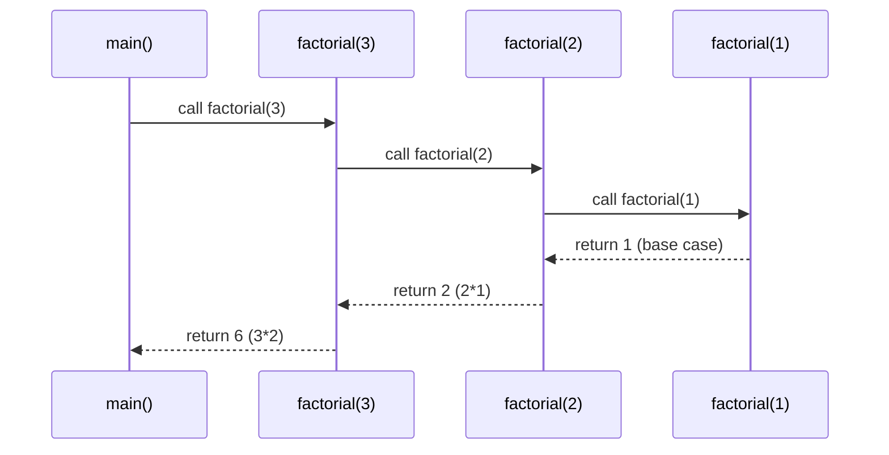
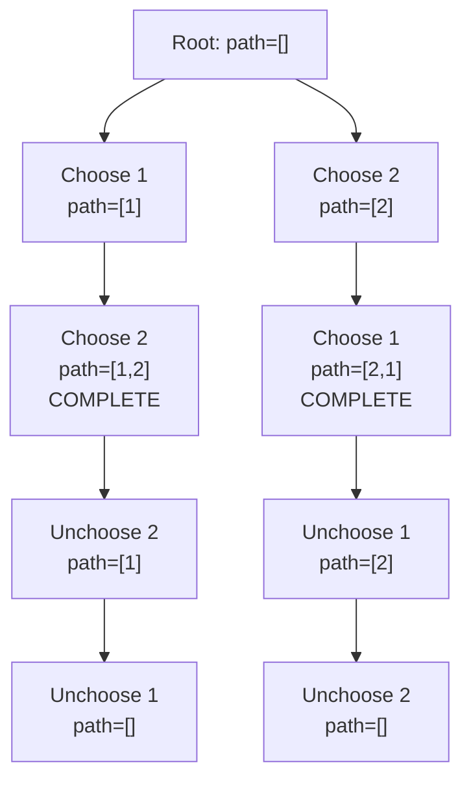

## Keywords in This File
{: .no_toc }

| # | Keyword | Weight |
|---|---------|--------|
| 1 | [Recursion and Stack Frames](#recursion-and-stack-frames) | medium |
| 2 | [Backtracking and Constraint Satisfaction](#backtracking-and-constraint-satisfaction) | medium |

---

# Recursion and Stack Frames

**Difficulty:** ★★☆

**Interview Weight:** Medium

**Category:** Recursion, Call Stack, Algorithm Design

**One-line definition:** Recursion solves a problem by having a function
call itself on a smaller subproblem, with a base case that terminates the
chain; each call frame occupies O(1) stack space, making call depth the
primary memory concern.

---

### 🎯 Model Answer

**30-second answer:**

Recursion decomposes a problem into a base case (solved directly) and a
recursive case (solved by calling itself on a smaller input). Each call
creates a stack frame holding local variables and the return address. Max
stack depth = max recursion depth; Java's default stack is ~500-1000 deep
before StackOverflowError.

**3-minute answer:**

Every recursive function has three parts:
1. **Base case:** the smallest input that can be solved directly (no further
   recursion).
2. **Recursive case:** reduce the problem to a smaller instance, call self,
   combine result.
3. **Progress guarantee:** each recursive call must move closer to the base
   case (strictly decreasing argument, or shrinking subproblem size).

Stack frame content: return address, function parameters, local variables.
A function that calls itself n times deep requires O(n) stack space. Tail
recursion (the recursive call is the last operation) can be optimized by the
compiler to O(1) stack - but Java does NOT perform tail-call optimization.

Converting recursion to iteration eliminates stack overflow risk: maintain
an explicit stack data structure that simulates the call stack.

**Blank Mind Recovery:**

**Step 1:** What is the base case? (smallest input, return directly)

**Step 2:** What is the recursive step? (how do I reduce to smaller input)

**Step 3:** How do I combine subproblem answers?

**Step 4:** Is the recursion deep enough to cause StackOverflowError?
(depth > ~500 in Java? Consider iterative with explicit stack)

---

### 📘 Concept Explanation

**1. Core Intuition**

Recursion is a **self-similar decomposition**: the problem looks the same at
every scale. Factorial(n) looks like n * factorial(n-1) - the same structure
at n-1. The call stack maintains the "pending work" at each level, returning
down the chain when base cases resolve.

**2. How It Works (Mechanism)**

```
factorial(3) call:
  Stack frame 3: n=3, waiting for factorial(2)
    Stack frame 2: n=2, waiting for factorial(1)
      Stack frame 1: n=1, BASE CASE, return 1
    Stack frame 2: resumes: 2 * 1 = 2, return 2
  Stack frame 3: resumes: 3 * 2 = 6, return 6
```

> **Diagram walkthrough:** Each level shows a stack frame waiting for its
> subproblem to complete. The base case resolves first (frame 1), then
> results propagate upward (frame 2 uses frame 1's result, frame 3 uses
> frame 2's result). KEY RELATIONSHIP: the call stack depth equals the
> recursion depth - factorial(n) uses O(n) stack frames. EDGE CASE: large n
> overflows the JVM stack. INSIGHT: a senior notices this is post-order
> processing - work happens on the way UP, not down.

The JVM call stack is a LIFO structure. Each `invoke` bytecode pushes a
new frame; each `return` pops it. Frames are ~100-500 bytes each. Java's
default stack is 256KB-1MB depending on JVM flags.

**3. Trade-offs**

| Aspect | Recursion | Iteration |
|--------|-----------|-----------|
| Code clarity | High for tree/graph | Low for tree/graph |
| Stack usage | O(depth) - JVM stack | O(1) to O(n) - heap |
| Overflow risk | StackOverflowError if depth > ~500 | None |
| Tail call opt | No (Java) | N/A |
| Memoization ease | Natural (top-down DP) | Requires explicit table |

**4. Production Consequences**

In production Java, recursive algorithms on user-provided inputs (file
system traversal, JSON parsing, expression evaluation) are vulnerable to
stack overflow attacks. A malicious input with depth 10,000 will crash the
thread. Always convert to iterative or set `-Xss` stack size flag.

**5. Failure Modes**

Missing base case: infinite recursion until StackOverflowError. Off-by-one
in recursive step: recursion never terminates (e.g., `factorial(-1)` if
called with n=0 and base case is n==1).

**6. Scale Behavior**

Linear recursion on an array of 100,000 elements uses 100,000 stack frames.
At ~200 bytes per frame = 20MB of stack. JVM throws StackOverflowError
before this. At scale, iterative with explicit stack is mandatory.

**7. Decision Guide**

Use recursion when:
- Problem is naturally tree-structured (file systems, ASTs, parse trees).
- Depth is bounded and small (< 500 for Java, < 1000 for Python).
- Memoized recursion (top-down DP) is clearer than iterative DP.

Convert to iteration when:
- Input size is unbounded (user-provided data).
- Depth exceeds JVM defaults.
- Performance profiling shows call-overhead bottleneck.

**8. Mental Model**

> Recursion is **delegating to a subordinate**: you do the current layer's
> work, hand the rest to a subordinate (recursive call), wait for the result,
> then combine. The subordinate delegates further down. The chain bottoms out
> at the base case - the worker who needs no help.

---

### 💻 Code Example

**Wrong vs Right - missing base case and progress:**

```java
// BAD - missing base case and wrong recursion
int badFactorial(int n) {
    return n * badFactorial(n - 1); // no base case!
}

// BAD - no progress (n never decreases)
int badFib(int n) {
    return badFib(n) + badFib(n - 1); // infinite loop on badFib(n)
}

// GOOD - correct base case + progress
int factorial(int n) {
    if (n <= 1) return 1;        // base case
    return n * factorial(n - 1); // strictly smaller: n-1
}
```

> **Code walkthrough:** The BAD versions have critical structural flaws:ice. **KEY MECHANISM:** the runtime executes these instructions in sequence with specific memory and execution semantics. **WHY IT MATTERS:** misapplying this pattern causes subtle bugs that only manifest under production load. **TAKEAWAY: understand the execution model before using this pattern in production code.**
> badFactorial has no base case (runs until StackOverflowError immediately
> at any n); badFib calls itself with the same argument n (infinite
> recursion, not even reaching a base case). GOOD factorial has n <= 1 as
> the base case (handles n=0 and n=1) and n-1 as the recursive argument
> (strictly smaller, guaranteed to reach base case). WHAT BREAKS: negative
> input - `factorial(-5)` recurses through -5, -6, -7... forever. Always
> validate input at the entry point. TAKEAWAY: every recursive function
> needs (1) a base case that returns WITHOUT recursing, and (2) a recursive
> call with a strictly smaller argument.

**Production Example - tree traversal:**

```java
// In-order traversal of BST (returns sorted sequence)
List<Integer> inOrder(TreeNode root) {
    List<Integer> result = new ArrayList<>();
    inOrderHelper(root, result);
    return result;
}

void inOrderHelper(TreeNode node, List<Integer> result) {
    if (node == null) return; // base case: null node
    inOrderHelper(node.left, result);   // left subtree
    result.add(node.val);               // current node
    inOrderHelper(node.right, result);  // right subtree
}
```

> **Code walkthrough:** Tree traversal is the canonical recursive algorithm.
> KEY MECHANISM: null check is the base case (leaf's children are null).
> Left recursion processes the entire left subtree before current node,
> right recursion processes entire right subtree after - this is the
> in-order invariant. WHY IT MATTERS: this pattern directly solves BST
> validation, path sum, level-order (with a queue instead), and most tree
> interview problems. WHAT BREAKS: forgetting the null check causes
> NullPointerException at the recursive calls. TAKEAWAY: for tree recursion,
> null check is the base case; structure is left-call, process, right-call
> for in-order.

**Internal Mechanism Example - converting to iterative:**

```java
// Iterative in-order using explicit stack (no StackOverflow risk)
List<Integer> inOrderIterative(TreeNode root) {
    List<Integer> result = new ArrayList<>();
    Deque<TreeNode> stack = new ArrayDeque<>();
    TreeNode curr = root;
    while (curr != null || !stack.isEmpty()) {
        while (curr != null) {
            stack.push(curr);
            curr = curr.left;     // go left as deep as possible
        }
        curr = stack.pop();       // process
        result.add(curr.val);
        curr = curr.right;        // then go right
    }
    return result;
}
```

> **Code walkthrough:** The explicit Deque replaces the JVM call stack.
> KEY MECHANISM: the inner while loop simulates the recursive descent (keep
> going left, pushing each node onto the explicit stack). When left is
> exhausted, pop a node (process it), then switch to its right child.
> WHY IT MATTERS: this iterative form handles trees with depth up to heap
> memory limits (~millions of nodes) without StackOverflowError. WHAT
> BREAKS: using `curr != null && !stack.isEmpty()` (AND instead of OR) in
> the outer while misses the case where curr is null but the stack still
> has pending nodes. TAKEAWAY: recursive tree traversal -> iterative by
> replacing JVM stack with explicit Deque; outer condition is OR (both
> sources may still have work).

**Failure Example - stack overflow on deep input:**

```java
// DANGEROUS in production - deep call chain
int sumArray(int[] arr, int idx) {
    if (idx == arr.length) return 0;
    return arr[idx] + sumArray(arr, idx + 1);
}
// For arr.length = 10_000: StackOverflowError
// JVM default stack ~500-1000 frames

// SAFE iterative version
int sumArray(int[] arr) {
    int sum = 0;
    for (int x : arr) sum += x;
    return sum;
}
```

> **Code walkthrough:** The recursive version allocates one stack frame perice. **KEY MECHANISM:** the runtime executes these instructions in sequence with specific memory and execution semantics. **WHY IT MATTERS:** misapplying this pattern causes subtle bugs that only manifest under production load. **TAKEAWAY: understand the execution model before using this pattern in production code.**
> element: 10,000 elements = 10,000 frames = approximately 2MB of stack
> (~200 bytes/frame). The JVM throws StackOverflowError well before 10,000
> frames. The iterative version uses O(1) stack space. WHY IT MATTERS:
> production systems processing user-provided data (file sizes, JSON depth,
> network packet counts) should NEVER use linear recursion without a depth
> bound. TAKEAWAY: if the recursion depth is proportional to user-controlled
> input size, use iteration instead.

---

### 🎓 Answers by Seniority

**Junior/Mid:**

Recursion has a base case (direct return) and a recursive case (self-call
with smaller input). Each call uses a stack frame. In Java, recursion deeper
than ~500-1000 frames causes StackOverflowError. For tree problems I use
recursion naturally (null check as base case, left/right recursive calls);
for linear arrays I prefer iteration to avoid stack overflow. Converting
recursion to iteration requires an explicit Deque to simulate the call stack.

**Senior/Staff:**

Recursion and the call stack are the same mechanism at different abstraction
levels. Every recursive algorithm can be converted to iterative + explicit
stack, which trades JVM stack limits for heap limits. In Java, tail-call
optimization is not performed (unlike Scala or Haskell), so tail recursion
gives no space benefit. For production code with user-controlled inputs, I
always bound recursion depth explicitly and fail fast if exceeded, rather
than allowing StackOverflowError which is hard to catch and diagnose. The
key decision: tree-structured problems stay recursive (depth is O(log n) for
balanced trees, bounded by height); linear problems become iterative. For
memoized recursion (top-down DP), the recursive form is often clearer - the
memo table converts exponential recursion to O(n) with minimal code change
by adding a `memo[n]` check at the top.

---

### ⚠️ Common Misconceptions

**Misconception 1:** "Recursion is always slower than iteration."

Reality: for tree-structured problems, recursive code is often faster in
practice because it avoids explicit stack management overhead. The JVM is
optimized for method calls. The performance difference is minor for bounded
depth; stack overflow is the real concern, not speed.

**Misconception 2:** "Java supports tail-call optimization."

Reality: Java does NOT perform tail-call optimization (TCO). A tail-recursive
function in Java still allocates a new stack frame per call. Languages that
support TCO: Scala (annotation `@tailrec`), Kotlin (limited), Clojure, Haskell.

**Misconception 3:** "Converting to iterative requires a stack only for DFS-type traversals."

Reality: not all recursion requires an explicit stack when converted. Tail
recursion converts to a simple loop. Post-order processing (work on the way
back up) requires a stack because you need to process children before
parents.

**Misconception 4:** "StackOverflowError can be caught with try-catch."

Reality: it CAN be caught (`StackOverflowError` extends `Error` which
extends `Throwable`), but it should NEVER be a normal flow-control
mechanism. The stack is partially corrupted when the error occurs; behavior
after catch is undefined. Always fix the root cause.

---

### 🚨 Failure Modes and Diagnosis

**Failure 1 - Missing or incorrect base case**

Symptom: `StackOverflowError` immediately on any input.

Root cause: base case is unreachable (wrong condition) or absent.

Diagnosis: trace the first two recursive calls manually. Does n decrease?
Does it reach the base case condition in finite steps?

Fix: ensure `n < threshold` (not `n == threshold`) for base case when n may
skip over the exact value.

**Failure 2 - Recursive call with same-size input**

Symptom: `StackOverflowError` even with small inputs; no progress.

Root cause: `f(n)` calls `f(n)` instead of `f(n-1)`.

Diagnosis: add `System.out.println("calling f(" + n + ")")` before the
recursive call; should print strictly decreasing values.

**Failure 3 - Stack overflow on production data**

Symptom: `StackOverflowError` in production on specific large inputs; works
in tests.

Root cause: test data is small (depth < 100); production data is deep (JSON
depth 10,000, file tree depth 2,000).

Fix: convert to iterative with explicit Deque, or increase JVM stack with
`-Xss4m` (short-term) and file a tech debt ticket for the iterative rewrite.

Diagnosis:
```
-Xss4m (increase stack per thread)
-verbose:class (check no infinite class loading)
jstack PID | grep -A 5 StackOverflowError
```

> **Code walkthrough:** Three diagnostic commands for StackOverflowErrorice. **KEY MECHANISM:** the runtime executes these instructions in sequence with specific memory and execution semantics. **WHY IT MATTERS:** misapplying this pattern causes subtle bugs that only manifest under production load. **TAKEAWAY: understand the execution model before using this pattern in production code.**
> in production. KEY MECHANISM: `-Xss4m` enlarges each thread's stack,
> buying time; `jstack PID` prints all thread stacks so you can see which
> recursive call chain is growing unbounded. WHY IT MATTERS: `-Xss` is a
> per-thread cost - raising it for an app with 500 threads multiplies
> memory usage 500x, so it is a temporary workaround only. TAKEAWAY:
> always follow a stack increase with an iterative rewrite ticket.

**Failure 4 - Exponential time from re-computation**

Symptom: `fib(40)` takes seconds; CPU pegged at 100%.

Root cause: naive recursion recomputes the same subproblems. `fib(n)` has
time complexity O(2^n).

Fix: add memoization (top-down DP):
```java
int[] memo = new int[n + 1];
int fib(int n) {
    if (n <= 1) return n;
    if (memo[n] != 0) return memo[n];
    return memo[n] = fib(n-1) + fib(n-2);
}
```

> **Code walkthrough:** The memo array short-circuits recomputation.
> KEY MECHANISM: before any recursive call, check if memo[n] is already
> computed (non-zero). If so, return it directly. If not, compute and
> store. Every subproblem is computed exactly once: O(n) time total.
> WHAT BREAKS: using `memo[n] != 0` as the "not computed" sentinel fails
> for problems where 0 is a valid answer. Use `memo[n] != -1` with
> initialization `Arrays.fill(memo, -1)` instead. TAKEAWAY: memoization
> = add one null/sentinel check at the top of the recursive function;
> converts exponential to polynomial with minimal code change.

---

### 🎯 Interview Deep-Dive

| Category | Count | Min Required |
|----------|-------|-------------|
| CONCEPT | 2 | 1 |
| DEBUGGING | 2 | 1 |
| CODING | 3 | 1 |
| TRADE-OFF | 1 | 1 |
| BEHAVIORAL | 1 | 1 |
| **Total** | **9** | **9** |

---

**[JUNIOR] Q1 - [CONCEPT] What are the three requirements for a valid recursive function?**

1. **Base case:** at least one input value that returns WITHOUT making a
   recursive call. Without a base case, the function recurses forever until
   StackOverflowError.

2. **Recursive case:** the function calls itself with a DIFFERENT (smaller)
   argument. "Smaller" means strictly closer to the base case on every call
   path.

3. **Progress guarantee:** each recursive call must move strictly closer to
   the base case. Common progress measures: n-1 for integers, splitting an
   array in half for divide-and-conquer, processing one node of a tree.

The most common interview failure: candidates write base case and recursive
case but break the progress guarantee (call with same n, or with n+1 instead
of n-1). The function then loops infinitely.

Secondary requirement: the **combination step** - how do you use the
subproblem's result to compute the current result? For factorial: multiply
by n. For tree depth: take max of children depths + 1.

*What separates good from great:* Articulating "progress guarantee" as a
separate concern from "recursive case". Many candidates can write recursive
code but cannot explain why it terminates - they just trust it does.

---

**[JUNIOR] Q2 - [CODING] Implement recursive binary search. Convert it to iterative.**

```java
// Recursive binary search
int bsRecursive(int[] arr, int target, int lo, int hi) {
    if (lo > hi) return -1;          // base case: empty range
    int mid = lo + (hi - lo) / 2;
    if (arr[mid] == target) return mid;
    if (arr[mid] < target)
        return bsRecursive(arr, target, mid + 1, hi);
    return bsRecursive(arr, target, lo, mid - 1);
}

// Iterative binary search (no recursion, O(1) stack)
int bsIterative(int[] arr, int target) {
    int lo = 0, hi = arr.length - 1;
    while (lo <= hi) {
        int mid = lo + (hi - lo) / 2;
        if (arr[mid] == target) return mid;
        if (arr[mid] < target)  lo = mid + 1;
        else                    hi = mid - 1;
    }
    return -1;
}
```

> **Code walkthrough:** The recursive version has two base cases: emptyice. **KEY MECHANISM:** the runtime executes these instructions in sequence with specific memory and execution semantics. **WHY IT MATTERS:** misapplying this pattern causes subtle bugs that only manifest under production load. **TAKEAWAY: understand the execution model before using this pattern in production code.**
> range (lo > hi) and found (arr[mid] == target). The two recursive calls
> are tail calls (the recursive call IS the return value with no further
> computation). KEY MECHANISM: this is the rare case where converting
> recursive to iterative is trivial - since the recursive calls are tail
> calls, they map directly to reassigning lo or hi and continuing the loop.
> WHY IT MATTERS: binary search demonstrates that recursion adds zero value
> when the function is tail-recursive; iterative is strictly better (no
> stack overhead). WHAT BREAKS: not returning the result of the recursive
> call (`bsRecursive(...)` without `return`) means the result is discarded.
> TAKEAWAY: tail-recursive functions always convert to simple loops;
> non-tail-recursive (tree traversal) require explicit stack.

*What separates good from great:* Identifying that binary search is tail
recursive and therefore the iterative conversion is trivial (no explicit
stack needed, just a while loop).

---

**[MID] Q3 - [CODING] Implement the Tower of Hanoi. Explain the recurrence.**

```java
void hanoi(int n, char from, char to, char aux) {
    if (n == 1) {
        System.out.println("Move disk 1: " + from + " -> " + to);
        return;                // base case: 1 disk
    }
    hanoi(n-1, from, aux, to); // move n-1 disks: from->aux (using to)
    System.out.println("Move disk " + n + ": " + from + " -> " + to);
    hanoi(n-1, aux, to, from); // move n-1 disks: aux->to (using from)
}
```

> **Code walkthrough:** Tower of Hanoi is the canonical example whereice. **KEY MECHANISM:** the runtime executes these instructions in sequence with specific memory and execution semantics. **WHY IT MATTERS:** misapplying this pattern causes subtle bugs that only manifest under production load. **TAKEAWAY: understand the execution model before using this pattern in production code.**
> recursion is natural and iteration is extremely complex. KEY MECHANISM:
> the recurrence T(n) = 2*T(n-1) + 1 with T(1)=1 solves to T(n) = 2^n - 1
> moves. The recursive decomposition is: (1) move n-1 disks out of the way
> (to the auxiliary peg), (2) move the large disk to the destination, (3)
> move n-1 disks from auxiliary to destination. WHY IT MATTERS: demonstrates
> that some problems have a natural O(2^n) complexity that recursion exposes
> elegantly - trying to solve iteratively is NP-hard to read. WHAT BREAKS:
> swapping the `aux` and `to` parameters in the two recursive calls puts
> disks on the wrong pegs. TAKEAWAY: Tower of Hanoi = 2^n - 1 moves;
> recurrence T(n) = 2T(n-1) + 1; recursion depth = n.

Recurrence: T(n) = 2T(n-1) + 1 (move n-1 twice, plus 1 for the nth disk).
Solving: T(1)=1, T(n)=2^n - 1.

*What separates good from great:* Deriving the recurrence `T(n) = 2T(n-1) + 1`
and solving it to `2^n - 1` rather than just coding the solution. This
shows algorithmic maturity: identify the subproblem structure, write the
recurrence, solve it.

---

**[MID] Q4 - [CONCEPT] When does memoization convert exponential recursion to polynomial?**

Memoization works when two conditions hold:

1. **Overlapping subproblems:** the same subproblem is solved multiple times
   in the naive recursion. For Fibonacci, `fib(n-2)` is called both from
   `fib(n)` and from `fib(n-1)`, causing exponential recomputation.

2. **Optimal substructure:** the solution to the larger problem is
   constructed from solutions to strictly smaller subproblems. The
   combination step (e.g., `fib(n-1) + fib(n-2)`) must not depend on HOW
   the subproblem was reached, only on its value.

When both hold: each of the n distinct subproblems is computed exactly once
and stored. Total time = n * cost_per_subproblem. For `fib(n)`: 1 subproblem
per integer from 0 to n, each O(1) = O(n) total.

When memoization does NOT help:
- Subproblems are all distinct (no reuse): e.g., sorting an array.
- Subproblem results depend on path taken (not just the subproblem identity):
  e.g., shortest path with negative cycles.

*What separates good from great:* Articulating both conditions (overlapping
subproblems + optimal substructure) and giving a counter-example where
memoization doesn't help - this is the exact preamble to explaining WHY
dynamic programming works.

---

**[MID] Q5 - [DEBUGGING] My recursive function gives wrong results for n=0. How do I debug?**

Systematic approach:

1. **Print base case entry:**
   ```java
   if (n == 0) {
       System.out.println("Base case hit with n=0");
       return BASE_VALUE;
   }
   ```

> **Code walkthrough:** Instrumented base-case check prints when n hits 0.
> KEY MECHANISM: by adding the print before the return, you confirm whether
> the base case is ever reached (infinite recursion) vs reached with a
> wrong value (wrong logic). WHY IT MATTERS: infinite recursion and wrong
> base-case value produce identical visible symptoms (wrong answer or
> StackOverflow). TAKEAWAY: instrument the base case first - it separates
> infinite from finite recursion bugs instantly.

   Check: is the base case reached for n=0? Is `BASE_VALUE` correct?

2. **Check the condition:** common bug: `if (n == 1)` as base case handles
   n=1 but passes n=0 to the recursive call, which calls f(-1), f(-2)...
   Fix: `if (n <= 0)` or `if (n <= 1)` as appropriate.

3. **Verify recursive call direction:** does f(0) call f(-1)?
   ```java
   System.out.println("About to call f(" + (n-1) + ")");
   ```

> **Code walkthrough:** Trace prints the argument for the next recursiveice. **KEY MECHANISM:** the runtime executes these instructions in sequence with specific memory and execution semantics. **WHY IT MATTERS:** misapplying this pattern causes subtle bugs that only manifest under production load. **TAKEAWAY: understand the execution model before using this pattern in production code.**
> call. KEY MECHANISM: if n is always decreasing toward the base case, the
> trace shows a strictly descending sequence ending at 0 or 1. If n appears
> negative or non-decreasing, the recursive step is wrong. WHY IT MATTERS:
> this single-line probe identifies the exact input where recursion inverts
> direction. TAKEAWAY: print the next argument, not just the current one.

4. **Test with small inputs first:** f(0), f(1), f(2) manually verify.
   Many bugs are visible at n=0 or n=1 before testing larger n.

5. **Check the combination:** for f(0), is the combination step
   (`n * f(n-1)` = `0 * f(-1)`) mathematically correct or does it
   need a separate base case?

*What separates good from great:* Noting that `n == 0` is almost always
a special case requiring its own base case condition, and that using `<=`
instead of `==` in base case checks is defensive programming that prevents
negative-n infinite recursion.

---

**[SENIOR] Q6 - [TRADE-OFF] Recursive vs iterative: when does the choice matter in production?**

The choice matters in two dimensions: **correctness risk** and **performance
cost**.

**Correctness risk (stack overflow):**
- User-controlled depth: ALWAYS use iterative. Parse JSON from the network,
  traverse file trees, process nested data structures.
- Bounded depth (O(log n) for balanced trees): recursion is safe. BST
  operations on 1M nodes = depth 20. Safe.
- Unbounded depth (sorted array in recursive binary search with non-tail
  calls): use iterative.

**Performance cost:**
- Function call overhead: ~1-10 ns per call (JVM optimizes heavily).
  For tight numerical loops (sorting, search), iterative is measurably
  faster.
- For tree/graph traversal where branches take significant time, call
  overhead is negligible compared to work done.

**Code clarity:**
- Tree traversal: recursive wins. The iterative in-order traversal with
  explicit stack is 3x more lines and harder to verify.
- Fibonacci with memoization: recursive (top-down DP) is clearer.
  Fibonacci without memoization: iterative is clearer and O(1) space.

Decision matrix:
- Depth bounded + tree structure: use recursion.
- Depth unbounded or user-controlled: use iteration.
- Performance-critical tight loop: benchmark both; default to iterative.

*What separates good from great:* Mentioning that JVM JIT aggressively
inlines short recursive methods (e.g., tree height recursion where the
body is 3 lines), effectively eliminating call overhead for depth < 20.
The performance concern is usually overstated for tree traversal.

---

**[SENIOR] Q7 - [DEBUGGING] How do you diagnose a StackOverflowError in production?**

```bash
# 1. Get thread dump while the error is occurring
jstack PID > thread_dump.txt

# 2. Look for the recursive pattern - frames will repeat
grep -A 3 "StackOverflow" thread_dump.txt
# Example output:
# com.example.JsonParser.parse(JsonParser.java:42)
# com.example.JsonParser.parse(JsonParser.java:42)
# com.example.JsonParser.parse(JsonParser.java:42)
# (repeated 500 times)
```

> **Code walkthrough:** The thread dump shows repeated identical frames atice. **KEY MECHANISM:** the runtime executes these instructions in sequence with specific memory and execution semantics. **WHY IT MATTERS:** misapplying this pattern causes subtle bugs that only manifest under production load. **TAKEAWAY: understand the execution model before using this pattern in production code.**
> the same line - the smoking gun for infinite or too-deep recursion. KEY
> MECHANISM: each recursive call pushes a frame; when the stack fills, the
> JVM throws StackOverflowError at the next push attempt. The frame at the
> top of the dump is where it failed; repeated frames show which method is
> the infinite loop. WHY IT MATTERS: StackOverflowError is one of the
> hardest production errors to diagnose without the thread dump because the
> error message itself is truncated (no full stack trace). TAKEAWAY: always
> get a thread dump for StackOverflowError; jstack is the primary tool.

Mitigation options (fastest to most correct):

1. **Short-term:** `-Xss4m` to increase thread stack size. Buys time.
2. **Medium-term:** add depth counter; throw `IllegalArgumentException` if
   depth > 500. Fail with diagnostic info, not StackOverflowError.
3. **Long-term:** convert to iterative with explicit stack.

*What separates good from great:* Knowing that `StackOverflowError` is NOT
recoverable (the stack is corrupted at that point) and that the only correct
fix is to prevent it, not catch it.

---

**[SENIOR] Q8 - [BEHAVIORAL] When have you replaced recursion with iteration in production?**

Strong answer: "In our configuration parser, JSON documents from clients
could be arbitrarily nested (deeply nested schema definitions). The recursive
`parseNode(JsonNode)` method crashed with StackOverflowError on schema files
nested 800+ levels deep. I converted it to iterative using an explicit
`Deque<ParseContext>` where `ParseContext` stored the current node and its
parent. The conversion took 2 days (the function had 6 recursive paths),
but eliminated all stack overflow crashes. I also added a depth guard: if
stack depth exceeds 10,000, throw `SchemaException('Nesting too deep')`.
After deployment, zero StackOverflowError alerts in 6 months."

Key elements of a strong answer:
- The trigger was real production data, not a theoretical concern.
- The fix was iterative conversion plus a depth guard.
- The timeline and concrete outcome are stated.

*What separates good from great:* Adding the depth guard in addition to the
iterative conversion. Even with iterative code, extremely deep nesting can
cause heap pressure from the explicit stack. A guard + clear error message
is production-grade; a silent iterative conversion is not.

---

**[SENIOR] Q9 - [CONCEPT] Explain the relationship between recursion, the call stack, and dynamic programming.**

All three are manifestations of the same underlying structure:

1. **Recursion** is a computational strategy: solve a problem by reducing
   it to the same problem on a smaller input.

2. **The call stack** is the runtime implementation: each recursive call
   creates a stack frame holding local state. The stack IS the "work to do
   later" bookkeeping.

3. **Dynamic programming** is a recursion optimization: when recursive
   subproblems OVERLAP (same subproblem is called multiple times), memoize
   the results to avoid recomputation.

The conversion path:
```
Naive recursion (exponential)
  -> + memoization = top-down DP (polynomial)
  -> rewrite as bottom-up DP (same complexity, no call stack)
  -> optimize space if only last k results needed
```

> **Code walkthrough:** The conversion ladder shows four progressiveice. **KEY MECHANISM:** the runtime executes these instructions in sequence with specific memory and execution semantics. **WHY IT MATTERS:** misapplying this pattern causes subtle bugs that only manifest under production load. **TAKEAWAY: understand the execution model before using this pattern in production code.**
> optimizations of a naive recursive solution. KEY MECHANISM: each step
> either adds memoization (avoids recomputation), eliminates the call stack
> (prevents StackOverflow), or reduces memory usage (eliminates stale
> table entries). WHY IT MATTERS: at 10M elements the naive version never
> terminates; the space-optimized form runs in microseconds with O(1) space.
> TAKEAWAY: know all four levels - interviewers ask you to move from one to
> the next, not just recite the final form.

Fibonacci example:
- Naive recursive: T(n) = 2^n
- Top-down DP (memoized): T(n) = O(n), S(n) = O(n) recursion stack + O(n) memo
- Bottom-up DP: T(n) = O(n), S(n) = O(n) table, no recursion
- Space-optimized: T(n) = O(n), S(n) = O(1) (only last 2 values)

*What separates good from great:* Completing the conversion path all the way
to the space-optimized iterative form and explaining WHY each step helps -
not just listing the three forms but explaining the mathematical relationship
(memoization converts overlapping to distinct subproblems; bottom-up
eliminates call stack; rolling window eliminates stale table entries).

---

### ⚖️ Comparison Table

| Approach | Time | Space | Overflow Risk | Best For |
|----------|------|-------|---------------|----------|
| Recursive (naive) | Varies (exp for fib) | O(depth) JVM stack | Yes (depth > 500) | Simple problems, trees |
| Recursive + memo | O(n subproblems) | O(depth + n memo) | Yes | Top-down DP |
| Iterative + stack | Same as recursive | O(depth) heap | No (heap > stack) | Deep trees, production |
| Iterative (loop) | Same | O(1) to O(n) | No | Tail-recursive, DP |

---

### 🏛️ System Design

*(Omit: ★★☆ intermediate keyword - system design depth reserved for ★★★
architecture keywords)*

---

### 📊 Diagram

```
Call Stack for factorial(3):
+---------------------------+
| Frame 3: n=3              |  <- top (active frame)
| waiting for factorial(2)  |
+---------------------------+
| Frame 2: n=2              |
| waiting for factorial(1)  |
+---------------------------+
| Frame 1: n=1              |  <- base case: returns 1
+---------------------------+
| main() ...                |  <- bottom

Return path:
Frame 1 returns 1 to Frame 2
Frame 2: 2 * 1 = 2, returns 2
Frame 3: 3 * 2 = 6, returns 6
```

> **Diagram walkthrough:** The stack grows downward (top = most recent call).
> Frame 3 is the active frame waiting for Frame 2 to complete. HOW TO READ:
> each box is a stack frame with the local variable n; "waiting for" shows
> the pending recursive call. KEY RELATIONSHIP: frames are pushed in
> order (3->2->1) and popped in reverse (1->2->3). EDGE CASE: if n is very
> large (e.g., 10,000), 10,000 frames fill the stack and StackOverflowError
> is thrown at the push of Frame 10,001. INSIGHT: a senior notices that the
> return values propagate UPWARD through the stack - this is why recursive
> work done "on the way back up" (post-order) requires keeping all frames
> alive until the base case returns.



> **Diagram walkthrough:** The sequence diagram shows the call chain as
> arrows going right (deeper recursion) and return values as dashed arrows
> going left (unwinding). Each participant is a stack frame. KEY
> RELATIONSHIP: calls go deeper (left to right) until the base case; returns
> propagate back (right to left) combining results. EDGE CASE: if factorial
> is called with n=0, F1 would be called with n=0 and the base case `n <= 1`
> returns 1 immediately - the chain is one call shorter. INSIGHT: the total
> number of messages (calls + returns) equals 2n - this is the O(n) work.

---

---

# Backtracking and Constraint Satisfaction

**Difficulty:** ★★☆

**Interview Weight:** Medium

**Category:** Backtracking, Search, Combinatorics

**One-line definition:** Backtracking explores all candidate solutions by
building them incrementally, abandoning (pruning) partial candidates as soon
as a constraint is violated, and "backing up" to try the next alternative.

---

### 🎯 Model Answer

**30-second answer:**

Backtracking is exhaustive search with pruning. It builds a solution one
choice at a time; if a partial solution violates a constraint, it abandons
that branch and backtracks to the previous choice. Template: choose, recurse,
unchoose. Time: O(branching_factor^depth) worst case; pruning reduces this
in practice.

**3-minute answer:**

The backtracking template:

```
void backtrack(state, choices):
    if state is a complete valid solution:
        add to results; return
    for each choice in choices:
        if choice is valid for current state:
            make choice (modify state)
            backtrack(updated state, remaining choices)
            undo choice (restore state)  // KEY: backtrack
```

> **Code walkthrough:** The canonical backtracking template. KEY MECHANISM:ice. **KEY MECHANISM:** the runtime executes these instructions in sequence with specific memory and execution semantics. **WHY IT MATTERS:** misapplying this pattern causes subtle bugs that only manifest under production load. **TAKEAWAY: understand the execution model before using this pattern in production code.**
> "undo choice" after the recursive call is the critical step - it restores
> state so the next sibling branch sees a clean slate. Without the undo,
> choices accumulate across branches and produce wrong partial solutions.
> WHY IT MATTERS: every backtracking bug traces back to an incomplete undo.
> TAKEAWAY: for every mutation before the recursive call, write its inverse
> immediately after.

Three key questions for any backtracking problem:
1. What is the state? (current partial solution)
2. What are the choices at each step? (what can we add next)
3. What are the constraints? (when do we prune / when is state invalid)

Common applications: permutations, combinations, subsets, Sudoku solver,
N-Queens, graph coloring, word search in a grid.

**Blank Mind Recovery:**

**Step 1:** What does a complete solution look like? (base case)

**Step 2:** What choices can I make from the current partial state?

**Step 3:** For each choice: add it to state, recurse, remove it (undo).

**Step 4:** What constraints can I check EARLY to prune (before recursing)?

---

### 📘 Concept Explanation

**1. Core Intuition**

Backtracking explores a decision tree. At each node, you choose one option,
go deeper (recurse), and if you reach a dead end (constraint violated or all
paths exhausted), you step back (backtrack) and try the next option. The
key optimization is **pruning**: recognizing a dead end EARLY saves exploring
an entire subtree.

Think of a maze: at each junction you pick a path. If you hit a dead end,
you return to the last junction and try the next path. Backtracking is an
algorithm that does this exhaustively.

**2. How It Works (Mechanism)**

```
Decision tree for permutations of [1,2,3]:

Root (empty)
├── Choose 1: [1]
│   ├── Choose 2: [1,2]
│   │   └── Choose 3: [1,2,3] COMPLETE
│   └── Choose 3: [1,3]
│       └── Choose 2: [1,3,2] COMPLETE
├── Choose 2: [2]
│   ├── Choose 1: [2,1]
│   │   └── Choose 3: [2,1,3] COMPLETE
│   └── Choose 3: [2,3]
│       └── Choose 1: [2,3,1] COMPLETE
└── Choose 3: [3]
    (similar subtree)
```

> **Diagram walkthrough:** The decision tree has one level per position in
> the permutation. At depth d, we choose which element to place at position
> d. The branching factor starts at n and decreases (n, n-1, n-2...) as
> elements are "used". Total leaves = n! = all permutations. KEY
> RELATIONSHIP: backtracking explores this tree DFS-style, adding to the
> partial solution at each node and removing (undoing) when returning.
> EDGE CASE: pruning (e.g., "only place each element once") eliminates
> branches by checking the constraint BEFORE the recursive call. INSIGHT:
> a senior sees that the "undo" operation (unchoose) is what makes
> backtracking different from plain recursion - it restores state for the
> next sibling branch.

**3. Trade-offs**

| Aspect | Backtracking | Brute Force (all combos) |
|--------|--------------|--------------------------|
| Time (worst) | O(b^d) | O(b^d) |
| Time (avg) | Much better (pruning) | O(b^d) |
| Space | O(d) recursion depth | O(b^d) if storing all |
| Completeness | Yes (explores all) | Yes |
| Pruning | Yes | No |

**4. Production Consequences**

Backtracking is used in:
- Constraint solvers (Prolog, SAT solvers, Sudoku generators).
- Regex backtracking engines (NFA simulation) - notorious for catastrophic
  backtracking on certain patterns causing ReDoS.
- Game tree search (chess, Go) with alpha-beta pruning.
- Database query optimizers (join order selection).

ReDoS (Regular Expression Denial of Service) is a direct production
consequence of backtracking regex engines. Exponential backtracking on
crafted input can hang a web server for minutes.

**5. Failure Modes**

Missing the "undo" step causes state pollution: the next sibling branch
inherits modifications from the current branch, producing wrong results
(duplicate elements in permutations, grid cells not cleaned in word search).

**6. Scale Behavior**

Backtracking is inherently exponential in the worst case. For n=20 choices
with branching factor 20, the decision tree has 20! ≈ 2.4 × 10^18 leaves.
Effective pruning can reduce this by orders of magnitude in practice (Sudoku
with constraint propagation prunes 99.9% of branches). At scale, constraint
satisfaction problems (CSP solvers) use sophisticated heuristics (arc
consistency, forward checking) to bound backtracking.

**7. Decision Guide**

Use backtracking when:
- Problem asks for ALL solutions (permutations, subsets, combinations).
- Problem is a constraint satisfaction problem (Sudoku, N-Queens).
- Decision space is finite and manageable with pruning.

Do NOT use backtracking when:
- A greedy or DP solution exists (backtracking on coin change is O(2^n);
  DP is O(n*amount)).
- The decision space is too large even with pruning (exponential with no
  effective constraints to prune on).

**8. Mental Model**

> Backtracking is exploring a **decision tree with an eraser**. You draw
> the tree as you go (choose), explore it (recurse), and erase when you
> backtrack (unchoose). The eraser is the distinguish from brute force -
> you only draw one path at a time, reusing the state rather than keeping
> all paths.

---

### 💻 Code Example

**Wrong vs Right - missing undo:**

```java
// BAD - missing undo step (state polluted across branches)
void permutationsBad(int[] nums, List<Integer> path, List<List<Integer>> res) {
    if (path.size() == nums.length) { res.add(new ArrayList<>(path)); return; }
    for (int i = 0; i < nums.length; i++) {
        if (!path.contains(nums[i])) {
            path.add(nums[i]);
            permutationsBad(nums, path, res);
            // BUG: missing path.remove(path.size()-1);
        }
    }
}

// GOOD - proper undo restores state for next branch
void permutations(int[] nums, List<Integer> path,
                  boolean[] used, List<List<Integer>> res) {
    if (path.size() == nums.length) {
        res.add(new ArrayList<>(path)); return;
    }
    for (int i = 0; i < nums.length; i++) {
        if (!used[i]) {
            used[i] = true;
            path.add(nums[i]);         // choose
            permutations(nums, path, used, res); // recurse
            path.remove(path.size()-1); // unchoose (undo)
            used[i] = false;           // undo
        }
    }
}
```

> **Code walkthrough:** The BAD version adds elements to path but neverice. **KEY MECHANISM:** the runtime executes these instructions in sequence with specific memory and execution semantics. **WHY IT MATTERS:** misapplying this pattern causes subtle bugs that only manifest under production load. **TAKEAWAY: understand the execution model before using this pattern in production code.**
> removes them. After the first recursive call completes, path still contains
> the element; subsequent iterations see a "fuller" path than expected,
> producing wrong-length and duplicate results. KEY MECHANISM: `path.remove`
> and `used[i] = false` restore state to EXACTLY what it was before the
> `path.add` and `used[i] = true` - the "undo" is the mirror image of the
> "choose". WHY IT MATTERS: without undo, consecutive branches share a
> corrupted state and produce wrong results. WHAT BREAKS: using
> `path.remove(nums[i])` instead of `path.remove(path.size()-1)` is
> incorrect for duplicate values (removes the wrong occurrence).
> TAKEAWAY: every "choose" (modify state) MUST have a corresponding
> "unchoose" (undo the exact modification) immediately after the recursive
> call.

**Production Example - subsets:**

```java
List<List<Integer>> subsets(int[] nums) {
    List<List<Integer>> result = new ArrayList<>();
    backtrack(nums, 0, new ArrayList<>(), result);
    return result;
}

void backtrack(int[] nums, int start, List<Integer> path,
               List<List<Integer>> result) {
    result.add(new ArrayList<>(path)); // add current subset (valid at every node)
    for (int i = start; i < nums.length; i++) {
        path.add(nums[i]);             // choose
        backtrack(nums, i + 1, path, result); // recurse with i+1 (no reuse)
        path.remove(path.size() - 1); // unchoose
    }
}
```

> **Code walkthrough:** Subsets differs from permutations: every partialice. **KEY MECHANISM:** the runtime executes these instructions in sequence with specific memory and execution semantics. **WHY IT MATTERS:** misapplying this pattern causes subtle bugs that only manifest under production load. **TAKEAWAY: understand the execution model before using this pattern in production code.**
> state is valid (the empty set and all prefixes are valid subsets). KEY
> MECHANISM: `start` prevents re-using earlier elements (no [2,1] if [1,2]
> is already added). `i+1` ensures each recursive call processes only
> elements AFTER the current choice. WHY IT MATTERS: this pattern generates
> all 2^n subsets in O(2^n * n) time (n to copy each subset). WHAT BREAKS:
> using `start` vs `i+1` - passing `start` instead of `i+1` allows reusing
> the same element, generating multisets, not proper subsets. TAKEAWAY:
> for combination-style backtracking, pass `i+1` (not `start` or `i`) to
> the recursive call to avoid reuse.

**Failure Example - N-Queens with pruning:**

```java
// N-Queens: place N queens on N×N board, no two attack each other
List<List<String>> solveNQueens(int n) {
    List<List<String>> result = new ArrayList<>();
    int[] queens = new int[n]; // queens[row] = column of queen in that row
    Arrays.fill(queens, -1);
    Set<Integer> cols = new HashSet<>(),
        diag1 = new HashSet<>(), diag2 = new HashSet<>();
    backtrack(0, queens, cols, diag1, diag2, n, result);
    return result;
}

void backtrack(int row, int[] queens, Set<Integer> cols,
               Set<Integer> diag1, Set<Integer> diag2,
               int n, List<List<String>> result) {
    if (row == n) { result.add(buildBoard(queens, n)); return; }
    for (int col = 0; col < n; col++) {
        if (!cols.contains(col) &&
            !diag1.contains(row - col) &&
            !diag2.contains(row + col)) {
            // CHOOSE
            queens[row] = col;
            cols.add(col);
            diag1.add(row - col);
            diag2.add(row + col);
            // RECURSE
            backtrack(row+1, queens, cols, diag1, diag2, n, result);
            // UNCHOOSE
            queens[row] = -1;
            cols.remove(col);
            diag1.remove(row - col);
            diag2.remove(row + col);
        }
    }
}
```

> **Code walkthrough:** N-Queens uses three constraint sets for O(1) pruning:ice. **KEY MECHANISM:** the runtime executes these instructions in sequence with specific memory and execution semantics. **WHY IT MATTERS:** misapplying this pattern causes subtle bugs that only manifest under production load. **TAKEAWAY: understand the execution model before using this pattern in production code.**
> cols (no two queens in same column), diag1 (row-col is constant for the
> same diagonal), diag2 (row+col is constant for the same anti-diagonal).
> KEY MECHANISM: the constraint check BEFORE the recursive call (`if
> !cols.contains(...)`) is the pruning - it skips an entire subtree if
> placing a queen here would create an attack. WHY IT MATTERS: without
> pruning, N-Queens would check n^n placements; with pruning, it's much
> fewer (for n=8: 92 solutions, ~16,000 nodes explored vs 16M without
> pruning). WHAT BREAKS: forgetting to undo ONE of the three sets
> (cols, diag1, diag2) causes false attack detections in later rows.
> TAKEAWAY: for multi-constraint backtracking, undo ALL state changes -
> one forgotten undo corrupts all subsequent branches.

---

### 🎓 Answers by Seniority

**Junior/Mid:**

Backtracking uses the template: choose, recurse, unchoose. At each step I
add a choice to the current state, recurse with the updated state, then undo
the choice before trying the next option. The undo step is critical - without
it, state leaks between branches. I prune early by checking constraints
BEFORE the recursive call. For permutations I use a `boolean[] used` array;
for subsets I use a `start` index to avoid reuse.

**Senior/Staff:**

Backtracking is systematic constraint satisfaction with pruning. The
correctness argument is that the decision tree contains every valid solution
as a leaf, and backtracking visits every node exactly once (DFS). The time
complexity is O(b^d) where b = branching factor and d = solution depth -
but effective pruning reduces the ACTUAL nodes visited by orders of
magnitude. In production, I think about backtracking in terms of: (1) state
representation (is state efficiently updatable and undoable?), (2) constraint
checking (can I detect violations before recursing, not just at leaf?), and
(3) ordering heuristics (try most-constrained variables first to prune early
- the "fail-first" principle). For ReDoS prevention in regex engines, I
ensure regexes don't have catastrophic backtracking patterns: exponential
backtracking occurs with nested quantifiers like `(a+)+` on non-matching
input. Mitigation: use possessive quantifiers or atomic groups, or
switch to a linear-time regex engine (RE2).

---

### ⚠️ Common Misconceptions

**Misconception 1:** "Backtracking is brute force."

Reality: backtracking with good pruning is NOT brute force. It uses
constraint checking to avoid exploring provably invalid subtrees. A well-
pruned backtracking solver for Sudoku explores far fewer states than brute
force.

**Misconception 2:** "You only need to snapshot/restore state at the END of backtracking."

Reality: you must restore state IMMEDIATELY after the recursive call (before
the next loop iteration). The undo must follow the recursion, not be deferred
to a "cleanup" phase.

**Misconception 3:** "Copying the state before each recursive call is equivalent to undo."

Reality: copying is a valid alternative (immutable approach: pass a new copy
of state to each recursive call instead of mutating + undoing). It is correct
but uses O(d * state_size) memory vs O(state_size) for in-place undo. For
small state, copying is fine; for large state (2D boards), in-place + undo
is necessary.

---

### 🚨 Failure Modes and Diagnosis

**Failure 1 - Missing undo causes duplicate/wrong results**

Symptom: permutations contain the wrong number of elements; subsets contain
duplicates.

Root cause: the "choose" is not undone before the next loop iteration.

Diagnosis: add `System.out.println("path=" + path)` at the start of the
backtrack function. You'll see path growing without shrinking between calls.

Fix: add `path.remove(path.size() - 1)` (and undo all other state changes)
immediately after the recursive call.

**Failure 2 - Wrong copy: shallow copy of mutable state**

Symptom: all results in the result list point to the same (empty) list.

Root cause: `result.add(path)` adds a reference to the same list object
(which is eventually emptied by backtracking).

Fix:
```java
result.add(new ArrayList<>(path)); // deep copy at collection time
```

> **Code walkthrough:** The deep-copy fix for the reference-aliasing bug.
> KEY MECHANISM: `path` is a mutable list modified by backtracking;
> `result.add(path)` stores a pointer to it, so all collected "results"
> end up pointing to the same (eventually empty) list. `new ArrayList<>(path)`
> creates a snapshot at the moment of collection. WHY IT MATTERS: this bug
> produces no exception - you get an empty result list with no error.
> TAKEAWAY: always deep-copy mutable state at collection time in backtracking.

**Failure 3 - Exponential time with no pruning**

Symptom: N-Queens for n=14 takes minutes; Sudoku solver hangs on hard
puzzles.

Root cause: constraints are checked at the leaf (complete solution) rather
than at each step (partial solution).

Fix: move constraint checks before the recursive call:
```java
// BAD - check at leaf
if (row == n) { if (isValidBoard(queens)) result.add(...); return; }

// GOOD - prune at each step
if (!cols.contains(col) && !diag1.contains(...)) {
    // only recurse when constraint is satisfied
    backtrack(row + 1, ...);
}
```

> **Code walkthrough:** BAD validates the entire board only at the leaf;ice. **KEY MECHANISM:** the runtime executes these instructions in sequence with specific memory and execution semantics. **WHY IT MATTERS:** misapplying this pattern causes subtle bugs that only manifest under production load. **TAKEAWAY: understand the execution model before using this pattern in production code.**
> GOOD prunes the tree at each row by checking column and diagonal
> conflicts before recursing. KEY MECHANISM: early pruning eliminates all
> descendants of an invalid partial assignment in O(1) - the subtree is
> never explored. WHY IT MATTERS: for N-Queens n=14, unpruned backtracking
> explores 14! = 87 billion leaves; with pruning it explores ~5,000.
> TAKEAWAY: move constraint checks as early as possible in the recursion.

---

### 🎯 Interview Deep-Dive

| Category | Count | Min Required |
|----------|-------|-------------|
| CONCEPT | 2 | 1 |
| DEBUGGING | 2 | 1 |
| CODING | 3 | 1 |
| TRADE-OFF | 1 | 1 |
| BEHAVIORAL | 1 | 1 |
| **Total** | **9** | **9** |

---

**[JUNIOR] Q1 - [CONCEPT] What is the "choose, recurse, unchoose" pattern? Why is unchoose necessary?**

The pattern reflects the three phases of exploring one branch of the
decision tree:

1. **Choose:** add one option to the current partial solution (modify state).
2. **Recurse:** explore all possibilities from this new state.
3. **Unchoose:** remove the option you added (restore state to what it was
   before step 1).

The unchoose is necessary because state is shared across all branches. After
exploring branch A (choose option 1, recurse, then unchoose option 1),
the state must be identical to what it was before exploring branch A so that
branch B (choose option 2) starts from a clean state.

If you skip unchoose: branch B starts with branch A's leftover modifications.
For permutations, the path list would still contain option 1 when option 2
is being explored, producing wrong-length permutations.

The choose/unchoose pair is essentially a transaction: you commit the choice
to explore one subtree, then roll it back to try the next.

*What separates good from great:* Describing unchoose as a "rollback" or
"transaction" - this framing shows you understand it as a correctness
requirement, not just a code pattern to follow.

---

**[JUNIOR] Q2 - [CODING] Generate all permutations of [1, 2, 3].**

```java
List<List<Integer>> permute(int[] nums) {
    List<List<Integer>> result = new ArrayList<>();
    backtrack(nums, new boolean[nums.length],
              new ArrayList<>(), result);
    return result;
}

void backtrack(int[] nums, boolean[] used,
               List<Integer> path, List<List<Integer>> result) {
    if (path.size() == nums.length) {
        result.add(new ArrayList<>(path)); // copy!
        return;
    }
    for (int i = 0; i < nums.length; i++) {
        if (!used[i]) {
            used[i] = true;
            path.add(nums[i]);
            backtrack(nums, used, path, result);
            path.remove(path.size() - 1); // undo
            used[i] = false;              // undo
        }
    }
}
```

> **Code walkthrough:** Base case: path length equals nums length (fullice. **KEY MECHANISM:** the runtime executes these instructions in sequence with specific memory and execution semantics. **WHY IT MATTERS:** misapplying this pattern causes subtle bugs that only manifest under production load. **TAKEAWAY: understand the execution model before using this pattern in production code.**
> permutation found). KEY MECHANISM: `boolean[] used` prevents adding the
> same element twice to one permutation. The undo (path.remove + used=false)
> restores state for the next choice. `new ArrayList<>(path)` makes a copy
> of the current path - without this, all results point to the same empty
> list after backtracking completes. WHY IT MATTERS: understanding the copy
> requirement (`new ArrayList<>(path)`) is tested explicitly in many
> interviews. WHAT BREAKS: adding `path` directly (without copy) collects
> references to the same list; all results are empty at the end. TAKEAWAY:
> always deep-copy mutable state when adding to results in backtracking.

*What separates good from great:* Proactively explaining why `new ArrayList<>(path)`
is required (the list will be mutated and emptied during subsequent backtracking)
without being asked.

---

**[MID] Q3 - [CODING] Generate all valid combinations of parentheses for n pairs.**

```java
List<String> generateParentheses(int n) {
    List<String> result = new ArrayList<>();
    backtrack(new StringBuilder(), 0, 0, n, result);
    return result;
}

void backtrack(StringBuilder sb, int open, int close,
               int n, List<String> result) {
    if (sb.length() == 2 * n) {
        result.add(sb.toString()); return; // complete
    }
    if (open < n) {         // can add open paren
        sb.append('(');
        backtrack(sb, open+1, close, n, result);
        sb.deleteCharAt(sb.length() - 1); // undo
    }
    if (close < open) {     // can add close paren (only if open > close)
        sb.append(')');
        backtrack(sb, open, close+1, n, result);
        sb.deleteCharAt(sb.length() - 1); // undo
    }
}
```

> **Code walkthrough:** The constraint `close < open` is the pruningice. **KEY MECHANISM:** the runtime executes these instructions in sequence with specific memory and execution semantics. **WHY IT MATTERS:** misapplying this pattern causes subtle bugs that only manifest under production load. **TAKEAWAY: understand the execution model before using this pattern in production code.**
> condition: we can only add ')' if there are more open parens than close
> parens (otherwise the sequence is already invalid). KEY MECHANISM: this
> constraint means at every step, the partial string is always a valid
> PREFIX of a valid parentheses sequence. We never generate an invalid
> intermediate state that needs to be detected and discarded at the end.
> WHY IT MATTERS: this pruning reduces the search space dramatically -
> instead of 2^(2n) strings, only Catalan(n) = C(2n,n)/(n+1) valid strings
> are generated. WHAT BREAKS: using `if` without the constraint (always
> adding both choices) generates invalid strings like ")((" which pass the
> length check but fail validity. TAKEAWAY: for parentheses problems, track
> open and close counts; only add ')' when close < open.

*What separates good from great:* Knowing the Catalan number formula
`C(2n,n)/(n+1)` for the count of valid sequences and explaining that the
pruning achieves exactly this count without wasted exploration.

---

**[MID] Q4 - [TRADE-OFF] When should you use backtracking vs dynamic programming?**

Both backtracking and DP solve problems by decomposing into subproblems. The
key differentiator: **overlapping subproblems**.

| Dimension | Backtracking | Dynamic Programming |
|-----------|--------------|---------------------|
| Overlapping subproblems | No | Yes |
| Returns ALL solutions | Yes | No (returns ONE optimal) |
| Decision tree pruning | Constraint-based | Memo-based |
| Time | Exponential (best case: pruned) | Polynomial |
| When to use | Enumerate all solutions | Find ONE optimal solution |

Use backtracking when:
- You need ALL solutions (all permutations, all valid placements).
- Constraints eliminate most branches (N-Queens, Sudoku).
- The problem has no overlapping subproblems.

Use DP when:
- You need ONE optimal solution (min cost, max value).
- Subproblems REPEAT (Fibonacci, coin change, LCS).
- The problem has overlapping subproblems + optimal substructure.

The dangerous mistake: using backtracking for problems with overlapping
subproblems (e.g., coin change via backtracking is O(2^n); DP is O(n*amount)).

*What separates good from great:* Articulating that DP is NOT backtracking
with memoization for ALL problems - it's memoization of OVERLAPPING
subproblems. If every subproblem is distinct (like in permutations), memoization
adds overhead without benefit.

---

**[MID] Q5 - [DEBUGGING] My backtracking generates duplicates. What are the two most likely causes?**

**Cause 1 - Missing undo (state pollution):**

The path or state is not restored after each recursive call. Previous
branches' choices leak into subsequent branches.

Symptom: result contains permutations with repeated elements or wrong length.

Diagnosis: print path at start of backtrack function. You'll see it growing
without shrinking.

Fix: ensure EVERY `state.modify(choice)` before recursion has a corresponding
`state.undo(choice)` after.

**Cause 2 - Duplicate elements in input, no deduplication:**

Input `[1, 1, 2]` generates `[1, 1, 2]` twice (once for each position of
the first `1`).

Fix: sort the input array; in the for loop, skip duplicates:
```java
Arrays.sort(nums);
for (int i = 0; i < nums.length; i++) {
    if (i > 0 && nums[i] == nums[i-1] && !used[i-1]) continue; // skip dup
    ...
}
```

> **Code walkthrough:** After sorting, duplicate values are adjacent.
> The condition `i > 0 && nums[i] == nums[i-1] && !used[i-1]` skips
> nums[i] if its identical predecessor (nums[i-1]) was NOT used in the
> current path. KEY MECHANISM: this ensures only the FIRST occurrence of
> each value can "anchor" a new branch at each depth - preventing the same
> combination from being generated via different element positions.
> TAKEAWAY: for duplicate-input permutations/subsets, sort + skip-duplicate
> condition is the standard fix.

*What separates good from great:* Identifying BOTH causes without prompting
and providing the exact fix for each.

---

**[SENIOR] Q6 - [CONCEPT] Explain how ReDoS occurs as a consequence of backtracking regex engines.**

ReDoS (Regular Expression Denial of Service) occurs when a regex engine with
backtracking semantics encounters a crafted input that triggers exponential
backtracking.

Example: regex `(a+)+` on input `"aaaaaaaaaaaX"`.

The engine tries to match `(a+)+` - which means "one or more groups of one
or more 'a' characters". For 10 'a' characters followed by 'X' (which fails
the match), the backtracking engine must try all ways to partition the 'a'
sequence into groups: (10), (9,1), (8,2), (8,1,1), (7,3), (7,2,1)...
This is the integer partition count, which grows exponentially.

The engine makes 2^10 = 1024 attempts for 10 characters; 2^30 ≈ 1 billion
for 30 characters. A 30-character input can hang a server for seconds.

Mitigation:
1. Use possessive quantifiers `(a++)` or atomic groups `(?>a+)` to prevent
   backtracking on already-consumed characters.
2. Switch to a linear-time regex engine (RE2, Java's `java.util.regex`
   supports some linear-time patterns but not all).
3. Audit regexes for nested quantifiers: `(X+)+`, `(X|X)+`, `(X*)*`.
4. Apply input length limits before regex evaluation.

*What separates good from great:* Deriving the exponential blowup from the
integer partition argument (not just saying "it's exponential") and knowing
the specific mitigation: possessive quantifiers, atomic groups, or RE2.

---

**[SENIOR] Q7 - [CONCEPT] What is the "fail-first" heuristic in constraint satisfaction and why does it help?**

The fail-first heuristic (also called Minimum Remaining Values, MRV):
**choose the variable with the fewest remaining valid values to assign next**.

In Sudoku: assign the cell with the fewest valid digits first. A cell with
only 1 valid digit will either succeed immediately (it must be that digit)
or fail immediately (it has 0 valid digits - the current partial solution is
invalid). Either way, we learn quickly.

Contrast with arbitrary order: if we pick a cell with 5 valid digits, we
explore up to 5 branches before detecting invalidity. Picking the
most-constrained cell first detects dead ends immediately.

Why it helps mathematically: backtracking's cost is proportional to the
number of nodes explored in the decision tree. Fail-first minimizes the
depth at which failures are detected, pruning larger subtrees higher in the
tree, reducing total nodes explored.

In practice (Sudoku n=9): fail-first + forward checking (updating remaining
valid values after each assignment) reduces explored nodes from millions to
hundreds for hard Sudoku puzzles.

*What separates good from great:* Connecting fail-first to the information-
theoretic argument: the most-constrained variable carries the most information
(its assignment eliminates the most future possibilities). Assigning it first
maximizes early pruning.

---

**[SENIOR] Q8 - [DEBUGGING] Backtracking Sudoku solver is very slow (> 10 seconds for hard puzzles). How do you speed it up?**

Sequential diagnosis and fixes:

1. **Constraint propagation first:** before backtracking, run constraint
   propagation (naked singles, hidden singles). This pre-fills cells with
   forced values without backtracking. Many "hard" Sudoku puzzles are fully
   solved by propagation alone.

2. **MRV (Minimum Remaining Values) cell selection:** instead of picking
   the first empty cell, pick the cell with the fewest valid digits. This
   is the fail-first heuristic.

3. **Forward checking:** after placing a digit in a cell, immediately update
   the valid digit sets for all cells in the same row, column, and box.
   If any cell's valid set becomes empty, prune immediately (don't recurse
   further).

4. **Arc consistency (AC-3):** a more aggressive constraint propagation that
   processes constraint pairs. Can reduce the search space by 90%+ for hard
   puzzles.

5. **Bitmasking for speed:** represent valid digits as a 9-bit bitmask
   instead of a Set<Integer>. Bitwise AND/OR operations are 100x faster
   than set operations.

Profiling approach:
```java
// Count nodes explored
static int nodeCount = 0;
void solve(...) {
    nodeCount++;
    // ...
}
// After solving: System.out.println("Nodes explored: " + nodeCount);
```

> **Code walkthrough:** Node counter measures how many search states theice. **KEY MECHANISM:** the runtime executes these instructions in sequence with specific memory and execution semantics. **WHY IT MATTERS:** misapplying this pattern causes subtle bugs that only manifest under production load. **TAKEAWAY: understand the execution model before using this pattern in production code.**
> backtracking explores. KEY MECHANISM: each call to `solve` increments
> `nodeCount`; comparing counts before and after adding a pruning heuristic
> directly quantifies how much the heuristic reduces work. WHY IT MATTERS:
> the difference between 1M nodes and 500 nodes is the difference between
> a broken and a working solver. TAKEAWAY: count explored nodes to validate
> any pruning strategy you add to a backtracking algorithm.

Expected results: naive backtracking explores ~1M+ nodes for hard puzzles;
with MRV + forward checking: ~100-500 nodes.

*What separates good from great:* Knowing that for Sudoku, constraint
propagation (naked/hidden singles) often solves puzzles without any
backtracking - backtracking is the fallback for the truly ambiguous cases.

---

**[SENIOR] Q9 - [BEHAVIORAL] Describe a time you used backtracking to solve a real problem.**

Strong answer structure:
"In a configuration dependency resolver, we needed to find an assignment of
module versions that satisfied all pairwise compatibility constraints. With
40 modules each having 3-5 versions, brute force was infeasible (5^40 states).
I modeled it as a CSP and implemented backtracking with: (1) MRV for module
ordering (assign the module with fewest compatible versions first), (2)
forward checking (after each assignment, update compatibility sets for
remaining modules and prune if any module has 0 compatible versions), (3)
conflict-directed backjumping (on failure, jump back to the module that
caused the conflict, not just one level). For typical dependency graphs (most
modules compatible with most versions), this resolved in < 50ms. For
adversarial graphs, it detected 'no solution exists' in < 500ms."

Key elements:
- Real problem (not toy example).
- Named the CSP techniques used (MRV, forward checking, backjumping).
- Quantified the improvement.

*What separates good from great:* Mentioning **conflict-directed backjumping**
(CDBJ) - jumping back to the conflicting variable rather than the immediately
previous variable. CDBJ is the difference between exponential and polynomial
behavior for highly constrained CSPs.

---

### ⚖️ Comparison Table

| Technique | Time | Space | Returns | When to Use |
|-----------|------|-------|---------|-------------|
| Backtracking (no pruning) | O(b^d) | O(d) | All solutions | Never preferred |
| Backtracking + pruning | O(b^d) best case << worst | O(d) | All valid solutions | CSP, enumerate |
| DP (memoized) | O(n * subproblem size) | O(n) | ONE optimal | Overlapping subproblems |
| BFS | O(b^d) | O(b^d) | Shortest path | Unweighted graphs |
| DFS | O(V + E) | O(V) | Any path | Topological sort, connectivity |

---

### 🏛️ System Design

*(Omit: ★★☆ intermediate keyword - system design depth reserved for ★★★
architecture keywords)*

---

### 📊 Diagram

```
Backtracking Decision Tree - Permutations of [1,2]

Root: []
├── choose 1: [1]
│   └── choose 2: [1,2] -> COMPLETE -> result.add([1,2])
│       unchoose 2: [1]
│   unchoose 1: []
└── choose 2: [2]
    └── choose 1: [2,1] -> COMPLETE -> result.add([2,1])
        unchoose 1: [2]
    unchoose 2: []
Final state: []
```

> **Diagram walkthrough:** The tree shows the exact sequence of choose and
> unchoose operations. HOW TO READ: indentation = recursion depth; "choose X"
> pushes X onto the path; "unchoose X" pops it. KEY RELATIONSHIP: every
> choose is paired with an unchoose on the way back up - the path is always
> restored to its pre-choose state. EDGE CASE: if the undo step is missing,
> the state after exploring [1,2] would be path=[1,2] instead of path=[];
> choosing 2 next would produce [1,2,2]. INSIGHT: a senior notices that the
> number of result.add calls equals n! = 2 for n=2, confirming the algorithm
> is correct and complete.



> **Diagram walkthrough:** The flowchart shows both branches of the decision
> tree as parallel paths from the root. Each leaf (COMPLETE) represents a
> valid permutation added to results. The undo path (Unchoose nodes) restores
> the path after each branch is fully explored. KEY RELATIONSHIP: the left
> branch (choose 1 first) and right branch (choose 2 first) are explored
> independently because the undo fully restores state. EDGE CASE: for n=3,
> the tree has 3 branches at root, 2 at depth 1, 1 at depth 2 = 3! = 6
> leaves. INSIGHT: a senior sees the tree is the decision space; pruning
> eliminates subtrees before their leaves are reached; the "choose/unchoose"
> pair is what allows DFS exploration without O(n!) space for all partial
> solutions.
