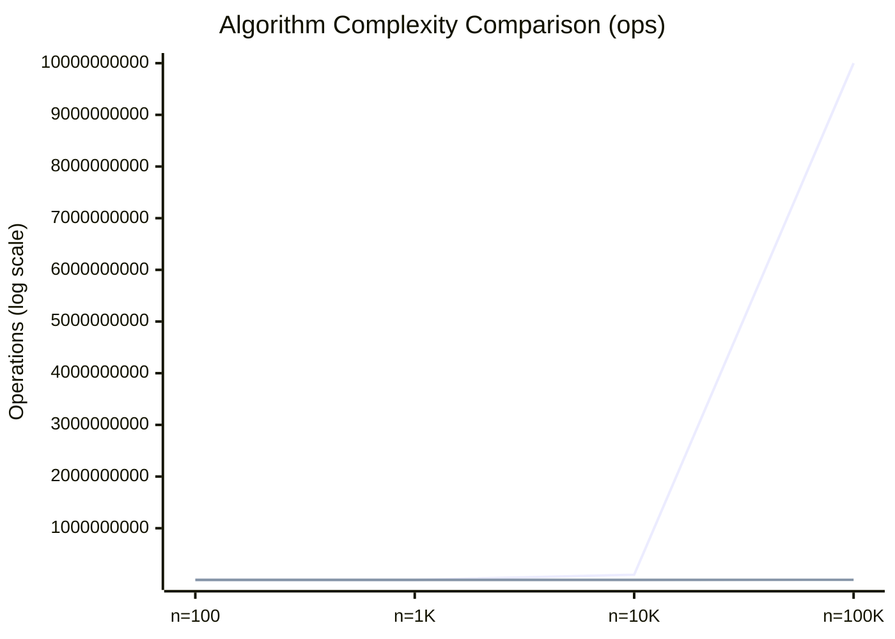
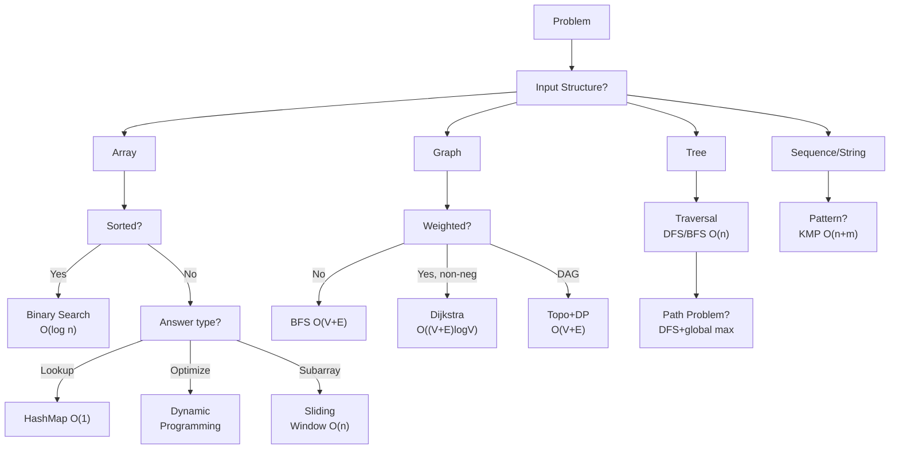

## Keywords in This File
{: .no_toc }

| # | Keyword | Weight |
|---|---------|--------|
| 1 | [Algorithm Anti-patterns and Over-engineering](#algorithm-anti-patterns-and-over-engineering) | medium |
| 2 | [Algorithm Selection Decision Framework](#algorithm-selection-decision-framework) | medium |

---

# Algorithm Anti-patterns and Over-engineering

**Difficulty:** ★★☆

**Interview Weight:** Medium

**Category:** Algorithm Design

---

### 🎯 Model Answer

**30-second answer:**

Algorithm anti-patterns are recurring design mistakes that produce correct
output but at excessive cost: wrong data structure for the access pattern,
premature optimization, over-complex solutions that a simpler algorithm
handles better, and ignoring input properties. The most costly anti-pattern
is solving a O(n log n) problem with an O(n^2) algorithm at scale.

**3-minute answer:**

**Top 5 algorithm anti-patterns in production:**

1. **Linear scan where a hash map or tree suffices.** Checking "does X exist
   in this list?" in a loop is O(n). With a HashSet, it is O(1). Nested
   loops over two collections is O(n*m); join via hash map is O(n+m).

2. **Sorting unnecessarily.** Sorting is O(n log n) but many problems require
   only a single pass: finding the max, counting elements, streaming a single
   answer. If you sort to "make things easier" without needing order, you've
   added cost without need.

3. **Recursion without memoization on overlapping subproblems.** Fibonacci
   without memoization is O(2^n). With memoization (DP), it is O(n). This is
   the textbook example, but it appears in production as undetected exponential
   paths in recursive configuration loading, dependency resolution, and
   tree-shaped API aggregation.

4. **Wrong traversal order causing redundant work.** Processing parent before
   children when parent depends on children (should be postorder). Processing
   all nodes when only reachable-from-root nodes matter.

5. **Ignoring the constraint that input is already sorted or nearly sorted.**
   Running quicksort on sorted input causes worst-case O(n^2). Using binary
   search instead of linear scan on a sorted collection.

**Blank Mind Recovery:**

If stumped about why code is slow:

**Step 1:** What is the access pattern? Read-only? Read-write? Lookup? Sort?
Match the access pattern to the right data structure.

**Step 2:** Are there nested loops over the same data? This is almost always
O(n^2) and almost always has a hash-map or sorting-based O(n log n) fix.

**Step 3:** Is there recursion? Does the recursion have overlapping
subproblems? If yes: add memoization.

**Step 4:** Is the input already sorted, unique, bounded, or sparse?
Exploit these properties before defaulting to a general solution.

---

### 📘 Concept Explanation

**Intuition:**

Algorithm anti-patterns stem from three root causes:

1. **Default to general:** using the most obvious general algorithm without
   asking "what properties does this specific input have?"
2. **Premature complexity:** reaching for advanced algorithms (segment trees,
   Fenwick trees) when a simple O(n) pass is sufficient.
3. **Ignoring amortized cost:** treating occasional O(n) operations as
   expensive without considering that they happen infrequently.

**Mechanism - The nested loop audit:**

The most impactful anti-pattern analysis is the "nested loop audit":

For each pair of nested loops that both iterate over data of size n:
ask "can the inner loop be replaced by a hash map lookup?"

If yes: the outer loop builds the hash map, the second pass looks up.
Result: O(n^2) -> O(n).

Example: "find all pairs that sum to target."
Anti-pattern: for each i, for each j, check i+j == target. O(n^2).
Fix: build set of elements. For each i, check if (target - i) is in set.
O(n).

**Mechanism - The sorting audit:**

Before sorting:
- Do I need the nth smallest element? Use quickselect: O(n) average.
- Do I need to count elements in a range? Use prefix sums: O(1) per query.
- Do I need to find the minimum? One pass: O(n).
- Do I need top-k elements? Heap of size k: O(n log k).
- Do I ACTUALLY need the full sorted order? Only then sort: O(n log n).

**Trade-offs:**

| Anti-pattern | Cost | Fix | Fix Cost |
|---|---|---|---|
| Linear scan for lookup | O(n) per query | HashSet/HashMap | O(1) per query |
| Nested loop for pair search | O(n^2) | Sort + two-pointer or hash | O(n log n) or O(n) |
| Naive recursion (Fibonacci) | O(2^n) | Memoization or DP | O(n) |
| Full sort for top-k | O(n log n) | Heap of size k | O(n log k) |
| Full sort for median | O(n log n) | Two heaps or quickselect | O(n) |
| Building new list per loop iteration | O(n^2) total (list copies) | Pre-allocate or StringBuilder | O(n) |

**Failure:**

The classic production failure: string concatenation in a loop.
`result += item` in Java/Python creates a new string object each iteration.
For n items: copies (n-1 + n-2 + ... + 1) = O(n^2) total characters.
Fix: use StringBuilder in Java, "".join(list) in Python.

**Diagnosis:**

Profiler hotspot in a tight loop -> check inner loop complexity.
API response times growing as O(n^2) relative to data size (doubling data
quadruples time) -> almost always a nested loop or O(n) lookup in a loop.

**Scale:**

O(n^2) with n=1,000: 10^6 ops (fine).
O(n^2) with n=10,000: 10^8 ops (seconds).
O(n^2) with n=100,000: 10^10 ops (hours).
Crossing from n=10,000 to n=100,000 (10x data) -> 100x time. A system
handling 100x more users triggers the anti-pattern catastrophically.

**Decision:**

Default to O(n log n) for most problems. Reach for O(n) when you have
hash maps or counting tricks. Only use O(n^2) when n < 1,000 and code
clarity matters more than performance.

**Memory:**

"Nested loop? Think hash map. Sorting for one answer? Think linear scan.
Recursion? Check for overlapping subproblems."

**Transfer:**

Anti-pattern recognition transfers to: database query optimization (full
table scan = linear scan anti-pattern; index = hash map fix), distributed
systems (O(n^2) all-to-all communication = anti-pattern; gossip = O(n log n)
fix), UI rendering (re-rendering all items on each update = anti-pattern;
virtual DOM diff = targeted update fix).

**Reality:**

Real production incident: a fintech company's end-of-day reconciliation
ran in 2 hours. Root cause: checking each transaction against a list of
known accounts using a linear scan. O(n^2) total. Fix: load accounts into
a HashSet. New runtime: 4 minutes. Zero code structure changes, just data
structure change.

---

### 💻 Code Example

**BAD - O(n^2) pair search:**

```java
// BAD - O(n^2) nested loop for pair sum
List<int[]> findPairs(int[] nums, int target) {
    List<int[]> result = new ArrayList<>();
    for (int i = 0; i < nums.length; i++) {
        for (int j = i + 1; j < nums.length; j++) {
            if (nums[i] + nums[j] == target) {
                result.add(new int[]{nums[i], nums[j]});
            }
        }
    }
    return result;
}
```

> **Code walkthrough:** O(n^2) nested loop for pair search. KEY MECHANISM:ice. **KEY MECHANISM:** the runtime executes these instructions in sequence with specific memory and execution semantics. **WHY IT MATTERS:** misapplying this pattern causes subtle bugs that only manifest under production load. **TAKEAWAY: understand the execution model before using this pattern in production code.**
> for each element i, the inner loop checks all j > i, resulting in n*(n-1)/2
> comparisons. WHY IT MATTERS: at n=10,000 this is 50,000,000 comparisons;
> at n=100,000 it is 5 billion. WHAT BREAKS: the system slows to a crawl
> as input size grows - the performance cliff hits suddenly. TAKEAWAY:
> any "find pair" or "find complement" pattern should immediately suggest
> a hash set, not a nested loop.

**GOOD - O(n) hash set approach:**

```java
// GOOD - O(n) hash set for pair sum
List<int[]> findPairs(int[] nums, int target) {
    Set<Integer> seen = new HashSet<>();
    Set<String> used = new HashSet<>();
    List<int[]> result = new ArrayList<>();
    for (int num : nums) {
        int complement = target - num;
        if (seen.contains(complement)) {
            String key = Math.min(num, complement)
                + "," + Math.max(num, complement);
            if (used.add(key)) {
                result.add(new int[]{complement, num});
            }
        }
        seen.add(num);
    }
    return result;
}
```

> **Code walkthrough:** Single-pass O(n) pair search using a hash set.
> KEY MECHANISM: for each element, check if its complement (target - num)
> was seen earlier. The `used` set prevents duplicate pairs. WHY IT MATTERS:
> O(n) instead of O(n^2) means this handles 10,000 elements in microseconds
> vs seconds. WHAT BREAKS: this approach requires that the same element
> cannot be used twice unless it appears twice in the input - the `seen` set
> is built as we go (only previous elements are in `seen`). TAKEAWAY:
> "find complement" = hash set; build it as you scan.

**BAD - String concatenation anti-pattern:**

```java
// BAD - O(n^2) string concatenation
String join(List<String> items) {
    String result = "";
    for (String item : items) {
        result += item + ","; // copies entire string each iteration!
    }
    return result;
}
```

> **Code walkthrough:** String concatenation in a loop creates O(n^2) totalice. **KEY MECHANISM:** the runtime executes these instructions in sequence with specific memory and execution semantics. **WHY IT MATTERS:** misapplying this pattern causes subtle bugs that only manifest under production load. **TAKEAWAY: understand the execution model before using this pattern in production code.**
> character copies. KEY MECHANISM: Java strings are immutable; `result += item`
> creates a new String object by copying all existing characters plus the new
> item. For n items of average length L: total copies = L + 2L + 3L + ... +
> nL = O(n^2 * L). WHY IT MATTERS: for 10,000 items this copies ~50 million
> characters vs 10,000 with StringBuilder. TAKEAWAY: NEVER concatenate
> strings in a loop - always use StringBuilder or language-idiomatic join.

**GOOD - StringBuilder:**

```java
// GOOD - O(n) with StringBuilder
String join(List<String> items) {
    StringBuilder sb = new StringBuilder();
    for (String item : items) {
        sb.append(item).append(',');
    }
    if (sb.length() > 0) sb.deleteCharAt(sb.length() - 1);
    return sb.toString();
}
```

> **Code walkthrough:** StringBuilder avoids repeated string copies.
> KEY MECHANISM: StringBuilder maintains a mutable char array that grows
> geometrically (amortized O(1) append). The final `toString()` makes exactly
> one copy. Total work: O(n * L). WHY IT MATTERS: the speedup is O(n) vs
> O(n^2) - a 1000x difference at n=1000 items. TAKEAWAY: StringBuilder is
> the canonical fix for string concatenation in loops in Java.

---

### 🎓 Answers by Seniority

**[JUNIOR/MID]**

Q: What is the most common algorithm anti-pattern you see in code reviews?

The most common: nested loop over the same collection when a hash map or
set would reduce it to O(n).

Recognizing it: two for-loops where the inner loop also iterates over
the original input (or a derived collection). The question to ask: "does
the inner loop need to scan everything, or is it looking up a specific
value?" If it's looking up, a hash map gives O(1) lookup.

Second most common: `list.contains(item)` inside a loop when `contains`
is O(n) for a List. Fix: convert to HashSet before the loop, making each
`contains` call O(1).

Q: What is premature optimization and why is it harmful?

Premature optimization is spending engineering effort on performance
improvements before profiling confirms they are needed.

Harmful because:
- Makes code harder to read and maintain.
- Introduces bugs (complex optimizations have more edge cases).
- May optimize the wrong thing (the real bottleneck is elsewhere).
- Wastes time (most code paths are not hot).

Rule: write clear, correct code first. Profile. Optimize only the measured
bottleneck. Donald Knuth: "Premature optimization is the root of all evil."

**[SENIOR/STAFF]**

Algorithm anti-patterns at system scale:

**1. N+1 query problem (database anti-pattern mirroring the nested loop
anti-pattern):** for each entity, issue a separate database query for its
related entities. O(n) queries instead of O(1) (batched query or JOIN).
Root cause: ORM lazy loading. Fix: eager loading, dataloader batching.

**2. Fan-out amplification:** in microservices, when a single user request
triggers N downstream service calls. O(1) user requests -> O(N) service
load. Root cause: missing aggregation layer. Fix: BFF (Backend-for-Frontend)
pattern or batch API.

**3. Write amplification in storage:** writing the same data multiple times
(WAL + MemTable + SSTable in LSM tree) vs once (B-tree direct write). LSM
write amplification = 10-30x. This is a deliberate trade-off (optimizing
writes) but becomes an anti-pattern when the workload is read-heavy.

Staff-level: the "wrong level of abstraction" anti-pattern. Optimizing
at the algorithmic level (changing O(n^2) to O(n log n)) when the actual
bottleneck is a network round trip (10ms latency * 100 calls = 1 second of
latency that no algorithm optimization can fix). Profiling must identify
whether the bottleneck is CPU-bound (algorithm) or I/O-bound (parallelism).

---

### ⚠️ Common Misconceptions

**Misconception 1: "Always use the most efficient algorithm."**

Wrong. Using a radix sort (O(n)) when a comparison sort (O(n log n))
is sufficient for n=100 adds code complexity with zero perceptible benefit.
The most efficient algorithm for n=100 is the one that is clearest to read
and least likely to have bugs.

**Misconception 2: "Recursion is always less efficient than iteration."**

Wrong. Tail-recursive functions are optimized to iteration by compilers
that support TCO (Scala, Haskell, some C++ compilers). Without TCO, deep
recursion is slower due to stack frame overhead, but the algorithm
complexity is the same. The performance difference is constant-factor,
not asymptotic.

**Misconception 3: "Hash maps are always faster than sorted arrays."**

Wrong. Hash maps have O(1) average lookup but:
- Poor cache locality (random memory access).
- Higher constant factors due to hashing.
- Worst-case O(n) lookup for adversarial inputs (hash collision attacks).
For small n (< 20 elements), a linear scan over a sorted array often
outperforms a hash map due to cache effects.

---

### 🚨 Failure Modes and Diagnosis

**Failure 1 - Slow API with O(n^2) bottleneck discovered under load**

Symptom: API responds in 50ms at 1,000 items but 2 minutes at 10,000 items.

Root cause: nested loop in a service method that wasn't load tested.

Diagnosis:

```java
// Add timing to identify the bottleneck
long start = System.nanoTime();
List<Result> results = expensiveMethod(data);
long elapsed = System.nanoTime() - start;
log.info("expensiveMethod: {}ms for n={}", elapsed/1_000_000, data.size());
```

> **Code walkthrough:** Timing logging to identify scaling behavior. KEYice. **KEY MECHANISM:** the runtime executes these instructions in sequence with specific memory and execution semantics. **WHY IT MATTERS:** misapplying this pattern causes subtle bugs that only manifest under production load. **TAKEAWAY: understand the execution model before using this pattern in production code.**
> MECHANISM: by logging both elapsed time and n, you can determine the
> complexity empirically - if doubling n quadruples time, it is O(n^2).
> WHY IT MATTERS: without timing, developers guess at the bottleneck;
> measurement identifies it precisely. WHAT BREAKS: logging at trace level
> in production adds I/O overhead; use sampling or only log when elapsed >
> threshold. TAKEAWAY: measure before optimizing.

Fix: replace the nested loop with a hash map. Validate that the fix
also handles the edge cases (empty input, duplicate elements, negative values).

**Failure 2 - Exponential recursion in production**

Symptom: a config loading process hangs for minutes on deeply nested configs.

Root cause: recursive config merging without memoization, with diamond
dependencies triggering exponential recomputation.

Fix: add a `Map<ConfigId, Config>` memo table. Before computing a config,
check if it is already in the memo; if yes, return the cached result.

Verify the fix: add a counter of recursion calls. Without memo: 2^depth
calls. With memo: O(n) calls (each config computed once).

---

### 🎯 Interview Deep-Dive

| Category | Count | Min Required |
|----------|-------|-------------|
| CONCEPT | 3 | 1 |
| DEBUGGING | 2 | 1 |
| CODING | 2 | 1 |
| TRADE-OFF | 1 | 1 |
| BEHAVIORAL | 1 | 1 |
| **Total** | **9** | **9** |

---

**[JUNIOR] Q1 - [CODING] Rewrite this O(n^2) duplicate detection to O(n).**

```java
// BAD - O(n^2) duplicate detection
boolean hasDuplicates(int[] nums) {
    for (int i = 0; i < nums.length; i++) {
        for (int j = i + 1; j < nums.length; j++) {
            if (nums[i] == nums[j]) return true;
        }
    }
    return false;
}
```

> **Code walkthrough:** O(n^2) duplicate check with nested loop. KEYice. **KEY MECHANISM:** the runtime executes these instructions in sequence with specific memory and execution semantics. **WHY IT MATTERS:** misapplying this pattern causes subtle bugs that only manifest under production load. **TAKEAWAY: understand the execution model before using this pattern in production code.**
> MECHANISM: for each element i, ALL subsequent elements are checked. This
> is the prototypical O(n^2) pattern: checking the same data twice. WHY IT
> MATTERS: at n=10,000 this is 50 million comparisons, at n=100,000 it is
> 5 billion. TAKEAWAY: any "find duplicate in collection" problem should
> immediately suggest a HashSet.

```java
// GOOD - O(n) with HashSet
boolean hasDuplicates(int[] nums) {
    Set<Integer> seen = new HashSet<>();
    for (int num : nums) {
        if (!seen.add(num)) return true; // add returns false if duplicate
    }
    return false;
}
```

> **Code walkthrough:** O(n) duplicate detection with HashSet. KEY MECHANISM:ice. **KEY MECHANISM:** the runtime executes these instructions in sequence with specific memory and execution semantics. **WHY IT MATTERS:** misapplying this pattern causes subtle bugs that only manifest under production load. **TAKEAWAY: understand the execution model before using this pattern in production code.**
> `Set.add()` returns false if the element was already present (it is a
> no-op for duplicates). This combines the "insert" and "check if present"
> operations into one call. WHY IT MATTERS: single pass, O(1) per element,
> O(n) total. WHAT BREAKS: HashSet uses O(n) additional memory; for very
> large arrays with a known value range [0..m], a BitSet uses O(m/8) bytes
> (more space-efficient). TAKEAWAY: `!seen.add(x)` = "already seen x."

*What separates good from great:* Using `!seen.add(num)` instead of
`.contains()` + `.add()` (one operation instead of two), and mentioning
the BitSet alternative.

---

**[JUNIOR] Q2 - [CONCEPT] Explain why string concatenation in a loop is O(n^2).**

Strings in Java (and most languages) are immutable. Each `str += item`
creates a new String object that is a COPY of all existing characters plus
the new item.

For n items of average length L:
- Iteration 1: copy L chars (new string = L chars)
- Iteration 2: copy 2L chars (new string = 2L chars)
- Iteration 3: copy 3L chars
- ...
- Iteration n: copy nL chars

Total chars copied: L + 2L + ... + nL = L * n(n+1)/2 = O(n^2 * L).

StringBuilder maintains a mutable resizable char array. Each append is
O(1) amortized (geometric growth). Final toString() is one O(n*L) copy.
Total: O(n*L), which is O(n) for fixed L.

Visual:
```
n=4 items, "a","b","c","d":
"" -> "a" -> "a,b" -> "a,b,c" -> "a,b,c,d"
Copies: 1 + 3 + 5 + 7 = 16 = O(n^2)

StringBuilder: [] -> [a] -> [a,b] -> [a,b,c] -> [a,b,c,d]
Copies on append: 1+1+1+1=4 = O(n)
```

> **Code walkthrough:** Visual trace of string concatenation cost vsice. **KEY MECHANISM:** the runtime executes these instructions in sequence with specific memory and execution semantics. **WHY IT MATTERS:** misapplying this pattern causes subtle bugs that only manifest under production load. **TAKEAWAY: understand the execution model before using this pattern in production code.**
> StringBuilder. KEY MECHANISM: the growing string must be entirely re-copied
> each time because strings are immutable. StringBuilder avoids copies by
> mutating in place. WHY IT MATTERS: the quadratic growth is invisible at
> n=100 but catastrophic at n=10,000. TAKEAWAY: the O(n^2) behavior of
> string concatenation is one of the most frequently overlooked performance
> anti-patterns.

*What separates good from great:* Calculating the exact character copies
with the arithmetic series formula.

---

**[SENIOR] Q3 - [DEBUGGING] An application is slow but profiling shows no single hotspot - performance is distributed across many small O(n) methods that together are O(n^2). How do you diagnose this?**

This is the "death by a thousand cuts" pattern, where each individual
operation looks O(n) but they compose into O(n^2) because of how they
interact.

Diagnostic approach:

**1. Call graph analysis:** not just single methods but call chains. If
method A calls method B in a loop, and method B is O(n), the composition
is O(n^2). Use profiler flame graphs to see the call stack proportions.

**2. Input size correlation:** log timing at different input sizes. If
doubling n doubles time = O(n). If it quadruples = O(n^2). This identifies
the hidden quadratic even when no single method shows it.

**3. Look for `contains`, `indexOf`, `remove` on lists:** `List.contains()`
is O(n). If called in a loop over n elements: O(n^2). Grep the codebase
for `list.contains(`, `list.remove(`, `list.indexOf(` inside loops.

**4. Look for repeated computation without caching:** if method B(input)
is called n times with the same input and has no memoization, and B is
O(n), total cost is O(n^2).

Fix strategy: identify the call graph where O(n) * O(n) = O(n^2) is the
product. Usually, one of the O(n) operations can be replaced by a hash
map lookup (O(1)) or precomputed (O(n) once, then O(1) per access).

*What separates good from great:* Describing the flame graph approach and
the specific grep patterns for O(n) collection operations inside loops.

---

**[SENIOR] Q4 - [CONCEPT] What is the N+1 query problem and how does it relate to algorithm anti-patterns?**

N+1 query problem: when fetching n entities and then issuing one additional
query for each entity's related data.

Example: fetch 100 users (1 query). For each user, fetch their profile
(100 queries). Total: 101 queries = N+1.

This is structurally identical to the nested loop anti-pattern:
- Outer loop: iterate over n entities.
- Inner "loop": for each entity, execute an O(database_query) operation.
- Total: O(n * query_latency) instead of O(1 * batch_query_latency).

Fix: batch all related-entity lookups into one query (JOIN or IN clause).
For ORMs: eager loading (`@OneToMany(fetch = EAGER)` or explicit
`.fetch()` call), or DataLoader batching pattern (GraphQL).

Metric to detect N+1: log query count per request. If query count scales
linearly with the number of entities returned, you have N+1.

*What separates good from great:* Drawing the explicit parallel between
N+1 queries and the nested loop anti-pattern - both are O(n) applications
of an O(n) operation, yielding O(n^2) total cost.

---

**[SENIOR] Q5 - [TRADE-OFF] When is an O(n^2) algorithm acceptable in production?**

Three scenarios where O(n^2) is acceptable:

**1. n is bounded and small:** if n is guaranteed to be < 100 (e.g., the
number of columns in a table, the number of config parameters), O(n^2) is
at most 10,000 ops - negligible. More complex algorithms add code complexity
without measurable benefit.

**2. Clarity dominates:** for one-time scripts, data migrations, or tools
that run infrequently on small datasets, O(n^2) bubble sort with clear
code beats O(n log n) timsort with complex logic.

**3. Constant factors matter:** some O(n^2) algorithms have tiny constant
factors and excellent cache behavior (insertion sort on small arrays). Java's
Arrays.sort uses insertion sort for n < 7. O(n^2) with tiny constants can
outperform O(n log n) with large constants for small n.

When O(n^2) is NOT acceptable:
- n scales with user data or request rate.
- The code is in a hot path (called frequently).
- Performance is a customer SLA.

Rule: the acceptable complexity depends on the product of n and call frequency.
`n=1,000 * 1,000 requests/sec = 10^9 ops/sec` - not acceptable.
`n=100 * 10 requests/day = 1,000 ops/day` - completely acceptable.

*What separates good from great:* Quantifying the trade-off by multiplying
n by call frequency to get total ops/time unit.

---

**[SENIOR] Q6 - [DEBUGGING] How do you identify and fix the exponential recursion anti-pattern?**

Identifying exponential recursion:

```java
// BAD - O(2^n) naive Fibonacci (exponential recursion)
// Symptom: takes minutes for n=30
int fib(int n) {
    if (n <= 1) return n;
    return fib(n-1) + fib(n-2); // two recursive calls per call
}
```

> **Code walkthrough:** Naive Fibonacci with exponential recursion.
> KEY MECHANISM: each call spawns two recursive calls, creating a binary
> tree of calls of depth n. The total number of calls is 2^n (approximately).
> WHY IT MATTERS: fib(50) would require ~10^15 calls - infeasible. WHAT
> BREAKS: the application hangs without an obvious error message. TAKEAWAY:
> whenever a function calls itself multiple times with overlapping subproblems,
> add memoization.

Detection: if a function makes k >= 2 recursive calls and the arguments
overlap (fib(n-1) and fib(n-2) both call fib(n-2)), it is exponential
without memoization.

Fix:

```java
// GOOD - O(n) with memoization
int fib(int n, Map<Integer, Integer> memo) {
    if (n <= 1) return n;
    if (memo.containsKey(n)) return memo.get(n);
    int result = fib(n-1, memo) + fib(n-2, memo);
    memo.put(n, result);
    return result;
}
```

> **Code walkthrough:** Memoized Fibonacci. KEY MECHANISM: before computingice. **KEY MECHANISM:** the runtime executes these instructions in sequence with specific memory and execution semantics. **WHY IT MATTERS:** misapplying this pattern causes subtle bugs that only manifest under production load. **TAKEAWAY: understand the execution model before using this pattern in production code.**
> fib(n), check if it's already in the memo map. Each value is computed
> exactly once (on first call), then cached. Subsequent calls return the
> cached value in O(1). WHY IT MATTERS: total calls drops from O(2^n) to
> O(n). TAKEAWAY: memoization converts exponential recursive algorithms to
> polynomial by caching subproblem results.

*What separates good from great:* Identifying the "overlapping subproblems"
property as the diagnostic criterion for when memoization is applicable.

---

**[SENIOR] Q7 - [CONCEPT] What is the "accidental quadratic" pattern and how do common code review tools miss it?**

Accidental quadratic: O(n^2) algorithmic complexity introduced unintentionally,
often by composing individually-correct operations that each look O(n) in
isolation.

Common sources:

**1. List deduplication inside a loop:**

```java
// BAD - O(n^2) due to O(n) contains() inside O(n) loop
for (Event e : events) {
    if (!processed.contains(e.id)) { // O(n) on ArrayList!
        process(e);
        processed.add(e.id);
    }
}
```

> **Code walkthrough:** `List.contains()` is O(n) - it scans the listice. **KEY MECHANISM:** the runtime executes these instructions in sequence with specific memory and execution semantics. **WHY IT MATTERS:** misapplying this pattern causes subtle bugs that only manifest under production load. **TAKEAWAY: understand the execution model before using this pattern in production code.**
> linearly. KEY MECHANISM: in a loop of n iterations, each O(n) `contains`
> call creates an O(n^2) composition. WHY IT MATTERS: this looks like two
> simple lines but has quadratic complexity. WHAT BREAKS: at n=10,000
> events this is 100 million comparisons - seconds of latency. TAKEAWAY:
> any `list.contains()` or `list.remove()` inside a loop is a signal to
> switch to a HashSet.

Fix: use HashSet for `processed`.

**2. String concatenation anti-pattern (already discussed).**

**3. Frequent list-to-set conversions inside a loop:**

```java
// BAD - O(k) set construction per iteration = O(n*k) total
for (Item item : items) {
    Set<String> tags = new HashSet<>(item.getTagList());
    if (tags.containsAll(requiredTags)) { ... }
}
```

> **Code walkthrough:** Creating a new HashSet inside a loop pays O(k)ice. **KEY MECHANISM:** the runtime executes these instructions in sequence with specific memory and execution semantics. **WHY IT MATTERS:** misapplying this pattern causes subtle bugs that only manifest under production load. **TAKEAWAY: understand the execution model before using this pattern in production code.**
> (size of tag list) per iteration. KEY MECHANISM: with n items and average
> k tags, total work = O(n*k). If k is bounded (e.g., max 50 tags), this
> is O(n) - acceptable. But if k can be large or if this is called inside
> another loop, it compounds. WHY IT MATTERS: pre-computing the set once
> (at object creation time) amortizes the cost. TAKEAWAY: any collection
> construction inside a loop that uses data that doesn't change should be
> pre-computed outside the loop.

Fix: pre-convert tag lists to sets outside the loop (or at object creation).

Why code review tools miss it: static analysis tools analyze individual
lines. They cannot infer that `list.contains()` is called inside a loop
without data flow analysis across method boundaries. The call site looks
innocent; the loop is elsewhere.

Modern tools (SonarQube with Complexity rules, SpotBugs, some ML-based
tools) are starting to detect O(n^2) composition patterns, but coverage
is incomplete.

*What separates good from great:* Explaining why static analysis misses
it (requires data flow analysis across method boundaries) and naming
specific patterns the tools do/don't catch.

---

**[SENIOR] Q8 - [BEHAVIORAL] Describe a production performance incident that was caused by an algorithm anti-pattern.**

Strong answer structure: incident, root cause, diagnosis, fix, prevention.

"Our real-time pricing service started showing timeout errors under load
during a marketing campaign. P99 latency spiked from 20ms to 3+ seconds.

Root cause diagnosis (found in 2 hours with flame graph profiling): a
method `applyDiscountRules(List<Item> cart, List<Rule> rules)` contained
nested loops - O(|cart| * |rules|). Under normal load, cart size was 5-10
items and we had 50 rules, giving 500 iterations - fine. The campaign
added a 'buy-1-get-1' promotion that triggered a cart explosion: customers
with 200 items and 500 promotional rules = 100,000 iterations per request
at 1,000 req/sec = 100 million iterations/sec.

Fix: precompute a HashMap<ItemCategory, List<Rule>> mapping categories to
applicable rules. For each item, look up only the rules that apply to its
category. Average rules per item dropped from 500 to 3. Latency returned
to 15ms.

Prevention: we added a load test that sends requests with large carts and
checks that P99 latency scales linearly (not quadratically) with cart size.
This test would have caught the regression before the campaign launch."

*What separates good from great:* The specific number of iterations that
caused the failure AND the linear scaling test as a prevention mechanism.

---

**[SENIOR] Q9 - [TRADE-OFF] Compare eager vs lazy evaluation as an optimization strategy for expensive computations.**

Eager evaluation: compute all results upfront, cache them.

Pros: subsequent lookups are O(1). No recomputation.

Cons: pays the full computation cost even if not all results are needed.
Memory usage for cached results. Cache invalidation complexity.

Lazy evaluation: compute results on demand, cache after first computation
(memoization) or re-compute each time.

Pros: never computes unneeded results. No memory for unused results.

Cons: first access is expensive. May recompute if not cached.

Decision framework:

| | Eager | Lazy |
|---|---|---|
| % of results actually used | High (>70%) | Low (<30%) |
| Computation cost per item | Low-medium | High |
| Access pattern | Predictable | Unpredictable |
| Memory budget | Ample | Tight |
| Example | Pre-computed index at startup | Lazy-init singleton |

Production examples:
- Eager: pre-compute search index at startup (100% of index is eventually
  used; upfront cost is acceptable).
- Lazy: HTML template rendering (many template fields are conditionally
  rendered; eager rendering wastes work on hidden sections).
- Hybrid (memoization): Python's `@functools.lru_cache` - lazy first
  computation, then cached for reuse.

*What separates good from great:* Providing the decision framework with
percentage thresholds and naming specific production examples for each mode.

---

### ⚖️ Comparison Table

| Anti-pattern | Category | Before | After | Complexity Gain |
|---|---|---|---|---|
| Nested loop for pair search | Data structure | O(n^2) | O(n) hash set | Quadratic -> linear |
| List.contains in loop | Data structure | O(n^2) | O(n) HashSet | Quadratic -> linear |
| String concat in loop | Data structure | O(n^2) | O(n) StringBuilder | Quadratic -> linear |
| Sort for single value | Algorithm choice | O(n log n) | O(n) scan/heap | n log n -> linear |
| Naive recursion (overlap) | DP/Memoization | O(2^n) | O(n) memo | Exponential -> linear |
| Re-creating collection each iter | Allocation | O(n^2) | O(n) pre-alloc | Quadratic -> linear |
| N+1 queries | I/O pattern | O(n) queries | O(1) batch query | n latencies -> 1 |

---

### 🏛️ System Design

*(Omit: Algorithm anti-patterns are coding-level patterns, not
distributed system components. System-level anti-patterns such as
N+1 queries and fan-out amplification are covered in the senior
answer above.)*

---

### 📊 Diagram

```
Algorithm Anti-pattern Complexity Cliff

Time (seconds)
^
|                         O(n^2)
|                      /
1s |                    /
|                  /
|             /
10ms |        /
|     /      O(n log n)
|   / ____----
1ms |  _____----
   +----+----+----+----> n
     100 1K  10K 100K

O(n^2) at n=10K: ~10^8 ops -> ~1 second
O(n^2) at n=100K: ~10^10 ops -> ~100 seconds
O(n log n) at n=100K: ~1.7*10^6 ops -> ~2ms
```

> **Diagram walkthrough:** The complexity cliff shows when O(n^2) becomes
> unacceptable compared to O(n log n). At n=1,000 both are imperceptible;
> at n=10,000 O(n^2) takes ~1 second (noticeable); at n=100,000 O(n^2) takes
> minutes (unacceptable for any interactive system). KEY RELATIONSHIP: O(n^2)
> scales as the SQUARE of input size - doubling n quadruples time. EDGE CASE:
> the crossover point where O(n^2) becomes slower than O(n log n) depends on
> constant factors, but in practice it is around n=100-200 for tight inner
> loops. INSIGHT: a senior engineer asks "what is the maximum realistic n?"
> before choosing an algorithm.



> **Diagram walkthrough:** The chart compares O(n^2) (top line) vs O(n log n)
> (bottom line) operation counts on a log scale. KEY RELATIONSHIP: at n=100,
> O(n^2)=10,000 vs O(n log n)=700 - a 14x difference, unnoticeable. At
> n=100,000, the ratio is ~6,000x - the difference between microseconds and
> minutes. EDGE CASE: O(n log n) algorithms have non-trivial constant factors;
> for n < ~50 an O(n^2) algorithm with tiny constants is often faster in
> practice. INSIGHT: the log scale obscures how rapidly O(n^2) diverges;
> a senior engineer always asks for the actual operation count, not just the
> Big-O class.

---

---

# Algorithm Selection Decision Framework

**Difficulty:** ★★☆

**Interview Weight:** Medium

**Category:** Algorithm Design

---

### 🎯 Model Answer

**30-second answer:**

Algorithm selection follows a decision tree: identify the problem category
(search, sort, path, optimization), then narrow by constraints (sorted input?
repeated queries? graph or linear?), then by requirements (exact vs approximate,
online vs offline, memory constraints). The right algorithm for an interview
is often the simplest one that is correct and fits within the given constraints.

**3-minute answer:**

**5-step selection framework:**

**Step 1 - Identify the problem category:**

- Contains/membership check -> HashSet (O(1)) or binary search (O(log n))
- Finding extreme (min/max/kth) -> heap or quickselect
- Ordering/ranking -> sort or heap
- Counting occurrences -> HashMap
- Graph traversal/connectivity -> BFS/DFS
- Shortest path -> BFS (unweighted), Dijkstra (non-negative weights),
  Bellman-Ford (negative weights), Floyd-Warshall (all pairs)
- Optimization over subproblems -> DP
- Constraint satisfaction -> backtracking

**Step 2 - Apply input constraints:**

- Is input sorted? -> binary search, two pointers, sliding window
- Is the value range small [0..k]? -> counting sort, bucket operations
- Are there repeated queries on static data? -> precompute (prefix sum,
  sparse table)
- Is the graph a DAG? -> topological sort + DP
- Is the graph a tree? -> DFS/BFS (no need for general shortest path)

**Step 3 - Apply operational requirements:**

- Online (streaming input)? -> sliding window, heap, running stats
- Need all solutions? -> backtracking, BFS with path tracking
- Need one optimal solution? -> greedy (if provable) or DP
- Need approximate solution (NP-hard)? -> greedy heuristic, local search

**Step 4 - Check complexity requirements:**

n <= 10: any algorithm (even O(n!))
n <= 20: O(2^n) (bitmask DP)
n <= 100: O(n^3) (Floyd-Warshall)
n <= 1,000: O(n^2) (DP with 2D table)
n <= 10,000: O(n^2) borderline - aim for O(n log n)
n <= 10^6: O(n log n) (sort, heap, balanced BST)
n <= 10^8: O(n) (hash map, prefix sum, two pointers)
n > 10^8: O(log n) or O(1) per query (binary search, precomputed)

**Step 5 - Implement the simplest correct solution first, then optimize.**

**Blank Mind Recovery:**

For ANY problem:

**Step 1:** What am I GIVEN? (sorted? graph? tree? stream?)

**Step 2:** What am I LOOKING FOR? (exist? count? path? optimal value?)

**Step 3:** How large is n? (determines acceptable complexity)

**Step 4:** Are there repeated queries? (precomputation opportunity)

**Step 5:** Start with brute force. Identify the bottleneck. Optimize that.

---

### 📘 Concept Explanation

**Intuition:**

Algorithm selection is a matching problem: match the STRUCTURE of the input
and the SHAPE of the answer to the algorithm whose invariants exploit that
structure. Most problems have a "key insight" - one observation that reduces
the problem from hard to easy. The framework is a systematic way to find
that insight.

**Mechanism - The problem category map:**

Each algorithm enforces an invariant:

- **HashSet:** "every element is stored, lookup is O(1)."
  Key property exploited: elements are hashable.

- **Sorted array + binary search:** "elements are ordered."
  Key property exploited: ordered structure enables divide and conquer.

- **BFS:** "explores level by level."
  Key property exploited: uniform edge costs -> level = distance.

- **DP:** "optimal substructure + overlapping subproblems."
  Key property exploited: the problem decomposes into independent, reusable
  subproblems.

- **Greedy:** "locally optimal choices yield globally optimal solution."
  Key property exploited: exchange argument (swapping any two elements in
  the solution to make it more 'greedy' does not improve it).

- **Divide and conquer:** "problem divides into independent, similar
  subproblems."
  Key property exploited: recursive decomposition, combine step.

**Trade-offs:**

| Algorithm class | When to use | Time complexity | Space |
|---|---|---|---|
| Hash map/set | Lookup, counting, deduplication | O(1) avg | O(n) |
| Sorting | Ordering, binary search prerequisite | O(n log n) | O(1) or O(n) |
| Binary search | Search in sorted data, "minimize maximum" | O(log n) | O(1) |
| BFS | Shortest path (unweighted), level-order | O(V+E) | O(V) |
| DFS | Cycle detection, topological sort, tree problems | O(V+E) | O(V) |
| Dijkstra | Shortest path (non-negative weights) | O((V+E) log V) | O(V) |
| DP (1D) | Optimize over sequence | O(n) or O(n^2) | O(n) |
| DP (2D) | Optimize over two sequences or grid | O(n*m) | O(n*m) |
| Two pointers | Pair/triplet problems on sorted data | O(n) | O(1) |
| Sliding window | Contiguous subarray with constraint | O(n) | O(k) |
| Heap/priority queue | Top-k, streaming min/max | O(n log k) | O(k) |
| Backtracking | Constraint satisfaction, all solutions | Exponential | O(n) |

**Failure:**

Common mismatch: using DP when a greedy solution exists (over-engineering).
Or using greedy when DP is required (wrong answer due to no global optimality
guarantee).

**Diagnosis:**

After selecting an algorithm: write 3 test cases (small, edge, stress) and
verify correctness before optimizing. If the algorithm is wrong, no amount
of optimization helps.

**Scale:**

The complexity table above (Step 4) is the primary scale consideration.
Secondary: constant factors (hash map with collision chaining is slower than
open addressing; quicksort is faster in practice than merge sort despite
same O(n log n) due to cache behavior).

**Decision:**

Use this framework as a checklist, not a rigid procedure. For 90% of
interview problems, the answer is one of: hash map, sort + binary search,
BFS/DFS, or DP.

**Memory:**

"Structure -> algorithm class -> check n -> implement brute force first."

**Transfer:**

The decision framework transfers to: query optimizer in a database (what
physical plan best matches the logical query given statistics?), machine
learning model selection (what model architecture fits the data's structure
and the prediction task?), operating system scheduling (what scheduling
algorithm fits the workload's arrival rate and burst patterns?).

**Reality:**

Google's "algorithms interview" approach: the interviewer expects candidates
to state the problem category, name the algorithm class, derive the complexity,
then code. Jumping to code before naming the category is a red flag.
Amazon's bar raiser rubric: algorithm selection is "uses the most appropriate
data structures and algorithms for the solution."

---

### 💻 Code Example

**Decision Framework in Action - Two-sum variants:**

```
Problem: "find two numbers that sum to target in an array"

Step 1: Category = pair search (finding complement)
Step 2: Input = unsorted, no value range constraint
Step 3: n up to 10^5 -> O(n) or O(n log n) required
Step 4: "Is input sorted?" No -> can't use two-pointer directly
Step 5: Single pass with hash set = O(n)

Brute force: O(n^2) nested loop
Better: sort + two pointers = O(n log n)
Best: hash set single pass = O(n)
```

> **Code walkthrough:** Framework applied to two-sum. KEY MECHANISM: theice. **KEY MECHANISM:** the runtime executes these instructions in sequence with specific memory and execution semantics. **WHY IT MATTERS:** misapplying this pattern causes subtle bugs that only manifest under production load. **TAKEAWAY: understand the execution model before using this pattern in production code.**
> decision is driven by the constraint "unsorted input" eliminating two-
> pointer, and n <= 10^5 ruling out O(n^2). WHY IT MATTERS: showing the
> elimination process (not just the answer) is what interviewers want to see.
> TAKEAWAY: state the constraints that eliminate algorithms before coding.

```java
// O(n) hash set solution
int[] twoSum(int[] nums, int target) {
    Map<Integer, Integer> map = new HashMap<>();
    for (int i = 0; i < nums.length; i++) {
        int complement = target - nums[i];
        if (map.containsKey(complement)) {
            return new int[]{map.get(complement), i};
        }
        map.put(nums[i], i);
    }
    return new int[]{};
}
```

> **Code walkthrough:** Two-sum with HashMap storing value -> index. KEYice. **KEY MECHANISM:** the runtime executes these instructions in sequence with specific memory and execution semantics. **WHY IT MATTERS:** misapplying this pattern causes subtle bugs that only manifest under production load. **TAKEAWAY: understand the execution model before using this pattern in production code.**
> MECHANISM: we need to return INDICES, not values, so the HashMap stores
> `value -> index`. The complement check happens before inserting the current
> element, ensuring we don't use the same element twice (unless it appears
> twice in the input). WHY IT MATTERS: returning indices is a common variant
> that requires HashMap over HashSet. WHAT BREAKS: inserting before checking
> would allow the same index to be used twice when `target = 2 * nums[i]`.
> TAKEAWAY: insert AFTER checking when "same element cannot be used twice."

**Binary search template - "minimize the maximum" problems:**

```java
// Framework: binary search on the ANSWER, not the input
// Problem: assign n tasks to k workers, minimize maximum load

boolean canAssign(int[] tasks, int k, int maxLoad) {
    int workers = 1;
    int currentLoad = 0;
    for (int task : tasks) {
        if (task > maxLoad) return false; // single task exceeds limit
        if (currentLoad + task > maxLoad) {
            workers++; // start new worker
            currentLoad = task;
        } else {
            currentLoad += task;
        }
    }
    return workers <= k;
}

int minimizeMaxLoad(int[] tasks, int k) {
    int lo = Arrays.stream(tasks).max().getAsInt();
    int hi = Arrays.stream(tasks).sum();
    while (lo < hi) {
        int mid = lo + (hi - lo) / 2;
        if (canAssign(tasks, k, mid)) hi = mid;
        else lo = mid + 1;
    }
    return lo;
}
```

> **Code walkthrough:** Binary search on the answer space for an optimizationice. **KEY MECHANISM:** the runtime executes these instructions in sequence with specific memory and execution semantics. **WHY IT MATTERS:** misapplying this pattern causes subtle bugs that only manifest under production load. **TAKEAWAY: understand the execution model before using this pattern in production code.**
> problem. KEY MECHANISM: the answer (minimum maximum load) is monotone -
> if a max load of X is feasible, any value > X is also feasible. This
> monotone property makes binary search valid. The search space is [max_task,
> total_tasks_sum]. WHY IT MATTERS: "binary search on the answer" converts
> many optimization problems from hard to O(n log(sum)) by separating
> feasibility checking from optimization. TAKEAWAY: when you see "minimize
> the maximum" or "find the smallest X such that condition(X) is true," think
> binary search on the answer.

---

### 🎓 Answers by Seniority

**[JUNIOR/MID]**

Q: How do you choose between BFS and DFS for a graph problem?

BFS: choose when the answer is about DISTANCE or LEVEL.
- Shortest path in unweighted graph.
- Minimum number of steps to reach a target.
- Level-order processing.
- "Is X reachable within k steps?"

DFS: choose when the answer is about EXISTENCE or STRUCTURE.
- Does a path exist?
- Cycle detection.
- Topological sort.
- Connected components (either works, but DFS is more natural recursively).
- Tree traversal.

Memory trick: BFS = breadth = wide = levels. DFS = depth = deep = paths.

Q: How do you decide when to use DP vs greedy?

Greedy if:
1. You can prove the "exchange argument" - swapping any two elements in
   the solution to be more greedy does not improve the result.
2. Common patterns: interval scheduling (sort by finish time), Huffman
   coding, minimum spanning tree (Kruskal/Prim), task scheduling.

DP if:
1. The problem has optimal substructure (optimal solution contains optimal
   sub-solutions).
2. AND overlapping subproblems (same subproblem is solved multiple times).
3. Greedy doesn't work (can find a counterexample where greedy fails).

When unsure: try greedy first, find a counterexample. If no counterexample
found easily, prove the exchange argument. If a counterexample exists, use DP.

**[SENIOR/STAFF]**

Beyond the basic framework:

**1. Amortized complexity thinking:** some algorithms have O(n) amortized
even though individual operations are O(n). Union-Find (path compression +
union by rank) is O(alpha(n)) per operation - nearly O(1). Splay trees are
O(log n) amortized per operation. Do not confuse worst-case with amortized.

**2. Cache-aware algorithm selection:** O(n log n) merge sort vs O(n log n)
quicksort. Merge sort has poor cache behavior for large n (random access to
merged regions). Quicksort with 3-way partition has excellent cache locality
(partitioning is sequential). For large n, cache effects dominate.

**3. Distribution-aware algorithm selection:** if input is known to be
normally distributed or nearly sorted, algorithms that exploit distribution
(quicksort with median-of-3 pivot, introsort, timsort) outperform algorithms
that assume no distribution.

Staff-level: competitive programmers have a single maxim: "know your input
size and problem category, and you know your algorithm." The skill is
pattern matching, not creativity. Most hard problems reduce to a known
algorithm type once the correct model is identified (the "modeling insight").

---

### ⚠️ Common Misconceptions

**Misconception 1: "DP is always better than recursion."**

Wrong. DP (memoized recursion or bottom-up tabulation) is appropriate when
there are OVERLAPPING SUBPROBLEMS. For problems with non-overlapping
recursive decomposition (merge sort, binary search), plain recursion is
correct and has no memoization overhead. Applying DP where it is not needed
adds unnecessary complexity.

**Misconception 2: "The fastest algorithm is always best."**

Wrong. The selection of algorithm must account for: implementation complexity,
maintainability, input size in practice, and constant factors. Using a
Fibonacci heap for Dijkstra's gives O(E + V log V) vs O((E + V) log V) with
a binary heap, but the Fibonacci heap has enormous constant factors and is
virtually never used in practice.

**Misconception 3: "Binary search only works for sorted arrays."**

Wrong. Binary search works on any MONOTONE function (also called "binary
search on the answer"). If f(x) transitions from false to true at some
threshold, binary search finds that threshold in O(log(range)) regardless of
whether the underlying data is an array. This generalizes binary search to
continuous optimization (bisection), feasibility checking, and parametric
search.

---

### 🚨 Failure Modes and Diagnosis

**Failure 1 - Choosing the wrong problem model**

Symptom: code is correct on examples but wrong on edge cases, or efficient
on small input but O(n^3) on large input.

Root cause: incorrect problem categorization. Example: treating a shortest
path problem as a DP problem and writing a 2D DP that doesn't account for
cycles.

Diagnosis: draw the input as a graph or tree. Does it have cycles?
Directed or undirected? Are edge weights uniform? This reveals whether
BFS, Dijkstra, or DP is appropriate.

**Failure 2 - Using DP when greedy suffices (over-engineering)**

Symptom: O(n^2) DP solution accepted in a contest but TLE'd in a production
API with n = 10^6.

Root cause: not checking if a greedy solution exists. DP solutions can be
O(n^2) or O(n^3); the equivalent greedy solution may be O(n log n).

Diagnosis: for any DP solution, ask: "is there a local decision rule that
never needs to be reconsidered?" If yes: greedy may work. Test the greedy
on 5 examples including adversarial inputs.

Fix:

```java
// BAD - O(n^2) DP for activity selection
// GOOD - O(n log n) greedy (sort by finish time, always pick earliest
// finishing activity that doesn't conflict)
Arrays.sort(activities, Comparator.comparingInt(a -> a.end));
int lastEnd = -1;
int count = 0;
for (int[] activity : activities) {
    if (activity[0] >= lastEnd) { // no conflict
        count++;
        lastEnd = activity[1];
    }
}
```

> **Code walkthrough:** Greedy activity selection (sort by end time).
> KEY MECHANISM: sorting by finish time ensures we always process the
> activity that ends earliest, leaving maximum room for subsequent activities.
> The exchange argument: replacing the earliest-ending activity with any
> later-ending activity cannot add more activities (it only reduces the
> remaining time window). WHY IT MATTERS: the greedy solution is O(n log n)
> vs O(n^2) DP, a 100x difference at n=10,000. TAKEAWAY: for scheduling
> problems, always try "sort by finish time + greedy" before writing DP.

**Failure 3 - Off-by-one in binary search**

Symptom: binary search returns wrong index, infinite loop, or
ArrayIndexOutOfBoundsException.

Root cause: incorrect loop invariant, wrong mid computation, or wrong
boundary update (lo = mid vs lo = mid+1).

Standard template:

```java
// Finds leftmost position where condition(mid) is true
int lo = 0, hi = n; // hi = n (exclusive upper bound)
while (lo < hi) {
    int mid = lo + (hi - lo) / 2; // avoids overflow
    if (condition(mid)) hi = mid; // shrink right
    else lo = mid + 1;            // shrink left
}
return lo; // lo == hi = answer
```

> **Code walkthrough:** Binary search template for "find leftmost true."ice. **KEY MECHANISM:** the runtime executes these instructions in sequence with specific memory and execution semantics. **WHY IT MATTERS:** misapplying this pattern causes subtle bugs that only manifest under production load. **TAKEAWAY: understand the execution model before using this pattern in production code.**
> KEY MECHANISM: `hi - lo) / 2` prevents integer overflow vs `(lo+hi)/2`.
> `hi = mid` (not mid-1) when condition is true preserves `hi` as a valid
> answer. `lo = mid+1` when condition is false ensures progress (lo always
> moves right). Termination: each iteration reduces [lo,hi) by at least 1.
> WHY IT MATTERS: there are 5+ subtly different binary search variants;
> using one canonical template eliminates off-by-one errors. TAKEAWAY:
> memorize one binary search template and use it consistently.

---

### 🎯 Interview Deep-Dive

| Category | Count | Min Required |
|----------|-------|-------------|
| CONCEPT | 3 | 1 |
| DEBUGGING | 2 | 1 |
| CODING | 2 | 1 |
| TRADE-OFF | 1 | 1 |
| BEHAVIORAL | 1 | 1 |
| **Total** | **9** | **9** |

---

**[JUNIOR] Q1 - [CONCEPT] Walk me through how you would approach a problem you haven't seen before in an interview.**

Systematic approach - the 5-step framework:

**Step 1 - Understand the problem completely (2 minutes):**
- What is the input type and constraints (sorted? bounded? graph? tree?)?
- What is the exact output (one value? a list? yes/no?)?
- Ask about edge cases: empty input, single element, all same values.
- Clarify: "can I have duplicates?" "are values positive?" "is the graph
  connected?"

**Step 2 - Identify the category (1 minute):**
- Search / lookup -> hash map or binary search
- Path / connectivity -> BFS/DFS
- Optimize over subsequence / grid -> DP
- Scheduling / selection with a locally-provable rule -> greedy
- Enumerate all solutions -> backtracking

**Step 3 - State brute force first (1 minute):**
- "The naive solution is [describe it] with O([complexity])."
- This shows you understand the problem and sets a baseline.

**Step 4 - Optimize the bottleneck (3-5 minutes):**
- "The bottleneck is [inner loop / repeated computation / linear scan]."
- "I can replace [bottleneck] with [hash map / binary search / DP state]."
- State the improved complexity.

**Step 5 - Code the optimized solution, then test:**
- Write code for the identified algorithm.
- Trace through 1-2 examples by hand.
- Then run provided test cases.

*What separates good from great:* Stating the problem category and the
brute force BEFORE coding. This demonstrates algorithmic thinking, not
just coding.

---

**[JUNIOR] Q2 - [CONCEPT] What does "optimal substructure" mean and how do you use it to decide between DP and greedy?**

Optimal substructure: the optimal solution to a problem contains optimal
solutions to its subproblems.

Example: shortest path from A to C through B. The shortest path A->C MUST
include the shortest path A->B AND the shortest path B->C. If it contained
a non-optimal A->B path, we could replace it with the optimal A->B path
and improve the total. This is optimal substructure.

Both DP and greedy require optimal substructure. The differentiator is
"overlapping subproblems" AND "can a greedy choice be proven globally
optimal?"

Decision:
- Optimal substructure + overlapping subproblems + greedy choice provable:
  use GREEDY (simpler, faster).
- Optimal substructure + overlapping subproblems + greedy fails on
  counterexample: use DP.
- No optimal substructure: neither DP nor greedy works directly. Possibly
  backtracking or approximation.

Quick test for greedy: try the greedy rule on 3 adversarial inputs. If it
fails, use DP. If it seems to work, try to sketch the exchange argument proof.

*What separates good from great:* Explaining the EXCHANGE ARGUMENT test
(not just "try greedy and see") as the systematic approach to proving greedy
correctness.

---

**[JUNIOR] Q3 - [CODING] Implement binary search to find the leftmost insertion position in a sorted array.**

```java
// Find leftmost position where nums[pos] >= target
// (same as lower_bound in C++)
int lowerBound(int[] nums, int target) {
    int lo = 0, hi = nums.length;
    // invariant: nums[0..lo) < target
    //            nums[hi..n) >= target
    while (lo < hi) {
        int mid = lo + (hi - lo) / 2;
        if (nums[mid] >= target) {
            hi = mid;   // mid might be the answer
        } else {
            lo = mid + 1; // mid is too small
        }
    }
    return lo; // lo == hi = leftmost insertion point
}
```

> **Code walkthrough:** Binary search template for lower bound. KEY MECHANISM:ice. **KEY MECHANISM:** the runtime executes these instructions in sequence with specific memory and execution semantics. **WHY IT MATTERS:** misapplying this pattern causes subtle bugs that only manifest under production load. **TAKEAWAY: understand the execution model before using this pattern in production code.**
> the invariant is maintained: everything left of lo is < target, everything
> from hi onwards is >= target. At termination, lo == hi = the boundary.
> Using `hi = nums.length` (not nums.length-1) allows for "target is larger
> than all elements" (returns n). WHY IT MATTERS: this template handles all
> boundary cases: target not in array, target smaller than all elements,
> target larger than all elements. TAKEAWAY: commit this one template to
> memory and adapt `condition(mid)` for each variant.

*What separates good from great:* Stating the loop invariant explicitly
and explaining why `hi = nums.length` (not `nums.length - 1`) is correct.

---

**[SENIOR] Q4 - [DEBUGGING] Your DP solution returns wrong answers for some inputs but not others. What is your debugging process?**

Systematic DP debugging process:

**1. Verify the recurrence on a small example by hand:**
Write down the DP table for n=4 or 5 manually. Does each cell match the
recurrence? If the table is wrong, the recurrence is wrong.

**2. Check base cases:**
Every DP bug either has a wrong recurrence or a wrong base case. Print all
base-case values. Do they match the problem's requirements?

**3. Check index bounds:**
Is `dp[i-1]` accessed when i=0? Is the DP array of size n or n+1?
Off-by-one is the most common DP bug after wrong recurrence.

**4. Check that the traversal order matches the dependency order:**
If dp[i] depends on dp[j] where j < i, the outer loop must go from 0 to n
(forward). If it depends on dp[j] where j > i, the outer loop must go from
n to 0 (backward). Wrong traversal order means "using a not-yet-computed
value" (which is 0 or the wrong value).

**5. Check for 2D DP boundary initialization:**
If dp[0][j] or dp[i][0] is not explicitly initialized to the correct value,
the entire table may be wrong (Java initializes to 0, which may or may not
be the identity for the problem).

Debug template:
```java
// Print DP table for manual inspection
for (int i = 0; i <= n; i++) {
    System.out.println(Arrays.toString(dp[i]));
}
```

> **Code walkthrough:** Printing the DP table for visual inspection.
> KEY MECHANISM: comparing the printed table against a hand-computed table
> for a small example reveals exactly which cell is wrong and where the
> recurrence breaks down. WHY IT MATTERS: DP bugs are almost always in the
> recurrence or index bounds, both of which are visible in the table.
> TAKEAWAY: print the full DP table before adding any other debugging logic.

*What separates good from great:* Describing the traversal order check
(dependency direction) - this is the least obvious DP debugging step and
catches a class of bugs that are hard to see without it.

---

**[SENIOR] Q5 - [TRADE-OFF] When would you use a Trie instead of a HashMap for string lookup, and vice versa?**

HashMap for string lookup:
- O(k) per lookup (k = key length) for exact match.
- O(n*k) total space for n keys of average length k.
- Best for: exact key lookup, deduplication, frequency counting.

Trie (prefix tree) for string lookup:
- O(k) per lookup (same as HashMap for exact match).
- Enables: prefix search in O(p + results) (p = prefix length), sorted
  traversal, autocomplete, longest common prefix.
- Space: can be more efficient when keys share prefixes (O(total unique chars)
  instead of O(n*k)).

Decision:

| Use Case | Choose |
|---|---|
| Exact string lookup/counting | HashMap |
| Prefix search / autocomplete | Trie |
| Word existence in a dictionary | Either (Trie slightly faster) |
| Sorted iteration over strings | Trie (DFS in lexicographic order) |
| Memory with many shared prefixes | Trie (compressed) |
| Simple implementation needed | HashMap |

Production example: a search autocomplete service. HashMap is fine for
exact lookups ("is 'google' in the dictionary?"). For prefix suggestions
("what words start with 'goo'?"), a Trie returns all matching words in
O(prefix_length + num_results) - no way to do this with a HashMap without
iterating all keys.

*What separates good from great:* Stating the exact scenarios where Trie
outperforms HashMap (prefix search, sorted traversal) and not just
"Trie is for strings."

---

**[SENIOR] Q6 - [CONCEPT] Explain the sliding window technique and how you identify when to apply it.**

Sliding window: a technique for problems on contiguous subarrays or
substrings where you maintain a window [left, right] and move both
endpoints rightward.

Identify sliding window problems by:
1. Input is a sequence (array or string).
2. The problem asks for a contiguous subarray/substring (not any subset).
3. There is a constraint that changes monotonically as the window grows.

Two variants:
- **Fixed-size window:** window size k is given. Both left and right move
  together.
- **Variable-size window:** find the minimum or maximum window size
  satisfying a constraint. Right expands; left contracts when constraint
  is violated.

Template:
```java
int left = 0;
Map<Character, Integer> counts = new HashMap<>();
int maxLen = 0;
for (int right = 0; right < s.length(); right++) {
    // Expand: add s[right] to window
    counts.merge(s.charAt(right), 1, Integer::sum);
    // Shrink: while window invalid, move left
    while (windowInvalid(counts)) {
        counts.merge(s.charAt(left), -1, Integer::sum);
        if (counts.get(s.charAt(left)) == 0) {
            counts.remove(s.charAt(left));
        }
        left++;
    }
    // Update answer for valid window
    maxLen = Math.max(maxLen, right - left + 1);
}
```

> **Code walkthrough:** Variable-size sliding window template. KEY MECHANISM:ice. **KEY MECHANISM:** the runtime executes these instructions in sequence with specific memory and execution semantics. **WHY IT MATTERS:** misapplying this pattern causes subtle bugs that only manifest under production load. **TAKEAWAY: understand the execution model before using this pattern in production code.**
> right always moves forward (O(n) total right moves). Left moves forward
> only when the window is invalid (total left moves <= n). Total: O(n) for
> both pointers. WHY IT MATTERS: naive O(n^2) considers all subarrays;
> sliding window reduces this to O(n) by exploiting the monotone property
> (if window is invalid, making it larger can't help). WHAT BREAKS: if the
> constraint is NOT monotone (adding more elements can fix an invalid window),
> sliding window doesn't work. TAKEAWAY: sliding window works only when
> "larger window = harder to satisfy the constraint."

*What separates good from great:* Stating the monotonicity requirement
(window validity changes monotonically as it grows) as the diagnostic
criterion for applicability.

---

**[SENIOR] Q7 - [CONCEPT] What is the "binary search on the answer" technique and when should you apply it?**

Binary search on the answer (also called "parametric search") applies when:

1. The answer is a numeric value in a range.
2. There exists a MONOTONE FEASIBILITY FUNCTION: if answer X is feasible,
   all X' > X are also feasible (or all X' < X are feasible).
3. Checking feasibility for a given X is easier than directly finding the
   optimal X.

Pattern:
- Minimize X such that feasible(X) is true.
- Binary search on X in [lo, hi].
- At each step: if feasible(mid) is true, search left (hi = mid).
  If feasible(mid) is false, search right (lo = mid+1).

Examples:
- "Minimum time to complete all tasks with k workers" (saw in code example).
- "Find the kth smallest pair distance in an array."
- "Allocate books to students: minimize the maximum pages assigned."
- "Aggressive cows: maximize the minimum distance between any two cows."

Complexity: O(log(range) * feasibility_check). If feasibility is O(n),
total is O(n log(range)).

*What separates good from great:* Identifying the MONOTONE FEASIBILITY
condition as the invariant that makes binary search on answer valid - not
just "if the problem says minimize maximum."

---

**[SENIOR] Q8 - [BEHAVIORAL] Describe a time you chose a simpler algorithm over a theoretically optimal one and why.**

Strong answer structure: context, options, reasoning, outcome.

"In our data pipeline team, we needed to rank 50,000 daily items by
multi-factor scoring. I initially designed a solution using a topological
sort of score contributions (some factors depended on others) + a heap
for top-k extraction. Total: O((V+E) log V + n log k).

During review, a colleague pointed out: the factor dependency graph was
a DAG of depth 3 (three layers of factor computation). We could compute
all factors in three sequential passes (O(n) each) without topological
sort machinery, since the order was fixed and known at compile time.

The simpler approach: compute layer 1 factors, then layer 2, then layer 3,
then sort. Total: O(n) for factor computation + O(n log n) for sort.

Result: simpler code (3 functions instead of 8), easier to test (each
layer is independently testable), same O(n log n) dominant complexity.
Code was shipped in 2 days instead of the estimated 5.

The lesson: when the DAG structure is known and fixed at compile time,
topological sort generality is over-engineering. Hardcoded layer passes
are simpler and equally correct."

*What separates good from great:* The insight that "known, fixed structure"
eliminates the need for general algorithms - context-specific simplification
is a staff-level thinking pattern.

---

**[SENIOR] Q9 - [TRADE-OFF] When is it correct to use an approximation algorithm instead of an exact algorithm?**

Approximation algorithms are correct when:

**1. The problem is NP-hard:** exact solutions require exponential time.
For traveling salesman with n > 25 cities, exact algorithms are infeasible.
A 2-approximation (double the minimum spanning tree weight) runs in O(n^2).

**2. Input is too large for exact:** even O(n^2) is too slow. A greedy
heuristic with a provable approximation ratio is preferable to an exact
algorithm that can't run.

**3. Approximate answer is good enough:** if within 10% of optimal is
acceptable for the business decision, an O(n log n) heuristic is better
than a 2^n exact algorithm. Example: bin packing for warehouse slot
allocation (first-fit decreasing gives 11/9 of optimal).

Approximation ratio: an alpha-approximation algorithm always returns a
solution within alpha * OPT (where OPT is the optimal value).

Trade-off table:

| Scenario | Approach | Ratio | Complexity |
|---|---|---|---|
| TSP (metric) | Christofides | 1.5x OPT | O(n^3) |
| Vertex cover | Greedy | 2x OPT | O(E) |
| Set cover | Greedy log(n) | ln(n) OPT | O(n * sets) |
| Knapsack | FPTAS | (1+epsilon) OPT | O(n/epsilon) |
| Bin packing | First Fit Decreasing | 11/9 OPT | O(n log n) |

*What separates good from great:* Naming specific approximation ratios
and the conditions under which each algorithm achieves them (metric TSP
for Christofides, arbitrary set cover for greedy ln(n)).

---

### ⚖️ Comparison Table

| Category | Primary Signal | Default Algorithm | When to Escalate |
|---|---|---|---|
| Lookup/membership | "does X exist?" | HashSet O(1) | Binary search if sorted |
| Counting | "how many X?" | HashMap | Prefix sum if range queries |
| Optimization/path | DAG input | DP on topo order | Dijkstra if non-DAG |
| Shortest path | Unweighted graph | BFS | Dijkstra (weights), B-F (neg.) |
| Top-k | Streaming or large n | Heap of size k | Sort if all needed |
| Subarray with constraint | Contiguous constraint | Sliding window | DP if non-monotone |
| Ordered range queries | Static sorted input | Binary search | Segment tree if dynamic |
| All solutions | Small n | Backtracking | Pruning, branch+bound |
| NP-hard, large n | Approximation ratio given | Greedy heuristic | FPTAS if tight ratio needed |

---

### 🏛️ System Design

*(Omit: Algorithm selection is a coding-level skill, not a distributed
component. Application to distributed system design is covered under
specific algorithm topics such as Distributed Systems, Kafka, and
System Design.)*

---

### 📊 Diagram

```
Algorithm Selection Decision Tree

Problem received
     |
     v
What is the INPUT?
 |         |           |
Array    Graph       Tree
 |         |           |
 v         v           v
Sorted?  Weighted?  Traversal?
Yes: BS  Yes: Dijkstra  -> DFS/BFS
No: HM   No: BFS     Path/Sum?
         Neg: B-F     -> DFS+global
         DAG: Topo+DP
     |
     v
What is the ANSWER?
 |       |       |        |
Min/Max  Count  Exists  Enumerate
Heap     HM     HSet    Backtrack
Top-k    Prefix All-     (pruned)
Sort     Sum    solns
```

> **Diagram walkthrough:** The decision tree routes any problem through
> two key questions: input structure and answer type. The input determines
> the applicable algorithm class (array techniques, graph algorithms, tree
> algorithms). The answer type narrows to specific algorithms within that
> class. KEY RELATIONSHIP: the intersection of input structure and answer
> type uniquely identifies the algorithm in most interview problems. EDGE
> CASE: "optimization over subsequence" (not subarray) is not directly on
> the tree - it routes to DP (optimal substructure over subsequence). INSIGHT:
> a senior engineer immediately classifies the problem into these two
> dimensions before touching a keyboard.



> **Diagram walkthrough:** The flowchart maps input structure to algorithm
> classes. Four input types branch to their core algorithms. KEY RELATIONSHIP:
> arrays route through a sorted/unsorted split (binary search vs hash map);
> graphs route through weighted/unweighted/DAG; trees default to DFS/BFS
> with a further path-problem branch. EDGE CASE: a graph that is also a tree
> (connected acyclic) should use the simpler tree algorithms (no visited set
> needed). INSIGHT: a senior engineer notices that "sequence/string" has its
> own branch because string algorithms (KMP, Rabin-Karp, suffix arrays) are
> specialized and do not reduce to generic array algorithms.
