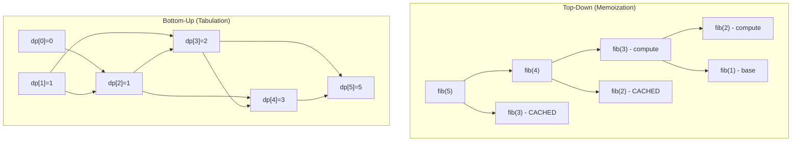
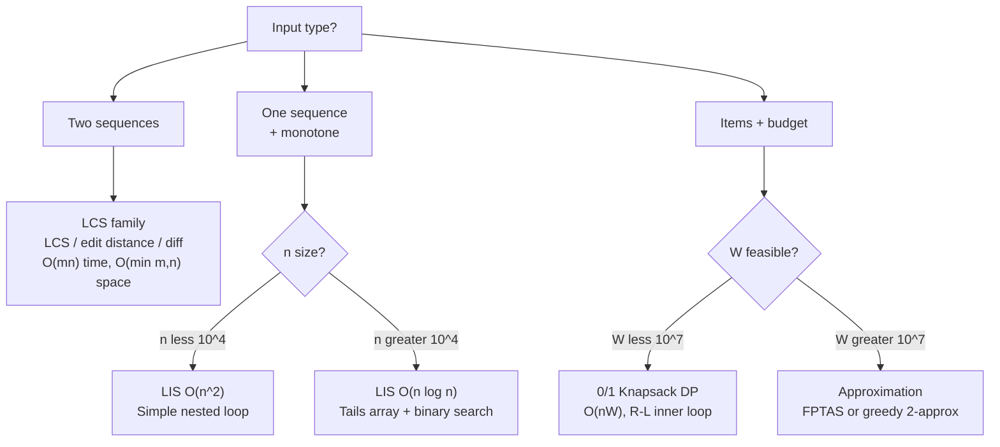

## Keywords in This File
{: .no_toc }

| # | Keyword | Weight |
|---|---------|--------|
| 1 | [Dynamic Programming: Top-Down vs Bottom-Up](#dynamic-programming-top-down-vs-bottom-up) | medium |
| 2 | [Common DP Patterns: Knapsack, LCS, LIS](#common-dp-patterns-knapsack-lcs-lis) | medium |

---

# Dynamic Programming: Top-Down vs Bottom-Up

**Difficulty:** ★★☆

**Interview Weight:** Medium

**Category:** Algorithm Design

---

### 🎯 Model Answer

**30-second answer:**

Dynamic programming solves problems with overlapping subproblems and optimal
substructure. Top-down (memoization) adds a cache to natural recursion.
Bottom-up (tabulation) iterates from the smallest subproblem upward. Both
achieve the same asymptotic complexity; the choice affects code clarity,
stack depth, and whether all subproblems must be solved.

**3-minute answer:**

DP's two fundamental conditions:

1. **Overlapping subproblems:** the same subproblem is solved many times.
   Example: `fib(5)` calls `fib(4)` and `fib(3)`; `fib(4)` also calls
   `fib(3)`. Without DP, `fib(3)` is computed twice.

2. **Optimal substructure:** the optimal solution to the whole problem
   contains optimal solutions to its subproblems. Example: the shortest
   path A->C through B contains the shortest path A->B and shortest path
   B->C.

**Top-down (memoization):**

- Write the natural recursive solution.
- Add a cache (HashMap or array) to store results.
- Before computing, check the cache. Return cached value if present.
- Time/space: O(n) for Fibonacci; O(n^2) for 2D problems.
- Advantages: only computes needed subproblems (lazy), closer to problem
  definition, easier to reason about.
- Disadvantages: recursive call stack overhead, StackOverflow for deep
  recursion (n > 10,000 in Java default 512KB stack).

**Bottom-up (tabulation):**

- Identify the subproblem ordering (smaller to larger, or by dependency).
- Fill a table starting from base cases.
- Each cell is computed exactly once in a defined order.
- Advantages: no recursion overhead, cache-friendly array access, easy
  space optimization (roll the table).
- Disadvantages: must solve ALL subproblems even if only a few are needed,
  harder to write for irregular dependency patterns.

**When to choose:**

- Top-down: sparse subproblem graphs, irregular dependency patterns,
  prototyping, when only a subset of subproblems are needed.
- Bottom-up: when all subproblems are needed, space-critical production
  code, deep recursion risks StackOverflow.

**Blank Mind Recovery:**

**Step 1:** Can I write a brute-force recursive solution? Write it.

**Step 2:** Does it recompute the same arguments? (Overlapping subproblems?)
If yes: add a cache -> top-down DP.

**Step 3:** What order can I fill a table in? (Can I compute `dp[i]` using
only previously-computed `dp[j]` for j < i?) If yes: bottom-up DP.

**Step 4:** Can I throw away old rows/columns once they are used? If yes:
space-optimize.

---

### 📘 Concept Explanation

**Intuition:**

DP is "remember what you have solved." Instead of recomputing the same
subproblem repeatedly, store its result. The insight: if a problem has
overlapping subproblems, brute recursion has exponential redundancy; a
cache collapses that redundancy to polynomial time.

**Mechanism - Top-Down:**

1. Recursive call arrives for `f(n)`.
2. Check `memo[n]`. If present, return `memo[n]`.
3. Compute `f(n)` recursively (all sub-calls are also cached).
4. Store result: `memo[n] = result`.
5. Return result.

The call graph is a DAG; memoization evaluates each node exactly once.

**Mechanism - Bottom-Up:**

1. Identify base cases (smallest subproblems).
2. Order all subproblems topologically (smaller before larger, or by
   explicit dependency analysis).
3. For each subproblem in order: compute using previously filled cells.
4. Return `dp[target]`.

The table is the "ledger" of solved subproblems; the loop order is the
topological sort of the dependency graph.

**Trade-offs:**

| Property | Top-Down | Bottom-Up |
|----------|----------|-----------|
| Implementation | Natural recursion + cache | Explicit loop + table |
| Subproblems solved | Only needed (lazy) | All (eager) |
| Stack usage | O(depth) recursion stack | O(1) (no recursion) |
| Space optimization | Hard (cache must stay) | Easy (rolling window) |
| Debugging | Print call args | Print table state |
| StackOverflow risk | Yes (deep recursion) | No |

**Failure:**

Top-down with no cache: exponential time. Bottom-up with wrong loop order:
reads from unfilled cells (wrong results, no error). Missing base case in
either: infinite recursion (top-down) or wrong dp[0] anchor (bottom-up).

**Diagnosis:**

For top-down: print cache hit rate. If 0% hits, memoization is not being
used (bug in cache key or lookup). If 100% hits except the first call per
subproblem, it is working correctly.

For bottom-up: print the table after filling. Verify base cases match
expected values. Trace the recurrence for a small example by hand.

**Scale:**

At 10^6 subproblems: top-down stack depth exceeds JVM default (-Xss512k);
use bottom-up. At 10^9 subproblems: even O(n) memory fails (needs space
optimization or different algorithm). For 2D DP with 10^3 x 10^3 states:
10^6 cells is fine; 10^4 x 10^4 = 10^8 cells may OOM.

**Decision:**

- Use top-down when: writing first draft, not all subproblems needed,
  or dependency order is complex.
- Use bottom-up when: deep recursion is risky, space optimization needed,
  or hot path in production.

**Memory:**

"Memo = lazy, Table = eager." Both give the same time complexity. Table
gives space optimization opportunities. Memo gives natural structure.

**Transfer:**

The top-down/bottom-up duality appears everywhere: lazy vs eager evaluation,
pull vs push architectures, demand-driven vs supply-driven computation.
Understanding it deeply transfers to compiler optimization, caching systems,
and stream processing.

**Reality:**

In production Java: Fibonacci for n > 10,000 needs bottom-up. LRU cache
implementations use memoization patterns. Matrix chain multiplication and
sequence alignment in bioinformatics use 2D bottom-up DP.

---

### 💻 Code Example

**BAD - No memoization (exponential):**

```java
// O(2^n) - recomputes fib(k) for every k
int fib(int n) {
    if (n <= 1) return n;
    return fib(n - 1) + fib(n - 2);
}
```

> **Code walkthrough:** The naive recursive Fibonacci without caching.
> KEY MECHANISM: `fib(5)` calls `fib(4)` and `fib(3)`; `fib(4)` also calls
> `fib(3)` again; the total calls equal the Fibonacci number itself (O(2^n)).
> WHY IT MATTERS: `fib(50)` would take over 10^10 operations on modern hardware
> - minutes of wall time. WHAT BREAKS: any input above ~40 becomes noticeably
> slow in an interview setting. TAKEAWAY: always ask "does this recursive
> function recompute the same arguments?" before writing production code.

**GOOD - Top-Down (memoization):**

```java
int[] memo = new int[n + 1];
Arrays.fill(memo, -1);

int fib(int n) {
    if (n <= 1) return n;
    if (memo[n] != -1) return memo[n];
    return memo[n] = fib(n - 1) + fib(n - 2);
}
```

> **Code walkthrough:** Single line added: `if (memo[n] != -1) return memo[n]`.
> KEY MECHANISM: each unique argument is computed exactly once and stored;
> all subsequent calls return in O(1). The call graph is a DAG with n nodes
> each visited once - total O(n) time and O(n) space. WHY IT MATTERS: same
> code structure as naive recursion but polynomial. TAKEAWAY: top-down DP is
> "recursive + cache"; write the recursion first, then add the cache.

**GOOD - Bottom-Up (tabulation):**

```java
int fibBottomUp(int n) {
    if (n <= 1) return n;
    int[] dp = new int[n + 1];
    dp[0] = 0;
    dp[1] = 1;
    for (int i = 2; i <= n; i++) {
        dp[i] = dp[i-1] + dp[i-2];
    }
    return dp[n];
}
```

> **Code walkthrough:** Bottom-up fills `dp[i]` in order from 2 to n,ice. **KEY MECHANISM:** the runtime executes these instructions in sequence with specific memory and execution semantics. **WHY IT MATTERS:** misapplying this pattern causes subtle bugs that only manifest under production load. **TAKEAWAY: understand the execution model before using this pattern in production code.**
> each step using only the two previous values. KEY MECHANISM: because
> `dp[i]` only depends on `dp[i-1]` and `dp[i-2]`, the loop order
> guarantees all dependencies are filled before they are read. WHY IT
> MATTERS: no recursion, no StackOverflow risk, works for n=10^7.
> TAKEAWAY: bottom-up requires identifying the right iteration order so
> all dependencies are computed before they are needed.

**GOOD - Space-Optimized Bottom-Up:**

```java
int fibSpaceOpt(int n) {
    if (n <= 1) return n;
    int prev2 = 0, prev1 = 1;
    for (int i = 2; i <= n; i++) {
        int curr = prev1 + prev2;
        prev2 = prev1;
        prev1 = curr;
    }
    return prev1;
}
```

> **Code walkthrough:** Rolling window reduces space from O(n) to O(1).
> KEY MECHANISM: since `dp[i]` only needs `dp[i-1]` and `dp[i-2]`, the
> entire table can be replaced with two variables that scroll forward.
> WHY IT MATTERS: for n=10^9, the O(n) table uses 8GB; the O(1) version
> uses 24 bytes. WHAT BREAKS: not all DP problems support space
> optimization - requires the recurrence to reference only a fixed window
> of past values. TAKEAWAY: identify the recurrence window; if fixed-size,
> space-optimize.

**Failure Example - Wrong loop order:**

```java
// BAD - bottom-up with wrong loop direction
int[] dp = new int[n + 1];
dp[n] = 0;
for (int i = n - 1; i >= 0; i--) {
    // dp[i] = dp[i+1] + ... but filling wrong direction
    dp[i] = dp[i + 1]; // reads unfilled for wrong problems
}
```

> **Code walkthrough:** This iterates right-to-left when the recurrenceice. **KEY MECHANISM:** the runtime executes these instructions in sequence with specific memory and execution semantics. **WHY IT MATTERS:** misapplying this pattern causes subtle bugs that only manifest under production load. **TAKEAWAY: understand the execution model before using this pattern in production code.**
> depends on right-side values - but for certain problems this produces
> wrong results. KEY MECHANISM: if `dp[i]` depends on `dp[i+1]` (like in
> knapsack with items counted multiple times), you must fill right-to-left.
> If `dp[i]` depends on `dp[i-1]`, fill left-to-right. WHY IT MATTERS:
> wrong order reads uninitialized values silently (0 by default in Java),
> producing plausible but wrong answers. TAKEAWAY: draw the recurrence
> dependency arrows; fill in the direction those arrows point FROM.

---

### 🎓 Answers by Seniority

**[JUNIOR/MID]**

Q: What is dynamic programming and when do you use it?

Dynamic programming is an optimization technique for problems with two
properties: overlapping subproblems (same calculation repeated) and optimal
substructure (optimal solution contains optimal sub-solutions). Use DP when
brute-force recursion is exponentially slow because it recomputes the same
arguments - adding memoization drops it to polynomial.

Common DP problems: Fibonacci, coin change, longest common subsequence,
0/1 knapsack, edit distance, climbing stairs, house robber.

Q: What is the difference between memoization and tabulation?

Memoization is top-down: write the natural recursion, add a cache to store
computed results, return cached values on repeated calls. Tabulation is
bottom-up: identify subproblems, fill a table from smallest to largest,
return the final entry.

Both achieve the same time complexity. Tabulation avoids recursion overhead
and stack overflow risks. Memoization only computes needed subproblems.

**[SENIOR/STAFF]**

DP in production has three dimensions beyond "make it work":

1. **Stack depth:** Java's default stack is 512KB (roughly 5,000-15,000
   frames depending on frame size). Any top-down DP on inputs larger than
   ~10,000 will StackOverflow without `-Xss` tuning. Bottom-up avoids
   this entirely.

2. **Cache locality:** bottom-up with a 1D or 2D array is sequential
   memory access - CPU cache-friendly. Top-down with HashMap has random
   access patterns and pointer chasing - 10-100x slower per cache miss.
   For hot paths, bottom-up with arrays is almost always faster in practice.

3. **Space optimization:** most interview DP solutions use O(n^2) space
   unnecessarily. In production, LCS on 10^6-char strings needs O(min(m,n))
   space (rolling rows), not O(m*n). Always identify the minimum window
   your recurrence needs.

Principal-level addition: DP correctness proof = two parts. (1) Optimal
substructure: prove the recurrence is correct (usually by contradiction
or exchange argument). (2) Memoization correctness: prove the subproblem
DAG is acyclic (no infinite recursion). If the problem has cycles, DP
does not apply directly - use Bellman-Ford (DP on relaxation rounds) or
reformulate.

---

### ⚠️ Common Misconceptions

**Misconception 1: "DP and recursion + caching are different techniques."**

Wrong. Top-down DP IS recursion + caching. They are the same algorithm
expressed differently. The word "dynamic programming" was coined by Richard
Bellman primarily for political/marketing reasons (to avoid the word
"mathematical" which was unpopular with government funders). The core
insight is the same: avoid recomputing overlapping subproblems.

**Misconception 2: "Bottom-up is always faster than top-down."**

Usually true in practice (no recursion overhead, better cache locality),
but not universally. If the problem has many subproblems but only a small
fraction are actually needed, top-down (lazy) avoids computing the rest.
Example: sparse DP on graphs where most states are unreachable.

**Misconception 3: "If I can write a recurrence, it's DP."**

Recurrence alone is not DP. DP requires OVERLAPPING subproblems. Merge
sort has a recurrence T(n) = 2T(n/2) + O(n) but is NOT DP - subproblems
never overlap (each element belongs to exactly one half). DP requires that
the same (argument, state) pair appears multiple times in the recursion tree.

**Misconception 4: "Space optimization is just a micro-optimization."**

At scale, O(n) vs O(n^2) space is the difference between fitting in memory
and OOMing. LCS on two 10^6-char strings: O(n^2) = 10^12 entries (petabytes).
O(n) rolling-row solution fits in a few MB.

**Misconception 5: "DP always gives the optimal solution."**

DP gives the optimal solution IF the recurrence is correct AND optimal
substructure holds. If your recurrence is wrong (missing a case, wrong
transition), DP faithfully computes the wrong thing with no error.

---

### 🚨 Failure Modes and Diagnosis

**Failure 1 - StackOverflowError in top-down DP**

Symptom: `java.lang.StackOverflowError` on large inputs.

Root cause: recursion depth equals problem size (n = 100,000 -> 100,000
stack frames). Default JVM stack = 512KB.

Fix:
```java
// Option 1: increase stack (short-term)
// java -Xss4m MyProgram
// Option 2: convert to bottom-up (correct fix)
```

> **Code walkthrough:** The two options for StackOverflowError in DP.
> KEY MECHANISM: `-Xss4m` allocates 4MB per thread instead of 512KB,
> buying roughly 8x more depth - enough for n=~800,000. But this multiplies
> memory per thread; if your app has 1,000 threads you now use 4GB just for
> stacks. WHY IT MATTERS: bottom-up is the right fix - it eliminates the
> stack entirely. TAKEAWAY: `-Xss` is a temporary band-aid; convert to
> bottom-up for any DP with large n.

Diagnosis: check stack depth:
```
jstack PID | grep -c "fib\|dp\|solve"
```

> **Code walkthrough:** `grep -c` counts lines matching the pattern,ice. **KEY MECHANISM:** the runtime executes these instructions in sequence with specific memory and execution semantics. **WHY IT MATTERS:** misapplying this pattern causes subtle bugs that only manifest under production load. **TAKEAWAY: understand the execution model before using this pattern in production code.**
> giving the approximate recursion depth in the stack dump. KEY MECHANISM:
> if the count equals the expected recursion depth (n), the recursion is
> correctly bounded; if it is much larger, the recursion is diverging.
> WHY IT MATTERS: a quick stack depth count before reading thousands of
> jstack lines narrows the search. TAKEAWAY: count before you read.

**Failure 2 - Wrong answer from un-initialized table**

Symptom: DP returns 0 or negative values for inputs that should be positive.

Root cause: Java default-initializes arrays to 0. If 0 is a valid subproblem
result AND the base case is also 0, the cache hit check `if (dp[i] != 0)`
will incorrectly return 0 for uncomputed states.

Fix:
```java
// BAD - 0 collides with valid result
if (dp[i] != 0) return dp[i];

// GOOD - use sentinel that is never a valid result
Arrays.fill(dp, -1);
if (dp[i] != -1) return dp[i];
```

> **Code walkthrough:** Using -1 as the sentinel value instead of 0.
> KEY MECHANISM: `Arrays.fill(dp, -1)` marks all entries as "not yet
> computed." The check `!= -1` correctly distinguishes computed (including
> 0 as a valid result) from uncomputed. WHY IT MATTERS: coin change minimum
> count problems often return 0 for amount=0; using 0 as sentinel breaks
> the base case. TAKEAWAY: choose a sentinel that can NEVER be a valid
> subproblem result.

**Failure 3 - Infinite recursion from missing base case**

Symptom: `StackOverflowError` even for small inputs (n=5); the call stack
shows the same function at every depth.

Root cause: the base case condition is wrong and never triggers.

Fix: test f(0) and f(1) in isolation before any recursion. If they
recurse, the base case is broken.

**Failure 4 - 2D DP with incorrect row/column ordering**

Symptom: wrong answers for some cells in a 2D DP table. Correct for small
inputs, wrong for larger.

Root cause: iterating columns before rows (or vice versa) when the recurrence
requires the opposite direction.

Fix: draw the dependency diagram. `dp[i][j]` depends on which cells? Draw
arrows. Fill in the direction the arrows point FROM (compute sources before
dependents).

---

### 🎯 Interview Deep-Dive

| Category | Count | Min Required |
|----------|-------|-------------|
| CONCEPT | 3 | 1 |
| DEBUGGING | 2 | 1 |
| CODING | 2 | 1 |
| TRADE-OFF | 1 | 1 |
| BEHAVIORAL | 1 | 1 |
| **Total** | **9** | **9** |

---

**[JUNIOR] Q1 - [CONCEPT] What is the key difference between DP and plain recursion?**

Plain recursion re-solves the same subproblems repeatedly, leading to
exponential time on problems with overlapping subproblems. DP adds
memoization or tabulation to store and reuse subproblem results, reducing
redundant work from exponential to polynomial.

The two required conditions for DP to be applicable:

1. **Overlapping subproblems:** the recursion tree contains duplicate
   (same-argument) sub-calls. Without this, caching adds overhead but no
   benefit (merge sort is NOT DP for this reason).

2. **Optimal substructure:** the globally optimal solution is composed
   of optimal solutions to subproblems. Without this, caching the
   subproblem results gives wrong globally optimal answers.

The test: draw the recursion tree for a small input. If any subtrees are
identical (same root, same structure), overlapping subproblems exist.

*What separates good from great:* Knowing that the word "dynamic" in DP
is historical jargon and has nothing to do with dynamic memory allocation
or dynamic dispatch. The technique is "careful caching."

---

**[JUNIOR] Q2 - [CODING] Implement coin change (minimum coins) both top-down and bottom-up.**

**Top-down:**

```java
int[] memo;

int coinChange(int[] coins, int amount) {
    memo = new int[amount + 1];
    Arrays.fill(memo, -1);
    int result = dp(coins, amount);
    return result == Integer.MAX_VALUE ? -1 : result;
}

int dp(int[] coins, int rem) {
    if (rem == 0) return 0;
    if (rem < 0) return Integer.MAX_VALUE;
    if (memo[rem] != -1) return memo[rem];
    int min = Integer.MAX_VALUE;
    for (int coin : coins) {
        int sub = dp(coins, rem - coin);
        if (sub != Integer.MAX_VALUE) {
            min = Math.min(min, sub + 1);
        }
    }
    return memo[rem] = min;
}
```

> **Code walkthrough:** Top-down coin change with -1 sentinel. KEY MECHANISM:ice. **KEY MECHANISM:** the runtime executes these instructions in sequence with specific memory and execution semantics. **WHY IT MATTERS:** misapplying this pattern causes subtle bugs that only manifest under production load. **TAKEAWAY: understand the execution model before using this pattern in production code.**
> for each remaining amount, try all coins; take the min of (1 + dp(rem-coin)).
> Integer.MAX_VALUE represents "impossible" - the guard `sub != MAX_VALUE`
> prevents integer overflow on `MAX_VALUE + 1`. WHY IT MATTERS: the overflow
> guard is a common missed detail in interviews. TAKEAWAY: any DP with an
> "impossible" sentinel must guard against arithmetic overflow.

**Bottom-up:**

```java
int coinChangeBottomUp(int[] coins, int amount) {
    int[] dp = new int[amount + 1];
    Arrays.fill(dp, amount + 1); // sentinel > any valid answer
    dp[0] = 0;
    for (int i = 1; i <= amount; i++) {
        for (int coin : coins) {
            if (coin <= i) {
                dp[i] = Math.min(dp[i], dp[i - coin] + 1);
            }
        }
    }
    return dp[amount] > amount ? -1 : dp[amount];
}
```

> **Code walkthrough:** Bottom-up coin change fills dp[0..amount] in order.
> KEY MECHANISM: sentinel `amount + 1` is larger than any achievable answer
> (you can't need more than `amount` coins of denomination 1). This avoids
> Integer.MAX_VALUE overflow. WHY IT MATTERS: `dp[amount] > amount` cleanly
> detects "impossible." TAKEAWAY: use `amount+1` as sentinel in coin change;
> it is self-documenting and overflow-safe.

*What separates good from great:* Recognizing the overflow hazard with
Integer.MAX_VALUE as sentinel and proactively using `amount+1` instead.

---

**[JUNIOR] Q3 - [CONCEPT] What is "optimal substructure" and how do you verify a problem has it?**

Optimal substructure means: an optimal solution to the problem contains
optimal solutions to its subproblems. If you could replace any subproblem
solution with a better one and still get a valid overall solution, optimal
substructure holds.

Verification method - the "cut and paste" argument:

Assume you have an optimal solution S*. Take any subproblem P within S*.
S* uses solution s* for P. Suppose s' is a better solution for P. Can you
substitute s* with s' in S* to get a better overall solution? If yes,
S* was not optimal (contradiction). Therefore the optimal solution for any
subproblem must be part of S*.

Example - shortest path:
Optimal path A->C via B: if the subpath A->B is not the shortest A->B path,
replace it with the shortest A->B path. The result is a shorter A->C path -
contradicting that A->C via B was optimal. Therefore shortest paths have
optimal substructure.

Counterexample - longest simple path:
Longest simple path does NOT have optimal substructure. The longest path
A->B may share vertices with the longest path B->C, making their combination
non-simple (not a valid path). Combining optimal sub-paths can invalidate
the solution's constraints.

*What separates good from great:* Giving the cut-and-paste proof structure
and the counterexample (longest simple path fails optimal substructure).

---

**[SENIOR] Q4 - [TRADE-OFF] When is top-down preferred over bottom-up in production code?**

Top-down wins in three specific cases:

**Case 1 - Sparse subproblem graphs.** If only O(log n) of the O(n) possible
subproblems are actually reached during the computation, bottom-up wastes
time computing all O(n) cells. Top-down (lazy) only computes what is needed.
Example: matrix exponentiation paths in sparse graphs.

**Case 2 - Irregular dependencies.** Some DP recurrences depend on
non-contiguous prior states (e.g., `dp[i]` depends on `dp[j]` for all j
satisfying some predicate). Writing the bottom-up loop order is
non-trivial; top-down handles it naturally through the call graph.

**Case 3 - Prototyping and correctness first.** Top-down is easier to
write correctly (it mirrors the problem's mathematical recurrence).
Bottom-up introduces implementation risk (wrong loop order, off-by-one
in table indices). In interviews, write top-down first, then convert
to bottom-up only if the interviewer asks or the input size requires it.

Bottom-up wins in production when:
- Input size risks StackOverflow (n > 10,000 without -Xss tuning).
- Hot path performance matters (cache-friendly array access vs HashMap).
- Space optimization is required (rolling window is easier bottom-up).

*What separates good from great:* Understanding that production Java code
almost always prefers bottom-up for the three listed reasons, but knowing
exactly which edge cases favor top-down.

---

**[SENIOR] Q5 - [DEBUGGING] A DP solution returns correct results for small inputs but wrong results for large inputs. What do you check?**

Systematic checklist:

**1. Overflow:** does any intermediate value exceed int range (2^31-1 =
2.1 billion)? Typical: coin change accumulates counts that exceed int.
Fix: use long or check for overflow before arithmetic.

**2. Sentinel collision:** is the sentinel value (0, -1, Integer.MAX_VALUE)
a valid answer for some subproblem? Small inputs may not hit that edge case.
Fix: choose a sentinel outside the problem's range (e.g., `amount+1` for
coin change).

**3. Loop order:** does the inner/outer loop traverse in the direction the
recurrence requires? Wrong order is correct for small inputs (all cells
happen to be filled before read), wrong for large inputs where the
dependency is violated.

**4. Index bounds:** does `dp[i-coin]` access a negative index for some
combination of i and coin? Small tests may not trigger this.
Fix: add `if (coin <= i)` guard.

**5. Unbounded vs 0/1 knapsack confusion:** are items reusable? Unbounded
(coin change) iterates items inside amount loop. 0/1 (cannot reuse) iterates
amount INSIDE items loop. Swapping these gives wrong answers on large inputs
where multiple uses matter.

*What separates good from great:* Immediately reaching for the loop order
check and the overflow check as the first two hypotheses, before looking
at business logic.

---

**[SENIOR] Q6 - [DEBUGGING] How do you debug a DP recurrence that gives slightly wrong answers - off by one?**

Off-by-one in DP almost always comes from one of these sources:

**1. Inclusive vs exclusive endpoint:** `dp[i]` represents "using the first
i elements" (0-indexed is tricky: does dp[0] mean "empty" or "first element"?).
Fix: always write a comment like `// dp[i] = min cost to make change for
amount i`. Make the meaning explicit.

**2. Wrong base case:** `dp[0]` or `dp[1]` is set to the wrong value.
Fix: verify base cases by hand: what does the problem say is the answer for
the smallest inputs? Does your base case match?

**3. Using i instead of i-1 (or vice versa):** the recurrence uses `dp[i-1]`
but you coded `dp[i]`. Common in "climbing stairs" (ways to reach step n
= ways from n-1 + ways from n-2).

Debugging procedure:
```java
// Print table for small input
for (int val : dp) System.out.print(val + " ");
System.out.println();
```

> **Code walkthrough:** Print the full DP table for a small hand-verifiableice. **KEY MECHANISM:** the runtime executes these instructions in sequence with specific memory and execution semantics. **WHY IT MATTERS:** misapplying this pattern causes subtle bugs that only manifest under production load. **TAKEAWAY: understand the execution model before using this pattern in production code.**
> input (e.g., amount=5, coins=[1,2,3]). KEY MECHANISM: compare each cell
> against your hand-computed expected value. The first cell that diverges
> from expected points to either a wrong recurrence or a wrong loop order.
> WHY IT MATTERS: DP bugs are recurrence bugs; the table is the recurrence
> materialized. TAKEAWAY: print and compare the table, not just the final
> answer.

*What separates good from great:* Always printing the full table for a
small input as the first debugging step, not just the final dp[n].

---

**[SENIOR] Q7 - [CONCEPT] Explain the connection between DP and the DAG model.**

Every DP problem can be modeled as a DAG (directed acyclic graph):

- **Nodes:** subproblems (defined by their arguments/state).
- **Edges:** dependencies. If computing `dp[i]` requires `dp[j]`, draw edge
  j -> i.
- **DAG requirement:** if there were a cycle, we would need `dp[i]` to
  compute `dp[j]` and `dp[j]` to compute `dp[i]` - infinite recursion.
  DP requires the dependency graph to be acyclic.

Top-down DP traverses this DAG via DFS (natural recursion). Memoization
stores results at each node so each node is visited (and computed) exactly
once.

Bottom-up DP requires a topological sort of the DAG. The "loop order" IS
the topological sort. For Fibonacci: order 0,1,2,...,n is a valid topological
sort of the dependency DAG (each fib(i) depends only on fib(i-1) and
fib(i-2), so earlier nodes come first).

For 2D DP: the topological sort is usually row-by-row (i outer, j inner)
or the reverse, depending on which cells each cell depends on.

Why this matters: if you cannot find a valid loop order, the dependency
graph has a cycle and DP cannot be directly applied. This is the root
cause when students write "infinite recursion" in top-down DP - they
created a cycle in the state space.

*What separates good from great:* Connecting "loop order" to "topological
sort of the DP DAG." This is the principled explanation for why loop
direction matters.

---

**[SENIOR] Q8 - [CONCEPT] What is the difference between unbounded and 0/1 knapsack? Why does the loop order differ?**

**0/1 Knapsack:** each item can be used AT MOST ONCE.

```java
// items outer, capacity inner (right-to-left for 0/1)
for (int i = 1; i <= n; i++) {
    for (int w = W; w >= weights[i]; w--) {
        dp[w] = Math.max(dp[w],
                         dp[w - weights[i]] + values[i]);
    }
}
```

> **Code walkthrough:** 0/1 knapsack with right-to-left inner loop.
> KEY MECHANISM: iterating w from W DOWN to weights[i] ensures that
> dp[w - weights[i]] refers to the state BEFORE item i was considered
> (from the previous iteration of the items loop). If we iterated left
> to right, dp[w - weights[i]] would already include item i, allowing it
> to be used multiple times. WHY IT MATTERS: changing right-to-left to
> left-to-right converts 0/1 knapsack to unbounded knapsack silently.
> TAKEAWAY: 0/1 = right-to-left; unbounded = left-to-right.

**Unbounded Knapsack:** each item can be used ANY number of times.

```java
// capacity outer is fine, items inner left-to-right
for (int w = 0; w <= W; w++) {
    for (int coin : coins) {
        if (coin <= w) {
            dp[w] = Math.min(dp[w], dp[w - coin] + 1);
        }
    }
}
```

> **Code walkthrough:** Unbounded knapsack (coin change) fills left-to-right.
> KEY MECHANISM: dp[w - coin] may already include this coin (from an earlier
> w iteration), allowing the same coin to be used multiple times. This is
> exactly the desired behavior for unbounded problems. WHY IT MATTERS: the
> loop order encodes the problem's constraint - never change it without
> understanding why. TAKEAWAY: the direction (L-R vs R-L) encodes whether
> items are reusable.

*What separates good from great:* Explaining WHY loop direction encodes
reusability, not just stating "use R-L for 0/1."

---

**[SENIOR] Q9 - [BEHAVIORAL] Describe a production situation where you used DP or caching to solve a performance problem.**

Strong answer structure: context, problem, analysis, solution, result.

"Our search ranking system computed document relevance scores that depended
on nested feature combinations. Each scoring function called multiple sub-
scorers, and we noticed that for a query with 50 candidate documents, many
sub-scorer computations (especially n-gram overlap between query and document)
were repeated 15-20 times each.

I profiled with JFR (Java Flight Recorder) and confirmed that the n-gram
overlap function was the hottest path (40% of total query time) with 95%
of calls being repeated (same query, same document segment, same n-gram
parameters).

I added memoization: the cache key was (queryFingerprint, documentSegmentHash,
n). Since queries are processed synchronously, the cache was request-scoped
(cleared after each query) - no cross-query stale data risk.

Result: query latency dropped from p99=180ms to p99=45ms. Cache memory
overhead was 2MB per query (bounded by the number of unique document segments
per query). The fix was 15 lines of code."

Key elements: quantified the problem, identified the hotspot with real
tools, chose the right cache scope, measured the result.

*What separates good from great:* Mentioning cache scope (request-scoped vs
global) and the stale data consideration. Naive memoization with a global
cache is a correctness risk.

---

### ⚖️ Comparison Table

| Property | Top-Down (Memoization) | Bottom-Up (Tabulation) |
|----------|----------------------|----------------------|
| Implementation style | Recursive + cache | Iterative + table |
| Subproblems computed | Only needed (lazy) | All (eager) |
| Stack usage | O(depth) - overflow risk | O(1) |
| Cache structure | HashMap or array | Array |
| Cache locality | Poor (HashMap) / OK (array) | Excellent (sequential) |
| Space optimization | Hard | Easy (rolling window) |
| Code proximity to recurrence | Close (natural) | Further (explicit order) |
| Debugging approach | Trace call args | Print table |
| Preferred for | Prototyping, sparse states | Production, large n |
| StackOverflow risk | Possible (deep recursion) | None |

---

### 🏛️ System Design

*(Omit: DP top-down vs bottom-up is a single-algorithm design decision,
not a distributed system design concern. Trade-offs are covered in the
Comparison Table above.)*

---

### 📊 Diagram

```
DP Computation Models
                                        
  Top-Down (Memoization)                
  fib(5)                                
    ├── fib(4) [compute]                
    │     ├── fib(3) [compute]          
    │     │     ├── fib(2) [compute]    
    │     │     └── fib(1) [cached]     
    │     └── fib(2) [CACHED]           
    └── fib(3) [CACHED]                 
                                        
  Bottom-Up (Tabulation)                
  i: 0  1  2  3  4  5                   
  dp:[0, 1, 1, 2, 3, 5]                 
      ^  ^  ^--^--^  ^                  
      base  recurrence  target          
```

> **Diagram walkthrough:** The top half shows the top-down call tree for
> fib(5). [CACHED] nodes are looked up in O(1) rather than re-expanding.
> The bottom half shows the bottom-up table filled left to right, where
> each cell uses only previously computed cells. KEY RELATIONSHIP: both
> models compute the same DAG of subproblems; top-down traverses it via
> DFS and memoizes, bottom-up traverses it in topological order. EDGE CASE:
> if the dependency graph has a cycle (wrong recurrence), top-down infinite-
> recurses while bottom-up fails with wrong values from uninitialized cells.
> INSIGHT: a senior engineer notices that [CACHED] nodes appear at depth 2+
> in the tree - caching only helps when subproblems recur at depth >= 2.



> **Diagram walkthrough:** The top subgraph shows fib(5) computed top-down:
> grey [CACHED] nodes are retrieved rather than expanded, eliminating their
> entire subtrees. The bottom subgraph shows bottom-up: each node is computed
> exactly once in order 0,1,2,3,4,5. KEY RELATIONSHIP: the bottom-up edge
> directions form the topological sort required for correct table filling.
> EDGE CASE: in the top-down graph, if fib(3) were not cached, the whole
> left subtree would be duplicated. INSIGHT: a senior engineer sees that
> the bottom-up DAG has no "wasted" computations; top-down has redundancy
> only eliminated by caching.

---

---

# Common DP Patterns: Knapsack, LCS, LIS

**Difficulty:** ★★☆

**Interview Weight:** Medium

**Category:** Algorithm Design

---

### 🎯 Model Answer

**30-second answer:**

Three canonical DP patterns appear in roughly 80% of DP interview problems.
0/1 Knapsack: optimize value subject to a weight capacity constraint.
Longest Common Subsequence: find the longest sequence present in two
strings in the same relative order. Longest Increasing Subsequence: find
the longest strictly increasing subsequence within a single array. Each
has a distinct recurrence and state definition.

**3-minute answer:**

**0/1 Knapsack:**

State: `dp[i][w]` = max value using first i items with capacity w.

Recurrence:
```
dp[i][w] = dp[i-1][w]            // skip item i
dp[i][w] = max(dp[i][w],
    dp[i-1][w-w_i] + v_i)        // take item i if w_i <= w
```

> **Code walkthrough:** The 0/1 Knapsack recurrence in pseudocode.
> KEY MECHANISM: two choices per item - skip (keep previous row value)
> or take (add item value to best solution for remaining capacity).
> The `max` selects the better choice. WHY IT MATTERS: the `i-1` subscript
> ensures we read from the PREVIOUS item's row, enforcing 0/1 constraint.
> TAKEAWAY: the recurrence directly encodes the take-or-skip decision tree.

Result: `dp[n][W]`. Time O(nW), space O(nW) or O(W) with rolling rows.

**Longest Common Subsequence (LCS):**

State: `dp[i][j]` = length of LCS of `s1[0..i-1]` and `s2[0..j-1]`.

Recurrence:
```
If s1[i-1] == s2[j-1]: dp[i][j] = dp[i-1][j-1] + 1
Else:                   dp[i][j] = max(dp[i-1][j], dp[i][j-1])
```

> **Code walkthrough:** LCS recurrence in pseudocode. KEY MECHANISM:ice. **KEY MECHANISM:** the runtime executes these instructions in sequence with specific memory and execution semantics. **WHY IT MATTERS:** misapplying this pattern causes subtle bugs that only manifest under production load. **TAKEAWAY: understand the execution model before using this pattern in production code.**
> match case extends the diagonal (LCS excluding both chars + 1); mismatch
> takes the max of skipping one character from either string (left or up).
> WHY IT MATTERS: the two skip options are what allow LCS to match
> non-contiguous characters. TAKEAWAY: LCS = diagonal on match, max(up,left)
> on mismatch.

Result: `dp[m][n]`. Time O(mn), space O(mn) or O(min(m,n)) rolling rows.

**Longest Increasing Subsequence (LIS):**

State: `dp[i]` = length of LIS ending at index i.

Recurrence:
```
dp[i] = 1 + max(dp[j] for all j < i where arr[j] < arr[i])
```

> **Code walkthrough:** LIS recurrence: dp[i] is the length of the longestice. **KEY MECHANISM:** the runtime executes these instructions in sequence with specific memory and execution semantics. **WHY IT MATTERS:** misapplying this pattern causes subtle bugs that only manifest under production load. **TAKEAWAY: understand the execution model before using this pattern in production code.**
> increasing subsequence ending at index i. KEY MECHANISM: scan all previous
> indices j; if arr[j] < arr[i], we can extend the LIS ending at j by one.
> The max over all valid j gives dp[i]. WHY IT MATTERS: initializing dp[i]=1
> handles the case where no previous element is smaller (the element alone
> is an LIS of length 1). TAKEAWAY: LIS = "extend any prior LIS that ends
> with something smaller."

Result: `max(dp)`. Time O(n^2), space O(n). Binary search approach: O(n log n).

**Blank Mind Recovery:**

**Step 1:** Identify which of the three patterns this resembles.

- Weight/capacity constraint + value optimization -> Knapsack family.
- Two sequences, find common structure -> LCS family.
- Single sequence, find monotone structure -> LIS family.

**Step 2:** Define the state (what does dp[i] or dp[i][j] represent?).

**Step 3:** Write the recurrence for the "take vs skip" or "match vs skip"
choice.

**Step 4:** Identify base cases (dp[0][*] = 0, dp[*][0] = 0 for 2D).

---

### 📘 Concept Explanation

**Intuition:**

These three patterns are "templates" for thinking about choices over
sequences. Knapsack: for each item, TAKE or SKIP. LCS: for each pair of
characters, MATCH or SKIP one of the two strings. LIS: for each element,
EXTEND an existing increasing subsequence or START a new one.

**Mechanism - Knapsack:**

The dp table is n x W. Each row represents "decisions about items 1..i."
Each column represents a capacity. Filling row i: copy row i-1 (skip item i),
then for each column w >= weight_i, consider taking item i (update if better).
The 1D rolling optimization: process columns RIGHT TO LEFT to avoid using
item i twice (0/1 constraint).

**Mechanism - LCS:**

The dp table is m x n for strings of lengths m and n. Fill row by row.
When characters match: extend the diagonal (the LCS without either
character). When characters don't match: take the best of skipping one
character from either string (left or up cell). The table encodes all
possible alignments of the two strings.

**Mechanism - LIS (O(n^2)):**

`dp[i]` = length of longest increasing subsequence ending exactly at
position i. For each i, scan all j < i; if `arr[j] < arr[i]`, we can
extend the LIS ending at j by one. Take the maximum extension.
Result: max over all positions.

**Mechanism - LIS (O(n log n) - patience sorting):**

Maintain a "tails" array where `tails[k]` = smallest tail of all increasing
subsequences of length k+1. For each element, binary-search for its
position in tails (replace the first tail >= element). Length of tails =
length of LIS. This exploits the monotone property of the tails array.

**Trade-offs:**

| Property | Knapsack | LCS | LIS (O(n^2)) | LIS (O(n log n)) |
|----------|----------|-----|--------------|-----------------|
| Time | O(nW) | O(mn) | O(n^2) | O(n log n) |
| Space | O(W) | O(min(m,n)) | O(n) | O(n) |
| Implementation | Medium | Medium | Simple | Complex |
| Reconstruct path? | With parent table | With parent table | With parent table | Hard |

**Failure:**

Knapsack: using L-R inner loop gives unbounded knapsack (items reusable).
LCS: forgetting that LCS allows non-contiguous matches (vs substring which
requires contiguous - different recurrence). LIS: using `<=` instead of
`<` allows non-strictly-increasing sequences.

**Diagnosis:**

Knapsack: verify with a 2-item example by hand. LCS: verify with `LCS("ABC","AC")=2`.
LIS: verify with `[3,1,2]` = 2 (not 3).

**Scale:**

LCS on two 10^5-char strings: O(n^2) = 10^10 operations - infeasible.
Need O(n log n) algorithm (Hunt-Szymanski for sparse LCS) or accept
O(n * min(m,n)) with rolling rows.

**Decision:**

- Knapsack: recognize "fill capacity" problems; the capacity W makes it
  pseudo-polynomial (not polynomial in input size).
- LCS: recognize "two-sequence alignment" problems (diff, edit distance,
  shortest common supersequence all reduce to LCS).
- LIS: recognize "single-sequence monotone subsequence" problems; use
  O(n log n) when n > 10^4.

**Memory:**

Knapsack = TAKE-or-SKIP with a weight limit. LCS = MATCH-or-SKIP-one-string.
LIS = EXTEND-or-START with a tails array.

**Transfer:**

Knapsack generalizes to scheduling (minimize completion time subject to
resource budget), cutting stock problem, feature selection in ML. LCS
generalizes to edit distance (add/delete costs) and diff tools. LIS
generalizes to box stacking, Russian doll envelopes.

**Reality:**

LCS powers Unix `diff` and git's change detection. Edit distance (LCS
variant) powers spell checkers. LIS appears in patience sorting and
in the Erdos-Szekeres theorem proof. 0/1 Knapsack underpins many resource
allocation problems in cloud scheduling.

---

### 💻 Code Example

**Knapsack - BAD (O(nW) space, reuses items):**

```java
// BAD - left-to-right inner loop allows item reuse
int[] dp = new int[W + 1];
for (int item = 0; item < n; item++) {
    for (int w = weights[item]; w <= W; w++) {
        // dp[w - weights[item]] already includes item (reuse!)
        dp[w] = Math.max(dp[w],
                dp[w - weights[item]] + values[item]);
    }
}
```

> **Code walkthrough:** Left-to-right inner loop converts 0/1 knapsack toice. **KEY MECHANISM:** the runtime executes these instructions in sequence with specific memory and execution semantics. **WHY IT MATTERS:** misapplying this pattern causes subtle bugs that only manifest under production load. **TAKEAWAY: understand the execution model before using this pattern in production code.**
> unbounded knapsack. KEY MECHANISM: when computing dp[w], dp[w-weight_i]
> was computed in this same inner loop iteration, meaning item i was already
> "added" to that state. So adding it again doubles the item. WHY IT MATTERS:
> for a problem where items cannot repeat (0/1 constraint), this silently
> gives wrong (too-high) values. TAKEAWAY: 0/1 requires right-to-left.

**Knapsack - GOOD (0/1 with R-L inner loop):**

```java
// GOOD - right-to-left ensures each item used at most once
int[] dp = new int[W + 1];
for (int i = 0; i < n; i++) {
    for (int w = W; w >= weights[i]; w--) {
        dp[w] = Math.max(dp[w],
                dp[w - weights[i]] + values[i]);
    }
}
// dp[W] = max value with capacity W
```

> **Code walkthrough:** Right-to-left inner loop for 0/1 knapsack. KEYice. **KEY MECHANISM:** the runtime executes these instructions in sequence with specific memory and execution semantics. **WHY IT MATTERS:** misapplying this pattern causes subtle bugs that only manifest under production load. **TAKEAWAY: understand the execution model before using this pattern in production code.**
> MECHANISM: when we update dp[w], the value dp[w-weights[i]] still reflects
> the state BEFORE item i was considered (it hasn't been updated yet in this
> pass because we move right-to-left). WHY IT MATTERS: this is the minimal
> change from unbounded to 0/1 - one direction change, same asymptotic
> complexity. TAKEAWAY: memorize this as the canonical 0/1 knapsack template.

**LCS - GOOD:**

```java
int lcs(String s1, String s2) {
    int m = s1.length(), n = s2.length();
    int[][] dp = new int[m + 1][n + 1];
    for (int i = 1; i <= m; i++) {
        for (int j = 1; j <= n; j++) {
            if (s1.charAt(i-1) == s2.charAt(j-1)) {
                dp[i][j] = dp[i-1][j-1] + 1; // extend match
            } else {
                dp[i][j] = Math.max(
                    dp[i-1][j],  // skip s1[i]
                    dp[i][j-1]   // skip s2[j]
                );
            }
        }
    }
    return dp[m][n];
}
```

> **Code walkthrough:** LCS fills a (m+1) x (n+1) table. KEY MECHANISM:ice. **KEY MECHANISM:** the runtime executes these instructions in sequence with specific memory and execution semantics. **WHY IT MATTERS:** misapplying this pattern causes subtle bugs that only manifest under production load. **TAKEAWAY: understand the execution model before using this pattern in production code.**
> the `+1` padding in both dimensions means dp[0][*] = dp[*][0] = 0 (base
> case: empty string LCS = 0), automatically handled without explicit
> initialization. The diagonal move (dp[i-1][j-1]+1) records a match;
> the max of left/up records a skip. WHY IT MATTERS: the two "skip" options
> (skip s1 or skip s2) are what makes LCS find non-contiguous matches.
> TAKEAWAY: LCS diagonal = match, up/left = skip one string.

**LIS - O(n^2) GOOD:**

```java
int lisN2(int[] arr) {
    int n = arr.length;
    int[] dp = new int[n];
    Arrays.fill(dp, 1); // every element is LIS of length 1
    int maxLen = 1;
    for (int i = 1; i < n; i++) {
        for (int j = 0; j < i; j++) {
            if (arr[j] < arr[i]) { // strictly increasing
                dp[i] = Math.max(dp[i], dp[j] + 1);
            }
        }
        maxLen = Math.max(maxLen, dp[i]);
    }
    return maxLen;
}
```

> **Code walkthrough:** O(n^2) LIS initializes each dp[i]=1 (every elementice. **KEY MECHANISM:** the runtime executes these instructions in sequence with specific memory and execution semantics. **WHY IT MATTERS:** misapplying this pattern causes subtle bugs that only manifest under production load. **TAKEAWAY: understand the execution model before using this pattern in production code.**
> alone is an LIS). KEY MECHANISM: for each i, scan all j < i; if arr[j]<arr[i],
> extend the LIS ending at j. The max over all i gives the global LIS length.
> WHY IT MATTERS: this is the easiest LIS to implement correctly in an
> interview; save the O(n log n) variant for follow-up questions. WHAT BREAKS:
> using `<=` instead of `<` allows equal elements, changing "strictly
> increasing" to "non-decreasing." TAKEAWAY: use `<` for strictly increasing.

**LIS - O(n log n) GOOD:**

```java
int lisNLogN(int[] arr) {
    List<Integer> tails = new ArrayList<>();
    for (int num : arr) {
        int pos = Collections.binarySearch(tails, num);
        if (pos < 0) pos = -(pos + 1); // insertion point
        if (pos == tails.size()) {
            tails.add(num); // extend longest subsequence
        } else {
            tails.set(pos, num); // replace to keep tails minimal
        }
    }
    return tails.size();
}
```

> **Code walkthrough:** Patience sorting / tails array for O(n log n) LIS.
> KEY MECHANISM: `tails[k]` = the smallest tail of all increasing subsequences
> of length k+1. The tails array is always sorted (provable by invariant),
> so binary search finds the position in O(log n). Replacing a tail makes
> future extensions more likely (smaller tail = easier to extend). WHY IT
> MATTERS: for n=10^5, O(n^2) = 10^10 operations (too slow); O(n log n) =
> 1.7*10^6 (fast). TAKEAWAY: the tails array is NOT the actual LIS - it just
> tracks lengths. To reconstruct the actual LIS, you need a parent array.

**Failure Example - LCS vs substring confusion:**

```java
// BAD - this computes longest COMMON SUBSTRING (contiguous)
// NOT longest common subsequence
if (s1.charAt(i-1) == s2.charAt(j-1)) {
    dp[i][j] = dp[i-1][j-1] + 1;
} else {
    dp[i][j] = 0; // WRONG for LCS - should take max of up/left
}
```

> **Code walkthrough:** Setting dp[i][j]=0 on mismatch computes the longestice. **KEY MECHANISM:** the runtime executes these instructions in sequence with specific memory and execution semantics. **WHY IT MATTERS:** misapplying this pattern causes subtle bugs that only manifest under production load. **TAKEAWAY: understand the execution model before using this pattern in production code.**
> COMMON SUBSTRING (contiguous), not LCS. KEY MECHANISM: LCS allows gaps -
> when characters don't match, the best LCS is the best achieved by either
> dropping one character from each string. Setting to 0 restarts the count
> on every mismatch. WHY IT MATTERS: LCS("ABC","AC") should return 2; this
> code returns 1. TAKEAWAY: LCS mismatch = max(up, left); substring mismatch
> = 0. These are different problems.

---

### 🎓 Answers by Seniority

**[JUNIOR/MID]**

Q: How does the 0/1 knapsack recurrence work?

`dp[w]` represents the maximum value achievable with capacity w using the
items considered so far. For each item with weight `wi` and value `vi`:

- If we skip item i: `dp[w]` stays unchanged from the previous item's results.
- If we take item i: `dp[w] = dp[w - wi] + vi` (use remaining capacity optimally
  for previous items, then add this item's value).

We take the max. Using R-L inner loop ensures dp[w - wi] reflects "before
item i," so each item is used at most once (0/1 constraint).

Q: What is the LCS recurrence in plain English?

To compute the LCS of `s1[0..i]` and `s2[0..j]`:

- If the last characters match (s1[i] == s2[j]), the LCS includes this
  character: LCS length = 1 + LCS(s1[0..i-1], s2[0..j-1]).
- If they don't match, the LCS either doesn't include s1[i] (LCS of
  s1[0..i-1] and s2[0..j]) or doesn't include s2[j] (LCS of s1[0..i]
  and s2[0..j-1]). Take the maximum.

**[SENIOR/STAFF]**

Production considerations beyond correctness:

**Knapsack at scale:** the "W" dimension makes knapsack pseudo-polynomial
(O(nW) where W can be 10^9 - infeasible). For large W: use floating-point
DP with discretization, or greedy + local search approximation, or branch
and bound. For fractional (Huffman/greedy), note that fractional knapsack
is solved greedily in O(n log n) - no DP needed.

**LCS in production diff tools:** GNU diff and git use Myers diff algorithm
(O(n*D) where D = edit distance, usually small). LCS-DP is O(n^2) which
is too slow for large files. When asked "how does git diff work?" the answer
is Myers diff, not LCS - same result, 100x faster in practice.

**LIS in sorting context:** patience sorting gives LIS length and also
gives a physical card-sorting algorithm. The number of "piles" in patience
sort equals the LIS length (Dilworth's theorem: the minimum number of
decreasing subsequences needed to cover a sequence equals the LIS length).
This connection to combinatorics is what staff engineers bring up.

---

### ⚠️ Common Misconceptions

**Misconception 1: "LCS requires contiguous matching."**

Wrong. LCS = Longest Common SUBSEQUENCE, not Longest Common SUBSTRING.
Subsequence allows gaps; substring requires contiguity. `LCS("ABCDE","ACE")=3`
because A,C,E appear in both strings in order (with gaps). `Substring("ABCDE","ACE")=1`
because "ACE" as a contiguous block does not appear in "ABCDE."

**Misconception 2: "0/1 knapsack runs in polynomial time."**

0/1 knapsack is NP-complete (the decision version). The DP solution runs
in O(nW) which is PSEUDO-polynomial (polynomial in the numeric value of
W, not in the input SIZE of W). W can be represented in log(W) bits, so
the true input size is n + log(W), and O(nW) = O(n * 2^(log W)) which is
exponential in input size.

**Misconception 3: "The tails array in O(n log n) LIS IS the actual LIS."**

The tails array represents the minimal-tail increasing subsequences of
each length, but after processing all elements the tails array is NOT
necessarily a valid subsequence of the input. It gives the CORRECT LENGTH
but not the correct actual subsequence. To reconstruct the actual LIS,
you need a separate parent/predecessor array.

**Misconception 4: "LCS and edit distance are different algorithms."**

Edit distance (Levenshtein distance) with only insertions and deletions
equals `m + n - 2 * LCS(s1, s2)`. They are mathematically equivalent.
Edit distance DP just adds costs for substitutions; removing that case
and using only insertions/deletions reduces to LCS.

---

### 🚨 Failure Modes and Diagnosis

**Failure 1 - Knapsack gives too-high values (item reuse)**

Symptom: knapsack returns values as if items can be reused (total > actual
best without repetition).

Root cause: inner loop goes left-to-right (unbounded).

Fix:
```java
// Check: change to right-to-left
for (int w = W; w >= weights[i]; w--) { // R-L enforces 0/1
    dp[w] = Math.max(dp[w], dp[w-weights[i]] + values[i]);
}
```

> **Code walkthrough:** The fix is a single loop direction change.
> KEY MECHANISM: right-to-left ensures dp[w - weights[i]] has NOT been
> updated in the current item's pass, so it still reflects "without item i."
> WHY IT MATTERS: this bug produces results that are too high - always
> optimistic, never triggering an exception. TAKEAWAY: always test knapsack
> with an input where the optimal solution uses each item at most once and
> verify the result does not exceed that.

**Failure 2 - LCS returns wrong length for strings with repeated characters**

Symptom: `LCS("AABBA", "ABAB")` returns wrong value.

Root cause: off-by-one in string indexing (`s.charAt(i)` instead of
`s.charAt(i-1)` when using 1-based DP indices).

Fix: `s1.charAt(i-1) == s2.charAt(j-1)` - the (i-1) and (j-1) are critical
when dp is (m+1) x (n+1) with 1-based indices.

Diagnosis:
```java
// Print the table
for (int i = 0; i <= m; i++) {
    for (int j = 0; j <= n; j++) {
        System.out.printf("%3d", dp[i][j]);
    }
    System.out.println();
}
```

> **Code walkthrough:** Printing the full LCS table for a small input letsice. **KEY MECHANISM:** the runtime executes these instructions in sequence with specific memory and execution semantics. **WHY IT MATTERS:** misapplying this pattern causes subtle bugs that only manifest under production load. **TAKEAWAY: understand the execution model before using this pattern in production code.**
> you trace the recurrence by hand. KEY MECHANISM: dp[i][j] should equal
> the LCS of s1[0..i-1] and s2[0..j-1]; verify a few cells manually. If
> the first row/column are not all zeros, the base case is wrong. If a cell
> with matching characters does not equal its diagonal + 1, the match branch
> is wrong. WHY IT MATTERS: LCS bugs hide in character indexing. TAKEAWAY:
> always print the full table for debugging, not just the final value.

**Failure 3 - LIS counts non-strictly-increasing elements**

Symptom: `LIS([1,2,2,3])` returns 4 instead of 3.

Root cause: using `<=` instead of `<` in the comparison.

Fix: `if (arr[j] < arr[i])` - strict less-than for strictly increasing.

**Failure 4 - Knapsack OOM for large W**

Symptom: `OutOfMemoryError` for knapsack with W = 10^9.

Root cause: `int[] dp = new int[W + 1]` allocates 4GB for W=10^9.

Fix: if items have integer weights, use HashMap<Integer,Integer> for sparse
states. If W is large and items are fractional, use greedy. If the problem
requires exact DP with large W, re-examine whether it is truly 0/1 knapsack
or a variant.

---

### 🎯 Interview Deep-Dive

| Category | Count | Min Required |
|----------|-------|-------------|
| CONCEPT | 2 | 1 |
| DEBUGGING | 2 | 1 |
| CODING | 3 | 1 |
| TRADE-OFF | 1 | 1 |
| BEHAVIORAL | 1 | 1 |
| **Total** | **9** | **9** |

---

**[JUNIOR] Q1 - [CODING] Implement 0/1 knapsack with weight capacity W.**

```java
int knapsack(int[] weights, int[] values,
             int n, int W) {
    int[] dp = new int[W + 1];
    for (int i = 0; i < n; i++) {
        // Right-to-left: 0/1 (each item used once)
        for (int w = W; w >= weights[i]; w--) {
            dp[w] = Math.max(dp[w],
                    dp[w - weights[i]] + values[i]);
        }
    }
    return dp[W];
}
```

> **Code walkthrough:** Space-optimized 0/1 knapsack using 1D rolling array.
> KEY MECHANISM: the outer loop processes items one at a time; the inner
> right-to-left loop ensures each item is counted at most once by reading
> dp[w - weights[i]] from the PREVIOUS item's state. WHY IT MATTERS: this
> combines correctness (0/1 constraint) with space efficiency (O(W) not
> O(nW)). WHAT BREAKS: reversing the inner loop to left-to-right allows
> each item to be used multiple times. TAKEAWAY: 0/1 = R-L inner loop.

Walk through an example: items = [(w=2,v=6), (w=2,v=10), (w=3,v=12)], W=5.

After item 1 (w=2,v=6):  dp=[0,0,6,6,6,6]
After item 2 (w=2,v=10): dp=[0,0,10,10,16,16]
After item 3 (w=3,v=12): dp=[0,0,10,12,16,22]
Answer: dp[5] = 22 (items 2+3: 10+12, weights 2+3=5).

*What separates good from great:* Walking through the table by hand to
verify and explaining the transition at each step.

---

**[JUNIOR] Q2 - [CODING] Implement LCS for two strings.**

```java
int longestCommonSubsequence(String s1, String s2) {
    int m = s1.length(), n = s2.length();
    // Rolling 2 rows to save space
    int[] prev = new int[n + 1];
    int[] curr = new int[n + 1];
    for (int i = 1; i <= m; i++) {
        for (int j = 1; j <= n; j++) {
            if (s1.charAt(i-1) == s2.charAt(j-1)) {
                curr[j] = prev[j-1] + 1;
            } else {
                curr[j] = Math.max(prev[j], curr[j-1]);
            }
        }
        int[] temp = prev; prev = curr; curr = temp;
        Arrays.fill(curr, 0);
    }
    return prev[n];
}
```

> **Code walkthrough:** LCS with rolling 2-row optimization reduces spaceice. **KEY MECHANISM:** the runtime executes these instructions in sequence with specific memory and execution semantics. **WHY IT MATTERS:** misapplying this pattern causes subtle bugs that only manifest under production load. **TAKEAWAY: understand the execution model before using this pattern in production code.**
> from O(mn) to O(n). KEY MECHANISM: each row only depends on the previous
> row (prev) and the current row's left cell (curr[j-1]), so the full table
> is never needed simultaneously. Array swapping via temp reuses allocation.
> WHY IT MATTERS: for m=n=10,000, O(mn) = 10^8 ints = 400MB; O(n) = 40KB.
> TAKEAWAY: LCS only needs the current and previous rows - always use rolling
> rows in production.

*What separates good from great:* Using rolling rows without being asked,
explaining the space reduction.

---

**[JUNIOR] Q3 - [CONCEPT] What is the difference between LCS and edit distance?**

Levenshtein edit distance counts the minimum insert/delete/substitute
operations to transform s1 into s2.

LCS counts the maximum characters that appear in both strings in order.

Relationship: with only inserts and deletes (no substitutions):
`edit_distance = m + n - 2 * LCS(s1, s2)`.

With substitutions: edit distance can be smaller (substitute instead of
delete + insert), so the above formula gives an upper bound.

The edit distance recurrence:
```
If s1[i] == s2[j]: dp[i][j] = dp[i-1][j-1]       (no edit)
Else:              dp[i][j] = 1 + min(
    dp[i-1][j],    // delete s1[i]
    dp[i][j-1],    // insert s2[j]
    dp[i-1][j-1]   // substitute
)
```

> **Code walkthrough:** The edit distance recurrence extends LCS by addingice. **KEY MECHANISM:** the runtime executes these instructions in sequence with specific memory and execution semantics. **WHY IT MATTERS:** misapplying this pattern causes subtle bugs that only manifest under production load. **TAKEAWAY: understand the execution model before using this pattern in production code.**
> a substitution case. KEY MECHANISM: delete = move up (skip s1[i]); insert =
> move left (skip s2[j]); substitute = move diagonally with cost 1. WHY IT
> MATTERS: spell checkers use Levenshtein distance to find nearest corrections;
> the cost-1 diagonal is the substitution. TAKEAWAY: LCS is a special case
> of edit distance with only insertions and deletions.

*What separates good from great:* Giving the formula connecting LCS to
edit distance and drawing the recurrence comparison.

---

**[SENIOR] Q4 - [TRADE-OFF] When should you NOT use DP for a knapsack-style problem?**

Four cases where DP is the wrong choice:

**1. W is huge (W > 10^8):** O(nW) DP is infeasible. Alternatives:
branch and bound (exact, exponential worst case but usually fast), FPTAS
(fully polynomial time approximation scheme) for (1-epsilon)-optimal solution.

**2. Fractional items are allowed:** use greedy (sort by value/weight ratio,
take greedily). This is O(n log n) - far faster than DP.

**3. Items have real-valued weights:** DP requires integer (discretized)
weights. Floating-point indexing requires rounding, introducing error.

**4. Approximate answer is acceptable:** the Greedy 0.5-approximation for
0/1 knapsack (take the single item with highest value, or take all items
that fit greedily - take max of both) runs in O(n log n) and guarantees
at least 50% of optimal. For most business scheduling problems, 90-95%
optimal suffices.

*What separates good from great:* Mentioning FPTAS - the technique that
achieves polynomial time for any fixed epsilon, which most engineers have
never heard of but is relevant when near-optimal is acceptable.

---

**[SENIOR] Q5 - [DEBUGGING] LIS implementation returns the correct length but reconstructs the wrong actual subsequence. What is wrong?**

The O(n log n) LIS (patience sorting / tails array) computes the correct
LENGTH but the tails array does NOT contain the actual LIS.

To reconstruct the actual sequence:

```java
int[] parent = new int[n]; // parent[i] = index before i in LIS
int[] tails = new int[n];
int[] tailIdx = new int[n]; // actual indices, not values
Arrays.fill(parent, -1);
int length = 0;

for (int i = 0; i < n; i++) {
    int pos = lowerBound(tails, arr[i], length);
    tails[pos] = arr[i];
    tailIdx[pos] = i;
    parent[i] = (pos > 0) ? tailIdx[pos - 1] : -1;
    if (pos == length) length++;
}
// Reconstruct by following parent pointers from tailIdx[length-1]
```

> **Code walkthrough:** LIS reconstruction requires a parent array trackingice. **KEY MECHANISM:** the runtime executes these instructions in sequence with specific memory and execution semantics. **WHY IT MATTERS:** misapplying this pattern causes subtle bugs that only manifest under production load. **TAKEAWAY: understand the execution model before using this pattern in production code.**
> which index preceded each element in the longest subsequence ending there.
> KEY MECHANISM: `tailIdx[pos-1]` gives the actual index (not value) of the
> previous element; parent[i] chains back from each element to its
> predecessor. WHY IT MATTERS: without reconstruction, the tails array
> after processing may not even be a subsequence of the input. TAKEAWAY:
> for LIS reconstruction, always maintain both tails (values) and tailIdx
> (actual indices), plus a parent array.

*What separates good from great:* Knowing that the tails array only gives
correct LENGTH and that reconstruction requires additional bookkeeping.

---

**[SENIOR] Q6 - [CONCEPT] How does LCS relate to the diff algorithm used in git?**

Git uses Myers diff algorithm, not plain LCS-DP. Both find the minimum
set of additions and deletions to transform one file into another, but:

**LCS-DP:** O(mn) time and space. For files with m=n=10,000 lines: 10^8
operations and 400MB table - too slow and large for large files.

**Myers diff:** O(n*D) where D = number of differing lines (edit distance).
For files that are mostly identical (D small), this is nearly O(n).
In practice, most git commits change only a few lines in large files,
so Myers runs in O(n) effectively.

The connection: both find the LCS of line sequences (lines in file A that
appear in file B in order), which gives the "unchanged" lines. The
differences are the additions and deletions.

Myers uses a greedy diagonal scanning approach on a 2D edit graph. The
diagonals are the "same line" matches; the algorithm finds the shortest
path from (0,0) to (m,n) on this graph using BFS-style expansion.

*What separates good from great:* Knowing that git uses Myers diff and
explaining WHY (O(n*D) vs O(n^2)) without confusing LCS with the actual
implementation.

---

**[SENIOR] Q7 - [DEBUGGING] A knapsack implementation passes all tests with small W but fails a performance test with W=10^9. What do you do?**

This is the pseudo-polynomial trap. O(nW) DP is infeasible for W=10^9.

Systematic response:

**Step 1:** Confirm the problem constraints. Is W actually 10^9? Is this
a true 0/1 knapsack or a variant?

**Step 2:** Check if items have small weights. If all weights are bounded
by W_max and there are n items with W_max << 10^9, the effective capacity
may be smaller (at most n * W_max).

**Step 3:** Determine if approximation is acceptable. If yes: FPTAS gives
O(n^2 / epsilon) time. Greedy 2-approximation: O(n log n).

**Step 4:** If exact answer required with large W: use branch and bound
with LP relaxation as upper bound (standard practice in Operations Research).

**Step 5:** Re-examine if the problem is actually knapsack. Large-W capacity
problems often have structure (e.g., items are divisible) that enables
a greedy or D&C approach.

*What separates good from great:* Immediately recognizing the pseudo-
polynomial issue and distinguishing between "infeasible constraint" and
"needs a different algorithm."

---

**[SENIOR] Q8 - [BEHAVIORAL] Describe a production problem that used LCS or LIS concepts.**

Strong answer framework: problem, why LCS/LIS applied, implementation
choice, outcome.

"Our data pipeline had two versions of a reference dataset: an old snapshot
and a new one with additions and corrections. We needed to generate a
'diff report' showing added, removed, and changed records - similar to git
diff but for 200MB CSV files.

Initial approach: sort both files and compare line by line. This only
worked for pure additions/deletions; record edits (same key, changed value)
were reported as delete + add rather than update.

Final approach: used Myers diff on the sorted key sequence to identify
which keys were in both files (LCS matches), then compared values for
matched keys. The LCS gave us the stable mapping between old and new records.

We chose Myers over LCS-DP because the files had ~500,000 records each;
LCS-DP would be O(n^2) = 2.5*10^11 cell updates - infeasible. Myers
with D ~ 5,000 changes ran in O(n*D) ~ 2.5*10^9 operations - 20 seconds.

Lesson learned: LCS concepts appear in data reconciliation problems, not
just string comparison."

*What separates good from great:* Connecting LCS theory to a non-obvious
application (data reconciliation) and making the algorithm choice decision
with justification.

---

**[SENIOR] Q9 - [CONCEPT] Explain the Dilworth's theorem connection to LIS.**

Dilworth's theorem (1950): in any finite partially ordered set, the minimum
number of chains needed to partition the set equals the maximum size of an
antichain.

For sequences (specifically, LIS/LDS connection):

- **Chain:** an increasing subsequence.
- **Antichain:** a decreasing subsequence.

Applied to a sequence of numbers with "strictly less than" as the partial
order:

- **LIS** = maximum increasing subsequence length = minimum number of
  non-increasing subsequences needed to partition the array.
- **LDS** = maximum decreasing subsequence length = minimum number of
  non-decreasing subsequences needed to partition the array.

Why patience sort works: placing each card in patience sort creates a pile
that is a decreasing sequence (each new card is smaller than the pile's top,
otherwise we'd have placed it on an earlier pile). The number of piles =
LIS length (by Dilworth: min non-increasing partitions = max increasing).

Practical use: this tells you that if you have an array and want to sort it
with the minimum number of "already sorted" runs, that minimum equals the
LIS of the array. This appears in external sorting algorithms.

*What separates good from great:* Connecting patience sort to Dilworth's
theorem - this connection is known to maybe 1% of engineers and shows
genuine depth in combinatorics.

---

### ⚖️ Comparison Table

| Property | 0/1 Knapsack | LCS | LIS (O(n^2)) | LIS (O(n log n)) |
|----------|-------------|-----|-------------|-----------------|
| Time complexity | O(nW) | O(mn) | O(n^2) | O(n log n) |
| Space complexity | O(W) | O(min(m,n)) | O(n) | O(n) |
| Input type | items + capacity | two sequences | one sequence | one sequence |
| Optimal substructure | Yes | Yes | Yes | Yes |
| Implementation difficulty | Medium | Medium | Simple | Complex |
| Reconstruct solution | With parent table | With parent table | With parent table | Hard (extra arrays) |
| Space-optimize possible | Yes (1D array) | Yes (2 rows) | No (need all) | No (need all) |
| Practical input limit | W less than 10^7 | n less than 10^4 | n less than 10^4 | n less than 10^7 |
| Key algorithmic step | R-L loop for 0/1 | Row-by-row fill | i then j less than i scan | Binary search on tails |
| Related problems | Unbounded knapsack | Edit distance, diff | LDS, LNDS | Patience sort |

---

### 🏛️ System Design

*(Omit: Knapsack, LCS, and LIS are single-algorithm design patterns,
not distributed system components. Architecture trade-offs are covered
in Scale and Decision sub-sections of Concept Explanation above.)*

---

### 📊 Diagram

```
DP Pattern Selection
                                      
  Input type?                         
  +-------------------+               
  |                   |               
  Two sequences    One sequence       
  (strings/arrays) + monotone         
  |                structure          
  LCS family       |                  
  (LCS, edit dist) n size?            
                   +----------+       
  Items + budget   n<10^4     n>10^4  
  constraint       LIS O(n^2) LIS     
  |                simple     O(nlogn)
  Knapsack         (tails array)      
  W < 10^7?                           
  Yes -> O(nW) DP                     
  No  -> Approx/B&B                   
```

> **Diagram walkthrough:** The diagram routes input type to the correct
> DP algorithm family. Two-sequence inputs flow to LCS; single-sequence
> monotone problems flow to LIS with algorithm selection by input size;
> item-and-budget problems flow to Knapsack with a feasibility check on W.
> KEY RELATIONSHIP: all three patterns share optimal substructure but differ
> in state space dimensionality (1D for LIS, 2D for LCS and Knapsack 2D).
> EDGE CASE: for W greater than 10^7, Knapsack DP uses too much memory and
> approximation algorithms (FPTAS or greedy 2-approx) must be used.
> INSIGHT: a senior engineer sees the LCS-edit-diff lineage as a single
> family and immediately reaches for O(n log n) LIS when n exceeds 10^4.



> **Diagram walkthrough:** The flowchart routes input type to the correct
> DP pattern and implementation variant. Two sequences to LCS family; one
> sequence with monotone structure to LIS with size-based algorithm
> selection; items plus budget to Knapsack with feasibility check.
> KEY RELATIONSHIP: LCS and edit distance share the same table structure -
> edit distance adds a substitution branch to the LCS recurrence.
> EDGE CASE: very large W (10^9) makes Knapsack DP infeasible; FPTAS
> provides polynomial-time near-optimal solutions. INSIGHT: a senior
> engineer recognizes that the algorithm family determines implementation
> complexity - Knapsack and LCS require explicit loop ordering, while
> LIS O(n log n) requires a non-obvious tails invariant.
