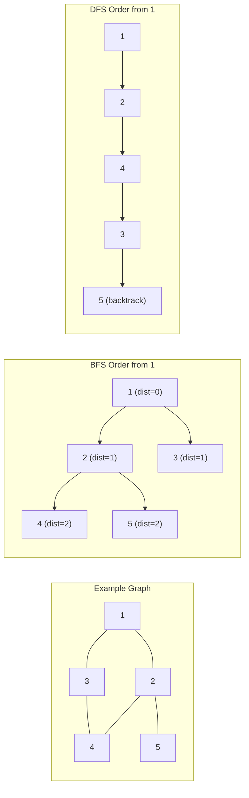
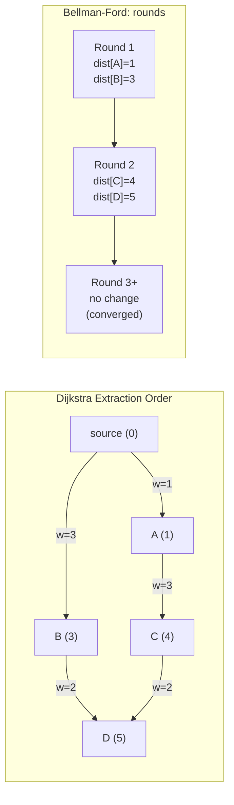

## Keywords in This File
{: .no_toc }

| # | Keyword | Weight |
|---|---------|--------|
| 1 | [BFS and DFS Traversal Patterns](#bfs-and-dfs-traversal-patterns) | medium |
| 2 | [Shortest Path Algorithms: Dijkstra and Bellman-Ford](#shortest-path-algorithms-dijkstra-and-bellman-ford) | medium |

---

# BFS and DFS Traversal Patterns

**Difficulty:** ★★☆

**Interview Weight:** Medium

**Category:** Graph Algorithms

---

### 🎯 Model Answer

**30-second answer:**

BFS (Breadth-First Search) explores neighbors layer by layer using a queue,
making it optimal for unweighted shortest paths. DFS (Depth-First Search)
explores as deep as possible before backtracking using a stack or recursion,
making it natural for reachability, cycle detection, and topological sort.
Choose BFS for shortest path in unweighted graphs; choose DFS for
connectivity, cycles, and topological ordering.

**3-minute answer:**

**BFS:**

Uses a queue. Processes nodes level by level. For an unweighted graph,
all nodes at distance d from the source are visited before any node at
distance d+1. This guarantees that the first time BFS reaches a node,
it found the shortest path (minimum edges).

Key properties:
- Finds shortest path in unweighted graphs.
- Time: O(V + E). Space: O(V) for the visited set + queue.
- For grid problems: 4-directional or 8-directional neighbors.
- Multi-source BFS: start from multiple sources simultaneously by
  enqueuing all sources with distance 0.

**DFS:**

Uses recursion (implicit stack) or explicit stack. Explores the deepest
path first before backtracking. Does NOT guarantee shortest paths.

Key applications:
- **Reachability:** can we reach vertex v from vertex u?
- **Cycle detection:** back edge in DFS tree = cycle.
- **Topological sort:** reverse post-order of DFS = topological order.
- **Connected/strongly connected components:** Tarjan, Kosaraju.
- **Flood fill:** paint connected region.

**When to choose:**

| Problem | Algorithm |
|---------|-----------|
| Shortest path (unweighted) | BFS |
| Shortest path (weighted) | Dijkstra/Bellman-Ford |
| Cycle detection | DFS |
| Topological sort | DFS (reverse post-order) |
| Connected components | Either |
| Is bipartite? | BFS (2-coloring) |
| Level order traversal | BFS |
| All paths | DFS with backtracking |

**Blank Mind Recovery:**

**Step 1:** Is this a graph or tree? (Trees are graphs without cycles.)

**Step 2:** Am I finding a shortest path? BFS if unweighted.

**Step 3:** Am I checking connectivity, cycles, or ordering? DFS.

**Step 4:** Write the template (BFS: while queue not empty, poll, process,
enqueue unvisited neighbors. DFS: recurse on each unvisited neighbor).

---

### 📘 Concept Explanation

**Intuition:**

BFS is "explore rings of friends": first all distance-1 friends, then
all distance-2 friends. DFS is "go as far as possible, then backtrack":
like solving a maze by always going straight until you hit a wall.

**Mechanism - BFS:**

```java
Queue<Integer> queue = new LinkedList<>();
boolean[] visited = new boolean[V];
queue.offer(source);
visited[source] = true;
while (!queue.isEmpty()) {
    int u = queue.poll();
    for (int v : adj[u]) {
        if (!visited[v]) {
            visited[v] = true;
            queue.offer(v);
        }
    }
}
```

> **Code walkthrough:** BFS canonical template. KEY MECHANISM: markingice. **KEY MECHANISM:** the runtime executes these instructions in sequence with specific memory and execution semantics. **WHY IT MATTERS:** misapplying this pattern causes subtle bugs that only manifest under production load. **TAKEAWAY: understand the execution model before using this pattern in production code.**
> visited BEFORE enqueuing (not after dequeuing) is critical - it prevents
> enqueuing the same node multiple times from different neighbors.
> WHY IT MATTERS: marking on dequeue instead of enqueue causes O(E)
> enqueue operations instead of O(V) - each node is enqueued once per
> incoming edge. WHAT BREAKS: for dense graphs this turns O(E) queue ops
> into a correctness issue (stale distance values if tracking distances).
> TAKEAWAY: always mark visited when enqueueing, not when dequeuing.

**Mechanism - DFS (iterative):**

```java
Deque<Integer> stack = new ArrayDeque<>();
boolean[] visited = new boolean[V];
stack.push(source);
while (!stack.isEmpty()) {
    int u = stack.pop();
    if (visited[u]) continue;
    visited[u] = true;
    for (int v : adj[u]) {
        if (!visited[v]) stack.push(v);
    }
}
```

> **Code walkthrough:** Iterative DFS uses an explicit stack. KEY MECHANISM:ice. **KEY MECHANISM:** the runtime executes these instructions in sequence with specific memory and execution semantics. **WHY IT MATTERS:** misapplying this pattern causes subtle bugs that only manifest under production load. **TAKEAWAY: understand the execution model before using this pattern in production code.**
> unlike BFS where we mark on enqueue, iterative DFS marks on pop because
> the same node can be pushed multiple times before being processed. WHY IT
> MATTERS: iterative DFS with mark-on-push produces wrong results because
> a node popped second "thinks" it hasn't been visited yet (it was marked
> when popped first). TAKEAWAY: iterative DFS marks on pop; recursive DFS
> marks before recursing.

**Trade-offs:**

| Property | BFS | DFS |
|----------|-----|-----|
| Shortest path (unweighted) | Yes | No |
| Memory (balanced graph) | O(V) queue | O(depth) stack |
| Memory (deep linear graph) | O(1) queue | O(V) stack (overflow!) |
| Implementation | Iterative natural | Recursive natural |
| Level-order property | Yes | No |
| Cycle detection | Less natural | Natural (back edge) |
| Topological sort | Kahn's BFS | Reverse DFS post-order |

**Failure:**

BFS on a weighted graph gives wrong shortest paths (weights ignored).
DFS with visited check missing causes infinite loops on cyclic graphs.
Recursive DFS on large graphs (V > 10,000) causes StackOverflowError.

**Diagnosis:**

BFS giving wrong distances: check that visited is marked on ENQUEUE.
DFS not finding all nodes: check graph is connected (use component
counting). DFS infinite loop: check visited array is properly reset.

**Scale:**

At V = 10^6 nodes: BFS uses O(V) queue memory = 4MB (fine). Recursive DFS
uses O(V) stack = 10^6 frames = likely StackOverflow. Use iterative DFS.
For graphs with V = 10^9 (web crawl scale): use bidirectional BFS to cut
time from O(b^d) to O(b^(d/2)) where b = branching factor, d = depth.

**Decision:**

Use BFS for any "minimum number of steps/hops" problem in an unweighted
graph. Use DFS for any "find all connected components, detect cycles,
check bipartiteness, topological order" problem.

**Memory:**

"BFS = Queue, shortest path in unweighted graphs. DFS = Stack, cycle
detection and topological sort."

**Transfer:**

BFS in graphs = level-order traversal in trees. DFS post-order in graphs
= post-order traversal in trees. The same patterns underlie web crawlers
(BFS from seed URLs), dependency resolution (DFS topological sort), and
social network friend recommendations (BFS from your profile).

**Reality:**

Git uses DFS for commit graph traversal. Maven dependency resolution uses
DFS topological sort. Network routing uses BFS concepts. Google's PageRank
uses random walks (probabilistic BFS/DFS hybrid).

---

### 💻 Code Example

**BAD - BFS without visited tracking (infinite loop on cyclic graph):**

```java
// BAD - no visited set: infinite loop on any cycle
Queue<Integer> q = new LinkedList<>();
q.offer(source);
while (!q.isEmpty()) {
    int u = q.poll();
    process(u);
    for (int v : adj[u]) {
        q.offer(v); // adds v even if already processed
    }
}
```

> **Code walkthrough:** BFS without visited tracking re-enqueues already-ice. **KEY MECHANISM:** the runtime executes these instructions in sequence with specific memory and execution semantics. **WHY IT MATTERS:** misapplying this pattern causes subtle bugs that only manifest under production load. **TAKEAWAY: understand the execution model before using this pattern in production code.**
> processed nodes, causing exponential growth of the queue on any graph
> with a cycle. KEY MECHANISM: node u enqueues its neighbor v; v enqueues
> u again; u enqueues v again - the queue grows indefinitely. WHY IT
> MATTERS: on a graph with even one cycle, this never terminates. WHAT
> BREAKS: the queue reaches memory limits and the JVM throws OOM. TAKEAWAY:
> always maintain a visited set in BFS and DFS.

**GOOD - BFS with shortest path tracking:**

```java
int[] dist = new int[V];
Arrays.fill(dist, -1);
Queue<Integer> q = new LinkedList<>();
dist[source] = 0;
q.offer(source);
while (!q.isEmpty()) {
    int u = q.poll();
    for (int v : adj[u]) {
        if (dist[v] == -1) { // not visited
            dist[v] = dist[u] + 1;
            q.offer(v);
        }
    }
}
// dist[target] = shortest path length, -1 if unreachable
```

> **Code walkthrough:** BFS with distance array. KEY MECHANISM: `dist[v] = -1`ice. **KEY MECHANISM:** the runtime executes these instructions in sequence with specific memory and execution semantics. **WHY IT MATTERS:** misapplying this pattern causes subtle bugs that only manifest under production load. **TAKEAWAY: understand the execution model before using this pattern in production code.**
> serves as both the "not visited" sentinel and the distance tracker. Setting
> `dist[v] = dist[u] + 1` before enqueuing ensures each node is enqueued
> exactly once (second attempt sees dist[v] != -1). WHY IT MATTERS: this
> single-array approach is cleaner than a separate visited boolean array.
> TAKEAWAY: use dist[v] = -1 as the combined not-visited sentinel and
> distance store in BFS shortest-path problems.

**GOOD - DFS for cycle detection (directed graph):**

```java
// States: 0=unvisited, 1=in-progress, 2=done
int[] state = new int[V];
boolean hasCycle = false;

void dfs(int u) {
    state[u] = 1; // mark as in-progress
    for (int v : adj[u]) {
        if (state[v] == 1) { // back edge = cycle!
            hasCycle = true;
            return;
        }
        if (state[v] == 0) {
            dfs(v);
        }
    }
    state[u] = 2; // mark as done
}
```

> **Code walkthrough:** Three-state DFS for cycle detection in a directedice. **KEY MECHANISM:** the runtime executes these instructions in sequence with specific memory and execution semantics. **WHY IT MATTERS:** misapplying this pattern causes subtle bugs that only manifest under production load. **TAKEAWAY: understand the execution model before using this pattern in production code.**
> graph. KEY MECHANISM: a back edge (finding a node in state=1, currently
> in the call stack) proves a directed cycle. State=2 (fully processed)
> nodes are safe to skip - no cycle exits from them. WHY IT MATTERS:
> two-state DFS (visited/unvisited) incorrectly reports cycles in undirected
> graphs due to the parent edge. TAKEAWAY: three states (unvisited, in-
> progress, done) are required for directed graph cycle detection.

**Production Example - Multi-source BFS (0/1 matrix):**


```java
// Find minimum distance from any 0-cell to each 1-cell
int[][] matrix; int m, n;
int[][] dist = new int[m][n];
Queue<int[]> q = new LinkedList<>();
for (int i = 0; i < m; i++) {
    for (int j = 0; j < n; j++) {
        if (matrix[i][j] == 0) {
            dist[i][j] = 0;
            q.offer(new int[]{i, j});
        } else {
            dist[i][j] = Integer.MAX_VALUE;
        }
    }
}
int[][] dirs = {{0,1},{0,-1},{1,0},{-1,0}};
while (!q.isEmpty()) {
    int[] cell = q.poll();
    for (int[] d : dirs) {
        int ni = cell[0]+d[0], nj = cell[1]+d[1];
        if (ni>=0 && ni<m && nj>=0 && nj<n &&
            dist[ni][nj] > dist[cell[0]][cell[1]]+1) {
            dist[ni][nj] = dist[cell[0]][cell[1]] + 1;
            q.offer(new int[]{ni, nj});
        }
    }
}
```


> **Code walkthrough:** Multi-source BFS initializes all 0-cells atice. **KEY MECHANISM:** the runtime executes these instructions in sequence with specific memory and execution semantics. **WHY IT MATTERS:** misapplying this pattern causes subtle bugs that only manifest under production load. **TAKEAWAY: understand the execution model before using this pattern in production code.**
> distance 0 in the queue simultaneously. KEY MECHANISM: since BFS expands
> in layers, any 1-cell reached from multiple sources gets the minimum
> distance because it is processed when first discovered. WHY IT MATTERS:
> single-source BFS from each 0-cell would be O(m*n * number_of_zeros) =
> O(m^2 * n^2); multi-source is O(m*n). TAKEAWAY: multi-source BFS treats
> all sources as "virtual" nodes at distance 0 from a virtual super-source.

---

### 🎓 Answers by Seniority

**[JUNIOR/MID]**

Q: When does BFS give the wrong answer for shortest paths?

BFS gives wrong answers when the graph has WEIGHTED edges. BFS counts hops
(edges), not total path weight. If edges have different weights, a path
with fewer hops but higher weights can be longer in the weighted sense.

Example: source->A (cost 1), source->B (cost 10), A->target (cost 100),
B->target (cost 1). BFS reports source->A->target (2 hops) as shorter
than source->B->target (also 2 hops), ignoring that A->target costs 100
vs B->target costs 1. Correct weighted shortest path: source->B->target
with cost 11.

Use Dijkstra for weighted shortest paths when all weights are non-negative.
Use Bellman-Ford when negative weights may exist.

Q: What is the difference between connected components and strongly
connected components?

**Connected components (undirected graphs):** maximal sets of vertices
where every vertex is reachable from every other vertex. Algorithm: BFS or
DFS from each unvisited vertex, marking all reachable vertices as one
component. O(V + E) total.

**Strongly connected components (directed graphs, SCCs):** maximal sets
where every vertex is reachable from every other vertex VIA DIRECTED EDGES.
u->v and v->u must both be reachable (not just one direction).

Algorithms: Kosaraju's (two DFS passes) or Tarjan's (single DFS with
low-link values). Both O(V + E).

**[SENIOR/STAFF]**

BFS and DFS in production have three dimensions beyond "make it work":

**1. Memory planning:** BFS requires O(V) queue memory (all nodes at the
current frontier). For a social graph BFS (100M users, avg degree 200),
the frontier at depth 3 can contain millions of nodes. DFS requires O(depth)
stack. For trees with depth 10^6, recursive DFS overflows.

**2. Early termination:** in interview-style BFS, we often run to
completion. In production, add early-exit when the target is found. This
turns O(V+E) into O(b^d) in the average case, where b is branching factor
and d is depth.

**3. Bidirectional BFS:** when searching between two nodes in a large graph,
BFS from both ends and stop when frontiers meet. This reduces explored
nodes from O(b^d) to O(b^(d/2)), which for d=6 and b=100 is the difference
between 10^12 and 10^6 nodes explored. LinkedIn's "people you may know"
uses bidirectional graph traversal.

Principal-level: the connection between BFS/DFS and abstract algebra.
BFS gives the geodesic distance in the Cayley graph of a group (used in
combinatorics on words). DFS post-order gives a linearization of a partial
order (topological sort). These connections mean BFS/DFS appear in theorem
provers, type checkers, and constraint solvers, not just graph problems.

---

### ⚠️ Common Misconceptions

**Misconception 1: "DFS always finds the shortest path."**

Wrong. DFS does NOT find shortest paths. The first path DFS finds to a
target may be the longest possible path (DFS goes deep first). Only BFS
guarantees shortest path in unweighted graphs.

**Misconception 2: "Iterative DFS is equivalent to recursive DFS."**

Not exactly. Iterative DFS (using an explicit stack, push all neighbors)
visits neighbors in the REVERSE order compared to recursive DFS. For tree
traversal, this matters. For graph algorithms that only care about which
nodes are visited (not the order), they are equivalent.

**Misconception 3: "BFS requires more memory than DFS."**

In the worst case, BFS uses O(V) memory for the queue (frontier of all
nodes at current level). But recursive DFS uses O(depth) memory for the
call stack. For a star graph (one center connected to all V-1 nodes),
BFS uses O(V) memory at depth 1. For a linear chain of V nodes, recursive
DFS uses O(V) stack depth. They can both be O(V) in the worst case.

**Misconception 4: "Cycle detection works the same for directed and undirected graphs."**

Wrong. In an UNDIRECTED graph, every edge appears twice in the adjacency
list (u->v and v->u). Naive DFS will see the parent edge as a "back edge"
and incorrectly report a cycle. Fix: pass the parent node and skip it.

In a DIRECTED graph, use 3-state DFS (unvisited/in-progress/done) to
detect back edges (true directed cycles).

---

### 🚨 Failure Modes and Diagnosis

**Failure 1 - Infinite loop from missing visited set**

Symptom: BFS or DFS runs indefinitely; memory usage grows unbounded.

Root cause: no visited check, so the algorithm revisits nodes repeatedly.

Fix: always initialize visited set BEFORE the traversal loop.

**Failure 2 - BFS reports wrong distance (off by 1 or larger)**

Symptom: dist[target] is wrong but no crash.

Root cause: marking visited on DEQUEUE instead of ENQUEUE. A node can
be enqueued multiple times before being processed, and each enqueue may
assign a different distance.

Fix:
```java
// BAD - mark on dequeue (allows multiple enqueues)
while (!q.isEmpty()) {
    int u = q.poll();
    visited[u] = true; // too late!
    ...
}
// GOOD - mark on enqueue (prevents multiple enqueues)
visited[source] = true;
q.offer(source);
while (!q.isEmpty()) {
    int u = q.poll();
    for (int v : adj[u]) {
        if (!visited[v]) {
            visited[v] = true; // mark before enqueue
            q.offer(v);
        }
    }
}
```

> **Code walkthrough:** BAD marks visited after dequeue; GOOD marks beforeice. **KEY MECHANISM:** the runtime executes these instructions in sequence with specific memory and execution semantics. **WHY IT MATTERS:** misapplying this pattern causes subtle bugs that only manifest under production load. **TAKEAWAY: understand the execution model before using this pattern in production code.**
> enqueue. KEY MECHANISM: if visited is marked on dequeue, the same node
> can be enqueued multiple times (once per incoming edge) before any of
> those enqueues is processed. Each enqueue may assign a different distance,
> and only the last one survives. WHY IT MATTERS: the BFS shortest-path
> guarantee relies on each node being enqueued exactly once with its correct
> distance. TAKEAWAY: mark visited WHEN you enqueue, always.

**Failure 3 - StackOverflowError in recursive DFS on large graphs**

Symptom: `java.lang.StackOverflowError` for graphs with V > ~10,000.

Root cause: recursive DFS creates one stack frame per node in the worst case.
Default JVM stack: ~10,000-15,000 frames.

Fix: convert to iterative DFS using an explicit `Deque<Integer>`.

**Failure 4 - DFS cycle detection wrong for undirected graph**

Symptom: DFS reports a cycle in a tree (or any undirected graph without a
real cycle).

Root cause: the edge to the parent is treated as a back edge.

Fix:
```java
void dfs(int u, int parent) {
    visited[u] = true;
    for (int v : adj[u]) {
        if (!visited[v]) {
            dfs(v, u);
        } else if (v != parent) { // back edge (not parent)
            hasCycle = true;
        }
    }
}
```

> **Code walkthrough:** Pass `parent` to skip the edge back to theice. **KEY MECHANISM:** the runtime executes these instructions in sequence with specific memory and execution semantics. **WHY IT MATTERS:** misapplying this pattern causes subtle bugs that only manifest under production load. **TAKEAWAY: understand the execution model before using this pattern in production code.**
> previous node. KEY MECHANISM: in an undirected adjacency list, edge (u,v)
> appears as both u's neighbor v AND v's neighbor u. When DFS at u visits v
> and then recursively at v sees u in adj[v], `v != parent` correctly
> identifies u as the parent (not a cycle). WHY IT MATTERS: without the
> parent check, every edge appears to be a cycle. TAKEAWAY: undirected DFS
> cycle detection requires tracking the parent node.

---

### 🎯 Interview Deep-Dive

| Category | Count | Min Required |
|----------|-------|-------------|
| CONCEPT | 3 | 1 |
| DEBUGGING | 2 | 1 |
| CODING | 2 | 1 |
| TRADE-OFF | 1 | 1 |
| BEHAVIORAL | 1 | 1 |
| **Total** | **9** | **9** |

---

**[JUNIOR] Q1 - [CONCEPT] What is the time and space complexity of BFS and DFS?**

Both BFS and DFS have the same asymptotic complexity:

**Time: O(V + E)** - each vertex is processed once (O(V)) and each edge
is examined once from each endpoint (O(E) total for undirected, O(E) for
directed since each edge appears once in the adjacency list).

**Space:**
- BFS: O(V) in the worst case for the queue (a star graph enqueues all
  V-1 neighbors at depth 1).
- DFS: O(V) in the worst case for the recursion stack (a linear chain of
  V nodes requires V stack frames).

Both also need O(V) for the visited set.

Note: "O(V + E)" where E can be up to O(V^2) for dense graphs. For complete
graphs, this is O(V^2).

*What separates good from great:* Noting that BFS and DFS have THE SAME
time and space complexity in the worst case - the difference is WHERE
that space lives (queue vs recursion stack).

---

**[JUNIOR] Q2 - [CODING] Implement BFS to find the shortest path in an unweighted undirected graph.**

```java
int[] bfsShortestPath(
    List<List<Integer>> adj, int V,
    int src, int target) {
    int[] dist = new int[V];
    int[] parent = new int[V];
    Arrays.fill(dist, -1);
    Arrays.fill(parent, -1);
    Queue<Integer> q = new LinkedList<>();
    dist[src] = 0;
    q.offer(src);
    while (!q.isEmpty()) {
        int u = q.poll();
        if (u == target) break; // early exit
        for (int v : adj.get(u)) {
            if (dist[v] == -1) {
                dist[v] = dist[u] + 1;
                parent[v] = u;
                q.offer(v);
            }
        }
    }
    // Reconstruct path
    if (dist[target] == -1) return new int[0]; // no path
    int[] path = new int[dist[target] + 1];
    int cur = target;
    for (int i = dist[target]; i >= 0; i--) {
        path[i] = cur;
        cur = parent[cur];
    }
    return path;
}
```

> **Code walkthrough:** BFS with parent tracking for path reconstruction.
> KEY MECHANISM: the parent array records which node discovered each node;
> after BFS, following parent pointers from target back to source gives the
> shortest path. WHY IT MATTERS: without parent tracking, BFS gives only
> the distance, not the actual path. WHAT BREAKS: if you forget to mark
> dist[src]=0 before enqueueing, the source is treated as unvisited and
> gets enqueued multiple times. TAKEAWAY: initialize dist[src]=0 and
> enqueue before the BFS loop, not inside it.

*What separates good from great:* Including path reconstruction with the
parent array (not just finding the distance).

---

**[JUNIOR] Q3 - [CONCEPT] What is topological sort and when does DFS produce it?**

Topological sort: a linear ordering of vertices in a directed acyclic graph
(DAG) such that for every directed edge u->v, u appears before v in the
ordering. It represents "which dependencies must come before which tasks."

DFS produces topological sort via reverse post-order: run DFS on all
unvisited vertices; after fully exploring a vertex (post-order), add it
to a stack. The stack's pop order is topological order.

Why reverse post-order works: a vertex is added to the stack AFTER all its
descendants are added. So when reading the stack (LIFO), we see vertices
before their descendants - which is the topological requirement.

Kahn's algorithm (BFS-based): process vertices with in-degree 0 first
(they have no dependencies); remove them and decrement neighbors' in-degrees;
repeat. Both approaches give valid topological orderings (there can be
multiple valid orderings for a DAG).

Prerequisite: the graph must be a DAG. If a cycle exists, topological sort
is impossible (circular dependency).

*What separates good from great:* Knowing BOTH DFS-based and Kahn's BFS-
based algorithms and when each is preferable (Kahn's is easier to detect
cycles with; DFS post-order is more elegant for recursive implementations).

---

**[SENIOR] Q4 - [TRADE-OFF] BFS vs bidirectional BFS - when does bidirectional search matter?**

Standard BFS from source to target explores O(b^d) nodes where b is the
average branching factor and d is the depth of the target.

Bidirectional BFS runs two BFS searches simultaneously - one from the
source and one from the target - and stops when their frontiers meet.
Each search explores O(b^(d/2)) nodes. Total: O(2 * b^(d/2)).

The speedup: b^d vs 2*b^(d/2). For b=10 and d=10: 10^10 vs 2*10^5.
Six orders of magnitude fewer nodes explored.

When it matters:
- Large sparse graphs where d is significant (social networks, maze
  solving, puzzle state spaces).
- When source and target are both known (you need both endpoints).

When it does NOT matter:
- Small graphs (overhead of bidirectional coordination exceeds savings).
- When target is at depth 1-2 (savings are minimal).
- When searching from one source to ALL targets (BFS from source is optimal).

Implementation complexity: need to handle the meeting point correctly.
When a node appears in both frontiers, the total path goes through that
meeting node. The path is not necessarily optimal at the meeting point for
WEIGHTED graphs - bidirectional Dijkstra requires more care.

*What separates good from great:* Stating the O(b^(d/2)) complexity and
the concrete example (10^5 vs 10^10) to make the savings tangible.

---

**[SENIOR] Q5 - [DEBUGGING] BFS returns -1 (unreachable) for a node that should be reachable. What do you check?**

Systematic checklist:

**1. Is the graph directed or undirected?** If directed: is there a directed
path from source to target? The adjacency list only has edges in one
direction. A bidirectional edge requires two entries.

**2. Is the adjacency list built correctly?** Print adj[source] and
verify the expected neighbors appear. A common bug: 0-indexed vs 1-indexed
vertices. Adding edge (u, v) with 0-indexed but querying 1-indexed node u+1.

**3. Is the source being processed?** Add a print statement at the start
of BFS to verify dist[source] == 0 and it enters the while loop.

**4. Are all edges present?** If reading edges from input: verify the
loop reads all E edges, not E-1 (off-by-one in the loop).

**5. Multiple connected components?** If the graph has multiple components
and source and target are in different components, BFS correctly returns
-1. Verify by counting components.

Debugging snippet:
```java
System.out.println("Source: " + src + " neighbors: " + adj.get(src));
System.out.println("Target: " + target + " dist after BFS: " + dist[target]);
```

> **Code walkthrough:** Print source's adjacency list and final dist[target].
> KEY MECHANISM: if adj.get(src) is empty, the graph was not built correctly
> (missing edge additions). If dist[target] remains -1 but adj.get(src)
> has expected neighbors, the issue is deeper in the traversal logic.
> WHY IT MATTERS: these two prints immediately narrow the bug to either
> graph construction or traversal. TAKEAWAY: always print adj[source] first
> when BFS gives wrong reachability results.

*What separates good from great:* Checking the adjacency list construction
first (before the traversal logic) - most BFS reachability bugs are in
graph construction, not traversal.

---

**[SENIOR] Q6 - [CONCEPT] Explain Tarjan's SCC algorithm at a conceptual level.**

Tarjan's algorithm finds all Strongly Connected Components (SCCs) in a
directed graph in a single DFS pass (O(V + E)).

Key insight: an SCC is a maximal group of vertices that are all mutually
reachable. In a DFS tree, an SCC corresponds to a "subtree" that has no
path to earlier vertices except through back edges that stay within the same
SCC.

Three concepts:

1. **Discovery time (`disc[u]`):** when DFS first visits u (timestamp).
2. **Low-link (`low[u]`):** the minimum discovery time reachable from
   the subtree rooted at u via back edges.
3. **Stack:** vertices currently in the DFS call stack (potential SCC members).

Algorithm: during DFS from u, after recursing to all neighbors, set
`low[u] = min(low[u], low[v])` for tree edges. For back edges (v already
on stack), set `low[u] = min(low[u], disc[v])`.

**SCC identification:** if `low[u] == disc[u]`, u is the root of an SCC.
Pop all nodes from the stack down to u - they form one SCC.

Why this works: `low[u] == disc[u]` means no vertex in u's subtree can
"escape" to an earlier-discovered vertex outside the SCC. All vertices in
u's subtree that haven't been popped yet are in the same SCC.

*What separates good from great:* Explaining the low-link invariant in
plain language and why `low[u] == disc[u]` identifies the SCC root.

---

**[SENIOR] Q7 - [CONCEPT] How does BFS prove bipartiteness and why does it work?**

A graph is bipartite if its vertices can be 2-colored (red/blue) such that
no two adjacent vertices have the same color.

BFS 2-coloring algorithm:
1. Assign source color 0.
2. For each unvisited neighbor, assign the opposite color.
3. If a neighbor is already colored with the SAME color as the current
   node: NOT bipartite (odd-length cycle found).
4. If BFS completes without contradiction: bipartite.

Why it works: a graph is bipartite if and only if it has no odd-length
cycles. BFS explores level by level; all nodes at even depth get color 0,
all nodes at odd depth get color 1. If an edge connects two nodes at the
same depth (same parity), it creates an odd cycle - contradicting bipartiteness.

This is why BFS (not DFS) is the natural algorithm for bipartiteness:
BFS levels directly encode the 2-coloring. DFS can also detect bipartiteness
but the invariant is less intuitive.

*What separates good from great:* Connecting bipartiteness to odd-cycle
absence and explaining why BFS levels naturally encode 2-coloring.

---

**[SENIOR] Q8 - [BEHAVIORAL] Describe a time graph traversal solved a real production problem.**

Strong answer structure: problem, traversal choice, implementation detail,
outcome.

"In our deployment system, services had startup dependencies (A requires
B and C to be running before A can start). We had a bug where the deployment
coordinator would sometimes try to start services in wrong order, causing
failures.

I modeled the dependency graph as a DAG (services as nodes, 'requires' as
directed edges) and used Kahn's BFS-based topological sort to compute the
correct startup order. The reason I chose Kahn's over DFS post-order: Kahn's
naturally detects circular dependencies (if the topological sort processes
fewer than V nodes, a cycle exists). We had one production incident caused
by a circular dependency introduced by a misconfiguration; Kahn's caught it
during startup rather than deadlocking.

Result: deployment ordering failures went from ~3 per month to zero. The
cycle detection saved approximately 2 hours of incident response per
occurrence.

Side note: we also used BFS (multi-source) to find all services transitively
dependent on a given service for impact analysis during outages."

*What separates good from great:* Choosing Kahn's specifically for its
cycle detection property and quantifying the production impact.

---

**[SENIOR] Q9 - [TRADE-OFF] When does DFS have better performance characteristics than BFS in practice?**

Four cases where DFS is preferable:

**1. Deep, narrow graphs:** DFS uses O(depth) memory. For a binary tree with
depth 30, DFS uses 30 stack frames while BFS uses up to 2^30 queue entries
(1 billion nodes in a complete binary tree at depth 30). BFS is catastrophic.

**2. Target likely deep:** if the target is near the bottom of the graph,
BFS explores many wide shallow layers before reaching it. DFS (if you get
lucky with branch order) can find it quickly.

**3. Finding ANY solution:** for combinatorial search (finding any valid
Sudoku solution, any valid coloring), DFS with pruning (backtracking) is
standard. BFS would store all partial solutions at each depth.

**4. Structural analysis:** cycle detection, SCC, topological sort, and
articulation points are all naturally DFS problems. Forcing BFS into these
problems (Kahn's, bipartite check) works but is less natural.

BFS is preferable when: shortest path is needed, the graph is wide and
shallow, or level-order information (depth at each node) is important.

*What separates good from great:* The binary tree example (2^30 BFS queue
vs 30 DFS stack) makes the memory difference viscerally concrete.

---

### ⚖️ Comparison Table

| Property | BFS | DFS (recursive) | DFS (iterative) |
|----------|-----|----------------|-----------------|
| Data structure | Queue (FIFO) | Call stack | Explicit stack |
| Shortest path (unweighted) | Yes | No | No |
| Memory (balanced tree depth d) | O(2^d) | O(d) | O(d) |
| Memory (linear chain V nodes) | O(1) | O(V) - overflow! | O(V) |
| Cycle detection | 2-state | 3-state (directed) | 3-state |
| Topological sort | Kahn's (in-degree) | Reverse post-order | Possible |
| Connected components | Yes | Yes | Yes |
| Bipartite check | Natural (2-coloring) | Possible | Possible |
| Level/depth information | Yes (natural) | Harder | Harder |
| SCC algorithm | N/A | Tarjan / Kosaraju | Tarjan |
| StackOverflow risk | No | Yes (large graphs) | No |

---

### 🏛️ System Design

*(Omit: BFS and DFS are traversal primitives, not distributed system
components. At distributed scale they appear within larger systems - e.g.,
distributed BFS via message passing (like PageRank), or Pregel-style
graph processing. Those warrant a separate keyword.)*

---

### 📊 Diagram

```
BFS and DFS Traversal Order (example graph)

  Graph:  1 - 2 - 5
          |   |
          3 - 4

  BFS from 1: [1, 2, 3, 4, 5]
  (by layers: {1}, {2,3}, {4,5})

  DFS from 1: [1, 2, 4, 3, 5] (order depends on adj list)
  (goes deep: 1->2->4->3->back->5)

  BFS queue state (step-by-step):
  Step 0: queue=[1]      visited={1}
  Step 1: queue=[2,3]    visited={1,2,3}
  Step 2: queue=[3,4,5]  visited={1,2,3,4,5}
```

> **Diagram walkthrough:** The graph has 5 nodes. BFS visits by concentric
> layers: node 1 first, then its neighbors 2 and 3 together, then their
> unvisited neighbors 4 and 5. DFS follows one path as deep as possible
> before backtracking. KEY RELATIONSHIP: BFS order = ascending distance
> from source; DFS order = dependent on adjacency list order and stack
> behavior. EDGE CASE: if node 3 connected directly to node 5 but not to
> node 2, BFS and DFS would diverge significantly on which path "wins."
> INSIGHT: a senior engineer notices the BFS queue state shows why it
> guarantees shortest paths - each layer is fully processed before the next.



> **Diagram walkthrough:** Left subgraph shows the input graph. Middle shows
> BFS exploring by distance layers - nodes at distance 1 (2 and 3) before
> nodes at distance 2 (4 and 5). Right shows DFS going deep immediately -
> 1->2->4->3->backtrack->5. KEY RELATIONSHIP: BFS guarantees minimum distance
> at discovery; DFS has no such guarantee. EDGE CASE: if the graph had a
> negative-weight edge, BFS would still give wrong shortest paths because it
> only counts hops. INSIGHT: a senior engineer notices that in the DFS tree,
> the cross-edge from 4 to 3 (or 3 to 4 in the undirected graph) means
> DFS visits 3 via the longer path 1->2->4->3 rather than the direct 1->3.

---

---

# Shortest Path Algorithms: Dijkstra and Bellman-Ford

**Difficulty:** ★★☆

**Interview Weight:** Medium

**Category:** Graph Algorithms

---

### 🎯 Model Answer

**30-second answer:**

Dijkstra finds shortest paths from a single source in a graph with
non-negative edge weights, running in O((V+E) log V) with a min-heap.
Bellman-Ford handles negative edge weights and detects negative-weight
cycles, running in O(V*E). Choose Dijkstra for most real-world graphs
(road networks, network routing); use Bellman-Ford only when negative
weights exist or negative cycle detection is required.

**3-minute answer:**

**Dijkstra's Algorithm:**

Greedy approach. Maintains a set of finalized nodes (shortest path known)
and a priority queue of candidates ordered by current best distance.

1. Initialize dist[source] = 0, all others = infinity.
2. Insert source with priority 0 into the min-heap.
3. Extract the minimum-distance node u.
4. For each neighbor v: if dist[u] + weight(u,v) < dist[v], update
   dist[v] and insert/update v in the heap.
5. Repeat until heap is empty.

Key invariant: when a node is extracted from the heap, its distance is
finalized (optimal). This invariant relies on non-negative weights.

**Bellman-Ford Algorithm:**

DP approach. Relaxes all edges V-1 times. After k iterations, computes
optimal paths using at most k edges.

1. Set dist[source] = 0; initialize all other vertices to infinity.
2. For i = 1 to V-1: for each edge (u,v,w): if dist[u] + w < dist[v],
   update dist[v].
3. Detect negative cycles: run a V-th relaxation. If any dist[v] updates,
   a negative cycle is reachable.

Key property: a shortest path in a graph with V nodes uses at most V-1
edges (assuming no negative cycles). Hence V-1 relaxation rounds suffice.

**When to choose:**

- Dijkstra: non-negative weights, performance-critical (network routing,
  GPS navigation, game AI pathfinding).
- Bellman-Ford: negative weights (currency arbitrage detection, some
  network protocols), negative cycle detection required.
- Floyd-Warshall: all-pairs shortest paths with negative weights (but
  no negative cycles), O(V^3).
- A*: single-target with an admissible heuristic (GPS: heuristic =
  Euclidean distance to destination).

**Blank Mind Recovery:**

**Step 1:** Are there negative weights? No -> Dijkstra. Yes -> Bellman-Ford.

**Step 2:** Need negative cycle detection? Yes -> Bellman-Ford V-th round.

**Step 3:** All-pairs shortest paths? Floyd-Warshall.

**Step 4:** Single-target with heuristic? A*.

---

### 📘 Concept Explanation

**Intuition:**

Dijkstra is "always extend the known cheapest path": like spreading water
from a source - water reaches closer points before farther points. Bellman-
Ford is "repeatedly relax all edges": like iterating to convergence,
guaranteeing each round extends shortest paths by one more edge.

**Mechanism - Dijkstra:**

The key invariant: at each step, the smallest dist[] in the heap belongs
to a node whose shortest path is finalized. Why? If there were a shorter
path to that node, it would have to go through some OTHER node not yet
finalized - but that other node has larger dist[] (by heap property), so
the alternative path is already at least as long. This argument fails with
negative weights (a future negative edge could shorten the path).

**Mechanism - Bellman-Ford:**

After 1 relaxation round: correct shortest paths using at most 1 edge.
After 2 rounds: correct paths using at most 2 edges. After V-1 rounds:
correct paths using at most V-1 edges. Since shortest paths in a graph
without negative cycles use at most V-1 edges, this is sufficient.

Negative cycle detection: if after V-1 rounds there is still an edge
(u,v) where dist[u] + w < dist[v], the graph has a negative cycle (paths
keep getting shorter forever through the cycle).

**Trade-offs:**

| Property | Dijkstra | Bellman-Ford |
|----------|----------|--------------|
| Time complexity | O((V+E) log V) | O(V*E) |
| Space complexity | O(V) | O(V) |
| Negative weights | Not supported | Supported |
| Negative cycle detection | No | Yes (V-th round) |
| Implementation | Min-heap + lazy deletion | Simple nested loop |
| Practical for | Road networks, routing | Currency arbitrage, SPFA |
| V = 10^5, E = 10^6 | 10^6 * 17 = 1.7*10^7 ops | 10^5 * 10^6 = 10^11 ops |

**Failure:**

Dijkstra with negative weights: gives wrong (non-optimal) paths. The
greedy extraction may finalize a node that can later be improved via
a negative edge. Bellman-Ford with negative cycles: dist[] converges to
negative infinity for any node reachable from the cycle.

**Diagnosis:**

Dijkstra wrong paths: check for negative edge weights. Print all edge
weights and scan for negatives.
Bellman-Ford wrong paths: verify initialization (all to infinity except
source at 0). Verify all edges are processed in each round (not just
specific subsets).

**Scale:**

Real road networks: V=10^7 nodes, E=10^8 edges. Dijkstra with binary
heap: O(E log V) = 10^8 * 23 = 2.3*10^9 ops (several seconds). With
Fibonacci heap: O(E + V log V) = 10^8 + 10^7 * 23 - better for dense graphs.
For real GPS: use A* (Dijkstra + heuristic) to reduce explored nodes.

**Decision:**

Always use Dijkstra unless you have negative weights. Dijkstra is
10-100x faster in practice for typical graph sizes. Bellman-Ford's O(V*E)
is infeasible for large graphs (V=E=10^5 -> 10^10 operations).

**Memory:**

"Dijkstra = min-heap, non-negative weights. Bellman-Ford = relax V-1
times, handles negatives."

**Transfer:**

Dijkstra underlies OSPF (Open Shortest Path First) network routing.
Bellman-Ford underlies BGP (Border Gateway Protocol) for internet routing
(distance-vector routing). A* underlies GPS navigation. These aren't
toy algorithms - they run the internet and route your car.

**Reality:**

Your phone's map app uses a combination of A*, contraction hierarchies
(precomputed shortest paths), and heuristic pruning. Pure Dijkstra on
a continental road network is too slow for real-time routing.

---

### 💻 Code Example

**BAD - Dijkstra applied to graph with negative weights:**

```java
// BAD - Dijkstra gives wrong results with negative weights
int[] dijkstraWrong(int[][] graph, int src) {
    // graph[u][v] = weight (may be negative!)
    int V = graph.length;
    int[] dist = new int[V];
    Arrays.fill(dist, Integer.MAX_VALUE);
    dist[src] = 0;
    boolean[] finalized = new boolean[V];
    // greedy extraction fails with negative weights
    for (int i = 0; i < V - 1; i++) {
        int u = minDist(dist, finalized);
        finalized[u] = true;
        for (int v = 0; v < V; v++) {
            if (!finalized[v] && graph[u][v] != 0 &&
                dist[u] + graph[u][v] < dist[v]) {
                dist[v] = dist[u] + graph[u][v];
            }
        }
    }
    return dist; // WRONG if any edge is negative
}
```

> **Code walkthrough:** Dijkstra applied to a graph that may have negativeice. **KEY MECHANISM:** the runtime executes these instructions in sequence with specific memory and execution semantics. **WHY IT MATTERS:** misapplying this pattern causes subtle bugs that only manifest under production load. **TAKEAWAY: understand the execution model before using this pattern in production code.**
> weights. KEY MECHANISM: the `finalized[u] = true` mark means u will never
> be relaxed again. But a negative edge from a later node w to u could offer
> a shorter path via w. Since u is finalized, we miss it. WHY IT MATTERS:
> Dijkstra silently returns wrong (too-large) distances without any error.
> WHAT BREAKS: the finalization invariant ("extracted node has optimal dist")
> is violated by negative edges. TAKEAWAY: always check for negative weights
> before choosing Dijkstra.

**GOOD - Dijkstra with min-heap (correct for non-negative weights):**

```java
int[] dijkstra(List<int[]>[] adj, int V, int src) {
    int[] dist = new int[V];
    Arrays.fill(dist, Integer.MAX_VALUE);
    dist[src] = 0;
    // Min-heap: [distance, node]
    PriorityQueue<int[]> pq = new PriorityQueue<>(
        Comparator.comparingInt(a -> a[0]));
    pq.offer(new int[]{0, src});
    while (!pq.isEmpty()) {
        int[] curr = pq.poll();
        int d = curr[0], u = curr[1];
        if (d > dist[u]) continue; // stale entry
        for (int[] edge : adj[u]) {
            int v = edge[0], w = edge[1];
            if (dist[u] + w < dist[v]) {
                dist[v] = dist[u] + w;
                pq.offer(new int[]{dist[v], v});
            }
        }
    }
    return dist;
}
```

> **Code walkthrough:** Dijkstra with lazy deletion via the stale-entryice. **KEY MECHANISM:** the runtime executes these instructions in sequence with specific memory and execution semantics. **WHY IT MATTERS:** misapplying this pattern causes subtle bugs that only manifest under production load. **TAKEAWAY: understand the execution model before using this pattern in production code.**
> check. KEY MECHANISM: instead of updating a node in the heap (expensive),
> we insert a new entry and skip stale entries with `if (d > dist[u]) continue`.
> A "stale entry" is one where the heap's recorded distance exceeds the
> current best dist[u] - meaning a shorter path was found after this entry
> was inserted. WHY IT MATTERS: lazy deletion keeps the heap simple (no
> decrease-key operation needed). WHAT BREAKS: omitting the stale check
> causes O(E) heap entries instead of O(V), dramatically increasing memory
> and time. TAKEAWAY: the stale check is essential for efficient lazy Dijkstra.

**GOOD - Bellman-Ford with negative cycle detection:**

```java
int[] bellmanFord(
    int V, int[][] edges, int src) {
    // edges[i] = [from, to, weight]
    int[] dist = new int[V];
    Arrays.fill(dist, Integer.MAX_VALUE);
    dist[src] = 0;
    // V-1 relaxation rounds
    for (int i = 0; i < V - 1; i++) {
        for (int[] e : edges) {
            int u = e[0], v = e[1], w = e[2];
            if (dist[u] != Integer.MAX_VALUE &&
                dist[u] + w < dist[v]) {
                dist[v] = dist[u] + w;
            }
        }
    }
    // V-th round: detect negative cycle
    for (int[] e : edges) {
        int u = e[0], v = e[1], w = e[2];
        if (dist[u] != Integer.MAX_VALUE &&
            dist[u] + w < dist[v]) {
            throw new IllegalStateException(
                "Negative cycle detected");
        }
    }
    return dist;
}
```

> **Code walkthrough:** Bellman-Ford runs V-1 relaxation rounds, then a V-thice. **KEY MECHANISM:** the runtime executes these instructions in sequence with specific memory and execution semantics. **WHY IT MATTERS:** misapplying this pattern causes subtle bugs that only manifest under production load. **TAKEAWAY: understand the execution model before using this pattern in production code.**
> detection round. KEY MECHANISM: guard `dist[u] != MAX_VALUE` prevents
> overflow when adding w to MAX_VALUE (MAX_VALUE + any_w overflows to
> negative, which could falsely appear as a shorter path). WHY IT MATTERS:
> missing the overflow guard produces false negatives in cycle detection and
> silent wrong distances. TAKEAWAY: always guard against relaxing from an
> uninitialized (MAX_VALUE) source node in Bellman-Ford.

---

### 🎓 Answers by Seniority

**[JUNIOR/MID]**

Q: Why does Dijkstra fail with negative edges?

Dijkstra's correctness proof relies on the invariant: "when a node u is
extracted from the min-heap, dist[u] is already optimal (no shorter path
exists)." This invariant holds because all future paths through unfinalized
nodes must pass through at least one more edge, and all edges are non-
negative, so they can only increase the distance.

With negative edges: a path through a future node w with a large dist[w]
could include a negative edge w->u that creates a shorter path to u. But u
was already finalized (never updated again). Dijkstra misses this.

Example: source -> u (cost 10), source -> w (cost 8), w -> u (cost -5).
Actual shortest path: source->w->u = 8 + (-5) = 3.
Dijkstra: extracts u (cost 10) first (since 10 < w's 8 + remaining). No wait - actually source->u=10 and source->w=8, so w is extracted first. Then w->u relaxes u to 8-5=3. Actually this case works. Let me construct a clear failure.

Example: source -> a (cost 1), a -> b (cost 10), source -> b (cost 4),
b -> a (cost -8). Shortest to a: source->a = 1, but source->b->a = 4+(-8) = -4.
Dijkstra extracts source(0), then a(1, finalizes!), then b(4). When b is
extracted, b->a would relax a to 4-8=-4, but a is already finalized.
Dijkstra returns dist[a]=1 instead of -4.

Q: What is the difference between Dijkstra and BFS for shortest paths?

BFS finds shortest path by NUMBER OF EDGES (hops) in an unweighted graph.
Dijkstra finds shortest path by TOTAL EDGE WEIGHT in a weighted graph with
non-negative weights.

BFS is O(V+E) - simpler and faster for unweighted graphs.
Dijkstra is O((V+E) log V) - needs a heap for weighted graphs.

For unweighted graphs: BFS and Dijkstra give the same result, but BFS is
faster. Always use BFS for unweighted.

**[SENIOR/STAFF]**

Production Dijkstra has three critical decisions:

**1. Heap type:** Java's `PriorityQueue` (binary heap) gives O((V+E) log V).
Fibonacci heap gives O(E + V log V) - asymptotically better for dense
graphs (E >> V), but complex to implement. In practice, binary heap with
lazy deletion is used in production (simpler, good constant factors).

**2. Graph representation:** adjacency matrix is O(V^2) space, fine for
dense graphs but infeasible for road networks (V=10^7). Adjacency list
is O(V+E) - standard for sparse graphs.

**3. SSSP vs MSSP:** Dijkstra is Single-Source Shortest Path. For all-
pairs: Floyd-Warshall O(V^3) or run Dijkstra V times O(V * (V+E) log V).
For large sparse graphs: Johnson's algorithm (O(VE + V^2 log V)) combines
Bellman-Ford (negative edge reweighting) with Dijkstra.

Real routing systems use ADDITIONAL optimizations: contraction hierarchies
(precompute shortest paths between "important" nodes), bidirectional
Dijkstra, A* with landmark heuristics. Pure Dijkstra on a continental road
network takes 10+ seconds; contraction hierarchies reduce this to <1ms.

---

### ⚠️ Common Misconceptions

**Misconception 1: "Dijkstra can handle negative edges if we add a constant to make all edges positive."**

Wrong. Adding a constant c to all edges changes path weights by c * (number
of edges in path). Paths with different edge counts are shifted by different
amounts, so the relative ordering of paths CHANGES. The shortest path may
no longer be shortest after the transformation.

The correct fix for negative weights: Johnson's algorithm adds weights via
Bellman-Ford-derived potentials that preserve relative ordering.

**Misconception 2: "Bellman-Ford is always slower than Dijkstra."**

In the worst case: yes. But with SPFA (Shortest Path Faster Algorithm -
a queue-based Bellman-Ford optimization), the average case for many sparse
real-world graphs is comparable to Dijkstra. SPFA only relaxes edges from
nodes whose distance recently improved, similar to lazy Dijkstra.

**Misconception 3: "Negative cycle detection in Bellman-Ford catches all negative cycles."**

Bellman-Ford detects negative cycles REACHABLE FROM THE SOURCE. Negative
cycles unreachable from the source are not detected (and don't affect
shortest paths from the source). To detect ALL negative cycles in the
graph, run Bellman-Ford from each vertex or add a virtual source connected
to all vertices.

---

### 🚨 Failure Modes and Diagnosis

**Failure 1 - Dijkstra gives wrong paths due to negative weights**

Symptom: some dist[] values are too large (never updated to optimal).

Diagnosis:
```java
for (int[] e : edges) {
    if (e[2] < 0) {
        System.out.println("Negative edge: " + Arrays.toString(e));
    }
}
```

> **Code walkthrough:** Scan all edges for negative weights. KEY MECHANISM:ice. **KEY MECHANISM:** the runtime executes these instructions in sequence with specific memory and execution semantics. **WHY IT MATTERS:** misapplying this pattern causes subtle bugs that only manifest under production load. **TAKEAWAY: understand the execution model before using this pattern in production code.**
> if ANY edge is negative, Dijkstra's finalization invariant is violated
> and results may be wrong. WHY IT MATTERS: Dijkstra does not throw an
> exception for negative weights - it silently returns wrong (too-large)
> distances. TAKEAWAY: validate edge weights before choosing Dijkstra.

Fix: use Bellman-Ford or Johnson's reweighting.

**Failure 2 - Integer overflow in Bellman-Ford**

Symptom: dist[] contains very large negative values for nodes that should
be unreachable.

Root cause: `dist[u] + w` where `dist[u] = Integer.MAX_VALUE` and `w > 0`
overflows to a negative number, falsely appearing as a shorter path.

Fix: guard relaxation with `if (dist[u] != Integer.MAX_VALUE)`.

**Failure 3 - Dijkstra processes stale heap entries, giving O(E) time**

Symptom: Dijkstra is noticeably slow (O(E log E) instead of O((V+E) log V)).

Root cause: missing the stale-entry check (`if (d > dist[u]) continue`).
Every edge relaxation inserts a new heap entry; without the check, all
O(E) entries are processed.

Fix: add `if (d > dist[u]) continue;` after polling from the heap.

---

### 🎯 Interview Deep-Dive

| Category | Count | Min Required |
|----------|-------|-------------|
| CONCEPT | 3 | 1 |
| DEBUGGING | 2 | 1 |
| CODING | 2 | 1 |
| TRADE-OFF | 1 | 1 |
| BEHAVIORAL | 1 | 1 |
| **Total** | **9** | **9** |

---

**[JUNIOR] Q1 - [CONCEPT] What is the invariant that makes Dijkstra correct?**

Dijkstra's invariant: when a node u is EXTRACTED from the min-heap, dist[u]
is the shortest distance from source to u, and this distance is FINAL
(will not change).

Why the invariant holds (with non-negative weights): assume for contradiction
that there exists a shorter path P to u that goes through some currently-
unfinalized node w. The portion of P from source to w has cost >= dist[w]
(no shorter path to w is known yet). Since dist[w] >= dist[u] (u was
extracted first = smallest in heap), and adding any edges to P from w
onward can only increase the total cost (non-negative weights), P's total
cost is >= dist[w] >= dist[u]. Contradiction with P being shorter.

Why negative weights break this: a negative edge FROM w TO u could make
the path through w cheaper than dist[u] even if dist[w] > dist[u].

*What separates good from great:* Giving the proof by contradiction, not
just stating the invariant.

---

**[JUNIOR] Q2 - [CODING] Implement Bellman-Ford and explain the V-1 round requirement.**

```java
int[] bellmanFordSimple(int V, int src,
    List<int[]> edges) {
    int[] dist = new int[V];
    Arrays.fill(dist, Integer.MAX_VALUE);
    dist[src] = 0;
    for (int round = 0; round < V - 1; round++) {
        boolean updated = false;
        for (int[] e : edges) {
            int u = e[0], v = e[1], w = e[2];
            if (dist[u] != Integer.MAX_VALUE
                && dist[u] + w < dist[v]) {
                dist[v] = dist[u] + w;
                updated = true;
            }
        }
        if (!updated) break; // early termination
    }
    return dist;
}
```

> **Code walkthrough:** Bellman-Ford with early termination optimization.
> KEY MECHANISM: if a full round completes with no updates, shortest paths
> have converged and remaining rounds are unnecessary. This turns the worst
> case O(V*E) into O(E) for graphs with no negative edges (single round
> suffices). WHY IT MATTERS: early termination is a significant practical
> optimization - most relaxations converge in O(diameter) rounds, far fewer
> than V-1. TAKEAWAY: always add early termination to Bellman-Ford.

Why V-1 rounds: a shortest path in a graph with V nodes visits at most
V-1 edges (any more and a node repeats, forming a cycle). After round k,
Bellman-Ford has computed optimal paths using at most k edges. V-1 rounds
cover all possible acyclic shortest paths.

*What separates good from great:* Adding early termination AND explaining
why V-1 suffices (each round extends paths by one edge; V-1 edges covers
all acyclic paths).

---

**[JUNIOR] Q3 - [CONCEPT] What is the difference between Dijkstra and A*?**

A* is Dijkstra with a heuristic function h(v) that estimates the remaining
distance from v to the TARGET.

Dijkstra: always extracts the node with smallest dist[] (distance from
source). Explores ALL nodes within a certain distance from source.

A*: always extracts the node with smallest `dist[v] + h(v)` (distance
from source PLUS estimated remaining distance). This focuses the search
toward the target, skipping nodes that are far from the target.

For A* to be CORRECT: h(v) must be ADMISSIBLE (never overestimates the
true remaining distance). If h(v) = 0 for all v, A* reduces to Dijkstra.

Example - GPS: h(v) = straight-line (Euclidean) distance from v to the
destination. This never overestimates actual road distance (road distance
>= straight-line distance). A* with this heuristic explores far fewer nodes
than Dijkstra on road networks.

*What separates good from great:* Explaining admissibility and proving
the GPS heuristic is admissible (straight-line distance <= road distance).

---

**[SENIOR] Q4 - [TRADE-OFF] When is Bellman-Ford used in practice despite its O(V*E) complexity?**

Three real scenarios:

**1. Currency arbitrage detection:** exchange rates define a graph where
edge weights = -log(rate) (using negative logarithm converts multiplication
to addition, and finding negative cycles = finding profitable cycles).
A negative cycle means a sequence of currency exchanges returns more than
you started with. Bellman-Ford's negative cycle detection is the standard
approach. Financial systems run this O(V*E) per tick - feasible because
currency graphs have few vertices (dozens of currencies).

**2. BGP (Border Gateway Protocol):** the internet's inter-AS routing
protocol is a distributed distance-vector protocol conceptually similar
to Bellman-Ford. Each autonomous system propagates distance estimates to
its neighbors iteratively. Convergence is guaranteed for non-negative
metrics (BGP uses hop count and policies, not negative weights).

**3. SPFA optimization:** Shortest Path Faster Algorithm queues only nodes
whose distance recently improved. For many sparse graphs, SPFA runs in
O(kE) where k is small (< 2 on average for random graphs). SPFA with
negative edge detection is used in competitive programming when edge weights
may be negative.

*What separates good from great:* The currency arbitrage use case - it
shows understanding of why negative cycle detection has real financial
applications beyond textbook exercises.

---

**[SENIOR] Q5 - [DEBUGGING] Your Dijkstra implementation is slower than expected. How do you diagnose and fix it?**

Performance debugging checklist for Dijkstra:

**1. Missing stale check:** without `if (d > dist[u]) continue`, O(E)
entries are processed instead of O(V). Add the check.

**2. Wrong heap type:** `TreeSet` as a priority queue is O(log V) per
operation but has high constant factors. `PriorityQueue<int[]>` with lazy
deletion is standard and faster in practice.

**3. Adjacency matrix instead of list:** if using `graph[V][V]`, the inner
loop is O(V) per node instead of O(degree). For sparse graphs, O(V^2)
total vs O(E). Switch to adjacency list.

**4. Repeated String/Object construction:** if the heap contains objects
with comparators that allocate memory per comparison, GC pressure causes
slowdowns. Use primitive `int[]` or `long` encoding (pack node+distance
into a long) for the heap.

**5. Not using early termination:** if you need only the distance to a
single target, stop when target is extracted from the heap.

Profiling snippet:
```java
long heapOps = 0;
while (!pq.isEmpty()) {
    int[] curr = pq.poll(); heapOps++;
    // ... (should be ~V poll operations, not E)
}
System.out.println("Heap ops: " + heapOps + " expected ~" + V);
```

> **Code walkthrough:** Count heap operations to diagnose missing staleice. **KEY MECHANISM:** the runtime executes these instructions in sequence with specific memory and execution semantics. **WHY IT MATTERS:** misapplying this pattern causes subtle bugs that only manifest under production load. **TAKEAWAY: understand the execution model before using this pattern in production code.**
> check. KEY MECHANISM: with stale check, each node is polled at most once
> (O(V) polls). Without stale check, each edge can add an entry (O(E) polls).
> If heapOps >> V, the stale check is missing or ineffective. WHY IT MATTERS:
> for E=10^8 and V=10^6, this is 100x more work. TAKEAWAY: count heap polls
> as the first Dijkstra performance diagnostic.

*What separates good from great:* The heap-operations counter as the first
diagnostic step, revealing whether the stale check is working.

---

**[SENIOR] Q6 - [CONCEPT] Explain Floyd-Warshall and when to choose it over running Dijkstra V times.**

Floyd-Warshall computes ALL-PAIRS shortest paths in O(V^3) time and O(V^2)
space. It handles negative weights (but not negative cycles).

Algorithm: `dp[k][i][j]` = shortest path from i to j using only vertices
{1, ..., k} as intermediaries. Recurrence:
```
dp[k][i][j] = min(dp[k-1][i][j], dp[k-1][i][k] + dp[k-1][k][j])
```

> **Code walkthrough:** Floyd-Warshall recurrence in pseudocode. KEY MECHANISM:ice. **KEY MECHANISM:** the runtime executes these instructions in sequence with specific memory and execution semantics. **WHY IT MATTERS:** misapplying this pattern causes subtle bugs that only manifest under production load. **TAKEAWAY: understand the execution model before using this pattern in production code.**
> for each intermediate vertex k, check if routing through k gives a shorter
> path from i to j than the current best. After processing all k values,
> dp[i][j] holds the true shortest path. WHY IT MATTERS: the triple nested
> loop is O(V^3) but has no heap overhead - for small dense graphs it beats
> Dijkstra x V. TAKEAWAY: Floyd-Warshall is the simplest all-pairs algorithm;
> use it when V < 500 and negative weights may exist.

Space-optimized to 2D: `dp[i][j] = min(dp[i][j], dp[i][k] + dp[k][j])`.

**Comparison:**

| Approach | Time | Space | Handles negatives? |
|---------|------|-------|-------------------|
| Floyd-Warshall | O(V^3) | O(V^2) | Yes (no neg cycles) |
| Dijkstra x V | O(V*(V+E) log V) | O(V) | No |
| Johnson's | O(V*E + V^2 log V) | O(V^2) | Yes |

> **Code walkthrough:** The comparison table shows when Floyd-Warshallice. **KEY MECHANISM:** the runtime executes these instructions in sequence with specific memory and execution semantics. **WHY IT MATTERS:** misapplying this pattern causes subtle bugs that only manifest under production load. **TAKEAWAY: understand the execution model before using this pattern in production code.**
> is preferred. KEY MECHANISM: for DENSE graphs (E close to V^2), Dijkstra
> x V is O(V^3 log V) - WORSE than Floyd-Warshall's O(V^3). For sparse
> graphs (E close to V), Dijkstra x V is O(V^2 log V) - better.
> WHY IT MATTERS: Floyd-Warshall is preferred for small dense graphs
> (V < 500); Dijkstra x V for large sparse graphs. TAKEAWAY: V < 500 and
> dense -> Floyd-Warshall; V > 500 or sparse -> Dijkstra x V or Johnson's.

When to choose Floyd-Warshall:
- Small V (V < 500) and all-pairs is needed.
- Negative weights but no negative cycles.
- Dense graph where O(V^3) beats O(V^2 log V).

*What separates good from great:* The density analysis (dense: Floyd-
Warshall wins; sparse: Dijkstra x V wins) and mentioning Johnson's for
the intermediate case.

---

**[SENIOR] Q7 - [CONCEPT] How does OSPF (network routing) use Dijkstra?**

OSPF (Open Shortest Path First) is a link-state routing protocol used within
enterprise and ISP networks.

How it uses Dijkstra:

1. **Link-state advertisement:** each router broadcasts its direct
   connections and their costs (latency, bandwidth) to ALL routers in
   the network. This is the "flooding" phase.

2. **Complete topology:** each router builds a complete graph of the network
   (all routers + their connections), stored in the Link-State Database (LSDB).

3. **Dijkstra (SPF calculation):** each router runs Dijkstra on the LSDB
   with itself as the source to compute shortest paths to all destinations.

4. **Routing table:** the resulting shortest path tree determines the
   "next hop" for each destination.

Why link-state (OSPF) uses Dijkstra but distance-vector (BGP/RIP) uses
Bellman-Ford: link-state protocols have global topology knowledge, enabling
Dijkstra. Distance-vector protocols only know local neighbor info, requiring
iterative Bellman-Ford-style propagation.

OSPF runs Dijkstra when the topology changes (link failure, new link).
In large networks (thousands of routers), SPF calculation time matters -
modern OSPF implementations use incremental SPF to update only affected
paths rather than recomputing from scratch.

*What separates good from great:* Explaining WHY link-state enables Dijkstra
but distance-vector requires Bellman-Ford - the key difference is global
vs local topology knowledge.

---

**[SENIOR] Q8 - [BEHAVIORAL] Describe a time you implemented or optimized a shortest-path algorithm in production.**

Strong answer framework: problem, constraints, algorithm choice, optimization,
result.

"Our microservice dependency mapping tool computed the 'blast radius' of
any service failure - which services would be affected if service X went
down. The initial implementation used BFS to find all transitively dependent
services. This worked but gave us hop count, not latency impact.

We enhanced it to use weighted shortest paths: edge weight = estimated
latency contribution from one service to another (from our distributed
tracing data). We wanted to find the services with the highest cumulative
latency impact if X failed.

Implementation: Dijkstra from the failed service, finding the service with
the largest dist[] (most latency impact transitively). The graph had
V=500 services, E=8,000 dependencies - Dijkstra ran in <1ms.

The key optimization: since we needed only the top-10 highest-impact
services, not all paths, we stopped Dijkstra after extracting 10 nodes
with dist[v] > threshold. This was unnecessary given the graph size, but
added as a guard for future graph growth.

Lesson: BFS (unweighted) was correct for 'is it affected?' but wrong for
'how badly is it affected?' Choosing the right distance metric is the
key design decision."

*What separates good from great:* Connecting the technical choice (weighted
Dijkstra vs unweighted BFS) to the BUSINESS METRIC (latency impact vs
binary reachability).

---

**[SENIOR] Q9 - [CONCEPT] What is the connection between Bellman-Ford and dynamic programming?**

Bellman-Ford IS dynamic programming on the "number of edges" dimension.

State: `dp[k][v]` = shortest path from source to v using at most k edges.

Base case: `dp[0][source] = 0`, `dp[0][v] = inf` for v != source.

Recurrence: `dp[k][v] = min(dp[k-1][v], min over all edges (u,v,w) of dp[k-1][u] + w)`.

Translation: "the shortest path to v using at most k edges is either the
shortest path using at most k-1 edges (don't use the k-th edge), or the
shortest path to some neighbor u in k-1 edges plus the edge (u,v)."

This is exactly DP optimal substructure: the shortest path to v using k
edges contains the shortest path to u using k-1 edges.

Space optimization: since `dp[k]` only depends on `dp[k-1]`, we can use
two 1D arrays (rolling), which is what the standard Bellman-Ford loop does.

Why Dijkstra is NOT DP: Dijkstra uses greedy selection (always extract
minimum), not building up from smaller subproblems. Dijkstra does not
iterate over "number of edges"; it finalizes nodes in distance order.

*What separates good from great:* Stating the explicit DP recurrence and
connecting the "V-1 rounds" to "at most V-1 edges" in the state definition.

---

### ⚖️ Comparison Table

| Property | BFS | Dijkstra | Bellman-Ford | Floyd-Warshall |
|----------|-----|----------|--------------|----------------|
| Edge weights | Unweighted | Non-negative | Any (no neg cycles) | Any (no neg cycles) |
| Shortest path type | Single-source | Single-source | Single-source | All-pairs |
| Time complexity | O(V+E) | O((V+E)logV) | O(V*E) | O(V^3) |
| Space complexity | O(V) | O(V) | O(V) | O(V^2) |
| Negative cycle detection | No | No | Yes (V-th round) | Yes (diagonal) |
| Implementation complexity | Simple | Moderate | Simple | Simple |
| Practical upper limit | Any | E=10^8, V=10^7 | E=10^5, V=10^4 | V=1000 |
| Used in | Grid puzzles | GPS, OSPF | Currency arb, BGP | Small dense graphs |

---

### 🏛️ System Design

**Single-Source Shortest Path at Scale:**

For production-scale graphs (V=10^7, E=10^8 - road networks), standard
Dijkstra is too slow for real-time queries. Three-tier architecture:

```
Tier 1: Offline preprocessing
  Build contraction hierarchy:
  - Order nodes by "importance" (degree, betweenness)
  - Add shortcut edges between neighbors of each
    contracted node
  - Result: augmented graph with precomputed paths

Tier 2: Query-time bidirectional Dijkstra
  - Run Dijkstra forward from source + backward from target
  - Use only upward edges (toward important nodes)
  - Meet in the middle at a high-importance node

Tier 3: Path unpacking
  - Shortcut edges encode intermediate nodes
  - Unpack recursively to get full route
```

> **Diagram walkthrough:** Three-tier architecture for production GPS routing.
> Tier 1 is offline (run once per map update). Tier 2 is online (per query,
> milliseconds). Tier 3 converts the shortcut-based result to a real path.
> KEY RELATIONSHIP: contraction hierarchies reduce query graph from millions
> of edges to thousands by precomputing common sub-paths. EDGE CASE: when
> the road network changes (construction), affected shortcuts must be
> recomputed. INSIGHT: a senior engineer recognizes this is a standard
> trade-off: expensive preprocessing for fast queries.

---

### 📊 Diagram

```
Dijkstra: Distance Propagation

Source -> A(1) -> C(4) -> D(6)
       -> B(3) -> D(5)
                -> E(8)

Step 1: extract source(0). Relax A=1, B=3
Step 2: extract A(1). Relax C=1+3=4
Step 3: extract B(3). Relax D=3+2=5
Step 4: extract C(4). Relax D=min(5,4+2)=5 (no change)
Step 5: extract D(5). Final.

Bellman-Ford: Edge Relaxation Rounds

Round 1: relax all edges once.
  source->A: dist[A]=1
  source->B: dist[B]=3
Round 2: relax all edges again.
  A->C: dist[C]=4
  B->D: dist[D]=5
...
```

> **Diagram walkthrough:** The ASCII diagram shows Dijkstra extracting nodes
> in order of finalized distance (0,1,3,4,5) versus Bellman-Ford relaxing all
> edges in rounds. KEY RELATIONSHIP: Dijkstra finalizes one node per extraction
> (greedy); Bellman-Ford improves all paths simultaneously per round (DP).
> EDGE CASE: step 4 shows Dijkstra correctly NOT updating D even though C
> was recently finalized - the path through B was already optimal. INSIGHT:
> a senior engineer notices that in step 4 Dijkstra's invariant is maintained:
> extracting C(4) cannot improve D below its current value of 5 because
> 4 + w(C->D) = 4+2=6 > 5.



> **Diagram walkthrough:** Left subgraph shows the weighted graph with
> Dijkstra's extraction order (labeled by finalized distance). Right shows
> Bellman-Ford converging in 2 rounds (much less than V-1=4 thanks to early
> termination). KEY RELATIONSHIP: Dijkstra extracts exactly one node per
> round (O(V) extractions); Bellman-Ford processes all edges per round
> (O(E) per round, O(V*E) total). EDGE CASE: if edge C->D had weight -3
> instead of 2, Dijkstra would have already finalized D at dist=5 from B,
> and would miss the shorter path through C (5-3=3 via C). Bellman-Ford
> would correctly find D=1 (A=1, C=4, D=4-3=1) in round 3. INSIGHT: this
> edge case is the canonical demonstration of why Dijkstra fails with
> negative weights.
