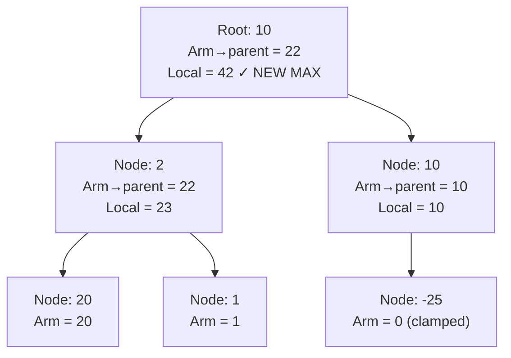
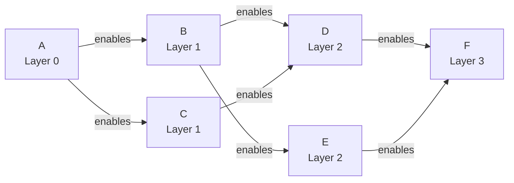

## Keywords in This File
{: .no_toc }

| # | Keyword | Weight |
|---|---------|--------|
| 1 | [Tree Traversal and Path Problems](#tree-traversal-and-path-problems) | medium |
| 2 | [Topological Sort and DAG Algorithms](#topological-sort-and-dag-algorithms) | medium |

---

# Tree Traversal and Path Problems

**Difficulty:** ★★☆

**Interview Weight:** Medium

**Category:** Tree Algorithms

---

### 🎯 Model Answer

**30-second answer:**

Tree traversal problems (preorder, inorder, postorder, level-order) appear
constantly in interviews. Path problems on trees - finding the maximum path
sum, least common ancestor, or path length - are solved by combining DFS
with returning values from children to parents. The key insight: most tree
path problems are solved with a single DFS that returns the "best value
going up" while tracking the "best answer crossing through this node."

**3-minute answer:**

**Four traversals:**

- **Inorder (left, root, right):** produces sorted order in a BST. Used for
  BST validation and kth-smallest element.
- **Preorder (root, left, right):** root processed first. Used for tree
  serialization, copying a tree.
- **Postorder (left, right, root):** root processed last. Used for tree
  deletion, computing subtree sizes, bottom-up results.
- **Level-order (BFS):** processes nodes layer by layer. Used for level-
  specific operations, zigzag traversal, min depth.

**Path problems - the two-function pattern:**

For problems like "maximum path sum" or "diameter," the key is recognizing
that the solution may "bend" at a node (go left-down, up through root,
right-down). This bending cannot be passed UP to the parent.

Pattern: DFS returns the "straight-path value from this node downward"
(can be extended by the parent). Internally, it computes the "bent-path
value at this node" (left_arm + root + right_arm) and updates a global max.

```
int dfs(node):
    if node is null: return 0
    left = max(0, dfs(node.left))   // 0 if negative
    right = max(0, dfs(node.right)) // 0 if negative
    // path that BENDS at this node (cannot be extended up)
    global_max = max(global_max, left + node.val + right)
    // return STRAIGHT path (can be extended by parent)
    return node.val + max(left, right)
```

> **Code walkthrough:** Pseudocode template for the two-function treeice. **KEY MECHANISM:** the runtime executes these instructions in sequence with specific memory and execution semantics. **WHY IT MATTERS:** misapplying this pattern causes subtle bugs that only manifest under production load. **TAKEAWAY: understand the execution model before using this pattern in production code.**
> path pattern. KEY MECHANISM: `max(0, dfs(child))` discards negative
> subtrees - including them would hurt the sum. `global_max` tracks the
> best bent path; the return value tracks the best straight arm. WHY IT
> MATTERS: these two values serve different roles and must be kept separate.
> TAKEAWAY: the path that bends at a node is tracked in a global variable;
> the path that extends upward is the return value.

**Blank Mind Recovery:**

**Step 1:** Is the answer a traversal order? (inorder/preorder/postorder/BFS)

**Step 2:** Is the answer a path that may "bend" through a node?
Use the two-function pattern above.

**Step 3:** Does the problem require returning something from each node
to its parent (subtree sum, height, diameter)?
Use postorder DFS and return the computed value.

**Step 4:** Does the problem require level information?
Use BFS with level boundaries (null sentinel or size-based loop).

---

### 📘 Concept Explanation

**Intuition:**

A tree is a recursive structure: every subtree is itself a tree. Most tree
problems are solved by thinking recursively: "if I knew the answer for the
left subtree and the right subtree, how do I compute the answer for the
whole tree?" This is the optimal substructure property.

**Mechanism - Recursive DFS:**

Every recursive tree function follows the pattern:
1. Base case: null node (return 0, false, or whatever is identity for
   the operation).
2. Recurse on left subtree. Get left result.
3. Recurse on right subtree. Get right result.
4. Combine: use left result, right result, and current node to compute
   this node's result.
5. Return: pass the result up to the parent.

The choice of traversal (preorder/inorder/postorder) is determined by
whether you process the current node BEFORE (preorder), BETWEEN (inorder),
or AFTER (postorder) the children.

**Mechanism - LCA (Lowest Common Ancestor):**

For LCA(u, v) in a binary tree (not necessarily BST):

DFS approach: from a node, if left subtree contains u and right subtree
contains v (or vice versa), THIS node is the LCA. If only one side contains
a target, the LCA is deeper (in the side that contains both).

Binary lifting (for repeated LCA queries): precompute ancestor tables.
`anc[v][k]` = 2^k-th ancestor of v. Answering LCA(u,v): equalize depths
via binary lifting, then lift both simultaneously until they meet.
Query time: O(log n). Preprocessing: O(n log n).

**Trade-offs:**

| Problem | Best approach | Time | Space |
|---------|--------------|------|-------|
| Traversal | Iterative (no stack overflow) | O(n) | O(h) |
| Height | Postorder DFS | O(n) | O(h) |
| Diameter | DFS returning height | O(n) | O(h) |
| Max path sum | DFS with global max | O(n) | O(h) |
| LCA (single query) | DFS | O(n) | O(h) |
| LCA (many queries) | Binary lifting | O(log n)/query | O(n log n) |
| Level order | BFS | O(n) | O(w) (max width) |

**Failure:**

Recursive traversal on a degenerate tree (linked list shape, depth = n):
O(n) stack depth -> StackOverflowError. Use Morris traversal (O(1) space)
or iterative with explicit stack.

Forgetting to handle null nodes in path problems: null.val throws NPE.

**Diagnosis:**

Wrong traversal order: print the traversal of a small hand-drawn tree and
compare to expected. LCA wrong: test with the target node being its own
ancestor (u == root), u being an ancestor of v, v being an ancestor of u.

**Scale:**

For trees with n = 10^6 nodes: recursive DFS uses O(h) stack frames. If
the tree is balanced, h = log(10^6) = 20 frames (fine). If skewed,
h = 10^6 frames (StackOverflow). Always consider iterative for production.

**Decision:**

Use recursive DFS for simple traversal problems in interviews (clean code).
Use iterative for production code on arbitrary trees (no StackOverflow risk).
Use BFS when level information is needed.

**Memory:**

"Inorder = sorted BST. Preorder = serialization. Postorder = bottom-up
results. Level-order = BFS."

**Transfer:**

Tree traversal appears in: AST processing in compilers (postorder evaluation),
XML/HTML DOM traversal (DFS for node search, BFS for element enumeration),
file system traversal (DFS preorder for recursive delete, BFS for level-
listing), expression tree evaluation (postorder).

**Reality:**

Compilers evaluate expression trees in postorder (leaves before operators).
Jackson/Gson JSON serialization uses a form of DFS on object trees. git's
commit graph traversal uses DFS for ancestor search.

---

### 💻 Code Example

**BAD - Recursive traversal on deep tree (StackOverflow risk):**

```java
// BAD - recursive on a skewed tree of depth 100,000
void inorder(TreeNode root) {
    if (root == null) return;
    inorder(root.left);    // 100,000 recursive calls deep
    process(root.val);
    inorder(root.right);
}
```

> **Code walkthrough:** Recursive inorder on a skewed tree creates n stackice. **KEY MECHANISM:** the runtime executes these instructions in sequence with specific memory and execution semantics. **WHY IT MATTERS:** misapplying this pattern causes subtle bugs that only manifest under production load. **TAKEAWAY: understand the execution model before using this pattern in production code.**
> frames. KEY MECHANISM: each call to `inorder` is not tail-recursive and
> cannot be optimized by the JVM. With n=100,000 nodes in a linked-list
> shape, this creates 100,000 stack frames. WHY IT MATTERS: Java's default
> stack is ~512KB, supporting roughly 10,000-15,000 frames. WHAT BREAKS:
> `StackOverflowError` with no recovery option. TAKEAWAY: always use
> iterative traversal in production when tree depth is unbounded.

**GOOD - Iterative inorder using explicit stack:**

```java
List<Integer> inorderIterative(TreeNode root) {
    List<Integer> result = new ArrayList<>();
    Deque<TreeNode> stack = new ArrayDeque<>();
    TreeNode curr = root;
    while (curr != null || !stack.isEmpty()) {
        while (curr != null) {
            stack.push(curr);
            curr = curr.left; // go left
        }
        curr = stack.pop();
        result.add(curr.val); // process
        curr = curr.right;    // go right
    }
    return result;
}
```

> **Code walkthrough:** Iterative inorder simulates the call stack withice. **KEY MECHANISM:** the runtime executes these instructions in sequence with specific memory and execution semantics. **WHY IT MATTERS:** misapplying this pattern causes subtle bugs that only manifest under production load. **TAKEAWAY: understand the execution model before using this pattern in production code.**
> an explicit Deque. KEY MECHANISM: the inner while loop pushes all left
> nodes; when no more left nodes, pop the top (leftmost unprocessed), add
> its value, then move to right subtree. This exactly mirrors recursive
> inorder: left, root, right. WHY IT MATTERS: the explicit stack is on the
> heap (not the thread stack), so it can handle arbitrary depth. TAKEAWAY:
> iterative inorder is the canonical "simulate recursion with stack" pattern.

**GOOD - Maximum path sum (two-function pattern):**

```java
int maxPathSum; // global max

int maxPathSumDFS(TreeNode root) {
    maxPathSum = Integer.MIN_VALUE;
    dfs(root);
    return maxPathSum;
}

int dfs(TreeNode node) {
    if (node == null) return 0;
    // Only take positive contributions from children
    int left = Math.max(0, dfs(node.left));
    int right = Math.max(0, dfs(node.right));
    // Path bending at this node (can't extend upward)
    maxPathSum = Math.max(maxPathSum,
                          left + node.val + right);
    // Return best STRAIGHT path (can be extended upward)
    return node.val + Math.max(left, right);
}
```

> **Code walkthrough:** Two-function pattern for maximum path sum. KEYice. **KEY MECHANISM:** the runtime executes these instructions in sequence with specific memory and execution semantics. **WHY IT MATTERS:** misapplying this pattern causes subtle bugs that only manifest under production load. **TAKEAWAY: understand the execution model before using this pattern in production code.**
> MECHANISM: `max(0, dfs(child))` discards negative subtree contributions
> (a negative path is worse than no path). The global max captures the
> bent path (left + root + right). The return value is the straight path
> that can be extended by the parent. WHY IT MATTERS: without `max(0, ...)`
> you'd never discard a losing subtree, getting wrong answers for trees with
> all negative values (except the trivial max single node case). TAKEAWAY:
> "local max at node" vs "contribution to parent" are two different things.

**GOOD - LCA in binary tree:**

```java
TreeNode lca(TreeNode root, TreeNode p, TreeNode q) {
    if (root == null || root == p || root == q) {
        return root;
    }
    TreeNode left = lca(root.left, p, q);
    TreeNode right = lca(root.right, p, q);
    // Both sides found a target: this node is LCA
    if (left != null && right != null) return root;
    // Only one side found: LCA is deeper in that side
    return left != null ? left : right;
}
```

> **Code walkthrough:** Recursive LCA. KEY MECHANISM: the function returnsice. **KEY MECHANISM:** the runtime executes these instructions in sequence with specific memory and execution semantics. **WHY IT MATTERS:** misapplying this pattern causes subtle bugs that only manifest under production load. **TAKEAWAY: understand the execution model before using this pattern in production code.**
> a non-null node when it finds p or q (or the LCA). If both left and right
> are non-null, the current node is the LCA (p and q are in different
> subtrees). If only one is non-null, the LCA is in that subtree (or one
> node IS an ancestor of the other). WHY IT MATTERS: this handles both
> cases (LCA = node where paths diverge, AND LCA = one node is ancestor of
> the other) without special-casing. TAKEAWAY: return non-null = "found
> target in this subtree"; both non-null at root = LCA found.

---

### 🎓 Answers by Seniority

**[JUNIOR/MID]**

Q: What is the difference between the four tree traversals?

Inorder (L, Root, R): visits nodes in sorted order for a BST. Use for
BST problems: kth-smallest, sorted output, validation.

Preorder (Root, L, R): visits root before children. Use for serialization,
copying the tree, expressions with operators before operands.

Postorder (L, R, Root): visits root after children. Use for deletion
(delete children before parent), computing subtree properties (height,
size), expression evaluation (operands before operators).

Level-order (BFS): visits nodes layer by layer. Use for level-specific
operations, minimum depth, right-side view, zigzag traversal.

Memory trick: the name tells you where the ROOT goes. In(order) = root
in the middle (L, Root, R). Pre(order) = root before (Root, L, R).
Post(order) = root after (L, R, Root).

Q: How does iterative inorder traversal work?

The iterative version simulates the call stack. Go left as far as possible,
pushing each node. When you hit null, pop the top, process it (add to result),
then move right. The outer loop continues until both the stack is empty
AND current pointer is null.

Mental model: "go left until you can't, then process, then go right."
This is exactly what recursive inorder does but with an explicit stack.

**[SENIOR/STAFF]**

Production considerations for tree algorithms:

**1. Morris traversal for O(1) space:** uses tree links themselves as
temporary navigation pointers. No stack needed. Inorder in O(n) time and
O(1) space. Useful when memory is the critical constraint.

**2. Euler tour for range queries:** represent tree with an array using DFS
in/out times. LCA(u,v) = minimum depth node in the range [tin[u], tin[v]]
of the Euler tour. Preprocessing: O(n log n) sparse table. Query: O(1).
Used in competitive programming and bioinformatics (phylogenetic trees).

**3. Heavy-light decomposition (HLD):** decompose tree into chains of
heavy edges (each node's heaviest child). Any path from root to leaf
crosses O(log n) chains. Allows O(log^2 n) queries on paths (range max,
sum, etc.) using a segment tree per chain. Standard technique for
competitive programming tree path queries.

Staff-level: LCA has a 1970s result: Harel-Tarjan showed LCA can be solved
in O(1) per query after O(n) preprocessing using ±1 Range Minimum Query on
the Euler tour. This is the asymptotic optimum and connects tree theory to
succinct data structures.

---

### ⚠️ Common Misconceptions

**Misconception 1: "Inorder traversal always gives sorted output."**

Only for BINARY SEARCH TREES. For a general binary tree, inorder traversal
just gives left-first, root, right-first order - there is no sorted
guarantee. Many students apply BST properties to general trees incorrectly.

**Misconception 2: "The diameter of a tree equals 2 * height."**

Wrong. The diameter (longest path between any two nodes) may not pass
through the root at all. It passes through the node that maximizes the
sum of left-height + right-height. Only in perfectly balanced trees does
the diameter equal 2 * height.

**Misconception 3: "LCA requires a BST."**

LCA is defined for any binary tree (and any rooted tree). For BSTs, you
can use the BST property to find LCA in O(height) without examining
every node. For general binary trees, DFS is required.

**Misconception 4: "Postorder traversal is only for deletion."**

Postorder is the natural order for ANY problem where you need information
from children before processing the parent. Examples: compute subtree
sizes, determine if a tree is balanced, find the maximum path sum, validate
a BST by propagating min/max constraints.

---

### 🚨 Failure Modes and Diagnosis

**Failure 1 - StackOverflowError on deep/skewed trees**

Symptom: `StackOverflowError` for inputs with many nodes in a linked-list
shape (all nodes in a single chain).

Root cause: recursive traversal has depth = tree height. For skewed trees,
height = n.

Fix: use iterative traversal with explicit stack.

Diagnosis:
```java
int height = treeHeight(root);
System.out.println("Tree height: " + height);
// If height > 5000, consider iterative
```

> **Code walkthrough:** Checking tree height before traversal. KEY MECHANISM:ice. **KEY MECHANISM:** the runtime executes these instructions in sequence with specific memory and execution semantics. **WHY IT MATTERS:** misapplying this pattern causes subtle bugs that only manifest under production load. **TAKEAWAY: understand the execution model before using this pattern in production code.**
> if height exceeds ~5,000, recursive DFS will overflow the default 512KB
> stack (which holds ~10,000-15,000 small frames). Printing height also
> reveals unbalanced trees early. WHY IT MATTERS: production trees (file
> systems, XML documents) can have extreme depth. TAKEAWAY: always assess
> tree height for production inputs before choosing recursive vs iterative.

**Failure 2 - Wrong LCA when one node is ancestor of the other**

Symptom: LCA(root, any_other_node) returns a wrong node.

Root cause: implementation assumes the two nodes are in different subtrees.
When one is an ancestor of the other, the code must return the ancestor.

Fix: the standard DFS LCA handles this correctly via the base case
`if (root == p || root == q) return root`. This says: "if I found one
target, stop - the other target is either in my subtree (making me the LCA)
or above me (in which case my parent will find me non-null on one side)."

**Failure 3 - Maximum path sum wrong for all-negative tree**

Symptom: `maxPathSum` returns 0 instead of the largest (least negative) value.

Root cause: using `max(0, dfs(child))` discards ALL negative subtrees.
For a tree where all nodes are negative, the maximum path is the single
largest node (not the path with all nodes).

Fix: distinguish between "path can be empty" (returns 0) vs "path must
include at least one node" (max single node). For "at least one node,"
initialize `maxPathSum = root.val` and adjust the logic to not allow
empty paths.

---

### 🎯 Interview Deep-Dive

| Category | Count | Min Required |
|----------|-------|-------------|
| CONCEPT | 3 | 1 |
| DEBUGGING | 2 | 1 |
| CODING | 2 | 1 |
| TRADE-OFF | 1 | 1 |
| BEHAVIORAL | 1 | 1 |
| **Total** | **9** | **9** |

---

**[JUNIOR] Q1 - [CODING] Implement level-order traversal returning each level as a separate list.**

```java
List<List<Integer>> levelOrder(TreeNode root) {
    List<List<Integer>> result = new ArrayList<>();
    if (root == null) return result;
    Queue<TreeNode> q = new LinkedList<>();
    q.offer(root);
    while (!q.isEmpty()) {
        int size = q.size(); // freeze current level size
        List<Integer> level = new ArrayList<>();
        for (int i = 0; i < size; i++) {
            TreeNode node = q.poll();
            level.add(node.val);
            if (node.left != null) q.offer(node.left);
            if (node.right != null) q.offer(node.right);
        }
        result.add(level);
    }
    return result;
}
```

> **Code walkthrough:** Level-order with per-level grouping uses the `size`ice. **KEY MECHANISM:** the runtime executes these instructions in sequence with specific memory and execution semantics. **WHY IT MATTERS:** misapplying this pattern causes subtle bugs that only manifest under production load. **TAKEAWAY: understand the execution model before using this pattern in production code.**
> snapshot trick. KEY MECHANISM: before processing each level, `size = q.size()`
> captures how many nodes are in the CURRENT level. The inner for loop
> processes exactly those nodes, adding their children for the NEXT level.
> WHY IT MATTERS: without the size snapshot, you cannot tell where one level
> ends and the next begins. WHAT BREAKS: using `while (!q.isEmpty())` as the
> inner loop would merge all levels into one. TAKEAWAY: snapshot `q.size()`
> at the START of each level iteration.

*What separates good from great:* Using the size-snapshot technique without
being prompted, explaining WHY it delineates levels.

---

**[JUNIOR] Q2 - [CONCEPT] Explain the diameter of a tree and how to compute it efficiently.**

The diameter of a tree is the length of the longest path between any two
nodes (measured in number of edges). The path may or may not pass through
the root.

Key insight: the longest path either passes through the root (left-height +
right-height) or lies entirely in the left or right subtree.

Efficient O(n) algorithm using postorder DFS:

```java
int diameter = 0;

int diameterHelper(TreeNode node) {
    if (node == null) return -1; // height of empty = -1
    int lh = diameterHelper(node.left);
    int rh = diameterHelper(node.right);
    // Path through this node: left-arm + right-arm
    diameter = Math.max(diameter, lh + rh + 2);
    // Return height (to be used by parent)
    return Math.max(lh, rh) + 1;
}
```

> **Code walkthrough:** DFS returning height while updating global diameter.
> KEY MECHANISM: height of a null node = -1 (so a leaf's height = 0, a path
> through a leaf contributes 0 edges to the arms). The diameter at a node is
> lh + rh + 2 edges (one from node to left child, one from node to right
> child, plus the subtree lengths). WHY IT MATTERS: returning -1 for null
> handles the edge case where a leaf has no children naturally (lh=-1, rh=-1,
> diameter = -1 + -1 + 2 = 0, which is correct for a single node).
> TAKEAWAY: height of null = -1 is the key to clean diameter code.

*What separates good from great:* Using height = -1 for null nodes to
avoid special-casing leaves and knowing that diameter may not pass through
the root.

---

**[JUNIOR] Q3 - [CONCEPT] How does the two-function pattern work for tree path problems?**

Most tree path problems require distinguishing between two quantities:

1. **"Arm" (returned to parent):** the best path going from THIS node
   DOWNWARD in one direction. This can be extended by the parent.

2. **"Local best" (updates global max):** the best path that BENDS at this
   node - goes from the left subtree, through this node, into the right
   subtree. This CANNOT be extended upward (it's already bent).

Why this distinction matters: if you try to return the bent path to the
parent, the parent would try to extend it (add another edge), creating an
invalid path that goes both left AND right AND up.

Template:
```
int globalMax = Integer.MIN_VALUE;

int dfs(TreeNode node):
    if node == null: return IDENTITY
    left_arm = max(IDENTITY, dfs(node.left))
    right_arm = max(IDENTITY, dfs(node.right))
    local = combine(left_arm, node.val, right_arm)
    globalMax = max(globalMax, local)
    return best_single_arm(left_arm, right_arm, node.val)
```

> **Code walkthrough:** The template separates "what to track globally"ice. **KEY MECHANISM:** the runtime executes these instructions in sequence with specific memory and execution semantics. **WHY IT MATTERS:** misapplying this pattern causes subtle bugs that only manifest under production load. **TAKEAWAY: understand the execution model before using this pattern in production code.**
> from "what to return to the parent." KEY MECHANISM: IDENTITY is 0 for
> path sums (empty path contributes 0) or -1 for height (empty subtree
> has height -1). Using IDENTITY for null prevents erroneous contributions.
> WHY IT MATTERS: mixing the global update with the return value is the
> most common tree path bug. TAKEAWAY: always separate "local bent answer"
> from "straight arm returned to parent."

*What separates good from great:* Naming the distinction ("arm" vs "local
best") explicitly and explaining why the bent path cannot be returned upward.

---

**[SENIOR] Q4 - [TRADE-OFF] When does iterative traversal outperform recursive in production?**

Three scenarios where iterative is strongly preferred:

**1. Deep or skewed trees:** any tree where depth exceeds ~5,000 nodes will
StackOverflow with recursive traversal (default 512KB stack). File systems,
XML documents, and deeply nested JSON can all produce such trees. Iterative
traversal is the only safe choice.

**2. Iterative inorder for streaming:** when processing a BST whose values
must be compared with an external stream (e.g., merge two BSTs), iterative
inorder allows pausing and resuming traversal, yielding one element at a
time. This is implemented as a class with a stack and a `next()` method.
Recursive DFS cannot "pause" without coroutines or threads.

**3. Memory control:** recursive DFS holds O(h) stack frames that each
contain all local variables. Iterative uses an explicit stack of just
node pointers (8 bytes each). For wide trees or memory-constrained
environments, the explicit stack uses less memory per depth unit.

Recursive is preferred when:
- Tree depth is bounded and small (balanced BST with n < 100,000).
- Code clarity matters (recursive code is 3x shorter).
- In interview settings (write recursive unless the interviewer asks for
  iterative or mentions large input).

*What separates good from great:* The streaming use case - iterative
traversal's ability to "pause" is a capability recursive DFS lacks.

---

**[SENIOR] Q5 - [DEBUGGING] A binary tree maximum path sum implementation returns wrong results for certain inputs. What are the likely bugs?**

The three most common bugs in tree path sum implementations:

**Bug 1 - Not clamping negative children to 0:**
```java
// BAD - allows negative contributions
int left = dfs(node.left);
int right = dfs(node.right);
// GOOD - discard negative arms
int left = Math.max(0, dfs(node.left));
int right = Math.max(0, dfs(node.right));
```

> **Code walkthrough:** The BAD version passes negative arm values up;ice. **KEY MECHANISM:** the runtime executes these instructions in sequence with specific memory and execution semantics. **WHY IT MATTERS:** misapplying this pattern causes subtle bugs that only manifest under production load. **TAKEAWAY: understand the execution model before using this pattern in production code.**
> the GOOD version clamps them to 0. KEY MECHANISM: a negative subtree
> arm reduces the total path sum - it is always better to exclude it
> (treat it as not part of the path). WHY IT MATTERS: without clamping,
> a single deeply-negative subtree drags down the max path sum. TAKEAWAY:
> always clamp child arms to 0 in path sum problems.

Symptom: returns too-small values when one subtree has all-negative nodes.

**Bug 2 - Returning the bent path instead of the straight arm:**
```java
// BAD - returns bent path (both arms), parent can't extend this
return node.val + left + right;
// GOOD - return one arm only
return node.val + Math.max(left, right);
```

> **Code walkthrough:** BAD returns the full bent path (both arms) as theice. **KEY MECHANISM:** the runtime executes these instructions in sequence with specific memory and execution semantics. **WHY IT MATTERS:** misapplying this pattern causes subtle bugs that only manifest under production load. **TAKEAWAY: understand the execution model before using this pattern in production code.**
> arm value; GOOD returns only one arm. KEY MECHANISM: if the parent adds
> its own arm value to this return, it would create a path that goes
> left->node->right->parent - invalid (has a branch). Returning the max
> single arm allows the parent to extend in one direction only. WHY IT
> MATTERS: this bug produces paths with branches, which are not simple
> paths. TAKEAWAY: the return value is an ARM, not a full bent path.

Symptom: returns correct single-path answers but wrong for multi-node paths.

**Bug 3 - Incorrect handling of all-negative trees:**
```java
// BAD - if all nodes are negative, max(0, dfs(child)) discards all
int globalMax = 0; // wrong for all-negative tree
// GOOD
int globalMax = Integer.MIN_VALUE;
// Initialize with root's value if "path must include >= 1 node"
```

> **Code walkthrough:** Setting globalMax to Integer.MIN_VALUE instead of 0.
> KEY MECHANISM: when all node values are negative, max(0, child) returns 0
> for all children, making every node appear to have a path sum of just its
> own value. Starting globalMax at MIN_VALUE ensures the single least-negative
> node is correctly selected. WHY IT MATTERS: initializing to 0 returns 0
> for an all-negative tree, which is wrong (no path has sum 0). TAKEAWAY:
> always initialize globalMax to MIN_VALUE (not 0) in max-path-sum problems.

Symptom: returns 0 for trees where all node values are negative.

Test case portfolio: single node, all-negative tree, path through root,
path NOT through root (lies in a subtree), path = single left or right arm.

*What separates good from great:* Identifying all three bugs AND providing
a test case that distinguishes each bug.

---

**[SENIOR] Q6 - [CONCEPT] What is binary lifting for LCA and when should you use it?**

Binary lifting is a technique for answering multiple LCA queries on a tree
in O(log n) per query after O(n log n) preprocessing.

Structure: `anc[v][k]` = the 2^k-th ancestor of node v.

Preprocessing:
- `anc[v][0]` = parent of v (direct parent). Built during DFS.
- `anc[v][k]` = `anc[anc[v][k-1]][k-1]` (2^k ancestor = 2^(k-1) ancestor
  of the 2^(k-1) ancestor). Built for k = 1 to log(n).

LCA query(u, v):
1. Equalize depths: lift the deeper node until both are at the same depth.
   Use binary representation of the depth difference for O(log n) lifts.
2. If u == v: one is ancestor of the other, return it.
3. Lift both simultaneously: for k from log(n) to 0, if anc[u][k] != anc[v][k],
   lift both. The result: u and v are just below the LCA.
4. Return anc[u][0] (common parent).

Use binary lifting when:
- Many LCA queries on the same tree (competitive programming, static trees).
- O(n) preprocessing is acceptable, O(log n) per query is required.

Do NOT use when:
- Only one or a few queries (simple DFS LCA is O(n), simpler to code).
- Tree changes dynamically (binary lifting requires recomputation).
- O(1) LCA queries needed (use Farach-Colton-Bender or sparse table on
  Euler tour).

*What separates good from great:* Explaining the doubling step
`anc[v][k] = anc[anc[v][k-1]][k-1]` and knowing when binary lifting is
the right tool vs simpler approaches.

---

**[SENIOR] Q7 - [CONCEPT] How does Morris traversal achieve O(1) space inorder?**

Morris traversal uses the empty right pointers of leaf nodes (and rightmost
nodes of subtrees) as temporary links back to the inorder successor, then
restores them after visiting.

Algorithm for inorder:
1. If current has no left child: visit current, go right.
2. If current has a left child: find the inorder predecessor (rightmost
   node of the left subtree).
   a. If predecessor.right is null: set predecessor.right = current
      (create thread). Move current to current.left.
   b. If predecessor.right = current: restore predecessor.right = null
      (remove thread). Visit current. Move current to current.right.

Why O(1) space: no stack or queue. Uses the tree's own null pointers as
temporary links.

Trade-off: modifies the tree during traversal (non-reentrant). Restores
original structure, but momentarily the tree has extra edges. Not safe
for concurrent access.

*What separates good from great:* Explaining that Morris traversal modifies
the tree temporarily and is therefore not safe under concurrent access,
which makes it inappropriate for most production code even though it's
space-optimal.

---

**[SENIOR] Q8 - [BEHAVIORAL] Describe a production scenario where you used tree traversal to solve a non-obvious problem.**

Strong answer structure: problem, representation choice, traversal type,
outcome.

"We built a feature for our configuration management system that detected
circular dependencies in service configuration inheritance. Configuration
profiles formed a tree (each profile had a parent it inherited from), but
with multi-inheritance, it became a DAG.

The bug: a configuration profile accidentally referenced itself as a
grandparent (circular through 3 hops). The naive code loaded configs
recursively and hung indefinitely.

Solution: before processing, build the dependency graph and run DFS with
3-state coloring (unvisited/in-progress/done). In-progress nodes reachable
from the current DFS path indicated a cycle. Immediately report the
cycle path (back-trace through the DFS stack).

We extended this to report the actual cycle path for operators:
'Profile A -> Profile B -> Profile C -> Profile A'. This specific error
message reduced debugging time from ~3 hours (operators manually traced
the chain) to ~5 minutes.

The iterative DFS was critical: some configuration chains were 500 hops
deep (inherited many times), which would have StackOverflowed with
recursive DFS."

*What separates good from great:* Emphasizing that iterative DFS was
required for correctness (avoiding StackOverflow) AND providing specific
cycle path reporting for operators.

---

**[SENIOR] Q9 - [TRADE-OFF] What are the trade-offs between recursive and iterative postorder traversal?**

Recursive postorder:
- Pros: clean, 3-5 lines of code. Mirrors the problem structure.
- Cons: O(h) stack frames; StackOverflow for skewed trees.

Iterative postorder:
- Harder than iterative inorder. Two common approaches:

**Approach 1 - Two-stack trick:**
Push root to stack1. Pop from stack1, push to stack2, push children.
When stack1 is empty, stack2 contains postorder (reversed). Pop all from
stack2. Time O(n), Space O(n).

**Approach 2 - One-stack with lastVisited pointer:**
Maintain lastVisited node. Pop node when: its right child is null OR
lastVisited is its right child. Otherwise push right, push node, move left.
Time O(n), Space O(h).

Trade-offs:

| | Two-stack | One-stack | Recursive |
|--|----------|----------|-----------|
| Code complexity | Medium | High | Low |
| Space | O(n) always | O(h) | O(h) |
| Interview preference | Easy to derive | Hard to derive | Preferred |

In production: use two-stack for maintainability. In interviews: implement
recursive unless depth is a constraint.

*What separates good from great:* Knowing BOTH iterative approaches and
stating when each is preferred.

---

### ⚖️ Comparison Table

| Traversal | Order | Use Case | Stack Type |
|-----------|-------|----------|------------|
| Inorder | L, Root, R | BST sorted output, kth-smallest | Explicit or recursive |
| Preorder | Root, L, R | Serialization, copy tree | Explicit or recursive |
| Postorder | L, R, Root | Delete tree, subtree results, path problems | Two-stack or recursive |
| Level-order | BFS layers | Level ops, min depth, zigzag | Queue (BFS) |
| Morris inorder | L, Root, R | O(1) space traversal | None (thread links) |

---

### 🏛️ System Design

*(Omit: Tree traversal and path problems are single-algorithm techniques,
not distributed system components. Distributed tree problems such as
Merkle trees or B-tree page management are separate keywords.)*

---

### 📊 Diagram

```
Tree Path Problem - Two Functions

        10
       /  \
      2    10
     / \     \
   20   1    -25
              /  \
            3     4

Max path sum = 42 (20 -> 2 -> 10 -> 10)

DFS returns from 20: arm=20
DFS returns from 1: arm=1
At node 2: local=20+2+1=23 (update global)
           arm = 2 + max(20,1) = 22
DFS returns from -25 area: arm=max(0,-25+...)=-0=0
At node 10(right): local=0+10+0=10
                   arm = 10
At root 10: local=22+10+10=42 (update global!)
```

> **Diagram walkthrough:** The tree shows the maximum path sum problem.
> The path 20->2->10->10 bends at the root (10), connecting the left
> subtree's best arm (20->2 = 22) with the right subtree's best arm (10).
> KEY RELATIONSHIP: DFS returns the straight arm (can be extended), while
> the local update captures the bent path at each node. EDGE CASE: the
> -25 subtree is discarded (arm = 0) because negative contributions reduce
> the sum. INSIGHT: a senior engineer immediately checks "can this path
> bend?" as the first question for any tree path problem.



> **Diagram walkthrough:** Each node shows the arm returned to its parent
> and the local path sum computed at that node. The maximum (42) is reached
> at the root where both arms (22 from left, 10 from right) combine through
> the root's value (10). KEY RELATIONSHIP: the arm value (22 from node 2)
> is only ONE of the two arms at the parent; the parent adds its own value
> (10) and the other arm (10 from right child) to get 42. EDGE CASE: the
> -25 subtree contributes 0 (clamped), not -22 or similar. INSIGHT: a senior
> engineer notices that if ALL nodes were negative, the global max would be
> the single least-negative node - NOT zero, which is why initializing
> globalMax to Integer.MIN_VALUE (not 0) is critical.

---

---

# Topological Sort and DAG Algorithms

**Difficulty:** ★★☆

**Interview Weight:** Medium

**Category:** Graph Algorithms

---

### 🎯 Model Answer

**30-second answer:**

Topological sort produces a linear ordering of vertices in a directed acyclic
graph (DAG) such that for every edge u->v, u comes before v. It represents
"do dependencies before dependents." Two standard algorithms: Kahn's BFS
(iterative, in-degree queue) and DFS reverse post-order (recursive). Kahn's
also detects cycles: if the sorted output has fewer than V vertices, a cycle
exists.

**3-minute answer:**

**Kahn's Algorithm (BFS):**

1. Compute in-degree of every vertex.
2. Add all vertices with in-degree 0 to a queue.
3. While queue is not empty:
   a. Dequeue vertex u. Add to topological order.
   b. For each neighbor v of u: decrement in-degree[v].
      If in-degree[v] becomes 0, enqueue v.
4. If order has fewer than V vertices: cycle detected.

**DFS Post-Order:**

1. Run DFS on all unvisited vertices.
2. After FULLY EXPLORING a vertex (post-order): push to stack.
3. After all DFS calls: pop the stack to get topological order.

Why reverse post-order works: a vertex is pushed AFTER all its descendants.
So it appears BEFORE all descendants in the pop order (LIFO).

**When to use:**

- Build systems: compile a before b if a is a dependency of b.
- Course prerequisites: take prerequisites before the course.
- Spreadsheet evaluation: evaluate cells whose dependencies are computed.
- Package managers: install dependencies before the package.

**Blank Mind Recovery:**

**Step 1:** Is this a "do A before B" dependency problem? Topological sort.

**Step 2:** Need cycle detection? Use Kahn's (checks if all nodes processed).

**Step 3:** Need lexicographic (smallest-first) topological order?
Use a min-heap instead of a regular queue in Kahn's.

---

### 📘 Concept Explanation

**Intuition:**

Topological sort is "scheduling with prerequisites." Every task has
dependencies that must complete first. Topo sort finds an order that
respects ALL dependency constraints simultaneously. Only possible for DAGs
(no circular dependencies).

**Mechanism - Kahn's Algorithm:**

In-degree 0 means "no unsatisfied dependencies." Processing a vertex u
satisfies u's contribution to its dependents: decrement their in-degrees.
When a dependent's in-degree hits 0, all its dependencies are processed.

The cycle detection insight: in a DAG, at least one vertex always has
in-degree 0 (a vertex with no incoming edges). If no vertex has in-degree
0, every vertex is "waiting for a dependency" = circular dependency = cycle.
Kahn's cycle detection: if we process fewer than V vertices, some vertices
were stuck waiting = cycle.

**Mechanism - DFS Post-Order:**

DFS explores deeply before backtracking. A vertex finishes (post-order)
only after ALL its descendants have finished. In topological sort: a vertex
is placed at the END of the order after all its dependencies are placed.
Reading the post-order stack in reverse gives the topo order.

**Trade-offs:**

| Property | Kahn's BFS | DFS Post-Order |
|----------|-----------|----------------|
| Cycle detection | Yes (count processed nodes) | Yes (3-state coloring) |
| Implementation | Iterative | Recursive or iterative |
| Output | Single valid topo order | Single valid topo order |
| Lexicographic order | Yes (use min-heap) | No (depends on DFS order) |
| StackOverflow risk | No | Yes (recursive, large graph) |
| Intuition | "Process when ready" | "Finish before stacking" |

**Failure:**

Kahn's on a cyclic graph: processes fewer than V nodes. If you don't check
this, you silently return an incomplete ordering.

DFS topo sort with wrong state: 2-state DFS (visited/unvisited) cannot
detect cycles. Must use 3-state (unvisited/in-progress/done).

**Diagnosis:**

Kahn's wrong output: print in-degrees after initialization. Verify that
in-degree[v] = number of unique edges pointing to v.

DFS topo: verify that the output contains exactly V distinct vertices. If
fewer, a cycle was silently ignored.

**Scale:**

For V = 10^6, E = 10^7 (large dependency graph): Kahn's with ArrayList
adjacency list runs in O(V + E) = 10^7 ops - about 100ms. Memory: O(V + E)
for the graph + O(V) for in-degree array and queue.

**Decision:**

Use Kahn's for production code: iterative, no StackOverflow risk, built-in
cycle detection. Use DFS post-order in recursive settings or when you prefer
the DFS-based mental model.

**Memory:**

"Kahn's = in-degree queue, process when ready. DFS = push on finish."

**Transfer:**

Topological sort appears in: Maven/Gradle build dependency resolution,
Apache Spark's DAG execution engine, spreadsheet formula evaluation,
Docker layer dependency resolution, microservice startup ordering.

**Reality:**

Spark's RDD dependency graph IS a DAG; Spark uses topological sort to
determine the execution plan. Maven evaluates project module dependencies
using topological sort. The AWS CloudFormation template validator uses
topo sort to detect circular resource dependencies.

---

### 💻 Code Example

**GOOD - Kahn's Algorithm with cycle detection:**

```java
List<Integer> topoSort(int V,
    List<List<Integer>> adj) {
    int[] inDegree = new int[V];
    for (int u = 0; u < V; u++) {
        for (int v : adj.get(u)) {
            inDegree[v]++;
        }
    }
    Queue<Integer> q = new LinkedList<>();
    for (int v = 0; v < V; v++) {
        if (inDegree[v] == 0) q.offer(v);
    }
    List<Integer> order = new ArrayList<>();
    while (!q.isEmpty()) {
        int u = q.poll();
        order.add(u);
        for (int v : adj.get(u)) {
            if (--inDegree[v] == 0) {
                q.offer(v);
            }
        }
    }
    if (order.size() != V) {
        throw new IllegalStateException(
            "Cycle detected: cannot topologically sort");
    }
    return order;
}
```

> **Code walkthrough:** Kahn's BFS topo sort with cycle detection. KEYice. **KEY MECHANISM:** the runtime executes these instructions in sequence with specific memory and execution semantics. **WHY IT MATTERS:** misapplying this pattern causes subtle bugs that only manifest under production load. **TAKEAWAY: understand the execution model before using this pattern in production code.**
> MECHANISM: `--inDegree[v] == 0` combines decrement and check in one
> expression - when a vertex's in-degree reaches 0, ALL its dependencies
> have been processed and it is ready to be scheduled. WHY IT MATTERS: the
> final size check `order.size() != V` is the cycle detection - if any
> vertex was never enqueued (never reached in-degree 0), it was part of a
> cycle. TAKEAWAY: never skip the size check - without it, Kahn's silently
> returns incomplete orderings for cyclic graphs.

**GOOD - DFS Post-Order topo sort:**

```java
int[] state; // 0=unvisited, 1=in-progress, 2=done
Deque<Integer> stack;
boolean hasCycle;

List<Integer> topoSortDFS(int V,
    List<List<Integer>> adj) {
    state = new int[V];
    stack = new ArrayDeque<>();
    hasCycle = false;
    for (int v = 0; v < V; v++) {
        if (state[v] == 0) dfs(v, adj);
    }
    if (hasCycle) throw new IllegalStateException("Cycle");
    List<Integer> order = new ArrayList<>();
    while (!stack.isEmpty()) order.add(stack.pop());
    return order;
}

void dfs(int u, List<List<Integer>> adj) {
    state[u] = 1; // mark in-progress
    for (int v : adj.get(u)) {
        if (state[v] == 1) { hasCycle = true; return; }
        if (state[v] == 0) dfs(v, adj);
    }
    state[u] = 2; // mark done
    stack.push(u); // push AFTER all descendants
}
```

> **Code walkthrough:** DFS post-order topo sort with 3-state cycle detection.
> KEY MECHANISM: `stack.push(u)` is called AFTER the for-loop (post-order),
> meaning all of u's descendants are already on the stack. Popping the
> stack gives topological order (u before its descendants). WHY IT MATTERS:
> 2-state DFS misses cycles (sees already-done nodes as non-cycles); 3-state
> correctly identifies in-progress nodes (on current DFS path) as back edges
> (cycles). TAKEAWAY: DFS topo sort requires 3 states, not 2.

**Production Example - Course Prerequisite Scheduling:**

```java
int[] findOrder(int numCourses, int[][] prereqs) {
    List<List<Integer>> adj = new ArrayList<>();
    int[] inDegree = new int[numCourses];
    for (int i = 0; i < numCourses; i++) {
        adj.add(new ArrayList<>());
    }
    for (int[] prereq : prereqs) {
        // prereq[1] must be taken before prereq[0]
        adj.get(prereq[1]).add(prereq[0]);
        inDegree[prereq[0]]++;
    }
    Queue<Integer> q = new LinkedList<>();
    for (int i = 0; i < numCourses; i++) {
        if (inDegree[i] == 0) q.offer(i);
    }
    int[] order = new int[numCourses];
    int idx = 0;
    while (!q.isEmpty()) {
        int u = q.poll();
        order[idx++] = u;
        for (int v : adj.get(u)) {
            if (--inDegree[v] == 0) q.offer(v);
        }
    }
    return idx == numCourses ? order : new int[0];
}
```

> **Code walkthrough:** Classic course schedule II (LeetCode 210). KEYice. **KEY MECHANISM:** the runtime executes these instructions in sequence with specific memory and execution semantics. **WHY IT MATTERS:** misapplying this pattern causes subtle bugs that only manifest under production load. **TAKEAWAY: understand the execution model before using this pattern in production code.**
> MECHANISM: `prereq[1]` must precede `prereq[0]`, so edge goes from
> `prereq[1]` to `prereq[0]` (the prerequisite "enables" the dependent
> course). In-degree tracks how many prerequisites remain for each course.
> WHY IT MATTERS: the edge direction must match the semantics: "take prereq
> before the course" means prereq -> course. WHAT BREAKS: reversing the
> edge direction gives a valid topo sort of the REVERSE graph (wrong order).
> TAKEAWAY: always verify edge direction matches the "must come before"
> semantics.

---

### 🎓 Answers by Seniority

**[JUNIOR/MID]**

Q: What is Kahn's algorithm in plain language?

Start with a list of all tasks that have no prerequisites (in-degree 0).
Process any one of them. Removing it satisfies one prerequisite for each
task that depended on it. Some tasks may now have all prerequisites satisfied
(in-degree becomes 0) - add them to the ready list. Repeat until no tasks
remain.

If any tasks are left unprocessed, they were in a circular dependency
(cycle) - no valid ordering exists.

In code: in-degree 0 -> queue -> process -> decrement dependencies ->
re-enqueue when in-degree hits 0 -> check all processed.

Q: How can you detect a cycle using topological sort?

With Kahn's: after running the algorithm, if the output list contains
fewer than V vertices, some vertices were never added to the queue (their
in-degree never reached 0). Those vertices are in a cycle.

With DFS: during DFS, if you reach a vertex that is currently "in-progress"
(already in the DFS call stack), you found a back edge = directed cycle.

**[SENIOR/STAFF]**

Beyond the basic algorithm:

**1. Lexicographic topo sort:** some applications require the unique
lexicographically smallest topo order. Use Kahn's with a min-heap (priority
queue) instead of a FIFO queue. Time: O((V+E) log V).

**2. All topological orders:** enumerate all valid topo orderings using
backtracking. For a graph with n independent vertices, there are n!
orderings. Used in formal verification for model checking (all valid
execution orders).

**3. Topo sort on implicit DAGs:** when the DAG is defined by a function
(e.g., game state transitions), build the adjacency list lazily. For very
large state spaces, combine with BFS for a "lazy topo-BFS."

**4. Condensation:** find all SCCs (Kosaraju/Tarjan), contract each SCC
to a single node. The result is a DAG (condensation). Run topo sort on
the condensation to process SCCs in dependency order. Used in: analyzing
strongly-coupled module groups in a codebase, determining evaluation order
in mutual recursion.

Principal-level: the connection between Kahn's and parallel scheduling.
In Kahn's, multiple vertices can have in-degree 0 simultaneously - they
can be processed in parallel. The minimum time to complete a DAG of unit-
duration tasks is the LONGEST PATH in the DAG (the critical path). Finding
the critical path via DP on the topo order is the foundation of critical
path method (CPM) in project management and pipeline scheduling.

---

### ⚠️ Common Misconceptions

**Misconception 1: "Topological sort is unique."**

Wrong. A DAG may have multiple valid topological orderings. Only a DAG
that is a linear chain (each node has exactly one outgoing edge) has a
unique topo sort. Multiple orderings arise from independent nodes (no
edges between them) that can be scheduled in any relative order.

**Misconception 2: "An undirected graph can be topologically sorted."**

Wrong. Topological sort is only defined for DIRECTED ACYCLIC GRAPHS. For
undirected graphs, every edge (u,v) is also (v,u), creating cycles. The
concept of "before" and "after" requires directionality.

**Misconception 3: "Kahn's algorithm only detects cycles when returning an empty list."**

Wrong. Kahn's returns a PARTIAL list when a cycle exists (it processes the
cycle-free portions). The cycle is detected by comparing the output length
to V: `if output.size() < V, cycle exists`.

---

### 🚨 Failure Modes and Diagnosis

**Failure 1 - Silent partial ordering for cyclic graph**

Symptom: Kahn's returns a list without throwing an error, but the list is
shorter than V.

Root cause: missing the `if (order.size() != V)` check.

Fix: always add the post-processing cycle check. Consider throwing an
exception with a message that includes which vertices are in the cycle
(vertices not in `order`).

**Failure 2 - Wrong edge direction**

Symptom: topological order is reversed from expected.

Root cause: edge (u, v) was added as (v, u) - the direction of "depends
on" vs "enables" was confused.

Diagnosis:
```java
// Print in-degrees after graph construction
for (int v = 0; v < V; v++) {
    System.out.println("inDegree[" + v + "] = " + inDegree[v]);
}
// Vertices with in-degree 0 should be the "sources" (no dependencies)
```

> **Code walkthrough:** Printing in-degrees after construction verifiesice. **KEY MECHANISM:** the runtime executes these instructions in sequence with specific memory and execution semantics. **WHY IT MATTERS:** misapplying this pattern causes subtle bugs that only manifest under production load. **TAKEAWAY: understand the execution model before using this pattern in production code.**
> graph direction. KEY MECHANISM: in-degree 0 means "has no dependencies"
> - these should be the nodes that can start immediately (root packages,
> foundation courses, source tasks). If the wrong nodes have in-degree 0,
> edges are reversed. WHY IT MATTERS: a reversed graph gives a valid
> topological sort of the REVERSE graph, which is wrong for the original
> problem. TAKEAWAY: verify in-degree 0 nodes match the problem's "starting
> nodes" before running the full algorithm.

**Failure 3 - DFS cycle detection false positive (undirected graph)**

Symptom: DFS topo sort reports a cycle in a DAG.

Root cause: treating bidirectional edges as cycles. When DFS at u visits
v and then from v sees u (the parent), u is in-progress -> falsely flagged
as a cycle.

Fix: DFS topo sort is for DIRECTED graphs only. Use Kahn's for undirected
or ensure adjacency list only has directed edges.

---

### 🎯 Interview Deep-Dive

| Category | Count | Min Required |
|----------|-------|-------------|
| CONCEPT | 2 | 1 |
| DEBUGGING | 2 | 1 |
| CODING | 2 | 1 |
| TRADE-OFF | 1 | 1 |
| BEHAVIORAL | 1 | 1 |
| SCALE | 1 | 1 |
| **Total** | **9** | **9** |

---

**[JUNIOR] Q1 - [CODING] Implement course schedule (detect if all courses can be taken given prerequisites).**

```java
boolean canFinish(int numCourses,
    int[][] prerequisites) {
    int[] inDegree = new int[numCourses];
    List<List<Integer>> adj = new ArrayList<>();
    for (int i = 0; i < numCourses; i++) {
        adj.add(new ArrayList<>());
    }
    for (int[] pre : prerequisites) {
        adj.get(pre[1]).add(pre[0]);
        inDegree[pre[0]]++;
    }
    Queue<Integer> q = new LinkedList<>();
    for (int i = 0; i < numCourses; i++) {
        if (inDegree[i] == 0) q.offer(i);
    }
    int processed = 0;
    while (!q.isEmpty()) {
        int u = q.poll();
        processed++;
        for (int v : adj.get(u)) {
            if (--inDegree[v] == 0) q.offer(v);
        }
    }
    return processed == numCourses; // true = no cycle
}
```

> **Code walkthrough:** Course schedule (LeetCode 207) using Kahn's.
> KEY MECHANISM: `processed == numCourses` at the end is the cycle check.
> If any course was never processable (stuck in a circular dependency),
> processed < numCourses and the answer is false. WHY IT MATTERS: the
> problem is exactly "does this DAG have a cycle?" and Kahn's answers it
> in O(V+E). TAKEAWAY: "can all courses be taken?" = "is the prerequisite
> graph acyclic?" = run Kahn's and check if all courses are processed.

*What separates good from great:* Recognizing this as a cycle detection
problem and not a traversal problem, then using Kahn's for its built-in
cycle detection.

---

**[JUNIOR] Q2 - [CONCEPT] What is the critical path in a DAG and why does it matter?**

The critical path is the LONGEST path from source to sink in a DAG of tasks
with durations. It determines the MINIMUM time to complete all tasks when
tasks can be done in parallel.

Why it matters: only tasks on the critical path determine the total project
duration. Tasks NOT on the critical path have "float" (slack) - they can
be delayed without delaying the project.

Computing the critical path:
1. Run topological sort on the task DAG.
2. Process nodes in topo order: for each node, compute `earliest_start[v]
   = max over all predecessors u of (earliest_start[u] + duration[u])`.
3. The critical path length = max over all sinks of `earliest_start[sink]
   + duration[sink]`.

This is DP on the DAG: O(V + E). Used in:
- Project management (CPM - Critical Path Method).
- Processor pipeline scheduling.
- CI/CD pipeline parallelism analysis.

*What separates good from great:* Knowing that critical path is DP on a
DAG (not just "longest path") and connecting it to real-world project
management and CI/CD pipeline analysis.

---

**[JUNIOR] Q3 - [DEBUGGING] Your Kahn's algorithm returns an empty list for a graph that has no cycles. What is wrong?**

Four possible causes:

**1. In-degree initialization is wrong:** did you initialize in-degrees
from the edge list? If you skipped the in-degree computation loop, all
in-degrees are 0 and all vertices are enqueued, but they process in
arbitrary order.

**2. Wrong graph direction:** if edges are reversed, the node that SHOULD
have in-degree 0 actually has in-degree > 0. Print in-degrees and verify
the nodes with in-degree 0 are the expected "starting" nodes.

**3. Graph not built:** adjacency list is empty. Print `adj.get(u)` for
a node you know has outgoing edges. If empty, the graph construction loop
is wrong (wrong indexing, not adding edges).

**4. Off-by-one in vertex indices:** 0-indexed vertices but 1-indexed
input (or vice versa). Edge (1, 2) with 0-indexed arrays gives index 1 and
2 correctly, but if the problem uses 1-indexed course numbers and you
initialize `adj` with size `numCourses` (e.g., 3 courses: indices 0,1,2),
course 3 would be out of bounds.

Debug procedure:
```java
System.out.println("Edges and in-degrees:");
for (int u = 0; u < V; u++) {
    System.out.print("Node " + u + " -> " + adj.get(u));
    System.out.println(", inDegree=" + inDegree[u]);
}
```

> **Code walkthrough:** Print all edges and in-degrees for the full graph.
> KEY MECHANISM: this single print statement exposes both wrong edges and
> wrong in-degrees simultaneously. If `adj.get(u)` is empty for a node
> that should have outgoing edges, graph construction failed. If in-degree
> values don't match the number of incoming edges in the print, in-degree
> computation is wrong. WHY IT MATTERS: Kahn's failures are almost always
> in graph construction, not the algorithm itself. TAKEAWAY: always print
> the full graph before debugging the traversal logic.

*What separates good from great:* Identifying graph construction as the
most likely failure point (not the Kahn's algorithm itself).

---

**[SENIOR] Q4 - [TRADE-OFF] When would you use DFS post-order topo sort over Kahn's in production?**

Three cases where DFS is preferred:

**1. Natural recursive structure:** some problems build the DAG implicitly
during DFS (e.g., dependency loading where loading a module triggers loading
its dependencies). DFS naturally handles this lazy loading; Kahn's requires
first building the complete graph.

**2. Finding the topo order of a subgraph:** if you need the topo order of
only the vertices reachable from a specific source, DFS from that source
naturally produces only the reachable subgraph. Kahn's processes the entire
graph.

**3. Integration with SCC computation:** Kosaraju's SCC algorithm is two
DFS passes, with the first pass producing DFS finish-order (which is the
reverse topo sort of the condensation DAG). If SCC detection is also needed,
DFS post-order topo sort integrates naturally.

Kahn's is preferred for:
- Clear cycle detection with count-based check.
- Lexicographic ordering (min-heap variant).
- Iterative (no StackOverflow risk) for large graphs.
- Production build systems where explicitness and debuggability matter.

*What separates good from great:* The Kosaraju's SCC connection - knowing
that topo sort and SCC detection share the DFS post-order as a fundamental
primitive.

---

**[SENIOR] Q5 - [SCALE] How would you implement topological sort for a DAG with 10^9 nodes and 10^10 edges (web-scale dependency graph)?**

A single-machine topological sort is infeasible for this scale.
O(V + E) = O(10^10) operations, 80GB+ memory for the adjacency list.

Distributed approach (Pregel/BSP model):

```
Phase 1: Compute in-degrees (distributed)
  - Partition vertices across machines
  - Each edge (u,v): send "in-degree increment" message to v's partition
  - Each partition accumulates in-degrees locally

Phase 2: BFS Kahn's (distributed rounds)
  - Round 0: each partition enqueues local vertices with in-degree 0
  - Each round: process enqueued vertices, send decrement messages
    to neighbor partitions, collect vertices that reach in-degree 0
  - Termination: when no more vertices are enqueued globally

Cycle detection: if vertices remain after convergence, cycle exists.
```

> **Code walkthrough:** Pseudocode for distributed topological sort.
> KEY MECHANISM: each round corresponds to one BFS layer; all vertices
> that become in-degree-0 in the same round can be processed in parallel.
> The number of rounds equals the critical path length (longest chain
> of dependencies). WHY IT MATTERS: distributed Kahn's achieves O(diameter)
> rounds with O(E/machines) work per round. TAKEAWAY: distributed topo sort
> is round-based BFS - same algorithm as Kahn's, distributed by partition.

Key challenges:
- **Message batching:** reduce per-edge message overhead by batching
  decrements for the same target partition.
- **Termination detection:** distributed termination requires a global
  "any active" check per round (barrier synchronization or Chandy-Lamport).
- **Skew:** some vertices may have 10^6 incoming edges (e.g., popular
  packages). Their partition is the bottleneck. Solution: vertical
  partitioning of high-degree nodes.

Tools: Apache Spark GraphX, Google's Pregel, Facebook's Giraph.

*What separates good from great:* Recognizing that distributed topological
sort is round-based BFS (Kahn's), identifying the hot-partition problem
from high-degree nodes, and naming actual frameworks.

---

**[SENIOR] Q6 - [CONCEPT] How does Spark use DAG topological sort internally?**

Spark represents every computation as a DAG of RDD operations (transformations
and actions). When you call an action (collect, save), Spark:

1. **Builds the DAG:** traces the lineage of transformations back to the
   source data. Each node in the DAG is an RDD; edges point from parent
   (dependency) to child (dependent).

2. **Stage division:** Spark divides the DAG into stages at SHUFFLE
   boundaries (wide dependencies). Within a stage, all operations can be
   pipelined (no data movement between nodes).

3. **Topological sort for scheduling:** the Spark DAGScheduler computes a
   topological sort of the stage DAG to determine execution order. Parent
   stages (data sources) must complete before child stages (that depend on
   shuffled data).

4. **Speculation:** Spark uses the topo order to identify which stages are
   on the critical path and prioritize speculative execution for slow tasks
   in those stages.

Cycle detection in Spark's DAG is guaranteed by construction (transformations
are always forward - you can't reference an RDD before it exists). But Spark
still validates the DAG before scheduling.

*What separates good from great:* Connecting topological sort to Spark's
DAGScheduler and explaining the stage-division mechanism at shuffle boundaries.

---

**[SENIOR] Q7 - [CONCEPT] What is the relationship between topological sort and dynamic programming on DAGs?**

Topological sort and DP on DAGs are complementary:

**Topological sort gives the evaluation order for DP on a DAG.**

For any DP problem defined on a DAG: "for each node v, dp[v] depends on
dp[u] for all predecessors u of v." To compute all dp values correctly,
process nodes in TOPOLOGICAL ORDER (predecessors before dependents).

Examples:
- **Longest path in a DAG:** dp[v] = max over predecessors u of (dp[u] + edge_weight).
  Process in topo order.
- **Number of paths from source to target:** dp[v] = sum over predecessors u of dp[u].
  Process in topo order.
- **Critical path:** dp[v] = earliest_start[v]. Process in topo order.
- **Minimum cost flow:** each stage is a DP that depends on previous stage.
  Stages are topologically ordered.

The general pattern: "DP on a DAG = topological sort + DP recurrence."
This is the formal connection between the two. Whenever you have a DP
recurrence with a DAG dependency structure, topological sort is the correct
processing order.

*What separates good from great:* Articulating that "DP on DAG = topo sort
+ DP recurrence" as a general principle, not just for specific examples.

---

**[SENIOR] Q8 - [BEHAVIORAL] Describe a production experience with dependency graph analysis or topological sort.**

Strong answer structure: business context, problem framing, algorithm choice,
production outcome.

"Our platform team maintained a service mesh of 150 microservices with
documented service dependencies (service A calls service B = B must be
healthy for A to work). We needed to implement an automated 'safe deployment
order' calculator: given a set of services to deploy, determine an order
that minimizes cascading failures.

I modeled this as: 'deploy B before A if A depends on B.' This is exactly
a topological sort of the dependency subgraph.

Two complications:
1. Circular dependencies existed in our graph (two teams had documented
   each other as dependencies). Kahn's caught these and reported the cycle
   clearly ('cannot deploy: A->B->A cycle').
2. We wanted PARALLELISM: services with no mutual dependencies could deploy
   simultaneously (batch/layer approach). This was Kahn's modified to emit
   'batches' instead of a linear order: process all in-degree-0 nodes as
   one parallel batch, then process the next layer.

Result: deployment time for full platform reduced from 4 hours (sequential,
manually ordered) to 45 minutes (parallel layer-based). The cycle detection
also found 3 undocumented circular dependencies that had been latent risks."

*What separates good from great:* The parallel batch extension of Kahn's
(emit layers, not just a linear order) and quantifying the deployment time
improvement.

---

**[SENIOR] Q9 - [TRADE-OFF] Compare Kahn's BFS topo sort with DFS reverse-post-order for lexicographic and parallel scheduling applications.**

For lexicographic topo sort (smallest-first):

- **Kahn's with min-heap:** replace the FIFO queue with a priority queue
  ordered by vertex ID. Processing always selects the smallest available
  vertex. Time: O((V+E) log V). This gives the unique lexicographically
  smallest topological order.
- **DFS reverse-post-order:** cannot easily produce lexicographic order.
  The DFS order depends on adjacency list ordering, not vertex IDs. Would
  require reordering adjacency lists and careful DFS traversal order.
  Not practical for lex order.

**Winner for lex order: Kahn's with min-heap.**

For parallel scheduling (find minimum completion time for parallel execution):

- **Kahn's BFS layer-by-layer:** emit one "batch" per BFS level.
  All nodes in a batch have no dependencies on each other and can run in
  parallel. Layers = critical path length (rounds needed).
- **DFS reverse-post-order:** linear output only. Does not directly expose
  parallelism.

**Winner for parallel scheduling: Kahn's BFS.**

The general rule: Kahn's BFS is more flexible for applications that need
to process nodes in "batches" or control the order of exploration. DFS
post-order is more natural for recursive/compositional problems and when
Tarjan's SCC is also needed.

*What separates good from great:* Recognizing that the "layer" output of
Kahn's directly gives the critical path length (number of layers = minimum
parallel time), which is a non-obvious connection.

---

### ⚖️ Comparison Table

| Property | Kahn's BFS | DFS Post-Order |
|----------|-----------|----------------|
| Approach | BFS (iterative) | DFS (recursive or iterative) |
| Cycle detection | Count-based (size < V) | 3-state coloring |
| Lexicographic order | Yes (min-heap variant) | No |
| Parallel layer extraction | Yes (natural BFS layers) | No |
| StackOverflow risk | No | Yes (recursive, large graphs) |
| Integration with SCC | No | Natural (Kosaraju's uses DFS) |
| Implementation complexity | Low | Medium |
| Preferred use | Production, build systems | Recursive problems, SCC |
| Time complexity | O(V + E) | O(V + E) |
| Space complexity | O(V) queue + O(V) in-degree | O(V) stack + O(V) state |

---

### 🏛️ System Design

**Build System Dependency Resolution at Scale**

For a mono-repo with 50,000 modules and 500,000 dependency edges:

```
Tier 1: Dependency graph construction
  - Parse all BUILD files -> extract module -> deps edges
  - Store as adjacency list in a central cache (Redis)
  - Recompute incrementally on file changes (affected edges only)

Tier 2: Topological sort + critical path
  - Run Kahn's BFS: O(V+E) = O(550,000) ops - <10ms
  - Compute earliest-start for each module (DP on topo order)
  - Critical path = minimum wall-clock build time

Tier 3: Parallel build scheduling
  - Emit topo layers; each layer = independently buildable set
  - Assign modules in each layer to build workers (bin packing)
  - Monitor: detect if a build is on the critical path (high priority)
```

> **Diagram walkthrough:** Three-tier build system architecture using topo sort.
> Tier 1 maintains the live dependency graph; Tier 2 computes the topo order
> and critical path; Tier 3 schedules parallel builds. KEY RELATIONSHIP: the
> topo layer structure directly drives build parallelism - modules in the same
> layer have no mutual dependencies and can build simultaneously. EDGE CASE:
> when a circular dependency is introduced, Tier 2 detects it immediately
> (Kahn's size check) and fails the build with a precise cycle report.
> INSIGHT: a senior engineer notices that Tier 2 runs in <10ms even for
> 50,000 modules - the bottleneck is always Tier 1 (parsing) and Tier 3
> (actual compilation), not the topo sort.

---

### 📊 Diagram

```
Topological Sort - Kahn's BFS Layers

  Graph:    A -> B -> D -> F
            A -> C -> D
            B -> E -> F
                 |
  In-degrees: A=0, B=1(A), C=1(A),
              D=2(B,C), E=1(B), F=2(D,E)

  Layer 0 (in-degree 0): [A]
  Process A: B.indegree=0, C.indegree=0
  Layer 1: [B, C]
  Process B,C: D.indegree=0, E.indegree=0
  Layer 2: [D, E]
  Process D,E: F.indegree=0
  Layer 3: [F]

  Critical path length = 4 layers
  Parallel time = 4 rounds
```

> **Diagram walkthrough:** Kahn's BFS on a 6-node DAG with 6 edges.
> Layer 0 has only A (in-degree 0). Processing A enables B and C (both
> reach in-degree 0). Layer 1 processes B and C in parallel. KEY RELATIONSHIP:
> the number of layers equals the critical path length - the minimum number
> of sequential rounds needed to process the entire DAG in parallel. EDGE CASE:
> if a cycle existed (e.g., D -> A), processing would stop at layer 0 and
> the output would have size 1 instead of 6. INSIGHT: a senior engineer
> notices that D's in-degree is 2 (from both B and C) and cannot proceed to
> layer 2 until BOTH are processed - this is why D waits for layer 2 even
> though B processes before C.



> **Diagram walkthrough:** The flowchart shows the DAG with layer annotations.
> Nodes in the same layer (B and C in Layer 1; D and E in Layer 2) can be
> processed in parallel. KEY RELATIONSHIP: the longest chain A->B->D->F or
> A->B->E->F has length 4 - this is the critical path that determines the
> minimum total rounds. EDGE CASE: if B had an additional edge to F directly,
> F would still be in Layer 3 (it still needs D and E to complete). INSIGHT:
> a senior engineer sees that the layer structure is exactly the BFS level-
> order, and that critical path computation is DP on this DAG in topo order.
