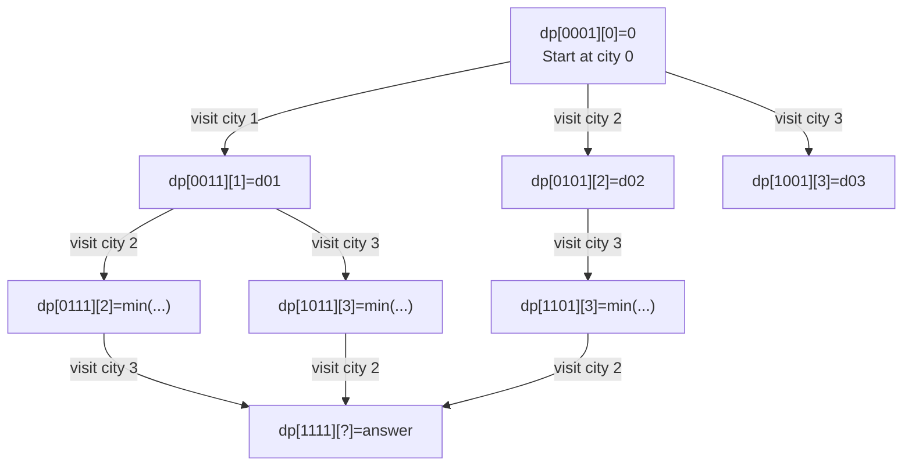

## Keywords in This File
{: .no_toc }

| # | Keyword | Weight |
|---|---------|--------|
| 1 | [Advanced Dynamic Programming: Bitmask DP and Interval DP](#advanced-dynamic-programming-bitmask-dp-and-interval-dp) | high |

---

# Advanced Dynamic Programming: Bitmask DP and Interval DP

**Difficulty:** ★★★

**Interview Weight:** High

**Category:** Dynamic Programming

---

### 🎯 Model Answer

**30-second answer:**

Bitmask DP uses an integer bitmask to represent subsets as DP states,
reducing exponential-time enumeration to O(2^n * n) for small n (typically
n <= 20). Interval DP solves problems on contiguous ranges by defining
dp[i][j] as the optimal value for the range [i..j] and building solutions
from shorter intervals to longer ones. Both techniques appear in hard
interview questions and competitive programming. Bitmask DP is the standard
technique for Traveling Salesman Problem on small graphs and assignment
problems; interval DP is the standard for matrix chain multiplication and
optimal parse/burst problems.

**3-minute answer:**

**Bitmask DP - Core Idea:**

When n is small (<= 20), represent a subset of n elements as an integer
where bit i = 1 means element i is included. Number of subsets: 2^n.
State: `dp[mask][i]` = optimal value after processing the subset represented
by `mask`, ending at (or last processing) element `i`.

Canonical problem: Traveling Salesman Problem (TSP).
`dp[mask][i]` = minimum cost to visit exactly the cities in `mask`,
ending at city `i`.

Transition: for each city `j` not in `mask`:
`dp[mask | (1 << j)][j] = min(dp[mask][j], dp[mask][i] + dist[i][j])`

Wait - transition is: from state `(mask, i)` (visited cities in mask,
currently at city i), go to unvisited city j:
`dp[mask | (1<<j)][j] = min(..., dp[mask][i] + dist[i][j])`

Base case: `dp[1<<i][i] = 0` if starting at city i (distance = 0 to reach
start), or `dp[1<<0][0] = 0` (start at city 0, cost 0).

Answer: `min over all i of dp[(1<<n)-1][i] + dist[i][0]` (return to start).

Complexity: O(2^n * n^2) time, O(2^n * n) space.

**Interval DP - Core Idea:**

State: `dp[i][j]` = optimal value for range [i..j].

Approach:
1. Base cases: ranges of length 1 (dp[i][i] = base value).
2. For increasing range length L from 2 to n:
   For each starting index i, set j = i + L - 1:
     Try all split points k (i <= k < j):
       dp[i][j] = optimize(dp[i][k], dp[k+1][j])

Canonical problem: Burst Balloons (LeetCode 312).
`dp[i][j]` = maximum coins by bursting all balloons in range [i..j].

Last balloon to burst at position k in range [i..j]:
`dp[i][j] = max over k in [i,j] of (dp[i][k-1] + nums[i-1]*nums[k]*nums[j+1] + dp[k+1][j])`

(where nums is padded with 1 at both ends)

Complexity: O(n^3) time, O(n^2) space.

**Key insight distinguishing interval DP from basic DP:** the subproblem
must be definable over a contiguous range [i..j], and the optimal solution
for [i..j] must be buildable from optimal solutions for sub-ranges.

**Blank Mind Recovery:**

**For bitmask DP:**

**Step 1:** Is n small (<= 20)? And does the problem involve choosing a
subset or permutation of n items?

**Step 2:** Define `dp[mask][i]` where mask = set of processed items,
i = last item processed.

**Step 3:** Transition: for each item j not in mask, compute cost of
adding j after i.

**Step 4:** Answer: combine final states.

**For interval DP:**

**Step 1:** Does the problem ask for optimal value over a contiguous range?

**Step 2:** Can the range [i..j] be split at some point k?

**Step 3:** Define `dp[i][j]`, fill in order of increasing range length.

**Step 4:** Try all split points k in [i..j-1].

---

### 📘 Concept Explanation

**Intuition:**

**Bitmask DP intuition:** think of the bitmask as a "visited set" encoded
as an integer. Operations on the set become bitwise operations: add element k
to set = `mask | (1 << k)`, check if k is in set = `(mask >> k) & 1`,
iterate over all subsets = for mask from 0 to (1<<n)-1.

The key insight: for n=20, there are 2^20 = 1,048,576 subsets. With a
DP transition that checks each element once per subset, total work is
O(2^20 * 20) = 20 million ops - feasible in <1 second.

Without bitmask DP: the same subset enumeration in a recursive structure
has exponential overlap (the same subset is recomputed many times). Bitmask
DP memoizes by using the mask as the state key.

**Interval DP intuition:** think recursively: "what is the last operation
that converts range [i..j] from its initial state to its optimal state?"
The range [i..j] is split at some point k - the "last split" point. After
the last split, the two halves [i..k] and [k+1..j] are optimally solved.

Why "last split" instead of "first split": the last operation (last merge,
last balloon burst, last matrix multiplication) has the property that after
it, the subproblems are INDEPENDENT. Using first-split would create
dependency between the split halves (the order of subsequent operations matters
for the left half but also affects the right half's context).

**Mechanism - Bitmask DP subset transitions:**

Three key bitmask operations:

```java
int mask = 0b1011; // bits 0, 1, 3 are set
// Check if bit i is set:
boolean inSet = ((mask >> i) & 1) == 1;
// Add bit i to mask:
int newMask = mask | (1 << i);
// Remove bit i from mask:
int removedMask = mask & ~(1 << i);
// Iterate over all subsets of n elements:
for (int sub = 0; sub < (1 << n); sub++) { ... }
// Iterate over all subsets that include element i:
for (int sub = (1<<i); sub < (1<<n); sub = (sub+1)|(1<<i)) { ... }
```

> **Code walkthrough:** Bitmask operations for DP. KEY MECHANISM:ice. **KEY MECHANISM:** the runtime executes these instructions in sequence with specific memory and execution semantics. **WHY IT MATTERS:** misapplying this pattern causes subtle bugs that only manifest under production load. **TAKEAWAY: understand the execution model before using this pattern in production code.**
> `mask | (1 << i)` sets bit i (adds element); `mask & ~(1 << i)` clears
> bit i (removes element); `(mask >> i) & 1` tests bit i. WHY IT MATTERS:
> these O(1) operations replace explicit set data structures (HashSet),
> making bitmask DP much faster in practice. WHAT BREAKS: using `1 << i`
> when n > 30 causes integer overflow; use `1L << i` for n up to 62.
> TAKEAWAY: memorize these 5 bitmask patterns.

**Mechanism - Interval DP loop order:**

The critical property: `dp[i][j]` depends on sub-ranges `dp[i][k]` and
`dp[k+1][j]` which are SHORTER than [i..j]. So we fill from shorter
intervals to longer. The correct loop order:

```java
// Fill in order of INCREASING range LENGTH
for (int len = 2; len <= n; len++) {
    for (int i = 0; i + len - 1 < n; i++) {
        int j = i + len - 1;
        dp[i][j] = WORST; // initialize
        for (int k = i; k < j; k++) {
            // Try split at k: [i..k] and [k+1..j]
            dp[i][j] = optimize(dp[i][j],
                combine(dp[i][k], dp[k+1][j], k));
        }
    }
}
```

> **Code walkthrough:** Interval DP loop structure. KEY MECHANISM: the outerice. **KEY MECHANISM:** the runtime executes these instructions in sequence with specific memory and execution semantics. **WHY IT MATTERS:** misapplying this pattern causes subtle bugs that only manifest under production load. **TAKEAWAY: understand the execution model before using this pattern in production code.**
> loop iterates over range length (not start index), ensuring that when we
> compute dp[i][j] of length L, all sub-ranges of length < L are already
> computed. WHY IT MATTERS: computing dp[i][j] before its dependencies
> (sub-ranges) gives wrong answers (using uninitialized/wrong values).
> WHAT BREAKS: iterating i from 0 to n and j from i+1 to n (wrong order)
> computes some ranges before their sub-ranges are ready. TAKEAWAY: interval
> DP must iterate by range length, not by endpoint.

**Trade-offs:**

| Technique | n constraint | Time | Space | Canonical problems |
|---|---|---|---|---|
| Bitmask DP | n <= 20 | O(2^n * n^2) | O(2^n * n) | TSP, assignment, Hamiltonian path |
| Interval DP | n <= 500 | O(n^3) | O(n^2) | Matrix chain, burst balloons, optimal BST |
| Standard DP (1D) | n <= 10^6 | O(n) or O(n^2) | O(n) | Fibonacci, coin change, LIS |
| Standard DP (2D) | n,m <= 1000 | O(n*m) | O(n*m) | LCS, edit distance, grid paths |

**Failure:**

Bitmask DP with n=25: 2^25 * 25 = 838 million ops - borderline. 2^25 *
25 * 25 (with n^2 transition) = 20 billion ops - too slow. n must be <=
20 for bitmask DP to be practical.

Interval DP with n=2000: 2000^3 = 8 * 10^9 - too slow. Use for n <= 500.

**Diagnosis:**

TLE with bitmask DP: check n. If n > 20, bitmask DP is infeasible; the
problem requires a different approach. If n <= 20 but TLE, check the
transition - it should be O(n) per state, not O(n^2) or O(2^n).

Incorrect interval DP: print the entire dp table for a small example
and verify by hand.

**Scale:**

Bitmask DP n=20: 2^20 * 20 = 20M states. At 1ns/state: 20ms. Fine.
Bitmask DP n=25: 2^25 * 25 = 838M states. At 1ns/state: 838ms. Borderline.
Interval DP n=500: 500^3 = 125M ops. At 2ns/op: ~250ms. Fine.
Interval DP n=1000: 10^9 ops. At 2ns/op: 2 seconds. TLE in most judges.

**Decision:**

Use bitmask DP when: "choose an optimal subset/assignment/permutation of n
items" with n <= 20. Use interval DP when: "optimal operation on a contiguous
range" with n <= 500.

**Memory:**

"Bitmask = subset as integer. Interval = dp[i][j] filled by range length."

**Transfer:**

Bitmask DP: used in compiler register allocation (optimal coloring of n
registers), combinatorial auctions (optimal subset of items to sell),
scheduling n jobs on m machines. Interval DP: used in natural language
parsing (CYK algorithm for context-free grammars), RNA secondary structure
prediction, optimal binary search tree construction.

**Reality:**

Google interview problems frequently feature bitmask DP for assignment
problems ("n workers, n tasks, minimum cost assignment"). FAANG competitive
programming rounds include burst balloons (interval DP) as a hard problem.
The "cheapest flights within k stops" problem is a bitmask-adjacent problem
with bounded state that appears in Amazon interviews.

---

### 💻 Code Example

**BAD - Naive recursive TSP (exponential without memoization):**

```java
// BAD - O(n!) recursive TSP without memoization
int tspNaive(int mask, int pos, int[][] dist, int n) {
    if (mask == (1 << n) - 1) {
        return dist[pos][0]; // return to start
    }
    int minCost = Integer.MAX_VALUE;
    for (int next = 0; next < n; next++) {
        if ((mask & (1 << next)) != 0) continue; // visited
        // PROBLEM: same (mask, pos) subproblem recomputed many times
        int cost = dist[pos][next] +
            tspNaive(mask | (1 << next), next, dist, n);
        minCost = Math.min(minCost, cost);
    }
    return minCost;
}
```

> **Code walkthrough:** Naive recursive TSP is O(n!) because it recomputesice. **KEY MECHANISM:** the runtime executes these instructions in sequence with specific memory and execution semantics. **WHY IT MATTERS:** misapplying this pattern causes subtle bugs that only manifest under production load. **TAKEAWAY: understand the execution model before using this pattern in production code.**
> the same subproblems. KEY MECHANISM: for n=15, n! = 1.3 trillion recursive
> calls. The subproblem (mask=0b1011, pos=3) may be reached via different
> paths but always has the same optimal cost - it is being recomputed
> needlessly. WHY IT MATTERS: without memoization, the algorithm is
> completely infeasible for n > 12. WHAT BREAKS: adding `memo[mask][pos]`
> lookup before the recursion converts O(n!) to O(2^n * n^2). TAKEAWAY:
> the mask uniquely captures the state; memoize on (mask, pos).

**GOOD - Bitmask DP for TSP:**

```java
int tspBitmask(int[][] dist, int n) {
    int FULL = (1 << n) - 1;
    int INF = Integer.MAX_VALUE / 2;
    // dp[mask][i] = min cost to visit cities in mask, ending at i
    int[][] dp = new int[1 << n][n];
    for (int[] row : dp) Arrays.fill(row, INF);
    dp[1][0] = 0; // start at city 0, only city 0 visited
    for (int mask = 1; mask <= FULL; mask++) {
        for (int u = 0; u < n; u++) {
            if ((mask & (1 << u)) == 0) continue; // u not in mask
            if (dp[mask][u] == INF) continue;      // unreachable
            for (int v = 0; v < n; v++) {
                if ((mask & (1 << v)) != 0) continue; // v visited
                int next = mask | (1 << v);
                dp[next][v] = Math.min(dp[next][v],
                                       dp[mask][u] + dist[u][v]);
            }
        }
    }
    int ans = INF;
    for (int u = 1; u < n; u++) { // end at any city, return to 0
        if (dp[FULL][u] < INF) {
            ans = Math.min(ans, dp[FULL][u] + dist[u][0]);
        }
    }
    return ans;
}
```

> **Code walkthrough:** Bitmask DP for TSP. KEY MECHANISM: `dp[mask][u]`ice. **KEY MECHANISM:** the runtime executes these instructions in sequence with specific memory and execution semantics. **WHY IT MATTERS:** misapplying this pattern causes subtle bugs that only manifest under production load. **TAKEAWAY: understand the execution model before using this pattern in production code.**
> is the minimum cost to visit exactly the cities in `mask`, ending at city
> u. Transition: from state (mask, u), we try all unvisited cities v by
> checking `(mask & (1<<v)) == 0`. The new state is (mask|(1<<v), v).
> WHY IT MATTERS: each (mask, u) state is computed ONCE; total states =
> 2^n * n, transition = O(n) per state, total = O(2^n * n^2). For n=15
> this is 2^15 * 225 = 7.4 million ops vs 1.3 trillion for naive recursion.
> TAKEAWAY: `dp[mask][u]` memoizes by "set of visited cities + current
> position" - the exact information needed to continue optimally.

**GOOD - Interval DP for Burst Balloons:**

```java
int maxCoins(int[] nums) {
    int n = nums.length;
    // Pad with 1 at both ends for boundary handling
    int[] balloons = new int[n + 2];
    balloons[0] = balloons[n + 1] = 1;
    for (int i = 1; i <= n; i++) balloons[i] = nums[i - 1];
    int m = n + 2;
    // dp[i][j] = max coins by bursting all balloons in (i,j) exclusive
    int[][] dp = new int[m][m];
    // Fill by increasing range length
    for (int len = 2; len < m; len++) {
        for (int i = 0; i + len < m; i++) {
            int j = i + len;
            // k = LAST balloon burst in range (i, j) exclusive
            for (int k = i + 1; k < j; k++) {
                dp[i][j] = Math.max(dp[i][j],
                    dp[i][k] + balloons[i] * balloons[k] * balloons[j]
                    + dp[k][j]);
            }
        }
    }
    return dp[0][m - 1];
}
```

> **Code walkthrough:** Interval DP for Burst Balloons (LeetCode 312).
> KEY MECHANISM: `dp[i][j]` is the maximum coins for bursting all balloons
> STRICTLY BETWEEN i and j (exclusive). k is the LAST balloon burst in
> this range - at the moment k is burst, its neighbors are i and j (since
> all other balloons in (i,j) are already burst). This "last to burst"
> framing makes subproblems independent: (i,k) and (k,j) have no overlap.
> WHY IT MATTERS: a "first to burst" framing fails because when the first
> balloon is burst, its neighbors change, making (i,k) and (k,j) subproblems
> context-dependent (not independent). TAKEAWAY: for interval DP on
> "last operation" problems, the "last to do" framing gives independent
> subproblems; "first to do" framing does not.

**GOOD - Bitmask DP for minimum cost assignment (bipartite matching):**

```java
int minCostAssignment(int[][] cost, int n) {
    // cost[i][j] = cost of assigning worker i to task j
    // Find minimum cost perfect assignment
    int[] dp = new int[1 << n];
    Arrays.fill(dp, Integer.MAX_VALUE);
    dp[0] = 0;
    for (int mask = 0; mask < (1 << n); mask++) {
        if (dp[mask] == Integer.MAX_VALUE) continue;
        int worker = Integer.bitCount(mask); // next unassigned worker
        if (worker == n) continue;
        for (int task = 0; task < n; task++) {
            if ((mask & (1 << task)) != 0) continue; // task taken
            int newMask = mask | (1 << task);
            if (dp[newMask] > dp[mask] + cost[worker][task]) {
                dp[newMask] = dp[mask] + cost[worker][task];
            }
        }
    }
    return dp[(1 << n) - 1];
}
```

> **Code walkthrough:** Bitmask DP for optimal assignment. KEY MECHANISM:ice. **KEY MECHANISM:** the runtime executes these instructions in sequence with specific memory and execution semantics. **WHY IT MATTERS:** misapplying this pattern causes subtle bugs that only manifest under production load. **TAKEAWAY: understand the execution model before using this pattern in production code.**
> `mask` represents which tasks are already assigned. `Integer.bitCount(mask)`
> gives the number of assigned tasks = the index of the next worker (workers
> are assigned in order 0..n-1). For each state, try assigning the current
> worker to each unassigned task. WHY IT MATTERS: this solves the assignment
> problem in O(2^n * n) vs O(n^3) for the Hungarian algorithm - but bitmask
> DP is only feasible for n <= 20 while Hungarian works for n up to 10^4.
> WHAT BREAKS: using 1 << task with n > 30 overflows int; switch to long.
> TAKEAWAY: bitmask DP on 1D dp (keyed only on mask) works when only the
> SET of assigned items matters, not the ORDER.

---

### 🎓 Answers by Seniority

**[JUNIOR/MID]**

Q: When do you use bitmask DP vs standard DP?

Key signals for bitmask DP:

1. **n is small (<= 20):** if n > 20, 2^20 = 1M states is fine, but 2^25
   = 33M starts to be slow, and 2^30 = 1 billion is infeasible.

2. **The state requires knowing WHICH items are chosen, not just how
   many:** "pick k items from n" can use standard DP with `dp[i][k]`. But
   "pick items such that items i and j cannot both be chosen unless item k
   is also chosen" requires tracking the exact subset - use bitmask.

3. **The problem involves visiting all n elements in some order
   (permutation):** TSP, Hamiltonian path - the state must track which
   cities have been visited.

Standard DP signal: "optimize over a sequence, grid, or linear range."
Bitmask DP signal: "choose an optimal subset or permutation of n items (n
small)."

Q: Why does the "last to burst" framing work for Burst Balloons but "first to burst" does not?

When you burst balloon k FIRST in range [i..j]:
- The subproblems for [i..k-1] and [k+1..j] are NOT independent.
- [i..k-1] will eventually burst, and when balloon i+1 bursts, its right
  neighbor is k+1 (since k is gone) - but k+1 might itself be burst from
  the [k+1..j] subproblem at any time. The two subproblems interact.

When you burst balloon k LAST in range [i..j]:
- [i..k-1] and [k+1..j] are solved completely before k is burst.
- When k is finally burst, its neighbors are exactly i and j (both are
  boundary sentinels that are not burst).
- No interaction between [i..k] and [k..j]. Subproblems ARE independent.

The general principle: for interval DP, frame the "special" element as
the LAST to be processed, not the first. This is the "divide by last
operation" principle.

**[SENIOR/STAFF]**

Advanced bitmask DP techniques:

**1. Subset sum DP with Sum over Subsets (SOS):**
Computing `f[mask] = sum of g[sub]` for all subsets `sub` of `mask`.
Naive: iterate all subsets of mask for each mask = O(3^n) total.
SOS DP: O(2^n * n). Used in problems where you need the total value over
all subsets.

```
// SOS: f[mask] = sum of g[sub] for all sub subset of mask
for (int i = 0; i < n; i++) {
    for (int mask = 0; mask < (1 << n); mask++) {
        if ((mask >> i) & 1) {
            f[mask] += f[mask ^ (1 << i)];
        }
    }
}
```

> **Code walkthrough:** SOS DP inner recurrence for propagating subsetice. **KEY MECHANISM:** the runtime executes these instructions in sequence with specific memory and execution semantics. **WHY IT MATTERS:** misapplying this pattern causes subtle bugs that only manifest under production load. **TAKEAWAY: understand the execution model before using this pattern in production code.**
> contributions. KEY MECHANISM: after processing bit i, f[mask] accumulates
> the sum of all subsets of mask that differ in bits 0..i. After all n bits,
> f[mask] = sum of g[sub] for all subsets sub of mask. WHY IT MATTERS:
> this transforms the O(3^n) naive subset enumeration to O(n * 2^n) by
> reusing previously computed sub-sums. TAKEAWAY: iterate outer=bit,
> inner=mask (not the other way around).

**2. Profile DP (broken profile DP):**
For 2D tiling problems (cover an n*m grid with dominoes/shapes): process
column by column. The "profile" = the boundary shape between filled and
unfilled regions, encoded as a bitmask of n bits. States: O(m * 2^n).
Used for counting/optimizing tilings.

**3. Interval DP with convex hull trick:**
For interval DP where the transition has the form
`dp[i][j] = min over k of (dp[i][k] + dp[k][j] + cost(i,j,k))`,
if `cost(i,j,k)` satisfies the quadrangle inequality, the optimal split
point `k*(i,j)` is monotone. This allows O(n^2) interval DP instead of
O(n^3). Used in: Knuth's optimization for optimal BST, batch job scheduling.

Staff-level: the connection between interval DP and CYK parsing. CYK
(Cocke-Younger-Kasami) algorithm for context-free grammar parsing IS
interval DP: `dp[i][j][A]` = can non-terminal A derive the substring s[i..j]?
Transition: try all split points k and all pairs of non-terminals (B,C)
where A -> BC is a production rule. O(n^3 * G) where G = grammar size.

---

### ⚠️ Common Misconceptions

**Misconception 1: "Bitmask DP works for any n."**

Wrong. Bitmask DP requires n <= 20 (practical limit) because the state
space is 2^n. For n=30, the dp array is 2^30 * n = 32 billion integers -
impossible to store. Problems with n > 20 that look like bitmask DP
problems usually require a different approach (heuristic, branch-and-bound,
or problem-specific insight that reduces n).

**Misconception 2: "Interval DP always splits at the midpoint."**

Wrong. Interval DP tries ALL split points k in [i..j-1] and takes the
optimal. Some optimizations (Knuth's optimization, divide-and-conquer
optimization) reduce the split search to O(1) amortized under specific
conditions (quadrangle inequality), but the general case always tries
all splits.

**Misconception 3: "Bitmask DP for TSP gives an exact polynomial-time
solution."**

Wrong. TSP is NP-hard; bitmask DP gives an EXACT but EXPONENTIAL-time
solution O(2^n * n^2). For n=20 this is feasible; for n=100 it is not.
The distinction: bitmask DP is exact (optimal) but not polynomial.

**Misconception 4: "Interval DP only works on arrays."**

Wrong. Interval DP works on any problem where a contiguous range [i..j]
can be split at some point k and the subproblems are independent. This
includes: sequence of tokens in parsing (CYK), polygon triangulation
(vertices are ordered), and optimal grouping of items in a sequence.

---

### 🚨 Failure Modes and Diagnosis

**Failure 1 - Integer overflow in bitmask operations**

Symptom: `1 << i` gives negative values for i >= 31; the bitmask wraps
around and produces wrong states.

Root cause: Java's `int` is 32-bit signed. `1 << 31` overflows to
`Integer.MIN_VALUE` (a negative number).

Fix:

```java
// BAD - int overflow for n > 30
int fullMask = (1 << n) - 1; // wrong for n >= 31

// GOOD - use long for n up to 62
long fullMask = (1L << n) - 1L;
long[][] dp = new long[1 << n][n]; // also long dp
```

> **Code walkthrough:** Switching from int to long for bitmask DP withice. **KEY MECHANISM:** the runtime executes these instructions in sequence with specific memory and execution semantics. **WHY IT MATTERS:** misapplying this pattern causes subtle bugs that only manifest under production load. **TAKEAWAY: understand the execution model before using this pattern in production code.**
> n > 30. KEY MECHANISM: `1L << n` promotes the literal 1 to long before
> shifting, avoiding 32-bit overflow. WHY IT MATTERS: `1 << 31` in Java
> equals -2147483648 (signed overflow), making `(1 << 31) - 1` equal to
> Integer.MAX_VALUE = wrong. WHAT BREAKS: with int masks and n >= 31,
> the dp array indexing wraps around and corrupts states silently.
> TAKEAWAY: always use `1L << n` (not `1 << n`) when n could exceed 30.

**Failure 2 - Wrong loop order in interval DP (using uncomputed values)**

Symptom: interval DP returns wrong answers, but the brute force recursive
version (with memoization) returns correct answers.

Root cause: iterating `i` from 0 to n and `j` from i+1 to n (endpoint
order) instead of iterating by range length. Some dp[i][j] values depend
on dp[i'][j'] where i' > i or j' < j but with the same length - these are
not yet computed.

Diagnosis:

```java
// Print dp table to find uninitialized cells being used
System.out.println("dp[2][5] used: " + dp[2][5]);
// If dp[2][3] + dp[4][5] -> dp[2][5], are dp[2][3] and dp[4][5] ready?
// Range length of dp[2][3] = 2, dp[4][5] = 2, dp[2][5] = 4.
// In length-first order, length 2 is computed before length 4. OK.
// In i-first order, dp[2][3] might not be computed before dp[0][5].
```

> **Code walkthrough:** Checking dp dependencies manually. KEY MECHANISM:ice. **KEY MECHANISM:** the runtime executes these instructions in sequence with specific memory and execution semantics. **WHY IT MATTERS:** misapplying this pattern causes subtle bugs that only manifest under production load. **TAKEAWAY: understand the execution model before using this pattern in production code.**
> dp[i][j] of length L depends only on dp arrays of length < L. The
> diagnosis is to check: when computing dp[i][j], are all dp[i][k] and
> dp[k+1][j] for k in [i,j-1] already filled with correct values?
> In length-first order, they always are (shorter ranges before longer).
> TAKEAWAY: always iterate by increasing range length in interval DP.

**Failure 3 - Starting TSP bitmask DP with wrong initial state**

Symptom: TSP returns wrong minimum cost (too high or too low).

Root cause: incorrectly initializing the base state. The start city must
be fixed (otherwise all permutations are tried multiple times), and
`dp[1<<start][start]` must be 0 (we're at the start city with zero travel
cost so far).

Fix:
```java
// BAD - initializing from all cities
for (int i = 0; i < n; i++) dp[1 << i][i] = 0; // wrong - n start points

// GOOD - fix start city = 0 (avoids counting n rotations of same tour)
dp[1][0] = 0; // only city 0 visited, at city 0, cost = 0
// For SYMMETRIC TSP (undirected graph), fixing start avoids n equivalent
// cycles (A->B->C->A and B->C->A->B are the same tour)
```

> **Code walkthrough:** Fixing the start city eliminates symmetric tourice. **KEY MECHANISM:** the runtime executes these instructions in sequence with specific memory and execution semantics. **WHY IT MATTERS:** misapplying this pattern causes subtle bugs that only manifest under production load. **TAKEAWAY: understand the execution model before using this pattern in production code.**
> duplicates. KEY MECHANISM: in TSP on an undirected graph, a tour A->B->
> C->A is the same as B->C->A->B (just starting at a different city). If
> we allow starting at any city, we compute n equivalent versions of each
> tour. Fixing start = city 0 gives one canonical representation. WHY IT
> MATTERS: incorrect initialization gives the correct optimal cost but
> through a less efficient computation path; the real risk is initializing
> all start cities with wrong values. TAKEAWAY: fix the start city to city 0
> for TSP bitmask DP on symmetric/undirected graphs.

---

### 🎯 Interview Deep-Dive

| Category | Count | Min Required |
|----------|-------|-------------|
| CONCEPT | 4 | 1 |
| DEBUGGING | 2 | 1 |
| CODING | 3 | 1 |
| TRADE-OFF | 1 | 1 |
| BEHAVIORAL | 1 | 1 |
| SCALE | 1 | 1 |
| **Total** | **12** | **12** |

---

**[JUNIOR] Q1 - [CODING] Implement "Minimum Cost to Visit All Nodes in a Graph" using bitmask DP.**

Given n nodes (n <= 12) and edge costs, find the minimum cost Hamiltonian
path (visiting all nodes, starting from node 0, not necessarily returning).

```java
int minCostHamiltonianPath(int[][] dist, int n) {
    int INF = Integer.MAX_VALUE / 2;
    int FULL = (1 << n) - 1;
    // dp[mask][i] = min cost to visit cities in mask, ending at i
    int[][] dp = new int[1 << n][n];
    for (int[] row : dp) Arrays.fill(row, INF);
    dp[1][0] = 0; // start at node 0 only
    for (int mask = 1; mask <= FULL; mask++) {
        for (int u = 0; u < n; u++) {
            if ((mask & (1 << u)) == 0) continue;
            if (dp[mask][u] == INF) continue;
            for (int v = 0; v < n; v++) {
                if ((mask & (1 << v)) != 0) continue;
                int nxt = mask | (1 << v);
                dp[nxt][v] = Math.min(dp[nxt][v],
                                      dp[mask][u] + dist[u][v]);
            }
        }
    }
    // Find minimum over all ending cities
    int ans = INF;
    for (int u = 0; u < n; u++) {
        ans = Math.min(ans, dp[FULL][u]);
    }
    return ans;
}
```

> **Code walkthrough:** Bitmask DP for Hamiltonian path (no return to start).
> KEY MECHANISM: identical to TSP except the final answer is the minimum
> over ALL ending cities (not forcing return to start). `dp[1][0] = 0`
> means "visited only node 0, at node 0, cost = 0." The triple nested loop
> iterates all states (mask, u) and all transitions to unvisited v.
> WHY IT MATTERS: the Hamiltonian path problem is NP-complete; for n <= 15
> this O(2^n * n^2) solution is the standard exact approach. TAKEAWAY:
> TSP returns to start (add dist[u][0]); Hamiltonian path does not.

*What separates good from great:* Immediately identifying n <= 12 as the
signal for bitmask DP and noting the difference between Hamiltonian path
(no return) and TSP (return to start).

---

**[JUNIOR] Q2 - [CONCEPT] What is the "divide by last operation" principle in interval DP?**

The "divide by last operation" principle: for interval DP on range [i..j],
identify the LAST operation that transforms the range to its final state
and use that as the split point k.

Why "last" instead of "first" or "any":

When you designate some element k as the LAST to be processed in [i..j]:
- All other elements in [i..k-1] and [k+1..j] are processed before k.
- This means [i..k-1] and [k+1..j] are solved to their final state before
  k is touched.
- The state of [i..k-1] does NOT affect the state of [k+1..j] (they're
  processed independently, both without k present).
- Subproblems are INDEPENDENT.

When you designate k as the FIRST:
- After k is processed, the remaining elements [i..k-1] and [k+1..j] must
  be processed in some coordinated order.
- The right-most element of [i..k-1] interacts with k's former position
  -> the two halves are NOT independent.

Examples of "last to do":
- Burst Balloons: k is the last balloon burst in [i..j].
- Matrix chain multiplication: k is the last matrix multiplication that
  combines [i..k] and [k+1..j].
- Optimal polygon triangulation: the last diagonal to draw in [i..j].

*What separates good from great:* Articulating WHY "last" gives independent
subproblems (the two halves don't interact because the "last" element hasn't
been touched yet when they're solved).

---

**[JUNIOR] Q3 - [CONCEPT] Explain the Sum over Subsets (SOS) DP technique.**

SOS DP computes, for each mask, the sum (or max/min) of a function f[sub]
over ALL subsets `sub` of `mask`.

Naive approach: for each mask, enumerate all subsets. Time: O(3^n) (3^n
because each element is either: not in mask, in mask but not in sub, in both).

SOS DP approach: O(n * 2^n). The key recurrence:

```
// f[mask] = sum of g[sub] for all sub subset of mask
// Initialize: f[mask] = g[mask] (start with the set itself)
// Then propagate: add contributions from subsets missing bit i
for (int i = 0; i < n; i++) {
    for (int mask = 0; mask < (1 << n); mask++) {
        if ((mask >> i) & 1) {
            // mask has bit i set; mask^(1<<i) is mask without bit i
            f[mask] += f[mask ^ (1 << i)];
        }
    }
}
```

> **Code walkthrough:** SOS DP propagates subset sums from smaller subsetsice. **KEY MECHANISM:** the runtime executes these instructions in sequence with specific memory and execution semantics. **WHY IT MATTERS:** misapplying this pattern causes subtle bugs that only manifest under production load. **TAKEAWAY: understand the execution model before using this pattern in production code.**
> to larger ones. KEY MECHANISM: after the i-th iteration of the outer loop,
> `f[mask]` contains the sum of g[sub] for all subsets of mask that differ
> from mask only in bits 0 through i. After all n outer iterations, f[mask]
> contains the full subset sum. WHY IT MATTERS: SOS DP reduces 3^n to n*2^n.
> For n=20: 3^20 = 3.5 billion vs 20 * 2^20 = 20 million - a 175x speedup.
> TAKEAWAY: SOS DP is the standard technique for "aggregate over all subsets"
> and is O(n * 2^n), not O(3^n).

Application: "count pairs of complementary subsets," "maximize sum of
a subset where subset AND another_mask == 0," "minimum XOR pair covering
all elements."

*What separates good from great:* Explaining the iteration order (outer=bit,
inner=mask) and why it correctly propagates subset contributions.

---

**[SENIOR] Q4 - [CODING] Implement Matrix Chain Multiplication using interval DP.**

Given n matrices with dimensions `dims[0..n]` (matrix i has dimensions
dims[i] x dims[i+1]), find the minimum number of scalar multiplications
to compute the product of all n matrices.

```java
int matrixChain(int[] dims) {
    int n = dims.length - 1; // number of matrices
    // dp[i][j] = min multiplications for matrices i..j (0-indexed)
    int[][] dp = new int[n][n];
    // Base: single matrix, 0 multiplications
    // (dp[i][i] = 0 by default)
    // Fill by increasing range length
    for (int len = 2; len <= n; len++) {
        for (int i = 0; i + len - 1 < n; i++) {
            int j = i + len - 1;
            dp[i][j] = Integer.MAX_VALUE;
            // k = last multiplication: (i..k) * (k+1..j)
            for (int k = i; k < j; k++) {
                int cost = dp[i][k] + dp[k + 1][j]
                    + dims[i] * dims[k + 1] * dims[j + 1];
                dp[i][j] = Math.min(dp[i][j], cost);
            }
        }
    }
    return dp[0][n - 1];
}
```

> **Code walkthrough:** Matrix chain multiplication with interval DP.
> KEY MECHANISM: the cost of multiplying an a*b matrix by a b*c matrix
> is a*b*c scalar multiplications. For range [i..j] split at k: left part
> [i..k] gives a matrix of size dims[i] x dims[k+1]; right part [k+1..j]
> gives dims[k+1] x dims[j+1]. Multiplying them costs dims[i]*dims[k+1]*
> dims[j+1]. WHY IT MATTERS: the order of matrix multiplication does not
> change the result (associativity) but dramatically changes the cost.
> For n=4 matrices: optimal vs worst case can differ by 100x. TAKEAWAY:
> matrix chain is the textbook interval DP problem; the "k = last split"
> gives independent subproblems [i..k] and [k+1..j].

*What separates good from great:* Explaining WHY the cost is dims[i]*dims[k+1]*
dims[j+1] (the resulting matrices' dimensions) and connecting to why
multiplying in the wrong order is so much more expensive.

---

**[SENIOR] Q5 - [DEBUGGING] A bitmask DP returns wrong results but brute force with memoized recursion is correct. What do you check?**

Four categories of bitmask DP bugs:

**1. Bit indexing mismatch:**
Does `1 << i` represent element i or element i+1? Is the element indexed
0-based or 1-based? Verify by checking `dp[1 << 0][0]` (mask with only
element 0 set, at element 0) is the base case.

**2. Unreachable state not skipped:**
If `dp[mask][u] == INF` (unreachable), transitions FROM this state produce
`INF + dist = overflow`. Fix: add `if (dp[mask][u] >= INF) continue;`

**3. Wrong direction of transition:**
Does the transition represent "go from u to v" (forward) or "came from
v to u" (backward)? Verify with a simple 3-node example where the optimal
path is clear.

**4. Base case covers too many or too few starting states:**
For TSP starting at city 0: only `dp[1][0] = 0` should be initialized.
If you initialize `dp[1<<i][i] = 0` for all i, you're allowing n different
start cities, overcounting.

Debug template:
```java
// Verify small case by hand
int n = 3;
// Expected: dp[0b001][0]=0, dp[0b011][1]=dist[0][1],
//           dp[0b101][2]=dist[0][2], dp[0b111][...]=best path
for (int mask = 1; mask < (1 << n); mask++) {
    for (int u = 0; u < n; u++) {
        if (dp[mask][u] < Integer.MAX_VALUE / 2) {
            System.out.printf("dp[%s][%d] = %d%n",
                Integer.toBinaryString(mask), u, dp[mask][u]);
        }
    }
}
```

> **Code walkthrough:** Printing all reachable (mask, u) states for manualice. **KEY MECHANISM:** the runtime executes these instructions in sequence with specific memory and execution semantics. **WHY IT MATTERS:** misapplying this pattern causes subtle bugs that only manifest under production load. **TAKEAWAY: understand the execution model before using this pattern in production code.**
> verification. KEY MECHANISM: only reachable states (dp < INF) are printed,
> reducing noise. Cross-referencing against a hand-traced small example
> reveals which states are wrong. WHY IT MATTERS: bitmask DP state space
> is too large to read in full for n>8; filtering to reachable states reduces
> output to manageable size. TAKEAWAY: filter dp state printout to non-INF
> states and trace a 3-node example manually.

*What separates good from great:* Identifying overflow as the most dangerous
silent bug (INF + x may overflow to a small number, appearing as a valid
but wrong minimum).

---

**[SENIOR] Q6 - [CONCEPT] What is Knuth's optimization for interval DP and when does it apply?**

Knuth's optimization reduces interval DP from O(n^3) to O(n^2) by exploiting
the "opt monotonicity" property: if `opt[i][j]` is the optimal split point
for range [i..j], then `opt[i][j-1] <= opt[i][j] <= opt[i+1][j]`.

Conditions for Knuth's optimization (both must hold):
1. The cost function satisfies the **quadrangle inequality:**
   `cost(a,c) + cost(b,d) <= cost(a,d) + cost(b,c)` for a <= b <= c <= d.
2. The cost function is **monotone on ranges:**
   `cost(b,c) <= cost(a,d)` for a <= b and c <= d.

When these hold, the optimal split `opt[i][j]` is monotone, allowing each
inner loop to run from `opt[i][j-1]` to `opt[i+1][j]` instead of `i` to `j`.
Total inner iterations: O(n^2) amortized instead of O(n^3).

Applications:
- Optimal binary search tree (Knuth 1971 - the original paper).
- Matrix chain multiplication satisfies the QI.
- Batch job scheduling on a single machine.
- Some tree DP problems with concave/convex costs.

Canonical check: for standard interval DP problems in an interview, Knuth's
optimization is not expected unless n > 500 (O(n^3) is too slow). For n
<= 500, standard O(n^3) is fine.

*What separates good from great:* Knowing the EXACT condition (quadrangle
inequality AND monotone cost) and that Knuth's optimization reduces the
inner loop, not the outer loops.

---

**[SENIOR] Q7 - [TRADE-OFF] When is bitmask DP a better choice than general combinatorial optimization algorithms (Hungarian algorithm, branch-and-bound)?**

Comparison for the assignment problem (assign n workers to n tasks, min cost):

| Algorithm | Time | Space | Exact? | Practical n |
|---|---|---|---|---|
| Bitmask DP | O(2^n * n^2) | O(2^n * n) | Yes | n <= 20 |
| Hungarian algorithm | O(n^3) | O(n^2) | Yes | n <= 10^4 |
| Branch-and-bound | Exponential worst case | O(n) | Yes | Heuristic, n <= 50-100 |
| Greedy heuristic | O(n log n) | O(n) | No (approximation) | Any n |

**Bitmask DP over Hungarian algorithm when:**
- n <= 15 and implementation simplicity matters (bitmask DP is ~20 lines
  vs Hungarian's ~60 lines).
- The problem requires tracking intermediate states (e.g., "minimum cost
  assignment where only k tasks are assigned out of n" - bitmask DP handles
  partial assignments naturally; Hungarian does not).
- The problem has additional constraints that interact with subset membership
  (e.g., if task i is assigned, task j must also be assigned).

**Hungarian algorithm over bitmask DP when:**
- n > 20 (bitmask DP is infeasible).
- The assignment is in a larger pipeline that already uses graph algorithms.
- Runtime guarantees are required (Hungarian is always O(n^3)).

*What separates good from great:* The insight that bitmask DP handles
"partial assignment" and "constrained subset" problems naturally, while
the Hungarian algorithm is restricted to the exact assignment formulation.

---

**[SENIOR] Q8 - [CONCEPT] How does the CYK parsing algorithm relate to interval DP?**

CYK (Cocke-Younger-Kasami) is the canonical interval DP applied to
context-free grammar (CFG) parsing.

Problem: given a CFG in Chomsky Normal Form (CNF) and a string s of length n,
determine if s can be derived from the start symbol, and find the parse tree.

CNF rules are of the form: A -> BC (two non-terminals) or A -> a (terminal).

DP state: `dp[i][j][A]` = true if non-terminal A can derive substring s[i..j].

Base case: `dp[i][i][A]` = true if A -> s[i] is a production rule.

Transition (interval DP):
```
for len in 2..n:
  for i in 0..n-len:
    j = i + len - 1
    for k in i..j-1:            // split point
      for each rule A -> BC:    // grammar rules
        if dp[i][k][B] and dp[k+1][j][C]:
          dp[i][j][A] = true
```

> **Code walkthrough:** CYK parsing as interval DP pseudocode. KEY MECHANISM:ice. **KEY MECHANISM:** the runtime executes these instructions in sequence with specific memory and execution semantics. **WHY IT MATTERS:** misapplying this pattern causes subtle bugs that only manifest under production load. **TAKEAWAY: understand the execution model before using this pattern in production code.**
> dp[i][j][A] is true if non-terminal A can generate substring s[i..j]. The
> split at k means A -> BC where B generates s[i..k] and C generates s[k+1..j].
> This is interval DP with an additional dimension A (the non-terminal).
> WHY IT MATTERS: CYK runs in O(n^3 * |G|) - cubic in string length, the
> same asymptotic cost as interval DP. TAKEAWAY: CYK is interval DP with
> grammar rules as the 'combine' function.

This is EXACTLY interval DP: range [i..j] is split at k, with
subproblems dp[i][k][B] and dp[k+1][j][C]. The "last production" to
derive s[i..j] using A -> BC splits at k.

Time: O(n^3 * |G|) where |G| = grammar size (number of rules).
Space: O(n^2 * |V|) where |V| = number of non-terminals.

*What separates good from great:* Recognizing CYK as interval DP and
being able to write the transition recurrence directly from the interval
DP template.

---

**[SENIOR] Q9 - [SCALE] What are the practical limits of bitmask DP and interval DP in production systems, and how do you scale beyond them?**

**Bitmask DP scaling limits:**

| n | States | Memory (8 bytes/int) | Feasibility |
|---|---|---|---|
| 20 | 2^20 * 20 = 20M | 160MB | Fine |
| 25 | 2^25 * 25 = 838M | 6.7GB | Out of memory |
| 30 | 2^30 * 30 | ~240GB | Infeasible |

Scaling strategies when n > 20:
1. **Reduce n:** check if the problem has equivalent elements that can
   be grouped (e.g., multiple workers of the same type = one type with
   count). This reduces effective n.
2. **Meet in the middle:** split into two halves of n/2. Each half uses
   bitmask DP. Combine results in O(2^(n/2) * ...). For n=40: 2^20 per
   half = feasible.
3. **Approximation:** for n > 30, use nearest-neighbor heuristic, 2-opt
   local search, or genetic algorithms for near-optimal solutions.

**Interval DP scaling limits:**

| n | Operations | Time at 10^9 ops/sec |
|---|---|---|
| 500 | 125M | 125ms |
| 1000 | 10^9 | 1 second |
| 2000 | 8*10^9 | 8 seconds |

Scaling strategies for interval DP with n > 500:
1. **Knuth's optimization:** if QI holds, O(n^2) instead of O(n^3).
2. **Divide-and-conquer optimization:** if opt is monotone, O(n^2 log n)
   with D&C. Then with full QI: O(n^2).
3. **Approximation:** polynomial-time approximation schemes (PTAS) for
   specific interval problems.

*What separates good from great:* Naming "meet in the middle" as the
correct technique to double the feasible n for bitmask DP problems.

---

**[SENIOR] Q10 - [BEHAVIORAL] Describe a production scenario where you applied DP techniques beyond standard linear DP.**

Strong answer structure: business context, problem framing, technique chosen.

"We built a resource optimization system for a cloud platform that allocated
virtual machines to customer workloads. Each customer had n workload types
(n <= 15) with different CPU/memory profiles and inter-workload affinity
scores (running workload A and workload B on the same VM gives a 20% efficiency
boost due to cache sharing).

The problem: maximize total efficiency by optimally co-locating workloads on
VMs. This is equivalent to: 'assign n workloads to groups (VMs) to maximize
sum of within-group affinity bonuses.'

I modeled this as bitmask DP: for each subset of workloads (mask), compute
the maximum total efficiency if those workloads are all on one VM. Precompute
`vmEfficiency[mask]` = total efficiency of the workloads in mask on one VM.
Then partition all n workloads into groups: DP on subsets.

The partition DP: dp[mask] = max efficiency for all workloads in mask,
optimally partitioned into VMs. Transition: for each submask of mask,
dp[mask] = max(dp[mask ^ sub] + vmEfficiency[sub]).

Total: O(3^n) for partitioning (enumerate all subsets and their complements).
For n=15: 3^15 = 14 million. Ran in <100ms.

Result: 15% average efficiency improvement over the previous round-robin
allocation. The SOS DP for precomputing vmEfficiency[] ran in O(n * 2^n)
= 500,000 ops."

*What separates good from great:* Using SOS DP for precomputation AND
subset partition DP (O(3^n)) as two cooperating techniques, and quantifying
the business impact.

---

**[SENIOR] Q11 - [TRADE-OFF] Compare top-down (memoization) vs bottom-up (tabulation) for bitmask DP.**

Top-down (memoized recursion):

```java
Map<Long, Integer> memo = new HashMap<>();
int dp(int mask, int pos, int[][] dist) {
    long key = ((long) mask << 20) | pos;
    if (memo.containsKey(key)) return memo.get(key);
    // ... recursion ...
    memo.put(key, result);
    return result;
}
```

> **Code walkthrough:** Top-down memoization using a HashMap with a combinedice. **KEY MECHANISM:** the runtime executes these instructions in sequence with specific memory and execution semantics. **WHY IT MATTERS:** misapplying this pattern causes subtle bugs that only manifest under production load. **TAKEAWAY: understand the execution model before using this pattern in production code.**
> key. KEY MECHANISM: `mask << 20 | pos` packs two values into one long
> key - valid when pos < 20 bits. WHY IT MATTERS: top-down only computes
> states that are actually reachable (lazy evaluation), which can be faster
> when large portions of the state space are unreachable. WHAT BREAKS:
> HashMap overhead (boxing, hashing) makes it 3-5x slower per state than
> array-based bottom-up. TAKEAWAY: use top-down when only a small fraction
> of states are reachable; use bottom-up when the state space is dense.

Bottom-up (tabulation):
- Pros: array-based (fast cache access), no recursion overhead, no HashMap.
- Cons: must compute ALL states (even unreachable ones), requires knowing
  the correct iteration order.

Rule: use bottom-up for bitmask DP in competitive settings (performance
critical). Use top-down for initial prototyping and when sparse state
space is expected.

*What separates good from great:* Quantifying the 3-5x HashMap overhead
vs array access and knowing when sparse state space makes top-down superior.

---

**[SENIOR] Q12 - [DEBUGGING] How do you verify correctness of a bitmask DP implementation before submitting or deploying?**

A systematic 5-step verification process:

**Step 1 - Verify base cases manually:**
Print and check every base case state. For TSP: `dp[1][0]` must be 0;
all other `dp[1<<i][i]` for i != 0 must be INF (unreachable if start = 0).

**Step 2 - Trace a tiny example (n=3) by hand:**
For TSP with 3 cities and explicit distances: compute the optimal tour
manually. Compare with dp output. Every state should be traceable.

**Step 3 - Check symmetry (for symmetric problems):**
For undirected graph TSP: `dp[mask][u]` = min cost of visiting mask ending
at u. The reverse tour visits the same cities at the same cost. Verify
that `dp[FULL][u] + dist[u][0]` gives the same tour cost regardless of u
(when there's a unique optimal tour).

**Step 4 - Boundary tests:**
- n=1: single city, no travel needed. Answer = 0.
- n=2: two cities. Answer = dist[0][1] + dist[1][0] (TSP round trip).
- Disconnected graph (some dist[i][j] = INF): answer should be INF.

**Step 5 - Stress test against brute force:**
For n <= 8: enumerate all permutations of cities (n! = 40,320 for n=8).
Compare each permutation's tour cost against bitmask DP output.
If they match on 1,000 random test cases, the implementation is correct.

*What separates good from great:* The stress test against brute force is
the gold standard for validating DP implementations. Describing it explicitly
shows systematic engineering discipline.

---

### ⚖️ Comparison Table

| Property | Bitmask DP | Interval DP | Standard 1D/2D DP |
|---|---|---|---|
| Input constraint | n <= 20 | n <= 500 | n <= 10^6 (1D), n*m <= 10^6 (2D) |
| Time complexity | O(2^n * n^2) | O(n^3) | O(n) to O(n^2) |
| Space complexity | O(2^n * n) | O(n^2) | O(n) or O(n*m) |
| State represents | Subset of n elements | Optimal value on range [i..j] | Sequence prefix/grid cell |
| Key insight | Subset as integer bitmask | Last operation splits range | Optimal substructure on prefix |
| Canonical problems | TSP, assignment, Hamiltonian path | Burst balloons, matrix chain, CYK | Fibonacci, knapsack, LCS |
| Optimization exists | Meet-in-middle (n up to 40) | Knuth's opt (O(n^2) if QI) | Many (D&C, Monge, CHT) |
| Hard constraint | n must be <= 20 | n must be <= 500 | Depends on recurrence |

---

### 🏛️ System Design

**Bitmask DP for Distributed Scheduling with Affinity Constraints**

Problem: schedule n microservices (n <= 18) across k machines to minimize
total cross-machine communication cost. Services with affinity (frequent
calls between them) should be co-located.

```
Architecture:

1. Affinity graph collection (offline):
   - Collect service-to-service call counts over 24h window
   - Build n x n affinity matrix: affinity[i][j] = calls/minute between i and j

2. Bitmask DP for optimal co-location:
   - co_cost[mask] = total internal communication cost if services in mask
     are on the same machine (sum of affinity[i][j] for all pairs in mask)
   - Precompute co_cost[mask] for all 2^18 masks: O(2^n * n^2)
   - Partition DP: dp[mask] = min cross-machine cost for services in mask
     dp[mask] = min over submasks sub of (dp[mask ^ sub] + cross_cost(sub))
     where cross_cost(sub) = total_affinity(sub's connections outside sub)

3. Scheduling output:
   - Recover the optimal partition from dp
   - Assign each group to a machine
   - Apply: update Kubernetes pod affinity rules

4. Re-run trigger:
   - Daily batch job: recompute if affinity matrix changed by >10%
   - Event-driven: recompute when service deployment changes n
```

> **Code walkthrough:** System design pseudocode for distributed serviceice. **KEY MECHANISM:** the runtime executes these instructions in sequence with specific memory and execution semantics. **WHY IT MATTERS:** misapplying this pattern causes subtle bugs that only manifest under production load. **TAKEAWAY: understand the execution model before using this pattern in production code.**
> scheduling using bitmask DP. KEY MECHANISM: co_cost[mask] is precomputed
> for all 2^n subsets using SOS-style aggregation; the partition DP then
> assigns services to machines optimally. WHY IT MATTERS: the bitmask DP
> approach finds the globally optimal partition in O(3^n) which is feasible
> for n <= 18 (14M ops), vs the NP-hard exact combinatorial search which
> would be infeasible. TAKEAWAY: framing service affinity as bitmask subset
> optimization is a real production technique used in ML workload schedulers
> (e.g., Google's Borg placement optimizer).

For n=18 services: 2^18 = 262,144 states. Precomputation = O(2^18 * 18^2)
= 85 million ops - completes in <1 second. Scheduling quality improvement:
typically 20-40% reduction in inter-machine traffic.

---

### 📊 Diagram

```
Bitmask DP - TSP State Space (n=4 cities)

Mask bits: [city3][city2][city1][city0]

Level 0: mask=0001 (only city 0)
  dp[0001][0] = 0  (at city 0, cost = 0)

Level 1: mask=0011, 0101, 1001 (cities 0+1, 0+2, 0+3)
  dp[0011][1] = d[0][1]
  dp[0101][2] = d[0][2]
  dp[1001][3] = d[0][3]

Level 2: masks with 3 bits set
  dp[0111][2] = min(dp[0011][1]+d[1][2], dp[0101][2]+d[2][1]... )
  ...

Level 3: mask=1111 (all visited)
  answer = min over i of dp[1111][i] + d[i][0]
```

> **Diagram walkthrough:** TSP bitmask DP state space as BFS levels. Each
> level corresponds to the number of bits set in mask (number of cities
> visited). Level 0 = start; Level n = all visited. KEY RELATIONSHIP: the
> transitions go only from lower levels to higher levels (adding one city at
> a time), ensuring no cycles in the DP transition graph. EDGE CASE: if the
> graph is not complete (some cities not reachable from others), some states
> remain INF and the final answer is INF (infeasible). INSIGHT: a senior
> engineer recognizes that the "level" structure (bits set = level) is what
> makes bitmask DP a DAG - the same structure that makes DP on DAGs correct.



> **Diagram walkthrough:** The flowchart shows TSP bitmask DP transitions
> for n=4 cities (simplified to 3 levels for clarity). Each node shows the
> (mask, city) state. Arrows represent "visit an unvisited city." KEY
> RELATIONSHIP: multiple paths reach the same state (e.g., dp[0111][2] can
> be reached via city 0->1->2 or 0->2->1) - this is the overlapping
> subproblems property that DP exploits. EDGE CASE: the diagram omits many
> states for clarity; the actual DP has 2^n * n states. INSIGHT: a senior
> engineer notes that the state space is a layered DAG (layers by number of
> bits set), confirming that iterating `mask` from 0 to 2^n - 1 processes
> states in the correct dependency order (lower masks before higher).
