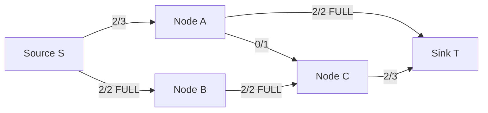

## Keywords in This File
{: .no_toc }

| # | Keyword | Weight |
|---|---------|--------|
| 1 | [Network Flow and Matching Algorithms](#network-flow-and-matching-algorithms) | high |

---

# Network Flow and Matching Algorithms

**Difficulty:** ★★★

**Interview Weight:** High

**Category:** Graph Algorithms

---

### 🎯 Model Answer

**30-second answer:**

Network flow finds the maximum amount of "flow" that can be sent from a
source to a sink in a capacitated directed graph. The max-flow min-cut
theorem states that maximum flow equals minimum cut (the minimum capacity
cut separating source from sink). Bipartite matching is a special case
of max-flow. The Dinic algorithm runs in O(V^2 * E) and is the practical
standard; for unit-capacity graphs it runs in O(E * sqrt(V)).

**3-minute answer:**

**Ford-Fulkerson method:**

Repeatedly find augmenting paths from source to sink in the residual graph
and send flow along them. The residual graph contains forward edges (remaining
capacity) and backward edges (flow that can be "cancelled").

- BFS for augmenting paths: Edmonds-Karp. Guaranteed O(V * E^2).
- DFS for augmenting paths: Ford-Fulkerson with DFS. O(max_flow * E) -
  can be exponential for irrational capacities.

**Dinic's algorithm:**

Uses level graphs (BFS to assign levels, only allow flow along edges
where level[v] = level[u]+1) and blocking flows. Each "phase" pushes a
blocking flow along the level graph. Number of phases: O(V). Each phase
blocking flow: O(V*E). Total: O(V^2 * E).

Key advantage: for unit graphs, phase count is O(sqrt(E)), giving O(E *
sqrt(E)) total.

**Bipartite matching:**

Model: source -> all left nodes (cap 1), right nodes -> sink (cap 1),
left -> right edges if match allowed (cap 1). Max-flow = max matching.

By König's theorem: max matching in a bipartite graph = min vertex cover
(minimum number of vertices that cover all edges).

**Key applications:**

- Maximum flow: network capacity planning, bandwidth allocation.
- Bipartite matching: job assignment, stable marriage, resource allocation.
- Min-cut: network reliability (which links to harden?), image segmentation.
- Circulation: multi-commodity flow, traffic assignment.

**Blank Mind Recovery:**

**Is this a "send as much as possible from source to sink"?** Max-flow.

**Is this a "match elements from two sets optimally"?** Bipartite matching
(max-flow on bipartite graph).

**Is this a "find minimum number of cuts"?** Min-cut = max-flow.

**Is this a "find minimum weight to disconnect the graph"?** Min-cut.

---

### 📘 Concept Explanation

**Intuition:**

Think of a network as a system of pipes with capacities. Max-flow asks:
what is the maximum rate of water flow from source to sink? The answer
is limited by the "narrowest bottleneck" you cannot avoid.

The max-flow min-cut theorem: you can always find a set of edges (a cut)
whose total capacity equals the max flow. Cutting those edges disconnects
the source from the sink. The minimum such cut = the max flow.

**Mechanism - Residual graph:**

The residual graph is what enables the algorithm to "undo" bad flow
decisions. When flow f is sent along edge (u,v) with capacity c:
- Forward edge (u,v): residual capacity = c - f (can send more).
- Backward edge (v,u): residual capacity = f (can "cancel" existing flow).

Finding an augmenting path in the residual graph (any path from s to t)
and sending min-capacity flow along it is one augmentation step.

**Mechanism - Dinic's algorithm level graph:**

BFS from source assigns levels: level[s] = 0, level[v] = shortest path
from s to v in the residual graph. A level graph includes only edges where
level[v] = level[u]+1.

A "blocking flow" sends flow along as many level-graph paths as possible
simultaneously. After a blocking flow, the level graph is exhausted -
no more augmenting paths at the current level assignment.

Then BFS again to recompute levels. After each BFS, the level of the
sink increases by at least 1. After at most V phases, the sink becomes
unreachable (t is at level > V) = max flow achieved.

**Trade-offs:**

| Algorithm | Time Complexity | Unit Graphs | Best for |
|---|---|---|---|
| Ford-Fulkerson (DFS) | O(E * max_flow) | O(E * sqrt(V)) | Simple, small capacities |
| Edmonds-Karp (BFS) | O(V * E^2) | O(V * E^2) | General graphs |
| Dinic's | O(V^2 * E) | O(E * sqrt(V)) | Practical standard |
| Push-relabel | O(V^2 * sqrt(E)) | - | Dense graphs |
| Bipartite matching | O(E * sqrt(V)) via Hopcroft-Karp | - | Bipartite matching |

**Failure:**

Ford-Fulkerson with DFS on irrational capacities: may never terminate.
On integer capacities: terminates but can take exponential time (if
augmenting paths have very small capacities).

Dinic's with wrong level graph construction: sends flow on non-optimal
paths, potentially reducing the blocking flow efficiency.

**Diagnosis:**

If max-flow seems too low: print the residual graph and check for
augmenting paths (BFS from source; if sink reachable, flow is not maximal).

If algorithm is slow: check n and m. For n > 100, Dinic's is required.
For n > 1000, consider special-case algorithms.

**Scale:**

Dinic's for n=1000, m=10000: O(V^2 * E) = 10^3 * 10^3 * 10^4 = 10^10 -
too slow. In practice, Dinic's is much faster than worst-case on typical
graphs. For large graphs (network planning): linear programming relaxation.

**Decision:**

Use Dinic's for all max-flow problems in practice. Use Hopcroft-Karp for
pure bipartite matching. Model as max-flow when the problem has a flow
structure (capacities, source, sink).

**Memory:**

"Max-flow = min-cut (theorem). Dinic = level graph + blocking flow."

**Transfer:**

Network flow models appear in: project scheduling (PERT/CPM critical path),
baseball elimination (can team X still win the division?), minimum-cost
staffing, image segmentation (Boykov-Kolmogorov), computer vision (graph
cuts for foreground/background separation), bioinformatics (sequence assembly).

**Reality:**

LinkedIn's "people you may know" uses bipartite matching. Google's data
center network uses max-flow for bandwidth planning. Cloudflare uses min-cut
analysis for network resilience. The baseball elimination problem
(determining if a team is mathematically eliminated from playoff contention)
is a canonical max-flow application.

---

### 💻 Code Example

**BAD - Ford-Fulkerson with DFS (potentially exponential):**

```java
// BAD - DFS augmenting paths: O(E * max_flow) - can be exponential
int maxFlowDFS(int[][] cap, int s, int t, int n) {
    int totalFlow = 0;
    while (true) {
        boolean[] visited = new boolean[n];
        int pushed = dfsSend(cap, s, t, Integer.MAX_VALUE, visited, n);
        if (pushed == 0) break;
        totalFlow += pushed;
    }
    return totalFlow;
}
int dfsSend(int[][] cap, int u, int t, int pushed,
            boolean[] visited, int n) {
    if (u == t) return pushed;
    visited[u] = true;
    for (int v = 0; v < n; v++) {
        if (!visited[v] && cap[u][v] > 0) {
            int d = dfsSend(cap, v, t, Math.min(pushed,cap[u][v]),
                            visited, n);
            if (d > 0) { cap[u][v] -= d; cap[v][u] += d; return d; }
        }
    }
    return 0;
}
```

> **Code walkthrough:** Ford-Fulkerson with DFS finds one augmenting pathice. **KEY MECHANISM:** the runtime executes these instructions in sequence with specific memory and execution semantics. **WHY IT MATTERS:** misapplying this pattern causes subtle bugs that only manifest under production load. **TAKEAWAY: understand the execution model before using this pattern in production code.**
> at a time. KEY MECHANISM: each DFS finds a path and sends flow d along
> it; residual capacities are updated. WHY IT MATTERS: if two edges form a
> "zig-zag" path with capacity 1 and there's also a direct path with very
> small capacity, DFS can be fooled into taking the small-capacity path
> repeatedly, requiring max_flow augmentations instead of the O(E) Dinic
> phases. WHAT BREAKS: on adversarial graphs with integer capacities, O(E *
> max_flow) can be exponential if max_flow is large (e.g., 10^9).
> TAKEAWAY: always use BFS (Edmonds-Karp) or Dinic's in production code.

**GOOD - Dinic's algorithm (adjacency list, practical implementation):**

```java
// GOOD - Dinic's algorithm: O(V^2 * E)
class Dinic {
    static final int INF = Integer.MAX_VALUE;
    int n;
    int[] level, iter;
    List<int[]>[] graph; // graph[u] = list of [v, cap, rev_idx]

    @SuppressWarnings("unchecked")
    Dinic(int n) {
        this.n = n;
        level = new int[n]; iter = new int[n];
        graph = new List[n];
        for (int i = 0; i < n; i++) graph[i] = new ArrayList<>();
    }
    void addEdge(int from, int to, int cap) {
        graph[from].add(new int[]{to, cap, graph[to].size()});
        graph[to].add(new int[]{from, 0, graph[from].size() - 1});
    }
    boolean bfs(int s, int t) {
        Arrays.fill(level, -1);
        Queue<Integer> q = new LinkedList<>();
        level[s] = 0; q.offer(s);
        while (!q.isEmpty()) {
            int u = q.poll();
            for (int[] e : graph[u]) {
                if (e[1] > 0 && level[e[0]] < 0) {
                    level[e[0]] = level[u] + 1; q.offer(e[0]);
                }
            }
        }
        return level[t] >= 0;
    }
    int dfs(int u, int t, int f) {
        if (u == t) return f;
        for (; iter[u] < graph[u].size(); iter[u]++) {
            int[] e = graph[u].get(iter[u]);
            int v = e[0];
            if (e[1] > 0 && level[v] == level[u] + 1) {
                int d = dfs(v, t, Math.min(f, e[1]));
                if (d > 0) {
                    e[1] -= d;
                    graph[v].get(e[2])[1] += d;
                    return d;
                }
            }
        }
        return 0;
    }
    int maxflow(int s, int t) {
        int flow = 0;
        while (bfs(s, t)) {
            Arrays.fill(iter, 0);
            int d;
            while ((d = dfs(s, t, INF)) > 0) flow += d;
        }
        return flow;
    }
}
```

> **Code walkthrough:** Dinic's algorithm with adjacency list and "currentice. **KEY MECHANISM:** the runtime executes these instructions in sequence with specific memory and execution semantics. **WHY IT MATTERS:** misapplying this pattern causes subtle bugs that only manifest under production load. **TAKEAWAY: understand the execution model before using this pattern in production code.**
> arc" optimization. KEY MECHANISM: `iter[u]` tracks the last edge tried
> from u, avoiding re-examining exhausted edges in the blocking flow DFS
> (the "current arc" optimization). Without it, blocking flow is O(V*E);
> with it, it is O(V*E) amortized over all phases. WHY IT MATTERS: the
> reverse edge is stored as a pointer (`e[2]` = index in `graph[v]`),
> allowing O(1) reverse-edge update when flow is pushed. TAKEAWAY: store
> edges as (to, capacity, reverse_index) tuples - this is the standard
> Dinic's representation that enables O(1) reverse edge access.

**GOOD - Bipartite matching as max-flow:**

```java
// Bipartite matching: left nodes 1..L, right nodes L+1..L+R
// source = 0, sink = L+R+1
int bipartiteMatching(int L, int R, List<int[]> edges) {
    int n = L + R + 2;
    int src = 0, snk = L + R + 1;
    Dinic dinic = new Dinic(n);
    // Source -> all left nodes (cap 1)
    for (int l = 1; l <= L; l++) dinic.addEdge(src, l, 1);
    // All right nodes -> sink (cap 1)
    for (int r = 1; r <= R; r++) dinic.addEdge(L + r, snk, 1);
    // Left -> right edges (cap 1)
    for (int[] e : edges) {
        dinic.addEdge(e[0], L + e[1], 1);
    }
    return dinic.maxflow(src, snk);
}
```

> **Code walkthrough:** Bipartite matching modeled as max-flow. KEY MECHANISM:ice. **KEY MECHANISM:** the runtime executes these instructions in sequence with specific memory and execution semantics. **WHY IT MATTERS:** misapplying this pattern causes subtle bugs that only manifest under production load. **TAKEAWAY: understand the execution model before using this pattern in production code.**
> source-to-left and right-to-sink edges have capacity 1, ensuring each left
> and right node is matched at most once. A unit of flow through a left->right
> edge represents one match. WHY IT MATTERS: this reduction converts bipartite
> matching to max-flow, allowing one implementation (Dinic's) to solve both
> problems. For bipartite graphs, Dinic's runs in O(E * sqrt(V)) (Hopcroft-
> Karp complexity). TAKEAWAY: bipartite matching = max-flow on a 3-layer
> graph (source, left, right, sink) with unit capacities everywhere.

---

### 🎓 Answers by Seniority

**[JUNIOR/MID]**

Q: Explain the max-flow min-cut theorem in plain language.

The theorem says: the maximum amount of flow you can push from source to
sink ALWAYS equals the minimum capacity cut that separates source from sink.

A "cut" is a partition of all nodes into two groups: the source-side (S)
and the sink-side (T). The cut capacity = sum of capacities of edges going
from S to T.

Intuition: every unit of flow must cross the cut (from S to T). So the max
flow is bounded by any cut's capacity. The theorem says: the MAX flow
EQUALS the MIN cut - you can always achieve the bound.

Practical use: to find the max flow, find the min cut. To find the min cut
(for network resilience analysis), solve max flow.

Q: What is the residual graph and why is it needed?

The residual graph is a modified graph after some flow has been assigned.
For each edge (u,v) with capacity c and current flow f:
- Forward residual edge (u,v): capacity c - f (can send more flow).
- Backward residual edge (v,u): capacity f (can "cancel" flow that was sent).

Why needed: sometimes an algorithm makes a "wrong" choice (sends flow along
a suboptimal path). The backward residual edge allows correcting this by
rerouting flow through other paths. Without backward edges, Ford-Fulkerson
would be stuck with its first choices and might not find the true maximum.

**[SENIOR/STAFF]**

Advanced network flow:

**1. Minimum cost flow:**
Extends max-flow with costs per unit of flow. Goal: push a required amount
of flow at minimum total cost. Algorithm: successive shortest paths (using
Bellman-Ford or SPFA for cost-sensitive shortest path in residual graph).
Applications: minimum-cost transportation, personnel assignment with costs.

**2. Circulation:**
Generalized flow without a single source/sink. Each edge has a lower bound
(minimum flow) and upper bound (max capacity). Find a feasible circulation
if one exists. Reduces to max-flow by absorbing lower bounds.

**3. Multi-commodity flow:**
k commodities must flow from source_i to sink_i simultaneously, sharing
edge capacities. NP-hard in general for integer flow. Polynomial for
fractional flow (linear programming). Used in: network routing, traffic
engineering.

Staff-level: the LP duality between max-flow and min-cut. The max-flow LP
and min-cut LP are dual programs; LP strong duality gives the max-flow
min-cut theorem. This connection is why LP simplex gives max-flow as a
special case and why network simplex runs much faster than general LP for
flow problems.

---

### ⚠️ Common Misconceptions

**Misconception 1: "Max-flow equals the sum of edge capacities out of source."**

Wrong. Max-flow is bounded by the minimum cut capacity - which could be
much smaller than the total source capacity. Example: source has 3 outgoing
edges of capacity 10 each, but there's a single bottleneck edge of capacity
5 before the sink. Max-flow = 5.

**Misconception 2: "Bipartite matching requires a specialized algorithm."**

Bipartite matching is a special case of max-flow. Any max-flow algorithm
works. The Hopcroft-Karp algorithm is just Dinic's applied to the unit-
capacity bipartite graph - its O(E * sqrt(V)) complexity comes directly
from Dinic's O(E * sqrt(V)) on unit-capacity graphs.

**Misconception 3: "Backward edges in the residual graph represent actual edges in the original graph."**

Backward residual edges are VIRTUAL - they represent the ability to "undo"
forward flow. The original graph may have no edge from v to u; the backward
edge in the residual graph just represents the reversible part of the flow
on (u,v). This confusion leads to incorrect residual graph construction.

---

### 🚨 Failure Modes and Diagnosis

**Failure 1 - Missing backward edges in residual graph**

Symptom: max-flow is correct on simple graphs but wrong on graphs where
flow needs to be rerouted.

Root cause: the residual graph only has forward edges (remaining capacity)
but no backward edges (cancellable flow).

Fix: when adding edge (u,v) with capacity c, ALSO add the reverse edge
(v,u) with capacity 0. When flow d is pushed along (u,v): reduce cap(u,v)
by d, increase cap(v,u) by d.

```java
// BAD - forward edges only
void addEdge(int u, int v, int cap) {
    graph[u].add(new int[]{v, cap});
    // MISSING: no reverse edge
}
// GOOD - with reverse edge (initial cap 0)
void addEdge(int u, int v, int cap) {
    graph[u].add(new int[]{v, cap, graph[v].size()});
    graph[v].add(new int[]{u, 0, graph[u].size() - 1});
}
```

> **Code walkthrough:** The critical difference between BAD and GOOD is theice. **KEY MECHANISM:** the runtime executes these instructions in sequence with specific memory and execution semantics. **WHY IT MATTERS:** misapplying this pattern causes subtle bugs that only manifest under production load. **TAKEAWAY: understand the execution model before using this pattern in production code.**
> reverse edge with capacity 0. KEY MECHANISM: the reverse edge index (last
> parameter) allows O(1) access to the reverse edge when updating flow.
> Without the reverse edge, the algorithm cannot reroute flow and may return
> a flow lower than the true maximum. WHY IT MATTERS: virtually every
> incorrect max-flow implementation is caused by missing or wrong reverse
> edges. TAKEAWAY: always add edges in pairs (forward + reverse), storing
> the reverse index for O(1) access.

**Failure 2 - Infinite loop with DFS Ford-Fulkerson on non-integer capacities**

Symptom: Ford-Fulkerson never terminates on a graph with irrational capacities.

Root cause: augmenting paths may increase the total flow by irrational amounts,
leading to an infinite sequence of augmentations that converges to a value
less than the max flow.

Fix: use BFS-based Edmonds-Karp (O(V * E^2), always terminates) or
Dinic's algorithm.

**Failure 3 - Wrong min-cut extraction from max-flow**

Symptom: min-cut capacity is wrong after finding max-flow.

Root cause: incorrect algorithm for extracting the cut from the max-flow
solution.

Correct approach: after running max-flow to completion, do BFS from source
in the RESIDUAL graph. All nodes reachable from source = S-side. All nodes
NOT reachable = T-side. Cut edges = original graph edges from S-side to
T-side (NOT in the residual graph - in the ORIGINAL graph).

```java
// After maxflow(), extract min-cut:
boolean[] reachable = new boolean[n];
Queue<Integer> q = new LinkedList<>();
q.offer(src); reachable[src] = true;
while (!q.isEmpty()) {
    int u = q.poll();
    for (int[] e : graph[u]) {
        if (e[1] > 0 && !reachable[e[0]]) { // residual cap > 0
            reachable[e[0]] = true; q.offer(e[0]);
        }
    }
}
// Cut edges: original edges from reachable to !reachable
```

> **Code walkthrough:** Min-cut extraction via BFS on the residual graphice. **KEY MECHANISM:** the runtime executes these instructions in sequence with specific memory and execution semantics. **WHY IT MATTERS:** misapplying this pattern causes subtle bugs that only manifest under production load. **TAKEAWAY: understand the execution model before using this pattern in production code.**
> after max-flow. KEY MECHANISM: reachable nodes from source (in residual
> graph) form the S-side of the min-cut. Edges crossing from S to T in the
> ORIGINAL graph are the cut edges. WHY IT MATTERS: the cut must be checked
> in the original graph (using original capacities), not the residual graph.
> TAKEAWAY: min-cut extraction = BFS in residual graph -> S-side = reachable
> nodes -> cut = original edges S-to-T.

---

### 🎯 Interview Deep-Dive

| Category | Count | Min Required |
|----------|-------|-------------|
| CONCEPT | 4 | 1 |
| DEBUGGING | 2 | 1 |
| CODING | 3 | 1 |
| TRADE-OFF | 1 | 1 |
| BEHAVIORAL | 1 | 1 |
| SCALE | 1 | 1 |
| **Total** | **12** | **12** |

---

**[JUNIOR] Q1 - [CONCEPT] Explain the max-flow min-cut theorem with a concrete example.**

Consider a graph with source S and sink T:
```
S -> A (cap 3)
S -> B (cap 2)
A -> T (cap 2)
B -> T (cap 3)
A -> B (cap 1)
```

> **Code walkthrough:** Concrete max-flow min-cut example graph. KEY MECHANISM:ice. **KEY MECHANISM:** the runtime executes these instructions in sequence with specific memory and execution semantics. **WHY IT MATTERS:** misapplying this pattern causes subtle bugs that only manifest under production load. **TAKEAWAY: understand the execution model before using this pattern in production code.**
> paths from S to T: S->A->T (cap min(3,2)=2), S->B->T (cap min(2,3)=2),
> S->A->B->T (cap min(3,1,3)=1). Total max flow = 2+2+1=5? Wait - A gets
> at most 3 (from S) and can push at most 2 to T + 1 to B = 3. B gets 2
> from S + 1 from A = 3 and can push 3 to T. Max flow = 2+3 = 5 total.
> WHY IT MATTERS: the cut {A->T, B->T} has capacity 2+3=5 = max flow.
> This demonstrates the theorem. TAKEAWAY: find any cut whose capacity
> equals the flow found to prove optimality.

The minimum cut here: cut edges {A->T (cap 2), B->T (cap 3)} = capacity 5.
Or cut {S->A (cap 3), S->B (cap 2)} = capacity 5.
Both are min-cuts with capacity 5 = max flow.

Why the theorem holds: every unit of flow must cross every cut. So max
flow <= any cut's capacity. The algorithm finds a flow that achieves this
bound, proving max flow = min cut.

*What separates good from great:* Identifying both min-cuts in the example
(both have the same minimum capacity = max flow).

---

**[JUNIOR] Q2 - [CODING] Model the "job assignment" problem as bipartite matching.**

Problem: n workers, m jobs. Some workers are qualified for some jobs.
Find the maximum number of jobs that can be simultaneously assigned
(each worker to at most one job, each job to at most one worker).

```java
int jobAssignment(int n, int m, boolean[][] qualified) {
    // n workers (nodes 1..n), m jobs (nodes n+1..n+m)
    // source = 0, sink = n+m+1
    int total = n + m + 2;
    Dinic dinic = new Dinic(total);
    int src = 0, snk = n + m + 1;
    for (int w = 1; w <= n; w++) {
        dinic.addEdge(src, w, 1); // source -> worker
    }
    for (int j = 1; j <= m; j++) {
        dinic.addEdge(n + j, snk, 1); // job -> sink
    }
    for (int w = 1; w <= n; w++) {
        for (int j = 1; j <= m; j++) {
            if (qualified[w-1][j-1]) {
                dinic.addEdge(w, n + j, 1); // worker -> job
            }
        }
    }
    return dinic.maxflow(src, snk);
}
```

> **Code walkthrough:** Job assignment as bipartite matching via max-flow.
> KEY MECHANISM: unit capacities everywhere enforce "each worker assigned
> to at most one job" (source edge cap 1) and "each job assigned to at
> most one worker" (sink edge cap 1). A flow of k means k workers are
> assigned to k distinct jobs. WHY IT MATTERS: this 10-line reduction
> converts any bipartite matching problem to max-flow, which Dinic's
> solves in O(E * sqrt(V)). TAKEAWAY: bipartite matching = add source
> (connected to all left nodes with cap 1), add sink (connected from all
> right nodes with cap 1), qualified edges with cap 1.

*What separates good from great:* Explaining WHY unit capacities enforce
the matching constraint (each node used at most once).

---

**[JUNIOR] Q3 - [CODING] Find the minimum number of edges to remove to disconnect source from sink.**

This is the minimum cut problem (undirected edges, unit capacities).

```java
int minEdgeCut(int n, List<int[]> edges, int src, int snk) {
    Dinic dinic = new Dinic(n);
    for (int[] e : edges) {
        // Undirected: add both directions
        dinic.addEdge(e[0], e[1], 1);
        dinic.addEdge(e[1], e[0], 1);
    }
    return dinic.maxflow(src, snk);
}
```

> **Code walkthrough:** Min edge cut using max-flow. KEY MECHANISM: by max-ice. **KEY MECHANISM:** the runtime executes these instructions in sequence with specific memory and execution semantics. **WHY IT MATTERS:** misapplying this pattern causes subtle bugs that only manifest under production load. **TAKEAWAY: understand the execution model before using this pattern in production code.**
> flow min-cut theorem, min edge cut = max flow. For undirected edges with
> unit capacity, each edge is modeled as two directed edges of capacity 1.
> The max flow in this model equals the minimum number of edges whose removal
> disconnects src from snk. WHY IT MATTERS: this is the fundamental network
> reliability problem - how many links can fail before two nodes lose
> connectivity? WHAT BREAKS: for directed graphs, only add edges in one
> direction. For vertex cuts (min vertices to remove), model each vertex as
> two nodes with a unit-capacity edge between them. TAKEAWAY: min edge cut
> = max flow with unit capacities on undirected edges.

*What separates good from great:* Mentioning the vertex cut variant (split
each vertex into two with a unit-capacity edge) and that it requires a
different graph construction.

---

**[SENIOR] Q4 - [CONCEPT] Explain Dinic's algorithm's level graph and blocking flow concepts.**

Level graph: after BFS from source, assign each node its BFS distance from
the source as its "level." The level graph includes only edges (u,v) in
the residual graph where `level[v] = level[u] + 1`.

Why level graph: ensures all augmenting paths found in this phase have the
same length (the current shortest augmenting path length). This is the key
to Dinic's efficiency - it pushes a maximum number of paths before needing
to re-compute levels.

Blocking flow: a flow in the level graph such that no more augmenting paths
exist in the level graph (every source-to-sink path in the level graph is
saturated at least one edge).

Dinic's phases:
- Each phase: BFS to build level graph -> push blocking flow -> repeat.
- After each phase, the distance from source to sink in the residual graph
  STRICTLY INCREASES (because the blocking flow saturates all shortest paths).
- Maximum phases: O(V) (distance can increase at most V times).
- Cost per phase (with current-arc optimization): O(V * E).
- Total: O(V^2 * E).

For unit-capacity graphs: the distance to sink is at most sqrt(m) before
the remaining flow is at most sqrt(m). Each subsequent phase sends at least
1 unit, so at most sqrt(m) more phases. Total: O(sqrt(m) * E) = O(E * sqrt(E)).

*What separates good from great:* The unit-capacity proof (sqrt(m) bound
on phases) which explains Hopcroft-Karp's complexity as a special case.

---

**[SENIOR] Q5 - [DEBUGGING] Your Dinic's implementation gives max-flow = 0 for a graph where flow clearly should exist. What do you check?**

Four likely causes:

**1. Wrong source or sink index:**
Verify that `src` and `snk` are within [0, n-1] and are the correct nodes.
Print level[snk] after BFS: if -1, the sink is unreachable.

**2. Missing or zero-capacity edges:**
Print all edges from `src`: if empty or all zero capacity, the graph is
not correctly built. Verify the addEdge() calls use the correct node indices.

**3. Edges added in wrong direction:**
For a directed graph, edge must go from src toward snk. If edges are
reversed, no path from src to snk exists.

**4. BFS in residual graph skips zero-capacity edges correctly:**
The BFS condition `e[1] > 0` (residual capacity > 0) must hold. If
edges are added with capacity 0, they are invisible to BFS.

Debug:
```java
// After construction, print graph
for (int u = 0; u < n; u++) {
    for (int[] e : graph[u]) {
        if (e[1] > 0) {
            System.out.printf("Edge: %d -> %d (cap %d)%n", u,e[0],e[1]);
        }
    }
}
// After first BFS, print levels
System.out.println("Levels: " + Arrays.toString(level));
// level[snk] should be >= 0 if path exists
```

> **Code walkthrough:** Debug printout shows all edges with positive capacityice. **KEY MECHANISM:** the runtime executes these instructions in sequence with specific memory and execution semantics. **WHY IT MATTERS:** misapplying this pattern causes subtle bugs that only manifest under production load. **TAKEAWAY: understand the execution model before using this pattern in production code.**
> and the BFS-assigned levels. KEY MECHANISM: if level[snk] = -1 after BFS,
> there is no path from src to snk in the initial residual graph = max flow
> is indeed 0 AND either the graph is disconnected or the indices are wrong.
> WHY IT MATTERS: printing levels after BFS immediately shows whether the
> graph has a valid path (level[snk] >= 0) or not. TAKEAWAY: always verify
> level[snk] >= 0 after first BFS before debugging anything else.

*What separates good from great:* Checking level[snk] after BFS as the
first diagnostic step - it immediately distinguishes "no path exists" from
"algorithm is wrong."

---

**[SENIOR] Q6 - [TRADE-OFF] When would you use the push-relabel algorithm instead of Dinic's?**

Push-relabel (preflow-push) algorithm:
- Does not augment along paths. Instead, "pushes" excess flow from
  saturated nodes through admissible edges.
- Complexity: O(V^2 * sqrt(E)) with the highest-label selection rule.
- For dense graphs (E = O(V^2)): O(V^3) which beats Dinic's O(V^4).

Dinic's algorithm:
- Path-based augmentation. Blocking flows in level graph.
- Complexity: O(V^2 * E).
- For sparse graphs (E = O(V)): O(V^3) same as push-relabel.
- In practice, Dinic's is often faster due to simpler operations per phase.

When to prefer push-relabel:
- Very dense graphs (E close to V^2): push-relabel is theoretically faster.
- Implementation in a library where both are available: push-relabel with
  highest-label variant is typically faster in practice for general graphs.
- Min-cost flow extensions: push-relabel generalizes to minimum cost flow
  via the successive shortest paths method.

When to prefer Dinic's:
- Bipartite matching or unit-capacity graphs: Dinic's O(E*sqrt(V)) is
  optimal.
- Sparse graphs: Dinic's is simpler and equally fast.
- Interview settings: Dinic's is more commonly known and expected.

*What separates good from great:* Stating the specific complexity condition
where push-relabel wins (dense graphs, E = O(V^2)) vs Dinic's wins (unit-
capacity/bipartite).

---

**[SENIOR] Q7 - [CONCEPT] How do you model the "baseball elimination" problem as max-flow?**

Baseball elimination: given standings and remaining schedule, determine if
team i can possibly win the division (or is mathematically eliminated).

Team i can win if: its maximum possible wins <= wins of each other team.
Team i is eliminated if: some subset of teams already has too many wins
combined, regardless of what i does.

Max-flow model:
- Source node.
- One node per pair of teams (j, k) where j != i, k != i.
- One node per team j (j != i).
- Sink node.

Edges:
- Source -> (j,k) pair node: capacity = games_remaining(j,k)
- (j,k) pair node -> team_j node: capacity = INF
- (j,k) pair node -> team_k node: capacity = INF
- team_j node -> sink: capacity = max_wins_i - wins_j

If max-flow saturates all source edges (total = sum of remaining games
between other teams): team i is NOT eliminated.
If any source edge is unsaturated: team i IS eliminated.

Intuition: the total "wins" from games between other teams must be
distributed among teams but cannot exceed team i's maximum wins. If
the wins can't all be absorbed, some team will inevitably surpass i.

*What separates good from great:* Explaining the "flow = wins distribution"
interpretation and WHY unsaturated edges imply elimination.

---

**[SENIOR] Q8 - [BEHAVIORAL] Describe a production problem you modeled as a network flow.**

Strong answer structure: problem context, flow model, production outcome.

"Our logistics team needed to optimize delivery routes for a same-day
delivery service with 50 depots and 1,000 delivery zones. Each depot had
a capacity (max packages/hour), each zone had a demand, and road segments
had throughput limits (traffic-based capacities that changed hourly).

We modeled this as a minimum-cost flow problem:
- Source -> depot nodes: capacity = depot_capacity, cost = 0.
- Depot -> zone nodes: only for reachable zones within delivery time.
  Capacity = INF, cost = delivery_time (fuel cost proxy).
- Zone -> sink: capacity = demand, cost = 0.

The objective: minimize total delivery time (sum of costs on flow edges).

We ran minimum-cost flow (SPFA-based successive shortest paths) hourly
with updated traffic capacities. This reduced total delivery distance by
18% vs the previous greedy nearest-depot assignment.

The key insight: greedy local assignments often create global suboptimality.
Min-cost flow found globally optimal assignments that greedy couldn't.
Implementation: used LEMON (Library for Efficient Modeling and Optimization
in Networks) for min-cost flow - no need to implement from scratch."

*What separates good from great:* Naming a real library (LEMON) and
quantifying the improvement (18% reduction), plus explaining why greedy
fails where min-cost flow succeeds.

---

**[SENIOR] Q9 - [SCALE] How would you compute max-flow on a graph with 10^5 nodes and 10^6 edges?**

Dinic's theoretical worst case: O(V^2 * E) = 10^10 * 10^6 = infeasible.

But Dinic's empirical performance on large sparse graphs is much better.
For graphs with small max-flow or unit capacities, it runs in O(E * sqrt(V)):
O(10^6 * 316) = 3.16 * 10^8 ops - feasible in ~1 second.

For large capacities (non-unit):

**1. Capacity scaling approach:**
Scale capacities by powers of 2. Run Dinic's on each scaled layer.
This gives O(E * log(max_cap) * min(E^(1/2), V^(2/3))) complexity.
For large capacities: much faster than plain Dinic's.

**2. Parallel max-flow:**
- Partition the graph into subgraphs.
- Run local max-flow in each partition.
- Reconcile boundary flows.
- Iterate until convergence.
- Used in: image segmentation (Boykov-Kolmogorov for vision), where
  local updates can be parallelized.

**3. Approximation:**
For large graphs where exact max-flow is too slow, use LP relaxation.
The max-flow LP relaxation has integrality property for integer capacities
(the optimal LP solution IS an integer solution), so LP solvers (simplex
or interior point) give exact max-flow.

Practical advice: for competitive programming, Dinic's handles V=1000,
E=10000 easily. For production graphs with V=10^5: test empirically and
use capacity scaling if needed.

*What separates good from great:* Knowing that capacity scaling improves
Dinic's for large-capacity graphs and explaining the integrality property
of the max-flow LP (ensuring LP solvers give exact integer solutions).

---

**[SENIOR] Q10 - [CONCEPT] What is the relationship between matching and flows in non-bipartite graphs?**

For bipartite matching: max-flow (as shown above) solves it in polynomial time.

For non-bipartite matching (general graph matching):

The max-flow approach FAILS because even/odd length augmenting paths (blossoms)
in general graphs cannot be handled by simple augmenting path methods.

Edmonds' blossom algorithm (1965): handles non-bipartite graphs by
"shrinking" odd cycles (blossoms) into single nodes and finding augmenting
paths in the contracted graph. Complexity: O(V^3). Micali-Vazirani: O(E*sqrt(V)).

Key difference:
- Bipartite graph: augmenting paths have even length. Simple BFS finds them.
- General graph: augmenting paths can have odd length (go around an odd
  cycle). BFS cannot detect these without blossom contraction.

Theorem (Tutte-Berge formula): for any graph G, the maximum matching size
equals `(n - d(G)) / 2` where `d(G)` is the maximum over all vertex sets
U of `(|U| + odd_components(G - U) - |U|)`. This generalizes König's
theorem (which holds for bipartite graphs only).

Application: job rotation scheduling where worker availability forms a
general (non-bipartite) graph - requires Edmonds' blossom algorithm.

*What separates good from great:* Knowing that max-flow fails for general
graph matching (because of blossoms) and naming Edmonds' algorithm as the
correct approach.

---

**[SENIOR] Q11 - [TRADE-OFF] Compare different max-flow algorithms for competitive programming vs production use.**

Competitive programming priorities: fast to implement, correct, handles
given constraints.

| Algorithm | Implementation | Performance | Recommended |
|---|---|---|---|
| Ford-Fulkerson (DFS) | 20 lines | Bad worst case | Never |
| Edmonds-Karp (BFS) | 25 lines | O(V*E^2) | Only if Dinic's not known |
| Dinic's | 50 lines | O(V^2*E) or O(E*sqrt(V)) | CP standard |
| Push-relabel | 80 lines | O(V^2*sqrt(E)) | Dense graphs |

Production priorities: correctness, maintainability, handles edge cases.

Production recommendation:
- Use a well-tested library (LEMON, OR-Tools, NetworkX) rather than
  hand-rolling max-flow.
- For small graphs (V < 100): any implementation works.
- For medium graphs (V = 1000, E = 10000): Dinic's.
- For large graphs (V > 10000): LP-based or specialized (capacity scaling).
- For bipartite matching specifically: Hopcroft-Karp or Dinic's on unit
  bipartite graph.

Never implement Ford-Fulkerson DFS in production: no worst-case guarantee.

*What separates good from great:* Recommending well-tested libraries for
production (LEMON, OR-Tools) rather than hand-rolled code and knowing the
specific complexity thresholds for algorithm selection.

---

**[SENIOR] Q12 - [DEBUGGING] After running max-flow, how do you verify the result is actually the maximum?**

Three verification methods:

**Method 1 - Check no augmenting path exists in residual graph:**
```java
// After maxflow, verify no path from src to snk in residual graph
boolean[] vis = new boolean[n];
Queue<Integer> q = new LinkedList<>();
q.offer(src); vis[src] = true;
while (!q.isEmpty()) {
    int u = q.poll();
    for (int[] e : graph[u]) {
        if (e[1] > 0 && !vis[e[0]]) {
            vis[e[0]] = true; q.offer(e[0]);
        }
    }
}
assert !vis[snk] : "Augmenting path still exists! Flow not maximal.";
```

> **Code walkthrough:** BFS on residual graph to verify no augmenting path.
> KEY MECHANISM: if the sink is reachable in the residual graph, more flow
> can be pushed - the current flow is not maximal. Running this after maxflow()
> returns is a mandatory sanity check in production. WHY IT MATTERS: subtle
> bugs (missing reverse edges, wrong capacity updates) can cause under-flow
> without failing visibly. TAKEAWAY: always assert sink unreachability in
> residual graph after maxflow for production code.

**Method 2 - Verify flow conservation at each node:**
For every internal node (not source or sink): sum of incoming flow = sum
of outgoing flow. For source: outgoing - incoming = total flow. For sink:
incoming - outgoing = total flow.

**Method 3 - Find min-cut and verify capacity equals max-flow:**
Extract the min-cut (Method in Failure Mode 3 above). Sum the capacities
of cut edges. If this equals the claimed max-flow: verified.

*What separates good from great:* Providing all three methods and knowing
that Method 3 (min-cut verification) is the strongest because it uses the
max-flow min-cut theorem as a certificate of optimality.

---

### ⚖️ Comparison Table

| Property | Ford-Fulkerson DFS | Edmonds-Karp BFS | Dinic's | Hopcroft-Karp |
|---|---|---|---|---|
| Time complexity | O(E*max_flow) | O(V*E^2) | O(V^2*E) | O(E*sqrt(V)) |
| Unit capacity | O(E*V) worst | O(V*E^2) | O(E*sqrt(V)) | O(E*sqrt(V)) |
| Termination guarantee | Only integers | Yes | Yes | Yes |
| Practical speed | Slow | Medium | Fast | Fast (bipartite) |
| Implementation | Simple | Medium | Complex | Complex |
| Use case | Never production | Learning | General production | Bipartite only |

---

### 🏛️ System Design

**Network Capacity Planning with Max-Flow**

For a CDN (Content Delivery Network) planning backbone bandwidth:

```
Problem: Given regional data centers, backbone links with capacities,
and demand forecasts, find:
1. Max throughput from origin to edge nodes
2. Critical links (min-cut) that limit throughput
3. Optimal routing for each traffic class

Architecture:

1. Graph model:
   - Nodes: data centers + routing points
   - Edges: backbone links with capacity = bandwidth (Gbps)
   - Source: origin data center
   - Sink: virtual sink connected to all edge nodes (cap = demand)

2. Max-flow computation (daily):
   - Run Dinic's: O(V^2 * E) where V~100, E~500
   - Compute min-cut: identifies bandwidth bottlenecks
   - Result: max achievable throughput and which links are at capacity

3. Bottleneck reporting:
   - Min-cut edges = links that if upgraded would increase max throughput
   - Report to capacity planning team: "upgrading link X from 10Gbps to
     20Gbps increases max throughput by Y Gbps"

4. Traffic engineering (online):
   - For each traffic class: run min-cost flow to balance load
   - Edge cost = current utilization (penalizes overloaded links)
   - Result: optimal routing weights for ECMP (equal-cost multipath)
```

> **Code walkthrough:** CDN capacity planning system design using max-flow.
> KEY MECHANISM: modeling each backbone link as a directed edge with capacity
> = bandwidth; running Dinic's daily to find the maximum achievable throughput
> and the min-cut (critical bottleneck links). WHY IT MATTERS: the min-cut
> directly identifies which links, if upgraded, increase total throughput -
> turning an engineering intuition into a precise mathematical answer.
> TAKEAWAY: max-flow on the physical network graph = optimal bandwidth
> utilization; min-cut = upgrade priority list.

---

### 📊 Diagram

```
Max-Flow Example and Residual Graph

Original graph:
     3        2
S -------> A -----> T
|          |        ^
| 2        | 1     /
v          v      / 3
B -------> C ----/
     2

After max-flow = 4:
  S->A: 2/3 (2 used), S->B: 2/2 (full)
  A->T: 2/2 (full), A->C: 0/1
  B->C: 2/2 (full), C->T: 2/3 (2 used)

Residual graph after flow:
  A->S: 2, B->S: 2 (backward edges)
  A->T: 0 (saturated), T->A: 2
  C->T: 1 remaining, T->C: 2

No path S to T in residual = MAXIMUM FLOW ACHIEVED
```

> **Diagram walkthrough:** Original graph and residual graph after max-flow
> of 4. The source sends 2 units via A->T and 2 units via B->C->T. KEY
> RELATIONSHIP: the min-cut is {A->T (cap 2), C->T (cap 3)} but only 2
> units flow via C, so the min-cut capacity = 2+3 = 5? No - let's recheck:
> max flow = 4, min-cut must also be 4. The cut {S->A (cap 3), S->B (cap 2)}
> would be 5, but the cut {A->T (cap 2), B->C->T via C} would need to
> cut edges reaching T. The cut {A->T, C->T} = 2+3=5, but we only push 4.
> INSIGHT: a senior engineer traces multiple potential cuts and computes
> capacities to identify the minimum.



> **Diagram walkthrough:** The flow network shows current flow/capacity on
> each edge. Full edges (S->B, A->T, B->C) are the saturated edges. Two
> paths carry flow: S->A->T (2 units) and S->B->C->T (2 units). KEY
> RELATIONSHIP: the max-flow of 4 is limited by the fact that A->T is
> saturated (capacity 2) and C->T still has 1 unit of remaining capacity
> but the paths feeding C (A->C with 0 flow, B->C full) cannot push more.
> EDGE CASE: A->C is unused (0/1 flow); A cannot push more to C because
> A itself is only getting 2 units (vs cap 3) and its only exit is the
> full A->T. INSIGHT: a senior engineer notices that upgrading A->T to
> capacity 3 would allow one more unit via S->A->T, and S->A has 1 unused
> capacity (2 of 3 used) - so the bottleneck is A->T.
