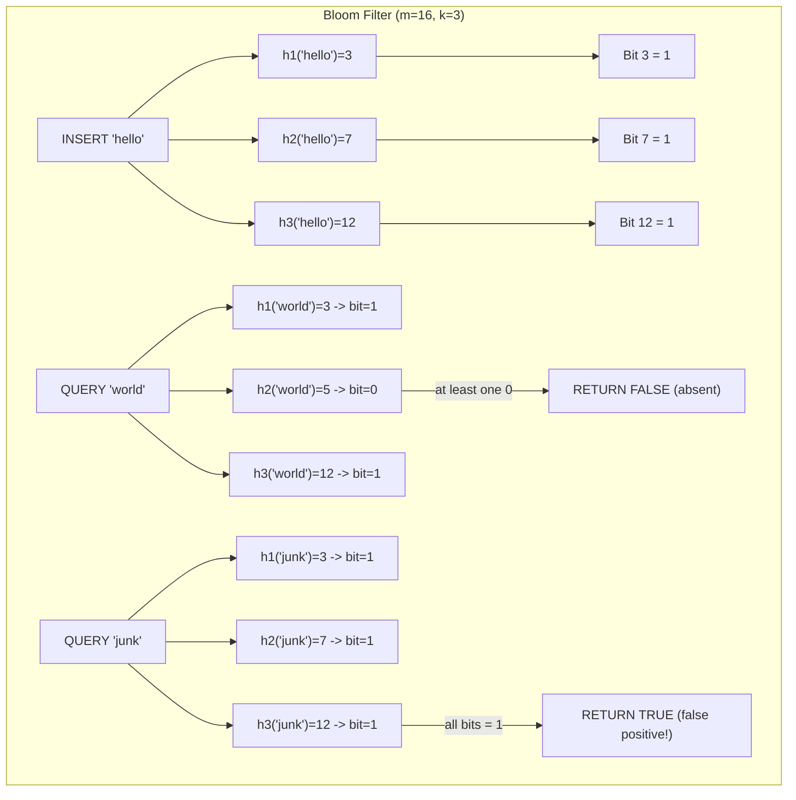

## Keywords in This File
{: .no_toc }

| # | Keyword | Weight |
|---|---------|--------|
| 1 | [Randomized Algorithms and Expected Complexity](#randomized-algorithms-and-expected-complexity) | high |

---

# Randomized Algorithms and Expected Complexity

**Difficulty:** ★★★

**Interview Weight:** High

**Category:** Algorithm Design

---

### 🎯 Model Answer

**30-second answer:**

Randomized algorithms use random choices to achieve expected time or space
bounds that deterministic algorithms cannot match. Two main types: Las Vegas
(always correct, random runtime) and Monte Carlo (always fast, probabilistic
correctness). Randomized quicksort achieves O(n log n) expected with no
adversarial worst case. Reservoir sampling samples k items uniformly from
a stream of unknown length in O(n) time and O(k) space. Bloom filters
provide O(1) probabilistic set membership with tunable false-positive rate.

**3-minute answer:**

**Las Vegas vs Monte Carlo:**

Las Vegas algorithms (e.g., randomized quicksort): always produce the
correct answer but their runtime is random. We can bound the expected
runtime (e.g., O(n log n) expected) but the algorithm may occasionally
take longer. You can stop and restart without losing correctness.

Monte Carlo algorithms (e.g., Bloom filter): always terminate in bounded
time but may produce an incorrect answer with probability p. You can
reduce p by repeating the algorithm or using more memory, trading accuracy
for speed/space.

**Randomized quicksort:**

Randomly choose the pivot at each step. Expected O(n log n) comparisons
regardless of input. The random choice eliminates any adversarial worst-case
input (the sorted array attack on deterministic pivot selection).

Analysis: expected comparisons = O(n log n) by linearity of expectation.
For each pair (i, j), they are compared iff one is chosen as pivot before
any other element between them (probability 2/(j-i+1)). Sum over all pairs.

**Reservoir sampling (Algorithm R):**

Sample k items uniformly at random from a stream of unknown length n.

- Keep the first k items.
- For item i > k: with probability k/i, replace a random item in the
  reservoir with item i.

After seeing all n items, each item has probability k/n of being in the
reservoir (uniform). Space: O(k). Time: O(n).

**Bloom filters:**

Probabilistic data structure for set membership queries.
- k hash functions, bit array of size m.
- INSERT(x): set bits at positions h1(x), h2(x), ..., hk(x) to 1.
- QUERY(x): return true iff ALL k bits are set.
- False positive rate: (1 - e^(-kn/m))^k for n insertions.
- No false negatives. No deletions (without counting bloom filter).
- Optimal k = (m/n) * ln(2) minimizes false positive rate.

**Blank Mind Recovery:**

**Random choice eliminates adversarial input?** Las Vegas randomized
algorithm (randomized quicksort).

**Sample k items from unknown stream?** Reservoir sampling (Algorithm R).

**Fast probabilistic set membership, no deletions?** Bloom filter.

**Fast approximate counting (distinct elements)?** HyperLogLog.

---

### 📘 Concept Explanation

**Intuition:**

Randomization "breaks the adversary." Any deterministic algorithm can be
defeated by an adversary who knows the algorithm and crafts a worst-case
input. A randomized algorithm uses coin flips that the adversary cannot
predict or control, so no single input is always bad.

Expected complexity: O(n log n) expected for randomized quicksort means
the average over all possible random pivot choices is n log n. For any
fixed input, the algorithm is fast on average over its own randomness.

**Mechanism - Randomized quicksort analysis:**

For each pair (i, j) of elements (assuming sorted order), define indicator
variable X_ij = 1 if i and j are compared during the sort.

i and j are compared iff one of them is chosen as pivot BEFORE any element
between them in sorted order. Probability = 2 / (j - i + 1).

Expected comparisons:
`E[total] = sum over all pairs (i,j) of E[X_ij] = sum 2/(j-i+1)`

This sum = O(n log n). (Sum over all gaps: n * sum_{k=1}^{n} 2/k = O(n log n).)

**Mechanism - Bloom filter false positive rate:**

After inserting n elements with k hash functions into a bit array of size m:
- Probability a given bit is 0: `(1 - 1/m)^(kn) ≈ e^(-kn/m)`.
- False positive probability (all k bits set by other elements):
  `(1 - e^(-kn/m))^k`.

Optimal m for n elements and target FPR f:
`m = -n * ln(f) / (ln(2))^2`

Optimal k: `k = (m/n) * ln(2) ≈ 0.693 * m/n`

For 1% FPR: need ~9.6 bits per element. For 0.1% FPR: ~14.4 bits per element.

**Trade-offs:**

| Algorithm | Type | Time | Space | Correctness |
|---|---|---|---|---|
| Randomized quicksort | Las Vegas | O(n log n) expected | O(log n) | Always |
| Reservoir sampling | Las Vegas | O(n) | O(k) | Always |
| Bloom filter | Monte Carlo | O(k) | O(m) | FPR tunable |
| HyperLogLog | Monte Carlo | O(n) | O(log log n) | ~2% error |
| Skip list | Las Vegas | O(log n) expected | O(n) | Always |
| Treap | Las Vegas | O(log n) expected | O(n) | Always |
| Karger min-cut | Monte Carlo | O(V^2) | O(V) | Prob 2/n^2 |

**Failure:**

Bloom filter with bad hash functions (correlated hashes): bits cluster
together, reducing effective bit array utilization. False positive rate
becomes much higher than predicted by the formula.

Reservoir sampling with wrong probability: if `Math.random() < k/i` uses
integer division (k/i = 0 for k<i), every item after position k is rejected.

**Diagnosis:**

Bloom filter: measure actual FPR on a validation set. If FPR > theoretical:
check hash function independence (use separate polynomial hash functions,
not MD5/SHA substrings of each other).

Reservoir sampling: verify by running 10^6 trials with n=10, k=3 and
measuring the frequency of each element in the reservoir. Should be ~30%
for each element.

**Scale:**

Bloom filter for 10^9 URLs (web crawler seen-set) at 1% FPR:
`m = 10^9 * 9.6 bits = 1.2 GB`. vs. HashSet at ~40 bytes/URL = 40 GB.
33x space reduction. Used in Cassandra, Redis, BigTable.

HyperLogLog for distinct user counts across 10^8 daily events:
12 KB of state vs 10^8 * 8 bytes = 800 MB for exact counting.

**Decision:**

Need exact membership? HashSet. Need approximate membership with small
space? Bloom filter. Need uniform stream sample? Reservoir sampling.
Need approximate distinct count? HyperLogLog. Need randomized balance
without complex rotations? Treap or skip list.

**Memory:**

"Las Vegas = always correct, random time. Monte Carlo = always fast,
probabilistic correct. Bloom = O(k) query, no false negatives."

**Transfer:**

Randomized techniques appear everywhere: TrueSkill (Xbox ranking) uses
Bayesian approximate inference; Content-addressable storage uses hash-
based probabilistic deduplication; Locality-Sensitive Hashing (LSH) uses
randomized projections for approximate nearest-neighbor search in high
dimensions (used in recommendation systems); SimHash (used by Google for
near-duplicate detection) is a random projection technique.

**Reality:**

Apache Kafka uses reservoir sampling for topic partition rebalancing
statistics. Google Bigtable uses Bloom filters for SSTable row existence
checks (avoids disk reads for missing keys). Redis has a built-in Bloom
filter module. Elasticsearch uses HyperLogLog++ for cardinality aggregations.
Java's `Collections.shuffle()` uses Fisher-Yates (a simpler randomized
sampling algorithm).

---

### 💻 Code Example

**BAD - Deterministic quicksort with fixed pivot (adversarial input risk):**

```java
// BAD - always picks first element as pivot
// Sorted input causes O(n^2) worst case
void deterministicQuicksort(int[] arr, int lo, int hi) {
    if (lo >= hi) return;
    int pivot = arr[lo]; // BAD: first element as pivot
    int i = lo + 1, j = hi;
    while (i <= j) {
        while (i <= j && arr[i] <= pivot) i++;
        while (i <= j && arr[j] > pivot) j--;
        if (i < j) { int tmp = arr[i]; arr[i]=arr[j]; arr[j]=tmp; }
    }
    int tmp = arr[lo]; arr[lo] = arr[j]; arr[j] = tmp;
    deterministicQuicksort(arr, lo, j - 1);
    deterministicQuicksort(arr, j + 1, hi);
    // sorted input -> pivot is always minimum -> O(n^2)
}
```

> **Code walkthrough:** Deterministic quicksort with first-element pivot.
> KEY MECHANISM: for a sorted array [1,2,3,...,n], the first element is
> always the minimum. After partition, 0 elements go left and n-1 go right.
> Recursion depth = n, total comparisons = n + (n-1) + ... + 1 = O(n^2).
> WHY IT MATTERS: Java's sort before Java 7 used this strategy and was
> attacked by adversarial inputs in web applications (crafted form inputs
> that triggered O(n^2) server-side sort). TAKEAWAY: never use first or
> last element as pivot in production; use random or median-of-three.

**GOOD - Randomized quicksort:**

```java
// GOOD - random pivot eliminates adversarial worst case
void randomizedQuicksort(int[] arr, int lo, int hi, Random rand) {
    if (lo >= hi) return;
    // Randomly select pivot from [lo, hi]
    int pivotIdx = lo + rand.nextInt(hi - lo + 1);
    int tmp = arr[lo]; arr[lo] = arr[pivotIdx]; arr[pivotIdx] = tmp;
    int pivot = arr[lo];
    int i = lo + 1, j = hi;
    while (i <= j) {
        while (i <= j && arr[i] <= pivot) i++;
        while (i <= j && arr[j] > pivot) j--;
        if (i < j) {
            tmp = arr[i]; arr[i] = arr[j]; arr[j] = tmp;
        }
    }
    tmp = arr[lo]; arr[lo] = arr[j]; arr[j] = tmp;
    randomizedQuicksort(arr, lo, j - 1, rand);
    randomizedQuicksort(arr, j + 1, hi, rand);
}
```

> **Code walkthrough:** Randomized pivot selection by swapping a randomice. **KEY MECHANISM:** the runtime executes these instructions in sequence with specific memory and execution semantics. **WHY IT MATTERS:** misapplying this pattern causes subtle bugs that only manifest under production load. **TAKEAWAY: understand the execution model before using this pattern in production code.**
> element with the first position. KEY MECHANISM: with a random pivot,
> the probability that any particular input causes O(n^2) behavior is
> effectively zero (requires the adversary to "get lucky" with O(n)
> random choices). Expected comparisons: O(n log n) regardless of input.
> WHY IT MATTERS: the random swap takes O(1) and converts a vulnerable
> algorithm into one that is provably expected-efficient on all inputs.
> TAKEAWAY: `int pivotIdx = lo + rand.nextInt(hi - lo + 1)` + swap to lo
> is the standard randomization idiom for quicksort.

**GOOD - Reservoir sampling (Algorithm R):**

Non-reservoir naive: store all n items first, then randomly select k.

```
// BAD - requires O(n) space, needs all items upfront
List<Integer> all = collectAllItems(stream); // O(n) space
Collections.shuffle(all);
return all.subList(0, k); // Not suitable for streams
```

> **Code walkthrough:** The naive approach buffers all items, requiring O(n)ice. **KEY MECHANISM:** the runtime executes these instructions in sequence with specific memory and execution semantics. **WHY IT MATTERS:** misapplying this pattern causes subtle bugs that only manifest under production load. **TAKEAWAY: understand the execution model before using this pattern in production code.**
> memory and the full stream to be available upfront. KEY MECHANISM: shuffle
> requires random access to all items, which is impossible in a streaming
> context. WHY IT MATTERS: for live data streams (log lines, sensor data)
> n is unknown and memory is bounded. TAKEAWAY: reservoir sampling is the
> only correct O(k)-space algorithm for uniform sampling from a stream of
> unknown length.

```java
// GOOD - uniform random sample of k items from unknown-length stream
int[] reservoirSample(int[] stream, int k) {
    int[] reservoir = new int[k];
    Random rand = new Random();
    // Fill reservoir with first k items
    for (int i = 0; i < k; i++) {
        reservoir[i] = stream[i];
    }
    // Process items k+1 ... n
    for (int i = k; i < stream.length; i++) {
        // Include item i with probability k/(i+1)
        int j = rand.nextInt(i + 1); // j in [0, i]
        if (j < k) {
            reservoir[j] = stream[i]; // replace item at position j
        }
    }
    return reservoir;
}
```

> **Code walkthrough:** Reservoir sampling maintains a sample of exactlyice. **KEY MECHANISM:** the runtime executes these instructions in sequence with specific memory and execution semantics. **WHY IT MATTERS:** misapplying this pattern causes subtle bugs that only manifest under production load. **TAKEAWAY: understand the execution model before using this pattern in production code.**
> k items. KEY MECHANISM: `rand.nextInt(i+1)` produces a uniform random
> index j in [0, i]. Item i replaces reservoir[j] iff j < k (probability
> k/(i+1)). Proof of uniformity: by induction, after seeing i items, each
> has probability k/i of being in the reservoir. After item i+1: new item
> is included with prob k/(i+1); existing items survive with prob
> (k/(i)) * (1 - k/((i+1)) * 1/k) = k/(i+1). Both match k/(i+1). WHY IT
> MATTERS: works for streaming data of unknown length - no need to know n
> in advance. TAKEAWAY: `rand.nextInt(i+1) < k` is the entire decision;
> the probability is automatically correct for any stream length.

**GOOD - Bloom filter implementation:**

Using HashSet: correct but uses ~40 bytes/element.

```java
// BAD - HashSet uses 40+ bytes per URL (too much for 10^9 URLs)
Set<String> seen = new HashSet<>();
seen.add(url);          // 40+ bytes per URL
boolean exists = seen.contains(url); // correct, but 40GB for 10^9 URLs
```

> **Code walkthrough:** HashSet stores exact copies of elements in Java:ice. **KEY MECHANISM:** the runtime executes these instructions in sequence with specific memory and execution semantics. **WHY IT MATTERS:** misapplying this pattern causes subtle bugs that only manifest under production load. **TAKEAWAY: understand the execution model before using this pattern in production code.**
> object header (~16 bytes) + string data + hash bucket entry (~24 bytes) =
> 40-60 bytes per element. KEY MECHANISM: for 10^9 URLs averaging 50 chars
> each, HashSet uses 40-60 GB; Bloom filter uses 9.6 bits/element = 1.2 GB
> at 1% FPR - a 33-50x space reduction. TAKEAWAY: use HashSet for exact
> membership (no false positives needed); use Bloom filter when space is
> the constraint and a small FPR is acceptable.

```java
// GOOD - Bloom filter with k hash functions using double hashing
class BloomFilter {
    private final BitSet bits;
    private final int m;  // bit array size
    private final int k;  // number of hash functions

    BloomFilter(int n, double fpr) {
        // m = -n * ln(fpr) / (ln(2))^2
        this.m = (int) (-n * Math.log(fpr) / (Math.log(2) * Math.log(2)));
        // k = (m/n) * ln(2)
        this.k = (int) (m * Math.log(2) / n);
        this.bits = new BitSet(m);
    }
    // Double hashing: h(i,x) = h1(x) + i*h2(x)
    // Avoids needing k independent hash functions
    private int hash(String x, int i) {
        int h1 = x.hashCode();
        int h2 = x.hashCode() >>> 16; // use high bits as second hash
        return Math.abs((h1 + i * h2) % m);
    }
    void add(String x) {
        for (int i = 0; i < k; i++) bits.set(hash(x, i));
    }
    boolean mightContain(String x) {
        for (int i = 0; i < k; i++) {
            if (!bits.get(hash(x, i))) return false;
        }
        return true;
    }
}
```

> **Code walkthrough:** Bloom filter using double hashing to approximate kice. **KEY MECHANISM:** the runtime executes these instructions in sequence with specific memory and execution semantics. **WHY IT MATTERS:** misapplying this pattern causes subtle bugs that only manifest under production load. **TAKEAWAY: understand the execution model before using this pattern in production code.**
> independent hash functions. KEY MECHANISM: double hashing `h1 + i*h2`
> generates k different positions from two hash values. The constructor
> computes optimal m and k from the desired n (insertions) and FPR. WHY
> IT MATTERS: using only `String.hashCode()` derivatives is a shortcut -
> production Bloom filters use murmur3 or xxHash for better bit distribution.
> WHAT BREAKS: using correlated hash functions (substrings of one SHA) leads
> to clustered bit sets and higher FPR than predicted. TAKEAWAY: double
> hashing is an acceptable approximation to k independent functions but
> verify FPR empirically in production.

---

### 🎓 Answers by Seniority

**[JUNIOR/MID]**

Q: Explain reservoir sampling in plain English. Why does it produce a
uniform sample?

Imagine n items on a conveyor belt, but you don't know how many items
there are. You need to keep exactly k items at any time, and at the end
every item should have had equal probability (k/n) of being selected.

Algorithm:
1. Take the first k items.
2. For item number i (where i > k): flip a coin that shows heads with
   probability k/i.
   - Heads: pick a random item from your k-item selection and replace it
     with item i.
   - Tails: discard item i.

Why it's uniform: after seeing i items, each has exactly k/i probability
of being in the sample. When item i+1 arrives:
- It gets in with probability k/(i+1).
- Each existing item gets kicked out with probability k/(i+1) * 1/k =
  1/(i+1). So it survives with probability k/i * (1 - 1/(i+1)) = k/(i+1).

Both the new item and existing items have the same probability k/(i+1).
By induction, the invariant holds for all n.

Q: What is a false positive in a Bloom filter, and why can't Bloom filters
have false negatives?

False positive: the query "is X in the set?" returns "yes" but X was never
inserted. This happens because all the bit positions for X happen to have
been set by OTHER elements.

False negative (impossible): if X was inserted, the Bloom filter set bits
at h1(X), h2(X), ..., hk(X). These bits can never be unset (Bloom filters
are append-only without deletions). So querying X will always find all k
bits set = always returns "yes" for any element that was actually inserted.

**[SENIOR/STAFF]**

Advanced randomized data structures:

**1. Skip list:**
Probabilistic balanced search structure. Each node is promoted to the next
level with probability p (typically 0.5). Expected O(log n) levels.
Expected O(log n) search/insert/delete. No rotations needed (unlike AVL/RB
trees). Used in Redis sorted sets (ZADD/ZRANGEBYSCORE).

**2. Treap:**
A BST where each node has a random priority satisfying the heap property.
Uniquely determined by (keys, priorities), so guaranteed to be "random-
looking" regardless of insertion order. O(log n) expected height. Supports
split/merge in O(log n), making it excellent for interval operations.

**3. Count-Min Sketch:**
Approximate frequency table. d hash functions, w counters each.
INSERT(x): increment count at each of the d positions.
QUERY(x): return minimum of the d counts.
Space: O(d * w). Overestimates frequency but never underestimates.
For epsilon-delta guarantee: w = ceil(e/epsilon), d = ceil(ln(1/delta)).
Used in: network traffic analysis, approximate Top-K, heavy hitter detection.

Staff-level: the theory of universal hash families (Pairwise independent
hashing) and their application to streaming algorithms. A family of
functions H is pairwise independent if for all distinct x, y and all a, b:
Pr[h(x)=a AND h(y)=b] = 1/m^2. Count-Min Sketch's error bound uses
Markov's inequality over pairwise-independent hash functions.

---

### ⚠️ Common Misconceptions

**Misconception 1: "Randomized quicksort has O(n log n) worst-case complexity."**

Wrong. Randomized quicksort has O(n log n) EXPECTED complexity and O(n^2)
worst-case. The worst case (pivot always the minimum or maximum) can occur
with exponentially small probability (2/n! for n levels of bad luck), but
it CAN happen. For guaranteed O(n log n) worst case: use introsort (quicksort
with heap sort fallback after 2*log(n) recursion depth).

**Misconception 2: "A Bloom filter returning 'true' means the element is definitely in the set."**

Wrong. "True" means MIGHT be in the set (false positives are possible).
"False" means DEFINITELY not in the set (no false negatives). The standard
pattern: `if (bloomFilter.mightContain(x)) { check the actual data store
for definitive answer }`. Bloom filter is a pre-filter that avoids expensive
lookups for elements that are definitely absent.

**Misconception 3: "More hash functions in a Bloom filter always reduces false positives."**

Wrong. There is an optimal number of hash functions k = (m/n) * ln(2).
Using too many hash functions sets more bits per insertion, increasing
collisions. The false positive rate is minimized at the optimal k, and
increases both above and below it.

---

### 🚨 Failure Modes and Diagnosis

**Failure 1 - Reservoir sampling with integer division (k/i = 0)**

Symptom: all items after position k are discarded. The reservoir never
changes after the initial k items.

Root cause: `if (Math.random() < k / i)` where k and i are integers.
Integer division gives 0 for i > k.

Fix:
```java
// BAD - integer division: k/i = 0 for all i > k
if (Math.random() < k / i) { /* never executes */ }
// GOOD - cast to double first
if (rand.nextInt(i + 1) < k) { /* correct probability k/(i+1) */}
// OR
if (Math.random() < (double) k / i) { /* also correct */ }
```

> **Code walkthrough:** Integer division k/i = 0 for k < i, causing theice. **KEY MECHANISM:** the runtime executes these instructions in sequence with specific memory and execution semantics. **WHY IT MATTERS:** misapplying this pattern causes subtle bugs that only manifest under production load. **TAKEAWAY: understand the execution model before using this pattern in production code.**
> condition to always be false after the initial reservoir fill. KEY
> MECHANISM: `rand.nextInt(i+1) < k` is superior to floating point because
> it avoids floating-point precision issues entirely. The probability is
> exactly k/(i+1) by counting: rand.nextInt(i+1) is uniform over {0,...,i},
> and k of those i+1 values satisfy < k. WHY IT MATTERS: this silent bug
> produces a deterministic sample (always the first k items), not a random
> one. TAKEAWAY: prefer `rand.nextInt(i+1) < k` over floating-point
> comparison for exact probability control.

**Failure 2 - Bloom filter m and k not computed from n and FPR**

Symptom: false positive rate much higher than expected.

Root cause: using a fixed bit array size m without computing it from the
expected number of insertions n. If n is 10x larger than expected, FPR
is much higher than the design target.

Fix: always pass the expected n (number of insertions) and target FPR to
the constructor. The constructor computes m and k automatically.

**Failure 3 - Using Bloom filter when deletions are needed**

Symptom: elements marked as deleted are still returned as present.

Root cause: Bloom filters do not support deletion (setting bits to 0
would corrupt other elements' membership information).

Fix:
- Counting Bloom filter: replace each bit with a counter. INCREMENT on
  insert, DECREMENT on delete. True if count > 0. Uses ~4x more space.
- Alternative: Cuckoo filter (supports deletion, better space efficiency).

---

### 🎯 Interview Deep-Dive

| Category | Count | Min Required |
|----------|-------|-------------|
| CONCEPT | 4 | 1 |
| DEBUGGING | 2 | 1 |
| CODING | 3 | 1 |
| TRADE-OFF | 1 | 1 |
| BEHAVIORAL | 1 | 1 |
| SCALE | 1 | 1 |
| **Total** | **12** | **12** |

---

**[JUNIOR] Q1 - [CODING] Implement reservoir sampling for streaming data.**

```java
// Online reservoir sampling - items arrive one at a time
class StreamSampler {
    private final int[] reservoir;
    private final int k;
    private int count;
    private final Random rand;

    StreamSampler(int k) {
        this.k = k;
        reservoir = new int[k];
        count = 0;
        rand = new Random();
    }
    void process(int item) {
        count++;
        if (count <= k) {
            reservoir[count - 1] = item; // Fill reservoir
        } else {
            int j = rand.nextInt(count); // j in [0, count-1]
            if (j < k) reservoir[j] = item; // Replace with prob k/count
        }
    }
    int[] getSample() {
        return Arrays.copyOf(reservoir, Math.min(count, k));
    }
}
```

> **Code walkthrough:** Online streaming variant of reservoir sampling.
> KEY MECHANISM: `count` tracks how many items seen so far; `rand.nextInt(count)`
> in [0, count-1] gives probability k/count for inclusion (k of count values
> are < k). WHY IT MATTERS: this version processes items one at a time
> (true streaming) without needing to know n in advance - essential for
> live data streams (log monitoring, user event sampling). TAKEAWAY: the
> online version tracks only `count` and the reservoir array - O(k) memory
> regardless of stream length.

*What separates good from great:* Implementing the streaming (online) version
rather than the batch version, which matches production use cases.

---

**[JUNIOR] Q2 - [CONCEPT] Explain the difference between Las Vegas and Monte Carlo algorithms.**

Las Vegas algorithm:
- Always produces the CORRECT answer.
- The RUNTIME is random (sometimes fast, sometimes slow).
- Example: randomized quicksort (always sorts correctly, O(n^2) unlikely
  but possible).
- Can be repeated until done: each run is correct, just variable speed.

Monte Carlo algorithm:
- Always terminates in BOUNDED (deterministic or expected) time.
- The ANSWER may be wrong with some probability p.
- Example: Bloom filter (query is O(k) always, but may return false positive).
- Can be repeated to reduce error: run k times, probability of all k
  wrong is p^k.

Practical decision:
- Use Las Vegas when correctness is non-negotiable (sorting, searching).
- Use Monte Carlo when bounded time is required and small error is acceptable
  (streaming analytics, pre-filtering in databases).
- Many real systems combine both: a Monte Carlo pre-filter (Bloom filter)
  + Las Vegas exact lookup (hash table) on positives.

*What separates good from great:* The "combine both" insight - using Monte
Carlo as a fast pre-filter to avoid expensive Las Vegas lookups.

---

**[JUNIOR] Q3 - [CODING] Design a system to check if a URL has been visited using a Bloom filter.**

```java
class WebCrawlerSeenSet {
    private final BloomFilter seenFilter;
    private final Set<String> exactBackup;
    // exactBackup only for positive Bloom filter results

    WebCrawlerSeenSet(int expectedUrls, double fpr) {
        seenFilter = new BloomFilter(expectedUrls, fpr);
        exactBackup = new HashSet<>();
    }
    void markSeen(String url) {
        seenFilter.add(url);
        // NOTE: exactBackup only needed if we want zero FP
        // For crawling, the FP only means we skip a URL
        // (false positive = unnecessary skip, acceptable trade-off)
    }
    boolean hasBeenSeen(String url) {
        // If Bloom filter says "no": definitely not visited
        if (!seenFilter.mightContain(url)) return false;
        // If Bloom filter says "yes": check exact set
        return exactBackup.contains(url);
    }
}
```

> **Code walkthrough:** Web crawler seen-set combining Bloom filter andice. **KEY MECHANISM:** the runtime executes these instructions in sequence with specific memory and execution semantics. **WHY IT MATTERS:** misapplying this pattern causes subtle bugs that only manifest under production load. **TAKEAWAY: understand the execution model before using this pattern in production code.**
> exact set. KEY MECHANISM: the Bloom filter handles the 99% case (URL not
> seen) in O(k). The exact set only needs to be checked for the ~1% of URLs
> where the Bloom filter says "maybe" (including false positives). WHY IT
> MATTERS: for 10^9 URLs at 1% FPR, the Bloom filter uses 1.2 GB (9.6 bits/
> URL) vs 40+ GB for a HashSet. In a web crawler, a false positive means
> re-fetching a URL is skipped (minor crawl quality impact), not a correctness
> failure. TAKEAWAY: in many applications, a small false positive rate is
> an acceptable trade-off for 30-100x space savings.

*What separates good from great:* Explaining that for web crawling, false
positives (skipping already-seen URLs) are acceptable, so the exact backup
may not even be needed.

---

**[SENIOR] Q4 - [CONCEPT] Prove that randomized quicksort has O(n log n) expected comparisons.**

Proof by linearity of expectation:

Let elements be 1, 2, ..., n (in sorted order).

For each pair (i, j) with i < j, define:
X_ij = 1 if elements i and j are compared during the algorithm, 0 otherwise.

Total comparisons C = sum over all pairs (i,j) of X_ij.

By linearity of expectation:
E[C] = sum over all pairs E[X_ij] = sum Pr[i and j are compared]

When are i and j compared?
- i and j are compared iff one of them is the FIRST element chosen as
  pivot from the set {i, i+1, ..., j}.
- If any element k with i < k < j is chosen as pivot first, i and j end
  up in different partitions and are never compared.
- If i or j is chosen first: they are compared in the partition step.
- The first pivot from {i, ..., j} is uniform over j-i+1 elements.
- Probability exactly i or j is chosen first: 2/(j-i+1).

Therefore:
E[C] = sum_{1<=i<j<=n} 2/(j-i+1) = 2 * sum_{i=1}^{n-1} sum_{d=1}^{n-i} 1/(d+1)

Where d = j - i.

= 2 * sum_{d=1}^{n-1} (n-d) * 1/(d+1) <= 2n * sum_{d=1}^{n} 1/d = O(n log n)

*What separates good from great:* The key insight "i and j are compared
iff one of them is the first pivot chosen from {i,...,j}" - once stated
clearly, the probability calculation follows immediately.

---

**[SENIOR] Q5 - [TRADE-OFF] Compare Bloom filters vs Cuckoo filters for a rate-limiter use case.**

Rate-limiter needs to track which API keys have been rate-limited (last
window) and quickly check membership. Requires DELETION (expired limits
must be removed).

Bloom filter:
- No deletion support. Once added, cannot remove.
- Workaround: rebuild Bloom filter periodically (expensive for high-traffic).
- FPR: tunable. Optimal for insert-heavy workloads.
- Space: ~9.6 bits/element at 1% FPR.

Cuckoo filter:
- Supports deletion via fingerprint-based deletion.
- FPR comparable to Bloom filter: ~1 bit more per element at same FPR.
- Lookup: typically faster than Bloom filter (uses cuckoo hashing, better
  cache performance than k random bit lookups).
- Deletion: removes fingerprint from one of two possible bucket positions.
- Limitation: load factor must stay below ~95% for cuckoo filter to work.

For rate-limiter: Cuckoo filter is preferred because:
1. Deletion is needed (remove expired limits).
2. Lookup speed matters (every API request checks the filter).
3. Slightly higher memory overhead is acceptable.

For web crawler seen-set (no deletions): Bloom filter is preferred due
to simpler implementation and marginally lower memory overhead.

*What separates good from great:* Matching the algorithm to the access
pattern (delete-heavy = Cuckoo; insert-only = Bloom) and noting the Cuckoo
filter's load factor constraint (~95%).

---

**[SENIOR] Q6 - [SCALE] Design a system to compute distinct user counts at scale (10^9 events/day).**

Exact counting: store every user ID in a HashSet. For 10^9 events with 10^7
distinct users: 10^7 * 8 bytes = 80 MB per aggregation window. Doable for
small windows but expensive across many dimensions (per-country, per-device,
per-campaign: 10^3 combinations * 80 MB = 80 GB memory).

HyperLogLog approach:
- Each HyperLogLog sketch: ~12 KB (1.6% error for standard precision).
- For 10^3 dimensions: 12 KB * 10^3 = 12 MB.
- Can MERGE sketches: cardinality(country_A UNION country_B) = merge HLLs.
- Insertions: O(1) per event. Queries: O(1) per sketch.

Architecture:

```
Events -> Kafka topic
Flink stream processor:
  - Maintains HyperLogLog per dimension (country, device, campaign)
  - Flushes sketches to Redis every 1 minute
Query API:
  - Reads HLL sketches from Redis
  - Merges multiple sketches for complex queries
  - Returns cardinality estimate (1-2% error)
Hourly batch:
  - Exact count using Spark for verification
  - Alert if HLL estimate deviates > 5% from exact count
```

> **Code walkthrough:** HyperLogLog-based distinct count system using Kafka,ice. **KEY MECHANISM:** the runtime executes these instructions in sequence with specific memory and execution semantics. **WHY IT MATTERS:** misapplying this pattern causes subtle bugs that only manifest under production load. **TAKEAWAY: understand the execution model before using this pattern in production code.**
> Flink, and Redis. KEY MECHANISM: HyperLogLog maintains a probabilistic
> cardinality sketch in O(log log n) space. The additive merge property
> allows combining sketches for union cardinality without accessing raw
> data. WHY IT MATTERS: 12 KB per dimension (vs 80 MB for exact) enables
> cardinality tracking across thousands of dimensions simultaneously.
> TAKEAWAY: HyperLogLog is the standard tool for distinct counts at scale;
> the merge property is the key feature that enables multi-dimensional analytics.

*What separates good from great:* The hourly exact-count verification loop
as a correctness safeguard.

---

**[SENIOR] Q7 - [DEBUGGING] Your Bloom filter's false positive rate is 10x higher than expected. Diagnose.**

Five-step diagnosis:

**Step 1 - Verify n (actual insertions) vs n (expected insertions):**
If the filter was designed for n=10^6 but n=10^7 was actually inserted,
the FPR increases dramatically (from ~1% to ~60%+ depending on parameters).
Add a counter to track actual insertions and compare with the designed n.

**Step 2 - Verify hash function distribution:**
Add a test: insert 1,000 distinct strings, collect all k*1000 bit positions,
count distinct bits set. Expected: ~k*1000 * (1 - 1/m) * m bits are set
(some overlap). If many fewer bits are set, hash functions are correlated
(they map to the same positions).

**Step 3 - Check m and k computation:**
Print the actual values of m (bit array size) and k (hash function count).
Verify: m >= -n*ln(FPR)/(ln(2))^2 and k = round((m/n)*ln(2)).

**Step 4 - Measure actual FPR:**
```java
// Measure actual FPR
int falsePositives = 0;
Set<String> inserted = new HashSet<>();
for (int i = 0; i < 10000; i++) {
    String s = "item" + i;
    filter.add(s); inserted.add(s);
}
Random r = new Random();
for (int i = 0; i < 10000; i++) {
    String s = "notinserted" + r.nextInt(1_000_000);
    if (!inserted.contains(s) && filter.mightContain(s)) {
        falsePositives++;
    }
}
System.out.println("Actual FPR: " + (falsePositives / 10000.0));
```

> **Code walkthrough:** FPR measurement by querying elements known to notice. **KEY MECHANISM:** the runtime executes these instructions in sequence with specific memory and execution semantics. **WHY IT MATTERS:** misapplying this pattern causes subtle bugs that only manifest under production load. **TAKEAWAY: understand the execution model before using this pattern in production code.**
> be in the filter. KEY MECHANISM: generate strings with "notinserted"
> prefix and a random suffix; confirm they are not in the exact set before
> counting as a false positive. This gives a reliable empirical FPR estimate.
> WHY IT MATTERS: comparing empirical FPR to theoretical FPR immediately
> identifies whether the issue is parameter sizing or hash function quality.
> TAKEAWAY: always measure actual FPR on a representative workload before
> deploying a Bloom filter in production.

**Step 5 - Replace hash functions:**
If correlated: switch to murmur3 (via Guava's Hashing.murmur3_128()) for
better bit distribution.

*What separates good from great:* Providing the empirical FPR measurement
code as the definitive diagnostic, not just theoretical analysis.

---

**[SENIOR] Q8 - [BEHAVIORAL] Describe a scenario where you used randomized algorithms to solve a production problem.**

Strong answer structure: problem, algorithm choice, production impact.

"Our data team needed to monitor real-time API throughput and identify
the top 100 most-called endpoints out of 50,000 possible endpoints, with
sub-second latency. Exact counting (HashMap per endpoint) required 50,000
counters updated at 500,000 requests/second - feasible but not scalable
across our 200 API servers.

We implemented a Count-Min Sketch per server:
- Width w = ceil(e / 0.01) = 272 counters, depth d = ceil(ln(1/0.01)) = 5
  layers. Total: 272 * 5 = 1,360 counters per server (vs 50,000).
- Update: O(5) operations per request.
- Query: minimum of 5 counter values for any endpoint.
- Merge: add corresponding counters from each server (Count-Min Sketch
  is additively mergeable).

Central aggregator merged 200 server sketches every 10 seconds:
1,360 counters * 200 servers = 272,000 adds. Then identified top-100
endpoints with estimated count > threshold.

Result: 95% reduction in memory overhead, sub-second aggregation latency,
and the error rate was verified to be under 2% (within the theoretical
O(error * n / w) bound). Been running in production for 18 months."

*What separates good from great:* The additive mergeability of Count-Min
Sketch (sketch_A + sketch_B = sketch of combined stream) and verifying
the error bound empirically against the theoretical guarantee.

---

**[SENIOR] Q9 - [CONCEPT] How does HyperLogLog estimate cardinality?**

HyperLogLog estimates the number of distinct elements seen in a stream
using O(log log n) space with ~1-2% error.

Key insight: if you hash all elements to uniform bit strings, the maximum
number of leading zeros in any hash is related to the cardinality.

- If you've seen n distinct elements, the expected maximum number of leading
  zeros in their hashes is approximately log2(n).
- Observing max_leading_zeros = k suggests cardinality ~ 2^k.

Improvements in HyperLogLog:
1. Stochastic averaging: use b bits of each hash to select one of 2^b
   "registers." Each register tracks its own max leading zeros estimate.
   Average 2^(register_estimate) across all registers for lower variance.
2. Bias correction: small and large cardinality corrections.

HyperLogLog++ (Google): improved bias correction, sparse representation
for small cardinalities (stores exact data for n < 2^b * 6).

Key properties:
- Space: O(2^b) registers, each O(log log n) bits = O(log log n * 2^b)
  total. For 1.04/sqrt(2^b) error rate: 2^14 = 16,384 registers * 6 bits
  = 12 KB for ~0.81% error.
- Merge: MERGE(HLL_A, HLL_B) = max(A[i], B[i]) for each register.
  Exact union cardinality estimation in O(2^b).
- Intersection: approximated via inclusion-exclusion (not exact).

*What separates good from great:* The merge operation (element-wise max)
and knowing that intersection is approximated (not exact) while union is.

---

**[SENIOR] Q10 - [CONCEPT] What is the birthday paradox and how does it affect hash collisions?**

Birthday paradox: in a group of 23 people, the probability that two share
a birthday exceeds 50%. In general, with n random values from a universe
of size m, the probability of a collision exceeds 50% when n ≈ 1.18 * sqrt(m).

Application to hashing:
- 32-bit hash: m = 2^32 = 4 billion. Collision at n ≈ 1.18 * sqrt(4*10^9) = 77,000 items.
- 64-bit hash: m = 2^64. Collision at n ≈ 1.18 * sqrt(2^64) ≈ 1.4 * 10^9 items
  (more than any reasonable hash table).

Why it matters for:
- Bloom filters: hash function collision rate affects FPR more than the
  birthday paradox alone suggests (because Bloom filters have k hash functions
  mapping to m bits, not a single hash to n buckets).
- Hash tables: with n = sqrt(m) keys, expect ~50% chance of ONE collision.
  Rehashing at 50-75% load factor prevents this.
- Rabin-Karp: single hash with MOD = 10^9 has birthday collision at n ≈
  31,623 windows. For n=10^5 text length, 3+ collisions expected.

*What separates good from great:* Applying the birthday paradox to the
Rabin-Karp collision analysis and explaining why dual hash is necessary
for text lengths > ~30,000 characters.

---

**[SENIOR] Q11 - [TRADE-OFF] When would a Skip list be preferred over a Red-Black tree?**

Red-Black tree: deterministic O(log n) for all operations. Complex
rebalancing (rotations and color changes). Difficult to implement
correctly. Good for single-threaded ordered maps.

Skip list: expected O(log n) for all operations (with high probability,
not just expected). Simple implementation (forward pointer array per node).
Concurrent skip lists are much easier to implement correctly than
concurrent trees (lock-free CAS on linked lists vs lock-free tree rotations).
Used in Redis sorted sets, LevelDB/RocksDB MemTable.

When to prefer skip lists:
1. Concurrent access: lock-free skip lists (ConcurrentSkipListMap in Java)
   are the practical choice for concurrent ordered maps. Lock-free
   Red-Black trees exist but are extremely complex (Herlihy 2006).
2. Range queries: skip list level 1 = sorted linked list. Range [a,b] is
   O(log n + k) with natural cache-friendly access (sequential node traversal).
3. Implementation simplicity: skip list insertion is ~30 lines vs 100+
   for Red-Black tree with all cases.
4. Memory overhead: skip list uses ~(1/(1-p)) = 2 pointers per node
   expected for p=0.5. Red-Black tree: 3 pointers + 1 bit. Similar.

When to prefer Red-Black tree:
- Deterministic worst-case bounds required (skip list can have rare O(n)
  operations with exponentially small probability).
- Memory-constrained environments (no extra level pointers).

*What separates good from great:* Knowing that Java's `ConcurrentSkipListMap`
is the standard concurrent sorted map and explaining WHY lock-free skip
lists are more feasible than lock-free trees.

---

**[SENIOR] Q12 - [DEBUGGING] How do you test that a randomized algorithm is implementing the correct distribution?**

Four testing techniques:

**1. Chi-squared test for uniform distribution:**
```java
// Test reservoir sampling uniform distribution
int[] counts = new int[n]; // n = stream size
int trials = 100_000;
for (int t = 0; t < trials; t++) {
    int[] sample = reservoirSample(stream, k);
    for (int x : sample) counts[x]++;
}
// Expected frequency per element: k/n * trials
double expected = (double) k / n * trials;
double chiSq = 0;
for (int c : counts) {
    chiSq += (c - expected) * (c - expected) / expected;
}
// Chi-squared critical value for n-1 degrees of freedom at 95% conf:
// ~chi2.ppf(0.95, n-1). For n=10: critical ~16.9
System.out.printf("Chi-squared: %.2f (critical: %.2f)%n", chiSq, critical);
assert chiSq < critical : "Distribution is NOT uniform!";
```

> **Code walkthrough:** Chi-squared goodness-of-fit test for uniformice. **KEY MECHANISM:** the runtime executes these instructions in sequence with specific memory and execution semantics. **WHY IT MATTERS:** misapplying this pattern causes subtle bugs that only manifest under production load. **TAKEAWAY: understand the execution model before using this pattern in production code.**
> distribution. KEY MECHANISM: run 100,000 trials, count how often each
> element appears in the sample, compare to expected frequency k/n * trials.
> Chi-squared statistic measures deviation from expectation; high values
> indicate non-uniform distribution. WHY IT MATTERS: visual inspection of
> frequencies is insufficient for randomized algorithms - statistical tests
> are needed to detect subtle biases. TAKEAWAY: always use chi-squared or
> Kolmogorov-Smirnov tests to validate that a randomized algorithm produces
> the correct distribution before deploying.

**2. Fixed random seed reproducibility:**
Test with a fixed seed: same input + same seed = same output. Verifies
the algorithm is deterministic given its random choices.

**3. Edge case: k = 1, k = n, k = 0:**
k=1: should return each element with prob 1/n. k=n: should return all
elements. k=0: empty sample.

**4. Statistical power:**
Run enough trials that the test has statistical power to detect 1-5%
deviations. For n elements and k samples, 10^4 to 10^5 trials are typical.

*What separates good from great:* Providing the chi-squared test code and
knowing the critical value lookup needed to interpret the result.

---

### ⚖️ Comparison Table

| Algorithm | Type | Time | Space | Error | Deletions | Use Case |
|---|---|---|---|---|---|---|
| Bloom filter | Monte Carlo | O(k) | O(m) | FPR only | No | Set membership |
| Cuckoo filter | Monte Carlo | O(1) | O(n) | FPR only | Yes | Set membership + delete |
| HyperLogLog | Monte Carlo | O(1) | O(log log n) | ~1-2% | Via reset | Distinct count |
| Count-Min Sketch | Monte Carlo | O(k) | O(k*w) | Overcount | No | Frequency estimation |
| Skip list | Las Vegas | O(log n) exp | O(n) | None | Yes | Ordered map |
| Treap | Las Vegas | O(log n) exp | O(n) | None | Yes | Ordered set/map |
| Reservoir sample | Las Vegas | O(n) | O(k) | None | N/A | Stream sampling |

---

### 🏛️ System Design

**Distributed Near-Duplicate Detection with LSH**

For detecting near-duplicate web pages at scale (10^10 documents):

```
Problem: given 10^10 web pages, find all pairs with Jaccard
similarity > 0.8 (near-duplicates).

Naive: O(n^2) pairwise comparison = 10^20 comparisons. Infeasible.

Locality-Sensitive Hashing (LSH) approach:

1. Shingling: represent each document as a set of k-shingles
   (k consecutive characters). k=5 typical.

2. MinHash signatures:
   - Choose h hash functions: h1, h2, ..., h100
   - For each document d, signature[i] = min over all shingles s of hi(s)
   - Jaccard similarity approximated by fraction of equal signature values
   - Compress each document to 100 integers (800 bytes) regardless of
     document size

3. LSH banding:
   - Split the 100 hash values into b=20 bands of r=5 rows each
   - Hash each band to a bucket
   - Two documents share a bucket in >= 1 band -> candidate pair
   - P(candidate | Jaccard=0.8) = 1 - (1 - 0.8^5)^20 = 1 - 0.1^20 = ~1.0
   - P(candidate | Jaccard=0.4) = 1 - (1 - 0.4^5)^20 = 1 - 0.99^20 = ~0.18

4. Verification:
   - For each candidate pair: compute exact Jaccard similarity
   - Only pairs sharing a band bucket are verified: O(n * 20 / band_size)
     expected candidates instead of O(n^2)
```

> **Code walkthrough:** LSH-based near-duplicate detection system usingice. **KEY MECHANISM:** the runtime executes these instructions in sequence with specific memory and execution semantics. **WHY IT MATTERS:** misapplying this pattern causes subtle bugs that only manifest under production load. **TAKEAWAY: understand the execution model before using this pattern in production code.**
> MinHash signatures and banding. KEY MECHANISM: banding creates a
> threshold effect - pairs with Jaccard > 0.8 become candidates with ~100%
> probability; pairs with Jaccard < 0.4 become candidates with only ~18%
> probability. WHY IT MATTERS: the banding converts the "compare all pairs"
> O(n^2) problem into O(n * bands) candidate pairs, reducing comparisons
> from 10^20 to ~10^12 for 10^10 documents. TAKEAWAY: LSH banding is the
> standard technique for approximate similarity search at scale - threshold
> behavior is controlled by choosing b (bands) and r (rows per band).

---

### 📊 Diagram

```
Bloom Filter Bit Manipulation

m=16 bits, k=3 hash functions, inserting "hello":

bit positions: 0  1  2  3  4  5  6  7  8  9 10 11 12 13 14 15
initial:        0  0  0  0  0  0  0  0  0  0  0  0  0  0  0  0

h1("hello") = 3  ->  set bit 3
h2("hello") = 7  ->  set bit 7
h3("hello") = 12 ->  set bit 12

after insert:   0  0  0  1  0  0  0  1  0  0  0  0  1  0  0  0

Querying "hello": bits {3,7,12} all 1 -> "maybe present" (TRUE)
Querying "world": h1=3, h2=5, h7=12 -> bit 5 is 0 -> "absent" (FALSE)
Querying "junk":  h1=3, h2=7, h3=12 -> all set, but NEVER inserted
                  -> FALSE POSITIVE (Bloom filter returns true)
```

> **Diagram walkthrough:** Bloom filter bit array insertion and query. The
> bit array starts all 0; inserting "hello" sets 3 specific bits. KEY
> RELATIONSHIP: a query returns false only if at least one of the k bit
> positions is 0 (definite absence). A query returns true if all k positions
> are 1, which is either a true positive or a false positive. EDGE CASE:
> the "junk" query demonstrates a false positive - all 3 bits happen to
> be set by "hello," causing a false positive. INSIGHT: a senior engineer
> notices that with only 1 element inserted and m=16, k=3, the false
> positive rate is 0 (1-(1-1/16)^3)^3 ~ 1.2% - low but nonzero even for
> a nearly empty filter.



> **Diagram walkthrough:** The Bloom filter flow shows both a true negative
> ('world' has one 0 bit) and a false positive ('junk' has all 3 bits set
> by coincidence). KEY RELATIONSHIP: insertion sets k bits; query is an AND
> of k bit lookups. Any 0 = definite absent; all 1s = possible present.
> EDGE CASE: 'junk' was never inserted but all 3 of its hash positions
> happen to have been set by 'hello' - this is the false positive mechanism.
> INSIGHT: a senior engineer recognizes that false positive rate depends on
> fill factor (bits set / m) - a nearly full bit array gives ~100% FPR
> regardless of k, which is why the m/n ratio must be chosen carefully.
