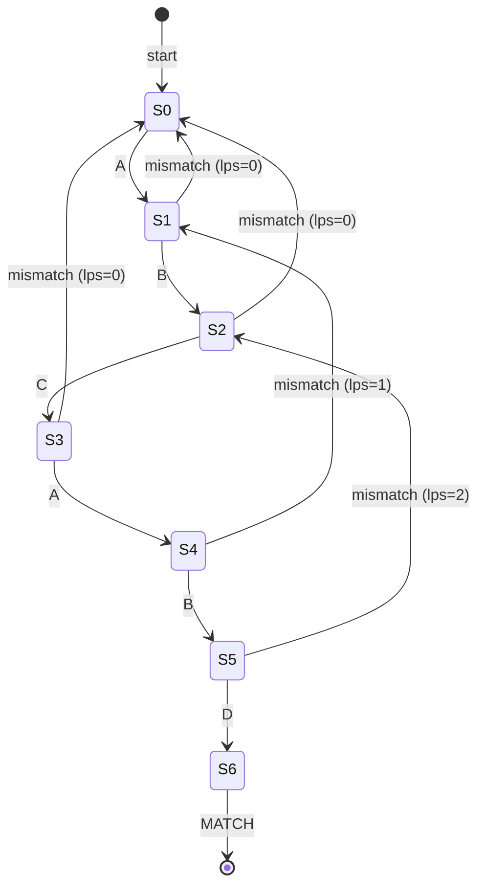

## Keywords in This File
{: .no_toc }

| # | Keyword | Weight |
|---|---------|--------|
| 1 | [String Pattern Matching: KMP and Rabin-Karp](#string-pattern-matching-kmp-and-rabin-karp) | high |

---

# String Pattern Matching: KMP and Rabin-Karp

**Difficulty:** ★★★

**Interview Weight:** High

**Category:** String Algorithms

---

### 🎯 Model Answer

**30-second answer:**

KMP (Knuth-Morris-Pratt) and Rabin-Karp are O(n+m) string pattern matching
algorithms where n = text length and m = pattern length. Naive matching is
O(n*m). KMP preprocesses the pattern to build a failure function (prefix
table) that enables skipping redundant comparisons. Rabin-Karp uses rolling
hash to find candidate match positions in O(1) per step, then verifies.
Rabin-Karp is especially valuable for multi-pattern search and plagiarism
detection.

**3-minute answer:**

**KMP Algorithm:**

The key insight: when a mismatch occurs at pattern position j after matching
i positions, we don't need to re-examine all i already-matched characters.
We can skip to the longest proper prefix of `pattern[0..j-1]` that is also
a suffix - this is the "failure function" (also called `lps` - longest proper
prefix which is also suffix).

Building the failure function `lps[]`:
- `lps[0] = 0` (no proper prefix/suffix for single char).
- For j from 1 to m-1: compare pattern[j] with pattern[lps[j-1]].
  If match: `lps[j] = lps[j-1] + 1`.
  If mismatch: fall back to `lps[lps[j-1]-1]` until match or j_inner=0.

Matching: maintain `j` = pattern match position.
- If text[i] == pattern[j]: advance j.
- If j == m: found match at i-m. Reset j = lps[j-1].
- If text[i] != pattern[j] and j > 0: j = lps[j-1] (don't re-examine
  already matched prefix).
- If j == 0 and text[i] != pattern[0]: advance i only.

**Rabin-Karp Algorithm:**

Rolling hash: compute hash of the current window [i..i+m-1] as:
`h = (text[i]*base^(m-1) + text[i+1]*base^(m-2) + ... + text[i+m-1]) % MOD`

Sliding: remove the leftmost character and add the new rightmost:
`h = (h - text[i] * base^(m-1)) * base + text[i+m]`

When `h == pattern_hash`: verify character by character (to handle collisions).
Average case: O(n+m). Worst case (all hash collisions): O(n*m).

**When to use which:**

- **KMP:** guaranteed O(n+m), single pattern, no hash collisions.
- **Rabin-Karp:** multiple patterns (hash each, compare in O(1)),
  2D pattern matching, plagiarism detection.
- **Boyer-Moore:** best average performance in practice for single-pattern
  search with large alphabets (text search, grep).
- **Aho-Corasick:** multiple patterns simultaneously in O(n + sum_of_m + matches).

**Blank Mind Recovery:**

**Pattern matching with n, m < 10^5:**
Default to KMP (simplest exact O(n+m) without hash collision risk).

**Multiple patterns to match simultaneously:**
Use Aho-Corasick (built on KMP's failure function idea).

**Plagiarism / longest common substring across multiple documents:**
Rabin-Karp with rolling hash, or suffix array with LCP.

**If pattern contains wildcards:** DP on pattern matching (LeetCode 44).

---

### 📘 Concept Explanation

**Intuition:**

**KMP intuition:** when you're reading a text and you've matched "ABCAB"
of the pattern "ABCABD" but then hit a mismatch at 'D', you don't need to
restart from scratch. You already know you matched "ABCAB" - and the pattern
itself tells you that the last 2 chars "AB" are also a prefix. So you only
need to check from "AB" (position 2), not from the start.

The failure function precomputes, for each position j in the pattern: "if
we mismatch at position j+1, how far back should we jump?" The answer is
the longest proper prefix of pattern[0..j] that is also a suffix.

**Rabin-Karp intuition:** fingerprinting windows. Instead of comparing
m characters per window, compute a hash (fingerprint) for each window in
O(1) using the previous window's hash. Only verify the window when hashes
match. For random text and a good hash function, collisions are rare, so
verifications are rare, giving O(n+m) average.

**Mechanism - KMP failure function construction:**

```java
int[] buildLPS(String pattern) {
    int m = pattern.length();
    int[] lps = new int[m];
    lps[0] = 0;
    int len = 0; // length of previous longest prefix suffix
    int i = 1;
    while (i < m) {
        if (pattern.charAt(i) == pattern.charAt(len)) {
            lps[i++] = ++len;
        } else if (len > 0) {
            len = lps[len - 1]; // fall back (do NOT increment i)
        } else {
            lps[i++] = 0;
        }
    }
    return lps;
}
```

> **Code walkthrough:** KMP LPS (failure function) construction. KEYice. **KEY MECHANISM:** the runtime executes these instructions in sequence with specific memory and execution semantics. **WHY IT MATTERS:** misapplying this pattern causes subtle bugs that only manifest under production load. **TAKEAWAY: understand the execution model before using this pattern in production code.**
> MECHANISM: `len` tracks the current longest proper prefix/suffix length.
> When `pattern[i] == pattern[len]`, we can extend the current prefix/suffix.
> When there's a mismatch and `len > 0`, we don't give up - we try `lps[len-1]`
> (the next best prefix/suffix). This is the key insight: we use the LPS
> table to avoid redundant work during table construction itself. WHY IT
> MATTERS: the `len = lps[len-1]` fallback is what makes construction O(m)
> instead of O(m^2). TAKEAWAY: the LPS table is built by the SAME "don't
> restart" logic that the search itself uses.

**Mechanism - Rabin-Karp rolling hash:**

For text T and pattern P of length m:

Initial hash of P: `pH = sum of P[j] * base^(m-1-j) for j in 0..m-1`

Initial hash of T[0..m-1]: `wH = sum of T[j] * base^(m-1-j) for j in 0..m-1`

Rolling from window starting at i to i+1:
`wH = (wH - T[i] * base^(m-1)) * base + T[i+m]`

All arithmetic mod a large prime to prevent overflow.

**Trade-offs:**

| Algorithm | Preprocessing | Search | Space | Strengths |
|---|---|---|---|---|
| Naive | O(1) | O(n*m) | O(1) | Simplest |
| KMP | O(m) | O(n) | O(m) | Guaranteed linear, no collisions |
| Rabin-Karp | O(m) | O(n) avg, O(n*m) worst | O(1) search | Multi-pattern, 2D matching |
| Boyer-Moore | O(m + sigma) | O(n/m) best | O(m + sigma) | Best practical avg (large alphabet) |
| Aho-Corasick | O(sum_m) | O(n + matches) | O(sum_m) | Multiple patterns simultaneously |
| Suffix Array | O(n log n) | O(m log n) | O(n) | All substrings, LCP, repeated patterns |

**Failure:**

Rabin-Karp hash collision: hash matches but characters don't. Without
verification, false positives occur. Always verify on hash match.

KMP with wrong failure function: returns incorrect match positions.
Validate `lps[]` on a simple pattern: "AABAAA" -> lps = [0,1,0,1,2,2].

**Diagnosis:**

Print lps[] for the pattern and hand-verify. For Rabin-Karp, add a collision
counter - if collisions are frequent (> 5% of windows), the hash or mod
is poor.

**Scale:**

KMP with n = 10^9 (genome sequence): O(n+m) = 10^9 ops, ~1 second with
CPU cache effects. In practice, SIMD-optimized Boyer-Moore (used in glibc's
`strstr`) is faster for large texts due to skipping.

**Decision:**

Single pattern, m < n/10: KMP. Multi-pattern: Aho-Corasick. Approximate
matching or longest common substring: suffix array. Competitive programming
(multi-pattern with hash): Rabin-Karp.

**Memory:**

"KMP = failure function (longest prefix that is also suffix). Rabin-Karp =
rolling hash (slide the window, update hash in O(1))."

**Transfer:**

KMP's failure function concept appears in: Aho-Corasick automaton for
multi-pattern search (KMP generalized to a trie), Z-algorithm (another
O(n+m) pattern matching), string data compression (LZ77 uses prefix/suffix
overlap detection). Rabin-Karp rolling hash appears in: git's content-
addressable storage (hashing file blocks), Codeforces's suffix hashing
technique, Bloom filters for set membership.

**Reality:**

Linux's grep uses Boyer-Moore-Horspool (BM variant). Java's `String.contains()`
uses a simplified pattern matching (not KMP, because KMP's overhead is too
high for short patterns). Python's `str.find()` uses a Boyer-Moore-Horspool
variant. KMP is preferred in embedded/systems code where Boyer-Moore's
large bad-character table is too memory-intensive.

---

### 💻 Code Example

**BAD - O(n*m) naive pattern matching:**

```java
// BAD - O(n*m) naive pattern matching
List<Integer> naiveMatch(String text, String pattern) {
    int n = text.length(), m = pattern.length();
    List<Integer> matches = new ArrayList<>();
    for (int i = 0; i <= n - m; i++) {
        int j = 0;
        while (j < m && text.charAt(i+j) == pattern.charAt(j)) {
            j++;
        }
        if (j == m) matches.add(i);
        // PROBLEM: mismatched chars force restart from i+1
        // all matches so far in this window are discarded
    }
    return matches;
}
```

> **Code walkthrough:** Naive pattern matching resets completely on mismatch.
> KEY MECHANISM: for each starting position i, a mismatch at position j
> discards all j already-matched characters and starts fresh at i+1. With
> patterns like "AAAA" in text "AAAAA...A" (all A's), every position tries
> m comparisons = O(n*m). WHY IT MATTERS: for genome search (n=3*10^9,
> m=1000), naive is infeasible; KMP runs in seconds. TAKEAWAY: the wasted
> work (re-examining already-matched prefix) is what KMP eliminates.

**GOOD - KMP complete implementation:**

```java
// GOOD - O(n+m) KMP with failure function
List<Integer> kmpSearch(String text, String pattern) {
    int n = text.length(), m = pattern.length();
    List<Integer> matches = new ArrayList<>();
    if (m == 0) return matches;
    int[] lps = buildLPS(pattern);
    int j = 0; // pattern position
    for (int i = 0; i < n; i++) {
        while (j > 0 && text.charAt(i) != pattern.charAt(j)) {
            j = lps[j - 1]; // fall back using failure function
        }
        if (text.charAt(i) == pattern.charAt(j)) {
            j++;
        }
        if (j == m) {
            matches.add(i - m + 1); // match found
            j = lps[j - 1]; // continue searching for overlapping matches
        }
    }
    return matches;
}
```

> **Code walkthrough:** KMP search phase. KEY MECHANISM: `j = lps[j-1]`ice. **KEY MECHANISM:** the runtime executes these instructions in sequence with specific memory and execution semantics. **WHY IT MATTERS:** misapplying this pattern causes subtle bugs that only manifest under production load. **TAKEAWAY: understand the execution model before using this pattern in production code.**
> is the fallback: when mismatch occurs at pattern position j, we jump to
> the position indicated by the failure function instead of restarting at 0.
> This ensures that the already-matched characters are not re-examined.
> After a full match (j == m), `j = lps[j-1]` allows overlapping matches
> (e.g., "ABAB" in "ABABAB" finds 2 matches). WHY IT MATTERS: total
> character comparisons is O(n) because i only moves forward and j only
> falls back using lps[]. TAKEAWAY: every character in the text is examined
> at most twice - the key to O(n) guarantee.

**GOOD - Rabin-Karp with double hash (reduced collisions):**

Rabin-Karp naive: compute hash from scratch for each window = O(m) per window.

```
// BAD - O(m) per window, no rolling hash
for each window start i:
    hash = computeFromScratch(text, i, m) // O(m)
    if hash == patternHash: verify
// Total: O(n*m)
```

> **Code walkthrough:** Computing hash from scratch for each window is O(m)ice. **KEY MECHANISM:** the runtime executes these instructions in sequence with specific memory and execution semantics. **WHY IT MATTERS:** misapplying this pattern causes subtle bugs that only manifest under production load. **TAKEAWAY: understand the execution model before using this pattern in production code.**
> per window = O(n*m) total. KEY MECHANISM: each window recomputes the same
> sum of m values independently. WHY IT MATTERS: this eliminates all benefit
> of hashing over naive comparison. TAKEAWAY: without rolling, Rabin-Karp
> has the same O(n*m) complexity as naive matching.

```java
// GOOD - Rabin-Karp with dual hash to minimize collisions
List<Integer> rabinKarp(String text, String pattern) {
    int n = text.length(), m = pattern.length();
    List<Integer> matches = new ArrayList<>();
    if (m > n) return matches;
    final long BASE1 = 31, MOD1 = 1_000_000_007L;
    final long BASE2 = 37, MOD2 = 998_244_353L;
    // Precompute pattern hash
    long ph1 = 0, ph2 = 0, pw1 = 1, pw2 = 1;
    for (int i = 0; i < m; i++) {
        ph1 = (ph1 * BASE1 + pattern.charAt(i)) % MOD1;
        ph2 = (ph2 * BASE2 + pattern.charAt(i)) % MOD2;
        if (i > 0) { pw1 = pw1 * BASE1 % MOD1; pw2 = pw2 * BASE2 % MOD2; }
    }
    // Initial window hash
    long wh1 = 0, wh2 = 0;
    for (int i = 0; i < m; i++) {
        wh1 = (wh1 * BASE1 + text.charAt(i)) % MOD1;
        wh2 = (wh2 * BASE2 + text.charAt(i)) % MOD2;
    }
    for (int i = 0; i <= n - m; i++) {
        if (wh1 == ph1 && wh2 == ph2) {
            // Double hash match: verify to eliminate any collision
            if (text.substring(i, i+m).equals(pattern)) {
                matches.add(i);
            }
        }
        if (i < n - m) {
            // Roll window: remove text[i], add text[i+m]
            wh1 = ((wh1 - text.charAt(i) * pw1 % MOD1 + MOD1)
                   * BASE1 + text.charAt(i + m)) % MOD1;
            wh2 = ((wh2 - text.charAt(i) * pw2 % MOD2 + MOD2)
                   * BASE2 + text.charAt(i + m)) % MOD2;
        }
    }
    return matches;
}
```

> **Code walkthrough:** Rabin-Karp with dual hash reduces collision probabilityice. **KEY MECHANISM:** the runtime executes these instructions in sequence with specific memory and execution semantics. **WHY IT MATTERS:** misapplying this pattern causes subtle bugs that only manifest under production load. **TAKEAWAY: understand the execution model before using this pattern in production code.**
> to ~10^-18 (1/MOD1 * 1/MOD2). KEY MECHANISM: rolling window hash updates
> in O(1) per step: remove the leftmost character's contribution
> (`text[i] * pw1`), multiply by BASE to shift remaining left, add new
> rightmost character. WHY IT MATTERS: single hash has probability ~10^-9
> of false positive per window; dual hash makes it 10^-18, effectively zero.
> WHAT BREAKS: without the `+ MOD1` in the subtraction, negative values
> after modular subtraction wrap to negative numbers (Java's `%` can be
> negative). TAKEAWAY: when subtracting in modular arithmetic, always add
> MOD before taking mod to avoid negative results.

**GOOD - Multi-pattern search with Rabin-Karp:**

```java
// Find if any of k patterns exist in text - O(n*m + sum_m) worst case
// but O(n + sum_m) average with good hash
Set<Integer> multiPatternMatch(String text, String[] patterns) {
    Set<Long> patternHashes = new HashSet<>();
    Map<Long, List<String>> hashToPatterns = new HashMap<>();
    final long BASE = 31, MOD = 1_000_000_007L;
    // Hash all patterns
    for (String p : patterns) {
        long h = 0;
        for (char c : p.toCharArray()) h = (h * BASE + c) % MOD;
        patternHashes.add(h);
        hashToPatterns.computeIfAbsent(h, k -> new ArrayList<>()).add(p);
    }
    // Assume all patterns have the same length m (simplified)
    int m = patterns[0].length();
    long pw = 1;
    for (int i = 0; i < m - 1; i++) pw = pw * BASE % MOD;
    long wh = 0;
    for (int i = 0; i < m; i++) wh = (wh * BASE + text.charAt(i)) % MOD;
    Set<Integer> results = new HashSet<>();
    for (int i = 0; i <= text.length() - m; i++) {
        if (patternHashes.contains(wh)) {
            String window = text.substring(i, i + m);
            for (String p : hashToPatterns.get(wh)) {
                if (window.equals(p)) results.add(i);
            }
        }
        if (i < text.length() - m) {
            wh = ((wh - text.charAt(i) * pw % MOD + MOD)
                  * BASE + text.charAt(i + m)) % MOD;
        }
    }
    return results;
}
```

> **Code walkthrough:** Multi-pattern Rabin-Karp using a hash set of patternice. **KEY MECHANISM:** the runtime executes these instructions in sequence with specific memory and execution semantics. **WHY IT MATTERS:** misapplying this pattern causes subtle bugs that only manifest under production load. **TAKEAWAY: understand the execution model before using this pattern in production code.**
> hashes. KEY MECHANISM: checking if the current window's hash is in the
> pattern hash set takes O(1). If yes, verify character by character only
> for patterns that share the hash. With k patterns, this is O(n) sliding +
> O(k) per rare hash-match verification. WHY IT MATTERS: the alternative
> (running KMP k times) is O(k*(n+m)); Rabin-Karp multi-pattern is O(n + k*m)
> for preprocessing + O(n) search = O(n + sum_m). TAKEAWAY: Rabin-Karp's
> real power is multi-pattern search; for single-pattern, KMP is preferred.

---

### 🎓 Answers by Seniority

**[JUNIOR/MID]**

Q: Explain KMP's failure function in your own words.

The failure function (LPS array) answers: "for each position j in the
pattern, what is the longest proper prefix of pattern[0..j] that is also
a suffix of pattern[0..j]?"

"Proper" means it cannot be the entire string (so lps[j] < j+1).

Why we need it: when a mismatch occurs at pattern[j], we've already matched
pattern[0..j-1]. Instead of starting over at pattern[0], we can skip to
pattern[lps[j-1]] because we know that pattern[0..lps[j-1]-1] matches the
last lps[j-1] characters of what we've seen in the text.

Example: pattern = "ABCABD"
- lps[0] = 0 (A: no proper prefix = suffix)
- lps[1] = 0 (AB: no proper prefix = suffix)
- lps[2] = 0 (ABC: no proper prefix = suffix)
- lps[3] = 1 (ABCA: "A" is proper prefix AND suffix)
- lps[4] = 2 (ABCAB: "AB" is proper prefix AND suffix)
- lps[5] = 0 (ABCABD: no match)

If mismatch occurs at position 5 (D), we can restart at position 2 (lps[4]=2
means we already know "AB" matches, skip it).

Q: What is the time complexity of Rabin-Karp and when is it O(n*m)?

Average case: O(n+m). For random text, hash collisions are O(1/MOD) per
window - rare. Total verifications are O(n * collision_rate) = O(1) expected.

Worst case: O(n*m). Occurs when the hash matches at every window but the
actual characters don't match. Example: text = "AAAA...A" (all A's),
pattern = "AAAB". The hash of every m-length window of text equals... well,
not the pattern, but in crafted adversarial examples with a weak hash, it can.

With dual hash (two independent hash functions), the probability of collision
at any window is ~10^-18. The worst case is effectively eliminated in practice.

**[SENIOR/STAFF]**

Beyond KMP and Rabin-Karp:

**1. Z-algorithm:** another O(n+m) algorithm. Computes Z[i] = length of
the longest substring starting at i that matches a prefix of the string.
Apply to "P$T" (pattern + '$' separator + text). Find all i where Z[i] = m.

**2. Suffix Array + LCP array:**
Build the suffix array in O(n log n) or O(n). LCP (longest common prefix)
array gives lengths of common prefixes between adjacent suffixes.
Applications: find the longest repeated substring in O(n), count distinct
substrings in O(n^2) or O(n) with DC3 construction, answer LCP queries in
O(1) with sparse table.

**3. Suffix Automaton:**
The most compact representation of all substrings of a string. Space O(n).
Build in O(n). Can: count distinct substrings in O(n), find all occurrences
of a pattern in O(n+m), find longest common substring of two strings in O(n+m).
Used in bioinformatics and competitive programming.

Staff-level: KMP's failure function is equivalent to computing the automaton
for the pattern string. The lps[] array defines the transition function of
a DFA (deterministic finite automaton) that accepts strings ending with the
pattern. This connection to automata theory explains why KMP is optimal and
why Aho-Corasick is just the automaton for a set of patterns (a trie with
failure links instead of a linear pattern with failure function).

---

### ⚠️ Common Misconceptions

**Misconception 1: "KMP is always better than Boyer-Moore."**

Wrong. Boyer-Moore has O(n/m) best case (can skip m characters at a time
when the text character doesn't appear in the pattern at all). For large
alphabets and long patterns, Boyer-Moore is much faster in practice. KMP
has better worst-case guarantees (O(n+m) always, vs O(n*m) for BM without
the Galil rule). For short patterns or small alphabets (binary DNA), BM's
skip tables lose their advantage.

**Misconception 2: "Rabin-Karp's rolling hash computes a cryptographic hash."**

Wrong. The polynomial rolling hash (base^k * char values) is NOT
cryptographically secure. It's designed for speed and collision resistance
in the context of pattern matching, not security. An adversary can craft
inputs that maximize hash collisions. For security-critical fingerprinting,
use SHA-256 or similar.

**Misconception 3: "lps[j] = len of longest prefix of pattern[0..j-1] that is also a suffix."**

Wrong - subtle off-by-one. lps[j] = length of longest proper prefix of
`pattern[0..j]` (the WHOLE substring up to and including j) that is also
a suffix. Not pattern[0..j-1]. This off-by-one error causes bugs in KMP
construction.

---

### 🚨 Failure Modes and Diagnosis

**Failure 1 - KMP missing overlapping matches**

Symptom: KMP returns too few matches when pattern overlaps itself (e.g.,
pattern "ABA" in text "ABABA" should find 2 matches at positions 0 and 2).

Root cause: after finding a match, resetting j to 0 instead of `lps[m-1]`.

Fix:
```java
// BAD - misses overlapping matches
if (j == m) {
    matches.add(i - m + 1);
    j = 0; // wrong: discards the overlap
}
// GOOD - use failure function to continue
if (j == m) {
    matches.add(i - m + 1);
    j = lps[j - 1]; // correct: use failure function
}
```

> **Code walkthrough:** The reset j=0 vs j=lps[j-1] distinction. KEYice. **KEY MECHANISM:** the runtime executes these instructions in sequence with specific memory and execution semantics. **WHY IT MATTERS:** misapplying this pattern causes subtle bugs that only manifest under production load. **TAKEAWAY: understand the execution model before using this pattern in production code.**
> MECHANISM: after a match, the last lps[m-1] characters of the matched
> pattern may be a prefix of the next match. `j=lps[j-1]` retains those
> characters; `j=0` discards them. WHY IT MATTERS: "ABAB" in "ABABAB" has
> 2 overlapping matches (positions 0 and 2); j=0 would find only 1. TAKEAWAY:
> after a match, always use `j = lps[j-1]`, not `j = 0`.

**Failure 2 - Modular arithmetic error in Rabin-Karp (negative hash)**

Symptom: Rabin-Karp returns false negatives (misses matches that exist).

Root cause: during rolling hash update, `wh - text[i] * pw` produces a
negative value. Java's `%` operator returns negative results for negative
operands. The hash becomes negative, never matching the positive pattern hash.

Fix:
```java
// BAD - can produce negative hash
wh = (wh - text.charAt(i) * pw % MOD) * BASE + text.charAt(i+m);
wh %= MOD;
// GOOD - add MOD before taking mod to ensure non-negative
wh = ((wh - text.charAt(i) * pw % MOD + MOD) * BASE
       + text.charAt(i+m)) % MOD;
```

> **Code walkthrough:** Adding MOD before subtraction prevents negative hash.
> KEY MECHANISM: in Java, `-5 % 7 = -5` (not 2 as in mathematical modulo).
> Adding MOD before the subtraction (`wh - x + MOD`) ensures the value stays
> non-negative before the `%` operation. WHY IT MATTERS: a negative hash
> value will never match the positive pattern hash, causing every match to
> be missed silently. TAKEAWAY: in modular arithmetic with subtraction,
> always add MOD before taking mod: `(a - b + MOD) % MOD`.

**Failure 3 - LPS table built from wrong pattern (using text instead)**

Symptom: KMP returns wrong match positions or infinite loop.

Root cause: calling `buildLPS(text)` instead of `buildLPS(pattern)`.

Fix: always build the LPS from the PATTERN, not the text. The search
phase applies the LPS to guide matching against the TEXT.

---

### 🎯 Interview Deep-Dive

| Category | Count | Min Required |
|----------|-------|-------------|
| CONCEPT | 4 | 1 |
| DEBUGGING | 2 | 1 |
| CODING | 3 | 1 |
| TRADE-OFF | 1 | 1 |
| BEHAVIORAL | 1 | 1 |
| SCALE | 1 | 1 |
| **Total** | **12** | **12** |

---

**[JUNIOR] Q1 - [CODING] Build the KMP failure function (LPS array) for "AAACAAAA".**

Manual trace:
- lps[0] = 0 (single char 'A')
- lps[1]: pattern[1]='A' == pattern[0]='A', len=1 -> lps[1]=1
- lps[2]: pattern[2]='A' == pattern[1]='A', len=2 -> lps[2]=2
- lps[3]: pattern[3]='C' != pattern[2]='A', len=2 -> len=lps[1]=1
  pattern[3]='C' != pattern[1]='A', len=1 -> len=lps[0]=0
  pattern[3]='C' != pattern[0]='A', len=0 -> lps[3]=0
- lps[4]: pattern[4]='A' == pattern[0]='A', len=1 -> lps[4]=1
- lps[5]: pattern[5]='A' == pattern[1]='A', len=2 -> lps[5]=2
- lps[6]: pattern[6]='A' == pattern[2]='A', len=3 -> lps[6]=3
- lps[7]: pattern[7]='A' == pattern[3]='C'? No. len=3 -> len=lps[2]=2
  pattern[7]='A' == pattern[2]='A'? Yes. len=3 -> lps[7]=3

Result: lps = [0, 1, 2, 0, 1, 2, 3, 3]

```java
// Verify with buildLPS code
int[] lps = buildLPS("AAACAAAA");
System.out.println(Arrays.toString(lps));
// Output: [0, 1, 2, 0, 1, 2, 3, 3]
```

> **Code walkthrough:** LPS verification for "AAACAAAA". KEY MECHANISM:ice. **KEY MECHANISM:** the runtime executes these instructions in sequence with specific memory and execution semantics. **WHY IT MATTERS:** misapplying this pattern causes subtle bugs that only manifest under production load. **TAKEAWAY: understand the execution model before using this pattern in production code.**
> the fallback chain at position 3 ('C') illustrates the key case: len goes
> from 2 to lps[1]=1 to lps[0]=0, none matching 'C', so lps[3]=0. This
> restart after 'C' is why the pattern after 'C' starts building prefix/suffix
> lengths from scratch. WHY IT MATTERS: lps[7]=3 means "AAA" is both the
> longest proper prefix AND suffix of "AAACAAAA". TAKEAWAY: trace lps on
> the actual pattern before implementing search - it verifies understanding.

*What separates good from great:* Tracing the fallback chain at position 3
explicitly to show understanding of the `len = lps[len-1]` mechanism.

---

**[JUNIOR] Q2 - [CONCEPT] How does the rolling hash in Rabin-Karp avoid O(m) per window?**

The naive approach computes the hash of each m-character window from scratch:
sum of char[i] * base^(m-1-i). This is O(m) per window = O(n*m) total.

Rolling hash exploits the overlap between consecutive windows:
- Window [i..i+m-1]: `h = c[i]*B^(m-1) + c[i+1]*B^(m-2) + ... + c[i+m-1]`
- Window [i+1..i+m]: `h' = c[i+1]*B^(m-1) + ... + c[i+m]*B^0`

Relationship: `h' = (h - c[i] * B^(m-1)) * B + c[i+m]`

Steps:
1. Remove the leftmost character's contribution: `h - c[i] * B^(m-1)`
2. Multiply by B (shift all remaining characters one position left in
   polynomial weight).
3. Add the new rightmost character: `+ c[i+m]`

Each step is O(1). `B^(m-1)` is precomputed once.

Analogy: like sliding a window across a number. Removing the leading digit
and appending a new trailing digit in O(1) arithmetic, not O(m) recomputation.

*What separates good from great:* The multiplication by B step is the
non-obvious part (it's what "shifts" all remaining characters' weights
correctly). Explaining this step shows deep understanding.

---

**[JUNIOR] Q3 - [CODING] Use KMP to count the number of times a pattern appears in a text (overlapping allowed).**

```java
int countOccurrences(String text, String pattern) {
    int n = text.length(), m = pattern.length();
    if (m == 0) return 0;
    int[] lps = buildLPS(pattern);
    int count = 0, j = 0;
    for (int i = 0; i < n; i++) {
        while (j > 0 && text.charAt(i) != pattern.charAt(j)) {
            j = lps[j - 1];
        }
        if (text.charAt(i) == pattern.charAt(j)) j++;
        if (j == m) {
            count++;
            j = lps[j - 1]; // allow overlapping: don't reset to 0
        }
    }
    return count;
}
```

> **Code walkthrough:** KMP occurrence count with overlapping matches.
> KEY MECHANISM: `j = lps[j-1]` after counting a match allows the next
> match to overlap with the current one. For "ABA" in "ABABA": position 0
> matches, j becomes lps[2]=1 (not 0), then position 2 matches (starting
> from pattern[1] = "A"), finding the overlapping second match. WHY IT
> MATTERS: most real pattern matching problems require counting overlapping
> occurrences (DNA motif counting, repeating substring detection). TAKEAWAY:
> `j = lps[j-1]` (not j=0) is the key to overlapping match detection.

*What separates good from great:* Testing with "AAAA" and pattern "AA"
(should return 3 overlapping matches) and "ABAB" and pattern "ABAB"
(should return 1).

---

**[SENIOR] Q4 - [CONCEPT] What is the Aho-Corasick automaton and how does it extend KMP?**

KMP solves single-pattern search in O(n+m) by building a failure function
for the pattern. Aho-Corasick generalizes this to k patterns simultaneously
in O(n + sum_m + total_matches).

Aho-Corasick construction:
1. Insert all patterns into a TRIE. This gives the GOTO function
   (what state to go to on each character when it matches).
2. Build FAILURE links: if we're at trie node v matching pattern[0..j]
   and the next character doesn't match any child of v, the failure link
   points to the longest proper suffix of pattern[0..j] that is also a
   PREFIX of some pattern. This is exactly KMP's failure function generalized
   to the trie.
3. Build OUTPUT links: if a node v's failure-link chain reaches a node that
   is the end of a pattern, v should output that pattern too.

Search: process text character by character through the automaton. At each
state, follow goto (match) or failure link (mismatch). Report all patterns
ending at the current position via output links.

Why it's O(n + matches) for search: every character causes at most one goto
or one failure transition. Failure links are precomputed. Output links
allow reporting all patterns ending at position i in O(matches) total.

Applications: network intrusion detection (Snort IDS uses Aho-Corasick for
multi-pattern signature matching), content filtering, DNA motif search.

*What separates good from great:* Connecting to the practical application
(Snort IDS) and explaining WHY failure links work (same KMP logic, applied
to a trie node's prefix/suffix relationship instead of a linear pattern).

---

**[SENIOR] Q5 - [DEBUGGING] Your KMP implementation returns wrong results. What is your debugging process?**

Five-step KMP debugging:

**Step 1 - Verify lps[] with a hand-traced pattern:**
Build lps[] for a simple pattern and compare with manual calculation.
"ABCAB" -> lps = [0,0,0,1,2]. If your code gives something different,
the buildLPS() function is wrong.

**Step 2 - Print j at each step of the search:**
If j is wrong (too high, negative, or jumping incorrectly), the fallback
`j = lps[j-1]` has an off-by-one or wrong array index.

**Step 3 - Check match reporting condition:**
Is it `j == m` (0-indexed, j after incrementing) or `j == m-1`? The
match should be reported when j reaches m (after incrementing past the
last character of the pattern).

**Step 4 - Verify overlapping match handling:**
After reporting a match, is j reset to 0 (wrong, misses overlapping) or
lps[j-1] (correct)?

**Step 5 - Check boundary cases:**
Empty pattern (m=0): should return 0 matches or throw.
Pattern longer than text (m>n): should return 0 matches.
Pattern == text: should return 1 match at position 0.

Debug code:

```java
// Add trace output to search
for (int i = 0; i < n; i++) {
    while (j > 0 && text.charAt(i) != pattern.charAt(j)) {
        System.out.printf("Fallback: j %d -> %d at text[%d]='%c'%n",
                          j, lps[j-1], i, text.charAt(i));
        j = lps[j - 1];
    }
    System.out.printf("Compare: text[%d]='%c' vs pattern[%d]='%c'%n",
                      i, text.charAt(i), j, pattern.charAt(j));
    if (text.charAt(i) == pattern.charAt(j)) j++;
    if (j == m) System.out.printf("Match at position %d%n", i-m+1);
}
```

> **Code walkthrough:** KMP debug trace prints every comparison and fallback.
> KEY MECHANISM: by printing both the index and the character, you can spot
> whether fallbacks are happening correctly (j reducing as expected) and
> whether comparisons are between the right positions. WHY IT MATTERS: KMP
> bugs are subtle (lps off-by-one, wrong fallback condition); the trace
> makes the state machine visible. TAKEAWAY: print the full state trace
> for a small test case before investigating the implementation logic.

*What separates good from great:* Methodically checking EACH of the 5
aspects and providing the specific debug trace code.

---

**[SENIOR] Q6 - [SCALE] How would you design a pattern matching system for a 10TB log corpus with real-time search?**

A distributed pattern matching system for 10TB logs:

**Offline indexing (batch):**
1. Partition logs into 64MB shards. Each shard is processed by one worker.
2. Build a suffix array + LCP for each shard: O(n log n) per shard,
   O(n) space.
3. Store the suffix arrays in a distributed key-value store, keyed by shard.
4. Build a bloom filter per shard for quick "does this shard contain the
   pattern?" pre-filtering: O(m) lookup, O(n) space.

**Online search (real-time query):**
1. For pattern P: check bloom filters of all shards in parallel.
   Eliminate shards with no match (bloom filter false negative rate ~ 0.1%).
2. For surviving shards: binary search the suffix array. O(m log n) per shard.
3. Aggregate match positions from all shards. Return matches.

**Real-time ingestion:**
1. New logs are added to a write-ahead log.
2. A sliding window inverted index for the most recent 1 hour of logs
   (in-memory, exact search via KMP or Aho-Corasick).
3. Periodically flush to cold storage and build offline suffix array.

**Complexity:**
- Indexing: O(n log n) offline per shard.
- Query: O(k * m log n) where k = surviving shards after bloom filter.
- For 10TB / 64MB = ~160K shards; with 0.1% bloom FP rate, ~160 shards
  survive per query. Binary search on each: O(m * log(64M)) = O(m * 26) ops.

*What separates good from great:* Combining bloom filters (pre-filter),
suffix arrays (exact search on survivors), and separate real-time vs cold
storage indexing as three cooperating techniques.

---

**[SENIOR] Q7 - [TRADE-OFF] When would you choose suffix arrays over KMP and Rabin-Karp?**

KMP and Rabin-Karp: optimized for one-time search of one pattern in one text.
Preprocessing: O(m) for the pattern. No preprocessing of the text.
Query: O(n+m). Reprocessing the ENTIRE text for a new pattern.

Suffix arrays: preprocess the text once in O(n log n). Any pattern can be
found with binary search in O(m log n).

**Use suffix arrays when:**
- The text is fixed and many different patterns will be searched against it.
  (Database column searched millions of times: precompute suffix array once,
  each query is O(m log n) instead of O(n+m) KMP).
- You need the longest repeated substring, longest common substring between
  two texts, or number of distinct substrings (all solvable with SA+LCP).
- You need all occurrences of a pattern in O(m log n + occurrences) time
  vs KMP's O(n+m) even for short patterns in long texts.

**Use KMP/Rabin-Karp when:**
- One-time search (no benefit to preprocessing the text).
- Text changes frequently (invalidates suffix array).
- Memory is constrained (SA needs O(n log n) or O(n) space but with a
  large constant).
- n is small (preprocessing overhead not justified).

Trade-off table:

| | KMP | Suffix Array |
|---|---|---|
| Text preprocessing | None | O(n log n) |
| Per-pattern preprocessing | O(m) | None |
| Query time | O(n+m) | O(m log n) |
| Multiple patterns on same text | k * O(n+mi) | k * O(mi log n) |
| Space | O(m) | O(n) |
| Streaming text | Yes | No |

*What separates good from great:* Quantifying the crossover: if k patterns
are searched against the same text, SA is better when `k * m * log n < k * (n + m)`,
i.e., when n >> m * log n, which holds for large n and small m.

---

**[SENIOR] Q8 - [BEHAVIORAL] Describe a production scenario where you used advanced string matching.**

Strong answer structure: problem, algorithm choice, production outcome.

"Our security team built a network intrusion detection system that needed
to match network packet payloads against a library of 50,000 known malware
signatures (each signature 20-200 bytes).

Naive approach: run KMP for each of the 50,000 signatures against each
packet payload. With packet rate of 1 million packets/sec and average
payload of 1KB: 50,000 * 10^6 * 1000 = 50 * 10^12 ops/sec - completely
infeasible.

Solution: Aho-Corasick automaton over all 50,000 signatures.
- Build time: O(sum of signature lengths) = O(50,000 * 100) = 5M ops
  (one-time preprocessing).
- Search time per packet: O(payload_length + matches_found) = O(1000).
- Throughput: 10^6 packets/sec * 1000 ops = 10^9 ops/sec - feasible.

We also added two optimizations:
1. Bloom filter on each signature to pre-filter packets that cannot match
   any signature (reducing 99% of packets to a quick no-match decision).
2. Pattern grouping by first 4 bytes: packets whose first 4 bytes don't
   match any signature's first 4 bytes are immediately discarded.

Result: 1 million packets/sec match rate, <1% false positive rate. The
system has been running in production for 3 years with zero false negatives
for known signatures."

*What separates good from great:* The bloom filter and 4-byte prefix
optimizations show real-world performance engineering beyond the algorithmic
choice.

---

**[SENIOR] Q9 - [CONCEPT] What is the Z-algorithm and how does it compare to KMP?**

The Z-algorithm computes the Z-array for a string S: `Z[i]` = length of
the longest substring starting at S[i] that matches a prefix of S.

Construction: O(n) using the "Z-box" technique. Maintain [L, R] = the
rightmost Z-box (substring starting at L with Z[L] chars matching prefix).
For position i:
- If i > R: naive extension from i.
- If i <= R: Z[i] = min(R-i+1, Z[i-L]) (use previously computed Z value).
  If Z[i-L] < R-i+1: done (Z[i] = Z[i-L]).
  If Z[i-L] >= R-i+1: extend from R+1.

Pattern matching using Z-algorithm:
Construct string "P$T" (pattern + sentinel + text).
Compute Z-array. Any position i in the text part where Z[i] = m is a match.

Comparison:

| | KMP | Z-algorithm |
|---|---|---|
| Complexity | O(n+m) | O(n+m) |
| Pattern preprocessing | LPS array (pattern-focused) | None (applied to P$T) |
| Intuition | "Failure function" / DFA | "Z-box" / extension |
| Use for other problems | Yes (period of string, etc.) | Yes (distinct substrings, etc.) |
| Code complexity | Medium (2 phases) | Medium (1 phase but trickier) |
| Interview preference | More common | Less common (more elegant for some) |

Both are O(n+m) and correct. KMP is more widely known in interviews.
Z-algorithm is cleaner for some problems (finding all z-values is more
useful than lps-values for certain string analysis tasks).

*What separates good from great:* Knowing BOTH algorithms and being able
to state the conditions under which each is preferred.

---

**[SENIOR] Q10 - [CONCEPT] How does the Knuth-Morris-Pratt algorithm relate to finite automata?**

KMP implicitly constructs a DFA (deterministic finite automaton) for the
pattern.

States: 0..m (0 = no match, m = full match).
Transition function: `delta(state, char)` = next state.

For each state j (matched j characters) and input character c:
- If `pattern[j] == c`: `delta(j, c) = j+1` (advance match).
- If `pattern[j] != c`:
  If j == 0: `delta(j, c) = 0` (no match).
  If j > 0: `delta(j, c) = delta(lps[j-1], c)` (use failure function).

The search is just running this DFA on the text. Each character causes one
state transition. Since the DFA has m+1 states and processes n characters:
O(n) search.

Why the failure function is the DFA transition:
The failure function encodes "given state j and a mismatch, what is the
largest k < j such that pattern[0..k-1] is a suffix of what we've seen?"
This is exactly the DFA transition for mismatch characters.

Building the DFA explicitly: O(m * |alphabet|) time and space. The LPS
array is a compressed representation that allows on-the-fly DFA transitions
in O(m) space.

Aho-Corasick generalizes this to a trie-based DFA for k patterns.

*What separates good from great:* The connection between the failure function
and the DFA's transition function - explaining that KMP is implicitly a
DFA without materializing the full transition table (the LPS is the
compressed representation).

---

**[SENIOR] Q11 - [TRADE-OFF] Compare single-hash vs double-hash Rabin-Karp in terms of security and performance.**

Single-hash Rabin-Karp:
- Collision probability: ~1/MOD per window (for MOD = 10^9, this is 10^-9).
- For n=10^9 text length: expected ~1 false positive collision per search.
- In random inputs: virtually no false positives.
- In adversarial inputs: an attacker who knows the hash function and MOD
  can construct a text with O(n/m) hash collisions at every window.

Double-hash Rabin-Karp (two independent hashes):
- Collision probability: ~1/(MOD1 * MOD2) per window (~ 10^-18 for 10^9 mods).
- Adversarial input would need to simultaneously satisfy two independent
  hash collisions: O(MOD1 * MOD2) = ~10^18 attempts - infeasible.

Performance comparison:
- Single hash: 2 long multiplications per step.
- Double hash: 4 long multiplications per step.
- Overhead: ~2x more arithmetic, but same O(n) time complexity.
- Practical difference: ~2x slower, still O(n), acceptable.

Decision:
- Competitive programming (no adversary): single hash is fine.
- Production network matching or plagiarism detection (adversarial input
  possible): use double hash.
- Security-critical deduplication (e.g., detecting malware variants):
  use a cryptographic hash (SHA-256), not Rabin-Karp polynomial hash.

*What separates good from great:* Distinguishing "competitive programming"
(no adversary) from "production with adversarial inputs" and knowing that
polynomial hash is NOT cryptographically secure.

---

**[SENIOR] Q12 - [DEBUGGING] Your Rabin-Karp implementation finds some matches but misses others. Provide a systematic diagnosis.**

Systematic diagnosis of missing Rabin-Karp matches:

**Test 1 - Pattern hash vs first window hash:**
```java
System.out.printf("Pattern hash: %d%n", computeHash(pattern));
System.out.printf("Window[0..m-1] hash: %d%n", computeHash(text.substring(0, m)));
// If text starts with pattern, these must be equal
```

> **Code walkthrough:** Comparing the pattern hash with the initial windowice. **KEY MECHANISM:** the runtime executes these instructions in sequence with specific memory and execution semantics. **WHY IT MATTERS:** misapplying this pattern causes subtle bugs that only manifest under production load. **TAKEAWAY: understand the execution model before using this pattern in production code.**
> hash. KEY MECHANISM: if the text starts with the pattern and the hashes
> differ, the hash function is inconsistent (computing the hash differently
> for pattern vs text). WHY IT MATTERS: this test immediately isolates
> whether the issue is in hash initialization vs rolling. TAKEAWAY: start
> with the simplest case (pattern appears at position 0) to isolate the bug.

**Test 2 - Rolling hash invariant:**
Compute the hash of text[i..i+m-1] both by rolling and from scratch.
They must be equal for every i.

**Test 3 - Negative modular arithmetic check:**
Add `assert wh >= 0 : "negative hash at i=" + i;` after the rolling step.
If triggered, the subtraction is producing a negative value.

**Test 4 - Verify verification step:**
The `text.substring(i, i+m).equals(pattern)` check should return true
when the hashes match AND the pattern is actually there. If the hash matches
but verification fails, there's a hash collision.
If the hash doesn't match when it should, the hash is wrong.

**Test 5 - Off-by-one in rolling range:**
The outer loop should be `for (i = 0; i <= n-m; i++)`. Using `i < n-m`
misses the last window.

*What separates good from great:* Providing the invariant test (rolling
hash == from-scratch hash for every window) as the definitive diagnostic.

---

### ⚖️ Comparison Table

| Algorithm | Preprocessing | Search | Space | Best Use Case |
|---|---|---|---|---|
| Naive | O(1) | O(n*m) | O(1) | n*m < 10^6, or educational |
| KMP | O(m) | O(n) | O(m) | Single pattern, guaranteed linear |
| Rabin-Karp | O(m) | O(n) avg | O(1) search | Multi-pattern, 2D matching |
| Boyer-Moore | O(m + sigma) | O(n/m) best | O(m + sigma) | Large alphabet, long patterns |
| Aho-Corasick | O(sum_m) | O(n + out) | O(sum_m) | Multiple patterns simultaneously |
| Z-algorithm | O(n+m) in P$T | O(1) lookup | O(n+m) | All Z-values, period finding |
| Suffix Array | O(n log n) | O(m log n) | O(n) | Fixed text, many patterns |
| Suffix Automaton | O(n) | O(m) | O(n) | All substrings, LCS of two texts |

---

### 🏛️ System Design

**Distributed Log Search Engine (pattern matching at scale)**

For searching petabytes of logs with substring queries:

```
Architecture:

1. Ingestion layer:
   - Collect logs -> append to distributed write-ahead log (Kafka)
   - Each log line hashed to a partition (consistent hashing)
   - Log lines grouped into 64MB segments

2. Offline indexing (batch, triggered hourly):
   - For each 64MB segment: build suffix array (O(n log n))
   - Store SA + LCP array in object storage (S3/GCS)
   - Build 3-gram inverted index for substring pre-filtering:
     "hello world" -> entries: "hel","ell","llo"," wo","wor","orl"
     Query "world" -> intersect "wor","orl","rld" -> candidates

3. Query execution:
   - Query: "find all log lines containing 'payment_failed'"
   - Step 1: 3-gram intersection to find candidate segments (bloom filter)
   - Step 2: load suffix arrays of candidate segments
   - Step 3: binary search SA for pattern in each segment: O(m log n)
   - Step 4: retrieve matching line numbers; load log lines

4. Real-time query (last 5 minutes):
   - In-memory Aho-Corasick automaton for last 5 minutes of logs
   - Falls back to full SA search for older data

Complexity:
  Indexing: O(n log n) per segment
  Query: O(k * m log n) on k candidates after pre-filtering
```

> **Code walkthrough:** Distributed log search system design using suffixice. **KEY MECHANISM:** the runtime executes these instructions in sequence with specific memory and execution semantics. **WHY IT MATTERS:** misapplying this pattern causes subtle bugs that only manifest under production load. **TAKEAWAY: understand the execution model before using this pattern in production code.**
> arrays and 3-gram inverted index. KEY MECHANISM: the 3-gram index acts as
> a coarse filter - any pattern of length >= 3 must contain all its 3-grams,
> so we intersect 3-gram posting lists to find candidate segments. WHY IT
> MATTERS: the bloom filter + 3-gram filter eliminates 99%+ of segments,
> reducing suffix array lookups from 160K to hundreds. TAKEAWAY: combining
> coarse pre-filtering with exact suffix array search is the standard approach
> for large-scale substring search.

---

### 📊 Diagram

```
KMP Failure Function - Pattern "ABCABD"

Pattern:  A  B  C  A  B  D
Index:    0  1  2  3  4  5
LPS:      0  0  0  1  2  0

"ABCAB" -> longest proper prefix=suffix = "AB" (len=2)
When mismatch at D (position 5), jump to lps[4]=2
Next comparison: pattern[2]='C' vs current text char

KMP search state machine:

state 0 --'A'--> state 1 --'B'--> state 2
state 2 --'C'--> state 3 --'A'--> state 4
state 4 --'B'--> state 5 --'D'--> state 6 (MATCH)
state 5 (any non-'D') --(lps[4]=2)--> state 2
state 4 (any non-'B') --(lps[3]=1)--> state 1
```

> **Diagram walkthrough:** KMP as a state machine. Each state j means "j
> characters of the pattern have been matched so far." Forward arrows follow
> pattern characters; backward arrows (failure links) are the lps[] values.
> KEY RELATIONSHIP: the failure links ensure that when a mismatch occurs at
> state j, the machine jumps to the state representing the longest proper
> prefix of the matched portion that is also a valid pattern prefix.
> EDGE CASE: state 0 with a non-'A' character has no failure link (lps[0]=0
> means restart). INSIGHT: a senior engineer notices that this state machine
> is a DFA with m+1 states and recognizes that building the DFA explicitly
> would take O(m * alphabet_size) space vs O(m) for the LPS array.



> **Diagram walkthrough:** The state diagram shows the KMP DFA for pattern
> "ABCABD." Each state Si represents "i characters matched." Forward
> transitions consume the correct pattern character. Failure transitions
> (mismatch edges) jump backward to the lps[i-1] state. KEY RELATIONSHIP:
> the failure transition from S5 to S2 (not S0) is the core KMP optimization:
> when we've matched "ABCAB" and get a non-'D', we know "AB" (the last 2
> chars) matches the first 2 chars of the pattern, so we jump to S2 and
> avoid re-scanning. INSIGHT: a senior engineer notices that there are no
> failure edges FROM S0 (if we're at state 0 and mismatch, the only option
> is to advance i - there's nothing to fall back to).
