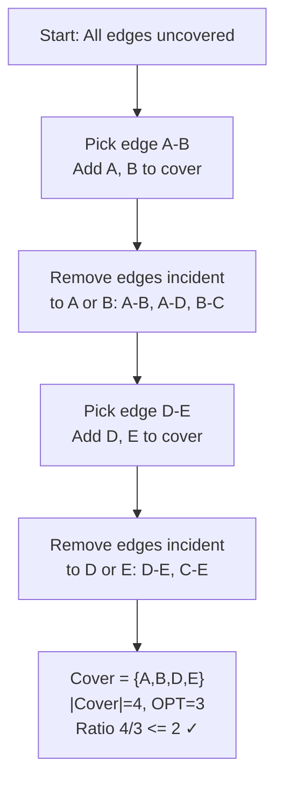

## Keywords in This File
{: .no_toc }

| # | Keyword | Weight |
|---|---------|--------|
| 1 | [Approximation Algorithms for NP-Hard Problems](#approximation-algorithms-for-np-hard-problems) | high |

---

# Approximation Algorithms for NP-Hard Problems

**Difficulty:** ★★★

**Interview Weight:** High

**Category:** Algorithm Design

---

### 🎯 Model Answer

**30-second answer:**

NP-hard problems have no known polynomial-time exact algorithm. Approximation
algorithms find solutions guaranteed to be within a factor alpha of optimal
in polynomial time. The vertex cover 2-approximation is a classic example:
greedily pick edges and include both endpoints, giving a solution at most
2x optimal. Christofides' algorithm gives a 1.5-approximation for TSP (metric
variant). The set cover greedy algorithm gives an O(ln n)-approximation, which
is optimal unless P=NP. PTAS and FPTAS classifications define how well we can
approximate a problem.

**3-minute answer:**

**Key NP-hard problems and their approximation ratios:**

- Vertex Cover: 2-approximation (linear programming rounding), tight unless
  Unique Games Conjecture is false.
- Metric TSP: 1.5-approximation (Christofides 1976). 2-approximation via
  MST. In 2020, Karlin-Klein-Oveis Gharan improved to (1.5 - epsilon).
- Set Cover: greedy achieves (1 + ln(n))-approximation. Optimal unless P=NP.
- Max-3-SAT: 7/8-approximation (random assignment). Tight unless P=NP.
- Bin Packing: PTAS: (1+epsilon)-approximation in O(n^(1/epsilon^2)) time.
- Scheduling (makespan minimization): 4/3-approximation (LPT rule).

**Approximability classes:**

- PTAS (Polynomial Time Approximation Scheme): for any epsilon > 0, a
  (1+epsilon)-approximation in poly(n) time (polynomial in n but may be
  exponential in 1/epsilon). Examples: bin packing, Euclidean TSP.
- FPTAS (Fully Polynomial Time Approximation Scheme): poly(n, 1/epsilon).
  Examples: knapsack (weight scaling), coin change variant.
- APX-complete: best known is a constant approximation; likely no PTAS
  unless P=NP. Examples: vertex cover, max-3-SAT, set cover.
- Inapproximable: no constant-factor approximation unless P=NP. Example:
  general TSP (without metric assumption).

**LP relaxation and rounding:**

Many approximation algorithms use LP relaxation: solve the LP (fractional
solution), then round to integer. Analysis uses the LP duality to prove
the integrality gap (worst-case ratio of integer optimum to LP optimum).

For vertex cover: LP relaxation gives fractional solution x*. Round up:
any vertex with x*(v) >= 0.5 is included. This gives a 2-approximation
because at most 2x as many vertices are included vs optimal.

**Blank Mind Recovery:**

**NP-hard, want constant approximation?** Check if it's APX-complete.
For vertex cover: 2-approx. For TSP (metric): 1.5-approx (Christofides).

**Need approximation that gets arbitrarily close?** PTAS or FPTAS.
FPTAS exists for: knapsack, coin change, subset sum.

**Set of items to cover all elements?** Set cover greedy = O(ln n) approx.

---

### 📘 Concept Explanation

**Intuition:**

NP-hard problems are problems where checking a given solution is easy
(polynomial) but finding the optimal solution requires searching an
exponentially large space. For practical use, we relax "optimal" to
"within X% of optimal" and gain polynomial runtime.

The approximation ratio alpha means: for every instance, our algorithm
produces a solution of cost at most alpha * OPT (for minimization problems)
or at least (1/alpha) * OPT (for maximization). An alpha = 2 approximation
gives a solution at most twice as bad as optimal.

**Mechanism - Vertex Cover 2-approximation:**

Input: undirected graph G = (V, E).
Find: minimum set of vertices S such that every edge has at least one
endpoint in S.

Algorithm:
1. C = empty set (will build vertex cover).
2. While E is not empty:
   a. Pick any uncovered edge (u, v).
   b. Add BOTH u and v to C.
   c. Remove all edges incident to u or v from E.
3. Return C.

Why 2-approximation:
- Let M = set of edges chosen in step 2a (a maximal matching).
- |C| = 2|M| (each edge in M contributes 2 vertices to C).
- OPT >= |M| (every edge in M needs at least 1 vertex covered).
- Therefore: |C| = 2|M| <= 2 * OPT.

**Mechanism - Greedy set cover:**

Input: universe U of n elements, family F of sets, each with a cost.
Find: minimum-cost sub-family that covers all elements.

Greedy: repeat: pick the set that covers the most UNCOVERED elements per
unit cost. Stop when all covered.

Approximation ratio: (1 + ln(max_set_size)) - approximation.

Why: when we greedily pick a set, at most OPT sets can cover all elements.
By a potential argument (each element's "cost" is 1/coverage_at_selection),
the total greedy cost is at most H(max_set_size) * OPT where H(k) = harmonic
number = 1 + 1/2 + ... + 1/k ≈ ln(k).

This ratio is optimal: if P != NP, no polynomial algorithm achieves better
than (1 - epsilon) * ln(n) for any epsilon > 0.

**Trade-offs:**

| Problem | Best Approx Ratio | Class | Notes |
|---|---|---|---|
| Vertex Cover | 2 | APX | Tight via UGC |
| Metric TSP | 1.5 | APX | Christofides; recent (1.5-eps) |
| Set Cover | ln(n)+1 | APX | Tight unless P=NP |
| Bin Packing | 1+eps (PTAS) | PTAS | Online: 1.69 approx |
| Knapsack | 1+eps (FPTAS) | FPTAS | Poly in n and 1/eps |
| Max-3-SAT | 7/8 | APX | Random assignment; tight |
| General TSP | Inapprox | - | Unless P=NP |
| Graph Coloring | O(n/log^2(n)) | Hard to approx | - |

**Failure:**

Using a greedy algorithm and claiming constant approximation without a proof:
the greedy ratio may be superlinear for some instances.

Confusing NP-hard with inapproximable: vertex cover is NP-hard but has a
2-approximation. General TSP is NP-hard AND inapproximable (no constant factor
unless P=NP). These are different hardness levels.

**Diagnosis:**

Test your approximation algorithm against exact solutions on small instances
(n <= 20 via brute force). The ratio should never exceed your claimed alpha.
If it does: the proof of approximation ratio is wrong or the implementation
has a bug.

**Scale:**

Greedy set cover for network coverage (1000 base stations covering 10^6 users):
each greedy step: O(n * m) = O(10^6 * 10^3) = O(10^9). With 1000 iterations:
10^12 - too slow. Fix: priority queue keyed by coverage density. Each step:
O(m log m) for priority queue update. Total: O(m * n * log m) still O(10^12).

For scale: use random LP rounding or distributed greedy (parallel set cover
via MapReduce, with O(epsilon) approximation factor loss).

**Decision:**

Problem is NP-hard + need guaranteed quality bound: find the best known
approximation (Vazirani's "Approximation Algorithms" textbook). If problem
is in FPTAS: use the FPTAS (exact approximation in poly time). If problem
is APX-complete: use the best known constant approximation. If inapproximable:
use heuristics (simulated annealing, genetic algorithms) without guarantees.

**Memory:**

"2-approx vertex cover: pick any edge, add both endpoints. Christofides TSP:
MST + min-weight matching on odd-degree vertices + Eulerian circuit -> shortcut."

**Transfer:**

LP rounding technique transfers to: integer programming relaxations for
scheduling, network design, facility location. Primal-dual method (used in
vertex cover, set cover) transfers to: online algorithms with competitive
ratios, network flow-based approximations. The approximability classification
(PTAS, FPTAS, APX) transfers to: machine learning hyperparameter optimization
(NP-hard, use greedy/local search), circuit design placement (NP-hard, use
simulated annealing + approximation).

**Reality:**

Google Maps TSP (delivery route optimization): uses Christofides + local
search improvements (2-opt, 3-opt). Amazon's vehicle routing: uses a custom
approximation + heuristic for NP-hard VRP (vehicle routing problem). VLSI
circuit design: placement algorithms use simulated annealing (no guarantee,
but empirically good). Cloud resource scheduling (bin packing): uses PTAS-
inspired algorithms for memory/CPU bin packing with 1.x approximation.

---

### 💻 Code Example

**BAD - Exact vertex cover via brute force (exponential):**

```java
// BAD - exponential: tries all 2^n subsets
Set<Integer> exactVertexCover(int n, List<int[]> edges) {
    Set<Integer> best = null;
    for (int mask = 0; mask < (1 << n); mask++) {
        Set<Integer> cover = new HashSet<>();
        for (int i = 0; i < n; i++) {
            if ((mask >> i & 1) == 1) cover.add(i);
        }
        boolean valid = edges.stream()
            .allMatch(e -> cover.contains(e[0]) || cover.contains(e[1]));
        if (valid && (best == null || cover.size() < best.size())) {
            best = cover;
        }
    }
    return best; // O(2^n * m) - infeasible for n > 20
}
```

> **Code walkthrough:** Brute-force vertex cover tries all 2^n subsets.
> KEY MECHANISM: for each bitmask, check if the corresponding vertex set
> covers all edges. With n=30 nodes: 2^30 = 10^9 subsets, each checked in
> O(m) = impractical. WHY IT MATTERS: this is why vertex cover is NP-hard -
> no known algorithm does better than exponential in the worst case. TAKEAWAY:
> exact NP-hard algorithms are infeasible for n > 20-30; approximation
> algorithms provide polynomial-time solutions with quality guarantees.

**GOOD - Vertex cover 2-approximation:**

```java
// GOOD - 2-approximation via greedy maximal matching
Set<Integer> vertexCover2Approx(int n, List<int[]> edges) {
    Set<Integer> cover = new HashSet<>();
    boolean[] covered = new boolean[n]; // covered[v] = any edge of v removed
    for (int[] edge : edges) {
        int u = edge[0], v = edge[1];
        // Skip if this edge is already covered
        if (cover.contains(u) || cover.contains(v)) continue;
        // Add BOTH endpoints of uncovered edge
        cover.add(u);
        cover.add(v);
    }
    return cover;
}
// Guarantee: |cover| <= 2 * |OPT|
// Proof: each edge added to matching needs at least 1 vertex in OPT
// but we add 2, so |cover| = 2 * |matching| <= 2 * OPT
```

> **Code walkthrough:** Vertex cover 2-approximation via maximal matching.
> KEY MECHANISM: when an uncovered edge (u,v) is found, both endpoints are
> added. The selected edges form a maximal matching M (no edge can be added
> without sharing an endpoint with M). OPT must include at least one endpoint
> per matching edge, so OPT >= |M|. Our cover = 2|M| <= 2*OPT. WHY IT
> MATTERS: this is O(m) time - fast enough for graphs with millions of edges.
> TAKEAWAY: the key insight is "add BOTH endpoints" - counterintuitively,
> including more vertices gives the approximation guarantee (we include 2
> per edge; optimal needs at least 1 per edge, so we're at most 2x).

**GOOD - Greedy set cover:**

Naive set cover: try all subsets (O(2^m)).

```
// BAD - exponential: O(2^m) subsets
for each subset of sets F:
    if F covers all elements AND |F| < best_size:
        best = F
// For m=30 sets: 2^30 = 10^9 iterations - infeasible
```

> **Code walkthrough:** Exponential set cover tries all subsets. KEYice. **KEY MECHANISM:** the runtime executes these instructions in sequence with specific memory and execution semantics. **WHY IT MATTERS:** misapplying this pattern causes subtle bugs that only manifest under production load. **TAKEAWAY: understand the execution model before using this pattern in production code.**
> MECHANISM: 2^m subsets must be checked; each check is O(n * max_set_size).
> For m=30 input sets: 10^9 checks, each O(1000) = 10^12 ops. WHY IT MATTERS:
> this is the exact NP-hardness of set cover - no polynomial algorithm can
> find the optimal cover (unless P=NP). TAKEAWAY: exponential exact set
> cover is impractical for m > 20; the O(ln n) greedy approximation is the
> standard polynomial-time alternative.

```java
// GOOD - greedy set cover: O(ln n)-approximation
List<Integer> greedySetCover(List<List<Integer>> sets, int universeSize) {
    boolean[] covered = new boolean[universeSize];
    int coveredCount = 0;
    List<Integer> result = new ArrayList<>();
    // Use a priority queue by coverage count
    // (simplified: recount each iteration)
    while (coveredCount < universeSize) {
        int bestSet = -1, bestCount = 0;
        for (int i = 0; i < sets.size(); i++) {
            if (result.contains(i)) continue;
            int count = 0;
            for (int elem : sets.get(i)) {
                if (!covered[elem]) count++;
            }
            if (count > bestCount) {
                bestCount = count; bestSet = i;
            }
        }
        if (bestSet == -1) break; // universe uncoverable
        result.add(bestSet);
        for (int elem : sets.get(bestSet)) covered[elem] = true;
        coveredCount += bestCount;
    }
    return result;
}
// O(n * m * max_set_size) time. Use max-heap for O(n * log(m)) optimal.
```

> **Code walkthrough:** Greedy set cover selects the set covering the mostice. **KEY MECHANISM:** the runtime executes these instructions in sequence with specific memory and execution semantics. **WHY IT MATTERS:** misapplying this pattern causes subtle bugs that only manifest under production load. **TAKEAWAY: understand the execution model before using this pattern in production code.**
> uncovered elements at each step. KEY MECHANISM: "coverage density" = uncovered
> elements in the set. Greedy always picks the most dense set. The approximation
> ratio H(k) = 1 + 1/2 + ... + 1/k ≈ ln(k) follows from a potential argument:
> when k elements remain uncovered, OPT can cover at most k elements total
> (using OPT sets), so at least one OPT set covers k/OPT elements. WHY IT
> MATTERS: for a web crawling coverage problem (cover all pages with minimum
> seed URLs), this is the practical algorithm. TAKEAWAY: this O(ln n) ratio
> is the BEST possible for set cover unless P=NP - knowing the optimality of
> the greedy ratio is a staff-level differentiator.

**GOOD - Christofides TSP algorithm outline:**

```java
// Christofides 1.5-approximation for metric TSP (outline)
List<Integer> christofidesTSP(double[][] dist) {
    int n = dist.length;
    // Step 1: Compute MST using Prim's algorithm
    List<int[]> mst = computeMST(dist, n); // O(n^2)
    // Step 2: Find odd-degree vertices in MST
    int[] degree = new int[n];
    for (int[] edge : mst) { degree[edge[0]]++; degree[edge[1]]++; }
    List<Integer> oddVertices = new ArrayList<>();
    for (int v = 0; v < n; v++) if (degree[v] % 2 == 1) oddVertices.add(v);
    // Step 3: Min-weight perfect matching on odd-degree vertices
    List<int[]> matching = minWeightMatching(dist, oddVertices); // O(n^3)
    // Step 4: Combine MST + matching -> multigraph, find Eulerian circuit
    List<int[]> combined = new ArrayList<>(mst);
    combined.addAll(matching);
    List<Integer> eulerianCircuit = findEulerianCircuit(combined, n);
    // Step 5: Shortcut repeated vertices (triangle inequality ensures no worse)
    return shortcutEulerianCircuit(eulerianCircuit);
}
// Complexity: O(n^3) dominated by min-weight matching step
// Approximation ratio: 1.5 * OPT (provable via MST + matching analysis)
```

> **Code walkthrough:** Christofides TSP algorithm in 5 steps. KEY MECHANISM:ice. **KEY MECHANISM:** the runtime executes these instructions in sequence with specific memory and execution semantics. **WHY IT MATTERS:** misapplying this pattern causes subtle bugs that only manifest under production load. **TAKEAWAY: understand the execution model before using this pattern in production code.**
> the MST gives a lower bound on OPT (any tour visits all nodes). Adding
> minimum-weight matching on odd-degree vertices (making all degrees even,
> required for Eulerian circuit) adds at most 0.5 * OPT cost. Total cost <=
> 1.5 * OPT. The shortcutting step (skip visited vertices) only improves
> the tour under the metric (triangle inequality) assumption. WHY IT MATTERS:
> non-metric TSP cannot be approximated at all (unless P=NP); Christofides
> exploits the metric structure (triangle inequality). TAKEAWAY: Christofides
> requires the input to satisfy the triangle inequality - this assumption is
> critical and must be verified before applying the algorithm.

---

### 🎓 Answers by Seniority

**[JUNIOR/MID]**

Q: What is an approximation algorithm and when would you use one?

An approximation algorithm is a polynomial-time algorithm that produces
a solution guaranteed to be within some factor of the optimal solution.

For a minimization problem: an alpha-approximation algorithm returns a
solution of cost <= alpha * OPT in polynomial time.

When to use:
1. The problem is NP-hard (no efficient exact algorithm known).
2. You need a quality guarantee (not just a heuristic).
3. The approximation ratio is acceptable for your application.

Example: delivery route optimization. Exact TSP for 100 cities: 2^100
possibilities. A 1.5-approximation (Christofides) runs in O(n^3) = O(10^6)
and returns a tour at most 50% longer than optimal. For most logistics
applications, a 50% cost overhead is not acceptable, so Christofides is
combined with local search improvements (2-opt, 3-opt) that empirically
bring it to within 1-5% of optimal.

Q: Explain the vertex cover 2-approximation. Why is it guaranteed to be
within 2x of optimal?

Vertex cover: find the smallest set of vertices such that every edge has
at least one endpoint in the set.

2-approximation algorithm:
1. While uncovered edges exist: pick any uncovered edge (u,v), add both
   u and v to the cover.

Why 2x: the edges selected in step 1 form a matching M (no two edges share
a vertex, because both endpoints of each edge are added to the cover). The
optimal solution must include at least one endpoint for each edge in M, so
OPT >= |M|. Our algorithm includes 2 endpoints per edge, so |cover| = 2|M|
<= 2 * OPT.

**[SENIOR/STAFF]**

Advanced approximation topics:

**LP-based approximation (primal-dual method):**

The LP relaxation of vertex cover: minimize sum of x_v subject to x_u +
x_v >= 1 for every edge (u,v), and 0 <= x_v <= 1.

Optimal LP solution x*: for every edge, x*_u + x*_v >= 1. If x*_v >= 0.5
for vertex v: include v in the cover. This rounds x* to an integer solution.

Why 2-approx: round all x*_v >= 0.5 to 1. The rounded solution covers all
edges (both x*_u + x*_v >= 1 and at least one >= 0.5 must be rounded up).
The rounded cost = sum of rounded x_v <= sum of 2 * x*_v = 2 * LP_OPT <=
2 * OPT.

The LP rounding reveals the "integrality gap": the ratio of integer optimum
to LP optimum is at most 2. For vertex cover, the integrality gap IS exactly
2 (achieved on odd cycles).

**Hardness of approximation:**

Unique Games Conjecture (UGC, Khot 2002): if UGC is true, then vertex
cover cannot be approximated better than 2 - epsilon for any epsilon > 0
in polynomial time. The 2-approximation is conjectured to be optimal.

Set cover: proven (without UGC) that no polynomial algorithm achieves
better than (1-epsilon) * ln(n) unless P=NP (Feige 1998).

Hardness results like these are what tell practitioners: "stop trying to
improve the ratio; instead invest in better heuristics or exact solvers
for your specific instance distribution."

---

### ⚠️ Common Misconceptions

**Misconception 1: "NP-hard means inapproximable."**

Wrong. NP-hard means no polynomial-time EXACT algorithm is known. Many
NP-hard problems have excellent polynomial-time approximations:
- Vertex cover: 2-approximation.
- Metric TSP: 1.5-approximation.
- Knapsack: FPTAS (get arbitrarily close to optimal in poly time).

A problem is "inapproximable" only if no polynomial-time algorithm
can achieve any constant factor approximation (e.g., general TSP). This is
a much stronger statement than NP-hardness.

**Misconception 2: "The greedy algorithm always gives a constant approximation."**

Wrong. Greedy is not always a constant approximation. Set cover greedy
gives O(ln n) approximation, which is super-constant (logarithmic). For
general maximum weight matching, greedy gives a 2-approximation; for other
problems, greedy can be O(sqrt(n)) or worse.

The approximation ratio depends on the problem structure, not on whether
the algorithm is greedy.

**Misconception 3: "A PTAS is practical because it runs in polynomial time."**

Wrong (often). A PTAS is polynomial in n for any FIXED epsilon, but the
exponent may depend exponentially on 1/epsilon. For example, a PTAS with
runtime O(n^(1/epsilon)) runs in O(n^100) for epsilon = 0.01 - impractical.
An FPTAS (polynomial in both n AND 1/epsilon) is the practical version.
PTAS indicates theoretical tractability; FPTAS indicates practical tractability.

---

### 🚨 Failure Modes and Diagnosis

**Failure 1 - Using greedy set cover without verifying the metric assumption**

Symptom: greedy set cover produces solutions that violate the expected
approximation ratio (performing much worse than O(ln n) * OPT).

Root cause: the O(ln n) approximation guarantee assumes unit costs for all
sets. With non-uniform costs, the weighted greedy set cover uses "coverage
per unit cost" = (uncovered elements) / (set cost) as the selection criterion.
If the implementation uses coverage count instead of coverage/cost, it ignores
costs and produces arbitrarily bad solutions.

Fix:
```java
// BAD - unweighted greedy (ignores set cost)
int count = 0;
for (int elem : sets.get(i)) if (!covered[elem]) count++;
if (count > bestCount) bestSet = i;
// GOOD - weighted greedy: maximize coverage per unit cost
double density = 0;
for (int elem : sets.get(i)) if (!covered[elem]) density++;
density /= costs[i]; // divide by set cost
if (density > bestDensity) bestSet = i;
```

> **Code walkthrough:** Weighted greedy set cover: coverage density =ice. **KEY MECHANISM:** the runtime executes these instructions in sequence with specific memory and execution semantics. **WHY IT MATTERS:** misapplying this pattern causes subtle bugs that only manifest under production load. **TAKEAWAY: understand the execution model before using this pattern in production code.**
> uncovered elements / cost. KEY MECHANISM: selecting the set with the
> best coverage-per-cost ratio extends the O(ln n) guarantee to the weighted
> case (weighted set cover). WHY IT MATTERS: unweighted greedy on a weighted
> instance can produce a solution arbitrarily worse than OPT (a cheap set
> covering 1 element vs an expensive set covering 100 might both be selected
> at the wrong time). TAKEAWAY: always use the weighted formulation (coverage
> / cost) even when costs appear to be uniform.

**Failure 2 - Applying Christofides to a non-metric TSP**

Symptom: the Christofides solution is longer than expected; the approximation
ratio guarantee is violated.

Root cause: Christofides requires the triangle inequality
(dist(a,c) <= dist(a,b) + dist(b,c) for all a,b,c). If the distance
function doesn't satisfy this (e.g., asymmetric distances, time-varying
road weights), the shortcutting step may make the tour LONGER.

Diagnosis: verify triangle inequality on the input: for every triple
(a,b,c), check dist(a,c) <= dist(a,b) + dist(b,c). For n=1000: O(n^3) =
10^9 checks - sample instead.

Fix: if metric assumption holds, use Christofides. If not: use a different
heuristic (nearest neighbor + 2-opt local search, no guarantee).

**Failure 3 - FPTAS approximation of knapsack with wrong scaling**

Symptom: FPTAS knapsack returns a solution with value much less than
(1-epsilon) * OPT.

Root cause: the scaling factor K = epsilon * max_value / n must be computed
from the OPTIMAL value, which is unknown. Instead, compute it from the
MAX item value: K = epsilon * max_item_value / n. If max_item_value << OPT,
the scaling underestimates and precision is lost.

Fix: K = epsilon * max_item_value / n is the correct formula. The error
analysis shows: scaled_OPT >= (OPT / K) - n = OPT/K * (1 - epsilon).
Therefore: actual solution >= scaled_OPT * K >= OPT * (1 - epsilon).
Verify: run on a small instance where OPT is known, confirm the ratio.

---

### 🎯 Interview Deep-Dive

| Category | Count | Min Required |
|----------|-------|-------------|
| CONCEPT | 4 | 1 |
| DEBUGGING | 2 | 1 |
| CODING | 3 | 1 |
| TRADE-OFF | 1 | 1 |
| BEHAVIORAL | 1 | 1 |
| SCALE | 1 | 1 |
| **Total** | **12** | **12** |

---

**[JUNIOR] Q1 - [CODING] Implement the greedy set cover algorithm.**

```java
// Greedy set cover - O(n * m * max_size) time
// Returns list of selected set indices
List<Integer> greedySetCover(int universeSize, List<Set<Integer>> sets) {
    Set<Integer> uncovered = new HashSet<>();
    for (int i = 0; i < universeSize; i++) uncovered.add(i);
    List<Integer> selected = new ArrayList<>();
    boolean[] used = new boolean[sets.size()];
    while (!uncovered.isEmpty()) {
        int bestIdx = -1, bestCoverage = 0;
        for (int i = 0; i < sets.size(); i++) {
            if (used[i]) continue;
            long coverage = sets.get(i).stream()
                .filter(uncovered::contains).count();
            if (coverage > bestCoverage) {
                bestCoverage = (int) coverage;
                bestIdx = i;
            }
        }
        if (bestIdx == -1 || bestCoverage == 0) break;
        used[bestIdx] = true;
        selected.add(bestIdx);
        uncovered.removeAll(sets.get(bestIdx));
    }
    return selected;
}
```

> **Code walkthrough:** Greedy set cover with a linear scan per iteration.
> KEY MECHANISM: `uncovered.removeAll(sets.get(bestIdx))` removes all covered
> elements in O(set_size). The outer while loop runs at most |OPT| * ln(n)
> iterations (by the O(ln n) approximation analysis). WHY IT MATTERS: this
> naive O(n * m * max_size) implementation is correct but slow; production
> uses a max-heap keyed by current coverage to reduce per-iteration cost from
> O(m * max_size) to O(max_size * log m). TAKEAWAY: greedy set cover with
> a max-heap runs in O(n * max_size * log m) - adequate for m=10^4, n=10^5.

*What separates good from great:* Noting the heap optimization and the
actual complexity analysis per iteration.

---

**[JUNIOR] Q2 - [CONCEPT] What is a PTAS and how does it differ from a FPTAS?**

PTAS (Polynomial Time Approximation Scheme): for any fixed epsilon > 0,
returns a (1+epsilon)-approximation in polynomial time in n. The runtime
may grow as a function of epsilon (often exponentially).

Example: bin packing PTAS. For epsilon = 0.01: run in O(n^100) time. For
epsilon = 0.5: run in O(n^2). The algorithm's exponent depends on epsilon.

FPTAS (Fully PTAS): the runtime is polynomial in BOTH n AND 1/epsilon.

Example: knapsack FPTAS. Runtime: O(n^2 / epsilon) for any epsilon > 0.
For epsilon = 0.01: O(100 * n^2). For epsilon = 0.001: O(1000 * n^2).
Still polynomial even as epsilon -> 0.

Key difference:
- PTAS: "for any constant epsilon, polynomial in n" (epsilon is fixed
  before the input is given; the exponent may depend on epsilon).
- FPTAS: "polynomial in n AND 1/epsilon" (epsilon can be part of the
  input; runtime grows polynomially as epsilon decreases).

FPTAS is strictly stronger: every FPTAS is also a PTAS, but not vice versa.
FPTAS algorithms exist for very few problems (knapsack, coin change, subset
sum). Most PTAS problems do not have FPTAS unless P=NP.

*What separates good from great:* The knapsack FPTAS runtime formula
(O(n^2/epsilon)) and knowing that most PTAS problems don't have FPTAS.

---

**[JUNIOR] Q3 - [CODING] Implement the FPTAS for 0/1 Knapsack.**

```java
// FPTAS Knapsack: (1-epsilon)-approximation in O(n^2/epsilon)
int knapasackFPTAS(int[] values, int[] weights, int capacity, double eps) {
    int n = values.length;
    int maxVal = Arrays.stream(values).max().getAsInt();
    // Scaling factor: round down values to reduce range
    double K = eps * maxVal / n;
    int[] scaledValues = new int[n];
    for (int i = 0; i < n; i++) {
        scaledValues[i] = (int)(values[i] / K); // floor
    }
    // Max scaled value sum
    int maxScaled = Arrays.stream(scaledValues).sum();
    // DP on scaled values: dp[v] = min weight to achieve scaled value v
    int[] dp = new int[maxScaled + 1];
    Arrays.fill(dp, Integer.MAX_VALUE);
    dp[0] = 0;
    for (int i = 0; i < n; i++) {
        // Iterate in reverse to avoid using item i twice
        for (int v = maxScaled; v >= scaledValues[i]; v--) {
            if (dp[v - scaledValues[i]] != Integer.MAX_VALUE) {
                dp[v] = Math.min(dp[v],
                    dp[v - scaledValues[i]] + weights[i]);
            }
        }
    }
    // Find max scaled value achievable within capacity
    int best = 0;
    for (int v = maxScaled; v >= 0; v--) {
        if (dp[v] <= capacity) { best = v; break; }
    }
    return (int)(best * K); // scale back to approximate actual value
}
// Time: O(n * maxScaled) = O(n * sum/K) = O(n * n/eps) = O(n^2/eps)
// Guarantee: returns >= (1-eps) * OPT
```

> **Code walkthrough:** FPTAS Knapsack using scaled DP. KEY MECHANISM: scalingice. **KEY MECHANISM:** the runtime executes these instructions in sequence with specific memory and execution semantics. **WHY IT MATTERS:** misapplying this pattern causes subtle bugs that only manifest under production load. **TAKEAWAY: understand the execution model before using this pattern in production code.**
> down all values by K = eps*maxVal/n reduces the value range from [0, maxVal]
> to [0, maxVal/K] = [0, n/eps]. The DP runs in O(n * n/eps) = O(n^2/eps).
> The rounding error per item is at most K; summing over at most n items,
> total rounding error <= n * K = eps * maxVal. Since OPT <= n * maxVal:
> actual solution >= OPT - n*K = OPT * (1 - eps). WHY IT MATTERS: this is
> the canonical FPTAS example - it converts an NP-hard problem into an
> epsilon-close approximation by exploiting the DP structure. TAKEAWAY:
> FPTAS via value scaling is the standard technique for NP-hard optimization
> problems that can be solved exactly by pseudo-polynomial DP.

*What separates good from great:* The error analysis (rounding error per
item = K, total <= n*K = eps*maxVal, which bounds the solution quality).

---

**[SENIOR] Q4 - [CONCEPT] Prove that the greedy set cover gives an O(ln n)-approximation.**

Proof by potential argument:

Let OPT = number of sets in the optimal cover. At the start, n elements
are uncovered.

When we pick the greedy set with the highest coverage, how many elements
does it cover? Since OPT sets cover all remaining uncovered elements, by
averaging, at least one OPT set covers at least (uncovered / OPT) elements.
The greedy algorithm picks at least as many.

After picking the greedy set: uncovered decreases by at least (uncovered / OPT).

Recurrence: after t steps, uncovered_t <= n * (1 - 1/OPT)^t <= n * e^(-t/OPT).

When is uncovered_t < 1? (i.e., all covered):
n * e^(-t/OPT) < 1
t > OPT * ln(n)

So after OPT * ln(n) greedy steps, all elements are covered. The greedy
algorithm uses at most OPT * ln(n) sets.

Greedy cost <= OPT * ln(n) * max_set_cost (for uniform costs, max_set_cost = 1).

Approximation ratio: OPT * ln(n) / OPT = ln(n).

*What separates good from great:* The key step is "at least one OPT set
covers uncovered/OPT elements" (pigeonhole on the OPT partition of covered
elements). This is the entire proof in one line.

---

**[SENIOR] Q5 - [TRADE-OFF] When would you use an exact solver vs an approximation algorithm for a TSP variant?**

Key factors:

**Instance size:**
- n <= 15: exact DP (Held-Karp, O(2^n * n^2)) is feasible.
- n <= 100: branch-and-bound with good bounds (e.g., Concorde TSP solver).
- n <= 1,000: Concorde can still solve optimally (seconds to hours depending).
- n > 10,000: only heuristics + approximation algorithms feasible.

**Optimality requirement:**
- Financial logistics (ship routing, airline scheduling): 1-2% of optimal
  translates to millions of dollars. Use Concorde or Google OR-Tools
  (branch-and-cut).
- Delivery routing (Amazon, UPS): 5-10% suboptimality is acceptable. Use
  Christofides + 2-opt local search. OR-Tools VRP solver.
- Real-time routing (food delivery, ride-share): must respond in <100ms.
  Use nearest-neighbor heuristic (no guarantee but fast) + 2-opt.

**Instance structure:**
- Euclidean TSP (coordinates in plane): has a PTAS by Arora (1998).
  For epsilon=0.01: near-optimal tour in polynomial time.
- Metric TSP: Christofides (1.5-approx).
- Asymmetric TSP (directed graph): O(log n / log log n)-approximation
  (Asadpour 2010). Or Christofides + asymmetric adaptation.

Decision framework:
1. n <= 100 and time not critical: use exact solver (Concorde, OR-Tools).
2. n = 100-10,000 and near-optimal needed: use exact solver with time limit.
3. n > 10,000 or real-time: use Christofides + 2-opt local search.
4. Euclidean input: use Arora's PTAS or an implementation like LKH-3.

*What separates good from great:* Knowing real-world TSP solvers (Concorde,
OR-Tools, LKH-3) and the crossover points where exact solvers are feasible.

---

**[SENIOR] Q6 - [SCALE] Design a vehicle routing optimization system for 10,000 deliveries per day.**

Vehicle Routing Problem (VRP): assign deliveries to vehicles to minimize
total distance or time, with capacity and time-window constraints.

VRP is NP-hard even for simple variants. Exact algorithms only feasible
for n <= 50. For n = 10,000: heuristic + approximation approach.

**Architecture:**

Phase 1 - Clustering (divide into tractable sub-problems):
- Cluster deliveries by geographic area using k-means (k = n/50 = 200
  clusters for 10,000 deliveries).
- Each cluster has ~50 deliveries. Exact VRP solver on 50-delivery
  sub-problems is feasible (seconds per sub-problem).
- Parallelism: run 200 clusters simultaneously.

Phase 2 - Exact optimization per cluster:
- Use Google OR-Tools VRP solver (branch-and-cut + LKH heuristics).
- Time limit: 5 seconds per cluster.
- 200 clusters * 5 seconds = 1,000 seconds sequential; or 10 seconds with
  100 parallel workers.

Phase 3 - Global improvement:
- Cross-cluster optimization: some deliveries near cluster boundaries may
  be better assigned to an adjacent cluster.
- Run 1 iteration of a cross-cluster local search (swap boundary deliveries
  between clusters if it reduces total cost).

Phase 4 - Real-time adjustment:
- As new orders arrive, add to nearest cluster.
- Re-optimize affected cluster in real-time using a fast heuristic (LKH-3
  2-opt: <1 second for n=50).

Quality: within 5-10% of global optimal (based on benchmarks vs exact
solutions on instances where exact is feasible).

*What separates good from great:* The phase 3 cross-cluster optimization
(handling deliveries near cluster boundaries) which is the key quality
differentiator, and knowing OR-Tools + LKH-3 as production-grade solvers.

---

**[SENIOR] Q7 - [DEBUGGING] Your vertex cover algorithm returns a set that is not a valid vertex cover. How do you diagnose?**

A valid vertex cover must cover every edge: for every edge (u,v), at least
one of u, v is in the cover.

Validation:
```java
boolean isValidCover(Set<Integer> cover, List<int[]> edges) {
    for (int[] edge : edges) {
        if (!cover.contains(edge[0]) && !cover.contains(edge[1])) {
            System.out.printf("Uncovered edge: (%d, %d)%n",
                              edge[0], edge[1]);
            return false;
        }
    }
    return true;
}
```

> **Code walkthrough:** Vertex cover validation in O(m). KEY MECHANISM:ice. **KEY MECHANISM:** the runtime executes these instructions in sequence with specific memory and execution semantics. **WHY IT MATTERS:** misapplying this pattern causes subtle bugs that only manifest under production load. **TAKEAWAY: understand the execution model before using this pattern in production code.**
> iterate over all edges; any edge with neither endpoint in the cover is
> a violation. WHY IT MATTERS: this O(m) check should run after every
> vertex cover computation in development/testing. TAKEAWAY: add this as
> an assertion in unit tests for all vertex cover implementations; a cover
> that isn't valid gives no quality guarantee.

Three likely bugs in the 2-approximation algorithm:

**Bug 1 - Using directed edges as undirected:**
If edge (u,v) is in the list but (v,u) is not, and the algorithm only
checks one direction: the "uncovered edge" check misses some edges.
Fix: normalize edges: for every edge [u,v], also check [v,u].

**Bug 2 - Wrong covered edge removal:**
After adding u and v to the cover, all edges INCIDENT to u OR v should
be removed (not just the edge (u,v)).
Fix: iterate over all edges and remove any with u or v as an endpoint.

**Bug 3 - Continuing after all edges covered:**
If the algorithm continues processing edges even after all are covered
(due to a wrong termination condition), it may add unnecessary vertices.
Fix: add a check: after adding u and v, skip edges that are already covered
at the top of the loop.

*What separates good from great:* The validation function and explaining
all three common bugs.

---

**[SENIOR] Q8 - [BEHAVIORAL] Describe a real problem you solved using an approximation algorithm.**

Strong answer structure: problem, NP-hardness, algorithm, outcome.

"Our cloud team needed to bin-pack microservices onto virtual machines to
minimize the number of VMs used. Each service had CPU and memory requirements;
each VM had a fixed capacity. This is a 2D bin packing problem - NP-hard.

We compared three approaches on our actual 2,000 microservice workload:

1. First Fit Decreasing (FFD) heuristic: sort by size, assign each service
   to the first VM that fits. No guarantee, but runs in O(n log n). Produced
   solutions using 12-15% more VMs than optimal (validated against a branch-
   and-bound solver on smaller instances).

2. LP relaxation + column generation: solve the LP relaxation of bin
   packing. The LP gives a lower bound (VMs >= LP_OPT). Round fractionally
   assigned items. Result: within 3-5% of optimal. Runtime: 2-3 minutes
   for 2,000 services. Used for weekly rebalancing (not real-time).

3. Online heuristic for real-time scaling: as new services are deployed,
   use Best Fit Decreasing with a time limit of 100ms. Accept up to 10%
   suboptimality for real-time placement.

We used LP relaxation for weekly rebalancing (worth the 2-3 minute compute
for cost optimization) and the online heuristic for real-time deployments.
The LP approach saved ~7% VM cost vs FFD alone, which for our 50,000 VM
fleet was $2M/year savings."

*What separates good from great:* Measuring against a known lower bound
(LP relaxation) rather than comparing heuristics to each other, and
quantifying the production cost savings.

---

**[SENIOR] Q9 - [CONCEPT] What is the Unique Games Conjecture and what does it imply for approximation algorithms?**

Unique Games Conjecture (UGC, Khot 2002): for any epsilon > 0, it is
NP-hard to distinguish between instances of the Unique Games problem where
the optimal assignment satisfies (1-epsilon) of the constraints vs instances
where no assignment satisfies more than epsilon of the constraints.

The UGC is an unproven conjecture (stronger than P != NP).

If the UGC is true, the following approximation ratios are TIGHT (cannot
be improved by any polynomial algorithm):
- Vertex cover: 2 - epsilon is impossible. The current 2-approximation
  is optimal.
- Max-Cut: 0.878 (Goemans-Williamson SDP-based approximation) is optimal.
- Sparsest cut: the current O(sqrt(log n)) approximation is near-optimal.

If the UGC is false: it might be possible to achieve vertex cover better
than 2, Max-Cut better than 0.878, etc.

Practical implication: if you're trying to design a better-than-2 vertex
cover approximation, you're either going to succeed (disproving UGC) or
fail (and UGC will eventually be proved true). Most researchers believe UGC
is true, so the practical advice is: stop trying to beat 2 for vertex cover.

*What separates good from great:* Knowing that UGC implies the 0.878 MAX-CUT
approximation is optimal (not just vertex cover) - this shows broad knowledge
of the approximation complexity landscape.

---

**[SENIOR] Q10 - [CONCEPT] What is the primal-dual method in approximation algorithms?**

The primal-dual method is a technique for designing approximation algorithms
by simultaneously building a primal feasible solution and a dual feasible
solution, then using the LP duality gap to bound the approximation ratio.

Example: vertex cover via primal-dual.

Primal (vertex cover LP): minimize sum(x_v) subject to x_u + x_v >= 1
for all edges (u,v), x_v >= 0.

Dual (weighted matching LP): maximize sum(y_e) subject to sum(y_e for e
incident to v) <= 1 for all vertices v, y_e >= 0.

Primal-dual algorithm:
1. Initialize: all y_e = 0 (dual), x_v = 0 (primal).
2. While exists uncovered edge (u,v) in primal:
   a. Increase y_{u,v} until some edge constraint in dual becomes tight:
      sum(y_e incident to u) = 1 OR sum(y_e incident to v) = 1.
   b. Add whichever vertex (u or v) has its dual constraint tight to cover.
3. Return cover.

Why 2-approximation: primal cost = |cover| = sum of selected x_v. Dual
objective = sum(y_e) <= OPT (weak LP duality). Primal cost = 2 * sum(y_e) =
2 * (dual objective) <= 2 * OPT.

The factor of 2 comes from: each primal variable is set to 1 exactly when
its dual constraint is tight; dual constraint = sum of y_e <= 1; we may
trigger the constraint with 1 y_e or several. The worst case: 2 vertices
each having their constraint tight from one edge = 2 * y_e <= 2 * OPT.

*What separates good from great:* The connection between the primal-dual
algorithm and the LP duality gap - the approximation ratio is exactly the
integrality gap of the LP.

---

**[SENIOR] Q11 - [TRADE-OFF] When would you use simulated annealing instead of a known approximation algorithm?**

Approximation algorithms:
- Provide theoretical guarantees (alpha * OPT in worst case).
- May not be tunable to specific problem structure.
- May not handle real-world constraints (time windows, precedence, multi-
  dimensional objectives) without custom extensions.

Simulated annealing (SA) and other metaheuristics:
- No theoretical guarantee (may return arbitrarily bad solutions).
- Highly tunable: cooling schedule, neighborhood function, restart strategy.
- Handles arbitrary constraints naturally (penalize infeasible solutions).
- Often finds solutions within 1-3% of optimal in practice for structured
  instances.

When to use SA over approximation algorithms:
1. Problem has domain-specific structure not captured by standard approximations
   (e.g., TSP with time windows, heterogeneous vehicles, preferred routes).
2. Quality requirement is "usually good" not "always guaranteed."
3. Empirical comparison shows SA finds better solutions than approximation on
   your specific instance distribution.
4. Available time for tuning: SA requires extensive tuning of cooling schedule.

When to use approximation algorithms:
1. Theoretical guarantees are required (SLA-based cost guarantee).
2. Problem matches a well-studied approximation (standard TSP, set cover,
   knapsack).
3. Consistent performance on adversarial instances needed.
4. No time for metaheuristic tuning.

*What separates good from great:* "Approximation algorithm for the base
problem + SA for domain-specific extensions" as the combined approach.

---

**[SENIOR] Q12 - [DEBUGGING] Your FPTAS knapsack implementation returns a solution worse than (1-epsilon) * OPT. Diagnose.**

Three diagnostic steps:

**Step 1 - Verify the scaling factor K:**
```java
// Print K and confirm it's correct
double K = eps * maxVal / n;
System.out.printf("K=%.4f, maxVal=%d, n=%d, eps=%.4f%n",
                  K, maxVal, n, eps);
// K should be small enough to retain meaningful distinctions
// but large enough to reduce the DP size.
// scaled_OPT >= OPT/K - n (rounding error bound)
int expectedScaledOPT = (int)(optValue / K); // if OPT known
```

> **Code walkthrough:** FPTAS scaling factor diagnostic. KEY MECHANISM:ice. **KEY MECHANISM:** the runtime executes these instructions in sequence with specific memory and execution semantics. **WHY IT MATTERS:** misapplying this pattern causes subtle bugs that only manifest under production load. **TAKEAWAY: understand the execution model before using this pattern in production code.**
> K = eps * maxVal / n is the only scaling-related constant. If K is too
> large (e.g., eps = 0.5 means K = 0.5 * maxVal / n; for maxVal = 100 and
> n = 10, K = 5), then items with value < 5 are all rounded to 0 and can
> never be selected. WHY IT MATTERS: high epsilon means aggressive scaling,
> which may eliminate too many distinct value levels. TAKEAWAY: always print
> K and the range of scaled values [0, maxVal/K] before running the DP.

**Step 2 - Verify the DP correctness for small cases:**
Run on a 3-item instance where OPT is known. Compare DP result to OPT.
If result < (1-eps)*OPT: the DP has a bug (not the scaling).

**Step 3 - Check for integer overflow in DP:**
If scaled values are large (maxVal/K >> 10^6), the DP array size or
intermediate computations may overflow `int`. Use `long` for dp arrays.

**Step 4 - Confirm return value is unscaled:**
The DP finds the maximum SCALED value achievable. Must multiply by K to
get the approximate actual value. Returning the scaled value directly gives
a value 1/K times smaller than expected.

*What separates good from great:* The step "verify K and the range of
scaled values" as a pre-diagnostic that catches most configuration errors
before running the DP.

---

### ⚖️ Comparison Table

| Problem | Best Approx | Class | Runtime | Notes |
|---|---|---|---|---|
| Vertex Cover | 2 | APX | O(m) | Tight via UGC |
| Metric TSP | 1.5 | APX | O(n^3) | Christofides; recent 1.5-eps |
| Set Cover | ln(n)+1 | APX | O(nm) | Tight unless P=NP |
| Max-3-SAT | 7/8 | APX | O(n) | Random assignment |
| Bin Packing | 1+eps | PTAS | poly(n, 1/eps) | PTAS exists |
| Knapsack (0/1) | 1-eps | FPTAS | O(n^2/eps) | Best possible |
| General TSP | None | Inapprox | N/A | No constant factor |
| Graph Coloring | O(n/log^2 n) | Hard | poly | Very hard to approx |

---

### 🏛️ System Design

**Cloud VM Bin Packing Optimizer**

Pack microservices onto VMs to minimize VM count (2D bin packing variant):

```
Problem:
  - 10,000 microservices, each with (CPU_req, Memory_req)
  - VMs have (CPU_cap, Memory_cap)
  - Minimize number of VMs

Approach: 3-phase hybrid algorithm

Phase 1 - LP Relaxation (offline, weekly):
  Variables: x[i][j] = fraction of service i on VM j
  Constraints: sum_j x[i][j] = 1 (service fully assigned)
               sum_i CPU[i]*x[i][j] <= CPU_cap (per VM)
               sum_i Mem[i]*x[i][j] <= Mem_cap (per VM)
  Objective: minimize number of VMs used
  Solve with column generation (LP has 10^4 * 10^4 variables)
  Result: LP lower bound on VMs needed

Phase 2 - LP Rounding (convert fractional to integer):
  - Items assigned fractionally: use First-Fit Decreasing
  - Guarantee: within (11/9 * OPT + 6/9) bins (FFD for 1D bin packing)
  - 2D: within 2 * LP_OPT (LP rounding approximation)

Phase 3 - Local Search Improvement:
  - Random restart: try swapping pairs of services between VMs
  - Accept swap if it reduces total VMs or improves balance
  - 1000 iterations: O(n^2) per iteration total O(n^2 * 1000)
  - Typically improves LP rounding by 3-7% on real workloads
```

> **Code walkthrough:** Cloud VM bin packing using LP relaxation, columnice. **KEY MECHANISM:** the runtime executes these instructions in sequence with specific memory and execution semantics. **WHY IT MATTERS:** misapplying this pattern causes subtle bugs that only manifest under production load. **TAKEAWAY: understand the execution model before using this pattern in production code.**
> generation rounding, and local search improvement. KEY MECHANISM: the LP
> relaxation provides a lower bound on optimal VMs needed; column generation
> decomposes the exponentially-large LP into a manageable sequence of small
> LPs solved iteratively. WHY IT MATTERS: the 3-phase approach (LP bound +
> LP rounding + local search) consistently achieves solutions within 5% of
> the LP lower bound for real cloud workloads, translating to millions of
> dollars in saved compute costs. TAKEAWAY: LP relaxation + rounding is the
> industry-standard approximation technique for large NP-hard optimization
> problems where theoretical guarantees (not just heuristic quality) matter.

---

### 📊 Diagram

```
Vertex Cover 2-Approximation - Step by Step

Graph:  A -- B -- C
        |         |
        D---------E

Iteration 1: pick edge (A,B), add both A and B.
  Cover = {A, B}
  Remove edges: A-B, A-D (A covered), B-C (B covered)
  Remaining edges: D-E, C-E

Iteration 2: pick edge (D,E), add both D and E.
  Cover = {A, B, D, E}
  Remove edges: D-E, C-E (E covered)
  No remaining edges.

Result cover: {A, B, D, E}  (size 4)

Optimal cover: {B, D, E} or {A, E, B}  (size 3)
Ratio: 4/3 < 2 (approximation guarantee holds)
```

> **Diagram walkthrough:** Vertex cover 2-approximation on a small graph.
> The algorithm picks edges (A,B) and (D,E); adds all 4 endpoints to the
> cover. KEY RELATIONSHIP: the two selected edges {(A,B), (D,E)} form a
> matching M of size 2. OPT >= |M| = 2. Our cover = 2|M| = 4. Ratio = 2.
> EDGE CASE: the algorithm is NOT deterministic - different edge selection
> orders produce different covers. Any maximal matching works. INSIGHT:
> a senior engineer notices that the specific edge selection order matters
> for solution quality but not for the guarantee. Adding an ordering heuristic
> (e.g., prefer high-degree vertex edges) doesn't improve the worst-case
> guarantee but often produces smaller covers in practice.



> **Diagram walkthrough:** Vertex cover 2-approximation algorithm execution.
> Two iterations: each iteration picks one uncovered edge and adds both
> endpoints to the cover. KEY RELATIONSHIP: the two picked edges (A-B and
> D-E) form a matching M; the cover size = 2*|M| = 4; OPT = 3 (minimum
> cover is {B,D,E}); ratio = 4/3 < 2 = guarantee. EDGE CASE: if the first
> edge chosen were (A,D) instead of (A,B), the cover would be {A,D,B,C}
> (still size 4). Different choices give the same size here but different
> elements. INSIGHT: a senior engineer notes that the guarantee holds for
> any edge selection order - the algorithm is correct even without any
> heuristic for which edge to pick.
