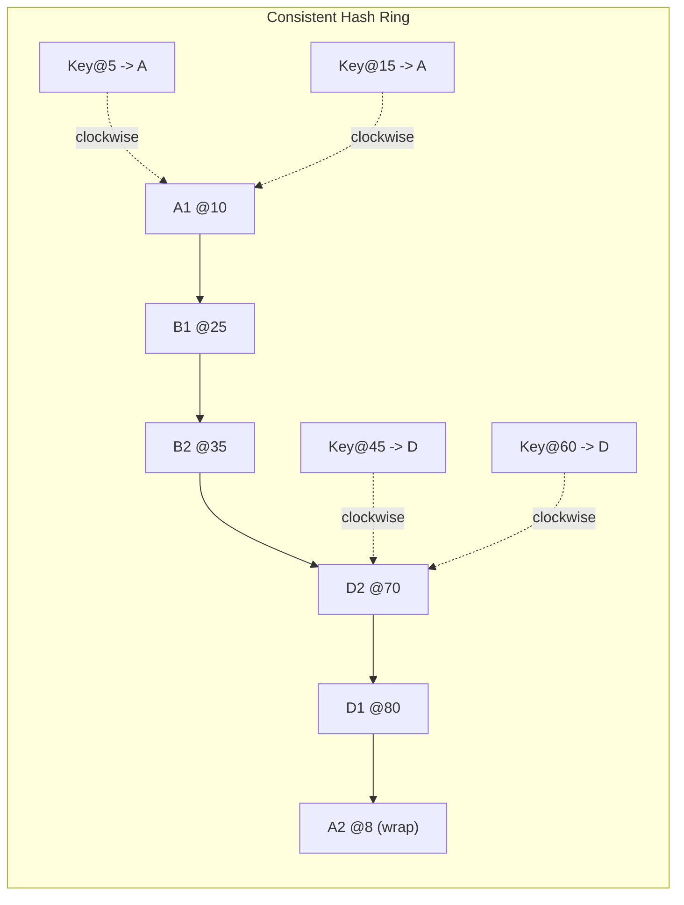

## Keywords in This File
{: .no_toc }

| # | Keyword | Weight |
|---|---------|--------|
| 1 | [Algorithm Design for Distributed Systems](#algorithm-design-for-distributed-systems) | high |

---

# Algorithm Design for Distributed Systems

**Difficulty:** ★★★

**Interview Weight:** High

**Category:** Distributed Systems

---

### 🎯 Model Answer

**30-second answer:**

Algorithm design for distributed systems requires fundamentally different
thinking from single-node algorithms: you must account for partial failures,
network latency, message reordering, and the impossibility results (FLP,
CAP). Consistent hashing distributes data with minimal rebalancing when
nodes join or leave. Gossip protocols disseminate state in O(log n) rounds
without a central coordinator. MapReduce/Pregel decompose graph algorithms
into distributed parallel computations. Every distributed algorithm trades
consistency, availability, or partition tolerance (CAP).

**3-minute answer:**

**Consistent Hashing:**

Place both nodes and keys on a hash ring [0, 2^32). Each key is assigned
to the nearest node clockwise. When a node joins/leaves, only O(K/n) keys
need to move (K total keys, n nodes). With virtual nodes (multiple positions
per physical node), load distribution becomes more uniform.

Used in: Amazon DynamoDB, Apache Cassandra, Memcached (ketama).

**Gossip / Epidemic Protocols:**

Each node periodically contacts a random subset of peers and exchanges
state. Information propagates exponentially: after k rounds, approximately
min(n, fanout^k) nodes have the information. All-to-all dissemination in
O(log n) rounds with fanout=2.

Convergence: eventually consistent. Used for: failure detection (SWIM),
membership lists (Serf), anti-entropy (Cassandra's repair).

**Distributed Sorting:**

Parallel bucket sort: partition key space, sort each partition locally,
merge. Terasort (1 TB sort in ~60 seconds on 1000 nodes) uses this.
MapReduce sort: map outputs sorted per partition, reduce inputs are merge-
sorted across partitions (Hadoop's default sort mechanism).

**Distributed Graph Algorithms (Pregel):**

Vertex-centric computation model. Each vertex has state and sends messages
to neighbors. Computation proceeds in "supersteps." A vertex is active if
it received messages in the previous superstep.

Distributed BFS: each vertex broadcasts its BFS level to neighbors.
Distributed PageRank: each vertex divides its rank among out-edges.
Terminate when no messages are sent in a superstep.

**CAP Theorem implications:**

- CP systems (consistent + partition-tolerant): return errors when
  partitioned rather than stale data. Example: HBase, Zookeeper.
- AP systems (available + partition-tolerant): return potentially stale
  data during partition. Example: Cassandra (eventual consistency),
  DynamoDB.
- CA (consistent + available, no partition tolerance): impractical for
  distributed systems (partitions always possible).

Every algorithm choice encodes a CAP trade-off.

**Blank Mind Recovery:**

**Route requests to correct nodes in distributed cache?** Consistent hashing.

**Detect node failures without central coordinator?** Gossip/SWIM protocol.

**Sort terabytes of data across hundreds of nodes?** Distributed bucket sort
(MapReduce pattern).

**Run graph algorithms at Facebook/Google scale?** Pregel vertex-centric model.

---

### 📘 Concept Explanation

**Intuition:**

Single-node algorithms assume: (1) any operation takes constant time,
(2) all data is accessible equally fast, (3) failures are total (crash =
stop). None of these hold in distributed systems.

Distributed algorithm design must assume:
- Messages can be delayed, reordered, or lost.
- Nodes can fail independently (partial failure).
- There is no global clock (logical clocks: Lamport timestamps, vector clocks).
- There is no shared memory (only message passing).

The result: many algorithms that are trivially correct on a single node
(e.g., "update two variables atomically") become research problems in
distributed systems.

**Mechanism - Consistent hashing ring:**

Hash ring: modular space [0, 2^32). Both nodes and keys are hashed to
positions on this ring. A key k is served by the first node clockwise from
k's hash position.

When node N joins:
- N is placed at position hash(N) on the ring.
- Keys previously served by N's successor that now fall "before" N's
  position move to N.
- Only O(K/n) keys migrate (average keys per node).

Without consistent hashing (modular hashing: key % n):
- When n changes to n+1, almost all keys need to be remapped.
- Consistent hashing: only 1/n of keys need to move.

Virtual nodes: each physical node has v virtual nodes at positions
hash(node_id + "_" + i) for i in 0..v-1. Improves load uniformity:
with v=150, standard deviation of load is approximately 10% of mean.

**Mechanism - Gossip protocol rounds:**

Each node maintains a state vector (membership list, heartbeat counters).

Each round: node u randomly selects k peers, pushes its state to them.
Peers update their state with any newer information (max heartbeat per node).

After round t: approximately min(n, (k+1)^t) nodes have the information.
For k=1 (fanout 2): O(log2(n)) rounds to reach all n nodes.
Convergence: all nodes agree eventually (not strongly consistent).

For failure detection: node u's heartbeat counter increments every round.
If node v hasn't updated u's heartbeat in threshold T rounds: u is suspected
failed. SWIM protocol improves accuracy with indirect probing.

**Trade-offs:**

| Algorithm | Consistency | Availability | Partition Tolerance | Latency |
|---|---|---|---|---|
| Consistent hashing | Eventual (with repair) | High | Yes | O(1) lookup |
| Gossip protocol | Eventual | High | Yes | O(log n) convergence |
| Paxos / Raft | Strong | Low during partition | Yes | 2 RTTs per write |
| Two-phase commit | Strong | Blocks on coordinator fail | No | 2 RTTs + blocking |
| CRDTs | Eventual | High | Yes | O(1) merge |

**Failure:**

Consistent hashing hot spot: if virtual nodes are poorly distributed or
a highly popular key always hits the same node (skewed key distribution),
consistent hashing does not help. Fix: use range-based sharding with
explicit load metrics.

Gossip failure detection false positives: in a high-latency network,
legitimate nodes may appear failed due to delayed heartbeats. Fix: tune
T (failure detection threshold) based on network RTT distribution.

**Diagnosis:**

Add metrics: keys per virtual node histogram, gossip round latency,
false positive failure detection rate. For consistency issues: add
version vectors to all state and log when divergence is detected.

**Scale:**

Consistent hashing at 1,000 nodes: O(log n) binary search on the ring
for key routing. With 150 virtual nodes: 150,000 ring entries.

Gossip at n=10^6 nodes: O(log2(10^6)) ≈ 20 rounds for full dissemination
with fanout 2. Fanout 10: 6 rounds. Most gossip systems use fanout 3-5.

**Decision:**

Need data partitioning without central coordinator: consistent hashing.
Need failure detection at scale: gossip/SWIM. Need strong consistency:
Raft (simpler) or Paxos (more flexible). Need scalable graph computation:
Pregel. Need write-heavy workload with eventual consistency: CRDT.

**Memory:**

"Consistent hashing: key goes to nearest clockwise node on hash ring.
Gossip: O(log n) rounds for all-to-all dissemination. Pregel: vertex-
centric, message-passing, supersteps."

**Transfer:**

Consistent hashing concepts transfer to: load balancing in proxies
(HAProxy ketama), content-addressable storage (Git pack files), partition-
ing in distributed databases. Gossip transfers to: service discovery
(Consul, Serf), distributed counters (CRDT), blockchain peer discovery.
Pregel transfers to: TensorFlow's distributed graph execution, Apache
Spark's GraphX.

**Reality:**

DynamoDB uses consistent hashing with virtual nodes (paper: "Dynamo: Amazon's
Highly Available Key-Value Store"). Cassandra uses the same. Kafka uses
consistent hashing for partition assignment to consumers. etcd/ZooKeeper
use Raft/Zab (strong consistency alternatives). Apache Giraph (Facebook's
Pregel implementation) processed the entire Facebook social graph (10^12
edges) for friend recommendations.

---

### 💻 Code Example

**BAD - Naive modular hashing for distributed cache (breaks on node change):**

```java
// BAD - modular hashing: remaps ~all keys when node count changes
class NaiveShardedCache {
    private final List<String> nodes;
    String getNode(String key) {
        int hash = key.hashCode();
        // hash % n: almost all keys move when n changes
        return nodes.get(Math.abs(hash) % nodes.size());
    }
}
// Adding node: 9/10 of all keys now route to wrong node
// Requires invalidating/reloading ~all cached values
```

> **Code walkthrough:** Modular hashing computes `hash % n`. KEY MECHANISM:ice. **KEY MECHANISM:** the runtime executes these instructions in sequence with specific memory and execution semantics. **WHY IT MATTERS:** misapplying this pattern causes subtle bugs that only manifest under production load. **TAKEAWAY: understand the execution model before using this pattern in production code.**
> when n changes to n+1, for a key k: `k % n` vs `k % (n+1)` are different
> for roughly (n-1)/n of all keys. Adding 1 node to 10 causes ~90% of all
> keys to move to different nodes, invalidating the cache. WHY IT MATTERS:
> during a cache expansion or node failure, almost the entire cache becomes
> stale simultaneously - a "thundering herd" that crushes the backing store.
> TAKEAWAY: never use modular hashing for distributed caches; use consistent
> hashing to limit key migration to O(K/n).

**GOOD - Consistent hashing ring with virtual nodes:**

```java
// GOOD - consistent hashing: O(K/n) keys migrate on node change
class ConsistentHashRing {
    private final TreeMap<Long, String> ring = new TreeMap<>();
    private final int virtualNodes;
    private final MessageDigest md;

    ConsistentHashRing(int virtualNodes) throws Exception {
        this.virtualNodes = virtualNodes;
        md = MessageDigest.getInstance("MD5");
    }
    private long hash(String key) {
        byte[] digest = md.digest(key.getBytes());
        // Use first 8 bytes for a long hash value
        long h = 0;
        for (int i = 0; i < 8; i++) h |= ((long)(digest[i] & 0xFF)) << (i*8);
        return h;
    }
    void addNode(String node) {
        for (int i = 0; i < virtualNodes; i++) {
            ring.put(hash(node + "#" + i), node);
        }
    }
    void removeNode(String node) {
        for (int i = 0; i < virtualNodes; i++) {
            ring.remove(hash(node + "#" + i));
        }
    }
    String getNode(String key) {
        if (ring.isEmpty()) return null;
        long keyHash = hash(key);
        Map.Entry<Long, String> entry = ring.ceilingEntry(keyHash);
        return entry != null ? entry.getValue()
               : ring.firstEntry().getValue(); // wrap around ring
    }
}
```

> **Code walkthrough:** Consistent hashing with virtual nodes using aice. **KEY MECHANISM:** the runtime executes these instructions in sequence with specific memory and execution semantics. **WHY IT MATTERS:** misapplying this pattern causes subtle bugs that only manifest under production load. **TAKEAWAY: understand the execution model before using this pattern in production code.**
> TreeMap as the ring. KEY MECHANISM: `ceilingEntry(keyHash)` finds the
> nearest clockwise ring position in O(log n) using TreeMap's sorted order.
> The wrap-around case (no node clockwise) returns the first entry. Virtual
> nodes (virtualNodes=150 typical) distribute load uniformly across physical
> nodes. WHY IT MATTERS: adding a node places it at `virtualNodes` positions
> on the ring; only keys that now fall between the new node and its
> predecessors migrate. Expected migration: K/n keys. TAKEAWAY: consistent
> hashing's O(K/n) migration bound is the key property that makes it safe
> to add or remove nodes from a live distributed cache.

**GOOD - Gossip round simulation:**

```java
// Simplified gossip heartbeat propagation
class GossipNode {
    int id;
    Map<Integer, Integer> heartbeats; // nodeId -> heartbeat count
    List<GossipNode> peers; // all known nodes

    void tick() { heartbeats.merge(id, 1, Integer::sum); } // increment own

    void gossipRound(Random rand) {
        if (peers.isEmpty()) return;
        // Select a random peer and exchange state
        GossipNode peer = peers.get(rand.nextInt(peers.size()));
        peer.mergeState(new HashMap<>(heartbeats));
    }
    void mergeState(Map<Integer, Integer> incoming) {
        // Keep the maximum heartbeat for each node
        incoming.forEach((k, v) -> heartbeats.merge(k, v, Math::max));
    }
    boolean isFailed(int nodeId, int threshold) {
        return heartbeats.getOrDefault(nodeId, 0) < threshold;
    }
}
```

> **Code walkthrough:** Gossip heartbeat propagation. KEY MECHANISM: eachice. **KEY MECHANISM:** the runtime executes these instructions in sequence with specific memory and execution semantics. **WHY IT MATTERS:** misapplying this pattern causes subtle bugs that only manifest under production load. **TAKEAWAY: understand the execution model before using this pattern in production code.**
> node increments its own heartbeat counter every tick, then shares its full
> heartbeat map with one random peer. The receiving node keeps the max
> heartbeat per node. After O(log n) rounds, all nodes have the latest
> heartbeat for all nodes. WHY IT MATTERS: `mergeState` using max() is
> idempotent (running it multiple times gives the same result) - this
> idempotency makes gossip protocols self-healing (duplicate messages are
> harmless). TAKEAWAY: the key design property is idempotent merge (max of
> heartbeats) that makes gossip provably convergent regardless of message
> ordering or duplication.

---

### 🎓 Answers by Seniority

**[JUNIOR/MID]**

Q: What is consistent hashing and why does it matter for distributed caches?

Consistent hashing is a technique for partitioning data across nodes so
that adding or removing a node causes only O(1/n) of keys to be remapped
(vs O(1) = all keys for modular hashing).

Implementation: hash both nodes and keys onto a circular ring [0, 2^32).
Each key goes to the nearest node clockwise.

Why it matters: for Memcached with 10 servers caching 1 million entries:
- Adding an 11th server with modular hashing: ~90% of cached entries need
  to be re-fetched from the backing store simultaneously (cache miss storm).
- Adding an 11th server with consistent hashing: ~9% of entries
  (1/11) migrate. The backing store sees a 9% spike, not a 900% spike.
- The difference between a graceful scale-out and a production outage.

Q: What is the CAP theorem and how does it affect algorithm design?

CAP theorem: a distributed data system can provide at most 2 of 3
guarantees during a network partition:
- Consistency: all nodes see the same data at the same time.
- Availability: every request receives a (possibly stale) response.
- Partition tolerance: the system continues operating despite network
  partitions.

Algorithm design implications:
- If you need strong consistency (e.g., bank transactions): use Raft or
  Paxos. Accept reduced availability during partitions (CP).
- If you need high availability (e.g., user sessions, shopping carts):
  use eventual consistency. Accept stale reads during partitions (AP).
- No algorithm can be both strongly consistent AND highly available when
  a partition exists. The CAP choice is a fundamental design decision.

**[SENIOR/STAFF]**

Beyond CAP - PACELC theorem:

The PACELC theorem (Abadi 2012) extends CAP: even when there is NO partition
(the "E" case), there is always a trade-off between latency (L) and
consistency (C).

- MySQL replication (synchronous): PA (during partition) / EC (low
  availability when partition; higher consistency + higher latency always).
- Cassandra: PA / EL (high availability always; lower consistency for
  lower latency).

Every distributed algorithm makes BOTH a PA/PC choice AND an EL/EC choice.
Most systems with low latency requirements choose EL (eventual consistency,
low latency) rather than EC (strong consistency, higher latency).

Staff-level distributed algorithm considerations:

1. **Vector clocks vs CRDT for conflict resolution:**
   Vector clocks track causality between writes. On conflict, return both
   versions to the application for resolution (DynamoDB's approach).
   CRDTs (conflict-free replicated data types) resolve conflicts
   automatically via a commutative/associative merge operation. No
   application-level conflict resolution needed.

2. **Two-phase commit (2PC) failure modes:**
   2PC blocks if the coordinator crashes after sending "prepare" but
   before "commit." All participants are stuck waiting. Fix: three-phase
   commit (3PC) adds a "prepared to commit" phase but adds a round trip.
   Practical fix: use Paxos-based commit (Spanner, CockroachDB) which
   doesn't block on coordinator failure.

---

### ⚠️ Common Misconceptions

**Misconception 1: "CAP theorem means you must choose 2 of 3 always."**

Wrong. "Partition tolerance" is not optional - partitions ALWAYS happen
in production. The real choice is: during a partition, do you sacrifice
consistency (AP) or availability (CP)? You never sacrifice partition
tolerance. The CAP theorem is better stated as: "when a partition occurs,
choose C or A."

**Misconception 2: "Gossip protocols are unreliable because they're probabilistic."**

Wrong. Gossip protocols have strong theoretical guarantees: with fanout f
and n nodes, after O(log_f n) rounds, all nodes receive the information
with probability 1 - 1/n. For n=10^6 and f=3: ~12 rounds. This is more
reliable than many "reliable" centralized systems that have single points
of failure.

**Misconception 3: "Consistent hashing guarantees equal load distribution."**

Wrong. Without virtual nodes, consistent hashing has high variance in
load distribution. With n nodes and k=1 position per node, load standard
deviation ≈ mean/sqrt(n). For n=10 nodes: ~31% standard deviation. Virtual
nodes (150 per physical node) reduce this to ~10%. Even with virtual nodes,
a highly skewed key distribution (hot keys) can overwhelm a single node
regardless of hashing.

---

### 🚨 Failure Modes and Diagnosis

**Failure 1 - Consistent hashing with too few virtual nodes (load imbalance)**

Symptom: some nodes are handling 3-5x the requests of others despite
consistent hashing being in use.

Root cause: with few virtual nodes (e.g., 10 per physical node), the ring
positions are not uniformly distributed, creating large and small "arcs"
with different key counts.

Fix: increase virtual nodes to 150-300. Monitor load per node:
```java
// Measure keys per physical node
Map<String, Long> keysPerNode = new HashMap<>();
ring.values().forEach(node ->
    keysPerNode.merge(node, 1L, Long::sum));
long maxLoad = keysPerNode.values().stream().mapToLong(v -> v).max().orElse(0);
long avgLoad = ring.size() / nodes.size();
double imbalance = (double) maxLoad / avgLoad;
if (imbalance > 1.5) {
    System.out.println("WARNING: load imbalance " + imbalance + "x");
}
```

> **Code walkthrough:** Load imbalance detector for consistent hashing ring.
> KEY MECHANISM: count virtual node positions per physical node; imbalance
> = max_load / avg_load should be close to 1.0 for uniform hashing. WHY IT
> MATTERS: 3x imbalance means one node handles 3x the traffic, potentially
> causing cascading failures if the hot node fails. TAKEAWAY: always monitor
> load imbalance in production consistent hashing; 1.5x is a warning sign,
> 3x+ requires immediate remediation (add virtual nodes or explicit
> rebalancing).

**Failure 2 - Gossip failure detection with high false positive rate**

Symptom: healthy nodes are repeatedly marked as failed, triggering
unnecessary recovery procedures and cascading disruptions.

Root cause: failure detection threshold T is too low relative to network
RTT variance. A node with heartbeat interval 100ms in a 90th-percentile
200ms RTT network will miss heartbeats during congestion.

Diagnosis:
1. Measure actual heartbeat round-trip time distribution (P50, P90, P99).
2. Check failure detection threshold: should be at least 3-5x P99 RTT.
3. Use SWIM protocol's indirect probing: before marking a node failed,
   ask k other nodes to probe it. Only declare failure if all k probes fail.

**Failure 3 - Distributed sort producing incorrect merge**

Symptom: final sorted output has duplicates, missing elements, or wrong order.

Root cause: data skew in the partition step. If partition boundaries are
chosen from a non-representative sample, some reduce tasks get 10x more
data than others (stragglers) and the merge order is wrong.

Fix: use a better sampling strategy for partition boundaries (terasort uses
a sorted sample of 1000 records from the full dataset to determine partition
boundaries).

---

### 🎯 Interview Deep-Dive

| Category | Count | Min Required |
|----------|-------|-------------|
| CONCEPT | 4 | 1 |
| DEBUGGING | 2 | 1 |
| CODING | 3 | 1 |
| TRADE-OFF | 1 | 1 |
| BEHAVIORAL | 1 | 1 |
| SCALE | 1 | 1 |
| **Total** | **12** | **12** |

---

**[JUNIOR] Q1 - [CONCEPT] Explain consistent hashing with a concrete example.**

Example: 4 servers (A, B, C, D) on a ring from 0 to 100.
- Server A: position 10
- Server B: position 35
- Server C: position 70
- Server D: position 90

Key routing (clockwise):
- Key at position 25: goes to B (nearest clockwise).
- Key at position 80: goes to D.
- Key at position 5: goes to A.
- Key at position 95: wraps around to A (no node clockwise before 100/0).

Adding server E at position 50:
- Keys from 36 to 50 (previously going to C at 70) now go to E.
- All other keys are unaffected.
- Only ~1/5 of keys migrate (25 positions out of 100 * fraction that
  falls between B and the new E position).

This is O(K/n) migration, not O(K) migration.

*What separates good from great:* Explicitly calculating which keys migrate
(those between B and E's position on the ring) rather than just stating
"fewer keys move."

---

**[JUNIOR] Q2 - [CODING] Implement a distributed barrier - all workers must complete before the next phase starts.**

```java
// Distributed barrier using shared atomic counter and semaphore
class DistributedBarrier {
    private final AtomicInteger count;
    private final int total;
    private final CountDownLatch latch;

    DistributedBarrier(int total) {
        this.total = total;
        this.count = new AtomicInteger(0);
        this.latch = new CountDownLatch(1);
    }
    // Called by each worker when they finish their phase
    void workerDone() {
        int current = count.incrementAndGet();
        if (current == total) {
            latch.countDown(); // last worker releases all
        }
        try {
            latch.await(); // all workers wait here
        } catch (InterruptedException e) {
            Thread.currentThread().interrupt();
        }
    }
}
// In a true distributed system: use ZooKeeper ephemeral nodes or Redis
// INCR + PUBLISH to implement the same pattern across processes/machines
```

> **Code walkthrough:** Distributed barrier using an atomic counter andice. **KEY MECHANISM:** the runtime executes these instructions in sequence with specific memory and execution semantics. **WHY IT MATTERS:** misapplying this pattern causes subtle bugs that only manifest under production load. **TAKEAWAY: understand the execution model before using this pattern in production code.**
> latch. KEY MECHANISM: each worker increments the counter; the last worker
> (count == total) releases the latch. All workers block on `latch.await()`
> until the last worker calls `countDown()`. WHY IT MATTERS: this is the
> synchronization primitive underlying Pregel's superstep model (all vertices
> must complete superstep k before superstep k+1 begins). TAKEAWAY: for
> truly distributed barriers (across machines), use ZooKeeper ephemeral
> sequential nodes: each node creates an ephemeral node, watches the count,
> and the last node triggers all watchers.

*What separates good from great:* Explaining the ZooKeeper-based distributed
implementation (ephemeral sequential nodes) as the production cross-process
variant.

---

**[JUNIOR] Q3 - [CODING] Find the median of a distributed dataset (each node holds a subset of the data).**

```java
// Distributed median using binary search on value space
// Each worker answers: how many of my values <= threshold?
long findDistributedMedian(List<Worker> workers, long n,
                           long minVal, long maxVal) {
    long lo = minVal, hi = maxVal;
    long target = (n + 1) / 2; // position of median
    while (lo < hi) {
        long mid = lo + (hi - lo) / 2;
        // Count how many values across all workers are <= mid
        long count = workers.parallelStream()
            .mapToLong(w -> w.countLessOrEqual(mid))
            .sum();
        if (count >= target) {
            hi = mid; // median is at most mid
        } else {
            lo = mid + 1; // median is greater than mid
        }
    }
    return lo;
}
// Each worker.countLessOrEqual(v) runs locally in O(log m)
// using a sorted local array or binary search tree
// Total: O(log(maxVal - minVal) * P) where P = parallel query latency
```

> **Code walkthrough:** Distributed median via binary search over the valueice. **KEY MECHANISM:** the runtime executes these instructions in sequence with specific memory and execution semantics. **WHY IT MATTERS:** misapplying this pattern causes subtle bugs that only manifest under production load. **TAKEAWAY: understand the execution model before using this pattern in production code.**
> space. KEY MECHANISM: each worker answers "how many of my values <= mid?"
> in O(log m). The coordinator binary-searches on mid using the aggregate
> count. Total rounds: O(log(maxVal - minVal)) = O(32) for 32-bit integers.
> Each round is parallelized across workers. WHY IT MATTERS: this approach
> requires O(log(range)) rounds of communication, not O(n) data transfer.
> TAKEAWAY: distributed selection algorithms use "count values <= threshold"
> as the key subroutine, reducing data transfer from O(n) to O(workers *
> log(range)) per query.

*What separates good from great:* Noting that each worker only needs to
answer a count query (not send its values) - the communication is O(1) per
worker per round.

---

**[SENIOR] Q4 - [CONCEPT] Explain the SWIM failure detection protocol and why it's better than heartbeat-based detection.**

SWIM (Scalable Weakly-consistent Infection-style process group Membership
protocol):

Traditional heartbeat: node u checks if node v's heartbeat was received
within timeout T. Problem: a single slow/congested path between u and v
causes v to be falsely declared failed even if v is healthy and reachable
via other paths.

SWIM's indirect probing:
1. Node u sends a PING to node v.
2. If u doesn't receive ACK within T1:
   a. u randomly selects k other nodes: u' = {u1, u2, ..., uk}.
   b. u sends PING-REQ to each u'i, asking them to probe v.
   c. Each u'i sends a PING to v and forwards any ACK back to u.
3. If no ACK received from any path within T2: v is suspected failed.
4. Failure is propagated via gossip.

Why better:
- Detects link failures (not node failures). If v is reachable via any
  path, SWIM correctly identifies v as alive.
- Scales to n nodes: O(log n) rounds for failure dissemination.
- Constant load per node per round (vs O(n) heartbeats in all-to-all).
- Completeness: any failed node is detected within O(n log n) rounds.

Used in: Consul (Serf library), Cassandra (modified SWIM), Kubernetes
(Calico uses SWIM-inspired failure detection for network policies).

*What separates good from great:* The indirect probing mechanism specifically
addresses the "single slow path = false failure" problem, which is the most
common failure in production heartbeat systems.

---

**[SENIOR] Q5 - [TRADE-OFF] Compare Raft vs Paxos for implementing a distributed consensus log.**

Both Raft and Paxos solve distributed consensus: getting n nodes to agree
on a sequence of values (log entries) despite up to f failures (f < n/2).

**Paxos:**
- Multi-Paxos: the classic formulation. Leader election + log replication.
- Flexible: can be adapted for multi-master, multi-Paxos, Fast Paxos.
- Complex: the paper describes the single-instance algorithm; multi-instance
  Paxos requires significant additional design (nontrivial).
- Performance: 2 RTTs per write (prepare + accept). Can be optimized to
  1 RTT with stable leadership.
- Used in: Google Chubby (lock service), Google Spanner.

**Raft:**
- Explicitly designed for understandability. One clear leader per term.
- Strong leader: all writes go through the leader. Log replicated from
  leader to followers.
- Simpler: leader election, log replication, and safety are clearly
  separated. Easier to implement correctly.
- Performance: same as Paxos (2 RTTs). Slightly higher election overhead.
- Used in: etcd, CockroachDB, TiDB, Consul.

Decision framework:
- New implementation: always choose Raft. Better documentation, reference
  implementations (etcd, TiKV), easier to reason about.
- Extreme performance optimization: Paxos variants (EPaxos, Multi-Paxos)
  allow parallel multi-master writes that Raft's single-leader model cannot.
- Existing Paxos system: don't migrate unless you hit Raft-specific features.

*What separates good from great:* Knowing EPaxos (Egalitarian Paxos) allows
multi-master writes with 1 RTT in the common case - Raft's single leader
is a performance constraint at very high write throughputs.

---

**[SENIOR] Q6 - [SCALE] Design a distributed sort of 1 petabyte of integers across 10,000 nodes.**

Distributed sort of 1 PB across 10,000 nodes (each node has 100 GB disk):

**Phase 1 - Sampling (determine partition boundaries):**
- Each node reads a random 0.1% sample of its data (100 KB per node).
- 10,000 nodes x 100 KB = 1 GB total samples sent to coordinator.
- Coordinator sorts samples and selects 9,999 partition boundaries
  (splitting 10,000 partitions).
- Coordinator broadcasts partition boundaries (40 KB for 9,999 * 4-byte ints).

**Phase 2 - Partitioning (map phase):**
- Each node reads its 100 GB, sends each record to the correct partition
  node using the boundaries.
- 1 PB / 10,000 nodes = 100 GB per node output.
- Network: each node sends 100 GB * (9,999/10,000) to other nodes.
  Total network: 1 PB transferred.
- Time: 1 PB / (10 Gbps * 10,000 links) = 8 seconds (network bound).

**Phase 3 - Local sort (reduce phase):**
- Each node sorts its received 100 GB locally.
- Local sort: O(n log n) = 100 GB / 8 bytes * log2(100GB/8B) ≈ 3.6 * 10^10 ops.
- Time: 10^9 ops/sec * 36 = ~36 seconds per node (all 10,000 run parallel).

**Total: ~45 seconds** (including I/O and coordination overhead).
Terasort benchmark record (1 TB, 2100 nodes): 23 seconds (2016).

*What separates good from great:* Providing the actual throughput calculation
(network bandwidth bound in phase 2) and comparing to the known Terasort
benchmark.

---

**[SENIOR] Q7 - [DEBUGGING] Your distributed sort produces output that's mostly sorted but has some out-of-order elements across partition boundaries. Diagnose.**

Boundary mismatch symptoms: most elements are sorted correctly within each
partition, but values at the boundaries overlap (values from partition k
appear in partition k+1 and vice versa).

Five diagnostic steps:

**1 - Verify partition boundaries are strictly monotonically increasing:**
Print all 9,999 boundaries and check: boundaries[i] < boundaries[i+1].
If any boundary is equal or decreasing: the sampling produced bad boundaries.

**2 - Verify key routing uses exclusive upper boundary:**
Partition k should contain keys in range [boundaries[k-1], boundaries[k]).
If boundary comparison is <= instead of <, duplicates of boundary values
may go to either partition.

**3 - Check data type overflow:**
For 32-bit integers used in comparisons: `(int)(a - b)` overflows for
large a and small b. Use `Integer.compare(a, b)` instead.

**4 - Verify sort comparator consistency:**
Java's `Arrays.sort()` requires a total order (antisymmetric, transitive,
total). An inconsistent comparator (e.g., `o1.field - o2.field` with
overflow) causes undefined behavior.

**5 - Verify all records were received:**
Count records per partition before and after sort. Sum should equal original
count. Missing records suggest network failures during partition exchange.

*What separates good from great:* The integer overflow issue in comparators
(`a - b` vs `Integer.compare`) - this is a classic Java-specific bug that
causes rare incorrect sort behavior on extreme values.

---

**[SENIOR] Q8 - [BEHAVIORAL] Describe a distributed algorithm challenge you solved in production.**

Strong answer structure: problem, algorithm choice, production outcome.

"We ran a real-time analytics system that computed hourly top-100 trending
products across 500 million events per hour. The naive approach - sending
all events to a central aggregator - was a single point of failure and
a bottleneck at 500M events/hr.

We implemented a distributed top-K algorithm using Count-Min Sketch +
Space-Saving algorithm:

1. Each of 50 worker nodes maintained a local Count-Min Sketch and a
   local top-100 list (Space-Saving algorithm: tracks top-k items using
   O(k) space with guaranteed error bounds).
2. Every minute: each worker sent its top-100 list (not all 500M events)
   to the coordinator.
3. Coordinator merged 50 top-100 lists using exact counts for candidates
   and Count-Min Sketch for non-candidates. Re-ranked and produced the
   global top-100.

Network reduction: 500M events/hr -> 50 * 100 = 5,000 candidate records/min.
Accuracy: within guaranteed epsilon * N error bound for any item's true count.

Failure mode handled: if a worker node crashed, its events were redistributed
via Kafka rebalancing. The coordinator detected missing workers via gossip
heartbeats and excluded them from the merge (degraded accuracy, not failure).

Result: P99 latency for top-100 query dropped from 3s to 200ms, and the
system handled 10x traffic spike during a flash sale without degradation."

*What separates good from great:* The graceful degradation on worker failure
(exclude missing workers from merge rather than blocking) and the specific
network reduction calculation.

---

**[SENIOR] Q9 - [CONCEPT] What is a CRDT and when would you use one instead of a distributed lock?**

CRDT (Conflict-free Replicated Data Type): a data type where concurrent
updates from any replicas can always be merged correctly without coordination.

Two types:
- State-based CRDT (CvRDT): nodes exchange full state; merge is a least-
  upper-bound operation (idempotent, commutative, associative).
- Operation-based CRDT (CmRDT): nodes exchange operations; operations
  must be commutative.

Examples:
- G-Counter (grow-only): each replica maintains its own counter; value =
  sum of all replica counters. Merge = max per replica. Always increasing.
- PN-Counter: pair of G-Counters (positive + negative). Merge = max each.
- LWW-Register (last-write-wins): each value has a timestamp. Merge = max
  timestamp value. Used in Cassandra, Riak.
- OR-Set (observed-remove set): tracks additions with unique tags; removes
  only remove specific tagged additions. Avoids the "add wins vs remove
  wins" ambiguity.

When to use CRDT instead of distributed lock:
- High availability required: locks require a lock server (coordinator).
  If the lock server fails, all operations block. CRDTs have no coordinator.
- Eventual consistency acceptable: CRDTs converge but don't provide strong
  consistency. If you need linearizability, use a lock.
- Commutative operations: counters (increment, decrement), set union, max.
  Non-commutative operations (replace value) cannot be CRDTs.
- Low contention + high write rate: locks have O(1) coordinator RTT per
  write but serialize all writes. CRDTs allow all replicas to write in
  parallel.

Used in: Redis CRDT module (conflict resolution), collaborative editing
(Google Docs uses operation transforms - similar to CmRDT), Riak's PN-Counter.

*What separates good from great:* The OR-Set example (which correctly
handles concurrent add and remove, unlike simple set operations) and knowing
when CRDTs CANNOT be used (non-commutative operations like "read-modify-
write" of a non-commutative value).

---

**[SENIOR] Q10 - [CONCEPT] Explain the Pregel vertex-centric programming model and its trade-offs.**

Pregel (Google, 2010) is a distributed graph computation framework where:
- Computation is vertex-centric: you write logic for ONE vertex.
- The system runs it for ALL vertices in parallel.
- Execution proceeds in synchronized supersteps.

Superstep k:
- Each active vertex reads messages received in superstep k-1.
- Executes the compute() function: may update its state and send messages.
- Sends messages to neighboring vertices (received in superstep k+1).
- Votes to halt (if done). A halted vertex wakes up if it receives a message.

Example - Distributed BFS:
```java
// Pregel vertex compute() for BFS
void compute(Messages msgs) {
    int minDist = msgs.stream().mapToInt(m -> m.level).min().orElse(INF);
    if (minDist + 1 < this.bfsLevel) {
        this.bfsLevel = minDist + 1;
        // Send updated level to all neighbors
        neighbors.forEach(n -> sendMessage(n, new Message(bfsLevel)));
    }
    voteToHalt(); // done until a better level arrives
}
```

> **Code walkthrough:** Pregel BFS vertex compute. KEY MECHANISM: eachice. **KEY MECHANISM:** the runtime executes these instructions in sequence with specific memory and execution semantics. **WHY IT MATTERS:** misapplying this pattern causes subtle bugs that only manifest under production load. **TAKEAWAY: understand the execution model before using this pattern in production code.**
> vertex updates its BFS level if a shorter path is found, then propagates
> to neighbors. A vertex votes to halt when no improvement is possible; the
> system terminates when ALL vertices have halted. WHY IT MATTERS: this
> 10-line compute() function runs a distributed BFS on graphs with 10^12
> edges (Facebook-scale) when deployed on thousands of machines. TAKEAWAY:
> Pregel's vertex-centric model hides the distributed complexity (sharding,
> message routing, fault tolerance) behind a simple compute() interface.

Trade-offs:
- Superstep synchronization: all vertices must complete each superstep
  before the next begins. Stragglers delay all nodes ("straggler problem").
- Communication overhead: all messages cross the network even if vertices
  are on the same machine. Combiner functions (sum messages to same vertex)
  reduce this.
- Not suited for: algorithms with irregular access patterns (not graph-
  structured), algorithms that require random access to arbitrary vertices.

*What separates good from great:* Knowing the straggler problem (superstep
synchronization) is Pregel's main performance bottleneck and that Apache
Spark's GraphX uses a push-pull model to avoid this.

---

**[SENIOR] Q11 - [TRADE-OFF] Compare MapReduce vs Spark for iterative graph algorithms.**

Iterative graph algorithms (PageRank, shortest path, betweenness centrality)
require multiple passes over the graph data until convergence.

MapReduce:
- Each iteration is a separate MR job: read from HDFS, process, write to HDFS.
- Iteration overhead: read + write to disk per iteration.
- For 100 iterations of PageRank on 1 TB graph: 100 * 2 TB I/O = 200 TB.
- Typical iteration time: 5-10 minutes (dominated by I/O).
- Total: 500-1000 minutes = 8-17 hours for 100 iterations.

Apache Spark (RDD-based):
- Dataset stays in memory across iterations: no HDFS write between iterations.
- Iteration overhead: in-memory operations only.
- For 100 iterations: initial read (1 TB I/O) + 100 * in-memory ops.
- Typical iteration time: 5-30 seconds (CPU bound, not I/O).
- Total: 8-50 minutes for 100 iterations.

Comparison: Spark is 10-100x faster for iterative algorithms due to in-
memory processing. MapReduce's per-iteration disk I/O dominates.

Pregel / GraphX:
- Graph-specific optimizations: vertex partitioning, combiner functions.
- For graph algorithms on social networks (power-law degree distribution):
  Pregel/GraphX is faster than Spark's generic RDD model.
- GraphX + Pregel API is the recommended approach for graph algorithms in
  the Spark ecosystem.

*What separates good from great:* Calculating the actual I/O cost per
iteration to show WHY Spark is faster (200 TB I/O for MapReduce vs
1 TB for Spark) rather than just saying "in-memory is faster."

---

**[SENIOR] Q12 - [DEBUGGING] Debugging a gossip-based failure detector: it stops detecting failures after a network partition heals.**

Symptom: after a 10-second network partition heals, nodes on the previously
isolated side are never marked as recovered. They remain "failed" in the
membership lists of nodes on the other side.

Root cause: gossip failure detection uses DECREMENT-only (or max-heartbeat)
protocols. During the partition, nodes on side A saw side B's heartbeats
stop increasing. They marked side B as failed. After healing, the gossip
protocol propagates max(known_heartbeat). But the "failed" state was encoded
as a flag, not a counter, and there's no mechanism to "unfail" a node.

Diagnosis:
1. Check if "failed" state is propagated via gossip or stored as a local
   flag. If local flag: it never gets cleared by gossip.
2. Check if there's a recovery path: most protocols require a node to
   explicitly re-join (send a JOIN message) or have a watchdog that
   clears failed flags for nodes that start sending heartbeats again.

Fix options:
1. Failed flag with expiry: if a node's heartbeat resumes, clear the
   failed flag after receiving k consecutive heartbeats.
2. Generation counter: each node join increments a generation counter.
   Gossip carries (generation, heartbeat). After partition healing,
   a node re-joins with a new generation, overriding stale failure state.
3. Suspect state before failed: mark as "suspect" first, then "failed"
   only after indirect probing fails (SWIM approach). Suspect state
   is automatically cleared on any direct or indirect heartbeat.

*What separates good from great:* The generation counter approach - it's
the production solution used by Cassandra and SWIM (incarnation number in
SWIM) that cleanly handles the partition-then-recovery scenario.

---

### ⚖️ Comparison Table

| Algorithm | Consistency | Availability | Coordination | Throughput |
|---|---|---|---|---|
| Consistent hashing | Eventual | High | None | O(1) routing |
| Gossip / SWIM | Eventual | High | None | O(log n) dissemination |
| Paxos / Raft | Strong | Reduced in partition | Leader | 2 RTT per write |
| 2PC | Strong | Blocks on coord fail | Coordinator | 2 RTT + blocking |
| CRDTs | Eventual | High | None | Local writes |
| Pregel | Superstep-consistent | N/A (batch) | Global barrier | O(E) per iteration |

---

### 🏛️ System Design

**Global Distributed Key-Value Store**

Design a globally distributed key-value store (similar to DynamoDB/Cassandra):

```
Architecture components:

1. Data partitioning - Consistent Hashing:
   - Key space: [0, 2^128) using MD5 hash
   - 200 virtual nodes per physical node
   - Key -> node mapping: O(log n) binary search on sorted ring
   - Replication: each key replicated to N=3 nodes clockwise on ring

2. Consistency - Quorum reads/writes:
   - R + W > N for consistency (R=2, W=2, N=3 for strong consistency)
   - R=1, W=1 for eventual consistency (high availability)
   - Configurable per-request by client

3. Failure detection - Gossip/SWIM:
   - Each node gossips membership list every 100ms (fanout 3)
   - Failure detection: indirect probing via SWIM
   - O(log n) convergence for 1000 nodes: ~10 rounds = ~1 second

4. Conflict resolution - Vector clocks:
   - Each write carries a vector clock [node1:t1, node2:t2, ...]
   - On read: return value with highest vector clock
   - On conflict (concurrent writes): return both, let client resolve
   - Or: LWW (last-write-wins) with server timestamp

5. Anti-entropy repair:
   - Merkle tree per key range per node
   - Background gossip compares Merkle tree roots between replicas
   - Only sync key ranges where trees differ (O(log n) per repair)
```

> **Code walkthrough:** Global distributed key-value store architectureice. **KEY MECHANISM:** the runtime executes these instructions in sequence with specific memory and execution semantics. **WHY IT MATTERS:** misapplying this pattern causes subtle bugs that only manifest under production load. **TAKEAWAY: understand the execution model before using this pattern in production code.**
> using consistent hashing, quorum consistency, gossip failure detection,
> vector clocks, and Merkle tree anti-entropy repair. KEY MECHANISM: each
> component addresses one distributed systems challenge: consistent hashing
> (partitioning with minimal rebalancing), quorum (tunable consistency),
> SWIM (decentralized failure detection), vector clocks (conflict detection),
> Merkle trees (efficient replica repair). WHY IT MATTERS: this combination
> is the architecture of DynamoDB and Cassandra - understanding why each
> component exists prepares you to make trade-off decisions in production.
> TAKEAWAY: no single algorithm solves distributed key-value storage; it
> requires composing 5+ algorithms, each addressing a specific failure mode.

---

### 📊 Diagram

```
Consistent Hashing Ring - 4 nodes, 2 virtual each

         Key 5 -> Node A
         |
   A2(8) O---(10)A1
        /          \
Key95->A  95        15  Key 15->A (first clockwise)
      |                 |
  D1(80)               B1(25)
      |                 |
      D      50        B   Key 45->B
        \          /
   D2(70)O---(35)B2
                |
          Key 60 -> D
```

> **Diagram walkthrough:** Consistent hashing ring showing 4 physical nodes
> (A, B, C, D) each with 2 virtual node positions. Each key routes to the
> nearest virtual node position clockwise. KEY RELATIONSHIP: keys 9-25 go
> to B1 (node B); keys 26-35 go to B2 (still B); keys 36-70 go to D2
> (node D). EDGE CASE: key 95 wraps around the ring and routes to A1 at
> position 10 (the first node clockwise from 95 wrapping through 0).
> INSIGHT: a senior engineer notices that with only 2 virtual nodes per
> physical node, the arc lengths are very unequal (B has positions 25 and
> 35 = 10 positions; D has positions 70 and 80 = 10 positions but covers
> arc 36-80 = 44 keys vs B covering 36-35 wraparound = 0 keys on the
> ring as drawn). With 150 virtual nodes per physical node, arcs become
> much more uniform.



> **Diagram walkthrough:** Consistent hashing ring node traversal. Arrows
> show the clockwise ordering of virtual nodes; dashed arrows show key-to-
> node routing. KEY RELATIONSHIP: keys route to the nearest clockwise virtual
> node position. EDGE CASE: A2 at position 8 receives keys from D1 (position
> 80) wrapping around through 0 to 8 - the wraparound is handled by checking
> `ring.ceilingEntry(keyHash)` and falling back to `ring.firstEntry()`.
> INSIGHT: node D has virtual positions at 70 and 80, but the arc from 36
> to 70 is 34 positions, making D responsible for far more keys than B
> (positions 25 and 35 = only 10 positions of arc). This illustrates why
> more virtual nodes = better load uniformity.
