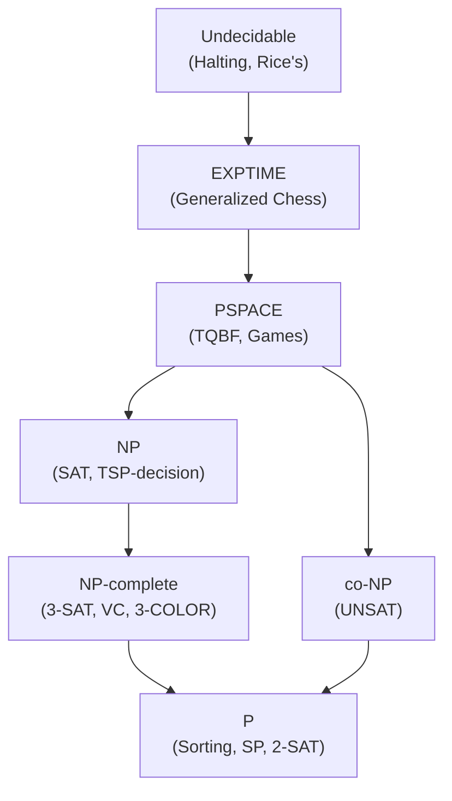
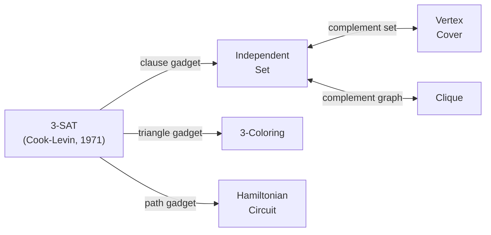

## Keywords in This File
{: .no_toc }

| # | Keyword | Weight |
|---|---------|--------|
| 1 | [Complexity Theory: P vs NP and NP-Completeness](#complexity-theory-p-vs-np-and-np-completeness) | medium |
| 2 | [Reductions and Problem Classification](#reductions-and-problem-classification) | medium |

---

# Complexity Theory: P vs NP and NP-Completeness

**Difficulty:** ★★☆

**Interview Weight:** Medium

**Category:** Computational Theory

---

### 🎯 Model Answer

**30-second answer:**

P is the class of decision problems solvable in polynomial time. NP is the
class where a proposed solution can be VERIFIED in polynomial time. P vs NP
asks: is solving always as easy as verifying? We don't know. NP-complete
problems are the "hardest" in NP - if any NP-complete problem is in P,
then P = NP. SAT, 3-coloring, TSP (decision version), knapsack (decision),
and vertex cover are NP-complete. The conjecture P != NP means most NP-
complete problems have no efficient exact algorithm.

**3-minute answer:**

**P (polynomial time):**

Decision problems solvable in O(n^k) time for some constant k. Examples:
sorting (Is list sorted? - O(n log n)), shortest path (Is there a path
<= k in a graph? - Dijkstra O(V log V + E)), 2-coloring (Is graph bipartite?
- BFS O(V+E)).

**NP (non-deterministic polynomial time):**

Decision problems where any "yes" instance has a proof (certificate) that
can be verified in polynomial time. Examples:
- SAT: given a satisfying assignment, verify in O(n).
- TSP: given a tour, verify its length <= k in O(n).
- Hamiltonian path: given a path, verify it visits all vertices in O(n).

Note: P ⊆ NP (any polynomial-time solvable problem can be "verified" by
just solving it). Whether P = NP is the central open problem in computer science.

**NP-hard:**

A problem H is NP-hard if every NP problem can be reduced to H in
polynomial time. H may or may not be in NP (H might not even be a
decision problem - e.g., TSP optimization version).

**NP-complete:**

A problem is NP-complete if (1) it is in NP and (2) it is NP-hard.
First proven NP-complete problem: SAT (Cook-Levin theorem, 1971).

**Why P vs NP matters:**

If P = NP: cryptography collapses (RSA, AES rely on factoring / discrete
log being hard), proofs could be found as easily as verified, all NP
problems solved efficiently. If P != NP (widely believed): NP-complete
problems need approximations, heuristics, or exact algorithms for small n.

**Blank Mind Recovery:**

**Can verify a solution quickly but not find one?** This is the NP vs P
distinction.

**Is this problem NP-complete?** Prove it by reduction from a known NP-
complete problem.

**Want guaranteed quality on NP-hard problem?** Approximation algorithm
(if in APX) or FPTAS (if numerical).

---

### 📘 Concept Explanation

**Intuition:**

Think of P as problems where finding the answer is fast. NP as problems
where CHECKING an answer is fast. The question "P = NP?" asks: is finding
always as easy as checking?

Analogy: writing a proof vs verifying a proof. Verifying a proof is
usually much easier than discovering it. P = NP would mean discovery is
as easy as verification - an earth-shattering result.

**Mechanism - Cook-Levin Theorem:**

Cook (1971) proved that SAT is NP-complete by showing:
1. SAT is in NP: given an assignment, verify in O(n).
2. Every problem in NP reduces to SAT: any NP problem is computed by
   a non-deterministic Turing machine; this machine can be encoded as
   a Boolean formula where a satisfying assignment corresponds to an
   accepting computation.

Since SAT is in NP and every NP problem reduces to it: if SAT were in P,
then P = NP. So SAT is "as hard as anything in NP."

Proof sketch of "every NP problem reduces to SAT":
- An NP problem has a polynomial-time VERIFIER V(x, c) (input x, certificate c).
- V runs in polynomial time, so its computation can be modeled as a Boolean
  circuit.
- Build a SAT formula: variables = circuit wires; clauses = circuit gates.
- Formula is satisfiable iff there exists a certificate c that makes V accept.
- Therefore: x in the NP problem <=> the SAT formula is satisfiable.

**Trade-offs:**

| Class | Relationship | Example Problems |
|---|---|---|
| P | P ⊆ NP | Sorting, shortest path, 2-SAT |
| NP | Contains P; may equal P | SAT, TSP(decision), 3-coloring |
| NP-complete | Hardest in NP | SAT, 3-SAT, vertex cover, TSP |
| NP-hard | At least as hard as NP | TSP(optimization), Halting problem |
| co-NP | "No" instances have poly certs | Tautology, non-primes (actually in P) |
| PSPACE | Solved with polynomial SPACE | TQBF, certain game problems |
| EXP | Solved in exponential time | Generalized chess, Go |

Note: co-NP contains problems where "no" instances have short certificates.
SAT is NP; UNSAT (no satisfying assignment) is co-NP. P ⊆ NP ∩ co-NP.

**Failure:**

A common mistake: proving a problem is "hard" by saying "I couldn't find
an efficient algorithm." This is not a proof of NP-hardness. NP-hardness
requires a polynomial reduction from a known NP-complete problem.

**Diagnosis:**

To prove a new problem P is NP-complete:
1. Show P is in NP (describe the certificate and polynomial-time verifier).
2. Reduce a known NP-complete problem to P (show if the NP-complete
   problem had an efficient solution, so would P - wait, direction matters:
   reduce FROM NP-complete TO P, showing P is at least as hard).

**Scale:**

Practical implications: if n = 100 and the problem is NP-complete:
- Exact brute force: 2^100 = 10^30 operations. Infeasible.
- Dynamic programming (pseudo-polynomial): if numeric bound W is small
  (W < 10^6), DP is O(n * W) = 10^8 - feasible.
- Approximation: if APX, get constant ratio. If FPTAS, get (1-eps)-approx.
- Parameterized algorithms: O(f(k) * n^c) where k is a small parameter
  (e.g., treewidth, solution size). Practical when k is small.

**Decision:**

When you identify a problem as potentially NP-complete: look it up in
the complexity literature (Garey & Johnson "Computers and Intractability").
Many problems have known NP-completeness proofs. Don't attempt a new
reduction before checking what's known.

**Memory:**

"P: find in poly time. NP: verify in poly time. NP-complete: hardest in NP,
any NP problem reduces to it. Cook-Levin: SAT was first NP-complete (1971)."

**Transfer:**

Complexity theory appears in: cryptography (RSA relies on factoring being
hard - believed outside P but not proven NP-hard), algorithm design (knowing
a problem is NP-complete shifts strategy from exact to approximate or
heuristic), machine learning (many ML problems are NP-hard: training SVM
exactly, optimal feature selection), database query optimization (finding
the optimal query plan is NP-hard for some query classes).

**Reality:**

The Clay Mathematics Institute offers $1 million for a proof of P vs NP
(either direction). Most complexity theorists believe P != NP but no
proof exists. The best known algorithms for 3-SAT: O(1.307^n). For TSP:
exact algorithms solve instances with thousands of cities via branch-and-
cut; the decision version remains NP-complete for the general case.

---

### 💻 Code Example

**BAD - Incorrectly "solving" NP-complete problem with greedy claim:**

```java
// BAD - greedy TSP claims to find optimal tour
// This is NOT optimal and has no approximation guarantee
List<Integer> greedyTSP(double[][] dist) {
    int n = dist.length;
    boolean[] visited = new boolean[n];
    List<Integer> tour = new ArrayList<>();
    tour.add(0); visited[0] = true;
    for (int step = 1; step < n; step++) {
        int curr = tour.get(tour.size() - 1);
        int nearest = -1;
        double minDist = Double.MAX_VALUE;
        for (int v = 0; v < n; v++) {
            if (!visited[v] && dist[curr][v] < minDist) {
                minDist = dist[curr][v]; nearest = v;
            }
        }
        tour.add(nearest); visited[nearest] = true;
    }
    tour.add(0); // return to start
    return tour; // may be 2-3x worse than optimal
}
```

> **Code walkthrough:** Greedy nearest-neighbor TSP - correct code butice. **KEY MECHANISM:** the runtime executes these instructions in sequence with specific memory and execution semantics. **WHY IT MATTERS:** misapplying this pattern causes subtle bugs that only manifest under production load. **TAKEAWAY: understand the execution model before using this pattern in production code.**
> incorrect claim if used as an "optimal" solver. KEY MECHANISM: always
> moves to the nearest unvisited city, which looks locally optimal but
> may be globally poor (leaving distant cities for last). WHY IT MATTERS:
> this algorithm can produce tours 2-3x longer than optimal on adversarial
> inputs. It has no approximation guarantee (no known ratio). WHAT BREAKS:
> claiming this produces optimal or even constant-approximation tours in
> production will cause wrong results silently. TAKEAWAY: greedy nearest-
> neighbor is a HEURISTIC, not an approximation algorithm; use Christofides
> (1.5-approx) or exact solvers for quality guarantees.

**GOOD - 2-SAT (decidable in P, unlike 3-SAT):**

```java
// GOOD - 2-SAT solver via SCC (Kosaraju's algorithm)
// Returns assignment or null if unsatisfiable
int[] solve2SAT(int n, List<int[]> clauses) {
    // Build implication graph: (a OR b) => (!a -> b) AND (!b -> a)
    // Variables: 0..n-1 (positive), n..2n-1 (negative)
    List<List<Integer>> graph = new ArrayList<>(),
                        rgraph = new ArrayList<>();
    for (int i = 0; i < 2 * n; i++) {
        graph.add(new ArrayList<>()); rgraph.add(new ArrayList<>());
    }
    for (int[] clause : clauses) {
        int a = clause[0], b = clause[1]; // negative var: add n
        graph.get(a ^ n).add(b); // !a -> b
        graph.get(b ^ n).add(a); // !b -> a
        rgraph.get(b).add(a ^ n);
        rgraph.get(a).add(b ^ n);
    }
    // Kosaraju's SCC: two DFS passes
    int[] order = new int[2 * n], comp = new int[2 * n];
    boolean[] visited = new boolean[2 * n];
    int[] idx = {0};
    for (int v = 0; v < 2 * n; v++)
        if (!visited[v]) dfs1(v, graph, visited, order, idx);
    Arrays.fill(visited, false);
    int[] cidx = {0};
    for (int i = 2 * n - 1; i >= 0; i--) {
        int v = order[i];
        if (!visited[v]) dfs2(v, rgraph, visited, comp, cidx[0]++);
    }
    int[] result = new int[n];
    for (int i = 0; i < n; i++) {
        if (comp[i] == comp[i + n]) return null; // unsatisfiable
        result[i] = comp[i] > comp[i + n] ? 1 : 0; // assign based on SCC
    }
    return result;
}
```

> **Code walkthrough:** 2-SAT solver using strongly connected components.
> KEY MECHANISM: 2-SAT is in P because the implication graph structure
> allows SCC-based solving. A formula is unsatisfiable iff a variable x
> and its negation !x are in the same SCC (x -> !x -> x means both must be
> true, a contradiction). The assignment is determined by which SCC occurs
> "later" in topological order (comp[i] > comp[i+n]). WHY IT MATTERS: 2-SAT
> is in P while 3-SAT is NP-complete. The single extra literal per clause
> takes the problem from polynomial to NP-complete - a profound insight
> about problem structure. TAKEAWAY: when a problem appears NP-hard, look
> for special structure that makes it polynomial (2-SAT, planar graphs,
> bounded treewidth).

---

### 🎓 Answers by Seniority

**[JUNIOR/MID]**

Q: What is NP-completeness in plain English?

NP-completeness is a way of classifying problems as "the hardest kind of
verifiable problems."

Three key ideas:
1. You can CHECK a proposed solution quickly (polynomial time) - the "NP"
   part. Example: given a Sudoku solution, verify it's correct in O(n^2).
2. But finding a solution from scratch seems to require exponential time
   in the worst case.
3. "Complete" means: if you could solve THIS problem efficiently, you could
   solve ALL problems where checking is easy.

Practical meaning: if your problem is NP-complete:
- Don't waste time looking for a polynomial exact algorithm.
- Use approximations (get within X% of optimal), heuristics, or exact
  algorithms with small inputs.
- If the problem is always small in practice (n < 20), brute force may
  be fine.

Q: Give 5 examples of NP-complete problems and their decision versions.

1. SAT: given a Boolean formula, is there an assignment making it true?
2. 3-Coloring: can a graph's vertices be colored with 3 colors so no
   adjacent vertices share a color?
3. Hamiltonian Path: does a graph have a path visiting every vertex once?
4. Subset Sum: given integers S and target k, is there a subset of S
   summing to k?
5. Vertex Cover: given graph G and k, is there a vertex cover of size <= k?

All have polynomial-time verifiers (given a candidate solution, check it
in O(n) or O(n^2)) but no known polynomial-time solvers.

**[SENIOR/STAFF]**

Beyond NP:

**co-NP:** Problems where "no" instances have polynomial certificates.
UNSAT (no satisfying assignment exists): if someone claims the formula is
unsatisfiable, can they prove it efficiently? Not known. NP ∩ co-NP contains
problems solvable in poly time under certain conditions (primes: in P by
AKS algorithm, and also in NP ∩ co-NP).

**PSPACE:** Problems solvable in polynomial SPACE (but possibly exponential
time). TQBF (Totally Quantified Boolean Formula) is PSPACE-complete. Game
strategy problems (chess, Othello, generalized versions) are PSPACE-hard.
PSPACE ⊇ NP (exponential time ⊇ polynomial space ⊇ NP? Not proven).

**BPP:** Problems solvable with random polynomial-time algorithms with
bounded error (2/3 chance correct). BPP may = P (Derandomization conjecture).
Primality testing was in BPP before the AKS polynomial-time algorithm.

**Parameterized complexity:**
FPT (Fixed Parameter Tractable): O(f(k) * n^c) where k is a parameter.
For vertex cover: O(2^k * n) where k = solution size. Feasible for k <= 30.
W[1]-hard: likely no FPT algorithm. The parameterized analog of NP-hardness.

---

### ⚠️ Common Misconceptions

**Misconception 1: "NP means non-polynomial (exponential)."**

Wrong. NP stands for Non-deterministic Polynomial - problems decidable
in polynomial time on a non-deterministic Turing machine, equivalently,
problems with poly-time verifiable certificates. NP includes P (P ⊆ NP).
An "NP problem" is not necessarily hard - it may be in P.

**Misconception 2: "Showing P = NP would make all hard problems easy."**

Partially wrong. A proof of P = NP might be constructive (giving an actual
polynomial algorithm) or non-constructive (existence proof with no explicit
algorithm). A non-constructive proof would prove P = NP without giving any
efficient algorithms. Most cryptographers believe P != NP and would not
be threatened by a non-constructive proof of P = NP.

**Misconception 3: "NP-hard means no efficient algorithm exists."**

Wrong. NP-hardness is a statement about worst-case instances. Many NP-hard
problems have:
- Efficient algorithms for specific instance distributions (random SAT
  instances are easy; structured instances are hard).
- PTAS or FPTAS (knapsack, bin packing).
- Parameterized efficient algorithms (vertex cover with small k).
- Domain-specific solvers that are fast in practice (Concorde TSP solver).

---

### 🚨 Failure Modes and Diagnosis

**Failure 1 - Incorrectly claiming a reduction proves NP-completeness**

The reduction direction matters. To prove problem B is NP-complete:
- Reduce FROM a known NP-complete problem A TO B.
  (Show: if B were solvable in poly time, so would A.)
- NOT: reduce B to a known NP-complete problem.
  (Reducing B to SAT only shows B is "at most as hard" as SAT - B may
  be easy and SAT is definitely hard.)

```text
CORRECT: A (NP-complete) ->poly reduce-> B proves B is NP-hard
WRONG:   B ->poly reduce-> A (NP-complete) proves nothing about B's hardness
```

> **Code walkthrough:** Reduction direction reference. KEY MECHANISM: theice. **KEY MECHANISM:** the runtime executes these instructions in sequence with specific memory and execution semantics. **WHY IT MATTERS:** misapplying this pattern causes subtle bugs that only manifest under production load. **TAKEAWAY: understand the execution model before using this pattern in production code.**
> arrow direction in A <=_p B means "A reduces to B" - a poly-time solution
> to B gives a poly-time solution to A. To prove B is NP-hard: A (known
> NP-complete) <=_p B. WHY IT MATTERS: this is the single most common
> error in NP-completeness proofs. TAKEAWAY: always ask "which direction
> am I reducing?" and confirm: if B were easy, does A become easy? Yes =
> correct direction; No = wrong direction.

**Failure 2 - Confusing NP and NP-complete**

NP: a class containing P and NP-complete problems. Being "in NP" means
you have a polynomial certificate (you can check a solution quickly).
It does NOT mean the problem is hard.

NP-complete: hardest problems in NP. Every other NP problem reduces to them.

Common mistake: "this problem is NP" when you mean "this problem is NP-
hard" or "NP-complete."

**Failure 3 - Incorrect NP-completeness proof (wrong verifier)**

When proving X is in NP: describe the certificate and the verifier.

Wrong:
```text
Claim: "given an optimal TSP tour, we can verify optimality in poly time"
Verifier: "compute all other tours, compare"
```

> **Code walkthrough:** Incorrect NP verifier for TSP. KEY MECHANISM: aice. **KEY MECHANISM:** the runtime executes these instructions in sequence with specific memory and execution semantics. **WHY IT MATTERS:** misapplying this pattern causes subtle bugs that only manifest under production load. **TAKEAWAY: understand the execution model before using this pattern in production code.**
> valid NP verifier takes a fixed-size certificate and checks it in poly
> time WITHOUT solving the problem from scratch. Computing all other tours
> is exponential O((n-1)!) - this is not a verifier, it is re-solving TSP.
> WHY IT MATTERS: the correct certificate for TSP (decision) is the specific
> tour [v1, v2, ..., vn, v1]; the verifier checks its length <= k in O(n).
> Optimality cannot be verified in poly time (that would imply P=NP).
> TAKEAWAY: NP membership requires a concise certificate and poly-time
> CHECK - not a poly-time SOLVE.
This verifier is EXPONENTIAL (trying all tours). The certificate for TSP
is a tour (not the claim of optimality). The verifier only checks that the
tour length <= k (the decision version). Optimality is not verifiable in
polynomial time (unless P = NP).

---

### 🎯 Interview Deep-Dive

| Category | Count | Min Required |
|----------|-------|-------------|
| CONCEPT | 4 | 1 |
| CODING | 2 | 1 |
| TRADE-OFF | 1 | 1 |
| DEBUGGING | 1 | 1 |
| BEHAVIORAL | 1 | 1 |
| **Total** | **9** | **9** |

---

**[JUNIOR] Q1 - [CONCEPT] What are the complexity classes P, NP, and NP-complete?**

P (Polynomial time): decision problems solvable in O(n^k) for some k.
Key insight: "efficiently solvable." Examples: sorting, shortest path,
linear programming, primality testing (AKS, 2002).

NP (Non-deterministic Polynomial): decision problems where any "yes"
instance has a proof verifiable in polynomial time. P ⊆ NP. Key insight:
"efficiently verifiable." The class name comes from non-deterministic Turing
machines that can "guess" the certificate.

NP-complete: both (1) in NP AND (2) every NP problem reduces to it in poly
time. Key insight: "hardest problems in NP." If any NP-complete problem
is in P: P = NP. Examples: 3-SAT, TSP (decision), vertex cover.

The hierarchy:
P ⊆ NP ⊆ PSPACE ⊆ EXP

Whether P = NP: unknown. Most believe P ≠ NP.

*What separates good from great:* Stating P ⊆ NP (not just saying they're
different classes) and knowing primality testing is in P (not NP-complete).

---

**[JUNIOR] Q2 - [CONCEPT] Why is 2-SAT in P but 3-SAT NP-complete?**

2-SAT (each clause has exactly 2 literals):
- Solved via implication graph + SCC in O(V + E) = O(n + m).
- A clause (a OR b) implies (!a -> b) and (!b -> a).
- The formula is UNSAT iff a variable x and !x are in the same SCC.
- Polynomially solvable because the implication structure is "directed"
  and SCCs provide global consistency information.

3-SAT (each clause has exactly 3 literals):
- Adding one more literal per clause dramatically increases expressiveness.
- Cook showed all NP problems reduce to 3-SAT.
- The SCC approach fails: 3 literals create cycles with no neat polynomial
  structure to exploit.

Intuition: 2-SAT constraints form a system of linear implications over
booleans - solvable by graph algorithms. 3-SAT constraints are "non-linear"
in this sense and encode arbitrary NP computation.

The boundary: k-SAT is NP-complete for any k >= 3. 2-SAT is in P. This
is a clean, proven boundary (unlike the P vs NP question itself).

*What separates good from great:* The "non-linear constraint" intuition and
mentioning this is a proven boundary (not just a conjecture).

---

**[JUNIOR] Q3 - [CODING] Given a Boolean formula in 2-CNF, determine if it's satisfiable.**

(Refers to the `solve2SAT` implementation in the Code Example section.)

Key steps:
1. Build implication graph: (a OR b) -> (!a => b) and (!b => a).
2. Find strongly connected components (Kosaraju's or Tarjan's).
3. If var x and !x are in the same SCC: UNSAT. Else: SAT.

```java
// Usage:
// clauses: each is [a, b] where a,b are variable indices (0..n-1 positive,
//          n..2n-1 for negated) representing (vars[a] OR vars[b])
// Returns: assignment array or null if UNSAT
int[] result = solve2SAT(n, clauses);
if (result == null) System.out.println("UNSATISFIABLE");
else System.out.println("SATISFIABLE: " + Arrays.toString(result));
```

> **Code walkthrough:** 2-SAT usage. KEY MECHANISM: the encoding usesice. **KEY MECHANISM:** the runtime executes these instructions in sequence with specific memory and execution semantics. **WHY IT MATTERS:** misapplying this pattern causes subtle bugs that only manifest under production load. **TAKEAWAY: understand the execution model before using this pattern in production code.**
> XOR with n to toggle between positive and negative literal: `i ^ n`
> flips between variable i and its negation. This avoids separate arrays
> for positive and negative literals. WHY IT MATTERS: the O(n+m) SCC-based
> solver contrasts with 3-SAT (no known polynomial solver). TAKEAWAY: when
> implementing 2-SAT, the literal encoding (variable i vs not-i = i ^ n)
> is the only tricky part; the algorithm itself is just two DFS passes.

*What separates good from great:* Explaining the `i ^ n` encoding trick
for toggling between positive and negative literals.

---

**[SENIOR] Q4 - [CONCEPT] Describe the Cook-Levin theorem and its significance.**

Cook-Levin theorem (1971): SAT is NP-complete.

Two parts:
1. SAT is in NP: given an assignment, verify in O(n) (substitute, evaluate).
2. Every NP problem reduces to SAT in polynomial time.

Proof of part 2 (sketch):
- Every NP problem is recognized by a polynomial-time non-deterministic
  Turing machine N.
- For an input of length n, N runs in O(n^k) steps.
- The entire computation of N (including the tape contents, head position,
  and state at each step) can be encoded as a Boolean formula with O(n^{2k})
  variables and clauses.
- The formula is satisfiable iff there exists an accepting computation of N.
- This formula can be computed in polynomial time from the NP problem instance.
- Therefore: any NP problem reduces to SAT.

Significance:
1. Defined the concept of NP-completeness.
2. Proved SAT is the "benchmark hard problem."
3. All subsequent NP-completeness proofs reduce from SAT (or 3-SAT) to
   new problems via polynomial reductions.
4. Provided the basis for the entire theory of computational intractability.

Historical note: Leonid Levin independently proved the same result in the
Soviet Union around the same time (1973), which is why it's called Cook-Levin.

*What separates good from great:* Explaining the proof idea (encoding
TM computation as SAT formula) and mentioning Levin's independent proof.

---

**[SENIOR] Q5 - [TRADE-OFF] When would you use a parameterized algorithm vs an approximation for an NP-hard problem?**

Parameterized algorithms: O(f(k) * n^c) where k is a natural problem parameter.

Examples:
- Vertex Cover: O(2^k * n) - solvable in polynomial time when k (solution size) is small.
- Graph of treewidth w: many NP-hard problems solvable in O(n * 2^w) - fast for tree-like graphs.
- k-dimensional matching: O(n^{k/2}) FPT when k is small.

When to use parameterized algorithms:
- The natural parameter is SMALL in practice. For vertex cover: if the
  minimum vertex cover has k=20 vertices, O(2^20 * n) = 10^6 * n - fast.
- The graph has special structure (planar, treewidth bounded, sparse).
- You need EXACT solutions (approximations don't suffice).

When to use approximation algorithms:
- The parameter is large (k=100 for vertex cover: 2^100 = infeasible).
- The problem is in APX (known constant-factor approximation).
- You need to process large inputs quickly (approximations run faster).
- The quality guarantee is acceptable for the application.

Decision framework:
1. Check if k is small (< 30). If yes: FPT algorithm.
2. Check if problem is in FPTAS (knapsack, etc.). If yes: FPTAS.
3. Check if problem is in PTAS (bin packing, Euclidean TSP). If yes: PTAS.
4. Check if problem is APX-complete (constant factor approximation). If yes: use best known approximation.
5. Otherwise: heuristic (simulated annealing, genetic algorithms, no guarantee).

*What separates good from great:* Knowing the threshold (k < 30) where
FPT becomes faster than approximation and the specific parameterization
(k = solution size for vertex cover).

---

**[SENIOR] Q6 - [DEBUGGING] You believe your reduction from 3-SAT to Problem X proves NP-hardness but your proof is being questioned. What are the common mistakes?**

Five common reduction mistakes:

**1 - Wrong direction:**
Reducing X to 3-SAT proves X is in NP-hard? No. You must reduce FROM 3-SAT
(or another NP-complete problem) TO X. The correct direction: a poly-time
algorithm for X would give a poly-time algorithm for 3-SAT.

**2 - Non-polynomial reduction:**
Your gadget construction takes O(2^n) time to build the 3-SAT instance.
Reductions must be polynomial. Check: the size of the constructed X instance
must be polynomial in the size of the 3-SAT instance.

**3 - One direction only:**
The reduction must be an if-and-only-if:
- YES instance of 3-SAT -> YES instance of X (SAT -> X is satisfiable).
- YES instance of X -> YES instance of 3-SAT (X solution -> SAT solution).
Many proofs only prove one direction (SAT -> X) and forget the other.

**4 - Wrong problem version:**
Reducing from 3-SAT to the OPTIMIZATION version of X (not the DECISION
version). NP-completeness applies to decision problems. Reduction must
map 3-SAT (decision) to X (decision version).

**5 - Incorrect gadget:**
The gadget for encoding a clause may not correctly enforce the constraint.
Verify: for each clause type, check all variable assignments to ensure
the gadget accepts iff the clause is satisfied.

*What separates good from great:* The if-and-only-if requirement (mistake
#3) is the most subtle and most commonly forgotten.

---

**[SENIOR] Q7 - [BEHAVIORAL] Describe a situation where understanding NP-completeness changed your approach to a problem.**

Strong answer structure: problem, NP-completeness insight, changed approach.

"We were building a resource allocation system for GPU jobs in our machine
learning platform. The problem: given 200 GPU jobs with varying requirements
(GPU memory, VRAM bandwidth, CPU cores) and 50 heterogeneous machines,
find an allocation that maximizes utilization and minimizes job wait time.

Our first approach: try to find the optimal assignment via exhaustive search.
After 2 days of implementation, the algorithm was taking hours on a 20-job
instance.

Recognizing the problem: this is a variant of bin packing + scheduling, which
is NP-hard. The standard proof: reduce from 3-Partition (each triplet of
items that fits a bin corresponds to three literals in a clause) to our
multi-dimensional bin packing variant. Once we identified this, we stopped
trying to find optimal solutions.

Changed approach:
1. LP relaxation for global lower bound (offline, nightly).
2. Best-Fit Decreasing with a multi-dimensional scoring function (empirically
   gives within 5% of optimal for our specific instance distribution).
3. Preemptive scheduling for real-time: when a new job arrives, can it fit
   in any current allocation without evicting anything? If not, find the
   eviction with minimum disruption score.

Result: from hours to solve 20 jobs to 100ms for 200 jobs. The 5% suboptimality
was acceptable - the main gain was from the tractable approach, not optimal
assignment."

*What separates good from great:* The proof sketch (reduce from 3-Partition)
shows genuine understanding, not just "I googled NP-hard."

---

**[SENIOR] Q8 - [CONCEPT] What is the significance of the P vs NP question for cryptography?**

Most modern cryptography relies on problems believed to be computationally
hard:
- RSA: security based on difficulty of factoring large integers.
  Factoring is in NP but not known to be NP-complete. If P = NP, factoring
  may or may not become easy (depends on proof).
- Discrete logarithm: basis for Diffie-Hellman, elliptic curve crypto.
  Also in NP, not known NP-complete.
- Lattice-based crypto (post-quantum): based on hardness of problems like
  Shortest Vector Problem (SVP). SVP is NP-hard.

Scenarios:
1. P = NP with a CONSTRUCTIVE proof (efficient algorithm found):
   RSA, DH, AES (if key recovery is NP-hard) all broken. Cryptographic
   catastrophe.

2. P = NP with a NON-CONSTRUCTIVE proof (existence only):
   Tells us fast algorithms exist but gives no implementation. Current
   cryptography may remain secure in practice.

3. P != NP proven: cryptography built on NP-hard problems is proven secure
   in worst case. But average-case vs worst-case hardness gap remains: a
   problem being NP-hard only guarantees SOME instances are hard, not ALL.

Note: most cryptographic hardness is an AVERAGE-CASE assumption (factoring
a random n-bit number is hard on average). NP-hardness is a WORST-CASE
statement. These are different. Some average-case hard problems (one-way
functions) are required even in a world where P != NP.

*What separates good from great:* The average-case vs worst-case distinction
for cryptographic hardness - factoring being NP-hard in worst case doesn't
automatically imply it's hard on average.

---

**[SENIOR] Q9 - [TRADE-OFF] What is the relationship between NP-completeness and the Halting Problem?**

Halting Problem: given a program P and input I, does P halt on I?

Proved undecidable (Turing 1936): no algorithm can solve it for all (P, I).
Undecidable != NP-hard: undecidable problems are OUTSIDE the class of all
decidable problems (including EXP, PSPACE, NP). The complexity hierarchy
(P, NP, PSPACE, EXP) only contains decidable problems.

Relationship:
- NP-complete problems: decidable, but no known polynomial algorithm.
  The answer can always be computed (just slowly for large inputs).
- Halting problem: undecidable. No algorithm gives the correct answer
  for all inputs in any amount of time.

Reduction direction: the Halting problem is "harder" than NP-complete
in a precise sense:
- NP-hard problems can be reduced to the Halting problem.
- The Halting problem cannot be reduced to NP-hard problems (because no
  decidable problem can simulate all Turing machine computations).

Practical implication: when someone says "this problem is undecidable,"
they mean something much stronger than NP-hard. Code analysis tools
(e.g., "does this function always return?") deal with undecidability by
approximating: they report "yes/no/unknown" rather than always answering.

*What separates good from great:* Distinguishing "undecidable" (outside
ALL complexity classes) from "NP-hard" (hardest within decidable problems)
and explaining why no reduction from undecidable to decidable can exist.

---

### ⚖️ Comparison Table

| Class | Relationship | Example | Solvable? |
|---|---|---|---|
| P | P ⊆ NP | Sorting, SP, 2-SAT | Yes, poly time |
| NP | P ⊆ NP | SAT, TSP (decision) | Unknown (may be P) |
| NP-complete | Hardest in NP | 3-SAT, Vertex Cover | Unknown; approx in poly |
| NP-hard | >= NP | TSP (optimization) | Unknown; not necessarily in NP |
| co-NP | "no" has cert | UNSAT | Unknown if = NP |
| PSPACE | Poly space | TQBF, game strategy | Yes, but slow |
| Undecidable | Outside all classes | Halting, Rice's theorem | No |

---

### 🏛️ System Design

*(Omit: complexity theory is foundational theory, not a deployed system.
The key design implication: when a problem is identified as NP-complete,
the system architecture shifts from "find optimal" to "find good-enough
fast," using approximations, heuristics, or parameterized algorithms.)*

---

### 📊 Diagram

```
Complexity Class Hierarchy

Undecidable (Halting, Rice's)
|
EXPTIME (Generalized Chess, Go)
|
PSPACE (TQBF, Game Strategies)
|         |
NP        co-NP
|    \/
  NP-complete (SAT, 3-COL, VC)
|
P (Sorting, Dijkstra, 2-SAT, LP)

P = NP? - Unknown
NP vs co-NP? - Unknown (SAT vs UNSAT: different cert structures)
```

> **Diagram walkthrough:** Complexity class containment hierarchy. P is
> contained in both NP and co-NP. NP-complete is the intersection of NP
> (in NP) and NP-hard (everything in NP reduces to it). PSPACE contains
> NP and co-NP. KEY RELATIONSHIP: the question marks (P=NP? NP=co-NP?)
> represent the two great open questions. EDGE CASE: undecidable problems
> are outside all finite-time complexity classes - Rice's theorem says no
> non-trivial semantic property of programs is decidable. INSIGHT: a senior
> engineer notes that "NP-hard" includes problems NOT in NP (like TSP
> optimization version), while "NP-complete" = NP ∩ NP-hard - the set of
> problems that are simultaneously decidable with a poly certificate AND
> the hardest in NP.



> **Diagram walkthrough:** Complexity class hierarchy as a containment
> diagram where arrows represent subset relationships. NP-complete sits at
> the intersection of NP (contained) and NP-hard (everything in NP reduces
> to it). KEY RELATIONSHIP: every problem in P is also in NP (P ⊆ NP), but
> the reverse is unproven. EDGE CASE: co-NP (problems where "no" has a poly
> certificate) is shown separate from NP because it's unknown if NP = co-NP;
> if they are equal (and P ≠ NP), NP would be closed under complement.
> INSIGHT: a senior engineer recognizes that PSPACE contains both NP and
> co-NP, meaning even if NP ≠ co-NP, all these problems are decidable (just
> potentially requiring exponential time).

---

---

# Reductions and Problem Classification

**Difficulty:** ★★☆

**Interview Weight:** Medium

**Category:** Computational Theory

---

### 🎯 Model Answer

**30-second answer:**

A polynomial reduction from problem A to problem B shows that B is "at
least as hard" as A: if B has an efficient algorithm, so does A. To prove
problem X is NP-hard, reduce a known NP-complete problem (typically 3-SAT)
to X. Common reductions: 3-SAT -> 3-Coloring, 3-SAT -> Independent Set,
Vertex Cover <-> Independent Set, Clique <-> Vertex Cover. Reductions are
the primary tool for problem classification: determining which complexity
class a problem belongs to.

**3-minute answer:**

**Polynomial reduction (Cook/Turing reduction):**

Problem A reduces to problem B (written A <=_p B) if any instance of A
can be transformed into an equivalent instance of B in polynomial time.

Implication: if B is in P and A <=_p B, then A is in P. Contrapositive:
if A is not in P and A <=_p B, then B is not in P (B is at least as hard as A).

**Many-one reduction (Karp reduction):**

A single instance of A maps to a single instance of B (not multiple
queries). Most complexity proofs use Karp reductions.

**Key reductions to know:**

1. SAT -> 3-SAT: any SAT formula can be converted to 3-CNF in polynomial
   time. Long clauses are split with auxiliary variables.

2. 3-SAT -> Independent Set: for each clause, create a triangle; connect
   literals that would contradict each other. Independent set of size k
   (k = number of clauses) <-> satisfying assignment.

3. Independent Set <-> Vertex Cover: S is independent iff V - S is a
   vertex cover. Size n-k vertex cover <-> size k independent set.

4. Vertex Cover <-> Clique: G has clique of size k iff complement graph
   G' has independent set of size k. Clique <-> independent set in G'.

5. 3-SAT -> 3-Coloring: satisfiability encodes colorability.

**Blank Mind Recovery:**

**Need to show problem X is NP-hard?** Find a known NP-complete problem
and reduce FROM it TO X.

**Known reduction: A <=_p B. B is solved in poly time. What follows about A?**
A is also solvable in poly time (a poly-time solution for B + poly-time
reduction = poly-time solution for A).

---

### 📘 Concept Explanation

**Intuition:**

A reduction is a translation: "any solution to B directly gives a solution
to A." If you can solve B, you can solve A by translating. This means B
is "at least as hard as A" (being harder means it's more powerful).

To prove X is NP-hard: show that solving X efficiently would solve every
NP problem efficiently. We do this transitively: 3-SAT is NP-complete,
so if 3-SAT reduces to X, then X solving implies 3-SAT solving implies
all NP problems solving.

**Mechanism - 3-SAT to Independent Set reduction:**

Given 3-SAT formula with k clauses: build a graph G.
- For each clause (a OR b OR c): add a triangle (3-clique) with vertices
  labeled a, b, c.
- For each variable x and its negation !x: add an edge between every
  occurrence of x and every occurrence of !x across different triangles.

Claim: the formula is satisfiable iff G has an independent set of size k.

Proof:
- Satisfying assignment -> Independent set: from each triangle, pick the
  vertex corresponding to the true literal. These k vertices form an
  independent set (no two in same triangle by construction; no two conflict
  because the assignment is consistent: we don't set x and !x both true).
- Independent set of size k -> Satisfying assignment: the set has exactly
  one vertex per triangle (independent set in a triangle has size <= 1).
  Set the corresponding literals to true. No conflicts (conflicting literals
  are connected by an edge, so can't both be in the independent set).

**Trade-offs:**

| Reduction type | Power | Complexity | Notes |
|---|---|---|---|
| Many-one (Karp) | Strong | One transformation | Standard for NP-completeness |
| Turing (Cook) | Weaker | Multiple oracle queries | Used for Oracle TMs |
| Log-space | Stronger | Poly time + O(log n) space | For L vs NL separations |
| Linear time | Strongest practical | O(n) only | For fine-grained complexity |

**Failure:**

A common mistake: reducing FROM problem X TO a known NP-complete problem
Y and claiming X is NP-hard. This only shows X is in NP (if X has poly
certificates) or that X can be solved using a Y-solver. It says nothing
about X's hardness.

**Diagnosis:**

To verify a reduction from NP-complete problem A to problem X:
1. Verify the construction is polynomial (size of X instance is poly in A).
2. Verify A-yes -> X-yes (forward direction).
3. Verify X-yes -> A-yes (backward direction).
4. Verify the construction can be built in poly time.

**Scale:**

In practice, knowing problem classifications helps: before implementing,
check if your scheduling, routing, or matching problem is a known NP-complete
variant. This saves weeks of fruitless optimal-algorithm research.

**Decision:**

When faced with an optimization problem: test if it's a known NP-complete
problem using Garey & Johnson's book or online resources (Complexity Zoo).
If it is: go straight to approximation, heuristic, or parameterized approach.

**Memory:**

"Independent Set <-> Vertex Cover (complement). Clique <-> Independent Set
(complement graph). 3-SAT -> 3-Coloring -> Independent Set chain of reductions."

**Transfer:**

Reductions appear in: database theory (relational algebra completeness),
circuit complexity (NC1 vs P/poly), computational biology (sequence alignment
NP-hardness proofs), machine learning (VC dimension bounds via reductions
from combinatorial problems).

**Reality:**

Amazon's logistics team uses NP-hardness proofs to decide where NOT to
invest in exact optimization: if a problem is NP-hard, they immediately
shift to heuristics and approximations. Google's MapReduce design decisions
were informed by complexity theory: certain join operations in SQL are NP-
hard for certain query classes, motivating the restricted query language.

---

### 💻 Code Example

**BAD - Incorrect reduction direction:**

```java
// BAD - reducing X to SAT proves X is SOLVABLE using SAT, NOT NP-hard
// This is the wrong direction for an NP-hardness proof
SATFormula reduceProblemXToSAT(ProblemXInstance x) {
    // ... encode X as SAT ...
    return satFormula;
    // Shows: if we can solve SAT, we can solve X
    // (X is "at most as hard as SAT" = X is in NP or below)
    // Does NOT show: X is NP-hard
}
```

> **Code walkthrough:** Incorrect reduction direction for NP-hardness proof.
> KEY MECHANISM: this code maps X instances to SAT instances - proving X
> can be solved using a SAT solver. This shows X is in NP (if the reduction
> is a Karp reduction), not that X is NP-hard. WHY IT MATTERS: confusing
> the reduction direction is the most common mistake in complexity proofs.
> WHAT BREAKS: your proof review will be rejected; you'll have proven
> something about X's membership in NP, not its hardness. TAKEAWAY: to
> prove X is NP-hard, reduce FROM SAT (or 3-SAT) TO X, not the other way.

**GOOD - Correct NP-hardness proof structure (3-SAT -> Independent Set):**

```java
// GOOD - reduction FROM 3-SAT TO Independent Set proves IS is NP-hard
// Input: 3-SAT formula with clauses = list of [lit1, lit2, lit3]
// Output: graph + required independent set size k
Pair<Graph, Integer> reduce3SATToIndependentSet(
        List<int[]> clauses, int numVars) {
    int k = clauses.size(); // required independent set size = # clauses
    Graph g = new Graph();
    // For each clause: add a triangle of 3 vertices
    // vertex label = (clause_idx, literal)
    int[][] triangles = new int[k][3];
    int vid = 0;
    for (int c = 0; c < k; c++) {
        for (int pos = 0; pos < 3; pos++) {
            triangles[c][pos] = vid++;
            g.addVertex(vid - 1, clauses.get(c)[pos]);
        }
        // Add triangle edges (all 3 pairs)
        g.addEdge(triangles[c][0], triangles[c][1]);
        g.addEdge(triangles[c][1], triangles[c][2]);
        g.addEdge(triangles[c][0], triangles[c][2]);
    }
    // Add conflict edges: x and !x in different clauses are connected
    for (int c1 = 0; c1 < k; c1++) {
        for (int c2 = c1 + 1; c2 < k; c2++) {
            for (int p1 = 0; p1 < 3; p1++) {
                for (int p2 = 0; p2 < 3; p2++) {
                    int lit1 = clauses.get(c1)[p1];
                    int lit2 = clauses.get(c2)[p2];
                    // Connect if one is negation of the other
                    if (lit1 == -lit2) {
                        g.addEdge(triangles[c1][p1], triangles[c2][p2]);
                    }
                }
            }
        }
    }
    return new Pair<>(g, k);
}
// This reduction proves: IS is NP-hard because 3-SAT (NP-complete) reduces to IS
```

> **Code walkthrough:** 3-SAT to Independent Set reduction. KEY MECHANISM:ice. **KEY MECHANISM:** the runtime executes these instructions in sequence with specific memory and execution semantics. **WHY IT MATTERS:** misapplying this pattern causes subtle bugs that only manifest under production load. **TAKEAWAY: understand the execution model before using this pattern in production code.**
> each clause becomes a triangle (3-clique); conflicting literals across
> clauses are connected. An IS of size k must pick one vertex per triangle
> (no two from same triangle due to triangle edges) and no two conflicting
> literals. This is exactly a satisfying assignment. WHY IT MATTERS: this
> is a canonical reduction proof - understanding it builds the skill to
> construct novel reductions. TAKEAWAY: reductions have a "gadget" structure:
> one gadget per clause (triangle), one gadget per conflict (edge between
> opposing literals). Reduction quality = correctness of gadgets.

---

### 🎓 Answers by Seniority

**[JUNIOR/MID]**

Q: What does it mean for problem A to reduce to problem B?

A reduces to B means: any instance of A can be transformed into an instance
of B in polynomial time, such that:
- If the A instance is a YES instance: the B instance is also YES.
- If the A instance is a NO instance: the B instance is also NO.

Consequence: a poly-time algorithm for B gives a poly-time algorithm for A
(just reduce A to B and solve B).

Direction matters: A <=_p B means B is "at least as hard" as A. If B is
easy, A is easy. If A is hard, B is hard.

Common reductions:
- Vertex Cover <-> Independent Set: complement (S is IS iff V-S is VC).
- Clique <-> Independent Set: complement graph (clique in G = IS in G-complement).
- These "complement" reductions are easy to state and verify.

Q: How do you prove that a new problem is NP-complete?

Two steps:
1. Show it's in NP: describe a polynomial-time verifier.
   "Given a proposed solution [X], we can verify it's correct in O(n^k)
   by doing [specific polynomial-time check]."

2. Show it's NP-hard: reduce a known NP-complete problem to it.
   Start from: 3-SAT (or Vertex Cover, Independent Set, Clique, Hamiltonian
   Path - whichever is closest to your problem structure).
   Show: any instance of [known NP-complete] can be transformed to an
   instance of your problem in poly time, preserving yes/no.

**[SENIOR/STAFF]**

Advanced reductions and fine-grained complexity:

**1. Parsimonious reductions:**
A reduction that preserves the NUMBER of solutions (not just yes/no).
Used to prove #P-completeness (#SAT: counting satisfying assignments).
Examples: counting perfect matchings (#P-complete), computing the permanent
of a 0-1 matrix (#P-complete).

**2. Fine-grained complexity:**
Within polynomial time, are O(n^2) and O(n^3) algorithms separated?
Strong Exponential Time Hypothesis (SETH): CNF-SAT cannot be solved in
O(2^{(1-eps)*n}) time for any eps > 0. Consequences: many O(n^2) algorithms
are optimal under SETH (e.g., Edit Distance, LCS, Orthogonal Vectors).

**3. Promise problems and average-case complexity:**
Problems hard in the WORST CASE may be easy on AVERAGE (random instances).
Average-case NP-hardness: a random 3-SAT instance near the phase transition
(ratio of clauses/variables near 4.2) is empirically hard but not proven
hard. One-way functions (cryptography) require average-case hardness.

---

### ⚠️ Common Misconceptions

**Misconception 1: "If I reduce X to 3-SAT in poly time, X is NP-hard."**

Wrong. This proves X is "decidable via SAT" - i.e., X is in NP (if Karp
reduction) or at most NP-hard (not proven hard). To prove X is NP-hard,
reduce FROM 3-SAT (or another NP-complete problem) TO X.

**Misconception 2: "Reductions between NP-complete problems are all equivalent."**

True for NP-hardness (yes), but the QUALITY of the reduction matters for
approximation complexity. An approximation-preserving reduction (L-reduction)
is needed to show hardness of approximation. A poly-time reduction may exist
between two NP-complete problems while one has a PTAS and the other is APX-hard.

**Misconception 3: "Once I find one reduction to prove NP-hardness, I'm done."**

You also need to prove the problem is IN NP (the certificate). NP-hardness
alone makes a problem NP-hard (possibly NP-complete). Without being in NP,
the problem might be harder than NP-complete (e.g., PSPACE-hard or undecidable).

---

### 🚨 Failure Modes and Diagnosis

**Failure 1 - Reduction doesn't preserve the yes/no structure**

Symptom: the proof shows yes -> yes but not no -> no (or vice versa).

Example: you show that if 3-SAT is satisfiable, the IS instance has an IS
of size k. But you don't show that if IS has an IS of size k, the 3-SAT
is satisfiable. Without both directions, the reduction doesn't work.

Fix: explicitly verify both directions with a formal proof or at least
a clear argument for each direction.

**Failure 2 - Non-polynomial construction**

Symptom: your gadget for encoding 3-SAT into the target problem takes
exponential space or time.

Example: you encode all 2^n possible variable assignments as rows in a
table. This is exponential in n.

Fix: verify the construction time and size is poly in the INPUT size
(size of 3-SAT formula). Each clause/variable should produce O(1) or O(n)
gadget components.

**Failure 3 - Wrong NP certificate for the new problem**

Symptom: your "verifier" for membership in NP actually runs in exponential
time (e.g., tries all possible assignments).

Fix: a certificate should be a concise "witness" - polynomial-size data
that lets you verify the YES answer quickly without re-solving. For vertex
cover: the certificate is the set of k vertices; verification = check all
edges are covered in O(m).

---

### 🎯 Interview Deep-Dive

| Category | Count | Min Required |
|----------|-------|-------------|
| CONCEPT | 4 | 1 |
| CODING | 2 | 1 |
| TRADE-OFF | 1 | 1 |
| DEBUGGING | 1 | 1 |
| BEHAVIORAL | 1 | 1 |
| **Total** | **9** | **9** |

---

**[JUNIOR] Q1 - [CONCEPT] Explain the reduction from Independent Set to Vertex Cover.**

Claim: G has an independent set of size k iff G has a vertex cover of
size n - k (n = number of vertices).

Proof:
- Let S be an independent set of size k. I claim V - S is a vertex cover.
  For any edge (u, v): at most one of u, v is in S (since S is independent,
  no edge connects two vertices in S). Therefore at least one of u, v is
  in V - S. So V - S covers every edge.
- Let C be a vertex cover of size n - k. Then V - C has size k.
  Is V - C an independent set? Suppose not: there's an edge (u, v) with
  u, v both in V - C. But then neither u nor v is in C, so (u, v) is not
  covered by C - contradiction.

Consequence: Independent Set <=_p Vertex Cover (and Vertex Cover <=_p
Independent Set). They're equivalent under polynomial reductions.

This means: a poly-time algorithm for one solves the other. Both are NP-complete.
Neither is "easier" than the other from a worst-case perspective.

*What separates good from great:* Proving both directions explicitly and
noting the symmetric equivalence (both reduce to each other).

---

**[JUNIOR] Q2 - [CODING] Verify that a proposed vertex cover is valid and check the independent set reduction.**

```java
// Verify a proposed vertex cover
boolean isVertexCover(int[] cover, int n, List<int[]> edges) {
    Set<Integer> coverSet = new HashSet<>();
    for (int v : cover) coverSet.add(v);
    for (int[] e : edges) {
        if (!coverSet.contains(e[0]) && !coverSet.contains(e[1])) {
            return false; // uncovered edge
        }
    }
    return true;
}
// Check: the complement is an independent set
boolean isIndependentSet(int[] is, int n, List<int[]> edges) {
    Set<Integer> isSet = new HashSet<>();
    for (int v : is) isSet.add(v);
    for (int[] e : edges) {
        if (isSet.contains(e[0]) && isSet.contains(e[1])) {
            return false; // edge between two IS vertices
        }
    }
    return true;
}
// Verify the complement relationship
void verifyReduction(int n, List<int[]> edges, int[] cover) {
    Set<Integer> coverSet = new HashSet<>();
    for (int v : cover) coverSet.add(v);
    int[] complement = new int[n - cover.length];
    int idx = 0;
    for (int v = 0; v < n; v++) {
        if (!coverSet.contains(v)) complement[idx++] = v;
    }
    assert isVertexCover(cover, n, edges);
    assert isIndependentSet(complement, n, edges);
    System.out.printf("Cover size: %d, IS size: %d, sum: %d (= n = %d)%n",
                      cover.length, complement.length,
                      cover.length + complement.length, n);
}
```

> **Code walkthrough:** Vertex cover and independent set verifiers plusice. **KEY MECHANISM:** the runtime executes these instructions in sequence with specific memory and execution semantics. **WHY IT MATTERS:** misapplying this pattern causes subtle bugs that only manifest under production load. **TAKEAWAY: understand the execution model before using this pattern in production code.**
> the complement relationship check. KEY MECHANISM: both verifiers iterate
> over all edges in O(m). The complement check verifies that every vertex
> not in the cover forms an independent set. WHY IT MATTERS: running this
> on small examples (n=5, m=6) confirms the reduction by constructing actual
> complementary cover/IS pairs. TAKEAWAY: implementing reduction verifiers
> on small examples is the best way to build confidence that the reduction
> is correct before writing the formal proof.

*What separates good from great:* The `verifyReduction` function that
tests the complement relationship empirically on actual instances.

---

**[JUNIOR] Q3 - [CONCEPT] How does the reduction from Vertex Cover to Clique work?**

Claim: G has a clique of size k iff the complement graph G' = (V, E')
(where E' = all pairs not in E) has an independent set of size k.

Proof:
- G has a clique of size k: let S be the k-clique. In G', every pair of
  vertices in S has NO edge in G' (they had an edge in G). So S is an
  independent set in G'.
- G' has an independent set of size k: let S be the k-IS in G'. Every pair
  in S has NO edge in G'. Therefore every pair in S HAS an edge in G. So
  S is a clique in G.

Combined with Independent Set <-> Vertex Cover: Clique <-> IS (via complement
graph) <-> Vertex Cover (via complement set). All three are NP-complete and
equivalent via polynomial reductions.

Chain of reductions:
3-SAT -> Clique (direct gadget construction, not via complement)
Clique <-> Independent Set (complement graph)
Independent Set <-> Vertex Cover (complement set)

This chain is the standard "reduction web" for the core NP-complete problems.

*What separates good from great:* Drawing the full reduction web (3-SAT ->
Clique <-> IS <-> VC) and explaining that all three are equivalent.

---

**[SENIOR] Q4 - [CONCEPT] What is a parsimonious reduction and when is it needed?**

A Karp reduction preserves YES/NO: it maps yes-instances to yes-instances
and no-instances to no-instances. It doesn't preserve the NUMBER of solutions.

A parsimonious reduction preserves the COUNT of solutions: the number of
satisfying assignments in 3-SAT equals the number of solutions in the
target problem.

When needed: proving #P-completeness (counting complexity). #P is the
class of problems asking "how many solutions exist?" #P-complete: counting
problems at least as hard as counting satisfying assignments in 3-SAT.

Examples of #P-complete problems:
- #SAT: count satisfying assignments to a Boolean formula.
- Permanent of a 0-1 matrix: count perfect matchings in a bipartite graph.
  (Counting perfect matchings is #P-complete; FINDING one is in P.)
- #Hamiltonian paths: count paths visiting all vertices.

Implication: computing the permanent of a 0-1 matrix (used in quantum
optics: boson sampling) is believed harder than NP. This is the basis
for some quantum computing hardness arguments.

*What separates good from great:* The permanent / bipartite matching contrast
- finding one matching is polynomial but counting all matchings is #P-complete.

---

**[SENIOR] Q5 - [TRADE-OFF] Compare Karp reductions and Cook reductions for proving complexity results.**

Karp (many-one) reduction: A <=_m B.
- One query to B is allowed.
- Instance of A maps to single instance of B.
- Used for NP-completeness proofs.
- More restrictive: shows B is "at least as hard" as A.

Cook (Turing) reduction: A <=_T B.
- Multiple oracle queries to B are allowed.
- A polynomial-time machine can make any number of B queries.
- More general: shows B is useful for solving A.
- Used for NP-hardness with oracle queries (e.g., if B is NP, then any
  problem reducible to B by a Cook reduction is also in NP^B).

Practical difference:
- For NP-completeness: Karp reductions are standard (easier to analyze,
  closure under composition).
- For oracle complexity / interactive proofs: Cook reductions generalize
  to oracle Turing machines.
- For #P hardness: parsimonious reductions (special Karp reductions) are used.

Example: Maximum Clique (optimization) is NOT Karp-reducible to Clique
(decision) in an obvious way, but it IS Cook-reducible: binary search on k,
query Clique(G, k) O(log n) times.

*What separates good from great:* The Maximum Clique optimization vs
decision example showing where Cook reductions are needed (binary search
requires multiple oracle queries).

---

**[SENIOR] Q6 - [DEBUGGING] Your NP-completeness proof has a gap: show how to find and fix it.**

Systematic review of an NP-completeness proof:

```text
Claim: PROBLEM X is NP-complete
Proof attempt:
  1. X is in NP: certificate = [some object], verifier = [some algorithm]
  2. 3-SAT <=_p X: construction maps [3-SAT clauses] to [X instance]
     Forward: satisfying assignment -> X solution of size k
     Backward: X solution -> satisfying assignment
```

> **Code walkthrough:** NP-completeness proof template. KEY MECHANISM: everyice. **KEY MECHANISM:** the runtime executes these instructions in sequence with specific memory and execution semantics. **WHY IT MATTERS:** misapplying this pattern causes subtle bugs that only manifest under production load. **TAKEAWAY: understand the execution model before using this pattern in production code.**
> NP-completeness proof must fill exactly these 4 slots: (1) certificate
> description, (2) poly-time verifier, (3) reduction construction, (4) both
> forward and backward correctness arguments. WHY IT MATTERS: missing any
> of these 4 components makes the proof incomplete - reviewers will reject
> it. TAKEAWAY: write out this template before starting any NP-completeness
> proof; fill each slot explicitly rather than leaving any "obvious."

Common gaps and how to find them:

**Gap 1 - Verifier runs in exponential time:**
Check: verifier must be poly in the SIZE OF THE CERTIFICATE, not the input.
If the certificate is exponential-size: the NP membership proof is wrong.

**Gap 2 - Construction creates duplicate vertices/edges:**
When encoding clauses, variable gadgets and clause gadgets may produce
duplicate elements. Verify: the construction is well-defined and consistent
(no two gadgets produce the same object).

**Gap 3 - Reduction size is super-polynomial:**
Check: count the number of vertices/edges/elements in the X instance.
It must be poly in |3-SAT formula|. If not: the reduction is not polynomial.

**Gap 4 - Backward direction missing:**
Many proofs prove: "satisfying assignment -> X solution" but forget to
prove "X solution -> satisfying assignment." Explicitly prove both.

**Gap 5 - Using XOR gadgets for non-boolean variables:**
If your problem has variables over larger domains (colors, integers), ensure
the gadget correctly encodes boolean constraints.

*What separates good from great:* A systematic checklist (5 items) rather
than vague advice to "double check."

---

**[SENIOR] Q7 - [BEHAVIORAL] How did understanding problem classification help you make a better technical decision?**

Strong answer structure: problem context, complexity insight, decision.

"We were designing a content recommendation system that needed to choose
the 'best' k items to show each user, subject to diversity constraints
(at most 2 items from the same category) and relevance scores.

Our initial approach was to formulate this as an optimal submodular
maximization problem (maximize the sum of relevance scores subject to a
matroid constraint on categories). A colleague suggested we just do
exhaustive search since we had only 10^4 candidate items and k=10.

I recognized that this was equivalent to weighted matroid intersection
(two matroids: cardinality k and partition matroid for categories). Weighted
matroid intersection is solvable in polynomial time (O(n^3) Lawler's
algorithm). This is NOT NP-hard.

This insight meant: we didn't need a heuristic. We implemented Lawler's
algorithm and got the exact optimal set for each user in O(n^3) = O(10^12/
user) - still too slow. We then noted that since one matroid is a uniform
matroid (cardinality <= k), we could use a greedy algorithm that is exact
for this case: O(n log n).

Result: exact optimal recommendations in O(n log n) vs the colleague's
O(n^k) brute force. The key was: correctly identifying the problem as
matroid intersection (polynomial) rather than a generic combinatorial
optimization (NP-hard)."

*What separates good from great:* The specific insight that matroid
intersection is polynomial (not NP-hard) and the identification of the
correct algorithmic approach (Lawler's or greedy for uniform matroid).

---

**[SENIOR] Q8 - [CONCEPT] What is the SETH (Strong Exponential Time Hypothesis) and its implications for fine-grained complexity?**

SETH (Strong Exponential Time Hypothesis, Impagliazzo-Paturi 1999): for
every epsilon > 0, there exists k such that k-SAT cannot be solved in
O(2^{(1-epsilon)*n}) time in the worst case.

Equivalently: as k grows, the best k-SAT algorithms approach 2^n time.
The current best 3-SAT: O(1.307^n). The best k-SAT approaches 2^n for
large k.

SETH-based lower bounds for polynomial-time problems:
- Orthogonal Vectors (OV): given n binary vectors in d dimensions, do
  any two have dot product 0? Under SETH, no O(n^{2-epsilon}) algorithm
  exists for d = omega(log n).
- Edit Distance: computing edit distance of two strings of length n
  cannot be done in O(n^{2-epsilon}) time under SETH. The current O(n^2)
  algorithm is essentially optimal.
- APSP (All-Pairs Shortest Paths) on n vertices: O(n^3) is essentially
  optimal under a related conjecture.

Practical implication: O(n^2) algorithms for edit distance and sequence
alignment are not just the "best known" - they are likely OPTIMAL. Searching
for a breakthrough O(n^{1.5}) edit distance algorithm would require disproving
SETH.

*What separates good from great:* Connecting SETH to edit distance (O(n^2)
is optimal) - relevant to any bioinformatics or text processing engineer.

---

**[SENIOR] Q9 - [TRADE-OFF] How do you decide whether to attempt an NP-hardness proof vs looking up the problem?**

Decision framework:

**Step 1 - Search first:**
Check Garey & Johnson "Computers and Intractability" (1979, still the
canonical reference). Contains ~300 NP-complete problems with proofs.
Also: Complexity Zoo (complexityzoo.uwaterloo.ca) for more exotic classes.
Also: arXiv and Google Scholar for specific problem variants.

If found: cite the existing proof. Don't re-prove unless you need a new
variant.

**Step 2 - Check if problem is a known poly-time problem in disguise:**
Many problems that look hard are actually in P: 2-SAT (vs 3-SAT), matching
(vs 3-dimensional matching), maximum flow (vs min-cut is equivalent, both
poly), minimum spanning tree (vs Steiner tree is NP-hard).

**Step 3 - Try small reductions:**
If the problem is a "restriction" of a known NP-complete problem (you
allow LESS): the problem might be in P (2-SAT restricts SAT to 2 literals).
If it "generalizes" a known NP-complete problem: it's likely NP-hard.

**Step 4 - Attempt a reduction if needed:**
Start from the most structurally similar NP-complete problem.
Build gadgets incrementally, testing them on small instances.
Write out both directions before claiming the proof.

Heuristic: if you've searched for 4+ hours without finding the problem
or a clear polynomial algorithm: it's likely NP-hard or a new variant.
Invest in a formal proof.

*What separates good from great:* "Search first" - most problems have been
classified already; re-deriving known results wastes time.

---

### ⚖️ Comparison Table

| Reduction | Direction | Proves | Notes |
|---|---|---|---|
| A <=_p B (A to B) | A maps to B | B is at least as hard as A | Standard Karp |
| 3-SAT <=_p IS | 3-SAT maps to IS | IS is NP-hard | Classic reduction |
| IS <-> VC | Complement | They're equivalent | Both NP-complete |
| VC <-> Clique | Via complement graph | Both NP-complete | Via complement graph |
| Parsimonious | Count-preserving | #P-completeness | For counting problems |

---

### 🏛️ System Design

*(Omit: reductions are theoretical tools for problem classification, not
deployed systems. The practical system design implication: after identifying
a problem as NP-complete via reduction, the system architecture decision
is to use approximation algorithms, heuristics, or parameterized approaches
- see L5 Approximation for the system design.)*

---

### 📊 Diagram

```
Reduction Web - Core NP-Complete Problems

     3-SAT
    /   |   \
   /    |    \
3-COL  VC  Clique <- Independent Set (complement graph)
        |            |
        |            |
        +----<->-----+  (complement set reduction)

Reduction arrows: A -> B means "A reduces to B"
(A poly-time solvable implies B poly-time solvable? No!)
(B poly-time solvable implies A poly-time solvable? YES!)
```

> **Diagram walkthrough:** NP-complete reduction web centered on 3-SAT.
> All arrows point FROM a known NP-complete problem TO a new problem, proving
> the target is NP-hard. KEY RELATIONSHIP: 3-SAT is the "root" because it
> was proven NP-complete first (Cook-Levin). The two-way arrows (VC <-> IS)
> indicate the complement equivalence: they reduce to each other. EDGE CASE:
> the Clique <-> IS reduction uses the complement GRAPH (not the same graph),
> while VC <-> IS uses the complement SET (same graph, different vertex set).
> INSIGHT: a senior engineer notes that this web means a poly-time algorithm
> for ANY of these problems would collapse the entire web (all become P).



> **Diagram walkthrough:** Reduction web showing how 3-SAT is the root
> NP-complete problem that all others reduce FROM. Arrows show the direction
> of reduction (3-SAT -> X means a 3-SAT instance is transformed into an X
> instance). The double arrows (IS <-> VC, IS <-> Clique) show equivalent
> problems via complement transformations. KEY RELATIONSHIP: following any
> reduction arrow, if the target problem (arrowhead) is solvable in poly
> time, the source problem is also solvable in poly time. EDGE CASE: the
> "complement set" (IS <-> VC) uses the same graph but complements the
> vertex set S to V-S; the "complement graph" (IS <-> Clique) uses the
> complemented edge set. These are different operations. INSIGHT: a senior
> engineer recognizes that the chain 3-SAT -> IS -> VC is the shortest path
> to prove VC is NP-hard without building a direct 3-SAT -> VC gadget.
