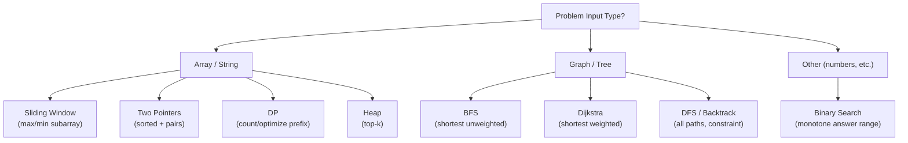
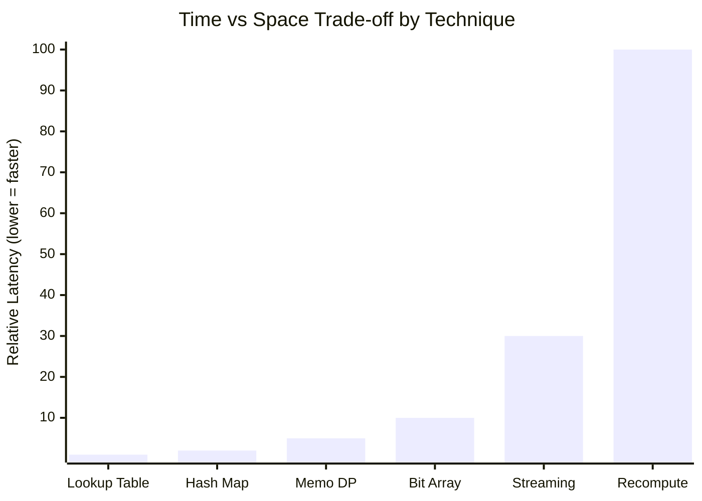

## Keywords in This File
{: .no_toc }

| # | Keyword | Weight |
|---|---------|--------|
| 1 | [Algorithm Pattern Recognition Framework](#algorithm-pattern-recognition-framework) | high |
| 2 | [Interview Problem-Solving Strategy](#interview-problem-solving-strategy) | high |
| 3 | [Time vs Space Trade-off Mental Model](#time-vs-space-trade-off-mental-model) | medium |

---

# Algorithm Pattern Recognition Framework

**Difficulty:** ★☆☆

**Interview Weight:** High

**Category:** Meta-Skills

---

### 🎯 Model Answer

**30-second answer:**

Algorithm patterns are recurring structural motifs: sliding window, two
pointers, divide and conquer, DP on sequences, BFS/DFS on graphs, greedy,
backtracking. When given a problem, classify it by: (1) data structure
(array, tree, graph, string), (2) constraint type (maximize, minimize,
count, find path), (3) problem size (n, constraints on n). Then match
to the canonical pattern. Example: "maximum subarray sum" -> DP on sequence
(Kadane's algorithm). "Shortest path" -> BFS (unweighted) or Dijkstra
(weighted). Pattern recognition is faster than derivation.

**3-minute answer:**

**Pattern matching by problem type:**

| Problem Signature | Canonical Pattern | Example |
|---|---|---|
| Subarray / substring optimization | Sliding window or Kadane | Max subarray, min window |
| Two sorted arrays | Two pointers | Merge, find sum = target |
| Tree traversal | DFS preorder/inorder/postorder | Serialize tree, validate BST |
| Shortest path (unweighted) | BFS | Word ladder, min steps |
| Shortest path (weighted) | Dijkstra (positive), Bellman-Ford (negative) | Road map |
| Spanning tree | Kruskal / Prim | Network connection cost |
| Combinations / permutations | Backtracking | N-queens, sudoku |
| Count ways / optimal value on sequence | DP | LCS, knapsack, coin change |
| Top k / kth largest | Heap (min/max) | Kth largest stream |
| Interval overlap / merge | Sort + sweep | Meeting rooms, calendar |

**Five-question diagnostic:**

1. Is the input linear (array/string/linked list)? -> Two pointers, sliding
   window, or DP on prefix.
2. Is the input a tree or graph? -> DFS/BFS; does it need shortest path?
   -> Dijkstra/BFS.
3. Is there an optimization (maximize/minimize)? -> DP or greedy.
4. Can a greedy choice be proven safe? -> Greedy. Otherwise -> DP.
5. Is the search space too large to enumerate? -> Prune with backtracking
   or memoize with DP.

**Blank Mind Recovery:**

**Stuck on a problem?** Ask: what TYPE of input? (array/graph/string).
Then: what am I asked to DO? (find/count/optimize). Cross the two = pattern.

**Still stuck?** Draw a small example. Try brute force. Find the inefficiency.
Fix the inefficiency with a data structure or DP.

---

### 📘 Concept Explanation

**Intuition:**

Algorithm patterns are like chess openings: experienced practitioners
recognize the position instantly and know the response without deriving
it from scratch. The goal is to build a library of 10-15 core patterns
and train rapid recognition.

**Mechanism - Pattern identification steps:**

1. Read the problem. Identify: input type, output type, constraint.
2. Look for keywords:
   - "subarray" + optimization -> sliding window or Kadane.
   - "permutation" or "all combinations" -> backtracking.
   - "minimum/maximum path" + "graph" -> BFS/Dijkstra.
   - "how many ways" -> DP (count DP).
   - "is possible" (yes/no on a sequence) -> DP (boolean DP) or BFS.
   - "k-th largest/smallest" -> heap.
   - "sorted" + two elements summing to target -> two pointers.
3. Match to pattern. Recall the template. Adapt to problem.

**Trade-offs:**

Two approaches to solving algorithmic problems:

Derivation: start from problem definition, work toward solution. Slow;
error-prone; works for novel problems.

Pattern recognition: match to template, adapt. Fast; reliable; misses
problems outside your pattern library.

Optimal: recognize the pattern first (fast path), fall back to derivation
if pattern doesn't fit.

**Failure:**

Forcing the wrong pattern: trying to solve a graph problem with DP, or
a DP problem with greedy. Symptom: solution becomes convoluted (many edge
cases, unclear state, special handling). Fix: step back and re-identify
the pattern.

**Diagnosis:**

"Why does my solution have so many edge cases?" - often means wrong pattern.
The correct pattern usually leads to a clean, natural solution.

**Scale:**

Patterns scale: sliding window is O(n) for array problems; DP on 2D grid
is O(n*m); Dijkstra is O((V+E) log V). Knowing the pattern immediately
tells you the complexity and whether it's fast enough.

**Decision:**

Build your pattern library by solving 5-10 problems per pattern. Tag each
solved problem with its pattern. Over time: pattern recognition is instant.

**Memory:**

"Array + optimize -> sliding window or DP. Graph + find path -> BFS/Dijkstra.
Choices from options -> backtracking or DP. Sorted + two elements -> two
pointers."

**Transfer:**

Pattern recognition transfers beyond algorithms to system design: "high
read/low write -> cache," "stream of events + aggregation -> time-series DB,"
"distributed + consistency -> choose from CAP theorem." Same meta-skill.

**Reality:**

Google, Facebook, and Amazon interviews at L4+ level: interviewers report
that strong candidates identify the pattern within 60-90 seconds. The time
spent on pattern recognition is recovered in faster, cleaner implementation.

---

### 💻 Code Example

**BAD - Brute force without pattern recognition:**

```java
// BAD - O(n^2) substring search without sliding window pattern
int longestSubstringBrute(String s) {
    int maxLen = 0;
    int n = s.length();
    for (int i = 0; i < n; i++) {
        Set<Character> seen = new HashSet<>();
        for (int j = i; j < n; j++) {
            if (seen.contains(s.charAt(j))) break;
            seen.add(s.charAt(j));
            maxLen = Math.max(maxLen, j - i + 1);
        }
    }
    return maxLen; // O(n^2) - no pattern recognition applied
}
```

> **Code walkthrough:** Brute-force longest substring without repeatingice. **KEY MECHANISM:** the runtime executes these instructions in sequence with specific memory and execution semantics. **WHY IT MATTERS:** misapplying this pattern causes subtle bugs that only manifest under production load. **TAKEAWAY: understand the execution model before using this pattern in production code.**
> characters. KEY MECHANISM: for each starting index i, extend j until a
> repeat character is found - O(n^2) total. WHY IT MATTERS: this fails for
> n=10^5 strings (10^10 ops). WHAT BREAKS: TLE in interview and production
> string processing. TAKEAWAY: the pattern keyword is "longest/maximum
> subarray/substring" + "condition" - this always maps to sliding window
> or DP, never O(n^2) brute force.

**GOOD - Sliding window pattern applied:**

```java
// GOOD - O(n) sliding window (pattern recognized immediately)
int lengthOfLongestSubstring(String s) {
    Map<Character, Integer> lastSeen = new HashMap<>();
    int maxLen = 0, left = 0;
    for (int right = 0; right < s.length(); right++) {
        char c = s.charAt(right);
        // If char was seen inside the window: shrink left past it
        if (lastSeen.containsKey(c) && lastSeen.get(c) >= left) {
            left = lastSeen.get(c) + 1;
        }
        lastSeen.put(c, right);
        maxLen = Math.max(maxLen, right - left + 1);
    }
    return maxLen;
}
// O(n) time, O(alphabet_size) space
// Pattern: "longest/max substring with condition" = sliding window
```

> **Code walkthrough:** Sliding window for longest substring without repeats.
> KEY MECHANISM: maintain a window [left, right] where all characters are
> unique. When a repeat is found, advance left past the previous occurrence.
> `lastSeen.get(c) >= left` ensures we only shrink if the repeat is INSIDE
> the current window (not outside). WHY IT MATTERS: O(n) vs O(n^2) is the
> difference between handling 10^6-char strings in 1ms vs 1 second. TAKEAWAY:
> the sliding window template is: right pointer advances always; left pointer
> advances to maintain the window invariant. All "max/min substring" problems
> follow this template.

---

### 🎓 Answers by Seniority

**[JUNIOR/MID]**

Q: What are the most important algorithm patterns to recognize in interviews?

Top 10 patterns with recognition triggers:

1. **Sliding window**: "max/min subarray/substring with condition." O(n).
2. **Two pointers**: "sorted array + find two elements." O(n).
3. **Binary search**: "sorted array + find specific value or insertion point."
   O(log n). Also applies to "search over answer space."
4. **Fast and slow pointers**: "cycle detection in linked list." O(n).
5. **BFS**: "shortest path in unweighted graph." O(V+E).
6. **DFS**: "all paths / tree traversal / connected components." O(V+E).
7. **DP on sequence**: "count ways / optimal value on prefix/subarray." O(n^2) or O(n).
8. **Backtracking**: "all combinations/permutations / constraint satisfaction."
9. **Heap/priority queue**: "k-th largest, merge k sorted lists." O(n log k).
10. **Greedy**: "local optimal = global optimal (provable)." O(n log n).

Q: How do you identify whether to use BFS or DFS?

BFS - use when:
- Finding the SHORTEST PATH (fewest edges/steps).
- Need to explore level by level.
- Problem says "minimum number of moves/steps/operations."

DFS - use when:
- Finding ALL solutions (backtracking).
- Detecting cycles or connected components.
- Tree traversal with post-order or preorder logic.
- "Does a path exist?" (not minimum, just existence).

Both work for: checking connectivity, counting components. BFS uses more
memory (frontier can be wide). DFS uses O(depth) memory (recursion stack).

**[SENIOR/STAFF]**

Advanced pattern recognition:

**Monotonic stack**: when you need "next greater/smaller element" for each
element. O(n). Pattern trigger: "for each element, find the nearest X
to its right/left."

**Segment tree / BIT (Fenwick tree)**: range query + range update. Pattern
trigger: "online queries on an array with both reads and writes." O(log n)
per operation.

**Union-Find**: "dynamic connectivity - are two elements connected?" O(alpha(n))
per operation. Pattern trigger: "merge groups, query if same group."

**Topological sort**: "ordering with dependencies." Pattern trigger: "DAG
with dependencies - build order, task scheduling." O(V+E).

**Dijkstra with states**: when the node isn't just a graph vertex but includes
additional state (e.g., keys collected, fuel remaining). Pattern trigger:
"shortest path where the cost depends on history." O(V * S * log(V * S))
where S is state space.

---

### ⚠️ Common Misconceptions

**Misconception 1: "Memorizing more algorithms is the key to interview success."**

Wrong. Interviewers care about problem-solving process, not algorithm recall.
The key is: (1) recognize the pattern quickly, (2) adapt the template cleanly,
(3) handle edge cases systematically, (4) analyze complexity correctly.
Knowing 50 algorithms by heart but unable to adapt them is worse than knowing
10 patterns and being able to generalize.

**Misconception 2: "DP is always better than backtracking."**

Wrong. DP requires: (1) optimal substructure, (2) overlapping subproblems.
If the search space doesn't have these, DP doesn't apply. Backtracking
with pruning can be more appropriate for problems where: the solution
set is small (early termination), the structure is highly constrained
(sudoku, crossword), or DP states would be exponential in the constraint.

**Misconception 3: "Greedy always gives a suboptimal solution."**

Wrong. For certain problem classes, greedy provably achieves optimal:
interval scheduling (maximum non-overlapping intervals), Huffman coding,
Kruskal/Prim MST, Dijkstra, activity selection. The key test: prove the
"greedy choice property" - the locally optimal choice leads to a globally
optimal solution. Without this proof, greedy is a heuristic.

---

### 🚨 Failure Modes and Diagnosis

**Failure 1 - Pattern mismatch (wrong tool for the problem)**

Symptom: DP solution has many unclear state transitions; backtracking has
exponential time with no obvious pruning; greedy produces wrong answers
on some test cases.

Diagnostic: on each approach, ask "is this natural?" The correct approach
should feel clean and direct. Contorted solutions signal wrong pattern.

Fix: step back, re-read the problem. Write 3 different small examples.
Ask: what information do I need to track? This determines the state space
-> which patterns can represent it efficiently.

**Failure 2 - Correct pattern but wrong template**

Symptom: sliding window with incorrect invariant - left pointer moves
past valid characters; DP with wrong transition formula; BFS doesn't
mark nodes as visited.

Diagnostic: trace through 2-3 small examples manually, one step at a time.
Check every variable at each step.

Fix: memorize the INVARIANT for each pattern:
- Sliding window: window [left, right] always satisfies the constraint.
- DP: dp[i] = optimal value for subproblem on the first i elements.
- BFS: visited[] prevents revisiting; dequeue before processing.

**Failure 3 - Missing the optimization from O(n^2) to O(n)**

Symptom: correct O(n^2) solution times out. You "can't see" how to improve it.

Fix: the O(n^2) -> O(n) optimization usually uses one of:
- Sliding window (for subarray/substring problems).
- Monotonic stack (for "next greater/smaller element").
- Prefix sum (for range sum queries).
- Two pointers on sorted data.
- Binary search on the answer.

Ask: "what redundant work am I doing?" Each inner-loop pass often recomputes
something that could be maintained incrementally.

---

### 🎯 Interview Deep-Dive

| Category | Count | Min Required |
|----------|-------|-------------|
| CONCEPT | 3 | 1 |
| CODING | 2 | 1 |
| TRADE-OFF | 1 | 1 |
| DEBUGGING | 1 | 1 |
| **Total** | **7** | **7** |

---

**[JUNIOR] Q1 - [CONCEPT] How do you decide between sliding window and two pointers?**

Both are O(n) techniques for linear data structures.

Sliding window:
- Used for: "max/min/exactly-k subarray/substring with a constraint."
- One pointer tracks left boundary; one tracks right. Window expands right,
  shrinks left when the invariant is violated.
- State: a running aggregate (sum, count, frequency map) maintained inside
  the window.

Two pointers:
- Used for: "find two (or three) elements satisfying a condition in a
  sorted array."
- One pointer at the start, one at the end. Move them toward each other
  based on how the current pair compares to the target.
- No "window" maintained; just a pair of indices.

When they overlap: finding "longest subarray with sum <= k" (unsorted,
positive values) uses sliding window. Finding "two numbers summing to
target" in a sorted array uses two pointers.

Key difference: sliding window maintains a WINDOW (a subarray) as its
core data structure. Two pointers maintains two INDIVIDUAL POINTS.

*What separates good from great:* Noting that "sliding window" requires
a contiguous subarray invariant, while "two pointers" applies to sorted
arrays where the element ordering provides the comparison.

---

**[JUNIOR] Q2 - [CODING] Implement the two-pointer technique for finding pairs that sum to a target.**

```java
// BAD - O(n^2) brute force: check all pairs
List<int[]> twoSumBrute(int[] sorted, int target) {
    List<int[]> result = new ArrayList<>();
    for (int i = 0; i < sorted.length; i++)
        for (int j = i+1; j < sorted.length; j++)
            if (sorted[i] + sorted[j] == target)
                result.add(new int[]{sorted[i], sorted[j]});
    return result; // O(n^2) even though array is sorted
}
```

> **Code walkthrough:** O(n^2) two-sum ignores the sorted property. KEYice. **KEY MECHANISM:** the runtime executes these instructions in sequence with specific memory and execution semantics. **WHY IT MATTERS:** misapplying this pattern causes subtle bugs that only manifest under production load. **TAKEAWAY: understand the execution model before using this pattern in production code.**
> MECHANISM: checks all pairs regardless of their sorted relationship.
> WHY IT MATTERS: for n=10^5 this is 5*10^9 ops - TLE. WHAT BREAKS: the
> sorted property is wasted; the O(n) two-pointer approach is always faster
> when the array is sorted. TAKEAWAY: always use the structure of sorted
> input - never nested loops when two pointers apply.

```java
// GOOD - two pointers on sorted array: O(n) time
List<int[]> twoSumSorted(int[] sorted, int target) {
    List<int[]> result = new ArrayList<>();
    int left = 0, right = sorted.length - 1;
    while (left < right) {
        int sum = sorted[left] + sorted[right];
        if (sum == target) {
            result.add(new int[]{sorted[left], sorted[right]});
            left++; right--;
        } else if (sum < target) {
            left++;  // need larger sum: advance left
        } else {
            right--; // need smaller sum: retreat right
        }
    }
    return result;
}
// Array must be sorted. For unsorted: use HashMap O(n) but O(n) space.
```

> **Code walkthrough:** Two-pointer two-sum on a sorted array. KEY MECHANISM:ice. **KEY MECHANISM:** the runtime executes these instructions in sequence with specific memory and execution semantics. **WHY IT MATTERS:** misapplying this pattern causes subtle bugs that only manifest under production load. **TAKEAWAY: understand the execution model before using this pattern in production code.**
> because the array is sorted, sum < target means we need a larger element
> (advance left), sum > target means we need a smaller element (retreat right).
> The crossing condition (left < right) ensures we don't pair an element
> with itself. WHY IT MATTERS: O(n) with O(1) extra space vs O(n) time and
> O(n) space for the HashMap version - for memory-constrained environments
> or when the array is already sorted. TAKEAWAY: two pointers REQUIRES a
> sorted array; always verify the sorted assumption.

*What separates good from great:* Mentioning the HashMap alternative and
when each is preferred (sorted array -> two pointers; unsorted -> HashMap).

---

**[JUNIOR] Q3 - [TRADE-OFF] When is it better to sort first vs not sorting?**

Sorting cost: O(n log n). After sorting, many O(n^2) problems become O(n).
Net result: O(n log n) total - a win when the problem is O(n^2) or worse.

Cases where sorting helps:
- Two-sum: O(n^2) brute force -> O(n) two-pointer after O(n log n) sort.
- Interval merge: O(n^2) pairwise comparison -> O(n) sweep after O(n log n) sort.
- Finding duplicates: O(n^2) without structure -> O(n) after sort.

Cases where sorting is WRONG:
- Problem needs to preserve original order (relative ordering matters).
- The input has useful structure that sorting destroys (index-based queries).
- The problem is already O(n log n) and sorting adds no benefit.
- Online algorithms (elements arrive in real-time, can't sort upfront).

Rule of thumb: if you find yourself doing a nested loop (O(n^2)), ask "would
sorting the input let me use two pointers, binary search, or a linear pass
instead?" Usually: yes.

*What separates good from great:* The online algorithm case (can't sort a
stream) and the preserved-order case (LIS is defined by position order).

---

**[SENIOR] Q4 - [CONCEPT] Explain the "search over answer space" binary search pattern.**

Standard binary search: search for a value in a sorted array. O(log n).

"Search over answer space" binary search: the ANSWER to an optimization
problem is in some range [lo, hi]. Binary search over this range, checking
whether a given answer is feasible.

When applicable:
- The answer is a number in a bounded range.
- Checking if "answer = mid" is feasible is easy (polynomial time).
- The feasibility condition is monotone: if answer = x is feasible and
  x' > x, then x' is also feasible (or the reverse).

Examples:

1. "Minimum maximum subarray sum for k subarrays":
   Answer in [max_element, total_sum]. Binary search over this range.
   Feasibility check: can we split the array into k subarrays each with
   sum <= mid? O(n) scan greedily.

2. "Capacity to ship packages within d days":
   Binary search on ship capacity in [max_weight, total_weight].
   Feasibility: can all packages be shipped in d days with capacity mid? O(n).

3. "Square root of n": binary search in [1, n]. Feasibility: mid^2 <= n.

```java
// BAD - linear scan over answer space: O(max_answer)
int minMaxSubarraySumBad(int[] arr, int k) {
    int lo = Arrays.stream(arr).max().getAsInt();
    int hi = Arrays.stream(arr).sum();
    for (int ans = lo; ans <= hi; ans++) { // O(total_sum) iterations
        if (canSplit(arr, k, ans)) return ans;
    }
    return -1; // O(total_sum * n) = potentially O(n^2 * MAX_VAL)
}
```

> **Code walkthrough:** Linear scan over answer space is wasteful. KEYice. **KEY MECHANISM:** the runtime executes these instructions in sequence with specific memory and execution semantics. **WHY IT MATTERS:** misapplying this pattern causes subtle bugs that only manifest under production load. **TAKEAWAY: understand the execution model before using this pattern in production code.**
> MECHANISM: iterates every possible answer from lo to hi (potentially
> 10^14 iterations). WHY IT MATTERS: binary search reduces this to O(log
> (hi-lo)) = O(log(total_sum)) iterations - 40-60 iterations instead of
> billions. TAKEAWAY: whenever an answer is in a range and feasibility is
> monotone, binary search over the range.

```java
// GOOD - search over answer space template
int lo = minAnswer, hi = maxAnswer, result = -1;
while (lo <= hi) {
    int mid = lo + (hi - lo) / 2;
    if (feasible(mid)) { result = mid; hi = mid - 1; } // minimize
    else lo = mid + 1;
}
// Returns minimum feasible answer
```

> **Code walkthrough:** Binary search over answer space template. KEY MECHANISM:ice. **KEY MECHANISM:** the runtime executes these instructions in sequence with specific memory and execution semantics. **WHY IT MATTERS:** misapplying this pattern causes subtle bugs that only manifest under production load. **TAKEAWAY: understand the execution model before using this pattern in production code.**
> `feasible(mid)` returns true if `mid` is a valid answer. The loop finds
> the minimum value where `feasible` becomes true. The monotone assumption
> means: if mid is infeasible, all values below mid are also infeasible
> (advance lo); if mid is feasible, the answer is mid or something smaller
> (advance hi down). WHY IT MATTERS: converts many "optimization over a
> bounded range" problems from O(n^2) to O(n log n). TAKEAWAY: the feasibility
> check must run in O(n) or O(n log n) for the binary search to be worthwhile
> (total: O(n log n) or O(n log^2 n)).

*What separates good from great:* The monotone condition requirement and
the `lo + (hi - lo) / 2` overflow-safe midpoint calculation.

---

**[SENIOR] Q5 - [DEBUGGING] Your sliding window solution gives wrong answers for some inputs. Diagnose.**

Three likely bugs in a sliding window implementation:

**Bug 1 - Left pointer moves too far:**
The condition for shrinking the window might be wrong. Example:
```java
// BAD - shrinks too aggressively
while (windowIsInvalid) { freq[s.charAt(left)]--; left++; }
// May over-shrink (remove valid characters from the left).
// GOOD - only shrink to fix the specific violation
if (freq[s.charAt(left)] > maxFreq + k) { freq[s.charAt(left)]--; left++; }
```

> **Code walkthrough:** Sliding window shrink bug. KEY MECHANISM: `while`ice. **KEY MECHANISM:** the runtime executes these instructions in sequence with specific memory and execution semantics. **WHY IT MATTERS:** misapplying this pattern causes subtle bugs that only manifest under production load. **TAKEAWAY: understand the execution model before using this pattern in production code.**
> vs `if` for the shrink condition. Using `while` can over-shrink the window
> past the violation, producing a window smaller than optimal. WHY IT MATTERS:
> for the "longest substring with at most k distinct characters" problem,
> `while` over-shrinks if two characters are violating simultaneously.
> TAKEAWAY: prefer `if` for a single shrink step (advance left exactly once
> per right step); only use `while` when multiple shrinks per step are
> provably correct.

**Bug 2 - Off-by-one in result calculation:**
Window length = right - left + 1 (not right - left). Missing the +1
means the result is always 1 less than the correct window size.

**Bug 3 - Window state not updated on shrink:**
When `left++` is executed, the frequency map or running sum must be
decremented BEFORE advancing left.
```java
freq[s.charAt(left)]--; left++; // correct: decrement then advance
// NOT: left++; freq[s.charAt(left-1)]--; // off-by-one after advance
```

> **Code walkthrough:** Window shrink order matters. KEY MECHANISM: decrementice. **KEY MECHANISM:** the runtime executes these instructions in sequence with specific memory and execution semantics. **WHY IT MATTERS:** misapplying this pattern causes subtle bugs that only manifest under production load. **TAKEAWAY: understand the execution model before using this pattern in production code.**
> the character frequency before advancing left; advancing first and then
> decrementing uses the wrong index (left-1 after increment, but the character
> to remove is at the original left). WHY IT MATTERS: produces incorrect
> window state - the frequency map may not match the actual window contents.
> TAKEAWAY: sliding window shrink is always: update state, then advance pointer.

Diagnostic: run on a 3-element example where the optimal window covers
all 3 elements. If the result is 2 instead of 3: off-by-one in calculation.

*What separates good from great:* Identifying all three bugs with specific
code examples for each.

---

**[JUNIOR] Q6 - [CONCEPT] What is the difference between top-down (memoization) and bottom-up (tabulation) DP?**

Both compute the same DP function. The difference is execution order.

Top-down (memoization):
- Write the recursive solution. Add a cache.
- On each call: check cache first. Compute and cache if missed.
- Advantage: only computes subproblems that are actually needed.
- Disadvantage: recursion overhead; may hit stack overflow for deep
  recursion (n > 10^4 with O(n) depth).

Bottom-up (tabulation):
- Fill a DP table in dependency order (usually left-to-right).
- No recursion; iterative loops.
- Advantage: O(1) overhead per subproblem; no stack overflow.
- Can optimize space (rolling array for 1D DP: only need previous row).
- Disadvantage: must figure out the right iteration order.

When to use which:
- Top-down: when not all subproblems are needed (sparse graphs, tree DP).
- Bottom-up: when all subproblems are needed and space optimization matters.

For interviews: top-down is usually faster to code correctly (write recursion
first, add memo second). Bottom-up is preferred if the interviewer asks
about space optimization.

*What separates good from great:* The space optimization point - bottom-up
allows rolling array tricks; top-down cannot (all cached results must stay
in memory).

---

**[JUNIOR] Q7 - [TRADE-OFF] When would you use a heap vs sorting for "top k" problems?**

Sorting: O(n log n) time, O(n) space. Gives all n elements sorted.

Heap (min-heap of size k): O(n log k) time, O(k) space. Gives only the
top k elements.

When heap is better:
- n >> k: O(n log k) << O(n log n) for small k. For n=10^6, k=10:
  O(10^6 * log 10) vs O(10^6 * log 10^6). About 6x faster.
- Streaming data: heap processes elements one at a time without storing
  all n. Essential for data streams where n is not known upfront.
- Space constrained: heap uses O(k) space; sort uses O(n).

When sorting is better:
- Need the full sorted order (not just top k).
- k is close to n (heap advantage disappears).
- Simpler code when n is small.

```java
// BAD - sort all n elements to find top k: O(n log n)
int[] topKBad(int[] nums, int k) {
    Arrays.sort(nums); // sorts all n elements
    return Arrays.copyOfRange(nums, nums.length - k, nums.length);
    // O(n log n) time, O(n) space - wasteful for small k
}
```

> **Code walkthrough:** Sorting all elements to find top k is wasteful. KEYice. **KEY MECHANISM:** the runtime executes these instructions in sequence with specific memory and execution semantics. **WHY IT MATTERS:** misapplying this pattern causes subtle bugs that only manifest under production load. **TAKEAWAY: understand the execution model before using this pattern in production code.**
> MECHANISM: `Arrays.sort` sorts all n elements regardless of k. WHY IT
> MATTERS: for n=10^6 and k=10, we sort 10^6 elements to use only 10. WHAT
> BREAKS: for streaming data (n unknown), sorting is impossible. TAKEAWAY:
> when k << n, sorting is suboptimal; use a heap of size k instead.

```java
// GOOD - min-heap of size k for top-k largest
PriorityQueue<Integer> minHeap = new PriorityQueue<>(k + 1);
for (int num : nums) {
    minHeap.offer(num);
    if (minHeap.size() > k) minHeap.poll(); // remove smallest
}
// heap now contains top-k largest elements
```

> **Code walkthrough:** Min-heap of size k for top-k largest. KEY MECHANISM:ice. **KEY MECHANISM:** the runtime executes these instructions in sequence with specific memory and execution semantics. **WHY IT MATTERS:** misapplying this pattern causes subtle bugs that only manifest under production load. **TAKEAWAY: understand the execution model before using this pattern in production code.**
> maintain a min-heap of exactly k elements; whenever size exceeds k, remove
> the smallest (poll). At the end, only the k largest remain. WHY IT MATTERS:
> this is O(n log k) with O(k) space - for k=10 and n=10^6, this is 20x
> faster than sorting and uses 100,000x less memory. TAKEAWAY: for any
> "top k" or "kth largest" problem, the min-heap of size k is the canonical
> O(n log k) solution - memorize this template.

*What separates good from great:* The streaming scenario where n is unknown
upfront - heaps work, sorting doesn't.

---

### ⚖️ Comparison Table

| Pattern | Use Case | Time | Space | Key Invariant |
|---|---|---|---|---|
| Sliding window | Max/min substring/subarray | O(n) | O(1) or O(alphabet) | Window satisfies constraint |
| Two pointers | Sorted array pair/triple | O(n) | O(1) | l < r, move toward each other |
| Binary search | Search in sorted range | O(log n) | O(1) | Monotone condition |
| BFS | Shortest path (unweighted) | O(V+E) | O(V) | Level by level |
| DFS/backtrack | All paths, constraint sat | O(2^n) typical | O(depth) | Explore + undo |
| Heap (top-k) | Top k elements | O(n log k) | O(k) | Size <= k invariant |
| DP | Count/optimize on sequence | O(n^2) typical | O(n) or O(1) | Optimal substructure |

---

### 🏛️ System Design

*(Omit: algorithm pattern recognition is a cognitive meta-skill, not a
deployed system. The system design application: pattern libraries inform
which algorithms to prototype in a distributed system - BFS for shortest-path
queries in graph databases, sliding window for rate limiting in API gateways,
heap for top-k in recommendation engines.)*

---

### 📊 Diagram

```
Pattern Selection Decision Tree

Input is ARRAY/STRING?
  +-- Max/min over a SUBARRAY? -> SLIDING WINDOW or DP
  +-- SORTED + find 2 elements? -> TWO POINTERS
  +-- Find kth / top-k? -> HEAP

Input is GRAPH/TREE?
  +-- Shortest path (unweighted)? -> BFS
  +-- Shortest path (weighted, positive)? -> DIJKSTRA
  +-- All paths / DFS? -> DFS + backtrack

Output is COUNT or YES/NO on SEQUENCE?
  -> DP (bottom-up or memoized)
```

> **Diagram walkthrough:** Pattern selection decision tree. Each branch
> narrows the choice based on input type and problem goal. KEY RELATIONSHIP:
> input type (array/graph) is the first discriminator; problem goal
> (shortest path vs all paths, optimize vs count) determines the exact
> pattern. EDGE CASE: some problems fit multiple branches - "max subarray"
> could be sliding window or DP; both work and Kadane's is DP. INSIGHT:
> a senior engineer recognizes that the correct pattern makes the solution
> "feel obvious" - if you need more than 3-4 edge cases to make it correct,
> you are likely using the wrong pattern.



> **Diagram walkthrough:** Algorithm pattern selection tree by input type.
> The first decision is input structure (array/string vs graph/tree vs other).
> From there, the problem goal (maximize subarray vs find pairs vs count ways)
> narrows to the specific pattern. KEY RELATIONSHIP: no single pattern works
> for all array problems; the sub-choice depends on whether the problem
> involves subarrays (sliding window), pairs (two pointers), counting (DP),
> or ordering (heap). EDGE CASE: "other" (numbers, logical constraints)
> often maps to binary search over the answer space - a non-obvious but
> powerful technique. INSIGHT: a senior engineer knows this decision tree
> by heart and applies it in under 30 seconds.

---

---

# Interview Problem-Solving Strategy

**Difficulty:** ★☆☆

**Interview Weight:** High

**Category:** Meta-Skills

---

### 🎯 Model Answer

**30-second answer:**

Structured problem-solving in interviews: (1) Clarify constraints and edge
cases (2 minutes). (2) Explore examples - small and edge cases. (3) State
the brute-force approach and complexity. (4) Optimize: identify the bottleneck,
apply the right pattern. (5) Code the optimized solution. (6) Test with
examples and edge cases. The strategy is: think out loud, confirm understanding
before coding, never code a wrong approach just to write something.

**3-minute answer:**

**Phase 1 - Understanding (2-3 minutes):**
- Confirm input/output types (integer? string? graph? what is returned?).
- Confirm constraints: n <= 10^5? n <= 20? Can values be negative? Duplicates?
- Ask about edge cases: empty input? single element? all same values?
- NEVER start coding without knowing n (it determines complexity requirement).

**Phase 2 - Examples (2-3 minutes):**
- Work through 2-3 examples by hand.
- Include: a normal case, an edge case (empty, single element, all same),
  a tricky case (duplicates, negatives, cycles in graph).
- This often reveals the key insight without any algorithm knowledge.

**Phase 3 - Algorithm (3-5 minutes):**
- State brute force first ("The naive O(n^2) approach would...").
- Identify the bottleneck ("The inner loop recomputes... we can avoid this with...").
- State the optimized approach and its complexity.
- Get interviewer buy-in BEFORE coding ("Does this approach look right?").

**Phase 4 - Code (10-15 minutes):**
- Code cleanly. Use meaningful variable names.
- Handle edge cases at the start (empty input check).
- Don't optimize prematurely in code - get it working first.

**Phase 5 - Test (3-5 minutes):**
- Trace through your example from Phase 2 with the actual code.
- Check the edge case (empty input, single element).
- State complexity: O(? time), O(? space).

**Blank Mind Recovery:**

**Completely blank on an unfamiliar problem?** State the brute force
(try all possibilities). Then say: "The bottleneck is [loop], can I use
[structure] to reduce this?"

**5 minutes in and not making progress?** Ask the interviewer for a hint.
Explicitly: "I see [X] but I'm not sure how to get from there to the answer.
Any guidance?" This is better than silence.

---

### 📘 Concept Explanation

**Intuition:**

Interviews are not just about correctness; they're about demonstrating
thinking process. An interviewer who can't follow your reasoning (even if
your code is correct) will give lower marks than an interviewer who sees
your clear, step-by-step thinking (even if you don't finish coding).

"Think aloud" is not just a courtesy - it lets the interviewer give hints,
correct misunderstandings early, and evaluate your problem-solving approach.

**Mechanism - Time allocation:**

Total interview: 45-55 minutes. Coding time: 10-15 minutes.
The rest is understanding, exploration, and testing.

Most candidates spend too much time coding and too little on clarification
and testing.

Time budget:
- Clarification: 3-4 minutes. Never skip.
- Examples: 2-3 minutes.
- Algorithm discussion: 3-5 minutes (brute force + optimization).
- Coding: 12-15 minutes.
- Testing: 3-5 minutes.
- Complexity analysis: 1-2 minutes.

**Trade-offs:**

Fast coding without planning:
- Risk: code the wrong approach; spend 20 minutes on a dead end.
- Reward: some time "showing code" early.

Slow planning with full understanding:
- Risk: may not start coding if planning takes too long.
- Reward: first-attempt code is usually correct; fewer bugs.

Optimal: spend 8-10 minutes on phases 1-3 before writing a single line
of code.

**Failure:**

Starting to code immediately: the most common mistake. Often codes the
O(n^2) brute force without thinking, then can't optimize within the
remaining time.

**Diagnosis:**

If you find yourself erasing and rewriting code: you started coding too
soon. Stop. Ask: "What is the approach? What are the subproblems?"

**Scale:**

At staff+ levels: interviewers expect you to immediately identify the
pattern and complexity requirement. Spending 5 minutes on clarification
is proportionally less; the expectation is a clean, optimal solution with
careful edge-case handling.

**Decision:**

Senior candidates should spend more time on system design aspects within
the coding interview: "How would this solution behave at 10^9 input size?
What data structure choice would change?"

**Memory:**

"Clarify -> Examples -> Brute force -> Optimize -> Code -> Test. Never
code without confirming the approach. Never skip edge case testing."

**Transfer:**

This strategy transfers to production problem-solving: before writing any
code, confirm the requirements, explore the edge cases, discuss the approach
with teammates. "Code first, think later" is as bad in production as in
interviews.

**Reality:**

Google STEP interview feedback data (reported by candidates): the number
one reason for failure is "jumped to coding without clarifying requirements."
The number two reason is "didn't test the code or identify obvious bugs."
Both are process failures, not knowledge failures.

---

### 💻 Code Example

**BAD - Coding without understanding:**

```java
// BAD - jumps straight to code, makes wrong assumption
// Problem: "find the maximum profit from stock prices"
// Wrong assumption: can only buy once and sell once
int maxProfitWrong(int[] prices) {
    int maxP = 0;
    for (int i = 0; i < prices.length; i++) {
        for (int j = i + 1; j < prices.length; j++) {
            maxP = Math.max(maxP, prices[j] - prices[i]);
        }
    }
    return maxP; // O(n^2) AND wrong if multiple transactions allowed
    // Failed to ask: "can I buy and sell multiple times?"
}
```

> **Code walkthrough:** Wrong solution from skipping clarification. KEYice. **KEY MECHANISM:** the runtime executes these instructions in sequence with specific memory and execution semantics. **WHY IT MATTERS:** misapplying this pattern causes subtle bugs that only manifest under production load. **TAKEAWAY: understand the execution model before using this pattern in production code.**
> MECHANISM: if the problem allows multiple buy/sell transactions, this
> single-transaction O(n^2) solution gives the wrong answer. WHY IT MATTERS:
> without asking "how many transactions?", you solve a different problem
> than intended. WHAT BREAKS: wrong answer on [1,2,1,2,1,2] (optimal with
> multiple transactions = +3 profit vs this code's +1 profit). TAKEAWAY:
> clarifying questions cost 2 minutes but prevent solving the entirely wrong
> problem for 20 minutes.

**GOOD - Problem-solving process applied:**

```java
// GOOD - after clarification: "one transaction only, maximize profit"
// O(n) time, O(1) space - identified from n <= 10^5 constraint
int maxProfitOneTxn(int[] prices) {
    if (prices == null || prices.length < 2) return 0; // edge case
    int minPrice = prices[0], maxProfit = 0;
    for (int price : prices) {
        minPrice = Math.min(minPrice, price);
        maxProfit = Math.max(maxProfit, price - minPrice);
    }
    return maxProfit;
}
// State: minimum price seen so far
// Profit if selling today = current - min_so_far (Kadane's variant)
```

> **Code walkthrough:** O(n) single-pass stock profit after clarificationice. **KEY MECHANISM:** the runtime executes these instructions in sequence with specific memory and execution semantics. **WHY IT MATTERS:** misapplying this pattern causes subtle bugs that only manifest under production load. **TAKEAWAY: understand the execution model before using this pattern in production code.**
> confirms one transaction. KEY MECHANISM: track the minimum price seen so
> far; at each price, best profit if we sell today = current - min_so_far.
> This is a variant of Kadane's algorithm on the price-difference array.
> WHY IT MATTERS: O(n) vs O(n^2) from the brute force - for n=10^5 this is
> 10^5 vs 10^10 operations. TAKEAWAY: the null/length check at the start is
> the "edge case at the top" habit - do this for every interview problem
> before the main logic.

---

### 🎓 Answers by Seniority

**[JUNIOR/MID]**

Q: What clarifying questions should you always ask in a coding interview?

Five essential clarifying questions:

1. **Input size:** "What is the maximum n?" Determines required complexity.
   n <= 20: O(2^n) OK. n <= 10^3: O(n^2) OK. n <= 10^5: need O(n log n).
   n <= 10^7: need O(n).

2. **Constraints:** "Can values be negative? Can there be duplicates?
   Can n be 0?" Negative values kill greedy for some problems. Duplicates
   change the solution logic.

3. **Output:** "Should I return the value or the elements? Indices or values?
   One solution or all solutions?" Determines the return type.

4. **Edge cases:** "What should I return for empty input? Single element?"
   Often the interviewer will say "assume non-empty" - document this assumption.

5. **Problem variant:** "Can I modify the input in place? Is it sorted?
   Can I use extra space?" Determines whether sorting or in-place is expected.

Q: How do you handle the case where you're stuck mid-solution?

Productive actions when stuck (in order):

1. **Go back to examples:** draw a larger example; trace through it manually.

2. **State what you know:** narrate the thinking out loud. Verbalizing
   often reveals the gap.

3. **Try a simpler version:** "What if the array had only 2 elements? 3?"
   Build up from trivial.

4. **Ask for a hint:** "I see that [observation]. Any hint on how to use
   that?" Interviewers expect to give hints at junior levels.

**[SENIOR/STAFF]**

Senior candidates are expected to:
- State the optimal complexity upfront ("For n <= 10^5, I need O(n log n)
  or better").
- Consider multiple approaches and CHOOSE the right one (not just code the
  first idea).
- Handle edge cases in code from the start, not as afterthoughts.
- Analyze time AND space complexity without being asked.
- Consider trade-offs: "This approach uses O(n) extra space; I could do
  O(1) space with X trade-off in time."

At staff level: the interviewer expects you to proactively consider system
design aspects even in a coding interview: "If this ran on a 10-billion
element stream, I'd change X to use Y." This shows architectural thinking.

---

### ⚠️ Common Misconceptions

**Misconception 1: "Interviewers want to see you code as quickly as possible."**

Wrong. Interviewers assess: problem understanding, algorithm design, code
quality, testing discipline. Rushing to code without understanding signals
poor engineering habits. Interviewers at Google/Meta are explicitly trained
to evaluate the PROCESS, not just the code output.

**Misconception 2: "If I can't find the optimal solution, the interview is failed."**

Wrong. A correct O(n^2) solution that you test thoroughly and analyze
correctly is often better than a buggy "optimal" solution. Interviewers
value correctness + clarity + testing over raw optimization. State the
complexity honestly: "My solution is O(n^2); I believe it can be improved
to O(n log n) using [technique] but let me first get this version working."

**Misconception 3: "Asking for hints shows weakness."**

Wrong. Asking productive, targeted hints shows good communication and
self-awareness. "I've noticed [X] but I'm not sure how to use it - any
direction?" is a mature, professional communication. Silence for 15 minutes
is NOT a sign of strength; it's a sign of poor communication.

---

### 🚨 Failure Modes and Diagnosis

**Failure 1 - Over-engineering the problem before coding**

Symptom: 20 minutes discussing algorithms without writing a single line.

Fix: timebox each phase. After 5 minutes of algorithm discussion with no
consensus: code the simpler O(n^2) approach and iterate.

**Failure 2 - Not handling the edge case the interviewer added mid-interview**

Symptom: interviewer says "what if the array is empty?" and you say "I'll
add that" but forget to test or fix it.

Fix: immediately write the edge case handler in code when the interviewer
raises it: "Good point. Let me add a null/empty check here." Then test
with the empty input explicitly.

**Failure 3 - Correct code but wrong complexity analysis**

Symptom: code is O(n log n) but you state O(n^2); or you say O(n) but
the hidden loop is O(log n) each iteration.

Fix: trace through the code counting operations:
- Each loop or recursive call: what is the range? O(n), O(log n), O(k)?
- Nested loops: multiply.
- Recurrence relations: use Master theorem.
State the analysis aloud and let the interviewer correct you.

---

### 🎯 Interview Deep-Dive

| Category | Count | Min Required |
|----------|-------|-------------|
| CONCEPT | 3 | 1 |
| BEHAVIORAL | 2 | 1 |
| TRADE-OFF | 1 | 1 |
| DEBUGGING | 1 | 1 |
| **Total** | **7** | **7** |

---

**[JUNIOR] Q1 - [CONCEPT] What does "think aloud" mean in an interview and why is it important?**

Thinking aloud means narrating your reasoning process as you solve the
problem: "I'm looking at this array. I notice that if I sort it first...
but wait, that would be O(n log n) and I think there's an O(n) approach..."

Why it's important:

1. **Gives the interviewer insight into your process** - they can evaluate
   if you're applying good problem-solving methodology, not just the final
   answer.

2. **Allows hints to be given at the right moment** - if you're heading in
   the wrong direction, the interviewer can course-correct before you code
   20 lines of a wrong approach.

3. **Demonstrates communication skills** - essential for engineering roles
   where you explain technical ideas to teammates.

4. **Helps YOU** - verbalizing your thoughts often reveals inconsistencies
   or missing pieces that you wouldn't notice while thinking silently.

Common mistake: going silent while thinking "I need to think." Instead:
narrate the thinking: "I'm checking if this is a DP problem... the
subproblem would be... hmm, but that might not have optimal substructure..."

*What separates good from great:* Noting that think-aloud handles silence
productively (narrating uncertainty is better than silence).

---

**[JUNIOR] Q2 - [BEHAVIORAL] How do you handle the case where you realize your initial approach was wrong mid-coding?**

Productive response:

1. **Stop immediately:** don't try to "salvage" a fundamentally wrong approach
   by adding patches. Code that fixes one bug and introduces two more is worse.

2. **Acknowledge openly:** "I realize my initial assumption was wrong - I was
   assuming [X] but the problem requires [Y]. Let me restart with the correct
   approach." Interviewers respect intellectual honesty.

3. **Apply the lesson:** identify WHY the approach was wrong. Was it a missing
   clarification? A wrong pattern? State this: "I should have noticed earlier
   that this is a DP problem, not greedy."

4. **Restart efficiently:** don't throw away everything. Keep the correct parts
   (e.g., the data structure, the helper function). Only rewrite what needs
   changing.

5. **Manage time:** if 20 minutes remain: restart. If 5 minutes remain: complete
   the existing approach (even if suboptimal), then explain what the correct
   approach would be.

*What separates good from great:* The time management aspect - knowing when
to cut losses vs salvage, and the explicit acknowledgment + learning step.

---

**[SENIOR] Q3 - [TRADE-OFF] When should you code a simpler but less optimal solution first?**

Decision framework:

Code simpler first when:
- The optimal solution is not obvious yet (still thinking).
- Time is running out (15 minutes left in the interview).
- The problem has complex edge cases easier to see in the simple solution.
- The interviewer values working code over clever code.

Aim directly for optimal when:
- The pattern is clear and the optimal solution is as simple as the brute
  force (e.g., sliding window vs nested loop - same complexity to code).
- The brute force would TLE on the given constraints (n=10^6, O(n^2) unacceptable).
- You're at a senior level where the expectation is immediate optimal solution.

Best practice: always STATE the brute force complexity first, even if you're
going to code the optimal: "The naive O(n^2) would be X. I'll go directly
to the O(n) sliding window approach." This shows you understand the
optimization simultaneously.

*What separates good from great:* "State brute force even when coding
optimal" - demonstrates awareness of the optimization and distinguishes
deliberate O(n) from "just happened to code O(n)."

---

**[SENIOR] Q4 - [CONCEPT] What does a good complexity analysis look like?**

A complete complexity analysis covers: time, space, AND the critical input
that determines each.

Template: "Time: O(n log n) - the sort dominates the two linear passes.
Space: O(n) - the auxiliary sorted array; O(1) if sorted in-place.
Bottleneck: the sort; if the input were already sorted, it would be O(n)."

Five levels of complexity analysis:

1. **State the Big-O:** "It's O(n log n)." (Minimum acceptable.)

2. **Identify the dominant operation:** "The sort is O(n log n); the
   linear pass after is O(n). Total: O(n log n)."

3. **Analyze space:** "O(n) for the hash map; can we reduce it?" (Senior)

4. **Identify the constant factor:** "Python list operations have ~3x
   overhead vs C++ for large n." (Staff)

5. **Analyze the average vs worst case:** "Average O(n log n) for QuickSort;
   worst case O(n^2) for sorted input without random pivot." (Staff)

What NOT to do:
- Say "it's fast" without a formal bound.
- Confuse O(log n) for O(sqrt(n)).
- Forget that recursive calls have O(depth) stack space.

*What separates good from great:* The bottleneck identification ("if input
were already sorted, O(n)") - shows you understand when the algorithm
degrades and what the critical path is.

---

**[SENIOR] Q5 - [DEBUGGING] During testing, you find your algorithm produces a different answer for [1,2,3] vs [3,2,1]. Diagnose.**

Order sensitivity bugs:

Input order should matter only if the problem explicitly depends on it.
Different answers for the same elements in different orders means a bug.

Possible causes:

**1 - State initialization error:**
```java
// BAD - initialized with first element, breaks for descending input
int maxSeen = nums[0]; // for [3,2,1], maxSeen=3 from start is fine
// but for a min-tracking problem, starting from nums[0] may be wrong
int minSeen = nums[0]; // fine for [1,2,3], wrong for [3,2,1]
// GOOD - initialize to extreme value
int minSeen = Integer.MAX_VALUE; // works for any order
```

> **Code walkthrough:** State initialization order sensitivity. KEY MECHANISM:ice. **KEY MECHANISM:** the runtime executes these instructions in sequence with specific memory and execution semantics. **WHY IT MATTERS:** misapplying this pattern causes subtle bugs that only manifest under production load. **TAKEAWAY: understand the execution model before using this pattern in production code.**
> initializing from `nums[0]` instead of `Integer.MAX_VALUE` or `Integer.MIN_VALUE`
> causes order-dependent results because the first element biases the initial
> state. WHY IT MATTERS: on test input [1,2,3], `minSeen=1` is correct;
> on [3,2,1], `minSeen=3` may cause wrong answers if subsequent comparisons
> assume minSeen is the global minimum. TAKEAWAY: always initialize extrema
> with MAX_VALUE/MIN_VALUE, never with `nums[0]` unless the problem guarantees
> the first element is a valid starting point.

**2 - Greedy selection depends on order:**
If greedy always picks the current maximum/minimum and the choice isn't
globally optimal for all orderings: sort first, then apply greedy.

**3 - Two-pointer used on unsorted data:**
Two-pointer assumes sorted input. If the input isn't sorted and you forgot
to sort, the pointer movement logic gives wrong answers for some orderings.

Diagnostic: trace through [1,2,3] and [3,2,1] manually. Identify the first
step where the state diverges from expectation. That step contains the bug.

*What separates good from great:* The "trace to first divergence" diagnostic
method - not just listing possible causes, but giving the precise action
to find the bug.

---

**[SENIOR] Q6 - [BEHAVIORAL] Describe your process for handling a problem you've never seen before.**

"My process for a completely novel problem:

**Minute 1-2 - Clarification:** I repeat the problem in my own words and
ask the 5 standard questions: input size (determines complexity), constraints,
output type, edge cases, and any problem variants I should handle.

**Minute 2-4 - Small examples:** I work through 2-3 small examples by hand,
showing input and expected output. For at least one example, I trace through
what a correct algorithm would do, not just what the answer is.

**Minute 4-6 - Pattern recognition:** I ask: what type of input?
(array/graph/string). What am I doing with it? (maximize/count/find path).
I name the pattern this matches. If I can't name a pattern: I state the
brute force and identify its bottleneck.

**Minute 6-9 - Optimization:** I identify what redundant work the brute
force does and which data structure or technique eliminates it. I state the
optimized approach and its complexity. I confirm with the interviewer:
'Does this approach look correct to you?'

**Minute 9-22 - Code:** I code the optimized solution with clear variable
names. I handle edge cases at the top. I add brief comments for non-obvious
logic.

**Minute 22-26 - Test:** I trace through my Phase 2 example with the actual
code, line by line. I test the edge cases. I state the complexity.

Following this process even under pressure gives much better results than
trying to code immediately."

*What separates good from great:* Having a concrete timed process (not just
"think first, then code") and explicitly naming "confirm with the interviewer
before coding" as a checkpoint.

---

**[SENIOR] Q7 - [CONCEPT] How do you identify when a problem requires DP vs greedy?**

Both solve optimization problems. The distinction:

Greedy: locally optimal choices are globally optimal. No need to remember
previous choices.

DP: locally optimal choices are NOT globally optimal. You need to consider
multiple past states to make the current choice.

Test: does the greedy choice property hold?
- Interval scheduling (maximize non-overlapping intervals): greedy
  (always pick the interval that ends earliest). Proof: earliest-end leaves
  the most room for future intervals.
- Coin change (minimize number of coins): greedy works for standard coin
  denominations (1, 5, 10, 25). FAILS for arbitrary denominations.

How to test in an interview:

1. **Construct a counterexample for greedy:** assume the greedy algorithm
   is wrong. Try to build an input where the greedy choice leads to suboptimal
   output. If you can build such an input: the problem needs DP.

2. **Check for "decisions that affect future options":** if your current
   choice changes what choices are available later: DP. If your current
   choice doesn't interact with future choices: greedy.

3. **Check optimal substructure:** does the optimal solution to the full
   problem contain optimal solutions to subproblems? If yes and subproblems
   overlap: DP.

Classic examples:
- Greedy correct: interval scheduling, Huffman, Dijkstra, Prim/Kruskal.
- DP needed: 0/1 knapsack, edit distance, LCS, matrix chain, TSP DP.

*What separates good from great:* The "construct a counterexample" test -
actively trying to disprove the greedy to confirm it's safe, rather than
just "trying greedy and hoping."

---

### ⚖️ Comparison Table

| Phase | Duration | Goal | Common Mistake |
|---|---|---|---|
| Clarification | 3-4 min | Understand constraints | Skip entirely |
| Examples | 2-3 min | Build intuition | Use too simple examples |
| Algorithm | 3-5 min | Confirm approach before coding | Skip to code |
| Coding | 12-15 min | Clean implementation | Over-engineer or rush |
| Testing | 3-5 min | Verify correctness | Skip testing |

---

### 🏛️ System Design

*(Omit: interview strategy is a meta-skill, not a deployed system. The
strategy maps to production: clarify requirements, design before coding,
test before shipping - the same discipline.)*

---

### 📊 Diagram

```
Interview Time Allocation (45-minute interview)

[0-4min]   Clarification & Constraints
[4-7min]   Examples
[7-12min]  Algorithm Discussion (brute force + optimization)
[12-26min] Coding
[26-31min] Testing
[31-33min] Complexity Analysis
[33-45min] Follow-up questions / variations
```

> **Diagram walkthrough:** Time budget for a 45-minute coding interview.
> The coding phase is only 14 minutes of 45 - less than one-third. KEY
> RELATIONSHIP: phases 1-3 (clarification, examples, algorithm) form the
> "thinking" block that should always precede code. EDGE CASE: if a hint
> is given at minute 7, it may extend algorithm discussion to minute 14,
> compressing coding to 10 minutes - handle by pre-coding structure (method
> signatures, data structures) before writing logic. INSIGHT: a senior
> engineer recognizes that interviewers evaluate ALL phases equally, not
> just the code.

```mermaid
gantt
    title 45-min Interview Time Budget
    dateFormat mm
    axisFormat %M min

    section Planning
    Clarification and Constraints : 00, 4m
    Examples                      : 04, 3m
    Algorithm Discussion          : 07, 5m

    section Implementation
    Coding                        : 12, 14m
    Testing                       : 26, 5m
    Complexity Analysis           : 31, 2m

    section Follow-up
    Variations and Questions      : 33, 12m
```



> **Diagram walkthrough:** Gantt chart of 45-minute interview time allocation.
> Planning (clarification + examples + algorithm) = 12 minutes. Implementation
> (coding + testing + analysis) = 21 minutes. Follow-up = 12 minutes. KEY
> RELATIONSHIP: planning and follow-up together equal implementation time -
> coding is NOT the majority of the interview. EDGE CASE: some interviewers
> skip follow-ups entirely; use that time for a second pass on testing or
> to discuss scaling. INSIGHT: a senior engineer who finishes coding in 10
> minutes and spends 5 minutes on thorough testing will outperform a candidate
> who spends 20 minutes coding with no testing.

---

---

# Time vs Space Trade-off Mental Model

**Difficulty:** ★☆☆

**Interview Weight:** Medium

**Category:** Meta-Skills

---

### 🎯 Model Answer

**30-second answer:**

The fundamental trade-off: spend more time (CPU) to use less space (memory),
or spend more space to use less time. Precomputing lookup tables (space for
time), streaming algorithms with rolling windows (time for space),
compression (space at cost of CPU). The right choice depends on the
bottleneck: if memory is the constraint, choose time. If latency is the
constraint, choose space. In modern systems: memory is cheap, CPU is fast
but cache misses are expensive. Prefer space-for-time when data fits in cache.

**3-minute answer:**

**Space-for-time trade-offs:**
- Hash maps: O(1) lookup instead of O(n) scan, at O(n) extra space.
- Memoization (DP): reuse O(subproblems) results instead of O(2^n) recomputation.
- Precomputed lookup tables: O(1) lookup for complex functions.
- Caching (CDN, Redis): serve responses from memory instead of recomputing.
- Bloom filters: O(m) bits to answer "is element in set?" in O(1) vs O(n)
  scan (with false positives).

**Time-for-space trade-offs:**
- Recompute on-the-fly: scan array instead of maintaining a cache.
- Compression: store data in compressed form, decompress on access.
- Streaming algorithms: process data in one pass, O(1) or O(log n) space
  instead of loading all data into memory.
- DP space optimization (rolling array): keep O(1) rows of a 2D DP table
  instead of O(n).

**Blank Mind Recovery:**

**Too slow? Use more space.** Hash map for O(1) lookup. Prefix sums for
O(1) range queries. Memoization for repeated subproblems.

**Too much memory? Use less space.** Recompute instead of cache. Rolling
array DP. Streaming algorithms. Bit arrays instead of boolean arrays.

---

### 📘 Concept Explanation

**Intuition:**

Time and space are resources. Every algorithm uses both. Trading one for
the other is like trading money for time: spend more money (memory) to
get results faster; spend more time (computation) to save memory.

The optimal point depends on: hardware constraints, access pattern (random
vs sequential), and frequency of access.

**Mechanism - Common trade-off patterns:**

1. **Prefix sum array:** compute prefix[i] = sum(arr[0..i]) in O(n) upfront.
   Answer range sum queries in O(1) instead of O(n) each.
   Trade: O(n) extra space for O(1) per query vs O(n) per query without.

2. **Hash map for two-sum:** O(n) space to reduce O(n^2) nested loop to O(n).

3. **DP memoization:** O(n^2) space to reduce O(2^n) recursive calls to O(n^2)
   for 2D DP (LCS, edit distance).

4. **Bit manipulation / bit array:** represent a boolean array as 1/8 the
   space (1 bit per element vs 1 byte). O(n/8) space instead of O(n).

**Trade-offs:**

| Technique | Time | Space | Use Case |
|---|---|---|---|
| No precompute | O(n^2) | O(1) | Space constrained, small n |
| Hash map | O(n) | O(n) | Lookup-heavy, n < 10^7 |
| Prefix sum | O(n) build + O(1) query | O(n) | Many range queries |
| DP table | O(n^2) | O(n^2) | All subproblems needed |
| Rolling array | O(n^2) compute | O(n) or O(1) | Only prev row needed |
| Bit array | O(n) | O(n/8) | Boolean sets |

**Failure:**

Blindly adding caches everywhere: cache invalidation introduces consistency
bugs. Every cache entry needs a TTL or invalidation strategy.

**Diagnosis:**

Profiling: if CPU is the bottleneck (high CPU, low memory): add caching or
precomputation. If memory is the bottleneck (high memory usage, swap): use
streaming or recompute instead of cache.

**Scale:**

At 10^9 elements: a boolean array is 1GB. A bit array is 125MB. A Bloom
filter with 1% false positive rate is 9.6 bits/element = 1.2GB. For a
set membership check on 10^9 elements, a Bloom filter often beats a hash
set (8 bytes/entry = 8GB for a hash set vs 1.2GB for a Bloom filter at 1%
false positive rate).

**Decision:**

Rule of thumb: if data fits in L1 cache (32KB) or L2 cache (256KB), prefer
space-for-time (no cache misses). If data exceeds L3 cache (8MB): random
access becomes expensive; consider sequential streaming (time-for-space).

**Memory:**

"Too slow? Hash it, memoize it, or precompute it. Too much memory? Stream
it, recompute it, or compress it. Cache miss = 100ns (DDR) vs L1 = 1ns."

**Transfer:**

This mental model applies to: system design (Redis cache vs database query),
algorithm design (memoized DP vs recomputed recursion), data structures
(hash map vs sorted array for lookup), network (caching at CDN vs origin).

**Reality:**

Netflix caches popular videos at CDN edge nodes (space-for-time: store
multi-TB of video at edge to reduce latency from seconds to milliseconds).
Google precomputes PageRank and search index (space-for-time: store TB of
index to serve queries in under 100ms). Trading companies precompute option
pricing tables at startup (space-for-time: O(n) memory for O(1) pricing
lookup vs O(n) on every trade).

---

### 💻 Code Example

**BAD - O(n) range sum query (recompute every time):**

```java
// BAD - O(n) per query: no precomputation
int rangeSum(int[] arr, int l, int r) {
    int sum = 0;
    for (int i = l; i <= r; i++) sum += arr[i];
    return sum; // O(n) per query; O(q*n) for q queries
}
// For q=10^5 queries, n=10^5 array: O(10^10) - TLE
```

> **Code walkthrough:** O(n) range sum - recomputing from scratch everyice. **KEY MECHANISM:** the runtime executes these instructions in sequence with specific memory and execution semantics. **WHY IT MATTERS:** misapplying this pattern causes subtle bugs that only manifest under production load. **TAKEAWAY: understand the execution model before using this pattern in production code.**
> query. KEY MECHANISM: the sum is computed by iterating from l to r each
> time. With q queries: total O(q * n) work. WHY IT MATTERS: for q=10^5 and
> n=10^5, this is 10^10 operations - will not complete within a second
> time limit. WHAT BREAKS: LeetCode range sum problems will TLE. TAKEAWAY:
> whenever you see multiple queries on a static array, the O(n) precomputation
> -> O(1) per query trade-off (prefix sums) is usually correct.

**GOOD - O(1) range sum query with prefix sums:**

```java
// GOOD - O(n) precompute, O(1) per query
class RangeSumQuery {
    private int[] prefix;
    // O(n) precomputation
    RangeSumQuery(int[] arr) {
        prefix = new int[arr.length + 1];
        for (int i = 0; i < arr.length; i++) {
            prefix[i + 1] = prefix[i] + arr[i];
        }
    }
    // O(1) per query
    int sumRange(int l, int r) {
        return prefix[r + 1] - prefix[l];
    }
}
// Space: O(n) extra. Time: O(n) build + O(1) per query.
// For q=10^5 queries: O(n + q) = O(2e5) vs O(n*q) = O(10^10)
```

> **Code walkthrough:** Prefix sum for O(1) range queries. KEY MECHANISM:ice. **KEY MECHANISM:** the runtime executes these instructions in sequence with specific memory and execution semantics. **WHY IT MATTERS:** misapplying this pattern causes subtle bugs that only manifest under production load. **TAKEAWAY: understand the execution model before using this pattern in production code.**
> prefix[i] = sum(arr[0..i-1]). Range sum [l, r] = prefix[r+1] - prefix[l]
> (the "+1" offset avoids a special case for l=0). WHY IT MATTERS: this is
> the canonical space-for-time trade-off: O(n) extra array stores all prefix
> sums, reducing each query from O(n) to O(1). TAKEAWAY: prefix sums apply
> whenever the operation is "invertible" (subtraction inverts addition). For
> non-invertible operations (max in a range): use sparse tables (O(n log n)
> space, O(1) query) or segment trees (O(n) space, O(log n) query with updates).

---

### 🎓 Answers by Seniority

**[JUNIOR/MID]**

Q: When would you use memoization to improve performance?

Memoization is appropriate when:
1. A recursive function is called with the SAME arguments multiple times
   (overlapping subproblems).
2. The return value depends ONLY on the arguments (pure function, no side
   effects).
3. You have enough memory to cache the results (O(subproblems) space).

Classic examples:
- Fibonacci: fib(n) calls fib(n-1) and fib(n-2); fib(n-1) also calls
  fib(n-2). Without memo: O(2^n). With memo: O(n) time, O(n) space.
- LCS(i, j): calls LCS(i-1, j), LCS(i, j-1), LCS(i-1, j-1). Without memo:
  O(3^n). With memo: O(n*m) time and space.

When NOT to use memoization:
- Function has side effects (cannot cache).
- Arguments are complex objects (memoization key becomes expensive to compute).
- Memory is severely limited and most subproblems are computed only once.

Q: What is a rolling array optimization in DP?

Many 2D DP tables only need the PREVIOUS row to compute the current row.
Instead of an O(n*m) table, use 2 rows (O(m) space) and alternate.

Example: LCS DP. Rolling array keeps only 2 rows (current and previous).

```java
// BAD - full 2D DP table: O(n*m) space
int lcsBad(String a, String b) {
    int n = a.length(), m = b.length();
    int[][] dp = new int[n + 1][m + 1]; // O(n*m) space
    for (int i = 1; i <= n; i++)
        for (int j = 1; j <= m; j++)
            if (a.charAt(i-1) == b.charAt(j-1)) dp[i][j] = dp[i-1][j-1]+1;
            else dp[i][j] = Math.max(dp[i-1][j], dp[i][j-1]);
    return dp[n][m];
}
// For n=m=10^4: 10^8 ints = 400MB - may OOM
```

> **Code walkthrough:** Full 2D DP table for LCS uses O(n*m) space. KEYice. **KEY MECHANISM:** the runtime executes these instructions in sequence with specific memory and execution semantics. **WHY IT MATTERS:** misapplying this pattern causes subtle bugs that only manifest under production load. **TAKEAWAY: understand the execution model before using this pattern in production code.**
> MECHANISM: allocates a complete n+1 by m+1 table. WHY IT MATTERS: for
> n=m=10^4, this is 400MB - may exceed JVM heap limit. WHAT BREAKS: OOM
> on large inputs; GC pressure on medium inputs. TAKEAWAY: when only the
> previous row is needed, use rolling array to reduce O(n*m) to O(m).

```java
// GOOD - rolling array: O(m) space instead of O(n*m)
int lcsRolling(String a, String b) {
    int n = a.length(), m = b.length();
    int[] prev = new int[m + 1], curr = new int[m + 1];
    for (int i = 1; i <= n; i++) {
        for (int j = 1; j <= m; j++) {
            if (a.charAt(i-1) == b.charAt(j-1)) curr[j] = prev[j-1] + 1;
            else curr[j] = Math.max(prev[j], curr[j-1]);
        }
        int[] temp = prev; prev = curr; curr = temp; // swap rows
    }
    return prev[m];
}
```

> **Code walkthrough:** LCS with rolling array space optimization. KEY MECHANISM:ice. **KEY MECHANISM:** the runtime executes these instructions in sequence with specific memory and execution semantics. **WHY IT MATTERS:** misapplying this pattern causes subtle bugs that only manifest under production load. **TAKEAWAY: understand the execution model before using this pattern in production code.**
> `prev` holds the previous row (i-1); `curr` holds the current row (i).
> After computing row i, swap: `temp = prev; prev = curr; curr = temp`. The
> final answer is in `prev[m]` after the last row. WHY IT MATTERS: for LCS
> of two 10^4-length strings, the full table is 10^8 integers = 400MB vs
> rolling array = 2 * 10^4 integers = 80KB - a 5,000x space reduction.
> TAKEAWAY: rolling array works whenever dp[i][j] only depends on the current
> and previous rows; when it depends on dp[i-2] or earlier: keep those rows.

**[SENIOR/STAFF]**

Advanced space-time trade-offs:

**Space-time trade-off in search:**
Sorted array: O(log n) binary search, O(n) space.
Hash table: O(1) amortized search, O(n) space. Higher constant.
Trie: O(m) search (m = key length), O(alphabet * n * m) space.
B-tree: O(log n) search, O(n) space, cache-efficient (DB indexes).

**Succinct data structures:**
Represent data in space proportional to information-theoretic lower bound
while still supporting efficient operations. Example: succinct trees use
2n+O(n) bits instead of O(n log n) bits, supporting all standard tree
operations in O(1). Used in: genome databases, compressed indexes.

**External memory algorithms:**
When data doesn't fit in RAM: minimize I/O operations (block reads from
disk). B-tree: designed for disk I/O (large blocks, few I/Os). External
sort (merge sort with disk): O(n/B * log(n/B)) I/Os where B = block size.

---

### ⚠️ Common Misconceptions

**Misconception 1: "More memory always means faster."**

Not always. Large data structures cause cache misses (100-200x slower than
L1 cache). A hash table with 10^8 entries may be slower than a sorted
array with binary search (O(log n)) because the hash table has poor
cache locality (random access pattern) while the sorted array has sequential
access.

**Misconception 2: "O(1) extra space means the algorithm uses no extra space."**

O(1) extra space means constant extra space BEYOND the input. The input
itself may be O(n). In-place sort uses O(1) extra space but still reads
O(n) input. Additionally, recursion uses O(depth) stack space - an
"in-place" recursive algorithm may still use O(n) space via the call stack.

**Misconception 3: "Memoization always converts exponential to polynomial."**

Not always. Memoization converts O(2^n) to O(unique_subproblems). If the
number of unique subproblems is exponential (state space is exponential),
memoization doesn't help with time complexity. Example: Traveling Salesman
DP: unique subproblems = O(2^n * n) - still exponential, just better
than the O(n!) naive approach.

---

### 🚨 Failure Modes and Diagnosis

**Failure 1 - Caching mutable state**

Symptom: cached results are wrong after the underlying data changes.

Root cause: memoization requires the function to be PURE (output depends
only on input). If the function reads external state (database, global
array) and that state changes, the cache returns stale results.

Fix: use time-to-live (TTL) or event-driven cache invalidation. Or: only
memoize truly pure functions (no external state reads).

**Failure 2 - Rolling array writes to wrong index**

Symptom: DP rolling array gives wrong answers for some inputs.

Root cause: when computing dp[i][j] with a rolling array, the "previous
row" may have been partially overwritten if the computation order is wrong.

Fix: ensure j iterates in the correct direction. For 0/1 knapsack (1D DP):
iterate j from high to low to avoid using the updated values from the
current row. For LCS: use two separate arrays (swap after each row).

**Failure 3 - O(n) function inside O(n) loop without memoization**

Symptom: O(n^2) time where O(n) or O(n log n) is expected.

Root cause: a function that does O(n) work is called O(n) times inside a
loop because its result isn't cached.

Fix: profile with a sample input. Identify: how many times is the inner
function called with the SAME argument? If more than 1: memoize. If always
different: memoization doesn't help; need an algorithmic improvement.

---

### 🎯 Interview Deep-Dive

| Category | Count | Min Required |
|----------|-------|-------------|
| CONCEPT | 3 | 1 |
| CODING | 2 | 1 |
| TRADE-OFF | 1 | 1 |
| DEBUGGING | 1 | 1 |
| **Total** | **7** | **7** |

---

**[JUNIOR] Q1 - [CONCEPT] When would you use a hash map instead of a sorted array?**

Hash map: O(1) amortized lookup, insert, delete. O(n) space.
No ordering. High constant factor. Poor cache locality (random access).

Sorted array: O(log n) binary search for lookup. O(n log n) for build.
O(log n) for insertion (shift needed). Maintains order. Good cache locality.

When to use hash map:
- Need O(1) lookup by key (exact match, no range queries).
- Keys are not comparable (object keys, compound keys).
- High volume of inserts and deletes.
- Frequency counting.

When to use sorted array:
- Need range queries (all keys between x and y).
- Need to iterate over keys in order.
- Memory is constrained (hash maps have higher overhead).
- The set of keys is known upfront (no insertions after build).

At large n (> 10^7): sorted array + binary search may BEAT hash map due
to cache efficiency. Benchmark both for your specific workload.

*What separates good from great:* The cache locality point - sorted array
binary search has better L1/L2 cache behavior than hash table random access
for large n.

---

**[JUNIOR] Q2 - [CODING] Show how to use a hash map to reduce a two-nested-loop problem to O(n).**

```java
// BAD - O(n^2): check all pairs
boolean hasTwoSumSlow(int[] arr, int target) {
    for (int i = 0; i < arr.length; i++) {
        for (int j = i + 1; j < arr.length; j++) {
            if (arr[i] + arr[j] == target) return true;
        }
    }
    return false;
}
```

> **Code walkthrough:** O(n^2) two-sum via nested loops. KEY MECHANISM:ice. **KEY MECHANISM:** the runtime executes these instructions in sequence with specific memory and execution semantics. **WHY IT MATTERS:** misapplying this pattern causes subtle bugs that only manifest under production load. **TAKEAWAY: understand the execution model before using this pattern in production code.**
> for each element arr[i], scan all remaining elements for the complement.
> For n=10^5: 5*10^9 iterations - infeasible. WHY IT MATTERS: this is the
> canonical O(n^2) that every O(n) trade-off example is benchmarked against.
> TAKEAWAY: whenever you see a nested loop checking "does element X pair
> with any previous element Y?", a hash set or hash map can reduce it to
> O(1) lookup per element.

```java
// GOOD - O(n) with hash set: trade O(n) space for O(n) time
boolean hasTwoSumFast(int[] arr, int target) {
    Set<Integer> seen = new HashSet<>();
    for (int num : arr) {
        if (seen.contains(target - num)) return true;
        seen.add(num);
    }
    return false;
}
// O(n) time, O(n) space. Works for unsorted arrays.
```

> **Code walkthrough:** Hash set two-sum in O(n). KEY MECHANISM: for eachice. **KEY MECHANISM:** the runtime executes these instructions in sequence with specific memory and execution semantics. **WHY IT MATTERS:** misapplying this pattern causes subtle bugs that only manifest under production load. **TAKEAWAY: understand the execution model before using this pattern in production code.**
> element num, check if `target - num` was seen before (O(1) hash lookup).
> Add num to the set AFTER the lookup so we don't pair num with itself.
> WHY IT MATTERS: for n=10^5: O(n) = 10^5 vs O(n^2) = 10^10 - 100,000x
> faster. TAKEAWAY: the trade-off is explicit: O(n) extra space (the hash
> set) buys O(n) time reduction. For problems that ask "does any pair satisfy
> condition C?", the hash set pattern applies if C can be expressed as
> "is complement(x) in the set?"

*What separates good from great:* Noting that `seen.add(num)` must happen
AFTER the lookup to avoid pairing an element with itself.

---

**[JUNIOR] Q3 - [TRADE-OFF] How does DP space optimization (rolling array) trade time for space?**

Standard 2D DP: O(n * m) space for a table where each cell depends on
the cell above, to the left, and diagonally above-left.

Rolling array optimization:
- Keep only 2 rows (current and previous): O(m) space.
- For some problems: keep only 1 row (overwrite in-place): O(m) space.
- For simple 1D DP (Fibonacci, coin change): keep only O(1) variables.

Cost: you lose the ability to trace back the solution (which cell led to
the optimal). If you need the actual optimal path (not just the optimal
value), you must keep the full table.

Trade-off summary:
- Full table O(n*m): can reconstruct the optimal path. O(n*m) space.
- Rolling array O(m): cannot reconstruct path. O(m) space.
- 1D array O(1) for simple DP: O(1) space, no path.

When to use rolling array:
- Problem only asks for the optimal VALUE, not the path.
- n and m are large (LCS of two 10^4-character strings: 400MB vs 80KB).
- Memory is limited.

*What separates good from great:* The path reconstruction trade-off -
rolling arrays lose the ability to trace back the optimal solution.

---

**[SENIOR] Q4 - [CONCEPT] What are cache-oblivious algorithms and when do they matter?**

A cache-oblivious algorithm achieves optimal cache performance without
being parameterized by cache line size (B) or cache size (M).

Why it matters: standard algorithms may be cache-AWARE (tuned to specific
B and M). Cache-oblivious algorithms work optimally on any level of the
memory hierarchy automatically.

Classic example: cache-oblivious matrix multiplication (recursive tiling).
Standard O(n^3) matrix multiplication: for large matrices, poor cache
performance due to non-contiguous column access.

Cache-oblivious matrix multiplication: divide matrix into quadrants
recursively. The base case (small submatrix) fits entirely in cache.
The recursion naturally tiles the computation for any cache size.

Result: O(n^3 / B * sqrt(M)) I/Os (optimal for matrix multiply),
without knowing B or M at compile time.

Where cache-oblivious algorithms matter:
- Database systems: cache-oblivious B-trees (Bender et al.) have O(log_B n)
  I/Os without knowing B.
- Scientific computing: large matrix operations where cache efficiency
  determines practical performance.
- Geometry algorithms: cache-oblivious convex hull.

Practical implication: for most applications, a well-implemented cache-AWARE
algorithm (tuned to known B and M) outperforms a generic cache-oblivious
one. But cache-oblivious algorithms are portable across different hardware.

*What separates good from great:* The practical implication (cache-aware
beats cache-oblivious for known hardware) and the B-tree example.

---

**[SENIOR] Q5 - [DEBUGGING] Your memoized function has a memory leak. Diagnose and fix.**

Memory leaks in memoized functions:

**Cause 1 - Unbounded cache:**
The cache grows indefinitely as new arguments are seen. No eviction.
Symptom: memory usage grows monotonically over time.

Fix: bound the cache with LRU eviction:

```java
// BAD - unbounded HashMap memo: grows without limit
Map<Integer, Integer> memo = new HashMap<>();
int fib(int n) {
    if (memo.containsKey(n)) return memo.get(n);
    if (n <= 1) return n;
    int result = fib(n - 1) + fib(n - 2);
    memo.put(n, result); // no eviction - grows forever
    return result;
}
// For long-running server: memo grows to millions of entries
```

> **Code walkthrough:** Unbounded memoization HashMap. KEY MECHANISM: everyice. **KEY MECHANISM:** the runtime executes these instructions in sequence with specific memory and execution semantics. **WHY IT MATTERS:** misapplying this pattern causes subtle bugs that only manifest under production load. **TAKEAWAY: understand the execution model before using this pattern in production code.**
> unique argument adds a new entry; no eviction removes old entries. WHY IT
> MATTERS: in a web server handling millions of distinct requests, the memo
> map grows without bound causing OutOfMemoryError. WHAT BREAKS: JVM heap
> exhausted; GC time increases until OutOfMemoryError. TAKEAWAY: production
> memoization always needs a size bound and eviction policy.

```java
// GOOD - LRU cache as memoization store
int capacity = 10000;
Map<Integer, Integer> memo = Collections.synchronizedMap(
    new LinkedHashMap<Integer, Integer>(capacity, 0.75f, true) {
        protected boolean removeEldestEntry(Map.Entry<Integer,Integer> e) {
            return size() > capacity;
        }
    }
);
```

> **Code walkthrough:** LRU-bounded memoization using LinkedHashMap withice. **KEY MECHANISM:** the runtime executes these instructions in sequence with specific memory and execution semantics. **WHY IT MATTERS:** misapplying this pattern causes subtle bugs that only manifest under production load. **TAKEAWAY: understand the execution model before using this pattern in production code.**
> access-ordered mode. KEY MECHANISM: `accessOrder=true` moves recently
> accessed entries to the end; `removeEldestEntry` evicts the oldest entry
> when size exceeds capacity. WHY IT MATTERS: for long-running processes,
> unbounded caches cause OutOfMemoryError; a bounded LRU cache caps memory
> usage at O(capacity) entries. TAKEAWAY: always bound production memoization
> caches; use LRU (LinkedHashMap) or LFU (PriorityQueue+HashMap) based on
> access pattern.

**Cause 2 - Key holds references to large objects:**
If the cache key or value holds references to large objects, the garbage
collector can't free them even if nothing else uses them.
Fix: use WeakHashMap for keys (GC can collect keys when not otherwise referenced).

**Cause 3 - Thread-local memoization across requests:**
ThreadLocal-based caches in web servers persist across requests.
Fix: clear the cache at the start/end of each request boundary.

*What separates good from great:* All three causes with the LRU fix code
and the WeakHashMap option for object key caches.

---

**[JUNIOR] Q6 - [CONCEPT] Explain the trade-off between an array and a linked list for a queue.**

Queue: enqueue at back, dequeue at front.

Array-based queue (circular buffer):
- O(1) amortized enqueue and dequeue.
- O(1) random access by index.
- Cache-friendly (contiguous memory, sequential access).
- Fixed capacity (or O(n) resize when full).
- Good for: bounded queues, high-throughput producers/consumers.

Linked list queue:
- O(1) enqueue and dequeue (maintain head and tail pointers).
- No capacity limit (grows dynamically).
- O(n) random access.
- Poor cache locality (each node is a separate heap allocation).
- Higher memory overhead (pointer per node).
- Good for: unbounded queues, variable-size workloads.

Trade-off summary:
- Array: predictable memory, cache-friendly, fixed capacity.
- Linked list: unlimited capacity, cache-unfriendly, higher overhead.

For Java: `ArrayDeque` (circular array) is almost always preferred over
`LinkedList` for queue usage - better cache locality and lower overhead.
Only use `LinkedList` when unbounded size with many small enqueue/dequeue
operations is needed AND the capacity is highly variable.

*What separates good from great:* Recommending ArrayDeque over LinkedList
in Java with the cache locality justification.

---

**[JUNIOR] Q7 - [TRADE-OFF] When should you prefer a bit array over a boolean array?**

Boolean array in Java: 1 byte per element (despite needing only 1 bit).
Bit array (BitSet): 1 bit per element. 8x more compact.

For n = 10^9 booleans:
- boolean[]: 1GB.
- BitSet: 125MB. 8x smaller.

When to use bit array (BitSet):
- n > 10^8 (memory pressure).
- Only need presence/absence (no additional data per element).
- Set operations: intersection (AND), union (OR), difference (XOR) are
  O(n/64) using bitwise operations on longs - 64x faster than element-wise
  boolean array operations.

When to use boolean array:
- n is small (< 10^6): the size difference is negligible.
- Need random read/write by index (both O(1), but boolean[] is simpler).
- Cache performance matters more than size.

```java
// BAD - boolean array for 10^9 elements: 1GB memory
boolean[] sieve = new boolean[1_000_000_000]; // 1GB JVM heap!
Arrays.fill(sieve, true);
for (int i = 2; (long)i*i < 1_000_000_000; i++) {
    if (sieve[i]) for (int j = i*i; j < 1_000_000_000; j += i)
        sieve[j] = false;
}
// JVM default heap: 256MB - this OOMs immediately
```

> **Code walkthrough:** Boolean array sieve for 10^9 primes fails OOM. KEYice. **KEY MECHANISM:** the runtime executes these instructions in sequence with specific memory and execution semantics. **WHY IT MATTERS:** misapplying this pattern causes subtle bugs that only manifest under production load. **TAKEAWAY: understand the execution model before using this pattern in production code.**
> MECHANISM: `boolean[]` uses 1 byte per element in Java despite only needing
> 1 bit. WHY IT MATTERS: 10^9 booleans = 1GB - exceeds typical JVM heap.
> WHAT BREAKS: `OutOfMemoryError: Java heap space` at array creation. TAKEAWAY:
> for large boolean sets (n > 10^8), always use BitSet (1 bit per element).

```java
// GOOD - BitSet for 10^9-element boolean space (125MB vs 1GB)
BitSet bs = new BitSet(1_000_000_000);
bs.set(42);        // set bit 42
boolean v = bs.get(42); // true
bs.clear(42);      // clear bit 42
// Set intersection (64x faster than boolean[] element-wise AND loop):
bs1.and(bs2);      // bs1 = bs1 AND bs2
```

> **Code walkthrough:** Java BitSet for a 10^9-element boolean space. KEYice. **KEY MECHANISM:** the runtime executes these instructions in sequence with specific memory and execution semantics. **WHY IT MATTERS:** misapplying this pattern causes subtle bugs that only manifest under production load. **TAKEAWAY: understand the execution model before using this pattern in production code.**
> MECHANISM: `BitSet.set(i)` uses `i >> 6` to find the long word and
> `1L << (i & 63)` to set the specific bit - O(1) with about 3 operations.
> WHY IT MATTERS: for a Sieve of Eratosthenes up to 10^9: boolean[] = 1GB
> (may OOM), BitSet = 125MB (fits in RAM). TAKEAWAY: for set membership
> with integer keys in a known range [0, n): BitSet is the most memory-
> efficient structure, and bitwise set operations (AND, OR) run in O(n/64)
> - 64x faster than boolean array loops.

*What separates good from great:* The bitwise set operations (AND/OR/XOR
in O(n/64)) being 64x faster than element-wise boolean array operations.

---

**[SENIOR] Q8 - [CONCEPT] Explain cache-friendly vs cache-unfriendly memory access patterns.**

Modern CPUs fetch memory in cache lines (64 bytes). Accessing memory
sequentially (cache-friendly) means each cache line is used in full.
Random access (cache-unfriendly) may fetch 64 bytes to use only 8.

Cache-friendly patterns:
- Sequential array traversal: cache line loaded, all 8 elements used.
- Row-major matrix access (C/Java): `matrix[i][j]` with j as inner loop.
- Struct-of-Arrays: `x[i]`, `y[i]` - sequential access per field.

Cache-unfriendly patterns:
- Column-major access in row-major storage: `matrix[i][j]` with i as
  inner loop - each access loads a new cache line, uses 1/8 of it.
- Linked list traversal: each node is a separate heap allocation; pointer
  chasing causes cache misses for every element.
- HashMap random access: hash function maps keys to scattered buckets.

Measurable impact:
- Row-major matrix multiply vs column-major: 3-5x speedup from cache.
- Array vs linked list for sequential scan: 2-4x faster (cache lines).
- L1 cache hit: ~1ns. L2 hit: ~4ns. L3 hit: ~10ns. RAM: ~100ns.

Rule: when choosing between two O(n) algorithms with same asymptotic
complexity, prefer the one with sequential memory access.

*What separates good from great:* The concrete latency numbers (L1=1ns,
RAM=100ns) showing a 100x difference - justifying why cache-friendly code
matters even when big-O complexity is identical.

---

**[SENIOR] Q9 - [TRADE-OFF] When does O(n log n) beat O(n) in practice?**

Asymptotically O(n) is faster than O(n log n). But constant factors matter.

Scenarios where O(n log n) beats O(n) in practice:

1. **Hash map vs sorted array at large n:**
   Hash map: O(1) lookup but poor cache locality (random access). For
   n=10^7 with many lookups: cache misses dominate. Binary search on
   a sorted array: O(log n) but sequential memory - may be faster due
   to cache efficiency at large n.

2. **Counting sort vs comparison sort:**
   Counting sort: O(n + k) where k is the value range. For k=10^9,
   the O(k) array allocation is 4GB - impractical. QuickSort O(n log n)
   wins for large value ranges.

3. **Theoretical O(n) with massive constant:**
   Some O(n) algorithms have huge constants (large working set, complex
   per-element work). For n < 10^6, O(n log n) with a small constant
   may be faster in wall-clock time.

Practical rule: measure. Big-O is a guide, not a guarantee. For n < 10^5,
constant factors dominate. For n > 10^7, asymptotic complexity dominates.
Always profile before choosing a "theoretically better" algorithm.

*What separates good from great:* The measurement imperative (profile before
choosing) and the hash map vs sorted array cache example at large n.

---

### ⚖️ Comparison Table

| Technique | Time | Space | When to Use |
|---|---|---|---|
| Recompute | O(f(n)) per call | O(1) extra | Space critical, rare calls |
| Memoization | O(subproblems) total | O(subproblems) | Overlapping subproblems |
| Prefix sum | O(n) build + O(1) query | O(n) | Many static range queries |
| Hash map | O(1) amortized | O(n) | Key-value lookup |
| Bit array | O(n/64) ops | O(n/8) | Boolean sets, n > 10^7 |
| Rolling array | O(n*m) compute | O(m) | DP, only prev row needed |
| Compression | O(n) extra CPU | O(n/k) | Space dominant, CPU available |

---

### 🏛️ System Design

**Cache Layer Design for High-Read API**

Trade-off: avoid expensive database queries by caching results in memory.

```text
Client -> API Gateway -> Cache (Redis) -> Database

Cache Hit: O(1) Redis lookup, ~0.5ms
Cache Miss: O(1) Redis miss + O(n) DB query, ~5-50ms

Trade-off analysis:
  - Redis: 8 bytes/key + 8 bytes/value overhead per entry
  - 10^6 cached entries: 16MB + data size
  - Database: each uncached query = 5-50ms + DB load
  - Hit rate 90%: effective latency = 0.9*0.5 + 0.1*50 = 5.45ms
  - Hit rate 99%: effective latency = 0.99*0.5 + 0.01*50 = 1.0ms

Space budgeting:
  - 1GB Redis cache holds: 1GB / (key+value+overhead) entries
  - For 1KB average value: ~10^6 entries
  - Each 10x increase in cache size: ~10% hit rate improvement

Eviction policy:
  LRU (default): works well when recent items are re-queried
  LFU: better when popular items are queried many times
  TTL-based: mandatory for time-sensitive data (prices, inventory)
```

> **Code walkthrough:** Cache layer system design trade-off analysis. KEYice. **KEY MECHANISM:** the runtime executes these instructions in sequence with specific memory and execution semantics. **WHY IT MATTERS:** misapplying this pattern causes subtle bugs that only manifest under production load. **TAKEAWAY: understand the execution model before using this pattern in production code.**
> MECHANISM: the hit rate determines the effective latency. At 90% hit rate:
> 9x more queries go to Redis (fast) vs DB (slow). WHY IT MATTERS: adding
> 1GB of Redis cache can reduce DB load by 90% and average latency by 10x.
> WHAT BREAKS: cache invalidation - when the database is updated, the cache
> must be invalidated or TTL set to avoid serving stale data. TAKEAWAY:
> the space-for-time trade-off in system design is identical in principle
> to memoization in algorithms - trade memory (Redis cost) for latency
> (user experience).

---

### 📊 Diagram

```
Time-Space Trade-off Spectrum

MORE SPACE <-------------------------------> LESS SPACE
LESS TIME                                    MORE TIME

Precomputed  Hash map  Memo DP  Bit array  Stream  Recompute
table        (O(n))    (O(n^2)) (n/8)      O(logn) (O(1) space
(O(1) fast,           space    space       space)  O(n) each)
large table)
```

> **Diagram walkthrough:** Time-space trade-off spectrum from maximum space
> (precomputed lookup tables) to minimum space (recompute on access). Each
> point represents a different algorithm design choice. KEY RELATIONSHIP:
> moving left (more space) reduces time; moving right (less space) increases
> time. The optimal point is determined by the hardware bottleneck. EDGE
> CASE: bit arrays offer a middle ground - 8x space reduction with only
> about 3x time overhead per access. INSIGHT: a senior engineer notes that
> the cache hierarchy (L1/L2/L3/RAM/disk) creates multiple breakpoints -
> data in L1 cache gets near-precomputed performance; data on disk requires
> streaming.



> **Diagram walkthrough:** Bar chart showing relative latency for six points
> on the time-space trade-off spectrum. Lookup tables have latency=1 (fastest);
> recomputing from scratch has latency=100 (100x slower). KEY RELATIONSHIP:
> each step toward "less space" increases latency by 2-3x in this model.
> EDGE CASE: these ratios are workload-specific; for large datasets with
> poor cache locality, hash maps may be slower than binary search on sorted
> arrays despite asymptotic advantages. INSIGHT: a senior engineer recognizes
> that this chart is hardware-specific - on NUMA systems or flash storage,
> the streaming and recompute points may be much closer to hash map performance
> than this in-memory model suggests.
