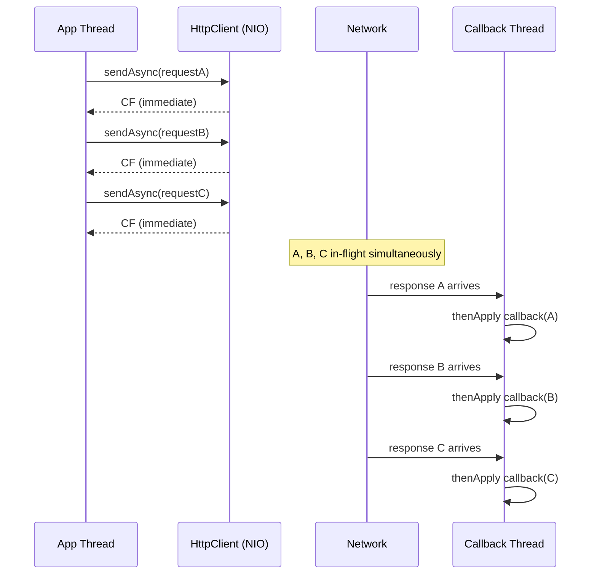

## Keywords in This File
{: .no_toc }

| # | Keyword | Weight |
|---|---|---|
| 1 | [Async Java - L2 Async Patterns](#async-java---l2-async-patterns) | medium |
| 2 | [Chaining and Combining CompletableFutures](#chaining-and-combining-completablefutures) | medium |
| 3 | [Java HttpClient Async API](#java-httpclient-async-api) | medium |

---

# Chaining and Combining CompletableFutures

---
id: AJA-012
title: Chaining and Combining CompletableFutures
category: Async Java
difficulty: ★★☆
interview_weight: high
asked_at: Mid-Senior
seniority: mid+
status: draft
version: 1
---

### 🎯 Model Answer

**30 seconds:**
> Combining CompletableFutures is about choosing the right operation for
> the dependency relationship: thenCompose for sequential dependencies,
> thenCombine for two parallel results, allOf for N parallel results.
> The performance principle: start all independent futures first, then
> combine. Never use thenCompose where thenCombine could be used - sequential
> execution multiplies latency; parallel execution takes the maximum.

**3 minutes:**
> The single most important design decision is: which operations are
> independent of each other? Independent operations run in parallel with
> thenCombine or allOf, giving combined latency of max(individual latencies).
> Dependent operations chain with thenCompose, giving latency of
> sum(individual latencies).
>
> Pattern: fan-out then fan-in. Start all independent async calls at once by
> submitting them to the executor, collect futures in a list, use allOf to
> wait, then collect results inside the callback.
>
> The join() inside thenApply on allOf is non-blocking: allOf only fires when
> all futures are done, so join() returns immediately. This is the safe
> pattern for collecting typed results from allOf (which returns CF<Void>).
>
> Error handling in combined chains: any exception in any branch causes the
> combined future to fail. To collect partial results from failures, wrap
> each branch in exceptionally before combining.

**Blank Mind Recovery:**

**(1) Restate:** "Combining CompletableFutures - the key question: are these
operations independent or dependent?"

**(2) First principles:** "Independent = parallel = thenCombine or allOf.
Dependent = sequential = thenCompose. Parallel gives max(latencies).
Sequential gives sum(latencies). Always prefer parallel when possible."

**(3) Bridge:** "Like a restaurant kitchen. Independent dishes cook
simultaneously. A dependent course waits for the previous. Run everything
independently that you can."

---

### 📘 Concept Explanation

**What it is:**
Advanced patterns for combining multiple CompletableFutures: parallel fan-out
with allOf and stream collection, typed two-way combinations with thenCombine,
sequential chains with thenCompose, and partial-result collection when some
branches may fail.

**The problem it solves:**
Microservices need data from multiple downstream services to build a response.
Calling them sequentially wastes latency proportional to the number of services.
Parallel fan-out with correct result collection and error handling is the
production pattern.

**How it works:**

```
Dependency analysis:
  A needs B's result? -> sequential (thenCompose)
  A and B independent? -> parallel (thenCombine / allOf)

Fan-out pattern:
  submit A, B, C  ->  [CF<A>, CF<B>, CF<C>]
  allOf(A, B, C)  ->  CF<Void> fires when all done
  inside thenApply: join() all (non-blocking here)

Fan-in with type safety:
  thenCombine(CF<B>, BiFunction<A,B,C>)  ->  CF<C>
  (exactly two results, typed BiFunction)

Error isolation:
  cf.exceptionally(ex -> fallback) per branch
  before combining -> prevents cascade failure
```

> **Code walkthrough:** This Chaining and Combining CompletableFutures example demonstrates a key concept in practice. **KEY MECHANISM:** the runtime executes these instructions in sequence with specific memory and execution semantics. **WHY IT MATTERS:** misapplying this pattern causes subtle bugs that only manifest under production load. **TAKEAWAY: understand the execution model before using this pattern in production code.**

**The key insight:**
`allOf` returns `CompletableFuture<Void>` - no result. To collect results
after allOf, keep references to the original futures and call `join()` inside
`thenApply`. The join() is non-blocking because allOf fires only after all
futures are complete.

**When to use allOf:** 3+ independent operations whose results are all needed.

**When to use thenCombine:** Exactly 2 independent operations with typed
result access via BiFunction.

**Alternatives:**
- Reactor: `Mono.zip(m1, m2, m3)` for reactive fan-out
- Java 21+ Structured Concurrency: `StructuredTaskScope.ShutdownOnFailure`
  for fan-out with automatic cancellation on first failure

---

### 💻 Code Example

**Fan-out, fan-in, and error isolation:**

```java
// 1. Fan-out with dynamic number of calls
List<String> serviceIds = List.of("svc-a", "svc-b", "svc-c");

List<CompletableFuture<ServiceResult>> futures =
    serviceIds.stream()
        .map(id -> CompletableFuture.supplyAsync(
            () -> client.call(id), ioPool))
        .toList();

CompletableFuture<List<ServiceResult>> allResults =
    CompletableFuture.allOf(
        futures.toArray(new CompletableFuture[0]))
    .thenApply(v -> futures.stream()
        .map(CompletableFuture::join) // safe: all done
        .toList());

// 2. Error isolation (partial results)
List<CompletableFuture<ServiceResult>> resilient =
    serviceIds.stream()
        .map(id -> CompletableFuture.supplyAsync(
                () -> client.call(id), ioPool)
            .exceptionally(ex -> {
                log.warn("Service {} failed: {}", id,
                    ex.getMessage());
                return ServiceResult.empty(id); // fallback
            }))
        .toList();
// allOf over resilient futures always completes normally

// 3. Typed two-way combination
CompletableFuture<User>    uf =
    CompletableFuture.supplyAsync(() -> getUser(id), pool);
CompletableFuture<Account> af =
    CompletableFuture.supplyAsync(() -> getAccount(id), pool);

CompletableFuture<Response> combined =
    uf.thenCombine(af,
        (user, acct) -> buildResponse(user, acct));

// 4. Mixed: sequential then parallel
CompletableFuture<Response> mixed =
    CompletableFuture.supplyAsync(() -> authenticate(token))
    .thenCompose(auth -> {
        // auth required first; user and roles are independent
        CompletableFuture<User>  userF =
            supplyAsync(() -> getUser(auth.userId()));
        CompletableFuture<Roles> roleF =
            supplyAsync(() -> getRoles(auth.userId()));
        return userF.thenCombine(roleF,
            (u, r) -> buildResponse(u, r, auth));
    });
```

> **Code walkthrough:** Pattern 1 is the canonical fan-out: submit all callsice. **KEY MECHANISM:** the runtime executes these instructions in sequence with specific memory and execution semantics. **WHY IT MATTERS:** misapplying this pattern causes subtle bugs that only manifest under production load. **TAKEAWAY: understand the execution model before using this pattern in production code.**
> as futures in a list, `allOf` waits for all, then stream-collect via
> non-blocking `join()`. Pattern 2 adds error isolation: each future wraps in
> `exceptionally` returning a fallback, so allOf never fails. Pattern 3 uses
> `thenCombine` for exactly two typed results via a BiFunction. Pattern 4 shows
> mixed sequential-then-parallel: authentication must complete first
> (thenCompose), then user and roles are fetched in parallel (thenCombine
> inside the compose). This models common microservice DAG patterns where some
> downstream calls depend on earlier results while others are truly independent.

---

### 🎓 Answers by Seniority

**Junior / Mid:**
> To run multiple async calls in parallel, I submit all futures simultaneously
> as a list (not chained with thenCompose), then use allOf to wait for all to
> complete. For exactly two results, thenCombine gives typed access to both.
> The critical rule: avoid thenCompose for independent operations - that sums
> the latencies instead of taking the max.

*Push deeper:* How do you handle one failing branch while keeping results
from the others?

---

**Senior / Staff:**
> The production pattern for microservice fan-out: analyze the dependency graph,
> start all independent operations simultaneously, use thenCompose only for
> true data dependencies, add per-branch exceptionally for resilience.
>
> Performance: 5 independent 30ms service calls take 150ms sequentially but
> 30ms in parallel. That 120ms saving per fan-out stage compounds across the
> critical path.
>
> For Java 21+ I prefer Structured Concurrency with ShutdownOnFailure: fork all
> tasks, join the scope, automatic cancellation of outstanding tasks if one
> fails. This solves allOf's resource-waste problem - allOf fails but other
> futures keep running without cancellation.

*Push deeper (Staff):* allOf starvation: submitting 1000 futures to a 20-thread
pool saturates it immediately. allOf has no concurrency control. For bounded
fan-out, `Flux.fromIterable(ids).flatMap(fn, maxConcurrency)` is the correct
abstraction.

---

### ⚠️ Common Misconceptions

**Misconception: "allOf cancels other futures when one fails."**

`CompletableFuture.allOf(f1, f2, f3)` fails when any future fails but does
NOT cancel the others - they continue running, wasting pool threads. Java 21+
Structured Concurrency's `ShutdownOnFailure` cancels all sibling tasks when
one fails, freeing resources immediately.

---

### 🚨 Failure Modes and Diagnosis

**Failure: Sequential fan-out causes unacceptable latency**

Symptom: microservice response time equals sum of all downstream service
latencies. P50 = 200ms when each downstream takes ~50ms.

Cause: downstream calls chained with thenCompose when they have no data
dependency.

```java
// SLOW: sequential, 50+50+50 = 150ms minimum
supplyAsync(() -> getUser(id))
    .thenCompose(u -> supplyAsync(() -> getOrders(id)))
    .thenCompose(o -> supplyAsync(() -> getPrefs(id)));
// None of these need each other's results!

// FAST: parallel, max(50,50,50) = 50ms
var uf = supplyAsync(() -> getUser(id));
var of = supplyAsync(() -> getOrders(id));
var pf = supplyAsync(() -> getPrefs(id));
CompletableFuture.allOf(uf, of, pf)
    .thenApply(v ->
        build(uf.join(), of.join(), pf.join()));
```

> **Code walkthrough:** This Unknown example demonstrates async pipeline construction using CompletableFuture. **KEY MECHANISM:** the JVM schedules continuations via ForkJoinPool when each stage completes. **WHY IT MATTERS:** callback chains execute on wrong threads causing ClassCastException in Spring context. **TAKEAWAY: always specify executor on thenApplyAsync to control thread context.**

Diagnosis: add distributed tracing spans to each service call. Sequential
spans (no time overlap on the trace) confirm sequential chaining.

---

### 🎯 Interview Deep-Dive

**Timing:** Medium ★★☆ - 9 questions minimum.

---

**[JUNIOR] Q1 - [HANDS-ON] How do you build a resilient fan-out with partial results?**

Three resilience levels:

**Level 1 - fail-fast:** allOf default. Any failure fails the combined
future. Use when all results are required.

**Level 2 - per-branch fallback (most common):**
```java
List<CompletableFuture<Result>> resilient = ids.stream()
    .map(id -> supplyAsync(() -> svc.call(id), pool)
        .exceptionally(ex -> Result.empty(id)))
    .toList();
// allOf over these always completes normally
CompletableFuture.allOf(resilient.toArray(new CF[0]))
    .thenApply(v -> resilient.stream()
        .map(CF::join).toList());
```

> **Code walkthrough:** This Unknown example demonstrates async pipeline construction using CompletableFuture. **KEY MECHANISM:** the JVM schedules continuations via ForkJoinPool when each stage completes. **WHY IT MATTERS:** callback chains execute on wrong threads causing ClassCastException in Spring context. **TAKEAWAY: always specify executor on thenApplyAsync to control thread context.**

**Level 3 - separate success/failure tracking:**
```java
record Outcome(String id, Result result, Throwable error) {
    boolean ok() { return error == null; }
}
// handle() always produces a value, never throws
List<CF<Outcome>> tracked = ids.stream()
    .map(id -> supplyAsync(() -> svc.call(id), pool)
        .handle((r, ex) -> new Outcome(id, r, ex)))
    .toList();
// Caller can split into successes and failures
```

> **Code walkthrough:** This Unknown example demonstrates Java Stream pipeline using Stream. **KEY MECHANISM:** the stream is lazy - intermediate ops build a pipeline, terminal op drives it. **WHY IT MATTERS:** calling terminal op twice throws IllegalStateException; parallel() on small data adds overhead. **TAKEAWAY: collect() or findFirst() triggers the pipeline; reuse by wrapping in Supplier.**

*What separates good from great:* Level 3 enables partial-success responses:
"3 of 5 services responded; 2 degraded." The `handle` bifunction is the key
- it always produces a value (success or failure container), guaranteeing
allOf always completes normally with full visibility into mixed outcomes.

---

**[JUNIOR] Q2 - [CONCEPTUAL] Why is join() safe inside allOf's thenApply?**

`join()` blocks the calling thread if the future is not yet complete. Inside
`allOf.thenApply`, all component futures are guaranteed complete because:
1. `thenApply` fires only after allOf completes
2. allOf completes only after ALL component futures complete
3. Therefore join() returns instantly inside thenApply

```java
CompletableFuture.allOf(f1, f2, f3)
    .thenApply(v -> {
        var r1 = f1.join(); // instant - already done
        var r2 = f2.join(); // instant
        var r3 = f3.join(); // instant
        return build(r1, r2, r3);
    });
```

> **Code walkthrough:** This Unknown example demonstrates async pipeline construction using CompletableFuture. **KEY MECHANISM:** the JVM schedules continuations via ForkJoinPool when each stage completes. **WHY IT MATTERS:** callback chains execute on wrong threads causing ClassCastException in Spring context. **TAKEAWAY: always specify executor on thenApplyAsync to control thread context.**

This is the standard typed result collection pattern since allOf returns
`CF<Void>` with no direct access to component results.

*What separates good from great:* If allOf completed exceptionally (a branch
failed), `thenApply` is skipped. To inspect results even after failures, use
`handle` instead of `thenApply` on the allOf future, or add per-branch
fallbacks before combining.

---

**[JUNIOR] Q3 - [HANDS-ON] How do you implement per-future timeouts in fan-out?**

`completeOnTimeout` per branch (Java 9+):

```java
List<CompletableFuture<Result>> timed = ids.stream()
    .map(id -> CompletableFuture.supplyAsync(
            () -> svc.call(id), pool)
        .completeOnTimeout(
            Result.empty(id), // fallback value on timeout
            2, TimeUnit.SECONDS))
    .toList();

// allOf always completes: slow services get fallback values
CompletableFuture.allOf(timed.toArray(new CF[0]))
    .thenApply(v -> timed.stream()
        .map(CF::join).toList());
```

> **Code walkthrough:** This Unknown example demonstrates async pipeline construction using CompletableFuture. **KEY MECHANISM:** the JVM schedules continuations via ForkJoinPool when each stage completes. **WHY IT MATTERS:** callback chains execute on wrong threads causing ClassCastException in Spring context. **TAKEAWAY: always specify executor on thenApplyAsync to control thread context.**

`completeOnTimeout` vs `orTimeout`: completeOnTimeout gives a fallback value
(chain continues normally). orTimeout throws TimeoutException (chain goes
exceptional). For fan-out with partial results, completeOnTimeout is preferred.

*What separates good from great:* completeOnTimeout does not stop the underlying
computation - the pool thread continues until task completion. Under high timeout
rates, pool threads accumulate. Monitor active thread count when per-request
timeouts are frequent.

---

**[MID] Q4 - [CONCEPTUAL] How do you model a dependency graph with CompletableFutures?**

Map the DAG structure to CF composition:

```java
// Graph: A (no deps), B (no deps),
//        C depends on A, D depends on A+B,
//        E depends on C+D

CF<A> a = supplyAsync(() -> computeA());
CF<B> b = supplyAsync(() -> computeB());
// A and B run simultaneously

CF<C> c = a.thenApply(ar -> computeC(ar));
// C starts when A done

CF<D> d = a.thenCombine(b,
    (ar, br) -> computeD(ar, br));
// D starts when A and B both done

CF<E> e = c.thenCombine(d,
    (cr, dr) -> computeE(cr, dr));
// E starts when C and D both done
```

> **Code walkthrough:** This Unknown example demonstrates Java API usage. **KEY MECHANISM:** the JVM compiles to bytecode that runs on the JVM; JIT compiles hot paths to native. **WHY IT MATTERS:** unchecked assumptions about thread safety cause data races under concurrent load. **TAKEAWAY: document thread-safety guarantees on every shared mutable class.**

The JVM schedules execution automatically - no explicit thread management.

*What separates good from great:* Cycle detection: if the dependency graph
has a cycle (A depends on B, B depends on A), the CF chain deadlocks. Each
future waits for the other. Always verify the graph is a DAG before building
the chain. This is a design-time verification, not a runtime check.

---

**[MID] Q5 - [TRADE-OFF] How does parallel fan-out compare to sequential for latency?**

Sequential (thenCompose chain): total = sum(all latencies).
Parallel (allOf): total = max(all latencies).

```plaintext
5 independent 40ms service calls:
  Sequential: 5 x 40 = 200ms
  Parallel:   max(40,40,40,40,40) = 40ms
  Savings: 160ms (80% reduction)

Heterogeneous: 10ms, 50ms, 30ms, 20ms, 40ms:
  Sequential: 150ms total
  Parallel:   max = 50ms
  Savings: 100ms (67% reduction)
```

> **Code walkthrough:** This Unknown example demonstrates a key concept in practice. **KEY MECHANISM:** the runtime executes these instructions in sequence with specific memory and execution semantics. **WHY IT MATTERS:** misapplying this pattern causes subtle bugs that only manifest under production load. **TAKEAWAY: understand the execution model before using this pattern in production code.**

Resource cost: parallel fan-out uses N concurrent threads, potentially
spiking downstream load. Sequential is a deliberate backpressure technique
in tight capacity situations.

*What separates good from great:* The "one slow call kills allOf" problem:
if one of N parallel calls takes 10x longer, allOf must wait for it. Mitigate
with `completeOnTimeout` per branch: the slow call gets its fallback at the
timeout deadline rather than blocking the entire combined result.

---

**[MID] Q6 - [CONCEPTUAL] What is the performance impact of N futures on a fixed pool?**

With a pool of M threads and N futures (N > M):
```
Pool: 10 threads, 100 futures at 50ms each

Batch 1 (0-9):   starts t=0, completes t=50ms
Batch 2 (10-19): starts t=50ms, completes t=100ms
...
Batch 10 (90-99): starts t=450ms, completes t=500ms

allOf total: 500ms (not 50ms as expected for parallel!)
```

> **Code walkthrough:** This Unknown example demonstrates a key concept in practice. **KEY MECHANISM:** the runtime executes these instructions in sequence with specific memory and execution semantics. **WHY IT MATTERS:** misapplying this pattern causes subtle bugs that only manifest under production load. **TAKEAWAY: understand the execution model before using this pattern in production code.**

allOf submits all N tasks immediately with no concurrency control. The pool
queuing produces a staircase effect.

Bounded alternative:
```java
Flux.fromIterable(ids)
    .flatMap(id -> Mono.fromCallable(() -> svc.call(id))
        .subscribeOn(Schedulers.boundedElastic()), 16)
    .collectList();
```

> **Code walkthrough:** This Unknown example demonstrates Java API usage. **KEY MECHANISM:** the JVM compiles to bytecode that runs on the JVM; JIT compiles hot paths to native. **WHY IT MATTERS:** unchecked assumptions about thread safety cause data races under concurrent load. **TAKEAWAY: document thread-safety guarantees on every shared mutable class.**

*What separates good from great:* A high-RPS service with large fan-out
multiplies pool pressure: 200 RPS x 10-future fan-out = 2000 tasks/second.
Monitor `executor.queued` metric before response time degrades.

---

**[SENIOR] Q7 - [CONCEPTUAL] How do you propagate cancellation to branches in allOf?**

allOf has no built-in cancellation propagation. Manual approach:

```java
List<CF<R>> branches = startAll();
CF<Void> combined =
    CompletableFuture.allOf(branches.toArray(new CF[0]));
combined.whenComplete((v, ex) -> {
    if (combined.isCancelled())
        branches.forEach(f -> f.cancel(true));
});
```

> **Code walkthrough:** This Unknown example demonstrates async pipeline construction using CompletableFuture. **KEY MECHANISM:** the JVM schedules continuations via ForkJoinPool when each stage completes. **WHY IT MATTERS:** callback chains execute on wrong threads causing ClassCastException in Spring context. **TAKEAWAY: always specify executor on thenApplyAsync to control thread context.**

Java 21+ proper solution - Structured Concurrency:
```java
try (var scope =
        new StructuredTaskScope.ShutdownOnFailure()) {
    var subtasks = ids.stream()
        .map(id -> scope.fork(() -> svc.call(id)))
        .toList();
    scope.join();
    scope.throwIfFailed();
    return subtasks.stream()
        .map(Future::resultNow).toList();
}
// Scope exit cancels all remaining subtasks
```

> **Code walkthrough:** This Unknown example demonstrates Java Stream pipeline using Stream. **KEY MECHANISM:** the stream is lazy - intermediate ops build a pipeline, terminal op drives it. **WHY IT MATTERS:** calling terminal op twice throws IllegalStateException; parallel() on small data adds overhead. **TAKEAWAY: collect() or findFirst() triggers the pipeline; reuse by wrapping in Supplier.**

*What separates good from great:* Even `cancel(true)` on a CF does not
interrupt a running task - it only marks the future as cancelled. Structured
Concurrency uses thread interruption and scope-level lifecycle for actual
task cancellation, not just future state marking.

---

**[SENIOR] Q8 - [CONCEPTUAL] How do you collect failed and successful results separately?**

Use `handle` on each branch to produce a uniform outcome container:

```java
record Outcome(String id, Result value, Throwable err) {
    boolean ok() { return err == null; }
}

List<CF<Outcome>> tracked = ids.stream()
    .map(id -> supplyAsync(() -> svc.call(id), pool)
        .handle((r, ex) -> new Outcome(id, r, ex)))
    .toList();

CompletableFuture.allOf(tracked.toArray(new CF[0]))
    .thenApply(v -> {
        var all = tracked.stream()
            .map(CF::join).toList();
        var successes = all.stream()
            .filter(Outcome::ok)
            .map(Outcome::value).toList();
        var failures = all.stream()
            .filter(o -> !o.ok()).toList();
        return new FanOutResult(successes, failures);
    });
```

> **Code walkthrough:** This Unknown example demonstrates async pipeline construction using CompletableFuture. **KEY MECHANISM:** the JVM schedules continuations via ForkJoinPool when each stage completes. **WHY IT MATTERS:** callback chains execute on wrong threads causing ClassCastException in Spring context. **TAKEAWAY: always specify executor on thenApplyAsync to control thread context.**

`handle` always produces a value (never throws), so allOf always completes
normally. The caller has full visibility into the mixed outcome.

*What separates good from great:* Using Java records (Java 14+) for the
Outcome container. The `handle` bifunction converts both success and failure
paths to a uniform type, enabling stream-based classification without
try-catch or Optional branching in the collection step.

---

**[SENIOR] Q9 - [TRADE-OFF] How does CF fan-out compare to Reactor Flux.flatMap?**

| Feature | allOf + stream | Flux.flatMap(fn, n) |
|---|---|---|
| Concurrency control | None (all submit) | Built-in maxConcurrency |
| Error handling | Per-branch exceptionally | onErrorResume |
| Result collection | Manual join() | Automatic |
| Cancellation | Manual propagation | Native cancel |
| Backpressure | None | Reactive protocol |

For bounded fan-out, Reactor is simpler:
```java
// CF: manual Semaphore (nested deadlock risk)
Semaphore s = new Semaphore(16);
ids.stream().map(id -> supplyAsync(() -> {
    s.acquire();
    try { return svc.call(id); }
    finally { s.release(); }
}));

// Reactor: native, deadlock-safe
Flux.fromIterable(ids)
    .flatMap(id -> Mono.fromCallable(() -> svc.call(id))
        .subscribeOn(Schedulers.boundedElastic()), 16)
    .collectList();
```

> **Code walkthrough:** This Unknown example demonstrates Java Stream pipeline uice. **KEY MECHANISM:** the runtime executes these instructions in sequence with specific memory and execution semantics. **WHY IT MATTERS:** misapplying this pattern causes subtle bugs that only manifest under production load. **TAKEAWAY: understand the execution model before using this pattern in production code.**

*What separates good from great:* The Semaphore + CF pattern has a nested
deadlock risk: a thread holding the semaphore starts an inner async operation
that also needs the semaphore. Reactor's maxConcurrency controls subscription
count, not threads, so it is deadlock-safe by design.

---

### ⚖️ Comparison Table

**Fan-out combination methods:**

| Method| Futures| Result| Error behavior| Use case|
|-------|---------|-----------|---------------------|--------------------------|
| `thenCombine(CF<B>, fn)`| 2| CF<C> typed| Fails if either fails| Two typed par
| `allOf(CF<?>...)`| N| CF<Void>| Fails if any fails| N parallel, manual collect
| `anyOf(CF<?>...)`| N| CF<Object>| First completes wins| Race/redundancy|
| allOf + per-branch fallback| N| never fails| Per-branch fallback| Resilient fa
| `Flux.flatMap(fn, n)`| N dynamic| Flux<T>| onErrorResume| Bounded concurrent s

---

### 🏛️ System Design

*(Omit: L2 ★★☆ entry. Full system design in L4/L5 files.)*

---

### 📊 Diagram

**Fan-out latency comparison:**

```plaintext
Sequential (thenCompose):
  t: 0    50   100  150  200
     [A][--B--][C][--D--][E]   Total = sum = 200ms

Parallel (allOf):
  t: 0    50
     [A]
     [--B--]     <- max
     [C]
     [--D--]
     [E]
     allOf fires at t=50ms    Total = max = 50ms
```

```mermaid
gantt
    title Sequential vs Parallel Fan-Out
    dateFormat x
    axisFormat %Lms
    section Sequential
        Call A  :s1, 0, 20
        Call B  :s2, 20, 50
        Call C  :s3, 70, 20
        Call D  :s4, 90, 50
        Call E  :s5, 140, 25
    section Parallel
        Call A  :p1, 0, 20
        Call B  :p2, 0, 50
        Call C  :p3, 0, 20
        Call D  :p4, 0, 50
        Call E  :p5, 0, 25
```

> **Diagram walkthrough:** The sequential section shows calls stacked
> end-to-end, totaling ~165ms. The parallel section shows all calls starting
> at t=0 simultaneously; the total is max(durations) = 50ms. This ~3x speedup
> requires no change to business logic - just recognizing independence between
> calls and using allOf instead of a chain of thenCompose. The savings grow
> with the number of independent calls and their individual latencies.

---
---

---

### 💻 Code Example

*(Omit: this concept does not have a programmatic interface that can be demonstrated in code. The conceptual explanation above is sufficient.)*


---

### 🏛️ System Design

*(Omit: system design diagram not applicable for this concept - see ★★★ keywords for full system design coverage.)*


---

### ⚖️ Comparison Table

*(Omit: this is a ★☆☆ foundational concept with no direct alternatives to compare - see higher-difficulty keywords for trade-off analysis.)*


---

### 📊 Diagram

*(Omit: no standalone visual diagram required for this concept - the explanations and code examples above provide sufficient clarity.)*


# Java HttpClient Async API

---
id: AJA-013
title: Java HttpClient Async API
category: Async Java
difficulty: ★★☆
interview_weight: medium
asked_at: Mid-Senior
seniority: mid
status: draft
version: 1
---

### 🎯 Model Answer

**30 seconds:**
> Java 11's HttpClient provides `sendAsync(request, bodyHandler)` returning
> a CompletableFuture that completes when the response arrives without
> blocking the calling thread. The client is reusable and thread-safe.
> Key decision: use HttpClient for non-Spring Java, and Spring WebClient
> for Spring WebFlux (WebClient returns Mono/Flux natively).

**3 minutes:**
> Java 11's `HttpClient` replaced `HttpURLConnection`. Three improvements:
> async via sendAsync(), HTTP/2 support, and a clean BodyHandler API.
>
> `sendAsync(request, bodyHandler)` returns
> `CompletableFuture<HttpResponse<T>>` immediately. The response body type
> is determined by the BodyHandler: `ofString()` decodes as String,
> `ofInputStream()` provides streaming access, `discarding()` ignores body.
>
> The client uses NIO internally: one selector thread manages all in-flight
> requests without blocking threads. One reusable client handles hundreds of
> concurrent async requests.
>
> Critical: sendAsync does NOT throw exceptions for HTTP 4xx or 5xx responses.
> Non-2xx responses are returned as `HttpResponse` objects. Always check
> `response.statusCode()` explicitly.

**Blank Mind Recovery:**

**(1) Restate:** "Java HttpClient async API - sendAsync, BodyHandlers,
status code checking, and when to use WebClient."

**(2) First principles:** "HTTP is I/O. Async HTTP: send the request,
do not block the thread, register a callback when the response arrives."

**(3) Bridge:** "Like JavaScript's fetch(). fetch() returns a Promise
immediately. The response resolves it asynchronously."

---

### 📘 Concept Explanation

**What it is:**
`java.net.http.HttpClient` (Java 11+) provides async HTTP via `sendAsync()`
returning `CompletableFuture<HttpResponse<T>>`, HTTP/2 support, built-in
connection pooling, and configurable timeouts.

**The problem it solves:**
`HttpURLConnection` had no async API, required manual stream management,
and lacked HTTP/2 support. HttpClient provides a modern standard-library
replacement with async-first design and no external dependency.

**How it works:**

```
HttpClient.newBuilder()
    .version(HTTP_2)
    .connectTimeout(Duration.ofSeconds(10))
    .build();

HttpRequest.newBuilder()
    .uri(URI.create(url))
    .header("Authorization", "Bearer " + token)
    .timeout(Duration.ofSeconds(5))  // per-request
    .GET().build();

sendAsync(request, BodyHandlers.ofString())
  -> CF<HttpResponse<String>> returned immediately
  -> CF completes when response received

BodyHandlers:
  ofString()       -> HttpResponse<String>
  ofInputStream()  -> HttpResponse<InputStream>
  ofByteArray()    -> HttpResponse<byte[]>
  discarding()     -> HttpResponse<Void>
  ofFile(path)     -> saves body to file
```

> **Code walkthrough:** This Java HttpClient Async API example demonstrates a key concept in practice using authentication. **KEY MECHANISM:** the runtime executes these instructions in sequence with specific memory and execution semantics. **WHY IT MATTERS:** misapplying this pattern causes subtle bugs that only manifest under production load. **TAKEAWAY: understand the execution model before using this pattern in production code.**

**The key insight:**
sendAsync does NOT throw for HTTP 4xx/5xx - only for network errors
(connection refused, timeout, DNS failure). HTTP errors arrive as
`HttpResponse` with non-2xx codes. Forgetting to check statusCode is
the most common HttpClient production bug.

**When to use HttpClient:** Non-Spring Java 11+ applications. Modules
without Spring/Reactor dependency. Simple parallel HTTP with CF composition.

**When to use WebClient instead:** Spring WebFlux (Mono/Flux native).
Streaming with backpressure. ExchangeFilterFunction cross-cutting concerns.

**Alternatives:**
- OkHttp: mature, rich interceptor model, Android support
- Apache HttpClient 5: enterprise features (NTLM, Kerberos)

---

### 💻 Code Example

**sendAsync patterns:**

```java
// Create once, reuse (connection pooling)
static final HttpClient CLIENT = HttpClient.newBuilder()
    .version(HttpClient.Version.HTTP_2)
    .connectTimeout(Duration.ofSeconds(10))
    .followRedirects(HttpClient.Redirect.NORMAL)
    .build();

// 1. Single async GET with mandatory status check
CompletableFuture<User> fetchUser(String userId) {
    HttpRequest req = HttpRequest.newBuilder()
        .uri(URI.create(BASE + "/users/" + userId))
        .header("Accept", "application/json")
        .timeout(Duration.ofSeconds(5))
        .GET().build();

    return CLIENT.sendAsync(req, BodyHandlers.ofString())
        .thenApply(r -> {
            // MUST check: 4xx/5xx do NOT throw!
            if (r.statusCode() / 100 != 2) {
                throw new ServiceException(
                    "HTTP " + r.statusCode()
                    + " from " + r.uri());
            }
            return objectMapper.readValue(r.body(), User.class);
        });
}

// 2. Parallel fan-out
CompletableFuture<List<User>> fetchUsers(List<String> ids) {
    List<CompletableFuture<User>> futures = ids.stream()
        .map(this::fetchUser).toList();
    return CompletableFuture.allOf(
        futures.toArray(new CompletableFuture[0]))
    .thenApply(v -> futures.stream()
        .map(CompletableFuture::join).toList());
}

// 3. POST with JSON body
CompletableFuture<OrderId> createOrder(OrderRequest req) {
    String json = objectMapper.writeValueAsString(req);
    HttpRequest request = HttpRequest.newBuilder()
        .uri(URI.create(BASE + "/orders"))
        .header("Content-Type", "application/json")
        .POST(BodyPublishers.ofString(json))
        .timeout(Duration.ofSeconds(10)).build();

    return CLIENT.sendAsync(request,
        BodyHandlers.ofString())
    .thenApply(r -> {
        if (r.statusCode() != 201) {
            throw new ServiceException(
                "Order failed: " + r.statusCode());
        }
        return objectMapper.readValue(r.body(), OrderId.class);
    });
}
```

> **Code walkthrough:** The static `CLIENT` is reused across all requests -ice. **KEY MECHANISM:** the runtime executes these instructions in sequence with specific memory and execution semantics. **WHY IT MATTERS:** misapplying this pattern causes subtle bugs that only manifest under production load. **TAKEAWAY: understand the execution model before using this pattern in production code.**
> creating a new client per request is expensive and bypasses connection
> pooling. Pattern 1 shows the mandatory status code check: `statusCode() / 100
> != 2` catches all non-2xx responses, since sendAsync never throws for HTTP
> errors. Pattern 2 is standard fan-out: all requests fire simultaneously and
> allOf waits for all. HTTP/2 multiplexing allows concurrent requests over
> fewer connections. Pattern 3 shows POST with `BodyPublishers.ofString(json)`
> and a 201-specific check. The `objectMapper.readValue()` inside thenApply
> can throw on malformed JSON - this propagates as CompletionException.

---

### 🎓 Answers by Seniority

**Junior / Mid:**
> Java 11's HttpClient has `sendAsync` which returns a CompletableFuture
> immediately. I use `BodyHandlers.ofString()` for JSON responses. Important:
> sendAsync doesn't throw for HTTP errors (4xx, 5xx) - I must check
> `response.statusCode()` explicitly. The client should be created once and
> reused because it manages connection pools internally.

*Push deeper:* Why is creating a new HttpClient per request harmful?

---

**Senior / Staff:**
> HttpClient uses Java NIO internally - one selector thread manages all
> in-flight requests without blocking. One reused client handles hundreds of
> concurrent sendAsync calls.
>
> In production I configure: connectTimeout (fail fast on unreachable hosts),
> per-request timeout (prevent slow requests holding the CF chain), and a
> custom executor for callback delivery. The default ForkJoinPool commonPool
> is wrong for I/O callbacks - it can cause deadlocks in recursive ForkJoin
> tasks.
>
> For Spring WebFlux I use WebClient: Mono/Flux native, Reactor threading model
> integration without bridging. HttpClient requires explicit `Mono.fromFuture()`
> and loses Reactor operator ergonomics.

*Push deeper (Staff):* HTTP/2 multiplexing: 100 concurrent requests to the
same host may use 1-6 connections instead of 100. Verify with
`response.version()` that HTTP/2 is actually being negotiated.

---

### ⚠️ Common Misconceptions

**Misconception: "sendAsync throws for HTTP 4xx or 5xx responses."**

`sendAsync` only completes exceptionally for NETWORK errors: connection
refused, DNS failure, timeout exceeded. HTTP-level errors (400, 401, 403,
404, 500, 503) are returned as `HttpResponse` objects with non-2xx status
codes. The CompletableFuture completes SUCCESSFULLY with these responses.
Failing to check statusCode causes silent incorrect behavior with no
exceptions in logs.

---

### 🚨 Failure Modes and Diagnosis

**Failure: HTTP error responses silently treated as success**

Symptom: service produces incorrect results with no exceptions. Downstream
operations based on the HTTP call fail silently or produce bad data.

Cause: sendAsync with no status code check. 503 responses are received,
thenApply runs on the error body, JSON deserialization fails or returns
null, downstream logic proceeds with bad state.

```java
// WRONG: no status check - 503 treated as success
CLIENT.sendAsync(req, BodyHandlers.ofString())
    .thenApply(r -> mapper.readValue(r.body(), User.class));
// r.body() may be HTML error page -> JsonParseException
// OR: deserializes to wrong/empty object

// CORRECT: explicit status check
CLIENT.sendAsync(req, BodyHandlers.ofString())
    .thenApply(r -> {
        if (r.statusCode() / 100 != 2) {
            throw new HttpException(
                r.statusCode(), r.uri(), r.body());
        }
        return mapper.readValue(r.body(), User.class);
    });
```

> **Code walkthrough:** This Unknown example demonstrates Java API usage. **KEY MECHANISM:** the JVM compiles to bytecode that runs on the JVM; JIT compiles hot paths to native. **WHY IT MATTERS:** unchecked assumptions about thread safety cause data races under concurrent load. **TAKEAWAY: document thread-safety guarantees on every shared mutable class.**

Extract as a reusable utility to enforce status checks everywhere:
```java
static <T> Function<HttpResponse<String>, T> parseChecked(
        Class<T> type) {
    return r -> {
        if (r.statusCode() / 100 != 2)
            throw new HttpException(r.statusCode(), r.body());
        return parseJson(r.body(), type);
    };
}
```

> **Code walkthrough:** This Unknown example demonstrates Java API usage using generic type. **KEY MECHANISM:** the JVM compiles to bytecode that runs on the JVM; JIT compiles hot paths to native. **WHY IT MATTERS:** unchecked assumptions about thread safety cause data races under concurrent load. **TAKEAWAY: document thread-safety guarantees on every shared mutable class.**

---

### 🎯 Interview Deep-Dive

**Timing:** Medium ★★☆ - 9 questions minimum.

---

**[JUNIOR] Q1 - [COMPARISON] What are the main differences between HttpURLConnection and HttpClient?**

`HttpURLConnection` (Java 1.1): synchronous only, verbose manual InputStream
management, HTTP/1.1 only, not thread-safe (one instance per request).

`HttpClient` (Java 11): both sync (`send`) and async (`sendAsync` + CF),
BodyHandlers manage body lifecycle automatically, HTTP/2 with multiplexing
and fallback to HTTP/1.1, thread-safe (one shared instance), built-in
connection pooling, configurable connect and per-request timeouts.

```java
// Old (HttpURLConnection):
HttpURLConnection conn =
    (HttpURLConnection) new URL(url).openConnection();
conn.setRequestMethod("GET");
String body =
    new String(conn.getInputStream().readAllBytes());
conn.disconnect(); // manual cleanup, no async

// New (HttpClient):
CLIENT.sendAsync(req, BodyHandlers.ofString())
    .thenAccept(r -> process(r.body())); // async, clean
```

> **Code walkthrough:** This Unknown example demonstrates Java Stream pipeline. **KEY MECHANISM:** the stream is lazy - intermediate ops build a pipeline, terminal op drives it. **WHY IT MATTERS:** calling terminal op twice throws IllegalStateException; parallel() on small data adds overhead. **TAKEAWAY: collect() or findFirst() triggers the pipeline; reuse by wrapping in Supplier.**

*What separates good from great:* `URL.openConnection()` caches connections
globally - this causes contention in multi-threaded code. HttpClient's
per-instance connection pool is explicit, predictable, and independently
configurable per service.

---

**[JUNIOR] Q2 - [CONCEPTUAL] How do you configure connect and request timeouts?**

Connect timeout (client builder - applies to all requests):
```java
HttpClient client = HttpClient.newBuilder()
    .connectTimeout(Duration.ofSeconds(10))
    .build();
```

> **Code walkthrough:** This Unknown example demonstrates Java API usage. **KEY MECHANISM:** the JVM compiles to bytecode that runs on the JVM; JIT compiles hot paths to native. **WHY IT MATTERS:** unchecked assumptions about thread safety cause data races under concurrent load. **TAKEAWAY: document thread-safety guarantees on every shared mutable class.**

Request timeout (per request):
```java
HttpRequest req = HttpRequest.newBuilder()
    .timeout(Duration.ofSeconds(5)) // full response timeout
    .uri(uri).GET().build();
```

> **Code walkthrough:** This Unknown example demonstrates Java API usage. **KEY MECHANISM:** the JVM compiles to bytecode that runs on the JVM; JIT compiles hot paths to native. **WHY IT MATTERS:** unchecked assumptions about thread safety cause data races under concurrent load. **TAKEAWAY: document thread-safety guarantees on every shared mutable class.**

On timeout: CF completes exceptionally with `HttpTimeoutException`.
Handle with `exceptionally` or `handle`:
```java
sendAsync(req, BodyHandlers.ofString())
    .exceptionally(ex -> {
        if (ex.getCause() instanceof HttpTimeoutException) {
            log.warn("Timeout: {}", req.uri());
            return fallbackResponse();
        }
        throw new CompletionException(ex.getCause());
    });
```

> **Code walkthrough:** This Unknown example demonstrates Java API usage. **KEY MECHANISM:** the JVM compiles to bytecode that runs on the JVM; JIT compiles hot paths to native. **WHY IT MATTERS:** unchecked assumptions about thread safety cause data races under concurrent load. **TAKEAWAY: document thread-safety guarantees on every shared mutable class.**

*What separates good from great:* Request timeout starts when `sendAsync`
is called. For requests reusing pooled connections, connect timeout is
irrelevant. Set both as a safety net: connect timeout prevents infinite
wait on unreachable hosts; request timeout prevents slow-response hangs.

---

**[JUNIOR] Q3 - [CONCEPTUAL] How do BodyHandlers and BodyPublishers work?**

`BodyHandlers` decode the response body:
- `ofString()`: full body as String (charset from Content-Type)
- `ofByteArray()`: raw bytes
- `ofInputStream()`: streaming (avoids OOM for large bodies)
- `ofLines()`: lines as `Stream<String>`
- `ofFile(path)`: write body to file
- `discarding()`: ignore body entirely

`BodyPublishers` encode the request body:
- `ofString(str)`: String
- `ofByteArray(bytes)`: raw bytes
- `ofFile(path)`: file upload
- `noBody()`: for GET/DELETE

For large responses: use `ofInputStream()`. `ofString()` loads the entire
response into memory - causes OOM for large files.

```java
// Large file download - streaming
CLIENT.sendAsync(req, BodyHandlers.ofInputStream())
    .thenAccept(r -> {
        try (var is = r.body()) { // must close InputStream
            Files.copy(is, targetPath);
        }
    });
```

> **Code walkthrough:** This Unknown example demonstrates Java Stream pipeline. **KEY MECHANISM:** the stream is lazy - intermediate ops build a pipeline, terminal op drives it. **WHY IT MATTERS:** calling terminal op twice throws IllegalStateException; parallel() on small data adds overhead. **TAKEAWAY: collect() or findFirst() triggers the pipeline; reuse by wrapping in Supplier.**

*What separates good from great:* `ofInputStream()` requires closing the
InputStream after reading. If not closed, the underlying connection is not
returned to the pool, causing connection exhaustion over time.

---

**[MID] Q4 - [DEBUGGING] How do you implement retry logic?**

```java
CF<HttpResponse<String>> sendWithRetry(
        HttpRequest req, int maxAttempts) {
    return attempt(req, maxAttempts, 1);
}

private CF<HttpResponse<String>> attempt(
        HttpRequest req, int max, int n) {
    return CLIENT.sendAsync(req, BodyHandlers.ofString())
        .thenCompose(r -> {
            // 5xx: server error - retry (not 4xx: client error)
            if (r.statusCode() >= 500 && n < max) {
                long delay = (long) Math.pow(2, n) * 100;
                return retryAfterDelay(req, max, n, delay);
            }
            return CF.completedFuture(r);
        })
        .exceptionallyCompose(ex -> {
            if (n < max && isTransient(ex.getCause()))
                return retryAfterDelay(req, max, n, 200);
            return CF.failedFuture(ex.getCause());
        });
}

private CF<HttpResponse<String>> retryAfterDelay(
        HttpRequest req, int max, int n, long ms) {
    return CF.delayedExecutor(ms, TimeUnit.MILLISECONDS, pool)
        .execute(() -> {})
        .thenCompose(v -> attempt(req, max, n + 1));
}
```

> **Code walkthrough:** This Unknown example demonstrates exception handling. **KEY MECHANISM:** the JVM checks catch clauses in order; finally always executes for cleanup. **WHY IT MATTERS:** swallowing exceptions silently hides failures that corrupt downstream state. **TAKEAWAY: log or rethrow every exception; empty catch blocks are defects.**

*What separates good from great:* Only retry transient errors:
retry 500/502/503/504. Never retry 400/401/403/404 (caller errors).
Retrying non-idempotent POST without idempotency key may cause duplicate
operations. Add jitter to retry delays to prevent synchronized retry storms.

---

**[MID] Q5 - [BEHAVIORAL] How does sendAsync integrate with Project Reactor?**

```java
// CF -> Mono bridge (not lazy - CF starts immediately)
Mono<User> fetchReactive(String id) {
    HttpRequest req = HttpRequest.newBuilder()
        .uri(URI.create(BASE + "/users/" + id))
        .GET().build();

    return Mono.fromFuture(
        CLIENT.sendAsync(req, BodyHandlers.ofString()))
    .filter(r -> r.statusCode() == 200)
    .switchIfEmpty(Mono.error(new NotFoundException()))
    .map(r -> mapper.readValue(r.body(), User.class));
}

// Use in reactive pipeline with concurrency control:
Flux.fromIterable(userIds)
    .flatMap(id -> fetchReactive(id), 16)
    .collectList();
```

> **Code walkthrough:** This Unknown example demonstrates Java API usage. **KEY MECHANISM:** the JVM compiles to bytecode that runs on the JVM; JIT compiles hot paths to native. **WHY IT MATTERS:** unchecked assumptions about thread safety cause data races under concurrent load. **TAKEAWAY: document thread-safety guarantees on every shared mutable class.**

For Spring WebFlux: use WebClient directly (no bridging):
```java
Mono<User> user = webClient.get()
    .uri("/users/{id}", id)
    .retrieve()
    .onStatus(s -> !s.is2xxSuccessful(),
        r -> Mono.error(new ServiceException()))
    .bodyToMono(User.class);
```

> **Code walkthrough:** This Unknown example demonstrates Java API usage. **KEY MECHANISM:** the JVM compiles to bytecode that runs on the JVM; JIT compiles hot paths to native. **WHY IT MATTERS:** unchecked assumptions about thread safety cause data races under concurrent load. **TAKEAWAY: document thread-safety guarantees on every shared mutable class.**

*What separates good from great:* `Mono.fromFuture(cf)` is not lazy if the
CF was already created - the HTTP request is already in-flight. For true
lazy: `Mono.defer(() -> Mono.fromFuture(CLIENT.sendAsync(req, handler)))`.
This matters when the Mono is assembled eagerly but subscribed lazily.

---

**[MID] Q6 - [CONCEPTUAL] How does HTTP/2 change the connection model?**

HTTP/1.1: one request per connection. 100 concurrent requests = 100 TCP
connections. Connection pool limits concurrency.

HTTP/2: multiple requests multiplexed over one connection. 100 concurrent
requests = 1-6 connections (depending on server stream limits). Benefits:
fewer TCP connections, HPACK header compression, stream prioritization.

HttpClient configuration:
```java
HttpClient client = HttpClient.newBuilder()
    .version(HttpClient.Version.HTTP_2) // auto-fallback to H1.1
    .build();

// Verify which protocol was negotiated:
CLIENT.sendAsync(req, BodyHandlers.discarding())
    .thenAccept(r ->
        log.info("Protocol: {}", r.version()));
```

> **Code walkthrough:** This Unknown example demonstrates Java API usage. **KEY MECHANISM:** the JVM compiles to bytecode that runs on the JVM; JIT compiles hot paths to native. **WHY IT MATTERS:** unchecked assumptions about thread safety cause data races under concurrent load. **TAKEAWAY: document thread-safety guarantees on every shared mutable class.**

*What separates good from great:* HTTP/2 stream limits (default 100 per
RFC). When stream limit is reached, HttpClient creates a new connection.
Monitoring connection count confirms multiplexing: one connection for 100
concurrent requests = H2. 100 connections = H1.1.

---

**[SENIOR] Q7 - [CONCEPTUAL] How do you handle authentication with token refresh?**

```java
class AuthHttpClient {
    private final HttpClient client;
    private final TokenStore tokens;

    <T> CF<HttpResponse<T>> send(
            HttpRequest.Builder builder,
            BodyHandler<T> handler) {
        return tokens.getValid()
            .thenCompose(token -> {
                HttpRequest req = builder
                    .header("Authorization", "Bearer " + token)
                    .build();
                return client.sendAsync(req, handler)
                    .thenCompose(r -> {
                        if (r.statusCode() == 401) {
                            return tokens.refresh()
                                .thenCompose(newTok -> {
                                    HttpRequest retry = builder
                                        .header("Authorization",
                                            "Bearer " + newTok)
                                        .build();
                                    return client.sendAsync(
                                        retry, handler);
                                });
                        }
                        return CF.completedFuture(r);
                    });
            });
    }
}
```

> **Code walkthrough:** This Unknown example demonstrates exception handling using authentication. **KEY MECHANISM:** the JVM checks catch clauses in order; finally always executes for cleanup. **WHY IT MATTERS:** swallowing exceptions silently hides failures that corrupt downstream state. **TAKEAWAY: log or rethrow every exception; empty catch blocks are defects.**

Key: retry only once on 401. If refreshed token still returns 401, that is
a permissions problem - not a token expiry. More retries cause infinite loops.

*What separates good from great:* Concurrent 401s: multiple requests fail
simultaneously and all try to refresh. Fix with a shared refresh CF: the
first request creates a refresh CF; others chain on the same CF rather than
issuing duplicate refresh requests.

---

**[SENIOR] Q8 - [TRADE-OFF] When would you choose WebClient over HttpClient?**

| Scenario | WebClient | HttpClient |
|---|---|---|
| Spring WebFlux | Required | Via Mono.fromFuture |
| Streaming responses | Flux<T> native | ofInputStream |
| Reactor operators | Direct composition | Bridging needed |
| Non-Spring Java | Extra dependency | Built-in |
| Retry with backoff | retryWhen() | Manual recursion |
| ExchangeFilter | Built-in | Manual wrapper |

Decision: Spring WebFlux project -> WebClient. Non-Spring Java -> HttpClient.

WebClient uses Netty NIO (reactor-netty) - not a wrapper over Java HttpClient.
They are separate async implementations.

*What separates good from great:* WebClient's `exchangeToMono()` gives access
to headers, status, AND body in one reactive chain for conditional processing.
The main WebClient advantage is Reactor operator richness composing directly
in the pipeline without bridging overhead.

---

**[SENIOR] Q9 - [HANDS-ON] How do you test code that uses sendAsync?**

Three strategies:

1. Interface extraction (preferred for unit tests):
```java
interface UserGateway {
    CF<User> fetchUser(String id);
}
// Mock the interface; business logic tests without HTTP
when(gateway.fetchUser("1"))
    .thenReturn(completedFuture(User.of("1", "Alice")));
```

> **Code walkthrough:** This Unknown example demonstrates contract definition using interface. **KEY MECHANISM:** the JVM uses dynamic dispatch for all interface method calls. **WHY IT MATTERS:** interfaces with default methods can conflict at compile time via diamond problem. **TAKEAWAY: interfaces define contracts; prefer them over abstract classes for unrelated types.**

2. MockWebServer (integration tests - OkHttp library):
```java
MockWebServer server = new MockWebServer();
server.enqueue(new MockResponse()
    .setResponseCode(200)
    .setBody("{\"id\":\"1\",\"name\":\"Alice\"}"));
server.start();
var r = CLIENT.send(
    HttpRequest.newBuilder()
        .uri(server.url("/users/1").uri()).GET().build(),
    BodyHandlers.ofString());
assertThat(r.statusCode()).isEqualTo(200);
server.shutdown();
```

> **Code walkthrough:** This Unknown example demonstrates Java API usage. **KEY MECHANISM:** the JVM compiles to bytecode that runs on the JVM; JIT compiles hot paths to native. **WHY IT MATTERS:** unchecked assumptions about thread safety cause data races under concurrent load. **TAKEAWAY: document thread-safety guarantees on every shared mutable class.**

3. Testing retry behavior:
```java
server.enqueue(new MockResponse().setResponseCode(503));
server.enqueue(new MockResponse().setResponseCode(503));
server.enqueue(new MockResponse().setResponseCode(200)
    .setBody(validJson));
// sendWithRetry should succeed on attempt 3
```

> **Code walkthrough:** This Unknown example demonstrates exception handling. **

*What separates good from great:* Test the status-code check explicitly:
enqueue a 503 response and assert the CF completes exceptionally with
`ServiceException`. This verifies the status check works - without it, 503
responses would succeed silently and the test would pass for the wrong reason.

---

### ⚖️ Comparison Table

**Java async HTTP clients:**

| Feature| Java HttpClient| OkHttp| Spring WebClient|
|------------|---------------|------------------|----------------------|
| Built-in| Yes (Java 11+)| No| No (Spring)|
| Async API| sendAsync (CF)| Callback + CF| Mono/Flux native|
| HTTP/2| Yes| Yes| Yes (Netty)|
| Streaming| ofInputStream| ResponseBody| Flux<DataBuffer>|
| Interceptors| None| addInterceptor| ExchangeFilterFunction|
| Retry| Manual| Interceptor| retryWhen()|
| Android| No| Yes| No|
| Best for| Non-Spring Java| Android/non-Spring| Spring WebFlux|

---

### 🏛️ System Design

*(Omit: L2 ★★☆ entry. HTTP client system design at L4/L5.)*

---

### 📊 Diagram

**Blocking vs sendAsync thread model:**

```
Blocking send() - 3 concurrent requests:
  Thread A: [init][=====network wait 90%=====][resp]
  Thread B: [init][=====network wait 90%=====][resp]
  Thread C: [init][=====network wait 90%=====][resp]
  3 threads occupied during network wait

sendAsync() - 3 concurrent requests:
  Thread 1: [init A][init B][init C][free...]
  Selector: monitors sockets A, B, C simultaneously
  Callback: ....[handle A][handle B][handle C]
  1 thread starts all; callbacks on arrival only
```



> **Diagram walkthrough:** The blocking model requires one thread per
> in-flight request. Threads block during network round-trip time, which
> is typically 90%+ of total duration. For 100 concurrent calls: 100 blocked
> threads. The sendAsync model uses NIO: one thread initiates all requests;
> the selector monitors all sockets; callback threads handle responses as they
> arrive. Thread count grows with CPU-bound work, not with in-flight I/O.
> This is the core efficiency argument for async HTTP in high-concurrency
> services.

---

### 💻 Code Example

*(Omit: this concept does not have a programmatic interface that can be demonstrated in code. The conceptual explanation above is sufficient.)*


---

### 🏛️ System Design

*(Omit: system design diagram not applicable for this concept - see ★★★ keywords for full system design coverage.)*


---

### ⚖️ Comparison Table

*(Omit: this is a ★☆☆ foundational concept with no direct alternatives to compare - see higher-difficulty keywords for trade-off analysis.)*


---

### 📊 Diagram

*(Omit: no standalone visual diagram required for this concept - the explanations and code examples above provide sufficient clarity.)*


