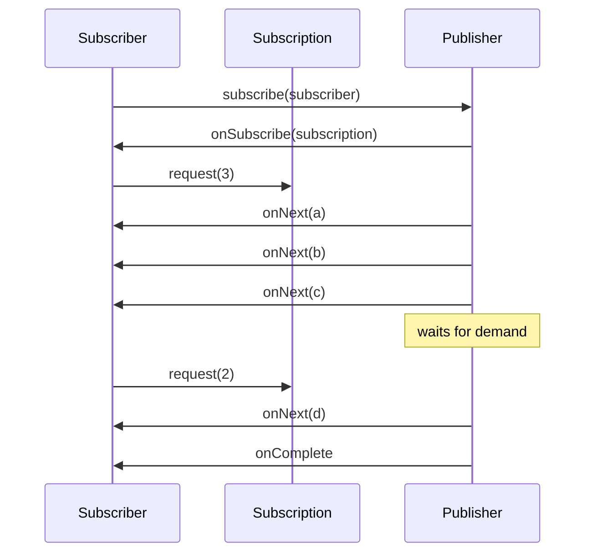
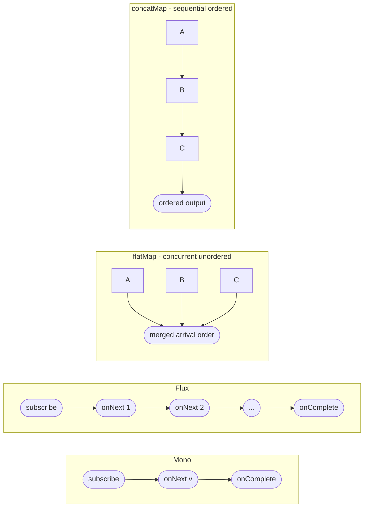

# Async Java - L2 Reactive Streams

---

# Reactive Streams Specification

---
id: AJA-010
title: Reactive Streams Specification
category: Async Java
difficulty: ★★☆
interview_weight: high
asked_at: Mid-Senior
seniority: mid+
status: draft
version: 1
---

### 🎯 Model Answer

**30 seconds:**
> The Reactive Streams specification is a standard for asynchronous stream
> processing with non-blocking backpressure. It defines four interfaces:
> Publisher (produces data), Subscriber (consumes data), Subscription
> (controls flow), and Processor (transforms data). The critical innovation
> is the `request(n)` protocol: the Subscriber tells the Publisher how many
> items it can handle, preventing the producer from overwhelming the consumer.

**3 minutes:**
> Before Reactive Streams (standardized 2015), async data pipelines had no
> standard way to signal capacity. A publisher could produce data faster than
> a subscriber could consume it, with no mechanism for the subscriber to slow
> the publisher. This was the "fast producer / slow consumer" problem, leading
> to buffer overflows or dropped data.
>
> The Reactive Streams spec solves this with demand-based flow: the Subscriber
> initiates consumption by calling `subscription.request(n)`, where n is how
> many items it can handle right now. The Publisher sends at most n items.
> When the subscriber processes those n items, it calls request() again for
> more. The Publisher cannot push more than was requested.
>
> The four interfaces: `Publisher<T>` has one method: `subscribe(Subscriber)`.
> `Subscriber<T>` has four: `onSubscribe(Subscription)`, `onNext(T)`,
> `onError(Throwable)`, `onComplete()`. `Subscription` has two: `request(n)`
> and `cancel()`. `Processor<T,R>` extends both Publisher and Subscriber.
>
> The specification is intentionally minimal - it defines the contract, not
> the implementation. Project Reactor, RxJava, Akka Streams, and Java 9's
> Flow API all implement this spec. They interoperate through these interfaces.

**Blank Mind Recovery:**

**(1) Restate:** "Reactive Streams spec - let me think through what problem
it solves and the four interfaces."

**(2) First principles:** "Async pipelines need flow control. If the producer
is faster than the consumer, data accumulates. The consumer needs a way to
tell the producer to slow down. That is backpressure."

**(3) Bridge:** "Like ordering at a restaurant. You don't ask the kitchen to
send all 10 courses simultaneously. You request one, eat it, request the next.
The kitchen produces at your consumption rate."

---

### 📘 Concept Explanation

**What it is:**
Reactive Streams is a specification (not a library) defining four interfaces
and 18 rules governing asynchronous stream processing with non-blocking
backpressure. Adopted into Java 9 as `java.util.concurrent.Flow` (identical
interfaces, different package name).

**The problem it solves:**
In async data pipelines, producers and consumers run at different speeds.
Without flow control: fast producers overwhelm slow consumers causing buffer
overflow or data loss. Backpressure makes the flow demand-driven: the consumer
controls the rate by signaling how many items it can handle.

**How it works:**

```
Reactive Streams protocol:

  Publisher                  Subscriber
      |                          |
      |<-- subscribe(sub) -------|  1. subscribe
      |--- onSubscribe(s) ------>|  2. subscription delivered
      |                          |
      |            <-- request(3)|  3. request 3 items
      |--- onNext(item1) ------->|  4. deliver up to 3
      |--- onNext(item2) ------->|
      |--- onNext(item3) ------->|
      |                          |
      |            <-- request(2)|  5. request 2 more
      |--- onNext(item4) ------->|
      |--- onComplete() -------->|  6. terminal signal
```

Rule: `onNext` called at most total-requested times.
Rule: after `onComplete` or `onError`, no more `onNext`.
Rule: `request()` and `cancel()` are thread-safe.

**The key insight:**
Backpressure is first-class, not an afterthought. The Subscriber controls
the data rate via `request(n)`. This prevents buffer overflow (subscriber
requests only what it can process), thread starvation, and memory blowup
(bounded in-flight items at all times).

**When to use reactive streams / implementations:**
- High-throughput streaming pipelines (millions of events/second)
- Services where downstream capacity varies dynamically
- End-to-end backpressure: database -> transform -> HTTP

**When NOT to use:**
- Simple request/response services without streaming
- Single-result async operations (use CompletableFuture)
- Teams unfamiliar with reactive (learning curve is real)

**Alternatives:**
- CompletableFuture: single-result async, no backpressure
- Virtual Threads (Java 21+): blocking code with implicit backpressure
  via thread pool saturation
- Kafka consumer groups: distributed backpressure via partition assignment

**First-principles derivation:**
Data flow requires capacity matching. Capacity matching requires signals:
the consumer signals its capacity to the producer. In Reactive Streams,
this signal is `request(n)`. The producer can only send what was requested.
This is a pull-push hybrid: consumer pulls demand, producer pushes data
within that demand.

---

### 💻 Code Example

**The backpressure protocol with a custom Subscriber:**

```java
// BAD: Subscriber that ignores backpressure
class BadSubscriber<T> implements Flow.Subscriber<T> {
    public void onSubscribe(Flow.Subscription s) {
        s.request(Long.MAX_VALUE); // "give me everything!"
        // Publisher sends at max speed; consumer overwhelmed
    }
    public void onNext(T item) { process(item); }
    public void onError(Throwable t) { log.error("error", t); }
    public void onComplete() {}
}

// GOOD: Demand-paced Subscriber with bounded request
class BoundedSubscriber<T> implements Flow.Subscriber<T> {
    private static final int BATCH = 10;
    private Flow.Subscription sub;
    private int pending = 0;

    public void onSubscribe(Flow.Subscription s) {
        this.sub = s;
        s.request(BATCH); // request first batch only
        pending = BATCH;
    }

    public void onNext(T item) {
        process(item);
        if (--pending == 0) {
            pending = BATCH;
            sub.request(BATCH); // request next batch
        }
    }

    public void onError(Throwable t) {
        log.error("Stream failed", t);
    }

    public void onComplete() {
        log.info("Stream complete");
    }
}
```

> **Code walkthrough:** The BAD subscriber calls `request(Long.MAX_VALUE)`,
> saying "give me everything as fast as possible." This disables backpressure
> and defeats the spec's purpose. If the publisher produces faster than
> `process()` consumes, items accumulate in memory until OOM. The GOOD
> subscriber requests batches of 10. After processing 10 items (when
> `pending == 0`), it requests 10 more. This implements demand-paced
> consumption: the publisher is limited to the subscriber's processing rate.
> `BATCH` is the tuning parameter - smaller means more round-trips; larger
> means more in-flight items. In Project Reactor this is handled automatically
> by `limitRate()`.

---

### 🎓 Answers by Seniority

**Junior / Mid:**
> Reactive Streams is a spec for async pipelines with backpressure. The four
> interfaces are Publisher (produces), Subscriber (consumes), Subscription
> (controls flow), and Processor (transforms). The key mechanism is
> `subscription.request(n)` - the Subscriber tells the Publisher how many
> items it can handle. The Publisher can only send up to n items. This prevents
> the producer from overwhelming the consumer.

*Push deeper:* What happens when a Subscriber calls request(10) and the
Publisher only has 3 items remaining?

---

**Senior / Staff:**
> The spec is what makes reactive libraries interoperable. Reactor, RxJava 2+,
> Akka Streams, and Java 9 Flow all implement it. You can connect a Reactor
> publisher to an Akka subscriber and the backpressure protocol works across
> the boundary.
>
> In production, the critical concern is backpressure at push-source
> boundaries: HTTP endpoints, Kafka consumers, WebSocket streams produce data
> at network/broker rate regardless of downstream processing speed. The source
> cannot be backpressured. The solution is a bounded buffer with an explicit
> overflow strategy at this boundary: `onBackpressureBuffer(capacity)`,
> `onBackpressureDrop()`, or `onBackpressureError()`.
>
> The most important spec rule to know: Publishers must never call `onNext`
> more times than was requested. Violating this makes the Subscriber's state
> machine undefined.

*Push deeper (Staff):* The spec does NOT mandate synchronous delivery: a
Publisher may call `onNext` on any thread after `request()`. The subscriber
must be thread-safe. Reactor's `publishOn(Scheduler)` enforces single-threaded
subscriber delivery regardless of the publisher's threading model, which is
why WebFlux uses `publishOn(Schedulers.parallel())` for controller methods.

---

### ⚠️ Common Misconceptions

**Misconception: "Backpressure automatically prevents data loss."**

Backpressure only works end-to-end if EVERY stage honors the protocol.
A single stage that calls `request(Long.MAX_VALUE)` breaks the chain.
More importantly, push-based sources (network sockets, Kafka) produce data
at their own rate regardless of downstream demand. At these boundaries
you must choose an overflow strategy. Backpressure handles consumer-limited
flow; it cannot slow inherently push-based sources.

---

### 🚨 Failure Modes and Diagnosis

**Failure: OOM from unbounded backpressure in streaming pipeline**

Symptom: streaming job runs fine for small datasets, crashes with OOM
on large ones. Heap grows continuously until GC cannot keep up.

Cause: a subscriber calls `request(Long.MAX_VALUE)`, disabling backpressure.
The publisher produces faster than processing drains.

Diagnosis:
```bash
# Take heap dump and look for large queues
jmap -dump:format=b,file=heap.hprof <pid>
# In Eclipse MAT: look for ConcurrentLinkedQueue, ArrayDeque
# with millions of entries = unbounded buffer
```

Fix in Project Reactor:
```java
// WRONG: no backpressure
flux.subscribe(item -> slowProcess(item));
// subscribe() defaults to request(Long.MAX_VALUE)

// CORRECT: rate-limited subscription
flux.limitRate(64) // request 64 at a time
    .flatMap(item -> process(item), 8) // max 8 concurrent
    .subscribe();
```

---

### 🎯 Interview Deep-Dive

**Timing:** Medium ★★☆ - 9 questions minimum.

---

#### Q1 - What are the four Reactive Streams interfaces?

`Publisher<T>`: produces items. Single method `subscribe(Subscriber)`.
Calling subscribe does not start flow - flow starts when subscriber calls
`request()`.

`Subscriber<T>`: receives items. Four methods: `onSubscribe(Subscription)`
(called once on start), `onNext(T)` (each item, at most requested count),
`onError(Throwable)` (terminal: error), `onComplete()` (terminal: done).

`Subscription`: the link between a specific Publisher/Subscriber pair.
`request(long n)` signals demand; `cancel()` stops the stream.

`Processor<T,R>`: extends both Publisher and Subscriber. Intermediate
transform. Rarely implemented directly in Reactor code - use operators.

Key contracts: `onSubscribe` MUST be called before `onNext`. `onError`
and `onComplete` are mutually exclusive. Each `subscribe()` creates a
new Subscription.

*What separates good from great:* Knowing that each `subscribe()` call
creates an independent Subscription. One Publisher serving multiple
Subscribers gives each subscriber an independent data stream (cold) or
shares one stream (hot, via multicast).

---

#### Q2 - How does request(n) implement backpressure?

`request(n)` is the demand signal. The Subscriber calls it to say "I can
handle n more items." The Publisher MUST NOT call `onNext` more times than
the total outstanding demand.

Demand is cumulative: `request(3)` + `request(5)` = 8 outstanding.
The publisher tracks the sum and emits up to 8 items.

`request()` is non-blocking: it does not wait for items. The Publisher
delivers items asynchronously within the requested demand.

Backpressure mechanism: if the subscriber processes slowly, it calls
`request()` infrequently. The publisher's emission rate drops naturally -
it waits for demand rather than buffering.

`request(Long.MAX_VALUE)` is "unbounded demand": valid per spec but
disables backpressure. Only appropriate when downstream can genuinely
process any production rate (in-memory transforms, CPU-bound with no I/O).

*What separates good from great:* The demand counter can overflow with
repeated `request(Long.MAX_VALUE)` calls. Per spec Rule 3.17: if an
overflow would occur, the Publisher may call `onError(IllegalStateException)`.
This is rarely seen but explains why some Reactor operators defensively
cap demand.

---

#### Q3 - What happens when cancel() is called?

`subscription.cancel()` signals the Publisher to stop sending items.
After cancel():
- Publisher SHOULD stop calling `onNext` as soon as possible
- Publisher is NOT required to call `onComplete`
- Already in-flight items (from outstanding demand) MAY still arrive
- Subscriber SHOULD stop calling `request()`

"SHOULD" not "MUST": cancel is cooperative, not guaranteed immediate.
In-flight items may arrive after cancel. A Subscriber must handle late
`onNext` calls after cancel.

In Reactor: cancelling a subscription (e.g., by calling `dispose()`)
propagates upstream through operator chains. Most Reactor operators
honor cancellation promptly.

*What separates good from great:* cancel() does NOT trigger `onComplete`.
Subscribers waiting for `onComplete` for cleanup will wait forever if
they cancel. Use Reactor's `doFinally(signalType -> cleanup())` instead
- it fires on complete, error, AND cancel.

---

#### Q4 - How does Java 9 Flow API relate to the spec?

Java 9 added `java.util.concurrent.Flow` as a standard library inclusion
of Reactive Streams. The interfaces are semantically identical:

| Reactive Streams | Java 9 Flow |
|---|---|
| `org.reactivestreams.Publisher` | `Flow.Publisher` |
| `org.reactivestreams.Subscriber` | `Flow.Subscriber` |
| `org.reactivestreams.Subscription` | `Flow.Subscription` |
| `org.reactivestreams.Processor` | `Flow.Processor` |

Project Reactor and RxJava implement `org.reactivestreams.*` (spec interfaces)
and provide adapters to `java.util.concurrent.Flow`. In practice, most
Spring applications use Reactor types directly. `java.util.concurrent.Flow`
is useful for library code that must work with any reactive framework without
a third-party dependency.

`SubmissionPublisher<T>` is the JDK's built-in `Flow.Publisher` implementation
for bridging non-reactive sources into reactive pipelines.

*What separates good from great:* The spec predates Java 9 by 4 years. Adding
it to the JDK enables interoperability without forcing all libraries to depend
on the same `org.reactivestreams:reactive-streams` artifact. The JDK includes
only the interfaces; implementations remain in third-party libraries.

---

#### Q5 - What is Processor and when would you implement one?

`Processor<T,R>` extends both `Publisher<R>` and `Subscriber<T>`. It
subscribes to an upstream Publisher, processes items T to R, and publishes
results downstream.

The spec explicitly warns: "Processing stages should be implemented using
existing implementations rather than writing new Processors." A correct
Processor must implement both Publisher and Subscriber contracts, handle
concurrent access, and propagate errors bidirectionally - this is complex
and error-prone.

Modern practice: use Reactor operators (`map`, `flatMap`, `filter`) instead
of custom Processors. Operators compose into pipelines without the complexity.

When custom Processor-like behavior is truly needed, use Reactor's
`Sinks.Many<T>` (replaces deprecated `FluxProcessor` in Reactor 3.4+):
```java
// Modern alternative to custom Processor
Sinks.Many<Event> sink = Sinks.many().multicast()
    .onBackpressureBuffer();
Flux<Event> output = sink.asFlux();

// Emit from any thread:
sink.tryEmitNext(event);
sink.tryEmitComplete();
```

*What separates good from great:* Knowing that Reactor deprecated
`FluxProcessor` in 3.4 in favor of `Sinks`. Sinks decouple the emit
side from the subscribe side - no need to implement both Publisher and
Subscriber interfaces. This simplifies custom hot publisher creation
significantly.

---

#### Q6 - How does a Reactive Streams pipeline differ from a Java Stream?

| Feature | `java.util.Stream` | Reactive Streams |
|---|---|---|
| Execution | Synchronous, blocking | Asynchronous |
| Thread model | Caller's thread | Configurable schedulers |
| Error handling | try/catch in lambda | `onError` terminal signal |
| Backpressure | N/A (always pull) | `request(n)` protocol |
| Data source | Finite, in-memory | Finite or infinite |
| Cancellation | `Stream.close()` | `subscription.cancel()` |
| Lazy | Yes | Yes |
| Infinite streams | Awkward | Natural |

Java Stream is pull-only and single-threaded. Reactive Streams is
pull-push hybrid with configurable threading.

Java Stream terminates when the terminal operation completes. Reactive
Streams can represent infinite streams (sensor readings, price ticks)
that never call `onComplete`.

*What separates good from great:* Java parallel streams use ForkJoinPool
and are inherently bounded by CPU cores. Reactive Flux can use any
scheduler, including unbounded I/O schedulers. For I/O-heavy parallel
processing, Flux with `subscribeOn(Schedulers.boundedElastic())` is
more appropriate than parallel streams.

---

#### Q7 - What are the key Reactive Streams rules (give 5)?

The 18 rules govern Publishers, Subscribers, and Subscriptions. Five
most interview-relevant:

Rule 1.1: Publisher MUST call `onNext` at most `sum(request(n))` times.
(The demand contract - the foundation of backpressure.)

Rule 1.7: If Publisher fails, it MUST signal `onError`. Errors are
never silently swallowed.

Rule 2.5: Subscriber MUST NOT call `request()` with n <= 0. Zero or
negative demand is a programming error - must throw.

Rule 2.7: Subscriber MUST ensure all calls to its Subscription are
serialized. `request()` and `cancel()` cannot be called concurrently.

Rule 3.4: `cancel()` MUST request the Publisher to eventually stop
signaling. "Eventually" - not immediately. In-flight items may arrive.

*What separates good from great:* Rule 1.9: Publisher MUST call
`onSubscribe` before any other signal. This ordering guarantee allows
Subscribers to store the Subscription in `onSubscribe` before `onNext`
arrives. Breaking this rule causes null reference bugs in Subscribers
that use the stored Subscription.

---

#### Q8 - How do reactive streams handle push-source boundaries?

Many real data sources are push-based: Kafka produces messages regardless
of consumer readiness, WebSocket frames arrive at network speed, sensor
readings come continuously. These cannot be backpressured at the source.

At push-source boundaries, choose an explicit overflow strategy:

```java
// Kafka source emitting faster than downstream processes

// Strategy 1: buffer (may OOM under sustained overload)
kafkaFlux.onBackpressureBuffer(10_000,
    dropped -> metrics.increment("events.overflow.dropped"));

// Strategy 2: drop newest (keep existing buffer)
kafkaFlux.onBackpressureDrop(
    item -> log.warn("Dropped: {}", item.id()));

// Strategy 3: keep latest only (real-time/stale data ok)
kafkaFlux.onBackpressureLatest();

// Strategy 4: error on overflow (signal problem loudly)
kafkaFlux.onBackpressureError();
// Emits onError(IllegalStateException) when overwhelmed
```

Choosing strategy by domain:
- Financial trades: `onBackpressureError()` - data loss is unacceptable
- Real-time UI updates: `onBackpressureLatest()` - stale updates are fine
- Audit events: `onBackpressureBuffer(bounded)` - delay ok, loss not ok
- Telemetry metrics: `onBackpressureDrop()` - samples are acceptable

*What separates good from great:* Recognizing that buffer + drop
strategies shift risk: buffer trades memory for data loss risk; drop
trades data loss for memory safety. In production, both should be
monitored: alert on buffer size growth AND on drop rate > 0%.

---

#### Q9 - How do you test a custom Publisher or Subscriber implementation?

Testing a custom Reactive Streams implementation requires verifying
the protocol contract - not just happy path behavior.

Using Reactor's `StepVerifier` for Publisher testing:
```java
@Test
void customPublisherEmitsExpectedItems() {
    Publisher<Integer> myPublisher = new MyPublisher(1, 5);
    // Wraps in Flux for StepVerifier compatibility
    StepVerifier.create(Flux.from(myPublisher))
        .expectNext(1, 2, 3, 4, 5)
        .expectComplete()
        .verify();
}

@Test
void customPublisherRespectsBackpressure() {
    Publisher<Integer> myPublisher = new MyPublisher(1, 10);
    StepVerifier.create(Flux.from(myPublisher), 3) // request only 3
        .expectNext(1, 2, 3)    // only 3 items delivered
        .thenRequest(2)          // now request 2 more
        .expectNext(4, 5)
        .thenCancel()            // cancel before all emitted
        .verify();
}
```

For TCK (Technology Compatibility Kit) testing - the official spec
compliance test suite:
```java
// Reactive Streams TCK - tests all 18 spec rules
class MyPublisherTest
    extends PublisherVerification<Integer> {
    public Publisher<Integer> createPublisher(long elements) {
        return new MyPublisher(elements);
    }
    public Publisher<Integer> createFailedPublisher() {
        return new FailingPublisher();
    }
}
```

The TCK runs all 18 spec rules automatically. Use it for any custom
Publisher or Subscriber before publishing a library.

*What separates good from great:* Knowing that most production code does
NOT need custom Publishers or Subscribers. The TCK is for reactive
library authors. Application developers use Reactor's Sinks and operators.
Knowing the TCK exists shows understanding of the spec as a compliance
standard, not just an API.

---

### ⚖️ Comparison Table

**Reactive Streams implementations:**

| Feature | Project Reactor | RxJava 2/3 | Akka Streams | Java Flow |
|---|---|---|---|---|
| Types | Mono, Flux | Single, Observable | Source, Sink | Interfaces only |
| Primary language | Java | Java / Kotlin | Scala / Java | Java |
| Backpressure | Built-in | Built-in | Built-in | Spec contract |
| Spring support | Native (WebFlux) | Via adapter | Limited | Via adapter |
| Error operators | Rich | Rich | Rich | None (spec) |
| Learning curve | Medium | Medium | High | Low |

For Spring development: Project Reactor is the default choice.

---

### 🏛️ System Design

*(Omit: ★★☆ entry. Full reactive system design in L4/L5 files.)*

---

### 📊 Diagram

**Reactive Streams protocol:**

```
  Publisher        Subscription      Subscriber
      |                 |                |
      |<--subscribe() --|----------------|
      |---onSubscribe() |--------------->|
      |                 |<--request(3)---|
      |---onNext(a)-----|--------------->|
      |---onNext(b)-----|--------------->|
      |---onNext(c)-----|--------------->|
      |   (waits for demand)             |
      |                 |<--request(2)---|
      |---onNext(d)-----|--------------->|
      |---onComplete()--|--------------->|
```



> **Diagram walkthrough:** The sequence shows demand-driven flow. The Publisher
> cannot send any items until `request()` is called. After receiving demand
> for 3, it sends exactly 3. The gap where the Publisher waits is the
> backpressure in action - the subscriber is processing its batch and the
> publisher is idle rather than buffering. This idleness is the mechanism
> that prevents memory accumulation from fast producers.

---
---

# Project Reactor Flux and Mono

---
id: AJA-011
title: Project Reactor Flux and Mono
category: Async Java
difficulty: ★★☆
interview_weight: critical
asked_at: Mid-Senior
seniority: mid+
status: draft
version: 1
---

### 🎯 Model Answer

**30 seconds:**
> Project Reactor provides two types: `Mono<T>` for 0 or 1 async item, and
> `Flux<T>` for 0 to N items. Both are lazy - nothing executes until
> subscribe is called. Mono is for single-result operations like service
> calls or DB lookups. Flux is for streaming data. All of Spring WebFlux
> is built on these two types.

**3 minutes:**
> `Mono<T>` is the reactive equivalent of `CompletableFuture<T>` for single
> results. `Flux<T>` is the reactive equivalent of an async stream. Both
> implement `org.reactivestreams.Publisher<T>`.
>
> Laziness is the most important property: creating a Mono or Flux builds a
> pipeline description. Nothing executes until `.subscribe()` is called. In
> Spring WebFlux, the framework subscribes on your behalf when a controller
> returns a Mono or Flux.
>
> Key operators: `map(fn)` transforms each item synchronously. `flatMap(fn)`
> transforms each item by calling fn which returns a Publisher, then merges
> results (concurrent by default). `filter(pred)` passes only matching items.
> `Mono.zip(m1, m2)` combines two parallel Monos. `onErrorReturn()` provides
> fallbacks.
>
> Threading: by default operators run on the thread that calls subscribe.
> `subscribeOn(scheduler)` changes where the source runs (for blocking I/O:
> use `boundedElastic`). `publishOn(scheduler)` switches threads at a
> specific pipeline position.

**Blank Mind Recovery:**

**(1) Restate:** "Flux and Mono in Reactor - let me think through what
they are and the key operators."

**(2) First principles:** "Reactive = async + backpressure + composable.
Mono is one item. Flux is many items. Both lazy publishers. Operators
compose pipelines without executing them."

**(3) Bridge:** "Mono is like CompletableFuture with reactive operators.
Flux is like a reactive Stream. Both compose; neither executes until subscribed."

---

### 📘 Concept Explanation

**What it is:**
Project Reactor's two core types:
- `Mono<T>`: reactive Publisher emitting 0 or 1 item then completing.
- `Flux<T>`: reactive Publisher emitting 0 to N items then completing or erroring.

Both are lazy assemblers: creating them describes computation. Executing
requires a `subscribe()` call. Both implement `Publisher<T>`.

**The problem it solves:**
CompletableFuture handles single async results but lacks: backpressure, a
rich operator library for stream processing, a standard threading model, and
first-class error handling operators. Reactor provides all four. Spring WebFlux
uses Reactor as its reactive runtime.

**How it works:**

```
Mono<T> - zero or one item:
  Mono.just("value")          -> emits "value", completes
  Mono.empty()                -> completes, no item
  Mono.error(ex)              -> errors immediately
  Mono.fromCallable(() -> ...) -> lazy: runs on subscribe

Flux<T> - zero to N items:
  Flux.just("a","b","c")      -> 3 items then complete
  Flux.range(1, 100)          -> integers 1-100
  Flux.interval(Duration.ofSeconds(1)) -> infinite, 1/sec
  Flux.fromIterable(list)     -> items from collection

Key operators:
  Transformation: map, flatMap, concatMap, switchMap
  Filtering:      filter, take, skip, distinct
  Combination:    zip, merge, concat, combineLatest
  Error:          onErrorReturn, onErrorResume, retry
  Side effects:   doOnNext, doOnError, doOnComplete, log()
  Threading:      subscribeOn, publishOn
```

**The key insight:**
`flatMap` is the most powerful and most dangerous operator. `Flux.flatMap(fn,
concurrency)` calls fn for each item, subscribes to all resulting Publishers
CONCURRENTLY (up to `concurrency`), and merges results in arrival order
(unordered). Without the concurrency parameter, `flatMap` subscribes to ALL
inner publishers simultaneously. For a Flux of 10,000 items, that is 10,000
concurrent subscriptions - potentially exhausting the I/O pool.

**When to use Mono:**
- Single async result: findById, HTTP GET, cache lookup
- Async validation, authentication, transformation
- Bridging: `Mono.fromFuture(cf)`, `Mono.fromCallable(() -> ...)`

**When to use Flux:**
- Streaming results: findAll, paginated queries
- Event streams: Kafka, SSE, WebSocket
- Batch processing with bounded concurrency

**When NOT to use Reactor:**
- Teams new to reactive: high learning curve, subtle concurrency bugs
- Simple CRUD services: Virtual Threads + blocking code is simpler
- Complex debugging: reactive stack traces are poor without `checkpoint()`

**Alternatives:**
- Kotlin Coroutines + Flow: reactive with sequential-looking code
- Virtual Threads (Java 21+): blocking code with no reactive model
- RxJava 3: similar concepts, different API

**First-principles derivation:**
A reactive type is a lazy description of a stream. Mono describes 0 or 1.
Flux describes 0 to N. Operators describe transformations. Nothing runs
until subscribed. This lazy assembly enables: operator fusion (adjacent
map calls merged into one), backpressure propagation throughout the chain,
and retry without re-running completed stages.

---

### 💻 Code Example

**Core Mono and Flux patterns:**

```java
// 1. Single async result with blocking I/O
Mono<User> findUser(String id) {
    return Mono.fromCallable(() -> userRepo.findById(id))
        .subscribeOn(Schedulers.boundedElastic());
        // boundedElastic: blocking I/O scheduler
}

// 2. Parallel calls with zip
Mono<Dashboard> buildDashboard(String userId) {
    Mono<User>   user   = findUser(userId);
    Mono<Orders> orders = findOrders(userId);
    Mono<Prefs>  prefs  = findPrefs(userId);

    return Mono.zip(user, orders, prefs,
        (u, o, p) -> new Dashboard(u, o, p));
    // All three start simultaneously; zip fires when all done
    // Total latency = max(user, orders, prefs) latency
}

// 3. Error handling
Mono<User> withFallback(String id) {
    return findUser(id)
        .onErrorReturn(
            NotFoundException.class, User.GUEST)
        .onErrorResume(ex -> {
            log.warn("Using fallback for {}", id);
            return Mono.just(User.GUEST);
        });
}

// 4. BAD: flatMap without concurrency limit
Flux<Order> processOrders(List<String> ids) {
    return Flux.fromIterable(ids)
        .flatMap(id -> processOrder(id)); // all concurrent!
    // For ids.size() = 10,000: 10,000 simultaneous calls
}

// GOOD: bounded concurrency flatMap
Flux<Order> processOrdersBounded(List<String> ids) {
    return Flux.fromIterable(ids)
        .flatMap(id -> processOrder(id), 16) // max 16 concurrent
        .filter(Order::isSuccessful);
}

// 5. Stream with side-effect operators
Flux<Event> auditedPipeline(Flux<Event> events) {
    return events
        .doOnNext(e -> metrics.increment("received"))
        .map(e -> enrich(e))
        .filter(e -> isValid(e))
        .doOnError(ex -> metrics.increment("error"))
        .log(); // logs all signals for debugging
}
```

> **Code walkthrough:** Pattern 1 wraps a blocking JDBC call in
> `Mono.fromCallable` and uses `subscribeOn(boundedElastic())` to run it
> on a blocking-safe scheduler. Pattern 2 uses `Mono.zip` for parallel
> fan-out - all three service calls start simultaneously. Pattern 3 chains
> `onErrorReturn` (type-specific) and `onErrorResume` (alternative Mono).
> Pattern 4 shows the critical flatMap bug: without a concurrency limit,
> all items are processed simultaneously. The GOOD version limits to 16
> concurrent processOrder calls. Pattern 5 shows `doOnNext`/`doOnError`
> for metrics and `log()` for debugging - log() prints every reactive
> signal (subscribe, request, onNext, onError, onComplete).

---

### 🎓 Answers by Seniority

**Junior / Mid:**
> Mono is for single async results - like a reactive CompletableFuture.
> Flux is for streams of async results. Both are lazy - nothing runs until
> subscribe is called. Key operators: map for transforming items, flatMap
> for when the transform is async, filter for conditional items, zip for
> combining parallel results. Spring WebFlux controller methods return
> Mono or Flux and the framework subscribes automatically.

*Push deeper:* What happens if you forget to subscribe to a Mono - when
does the code actually execute?

---

**Senior / Staff:**
> The most important nuance in Reactor is flatMap vs concatMap. flatMap is
> concurrent and unordered; concatMap is sequential and ordered. A common
> production bug is using flatMap where ordering matters (event processing
> that must be sequential) or using concatMap where concurrency is needed
> (parallel service calls) and paying unnecessary latency.
>
> The second critical nuance: `subscribeOn` vs `publishOn`. subscribeOn
> affects where the source runs (blocking I/O on boundedElastic). publishOn
> affects where downstream operators run. Most common mistake: putting
> publishOn before a flatMap expecting the inner publishers to use that
> scheduler - publishOn only affects the operators directly after it, not
> the inner publishers created by flatMap.
>
> In production I always enable Hooks.onOperatorDebug() in development and
> use checkpoint("my-operation") in production for diagnosable stack traces.

*Push deeper (Staff):* Reactor's operator fusion: adjacent `map` operators
may be fused into a single lambda during assembly, eliminating intermediate
objects and reducing GC pressure. The `Fuseable` interface marks operators
supporting this. `filter` + `map` can fuse into a `conditionalSubscribe`.
Understanding fusion helps explain why Reactor is faster than a naive
callback chain and why certain operator orderings perform differently.

---

### ⚠️ Common Misconceptions

**Misconception: "Returning a Mono from a method runs the async code."**

Creating `Mono.fromCallable(...)` does NOT run the callable. It creates
a pipeline description. The callable runs ONLY when `.subscribe()` is called.
In Spring WebFlux, the framework subscribes when writing the HTTP response.
In non-WebFlux code, forgetting to subscribe means nothing executes - the
Mono is assembled but never triggered. This is the cold publisher property:
no activity without a subscriber.

---

### 🚨 Failure Modes and Diagnosis

**Failure: Blocking call on reactive thread causing starvation**

Symptom: WebFlux service with high tail latency (p99 >> p50). Thread dump
shows Reactor worker threads in WAITING state on database calls.

Cause: a blocking call (JDBC, `Thread.sleep`, `CompletableFuture.join()`)
runs on a Reactor `parallel` scheduler thread. These schedulers have CPU-count
threads. One blocked thread eliminates a significant fraction of reactive capacity.

Diagnosis:
```bash
# Thread dump - look for reactor threads blocking on I/O
jstack <pid> | grep -A 30 "reactor-http-nio"

# Development only: BlockHound detects blocking on reactive threads
BlockHound.install();
// Throws BlockingOperationError when detected
```

Fix:
```java
// WRONG: blocking on reactive thread
return Mono.fromCallable(() -> jdbc.query(sql));
// Missing subscribeOn - runs on subscribe-time thread!

// CORRECT: blocking on safe scheduler
return Mono.fromCallable(() -> jdbc.query(sql))
    .subscribeOn(Schedulers.boundedElastic());
```

Rule: any blocking call MUST use `subscribeOn(Schedulers.boundedElastic())`.

---

### 🎯 Interview Deep-Dive

**Timing:** Medium ★★☆ - 9 questions minimum.

---

#### Q1 - What is the difference between Mono and Flux?

`Mono<T>`: Publisher emitting 0 or 1 item then completing or erroring.
For single-result operations: findById, HTTP call, cache lookup.

`Flux<T>`: Publisher emitting 0 to N items then completing or erroring.
For streams: findAll, Kafka consumer, SSE events.

Conversions:
```java
// Mono -> Flux (expand single item to stream)
Mono<List<Item>> monoList = ...;
Flux<Item> items =
    monoList.flatMapMany(Flux::fromIterable);

// Flux -> Mono (reduce stream to single result)
Mono<Integer> sum = flux.reduce(0, Integer::sum);
Mono<List<Integer>> collected = flux.collectList();
Mono<Long> count = flux.count();
```

`Mono<Void>`: used for void async operations. `Mono.empty()` completes
without emitting. Do NOT use `Mono.just(null)` - Reactor prohibits null
values and throws NullPointerException.

*What separates good from great:* Knowing `Mono.fromRunnable(() -> sideEffect())`
returns `Mono<Void>` - used for fire-and-forget operations that must be
integrated into a reactive chain without producing a result.

---

#### Q2 - What is the difference between flatMap and concatMap?

`flatMap(fn)`: calls fn for each item, subscribes to ALL resulting publishers
CONCURRENTLY. Merges results in arrival order (UNORDERED - faster inner
publishers emit first).

`concatMap(fn)`: calls fn for each item, subscribes SEQUENTIALLY (waits for
each to complete before starting the next). ORDER IS PRESERVED.

```java
// flatMap: concurrent, unordered - fast
// items [A, B, C]; if C-process finishes before A-process:
// output may be [C-result, B-result, A-result]
flux.flatMap(item -> processAsync(item));

// concatMap: sequential, ordered - slower
// always outputs [A-result, B-result, C-result]
flux.concatMap(item -> processAsync(item));

// flatMap with concurrency bound (most production-safe):
flux.flatMap(item -> processAsync(item), 8); // max 8 concurrent
```

Latency: flatMap = max(all durations). concatMap = sum(all durations).
For 10 calls of 50ms: flatMap ≈ 50ms; concatMap ≈ 500ms.

*What separates good from great:* The silent correctness bug. flatMap is
chosen for performance. But if downstream code assumes ordered results
(displaying items in request order, financial operations in time order),
flatMap causes subtle reordering bugs that appear only under concurrent load.

---

#### Q3 - How do you combine multiple Monos in parallel?

`Mono.zip(m1, m2)`: subscribes both simultaneously, fires when both
complete. Returns `Mono<Tuple2<T1,T2>>`. Type-safe via TupleN up to Tuple8.

```java
Mono<Response> buildResponse(String userId) {
    Mono<User>    user    = userService.find(userId);
    Mono<Orders>  orders  = orderService.find(userId);
    Mono<Account> account = accountService.find(userId);

    return Mono.zip(user, orders, account,
        (u, o, a) -> new Response(u, o, a));
    // Latency = max(user, orders, account)
}
```

Error handling with zip: if one Mono fails, the zip Mono fails immediately.
The other Monos continue running (no cancellation). Use `zipDelayError` to
collect all errors before failing:
```java
Mono.zipDelayError(user, orders, account, (u,o,a) -> build(u,o,a));
// Waits for all to complete/fail; reports all failures together
```

For 3+ Monos where tuple types are unwieldy:
```java
List<Mono<String>> monos = List.of(m1, m2, m3, m4);
Mono<List<String>> combined = Mono.zip(monos,
    results -> Arrays.stream(results)
        .map(r -> (String) r)
        .toList());
```

*What separates good from great:* Understanding that `Mono.zip` fails fast
on first error (like `thenCombine`) vs `zipDelayError` which aggregates all
errors (like `CompletableFuture.allOf` with individual error checking).
Choose based on whether you want fast fail or complete error inventory.

---

#### Q4 - How does subscribeOn differ from publishOn?

`subscribeOn(Scheduler)`: specifies which scheduler to use for subscribing
to the source. Affects where the source Publisher runs. Position in chain
does NOT matter - it always applies to the source.

`publishOn(Scheduler)`: switches the execution context at that position.
All downstream operators after `publishOn` run on the specified scheduler.
Position IS significant.

```java
Flux.range(1, 100)
    .subscribeOn(Schedulers.parallel()) // source on parallel
    .map(i -> i * 2)           // runs on parallel (source thread)
    .publishOn(Schedulers.boundedElastic())  // switch here
    .flatMap(i -> blockingDb(i))  // runs on boundedElastic
    .publishOn(Schedulers.parallel())  // switch back
    .map(r -> transform(r))    // runs on parallel
    .subscribe();
```

Common use patterns:
- `subscribeOn(boundedElastic)`: for blocking sources (JDBC, files)
- `publishOn(parallel)`: for CPU work after blocking I/O

*What separates good from great:* `subscribeOn` placement is irrelevant
to its effect - placing it at position 3 or position 10 in a chain has
the same result. `publishOn` IS position-sensitive. Confusing the two
causes operators to run on the wrong scheduler with subtle performance
consequences.

---

#### Q5 - How do you handle errors in Reactor?

Five error handling operators with distinct semantics:

`onErrorReturn(T)`: replace error with fallback value. Stream completes
normally.

`onErrorResume(fn)`: replace error with an alternative Publisher. For
fallback service calls.

`onErrorMap(fn)`: transform exception type. Does not recover - error
continues with new type.

`retry(n)`: re-subscribe to source n times on error.

`retryWhen(Retry)`: customizable retry with backoff and jitter.

```java
serviceCall()
    .onErrorMap(IOException.class,
        ex -> new ServiceUnavailableException(ex))
    .onErrorResume(ServiceUnavailableException.class,
        ex -> fallbackService.call())
    .onErrorReturn(defaultValue)
    .retryWhen(
        Retry.backoff(3, Duration.ofMillis(100))
            .jitter(0.5)
            .filter(ex -> ex instanceof TransientException))
```

*What separates good from great:* `retry()` re-subscribes to the entire
source chain. For cold publishers (new HTTP request), this is a retry.
For hot publishers (Kafka Flux), re-subscribing creates a NEW consumer
that may miss items produced during the retry pause. Retrying hot
publishers requires reconnect-with-replay or dead-letter queue strategies.

---

#### Q6 - What is the difference between hot and cold Flux?

**Cold Flux**: creates a new, independent data stream per subscriber.
Each subscriber starts from the beginning.
```java
Flux<Integer> cold = Flux.range(1, 5);
cold.subscribe(n -> System.out.print(n)); // 1 2 3 4 5
cold.subscribe(n -> System.out.print(n)); // 1 2 3 4 5
// Independent streams
```

**Hot Flux**: data flows regardless of subscribers. New subscribers
receive items from the subscription point onward.
```java
Sinks.Many<String> sink =
    Sinks.many().multicast().onBackpressureBuffer();
Flux<String> hot = sink.asFlux();

hot.subscribe(s -> System.out.println("A: " + s));
sink.tryEmitNext("event1"); // A receives event1

hot.subscribe(s -> System.out.println("B: " + s));
sink.tryEmitNext("event2"); // Both A and B receive event2
// B missed event1
```

Converting cold to hot: `flux.share()` multicasts to multiple subscribers
from a single source. `flux.publish().refCount(1)` starts on first
subscriber, stops on last unsubscribe.

*What separates good from great:* Spring WebFlux SSE uses hot Flux for
broadcasting: the same event stream is multicasted to all connected
clients. Using cold Flux for broadcasting creates separate database
subscriptions or Kafka consumers per client - unintended and expensive.

---

#### Q7 - How do you test Reactor code?

Project Reactor provides `StepVerifier` for synchronous testing:

```java
@Test
void testSuccess() {
    Mono<String> mono = Mono.just("hello");
    StepVerifier.create(mono)
        .expectNext("hello")
        .expectComplete()
        .verify();
}

@Test
void testFluxItems() {
    Flux<Integer> flux = Flux.range(1, 3);
    StepVerifier.create(flux)
        .expectNext(1, 2, 3)
        .expectComplete()
        .verify();
}

@Test
void testErrorHandled() {
    Mono<String> mono =
        Mono.error(new RuntimeException("oops"))
            .onErrorReturn("fallback");
    StepVerifier.create(mono)
        .expectNext("fallback")
        .expectComplete()
        .verify();
}

@Test
void testWithVirtualTime() {
    Flux<Long> delayed =
        Flux.interval(Duration.ofSeconds(1)).take(3);
    StepVerifier.withVirtualTime(() -> delayed)
        .expectSubscription()
        .thenAwait(Duration.ofSeconds(3))
        .expectNext(0L, 1L, 2L)
        .expectComplete()
        .verify(Duration.ofSeconds(5));
}
```

`StepVerifier.withVirtualTime()`: replaces internal clock. `thenAwait()`
advances virtual time. Essential for testing time-based operators without
slow real-time tests.

*What separates good from great:* Testing backpressure: `StepVerifier.create(flux, 0)`
(initial request = 0). Use `thenRequest(n)` to control demand and verify
the publisher respects it. This catches publishers that ignore the demand
contract and emit all items regardless.

---

#### Q8 - When would you choose Reactor over CompletableFuture?

| Scenario | Reactor | CompletableFuture |
|---|---|---|
| Single result | Mono (or CF) | CF (simpler) |
| Stream of results | Flux (required) | Not suitable |
| Backpressure | Built-in | Not available |
| Spring WebFlux | Required | Via Mono.fromFuture |
| Retry + backoff | retryWhen() | Manual scheduler |
| Rich error ops | Yes | Limited |
| Team familiarity | Higher learning | Lower learning |

Choose Reactor when: Spring WebFlux, streaming data with backpressure,
rich error handling operators, or existing reactive codebase.

Choose CompletableFuture when: simple async fan-out, non-reactive
frameworks, team unfamiliar with reactive, no streaming requirement.

For Java 21+: Virtual Threads make most CompletableFuture use cases
unnecessary (blocking code runs efficiently). Reactor remains relevant
for streaming and explicit backpressure scenarios.

*What separates good from great:* Knowing the interop path: `Mono.fromFuture(cf)`
bridges CompletableFuture to Reactor. Existing CF-based services can be
integrated into WebFlux without full rewrite. The bridge is common in
brownfield reactive migrations.

---

#### Q9 - How do you debug a reactive pipeline?

Debugging reactive pipelines is the hardest part of Reactor. The async
nature means stack traces do not show the call site.

Four debugging tools in ascending cost:

1. `.log()` operator (zero config): logs all signals.
```java
flux.filter(x -> x > 0)
    .log("my-flux")  // logs subscribe/request/onNext/etc
    .map(x -> x * 2)
```

2. `checkpoint("label")` (production-safe): captures assembly stack trace
only at that point. When an error propagates through, the checkpoint
label appears in the stack trace.
```java
flux.map(x -> transform(x))
    .checkpoint("transform-stage")
    .flatMap(x -> service.call(x))
    .checkpoint("service-call")
```

3. `Hooks.onOperatorDebug()` (development only): captures assembly stack
trace for EVERY operator. High overhead - never production.
```java
// In test setup:
Hooks.onOperatorDebug();
```

4. Reactor's `ReactorDebugAgent`: Java agent that instruments at class
load time. Low overhead. Production-safe alternative to `onOperatorDebug`.
```bash
java -javaagent:reactor-tools.jar -jar service.jar
```

*What separates good from great:* Understanding WHY reactive stack traces
are unhelpful: by the time an error is delivered via `onError`, the
originating call site is in a different thread's stack frame, long since
returned. `checkpoint()` works by recording the assembly stack trace
(at Mono/Flux creation time) and attaching it to errors at runtime.
This is the "breadcrumb" approach: record where the pipeline was built,
attach that to runtime errors.

---

### ⚖️ Comparison Table

**Reactor vs CompletableFuture vs Virtual Threads:**

| Feature | Mono/Flux | CompletableFuture | Virtual Threads |
|---|---|---|---|
| Paradigm | Reactive | Async callbacks | Sync-style |
| Single result | Mono<T> | CF<T> | Direct return |
| Streaming | Flux<T> | Not native | Iterator |
| Backpressure | Built-in | None | Pool limit |
| Error handling | Rich operators | exceptionally/handle | try/catch |
| Java version | 8+ (library) | 8+ | 21+ |
| Spring WebFlux | Native | Via adapter | Servlet model |
| Debugging | Needs tools | Moderate | Simple |
| Learning curve | High | Medium | Low |

---

### 🏛️ System Design

*(Omit: ★★☆ entry. Reactive system design in L4/L5 files.)*

---

### 📊 Diagram

**Mono vs Flux signals and flatMap vs concatMap:**

```
Mono<T> timeline:
  --[sub]--[onNext(v)]--[onComplete]-->
             (0 or 1 item)

Flux<T> timeline:
  --[sub]--[onNext(1)]--[onNext(2)]--...--[onComplete]-->

flatMap (concurrent, unordered):
  Input: [A, B, C]
  A-inner: ---a1---a2---a3-->
  B-inner:   ---b1-------->
  C-inner:     ---c1---c2-->
  merged: [a1,c1,b1,a2,c2,a3]  (arrival order, unordered)

concatMap (sequential, ordered):
  Input: [A, B, C]
  A-inner: ---a1---a2---a3-->
  B-inner:                 ---b1-->
  C-inner:                         ---c1---c2-->
  result: [a1,a2,a3,b1,c1,c2]  (strict order)
```



> **Diagram walkthrough:** The Mono timeline shows the single-item case:
> subscribe, one onNext, then onComplete. Flux shows a multi-item stream.
> The flatMap diagram shows all inner publishers subscribing simultaneously
> with results merged in arrival order - A, B, and C all run concurrently.
> The concatMap diagram shows strict sequencing: B only starts after A
> completes, C only starts after B. This is the visual intuition for why
> flatMap has latency = max(durations) while concatMap has latency =
> sum(durations).
