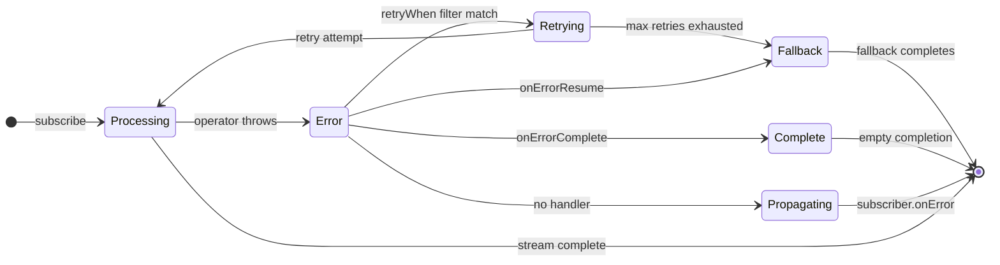
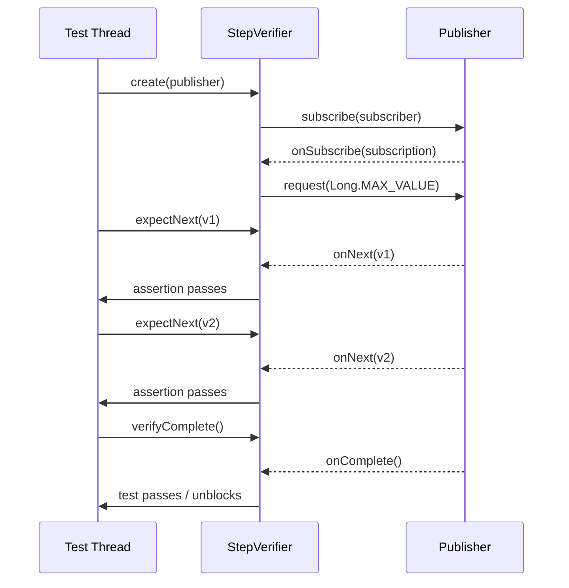

# Async Java - L3 Error Handling and Testing

---

# Error Handling in Reactive Pipelines

---
id: AJA-023
title: Error Handling in Reactive Pipelines
category: Async Java
difficulty: ★★☆
interview_weight: high
asked_at: Mid-Senior
seniority: senior
status: draft
version: 1
---

### 🎯 Model Answer

**30 seconds:**
> In reactive pipelines, errors propagate as signals (not thrown exceptions).
> The error terminates the stream unless an error-handling operator intercepts
> it. Key operators: `onErrorReturn` (substitute a value), `onErrorResume`
> (substitute a fallback Mono/Flux), `onErrorMap` (transform the exception
> type), `doOnError` (side effects without recovery), and `retryWhen` (retry
> with backoff). The critical rule: unhandled errors in `subscribe()` without
> an error callback are silently dropped.

**3 minutes:**
> Reactive error handling differs from try-catch in two ways: (1) errors
> are async signals that arrive on whatever thread drove the pipeline to
> failure; (2) error operators are declared at assembly time, not at the
> throw site.
>
> The error signal lifecycle: when any operator throws (in a `map` lambda,
> from a network call, from a database), the exception is wrapped in the
> `onError(Throwable)` signal and propagated to the next downstream operator.
> Each operator can intercept, transform, or pass through the signal.
>
> Error recovery strategies:
> - **Fallback value**: `onErrorReturn("default")` - immediate recovery
> - **Fallback source**: `onErrorResume(ex -> fallbackMono)` - try alternate
> - **Exception transformation**: `onErrorMap(ex -> new DomainEx(ex))` - remap
> - **Retry**: `retryWhen(Retry.backoff(...))` - retry the upstream
> - **Ignore**: `onErrorComplete()` - convert error to empty completion
>
> Important: `doOnError` is for SIDE EFFECTS only (logging, metrics). It
> does NOT recover from the error. The error still propagates after `doOnError`.

**Blank Mind Recovery:**

**(1) Restate:** "Reactive error handling - how do errors work in Flux/Mono?
Errors are signals, not exceptions. Operators decide how to handle them:
recover with fallback, retry, or map to different exception type."

**(2) First principles:** "In a reactive pipeline, failure is a value - the
onError signal. Just like onNext carries a result, onError carries a failure.
Operators can subscribe to error signals and handle them."

**(3) Bridge:** "Like a conveyor belt with quality checkers: an item that
fails inspection gets a tag (onError signal). Each station on the belt can
accept the tagged item and decide to fix it (recovery), replace it (fallback),
send it back to be remade (retry), or let it pass to the next station."

---

### 📘 Concept Explanation

**What it is:**
Error handling in Project Reactor reactive pipelines. Unlike imperative
try-catch where exceptions bubble up the call stack, reactive errors
propagate as `onError(Throwable)` signals through the operator chain. The
downstream operators decide how to respond.

**The problem it solves:**
Async error handling without reactive operators requires callback-style
code: each async callback must handle both success and error cases. In
a pipeline of 10 operators, this means 10 nested error checks. Reactive
error operators decouple error handling from business logic.

**Error signal lifecycle:**

```
Normal pipeline:
  source -> map(fn1) -> flatMap(fn2) -> map(fn3) -> subscriber
  Items flow: source -> fn1 -> fn2 -> fn3 -> subscriber.onNext()

Pipeline with error at fn2:
  source -> map(fn1) -> flatMap(fn2[THROWS]) -> ...
  fn2 throws NullPointerException:
    wrapped in onError(NPE) signal
    signal propagates DOWNSTREAM: map(fn3) -> subscriber
    map(fn3) does NOT fire for NPE (no item to transform)
    subscriber.onError(NPE) is called

With onErrorResume:
  source -> map(fn1) -> flatMap(fn2[THROWS])
         -> onErrorResume(ex -> fallback)
         -> map(fn3)
         -> subscriber
  fn2 throws:
    onErrorResume intercepts the signal
    subscribes to fallback instead
    fallback emits items -> map(fn3) -> subscriber.onNext()
    subscriber.onError() is NOT called
```

**Error operator reference:**

```java
// 1. onErrorReturn: substitute a default value
mono.onErrorReturn(ex, "default")
// or with predicate:
mono.onErrorReturn(
    ex -> ex instanceof NetworkException,
    "cached-value");

// 2. onErrorResume: subscribe to fallback source
mono.onErrorResume(ex -> cacheService.get(key));
// or type-filtered:
mono.onErrorResume(
    ServiceUnavailableException.class,
    ex -> cacheService.get(key));

// 3. onErrorMap: transform exception type
mono.onErrorMap(
    SQLException.class,
    ex -> new DataAccessException("DB error", ex));

// 4. doOnError: side effect only (no recovery)
mono.doOnError(ex -> {
    log.error("Failed: {}", ex.getMessage());
    metrics.increment("errors");
    // error STILL propagates after this
});

// 5. onErrorComplete: convert error to empty completion
flux.onErrorComplete(IOException.class);
// Error becomes onComplete; downstream sees empty stream

// 6. retryWhen: retry the upstream
flux.retryWhen(
    Retry.backoff(3, Duration.ofMillis(100))
         .filter(ex -> ex instanceof RetriableException));

// 7. timeout: convert timeout to TimeoutException
mono.timeout(Duration.ofSeconds(5))
    .onErrorResume(TimeoutException.class,
        ex -> Mono.just(fallbackValue));
```

**Error propagation rules:**
1. Once `onError` fires, no more `onNext` signals are emitted
2. `onError` is terminal: the subscription ends
3. Operators that don't handle errors pass them downstream
4. An unhandled error at the subscriber is passed to:
   - The `onError` consumer if provided in `subscribe()`
   - `Hooks.onErrorDropped()` if no consumer (default: logs at ERROR)
   - System err if hook not set

**Difference between try-catch and reactive:**

```java
// Imperative:
try {
    String result = userService.getUser(id);     // may throw
    String order = orderService.getOrder(result); // may throw
    return order;
} catch (NotFoundException ex) {
    return "default";
}

// Reactive:
Mono.fromCallable(() -> userService.getUser(id))
    .flatMap(user -> orderService.getOrder(user))
    .onErrorResume(NotFoundException.class,
        ex -> Mono.just("default"));
// Error anywhere in flatMap chain -> onErrorResume intercepts
```

---

### 💻 Code Example

**Production error handling patterns:**

```java
// 1. Layered error handling: retry then fallback
public Mono<Quote> getPrice(String symbol) {
    return pricingService.getQuote(symbol)
        // Retry transient failures with backoff
        .retryWhen(
            Retry.backoff(3, Duration.ofMillis(50))
                .maxBackoff(Duration.ofSeconds(1))
                .filter(ex ->
                    ex instanceof NetworkException
                    || ex instanceof ServiceUnavailableException))
        // Side effect: log all errors (including retried ones)
        .doOnError(ex ->
            log.warn("Price fetch failed for {}: {}",
                symbol, ex.getMessage()))
        // Fallback to cache after retries exhausted
        .onErrorResume(ex ->
            priceCache.get(symbol)
                .switchIfEmpty(Mono.error(
                    new PriceUnavailableException(symbol, ex))))
        // Add timeout as outer guard
        .timeout(Duration.ofSeconds(5));
}

// 2. Error type mapping at service boundaries
public Mono<User> findUser(String userId) {
    return userRepository.findById(userId)
        .switchIfEmpty(Mono.error(
            new UserNotFoundException(userId)))
        .onErrorMap(
            DataAccessException.class,
            ex -> new ServiceException("DB unavailable", ex))
        // UserNotFoundException passes through unmapped
        // DataAccessException -> ServiceException
        ;
}

// 3. Propagating vs handling in subscribe
// WRONG: no error handler
userService.getUser(id)
    .subscribe(u -> process(u));
// Error -> Hooks.onErrorDropped -> maybe logged at DEBUG

// CORRECT: explicit error handler
userService.getUser(id)
    .subscribe(
        u -> process(u),
        ex -> {
            log.error("User fetch failed: {}", ex.getMessage());
            // handle gracefully: return default, alert, etc.
        });

// 4. Conditional recovery (recover only known errors)
mono.onErrorResume(ex -> {
    if (ex instanceof CacheException) {
        return Mono.just(defaultValue); // recover
    }
    return Mono.error(ex); // re-throw: not recoverable
});
```

> **Code walkthrough:** Pattern 1 shows the layered error strategy: retry
> first (for transient failures), then fallback to cache (for persistent
> failures), with a hard timeout as the outer bound. `doOnError` fires on
> EVERY failure including retry attempts, enabling visibility into the retry
> cycle. `onErrorResume` fires only when retries are exhausted. Pattern 2
> demonstrates error type mapping: `DataAccessException` (infrastructure error)
> is mapped to `ServiceException` (domain error) at the service boundary,
> while `UserNotFoundException` passes through unmapped - different exception
> types warrant different handling by callers. Pattern 4 shows conditional
> recovery: only recover from specific known errors; re-throw unknowns.

---

### 🎓 Answers by Seniority

**Junior / Mid:**
> In reactive pipelines, errors are signals that flow downstream like items.
> When a `map` lambda throws, the exception becomes an `onError` signal. I use
> `onErrorResume` to substitute a fallback Mono when an error occurs, and
> `onErrorReturn` when I have a simple default value. `retryWhen` retries the
> entire upstream pipeline with configurable backoff. `doOnError` lets me log
> or record metrics without affecting the error propagation.

*Push deeper:* If you call `subscribe(onNext)` without an error callback
and an error occurs, what happens?

---

**Senior / Staff:**
> Reactive error handling requires thinking about errors as first-class
> citizens of the pipeline, not exceptional cases. Each operator in the chain
> either handles an error (recovery, retry, fallback) or passes it downstream.
> The boundary where you handle errors matters: `onErrorResume` close to the
> throw site handles the specific error with full context; `onErrorResume` at
> the outermost level is a catch-all for any unhandled error.
>
> Production pattern for service calls: `retryWhen` (transient failures) +
> `timeout` (latency bound) + `onErrorResume` (fallback for persistent failures)
> + `doOnError` (metrics/logging). Apply these in order: retry first, timeout
> wraps the retry, fallback after timeout.
>
> Error type discipline: use `onErrorResume(SpecificException.class, ...)` 
> not `onErrorResume(Exception.class, ...)`. Catching all exceptions hides
> unexpected failures (NullPointerException, ClassCastException) that should
> propagate and alert.

---

### ⚠️ Common Misconceptions

**Misconception: "doOnError recovers from the error."**

`doOnError` is a side-effect operator. It runs its consumer when an error
occurs but does NOT change the error signal. After `doOnError` runs, the
`onError` signal continues propagating downstream exactly as if `doOnError`
was not there. To recover from an error, you need `onErrorResume`,
`onErrorReturn`, or `onErrorComplete`. Mixing them up leads to: code that
appears to handle errors (because `doOnError` logs them) but actually lets
them propagate, confusing callers who see both a log AND an exception.

---

### 🚨 Failure Modes and Diagnosis

**Failure: Retries cause thundering herd on recovering service**

Symptom: downstream service recovers after an outage. Immediately, all
callers retry simultaneously, overwhelming the recovering service, causing
it to fail again. Repeat indefinitely.

Cause: retry with no jitter. When a service fails, all callers' `retryWhen`
triggers at (almost) the same time with the same backoff delays. After
`backoff * N` ms, ALL clients retry simultaneously = thundering herd.

```java
// BAD: synchronized retries (all clients retry at same time)
.retryWhen(Retry.fixedDelay(3, Duration.ofSeconds(1)));
// All clients: wait 1s, retry; wait 1s, retry; wait 1s, retry
// All at exactly t+1s, t+2s, t+3s -> burst of requests

// GOOD: backoff with jitter (desynchronizes retries)
.retryWhen(
    Retry.backoff(3, Duration.ofMillis(100))
        .maxBackoff(Duration.ofSeconds(10))
        .jitter(0.5)); // 50% random factor
// Client A retries at: ~100ms, ~260ms, ~580ms
// Client B retries at: ~75ms, ~210ms, ~490ms
// Spread across time: service not overwhelmed
```

---

### 🎯 Interview Deep-Dive

**Timing:** Medium ★★☆ - 9 questions minimum.

---

#### Q1 - What is the difference between onErrorReturn, onErrorResume, and onErrorMap?

All three intercept `onError` signals but differ in what they return:

`onErrorReturn(defaultValue)`:
- Terminates the error with a single value
- The new publisher completes normally with `defaultValue`
- The error is consumed; no further propagation
- Best for: simple fallback values (empty list, sentinel value)

`onErrorResume(ex -> fallbackPublisher)`:
- Replaces the failed publisher with a new publisher
- The fallback publisher can be a Mono, Flux, or even another failure
- Execution continues from the fallback source
- Best for: complex fallback logic (cache lookup, alternate service)

`onErrorMap(ex -> newException)`:
- Transforms the exception type WITHOUT recovery
- The stream still fails, but with a different exception
- Best for: translating infrastructure exceptions to domain exceptions

```java
// onErrorReturn: simple default
mono.onErrorReturn(DatabaseException.class, new User("anonymous"));

// onErrorResume: try another source
mono.onErrorResume(DatabaseException.class,
    ex -> cacheClient.get(key).defaultIfEmpty(User.empty()));

// onErrorMap: retype the error
mono.onErrorMap(
    DatabaseException.class,
    ex -> new UserServiceException("Could not load user", ex));
// Caller sees UserServiceException, not DatabaseException
```

*What separates good from great:* The ordering matters when combining these.
`onErrorMap` applied before `onErrorResume` allows `onErrorResume` to filter
by the mapped type:
```java
mono.onErrorMap(ConnectionException.class,
       ex -> new InfrastructureException(ex))
    .onErrorResume(InfrastructureException.class,
       ex -> fallback()); // handles infrastructure errors
    // Other exceptions pass through
```

---

#### Q2 - How does retryWhen differ from retry?

`retry(n)` immediately re-subscribes to the upstream `n` times on any error.
`retryWhen(retrySpec)` allows full control over retry timing, filtering,
and limits.

```java
// retry: immediate, unconditional
flux.retry(3); // retry up to 3 times on any error, immediately

// retryWhen: controlled retry
flux.retryWhen(
    Retry.backoff(3, Duration.ofMillis(100))
        .maxBackoff(Duration.ofSeconds(5))
        .jitter(0.3)
        .filter(ex -> !(ex instanceof ValidationException))
        .onRetryExhaustedThrow((spec, retrySignal) ->
            new MaxRetriesException(
                "After 3 retries: " + retrySignal.failure())));
```

The `Retry` spec determines:
- `maxAttempts`: how many retries
- `minBackoff`: initial delay before retry
- `maxBackoff`: maximum backoff cap
- `jitter`: random factor to spread retries
- `filter`: only retry on specific exceptions
- `onRetryExhaustedThrow`: transform the final exception when retries exhausted

*What separates good from great:* `retryWhen` re-subscribes to the ENTIRE
upstream. For a chain like `source -> op1 -> op2 -> retryWhen`, on retry:
source is re-subscribed (re-executed), op1 and op2 re-run. This means:
(1) the source must be cold (re-executable); (2) any state mutations in
upstream operators are repeated. For idempotent sources this is fine. For
non-idempotent (writes, notifications): retry is dangerous.

---

#### Q3 - What is the difference between error handling placement in a chain?

Where you place error operators determines which errors they catch:

```java
// Error handling after a specific operator:
source()
    .flatMap(id -> fetchById(id))
    .onErrorResume(NotFoundException.class,
        ex -> Mono.just(defaultItem))
    // Only catches errors from fetchById or source
    // Does NOT catch errors from operators added after this point

// Error handling at the end (catch-all):
source()
    .flatMap(id -> fetchById(id))
    .map(item -> transform(item))  // errors here also caught
    .onErrorResume(ex -> Mono.just(defaultItem));
// Catches errors from fetchById AND transform

// Multiple handlers for different stages:
source()
    .flatMap(id -> fetchById(id))
    .onErrorResume(NetworkException.class,
        ex -> cacheService.get(id)) // network fallback
    .map(item -> validate(item))
    .onErrorResume(ValidationException.class,
        ex -> Mono.just(invalidItem)); // validation fallback
```

Errors propagate only DOWNSTREAM. An error operator positioned BEFORE the
failing operator does NOT catch that error.

*What separates good from great:* This is the "error handling locality"
principle: place error handlers as close as possible to the failure site.
A catch-all `onErrorResume` at the end of the pipeline conflates different
error types and makes the code harder to debug. Specific handlers close to
their operators make the intent clear: "if fetch fails, use cache; if
validation fails, use placeholder."

---

#### Q4 - How do you implement circuit breaker pattern in reactive code?

Using Resilience4j reactive integration:

```java
@Bean
public CircuitBreaker circuitBreaker() {
    return CircuitBreakerRegistry.ofDefaults()
        .circuitBreaker("payment-service",
            CircuitBreakerConfig.custom()
                .failureRateThreshold(50)
                .waitDurationInOpenState(
                    Duration.ofSeconds(30))
                .slidingWindowSize(10)
                .build());
}

// Wrap reactive pipeline with circuit breaker
public Mono<PaymentResult> processPayment(Payment p) {
    return CircuitBreakerOperator.of(circuitBreaker)
        .apply(paymentService.process(p))
        .onErrorResume(
            CallNotPermittedException.class,
            ex -> Mono.just(PaymentResult.circuitOpen()))
        .onErrorResume(
            PaymentServiceException.class,
            ex -> Mono.just(PaymentResult.failed(ex)));
}
```

Circuit states and transitions:
- CLOSED: normal operation, tracking failure rate
- OPEN: all calls fail immediately with CallNotPermittedException
- HALF-OPEN: allow test call; if successful -> CLOSED; if fail -> OPEN

*What separates good from great:* Circuit breaker state transitions should
emit metrics and alerts. Configure event listener:
```java
circuitBreaker.getEventPublisher()
    .onStateTransition(event ->
        log.warn("Circuit {} -> {}",
            event.getStateTransition().getFromState(),
            event.getStateTransition().getToState()));
```
The OPEN state is expected behavior under service failure - teams should
not be surprised by it. Alert on the transition TO open (service degraded)
and BACK to closed (service recovered).

---

#### Q5 - How do you handle errors in Flux streams that should continue after errors?

By default, a single error terminates the entire Flux. For streams where
individual item failures should be skipped:

```java
// Option 1: onErrorContinue (experimental, use with caution)
Flux.range(1, 5)
    .map(i -> {
        if (i == 3) throw new RuntimeException("skip 3");
        return i;
    })
    .onErrorContinue((ex, val) -> {
        log.warn("Skipping value {} due to: {}",
            val, ex.getMessage());
    })
    .subscribe(System.out::println);
// Output: 1, 2, 4, 5 (3 skipped)

// Option 2: flatMap with error handling per item (preferred)
Flux.range(1, 5)
    .flatMap(i ->
        Mono.fromCallable(() -> processItem(i))
            .onErrorResume(ex -> {
                log.warn("Skipping {}: {}", i, ex.getMessage());
                return Mono.empty(); // skip this item
            }))
    .subscribe(System.out::println);
// Output: 1, 2, 4, 5 (3 skipped, cleaner semantics)
```

`onErrorContinue` is experimental and can have surprising interactions with
operators that buffer or aggregate. Prefer the `flatMap + onErrorResume(empty)`
pattern for clarity and predictability.

*What separates good from great:* The `onErrorContinue` operator works by
sending the error and the offending value UPSTREAM to be handled. This
violates the expected flow direction and can cause confusion. The `flatMap +
onErrorResume + empty` pattern is semantically clear: each item gets its own
error handling scope, and an error returns empty (no item emitted). This is
preferred in production code.

---

#### Q6 - How does timeout error handling work in reactive pipelines?

`timeout(Duration)` completes with `TimeoutException` if no item arrives
within the duration:

```java
// Single-element timeout (Mono):
Mono<Response> withTimeout =
    serviceCall()
        .timeout(Duration.ofSeconds(5))
        // TimeoutException if not complete in 5s
        .onErrorResume(TimeoutException.class,
            ex -> Mono.just(fallbackResponse()));

// Multi-element timeout (Flux):
// Fires on each element inter-arrival gap:
Flux<Event> withIntervalTimeout =
    eventStream()
        .timeout(Duration.ofSeconds(2));
        // Fires if no element arrives for >2 seconds

// Different timeout for first element vs subsequent:
Flux<Event> smartTimeout =
    eventStream()
        .timeout(
            Duration.ofSeconds(10), // first element timeout
            Duration.ofSeconds(1));  // subsequent element timeout
```

Timeout with fallback source:
```java
mono.timeout(
    Duration.ofSeconds(5),
    Mono.fromCallable(() -> cache.get(key)));
    // Cache is used immediately if main call times out
```

*What separates good from great:* `timeout()` uses `Schedulers.parallel()`
by default for timing. This means the timeout fires on a parallel scheduler
thread, then the fallback subscribes on that thread. If the fallback does
blocking I/O, you need to add `.subscribeOn(Schedulers.boundedElastic())`
to the fallback:
```java
mono.timeout(
    Duration.ofSeconds(5),
    Mono.fromCallable(() -> cache.get(key))
        .subscribeOn(Schedulers.boundedElastic()));
```

---

#### Q7 - How do you test error scenarios in reactive pipelines?

Using `StepVerifier` for error assertions:

```java
// Test that a specific error terminates the pipeline
@Test
void fetchUserThrowsWhenNotFound() {
    when(userRepo.findById("unknown"))
        .thenReturn(Mono.empty());

    Mono<User> result = userService.findUser("unknown");

    StepVerifier.create(result)
        .expectErrorMatches(ex ->
            ex instanceof UserNotFoundException
            && ex.getMessage().contains("unknown"))
        .verify();
}

// Test that fallback is used on error
@Test
void fetchUserReturnsFallbackOnError() {
    when(userRepo.findById("u1"))
        .thenReturn(Mono.error(new DataAccessException("DB error")));
    when(userCache.get("u1"))
        .thenReturn(Mono.just(cachedUser));

    Mono<User> result = userService.findUser("u1");

    StepVerifier.create(result)
        .expectNext(cachedUser)
        .verifyComplete();
}

// Test retry behavior with virtual time
@Test
void fetchRetries3TimesBeforeFailing() {
    AtomicInteger attempts = new AtomicInteger();
    Mono<String> flaky = Mono.fromCallable(() -> {
        if (attempts.incrementAndGet() < 4) {
            throw new NetworkException("flaky");
        }
        return "success";
    });

    Mono<String> withRetry = flaky.retryWhen(
        Retry.fixedDelay(3, Duration.ofMillis(100)));

    StepVerifier.withVirtualTime(() -> withRetry)
        .expectSubscription()
        .thenAwait(Duration.ofMillis(300))
        .expectNext("success")
        .verifyComplete();
}
```

*What separates good from great:* `StepVerifier.withVirtualTime` is the
key for testing time-dependent behavior (retry delays, timeouts) without
actually waiting. `thenAwait(duration)` advances the virtual clock,
triggering delayed operators instantly. For production retry logic with
10 retries at 5-second intervals, the test completes in milliseconds.

---

#### Q8 - What is the error handling contract of flatMap?

`flatMap` creates an inner publisher per item. If the inner publisher fails,
the error propagates to the outer Flux. The default behavior depends on
where the error occurs:

**Error in the inner publisher:**
```java
Flux.range(1, 5)
    .flatMap(i ->
        Mono.fromCallable(() -> {
            if (i == 3) throw new RuntimeException("error");
            return i * 2;
        }))
    .subscribe(
        System.out::println,
        ex -> System.out.println("Error: " + ex));
// Output: 2, 4, (then) Error: error
// Items 1 and 2 processed; item 3 fails; stream terminates
// Item 4 and 5: NOT processed (stream terminated)
```

**Error inside flatMap with per-item recovery:**
```java
Flux.range(1, 5)
    .flatMap(i ->
        Mono.fromCallable(() -> {
            if (i == 3) throw new RuntimeException("error");
            return i * 2;
        })
        .onErrorResume(ex -> Mono.just(-1))) // per-item fallback
    .subscribe(System.out::println);
// Output: 2, 4, -1, 8, 10 (item 3 returns -1; stream continues)
```

*What separates good from great:* `flatMap` with `maxConcurrency` and inner
error handling: when an inner publisher fails, `flatMap` cancels it and emits
the error to the outer. But with per-item `onErrorResume`, each inner failure
is recovered independently, allowing the stream to continue. This is the
difference between "fail-fast" (default flatMap) and "skip-and-continue"
(flatMap + per-item onErrorResume) strategies.

---

#### Q9 - How do you implement dead-letter queue pattern reactively?

```java
Flux<Message> messages = kafkaConsumer.receive();

messages
    .flatMap(msg ->
        processMessage(msg)
            .doOnError(ex ->
                log.warn("Processing failed for {}: {}",
                    msg.id(), ex.getMessage()))
            .onErrorResume(ex -> {
                // Send to DLQ and return empty (skip this msg)
                return deadLetterQueue.send(msg, ex)
                    .doOnSuccess(v ->
                        log.info("Sent to DLQ: {}", msg.id()))
                    .then(Mono.empty()); // skip
            }),
        16) // max 16 concurrent
    .subscribe(
        result -> log.info("Processed: {}", result),
        ex -> log.error("Fatal: {}", ex.getMessage()));
```

The pattern:
1. `flatMap` with per-message error handling
2. On error: send to DLQ (non-blocking)
3. `then(Mono.empty())`: skip this message in the main stream
4. Main stream continues with the next message

*What separates good from great:* The DLQ send itself can fail. If
`deadLetterQueue.send()` also fails, the outer `onErrorResume` will handle
it again - potentially creating a loop. Add a fallback for DLQ failure:
```java
.onErrorResume(ex ->
    deadLetterQueue.send(msg, ex)
        .onErrorResume(dlqEx -> {
            log.error("DLQ also failed for {}: {}",
                msg.id(), dlqEx.getMessage());
            return Mono.empty(); // ultimate fallback: skip
        })
        .then(Mono.empty()))
```

---

### ⚖️ Comparison Table

**Error recovery operators in Reactor:**

| Operator | Error consumed? | Returns | Use case |
|---|---|---|---|
| `onErrorReturn(v)` | Yes | value `v` | Simple default |
| `onErrorResume(fn)` | Yes | fn's publisher | Fallback source |
| `onErrorMap(fn)` | No | new error | Exception type mapping |
| `doOnError(fn)` | No | same error | Logging, metrics |
| `onErrorComplete()` | Yes | empty complete | Ignore errors |
| `retryWhen(spec)` | Yes (retried) | upstream result | Transient failures |

---

### 🏛️ System Design

*(Omit: L3 ★★☆ entry. Architecture decisions at L5.)*

---

### 📊 Diagram

**Error signal propagation in reactive pipeline:**

```
              ┌─────────────────────────────────────────┐
Pipeline:     │ source -> map -> flatMap -> onErrResume  │
              │                    │                     │
Normal flow:  │ item1 -> item2 -> item3 ->  item3        │
Error flow:   │ item1 -> ERROR -> (skips) -> fallback    │
              └─────────────────────────────────────────┘

onError signal flow (downstream):
  flatMap throws -> onError(NPE) -> onErrorResume intercepts
                                 -> subscribes to fallback
                                 -> fallback.onNext(val)
                                 -> downstream continues
```



> **Diagram walkthrough:** The state diagram shows all paths from an error
> in a reactive pipeline. The key decision point is whether a `retryWhen`
> filter matches: if so, the pipeline retries from the source (potentially
> multiple times with backoff). When retries are exhausted or the filter
> doesn't match, the error reaches `onErrorResume` which provides a fallback
> publisher. `onErrorComplete` converts the error to empty completion - useful
> for optional stream consumers. Unhandled errors propagate to the subscriber's
> `onError` callback. The diagram shows that multiple handlers can be chained:
> retry first, then fallback, then propagate if fallback also fails.

---
---

# Testing Reactive and Async Code in Java

---
id: AJA-024
title: Testing Reactive and Async Code in Java
category: Async Java
difficulty: ★★☆
interview_weight: high
asked_at: Mid-Senior
seniority: mid
status: draft
version: 1
---

### 🎯 Model Answer

**30 seconds:**
> Testing reactive code requires `StepVerifier` (Reactor's testing tool)
> instead of `assertEquals`. `StepVerifier.create(flux)` subscribes and
> asserts signals: `expectNext`, `expectNextCount`, `expectError`, `verifyComplete`.
> For time-dependent tests (retry delays, Flux.interval), use
> `StepVerifier.withVirtualTime` to advance time without waiting. For
> CompletableFuture: `cf.get(timeout, unit)` or `assertThat(cf).succeedsWithin`.

**3 minutes:**
> Async testing has two problems: (1) assertions may run before the async
> operation completes; (2) time-dependent tests (retries, delays) are slow
> if they use real time.
>
> For Reactor: `StepVerifier` solves both. It subscribes to the publisher
> and blocks the test thread until the defined signals are received or the
> timeout expires. `withVirtualTime` replaces real schedulers with a virtual
> clock that can be advanced instantly, enabling 10-second delay tests to
> complete in milliseconds.
>
> For CompletableFuture: `cf.join()` blocks until complete. `cf.get(5,
> TimeUnit.SECONDS)` blocks with a timeout - tests should always use timeout
> forms. JUnit 5's `@Timeout(5)` on test methods is a safety net.
>
> For Spring WebFlux: `WebTestClient` is the reactive HTTP test client.
> It supports both mock (in-process) and real server testing.

**Blank Mind Recovery:**

**(1) Restate:** "Testing async Java - how to verify async results and
reactive pipelines. StepVerifier for Reactor, cf.get() for CompletableFuture,
WebTestClient for WebFlux."

**(2) First principles:** "Async code produces results on different threads
at different times. Tests need to WAIT for the result and VERIFY it. StepVerifier
subscribes and blocks the test thread until expected signals arrive."

**(3) Bridge:** "Like a food order tracker: you place the order (subscribe),
watch the tracker (StepVerifier), and verify each status update (expectNext)
until the order arrives (verifyComplete). If it doesn't arrive in time,
the test fails (verify timeout)."

---

### 📘 Concept Explanation

**What it is:**
Testing strategies and tools for asynchronous and reactive Java code.
Covers `StepVerifier` (Project Reactor), `WebTestClient` (Spring WebFlux),
`CompletableFuture` test patterns, virtual time for time-dependent tests,
and mocking async dependencies.

**The problem it solves:**
Standard JUnit assertions run synchronously. An async operation that
hasn't completed yet returns `null` or an incomplete result. Without
proper async testing support, tests either fail incorrectly (assert before
result is ready) or hang indefinitely (no timeout).

**StepVerifier API:**

```java
// Basic structure:
StepVerifier
    .create(publisher)         // subscribe to publisher
    .expectNext(value1)        // assert next item is value1
    .expectNext(value2)        // assert next item is value2
    .expectNextCount(5)        // assert 5 more items arrive
    .expectNextMatches(pred)   // assert item matches predicate
    .expectComplete()          // assert onComplete
    .verify(Duration.ofSecs(5)); // subscribe, run, timeout

// Error assertions:
StepVerifier.create(failingMono)
    .expectError(ServiceException.class)
    .verify();

// Detailed error matching:
StepVerifier.create(failingMono)
    .expectErrorMatches(ex ->
        ex instanceof ServiceException
        && ex.getMessage().equals("expected"))
    .verify();

// Verify with timeout (always use in production tests):
.verify(Duration.ofSeconds(5));
// vs .verify(): no timeout = test hangs if publisher never completes
```

**Virtual time testing:**

```java
// Real time test (SLOW - actually waits):
Flux<Long> intervals = Flux.interval(Duration.ofHours(1));
StepVerifier.create(intervals.take(3))
    .expectNextCount(3)
    .verifyComplete();
// ^ This would wait 3 HOURS in real time!

// Virtual time test (FAST - advances clock instantly):
StepVerifier.withVirtualTime(
        () -> Flux.interval(Duration.ofHours(1)).take(3))
    .expectSubscription()
    .thenAwait(Duration.ofHours(3)) // advance virtual clock
    .expectNextCount(3)
    .verifyComplete();
// ^ Completes in milliseconds
```

**CompletableFuture testing:**

```java
// Block with timeout (safer than join()):
String result = cf.get(5, TimeUnit.SECONDS);
assertThat(result).isEqualTo("expected");

// assertJ: dedicated CF assertions (assertj-core)
assertThat(cf)
    .succeedsWithin(5, TimeUnit.SECONDS)
    .isEqualTo("expected");

// Test exception:
assertThatThrownBy(() -> failingCf.get(5, SECONDS))
    .isInstanceOf(ExecutionException.class)
    .hasCauseInstanceOf(ServiceException.class);

// JUnit 5 @Timeout as safety net:
@Test
@Timeout(value = 10, unit = TimeUnit.SECONDS)
void asyncTest() throws Exception {
    String result = asyncService.process().get();
    assertThat(result).isEqualTo("expected");
}
```

---

### 💻 Code Example

**Comprehensive testing patterns:**

```java
// 1. StepVerifier for success path
@Test
void getUserReturnsUser() {
    when(userRepo.findById("u1"))
        .thenReturn(Mono.just(new User("u1", "Alice")));

    StepVerifier.create(userService.findUser("u1"))
        .expectNextMatches(u ->
            u.id().equals("u1")
            && u.name().equals("Alice"))
        .verifyComplete();
}

// 2. StepVerifier for error recovery
@Test
void getUserReturnsFallbackWhenNotFound() {
    when(userRepo.findById("unknown"))
        .thenReturn(Mono.empty());

    StepVerifier.create(userService.findUser("unknown"))
        .expectNext(User.anonymous())
        .verifyComplete();
}

// 3. Virtual time for retry delays
@Test
void retryWith3AttemptsAndBackoff() {
    AtomicInteger count = new AtomicInteger();
    Mono<String> flaky = Mono.fromCallable(() -> {
        if (count.incrementAndGet() < 4) {
            throw new NetworkException("flaky");
        }
        return "success";
    }).retryWhen(Retry.backoff(3, Duration.ofSeconds(1)));

    StepVerifier.withVirtualTime(() -> flaky)
        .expectSubscription()
        .thenAwait(Duration.ofSeconds(7)) // enough for 3 retries
        .expectNext("success")
        .verifyComplete();
    // Test completes instantly; 7 "virtual seconds" advanced
}

// 4. Flux multi-item assertions
@Test
void getOrdersReturnsAllOrdersInOrder() {
    List<Order> orders = List.of(
        new Order("o1"), new Order("o2"), new Order("o3"));
    when(orderRepo.findAll()).thenReturn(Flux.fromIterable(orders));

    StepVerifier.create(orderService.getAll())
        .expectNext(new Order("o1"))
        .expectNext(new Order("o2"))
        .expectNext(new Order("o3"))
        .verifyComplete();
}

// 5. Testing backpressure behavior
@Test
void handlesBackpressureCorrectly() {
    Flux<Integer> flux = Flux.range(1, 10);

    StepVerifier.create(flux, 3) // request only 3 initially
        .expectNext(1, 2, 3)
        .thenRequest(7)          // request remaining 7
        .expectNextCount(7)
        .verifyComplete();
}

// 6. WebTestClient for WebFlux endpoints
@SpringBootTest(webEnvironment = RANDOM_PORT)
class OrderControllerTest {
    @Autowired
    WebTestClient client;

    @Test
    void createOrderReturns201() {
        client.post()
            .uri("/api/orders")
            .contentType(MediaType.APPLICATION_JSON)
            .bodyValue(new OrderRequest("item1", 2))
            .exchange()
            .expectStatus().isCreated()
            .expectBody(OrderResponse.class)
            .value(r -> assertThat(r.id()).isNotNull());
    }

    @Test
    void streamOrdersEmitsSSE() {
        client.get()
            .uri("/api/orders/stream")
            .accept(MediaType.TEXT_EVENT_STREAM)
            .exchange()
            .expectStatus().isOk()
            .returnResult(OrderEvent.class)
            .getResponseBody()
            .take(3)
            .as(StepVerifier::create)
            .expectNextCount(3)
            .thenCancel()
            .verify();
    }
}
```

> **Code walkthrough:** Pattern 3 is the most important: virtual time testing
> for retry with backoff. `withVirtualTime` takes a Supplier that creates the
> publisher - this is important because the publisher must be created lazily
> so the virtual scheduler is installed before the pipeline starts. `thenAwait`
> advances the virtual clock, triggering all scheduled retry delays without
> waiting real time. Pattern 5 tests backpressure explicitly by starting with
> `request(3)` and asserting only 3 items are received before requesting more.
> Pattern 6's SSE test uses `returnResult` and chains `StepVerifier` directly
> on the response body Flux.

---

### 🎓 Answers by Seniority

**Junior / Mid:**
> For testing Reactor pipelines I use `StepVerifier`. I call
> `StepVerifier.create(myMono)` then chain `expectNext`, `expectComplete`, or
> `expectError` to assert each signal. `verify()` subscribes and runs the test.
> For time-dependent tests with delays or retries, `withVirtualTime` advances
> time without waiting, which keeps tests fast. For CompletableFuture tests,
> I call `cf.get(5, TimeUnit.SECONDS)` with a timeout so tests don't hang.

*Push deeper:* Why must you pass a Supplier (lambda) to `withVirtualTime`
instead of the publisher directly?

---

**Senior / Staff:**
> Reactive testing requires understanding the subscription model. `StepVerifier`
> controls demand: `create(publisher, n)` requests `n` elements initially,
> enabling explicit backpressure testing. `StepVerifier.create(publisher)` with
> no demand arg requests `Long.MAX_VALUE` (unbounded).
>
> The virtual time pattern: the Supplier passed to `withVirtualTime` creates
> the publisher AFTER the virtual scheduler is installed. If you pass the
> publisher directly (already created), it starts on a real scheduler. The
> Supplier ensures creation happens inside the virtual time context.
>
> For end-to-end WebFlux testing: `WebTestClient.bindToController(controller)` for
> fast unit-style tests without Spring context. `@WebFluxTest(Controller.class)`
> for slice tests with Spring context and Mockito mocks. `@SpringBootTest(RANDOM_PORT)`
> for full integration tests. Match the level of testing to the purpose.

---

### ⚠️ Common Misconceptions

**Misconception: "verify() without a timeout is fine in tests."**

`StepVerifier.verify()` without a timeout argument blocks INDEFINITELY if
the publisher never completes. If a bug causes the Mono to never emit
(e.g., a mock that returns a publisher that never completes), the test
hangs permanently. CI systems time out the entire build instead of the
specific test, making the failure hard to diagnose. ALWAYS use
`verify(Duration.ofSeconds(n))`. A 5-10 second timeout is reasonable for
most unit tests. Integration tests can use longer timeouts.

---

### 🚨 Failure Modes and Diagnosis

**Failure: Test passes locally, flaky in CI (timing-dependent)**

Symptom: async test passes locally (fast machine, quiet environment) but
fails in CI with timeout or "expected item never arrived." Root cause:
real-time test with tight timing assumptions.

```java
// BAD: relies on real timing, may be too tight in CI
StepVerifier.create(
        Mono.delay(Duration.ofMillis(10))
            .flatMap(d -> fetchData()))
    .expectNext(data)
    .verify(Duration.ofMillis(100)); // 100ms: too tight in CI

// GOOD: virtual time removes timing dependency
StepVerifier.withVirtualTime(
        () -> Mono.delay(Duration.ofMillis(10))
                  .flatMap(d -> fetchData()))
    .thenAwait(Duration.ofMillis(10))
    .expectNext(data)
    .verify(Duration.ofSeconds(5)); // real timeout is generous
```

For integration tests that can't use virtual time: increase timeouts
significantly (5-10x what you think is needed) and add retry logic in
the CI configuration for inherently flaky network tests.

---

### 🎯 Interview Deep-Dive

**Timing:** Medium ★★☆ - 9 questions minimum.

---

#### Q1 - Why must withVirtualTime take a Supplier instead of a publisher?

The virtual time machinery replaces real schedulers (`Schedulers.parallel()`,
`Schedulers.single()`) with a virtual scheduler BEFORE the publisher is created.
If you pass a publisher that was already created (using real schedulers),
virtual time has no effect because the scheduling decisions were already
made at creation time.

```java
// WRONG: publisher created before virtual time installed
Flux<Long> intervals = Flux.interval(Duration.ofHours(1));
StepVerifier.withVirtualTime(() -> intervals) // too late!
    .thenAwait(Duration.ofHours(3))
    .expectNextCount(3)
    .verify();
// intervals already scheduled on real scheduler; thenAwait has no effect

// CORRECT: publisher created inside Supplier (lazily)
StepVerifier.withVirtualTime(
        () -> Flux.interval(Duration.ofHours(1)))
    // Flux.interval() called AFTER virtual scheduler installed
    .thenAwait(Duration.ofHours(3))
    .expectNextCount(3)
    .verify();
```

*What separates good from great:* `withVirtualTime` installs a virtual
scheduler by calling `VirtualTimeScheduler.getOrSet()` which installs
the scheduler as the current default for `Schedulers.single()`,
`Schedulers.parallel()`, etc. The Supplier is called after this installation,
so any `Flux.interval()`, `Mono.delay()`, `retryWhen` delays inside the
Supplier use the virtual scheduler automatically.

---

#### Q2 - How do you test CompletableFuture exception handling?

```java
// Test that exception propagates correctly:
@Test
void processThrowsOnInvalidInput() {
    CompletableFuture<Result> cf =
        asyncProcessor.process(invalidInput);

    // Option 1: AssertJ
    assertThatThrownBy(() -> cf.get(5, TimeUnit.SECONDS))
        .isInstanceOf(ExecutionException.class)
        .hasCauseInstanceOf(ValidationException.class)
        .hasMessageContaining("invalid");

    // Option 2: join() with assertJ
    assertThatThrownBy(() -> cf.join())
        .isInstanceOf(CompletionException.class)
        .hasCauseInstanceOf(ValidationException.class);

    // Option 3: explicitly check state
    assertThat(cf).isCompletedExceptionally();
    assertThatThrownBy(cf::join)
        .hasCauseInstanceOf(ValidationException.class);
}

// Test that exception-handling callback runs correctly:
@Test
void recoversFromServiceException() throws Exception {
    CompletableFuture<String> cf =
        failingService.call()
            .exceptionally(ex -> "fallback");

    assertThat(cf.get(5, TimeUnit.SECONDS))
        .isEqualTo("fallback");
}
```

*What separates good from great:* The difference between `ExecutionException`
(from `get()`) and `CompletionException` (from `join()`): both wrap the
original exception, but different test assertions are needed. Choose
`join()` in production code (no checked exceptions) but be aware that
`hasCauseInstanceOf` must target the wrapped exception type.

---

#### Q3 - How do you mock reactive dependencies in tests?

Using Mockito with Reactor return types:

```java
// Mock returns Mono:
@ExtendWith(MockitoExtension.class)
class OrderServiceTest {
    @Mock
    OrderRepository orderRepo;

    @Mock
    PaymentService paymentService;

    @InjectMocks
    OrderService orderService;

    @Test
    void createOrderSucceeds() {
        when(orderRepo.save(any(Order.class)))
            .thenReturn(Mono.just(savedOrder));
        when(paymentService.charge(any()))
            .thenReturn(Mono.just(PaymentResult.success()));

        StepVerifier.create(
                orderService.createOrder(request))
            .expectNext(savedOrder)
            .verifyComplete();

        verify(orderRepo).save(argThat(order ->
            order.amount().equals(request.amount())));
    }

    @Test
    void createOrderFailsIfPaymentFails() {
        when(paymentService.charge(any()))
            .thenReturn(Mono.error(
                new PaymentFailedException("declined")));

        StepVerifier.create(
                orderService.createOrder(request))
            .expectError(PaymentFailedException.class)
            .verify();

        // Verify order was NOT saved when payment fails
        verify(orderRepo, never()).save(any());
    }
}
```

*What separates good from great:* Mockito's `verify()` works correctly with
reactive code because `StepVerifier.verify()` blocks until the pipeline
completes, ensuring all side effects (including `orderRepo.save()`) have
executed before `verify(orderRepo)` runs. Without `StepVerifier.verify()`
first, the `verify(orderRepo)` assertion may run before the async pipeline
completes - a race condition in tests.

---

#### Q4 - How do you test streaming Flux endpoints with WebTestClient?

```java
@WebFluxTest(EventController.class)
class EventControllerTest {
    @Autowired
    WebTestClient client;

    @MockBean
    EventService eventService;

    @Test
    void streamEventsUntilCancel() {
        Flux<Event> events = Flux.interval(
            Duration.ofMillis(100))
            .map(i -> new Event("event-" + i))
            .take(5);

        when(eventService.stream()).thenReturn(events);

        client.get()
            .uri("/events/stream")
            .accept(MediaType.TEXT_EVENT_STREAM)
            .exchange()
            .expectStatus().isOk()
            .returnResult(Event.class)
            .getResponseBody()  // returns Flux<Event>
            .as(flux ->
                StepVerifier.create(flux)
                    .expectNextCount(5)
                    .verifyComplete());
    }

    @Test
    void streamCancelsOnClientDisconnect() {
        // Test that cancellation propagates to server
        AtomicBoolean cancelled = new AtomicBoolean();
        Flux<Event> infiniteStream =
            Flux.generate(sink -> sink.next(new Event("x")))
                .doOnCancel(() -> cancelled.set(true));

        when(eventService.stream()).thenReturn(infiniteStream);

        client.get()
            .uri("/events/stream")
            .accept(MediaType.TEXT_EVENT_STREAM)
            .exchange()
            .returnResult(Event.class)
            .getResponseBody()
            .take(3)             // take 3 then cancel
            .as(StepVerifier::create)
            .expectNextCount(3)
            .thenCancel()
            .verify();

        // Give cancellation time to propagate
        Awaitility.await()
            .atMost(Duration.ofSeconds(1))
            .untilTrue(cancelled);
    }
}
```

*What separates good from great:* The cancellation propagation test verifies
that when a WebTestClient disconnects, the cancellation signal reaches the
server-side publisher. This is critical for resource cleanup: infinite
streams must clean up connections, database cursors, and other resources
when clients disconnect. Without this test, a disconnect leak may go
undetected until the service runs out of resources.

---

#### Q5 - How do you use StepVerifier to test context propagation?

Reactor Context can be set up in tests using `StepVerifier.create()` with
context modification:

```java
// Test that service reads context correctly
@Test
void serviceReadsTraceIdFromContext() {
    Mono<String> result =
        traceAwareService.getTraceId();

    StepVerifier.create(
            result.contextWrite(
                Context.of("traceId", "test-trace-123")))
        .expectNext("test-trace-123")
        .verifyComplete();
}

// Test security context in reactive controller
@Test
@WithMockUser(username = "alice", roles = {"USER"})
void getProfileReturnsCurrentUserProfile() {
    // Spring Security's @WithMockUser sets up the security context
    // WebFlux reactive security context is automatically populated

    client.get()
        .uri("/api/profile")
        .exchange()
        .expectStatus().isOk()
        .expectBody(UserProfile.class)
        .value(p -> assertThat(p.username())
            .isEqualTo("alice"));
}
```

*What separates good from great:* Context is attached to the subscription,
not the publisher. `contextWrite()` is applied to the Mono before passing
it to `StepVerifier`. The `StepVerifier` subscribes, and the context is
carried with the subscription. This mirrors how Spring Security and
distributed tracing set context: at subscription time.

---

#### Q6 - How do you handle test isolation for stateful reactive components?

Reactive sinks and hot sources can retain state between tests:

```java
// BAD: shared sink state between tests
class EventServiceTest {
    Sinks.Many<Event> sink = Sinks.many()
        .multicast().onBackpressureBuffer();
    EventService service = new EventService(sink.asFlux());

    @Test
    void test1() {
        sink.tryEmitNext(new Event("e1"));
        // ...
    }

    @Test
    void test2() {
        // sink may still have state from test1!
        sink.tryEmitNext(new Event("e2"));
        // ...
    }
}

// GOOD: fresh sink per test (using @BeforeEach)
class EventServiceTest {
    Sinks.Many<Event> sink;
    EventService service;

    @BeforeEach
    void setUp() {
        sink = Sinks.many().multicast().onBackpressureBuffer();
        service = new EventService(sink.asFlux());
    }

    @Test
    void test1() { /* fresh sink */ }

    @Test
    void test2() { /* fresh sink */ }
}
```

*What separates good from great:* Hot sources (Sinks, ConnectableFlux)
shared between tests are a common source of test flakiness. A previous
test's emitted events may be buffered and delivered to the next test's
subscriber if the sink is shared. Always create fresh reactive components
in `@BeforeEach`. For integration tests with Kafka or databases, use
`@DirtiesContext` to reset Spring context between tests that mutate state.

---

#### Q7 - What is the difference between then() and thenCancel() in StepVerifier?

`verify()` / `verifyComplete()`: expects the publisher to complete normally.
Test fails if publisher doesn't complete within timeout.

`thenCancel()` + `verify()`: cancels the subscription after the defined
expectations are met. Use for infinite streams that never complete.

```java
// WRONG: verifyComplete() on an infinite stream
Flux<Event> infinite = Flux.generate(
    sink -> sink.next(new Event("x")));

StepVerifier.create(infinite)
    .expectNextCount(5)
    .verifyComplete(); // HANGS: stream never completes!

// CORRECT: thenCancel() for infinite streams
StepVerifier.create(infinite)
    .expectNextCount(5)
    .thenCancel()       // cancel subscription after 5 items
    .verify(Duration.ofSeconds(5)); // timeout for the 5 items
```

`thenCancel()` is also used to test cancellation behavior: does the
upstream properly clean up when cancelled?

*What separates good from great:* After `thenCancel()`, the cancellation
signal propagates upstream. If the upstream source holds resources
(file handles, database connections, network sockets), they should be
released on cancellation. Test this with `doOnCancel`:
```java
AtomicBoolean released = new AtomicBoolean();
Flux<String> resource = Flux.just("a", "b", "c", "d")
    .doOnCancel(() -> released.set(true));

StepVerifier.create(resource)
    .expectNext("a")
    .thenCancel()
    .verify();

assertThat(released).isTrue(); // resource released on cancel
```

---

#### Q8 - How do you integrate StepVerifier with JUnit 5?

`StepVerifier` is framework-agnostic but integrates well with JUnit 5:

```java
// Basic integration:
@Test
void myReactiveTest() {
    StepVerifier.create(myMono)
        .expectNext("expected")
        .verifyComplete();
    // No JUnit-specific setup needed
}

// Using @Timeout to bound all async tests:
@ExtendWith(TimeoutExtension.class)
@Timeout(10) // 10s timeout on all tests in class
class MyReactiveServiceTest {
    // All tests have 10s JUnit timeout
    // StepVerifier also has its own timeout per .verify()
}

// TestPublisher: programmatic publisher for testing
@Test
void handlesMidStreamError() {
    TestPublisher<String> publisher =
        TestPublisher.create();

    StepVerifier.create(
            myService.processStream(publisher.flux()))
        .then(() -> publisher.next("item1", "item2"))
        .expectNext("ITEM1", "ITEM2")
        .then(() -> publisher.error(
            new RuntimeException("mid-stream error")))
        .expectError(RuntimeException.class)
        .verify();
}
```

*What separates good from great:* `TestPublisher` is a manually controlled
publisher that allows programmatic control of signal emission during tests.
Use it to simulate complex scenarios: emit some items, then error, then
complete; or emit items from a specific thread. It's more expressive than
`Flux.just()` for testing pipelines that react to mid-stream signals.

---

#### Q9 - How do you test Structured Concurrency (StructuredTaskScope)?

StructuredTaskScope is a JDK 21 preview API. Testing patterns:

```java
// Test basic scope completion
@Test
void fetchesUserAndOrders() throws Exception {
    try (var scope =
            new StructuredTaskScope.ShutdownOnFailure()) {
        var userTask = scope.fork(
            () -> userService.fetch("u1"));
        var orderTask = scope.fork(
            () -> orderService.fetch("u1"));

        scope.join().throwIfFailed();

        User user = userTask.get();
        List<Order> orders = orderTask.get();

        assertThat(user.id()).isEqualTo("u1");
        assertThat(orders).hasSize(3);
    }
}

// Test scope failure handling
@Test
void scopeFailsIfAnyTaskFails() {
    assertThatThrownBy(() -> {
        try (var scope =
                new StructuredTaskScope.ShutdownOnFailure()) {
            scope.fork(() -> {
                throw new ServiceException("failing task");
            });
            scope.fork(() -> "success");
            scope.join().throwIfFailed();
        }
    }).isInstanceOf(ServiceException.class);
}

// Test ShutdownOnSuccess races
@Test
void firstSuccessWins() throws Exception {
    try (var scope =
            new StructuredTaskScope.ShutdownOnSuccess<String>()) {
        scope.fork(() -> {
            Thread.sleep(100); return "slow";
        });
        scope.fork(() -> {
            Thread.sleep(10); return "fast";
        });
        scope.join();
        assertThat(scope.result()).isEqualTo("fast");
    }
}
```

*What separates good from great:* Testing StructuredTaskScope cancellation:
when one subtask fails, are other subtasks cancelled promptly? Use countdown
latches or flags to verify:
```java
AtomicBoolean task2Cancelled = new AtomicBoolean();
try (var scope =
        new StructuredTaskScope.ShutdownOnFailure()) {
    scope.fork(() -> {
        throw new RuntimeException("fail");
    });
    scope.fork(() -> {
        try { Thread.sleep(10_000); }
        catch (InterruptedException e) {
            task2Cancelled.set(true);
            Thread.currentThread().interrupt();
        }
        return "ok";
    });
    assertThatThrownBy(() -> scope.join().throwIfFailed())
        .isInstanceOf(RuntimeException.class);
}
assertThat(task2Cancelled).isTrue();
```

---

### ⚖️ Comparison Table

**Async testing tools comparison:**

| Tool | Use case | Timeout support | Virtual time |
|---|---|---|---|
| `StepVerifier` | Reactor Mono/Flux | `.verify(Duration)` | `withVirtualTime` |
| `WebTestClient` | WebFlux endpoints | Configurable | No |
| `cf.get(t, u)` | CompletableFuture | Explicit `get(t, u)` | No |
| AssertJ `succeedsWithin` | CompletableFuture | Built-in | No |
| `TestPublisher` | Custom signal control | Via StepVerifier | Via StepVerifier |
| JUnit `@Timeout` | Any test method | Per-method | No |

---

### 🏛️ System Design

*(Omit: L3 ★★☆ entry. Architecture decisions at L5.)*

---

### 📊 Diagram

**StepVerifier test lifecycle:**

```
Test thread:
  StepVerifier.create(publisher)  <- subscribes, blocks test thread
    .expectNext(v1)               <- expects item 1
    .expectNext(v2)               <- expects item 2
    .verifyComplete()             <- expects onComplete; unblocks

Publisher thread (may be different):
  publisher.onSubscribe(sub)
  sub.request(Long.MAX_VALUE)
  publisher.onNext(v1) -> verified against expectNext(v1)
  publisher.onNext(v2) -> verified against expectNext(v2)
  publisher.onComplete() -> satisfies verifyComplete()
```



> **Diagram walkthrough:** The sequence shows how StepVerifier blocks the
> test thread while the publisher emits signals asynchronously. The test
> thread declares expectations in order (expectNext, verifyComplete), then
> `verify()` blocks. The publisher emits signals on its own thread or the
> test thread. StepVerifier validates each signal against the declared
> expectation sequence. If a signal doesn't match (wrong value, wrong
> order, unexpected error), StepVerifier fails the test immediately. If
> `verify(Duration)` is called with a timeout, the test fails if the
> publisher doesn't emit all expected signals within that duration.
