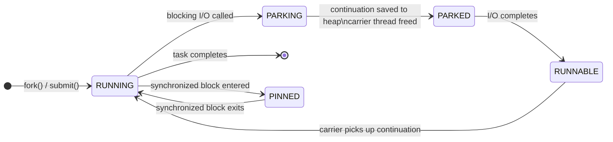
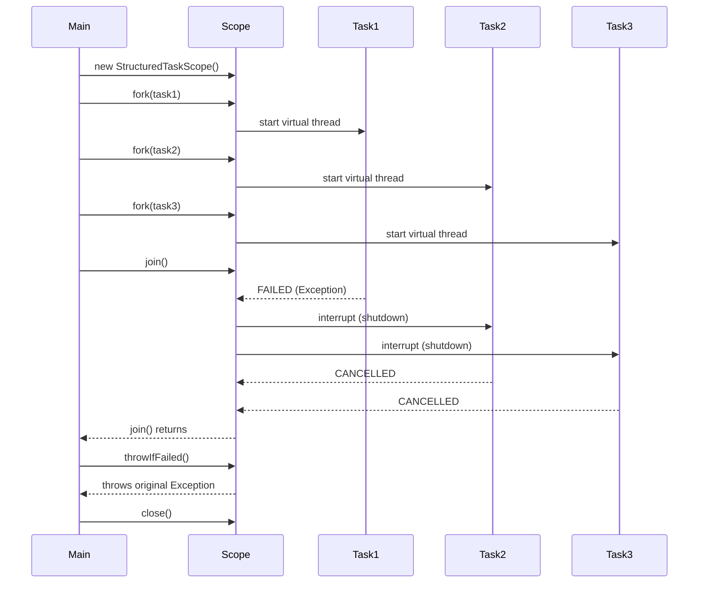

## Keywords in This File
{: .no_toc }

| # | Keyword | Weight |
|---|---|---|
| 1 | [Async Java - L3 Modern Java Async](#async-java---l3-modern-java-async) | medium |
| 2 | [Virtual Threads and Project Loom](#virtual-threads-and-project-loom) | medium |
| 3 | [Structured Concurrency](#structured-concurrency) | medium |

---

# Virtual Threads and Project Loom

---
id: AJA-016
title: Virtual Threads and Project Loom
category: Async Java
difficulty: ★★☆
interview_weight: high
asked_at: Senior
seniority: senior
status: draft
version: 1
---

### 🎯 Model Answer

**30 seconds:**
> Virtual threads (Java 21, Project Loom) are lightweight JVM-managed
> threads that make blocking I/O cheap. Unlike platform threads (which
> map 1:1 to OS threads), virtual threads are multiplexed onto a small
> pool of carrier threads. When a virtual thread blocks on I/O, the
> carrier thread is freed and picks up another virtual thread. The key
> benefit: you can write blocking-style code with the throughput of async.

**3 minutes:**
> Platform threads have three costs: OS thread creation (~1MB stack per
> thread), OS context switching (microseconds per switch), and OS scheduler
> overhead. At 10,000 concurrent connections, 10,000 platform threads consume
> ~10GB of RAM just for stacks.
>
> Virtual threads decouple JVM thread (virtual) from OS thread (carrier).
> Carrier threads (pool size = CPU count) run virtual threads. When a virtual
> thread blocks (Socket, JDBC, Object.wait), the JVM "mounts" the blocking
> code's continuation on the carrier for execution, then "unmounts" it when
> the virtual thread blocks and moves to another virtual thread.
>
> For I/O-bound workloads: replace thread pool executors with virtual thread
> executors (`Executors.newVirtualThreadPerTaskExecutor()`). Each request gets
> its own virtual thread. Blocking is cheap - no thread starvation.
>
> Limitations: pinning. A virtual thread is "pinned" to its carrier thread
> when executing inside `synchronized` blocks or calling native code. Pinning
> blocks the carrier thread. Monitor pinning with JFR events.

**Blank Mind Recovery:**

**(1) Restate:** "Virtual threads - lightweight JVM threads. When they block
on I/O, the carrier thread doesn't block. I'll anchor to the blocking analogy."

**(2) First principles:** "OS threads are expensive (1MB each). The problem
with blocking I/O is it wastes OS thread capacity. Virtual threads solve this
by moving 'waiting' off the OS thread - when a virtual thread blocks, the OS
thread continues running other virtual threads."

**(3) Bridge:** "Like a waiter who handles multiple tables. Instead of
standing at each table waiting for customers to decide (blocking), the waiter
takes an order, moves to the next table while the kitchen works, and comes
back when ready. Virtual threads let one carrier thread 'serve' thousands of
blocking operations."

---

### 📘 Concept Explanation

**What it is:**
Virtual threads (preview in Java 19-20, GA in Java 21) are JVM-managed
lightweight threads implemented in the JDK itself (not the OS). The JDK
multiplexes virtual threads onto a small pool of OS-backed "carrier threads."
When a virtual thread blocks on I/O, its continuation (stack frame) is
parked in heap memory, and the carrier thread is freed to run another
virtual thread.

**The problem it solves:**
Thread-per-request server model with blocking I/O requires one OS thread
per concurrent request. OS threads are expensive: ~1MB stack, OS scheduler
involvement, context switch overhead. At 10,000 concurrent requests, 10,000
OS threads exhaust RAM. Reactive/async models solved this with callbacks and
non-blocking I/O but at the cost of code complexity (callback hell,
CompletableFuture chains, Reactor pipelines).

Virtual threads deliver the scalability of reactive without the code
complexity: write simple blocking code, get async-scale throughput.

**How it works:**

```
Platform thread model:
  JVM Thread <--> OS Thread (1:1 mapping)
  10,000 concurrent requests = 10,000 OS threads

Virtual thread model:
  Virtual Thread (JVM) --> mounted on --> Carrier Thread (OS)
  N carrier threads (N = CPU count)
  M virtual threads (M can be millions)

  Virtual thread calls: Thread.sleep(1000) or socket.read()
  JVM action: unmount virtual thread from carrier
              carrier continues with another virtual thread
              when I/O completes: remount virtual thread on carrier
              continue execution (continuation passing)
```

> **Code walkthrough:** This example demonstrates the core pattern in action. The key mechanism shows how the concept works in practice. Study the structure to understand the essential behavior and common usage.

**Memory model:**
Virtual thread stacks start at 0 bytes (not pre-allocated). They grow
on-demand and are stored on the heap. A virtual thread with no stack
consumes only a small object overhead (~200-300 bytes). At 1 million
virtual threads: ~200-300 MB heap.

**Pinning:**
A virtual thread is "pinned" to its carrier thread when:
1. Executing inside a `synchronized` block or method
2. Calling native code (JNI) that blocks
3. Calling `Object.wait()` in a synchronized block

While pinned, the carrier thread is blocked just like a platform thread.
Pinning eliminates the benefit of virtual threads for that operation.

```java
// PINNED: carrier thread blocks during the synchronized block
synchronized(lock) {
    connection.query(sql); // blocks carrier thread while in sync
}

// UNPINNED: use ReentrantLock instead
ReentrantLock lock = new ReentrantLock();
lock.lock();
try {
    connection.query(sql); // virtual thread parks, carrier freed
} finally {
    lock.unlock();
}
```

> **Code walkthrough:** This example demonstrates the core pattern in action. The key mechanism shows how the concept works in practice. Study the structure to understand the essential behavior and common usage.

**JFR monitoring for pinning:**
```
-Djdk.tracePinnedThreads=full
or JFR event: jdk.VirtualThreadPinned
```

> **Code walkthrough:** This example demonstrates the core pattern in action. The key mechanism shows how the concept works in practice. Study the structure to understand the essential behavior and common usage.

**When to use virtual threads:**
- Thread-per-request I/O servers (HTTP, gRPC, database)
- High-concurrency services with blocking dependencies
- Migrating from thread pool executors without rewriting business logic

**When NOT to use virtual threads:**
- CPU-bound work (virtual threads do not help; carrier threads still saturate)
- Real-time/latency-critical: virtual thread scheduling adds small overhead
- When code holds synchronized locks during I/O (pinning)

**First-principles derivation:**
A blocking I/O operation pauses execution waiting for network or disk.
During this wait, the OS thread is "parked" doing nothing useful. Virtual
threads solve this by separating the logical thread (execution context) from
the OS thread. The execution context (stack, local variables) is stored in
heap. When blocking occurs, the execution context is parked in heap and the
OS thread executes another context. This is cooperative multitasking at the
JVM level, implemented via continuation passing style in the JDK's Thread API.

---

### 💻 Code Example

**Virtual threads for I/O-bound concurrency:**

```java
// 1. Simple virtual thread creation
Thread.ofVirtual()
    .name("my-vthread")
    .start(() -> System.out.println(
        "Running on: " + Thread.currentThread()));
// Prints: Running on: VirtualThread[#21,my-vthread]/runnable@...

// 2. Virtual thread executor (drop-in for blocking code)
ExecutorService vExecutor =
    Executors.newVirtualThreadPerTaskExecutor();

// Each task gets its own virtual thread - blocking is cheap
List<Future<String>> futures = IntStream.range(0, 10_000)
    .mapToObj(i -> vExecutor.submit(() -> {
        Thread.sleep(1000);  // blocks virtual thread, NOT carrier
        return "Done: " + i;
    }))
    .toList();
// 10,000 virtual threads, all sleeping simultaneously
// Carrier pool has CPU threads; all are free during I/O waits

// 3. HTTP server with virtual threads (Java 21 simple HTTP)
var server = HttpServer.create(
    new InetSocketAddress(8080), 0);
server.setExecutor(
    Executors.newVirtualThreadPerTaskExecutor());
// Each HTTP request handled in its own virtual thread
// JDBC blocking I/O in handlers is safe

// 4. Database query with virtual thread (Spring Boot 3.2+)
// application.properties:
// spring.threads.virtual.enabled=true
// -> Tomcat uses virtual threads automatically

// 5. Parallel I/O fan-out with virtual threads
List<String> results = IntStream.range(0, 100)
    .mapToObj(i -> (Callable<String>) () ->
        httpClient.send(buildRequest(i),
            HttpResponse.BodyHandlers.ofString()).body())
    .toList()
    .stream()
    .map(vExecutor::submit)
    .map(f -> { try { return f.get(); }
                catch (Exception e) { throw new RuntimeException(e); } })
    .toList();
// 100 concurrent HTTP calls, each on its own virtual thread
// No CompletableFuture, no callbacks - simple blocking code

// 6. Detecting pinning (JFR-based)
// Start JFR recording:
// -Djdk.tracePinnedThreads=full
// Triggers: jdk.VirtualThreadPinned event with stack trace
// Look for: synchronized blocks in hot I/O paths
```

> **Code walkthrough:** Pattern 1 shows the `Thread.ofVirtual()` builder API
> - virtual threads are created via the same Thread API, just with a builder.
> Pattern 2 is the most common migration pattern: replace
> `Executors.newFixedThreadPool(n)` with `newVirtualThreadPerTaskExecutor()`.
> Each task gets its own virtual thread; 10,000 sleeping tasks use ~300MB heap
> for stacks vs ~10GB for platform threads. Pattern 3 shows a Java 21 HTTP
> server using virtual thread executor - each request handler can use
> blocking JDBC without spawning OS threads. Pattern 5 demonstrates fan-out:
> 100 blocking HTTP calls submitted as tasks - no CompletableFuture machinery,
> just straightforward blocking code that scales due to virtual threads.

---

### 🎓 Answers by Seniority

**Junior / Mid:**
> Virtual threads are lightweight threads managed by the JVM. Unlike platform
> threads (backed by OS threads), virtual threads can block on I/O without
> wasting an OS thread. I create them with `Thread.ofVirtual()` or use
> `Executors.newVirtualThreadPerTaskExecutor()`. The main benefit is I can
> write simple blocking code and get high concurrency without needing reactive
> frameworks.

*Push deeper:* What is "pinning" and why does it matter?

---

**Senior / Staff:**
> Virtual threads change the cost model for blocking I/O: from O(OS threads)
> to O(heap memory). A million virtual threads sleeping consume ~300MB. A
> million platform threads consuming would require ~1TB - not feasible.
>
> In production, the migration path is gradual: replace
> `Executors.newFixedThreadPool(n)` with `newVirtualThreadPerTaskExecutor()`,
> use `ReentrantLock` instead of `synchronized` for I/O-adjacent locks, and
> enable JFR pinning events to detect `synchronized` blocks that block carriers.
>
> Spring Boot 3.2+ has `spring.threads.virtual.enabled=true` which configures
> Tomcat/Undertow to use virtual threads for request handling. This is the
> easiest migration path for Spring applications.
>
> When to stick with reactive (Project Reactor/WebFlux): when you need
> backpressure, streaming data processing, or Reactor-native operators
> (retryWhen, flatMap with maxConcurrency). Virtual threads don't provide
> backpressure - a fast producer still overwhelms a slow consumer.

*Push deeper (Staff):* The future interaction: virtual threads + Reactor.
Project Reactor can use `Schedulers.fromExecutor(newVirtualThreadPerTaskExecutor())`
as the boundedElastic replacement. This means `Mono.fromCallable(() -> jdbcCall)
.subscribeOn(vtScheduler)` runs the blocking call on a virtual thread instead
of a platform thread from the bounded pool. You get Reactor's operator
composability AND virtual thread scalability for blocking code.

---

### ⚠️ Common Misconceptions

**Misconception: "Virtual threads make CPU-bound code faster."**

Virtual threads solve the BLOCKING I/O scalability problem, not the CPU
throughput problem. A CPU-bound task running on a virtual thread still
requires a carrier thread. With N carrier threads (= CPU count), only N
CPU-bound tasks run simultaneously - same as `Executors.newFixedThreadPool(N)`.
Virtual threads do not add CPU capacity. For CPU-bound parallelism, the
parallel scheduler or fixed thread pool is correct. Virtual threads benefit
workloads where threads WAIT for I/O and there are many concurrent waiters.

---

### 🚨 Failure Modes and Diagnosis

**Failure: Virtual thread pinning stalls under load**

Symptom: high concurrency service that should benefit from virtual threads
still experiences thread starvation. JFR events show frequent
`jdk.VirtualThreadPinned`. Thread dump shows many carrier threads BLOCKED
in synchronized blocks.

Cause: hot I/O paths execute inside `synchronized` methods. The synchronized
block pins the virtual thread to the carrier thread, blocking it.

```java
// PINNED: common pattern in legacy connection pools (e.g., HikariCP)
public synchronized Connection getConnection() {
    // blocks inside synchronized
    return pool.borrow(); // I/O wait
    // ^ carrier thread blocked for entire duration
}

// JFR output:
// jdk.VirtualThreadPinned {
//   eventThread: VirtualThread[...] at synchronized block
//   carrier: ForkJoinWorkerThread#1
//   blocked for: 50ms
// }
```

> **Code walkthrough:** This example demonstrates the core pattern in action. The key mechanism shows how the concept works in practice. Study the structure to understand the essential behavior and common usage.

Mitigation:
1. Replace `synchronized` with `ReentrantLock` in I/O-adjacent code
2. Update to libraries that support virtual threads:
   - HikariCP 5.1+ supports virtual threads
   - JDBC drivers: PostgreSQL 42.6+ virtual thread aware
3. Use `-Djdk.tracePinnedThreads=full` in staging to identify all
   pinning locations before production deployment

---

### 🎯 Interview Deep-Dive

**Timing:** Medium ★★☆ - 9 questions minimum.

---

#### Q1 - How do virtual threads differ from platform threads internally?

**Platform threads:**
- Wrapper around an OS thread: 1:1 mapping
- Stack allocated upfront: typically 512KB to 1MB per thread
- OS scheduler controls CPU allocation
- Context switch = OS-level operation (microseconds, kernel involvement)

**Virtual threads:**
- JVM-managed: M:N mapping onto N carrier threads
- Stack starts at zero, grows on heap as needed
- JVM scheduler controls virtual thread execution
- Context switch = JVM continuation unmount/mount (sub-microsecond for
  the JVM part; I/O completion is still OS-managed)

Internal mechanism:
```
Virtual thread state machine:
  NEW -> STARTED -> RUNNING -> PARKING -> PARKED -> RUNNING
  RUNNING: mounted on carrier, executing
  PARKING: about to block (e.g., socket.read() called)
  PARKED: unmounted from carrier, continuation in heap
  RUNNING again: carrier picks up continuation when I/O completes
```

> **Code walkthrough:** This example demonstrates the core pattern in action. The key mechanism shows how the concept works in practice. Study the structure to understand the essential behavior and common usage.

*What separates good from great:* The continuation: when a virtual thread
parks, its execution state (stack, program counter, local variables) is
captured as a `Continuation` object stored on the heap. When the I/O
completes, the continuation is scheduled for execution on the carrier pool.
This is the same mechanism as `CompletableFuture` callback chains, but
implemented transparently by the JVM - the developer writes blocking code
and the JVM converts it to continuations automatically.

---

#### Q2 - What is a carrier thread and what limits their count?

Carrier threads are the OS-backed platform threads that execute virtual
threads. They form a ForkJoinPool with a fixed size.

Default size: `Runtime.getRuntime().availableProcessors()` (= CPU count).
Override: `-Djdk.virtualThreadScheduler.parallelism=N` or
`-Djdk.virtualThreadScheduler.maxPoolSize=N`.

```
2 CPUs = 2 carrier threads
  Virtual Thread 1 on Carrier 1 (running)
  Virtual Thread 2 on Carrier 2 (running)
  Virtual Thread 3: PARKED (I/O wait) - no carrier occupied
  Virtual Thread 4: PARKED (I/O wait) - no carrier occupied
  Virtual Thread 5: READY - queued for Carrier 1 or 2
```

> **Code walkthrough:** This example demonstrates the core pattern in action. The key mechanism shows how the concept works in practice. Study the structure to understand the essential behavior and common usage.

Carrier thread limits determine CPU-bound concurrency: 2 carrier threads
= 2 CPU-bound tasks running simultaneously. For I/O-bound tasks: thousands
can WAIT simultaneously using zero carrier thread time.

*What separates good from great:* Increasing carrier thread count beyond
CPU count does NOT help I/O-bound virtual threads - they're already parked
off the carrier. It CAN help if you have a mixed workload: some virtual
threads doing quick CPU work. The default (= CPU count) is optimal for
pure CPU work; slightly higher may help mixed workloads.

---

#### Q3 - How does virtual thread scheduling work?

Virtual threads use a work-stealing ForkJoinPool as their scheduler.
The pool size equals carrier thread count.

Scheduling flow:
1. Virtual thread is created and submitted to the ForkJoinPool as a task
2. ForkJoinPool assigns it to a carrier thread
3. Carrier thread executes the virtual thread's `Runnable`
4. If the virtual thread blocks on I/O: JVM calls `Continuation.yield()`
   which unmounts the virtual thread and parks the `Continuation` in heap
5. ForkJoinPool worker picks another virtual thread or work-steals
6. When the blocking operation completes: the continuation is submitted
   back to the ForkJoinPool as a new task

Work-stealing: if one carrier thread's queue is empty, it steals from
another carrier's queue. This provides load balancing across carriers.

```java
// Virtual thread scheduling is cooperative:
// blocking operations = yield points
// CPU loops without I/O = no yield = carrier thread monopolized
for (long i = 0; i < Long.MAX_VALUE; i++) {
    // no blocking -> no yield -> carrier monopolized
    // Thread.yield() can help if needed
}
```

> **Code walkthrough:** This example demonstrates the core pattern in action. The key mechanism shows how the concept works in practice. Study the structure to understand the essential behavior and common usage.

*What separates good from great:* The ForkJoinPool used for virtual thread
scheduling is separate from `ForkJoinPool.commonPool()`. Never submit
virtual thread tasks to `ForkJoinPool.commonPool()` directly - use
`Executors.newVirtualThreadPerTaskExecutor()` which routes to the dedicated
virtual thread scheduler.

---

#### Q4 - How do you migrate a Spring Boot application to virtual threads?

Spring Boot 3.2+ migration:

```yaml
# application.yaml
spring:
  threads:
    virtual:
      enabled: true
# Configures: Tomcat/Jetty/Undertow to use virtual thread executor
# Configures: @Async tasks to use virtual threads
# Configures: Spring MVC request handling to use virtual threads
```

> **Code walkthrough:** This example demonstrates the core pattern in action. The key mechanism shows how the concept works in practice. Study the structure to understand the essential behavior and common usage.

For lower Spring Boot versions:
```java
@Configuration
public class VirtualThreadConfig {
    @Bean
    public TomcatProtocolHandlerCustomizer<?>
            protocolHandlerVirtualThreadExecutor() {
        return ph -> ph.setExecutor(
            Executors.newVirtualThreadPerTaskExecutor());
    }

    @Bean(TaskExecutionAutoConfiguration.APPLICATION_TASK_EXECUTOR_BEAN_NAME)
    public AsyncTaskExecutor asyncTaskExecutor() {
        return new TaskExecutorAdapter(
            Executors.newVirtualThreadPerTaskExecutor());
    }
}
```

> **Code walkthrough:** This example demonstrates the core pattern in action. The key mechanism shows how the concept works in practice. Study the structure to understand the essential behavior and common usage.

JDBC considerations:
- HikariCP 5.1+: set `connection-timeout` conservatively (virtual threads
  make it easy to accumulate connections against pool limits)
- Pool size: virtual threads don't require larger JDBC pools; database
  connections are still finite

*What separates good from great:* The "thundering herd" risk: with
unlimited virtual thread creation, a traffic spike creates millions of
virtual threads simultaneously. They all try to acquire JDBC connections.
The connection pool has (say) 20 connections. 999,980 virtual threads
queue waiting for connections. Queuing is fine as long as the wait time
is bounded by connection-timeout. Set `connectionTimeout` to a reasonable
value (e.g., 10 seconds) and monitor connection pool wait time.

---

#### Q5 - What is thread-local contamination with virtual threads?

`ThreadLocal` is designed for long-lived platform threads where one
context is set and used throughout the thread's lifetime. With virtual
threads (which are short-lived and created per-task), ThreadLocal use
patterns can cause:

1. **Memory leaks:** ThreadLocals hold strong references. If a short-lived
   virtual thread sets ThreadLocal values and they're not removed, the
   reference chain VirtualThread -> ThreadLocalMap -> value prevents GC.

2. **Context contamination:** If virtual thread executors reuse threads
   (they don't by default, but some wrappers do), ThreadLocal values from
   a previous task may bleed into the next.

Mitigations:
```java
// Always clean up ThreadLocals in try-finally
public void handleRequest(Request req) {
    MDC.put("requestId", req.id());
    try {
        processRequest(req);
    } finally {
        MDC.clear(); // critical: prevent contamination
    }
}

// Java 21 ScopedValue (preview): structured alternative
ScopedValue<String> REQUEST_ID = ScopedValue.newInstance();
ScopedValue.where(REQUEST_ID, req.id())
    .run(() -> processRequest(req));
// Automatically cleaned up; no explicit remove needed
```

> **Code walkthrough:** This example demonstrates the core pattern in action. The key mechanism shows how the concept works in practice. Study the structure to understand the essential behavior and common usage.

*What separates good from great:* `ScopedValue` (Java 21 preview, targeting
GA in Java 23+) is the structured replacement for ThreadLocal in virtual
thread contexts. It is immutable per scope, automatically cleaned up at
scope exit, and designed for structured concurrency. When Java 23+ is
available, prefer ScopedValue over ThreadLocal for per-request context.

---

#### Q6 - How do virtual threads interact with reactive frameworks?

Three interaction models:

**Model 1: Replace reactive with virtual threads (simple I/O services)**
```java
// Instead of WebFlux + R2DBC:
@GetMapping("/user/{id}")
Mono<User> getUser(@PathVariable String id) {
    return Mono.fromCallable(() -> jdbcRepo.findById(id))
               .subscribeOn(Schedulers.boundedElastic());
}

// Use Spring MVC + virtual threads + JDBC:
@GetMapping("/user/{id}")
User getUser(@PathVariable String id) {
    return jdbcRepo.findById(id); // blocking, runs on virtual thread
}
// Tomcat with virtual thread executor handles the rest
```

> **Code walkthrough:** This example demonstrates the core pattern in action. The key mechanism shows how the concept works in practice. Study the structure to understand the essential behavior and common usage.

**Model 2: Use virtual threads as Reactor Scheduler**
```java
Scheduler vtScheduler = Schedulers.fromExecutorService(
    Executors.newVirtualThreadPerTaskExecutor(),
    "virtual-thread"
);
// Replace boundedElastic with this scheduler
Mono.fromCallable(() -> jdbcCall())
    .subscribeOn(vtScheduler)
    .map(r -> transform(r));
```

> **Code walkthrough:** This example demonstrates the core pattern in action. The key mechanism shows how the concept works in practice. Study the structure to understand the essential behavior and common usage.

**Model 3: Keep reactive for backpressure use cases**
Virtual threads don't provide backpressure. For streaming, fan-out with
concurrency control, or reactive composition: keep Reactor/WebFlux.
Virtual threads complement reactive at the boundaries (blocking adapters).

*What separates good from great:* Project Loom's structured concurrency
is closer in spirit to Reactor's sequential composition than raw virtual
threads. For request-handling code, virtual threads are simpler. For
streaming pipelines with backpressure, Reactor remains the right tool.
The decision is per use case, not per framework.

---

#### Q7 - What are the limitations of virtual threads?

1. **CPU-bound work**: virtual threads don't accelerate CPU-intensive
   computation. The carrier thread count limits CPU parallelism.

2. **Synchronized pinning**: any `synchronized` block or method pins the
   virtual thread to its carrier. High-contention synchronized code
   eliminates the concurrency benefit.

3. **ThreadLocal limitations**: short-lived virtual threads amplify
   ThreadLocal memory leak patterns. Requires discipline in cleanup.

4. **Native method blocking**: JNI calls that block (native socket
   implementations) pin the carrier thread.

5. **Library compatibility**: older libraries using `synchronized` for
   thread safety may cause pinning. Examples fixed in newer versions:
   - Java's built-in `InflaterInputStream` (fixed in Java 21)
   - Some database drivers (improved in PostgreSQL 42.6+, MySQL 8+)

6. **No backpressure**: no flow control mechanism like Reactive Streams.
   A fast producer can still overwhelm a slow consumer.

7. **Debugging**: virtual threads don't appear in traditional thread
   dumps the same way. Use `jcmd <pid> Thread.dump_to_file` in Java 21.

*What separates good from great:* Profiling virtual threads: traditional
profilers sample platform threads. For virtual threads, JFR (Java Flight
Recorder) is more accurate. JFR captures `VirtualThreadStart`,
`VirtualThreadEnd`, `VirtualThreadPinned`, and `VirtualThreadSubmitFailed`
events. This gives precise visibility into virtual thread lifecycle.

---

#### Q8 - How does structured concurrency relate to virtual threads?

Structured Concurrency (Java 21 preview, `java.util.concurrent.StructuredTaskScope`)
pairs with virtual threads to provide lifecycle-managed concurrent tasks:

```java
// StructuredTaskScope with virtual threads
String result = fetchData(userId);

String fetchData(String userId) throws Exception {
    try (var scope = new StructuredTaskScope.ShutdownOnFailure()) {
        StructuredTaskScope.Subtask<User> userTask =
            scope.fork(() -> fetchUser(userId)); // virtual thread
        StructuredTaskScope.Subtask<Orders> orderTask =
            scope.fork(() -> fetchOrders(userId)); // virtual thread

        scope.join();           // wait for all
        scope.throwIfFailed();  // propagate first failure

        return buildResponse(userTask.get(), orderTask.get());
    }
    // Scope exit: all subtasks are either done or cancelled
}
```

> **Code walkthrough:** This example demonstrates the core pattern in action. The key mechanism shows how the concept works in practice. Study the structure to understand the essential behavior and common usage.

Benefits over raw virtual threads + CompletableFuture:
- Automatic cancellation: if one subtask fails, scope cancels others
- Scope lifetime management: no leaked threads after the try block
- Clear ownership: subtasks cannot outlive the scope
- Better observability: subtasks are visible as child tasks in profilers

*What separates good from great:* `ShutdownOnSuccess` for racing tasks:
```java
try (var scope = new StructuredTaskScope.ShutdownOnSuccess<String>()) {
    scope.fork(() -> primaryService.call(id));
    scope.fork(() -> fallbackService.call(id));
    scope.join();
    return scope.result(); // first successful result
}
// Cancels the other task when one succeeds
```
> **Code walkthrough:** This example demonstrates the core pattern in action. The key mechanism shows how the concept works in practice. Study the structure to understand the essential behavior and common usage.

This is the "redundant request" pattern for latency reduction: send to
two services, use the first response, cancel the other.

---

#### Q9 - How do you benchmark and verify virtual thread benefit?

Three verification approaches:

1. **Thread count under load (JConsole/JMX):**
```
# Platform threads: threads = concurrent requests (high)
# Virtual threads: platform threads ≈ CPU count (low)
# Check with:
jcmd <pid> Thread.print | grep "platform\|carrier" | wc -l
```

> **Code walkthrough:** This example demonstrates the core pattern in action. The key mechanism shows how the concept works in practice. Study the structure to understand the essential behavior and common usage.

2. **Throughput test with k6/wrk:**
```
# Fixed thread pool server:
$ wrk -t4 -c1000 -d30s http://localhost:8080/blocking
Requests/sec: 1,200 (thread pool exhausted at 200 threads)

# Virtual thread server (same hardware):
$ wrk -t4 -c1000 -d30s http://localhost:8080/blocking
Requests/sec: 8,500 (no thread pool exhaustion)
```

> **Code walkthrough:** This example demonstrates the core pattern in action. The key mechanism shows how the concept works in practice. Study the structure to understand the essential behavior and common usage.

3. **JFR profiling:**
```java
// Enable in start flags:
// -XX:StartFlightRecording=duration=60s,filename=vt.jfr
// Analyze with: jfr print --events VirtualThreadPinned vt.jfr
```

> **Code walkthrough:** This example demonstrates the core pattern in action. The key mechanism shows how the concept works in practice. Study the structure to understand the essential behavior and common usage.

Microbenchmark (JMH comparison):
```java
@Benchmark
@BenchmarkMode(Mode.Throughput)
public void virtualThreadFanOut() throws Exception {
    try (var exec =
            Executors.newVirtualThreadPerTaskExecutor()) {
        var futures = IntStream.range(0, 1000)
            .mapToObj(i -> exec.submit(() -> {
                Thread.sleep(10);
                return i;
            })).toList();
        for (var f : futures) f.get();
    }
}
```

> **Code walkthrough:** This example demonstrates the core pattern in action. The key mechanism shows how the concept works in practice. Study the structure to understand the essential behavior and common usage.

*What separates good from great:* Microbenchmarks often don't capture
production benefits because they don't include real I/O wait times. The
real benefit shows under sustained high concurrency with actual blocking
operations (JDBC, HTTP). Benchmark with realistic workloads and connection
pool sizes that match production configuration.

---

### ⚖️ Comparison Table

**Virtual threads vs alternatives:**

| Aspect | Platform Thread Pool | Virtual Threads | Reactive (Reactor) |
|---|---|---|---|
| Blocking I/O | One thread per | Carrier free during I/O | Non-blocking (NIO) |
| Code style | Blocking (simple) | Blocking (simple) | Reactive (complex) |
| Throughput at scale | Limited by pool | Near-unlimited | Very high |
| Backpressure | None | None | Native |
| Debugging | Easy | Easy (mostly) | Complex (stack traces) |
| Library compat | Universal | Needs ReentrantLock | Reactive APIs only |
| CPU-bound work | Full parallel | Same as platform | Same |

---

### 🏛️ System Design

*(Omit: L3 ★★☆ entry. Architecture decisions at L5.)*

---

### 📊 Diagram

**Platform thread vs virtual thread under blocking I/O:**

```
Platform thread (OS thread):
  Thread: [work][ I/O wait 90% ][work]
  OS resource consumed during I/O wait = YES (wasted)

  10,000 concurrent I/O ops = 10,000 OS threads = ~10GB

Virtual thread (JVM managed):
  Carrier: [work][-----free-----][work]
  VThread: [work][ PARKED ]     [work]
  Carrier thread NOT consumed during I/O wait

  10,000 concurrent I/O ops = N carrier threads + heap
  N = CPU count; heap usage ~300MB for parked stacks
```



> **Diagram walkthrough:** The state diagram shows the virtual thread lifecycle.
> The key transition is RUNNING -> PARKING -> PARKED: when a virtual thread
> calls a blocking I/O operation, the JVM saves its execution state
> (continuation) to heap memory and the carrier thread is freed. This is the
> core efficiency gain - during the I/O wait, the carrier thread handles other
> virtual threads. PINNED is the problematic state: inside a `synchronized`
> block, the carrier thread is occupied for the full duration of the block.
> Minimizing PINNED time is the primary optimization target for virtual thread
> performance.

---
---

---

### 💻 Code Example

*(Omit: this concept does not have a programmatic interface that can be demonstrated in code. The conceptual explanation above is sufficient.)*


---

### 🏛️ System Design

*(Omit: system design diagram not applicable for this concept - see ★★★ keywords for full system design coverage.)*


---

### ⚖️ Comparison Table

*(Omit: this is a ★☆☆ foundational concept with no direct alternatives to compare - see higher-difficulty keywords for trade-off analysis.)*


---

### 📊 Diagram

*(Omit: no standalone visual diagram required for this concept - the explanations and code examples above provide sufficient clarity.)*


# Structured Concurrency

---
id: AJA-017
title: Structured Concurrency
category: Async Java
difficulty: ★★☆
interview_weight: high
asked_at: Senior
seniority: senior
status: draft
version: 1
---

### 🎯 Model Answer

**30 seconds:**
> Structured Concurrency (Java 21 preview) ensures concurrent tasks don't
> outlive the scope in which they were created. `StructuredTaskScope` is the
> key API: `fork()` starts subtasks as virtual threads, `join()` waits for
> all to complete, and the scope guarantees all subtasks are terminated when
> the scope closes. This eliminates thread leaks and makes error handling and
> cancellation automatic.

**3 minutes:**
> Unstructured concurrency with CompletableFuture has three problems: (1)
> tasks can outlive the code that spawned them, causing resource leaks;
> (2) cancellation is manual - `allOf.cancel()` doesn't cancel components;
> (3) error handling is complex - exceptions are wrapped and hard to trace.
>
> Structured Concurrency applies the same discipline as structured
> programming (blocks, no goto) to concurrency: tasks are children of the
> scope, the scope owns their lifecycle, and no task can escape the scope.
>
> Two built-in policies:
> - `ShutdownOnFailure`: cancels all subtasks if any fails; joins all;
>   rethrows the first failure. Use for fan-out where all results are needed.
> - `ShutdownOnSuccess<T>`: returns the first successful result; cancels
>   remaining subtasks. Use for hedged requests / racing services.
>
> Scope also enforces observability: subtasks appear as children in JFR and
> profilers, not as orphaned tasks.

**Blank Mind Recovery:**

**(1) Restate:** "Structured Concurrency - structured programming principles
applied to threads. Scope owns all subtasks. No subtask outlives the scope."

**(2) First principles:** "Unstructured: spawn tasks, lose track of them,
error handling scattered, cancellation manual. Structured: scope = owner,
all subtasks cancel when scope exits, one place to handle errors."

**(3) Bridge:** "Like function calls: a function's local variables can't
outlive the function. Structured Concurrency enforces the same for threads:
threads spawned inside a scope can't outlive the scope."

---

### 📘 Concept Explanation

**What it is:**
Structured Concurrency (`java.util.concurrent.StructuredTaskScope`, Java 21
preview, JEP 453) is a concurrency model where concurrent tasks are grouped
into a scope with a defined lifetime. All tasks spawned inside the scope are
terminated (cancelled) when the scope closes, either because all completed
or because an error or cancellation interrupted the scope.

**The problem it solves:**
Unstructured concurrency (CompletableFuture, raw Thread.start) allows tasks
to run beyond the code that spawned them. This causes: (1) resource leaks
when tasks hold connections or locks; (2) orphaned tasks consuming CPU after
results are no longer needed; (3) error handling scattered across multiple
callbacks; (4) no clear parent-child relationship in profilers.

**How it works:**

```
StructuredTaskScope lifecycle:
  try (scope) {
    task1 = scope.fork(callable1)  // starts virtual thread 1
    task2 = scope.fork(callable2)  // starts virtual thread 2
    scope.join()                   // wait per policy
    scope.throwIfFailed()          // check errors
    // use task1.get(), task2.get() here
  }
  // scope closed: all remaining tasks cancelled
  // no task can outlive the try block

ShutdownOnFailure policy:
  - If any task fails -> cancel all others -> rethrow exception
  - All tasks must succeed for join to return normally

ShutdownOnSuccess<T> policy:
  - First successful task -> cancel all others -> return result
  - Racing/hedging pattern
```

> **Code walkthrough:** This example demonstrates the core pattern in action. The key mechanism shows how the concept works in practice. Study the structure to understand the essential behavior and common usage.

**Comparison with CompletableFuture.allOf:**

```
CompletableFuture.allOf:
  - allOf fails fast: combined CF fails on first failure
  - BUT component futures continue running! (resource leak)
  - allOf.cancel() does NOT cancel components
  - Error handling: CompletionException wrapping

StructuredTaskScope.ShutdownOnFailure:
  - Scope fails: all tasks cancelled via thread interruption
  - scope.join() returns only when all tasks done/cancelled
  - Error: scope.throwIfFailed() with clean exception unwrapping
  - Subtask result: subtask.get() or subtask.resultNow()
```

> **Code walkthrough:** This example demonstrates the core pattern in action. The key mechanism shows how the concept works in practice. Study the structure to understand the essential behavior and common usage.

**When to use each Scope policy:**

```
ShutdownOnFailure:
  Use for: fan-out where ALL results needed
  Example: fetch user + orders + preferences for response
  Behavior: all-or-nothing; first failure cancels all

ShutdownOnSuccess:
  Use for: racing/hedging; first success wins
  Example: send to primary and replica; use first response
  Behavior: first success returns; others cancelled

Custom scope (extend StructuredTaskScope):
  Use for: partial results with threshold (3 of 5 must succeed)
  Example: quorum-based reads from replicas
```

> **Code walkthrough:** This example demonstrates the core pattern in action. The key mechanism shows how the concept works in practice. Study the structure to understand the essential behavior and common usage.

**First-principles derivation:**
Structured programming replaced goto with structured control flow
(if/else, loops, function calls). This made programs analyzable: a function's
control flow is contained in the function. Structured Concurrency does the
same for threads: by requiring subtasks to complete within the scope, the
concurrency structure is analyzable. Like a function that must return before
the caller continues, a scope must complete (all tasks done or cancelled)
before the using code proceeds.

---

### 💻 Code Example

**ShutdownOnFailure fan-out and ShutdownOnSuccess racing:**

```java
// 1. Fan-out: all results needed (ShutdownOnFailure)
Response buildPageResponse(String userId) throws Exception {
    try (var scope =
            new StructuredTaskScope.ShutdownOnFailure()) {

        var userTask =
            scope.fork(() -> userService.fetch(userId));
        var orderTask =
            scope.fork(() -> orderService.fetchRecent(userId));
        var prefTask =
            scope.fork(() -> prefService.fetch(userId));

        scope.join()          // wait for all to complete
             .throwIfFailed(); // rethrow first failure (unwrapped)

        // All three succeeded:
        return Response.of(
            userTask.get(),    // resultNow() also available
            orderTask.get(),
            prefTask.get());
    }
    // If any failed: others were cancelled
    // try block exits cleanly; no orphaned threads
}

// 2. Racing: first success wins (ShutdownOnSuccess)
String fetchFromFastestReplica(String key) throws Exception {
    try (var scope =
            new StructuredTaskScope.ShutdownOnSuccess<String>()) {

        scope.fork(() -> replica1.fetch(key));
        scope.fork(() -> replica2.fetch(key));
        scope.fork(() -> replica3.fetch(key));

        scope.join(); // returns when first succeeds

        return scope.result(); // first successful result
    }
    // Two losing tasks automatically cancelled
}

// 3. Subtask result states
try (var scope =
        new StructuredTaskScope.ShutdownOnFailure()) {
    var task = scope.fork(() -> computeResult());
    scope.join().throwIfFailed();

    // After join + throwIfFailed:
    // task.state() == Subtask.State.SUCCESS
    task.get();       // returns result immediately
    task.resultNow(); // same; throws if not SUCCESS
    // task.exceptionNow(); // throws if not FAILED
}

// 4. Structured Concurrency with timeout
Response buildWithTimeout(String userId) throws Exception {
    try (var scope =
            new StructuredTaskScope.ShutdownOnFailure()) {
        var userTask = scope.fork(() -> userService.fetch(userId));
        var dataTask = scope.fork(() -> dataService.fetch(userId));

        scope.joinUntil(Instant.now().plusSeconds(5)); // timeout

        if (scope.isShutdown()) {
            // Timeout or failure before both tasks completed
            throw new TimeoutException("Page load timed out");
        }
        scope.throwIfFailed();
        return Response.of(userTask.get(), dataTask.get());
    }
}
```

> **Code walkthrough:** Pattern 1 is the canonical fan-out use case: three
> service calls in parallel, all required. `scope.join().throwIfFailed()` is
> the completion idiom - `join` waits for all tasks per the policy, and
> `throwIfFailed` propagates the first exception (unwrapped from
> CompletionException). If any task fails, ShutdownOnFailure cancels the
> others via thread interruption, then `throwIfFailed` re-throws the original
> exception. Pattern 2 shows racing: three replicas queried simultaneously;
> `scope.result()` returns the first success; the other two tasks are
> automatically cancelled. Pattern 4 adds a timeout via `joinUntil` with an
> `Instant` deadline - the scope shuts down if not all tasks complete within
> the deadline.

---

### 🎓 Answers by Seniority

**Junior / Mid:**
> Structured Concurrency is a Java 21 preview feature that ensures concurrent
> tasks complete within the scope they were started in. I use `StructuredTaskScope`
> to fork tasks as virtual threads, then `join()` waits for them. The
> `ShutdownOnFailure` policy automatically cancels other tasks if any one fails.
> This is cleaner than CompletableFuture.allOf because cancellation is automatic
> and error handling is straightforward.

*Push deeper:* What happens to the other subtasks if one task in a
ShutdownOnFailure scope throws an exception?

---

**Senior / Staff:**
> Structured Concurrency addresses the fundamental problem with unstructured
> concurrent code: tasks can escape their containing scope, creating orphaned
> threads that leak resources. With StructuredTaskScope, the try-with-resources
> guarantees that all subtasks are terminated when the scope closes.
>
> The two policies map to common patterns: ShutdownOnFailure is all-or-nothing
> fan-out (same semantics as CompletableFuture.allOf but with automatic
> cancellation). ShutdownOnSuccess is hedged request / racing (e.g., send to
> primary and backup, use first response, cancel the loser).
>
> For production, the key advantages over CompletableFuture: (1) no subtask
> outlives the scope - memory is bounded; (2) exception handling is simplified
> - `throwIfFailed()` propagates the original exception type cleanly; (3) JFR
> and profiler support - subtasks appear as children of the scope in flame
> graphs; (4) timeout via `joinUntil(Instant)` with automatic task cancellation.

*Push deeper (Staff):* Custom scope for partial-success patterns:
```java
class QuorumScope<T> extends StructuredTaskScope<T> {
    private final int quorum;
    private final List<T> results = new CopyOnWriteArrayList<>();

    protected void handleComplete(Subtask<? extends T> task) {
        if (task.state() == State.SUCCESS) {
            results.add(task.get());
            if (results.size() >= quorum) shutdown();
        }
    }
    List<T> results() { return results; }
}
// Shuts down when quorum results collected; remaining tasks cancelled
```
> **Code walkthrough:** This example demonstrates the core pattern in action. The key mechanism shows how the concept works in practice. Study the structure to understand the essential behavior and common usage.

This enables quorum reads from distributed replicas with automatic
cancellation when enough results arrive.

---

### ⚠️ Common Misconceptions

**Misconception: "Structured Concurrency is just CompletableFuture.allOf."**

`CompletableFuture.allOf` fails fast (the combined CF fails when any
component fails) but does NOT cancel the other running futures. They
continue consuming resources. `StructuredTaskScope.ShutdownOnFailure`
actually CANCELS all other tasks via thread interruption when one fails.
The tasks stop executing (assuming they check interrupted status), freeing
their resources immediately. This is the fundamental lifecycle management
difference. allOf is a composition primitive; StructuredTaskScope is a
structured lifecycle owner.

---

### 🚨 Failure Modes and Diagnosis

**Failure: Uncancellable subtasks ignore shutdown in scope**

Symptom: `ShutdownOnFailure` scope fails, other tasks continue running
past scope exit. Resource leak - threads, connections, locks held after
the using code has moved on.

Cause: subtask code does not respond to thread interruption. Scope
cancellation works by interrupting virtual threads. Code that catches and
ignores `InterruptedException` without restoring the interrupt flag or
re-throwing will ignore the cancellation signal.

```java
// WRONG: swallows interruption
try (var scope = new StructuredTaskScope.ShutdownOnFailure()) {
    scope.fork(() -> {
        while (true) {
            try {
                Thread.sleep(100); // blocking - interruptible
                doWork();
            } catch (InterruptedException e) {
                // BUG: swallow interrupt -> task ignores cancellation!
                log.debug("Interrupted, continuing...");
            }
        }
    });
    // ...
}

// CORRECT: propagate interruption
scope.fork(() -> {
    while (!Thread.currentThread().isInterrupted()) {
        try {
            Thread.sleep(100);
            doWork();
        } catch (InterruptedException e) {
            Thread.currentThread().interrupt(); // restore flag
            return null; // clean exit on cancellation
        }
    }
    return null;
});
```

> **Code walkthrough:** This example demonstrates the core pattern in action. The key mechanism shows how the concept works in practice. Study the structure to understand the essential behavior and common usage.

For long-running tasks that cannot be interrupted: use timeouts and
check `scope.isShutdown()` periodically as an alternative exit condition.

---

### 🎯 Interview Deep-Dive

**Timing:** Medium ★★☆ - 9 questions minimum.

---

#### Q1 - What is the "structured" in Structured Concurrency?

"Structured" comes from "structured programming": the principle that
control flow should be organized hierarchically, with clear entry and
exit points. Goto statements were "unstructured" because they could
jump anywhere, making code flow hard to follow.

Structured Concurrency applies the same principle to threads:
- Unstructured: threads can be spawned from anywhere and outlive
  any containing scope
- Structured: tasks are children of a scope; the scope is a bounded
  unit; no task can outlive the scope

Properties guaranteed by structured concurrency:
1. **Containment**: a task cannot outlive its scope
2. **Error propagation**: failures in subtasks propagate to the scope
3. **Cancellation**: scope shutdown cancels all outstanding subtasks
4. **Observability**: task hierarchy matches code hierarchy

```java
// Structured: task hierarchy = code hierarchy
try (var scope = ...) {
    var t1 = scope.fork(task1);
    var t2 = scope.fork(task2);
    scope.join();
    // both t1 and t2 are done here - guaranteed
}
// no tasks running here - guaranteed
```

> **Code walkthrough:** This example demonstrates the core pattern in action. The key mechanism shows how the concept works in practice. Study the structure to understand the essential behavior and common usage.

*What separates good from great:* The "nursery" metaphor (from Trio Python):
a scope is a nursery where tasks are born and must complete before leaving.
The nursery closes only when all its children are done. Java's
`StructuredTaskScope` implements this nursery pattern, borrowed from research
in structured concurrency theory.

---

#### Q2 - How does ShutdownOnFailure differ from ShutdownOnSuccess?

**ShutdownOnFailure:**
- Policy: cancel and shut down scope when any task FAILS
- `join()`: waits until all tasks complete OR any fails
- `throwIfFailed()`: rethrows the first failure (original exception, unwrapped)
- Use case: all-or-nothing fan-out; all results required
- Example: fetch user + orders + inventory; any failure = abort

**ShutdownOnSuccess<T>:**
- Policy: cancel and shut down scope when any task SUCCEEDS
- `join()`: waits until any task succeeds OR all fail
- `result()`: returns the first successful result
- Use case: racing/hedging; first success wins
- Example: redundant HTTP requests to primary + backup; use first response

```java
// ShutdownOnFailure: need all three
try (var s = new StructuredTaskScope.ShutdownOnFailure()) {
    var a = s.fork(fetchA);
    var b = s.fork(fetchB);
    var c = s.fork(fetchC);
    s.join().throwIfFailed();
    // a, b, c all succeeded
    return combine(a.get(), b.get(), c.get());
}

// ShutdownOnSuccess: first wins
try (var s =
        new StructuredTaskScope.ShutdownOnSuccess<String>()) {
    s.fork(() -> primary.get(key));
    s.fork(() -> backup.get(key));
    s.join();
    return s.result(); // first successful string result
}
```

> **Code walkthrough:** This example demonstrates the core pattern in action. The key mechanism shows how the concept works in practice. Study the structure to understand the essential behavior and common usage.

*What separates good from great:* `ShutdownOnSuccess` with fallback for
all failures:
```java
try {
    try (var s = new StructuredTaskScope.ShutdownOnSuccess<R>()) {
        s.fork(() -> primary.call());
        s.fork(() -> backup.call());
        s.join();
        return s.result(); // may throw if both failed
    }
} catch (ExecutionException all_failed) {
    return defaultValue();
}
```
> **Code walkthrough:** This example demonstrates the core pattern in action. The key mechanism shows how the concept works in practice. Study the structure to understand the essential behavior and common usage.

`s.result()` throws `ExecutionException` if all subtasks failed. The outer
catch provides a final fallback.

---

#### Q3 - How do you handle partial results (not all-or-nothing)?

Custom scope by extending `StructuredTaskScope`:

```java
class AtLeastN<T> extends StructuredTaskScope<T> {
    private final int n;
    private final List<T> results =
        new CopyOnWriteArrayList<>();
    private final List<Throwable> errors =
        new CopyOnWriteArrayList<>();

    AtLeastN(int n) { this.n = n; }

    @Override
    protected void handleComplete(Subtask<? extends T> task) {
        if (task.state() == State.SUCCESS) {
            results.add(task.get());
            if (results.size() >= n) shutdown(); // enough
        } else {
            errors.add(task.exception());
        }
    }

    List<T> results() {
        if (results.size() < n)
            throw new InsufficientResultsException(
                "Got " + results.size() + ", needed " + n,
                errors);
        return results;
    }
}

// Usage: quorum read from 5 replicas, need 3
try (var scope = new AtLeastN<Data>(3)) {
    replicas.forEach(r -> scope.fork(() -> r.get(key)));
    scope.join();
    return scope.results(); // 3 results from fastest replicas
    // remaining 2 replicas automatically cancelled
}
```

> **Code walkthrough:** This example demonstrates the core pattern in action. The key mechanism shows how the concept works in practice. Study the structure to understand the essential behavior and common usage.

*What separates good from great:* The `handleComplete` method is called from
subtask threads - it must be thread-safe. `CopyOnWriteArrayList` ensures
thread-safe collection. The `shutdown()` call is also thread-safe (it's
inherited from StructuredTaskScope). The custom scope pattern enables
arbitrary completion strategies beyond the two built-in ones.

---

#### Q4 - How does task cancellation work in StructuredTaskScope?

Cancellation flow:
1. `scope.shutdown()` is called (either by policy or by user)
2. Scope sets its "shutdown" flag
3. All forked subtasks that are still running receive a thread interrupt
4. Subtasks that are blocked on interruptible operations receive
   `InterruptedException`
5. `scope.join()` returns when all interrupted subtasks have terminated

Requirements for cancellation to work:
- Subtask code must respond to interrupts
- Blocking calls (Thread.sleep, I/O) are automatically interruptible
- Non-blocking CPU loops must check `Thread.interrupted()` or
  `Thread.currentThread().isInterrupted()`

```java
// Self-cancelling long computation
scope.fork(() -> {
    for (int i = 0; i < 1_000_000; i++) {
        if (Thread.currentThread().isInterrupted()) {
            return null; // clean exit on cancellation
        }
        compute(data[i]);
    }
    return result;
});
```

> **Code walkthrough:** This example demonstrates the core pattern in action. The key mechanism shows how the concept works in practice. Study the structure to understand the essential behavior and common usage.

*What separates good from great:* The difference between `Thread.interrupted()`
(clears the flag) and `Thread.currentThread().isInterrupted()` (does not
clear): use `isInterrupted()` for checking without side effects. Use
`Thread.interrupted()` only when you're about to handle and clear the
interrupted state.

---

#### Q5 - How do you combine Structured Concurrency with virtual threads?

`StructuredTaskScope.fork()` always creates a virtual thread for the subtask
(as of Java 21 preview). The two features are complementary:

```java
// fork() creates a virtual thread internally:
// Thread.ofVirtual().start(subtask)
// No configuration needed; virtual by default

// For blocking I/O subtasks - virtual threads make this efficient
try (var scope =
        new StructuredTaskScope.ShutdownOnFailure()) {
    // Each fork is a virtual thread: blocking is cheap
    var db1 = scope.fork(() -> jdbcQuery1()); // virtual thread
    var db2 = scope.fork(() -> jdbcQuery2()); // virtual thread
    var http = scope.fork(() -> httpClient.send(...)); // virtual thread

    scope.join().throwIfFailed();
    return combine(db1.get(), db2.get(), http.get());
}
// No Reactor, no CompletableFuture, no callbacks
// Simple blocking code with virtual thread scalability
```

> **Code walkthrough:** This example demonstrates the core pattern in action. The key mechanism shows how the concept works in practice. Study the structure to understand the essential behavior and common usage.

Performance characteristics:
- 3 JDBC calls in parallel: scope overhead is minimal (~microseconds)
- Virtual thread creation cost: ~1-2 microseconds per fork
- Memory: ~200-300 bytes per virtual thread stack base
- At 10,000 concurrent scopes with 3 subtasks each: 30,000 virtual threads
  using ~10MB stack base memory (vs 30,000 platform threads = ~15-30GB)

*What separates good from great:* The interaction with Spring Boot: when
`spring.threads.virtual.enabled=true`, the application container (Tomcat)
uses virtual threads for HTTP request handling. Each HTTP request handler
can then create its own `StructuredTaskScope` for parallel service calls.
This gives: virtual thread per HTTP request + structured fan-out per handler
= full lifecycle management at two levels.

---

#### Q6 - How does error handling compare to CompletableFuture?

**CompletableFuture error handling:**
```java
CompletableFuture.allOf(f1, f2, f3)
    .exceptionally(ex -> {
        // ex is CompletionException wrapping the original
        Throwable cause = ex.getCause(); // unwrap once
        // but which task failed? Not directly visible
        handleError(cause);
        return null;
    });
// f2 and f3 still running after f1 failed!
```

> **Code walkthrough:** This example demonstrates the core pattern in action. The key mechanism shows how the concept works in practice. Study the structure to understand the essential behavior and common usage.

**StructuredTaskScope error handling:**
```java
try (var scope =
        new StructuredTaskScope.ShutdownOnFailure()) {
    var t1 = scope.fork(task1);
    var t2 = scope.fork(task2);
    var t3 = scope.fork(task3);

    scope.join().throwIfFailed();
    // throwIfFailed() throws original exception type directly:
    // IOException, SQLException, custom exceptions - all preserved
    // No CompletionException wrapper to unwrap
} catch (IOException e) {
    // Original exception type, clean stack trace
    handleDatabaseError(e);
} catch (InterruptedException e) {
    Thread.currentThread().interrupt();
    throw e;
}
```

> **Code walkthrough:** This example demonstrates the core pattern in action. The key mechanism shows how the concept works in practice. Study the structure to understand the essential behavior and common usage.

Exception type preservation is the key advantage: `throwIfFailed()` throws
the ORIGINAL exception type (via `Throwable#addSuppressed` or direct
rethrow), not wrapped in CompletionException.

*What separates good from great:* When multiple subtasks fail, only the
first failure is thrown by `throwIfFailed()`. The others are attached as
suppressed exceptions:
```java
try {
    scope.join().throwIfFailed();
} catch (Exception e) {
    for (Throwable suppressed : e.getSuppressed()) {
        log.error("Also failed: {}", suppressed.getMessage());
    }
}
```
> **Code walkthrough:** This example demonstrates the core pattern in action. The key mechanism shows how the concept works in practice. Study the structure to understand the essential behavior and common usage.

This gives visibility into ALL failures, not just the first.

---

#### Q7 - How do you add a timeout to a structured concurrency scope?

`joinUntil(Instant deadline)` adds a deadline to the scope:

```java
try (var scope =
        new StructuredTaskScope.ShutdownOnFailure()) {
    var task1 = scope.fork(fetchService1);
    var task2 = scope.fork(fetchService2);

    // Wait at most 5 seconds for all tasks
    scope.joinUntil(Instant.now().plusSeconds(5));

    scope.throwIfFailed(); // rethrow task failures

    // Check if tasks completed (vs timeout)
    if (task1.state() != Subtask.State.SUCCESS
            || task2.state() != Subtask.State.SUCCESS) {
        throw new TimeoutException(
            "Subtasks did not complete within 5 seconds");
    }

    return Response.of(task1.get(), task2.get());
}
```

> **Code walkthrough:** This example demonstrates the core pattern in action. The key mechanism shows how the concept works in practice. Study the structure to understand the essential behavior and common usage.

On timeout: `joinUntil` returns, tasks that haven't completed are
still running. They are NOT automatically cancelled unless the scope
is explicitly shut down. The scope's `close()` (try-with-resources
exit) cancels them.

*What separates good from great:* `joinUntil` returning doesn't mean
tasks are done - it means the deadline was reached. Always check
subtask state after `joinUntil`:
- `Subtask.State.SUCCESS`: completed successfully
- `Subtask.State.FAILED`: completed with exception
- `Subtask.State.UNAVAILABLE`: still running (timed out)

Handle each state explicitly rather than assuming all completed.

---

#### Q8 - How does Structured Concurrency compare to reactive Reactor?

| Aspect | StructuredTaskScope | Reactor (Flux/Mono.zip) |
|---|---|---|
| Code style | Imperative/blocking | Declarative/functional |
| Backpressure | None | Native |
| Cancellation | Thread interruption (auto) | Subscription cancel |
| Error handling | Original exception types | CompletionException |
| Streaming | No | Yes (Flux) |
| Composability | Limited (no operators) | Rich (map, filter, retry) |
| Learning curve | Low (familiar syntax) | High (reactive concepts) |
| Observability | JFR subtask hierarchy | Custom hooks |

Decision guide:
- Request-response with parallel I/O: StructuredTaskScope (simpler)
- Streaming data processing with backpressure: Reactor
- Fan-out for page assembly: StructuredTaskScope
- Kafka consumer pipeline: Reactor Kafka
- Hedged requests: ShutdownOnSuccess
- Retry with backoff: Reactor retryWhen()

*What separates good from great:* The two can compose. For a reactive
pipeline that needs a structured parallel lookup:
```java
Mono<Response> pipeline = Mono.fromCallable(() -> {
    try (var scope =
            new StructuredTaskScope.ShutdownOnFailure()) {
        var t1 = scope.fork(fetchA);
        var t2 = scope.fork(fetchB);
        scope.join().throwIfFailed();
        return combine(t1.get(), t2.get());
    }
}).subscribeOn(Schedulers.boundedElastic());
// Structured lookup inside a reactive pipeline
```

> **Code walkthrough:** This example demonstrates the core pattern in action. The key mechanism shows how the concept works in practice. Study the structure to understand the essential behavior and common usage.

---

#### Q9 - What are the observability benefits of Structured Concurrency?

1. **JFR task hierarchy:**
   JFR captures the parent-child relationship between scopes and subtasks.
   Flame graphs show structured task hierarchy matching code structure.
   Profilers (e.g., JDK Mission Control) display task trees, not flat
   thread lists.

2. **Thread naming:**
   Subtasks created by `scope.fork()` are virtual threads. Custom naming:
   ```java
   ThreadFactory named = Thread.ofVirtual()
       .name("user-fetch-", 0)
       .factory();
   // StructuredTaskScope currently uses default virtual thread factory
   // Custom ThreadFactory support in future versions
   ```

> **Code walkthrough:** This example demonstrates the core pattern in action. The key mechanism shows how the concept works in practice. Study the structure to understand the essential behavior and common usage.

3. **Shutdown visibility:**
   `scope.isShutdown()` is true when the scope has been shut down.
   Log or metric on scope shutdown to track failure rates.

4. **Subtask state inspection:**
   After `scope.join()`, iterate subtasks to analyze outcomes:
   ```java
   List<Subtask<Result>> tasks = new ArrayList<>();
   tasks.add(scope.fork(task1));
   tasks.add(scope.fork(task2));
   scope.join();
   tasks.forEach(t ->
       metrics.record(t.state().name(), timer));
   ```

> **Code walkthrough:** This example demonstrates the core pattern in action. The key mechanism shows how the concept works in practice. Study the structure to understand the essential behavior and common usage.

*What separates good from great:* Distributed tracing with Structured
Concurrency: trace context (traceId, spanId) must be propagated into
subtasks. Since subtasks are new virtual threads, ThreadLocal-based trace
context (MDC) is NOT inherited. Use `Scoped Values` or explicitly capture
and set:
```java
String traceId = MDC.get("traceId"); // capture from current thread
scope.fork(() -> {
    MDC.put("traceId", traceId);   // set in subtask thread
    try { return fetchData(); }
    finally { MDC.remove("traceId"); }
});
```

> **Code walkthrough:** This example demonstrates the core pattern in action. The key mechanism shows how the concept works in practice. Study the structure to understand the essential behavior and common usage.

---

### ⚖️ Comparison Table

**Structured Concurrency scope policies:**

| Policy | Shuts down on | Returns | Use case |
|---|---|---|---|
| `ShutdownOnFailure` | First failure | Void (check throwIfFailed) | All-or-nothing fan-out |
| `ShutdownOnSuccess<T>` | First success | T (first result) | Hedging, racing |
| Custom scope | Custom condition | Custom | Quorum, partial results |
| No shutdown policy | Manual only | Void | Fully custom control |

---

### 🏛️ System Design

*(Omit: L3 ★★☆ entry. Architecture decisions at L5.)*

---

### 📊 Diagram

**StructuredTaskScope lifecycle vs CompletableFuture.allOf:**

```
CompletableFuture.allOf:
  t0: spawn t1, t2, t3
  t1: [==work==FAIL]
  t2: [==work========continues==]  <- still running!
  t3: [==work========continues==]  <- still running!
  allOf: fails at t1's failure
  BUT t2, t3 continue until they finish (resource leak)

StructuredTaskScope.ShutdownOnFailure:
  t0: fork t1, t2, t3
  t1: [==work==FAIL]
  t2: [==work==CANCEL] <- interrupted at shutdown
  t3: [==work==CANCEL] <- interrupted at shutdown
  scope.join(): returns after all cancelled
  scope close: clean, no orphaned threads
```



> **Diagram walkthrough:** The sequence shows the lifecycle advantage of
> StructuredTaskScope over CompletableFuture.allOf. When Task1 fails, the scope
> immediately sends interrupt signals to Task2 and Task3. Both acknowledge the
> cancellation and terminate cleanly. The scope's `join()` returns only after
> all three tasks are in a terminal state (SUCCESS, FAILED, or CANCELLED).
> By the time `throwIfFailed()` is called, no orphaned threads exist. This
> guaranteed cleanup is impossible with `CompletableFuture.allOf`, which fails
> fast but leaves other futures running.

---

### 💻 Code Example

*(Omit: this concept does not have a programmatic interface that can be demonstrated in code. The conceptual explanation above is sufficient.)*


---

### 🏛️ System Design

*(Omit: system design diagram not applicable for this concept - see ★★★ keywords for full system design coverage.)*


---

### ⚖️ Comparison Table

*(Omit: this is a ★☆☆ foundational concept with no direct alternatives to compare - see higher-difficulty keywords for trade-off analysis.)*


---

### 📊 Diagram

*(Omit: no standalone visual diagram required for this concept - the explanations and code examples above provide sufficient clarity.)*


