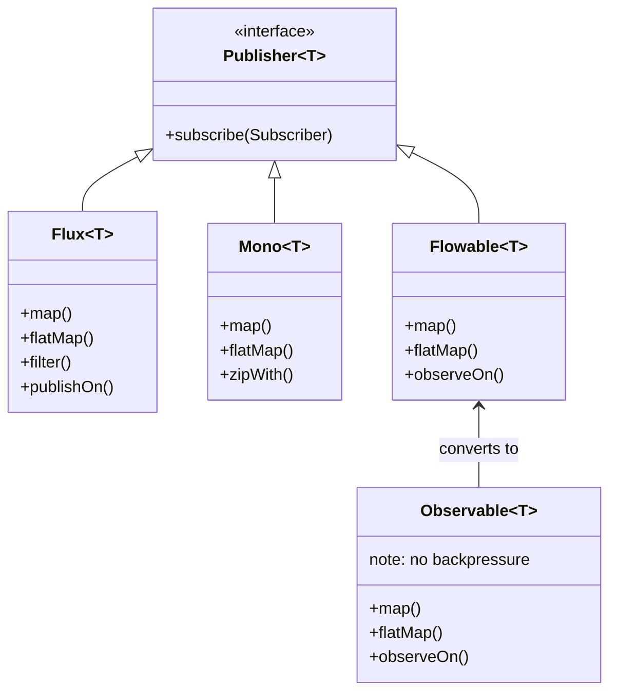

# Async Java - L3 Reactive Frameworks

---

# Spring WebFlux Architecture

---
id: AJA-021
title: Spring WebFlux Architecture
category: Async Java
difficulty: ★★☆
interview_weight: high
asked_at: Mid-Senior
seniority: senior
status: draft
version: 1
---

### 🎯 Model Answer

**30 seconds:**
> Spring WebFlux is Spring's non-blocking web framework built on Project
> Reactor and Netty. Unlike Spring MVC (which uses one thread per request
> with Servlet API), WebFlux uses event-loop threads and reactive types
> (Mono/Flux) to serve thousands of concurrent connections on a small thread
> pool. The stack: Netty event loop -> HttpHandler -> DispatcherHandler ->
> reactive controllers returning Mono/Flux.

**3 minutes:**
> Spring WebFlux was introduced in Spring 5 as a parallel to Spring MVC.
> They share many programming models (annotations like `@GetMapping`) but
> differ fundamentally in execution model.
>
> **Spring MVC**: Servlet API, one thread per request (from a thread pool),
> blocking I/O. The thread is occupied for the full request duration. Works
> well for CPU-bound or low-to-moderate concurrency. Connection limit =
> thread pool size.
>
> **Spring WebFlux**: Reactive API, Netty event loops, non-blocking I/O.
> A small number of event loop threads (default: 2x CPU) handle all
> connections. Request handlers return Mono/Flux; the event loop subscribes
> and drives execution reactively. Connection limit = OS connections.
>
> Internally, WebFlux is built in layers:
> - `HttpHandler`: lowest-level abstraction over Netty/Undertow/Servlet
> - `WebHttpHandlerBuilder`: builds the handler chain with filters
> - `DispatcherHandler`: routes requests to HandlerMapping -> HandlerAdapter
> - `RouterFunction` or `@RestController`: your code
>
> Data binding, validation, and error handling are reactive-aware.
> `WebClient` (non-blocking) replaces `RestTemplate` (blocking).

**Blank Mind Recovery:**

**(1) Restate:** "Spring WebFlux - Spring's non-blocking web framework.
Built on Netty. Returns Mono/Flux from handlers instead of blocking."

**(2) First principles:** "One thread per request (MVC) doesn't scale past
thread pool size. Event loop + reactive types (WebFlux) let one thread
handle hundreds of concurrent requests by never blocking on I/O."

**(3) Bridge:** "Spring MVC is like a restaurant where each waiter serves
one table from start to finish (blocking). WebFlux is like a restaurant
where waiters circulate: take order, move on, bring food when ready,
move on. Same number of waiters, far more tables served."

---

### 📘 Concept Explanation

**What it is:**
Spring WebFlux is Spring's reactive web module (Spring 5+). It provides:
- `@RestController` annotation model (familiar from Spring MVC)
- Functional routing (`RouterFunction`)
- `WebClient` for reactive HTTP client
- WebSocket support
- Server-Sent Events (SSE)

Built on top of `spring-webflux` which depends on `reactor-core` and
defaults to Netty as the HTTP server (also supports Undertow and Servlet
3.1+ containers).

**Spring MVC vs Spring WebFlux:**

```
Spring MVC:
  Request arrives -> Servlet container assigns thread from pool
  Thread executes handler (may block on DB, HTTP, etc.)
  Thread returns response -> released to pool
  Concurrency: limited by pool size (typically 200 threads)
  Thread cost: 1 platform thread per concurrent request

Spring WebFlux:
  Request arrives -> Netty event loop picks it up
  Handler returns Mono<ResponseEntity>
  Event loop subscribes; when response data ready, writes it
  Concurrency: unlimited (bounded by OS TCP stack)
  Thread cost: N event loop threads for ALL requests (N = 2 * CPU)
```

**Request lifecycle in WebFlux:**

```
Client HTTP request
  -> Netty channel handler (I/O thread)
     -> HttpHandler.handle(request, response)
        -> WebHttpHandlerBuilder chain:
           - ForwardedHeaderFilter
           - WebSessionServerWebExchangeDecorator
           - ExceptionHandlingWebHandler
              -> DispatcherHandler.handle(exchange)
                 -> HandlerMapping.getHandler()  (finds @GetMapping)
                 -> HandlerAdapter.handle()      (invokes controller)
                 -> Returns Mono<HandlerResult>
                 -> HandlerResultHandler.handleResult()
                    -> writes response body as Mono/Flux
  <- HTTP response written back to client
```

**WebClient (non-blocking replacement for RestTemplate):**

```java
WebClient client = WebClient.builder()
    .baseUrl("http://api.example.com")
    .defaultHeader(HttpHeaders.CONTENT_TYPE,
        MediaType.APPLICATION_JSON_VALUE)
    .build();

Mono<UserResponse> response = client.get()
    .uri("/users/{id}", userId)
    .retrieve()
    .onStatus(HttpStatus::is4xxClientError,
        r -> r.bodyToMono(ErrorBody.class)
              .flatMap(e -> Mono.error(new ClientException(e))))
    .bodyToMono(UserResponse.class);
```

**Functional routing (alternative to annotations):**

```java
@Configuration
public class RouterConfig {
    @Bean
    RouterFunction<ServerResponse> routes(
            UserHandler handler) {
        return RouterFunctions.route()
            .GET("/users/{id}", handler::getUser)
            .POST("/users", handler::createUser)
            .build();
    }
}

@Component
class UserHandler {
    Mono<ServerResponse> getUser(ServerRequest req) {
        String id = req.pathVariable("id");
        return userService.findById(id)
            .flatMap(u -> ServerResponse.ok().bodyValue(u))
            .switchIfEmpty(ServerResponse.notFound().build());
    }
}
```

**When to use WebFlux:**
- High concurrency, I/O-bound services (REST gateway, API proxy)
- Streaming responses (SSE, WebSocket, large file streaming)
- Microservices with many downstream calls (fan-out)

**When NOT to use WebFlux:**
- Blocking libraries only (JPA/Hibernate, legacy JDBC pools)
- Team unfamiliar with reactive (productivity cost)
- Simple CRUD with moderate load (Spring MVC + virtual threads is simpler)

---

### 💻 Code Example

**WebFlux controller and WebClient patterns:**

```java
// 1. Reactive controller (annotation model)
@RestController
@RequestMapping("/api/v1")
public class OrderController {

    @GetMapping("/orders/{id}")
    public Mono<OrderResponse> getOrder(
            @PathVariable String id) {
        return orderService.findById(id)    // Mono<Order>
            .map(OrderResponse::from)       // transform
            .switchIfEmpty(Mono.error(
                new OrderNotFoundException(id)));
    }

    @GetMapping(value = "/orders/stream",
        produces = MediaType.TEXT_EVENT_STREAM_VALUE)
    public Flux<OrderEvent> streamOrders() {
        return orderService.liveOrderStream() // Flux<OrderEvent>
            .delayElements(Duration.ofMillis(100)); // SSE
    }

    @PostMapping("/orders")
    public Mono<ResponseEntity<OrderResponse>> createOrder(
            @RequestBody Mono<OrderRequest> requestMono) {
        return requestMono
            .flatMap(req -> orderService.create(req))
            .map(order -> ResponseEntity
                .status(HttpStatus.CREATED)
                .body(OrderResponse.from(order)));
    }
}

// 2. WebClient for downstream service calls
@Service
public class UserServiceClient {
    private final WebClient client;

    public UserServiceClient(WebClient.Builder builder) {
        this.client = builder
            .baseUrl("${services.user.url}")
            .filter(this::addAuthHeader)
            .build();
    }

    public Mono<User> getUser(String userId) {
        return client.get()
            .uri("/users/{id}", userId)
            .retrieve()
            .onStatus(
                status -> status.is4xxClientError(),
                resp -> resp.bodyToMono(ApiError.class)
                    .flatMap(e -> Mono.error(
                        new UserNotFoundException(userId, e)))
            )
            .bodyToMono(User.class)
            .timeout(Duration.ofSeconds(5))
            .retryWhen(Retry.backoff(3,
                Duration.ofMillis(200)));
    }

    // Fan-out: fetch user + orders in parallel
    public Mono<UserProfile> getUserProfile(String userId) {
        Mono<User> userMono = getUser(userId);
        Mono<List<Order>> ordersMono =
            orderClient.getRecentOrders(userId)
                .collectList();

        return Mono.zip(userMono, ordersMono,
            (user, orders) -> new UserProfile(user, orders));
    }
}
```

> **Code walkthrough:** Pattern 1 shows the WebFlux annotation model:
> controllers return `Mono<T>` or `Flux<T>` instead of plain objects.
> `switchIfEmpty` provides 404 handling reactively. The SSE endpoint uses
> `produces = TEXT_EVENT_STREAM_VALUE` with a Flux - WebFlux automatically
> writes each Flux element as a Server-Sent Event. Pattern 2 shows WebClient
> with retry, timeout, and error mapping. The `onStatus` predicate maps
> HTTP 4xx errors to domain exceptions. The `getUserProfile` fan-out uses
> `Mono.zip` to execute user and orders fetches concurrently - one Netty
> event loop thread drives both, neither blocks.

---

### 🎓 Answers by Seniority

**Junior / Mid:**
> Spring WebFlux is Spring's reactive web framework. Instead of blocking
> one thread per request like Spring MVC, WebFlux uses Netty's event loop
> model where a small number of threads handle all requests by never
> blocking. Controllers return Mono or Flux instead of plain objects.
> I use `WebClient` instead of `RestTemplate` for non-blocking HTTP calls
> to other services.

*Push deeper:* Can you mix Spring MVC and Spring WebFlux in the same project?

---

**Senior / Staff:**
> Spring WebFlux and Spring MVC represent two execution models in Spring.
> The key decision factor is the I/O profile: if the service is I/O-bound
> with many concurrent downstream calls, WebFlux scales better because it
> doesn't occupy threads during waits. If the service does CPU-bound work
> or uses blocking JDBC, Spring MVC + virtual threads (Java 21) is simpler
> and equally scalable.
>
> In WebFlux, the Netty event loop threads must NEVER block. Any blocking
> call in a WebFlux handler occupies an event loop thread and stalls all
> requests being served by that thread. For legacy blocking dependencies,
> wrap them:
> ```java
> Mono.fromCallable(() -> blockingJdbcCall())
>     .subscribeOn(Schedulers.boundedElastic())
> ```
>
> WebClient is the reactive replacement for RestTemplate. It supports
> connection pooling, retry, circuit breaker integration, and full reactive
> composition. For service mesh or complex fan-out patterns, WebFlux +
> WebClient enables elegant parallel calls without thread explosion.

---

### ⚠️ Common Misconceptions

**Misconception: "WebFlux is always faster than Spring MVC."**

WebFlux is more SCALABLE for I/O-bound workloads (more concurrent requests
per thread). It is NOT inherently faster for a single request. In fact,
simple CRUD endpoints with a single DB call may have slightly HIGHER latency
in WebFlux due to reactive overhead (operator subscriptions, scheduler
context switches). WebFlux wins at HIGH CONCURRENCY with I/O-bound work.
At low-to-moderate concurrency, Spring MVC is often simpler and comparably
fast. The right choice depends on the workload profile, not framework
preference.

---

### 🚨 Failure Modes and Diagnosis

**Failure: WebFlux handler blocks event loop thread**

Symptom: all endpoints become slow simultaneously under moderate load.
Thread dump shows all Netty I/O threads in BLOCKED state (not WAITING).
Requests time out despite low CPU usage.

Cause: a blocking call (JDBC, file I/O, Thread.sleep,
`Mono.block()`) executing on the Netty event loop thread.

```bash
# Identify blocked event loop threads:
jcmd <pid> Thread.print | grep -A 20 "nioEventLoopGroup"
# If stack shows: java.io.FileInputStream.read or similar blocking ops
# -> event loop thread is blocked

# BlockHound in staging:
BlockHound.install();
# Throws: reactor.blockhound.BlockingOperationError
# at blocking call from nioEventLoopGroup thread
```

Fix: all blocking calls must execute on `Schedulers.boundedElastic()`:
```java
// WRONG: blocks event loop
@GetMapping("/data")
public Mono<Data> getData() {
    return Mono.just(jdbcRepo.findAll()); // blocking call!
}

// CORRECT: explicit scheduler
@GetMapping("/data")
public Mono<Data> getData() {
    return Mono.fromCallable(() -> jdbcRepo.findAll())
        .subscribeOn(Schedulers.boundedElastic());
}
```

---

### 🎯 Interview Deep-Dive

**Timing:** Medium ★★☆ - 9 questions minimum.

---

#### Q1 - How does WebFlux handle backpressure from HTTP clients?

HTTP/1.1 does not have explicit backpressure at the protocol level. WebFlux
handles it through Netty's write buffer and connection-level flow control:

1. Netty writes response data to a channel buffer
2. If the buffer fills (client reads slowly), Netty suspends emitting data
   from the Flux
3. When the buffer drains, Netty requests more from the Flux

For streaming endpoints (`MediaType.TEXT_EVENT_STREAM_VALUE`):
```java
@GetMapping(value = "/events",
    produces = MediaType.TEXT_EVENT_STREAM_VALUE)
public Flux<ServerSentEvent<Data>> stream() {
    return dataFlux
        .map(data -> ServerSentEvent.builder(data).build())
        .onBackpressureDrop(dropped ->
            log.debug("Client too slow, dropped: {}", dropped));
}
```

HTTP/2 adds explicit flow control at the stream level - WebFlux integrates
with Reactor Netty's HTTP/2 backpressure automatically.

*What separates good from great:* For large file streaming, use `DataBuffer`
stream instead of loading into memory. Spring's `ResourceHttpMessageWriter`
handles this automatically for `Resource` return types. For custom streams:
`Flux<DataBuffer>` with proper buffer allocation from `DefaultDataBufferFactory`.

---

#### Q2 - What is the difference between RouterFunction and @Controller in WebFlux?

Both register HTTP endpoints; they differ in style and composition:

`@RestController` / `@Controller`:
- Annotation-driven: `@GetMapping`, `@PostMapping`, etc.
- Familiar from Spring MVC; easy migration path
- Spring processes annotations at startup via `RequestMappingHandlerMapping`
- Less composable: hard to build routes programmatically

`RouterFunction<ServerResponse>`:
- Functional: routes are beans defined with lambdas
- Composable: routes can be combined (`andRoute()`, nested `route()`)
- Easier to test: `RouterFunction` is a plain bean
- Better for complex routing logic (feature flags, version routing)

```java
// RouterFunction allows programmatic composition:
RouterFunction<ServerResponse> v1Routes = route()
    .GET("/v1/users/{id}", handler::getUserV1).build();
RouterFunction<ServerResponse> v2Routes = route()
    .GET("/v2/users/{id}", handler::getUserV2).build();
RouterFunction<ServerResponse> all =
    v1Routes.and(v2Routes); // compose routes as values
```

*What separates good from great:* Both styles can coexist in one application.
`DispatcherHandler` in WebFlux handles both `RequestMappingHandlerMapping`
(annotations) and `RouterFunctionMapping` (functional). The choice is
mostly a team/style decision. For new code: functional routing is more
testable; for migrating MVC code: annotation model reduces friction.

---

#### Q3 - How do you handle exceptions globally in WebFlux?

Two mechanisms:

**1. `@ExceptionHandler` in controller (same as MVC):**
```java
@RestController
class UserController {
    @ExceptionHandler(UserNotFoundException.class)
    public ResponseEntity<ApiError> handleNotFound(
            UserNotFoundException ex) {
        return ResponseEntity.status(404)
            .body(new ApiError(ex.getMessage()));
    }
}
```

**2. `WebExceptionHandler` (global, reactive):**
```java
@Component
@Order(-2) // before default handlers
class GlobalErrorHandler implements WebExceptionHandler {
    @Override
    public Mono<Void> handle(
            ServerWebExchange exchange, Throwable ex) {
        if (ex instanceof UserNotFoundException) {
            exchange.getResponse().setStatusCode(
                HttpStatus.NOT_FOUND);
            byte[] bytes = toJson(new ApiError(ex.getMessage()));
            DataBuffer buffer = exchange.getResponse()
                .bufferFactory().wrap(bytes);
            return exchange.getResponse().writeWith(Mono.just(buffer));
        }
        return Mono.error(ex); // propagate if not handled
    }
}
```

**3. `DefaultErrorWebExceptionHandler` (Spring Boot default):**
Spring Boot auto-configures `DefaultErrorWebExceptionHandler` which
handles exceptions reactively. Extend `AbstractErrorWebExceptionHandler`
to customize:

```java
@Component
@Order(-1)
class CustomErrorHandler
        extends AbstractErrorWebExceptionHandler {
    @Override
    protected RouterFunction<ServerResponse> getRoutingFunction(
            ErrorAttributes errorAttributes) {
        return route(all(), this::renderError);
    }
    // ...
}
```

*What separates good from great:* `@ControllerAdvice` works in WebFlux
for annotation-based controllers. The key difference from MVC: in WebFlux,
the `@ExceptionHandler` method must return reactive types (`Mono<ResponseEntity>`)
or plain objects (automatically wrapped). Spring WebFlux handles the wrapping.

---

#### Q4 - How does Spring Security integrate with WebFlux?

Spring Security 5+ has a dedicated reactive module: `spring-security-webflux`.
It integrates with WebFlux's `WebFilter` chain instead of Servlet filters.

```java
@Configuration
@EnableWebFluxSecurity
class SecurityConfig {
    @Bean
    SecurityWebFilterChain filterChain(
            ServerHttpSecurity http) {
        return http
            .authorizeExchange(ex -> ex
                .pathMatchers("/public/**").permitAll()
                .anyExchange().authenticated())
            .oauth2ResourceServer(OAuth2ResourceServerSpec::jwt)
            .csrf(csrf -> csrf.disable())
            .build();
    }
}

// Access principal in controller:
@GetMapping("/profile")
public Mono<Profile> getProfile(
        @AuthenticationPrincipal Mono<UserDetails> principal) {
    return principal.flatMap(user ->
        profileService.findByUsername(user.getUsername()));
}
```

Reactive security context:
```java
// Access security context reactively:
ReactiveSecurityContextHolder.getContext()
    .map(ctx -> ctx.getAuthentication())
    .map(auth -> auth.getName());
```

*What separates good from great:* Security context in WebFlux is stored in
Reactor Context (not ThreadLocal). This means it propagates correctly
across reactive operator boundaries even when scheduler changes occur.
`ReactiveSecurityContextHolder` reads from Reactor Context, not from
`ThreadLocal<SecurityContext>`. This is why Spring MVC's
`SecurityContextHolder.getContext()` does NOT work in WebFlux handlers.

---

#### Q5 - How do you test WebFlux controllers?

`WebTestClient` is the reactive testing tool:

```java
@WebFluxTest(UserController.class)
class UserControllerTest {
    @Autowired
    WebTestClient webTestClient;

    @MockBean
    UserService userService;

    @Test
    void getUserReturns200() {
        when(userService.findById("u1"))
            .thenReturn(Mono.just(new User("u1", "Alice")));

        webTestClient.get()
            .uri("/users/u1")
            .exchange()
            .expectStatus().isOk()
            .expectBody(User.class)
            .value(u -> assertThat(u.name()).isEqualTo("Alice"));
    }

    @Test
    void getUserReturns404WhenNotFound() {
        when(userService.findById("unknown"))
            .thenReturn(Mono.empty());

        webTestClient.get()
            .uri("/users/unknown")
            .exchange()
            .expectStatus().isNotFound();
    }

    @Test
    void streamEventsSSE() {
        when(userService.eventStream())
            .thenReturn(Flux.just(
                new Event("e1"), new Event("e2")));

        webTestClient.get()
            .uri("/events")
            .accept(MediaType.TEXT_EVENT_STREAM)
            .exchange()
            .expectStatus().isOk()
            .expectBodyList(Event.class)
            .hasSize(2);
    }
}
```

*What separates good from great:* `WebTestClient` can be configured to
either mock the server (fast, no HTTP) or connect to a real running server:
```java
// Mock (in-process, no HTTP stack):
WebTestClient.bindToController(new UserController())
    .build();

// Real server (integration test):
WebTestClient.bindToServer()
    .baseUrl("http://localhost:" + port)
    .build();
```
For unit tests: `bindToController`. For integration tests: `bindToServer`
with `@SpringBootTest(webEnvironment = RANDOM_PORT)`.

---

#### Q6 - When should you use WebFlux vs Spring MVC + virtual threads?

Decision matrix:

```
Use Spring MVC + Virtual Threads (Java 21) when:
  - Blocking libraries only (JPA, legacy JDBC)
  - Simple CRUD service with moderate concurrency
  - Team is unfamiliar with reactive programming
  - Existing Spring MVC codebase (migration cost)
  - Debugging simplicity is a priority

Use Spring WebFlux when:
  - High concurrency (10,000+ simultaneous connections)
  - Many downstream async calls (fan-out, aggregation)
  - Streaming responses (SSE, WebSocket, video)
  - Fully reactive stack: R2DBC, WebClient, reactive Redis
  - Service needs backpressure propagation end-to-end
```

Java 21 + virtual threads + Spring MVC: compelling alternative for most
new services. `spring.threads.virtual.enabled=true` enables virtual threads
for Tomcat. Blocking JDBC is now "cheap" (virtual thread parks, carrier
freed). The main remaining advantage of WebFlux: backpressure and streaming.

*What separates good from great:* The stafflevel decision framing: "WebFlux
vs MVC is a false dichotomy at the architecture level. The real question is
whether you need backpressure and streaming. If yes: WebFlux. If no: MVC +
virtual threads is simpler and equally scalable for I/O-bound services.
The cost of reactive is productivity: debugging is harder, library support
is smaller, team onboarding takes longer. Weigh this cost against the
scaling benefit for your specific workload."

---

#### Q7 - What is the codec pipeline in WebFlux and how do custom serializers work?

WebFlux uses `HttpMessageReader` and `HttpMessageWriter` (reactive counterparts
to MVC's `HttpMessageConverter`) for serializing/deserializing request/response
bodies.

Built-in codecs:
- `Jackson2JsonEncoder/Decoder`: JSON via Jackson
- `Jaxb2XmlEncoder/Decoder`: XML
- `StringEncoder/Decoder`: plain text
- `ByteArrayEncoder/Decoder`: raw bytes
- `DataBufferDecoder`: streaming raw DataBuffers

Custom codec:
```java
@Configuration
class CodecConfig {
    @Bean
    CodecCustomizer customCodec() {
        return configurer -> {
            configurer.customCodecs().register(
                new MyCustomEncoder());
            configurer.customCodecs().register(
                new MyCustomDecoder());
        };
    }
}

class MyCustomDecoder
        implements HttpMessageReader<MyType> {
    @Override
    public List<MediaType> getReadableMediaTypes() {
        return List.of(MediaType.parseMediaType(
            "application/x-myformat"));
    }

    @Override
    public Mono<MyType> readMono(
            ResolvableType elementType,
            ServerHttpRequest req,
            Map<String, Object> hints) {
        return req.getBody()
            .map(DataBuffer::asInputStream)
            .reduce(SequenceInputStream::new)
            .map(stream -> MyParser.parse(stream));
    }
    // ...
}
```

*What separates good from great:* DataBuffer memory management is a common
source of leaks in WebFlux. DataBuffers are reference-counted (backed by
Netty's `ByteBuf`). If a DataBuffer is read but not released, the underlying
ByteBuf leaks. Use `DataBufferUtils.release(buffer)` after consuming.
Spring's built-in codecs handle this automatically; custom codecs must
manage it explicitly. Reactor Netty's `LeakDetector` (activated with
`-Dio.netty.leakDetection.level=PARANOID`) catches buffer leaks in testing.

---

#### Q8 - How does WebFlux handle file uploads and downloads?

**File upload (multipart):**
```java
@PostMapping("/upload")
public Mono<String> upload(
        @RequestPart("file") Mono<FilePart> fileMono,
        @RequestPart("metadata") Mono<String> metadataMono) {
    return fileMono.flatMap(file ->
        file.transferTo(Paths.get("/uploads/" + file.filename()))
            .thenReturn("Uploaded: " + file.filename()));
}
```

**File download (streaming):**
```java
@GetMapping("/download/{id}")
public Mono<ResponseEntity<Resource>> download(
        @PathVariable String id) {
    return fileService.findById(id)
        .map(file -> ResponseEntity.ok()
            .header(HttpHeaders.CONTENT_DISPOSITION,
                "attachment; filename=\"" + file.name() + "\"")
            .contentType(MediaType.APPLICATION_OCTET_STREAM)
            .body((Resource) new FileSystemResource(file.path())));
}

// Large file streaming as DataBuffer:
@GetMapping("/stream/{id}")
public Flux<DataBuffer> streamLargeFile(
        @PathVariable String id) {
    return DataBufferUtils.read(
        filePath, defaultBufferFactory, 8192); // 8KB chunks
}
```

*What separates good from great:* For large file streaming, avoid loading
the entire file into memory. `DataBufferUtils.read(path, factory, bufferSize)`
streams in chunks, applying backpressure when the client reads slowly.
The key: the Flux completes when the file is fully written, and backpressure
from Netty's write buffer prevents reading faster than the client can receive.

---

#### Q9 - How do you implement rate limiting in a WebFlux service?

Using `WebFilter` with a reactive token bucket:

```java
@Component
public class RateLimitFilter implements WebFilter {
    private final RateLimiter limiter =
        RateLimiter.create(1000.0); // 1000 req/sec

    @Override
    public Mono<Void> filter(
            ServerWebExchange exchange,
            WebFilterChain chain) {
        String clientIp = exchange.getRequest()
            .getRemoteAddress()
            .getAddress().getHostAddress();

        return Mono.fromCallable(
                () -> limiter.tryAcquire())
            .subscribeOn(Schedulers.boundedElastic())
            .flatMap(acquired -> {
                if (!acquired) {
                    exchange.getResponse()
                        .setStatusCode(HttpStatus.TOO_MANY_REQUESTS);
                    return exchange.getResponse().setComplete();
                }
                return chain.filter(exchange);
            });
    }
}

// Better: Resilience4j RateLimiter with reactive
RateLimiterOperator<ResponseEntity<?>> rl =
    RateLimiterOperator.of(resilience4jLimiter);

monoResponse.transform(rl)
    .onErrorResume(RequestNotPermitted.class,
        ex -> Mono.just(ResponseEntity.status(429)
            .body("Rate limited")));
```

*What separates good from great:* Per-client rate limiting requires
distributed state (all service instances share the same counter).
Redis with reactive Lettuce provides this:
```java
// Redis-backed rate limit: Lua script for atomic check-and-increment
redisClient.reactive()
    .eval(luaScript, ScriptOutputType.INTEGER,
        new String[]{key}, "1", windowMs)
    .flatMap(count -> count > limit
        ? Mono.error(new RateLimitedException())
        : chain.filter(exchange));
```

---

### ⚖️ Comparison Table

**Spring MVC vs Spring WebFlux:**

| Aspect | Spring MVC | Spring WebFlux |
|---|---|---|
| Thread model | One per request (blocking) | Event loop (non-blocking) |
| Java 21 + VT | Excellent synergy | VT less relevant |
| Concurrency | Thread pool size | OS connection limit |
| JDBC | Native (JPA/JDBC) | R2DBC only |
| Debugging | Standard stack traces | Assembly + checkpoint |
| Learning curve | Low | High (reactive) |
| Backpressure | None | Native (Reactive Streams) |
| Streaming | Limited | Native (SSE, WS) |

---

### 🏛️ System Design

*(Omit: L3 ★★☆ entry. Architecture decisions at L5.)*

---

### 📊 Diagram

**WebFlux request processing layers:**

```
Client Request
  |
  v
[Netty Event Loop Thread]
  |
  v
[HttpHandler] (Reactor Netty adapter)
  |
  v
[WebHttpHandlerBuilder chain]
  - ForwardedHeaderFilter
  - ExceptionHandlingWebHandler
  |
  v
[DispatcherHandler]
  - HandlerMapping (finds @GetMapping)
  - HandlerAdapter (invokes controller)
  - HandlerResultHandler (writes response)
  |
  v
[Controller returns Mono<T>]
  |
  v
[Reactor subscribes to Mono]
  - non-blocking I/O (WebClient, R2DBC)
  - when complete: writes response bytes to Netty channel
  |
  v
Client Response
```

```mermaid
flowchart TD
    A[Client HTTP Request] --> B[Netty Event Loop Thread]
    B --> C[HttpHandler\nReactor Netty adapter]
    C --> D[WebHttpHandlerBuilder chain\nFilters + Exception Handling]
    D --> E[DispatcherHandler]
    E --> F{HandlerMapping}
    F -->|@GetMapping match| G[HandlerAdapter]
    F -->|RouterFunction match| G
    G --> H[Controller\nreturns Mono/Flux]
    H --> I[Reactor Pipeline\nWebClient / R2DBC]
    I -->|async complete| J[HandlerResultHandler\nwrites response]
    J --> K[Netty Channel Write]
    K --> L[Client Response]
```

> **Diagram walkthrough:** The WebFlux request pipeline is fully non-blocking.
> The Netty event loop thread receives the request and passes it through the
> WebHttpHandlerBuilder filter chain (Spring Security, CORS, exception handling).
> DispatcherHandler routes to the correct controller via HandlerMapping.
> The controller returns a Mono or Flux - it does not execute the work itself.
> Reactor subscribes to this publisher; when the downstream async operations
> (WebClient calls, R2DBC queries) complete, the result is written back to the
> Netty channel. The event loop thread is free between async operations.

---
---

# Reactor vs RxJava Comparison

---
id: AJA-022
title: Reactor vs RxJava Comparison
category: Async Java
difficulty: ★★☆
interview_weight: medium
asked_at: Mid-Senior
seniority: mid
status: draft
version: 1
---

### 🎯 Model Answer

**30 seconds:**
> Project Reactor and RxJava are both Reactive Streams-compliant reactive
> libraries for Java. The key differences: Reactor is Spring-native (used
> in Spring WebFlux, Spring Data Reactive), while RxJava (currently RxJava 3)
> has a broader ecosystem including Android. Reactor uses `Flux`/`Mono`; RxJava
> uses `Observable`/`Flowable`/`Single`/`Maybe`. RxJava predates Reactive Streams
> spec; Reactor was designed with it from the start.

**3 minutes:**
> **Shared foundation:** Both implement the Reactive Streams specification
> (Publisher, Subscriber, Subscription, Processor). Both are non-blocking,
> use backpressure (for multi-element publishers), and provide rich operator
> sets. Code from one can interop with the other via Reactive Streams interfaces.
>
> **Project Reactor strengths:** First-class Spring integration (WebFlux,
> Spring Data, Spring Security Reactive), tighter Reactor Context support
> (structured context propagation), `Mono` as a zero-or-one optimization
> (no backpressure overhead for single values), and deeper JVM/JFR integration.
>
> **RxJava 3 strengths:** Broader ecosystem (Android via RxAndroid, many
> third-party libraries), more operator variety (larger API surface),
> `Observable` for non-backpressure streams (simpler for UI events), and
> cross-platform compatibility.
>
> **In practice:** If you're on the Spring stack, Reactor is the natural
> choice. If you're building for Android or need cross-platform reactive code,
> RxJava. The operator knowledge transfers: `flatMap`, `map`, `filter` behave
> identically.

**Blank Mind Recovery:**

**(1) Restate:** "Reactor vs RxJava - two reactive libraries. Both follow
Reactive Streams spec. Reactor = Spring ecosystem. RxJava = broader / Android."

**(2) First principles:** "Both solve the same problem: async, non-blocking
composition. They're built on the same Reactive Streams spec. The API
differences are superficial; the key distinction is ecosystem fit."

**(3) Bridge:** "Like MySQL vs PostgreSQL: both are relational databases
with similar SQL. The choice depends on ecosystem, not fundamental capability
differences."

---

### 📘 Concept Explanation

**What it is:**
A comparison of the two dominant reactive Java libraries: Project Reactor
(io.projectreactor) and RxJava (io.reactivex.rxjava3). Both implement
the Reactive Streams specification and provide similar functionality with
different API surfaces and ecosystem integrations.

**Reactive Streams compatibility:**
Both libraries implement `org.reactivestreams.Publisher`. Any Reactor `Flux`
can be consumed as a Reactive Streams `Publisher<T>`, and any RxJava
`Flowable` can too. Conversion:

```java
// Reactor Flux -> RxJava Flowable
Flux<String> reactorFlux = Flux.just("a", "b", "c");
Flowable<String> rxFlowable =
    Flowable.fromPublisher(reactorFlux);

// RxJava Flowable -> Reactor Flux
Flowable<String> rxFlow = Flowable.just("x", "y");
Flux<String> flux = Flux.from(rxFlow);
```

**Type system comparison:**

```
Project Reactor:
  Flux<T>  - 0 to N elements (backpressure-enabled)
  Mono<T>  - 0 or 1 element (no backpressure overhead)

RxJava 3:
  Flowable<T>  - 0 to N elements (backpressure-enabled, RS compatible)
  Observable<T>- 0 to N elements (NO backpressure, for UI events/hot sources)
  Single<T>    - exactly 1 element or error
  Maybe<T>     - 0 or 1 element or error
  Completable  - 0 elements (just completion/error signal)
```

RxJava has a richer type vocabulary because it predates the Reactive Streams
spec. `Observable` exists for scenarios where backpressure is impossible or
unnecessary (UI button clicks, mouse events). Reactor uses `Flux` for all
multi-element sequences but defers the backpressure overhead for cases
where demand is always `Long.MAX_VALUE`.

**Operator API comparison:**

Most operators are identical:

```java
// REACTOR:
Flux.range(1, 5)
    .filter(i -> i % 2 == 0)
    .map(i -> i * 10)
    .flatMap(i -> Mono.just(i))
    .take(2)
    .subscribe(System.out::println);

// RXJAVA:
Flowable.range(1, 5)
    .filter(i -> i % 2 == 0)
    .map(i -> i * 10)
    .flatMap(i -> Flowable.just(i))
    .take(2)
    .subscribe(System.out::println);
```

Notable differences:
- RxJava uses `subscribeOn`/`observeOn` (Reactor uses `subscribeOn`/`publishOn`)
- RxJava `blockingGet()` vs Reactor `block()`
- RxJava has `compose()` for operator composition; Reactor uses `transform()`
- RxJava error handling: `onErrorReturn`, `onErrorResumeNext`;
  Reactor: `onErrorReturn`, `onErrorResume`

**Backpressure in RxJava Observable:**
`Observable` has no backpressure. If a producer emits faster than consumer
processes, `Observable` can buffer unboundedly or drop (depending on
operator). Use `Flowable` for backpressure-sensitive scenarios.

**Error handling patterns:**

```java
// REACTOR:
mono.onErrorResume(ex -> fallback)
    .onErrorReturn(defaultValue)
    .onErrorMap(ex -> new DomainException(ex));

// RXJAVA:
single.onErrorResumeNext(ex -> fallbackSingle)
      .onErrorReturn(defaultValue)
      .onErrorReturn(ex -> mapError(ex));
```

---

### 💻 Code Example

**Side-by-side Reactor vs RxJava patterns:**

```java
// === PROJECT REACTOR ===

// Fan-out: parallel service calls
Mono<PageData> pageDataReactor(String userId) {
    return Mono.zip(
        userService.getUser(userId),     // Mono<User>
        orderService.getOrders(userId),  // Mono<List<Order>>
        prefService.getPrefs(userId),    // Mono<Preferences>
        (user, orders, prefs) ->
            new PageData(user, orders, prefs));
}

// Retry with backoff
Mono<Data> withRetryReactor =
    fetchData()
        .retryWhen(Retry.backoff(3,
            Duration.ofMillis(100)));

// Error recovery
Mono<Data> withFallbackReactor =
    fetchData()
        .onErrorResume(ServiceException.class,
            ex -> cachedFallback());


// === RXJAVA 3 (equivalent patterns) ===

// Fan-out: parallel service calls
Single<PageData> pageDataRxJava(String userId) {
    return Single.zip(
        userService.getUser(userId),     // Single<User>
        orderService.getOrders(userId),  // Single<List<Order>>
        prefService.getPrefs(userId),    // Single<Preferences>
        (user, orders, prefs) ->
            new PageData(user, orders, prefs));
}

// Retry with delay
Single<Data> withRetryRxJava =
    fetchData()
        .retryWhen(errors ->
            errors.zipWith(
                Flowable.range(1, 3),
                (ex, count) -> count)
            .flatMap(count ->
                Flowable.timer(count * 100L,
                    TimeUnit.MILLISECONDS)));

// Error recovery
Single<Data> withFallbackRxJava =
    fetchData()
        .onErrorResumeNext(ex ->
            ex instanceof ServiceException
                ? cachedFallback() : Single.error(ex));
```

> **Code walkthrough:** The fan-out patterns show the most visible API difference:
> Reactor's `Mono.zip` vs RxJava's `Single.zip` - both take parallel publishers
> and combine results when all complete. The retry patterns reveal a larger
> gap: Reactor has a dedicated `Retry` builder API (Retry.backoff, Retry.fixedDelay),
> while RxJava's retry requires more verbose lambda composition using `zipWith`
> and timer. The error recovery patterns are nearly identical in semantics;
> `onErrorResume` vs `onErrorResumeNext` with predicate filtering. The most
> important insight: a developer who knows one library can read and reason about
> the other with minimal friction.

---

### 🎓 Answers by Seniority

**Junior / Mid:**
> Both Project Reactor and RxJava are reactive libraries that implement
> the Reactive Streams specification. Reactor is Spring's native library
> and what I use in Spring WebFlux projects. RxJava 3 has a larger type
> vocabulary (Single, Maybe, Completable, Observable, Flowable). The APIs
> are similar; most operators like map, flatMap, filter work the same way.
> If I'm on the Spring stack, Reactor is the natural choice since Spring
> WebFlux uses it natively.

*Push deeper:* What is the difference between RxJava's `Observable` and
`Flowable`?

---

**Senior / Staff:**
> Reactor and RxJava 3 are functionally equivalent for most reactive patterns.
> The choice is ecosystem-driven: Reactor integrates natively with Spring's
> entire reactive stack (WebFlux, Spring Data Reactive, Spring Security Reactive,
> Spring Cloud Gateway). RxJava has broader third-party library support and
> is the standard for Android (via RxAndroid).
>
> The technical distinction worth knowing: RxJava `Observable` is a non-
> backpressured sequence designed for UI events and hot sources where demand
> cannot be signaled to the producer. Reactor `Flux` is always backpressure-
> capable, but operators can be used with `Long.MAX_VALUE` demand when
> backpressure is not needed. This makes Reactor's type system simpler
> (`Flux` + `Mono`) at the cost of slightly more overhead when backpressure
> is not needed.
>
> For interop: both implement `org.reactivestreams.Publisher`, so libraries
> using Reactor can consume RxJava publishers and vice versa. Use
> `Flux.from(rxFlowable)` and `Flowable.fromPublisher(reactorFlux)`.

---

### ⚠️ Common Misconceptions

**Misconception: "Reactor is faster than RxJava (or vice versa)."**

Performance benchmarks between Reactor and RxJava vary by operator, use
case, and version. Both are highly optimized and the difference is typically
2-5% in micro-benchmarks. In real I/O-bound applications, the bottleneck
is NEVER the reactive library - it's network latency, database throughput,
or CPU. Choosing between them on performance grounds is premature
optimization. Choose based on ecosystem fit and team familiarity.

---

### 🚨 Failure Modes and Diagnosis

**Failure: Context propagation break when mixing Reactor and RxJava**

When mixing Reactor and RxJava in the same pipeline, Reactor Context
(used by Spring Security, distributed tracing) does NOT propagate through
RxJava operators:

```java
// BREAKS context propagation:
Flux.just("request")
    .contextWrite(Context.of("traceId", "abc"))
    .flatMap(r -> {
        // Convert to RxJava for a library call
        Flowable<Result> rxResult =
            rxJavaLibrary.process(r);
        return Flux.from(rxResult); // context lost here!
    });
// Reactor Context does not propagate through RxJava internals
```

Fix: avoid mixing in the same pipeline, or extract the context value
before the boundary and pass it explicitly:
```java
.flatMap(r ->
    Mono.deferContextual(ctx -> {
        String traceId = ctx.getOrDefault("traceId", "");
        return Flux.from(rxJavaLibrary.process(r, traceId));
    }));
```

---

### 🎯 Interview Deep-Dive

**Timing:** Medium ★★☆ - 9 questions minimum.

---

#### Q1 - What is the Reactive Streams specification?

Reactive Streams (https://www.reactive-streams.org/) is a standard for
asynchronous stream processing with non-blocking backpressure. Published
in 2015; incorporated into JDK 9 as `java.util.concurrent.Flow`.

Four interfaces:
1. `Publisher<T>`: produces items; `subscribe(Subscriber)` method
2. `Subscriber<T>`: consumes items; `onSubscribe`, `onNext`, `onError`, `onComplete`
3. `Subscription`: link between Publisher and Subscriber; `request(n)`, `cancel()`
4. `Processor<T,R>`: both Publisher and Subscriber; transforms stream

The backpressure protocol:
```
1. Publisher.subscribe(subscriber)
2. Subscriber.onSubscribe(subscription)
3. Subscription.request(n)        <- demand signal from subscriber
4. Publisher emits up to n items via Subscriber.onNext(item)
5. Subscriber.request(m)          <- request more when ready
6. ... repeat ...
7. Publisher.Subscriber.onComplete() or onError()
```

The key property: the publisher NEVER emits more items than the subscriber
has requested. This prevents buffer overflow.

*What separates good from great:* The `j.u.c.Flow` classes (JDK 9+) are
identical in semantics to `org.reactivestreams` interfaces but live in the
JDK. Both Reactor and RxJava 3 implement both interfaces. You can use
`Flux.from(Flow.Publisher)` to wrap a `j.u.c.Flow.Publisher` as a Reactor
Flux.

---

#### Q2 - How does RxJava Observable differ from Flowable?

Both emit 0 to N items, but differ in backpressure support:

`Observable<T>`:
- NO backpressure: does not implement Reactive Streams Publisher
- Subscriber calls `onNext` regardless of consumer readiness
- Suitable for: UI events, short sequences, in-memory data
- Risk: `MissingBackpressureException` if producer is faster than consumer
- Simpler code when backpressure is not needed

`Flowable<T>`:
- Backpressure-enabled: implements Reactive Streams Publisher
- Subscriber signals demand via `request(n)`
- Suitable for: network/IO streams, large data sets, anything that can overwhelm
- Required for Reactive Streams interop

```java
// Observable: good for quick, known-size sources
Observable.fromArray("a", "b", "c")
    .map(String::toUpperCase)
    .subscribe(System.out::println);

// Flowable: required for backpressure
Flowable.fromPublisher(databaseResultSet)
    .onBackpressureBuffer(1000)
    .observeOn(Schedulers.io())
    .subscribe(record -> processRecord(record),
               err -> log.error("Error", err));
```

*What separates good from great:* The choice between Observable and Flowable
in RxJava mirrors the Reactor trade-off: Flux always supports backpressure
(even when demand is `Long.MAX_VALUE`), which has slight overhead. Observable's
no-backpressure design is lighter for sources that are inherently faster
than any consumer could be (in-memory arrays, user events). For server-side
Java with database or network sources: always use Flowable. For Android
UI event streams: Observable is appropriate.

---

#### Q3 - What are Reactor's context and how does it differ from RxJava's?

Reactor Context (`reactor.util.context.Context`) is an immutable key-value
map that propagates downstream through a reactive pipeline via subscription.
It travels from subscriber toward the source (contra-downstream direction).

```java
// Write context at subscription boundary:
Mono.just("data")
    .flatMap(d ->
        Mono.deferContextual(ctx ->
            Mono.just(d + "-" + ctx.get("key"))))
    .contextWrite(Context.of("key", "value"))
    .subscribe(System.out::println);
// Output: data-value
```

RxJava 3 does NOT have a built-in context mechanism equivalent to Reactor
Context. For per-subscription context in RxJava, developers use:
- `ThreadLocal` (risky with scheduler changes)
- `Subject` or `Variable` captured in lambda closures
- Third-party libraries (RxJava Extensions)

The absence of Context in RxJava is a significant advantage of Reactor for
Spring applications: Spring Security, distributed tracing (Micrometer),
and Spring Cloud Sleuth all use Reactor Context for propagation. These
integrations don't work in RxJava pipelines.

*What separates good from great:* Reactor Context is IMMUTABLE and SCOPED
per subscription. Each `contextWrite` creates a new Context that is visible
only to operators between the contextWrite and the source. This prevents
context pollution: context set for request A cannot leak into request B,
even if they share pipeline segments.

---

#### Q4 - How does scheduling differ between Reactor and RxJava?

Reactor: `subscribeOn(Scheduler)` and `publishOn(Scheduler)`
RxJava: `subscribeOn(Scheduler)` and `observeOn(Scheduler)`

`subscribeOn` (both): changes the thread for the subscription phase
(source execution).

Reactor `publishOn` vs RxJava `observeOn`:
- Semantically identical: changes the thread for downstream operators
- `publishOn` / `observeOn` affects all operators downstream until
  another `publishOn`/`observeOn` is encountered

Scheduler types (equivalent):
```
Reactor                    | RxJava 3
---------------------------|----------------------------
Schedulers.parallel()      | Schedulers.computation()
Schedulers.boundedElastic()| Schedulers.io()
Schedulers.single()        | Schedulers.single()
Schedulers.immediate()     | Schedulers.trampoline()
custom ExecutorService     | Schedulers.from(executor)
```

*What separates good from great:* Both `publishOn`/`observeOn` work by
inserting a queue between the upstream and downstream. Items are pushed
to the queue on the upstream thread, then consumed from the queue on the
downstream thread. The queue size is configurable in Reactor (`publishOn(scheduler, prefetch)`) and RxJava (`observeOn(scheduler, delayError, bufferSize)`).
A small buffer size limits memory usage but may cause backpressure. A large
buffer reduces backpressure signal frequency but uses more memory.

---

#### Q5 - What is RxJava's Subject equivalent in Reactor?

`Subject<T>` (RxJava) is both an Observer and an Observable - a hot source
that can be pushed to programmatically. Common types: `PublishSubject`,
`BehaviorSubject`, `ReplaySubject`.

Reactor equivalents:

```java
// Sinks.many().multicast() = PublishSubject
Sinks.Many<String> sink = Sinks.many()
    .multicast().onBackpressureBuffer();
Flux<String> flux = sink.asFlux();

// Push values from any thread:
sink.tryEmitNext("event1");
sink.tryEmitNext("event2");
sink.tryEmitComplete();

// Sinks.many().replay() = ReplaySubject
Sinks.Many<String> replay = Sinks.many()
    .replay().all();
// New subscribers receive all previously emitted values

// Sinks.one() = Single + BehaviorSubject
Sinks.One<String> one = Sinks.one();
one.tryEmitValue("result");
// Equivalent to Promise/CompletableFuture
```

RxJava `PublishSubject` equivalent pattern:
```java
// RxJava:
PublishSubject<Event> subject = PublishSubject.create();
subject.onNext(new Event("data"));
subject.subscribe(e -> process(e));

// Reactor:
Sinks.Many<Event> sink = Sinks.many()
    .multicast().onBackpressureBuffer(256);
sink.asFlux().subscribe(e -> process(e));
sink.tryEmitNext(new Event("data"));
```

*What separates good from great:* Reactor Sinks are thread-safe by design.
`tryEmitNext` returns an `EmitResult` enum indicating whether the emit
succeeded: `OK`, `FAIL_OVERFLOW`, `FAIL_CANCELLED`, etc. This explicit
result avoids silent failures. RxJava's `Subject.onNext()` is also
thread-safe but throws `IllegalStateException` on some failures rather
than returning a result. Reactor's explicit result type is more composable
for error handling.

---

#### Q6 - How do you migrate a RxJava codebase to Reactor?

Migration strategy (incremental, not big-bang):

**Phase 1: Add interop layer**
```java
// RxJava -> Reactor at service boundaries:
Flux<Order> ordersFlux =
    Flux.from(rxJavaOrderService.getOrders());
// Reactor consumers can now use RxJava publishers
```

**Phase 2: Convert leaf services first (no dependencies)**
Services that call no other reactive services: convert RxJava return types
to Reactor types. Update tests with StepVerifier.

```java
// Before: RxJava
Single<Order> findOrder(String id);

// After: Reactor
Mono<Order> findOrder(String id);
```

**Phase 3: Convert aggregators**
Services that call other services: once dependencies are Reactor, remove
the conversion wrappers.

**Phase 4: Spring WebFlux integration (if applicable)**
Once all reactive services return Reactor types, Spring WebFlux integration
becomes seamless.

Type mapping guide:
```
RxJava 3          | Reactor
------------------|------------------
Flowable<T>       | Flux<T>
Observable<T>     | Flux<T> (with Long.MAX_VALUE demand)
Single<T>         | Mono<T>
Maybe<T>          | Mono<T> (empty = Maybe.empty)
Completable       | Mono<Void>
```

*What separates good from great:* Test coverage is the migration safety net.
Before migrating a service: write StepVerifier tests that capture the
expected behavior. After migration: the same tests confirm equivalence.
The key behavioral differences to test: error wrapping (RxJava wraps in
`RuntimeException`; Reactor may not), empty vs never (check `switchIfEmpty`
behavior), and context propagation (Reactor Context must be added explicitly
after migration).

---

#### Q7 - What are the concurrency safety guarantees of Reactor operators?

Reactor operators are NOT thread-safe by default: a single-subscriber
pipeline should be driven by a single subscriber. Attempting to drive
the same Flux from multiple threads simultaneously violates the Reactive
Streams rule that `onNext` calls must be serialized.

Thread-safe operations:
- Creating publishers (cold): `Flux.just()`, `Flux.fromIterable()` are safe
  to create from any thread
- Subscribing: `subscribe()` is called from one thread (subscription start)
- Sinks: `Sinks.Many` and `Sinks.One` are designed for multi-producer use
  (`tryEmitNext` is thread-safe)

Thread-unsafe operations:
- Calling `onNext` on a `Subscriber` from multiple threads simultaneously
- Completing a `Subject`/`Sink` while emitting

```java
// THREAD UNSAFE: two threads both calling onNext on same subscriber
// This violates Reactive Streams contract
// Results in: state corruption, lost items, exceptions

// THREAD SAFE: use Sinks for multi-producer scenarios
Sinks.Many<Event> sink = Sinks.many()
    .multicast().onBackpressureBuffer();
// Both threads can safely call tryEmitNext:
thread1.submit(() -> sink.tryEmitNext(event1));
thread2.submit(() -> sink.tryEmitNext(event2));
```

*What separates good from great:* Reactor has "serialized sink" mode:
```java
Sinks.Many<Event> safeSink = Sinks.many()
    .multicast()
    .onBackpressureBuffer()
    // No serialized() needed: tryEmitNext handles concurrent access
    ;
```
`tryEmitNext` returns `FAIL_NON_SERIALIZED` if another emit is in progress.
Callers can retry using `emitNext(value, emitFailureHandler)` with a
failure handler that retries on `NON_SERIALIZED`.

---

#### Q8 - How does error handling compare between Reactor and RxJava?

Both follow the Reactive Streams contract: once `onError` is called,
the sequence terminates. No further `onNext` calls occur after `onError`.

Operator comparison:

```java
// ON ERROR RETURN A DEFAULT VALUE:
// Reactor:
mono.onErrorReturn("default");
// RxJava:
single.onErrorReturn(ex -> "default");  // functional form

// ON ERROR RESUME WITH ANOTHER SOURCE:
// Reactor:
flux.onErrorResume(ex -> fallbackFlux);
// RxJava (Flowable):
flowable.onErrorResumeNext(ex -> fallbackFlowable);

// HANDLE BOTH SUCCESS AND ERROR:
// Reactor:
mono.handle((result, ex) -> { if (ex != null) return fallback;
                               return transform(result); });
// RxJava:
single.onErrorReturn(ex -> fallback); // simple fallback

// MAP EXCEPTION TYPE:
// Reactor:
mono.onErrorMap(ex -> new DomainException(ex));
// RxJava:
single.map(v -> v)  // no direct onErrorMap; use flatMap on error
      .onErrorResumeNext(ex ->
          Single.error(new DomainException(ex)));

// SIDE EFFECTS ON ERROR:
// Reactor:
mono.doOnError(ex -> log.error("Failed", ex));
// RxJava:
single.doOnError(ex -> log.error("Failed", ex)); // identical!
```

*What separates good from great:* `onErrorMap` is one of Reactor's more
convenient operators: directly transforms the exception type without
changing completion semantics. RxJava lacks a direct equivalent but
achieves the same with `onErrorResumeNext(ex -> Single.error(mapEx(ex)))`.
For projects that use checked exceptions heavily, Reactor's `onErrorMap`
reduces boilerplate significantly.

---

#### Q9 - What is the ecosystem difference for Spring vs Android development?

**Spring ecosystem (Reactor):**
- Spring WebFlux: `Mono`/`Flux` return types in controllers
- Spring Data Reactive: `ReactiveCrudRepository` returning `Flux`/`Mono`
- Spring Security Reactive: `ReactiveSecurityContextHolder` using Reactor Context
- Spring Cloud Gateway: built on Reactor Netty
- Spring Integration Reactive: event-driven integration flows
- Micrometer Tracing: distributed tracing via Reactor Context

All of these work natively with Reactor types. Using RxJava in Spring
requires conversion at every boundary.

**Android ecosystem (RxJava):**
- RxAndroid: provides `AndroidSchedulers.mainThread()` (UI thread scheduler)
- Retrofit 2: native `Single`, `Observable`, `Completable` adapters
- Room database: native RxJava 3 support
- Kotlin Coroutines have largely displaced RxJava on Android (2020+)

```java
// Spring WebFlux: Reactor native
@GetMapping("/data")
public Flux<Data> getData() { return dataService.getAll(); }

// Android + Retrofit: RxJava native
interface ApiService {
    @GET("/data")
    Single<List<Data>> getData();
}
```

*What separates good from great:* In 2024, Kotlin Coroutines + Flow have
largely displaced RxJava on Android. Many new Android projects use Coroutines
instead of RxJava. On the server side, Project Reactor remains strong in
the Spring ecosystem, while some new projects use Kotlin coroutines with
Spring's `suspend` function support (Spring WebFlux supports `suspend`
controller methods natively).

---

### ⚖️ Comparison Table

**Project Reactor vs RxJava 3:**

| Feature | Project Reactor | RxJava 3 |
|---|---|---|
| Multi-element type | `Flux<T>` | `Flowable<T>`, `Observable<T>` |
| Single-element type | `Mono<T>` | `Single<T>`, `Maybe<T>` |
| Backpressure | Always (Flux) | Flowable yes, Observable no |
| Spring integration | Native (WebFlux) | Via conversion |
| Android support | No | Yes (RxAndroid) |
| Context propagation | Reactor Context | Manual / none built-in |
| Operator count | ~200+ | ~300+ |
| `subscribeOn` | Yes | Yes |
| Threading control | `publishOn` | `observeOn` |
| Hot source API | `Sinks` | `Subject` |
| RS spec compliant | Yes | Yes (Flowable) |

---

### 🏛️ System Design

*(Omit: L3 ★★☆ entry. Architecture decisions at L5.)*

---

### 📊 Diagram

**Reactive Streams type hierarchy:**

```
org.reactivestreams.Publisher<T>  (Reactive Streams spec)
         |
  ┌──────┴──────────────┐
Reactor               RxJava 3
Flux<T>               Flowable<T>   (backpressure)
Mono<T>               Observable<T> (no backpressure)
                      Single<T>     (exactly 1)
                      Maybe<T>      (0 or 1)
                      Completable   (0, signals only)

JDK 9 Flow.Publisher<T>  (java.util.concurrent.Flow)
  Both Reactor and RxJava implement both RS and Flow interfaces
```



> **Diagram walkthrough:** The class diagram shows the inheritance relationship
> at the Reactive Streams level. Both `Flux` (Reactor) and `Flowable` (RxJava)
> implement the `Publisher` interface from the Reactive Streams specification.
> This is the bridge for interoperability: `Flux.from(flowable)` works because
> `Flowable` is a `Publisher<T>`. `Mono` also implements `Publisher` with 0-1
> element semantics. RxJava's `Observable` does NOT implement `Publisher` (no
> backpressure contract) - it cannot be passed to `Flux.from()` directly; it
> must be converted to `Flowable` first.
