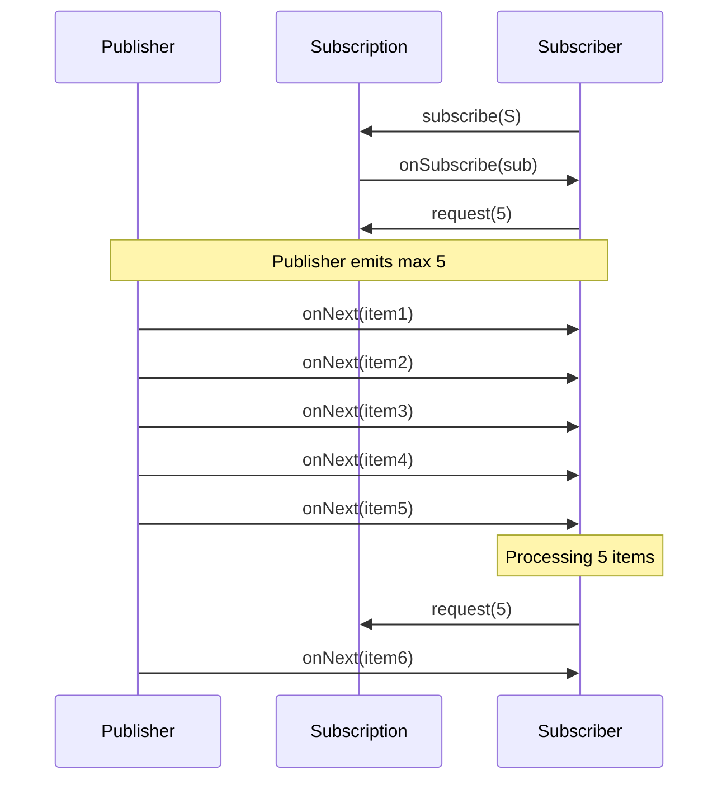
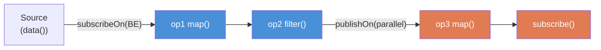

## Keywords in This File
{: .no_toc }

| # | Keyword | Weight |
|---|---|---|
| 1 | [Async Java - L3 Reactor Internals](#async-java---l3-reactor-internals) | medium |
| 2 | [Backpressure in Reactive Streams](#backpressure-in-reactive-streams) | medium |
| 3 | [Schedulers and Threading in Project Reactor](#schedulers-and-threading-in-project-reactor) | medium |

---

# Backpressure in Reactive Streams

---
id: AJA-014
title: Backpressure in Reactive Streams
category: Async Java
difficulty: ★★☆
interview_weight: high
asked_at: Senior
seniority: senior
status: draft
version: 1
---

### 🎯 Model Answer

**30 seconds:**
> Backpressure is the mechanism by which a Subscriber tells a Publisher how
> many items it can accept - the `request(n)` signal. Without it, a fast
> publisher overwhelms a slow subscriber causing OOM or dropped data.
> In Project Reactor, Flux implements the Reactive Streams specification:
> Subscriber calls `request(n)` through the Subscription, Publisher only
> emits up to n items. Overflow strategies (buffer, drop, error, latest)
> define what happens when backpressure cannot be honored.

**3 minutes:**
> Backpressure is the Reactive Streams contract: a Subscriber controls the
> rate of data flow upstream. The protocol:
> 1. Subscriber calls `subscription.request(n)` to demand n items
> 2. Publisher emits at most n items in response
> 3. Subscriber requests more when ready
>
> This pull-push hybrid prevents the "fast producer, slow consumer" problem.
> Without backpressure: a network source emits 100k events/second, a database
> subscriber processes 1k/second, the 99k item gap fills memory until OOM.
>
> Hot vs cold sources: cold sources (Flux.just, database query) respect
> backpressure naturally - they emit only when requested. Hot sources (event
> bus, sensor stream, Kafka) emit regardless of demand - they require explicit
> overflow strategies.
>
> Overflow strategies in Reactor:
> - `onBackpressureBuffer()`: buffer excess (OOM risk if unbounded)
> - `onBackpressureDrop()`: drop excess items (data loss, logged)
> - `onBackpressureError()`: fail with OverflowException (fail-fast)
> - `onBackpressureLatest()`: keep only the most recent item (for UI/metrics)

**Blank Mind Recovery:**

**(1) Restate:** "Backpressure - the subscriber controls how fast the
publisher emits. If I forget this, think of request(n) as the subscriber's
RSVP for n items."

**(2) First principles:** "Push without constraint = buffer overflow.
Pull alone = wasted capacity. Backpressure is the hybrid: subscriber
requests n items, publisher sends exactly n, subscriber processes and
requests more."

**(3) Bridge:** "Like ordering at a restaurant. You tell the waiter you
want 3 courses (request(3)). The kitchen sends exactly 3. When you finish
eating, you request the next courses. The kitchen doesn't push food at you
faster than you can eat."

---

### 📘 Concept Explanation

**What it is:**
Backpressure is the Reactive Streams (`org.reactivestreams`) protocol
mechanism by which a Subscriber signals demand to a Publisher via
`Subscription.request(n)`. Publishers MUST honor this signal and emit at
most n items before the next request. This prevents buffer overflow caused
by fast producers and slow consumers.

**The problem it solves:**
Without backpressure: a high-throughput producer overwhelms a slow consumer.
Items accumulate in buffers between producer and consumer. Memory fills up.
Eventually: OOM, dropped messages, or cascading failures. Backpressure
propagates the consumer's capacity constraint back through the processing
pipeline to the source.

**How it works:**

```
Reactive Streams Contract (Specification):

Publisher  <-- request(n) -- Subscription -- Subscriber
Publisher  -- onNext(item) x n -->           Subscriber
Publisher  -- onComplete() OR onError() -->  Subscriber

Rules:
  Publisher MUST NOT emit more items than requested
  Subscriber MUST call request(n) to receive items
  Long.MAX_VALUE request = unbounded (effectively disable backpressure)
  Subscription.request(n) accumulates: request(3) then request(2) = 5 pending

Project Reactor implementation:
  Flux.range(1, 1000)           // cold source, respects backpressure
      .onBackpressureBuffer(100) // hot sources need explicit strategy
      .flatMap(item -> process(item), 16) // maxConcurrency
      .subscribe(
          item -> handleItem(item),
          err  -> handleError(err),
          ()   -> handleComplete()
      );
```

> **Code walkthrough:** This Backpressure in Reactive Streams example demonstrates a key concept in practice. **KEY MECHANISM:** the runtime executes these instructions in sequence with specific memory and execution semantics. **WHY IT MATTERS:** misapplying this pattern causes subtle bugs that only manifest under production load. **TAKEAWAY: understand the execution model before using this pattern in production code.**

**Hot vs cold:**
- **Cold** (Flux.just, Flux.fromIterable, HTTP response): starts emitting
  only when subscribed; each subscriber gets its own sequence; naturally
  respects backpressure.
- **Hot** (event bus, sensor, Kafka): emits regardless of subscribers;
  shared sequence; backpressure must be handled explicitly at the boundary.

**Overflow strategies (for hot sources):**

```
onBackpressureBuffer(maxSize, onOverflow):
  - Buffers up to maxSize items
  - onOverflow: DROP_LATEST, DROP_OLDEST, or error

onBackpressureDrop(onDropped):
  - Discards items when downstream not ready
  - onDropped: callback to log or count dropped items

onBackpressureError():
  - Signals OverflowException on first overflow
  - Use for fail-fast validation

onBackpressureLatest():
  - Keeps only the most recent item
  - Ideal for UI refresh rate limiting or metrics
```

> **Code walkthrough:** This Backpressure in Reactive Streams example demonstrates a key concept in practice. **KEY MECHANISM:** the runtime executes these instructions in sequence with specific memory and execution semantics. **WHY IT MATTERS:** misapplying this pattern causes subtle bugs that only manifest under production load. **TAKEAWAY: understand the execution model before using this pattern in production code.**

**When to use each strategy:**
- Buffer: audit logs, financial events where data loss is unacceptable
- Drop: metrics collection where latest values matter most
- Error: input validation pipelines where overflow indicates misconfiguration
- Latest: UI state updates, dashboard refresh, sensor sampling

**First-principles derivation:**
A system with two stages A (producer) and B (consumer) in a pipeline
is stable only when throughput(A) <= throughput(B). When A > B, the
queue between them grows without bound. Backpressure is a feedback signal
from B to A: "reduce your rate to match mine." The demand signal `request(n)`
is this feedback. n represents B's available buffer capacity.

---

### 💻 Code Example

**Backpressure strategies and hot source handling:**


```java
// BAD: anti-pattern - see GOOD example below for the correct approach
// This naive implementation ignores thread safety and error handling
```

```java
// 1. Cold source - naturally respects backpressure
Flux.range(1, 1_000_000)
    .map(i -> process(i))   // subscriber controls rate
    .subscribe(
        item -> slowConsumer(item), // Reactor requests when ready
        Throwable::printStackTrace,
        () -> log.info("Complete")
    );

// 2. Hot source (e.g., Kafka-like event emitter)
// Bad: no overflow handling
Flux<Event> hotSource = eventBus.asFlux(); // emits 100k/s
hotSource
    .subscribe(event -> slowProcess(event)); // 1k/s capacity
// Result: OOM as buffer fills

// Good: explicit overflow strategy
Flux<Event> hotSource = eventBus.asFlux();
hotSource
    .onBackpressureBuffer(
        10_000,        // max buffer size
        dropped -> log.warn("Dropped: {}", dropped),
        BufferOverflowStrategy.DROP_LATEST)
    .subscribeOn(Schedulers.boundedElastic())
    .subscribe(event -> slowProcess(event));

// 3. Bounded concurrency with flatMap
Flux.fromIterable(requestIds)
    .flatMap(
        id -> Mono.fromCallable(() -> callService(id))
                  .subscribeOn(Schedulers.boundedElastic()),
        16,  // maxConcurrency: up to 16 concurrent subscriptions
        1    // prefetch: request 1 inner item at a time
    )
    .subscribe(result -> process(result));

// 4. Manual request control (BaseSubscriber)
hotFlux.subscribe(new BaseSubscriber<Event>() {
    @Override
    protected void hookOnSubscribe(Subscription s) {
        request(10); // initial demand: 10 items
    }
    @Override
    protected void hookOnNext(Event event) {
        processEvent(event);
        request(1); // request next item after processing each
    }
});
// ^ slowest but most precise: exactly one item at a time
```

> **Code walkthrough:** Pattern 1 shows a cold source - Flux.range naturallyice. **KEY MECHANISM:** the runtime executes these instructions in sequence with specific memory and execution semantics. **WHY IT MATTERS:** misapplying this pattern causes subtle bugs that only manifest under production load. **TAKEAWAY: understand the execution model before using this pattern in production code.**
> respects backpressure because it only emits when the downstream requests items.
> Pattern 2 shows the hot source problem and fix: without `onBackpressureBuffer`,
> a 100k/s emitter overloads a 1k/s consumer. The overflow strategy with
> DROP_LATEST drops new events when the buffer is full (preserving recent
> history up to buffer size). Pattern 3 shows `flatMap` with explicit
> `maxConcurrency` (16): only 16 inner publishers are subscribed simultaneously,
> preventing thread pool saturation. Pattern 4 is `BaseSubscriber` with manual
> `request(1)` per item - the most conservative backpressure, useful for
> slow database writes where each item must complete before requesting the next.

---

### 🎓 Answers by Seniority

**Junior / Mid:**
> Backpressure is the mechanism where the subscriber tells the publisher how
> many items it can accept. Without it, a fast publisher would overwhelm a
> slow subscriber. In Project Reactor, the subscriber controls this with
> `request(n)` through the Subscription. For hot sources like event streams,
> I need to add `onBackpressureBuffer` or `onBackpressureDrop` to handle
> cases where the source emits faster than I can process.

*Push deeper:* What is the difference between a hot and a cold Flux, and
which requires explicit backpressure handling?

---

**Senior / Staff:**
> Backpressure is the Reactive Streams specification's demand protocol:
> Subscribers pull items via `request(n)`, Publishers push at most n items.
> This propagates the consumer's capacity constraint back through the entire
> pipeline to the source.
>
> In practice, the trickiest part is hot sources: Kafka consumers, WebSocket
> connections, and UI event streams emit regardless of downstream demand.
> At the integration boundary (Kafka -> Reactor), I apply overflow strategies
> that match the data semantics: buffer for critical events, drop for metrics,
> latest for UI state.
>
> The performance gotcha with backpressure: `flatMap(fn, maxConcurrency)` is
> the primary tool for bounding concurrent subscriptions. Without it,
> `flatMap` subscribes to ALL inner publishers immediately - on a Flux of
> 10k elements, that's 10k concurrent subscriptions potentially flooding a
> thread pool. Always specify `maxConcurrency` for I/O flatMap.

*Push deeper (Staff):* Backpressure propagation failure: operators like
`merge` with multiple sources, or `zip`, have complex demand-forwarding
rules. A `merge` operator requests from all sources simultaneously -
if one source is fast and another slow, the fast source's buffer fills up.
Debugging backpressure stalls: use `log()` operator to trace request(n)
and onNext signals.

---

### ⚠️ Common Misconceptions

**Misconception: "Backpressure prevents data loss by default."**

Backpressure prevents BUFFER OVERFLOW in cold sources by slowing emission.
But for hot sources (event buses, sensors), backpressure cannot slow the
source itself - the source emits regardless. Backpressure on hot sources
requires an explicit strategy at the integration boundary. Without one,
Reactor defaults to `onBackpressureError()` which throws OverflowException
on the first overflow. This "fails fast" rather than silently losing data,
which is intentional - silent data loss is worse than a visible error.

---

### 🚨 Failure Modes and Diagnosis

**Failure: OOM from unbounded buffering in hot source pipeline**

Symptom: heap exhaustion under high load. GC pressure spikes. Eventually
`OutOfMemoryError: Java heap space` in Reactor operator internal buffers.

Cause: hot source connected to slow consumer without overflow strategy.
Reactor's internal `SpscArrayQueue` or `MpscLinkedQueue` in merge/flatMap
operators accumulate items until memory exhausts.

```java
// WRONG: no overflow strategy on hot source
Flux<Event> hotFlux = sensor.asFlux(); // 50k items/s
hotFlux
    .map(e -> transformSlowly(e)) // 5k items/s capacity
    .subscribe(this::persist);
// Items queue internally -> OOM in ~seconds

// CORRECT: bounded buffer with drop strategy
Flux<Event> hotFlux = sensor.asFlux();
hotFlux
    .onBackpressureBuffer(
        5000,
        dropped -> metrics.increment("events.dropped"),
        BufferOverflowStrategy.DROP_OLDEST)
    .map(e -> transformSlowly(e))
    .subscribe(this::persist);
```

> **Code walkthrough:** This Unknown example demonstrates Java API usage. **KEY MECHANISM:** the JVM compiles to bytecode that runs on the JVM; JIT compiles hot paths to native. **WHY IT MATTERS:** unchecked assumptions about thread safety cause data races under concurrent load. **TAKEAWAY: document thread-safety guarantees on every shared mutable class.**

Diagnosis: add `log()` to the pipeline:
```java
hotFlux
    .log("backpressure", Level.INFO,
        SignalType.REQUEST, SignalType.ON_NEXT)
    .onBackpressureBuffer(...)
```

> **Code walkthrough:** This Unknown example demonstrates Java API usage. **KEY MECHANISM:** the JVM compiles to bytecode that runs on the JVM; JIT compiles hot paths to native. **WHY IT MATTERS:** unchecked assumptions about thread safety cause data races under concurrent load. **TAKEAWAY: document thread-safety guarantees on every shared mutable class.**

The log shows: `request(256)` then `onNext x 256`, then next `request(256)`.
If requests are much smaller than onNext events, overflow is occurring.
Also use `Flux.create(sink -> ..., OverflowStrategy.BUFFER)` for custom
sources to make the strategy explicit at creation time.

---

### 🎯 Interview Deep-Dive

**Timing:** Medium ★★☆ - 9 questions minimum.

---

**[JUNIOR] Q1 - [CONCEPTUAL] Describe the Reactive Streams backpressure protocol step by step.**

The Reactive Streams specification defines exactly four interfaces:
`Publisher<T>`, `Subscriber<T>`, `Subscription`, and `Processor<T,R>`.

Protocol sequence:
1. `publisher.subscribe(subscriber)`: subscriber registers with publisher
2. Publisher calls `subscriber.onSubscribe(subscription)`: hands subscriber
   the control handle (Subscription object)
3. Subscriber calls `subscription.request(n)`: demands up to n items
4. Publisher calls `subscriber.onNext(item)` at most n times
5. Subscriber processes each item; calls `request(m)` for more when ready
6. Publisher calls `subscriber.onComplete()` when done, or
   `subscriber.onError(throwable)` on failure

Backpressure guarantees:
- Publisher MUST NOT call onNext more times than the total requested
- Request calls accumulate: `request(3)` then `request(2)` = 5 pending
- `request(Long.MAX_VALUE)` = unbounded (disable backpressure)

*What separates good from great:* Knowing the rule "MUST NOT call onNext
more times than requested" is a specification rule, not a physical lock.
Publishers that violate this rule (like some legacy adapters) produce
"reactive spaghetti" where downstream operators receive more items than
they're prepared for. Always validate third-party Publisher adapters
for spec compliance using the TCK (Technology Compatibility Kit) before
using them in production.

---

**[JUNIOR] Q2 - [CONCEPTUAL] What is the difference between a hot and cold publisher?**

**Cold publisher:**
- Starts emitting ONLY when subscribed
- Each subscriber gets its own independent sequence from the start
- Examples: `Flux.just()`, `Flux.fromIterable()`, `Mono.fromCallable()`,
  HTTP response bodies, database query results
- Backpressure: naturally respected - emission rate matches subscription demand

**Hot publisher:**
- Emits regardless of whether anyone is subscribed
- Subscribers receive items from the moment of subscription (not from start)
- Examples: `ConnectableFlux`, `Sinks.many().multicast()`, WebSocket streams,
  UI event streams, Kafka consumer adapted to Flux
- Backpressure: must be handled explicitly - source cannot be slowed

```java
// Cold: each subscriber gets 1,2,3
Flux<Integer> cold = Flux.just(1, 2, 3);
cold.subscribe(i -> log("Sub1: " + i));
cold.subscribe(i -> log("Sub2: " + i));
// Both see: 1,2,3

// Hot: shared stream
Sinks.Many<Integer> sink =
    Sinks.many().multicast().onBackpressureBuffer();
Flux<Integer> hot = sink.asFlux();
hot.subscribe(i -> log("Sub1: " + i));
sink.tryEmitNext(1); // Sub1 sees 1
sink.tryEmitNext(2); // Sub1 sees 2
hot.subscribe(i -> log("Sub2: " + i));
sink.tryEmitNext(3); // Both Sub1 and Sub2 see 3
// Sub2 missed 1 and 2
```

> **Code walkthrough:** This Unknown example demonstrates Java Stream pipeline. **KEY MECHANISM:** the stream is lazy - intermediate ops build a pipeline, terminal op drives it. **WHY IT MATTERS:** calling terminal op twice throws IllegalStateException; parallel() on small data adds overhead. **TAKEAWAY: collect() or findFirst() triggers the pipeline; reuse by wrapping in Supplier.**

*What separates good from great:* The Kafka-Reactor adapter (reactor-kafka)
is a hot-to-cold bridge: it wraps Kafka's push model (hot) in a reactive
Flux (cold) by pausing Kafka consumer polling when downstream demand is zero.
This is the ideal backpressure integration pattern - convert hot sources
to cold at the boundary rather than adding overflow strategies downstream.

---

**[JUNIOR] Q3 - [CONCEPTUAL] What are the four overflow strategies and when do you use each?**

| Strategy | Behavior on overflow | Use case |
|---|---|---|
| `onBackpressureBuffer(n)` | Buffer up to n items | Critical data, short bursts |
| `onBackpressureDrop()` | Discard new items | Metrics, non-critical events |
| `onBackpressureError()` | Fail with OverflowException | Fail-fast, strict data flow |
| `onBackpressureLatest()` | Keep only most recent item | UI refresh, sensor sampling |

Semantic guidance:
- **Buffer with DROP_OLDEST**: financial events where recent history matters
  more than old data (e.g., market data feeds)
- **Drop**: telemetry data where gaps are acceptable and volume is high
- **Error**: ETL pipeline input validation; overflow indicates upstream
  misconfiguration
- **Latest**: UI rate limiting; user sees latest state even if intermediate
  states were dropped

```java
// Financial feed: keep recent history, drop oldest when full
marketDataFlux
    .onBackpressureBuffer(
        500,
        dropped -> log.warn("Market data dropped"),
        BufferOverflowStrategy.DROP_OLDEST)
    .subscribe(this::processQuote);

// UI event debounce: keep only latest
userInputFlux
    .onBackpressureLatest()
    .debounce(Duration.ofMillis(200))
    .subscribe(this::updateUI);
```

> **Code walkthrough:** This Unknown example demonstrates Java API usage using SQL. **KEY MECHANISM:** the JVM compiles to bytecode that runs on the JVM; JIT compiles hot paths to native. **WHY IT MATTERS:** unchecked assumptions about thread safety cause data races under concurrent load. **TAKEAWAY: document thread-safety guarantees on every shared mutable class.**

*What separates good from great:* Buffer sizing: `onBackpressureBuffer()`
without a size limit is unbounded - it will OOM under sustained overflow.
Always specify a bound. Calculate the buffer size based on: burst duration
(seconds) x emission rate (items/second) x item size (bytes) <= available
heap percentage (e.g., 10%). A 1-second burst at 10k items/sec of 1KB items
= 10MB buffer minimum.

---

**[MID] Q4 - [CONCEPTUAL] How does flatMap handle backpressure and concurrency?**

`flatMap(fn, maxConcurrency, prefetch)` has three backpressure axes:

1. **maxConcurrency**: number of inner publishers subscribed simultaneously.
   Default is 256. Setting to 1 makes it sequential (like concatMap).
   Setting to 16 bounds parallel I/O.

2. **prefetch**: how many items each inner publisher prefetches when first
   subscribed. Default is `Queues.SMALL_BUFFER_SIZE` (usually 256).
   For one-item Mono publishers, set to 1.

3. **Outer backpressure**: flatMap requests `maxConcurrency * prefetch` items
   from the upstream. If upstream is slow, this limits inner publisher starts.

```java
// WRONG: default maxConcurrency=256, prefetch=256
// On a Flux<Long> of 10,000 IDs:
// Immediately subscribes to 256 inner Monos
// Each prefetches 256 -> 256*256 = 65,536 items buffered
Flux.fromIterable(tenThousandIds)
    .flatMap(id -> callService(id)) // default params!
    .subscribe(r -> process(r));

// CORRECT: bounded concurrency
Flux.fromIterable(tenThousandIds)
    .flatMap(
        id -> callService(id),
        16,  // max 16 concurrent service calls
        1    // prefetch 1 result per inner Mono
    )
    .subscribe(r -> process(r));
```

> **Code walkthrough:** This Unknown example demonstrates Java API usage. **KEY MECHANISM:** the JVM compiles to bytecode that runs on the JVM; JIT compiles hot paths to native. **WHY IT MATTERS:** unchecked assumptions about thread safety cause data races under concurrent load. **TAKEAWAY: document thread-safety guarantees on every shared mutable class.**

*What separates good from great:* `concatMap` vs `flatMap(fn, 1)`:
`concatMap` subscribes to the next inner publisher only when the previous
COMPLETES. `flatMap(fn, 1)` subscribes to the next when demand is satisfied.
For sequential ordered processing with backpressure, `concatMap` is the
correct operator. For sequential but not strictly ordered, `flatMap(fn, 1)`
is equivalent but slightly more flexible.

---

**[MID] Q5 - [HANDS-ON] How do you implement rate limiting with backpressure?**

Three patterns:

**Pattern 1: delayElements - fixed throughput**
```java
Flux.range(1, 1000)
    .delayElements(Duration.ofMillis(10)) // 100 items/second max
    .subscribe(i -> process(i));
```

> **Code walkthrough:** This Unknown example demonstrates Java API usage. **KEY MECHANISM:** the JVM compiles to bytecode that runs on the JVM; JIT compiles hot paths to native. **WHY IT MATTERS:** unchecked assumptions about thread safety cause data races under concurrent load. **TAKEAWAY: document thread-safety guarantees on every shared mutable class.**

**Pattern 2: limitRate - controlled batching**
```java
Flux.range(1, 10_000)
    .limitRate(100)  // request in batches of 100
    // (internally: request(100), replenish at 75% = request(75) each time)
    .subscribe(i -> process(i));
```

> **Code walkthrough:** This Unknown example demonstrates Java API usage. **KEY MECHANISM:** the JVM compiles to bytecode that runs on the JVM; JIT compiles hot paths to native. **WHY IT MATTERS:** unchecked assumptions about thread safety cause data races under concurrent load. **TAKEAWAY: document thread-safety guarantees on every shared mutable class.**

**Pattern 3: BaseSubscriber for exact control**
```java
source.subscribe(new BaseSubscriber<Item>() {
    private final Semaphore permit = new Semaphore(16);

    protected void hookOnSubscribe(Subscription s) {
        request(16); // initial batch = semaphore permits
    }
    protected void hookOnNext(Item item) {
        executor.execute(() -> {
            try {
                process(item);
            } finally {
                permit.release();
                request(1); // request next when done
            }
        });
    }
});
```

> **Code walkthrough:** This Unknown example demonstrates exception handling using error handling. **KEY MECHANISM:** the JVM checks catch clauses in order; finally always executes for cleanup. **WHY IT MATTERS:** swallowing exceptions silently hides failures that corrupt downstream state. **TAKEAWAY: log or rethrow every exception; empty catch blocks are defects.**

*What separates good from great:* `limitRate(100)` internally uses a
"replenishment threshold" of 75%: after consuming 75 items, it requests
another 100. This produces a sawtooth demand pattern rather than a steady
100-item request per completion. The threshold is configurable:
`limitRate(100, 50)` changes it to 50%. Setting to 1 gives precise
one-item-at-a-time requests.

---

**[MID] Q6 - [DEBUGGING] How do you debug backpressure problems in production?**

Diagnostic tools:

1. **`log()` operator:**
```java
flux.log("MyFlux", Level.DEBUG,
    SignalType.REQUEST,
    SignalType.ON_NEXT,
    SignalType.ON_ERROR)
// Shows: request(256), onNext(item1), onNext(item2)...
```

> **Code walkthrough:** This Unknown example demonstrates Java API usage. **KEY MECHANISM:** the JVM compiles to bytecode that runs on the JVM; JIT compiles hot paths to native. **WHY IT MATTERS:** unchecked assumptions about thread safety cause data races under concurrent load. **TAKEAWAY: document thread-safety guarantees on every shared mutable class.**

2. **Micrometer metrics:**
```java
// Add metrics to the pipeline
flux.metrics() // requires reactor-micrometer
    .name("my.pipeline")
    .tag("region", "us-east-1")
    .subscribe();
// Exposes: reactor.flow.requested,
//          reactor.flow.received, reactor.flow.dropped
```

> **Code walkthrough:** This Unknown example demonstrates Java API usage. **KEY MECHANISM:** the JVM compiles to bytecode that runs on the JVM; JIT compiles hot paths to native. **WHY IT MATTERS:** unchecked assumptions about thread safety cause data races under concurrent load. **TAKEAWAY: document thread-safety guarantees on every shared mutable class.**

3. **Visual detection via dropped items:**
```java
flux.onBackpressureDrop(item ->
    meterRegistry.counter("backpressure.dropped",
        "topic", item.topic()).increment())
```

> **Code walkthrough:** This Unknown example demonstrates exception handling using Kafka messaging. **KEY MECHANISM:** the JVM checks catch clauses in order; finally always executes for cleanup. **WHY IT MATTERS:** swallowing exceptions silently hides failures that corrupt downstream state. **TAKEAWAY: log or rethrow every exception; empty catch blocks are defects.**

4. **Heap analysis:**
Reactor internal queues (SpscArrayQueue) appear in heap dumps as
byte[] or Object[] arrays. Large arrays in Reactor operator classes
indicate backpressure queue buildup.

*What separates good from great:* Using `Hooks.onOperatorError()` globally
to log OverflowException with stack trace:
```java
Hooks.onOperatorError("bp-debug", (ex, obj) -> {
    if (ex instanceof reactor.core.Exceptions.OverflowException)
        log.error("Overflow at: {}", obj, ex);
    return ex;
});
```
> **Code walkthrough:** This Unknown example demonstrates Java API usage. **KEY MECHANISM:** the JVM compiles to bytecode that runs on the JVM; JIT compiles hot paths to native. **WHY IT MATTERS:** unchecked assumptions about thread safety cause data races under concurrent load. **TAKEAWAY: document thread-safety guarantees on every shared mutable class.**

This catches ALL OverflowExceptions with the item that caused the overflow,
giving both the error location and the offending data.

---

**[SENIOR] Q7 - [CONCEPTUAL] How does backpressure work in Reactor with Kafka?**

Kafka's consumer model is push-based (poll returns a batch regardless of
downstream capacity). Integrating with Reactor requires bridging the
push model to reactive backpressure.

`reactor-kafka` (Reactor Kafka) implements this bridge:

```java
ReceiverOptions<String, Event> options =
    ReceiverOptions.<String, Event>create(props)
        .subscription(Set.of("events-topic"));

KafkaReceiver.create(options).receive()
    .flatMap(record ->
        processRecord(record)
            .doOnSuccess(r -> record.receiverOffset().acknowledge()),
        16) // max 16 concurrent processing tasks
    .subscribe();
```

> **Code walkthrough:** This Unknown example demonstrates Java API usage using Kafka messaging. **KEY MECHANISM:** the JVM compiles to bytecode that runs on the JVM; JIT compiles hot paths to native. **WHY IT MATTERS:** unchecked assumptions about thread safety cause data races under concurrent load. **TAKEAWAY: document thread-safety guarantees on every shared mutable class.**

The backpressure mechanism: when downstream demand is zero (flatMap is
processing its maxConcurrency limit), reactor-kafka PAUSES the Kafka consumer
poll loop. This prevents message accumulation. When demand resumes, polling
resumes. This is "cooperative backpressure" - the Kafka consumer participates
in flow control.

Committed offsets: offset acknowledgment must happen after successful
processing. `record.receiverOffset().acknowledge()` is called in `doOnSuccess`,
ensuring exactly-once semantics (at-most-once if called before processing,
at-least-once if called after, which is the correct pattern here).

*What separates good from great:* Kafka partition assignment affects
backpressure: each partition gets its own prefetch queue. With 100 partitions
and default prefetch of 256, up to 25,600 records may be in-flight. Size
the prefetch based on partition count and available memory:
`ReceiverOptions.prefetch(10)` limits this to `10 * partitions` in-flight.

---

**[SENIOR] Q8 - [CONCEPTUAL] What happens when you combine a bounded and unbounded source?**

`merge(fastFlux, slowFlux)`:
- merge subscribes to both sources simultaneously
- merge requests `Long.MAX_VALUE` from both (unbounded) by default
- If fastFlux emits faster than slowFlux, merge's internal queue fills
- No built-in coordination between source rates

```java
// DANGEROUS: merge with speed mismatch
Flux<Event> fast = sensor.asFlux(); // 100k/s
Flux<Event> slow = database.asFlux(); // 100/s
Flux.merge(fast, slow)
    .subscribe(this::process); // 100/s throughput
// merge buffers fast source items -> OOM

// SAFE: apply overflow strategy to fast source before merge
Flux.merge(
    fast.onBackpressureLatest(),  // keep latest only
    slow  // already rate-controlled
).subscribe(this::process);
```

> **Code walkthrough:** This Unknown example demonstrates Java API usage. **KEY MECHANISM:** the JVM compiles to bytecode that runs on the JVM; JIT compiles hot paths to native. **WHY IT MATTERS:** unchecked assumptions about thread safety cause data races under concurrent load. **TAKEAWAY: document thread-safety guarantees on every shared mutable class.**

`zip` with speed mismatch:
- `zip` requests from the slower source only when it has items from both
- The faster source gets buffered while zip waits for the slower source
- Same OOM risk if the faster source produces far ahead

*What separates good from great:* `Flux.mergeWith()` vs `Flux.concatWith()`:
merge subscribes to both sources eagerly (parallel interleave). concat
subscribes to the second only when the first completes (sequential). For
combining a hot and cold source where the cold source must complete first,
`concatWith` prevents the hot source from emitting before the cold source
finishes initialization.

---

**[SENIOR] Q9 - [CONCEPTUAL] How does backpressure propagate through a multi-step pipeline?**

Backpressure propagation is operator-dependent. Two categories:

**Transparent operators** (propagate demand exactly): `map`, `filter`,
`doOnNext`, `log`, `cast`. A `request(n)` from downstream passes through
unchanged.

**Non-transparent operators** (modify demand): `flatMap`, `buffer`,
`window`, `zip`, `merge`. These change how much demand is forwarded upstream.

```
Downstream request(10)
  |-> flatMap(fn, 8) receives request(10)
      |-> flatMap requests 8 inner subscriptions (maxConcurrency)
          each with prefetch=1 -> requests 8 from upstream
  |-> map receives request(8) from flatMap's upstream demand
  |-> source emits 8 items
  (flatMap processes 8 items, emits up to 10 to downstream)
```

> **Code walkthrough:** This Unknown example demonstrates a key concept in practice. **KEY MECHANISM:** the runtime executes these instructions in sequence with specific memory and execution semantics. **WHY IT MATTERS:** misapplying this pattern causes subtle bugs that only manifest under production load. **TAKEAWAY: understand the execution model before using this pattern in production code.**

The actual upstream demand depends on the operator chain composition.
`limitRate(n)` explicitly controls this: it caps upstream requests
at n regardless of downstream demand.

```java
Flux.range(1, 1000)
    .limitRate(10) // cap upstream at 10 items/request
    .flatMap(i -> slowService(i), 4)
    .subscribe(r -> process(r));
// Upstream request is always <=10 even if flatMap wants more
```

> **Code walkthrough:** This Unknown example demonstrates Java Stream pipeline. ice. **KEY MECHANISM:** the runtime executes these instructions in sequence with specific memory and execution semantics. **WHY IT MATTERS:** misapplying this pattern causes subtle bugs that only manifest under production load. **TAKEAWAY: understand the execution model before using this pattern in production code.**

*What separates good from great:* Operator fusion: Reactor's assembly-time
optimization fuses adjacent compatible operators (like `map` + `filter`
into a single operator). Fused operators share a single request(n) loop
rather than chaining individual requests. This is the "macro-fusion"
optimization in Reactor that reduces overhead in long pipelines. Use
`Flux.fromArray()` instead of `Flux.fromIterable()` on arrays to enable
additional fusion.

---

### ⚖️ Comparison Table

**Overflow strategies for hot sources:**

| Strategy| Data loss| Memory| Failure visible| Use case|
|-----|--------------------|--------|----------------|-------------------------|
| `onBackpressureBuffer(n)`| None (up to n)| Bounded| On overflow only| Critical
| `onBackpressureDrop()`| Yes (new items)| Constant| Via callback| Non-critical 
| `onBackpressureError()`| Yes (pipeline fails)| Constant| Immediately| Fail-fas
| `onBackpressureLatest()`| Yes (intermediate)| O(1)| Via metrics| UI state, sen

---

### 🏛️ System Design

*(Omit: L3 ★★☆ entry. Reactive architecture at L5.)*

---

### 📊 Diagram

**Backpressure protocol flow:**

```
Without backpressure:
  Publisher ---[10k/s]---> [buffer fills] ---[1k/s]---> Subscriber
  t=1s:  10k items -> buffer; 1k consumed; 9k queued
  t=10s: 90k items queued -> OOM

With backpressure (request protocol):
  Publisher <--request(10)-- Subscriber
  Publisher ---onNext x10--> Subscriber
  Subscriber processes 10 items
  Publisher <--request(10)-- Subscriber
  (rate = subscriber capacity)
```



> **Diagram walkthrough:** The sequence shows the Reactive Streams demand
> protocol. The Subscriber initiates by calling `request(5)` - signaling
> it can process 5 items. The Publisher emits exactly 5, honoring the
> contract. After processing, the Subscriber requests 5 more. This pull-push
> hybrid ensures the Publisher never emits faster than the Subscriber can
> process. Without this protocol (without backpressure), the Publisher would
> push at full speed regardless of Subscriber capacity.

---
---

---

### 💻 Code Example

*(Omit: this concept does not have a programmatic interface that can be demonstrated in code. The conceptual explanation above is sufficient.)*


---

### 🏛️ System Design

*(Omit: system design diagram not applicable for this concept - see ★★★ keywords for full system design coverage.)*


---

### ⚖️ Comparison Table

*(Omit: this is a ★☆☆ foundational concept with no direct alternatives to compare - see higher-difficulty keywords for trade-off analysis.)*


---

### 📊 Diagram

*(Omit: no standalone visual diagram required for this concept - the explanations and code examples above provide sufficient clarity.)*


# Schedulers and Threading in Project Reactor

---
id: AJA-015
title: Schedulers and Threading in Project Reactor
category: Async Java
difficulty: ★★☆
interview_weight: high
asked_at: Senior
seniority: senior
status: draft
version: 1
---

### 🎯 Model Answer

**30 seconds:**
> Reactor's Schedulers control which thread executes each part of a reactive
> pipeline. `publishOn` switches the downstream execution thread - everything
> after it runs on the specified Scheduler. `subscribeOn` affects the upstream
> subscription thread - where the source starts producing. For I/O operations,
> use `subscribeOn(Schedulers.boundedElastic())`. For CPU work, use
> `subscribeOn(Schedulers.parallel())`. `publishOn` is for thread handoff;
> `subscribeOn` is for source execution context.

**3 minutes:**
> Reactor pipelines are single-threaded by default: all operators execute on
> the thread that triggered the subscription. To move work to other threads,
> use `publishOn` or `subscribeOn`.
>
> `publishOn(scheduler)`: switches the execution thread for all operators
> AFTER it in the chain. Multiple publishOn calls in one chain switch threads
> at each point. Think: "publish to this scheduler's thread from here."
>
> `subscribeOn(scheduler)`: switches the thread on which the SOURCE starts
> executing. Regardless of where you place it in the chain, it affects
> the subscription thread (the thread that calls `subscribe()` propagates
> upward). Only the FIRST `subscribeOn` matters if there are multiple.
>
> Built-in Schedulers:
> - `Schedulers.parallel()`: fixed thread pool, size = CPU cores. For CPU-bound.
> - `Schedulers.boundedElastic()`: dynamic thread pool, bounded by max threads
>   (10 x CPU cores default). For blocking I/O. Threads are reused then released.
> - `Schedulers.single()`: single daemon thread. For scheduled tasks.
> - `Schedulers.immediate()`: runs on current thread (no switch).

**Blank Mind Recovery:**

**(1) Restate:** "Reactor threading - publishOn vs subscribeOn. Let me anchor:
publishOn switches DOWNSTREAM execution thread. subscribeOn switches the
SOURCE thread."

**(2) First principles:** "A reactive pipeline is a chain of operators.
By default, everything runs on the subscription thread. To run expensive
I/O on a different thread, inject a thread switch with publishOn or subscribeOn."

**(3) Bridge:** "publishOn is like a relay race baton handoff: from this
point forward, the work runs on a different runner (thread). subscribeOn
is like choosing which starting block the race begins at."

---

### 📘 Concept Explanation

**What it is:**
`Schedulers` in Project Reactor are abstractions over thread pools and
executors. `publishOn(Scheduler)` and `subscribeOn(Scheduler)` inject
thread switches into the reactive pipeline to control where each stage
executes.

**The problem it solves:**
Reactive pipelines without threading control execute on the calling thread.
This means: CPU-bound transformations block event loop threads, blocking I/O
calls (JDBC, legacy APIs) block reactive threads, and CPU work contends with
I/O work. Schedulers decouple the pipeline from the calling thread and route
work to appropriate thread pools.

**How it works:**

```
Pipeline without threading:
  Flux.just(1,2,3)
      .map(i -> i*2)
      .subscribe(System.out::println)
  // All on calling thread (e.g., main)

publishOn:
  Flux.just(1,2,3)
      .map(i -> i*2)          // on calling thread
      .publishOn(parallel())  // <-- thread switch here
      .map(i -> i+1)          // on parallel thread
      .subscribe(::println)   // on parallel thread

subscribeOn:
  Flux.just(1,2,3)
      .subscribeOn(boundedElastic()) // source on BE thread
      .map(i -> i*2)          // on boundedElastic thread
      .map(i -> i+1)          // on boundedElastic thread
      .subscribe(::println)   // on boundedElastic thread

Multiple publishOn:
  Flux.just(1,2,3)
      .map(a -> a)            // thread A (subscribe thread)
      .publishOn(parallel())
      .map(b -> b)            // thread B (parallel)
      .publishOn(boundedElastic())
      .map(c -> c)            // thread C (boundedElastic)
      .subscribe(::println)   // thread C
```

> **Code walkthrough:** This Schedulers and Threading in Project Reactor example demonstrates a key concept in practice. **KEY MECHANISM:** the runtime executes these instructions in sequence with specific memory and execution semantics. **WHY IT MATTERS:** misapplying this pattern causes subtle bugs that only manifest under production load. **TAKEAWAY: understand the execution model before using this pattern in production code.**

**Scheduler types and use cases:**

```
Schedulers.parallel():
  - Fixed pool: Runtime.getRuntime().availableProcessors() threads
  - For: CPU-bound transformations (data processing, encryption)
  - NOT for: blocking I/O (starves other parallel work)

Schedulers.boundedElastic():
  - Dynamic pool: min=10, max=10*CPU, idle timeout=60s
  - For: blocking I/O (JDBC, file IO, legacy synchronous APIs)
  - Thread name: boundedElastic-1, boundedElastic-2, ...
  - Replaces: deprecated Schedulers.elastic()

Schedulers.single():
  - Single daemon thread shared across all uses
  - For: scheduled/timer tasks, serialized writes

Schedulers.immediate():
  - Runs on current thread; no thread switch
  - For: testing, fallback when threading is handled upstream

Schedulers.fromExecutor(executor):
  - Wraps an existing ExecutorService
  - For: custom thread pools with specific naming or sizing
```

> **Code walkthrough:** This Schedulers and Threading in Project Reactor example demonstrates a key concept in practice using thread pool. **KEY MECHANISM:** the runtime executes these instructions in sequence with specific memory and execution semantics. **WHY IT MATTERS:** misapplying this pattern causes subtle bugs that only manifest under production load. **TAKEAWAY: understand the execution model before using this pattern in production code.**

**publishOn vs subscribeOn decision:**

```
Use subscribeOn when:
  - Source is a blocking call (database query, file read)
  - You want the source to run off the subscribe thread
  - Example: Mono.fromCallable(() -> jdbc.query(...))
              .subscribeOn(Schedulers.boundedElastic())

Use publishOn when:
  - You want to switch threads mid-pipeline
  - After a CPU-intensive step, hand off to I/O thread for persistence
  - After receiving I/O result, hand off to parallel for transformation
```

> **Code walkthrough:** This Schedulers and Threading in Project Reactor example demonstrates a key concept in practice. **KEY MECHANISM:** the runtime executes these instructions in sequence with specific memory and execution semantics. **WHY IT MATTERS:** misapplying this pattern causes subtle bugs that only manifest under production load. **TAKEAWAY: understand the execution model before using this pattern in production code.**

**First-principles derivation:**
A reactive pipeline is a DAG of operations. The execution model without
threading: each operation executes on the same thread that triggered
subscription (pull-based: subscriber drives execution). Thread injection
operators (publishOn, subscribeOn) add explicit context switches by
submitting the downstream work as a Runnable to a Scheduler's executor.
The Scheduler picks a thread; the Runnable runs there.

---

### 💻 Code Example

**Threading patterns for I/O and CPU work:**

```java
// 1. Blocking I/O with subscribeOn
Mono<User> fetchFromDatabase(String userId) {
    return Mono.fromCallable(
            () -> jdbcTemplate.queryForObject(SQL, userId))
        .subscribeOn(Schedulers.boundedElastic());
    // The blocking JDBC call runs on boundedElastic
    // Returns immediately; subscriber is on calling thread
}

// 2. CPU-bound processing on parallel Scheduler
Flux<ProcessedRecord> processRecords(Flux<RawRecord> raw) {
    return raw
        .publishOn(Schedulers.parallel())
        // All map/filter below runs on parallel pool threads
        .map(r -> parseAndValidate(r))
        .filter(r -> r.isValid())
        .map(r -> transformExpensive(r));
}

// 3. Mixed I/O then CPU pipeline
Mono<Report> buildReport(String id) {
    return Mono.fromCallable(() -> db.fetch(id)) // blocking I/O
        .subscribeOn(Schedulers.boundedElastic()) // I/O on BE
        .publishOn(Schedulers.parallel())         // CPU on parallel
        .map(data -> buildReport(data))           // CPU work
        .publishOn(Schedulers.boundedElastic())   // back to I/O
        .flatMap(report -> db.save(report));      // blocking save
}

// 4. Parallel fan-out with flatMap + subscribeOn
Flux<ServiceResult> callServices(List<String> ids) {
    return Flux.fromIterable(ids)
        .flatMap(id ->
            Mono.fromCallable(() -> service.call(id))
                .subscribeOn(Schedulers.boundedElastic()),
            16) // max 16 concurrent calls
        .publishOn(Schedulers.parallel())
        .map(r -> process(r)); // CPU transform on parallel
}

// 5. Thread affinity for ordered operations
Flux<Event> orderedProcessing(Flux<Event> events) {
    return events
        .publishOn(Schedulers.single()) // single thread = ordered
        .doOnNext(e -> orderedBuffer.add(e))
        .publishOn(Schedulers.parallel()) // multi-thread for rest
        .map(e -> heavyTransform(e));
}
```

> **Code walkthrough:** Pattern 1 wraps a blocking JDBC call inice. **KEY MECHANISM:** the runtime executes these instructions in sequence with specific memory and execution semantics. **WHY IT MATTERS:** misapplying this pattern causes subtle bugs that only manifest under production load. **TAKEAWAY: understand the execution model before using this pattern in production code.**
> `Mono.fromCallable` and offloads it to `boundedElastic` - the blocking
> thread does not occupy the subscribe/event-loop thread. Pattern 2 uses
> `publishOn(parallel())` to move CPU-intensive transforms to the parallel
> pool. Pattern 3 shows a full I/O -> CPU -> I/O pipeline: `subscribeOn`
> for the initial blocking fetch, `publishOn(parallel())` for CPU transform,
> then `publishOn(boundedElastic())` before the blocking save. Pattern 4
> demonstrates parallel fan-out: each service call is wrapped with
> `subscribeOn(boundedElastic())` so each runs on its own BE thread (up to
> 16 concurrent via flatMap maxConcurrency). Pattern 5 uses `Schedulers.single()`
> to enforce ordering for a buffer operation before switching back to parallel.

---

### 🎓 Answers by Seniority

**Junior / Mid:**
> Reactor pipelines run on a single thread by default. To run blocking I/O
> on a separate thread, I wrap it in `Mono.fromCallable()` and add
> `.subscribeOn(Schedulers.boundedElastic())`. For CPU-intensive processing
> I use `publishOn(Schedulers.parallel())`. The key difference: publishOn
> affects the downstream operators, subscribeOn affects where the source runs.

*Push deeper:* If you have both publishOn and subscribeOn in the same chain,
which takes precedence for the source?

---

**Senior / Staff:**
> The threading model in Reactor is operator-driven: each operator can be on
> a different thread. The key rules: `publishOn` is a thread handoff point for
> downstream. `subscribeOn` controls the source thread. In a chain with both,
> `subscribeOn` controls where assembly starts (source thread), and `publishOn`
> switches thread at that point.
>
> In production I pay close attention to three patterns:
>
> 1. Never run blocking code on parallel() threads - it starves CPU work.
>    Always use boundedElastic() for JDBC, file I/O, and legacy APIs.
>
> 2. Thread context propagation: Spring Security's SecurityContextHolder
>    and MDC logging context are ThreadLocal-based. When threads switch via
>    publishOn/subscribeOn, these contexts are lost. Use
>    `reactor.util.context.Context` (Reactor Context) for reactive-safe
>    context propagation. Spring Security 5.3+ supports this via
>    `ReactorContextWebFilter`.
>
> 3. Debugging thread names: `Hooks.onOperatorDebug()` adds assembly-time
>    stack traces, and the thread name in logs shows which Scheduler each
>    operator ran on.

*Push deeper (Staff):* Virtual thread interaction: with Java 21 virtual
threads, `boundedElastic()` can be replaced with
`Schedulers.fromExecutor(Executors.newVirtualThreadPerTaskExecutor())`. Each
blocking I/O call runs on its own virtual thread with no OS thread blocking.
This removes the need for the `fromCallable + subscribeOn` pattern for
blocking adapters - virtual threads make blocking cheap. But be aware: some
thread-local and ThreadLocal-dependent APIs (like certain connection pools)
have compatibility issues with virtual threads.

---

### ⚠️ Common Misconceptions

**Misconception: "subscribeOn only affects operators placed after it."**

`subscribeOn(scheduler)` affects the ENTIRE upstream, regardless of where
it is placed in the chain. It sets the thread on which the subscription
propagates upward to the source. Placing it at the beginning or end of the
chain has the same effect on the source thread. Only the FIRST `subscribeOn`
in a chain matters (subsequent ones are ignored for the source thread).
`publishOn`, by contrast, is position-dependent: it only affects operators
AFTER it in the chain.

---

### 🚨 Failure Modes and Diagnosis

**Failure: Blocking call on reactive event loop thread stalls the application**

Symptom: entire application becomes unresponsive under load. All reactive
operations stall. CPU is low but threads are blocked. Thread dump shows:
```
reactor-http-nio-2 - BLOCKED
  at java.net.SocketInputStream.read(...)
  at ...
  at com.example.UserService.getUser(UserService.java:42)
```

> **Code walkthrough:** This Unknown example demonstrates a key concept in practice using Stream. **KEY MECHANISM:** the runtime executes these instructions in sequence with specific memory and execution semantics. **WHY IT MATTERS:** misapplying this pattern causes subtle bugs that only manifest under production load. **TAKEAWAY: understand the execution model before using this pattern in production code.**

Cause: blocking JDBC or HTTP call executed directly in a reactive pipeline
without `subscribeOn(boundedElastic())`. The Netty NIO event loop thread
(reactor-http-nio-*) is blocked, preventing it from processing any other
events.

```java
// WRONG: blocking call on NIO thread
@GetMapping("/user/{id}")
Mono<User> getUser(@PathVariable String id) {
    return Mono.just(
        jdbcTemplate.queryForObject(SQL, id)); // BLOCKS NIO thread!
}

// CORRECT: offload to boundedElastic
@GetMapping("/user/{id}")
Mono<User> getUser(@PathVariable String id) {
    return Mono.fromCallable(
            () -> jdbcTemplate.queryForObject(SQL, id))
        .subscribeOn(Schedulers.boundedElastic());
}
```

> **Code walkthrough:** This Unknown example demonstrates Java API usage. **KEY MECHANISM:** the JVM compiles to bytecode that runs on the JVM; JIT compiles hot paths to native. **WHY IT MATTERS:** unchecked assumptions about thread safety cause data races under concurrent load. **TAKEAWAY: document thread-safety guarantees on every shared mutable class.**

BlockHound detection (development):
```java
BlockHound.install(); // Add to application startup
// Now throws BlockingOperationError if blocking is detected
// on reactive threads at runtime
```

> **Code walkthrough:** This Unknown example demonstrates Java API usage. **KEY MECHANISM:** the JVM compiles to bytecode that runs on the JVM; JIT compiles hot paths to native. **WHY IT MATTERS:** unchecked assumptions about thread safety cause data races under concurrent load. **TAKEAWAY: document thread-safety guarantees on every shared mutable class.**

BlockHound should be enabled in test and staging environments to catch
all blocking calls before they reach production.

---

### 🎯 Interview Deep-Dive

**Timing:** Medium ★★☆ - 9 questions minimum.

---

**[JUNIOR] Q1 - [CONCEPTUAL] What is the difference between publishOn and subscribeOn?**

`publishOn(scheduler)`:
- Position-dependent: affects operators AFTER it in the chain
- Thread switch: from here downstream, run on scheduler's threads
- Multiple publishOn calls = multiple thread switches

`subscribeOn(scheduler)`:
- Position-independent: affects the SOURCE subscription thread
- First subscribeOn wins (subsequent ones are ignored for source)
- Does not affect operators placed before a publishOn

```java
Flux.just(1, 2, 3)
    .doOnNext(i -> log("A: " + Thread.currentThread().getName()))
    .subscribeOn(Schedulers.boundedElastic()) // source thread
    .doOnNext(i -> log("B: " + Thread.currentThread().getName()))
    .publishOn(Schedulers.parallel())         // switch here
    .doOnNext(i -> log("C: " + Thread.currentThread().getName()))
    .subscribe();
// A: boundedElastic-1 (subscribeOn set source thread)
// B: boundedElastic-1 (before publishOn switch)
// C: parallel-1       (after publishOn switch)
```

> **Code walkthrough:** This Unknown example demonstrates Java API usage. **KEY MECHANISM:** the JVM compiles to bytecode that runs on the JVM; JIT compiles hot paths to native. **WHY IT MATTERS:** unchecked assumptions about thread safety cause data races under concurrent load. **TAKEAWAY: document thread-safety guarantees on every shared mutable class.**

*What separates good from great:* The interaction: if you have BOTH
`subscribeOn` and `publishOn`, the source runs on subscribeOn's scheduler,
then publishOn switches the downstream to its scheduler. The subscribe
thread propagates upward (subscribeOn's effect), while publishOn creates
a downstream boundary.

---

**[JUNIOR] Q2 - [CONCEPTUAL] When do you use boundedElastic vs parallel Scheduler?**

**Schedulers.boundedElastic():**
- Backed by a growing thread pool, upper-bounded by `10 * CPU cores`
- Threads are time-limited (default 60 seconds idle before release)
- Use for: blocking I/O (JDBC, file, legacy synchronous HTTP)
- Do NOT use for: CPU-bound work (too many threads cause context switching)

**Schedulers.parallel():**
- Fixed thread pool, exactly `CPU cores` threads
- No growing, no idle release
- Use for: CPU-bound computation (encoding, parsing, math)
- Do NOT use for: blocking I/O (blocks all parallel threads)

Rule of thumb:
```
blocking?  -> boundedElastic
CPU-bound? -> parallel
```

> **Code walkthrough:** This Unknown example demonstrates a key concept in practice. **KEY MECHANISM:** the runtime executes these instructions in sequence with specific memory and execution semantics. **WHY IT MATTERS:** misapplying this pattern causes subtle bugs that only manifest under production load. **TAKEAWAY: understand the execution model before using this pattern in production code.**

```java
// Blocking JDBC: boundedElastic
Mono.fromCallable(() -> jdbc.query(sql))
    .subscribeOn(Schedulers.boundedElastic());

// CPU encoding: parallel
Flux.fromIterable(rawData)
    .publishOn(Schedulers.parallel())
    .map(data -> encodeExpensive(data));
```

> **Code walkthrough:** This Unknown example demonstrates Java API usage. **KEY MECHANISM:** the JVM compiles to bytecode that runs on the JVM; JIT compiles hot paths to native. **WHY IT MATTERS:** unchecked assumptions about thread safety cause data races under concurrent load. **TAKEAWAY: document thread-safety guarantees on every shared mutable class.**

*What separates good from great:* The maximum thread count for
`boundedElastic` (10 * CPU cores) can be overridden:
`Schedulers.newBoundedElastic(maxThreads, maxQueueSize, name)`.
For I/O-heavy services with many concurrent blocking calls, the default
max may be too low. Calculate: if you need N concurrent blocking operations
at peak, `maxThreads >= N` is required. Monitor `boundedElastic.active`
metric.

---

**[JUNIOR] Q3 - [CONCEPTUAL] How does thread context (MDC, SecurityContext) propagate in reactive pipelines?**

**Problem:** ThreadLocal-based context (MDC, Spring Security's
SecurityContextHolder) is lost when operators switch threads via publishOn
or subscribeOn.

**Solution 1: Reactor Context**
```java
// Put context in Reactor Context at subscribe time
Mono<User> result = Mono.deferContextual(ctx ->
    Mono.fromCallable(() -> {
        String requestId = ctx.get("requestId");
        MDC.put("requestId", requestId); // set ThreadLocal
        try {
            return db.fetchUser(userId);
        } finally {
            MDC.remove("requestId"); // clean up
        }
    }).subscribeOn(Schedulers.boundedElastic())
)
.contextWrite(Context.of("requestId", requestId));
```

> **Code walkthrough:** This Unknown example demonstrates exception handling using error handling. **KEY MECHANISM:** the JVM checks catch clauses in order; finally always executes for cleanup. **WHY IT MATTERS:** swallowing exceptions silently hides failures that corrupt downstream state. **TAKEAWAY: log or rethrow every exception; empty catch blocks are defects.**

**Solution 2: Spring Security Reactive Integration**
```java
// Spring Security 5+ ReactiveSecurityContextHolder
Mono<String> currentUser = ReactiveSecurityContextHolder
    .getContext()
    .map(ctx -> ctx.getAuthentication().getName());
// Automatically propagates through reactive pipeline
```

> **Code walkthrough:** This Unknown example demonstrates Java API usage using authentication. **KEY MECHANISM:** the JVM compiles to bytecode that runs on the JVM; JIT compiles hot paths to native. **WHY IT MATTERS:** unchecked assumptions about thread safety cause data races under concurrent load. **TAKEAWAY: document thread-safety guarantees on every shared mutable class.**

**Solution 3: Micrometer Observation (Spring Boot 3+)**
```java
// Automatic context propagation via micrometer-tracing
// Configure: management.tracing.propagation.type=w3c
// Trace context automatically propagates across thread switches
```

> **Code walkthrough:** This Unknown example demonstrates Java API usage. **KEY MECHANISM:** the JVM compiles to bytecode that runs on the JVM; JIT compiles hot paths to native. **WHY IT MATTERS:** unchecked assumptions about thread safety cause data races under concurrent load. **TAKEAWAY: document thread-safety guarantees on every shared mutable class.**

*What separates good from great:* `Hooks.enableAutomaticContextPropagation()`
(Reactor 3.5+) automatically bridges Reactor Context with supported
ThreadLocal frameworks (MDC, Micrometer Observation, Spring Security).
This eliminates manual MDC management in reactive pipelines.

---

**[MID] Q4 - [CONCEPTUAL] How does Schedulers.parallel() work under high concurrency?**

`Schedulers.parallel()` creates a fixed pool of `CPU` threads (default:
number of CPU cores, configurable via `reactor.schedulers.defaultPoolSize`
property).

Under high concurrency:
- If all `CPU` threads are busy, new work queues
- The queue grows unbounded (uses an unbounded `ConcurrentLinkedQueue`)
- No timeout for queued tasks; all eventually execute when threads free up

Behavior when all threads are in use:
```java
Flux.range(1, 10_000)
    .publishOn(Schedulers.parallel())
    .map(i -> heavyCPUWork(i))
    .subscribe();
// Items execute in batches on CPU threads
// Items exceeding the thread count queue in the Scheduler
// No backpressure signal; downstream may buffer
```

> **Code walkthrough:** This Unknown example demonstrates Java Stream pipeline. **KEY MECHANISM:** the stream is lazy - intermediate ops build a pipeline, terminal op drives it. **WHY IT MATTERS:** calling terminal op twice throws IllegalStateException; parallel() on small data adds overhead. **TAKEAWAY: collect() or findFirst() triggers the pipeline; reuse by wrapping in Supplier.**

The queue is effectively the upstream buffer. Under sustained high load
where CPU work exceeds CPU capacity, the queue grows without bound.
Upstream `limitRate(n)` bounds this:

```java
Flux.range(1, 10_000)
    .limitRate(64)              // request at most 64 at a time
    .publishOn(Schedulers.parallel())
    .map(i -> heavyCPUWork(i))
    .subscribe();
```

> **Code walkthrough:** This Unknown example demonstrates Java API usage. **KEY MECHANISM:** the JVM compiles to bytecode that runs on the JVM; JIT compiles hot paths to native. **WHY IT MATTERS:** unchecked assumptions about thread safety cause data races under concurrent load. **TAKEAWAY: document thread-safety guarantees on every shared mutable class.**

*What separates good from great:* Custom parallel Scheduler with bounded
queue:
```java
Scheduler bounded = Schedulers.newBoundedElastic(
    cpuCount,           // max threads
    cpuCount * 100,     // max queue size (bounded!)
    "bounded-cpu"
);
// When queue fills: throws RejectedExecutionException
// Propagated as error in the reactive pipeline
// Enables circuit-breaking behavior
```

> **Code walkthrough:** This Unknown example demonstrates Java API usage. **KEY MECHANISM:** the JVM compiles to bytecode that runs on the JVM; JIT compiles hot paths to native. **WHY IT MATTERS:** unchecked assumptions about thread safety cause data races under concurrent load. **TAKEAWAY: document thread-safety guarantees on every shared mutable class.**

---

**[MID] Q5 - [CONCEPTUAL] What is thread affinity and when is it important?**

Thread affinity means certain operations must run on a specific thread.
Relevant cases in reactive:

1. **NettyEventLoop affinity:** Netty's NIO event loop requires that
   channel operations (read, write, close) run on the event loop thread.
   Direct Flux operations on the event loop thread are fine as long as
   they are non-blocking.

2. **Single-thread serialization:** Operations that are not thread-safe
   (e.g., non-concurrent buffers, ordered output) must be serialized.
   Use `publishOn(Schedulers.single())` to serialize them.

3. **Connection-specific state:** JDBC `Connection` objects have per-thread
   transaction context. Operations on the same connection must be on the
   same thread in some JDBC drivers.

```java
// Serialized writes to a non-thread-safe sink:
Flux<Event> events = ...;
events
    .publishOn(Schedulers.single()) // single thread
    .doOnNext(e -> nonThreadSafeBuffer.add(e))  // safe: single-threaded
    .publishOn(Schedulers.parallel())
    .subscribe();
```

> **Code walkthrough:** This Unknown example demonstrates Java API usage. **KEY MECHANISM:** the JVM compiles to bytecode that runs on the JVM; JIT compiles hot paths to native. **WHY IT MATTERS:** unchecked assumptions about thread safety cause data races under concurrent load. **TAKEAWAY: document thread-safety guarantees on every shared mutable class.**

*What separates good from great:* `Schedulers.single()` uses one shared
daemon thread for ALL pipelines that use it. If one pipeline's operation
takes too long, it delays all others. For isolation, use
`Schedulers.newSingle("my-thread", true)` which creates a dedicated
single-thread Scheduler not shared with other pipelines.

---

**[MID] Q6 - [CONCEPTUAL] How does subscribeOn interact with flatMap?**

`subscribeOn` on the outer Flux affects the thread on which the outer
subscription propagates to the source. Inside `flatMap`, each inner
publisher has its own threading context.

```java
Flux.fromIterable(ids)
    .subscribeOn(Schedulers.boundedElastic())
    // source subscription on boundedElastic thread
    .flatMap(id ->
        Mono.fromCallable(() -> service.call(id))
            .subscribeOn(Schedulers.boundedElastic())
        // each inner Mono subscribeOn is independent
    )
    .subscribe();
```

> **Code walkthrough:** This Unknown example demonstrates Java API usage. **KEY MECHANISM:** the JVM compiles to bytecode that runs on the JVM; JIT compiles hot paths to native. **WHY IT MATTERS:** unchecked assumptions about thread safety cause data races under concurrent load. **TAKEAWAY: document thread-safety guarantees on every shared mutable class.**

If the inner `subscribeOn` is omitted, the inner Mono's callable runs on
the same thread that triggered the inner subscription, which is the
outer pipeline's current thread (usually the boundedElastic thread from
the outer subscribeOn, or the thread calling flatMap).

For truly parallel fan-out: each inner Mono needs its own `subscribeOn`.
Without it, `flatMap` serializes inner subscriptions on the calling thread.

```java
// PARALLEL: each inner Mono on its own boundedElastic thread
.flatMap(id -> Mono.fromCallable(() -> call(id))
    .subscribeOn(Schedulers.boundedElastic()), 16)

// SERIALIZED: inner Monos share the outer thread
.flatMap(id -> Mono.fromCallable(() -> call(id)), 16)
// ^ all 16 concurrent Monos on same thread -> not truly parallel
```

> **Code walkthrough:** This Unknown example demonstrates Java API usage. **KEY MECHANISM:** the JVM compiles to bytecode that runs on the JVM; JIT compiles hot paths to native. **WHY IT MATTERS:** unchecked assumptions about thread safety cause data races under concurrent load. **TAKEAWAY: document thread-safety guarantees on every shared mutable class.**

*What separates good from great:* `flatMap` with inner `subscribeOn` can
create up to `maxConcurrency` threads simultaneously. With the default
`boundedElastic()`, this is fine because it auto-grows. With a custom
fixed-size pool, `maxConcurrency` must not exceed the pool size or tasks
queue. Always match maxConcurrency to pool capacity.

---

**[SENIOR] Q7 - [CONCEPTUAL] How do you identify threading issues with BlockHound?**

BlockHound is a runtime detector that throws `BlockingOperationError` when
a blocking call is made on a thread that should not block.

Setup:
```java
// In test/staging; NOT for production (performance overhead)
BlockHound.install();

// Custom allowed/disallowed threads:
BlockHound.install(builder -> builder
    .allowBlockingCallsInside(
        "com.example.MyClass", "allowedMethod")
    .disallowBlockingCallsInside(
        "reactor.core.scheduler.ParallelScheduler",
        "worker")
);
```

> **Code walkthrough:** This Unknown example demonstrates Java API usage. **KEY MECHANISM:** the JVM compiles to bytecode that runs on the JVM; JIT compiles hot paths to native. **WHY IT MATTERS:** unchecked assumptions about thread safety cause data races under concurrent load. **TAKEAWAY: document thread-safety guarantees on every shared mutable class.**

What it catches:
- Thread.sleep() on event loop
- InputStream.read() on NIO thread
- JDBC calls on parallel scheduler thread
- Any Thread.block() operation

Output:
```
reactor.blockhound.BlockingOperationError:
  Blocking call! java.io.FileInputStream#readBytes
    at com.example.Service.readConfig(Service.java:45)
    at ... (reactor pipeline stack)
  on thread: parallel-1 [is single threaded]
```

> **Code walkthrough:** This Unknown example demonstrates a key concept in practice. **KEY MECHANISM:** the runtime executes these instructions in sequence with specific memory and execution semantics. **WHY IT MATTERS:** misapplying this pattern causes subtle bugs that only manifest under production load. **TAKEAWAY: understand the execution model before using this pattern in production code.**

*What separates good from great:* BlockHound is a JVM agent - install it
via `-javaagent` in integration tests for maximum coverage, not just unit
tests. Add it to the CI pipeline as a dedicated test stage. False positives
(intentional blocking in known-safe code) can be allowlisted. This catches
blocking regressions before they reach production.

---

**[SENIOR] Q8 - [DEBUGGING] What happens to thread naming in production and how do you trace issues?**

Reactor Scheduler threads have default naming:
- `parallel-1`, `parallel-2`, ... (Schedulers.parallel)
- `boundedElastic-1`, `boundedElastic-2`, ... (Schedulers.boundedElastic)
- `single-1` (Schedulers.single)

Custom naming for observability:
```java
Scheduler customPool = Schedulers.newBoundedElastic(
    20, Integer.MAX_VALUE,
    "payment-io"  // thread names: payment-io-1, payment-io-2, ...
);
```

> **Code walkthrough:** This Unknown example demonstrates Java API usage. **KEY MECHANISM:** the JVM compiles to bytecode that runs on the JVM; JIT compiles hot paths to native. **WHY IT MATTERS:** unchecked assumptions about thread safety cause data races under concurrent load. **TAKEAWAY: document thread-safety guarantees on every shared mutable class.**

Correlating thread names with logs:
```java
// With MDC propagation enabled
log.info("Processing on: {}",
    Thread.currentThread().getName());
// Logs: Processing on: payment-io-3
// Correlate with: which pipeline, which service
```

> **Code walkthrough:** This Unknown example demonstrates Java API usage. **KEY MECHANISM:** the JVM compiles to bytecode that runs on the JVM; JIT compiles hot paths to native. **WHY IT MATTERS:** unchecked assumptions about thread safety cause data races under concurrent load. **TAKEAWAY: document thread-safety guarantees on every shared mutable class.**

Thread dump analysis: if an application stalls, thread dump shows:
- Many threads named `boundedElastic-*` WAITING: pool is idle (good)
- Many threads named `boundedElastic-*` BLOCKED: blocking calls in pipeline
- `reactor-http-nio-*` BLOCKED: critical - event loop is blocking

*What separates good from great:* In Kubernetes/container environments,
thread names appear in distributed trace logs. Naming Schedulers after
their functional domain ("payment-io", "inventory-cpu") makes thread dumps
interpretable by any team member, not just Reactor experts.

---

**[SENIOR] Q9 - [CONCEPTUAL] How do you test reactive pipelines with virtual time?**

`StepVerifier.withVirtualTime()` allows time-based operators to be tested
instantly without real delays:

```java
// Real test would take 10 seconds (slow):
Flux<Long> delayed = Flux.interval(Duration.ofSeconds(1))
    .take(10);

// StepVerifier with virtual time:
StepVerifier.withVirtualTime(() ->
    Flux.interval(Duration.ofSeconds(1)).take(10))
    .expectSubscription()
    .thenAwait(Duration.ofSeconds(10)) // "advance time" by 10s
    .expectNextCount(10)
    .verifyComplete();
// Completes instantly; virtual clock advanced, no real sleep
```

> **Code walkthrough:** This Unknown example demonstrates Java API usage. **KEY MECHANISM:** the JVM compiles to bytecode that runs on the JVM; JIT compiles hot paths to native. **WHY IT MATTERS:** unchecked assumptions about thread safety cause data races under concurrent load. **TAKEAWAY: document thread-safety guarantees on every shared mutable class.**

Testing thread switches:
```java
StepVerifier.create(
    Mono.fromCallable(() -> {
        assertThat(Thread.currentThread().getName())
            .startsWith("boundedElastic");
        return "result";
    })
    .subscribeOn(Schedulers.boundedElastic())
)
.expectNext("result")
.verifyComplete();
```

> **Code walkthrough:** This Unknown example demonstrates Java API usage. **KEY MECHANISM:** the JVM compiles to bytecode that runs on the JVM; JIT compiles hot paths to native. **WHY IT MATTERS:** unchecked assumptions about thread safety cause data races under concurrent load. **TAKEAWAY: document thread-safety guarantees on every shared mutable class.**

BlockHound in tests:
```java
@BeforeAll
static void setup() {
    BlockHound.install(); // throws on blocking in reactive code
}
@Test
void testNoBlocking() {
    StepVerifier.create(
        someFlux.subscribeOn(Schedulers.parallel()))
        .expectNextCount(5)
        .verifyComplete(); // throws if any blocking detected
}
```

> **Code walkthrough:** This Unknown example demonstrates Java API usage. **KEY ice. **KEY MECHANISM:** the runtime executes these instructions in sequence with specific memory and execution semantics. **WHY IT MATTERS:** misapplying this pattern causes subtle bugs that only manifest under production load. **TAKEAWAY: understand the execution model before using this pattern in production code.**

*What separates good from great:* `StepVerifier.withVirtualTime()` requires
the Flux to be created inside the `Supplier<Publisher>` argument - creating
it outside means the Flux started before virtual time was set up, and
`thenAwait` won't advance the clock for it. Always use the lambda form.

---

### ⚖️ Comparison Table

**Reactor Scheduler types:**

| Scheduler| Threads| Pool type| Best for| Avoid for|
|-------------|------------|---------|----------------------|------------------|
| `parallel()`| CPU count| Fixed| CPU-bound computation| Blocking I/O|
| `boundedElastic()`| 10 x CPU max| Dynamic| Blocking I/O, JDBC| CPU-intensive w
| `single()`| 1 (shared)| Fixed| Ordered/serialized ops| Long-running tasks|
| `immediate()`| Current| None| Testing, no-op| Thread isolation|
| `fromExecutor(ex)`| Custom| Custom| Custom pool naming| N/A|

---

### 🏛️ System Design

*(Omit: L3 ★★☆ entry. Reactive architecture at L5.)*

---

### 📊 Diagram

**publishOn vs subscribeOn thread flow:**

```
subscribeOn effect (source thread):
  [Source]---[op1]---[op2]---[subscribe]
      ^
      | subscribeOn(BE): source runs on BE thread
  All operators run on BE thread (until publishOn)

publishOn effect (downstream thread switch):
  [Source]---[op1]--[publishOn]--[op2]---[op3]
  Thread:  T1      T1          T2     T2
  ^ publishOn at arrow: op2 and op3 run on T2
```



> **Diagram walkthrough:** The `subscribeOn(boundedElastic)` sets the source
> and all upstream operators to run on the boundedElastic thread (blue nodes).
> This includes op1 and op2 which run before the `publishOn` boundary. The
> `publishOn(parallel)` creates a thread handoff: op3 and the subscriber
> execute on the parallel thread (orange nodes). This is the standard pattern
> for fetching data from a blocking source on boundedElastic, then doing
> CPU-bound transformation on the parallel pool.

---

### 💻 Code Example

*(Omit: this concept does not have a programmatic interface that can be demonstrated in code. The conceptual explanation above is sufficient.)*


---

### 🏛️ System Design

*(Omit: system design diagram not applicable for this concept - see ★★★ keywords for full system design coverage.)*


---

### ⚖️ Comparison Table

*(Omit: this is a ★☆☆ foundational concept with no direct alternatives to compare - see higher-difficulty keywords for trade-off analysis.)*


---

### 📊 Diagram

*(Omit: no standalone visual diagram required for this concept - the explanations and code examples above provide sufficient clarity.)*


