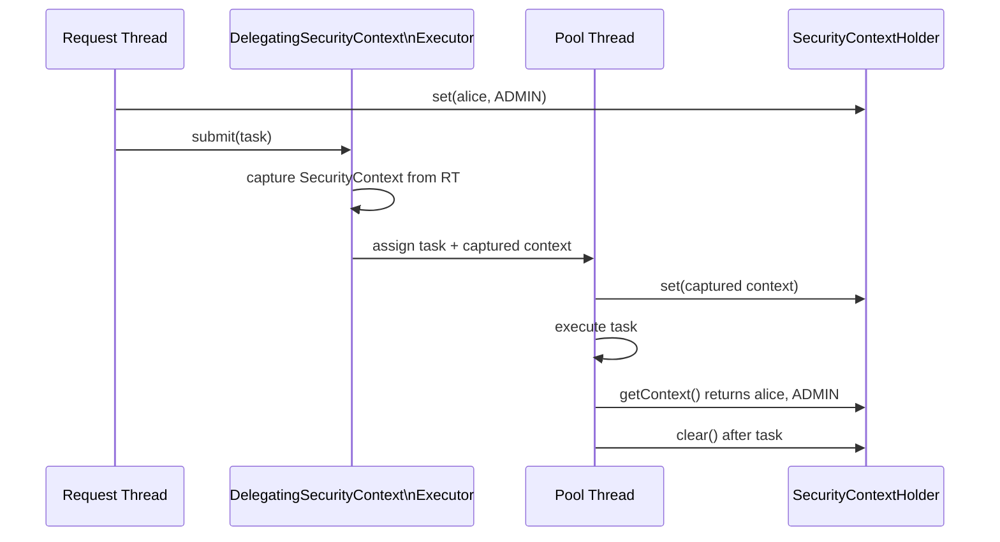

# Async Java - L3 Security

---

# Secure Async Patterns in Java

---
id: AJA-025
title: Secure Async Patterns in Java
category: Async Java
difficulty: ★★☆
interview_weight: high
asked_at: Mid-Senior
seniority: senior
status: draft
version: 1
---

### 🎯 Model Answer

**30 seconds:**
> Async Java introduces unique security risks: (1) ThreadLocal-based security
> contexts don't propagate across thread boundaries (reactive code, virtual
> threads); (2) async operations can complete after the security check, leading
> to TOCTOU vulnerabilities; (3) CompletableFuture callbacks may run with
> wrong caller credentials. Key fix: use `SecurityContext`-aware executors and
> Reactor Context for WebFlux, and always validate authorization AT EXECUTION
> TIME, not just at request entry.

**3 minutes:**
> Traditional Spring Security uses `ThreadLocal<SecurityContext>` to carry
> the current user's credentials. In blocking MVC code, this works because
> one thread handles the entire request - the ThreadLocal is available
> throughout.
>
> In async Java, three scenarios break this:
>
> **1. CompletableFuture callbacks run on pool threads:**
> The callback thread has a different ThreadLocal from the original request
> thread. `SecurityContextHolder.getContext()` returns empty in the callback.
>
> **2. Reactive pipelines switch schedulers:**
> `publishOn(Schedulers.parallel())` switches threads. After the switch,
> ThreadLocal is gone. WebFlux solves this with Reactor Context.
>
> **3. Virtual threads:**
> Virtual threads are newly created; they don't inherit the parent thread's
> ThreadLocal values by default.
>
> Solutions: (a) propagate SecurityContext explicitly to async executors;
> (b) use Spring's `DelegatingSecurityContextExecutor` wrapper; (c) in
> WebFlux, use `ReactiveSecurityContextHolder` which reads from Reactor Context.

**Blank Mind Recovery:**

**(1) Restate:** "Secure async patterns - how security context works in async
code. Problem: ThreadLocal doesn't cross thread boundaries. Solution: wrap
executors to propagate context."

**(2) First principles:** "Security context = 'who is running this code?'
In sync code: one thread = one user, ThreadLocal works. In async code:
callbacks run on different threads. Need to carry 'who' across thread hops."

**(3) Bridge:** "Like a security badge: in an office, you wear your badge
(ThreadLocal). When you send a message to someone else (async callback),
you attach a photocopy of your badge to the message. They verify it before
acting. DelegatingSecurityContextExecutor is the 'badge copy' mechanism."

---

### 📘 Concept Explanation

**What it is:**
Security considerations specific to asynchronous Java programming. Covers
the propagation of security context across thread boundaries, authorization
timing in async flows, secure patterns for sensitive async operations, and
Spring Security integration with reactive and virtual thread contexts.

**The problem it solves:**
Security checks performed only at request entry points may not be enforceable
for async callbacks, background tasks, or reactive pipeline segments that run
on different threads with no security context.

**SecurityContext propagation failure:**

```
Blocking Spring MVC (works):
  Request thread: SecurityContext = {user: alice, role: ADMIN}
  ThreadLocal[SecurityContext] = {user: alice}
  Handler runs -> SecurityContextHolder.getContext() = alice ✓
  Response returned -> ThreadLocal cleared

Async CompletableFuture (BREAKS):
  Request thread: SecurityContext = {user: alice}
  CompletableFuture.supplyAsync(() -> {
      // runs on pool-1-thread-1
      SecurityContextHolder.getContext(); // EMPTY! New thread
  });
```

**Thread-based security context mechanisms:**

```
Standard: SecurityContextHolder (ThreadLocal)
  - Works for single-thread request handling
  - Fails for async callbacks, parallel work

DelegatingSecurityContextExecutor:
  - Wraps any Executor
  - Captures SecurityContext at submission time
  - Sets it on the callback thread before execution
  - Clears after execution

DelegatingSecurityContextRunnable:
  - Wraps any Runnable
  - Same: set context before run, clear after

Reactive: ReactiveSecurityContextHolder
  - Reads from Reactor Context (not ThreadLocal)
  - Works across scheduler switches
  - Integrated with Spring Security 5+ WebFlux
```

**TOCTOU (Time-of-Check vs Time-of-Use) vulnerability:**

```
VULNERABLE PATTERN:
  1. t=0: Check permission (user has WRITE access) ✓
  2. t=1: Submit async work to executor
  3. t=2: User's role DOWNGRADED to READ-ONLY
  4. t=3: Async callback executes the write operation
  -> Write executed after privilege was revoked!

SECURE PATTERN:
  1. t=0: Check permission ✓
  2. t=1: Capture current auth token (short-lived)
  3. t=2: Submit async work with captured token
  4. t=3: Async callback validates token before write
  -> If token expired: operation rejected
```

**Sensitive data in async contexts:**

- **Thread dumps**: async callbacks may contain sensitive data in stack
  frames. Enable security for thread dump access via JMX/JDK tools.
- **CompletableFuture.get() timeout**: always use timeout to prevent
  indefinite blocking waiting for external data
- **Error propagation**: exception messages in async callbacks may leak
  sensitive data if logged without filtering

---

### 💻 Code Example

**Secure async patterns in Spring:**

```java
// 1. DelegatingSecurityContextExecutor for CF
// BAD: security context lost in pool thread
@Async
public CompletableFuture<Report> generateReport(
        String userId) {
    // pool thread has NO security context
    String currentUser = SecurityContextHolder
        .getContext().getAuthentication().getName();
    // NullPointerException or empty!
    return CompletableFuture.completedFuture(
        buildReport(currentUser));
}

// GOOD: wrap executor with security context delegation
@Bean
public Executor securityContextExecutor() {
    return new DelegatingSecurityContextExecutor(
        Executors.newFixedThreadPool(10));
    // Captures context at task submission time
    // Restores it on the executing thread
}

@Async("securityContextExecutor")
public CompletableFuture<Report> generateReport(
        String userId) {
    // Context properly propagated
    String currentUser = SecurityContextHolder
        .getContext().getAuthentication().getName(); // works!
    return CompletableFuture.completedFuture(
        buildReport(currentUser));
}

// 2. Reactive: use ReactiveSecurityContextHolder
@GetMapping("/report")
public Mono<Report> generateReport() {
    return ReactiveSecurityContextHolder.getContext()
        .map(ctx -> ctx.getAuthentication())
        .flatMap(auth ->
            reportService.generate(auth.getName()));
    // Works across scheduler changes - uses Reactor Context
}

// 3. Explicit authorization at execution time (TOCTOU prevention)
public CompletableFuture<Void> deleteRecord(
        String recordId,
        Authentication auth) {
    // Capture auth snapshot at submission time
    String userId = auth.getName();
    Collection<String> roles = auth.getAuthorities()
        .stream().map(a -> a.getAuthority()).toList();

    return CompletableFuture.runAsync(() -> {
        // Re-validate at execution time
        if (!roles.contains("ROLE_ADMIN")) {
            throw new AccessDeniedException(
                "User " + userId +
                " does not have ADMIN role");
        }
        // Authorization re-checked at execution
        recordRepository.delete(recordId);
    }, executor);
}

// 4. Secure WebClient: propagate token in async HTTP calls
@Component
public class SecureWebClientFactory {
    public WebClient createWithToken(String bearerToken) {
        return WebClient.builder()
            .defaultHeader(
                HttpHeaders.AUTHORIZATION,
                "Bearer " + bearerToken)
            .build();
    }
}

// In reactive service: read token from context
public Mono<ExternalData> fetchExternal() {
    return ReactiveSecurityContextHolder.getContext()
        .map(ctx -> extractToken(ctx.getAuthentication()))
        .flatMap(token ->
            webClientFactory.createWithToken(token)
                .get()
                .uri("/external/data")
                .retrieve()
                .bodyToMono(ExternalData.class));
}

// 5. Sensitive data: never log auth tokens
// BAD: may expose token in logs
log.debug("Fetching data with auth: {}",
    request.getHeader("Authorization"));

// GOOD: log only safe info
log.debug("Fetching data for user: {}",
    SecurityContextHolder.getContext()
        .getAuthentication().getName());
```

> **Code walkthrough:** Pattern 1 shows the core problem and fix for
> Spring `@Async` methods: the default executor does not propagate
> `SecurityContext`, so the callback thread has an empty security context.
> `DelegatingSecurityContextExecutor` wraps the executor and captures the
> security context at task submission (on the request thread), then restores
> it on the callback thread before execution. Pattern 2 shows the WebFlux
> approach: `ReactiveSecurityContextHolder` reads from Reactor Context, not
> ThreadLocal, so it works correctly across scheduler switches. Pattern 3
> shows the TOCTOU prevention: capture the auth at submission, then RE-VALIDATE
> at execution time. This ensures the operation is rejected if credentials
> were revoked between submission and execution.

---

### 🎓 Answers by Seniority

**Junior / Mid:**
> The main security issue with async Java is that ThreadLocal (which Spring
> Security uses for SecurityContext) doesn't work across thread boundaries.
> When I use `@Async` or CompletableFuture, the pool thread that runs the
> callback doesn't have the original request's security context. The fix is
> to use `DelegatingSecurityContextExecutor` which captures the context and
> restores it on the callback thread. In WebFlux, I use
> `ReactiveSecurityContextHolder` which reads from Reactor Context instead
> of ThreadLocal, so it works correctly.

*Push deeper:* What is a TOCTOU vulnerability and how does it apply to
async authorization checks?

---

**Senior / Staff:**
> Async security has three distinct failure modes: context propagation,
> TOCTOU (Time-of-Check vs Time-of-Use), and sensitive data exposure.
>
> Context propagation: Spring Security's `SecurityContextHolder` is
> ThreadLocal. Async callbacks run on different threads. Fix: wrap executors
> with `DelegatingSecurityContextExecutor`. For WebFlux: Reactor Context
> carries authentication, `ReactiveSecurityContextHolder` reads it.
>
> TOCTOU: a user's permissions may change between the authorization check
> (request entry) and the async operation execution. For high-risk operations
> (deletes, privilege escalations, financial writes): re-validate authorization
> at execution time, not just entry time. Use short-lived scoped tokens.
>
> Sensitive data: async error handlers that log exception messages may expose
> sensitive data (user IDs, record values) in stack traces. Use structured
> logging with field-level filtering. Never log request headers (Authorization,
> Cookie) in async callbacks.

---

### ⚠️ Common Misconceptions

**Misconception: "Authorization at request entry is sufficient for async operations."**

Authorization at the entry point (WebFilter, `@PreAuthorize`) checks
permissions when the request arrives. For synchronous code, this is
sufficient. For async operations: the operation may execute seconds or
minutes later, after the user's role has changed (revoked admin access,
user deleted, token expired). For sensitive async operations - especially
those that are queued or deferred - re-validate authorization at execution
time. This is particularly important for: batch operations, scheduled tasks
using captured user context, and queue-based processing where requests are
enqueued and processed later.

---

### 🚨 Failure Modes and Diagnosis

**Failure: SecurityContext not available in @Async callback**

Symptom: `NullPointerException` or `IllegalStateException` when accessing
`SecurityContextHolder.getContext().getAuthentication()` inside an `@Async`
method. OR: method executes with wrong user's permissions.

Cause: Spring's default `ThreadPoolTaskExecutor` for `@Async` does not
configure `DelegatingSecurityContextExecutor`.

```bash
# Thread dump during NullPointerException:
# Look for stack trace in pool thread:
# at com.yourapp.ReportService.generateReport(ReportService.java:42)
# at java.util.concurrent.ThreadPoolExecutor.runWorker(...)
# Note: NOT "http-nio-8080-exec-X" (request thread)
# Pool threads don't inherit request thread's ThreadLocal

# Verify by checking thread name in @Async method:
log.debug("Thread: {}", Thread.currentThread().getName());
// Logs: "taskExecutor-1" (pool thread) - no security context
// vs "http-nio-8080-exec-1" (request thread) - has security context
```

Fix:
```java
@Configuration
@EnableAsync
class AsyncConfig implements AsyncConfigurer {
    @Override
    public Executor getAsyncExecutor() {
        ThreadPoolTaskExecutor exec =
            new ThreadPoolTaskExecutor();
        exec.setThreadNamePrefix("async-");
        exec.initialize();
        return new DelegatingSecurityContextExecutor(exec);
    }
}
```

---

### 🎯 Interview Deep-Dive

**Timing:** Medium ★★☆ - 9 questions minimum.

---

#### Q1 - How does Spring Security propagate SecurityContext in async code?

Spring Security's `SecurityContextHolder` uses a `SecurityContextHolderStrategy`
to store context. Three strategies:

1. `MODE_THREADLOCAL` (default): one context per thread (ThreadLocal)
2. `MODE_INHERITABLETHREADLOCAL`: child threads inherit parent's context
   (works for `Thread.start()`, NOT for thread pool reuse)
3. `MODE_GLOBAL`: single context for entire JVM (not for production)

For `@Async` with thread pools (MODE_THREADLOCAL):
- Pool threads are REUSED, not new child threads
- `InheritableThreadLocal` inheritance only applies to NEW threads
- Pool threads don't inherit context from submitting thread

Solutions in order of preference:

```java
// Solution 1: DelegatingSecurityContextExecutor (recommended)
@Bean
Executor secureExecutor() {
    return new DelegatingSecurityContextExecutor(
        Executors.newFixedThreadPool(10));
}
// Captures SecurityContext from submitting thread
// Restores on callback thread for each task

// Solution 2: DelegatingSecurityContextRunnable for manual async
SecurityContext context =
    SecurityContextHolder.getContext();
CompletableFuture.runAsync(
    new DelegatingSecurityContextRunnable(
        () -> doWork(), context));

// Solution 3: Spring's MODE_INHERITABLETHREADLOCAL
// (only safe if you always create new threads, not pool threads)
SecurityContextHolder.setStrategyName(
    SecurityContextHolder.MODE_INHERITABLETHREADLOCAL);
```

*What separates good from great:* `DelegatingSecurityContextExecutor` uses
a `Supplier<SecurityContext>` - by default it captures the context from
the SUBMITTING thread. For cases where you want to run async tasks with
a DIFFERENT security context (e.g., system-level background jobs):
```java
// Run with system-level security context (no user)
SecurityContext systemContext = SecurityContextHolder
    .createEmptyContext();
CompletableFuture.runAsync(
    new DelegatingSecurityContextRunnable(
        () -> systemLevelJob(), systemContext));
```

---

#### Q2 - How does Spring Security WebFlux propagate authentication?

WebFlux cannot use ThreadLocal because reactive pipelines switch threads.
Spring Security WebFlux uses Reactor Context:

```
Authentication stored in:
  ThreadLocal (MVC) -> Reactor Context (WebFlux)

Access in reactive pipeline:
  ReactiveSecurityContextHolder.getContext()
  -> reads from Reactor Context
  -> returns Mono<SecurityContext>

Set by Spring Security WebFlux:
  ReactorContextWebFilter (added by SecurityWebFilterChain)
  -> reads JWT/session -> sets Authentication in Reactor Context
  -> context propagates to all downstream operators
```

```java
// Read authentication in reactive service:
public Mono<UserProfile> getProfile() {
    return ReactiveSecurityContextHolder.getContext()
        .map(SecurityContext::getAuthentication)
        .flatMap(auth -> {
            String username = auth.getName();
            return profileRepo.findByUsername(username);
        });
}

// Read in functional handler:
public Mono<ServerResponse> getProfile(ServerRequest req) {
    return req.principal()
        .cast(Authentication.class)
        .flatMap(auth ->
            profileRepo.findByUsername(auth.getName()))
        .flatMap(profile ->
            ServerResponse.ok().bodyValue(profile));
}
```

*What separates good from great:* Context propagation through subscriber
chain: when `contextWrite(Context.of("key", "value"))` is used, the context
travels from the subscriber toward the source. Spring Security sets the
context from the outermost subscription (HTTP filter level), so it's
available to all operators in the chain via `deferContextual` or
`ReactiveSecurityContextHolder`.

---

#### Q3 - What is the TOCTOU vulnerability in async authorization?

TOCTOU = Time-of-Check vs Time-of-Use. In authorization:
- CHECK: verify user has permission (at request time)
- USE: execute the authorized operation (may be later, on different thread)

If the user's permissions change between CHECK and USE, the authorization
is stale:

```
Example scenario:
  1. Admin user submits long-running report job
  2. Authorization check: user.hasRole(ADMIN) = TRUE -> submit
  3. Job queued for execution
  4. Admin role removed from user (by another admin)
  5. Job executes: reads ALL_USER_DATA (admin-only operation)
  -> User no longer admin but executed admin operation!

Code pattern:
  @PostMapping("/reports/generate")
  public CompletableFuture<Report> generate(
          @AuthenticationPrincipal UserDetails user) {
      if (!user.getAuthorities().contains(ADMIN)) {
          throw new AccessDeniedException("...");
      }
      // Authorization checked here ^
      return executor.submit(() -> {
          // This runs later, possibly after role revoked
          return reportService.generateFullReport(); // TOCTOU!
      });
  }
```

Mitigations:

1. **Short-lived operation**: TOCTOU risk is low for operations completing
   in milliseconds. Risk increases with operation duration and queueing.

2. **Re-validate at execution time**:
   ```java
   return executor.submit(() -> {
       // Re-check authorization at execution time
       verifyCurrentUserHasAdminRole(userId);
       return reportService.generateFullReport();
   });
   ```

3. **Token-based authorization**: issue a short-lived capability token
   at check time; verify the token hasn't been revoked at use time.

*What separates good from great:* For financial and compliance-critical
operations, re-validate authorization is mandatory and often required by
regulations (PCI DSS, SOC 2). The authorization check must be atomic with
the operation: database-level row locking + permission check in a transaction,
or event sourcing with audit trail showing who was authorized when.

---

#### Q4 - How do you prevent sensitive data leaks in async exception handling?

Sensitive data sources in async exceptions:
1. Exception messages containing PII (user names, account numbers)
2. Stack traces exposing internal implementation (schema names, SQL)
3. Error response bodies echoing request data

```java
// BAD: exception message with PII
throw new DatabaseException(
    "User " + userId + " account " + accountNo + " not found");
// If logged: userId and accountNo visible in logs

// BAD: SQL exception propagated to client
CompletableFuture.supplyAsync(() -> {
    try { return db.query(sql); }
    catch (SQLException ex) {
        throw new RuntimeException(ex); // SQL query visible!
    }
});

// GOOD: domain exception with correlation ID only
String errorId = UUID.randomUUID().toString();
log.error("DB query failed [errorId={}]: {}",
    errorId, ex.getMessage()); // full details in log
throw new DataAccessException(
    "Operation failed, ref: " + errorId); // safe for client

// GOOD: map infrastructure exceptions at service boundary
@ExceptionHandler(RuntimeException.class)
public ResponseEntity<ApiError> handleException(
        RuntimeException ex) {
    String correlationId = MDC.get("traceId");
    log.error("Unhandled error [traceId={}]", correlationId, ex);
    return ResponseEntity.status(500)
        .body(new ApiError(
            "Internal error, ref: " + correlationId));
    // Client gets correlation ID to report; no stack trace
}
```

*What separates good from great:* Structured logging fields vs log messages
for PII: structured logging allows field-level redaction:
```java
log.info("User action",
    kv("userId", userId),     // field: can be redacted in log pipeline
    kv("action", "login"),
    kv("success", true));
// Log aggregator can strip "userId" field for compliance
// vs: log.info("User {} logged in", userId) <- embedded in string
```

---

#### Q5 - How do you secure CompletableFuture-based APIs against injection attacks?

Async APIs are vulnerable to the same injection risks as synchronous ones,
with the additional risk that async validation may be bypassed:

```java
// BAD: user input directly in async operation without validation
public CompletableFuture<Data> fetch(String userInput) {
    return CompletableFuture.supplyAsync(() ->
        db.query("SELECT * FROM data WHERE id = '"
            + userInput + "'")); // SQL injection!
}

// BAD: validation at entry but bypass via async callback
public CompletableFuture<Report> generateReport(
        String template) {
    // Validation at entry:
    if (!ALLOWED_TEMPLATES.contains(template)) {
        throw new ValidationException("invalid template");
    }
    // Template passed to async callback - what if it's mutable?
    return executor.submit(() ->
        reportEngine.generate(template)); // safe? maybe not
}

// GOOD: immutable capture + parameterized queries
public CompletableFuture<Data> fetch(String userInput) {
    String sanitizedId = validateAndSanitize(userInput); // throws on invalid
    // Parameterized query: no injection possible
    return CompletableFuture.supplyAsync(() ->
        db.queryById(sanitizedId)); // parameterized
}

// GOOD: validate at execution time (defense in depth)
public CompletableFuture<Report> generateReport(
        String template) {
    String validatedTemplate =
        TemplateValidator.validate(template); // throws on invalid
    return executor.submit(() -> {
        // Re-validate: defense in depth
        TemplateValidator.validate(validatedTemplate);
        return reportEngine.generate(validatedTemplate);
    });
}
```

*What separates good from great:* Async validation: never perform validation
ONLY in the async callback thread. If the callback thread validates but the
submission thread does not, the caller receives an exception asynchronously
(via `cf.get()` throwing `ExecutionException`) instead of synchronously.
This breaks the fail-fast contract and complicates error handling for callers.
Validate at submission time (synchronously) AND optionally at execution time
(defense in depth).

---

#### Q6 - How do virtual threads affect security context propagation?

Virtual threads do NOT inherit the parent thread's ThreadLocal by default:

```java
// ThreadLocal inheritance for virtual threads:
ThreadLocal<String> tl = new ThreadLocal<>();
tl.set("value");

// Platform threads: InheritableThreadLocal inherits to new child threads
// Virtual threads: InheritableThreadLocal works for Thread.ofVirtual().start()
//   but NOT for executor pool reuse

InheritableThreadLocal<String> itl = new InheritableThreadLocal<>();
itl.set("parent-value");

Thread vt = Thread.ofVirtual().start(() -> {
    System.out.println(itl.get()); // "parent-value" - inherited!
});

// BUT: with Executors.newVirtualThreadPerTaskExecutor():
// Each task gets a NEW virtual thread (not the caller's thread)
// The new virtual thread DOES inherit from the creator thread
// But with Spring's @Async, the virtual thread is created by the executor
// NOT by the request thread -> no inheritance
```

Spring Security with virtual threads (Spring Boot 3.2+):
```yaml
spring:
  threads:
    virtual:
      enabled: true
```

With `spring.threads.virtual.enabled=true`, Tomcat uses virtual threads for
HTTP request handling. Each request gets its own virtual thread. ThreadLocal
security context works because the entire request lifecycle (entry through
handler to response) runs on the SAME virtual thread.

BUT for `@Async` methods: virtual thread executor creates new virtual threads
per task. Security context must still be propagated via
`DelegatingSecurityContextExecutor`.

*What separates good from great:* `ScopedValue` (Java 21 preview) is the
structured replacement for ThreadLocal in virtual thread contexts. Unlike
ThreadLocal, ScopedValue is immutable per scope and automatically cleaned
up at scope exit. Spring Security is expected to integrate with ScopedValue
in future versions. For now, `DelegatingSecurityContextExecutor` is the
correct bridge.

---

#### Q7 - How do you audit async operations for security compliance?

Audit requirements: who performed which operation, when, with what data.
Async operations make this harder because the identity at execution time
may differ from the identity at request time.

```java
// Capture audit context at submission time:
record AuditContext(
    String userId,
    String ipAddress,
    String sessionId,
    Instant submittedAt
) {}

public CompletableFuture<Void> deleteRecord(
        String recordId,
        Authentication auth,
        HttpServletRequest request) {

    // Capture immutable audit context at submission time
    AuditContext audit = new AuditContext(
        auth.getName(),
        request.getRemoteAddr(),
        request.getSession().getId(),
        Instant.now());

    return executor.submit(() -> {
        try {
            recordRepository.delete(recordId);
            auditService.log(new AuditEvent(
                "RECORD_DELETED",
                recordId,
                audit));
        } catch (Exception ex) {
            auditService.log(new AuditEvent(
                "RECORD_DELETE_FAILED",
                recordId,
                audit,
                ex.getMessage()));
            throw ex;
        }
    });
}
```

*What separates good from great:* Audit logs for async operations should
include BOTH the submission time and the execution time. For compliance
(GDPR, HIPAA, PCI DSS), the audit trail must show: who authorized the
operation (submission), when it was authorized, when it actually executed,
and whether it succeeded or failed. A single timestamp is insufficient when
there's a gap between authorization and execution.

---

#### Q8 - How do you prevent SSRF in reactive WebClient calls?

Server-Side Request Forgery (SSRF): an attacker controls a URL that is
fetched by the server, potentially reaching internal services.

```java
// BAD: user-controlled URL fetched directly
public Mono<String> fetchUrl(String userProvidedUrl) {
    return webClient.get()
        .uri(userProvidedUrl) // SSRF vulnerability!
        .retrieve()
        .bodyToMono(String.class);
}
// Attacker: userProvidedUrl = "http://internal.db:5432/admin"

// GOOD: allowlist of permitted domains
private static final Set<String> ALLOWED_HOSTS = Set.of(
    "api.external.com",
    "data.partner.com"
);

public Mono<String> fetchUrl(String userProvidedUrl) {
    URI uri;
    try {
        uri = new URI(userProvidedUrl);
    } catch (URISyntaxException ex) {
        return Mono.error(new ValidationException("Invalid URL"));
    }

    String host = uri.getHost();
    if (host == null || !ALLOWED_HOSTS.contains(host)) {
        return Mono.error(new SecurityException(
            "URL not in allowlist: " + host));
    }

    // Only HTTPS allowed
    if (!"https".equalsIgnoreCase(uri.getScheme())) {
        return Mono.error(new SecurityException(
            "Only HTTPS URLs permitted"));
    }

    return webClient.get()
        .uri(uri)
        .retrieve()
        .bodyToMono(String.class);
}
```

*What separates good from great:* The allowlist must check the RESOLVED
IP, not just the hostname, to prevent DNS rebinding attacks. After DNS
resolution, check that the resolved IP is not in private address ranges
(10.0.0.0/8, 172.16.0.0/12, 192.168.0.0/16, 127.0.0.0/8). This is
especially important in cloud environments where internal services may
use non-obvious private IPs.

---

#### Q9 - How do you securely handle secrets in async Java code?

Secrets (API keys, DB passwords, tokens) in async code:

```java
// BAD: secret in exception message (logged and visible)
CompletableFuture.supplyAsync(() -> {
    try {
        return apiClient.call(apiKey, endpoint);
    } catch (ApiException ex) {
        // NEVER include secret in exception:
        throw new ServiceException(
            "API call failed with key: " + apiKey); // BAD!
    }
});

// BAD: secret in thread name (visible in thread dumps)
Thread.ofVirtual()
    .name("api-call-" + apiKey) // DO NOT put secrets in thread names!
    .start(task);

// BAD: secret stored in ThreadLocal (may leak to next request)
ThreadLocal<String> TOKEN_LOCAL = new ThreadLocal<>();
TOKEN_LOCAL.set(authToken);
// If not cleared: token persists on thread, leaks to next request

// GOOD: scoped secret handling
Mono<Response> callWithToken(String operation) {
    return tokenProvider.getToken()   // short-lived token
        .flatMap(token ->
            webClient.get()
                .uri("/api/" + operation)
                .headers(h -> h.setBearerAuth(token))
                .retrieve()
                .bodyToMono(Response.class)
                // Token used only in this scope; not stored in field
        );
    // Token goes out of scope after subscribe completes
}

// GOOD: in CompletableFuture context
public CompletableFuture<Response> callSecurely(
        String operation) {
    char[] tokenChars = tokenProvider.getToken(); // char[] clears faster
    try {
        return serviceClient.call(operation,
            new String(tokenChars)); // use once
    } finally {
        Arrays.fill(tokenChars, '\0'); // zero out immediately
    }
}
```

*What separates good from great:* `char[]` for secret storage: Java's
`String` is immutable and interned in the string pool. A `String` containing
a secret cannot be cleared from memory. `char[]` can be zeroed after use
with `Arrays.fill(chars, '\0')`. This reduces the window where the secret
is in memory (important for memory dump security).

---

### ⚖️ Comparison Table

**Security context propagation by async mechanism:**

| Mechanism | SecurityContext Available? | Solution |
|---|---|---|
| Spring MVC (sync) | Yes (ThreadLocal) | Native |
| `@Async` default | No (pool thread) | DelegatingSecurityContextExecutor |
| CompletableFuture | No (pool thread) | DelegatingSecurityContextRunnable |
| Virtual threads | Inherited from creator | DelegatingSecurityContextExecutor |
| Spring WebFlux | Via Reactor Context | ReactiveSecurityContextHolder |
| Kafka consumer | No (kafka thread) | Manual propagation from event |

---

### 🏛️ System Design

*(Omit: L3 ★★☆ entry. Architecture decisions at L5.)*

---

### 📊 Diagram

**Security context propagation across thread boundaries:**

```
Request Thread (request-1):
  SecurityContext = {user: alice, role: ADMIN}
  ThreadLocal[SecurityContext] = {alice, ADMIN}
     |
     | DelegatingSecurityContextExecutor
     | captures SecurityContext at submission
     v
Pool Thread (pool-1):
  Executor sets: ThreadLocal = {alice, ADMIN}   (before task)
  Task runs: SecurityContextHolder.getContext() = alice ✓
  Executor clears: ThreadLocal = null            (after task)

WebFlux Reactor Context:
  HttpRequest -> ReactorContextWebFilter
              -> Reactor Context = {SecurityContext: {alice, ADMIN}}
              -> propagates through all reactive operators
              -> ReactiveSecurityContextHolder.getContext() works ✓
```



> **Diagram walkthrough:** The sequence shows how DelegatingSecurityContextExecutor
> bridges ThreadLocal security context across thread boundaries. When the
> request thread submits a task, the executor captures the current SecurityContext.
> When the pool thread starts the task, the executor sets the captured context
> as the pool thread's current SecurityContext. The task sees the correct user
> identity. After the task completes, the executor clears the pool thread's
> SecurityContext to prevent it from leaking to the next task assigned to
> this thread (which may be for a different user).
