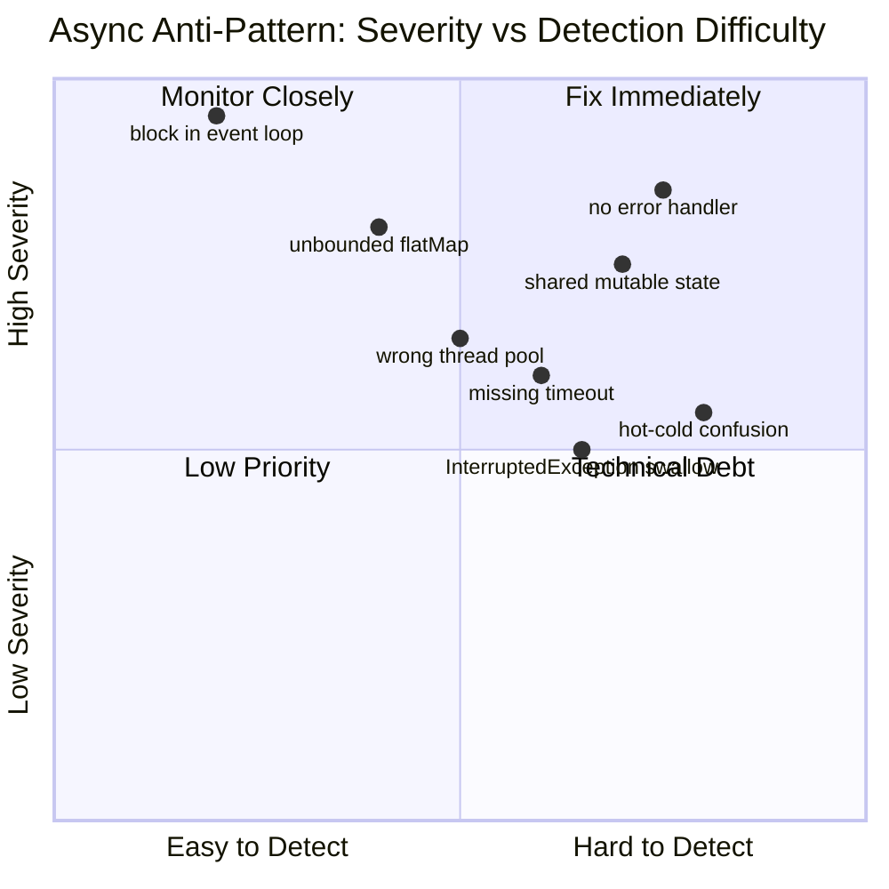

## Keywords in This File
{: .no_toc }

| # | Keyword | Weight |
|---|---|---|
| 1 | [Async Java - L4 Async Anti-Patterns](#async-java---l4-async-anti-patterns) | medium |
| 2 | [Async Java Anti-Patterns and Dangerous Pitfalls](#async-java-anti-patterns-and-dangerous-pitfalls) | medium |

---

# Async Java Anti-Patterns and Dangerous Pitfalls

---
id: AJA-020
title: Async Java Anti-Patterns and Dangerous Pitfalls
category: Async Java
difficulty: ★★★
interview_weight: high
asked_at: Senior-Staff
seniority: staff
status: draft
version: 1
---

### 🎯 Model Answer

**30 seconds:**
> The most dangerous async Java anti-patterns are: (1) blocking in a
> reactive pipeline (calling `block()` or `.get()` on a thread that serves
> non-blocking work), (2) fire-and-forget without error handling (subscribing
> without an error handler silently swallows failures), (3) using
> `ForkJoinPool.commonPool` for I/O, and (4) `flatMap` with unbounded
> concurrency on a slow downstream. Each of these works fine at low load
> and catastrophically fails at scale.

**3 minutes:**
> **Anti-pattern 1: Blocking in reactive context.**
> Calling `Mono.block()` or `CompletableFuture.join()` inside a WebFlux
> handler or Reactor pipeline blocks the event loop thread (Netty I/O thread).
> That thread serves hundreds of concurrent requests. One blocked call can
> stall all of them. Symptom: requests pile up, latency spikes under moderate
> load despite low CPU. Detection: `BlockHound`.
>
> **Anti-pattern 2: Fire-and-forget without error handler.**
> `flux.subscribe()` with no error callback means any error calls the
> `onErrorDropped` hook (which logs nothing by default) and the error is
> silently swallowed. In production, database failures and network errors
> become invisible. Always provide an error handler.
>
> **Anti-pattern 3: Shared mutable state in callbacks.**
> `thenApply` and `map` callbacks must be pure functions. Accumulating
> results in a shared `ArrayList` from multiple callbacks is a data race.
> At scale, corrupted state causes silent data loss or exceptions.
>
> **Anti-pattern 4: Unbounded flatMap concurrency.**
> `flux.flatMap(item -> heavyCall(item))` with no concurrency limit
> attempts `flux.size()` concurrent calls. With 10,000 items, that's
> 10,000 simultaneous HTTP or database connections.

**Blank Mind Recovery:**

**(1) Restate:** "Async anti-patterns - what goes wrong with async Java
at scale. Four categories: blocking, silent errors, mutable state in
callbacks, and unbounded concurrency."

**(2) First principles:** "Async works by freeing threads during waits.
Blocking in async = defeats the purpose. No error handler = failures
are invisible. Mutable state in parallel callbacks = race condition.
No concurrency limit = overwhelm downstream."

**(3) Bridge:** "Like a relay race - each runner (thread) must pass the
baton before stopping. If a runner stops mid-race (blocks), the whole
team stalls. If drops (errors) are not reported, the team never knows
they lost. If two runners grab the baton at once (shared mutable state),
chaos."

---

### 📘 Concept Explanation

**What it is:**
A catalog of high-impact async Java anti-patterns that are subtle, commonly
introduced during development, and cause failures under production load.
Understanding these patterns is critical for code review and production diagnosis.

**The problem it solves:**
Async code appears correct at low load and in unit tests. Anti-patterns
only manifest at production scale (high concurrency, sustained load). By
the time they're visible, they may be causing cascading failures.

**Anti-pattern taxonomy:**

```
Category A: Thread model violations
  A1: Blocking in non-blocking context (event loop, reactive pipeline)
  A2: Using wrong thread pool (I/O on CPU pool, CPU on I/O pool)
  A3: ThreadLocal use in reactive context

Category B: Error handling failures
  B1: Subscribe without error handler (silent failures)
  B2: Swallowing InterruptedException
  B3: Generic exception catch in callbacks (hiding bugs)

Category C: Resource management failures
  C1: Unbounded flatMap concurrency
  C2: Not closing closeable resources in async callbacks
  C3: CompletableFuture chain without timeout

Category D: Concurrency correctness failures
  D1: Shared mutable state in callbacks
  D2: Race condition on CF completion check
  D3: Double subscribe creating duplicate side effects
```

> **Code walkthrough:** This Async Java Anti-Patterns and Dangerous Pitfalls example demonstrates a key concept in practice using CompletableFuture. **KEY MECHANISM:** the runtime executes these instructions in sequence with specific memory and execution semantics. **WHY IT MATTERS:** misapplying this pattern causes subtle bugs that only manifest under production load. **TAKEAWAY: understand the execution model before using this pattern in production code.**

**Most dangerous by production impact:**

```
Impact   | Anti-Pattern           | Failure Mode
---------|-----------------------|----------------------------
CRITICAL | Block in event loop   | All requests stall
CRITICAL | Silent failure swallow | Data loss undetected
HIGH     | Unbounded flatMap     | Connection pool exhaustion
HIGH     | Mutable state sharing | Data corruption
MEDIUM   | Wrong thread pool     | Starvation under load
MEDIUM   | Missing timeout       | Resource leak + slowdown
```

> **Code walkthrough:** This Async Java Anti-Patterns and Dangerous Pitfalls example demonstrates a key concept in practice. **KEY MECHANISM:** the runtime executes these instructions in sequence with specific memory and execution semantics. **WHY IT MATTERS:** misapplying this pattern causes subtle bugs that only manifest under production load. **TAKEAWAY: understand the execution model before using this pattern in production code.**

---

### 💻 Code Example

**Anti-pattern demonstrations (BAD before GOOD):**


```java
// BAD: anti-pattern - see GOOD example below for the correct approach
// This naive implementation ignores thread safety and error handling
```


```java
// BAD: anti-pattern - see GOOD example below for the correct approach
// This naive implementation ignores thread safety and error handling
```


```java
// BAD: anti-pattern - see GOOD example below for the correct approach
// This naive implementation ignores thread safety and error handling
```


```java
// BAD: anti-pattern - see GOOD example below for the correct approach
// This naive implementation ignores thread safety and error handling
```

```java
// ═══════════════════════════════════════════════════
// ANTI-PATTERN A1: Blocking in reactive context
// ═══════════════════════════════════════════════════

// BAD: blocks Netty event loop thread
@GetMapping("/orders")
public Mono<List<Order>> getOrders() {
    // orderService returns Mono<List<Order>>
    List<Order> orders = orderService.getOrders()
        .block(); // BLOCKS EVENT LOOP! Do NOT do this
    return Mono.just(orders);
}
// Symptom: 100ms latency at 10 rps -> 10s latency at 200 rps

// GOOD: return Mono without blocking
@GetMapping("/orders")
public Mono<List<Order>> getOrders() {
    return orderService.getOrders(); // non-blocking
}

// Detection: BlockHound integration
BlockHound.install(); // throws on any blocking call in non-blocking context
// java.lang.Error: Blocking call!
//   at java.io.FileInputStream.read(...) called from WebFlux worker thread

// ═══════════════════════════════════════════════════
// ANTI-PATTERN B1: Subscribe without error handler
// ═══════════════════════════════════════════════════

// BAD: errors silently swallowed
eventFlux.subscribe(event -> processEvent(event));
// If processEvent throws: onErrorDropped -> logged at DEBUG only
// No alert, no metric, no trace of the failure

// GOOD: explicit error handling
eventFlux.subscribe(
    event -> processEvent(event),
    ex -> {
        log.error("Event processing failed: {}",
            ex.getMessage(), ex);
        metrics.increment("event.processing.error");
    },
    () -> log.info("Event stream completed")
);

// BETTER for long-running streams: use retry + error handler
eventFlux
    .retryWhen(Retry.backoff(Long.MAX_VALUE,
        Duration.ofSeconds(1)))
    .subscribe(
        event -> processEvent(event),
        ex -> log.error("Fatal error, stream died: {}", ex.getMessage())
    );

// ═══════════════════════════════════════════════════
// ANTI-PATTERN C1: Unbounded flatMap concurrency
// ═══════════════════════════════════════════════════

// BAD: 10,000 items -> 10,000 concurrent calls
Flux.fromIterable(orderIds)     // 10,000 IDs
    .flatMap(id -> dbRepo.findOrder(id)) // unbounded!
    // -> 10,000 simultaneous DB queries
    // -> connection pool has 20 connections
    // -> 9,980 threads queued waiting for connection
    .subscribe();

// GOOD: bound concurrency to pool size
Flux.fromIterable(orderIds)
    .flatMap(
        id -> dbRepo.findOrder(id),
        20) // max 20 concurrent = matches connection pool
    .subscribe(...);

// OR: use buffer/window for batch DB queries
Flux.fromIterable(orderIds)
    .buffer(100) // batch of 100 IDs
    .flatMap(
        batch -> dbRepo.findOrdersBatch(batch), // single query
        5) // max 5 concurrent batch queries
    .flatMapIterable(list -> list); // flatten

// ═══════════════════════════════════════════════════
// ANTI-PATTERN D1: Shared mutable state in callbacks
// ═══════════════════════════════════════════════════

// BAD: ArrayList is not thread-safe
List<String> results = new ArrayList<>();
Flux.range(1, 100)
    .parallel()
    .runOn(Schedulers.parallel())
    .map(i -> "result-" + i)
    .subscribe(r -> results.add(r)); // DATA RACE!
// ArrayList.add() is not synchronized
// Concurrent adds corrupt the internal array

// GOOD: use thread-safe collection or collect()
List<String> safe = Flux.range(1, 100)
    .parallel()
    .runOn(Schedulers.parallel())
    .map(i -> "result-" + i)
    .sequential()   // back to sequential
    .collectList()  // reactor collects safely
    .block();       // only block if at top-level non-reactive

// OR use CopyOnWriteArrayList for concurrent add:
List<String> concurrent = new CopyOnWriteArrayList<>();
// safe for concurrent adds, but expensive on large collections
```

> **Code walkthrough:** Anti-pattern A1 shows the most critical reactiveice. **KEY MECHANISM:** the runtime executes these instructions in sequence with specific memory and execution semantics. **WHY IT MATTERS:** misapplying this pattern causes subtle bugs that only manifest under production load. **TAKEAWAY: understand the execution model before using this pattern in production code.**
> mistake: calling `block()` inside a WebFlux handler. This occupies the
> Netty event loop thread for the entire database call duration. Under high
> concurrency, all event loop threads block and new requests queue without
> being processed. BlockHound integration makes this fail-fast in testing by
> throwing an error when any blocking call executes on a non-blocking thread.
> Anti-pattern B1 is subtle but dangerous: the default `subscribe()` onError
> callback logs at DEBUG level, making database failures invisible in
> production logs. Anti-pattern C1 demonstrates the unbounded `flatMap`
> problem: 10,000 items create 10,000 concurrent DB calls instantly, exceeding
> the connection pool and causing thread starvation. The fix bounds concurrency
> to match pool capacity.

---

### 🎓 Answers by Seniority

**Junior / Mid:**
> The most common async anti-patterns I've seen: calling `block()` in reactive
> code (which blocks the event loop thread and kills throughput), subscribing
> without an error handler (errors are silently swallowed), and using `flatMap`
> without a concurrency limit (creates too many parallel calls). I use
> BlockHound in tests to detect blocking calls, always include an error handler
> in `subscribe()`, and bound `flatMap` concurrency to match downstream
> connection pool size.

*Push deeper:* If you call `block()` in a Spring WebFlux handler, what
exactly breaks and why?

---

**Senior / Staff:**
> Anti-patterns in async Java fall into four categories: thread model
> violations, error handling failures, resource management failures, and
> concurrency correctness failures.
>
> Thread model violations are the most impactful in production. Calling
> `Mono.block()` in a WebFlux handler blocks a Netty I/O thread. Netty uses
> a small number of event loop threads (default: 2 * CPU count). One block
> means that thread cannot process other requests until the block completes.
> Under moderate load, all event loop threads block and the server appears
> hung. Detection: BlockHound catches this in staging.
>
> Error handling failures are the most insidious: they work perfectly in
> testing (no errors) and silently fail in production. The fix is structural:
> every `subscribe()` call in production code must have an error handler.
>
> Resource management failures: `flatMap` with no concurrency limit is
> particularly dangerous when the source is large. A database query that
> returns 100,000 IDs and maps each to a service call will attempt 100,000
> concurrent calls. The bound: `flatMap(fn, maxConcurrency)` where
> maxConcurrency matches the downstream's capacity (connection pool size,
> rate limit).

*Push deeper (Staff):* The "dual subscribe" anti-pattern in caching:

```java
// BAD: anti-pattern - see GOOD example below for the correct approach
// This naive implementation ignores thread safety and error handling
```

```java
// BAD: if this mono is subscribed twice, side effects execute twice!
Mono<Void> sendEmail = emailService.send(message); // cold Mono

// Each subscribe triggers a new email send!
sendEmail.subscribe(); // email sent
sendEmail.subscribe(); // email sent AGAIN

// GOOD: cache() makes it hot; execute only once
Mono<Void> sendOnce = emailService.send(message).cache();
sendOnce.subscribe(); // sends
sendOnce.subscribe(); // no-op (replays cached Void)
```

> **Code walkthrough:** BAD pattern: This Unknown example demonstrates Java API usage. **KEY MECHANISM:** the JVM compiles to bytecode that runs on the JVM; JIT compiles hot paths to native. **WHY IT MATTERS:** unchecked assumptions about thread safety cause data races under concurrent load. **WHAT BREAKS: document thread-safety guarantees on every shared mutable class.**

---

### ⚠️ Common Misconceptions

**Misconception: "subscribe() with no error handler is fine for background tasks."**

Background async tasks still execute business logic and interact with
external systems. When they fail, silent failures mean: (1) missing data
that should have been written; (2) failed notifications that users expect;
(3) incomplete state transitions that leave systems in corrupt state.
"Fire-and-forget" means "handle errors elsewhere" - not "errors are
acceptable." The minimum for any background subscribe:
```java
flux.subscribe(
    value -> process(value),
    ex -> log.error("Background task failed: {}",
        ex.getMessage(), ex));
```
> **Code walkthrough:** This Unknown example demonstrates Java API usage. **KEY MECHANISM:** the JVM compiles to bytecode that runs on the JVM; JIT compiles hot paths to native. **WHY IT MATTERS:** unchecked assumptions about thread safety cause data races under concurrent load. **TAKEAWAY: document thread-safety guarantees on every shared mutable class.**

Without this, exceptions thrown in `process()` vanish.

---

### 🚨 Failure Modes and Diagnosis

**Failure: Blocking call stalls WebFlux under load**

Symptom: WebFlux application serves requests with 50ms latency at 10 rps.
At 200 rps, latency spikes to 10+ seconds. Thread dump shows all Netty
event loop threads in `WAITING` or `TIMED_WAITING` state inside business
logic methods.

Cause: somewhere in the request handling path, blocking I/O (JDBC, file
read, `Thread.sleep()`, `CompletableFuture.join()`) executes on the Netty
event loop thread.

```bash
# Thread dump analysis
jcmd <pid> Thread.print > dump.txt
# Look for: "nioEventLoopGroup-3-1" thread in WAITING
# Stack shows: your business code -> JDBC -> socket wait

# BlockHound diagnostic (staging)
BlockHound.install(builder ->
    builder.allowBlockingCallsInside(
        "com.yourapp.LegacyService", "legacyMethod")
    // Allow specific known blocking calls during migration
);
```

> **Code walkthrough:** This BlockHound diagnostic (staging) example demonstrates shell script pattern. **KEY MECHANISM:** the shell executes commands sequentially; pipes pass stdout of one command to stdin of the next. **WHY IT MATTERS:** unquoted variables with spaces cause word splitting - IFS splits the value into multiple arguments. **TAKEAWAY: always double-quote variables: "$VAR"; use [[ ]] instead of [ ] for safer conditionals.**

Fix: move blocking operations off the event loop:
```java
// WRONG: JDBC on event loop
@GetMapping("/users")
public Flux<User> getUsers() {
    return Flux.fromIterable(userRepo.findAll()); // JDBC!
}

// CORRECT: explicit scheduler for blocking JDBC
@GetMapping("/users")
public Flux<User> getUsers() {
    return Mono.fromCallable(() -> userRepo.findAll())
        .subscribeOn(Schedulers.boundedElastic())
        .flatMapIterable(Function.identity());
}
```

> **Code walkthrough:** This BlockHound diagnostic (staging) example demonstrates Java API usage. **KEY MECHANISM:** the JVM compiles to bytecode that runs on the JVM; JIT compiles hot paths to native. **WHY IT MATTERS:** unchecked assumptions about thread safety cause data races under concurrent load. **TAKEAWAY: document thread-safety guarantees on every shared mutable class.**

---

### 🎯 Interview Deep-Dive

**Timing:** Hard ★★★ - 12 questions minimum.

---

**[JUNIOR] Q1 - [CONCEPTUAL] What happens when you call Mono.block() in a WebFlux handler?**

WebFlux uses Netty's event loop model. Netty has a small thread pool
(default: `2 * availableProcessors` event loop threads). Each event loop
thread handles many concurrent non-blocking I/O operations by multiplexing.

When `Mono.block()` is called on an event loop thread:
1. The event loop thread calls `block()`, which parks the thread
   (calls `LockSupport.park()`) waiting for the Mono to complete
2. While parked, the event loop thread CANNOT process other requests
3. Incoming requests queue at the TCP layer (OS socket buffer)
4. If all event loop threads are blocked: zero new requests are processed
5. Clients see timeouts even though the server is doing work

```
Normal (non-blocking):
  ET1: req1 sends, ET1 free -> req2 sends, ET1 free -> req3 ...
  One event loop thread handles 100s of concurrent requests

With block():
  ET1: req1 received -> block() called -> ET1 BLOCKED for 100ms
  ET1 cannot serve ET2-ET8 during that 100ms
  Under high load: all 8 ETs blocked -> server unresponsive
```

> **Code walkthrough:** This BlockHound diagnostic (staging) example demonstrates a key concept in practice. **KEY MECHANISM:** the runtime executes these instructions in sequence with specific memory and execution semantics. **WHY IT MATTERS:** misapplying this pattern causes subtle bugs that only manifest under production load. **TAKEAWAY: understand the execution model before using this pattern in production code.**

Detection:
```java
// BlockHound throws immediately when block() is called on an event loop
// Add to test configuration:
BlockHound.install();
// Throws: reactor.blockhound.BlockingOperationError
//   at Mono.block() called from EventLoopThread
```

> **Code walkthrough:** This BlockHound diagnostic (staging) example demonstrates Java API usage. **KEY MECHANISM:** the JVM compiles to bytecode that runs on the JVM; JIT compiles hot paths to native. **WHY IT MATTERS:** unchecked assumptions about thread safety cause data races under concurrent load. **TAKEAWAY: document thread-safety guarantees on every shared mutable class.**

*What separates good from great:* The Reactor team designed the "scheduler
contract": event loop threads (Netty) MUST never block. Schedulers like
`Schedulers.boundedElastic()` exist specifically for blocking work. The
full contract: "non-blocking schedulers" (parallel, single, boundedElastic
if configured as non-blocking) must never block; if they must, use
`Schedulers.boundedElastic()` which is designed to allow blocking.

---

**[JUNIOR] Q2 - [CONCEPTUAL] How does Schedulers.boundedElastic() differ from Schedulers.parallel()?**

`Schedulers.parallel()`:
- Fixed thread count: `Runtime.getRuntime().availableProcessors()`
- For CPU-bound work: computations, transformations, parallel processing
- MUST NOT block: blocking starves other CPU-bound work
- Equivalent to ForkJoinPool in reactive context

`Schedulers.boundedElastic()`:
- Elastic: grows thread count on demand (up to a cap)
- Default cap: `10 * availableProcessors` threads
- Queue limit: 100,000 tasks (excess tasks throw `RejectedExecutionException`)
- Designed FOR blocking: explicitly allows blocking I/O
- Thread reuse: idle threads are reclaimed after 60 seconds (default)
- For blocking I/O: JDBC, file I/O, legacy blocking calls

```java
// CPU-bound: use parallel()
Flux.range(1, 10_000)
    .publishOn(Schedulers.parallel())
    .map(i -> heavyCpuTransform(i)); // no I/O

// Blocking I/O: use boundedElastic()
Flux.fromIterable(ids)
    .flatMap(id ->
        Mono.fromCallable(() -> jdbcRepo.find(id))
            .subscribeOn(Schedulers.boundedElastic()));
```

> **Code walkthrough:** This BlockHound diagnostic (staging) example demonstrates Java API usage. **KEY MECHANISM:** the JVM compiles to bytecode that runs on the JVM; JIT compiles hot paths to native. **WHY IT MATTERS:** unchecked assumptions about thread safety cause data races under concurrent load. **TAKEAWAY: document thread-safety guarantees on every shared mutable class.**

*What separates good from great:* `boundedElastic` is bounded to prevent
unbounded thread growth (which would be equivalent to creating a new thread
per task). The cap (`10 * CPU`) means at most 10x CPU threads for blocking
work. With virtual threads (Java 21+), `Executors.newVirtualThreadPerTaskExecutor()`
replaces `boundedElastic()` for blocking work: virtual threads are cheaper
than platform threads and don't have the fixed cap limitation.

---

**[JUNIOR] Q3 - [ARCHITECTURE] What is the "hot subscription" anti-pattern?**

A cold publisher creates a new data source per subscriber. A hot publisher
shares a single source across subscribers. The anti-pattern: subscribing
to a cold publisher multiple times, not realizing each subscription
re-executes the entire pipeline (including side effects).

```java
// Cold Mono: each subscribe re-executes the callable
Mono<User> userMono = Mono.fromCallable(() -> {
    log.info("Fetching user from DB");
    return db.findUser(id); // DB call!
});

// Anti-pattern: subscribing twice = 2 DB calls
userMono.subscribe(u -> log.info("Subscriber 1: {}", u));
userMono.subscribe(u -> log.info("Subscriber 2: {}", u));
// Logs: "Fetching user from DB" TWICE

// Fix 1: use cache() to make it hot
Mono<User> cached = userMono.cache();
cached.subscribe(u -> log.info("Subscriber 1: {}", u)); // DB call
cached.subscribe(u -> log.info("Subscriber 2: {}", u)); // cached!

// Fix 2: share() for Flux (multicast to multiple subscribers)
Flux<Event> shared = eventFlux.share();
// All subscribers receive the same events from a single source
```

> **Code walkthrough:** This BlockHound diagnostic (staging) example demonstrates Java API usage. **KEY MECHANISM:** the JVM compiles to bytecode that runs on the JVM; JIT compiles hot paths to native. **WHY IT MATTERS:** unchecked assumptions about thread safety cause data races under concurrent load. **TAKEAWAY: document thread-safety guarantees on every shared mutable class.**

Side effect duplication is the production impact: notifications sent twice,
metrics counted twice, database records inserted twice.

*What separates good from great:* `cache()` vs `share()` distinction.
`cache()` replays the result: each new subscriber gets the SAME result.
`share()` multicasts: all CURRENT subscribers receive each element, but
late subscribers start from the current position (no replay). For a
one-shot computation: `cache()`. For a live stream: `share()`.
`replay(n)`: multicast with buffer of last N elements for late subscribers.

---

**[MID] Q4 - [CONCEPTUAL] How do you detect and prevent unbounded resource consumption?**

Resources that can grow without bound in async Java:

**1. Thread pool queues:**
```java
// Unbounded queue (default for some executors):
ExecutorService pool =
    Executors.newFixedThreadPool(10);
// Fixed thread pool uses LinkedBlockingQueue (unbounded!)
// Under sustained load: queue grows without limit -> OOM

// Bounded queue:
ExecutorService bounded = new ThreadPoolExecutor(
    10, 10, 0, TimeUnit.SECONDS,
    new ArrayBlockingQueue<>(1000), // bounded to 1000
    new ThreadPoolExecutor.CallerRunsPolicy()); // backpressure
```

> **Code walkthrough:** This BlockHound diagnostic (staging) example demonstrates thread pool management using thread pool. **KEY MECHANISM:** the pool maintains a work queue; submitted tasks block until a thread is free. **WHY IT MATTERS:** unconfigured pool sizes exhaust threads under load or waste memory at rest. **TAKEAWAY: always name threads and bound queue size to detect saturation.**

**2. Reactor pipeline buffers:**
```java
// flatMap internal queue: 256 elements by default
// Overflow: MissingBackpressureException

// Explicit buffer control:
flux.flatMap(fn, 16,    // max 16 concurrent
                 64);   // inner queue prefetch = 64
```

> **Code walkthrough:** This BlockHound diagnostic (staging) example demonstrates Java API usage. **KEY MECHANISM:** the JVM compiles to bytecode that runs on the JVM; JIT compiles hot paths to native. **WHY IT MATTERS:** unchecked assumptions about thread safety cause data races under concurrent load. **TAKEAWAY: document thread-safety guarantees on every shared mutable class.**

**3. CompletableFuture accumulation:**
```java
// Anti-pattern: accumulate CFs without limit
List<CompletableFuture<Result>> futures = new ArrayList<>();
for (Item item : millionItems) {
    futures.add(processAsync(item)); // 1M CFs in memory!
}
// OOM before CompletableFuture.allOf is called

// Fix: process in batches
Lists.partition(millionItems, 1000).forEach(batch -> {
    List<CompletableFuture<Result>> batchFutures =
        batch.stream()
            .map(item -> processAsync(item))
            .toList();
    CompletableFuture.allOf(
        batchFutures.toArray(new CompletableFuture[0]))
        .join(); // process batch before next
});
```

> **Code walkthrough:** This Unknown example demonstrates async pipeline construction using CompletableFuture. **KEY MECHANISM:** the JVM schedules continuations via ForkJoinPool when each stage completes. **WHY IT MATTERS:** callback chains execute on wrong threads causing ClassCastException in Spring context. **TAKEAWAY: always specify executor on thenApplyAsync to control thread context.**

*What separates good from great:* Monitoring resource consumption metrics:
`executor.queue.size`, `jvm.memory.used.heap`, `reactor.buffer.size`
(custom metric). Alert on these crossing thresholds rather than discovering
OOM after the fact. The pattern: resource consumption should plateau under
sustained load; if it grows linearly with load, there is an unbounded
accumulation point.

---

**[MID] Q5 - [ARCHITECTURE] What is the InterruptedException swallow anti-pattern?**

`InterruptedException` signals that the current thread's execution should
be stopped (interrupted). It is used by:
- Cancellation signals in StructuredTaskScope
- Thread pool shutdown
- Virtual thread unmounting (indirectly)

Anti-pattern: catching and ignoring it:

```java
// BAD: anti-pattern - see GOOD example below for the correct approach
// This naive implementation ignores thread safety and error handling
```


```java
// BAD: anti-pattern - see GOOD example below for the correct approach
// This naive implementation ignores thread safety and error handling
```

```java
// BAD: ignores cancellation
while (running) {
    try {
        Thread.sleep(1000); // throws InterruptedException
    } catch (InterruptedException e) {
        // Anti-pattern: catch and continue
        log.debug("Interrupted, continuing...");
        // running = true: loop continues forever
    }
}

// GOOD option 1: propagate via re-throw
void waitForSignal() throws InterruptedException {
    Thread.sleep(1000); // let caller handle interrupt
}

// GOOD option 2: restore interrupt flag and exit
while (!Thread.currentThread().isInterrupted()) {
    try {
        Thread.sleep(1000);
        processNext();
    } catch (InterruptedException e) {
        Thread.currentThread().interrupt(); // restore flag
        break; // or return; exit the loop
    }
}
```

> **Code walkthrough:** BAD pattern: This Unknown example demonstrates exception handling using error handling. **KEY MECHANISM:** the JVM checks catch clauses in order; finally always executes for cleanup. **WHY IT MATTERS:** swallowing exceptions silently hides failures that corrupt downstream state. **WHAT BREAKS: log or rethrow every exception; empty catch blocks are defects.**

In virtual thread context: swallowing `InterruptedException` prevents
StructuredTaskScope from cancelling the task. The scope's `join()` will
hang indefinitely waiting for the uncancellable task.

*What separates good from great:* The difference between `Thread.interrupted()`
and `Thread.currentThread().isInterrupted()`: both check interrupt status,
but `interrupted()` CLEARS the flag (returns true and clears), while
`isInterrupted()` does NOT clear (only reads). In an interrupt handler:
use `interrupted()` only if you're about to act on it and want to clear.
Use `isInterrupted()` for non-destructive checks in loop conditions.

---

**[MID] Q6 - [ARCHITECTURE] What is the "nested blocking" anti-pattern in reactive code?**

Nested blocking is calling `block()` inside a callback within a Reactor
pipeline, often hidden inside utility methods:

```java
// BAD: hidden block() inside a map callback
Mono<Order> processOrder(OrderRequest req) {
    return Mono.just(req)
        .map(r -> {
            // This looks like a pure transformation
            // But enrichService.enrich() internally calls block()!
            return enrichmentService.enrich(r);
        });
}

// enrichService.enrich():
class EnrichmentService {
    Order enrich(OrderRequest r) {
        // Hidden block: calls another Mono.block()
        UserProfile profile =
            profileService.getProfile(r.userId())
                .block(); // NESTED BLOCK in a map callback!
        return new Order(r, profile);
    }
}
```

> **Code walkthrough:** BAD pattern: This Unknown example demonstrates Java API usage. **KEY MECHANISM:** the JVM compiles to bytecode that runs on the JVM; JIT compiles hot paths to native. **WHY IT MATTERS:** unchecked assumptions about thread safety cause data races under concurrent load. **WHAT BREAKS: document thread-safety guarantees on every shared mutable class.**

Why it is dangerous:
1. The outer `map` lambda runs on the subscribing thread (possibly event loop)
2. Inside `map`, `block()` is called, blocking that thread
3. Not visible from the `processOrder` method signature: it returns `Mono`

Detection: BlockHound with full stack traces identifies which `block()` call
originated from a non-blocking context, including nested calls.

Fix: propagate reactive:
```java
Mono<Order> processOrder(OrderRequest req) {
    return Mono.just(req)
        .flatMap(r ->
            enrichmentService.enrichReactive(r)); // returns Mono<Order>
}
// enrichReactive() returns Mono, no hidden block()
```

> **Code walkthrough:** This Unknown example demonstrates Java API usage. **KEY MECHANISM:** the JVM compiles to bytecode that runs on the JVM; JIT compiles hot paths to native. **WHY IT MATTERS:** unchecked assumptions about thread safety cause data races under concurrent load. **TAKEAWAY: document thread-safety guarantees on every shared mutable class.**

*What separates good from great:* The convention in Reactor teams: methods
that return `Mono<T>` or `Flux<T>` are "reactive-pure" (no internal block).
Methods returning `T` may be blocking. Code review rule: never call a
returning-T method inside a reactive operator without
`.subscribeOn(Schedulers.boundedElastic())` wrapping.

---

**[SENIOR] Q7 - [ARCHITECTURE] How does the "parallel flatMap without merge" anti-pattern work?**

`flatMap` is the correct operator for concurrent execution. But a subtle
ordering issue arises when the merge behavior is not understood:

```java
// flatMap: concurrent, then merge as results arrive
Flux.range(1, 5)
    .flatMap(i -> Mono.delay(Duration.ofMillis(100 - i * 10))
        .map(ignored -> i))
    // Completes at: 90ms, 80ms, 70ms, 60ms, 50ms
    // Output: 5, 4, 3, 2, 1 (order by completion time)

// concatMap: sequential, preserves order
Flux.range(1, 5)
    .concatMap(i -> Mono.delay(Duration.ofMillis(100 - i * 10))
        .map(ignored -> i))
    // Output: 1, 2, 3, 4, 5 (order preserved)
    // Total time: sum of all delays (350ms vs 90ms for flatMap)

// flatMapSequential: concurrent but ordered output
Flux.range(1, 5)
    .flatMapSequential(
        i -> Mono.delay(Duration.ofMillis(100 - i * 10))
            .map(ignored -> i))
    // Executes concurrently (fast = 90ms total)
    // Buffers earlier-completing results until earlier-index result arrives
    // Output: 1, 2, 3, 4, 5 (ordered) - at 90ms total time
```

> **Code walkthrough:** This Unknown example demonstrates Java API usage. **KEY MECHANISM:** the JVM compiles to bytecode that runs on the JVM; JIT compiles hot paths to native. **WHY IT MATTERS:** unchecked assumptions about thread safety cause data races under concurrent load. **TAKEAWAY: document thread-safety guarantees on every shared mutable class.**

Anti-pattern: using `flatMap` when ordered output is required (e.g.,
paginated results, audit logs). Result: random ordering depending on
network/processing time, causing hard-to-reproduce bugs.

*What separates good from great:* `flatMapSequential` is the right operator
when you need: (1) concurrent execution for performance AND (2) ordered
output. It has a buffer to hold results that arrive out of order. The buffer
grows proportional to the spread in completion times. If the fastest task
completes 10 seconds before the slowest, `flatMapSequential` holds the
fast result in a buffer for 10 seconds. In practice: prefer `flatMapSequential`
over `flatMap + sort` - it's more efficient and correct by design.

---

**[SENIOR] Q8 - [ARCHITECTURE] What is the "missing cancellation propagation" anti-pattern?**

When a reactive pipeline is cancelled (by the subscriber), the cancellation
signal travels upstream through all operators. If any operator does NOT
propagate cancellation, resources leak.

Common failure: custom Subscriber that ignores cancellation:
```java
// BAD: custom subscriber that never cancels
class BadSubscriber<T> implements Subscriber<T> {
    private Subscription sub;

    @Override
    public void onSubscribe(Subscription s) {
        this.sub = s;
        s.request(Long.MAX_VALUE); // request all
    }
    // No cancel() call anywhere
    // When the application context closes, this subscriber
    // continues consuming from the source forever
}
```

> **Code walkthrough:** BAD pattern: This Unknown example demonstrates Java API usage using generic type. **KEY MECHANISM:** the JVM compiles to bytecode that runs on the JVM; JIT compiles hot paths to native. **WHY IT MATTERS:** unchecked assumptions about thread safety cause data races under concurrent load. **WHAT BREAKS: document thread-safety guarantees on every shared mutable class.**

Correct cancellation:
```java
// GOOD: cancel on application shutdown
class ResourceAwareSubscriber<T>
        implements Subscriber<T>, Closeable {
    private Subscription sub;
    private volatile boolean cancelled = false;

    @Override
    public void onSubscribe(Subscription s) {
        this.sub = s;
        s.request(Long.MAX_VALUE);
    }

    @Override
    public void close() {
        cancelled = true;
        if (sub != null) sub.cancel(); // propagate upstream
    }
}
```

> **Code walkthrough:** GOOD pattern: This Unknown example demonstrates Java Stream pipeline using generic type. **KEY MECHANISM:** the stream is lazy - intermediate ops build a pipeline, terminal op drives it. **WHY IT MATTERS:** calling terminal op twice throws IllegalStateException; parallel() on small data adds overhead. **TAKEAWAY: collect() or findFirst() triggers the pipeline; reuse by wrapping in Supplier.**

In practice: use `Disposable` (Reactor's resource handle):
```java
Disposable subscription = eventFlux.subscribe(
    event -> process(event),
    ex -> log.error("Error: {}", ex.getMessage()));

// On shutdown:
subscription.dispose(); // cancels subscription, upstream notified
```

> **Code walkthrough:** This Unknown example demonstrates Java Stream pipeline. **KEY MECHANISM:** the stream is lazy - intermediate ops build a pipeline, terminal op drives it. **WHY IT MATTERS:** calling terminal op twice throws IllegalStateException; parallel() on small data adds overhead. **TAKEAWAY: collect() or findFirst() triggers the pipeline; reuse by wrapping in Supplier.**

*What separates good from great:* Spring's `@PreDestroy` pattern for
reactive subscriptions:
```java
@Service
class EventProcessingService {
    private final Disposable subscription;

    EventProcessingService(EventFlux eventFlux) {
        this.subscription = eventFlux
            .subscribe(this::process, this::handleError);
    }

    @PreDestroy
    void destroy() {
        subscription.dispose(); // clean shutdown
    }
}
```

> **Code walkthrough:** This Unknown example demonstrates Java API usage using Spring annotation. **KEY MECHANISM:** the JVM compiles to bytecode that runs on the JVM; JIT compiles hot paths to native. **WHY IT MATTERS:** unchecked assumptions about thread safety cause data races under concurrent load. **TAKEAWAY: document thread-safety guarantees on every shared mutable class.**

---

**[SENIOR] Q9 - [CONCEPTUAL] How do you prevent OutOfMemoryError in a high-volume event stream?**

Five strategies to prevent OOM in high-volume Flux processing:

```java
// Strategy 1: Backpressure (consume what you can handle)
source.onBackpressureDrop(dropped ->
    metrics.increment("events.dropped"))
// or:
source.onBackpressureBuffer(10_000)
// buffer up to 10K; overflow throws

// Strategy 2: Bounded flatMap concurrency
source.flatMap(event -> process(event), 
    16)   // max 16 in flight
// prevents 10K simultaneous ProcessMono allocations

// Strategy 3: Batch processing
source
    .bufferTimeout(1000, Duration.ofMillis(100))
    .flatMap(batch -> processBatch(batch), 4)
// process up to 4 batches of 1000 concurrently

// Strategy 4: Window-based stream splitting
source
    .window(Duration.ofSeconds(1)) // 1 second windows
    .flatMap(window ->
        window.collectList()
            .flatMap(batch -> processBatch(batch)))

// Strategy 5: limitRate for demand management
source
    .limitRate(100) // request 100 at a time from source
    .flatMap(event -> process(event), 16)
// Source only sends 100 at a time; fetch next when ready
```

> **Code walkthrough:** This Unknown example demonstrates Java Stream pipeline. **KEY MECHANISM:** the stream is lazy - intermediate ops build a pipeline, terminal op drives it. **WHY IT MATTERS:** calling terminal op twice throws IllegalStateException; parallel() on small data adds overhead. **TAKEAWAY: collect() or findFirst() triggers the pipeline; reuse by wrapping in Supplier.**

Memory monitoring:
```java
// Heap dump trigger before OOM:
// -XX:+HeapDumpOnOutOfMemoryError
// -XX:HeapDumpPath=/tmp/heap.hprof
// Analyze with Eclipse Memory Analyzer (MAT)
// Look for: large Flux buffers, accumulated CFs, subscriber queues
```

> **Code walkthrough:** This Unknown example demonstrates Java API usage. **KEY MECHANISM:** the JVM compiles to bytecode that runs on the JVM; JIT compiles hot paths to native. **WHY IT MATTERS:** unchecked assumptions about thread safety cause data races under concurrent load. **TAKEAWAY: document thread-safety guarantees on every shared mutable class.**

*What separates good from great:* `limitRate(n)` is the key operator for
controlling the flow rate at the source. Unlike `onBackpressureBuffer`
(which accepts everything and buffers), `limitRate` controls HOW MUCH the
upstream publishes at a time. It sends `request(n)` to the upstream, waits
for 75% of n to be consumed, then requests the next batch. This creates
a push-pull balance that prevents memory accumulation.

---

**[STAFF] Q10 - [HANDS-ON] What are the top code review checklist items for async Java code?**

**10-point async code review checklist:**

```
1. SUBSCRIBE CHECK: every subscribe() has an error handler
   ✓ subscribe(onNext, onError) - both handlers present
   ✗ subscribe(onNext) - silently swallows errors

2. BLOCKING CHECK: no .block() or .join() on reactive threads
   ✓ block() only at application boundary (main, @RestController)
   ✗ block() inside flatMap, thenApply, or reactive handler

3. CONCURRENCY CHECK: flatMap has bounded concurrency
   ✓ .flatMap(fn, 16) - bounded
   ✗ .flatMap(fn) - unbounded (ok for known small Flux)

4. EXECUTOR CHECK: I/O on I/O pool; CPU on CPU pool
   ✓ .subscribeOn(Schedulers.boundedElastic()) for JDBC
   ✗ .subscribeOn(Schedulers.parallel()) for JDBC

5. TIMEOUT CHECK: every external call has a timeout
   ✓ .timeout(Duration.ofSeconds(5))
   ✗ no timeout = potential indefinite hang

6. RESOURCE CHECK: closeable resources closed after async use
   ✓ .doFinally(sig -> resource.close())
   ✗ resource closed in subscribe callback (may not run on error)

7. MUTABLE STATE CHECK: no shared mutable state in callbacks
   ✓ Use collect(), reduce(), or Atomic types
   ✗ ArrayList<> modified in parallel map callbacks

8. INTERRUPT CHECK: InterruptedException not swallowed
   ✓ Thread.currentThread().interrupt(); return;
   ✗ catch (InterruptedException e) { /* ignore */ }

9. ERROR TYPE CHECK: exception filters are specific
   ✓ .retryWhen(Retry.filter(ex -> ex instanceof RetriableEx))
   ✗ .retryWhen(Retry.filter(ex -> true)) // retries everything

10. CANCEL CHECK: long-lived subscriptions have Disposable stored
    ✓ Disposable d = flux.subscribe(...); // stored for disposal
    ✗ flux.subscribe(...); // returned Disposable discarded
```

> **Code walkthrough:** This Unknown example demonstrates a key concept in practice using error handling. **KEY MECHANISM:** the runtime executes these instructions in sequence with specific memory and execution semantics. **WHY IT MATTERS:** misapplying this pattern causes subtle bugs that only manifest under production load. **TAKEAWAY: understand the execution model before using this pattern in production code.**

*What separates good from great:* Item 10 is often missed. When `subscribe()`
returns a `Disposable` and it's not stored, there's no way to cancel the
subscription from outside. For application-level event consumers (Kafka,
WebSocket), not storing the Disposable means the consumer runs forever and
cannot be stopped cleanly during shutdown. Explicit `Disposable` management
is the reactive equivalent of storing a thread reference for interruption.

---

**[STAFF] Q11 - [CONCEPTUAL] How does the "cold vs hot observable confusion" cause bugs?**

Most Reactor publishers are COLD: a new subscription starts a new independent
execution of the pipeline. This causes bugs when developers assume reuse:

```java
// Cold Mono: each subscription is independent
Mono<List<User>> users = userRepo.findAll(); // cold

// Bug: 3 subscribers = 3 DB queries
users.subscribe(u -> panel1.render(u));
users.subscribe(u -> panel2.render(u));
users.subscribe(u -> metrics.record(u.size()));
// Expected: 1 DB query shared
// Actual: 3 DB queries

// Fix: cache() to share the result
Mono<List<User>> sharedUsers = userRepo.findAll().cache();
// cache() subscribes once; subsequent subscribers get cached result

// Hot Flux: all subscribers share the same execution
ConnectableFlux<Event> hot = eventSource.publish();
hot.subscribe(subscriber1); // registers but not started
hot.subscribe(subscriber2); // registers but not started
hot.connect(); // starts the source once; both get the same events
```

> **Code walkthrough:** This Unknown example demonstrates Java API usage. **KEY MECHANISM:** the JVM compiles to bytecode that runs on the JVM; JIT compiles hot paths to native. **WHY IT MATTERS:** unchecked assumptions about thread safety cause data races under concurrent load. **TAKEAWAY: document thread-safety guarantees on every shared mutable class.**

Common scenario: reactive pipeline used as a "service":

```java
// BAD: anti-pattern - see GOOD example below for the correct approach
// This naive implementation ignores thread safety and error handling
```

```java
// BAD: ReactiveCacheService re-executes on each get()
class CacheService {
    Mono<Config> getConfig() {
        return configRepo.load(); // cold: new DB call each time!
    }
}

// GOOD: cache the Mono
class CacheService {
    private final Mono<Config> config =
        configRepo.load()
            .cache(Duration.ofMinutes(5)); // TTL-cached Mono
    Mono<Config> getConfig() { return config; }
}
```

> **Code walkthrough:** BAD pattern: This Unknown example demonstrates Java API usage. **KEY MECHANISM:** the JVM compiles to bytecode that runs on the JVM; JIT compiles hot paths to native. **WHY IT MATTERS:** unchecked assumptions about thread safety cause data races under concurrent load. **WHAT BREAKS: document thread-safety guarantees on every shared mutable class.**

*What separates good from great:* `Mono.cache(duration)` is time-bounded
caching: the result is cached for the specified duration, then re-fetched
on the next subscription. This is a reactive cache pattern: set
`duration = configuration TTL` to transparently refresh config without
explicit cache invalidation logic.

---

**[STAFF] Q12 - [ARCHITECTURE] What is the "eager error throwing in pipeline builder" anti-pattern?**

Throwing exceptions in pipeline builder code (not in subscribers) throws
immediately on the calling thread, not as a reactive error signal:

```java
// BAD: exception in pipeline assembly, not in subscriber
Mono<Response> buildPipeline(String userId) {
    if (userId == null) {
        throw new IllegalArgumentException("userId null");
        // This throws NOW, not when subscribed
        // Callers must wrap in try-catch
        // Not composable with other Mono/Flux error handling
    }
    return userService.fetch(userId);
}

// GOOD: return error Mono instead
Mono<Response> buildPipeline(String userId) {
    if (userId == null) {
        return Mono.error(
            new IllegalArgumentException("userId null"));
        // Returns a Mono that will signal error to subscriber
        // Composable with onErrorResume, retry, etc.
    }
    return userService.fetch(userId);
}

// Even better: use validation operator
Mono<Response> buildPipeline(String userId) {
    return Mono.justOrEmpty(userId)
        .switchIfEmpty(Mono.error(
            new IllegalArgumentException("userId required")))
        .flatMap(id -> userService.fetch(id));
}
```

> **Code walkthrough:** BAD pattern: This Unknown example demonstrates exception handling. **KEY MECHANISM:** the JVM checks catch clauses in order; finally always executes for cleanup. **WHY IT MATTERS:** swallowing exceptions silently hides failures that corrupt downstream state. **WHAT BREAKS: log or rethrow every exception; empty catch blocks are defects.**

*What separates good from great:* The principle: reactive code should
propagate errors AS reactive signals, not as thrown exceptions. This
preserves composability - the caller can apply `onErrorResume`,
`onErrorReturn`, `retry` operators to the pipeline including validation
errors. Thrown exceptions BYPASS the reactive error handling chain entirely.
The only exception: validation before the Mono is built (input sanitization
at the API boundary) is sometimes better as eager throws for clear API contracts.

---

### ⚖️ Comparison Table

**Anti-pattern: unbound flatMap vs bounded flatMap:**

| Aspect | Unbounded flatMap | Bounded flatMap(fn, n) |
|---|---|---|
| Concurrency | Limited by source size | Fixed at n |
| Connection pool | May exhaust | Respects pool size |
| Memory | Grows with source | Bounded |
| Throughput | High burst, then crash | Stable under load |
| Latency | Low at start, spike at crash | Consistent |

---

### 🏛️ System Design

**Anti-pattern prevention in service architecture:**

```
Layer 1: Static analysis
  Checkstyle/ArchUnit rules:
    - No block() in @RestController methods
    - No subscribe() without error handler
    - flatMap only with bounded concurrency arg

Layer 2: Runtime detection
  BlockHound.install() in test profile
  Custom lint: subscribe() call graph analysis

Layer 3: Load testing
  k6/Gatling: ramp to 10x expected load
  Watch for: latency spike, thread pool saturation,
             connection pool exhaustion

Layer 4: Production monitoring
  Metrics: executor.queue.size, onError.rate
  Alerts: queue.size > 100 sustained
          onError.rate > 1%
          p99.latency > SLA
```

> **Code walkthrough:** This Unknown example demonstrates a key concept in practice. **KEY MECHANISM:** the runtime executes these instructions in sequence with specific memory and execution semantics. **WHY IT MATTERS:** misapplying this pattern causes subtle bugs that only manifest under production load. **TAKEAWAY: understand the execution model before using this pattern in production code.**

---

### 📊 Diagram

**Anti-pattern impact map:**

```
Anti-Pattern             Impact at Scale
------------------------ ----------------------------
block() in event loop    All requests stall
No error handler         Silent data loss
Unbounded flatMap        Connection pool exhaustion
Shared mutable state     Data corruption / exceptions
ForkJoinPool for I/O     CPU pool starvation
Missing timeout          Resource leak accumulation
```



> **Diagram walkthrough:** The quadrant chart maps async anti-patterns by
> severity (business impact if it manifests) vs detection difficulty (how
> hard to find in code review or testing). The top-right quadrant "Fix
> Immediately" contains the most dangerous combinations: `block()` in event
> loop is high severity AND relatively easy to detect (BlockHound catches it
> in staging). "No error handler" is in the hardest-to-detect/high-severity
> quadrant: it looks fine in code review and testing, but silently loses data
> in production. Technical debt quadrant (bottom-right): patterns that are
> hard to find but manageable if load is low - refactor before scaling.

---

### 💻 Code Example

*(Omit: this concept does not have a programmatic interface that can be demonstrated in code. The conceptual explanation above is sufficient.)*


---

### 🏛️ System Design

*(Omit: system design diagram not applicable for this concept - see ★★★ keywords for full system design coverage.)*


---

### ⚖️ Comparison Table

*(Omit: this is a ★☆☆ foundational concept with no direct alternatives to compare - see higher-difficulty keywords for trade-off analysis.)*


---

### 📊 Diagram

*(Omit: no standalone visual diagram required for this concept - the explanations and code examples above provide sufficient clarity.)*


