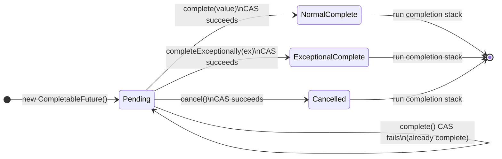

# Async Java - L4 CF Internals

---

# CompletableFuture Internals and Thread Safety

---
id: AJA-018
title: CompletableFuture Internals and Thread Safety
category: Async Java
difficulty: ★★★
interview_weight: high
asked_at: Senior-Staff
seniority: staff
status: draft
version: 1
---

### 🎯 Model Answer

**30 seconds:**
> CompletableFuture is implemented as a linked list of dependent actions
> (`UniCompletion` stack) and an internal state machine. When a CF completes,
> it atomically CAS-sets the result, then traverses the completion stack
> calling each dependent action. Thread safety is lock-free using CAS on the
> `result` field. The key production concerns: default executor is
> ForkJoinPool.commonPool (wrong for I/O), completion callbacks run on the
> completing thread (can block the callback caller), and the stack can grow
> unbounded with deep thenApply chains.

**3 minutes:**
> CompletableFuture's internals are built on two core mechanisms:
>
> **1. State machine via result field:**
> The `result` field is `volatile Object`. It can be: `null` (not yet
> complete), a `AltResult` wrapping null completion or an exception, or the
> actual result value. Completion is a single CAS operation: `compareAndSet
> (result, null, value)`. Only one thread succeeds; others become no-ops.
>
> **2. Completion stack (treiber stack):**
> Each `thenApply`, `thenCompose`, `thenCombine` appends a `UniCompletion`
> node to a linked list (`stack` field). When the CF completes, it pops the
> stack and executes each completion in order. The stack is a lock-free
> LIFO Treiber stack (CAS on head pointer).
>
> Thread of execution: by default, `thenApply(fn)` runs fn on the thread
> that completed the CF. If the CF was already complete at the time
> `thenApply` was called, fn runs on the calling thread. This is the
> "thenApply vs thenApplyAsync" distinction.
>
> Performance impact: a chain of 100 `thenApply` calls on a CF that
> completes on a pool thread means all 100 run synchronously on that pool
> thread. If any callback is slow, the pool thread is occupied.
>
> Default executor for `...Async` methods: `ForkJoinPool.commonPool()`.
> This is wrong for I/O - it's a CPU-bound pool. Always provide a custom
> executor for I/O-bound async operations.

**Blank Mind Recovery:**

**(1) Restate:** "CompletableFuture internals - how does CF actually work?
Two core pieces: the result field (volatile, CAS for completion) and the
completion stack (linked list of pending actions)."

**(2) First principles:** "A future is a value that arrives later. Internally:
store the value when it arrives (CAS on result). When value arrives, run all
waiting callbacks. The callbacks are stored in a linked list. Lock-free = CAS."

**(3) Bridge:** "Like a bulletin board. The CF result is a whiteboard that
says 'pending'. When complete, someone writes the result (CAS: only first
write wins). Everyone watching the board (completion stack) gets notified."

---

### 📘 Concept Explanation

**What it is:**
`CompletableFuture<T>` is a lock-free, non-blocking future implementation
based on CAS (Compare-And-Swap) operations on a volatile result field and
a Treiber stack of dependent completions. It implements both `Future<T>`
and `CompletionStage<T>`.

**The problem it solves:**
Traditional `Future<T>` is blocking-only: `get()` blocks the calling thread.
CompletableFuture adds non-blocking continuation: register callbacks that
run when the value is available, without blocking any thread.

**How it works - core state machine:**

```java
// Simplified internal structure (from JDK source):
class CompletableFuture<T> {
    volatile Object result;  // null if not complete
    // AltResult: wraps null value OR exception
    // T: actual result value

    volatile Completion stack; // head of completion stack
    // Completion: linked list node (next pointer)
    //   UniApply, UniCompose, BiApply (for thenCombine), etc.

    // Completion:
    boolean tryFire(int mode) {
        // mode: SYNC (0), ASYNC (1), NESTED (-1)
        // SYNC: run on completing thread
        // ASYNC: submit to executor
    }
}
```

**Lock-free completion:**

```
Completing a CF:
  1. CAS(result, null, value)   <- atomic, only one thread wins
  2. postComplete():
     while (stack != null):
       pop next Completion node (CAS on stack head)
       tryFire(SYNC or ASYNC based on mode)

Two threads trying to complete simultaneously:
  Thread A: CAS(result, null, value) = SUCCESS -> runs postComplete
  Thread B: CAS(result, null, other) = FAIL -> no-op
```

**Completion modes:**

```
thenApply(fn):
  - Creates UniApply completion node
  - If CF already complete: runs fn on calling thread (SYNC)
  - If CF not yet complete: queued in stack
  - When CF completes: runs fn on completing thread (SYNC)

thenApplyAsync(fn):
  - Creates UniApply completion node with executor
  - When fires: submits fn as Runnable to executor (ASYNC)
  - fn runs on executor thread, not completing thread

thenApplyAsync(fn, executor):
  - Same as above but with custom executor
```

**Thread execution matrix:**

```
Scenario              | thenApply  | thenApplyAsync
---------------------------------------------------
CF not complete       | completing | async executor thread
CF already complete   | calling    | async executor thread
```

**The completion chain execution model:**

A chain of `thenApply` calls creates a linked completion list:
```
CF1.thenApply(fn1).thenApply(fn2).thenApply(fn3)

Internal structure:
  CF1 -> [stack: UniApply(fn1) -> null]
  CF2 (from fn1) -> [stack: UniApply(fn2) -> null]
  CF3 (from fn2) -> [stack: UniApply(fn3) -> null]

When CF1 completes on Thread-A:
  Thread-A: executes fn1 (SYNC)
  Thread-A: fn1 result completes CF2
  Thread-A: executes fn2 (SYNC, because CF2 completer = Thread-A)
  Thread-A: fn2 result completes CF3
  Thread-A: executes fn3 (SYNC)
  All three fns run on Thread-A sequentially
```

This means: one slow `thenApply` in a chain blocks the completing thread.

**ForkJoinPool.commonPool as default executor:**

```java
// Default executor for *Async methods (without explicit executor):
ForkJoinPool.commonPool()
// This is the same pool used by parallel streams
// Parallelism = CPU cores - 1
// NOT appropriate for I/O operations (blocks CPU threads)

// Correct: always provide executor for I/O async operations
CompletableFuture.supplyAsync(
    () -> jdbcCall(), ioThreadPool); // custom I/O pool
```

**Memory model guarantees:**
- Reading result (volatile read): sees all writes that happened before
  the CAS that set the result
- Callbacks added before completion: safely see the result when fired
- Callbacks added after completion: see the result via volatile read

---

### 💻 Code Example

**Demonstrating internal behavior and threading gotchas:**

```java
// 1. Thread of execution demo
ExecutorService pool = Executors.newFixedThreadPool(2);
CompletableFuture<String> cf =
    CompletableFuture.supplyAsync(() -> {
        String thread = Thread.currentThread().getName();
        log("supply on: " + thread); // pool-1-thread-1
        return "value";
    }, pool);

cf.thenApply(v -> {
    log("thenApply on: " + Thread.currentThread().getName());
    // If supply completes before thenApply registered:
    //   runs on the thread calling thenApply (main?)
    // If thenApply registered before supply completes:
    //   runs on pool-1-thread-1 (completing thread)
    return v.toUpperCase();
});

// Result: thread can be either pool thread OR calling thread!
// Depends on race between supply completion and thenApply registration

// 2. Avoid blocking the completing thread
cf.thenApplyAsync(v -> slowTransform(v), ioPool)
// ^ always runs on ioPool thread; never blocks pool-1-thread-1

// 3. Visualize completion stack
CompletableFuture<String> root = new CompletableFuture<>();
// root.stack = null initially

root.thenApply(s -> s + "1"); // root.stack -> [UniApply(fn1)]
root.thenApply(s -> s + "2"); // root.stack -> [UniApply(fn2), UniApply(fn1)]
root.thenApply(s -> s + "3"); // root.stack -> [UniApply(fn3), fn2, fn1]

root.complete("x");
// Pops stack in LIFO: fn3 first, fn2 second, fn1 last
// But each creates a new CF, so order of CF completion depends on
// which UniApply fires and triggers the next

// 4. Avoid ForkJoinPool.commonPool for I/O
// WRONG: I/O on commonPool blocks other parallel streams
CompletableFuture.supplyAsync(() -> db.query(sql)); // uses commonPool!

// CORRECT: dedicated I/O pool
ExecutorService ioPool = Executors.newFixedThreadPool(
    20, new NamedThreadFactory("io-pool"));
CompletableFuture.supplyAsync(() -> db.query(sql), ioPool);

// 5. CAS completion race: only one completer wins
CompletableFuture<String> race = new CompletableFuture<>();
boolean won = race.complete("first");
boolean lost = race.complete("second"); // returns false
log("won=" + won + " lost=" + lost); // won=true lost=false
log("result=" + race.join());         // first (CAS winner)

// 6. Exception vs cancellation
CompletableFuture<String> cf2 = new CompletableFuture<>();
cf2.completeExceptionally(new RuntimeException("error"));
// vs
cf2.cancel(true); // sets CancellationException as the result
// Both complete the CF; subsequent complete/complete calls are no-ops
```

> **Code walkthrough:** Pattern 1 reveals the threading non-determinism of
> `thenApply`: the callback may run on the completing thread OR the calling
> thread depending on timing. This is a common source of production bugs where
> thread-local context (MDC, SecurityContext) is inconsistently available.
> Pattern 2 solves this with `thenApplyAsync`: always runs on the specified
> executor, removing the race. Pattern 3 visualizes the LIFO stack: three
> thenApply calls push onto the stack in reverse order (fn3, fn2, fn1 from top).
> Pattern 5 demonstrates the CAS guarantee: only the first `complete()` wins.
> Pattern 6 shows that `cancel(true)` is implemented as `completeExceptionally(
> new CancellationException())` - the CAS mechanism is identical; the result
> field stores either the value or the wrapped exception.

---

### 🎓 Answers by Seniority

**Junior / Mid:**
> CompletableFuture stores its result in a volatile field. When the result
> is set (via complete() or supplyAsync's return value), it uses CAS to
> ensure only one thread sets it. Then it runs all the registered callbacks
> (thenApply, etc.) from the completion stack. The key behavior I care about
> in practice: thenApply might run on the completing thread or the calling
> thread depending on timing, so for I/O callbacks I use thenApplyAsync with
> a custom executor.

*Push deeper:* What is the default executor for thenApplyAsync with no
executor argument, and why is it problematic for I/O?

---

**Senior / Staff:**
> Internally, CompletableFuture is a lock-free state machine with two key
> structures: the volatile `result` field (null = incomplete) and a Treiber
> stack of `UniCompletion` nodes. Completion is a single CAS operation. Once
> set, the node stack is traversed and each action fires either synchronously
> on the completing thread or asynchronously on a provided executor.
>
> The threading subtlety: `thenApply(fn)` without explicit executor creates
> an AMBIGUOUS threading contract. The callback runs on either (a) the
> completing thread, or (b) the thread that registered the callback, depending
> on which happened first. This is called the "stack-based dispatch" and it
> means sequential thenApply chains all run on the completing thread - which
> can block that thread for the entire chain's duration.
>
> Production implications:
> 1. Always use `thenApplyAsync(fn, executor)` for callbacks with meaningful
>    work - don't serialize the completing thread.
> 2. Never use `ForkJoinPool.commonPool()` for I/O operations.
> 3. Be aware that a 50-step thenApply chain all runs on ONE thread; if any
>    step blocks, it blocks the completing thread.

*Push deeper (Staff):* The `minimalCompletionStage()` method (Java 9+)
returns a `CompletionStage` view of a CF that does not allow external
completion (`complete()`, `completeExceptionally()`, `cancel()`). Use
this when returning a CF from a method signature to prevent callers from
completing it from outside. The pattern: internal implementation uses
CompletableFuture; public API exposes CompletionStage:
```java
public CompletionStage<Result> processAsync() {
    CompletableFuture<Result> internal = new CompletableFuture<>();
    // ... set up completion logic ...
    return internal.minimalCompletionStage();
    // Caller cannot call: internal.complete(...)
}
```

---

### ⚠️ Common Misconceptions

**Misconception: "thenApply always runs asynchronously on a thread pool."**

`thenApply(fn)` WITHOUT `Async` suffix runs synchronously: fn executes on
WHATEVER thread triggered the completion. This can be the thread that called
`complete()`, the thread that returned from `supplyAsync()`'s work, or even
the calling thread if the CF was already complete when `thenApply` was
registered. There is no thread pool involved unless you use `thenApplyAsync`.
In a thenApply chain, all callbacks typically run on the same completing
thread sequentially. If the chain is long and any callback blocks, the
completing thread is stalled - often a thread pool thread that should be
doing other work.

---

### 🚨 Failure Modes and Diagnosis

**Failure: Thread pool starvation via synchronous callback chains**

Symptom: thread pool exhaustion under load. Thread dump shows all N
threads blocked in `CompletableFuture` callback code. New requests queue
but no threads are available to process them.

Cause: long thenApply callback chains executing synchronously on pool
threads. Each thread that completes a CF runs ALL chained callbacks before
returning to the pool for new work.

```java
// DANGEROUS: 10 sequential callbacks, each 10ms -> 100ms on pool thread
ExecutorService pool = Executors.newFixedThreadPool(10);
CompletableFuture.supplyAsync(() -> fetch(), pool)
    .thenApply(step1)    // runs on pool thread
    .thenApply(step2)    // runs on pool thread (same)
    .thenApply(step3)    // runs on pool thread (same)
    // ... 7 more steps
    .thenApply(step10);  // runs on pool thread (same)
// Pool thread occupied for 100ms; cannot process new requests

// FIX 1: use thenApplyAsync to release pool thread
CompletableFuture.supplyAsync(() -> fetch(), pool)
    .thenApplyAsync(step1, processingPool)
    .thenApplyAsync(step2, processingPool);
// Pool thread returns after fetch(); steps run on processingPool

// FIX 2: if steps are fast, consolidate into one callback
CompletableFuture.supplyAsync(() -> fetch(), pool)
    .thenApply(v -> {
        var s1 = step1.apply(v);
        var s2 = step2.apply(s1);
        // ...all fast steps in one callback
        return stepN.apply(s9);
    });
// Single callback; pool thread free after fetch + all steps
```

Diagnosis: thread dump with pool thread callstack deep in thenApply chains.
Metrics: `executor.active` near max; `executor.queue.size` growing.

---

### 🎯 Interview Deep-Dive

**Timing:** Hard ★★★ - 12 questions minimum.

---

#### Q1 - Describe the internal state machine of CompletableFuture.

CompletableFuture maintains state via a single `volatile Object result` field:

```
States:
  null           -> not yet complete
  AltResult(null) -> completed with null value (NIL sentinel)
  AltResult(ex)  -> completed exceptionally (wrapped Throwable)
  T value        -> completed normally with non-null value

Transitions (one-way, CAS-protected):
  null -> AltResult(null): complete(null)
  null -> AltResult(ex):   completeExceptionally(ex)
  null -> T value:         complete(nonNullValue)

Only one transition succeeds (CAS); all others are no-ops.
```

The `AltResult` wrapper exists because `null` is a valid completion value
but the internal "not complete" marker is also `null`. The sentinel
distinguishes "not yet complete" from "completed with null."

Cancel: `cancel(true)` calls `completeExceptionally(new CancellationException())`
internally. After cancellation, `isCancelled()` checks if the result is
`AltResult` containing `CancellationException`.

*What separates good from great:* The result field is read with a simple
`volatile` read (no lock). This means reading the result is O(1) and
non-blocking. Writing the result is a single CAS. The entire completion
protocol - setting the value and running all callbacks - is lock-free.
This makes CompletableFuture safe to use from many threads without any
external synchronization.

---

#### Q2 - What is the Treiber stack and how does CF use it?

A Treiber stack is a lock-free linked-list stack using CAS on the head pointer:

```
Push (append completion):
  newNode.next = head
  CAS(head, newNode.next, newNode)  // retry if head changed

Pop (fire completion):
  node = head
  CAS(head, node, node.next)        // retry if head changed
```

CompletableFuture uses a Treiber stack for the pending completions:
- Push: adding a `thenApply`/`thenCompose` listener appends to the stack
- Pop: when the CF completes, it pops all nodes and fires them

The stack is LIFO: the LAST `thenApply` registered fires FIRST.
However, since each `thenApply` creates a NEW CompletableFuture, the
order of downstream CF completions depends on the order of firing.

```
cf.thenApply(fn1) -> cf2
cf.thenApply(fn2) -> cf3  (registered after fn1)
stack after both: [fn2 head] -> [fn1] -> null

cf.complete(x):
  fire fn2 first (head): cf3 completes
  fire fn1 second: cf2 completes
  cf3 completes BEFORE cf2 in LIFO order
```

For sequential chains (`cf.thenApply(fn1).thenApply(fn2)`): they are NOT
on the same stack; each creates a separate CF with its own single-element
stack.

*What separates good from great:* The Treiber stack can have ABA problem:
if a node is popped and a NEW node with the same address is pushed, the
CAS on the old head would falsely succeed. Java CF avoids this because
completion nodes are never reused - each is a fresh object. Garbage
collection ensures old addresses are not recycled while CAS is pending.

---

#### Q3 - When does a thenApply callback run on the calling thread?

A `thenApply(fn)` callback runs on the CALLING thread when:
The CompletableFuture is ALREADY COMPLETE at the time `thenApply` is called.

```java
CompletableFuture<String> cf = CompletableFuture.completedFuture("x");
// cf is already complete

cf.thenApply(s -> {
    // Runs on the thread calling thenApply (main thread here)
    // NOT on a pool thread
    return s.toUpperCase();
});
```

Sequence:
1. `thenApply` is called on already-complete CF
2. CF's `result` is non-null (complete)
3. thenApply immediately calls `tryFire(SYNC)` on the new UniApply node
4. SYNC mode: execute fn on the current thread (calling thread)

This is "inlining" optimization: avoid submitting to executor if result
is already available. But it means the calling thread (which may be an
event loop or a pool thread doing something else) is used for the callback.

*What separates good from great:* This behavior is the reason
`thenApplyAsync` is often preferable: it always submits to the executor,
never inlines on the calling thread. The performance trade-off: inlining
avoids executor overhead (~microseconds). Using async avoids unexpected
thread binding (callback always on executor, not on the caller).

---

#### Q4 - How does the default ForkJoinPool.commonPool affect behavior?

`ForkJoinPool.commonPool()` is the default executor for:
- `CompletableFuture.supplyAsync(supplier)` (no executor arg)
- `thenApplyAsync(fn)`, `thenRunAsync(runnable)`, etc. (no executor arg)
- Parallel streams (`Stream.parallel()`)

Characteristics:
- Shared across all callers in the JVM
- Parallelism = `Runtime.getRuntime().availableProcessors() - 1`
- Work-stealing pool: tasks can be stolen across threads
- FIFO within each thread's queue; LIFO for stolen tasks

Problems with using commonPool for I/O:
1. Shared with parallel streams: I/O operations starve CPU-bound parallel
   stream work
2. Fixed size: 100 concurrent I/O operations waiting = 100 tasks queuing
   (pool has only CPU-1 threads)
3. Blocking: I/O blocks pool threads, starving other async work

```java
// WRONG: I/O on commonPool (default)
CompletableFuture.supplyAsync(
    () -> httpClient.sendSync(request)); // no executor arg!

// CORRECT: dedicated I/O executor
ExecutorService ioPool = Executors.newVirtualThreadPerTaskExecutor();
// or: Executors.newFixedThreadPool(20, namedFactory("io-worker"))
CompletableFuture.supplyAsync(
    () -> httpClient.sendSync(request), ioPool);
```

*What separates good from great:* Knowing how to monitor commonPool health:
```java
ForkJoinPool.commonPool().getPoolSize()         // active threads
ForkJoinPool.commonPool().getQueuedTaskCount()  // queued tasks
ForkJoinPool.commonPool().getActiveThreadCount() // busy threads
```
High `queuedTaskCount` while `activeThreadCount` < `parallelism` indicates
thread starvation (blocked I/O on pool threads). Solution: always provide
custom executor for I/O async operations.

---

#### Q5 - What is the difference between complete, completeAsync, and obtrudeValue?

`complete(value)`:
- Atomically sets result to value IF not yet complete (CAS)
- Returns true if this call completed the CF; false if already complete
- Idempotent: safe to call from multiple threads; only one succeeds

`completeAsync(supplier, executor)` (Java 9+):
- Submits supplier to executor; completes CF with its return value
- If supplier throws: CF completed exceptionally
- Returns the same CF (for chaining)

`completeAsync(supplier)`:
- Same but uses ForkJoinPool.commonPool() as executor

`obtrudeValue(value)`:
- Forcibly sets result regardless of current state
- Overwrites any existing result
- NOT idempotent: can change an already-completed CF
- NOT for normal use: for testing and exceptional recovery only
- Thread-unsafe in combination with other completion methods

```java
// obtrudeValue: force override (dangerous)
CompletableFuture<String> cf = CompletableFuture.completedFuture("old");
cf.obtrudeValue("new"); // overwrites "old" with "new"
cf.join(); // returns "new"

// complete: idempotent, safe
cf.complete("first");  // sets to "first"
cf.complete("second"); // no-op (already complete)
cf.join(); // returns "first"
```

*What separates good from great:* `obtrudeValue` writes directly to the
result field without CAS. It is NOT atomic with respect to other completions.
In production code, `obtrudeValue` is almost never correct. It appears in
frameworks for forced-completion in timeout scenarios, but even then
`completeOnTimeout` (Java 9+) is the right API. Know that `obtrudeValue`
exists but cannot be the answer in any normal concurrent code design.

---

#### Q6 - How does CompletableFuture handle exceptions internally?

Exception handling flow:

1. `completeExceptionally(ex)`:
   - Wraps `ex` in `AltResult(ex)` and CAS-sets result
   - `isCompletedExceptionally()` returns true
   - `join()` throws `CompletionException(ex)` (unchecked)
   - `get()` throws `ExecutionException(ex)` (checked)

2. Exception from `supplyAsync` supplier:
   - If supplier throws, the supplier's exception is caught
   - CF is completed exceptionally with the caught exception
   - No exception propagates to the submitting thread

3. `exceptionally(fn)`:
   - Creates a new CF that completes with fn's return value
   - If the original CF completed normally: the new CF gets the normal value
   - If the original CF completed exceptionally: fn is called with the cause

4. `handle(bifunction)`:
   - Called for BOTH normal and exceptional completions
   - `(result, null)` for normal; `(null, throwable)` for exceptional
   - New CF always completes normally with handle's return value

```java
// Exception unwrapping:
CompletableFuture<String> cf = CompletableFuture.failedFuture(
    new IOException("db error"));

// get() throws ExecutionException wrapping IOException
try {
    cf.get(); // throws ExecutionException
} catch (ExecutionException e) {
    IOException cause = (IOException) e.getCause(); // unwrap
}

// join() throws CompletionException wrapping IOException
try {
    cf.join(); // throws CompletionException
} catch (CompletionException e) {
    IOException cause = (IOException) e.getCause(); // unwrap
}

// exceptionally: recover from exception
cf.exceptionally(ex -> {
    log.warn("Failed, using default: {}", ex.getMessage());
    return "default";
}); // new CF completes normally with "default"
```

*What separates good from great:* The double-wrapping problem: if a
`thenApply` callback throws, the exception is wrapped in CompletionException.
If that CF is then wrapped in another CompletionException by `join()`, you
get double wrapping: `CompletionException(CompletionException(cause))`.
Use `Throwable.getCause()` recursively (or `Exceptions.unwrap()` in Reactor)
to get the root cause. `exceptionally` receives the direct cause (one unwrap
level already done by the framework).

---

#### Q7 - What is join() vs get() and which should you use?

Both block until the CF is complete and return the result (or throw).

`get()` (from Future interface):
- Throws `InterruptedException` (checked) if interrupted while waiting
- Throws `ExecutionException` (checked, wraps actual exception)
- Overloaded: `get(timeout, unit)` for bounded wait

`join()` (added with CompletableFuture):
- Throws `CancellationException` if cancelled (unchecked, from cancel())
- Throws `CompletionException` (unchecked, wraps actual exception)
- No checked exceptions - no try-catch required
- Cannot be interrupted (does not respond to Thread.interrupt)

In practice:
- `join()`: preferred in lambdas and callbacks (no checked exception handling)
- `get(timeout, unit)`: preferred in non-reactive code where timeout is
  important and checked exception handling is acceptable

```java
// join() in lambda (no checked exceptions):
futures.stream()
    .map(cf -> cf.join()) // clean: no try-catch
    .toList();

// get() with timeout for bounded wait:
try {
    String result = cf.get(5, TimeUnit.SECONDS);
} catch (TimeoutException e) {
    log.warn("Timeout: future did not complete in 5s");
}
```

*What separates good from great:* `join()` inside `allOf.thenApply` is
safe (non-blocking) because allOf's thenApply only fires after all
components complete. But `join()` OUTSIDE of allOf blocks the calling
thread and defeats the async model. A common antipattern:
```java
// ANTIPATTERN: blocking join in reactive-like code
String result = callServiceAsync().join(); // blocks!
// This converts async code back to blocking
```
If you need the result synchronously, use `get()` with a timeout to at
least bound the block duration.

---

#### Q8 - How do you implement a timeout for a CompletableFuture?

Three patterns:

**Pattern 1: `orTimeout` (Java 9+) - throw on timeout:**
```java
CompletableFuture.supplyAsync(() -> slowCall(), pool)
    .orTimeout(5, TimeUnit.SECONDS);
// If not complete in 5s: completes with TimeoutException
// Running task continues! No cancellation of underlying work
```

**Pattern 2: `completeOnTimeout` (Java 9+) - fallback on timeout:**
```java
CompletableFuture.supplyAsync(() -> slowCall(), pool)
    .completeOnTimeout("default", 5, TimeUnit.SECONDS);
// If not complete in 5s: completes with "default"
// Running task continues!
```

**Pattern 3: ScheduledExecutorService (Java 8 compatible):**
```java
private static final ScheduledExecutorService TIMER =
    Executors.newSingleThreadScheduledExecutor();

static <T> CompletableFuture<T> withTimeout(
        CompletableFuture<T> cf, long millis) {
    CompletableFuture<T> timeout = new CompletableFuture<>();
    TIMER.schedule(
        () -> timeout.completeExceptionally(
            new TimeoutException()),
        millis, TimeUnit.MILLISECONDS);
    return cf.applyToEither(timeout, Function.identity());
    // Returns whichever completes first
}
```

*What separates good from great:* None of these patterns stop the RUNNING
COMPUTATION. `orTimeout` and `completeOnTimeout` complete the CF early
but the underlying `supplyAsync` task continues executing on its thread.
To cancel the underlying work: (1) use a boolean volatile flag that the
task checks periodically, or (2) interrupt the task thread using a
`Future` from a `ScheduledExecutorService` that calls `future.cancel(true)`.
True cancellation requires cooperation from the running task.

---

#### Q9 - How does CompletableFuture handle completion from multiple threads simultaneously?

The CAS mechanism ensures exactly-once completion:

```
Thread A: complete("valueA")
  -> CAS(result, null, "valueA") -> SUCCESS
  -> postComplete() called

Thread B: complete("valueB") [simultaneously]
  -> CAS(result, null, "valueB") -> FAIL (result is now "valueA")
  -> returns false (no-op)

Final result: "valueA" (first writer wins)
```

For `thenApply` registration simultaneously with completion:

```
Thread A: cf.complete("x") [completes CF, fires completions]
Thread B: cf.thenApply(fn) [adds to completion stack]

Case 1: Thread A fires first, Thread B runs later
  Thread A: postComplete() -> stack empty at this point
  Thread B: thenApply sees CF already complete -> fires fn immediately
  fn runs on Thread B (calling thread)

Case 2: Thread B registers first, Thread A fires later
  Thread B: thenApply pushes UniApply to stack
  Thread A: postComplete() -> finds UniApply on stack -> fires fn
  fn runs on Thread A (completing thread)

Either way: fn runs exactly once. Race determines which thread.
```

*What separates good from great:* The "COMPLETED_NULL" vs "COMPLETED" state
distinction: when a CF is completed with `null` value (which is valid), the
result is set to `AltResult.NIL` (a static sentinel), not `null`. This avoids
the ambiguity where `null` means both "not yet complete" and "completed with
null." The `AltResult.NIL` check is how `CompletableFuture.get()` returns
`null` without treating it as "incomplete."

---

#### Q10 - What is `whenComplete` vs `handle` vs `exceptionally`?

Three completion-handling operators with different semantics:

`exceptionally(fn)`:
- Fires only when CF completed EXCEPTIONALLY
- fn receives the Throwable cause (already unwrapped one level)
- Return value is the recovery value for the new CF
- New CF completes normally with fn's return value
- If fn throws: new CF completes exceptionally

`whenComplete(biConsumer)`:
- Fires for BOTH normal and exceptional completion
- Receives (result, throwable): one is non-null, other is null
- No return value: cannot change the result
- New CF completes with SAME result as original CF
- Use for side effects (logging, metrics); not for result transformation

`handle(biFunction)`:
- Fires for BOTH normal and exceptional completion
- Receives (result, throwable): one non-null, other null
- Return value IS the new CF's result
- Always completes normally (unless handle fn throws)
- Use for result transformation with exception recovery

```java
CompletableFuture<String> cf = failingFuture();

// exceptionally: recovery value only on exception
cf.exceptionally(ex -> {
    log.error("Failed: {}", ex.getMessage());
    return "fallback";
}); // new CF = "fallback"

// whenComplete: side effect only, result unchanged
cf.whenComplete((result, ex) -> {
    if (ex != null) log.error("Failed: {}", ex.getMessage());
    else log.info("Success: {}", result);
}); // new CF = same exception as original (not recovered)

// handle: full control (recovery + transform)
cf.handle((result, ex) -> {
    if (ex != null) return "fallback";
    return result.toUpperCase();
}); // new CF = "fallback" (exception path)
```

*What separates good from great:* `whenComplete` does NOT recover from
exceptions. The new CF from `whenComplete` completes with the SAME
exception as the original, even if the whenComplete callback ran without
error. This is a common mistake: using `whenComplete` and expecting it to
handle the error like `exceptionally`. Use `handle` when you need to
recover and/or transform; use `whenComplete` for pure side effects (logging,
metrics, cleanup).

---

#### Q11 - How do you diagnose deadlocks in CompletableFuture chains?

Deadlock patterns in CompletableFuture:

**Pattern 1: Pool exhaustion deadlock**
```
Scenario:
  Pool has 2 threads (A, B)
  A: running, waiting for CF1.join()
  B: running, waiting for CF2.join()
  CF1 requires B to run (B is occupied)
  CF2 requires A to run (A is occupied)
  -> Deadlock: A waits for B, B waits for A
```

```java
// CAUSES DEADLOCK with fixed-size pool:
ExecutorService pool = Executors.newFixedThreadPool(2);
CompletableFuture<String> outer =
    CompletableFuture.supplyAsync(() -> {
        // This inner task needs a pool thread too
        return CompletableFuture.supplyAsync(
            () -> "inner", pool).join(); // DEADLOCK if pool full
    }, pool);
```

Fix: use unbounded pool (or virtual threads) for tasks that
nest async calls, OR ensure inner futures don't compete for the
same pool as outer futures.

**Pattern 2: Self-waiting**
```java
CompletableFuture<String> cf = new CompletableFuture<>();
cf.thenApply(s -> {
    cf.join(); // CF waiting for itself -> deadlock
    return s;
});
cf.complete("x");
```

**Diagnosis:**
```bash
# Thread dump: look for threads WAITING on CompletableFuture
jcmd <pid> Thread.print
# Look for: java.util.concurrent.ForkJoinPool$WorkQueue.awaitJoin
# or: java.util.concurrent.ForkJoinPool.managedBlock
```

*What separates good from great:* ForkJoinPool has a `ManagedBlocker`
mechanism: if a pool thread blocks on `cf.join()`, it can request that
the pool add a compensating thread to maintain the parallelism level.
This prevents deadlock at the cost of extra threads. Enable with:
`ForkJoinPool.managedBlock(blocker)` - but this is an advanced pattern.
Normally, avoid `join()` inside pool tasks entirely.

---

#### Q12 - What are the memory and GC implications of deep CF chains?

Each operator in a CF chain allocates objects:
- `thenApply`: allocates a `UniApply` node (~32 bytes)
- `thenCompose`: allocates a `UniCompose` node + new intermediate CF
- `thenCombine`: allocates a `BiApply` node + references to two CFs

A chain of 100 `thenApply` calls: ~100 UniApply objects on heap.
Each holds a reference to the function (lambda closure) and the next CF.
After the chain completes, all intermediate CFs and completion nodes
become garbage.

Memory lifecycle:
```
CF1 -> [UniApply(fn1)] -> CF2 -> [UniApply(fn2)] -> CF3
After CF3 completes: CF1 and CF2 can be GCed (if no external references)
UniApply nodes become garbage after firing
Functions (lambdas): GCed after their node fires

Retention issue:
  If final result CF (CF3) is stored in a field,
  and CF3's completion retains references to fn2, fn1...
  -> GC roots hold entire chain until CF3 is released
```

Production consideration: long-lived CF result holders (e.g., cached CFs)
retain the entire chain in memory. `cf.toCompletableFuture().copy()` creates
a copy that does NOT retain the original chain:

```java
// Original CF chain retained
CompletableFuture<String> chain = buildLongChain(); // 100 ops
cache.put(key, chain); // stores chain + all intermediate objects

// Isolated copy
CompletableFuture<String> isolated = chain.copy(); // minimal wrapper
cache.put(key, isolated); // stores only the final result
// Original chain eligible for GC
```

*What separates good from great:* The `copy()` method creates a new
CompletableFuture that is completed when the original is completed, but
holds no reference to the original's chain. This is the correct pattern
for caching or long-term retention of CompletableFuture results without
leaking the entire computation chain.

---

### ⚖️ Comparison Table

**CompletableFuture completion handling operators:**

| Operator | Fires on | Input | Output CF | Use for |
|---|---|---|---|---|
| `thenApply(fn)` | Success only | result | fn(result) | Transform success |
| `exceptionally(fn)` | Failure only | Throwable | fn(ex) or original | Recovery |
| `whenComplete(bi)` | Both | (result, ex) | Original unchanged | Side effects |
| `handle(bi)` | Both | (result, ex) | bi(result, ex) | Full control |
| `thenCompose(fn)` | Success only | result | fn(result) as CF | Flat-map |
| `thenCombine(cf, bi)` | Both complete | (r1, r2) | bi(r1, r2) | Parallel combine |

---

### 🏛️ System Design

**Thread pool architecture for CompletableFuture-based services:**

```
Service architecture:
  HTTP Thread Pool (Tomcat): 200 threads
    handles request-response lifecycle
    should NOT do I/O inside CF chains

  I/O Pool (JDBC, HTTP clients): 20-50 threads
    for CompletableFuture.supplyAsync(() -> dbCall(), ioPool)
    blocking I/O off HTTP threads

  Computation Pool (parallel): CPU count
    for thenApplyAsync(() -> transform(), cpuPool)
    CPU-bound transformations

  Timer Pool: 1-2 threads
    for orTimeout, completeOnTimeout, scheduled tasks

  Avoid:
    ForkJoinPool.commonPool() for I/O (shared, CPU-sized)
    Single pool for all CF operations (contention)
    Unbounded executor (prevents resource management)
```

Virtual threads simplify this: replace all pools with
`Executors.newVirtualThreadPerTaskExecutor()` for I/O operations.
CPU-bound work still benefits from a fixed parallel pool.

---

### 📊 Diagram

**CompletableFuture internal structure:**

```
CompletableFuture<T>:
  result:   null (pending) | AltResult(null) | AltResult(ex) | T
  stack:    [UniApply(fn3)] -> [UniApply(fn2)] -> [UniApply(fn1)] -> null
            ^ head (LIFO)

On complete(value):
  1. CAS(result, null, value) -> success
  2. postComplete():
     pop fn3: tryFire(SYNC) -> runs fn3 on completing thread
     pop fn2: tryFire(SYNC) -> runs fn2 on completing thread
     pop fn1: tryFire(SYNC) -> runs fn1 on completing thread
```



> **Diagram walkthrough:** The state diagram shows the one-way completion
> model. Once a CompletableFuture transitions out of Pending, it never
> returns. The CAS operation ensures exactly one transition wins when
> multiple threads race to complete the CF simultaneously. All three terminal
> states (NormalComplete, ExceptionalComplete, Cancelled) trigger the
> completion stack: the registered callbacks (UniApply, UniCompose etc.)
> are popped and fired. The Pending -> Pending self-loop represents
> subsequent `complete()` calls that fail the CAS (no-ops).
