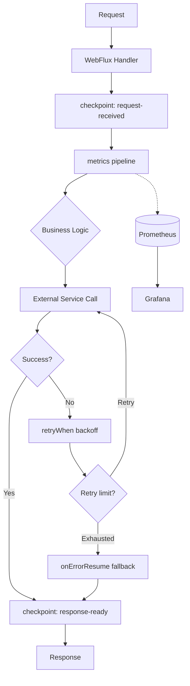

# Async Java - L4 Reactor Production

---

# Reactor in Production - Debugging and Diagnostics

---
id: AJA-019
title: Reactor in Production - Debugging and Diagnostics
category: Async Java
difficulty: ★★★
interview_weight: high
asked_at: Senior-Staff
seniority: staff
status: draft
version: 1
---

### 🎯 Model Answer

**30 seconds:**
> Debugging reactive pipelines in production requires specific tools:
> `Hooks.onOperatorDebug()` captures assembly-time stack traces (expensive,
> staging only), `checkpoint("name")` adds named markers to error traces
> without full assembly capture, and Micrometer integration provides pipeline
> metrics. Thread dumps are less useful than in imperative code because the
> error stack trace points to framework internals, not your code. The key
> diagnostic skill is reading assembly stack traces from checkpoints to
> identify which operator in your pipeline threw.

**3 minutes:**
> Reactive debugging is hard because the subscription and execution phases
> are separate. When a `Flux.map(fn)` throws at runtime, the stack trace
> shows where the error was received in the subscription, not where the
> pipeline was assembled. The assembly site (where you wrote `map(fn)`) is
> not in the stack.
>
> Three diagnostic layers:
>
> **1. Assembly stack traces (operator debug mode):**
> `Hooks.onOperatorDebug()` (global) or `ReactorDebugAgent.install()` (Java
> agent, lower overhead) captures the stack at assembly time. When an error
> occurs, Reactor includes the assembly stack in the error message. Use in
> staging, not production (2-10x performance overhead with `onOperatorDebug`).
>
> **2. Checkpoints:**
> `checkpoint("payment-service-call")` adds a named marker in the pipeline.
> Lower overhead than `onOperatorDebug` (no stack capture at every operator).
> Error traces show the checkpoint name, identifying which pipeline stage failed.
>
> **3. Metrics:**
> `flux.metrics()` integrates with Micrometer. Exposes request rate, error
> rate, and latency percentiles per operator. Essential for production.

**Blank Mind Recovery:**

**(1) Restate:** "Reactor production debugging - how do you find what
went wrong in a reactive pipeline? The problem: stack traces point to
framework internals. The solution: assembly traces via checkpoints."

**(2) First principles:** "A reactive pipeline is assembled (built) then
subscribed to (run). An error during run shows where it was caught, not
where the map(fn) was written. checkpoints label stages so errors say
'failed in payment-service-call stage'."

**(3) Bridge:** "Like GPS breadcrumbs: `checkpoint()` drops named markers
along the pipeline. When something goes wrong, the error message says
which breadcrumb was last passed - that's where to look."

---

### 📘 Concept Explanation

**What it is:**
Production debugging and diagnostics for Project Reactor pipelines.
Covers the tools, patterns, and strategies for identifying failures,
measuring performance, and diagnosing issues in reactive systems running
in production.

**The problem it solves:**
Reactive pipeline errors produce unhelpful stack traces. When a `map`
lambda throws, the stack shows:
```
java.lang.NullPointerException: null
  at reactor.core.publisher.FluxMapFuseable...
  at reactor.core.publisher.MonoFlatMap...
  at reactor.core.publisher.FluxOnAssembly...
  ... 20 more reactor internal frames ...
```
None of these frames reference your code. You cannot tell which `map`,
which `flatMap`, or which lambda threw.

**How Reactor debugging works:**

```
Pipeline assembly (at startup/request time):
  Flux.fromIterable(ids)           <- assembly point 1
      .flatMap(id -> call(id))     <- assembly point 2
      .map(r -> transform(r))      <- assembly point 3
      .subscribe(...)              <- subscription starts execution

Error at assembly point 3 (map throws NullPointerException):
  Without debug mode: stack trace = reactor internals only
  With checkpoint("transform"): stack trace includes "transform" marker
  With Hooks.onOperatorDebug(): stack includes assembly site line number
```

**Diagnostic tool comparison:**

```
Tool                | Overhead | Prod safe? | Detail
--------------------|----------|------------|------------------
Hooks.onOperatorDebug() | HIGH  | NO         | Full stack per op
ReactorDebugAgent   | LOW       | YES        | Full stack via agent
checkpoint("name")  | MINIMAL   | YES        | Named marker only
checkpoint("name", true) | MED  | NO (staging)| Named + assembly
.log()              | MEDIUM    | LIMITED    | Per-signal logging
.metrics()          | LOW       | YES        | Micrometer metrics
```

**Checkpoint strategy:**
Add checkpoints at the BOUNDARIES of your logic:
- Before and after external service calls
- Before and after complex transformations
- At the entry and exit of sub-pipelines

```
Flux.fromIterable(ids)
    .checkpoint("start-ids")
    .flatMap(id -> externalService.call(id))
    .checkpoint("post-service-call")   // <-- error shows here
    .map(r -> transform(r))
    .checkpoint("post-transform")
    .subscribe(...)
```

Error message with checkpoint:
```
Error has been observed at the following site(s):
  *__checkpoint ⇢ post-service-call
  *__checkpoint ⇢ post-transform
Original Stack Trace:
  ...your code...
```

**Reactor metrics integration (Micrometer):**

```java
// Enable metrics for a publisher
Flux<Order> orders = orderService.getOrders()
    .metrics()
    .name("orders.pipeline")
    .tag("region", "us-east");
    // Exposes:
    // orders.pipeline.subscribed: counter
    // orders.pipeline.onNext: counter
    // orders.pipeline.onError: counter
    // orders.pipeline.onComplete: counter
    // orders.pipeline.request: distribution summary
    // orders.pipeline.latency: timer
```

**Context propagation:**
In reactive pipelines, ThreadLocal doesn't work for context (e.g., MDC).
Use `Reactor Context` for structured context passing:

```java
// Set context at subscription:
mono.contextWrite(Context.of("userId", "u123"));

// Read context in operator:
Mono.deferContextual(ctx -> {
    String userId = ctx.get("userId");
    return Mono.just(userId);
});
```

---

### 💻 Code Example

**Production debugging toolkit:**

```java
// 1. Checkpoint for pipeline naming (production-safe)
public Mono<OrderResponse> processOrder(OrderRequest req) {
    return Mono.just(req)
        .checkpoint("order-validation")
        .flatMap(r -> validateOrder(r))
        .checkpoint("inventory-check")
        .flatMap(r -> checkInventory(r))
        .checkpoint("payment-processing")
        .flatMap(r -> processPayment(r))
        .checkpoint("order-confirmation");
    // Error in payment: trace says "payment-processing" stage
}

// 2. Hooks.onOperatorDebug() for staging (NOT production)
// In test/staging configuration only:
Hooks.onOperatorDebug();
// ALL pipelines now capture assembly stack traces
// 5-10x CPU overhead - never use in production

// 3. ReactorDebugAgent (production-viable alternative)
// Add to JVM args: -javaagent:reactor-tools.jar
// Or in code (before any Reactor pipelines are built):
ReactorDebugAgent.init();
ReactorDebugAgent.processExistingClasses(); // instrument loaded classes
// Lower overhead via bytecode transformation instead of runtime hooks

// 4. .log() for debugging specific operators
Flux.range(1, 5)
    .log("source", Level.FINE)   // logs each signal
    .map(i -> i * 2)
    .log("after-map", Level.FINE)
    .subscribe();
// Output:
// [source] | onSubscribe([Synchronous Fuseable] ...)
// [source] | request(unbounded)
// [source] | onNext(1)
// [after-map] | onNext(2)
// [source] | onNext(2)
// [after-map] | onNext(4)
// ... etc.
// Use sparingly in production (high log volume)

// 5. Metrics integration with Micrometer
@Bean
public Flux<Event> eventPipeline(
        MeterRegistry registry) {
    return eventSource.events()
        .name("events.pipeline")
        .tag("type", "payment")
        .metrics()  // registers Micrometer meters
        .filter(e -> e.isValid())
        .checkpoint("post-filter")
        .flatMap(e -> processEvent(e));
}
// Dashboards: track onError rate, request latency

// 6. Context for MDC propagation
public Mono<Response> handleRequest(Request req) {
    return processAsync(req)
        .contextWrite(
            ctx -> ctx.put("traceId", req.traceId())
                      .put("userId", req.userId()));
}

// Read in any operator downstream:
Mono.deferContextual(ctx ->
    Mono.fromCallable(() -> {
        MDC.put("traceId", ctx.get("traceId")); // per-call MDC
        return performDbQuery();
    }).doFinally(s -> MDC.remove("traceId")));
```

> **Code walkthrough:** Pattern 1 shows the recommended checkpoint strategy:
> place checkpoints at stage boundaries so error traces name the failing
> stage. This is the single most impactful debugging improvement with minimal
> overhead. Pattern 2 shows `Hooks.onOperatorDebug()` - STAGING ONLY due to
> 5-10x overhead; it captures full assembly stack for every operator. Pattern
> 3 is the production-viable alternative: ReactorDebugAgent uses bytecode
> transformation at load time to capture assembly stacks with ~10-20% overhead.
> Pattern 5 shows Micrometer integration via `.metrics()` - exposes per-pipeline
> metrics (onNext count, error rate, latency) that feed into Prometheus/Grafana.
> Pattern 6 addresses MDC propagation: ThreadLocal doesn't work across reactive
> operators (different threads), so Reactor Context carries per-request data,
> which is then transferred to MDC at the point where MDC is needed.

---

### 🎓 Answers by Seniority

**Junior / Mid:**
> When debugging reactive pipelines, I use `checkpoint("name")` to label
> stages in the pipeline. When an error occurs, the error message shows which
> checkpoint it passed through last, helping me identify where the problem is.
> For detailed debugging in development, I use `Hooks.onOperatorDebug()` which
> adds assembly stack traces to errors. In production, I use `.metrics()` to
> integrate with Micrometer and track pipeline health.

*Push deeper:* Why can't you use `Hooks.onOperatorDebug()` in production?

---

**Senior / Staff:**
> Reactive debugging requires understanding that pipelines have two phases:
> assembly (building the operator chain) and subscription (executing it). Stack
> traces from production errors show the subscription-time call stack, which is
> inside Reactor internals - not your code.
>
> In production we use three layers:
> 1. `checkpoint("descriptive-name")` at stage boundaries - zero stack capture
>    overhead, just named markers in error output
> 2. `ReactorDebugAgent.init()` as a Java agent - bytecode transformation at
>    class load time, ~10-20% overhead, captures assembly stacks without
>    `Hooks.onOperatorDebug()`'s runtime interception cost
> 3. `.metrics()` + Micrometer for operational visibility: error rates, latency
>    histograms, request counts per pipeline
>
> For context propagation across operator boundaries: Reactor Context (not
> ThreadLocal). Context is immutable and carried downstream in the subscription
> chain. For MDC bridging: capture context values in `deferContextual` and set
> MDC explicitly per operator that needs it.
>
> For error recovery in production: `retryWhen(Retry.backoff(...))` for
> transient failures, `onErrorResume(ex -> fallback)` for graceful degradation,
> and `timeout(duration)` at the outermost operator to bound maximum latency.

*Push deeper (Staff):* The interaction between Reactor Context and Spring
Security: Spring Security 5+ provides `ReactiveSecurityContextHolder` which
stores the `Authentication` in Reactor Context. This means security context
propagates correctly across reactive operators without ThreadLocal. The
bridge to WebFlux is automatic. When writing reactive controllers, security
context is available via `ReactiveSecurityContextHolder.getContext()`.

---

### ⚠️ Common Misconceptions

**Misconception: "I can use ThreadLocal for MDC in WebFlux."**

In a reactive pipeline, operators can execute on different threads (based
on which scheduler published/subscribed on). ThreadLocal values set in one
operator are NOT available in operators running on different threads.
MDC (SLF4J's Mapped Diagnostic Context) is ThreadLocal-backed. In WebFlux,
MDC must be explicitly set in each operator that needs it, using values
stored in Reactor Context. Libraries like `reactor-context-propagation`
(Micrometer Tracing) automate this bridge by hooking into Reactor's
`contextCapture()` mechanism to automatically propagate Observation context
to ThreadLocal when operators execute.

---

### 🚨 Failure Modes and Diagnosis

**Failure: Memory leak from Flux/Mono not subscribed**

Symptom: memory grows over time. Heap dump shows accumulation of
`FluxFlatMap`, `MonoFlatMap`, `FluxMap` objects in old gen. GC pressure
increases. Eventually OOM.

Cause: reactive pipelines that are BUILT but NEVER SUBSCRIBED are cold
publishers - they hold their operator chain in memory. If built repeatedly
(e.g., inside a loop or on each request) without subscribing, the operator
chains accumulate.

```java
// WRONG: builds pipeline but never subscribes
for (Order order : orders) {
    Mono<Void> process = orderService.process(order);
    // process is a cold publisher; nothing happened
    // Each iteration creates a new Mono object chain
    // Objects held in scope -> memory grows
}

// CORRECT: subscribe to each pipeline
for (Order order : orders) {
    orderService.process(order)
        .subscribe(
            null,
            ex -> log.error("Failed: {}", ex.getMessage()));
}

// BETTER: collect and merge
Flux.fromIterable(orders)
    .flatMap(order -> orderService.process(order))
    .subscribe();
```

Diagnosis: heap dump analysis with jmap / JDK Flight Recorder. Look for
many instances of `FluxFlatMap`, `MonoFlatMap`, etc. in old gen with no
ongoing subscriptions. Leak detector (Netty-style):
```java
Hooks.onNextDropped(v -> log.warn("Dropped: {}", v));
// Alerts when onNext fires after cancellation (potential leak signal)
```

---

### 🎯 Interview Deep-Dive

**Timing:** Hard ★★★ - 12 questions minimum.

---

#### Q1 - Why are Reactor stack traces unhelpful by default?

Reactive execution separates two phases: assembly (building the operator
chain) and execution (running the pipeline when subscribed).

```java
// Assembly time (line 42 in OrderService.java):
Flux<Order> pipeline = Flux.fromIterable(ids)  // <- assembled here
    .flatMap(id -> db.findOrder(id))            // <- assembled here
    .map(o -> transform(o));                    // <- assembled here

// Execution time (when subscribe() is called, possibly line 90):
pipeline.subscribe(handler);
```

When `transform(o)` throws at execution time, the stack trace shows:
```
NullPointerException
  at OrderService.transform(OrderService.java:42) <- maybe
  at reactor.core.publisher.FluxMap$MapSubscriber.onNext
  at reactor.core.publisher.FluxFlatMap$FlatMapMain.tryEmit
  ... 15 more reactor frames ...
  at reactor.core.publisher.FluxSubscribeOnCallable.call
```

The top frame might be your code, but: (1) which `map` was it? You may
have many in the pipeline. (2) Which `flatMap` triggered it? (3) Was it
the map at line 42 or a different one added conditionally?

Without assembly capture, the trace shows WHERE the error propagated
to, not WHERE the operator that triggered it was BUILT.

*What separates good from great:* The assembly stack problem is fundamental
to lazy reactive pipelines. The `checkpoint` API was specifically designed
as the lightweight production solution. The Reactor team explicitly documents
that `Hooks.onOperatorDebug()` is not for production; `ReactorDebugAgent`
and `checkpoint()` are the production paths.

---

#### Q2 - How does checkpoint() work internally?

`checkpoint("name")` inserts an `FluxOnAssembly` (or `MonoOnAssembly`)
operator into the pipeline that captures optional assembly information.

Two checkpoint modes:
- `checkpoint("name")`: captures the checkpoint name only (no stack trace)
- `checkpoint("name", true)`: also captures the full assembly stack trace
  (same cost as `Hooks.onOperatorDebug()` for that operator)

When an error propagates upstream through the pipeline, each `FluxOnAssembly`
node appends its name to the error's "observed at" chain:

```
Error propagation through pipeline:
  source -> flatMap -> checkpoint("post-service") -> map -> checkpoint("post-transform")

If map() throws:
  Error reaches checkpoint("post-transform")
    -> "post-transform" added to observed sites
  Error reaches checkpoint("post-service")
    -> "post-service" added to observed sites
  Error output:
    "Error has been observed at the following site(s):
     *__checkpoint ⇢ post-transform
     *__checkpoint ⇢ post-service"
```

Reading the output: the FIRST checkpoint in the observed list is the
closest to where the error occurred (most specific). The LAST is furthest
upstream (broader context).

*What separates good from great:* `checkpoint()` is an OPERATOR in the
pipeline, not a metadata annotation. It actually participates in the
operator chain. This means it also appears in the operator fusion
optimization: when adjacent operators can be fused for performance,
checkpoint blocks fusion for the operators around it. Excessive checkpoints
(every operator) can reduce performance by preventing fusion. The guideline:
checkpoint at stage boundaries (every 5-10 operators), not on every operator.

---

#### Q3 - What is ReactorDebugAgent and when should you use it?

ReactorDebugAgent is a Java instrumentation agent (`reactor-tools` artifact)
that bytecode-instruments Reactor classes at load time to capture assembly
stack traces for ALL operators automatically.

```xml
<!-- pom.xml dependency -->
<dependency>
    <groupId>io.projectreactor</groupId>
    <artifactId>reactor-tools</artifactId>
    <scope>runtime</scope>
</dependency>
```

```java
// Application startup (before any Reactor pipelines built):
ReactorDebugAgent.init();
// Optionally also instrument already-loaded classes:
ReactorDebugAgent.processExistingClasses();
```

How it works:
1. When Reactor publisher classes are loaded, the agent transforms their
   bytecode to capture the call stack at assembly time
2. This stack is attached to each operator node
3. When an error propagates, Reactor reads the attached assembly stacks
   to build the error message

Performance:
- Bytecode transformation: one-time cost at class load (~startup time)
- Runtime overhead: ~10-30% for the stack capture at assembly (not at error)
- vs `Hooks.onOperatorDebug()`: runtime interception overhead (2-10x at execution)

Use cases:
- Production environments where debugging visibility is required
- Staging with production-like load testing
- Any environment where `checkpoint()` alone is not sufficient

*What separates good from great:* ReactorDebugAgent can be activated
conditionally via a JVM flag:
```
-Dreactor.tools.agent=true
```
This allows infrastructure teams to enable it for specific pods during
incident investigation without code changes or redeployment.

---

#### Q4 - How do you implement retry with backoff in production?

```java
// Exponential backoff with jitter (production-standard)
Mono<Response> callWithRetry(Request req) {
    return serviceClient.call(req)
        .retryWhen(
            Retry.backoff(3, Duration.ofMillis(100))
                .maxBackoff(Duration.ofSeconds(10))
                .jitter(0.5)  // 50% jitter to prevent thundering herd
                .filter(ex ->
                    ex instanceof ServiceUnavailableException
                    || ex instanceof SocketTimeoutException)
                .onRetryExhaustedThrow((spec, signal) ->
                    new MaxRetriesExceededException(
                        "Gave up after 3 retries", signal.failure()))
        );
}
// Retry schedule: ~100ms, ~200ms, ~400ms (with +/-50% jitter each)
// Only retries on retriable exceptions
// Non-retriable: propagates immediately without retrying
```

Key parameters:
- `maxAttempts`: total attempts (including first)
- `minBackoff`: initial delay
- `maxBackoff`: cap on exponential growth
- `jitter`: random factor to desynchronize retries across instances
- `filter`: only retry on specific exceptions (do NOT retry on 4xx errors)

*What separates good from great:* The `filter` predicate is critical.
Retrying on ALL exceptions means retrying on 400 Bad Request errors
(which will never succeed - the request is invalid) and 401/403 errors
(auth issues). Always whitelist retriable exceptions:
- Network errors (SocketException, ConnectException)
- Service unavailable (503)
- Timeout (read timeout, not connection refused from bad address)
Never retry: 4xx client errors, business logic exceptions.

---

#### Q5 - How do you measure latency of reactive pipelines?

Three approaches:

**1. Micrometer integration with `.metrics()`:**
```java
Flux<Result> results = sourceFlux
    .name("pipeline.name")
    .tag("service", "inventory")
    .metrics();  // registers:
    // pipeline.name.latency (timer, from subscribe to termination)
    // pipeline.name.requested (distribution summary)
    // pipeline.name.onNext.delay (time between onNext signals)
```

**2. Manual timing with `doOnNext`/`doOnSubscribe`:**
```java
long startMs = System.currentTimeMillis();
Mono<Response> timed = service.call()
    .doOnSubscribe(s -> log.debug("Request started"))
    .doOnSuccess(r -> {
        long latencyMs =
            System.currentTimeMillis() - startMs;
        metrics.recordLatency(latencyMs);
    })
    .doOnError(ex -> {
        long latencyMs =
            System.currentTimeMillis() - startMs;
        metrics.recordError(ex.getClass().getSimpleName(),
            latencyMs);
    });
```

**3. Micrometer Observation (Spring Boot 3+ / Micrometer 1.10+):**
```java
// Automatic tracing + metrics with Observation API
Mono<Response> observed = Observation.createNotStarted(
        "service.call", observationRegistry)
    .observe(() -> service.call());
// Automatically creates spans + metrics + logs
```

*What separates good from great:* `.metrics()` on a Flux measures the
time from subscription to completion (end-to-end latency). For
individual element latency (time between emissions), use
`Flux.interval(Duration.ofMillis(100))` as a probe, or measure the
`onNext.delay` metric that `.metrics()` also exposes. The `onNext.delay`
distribution shows backpressure pressure: if elements are arriving faster
than they're consumed, the distribution shifts right.

---

#### Q6 - How does backpressure manifests in production issues?

Common production backpressure failures:

**1. `IllegalStateException: Queue is full`**
```
reactor.core.Exceptions$OverflowException:
    Queue is full: capacity 256
```
Cause: `flatMap` with unlimited concurrency producing faster than downstream
consumes. `flatMap` has a default queue of 256 elements. Overflow triggers
error.

```java
// WRONG: unlimited concurrency
flux.flatMap(item -> processItem(item)) // unbounded

// CORRECT: bounded concurrency
flux.flatMap(item -> processItem(item), 16) // max 16 concurrent
```

**2. `MissingBackpressureException`**
```
reactor.core.Exceptions$OverflowException:
    Could not emit tick N due to lack of requests
```
Cause: `Flux.interval()` or hot publisher emitting faster than subscriber
requests. Default `subscribe()` with no explicit request = `Long.MAX_VALUE`
requests but processing is slower.

Fix: add explicit backpressure handling:
```java
flux.onBackpressureDrop(dropped ->
    log.warn("Dropped event: {}", dropped))
// or:
flux.onBackpressureBuffer(1000,
    overflow -> log.error("Buffer overflow"))
// or:
flux.onBackpressureLatest() // keep only most recent
```

**3. Subscription hanging (no `request` call)**
If a custom Subscriber never calls `request(n)`, the publisher never emits.
The pipeline hangs indefinitely with no error.

*What separates good from great:* `MissingBackpressureException` diagnosis:
in production, the stack trace will include the publisher's name if
`checkpoint()` was added before the overflow point. Without checkpoint,
you see only Reactor internals. Add checkpoints around hot source boundaries
(Kafka consumers, WebSocket inbound) to identify which source is producing
faster than downstream consumes.

---

#### Q7 - What is operator fusion and how does it affect debugging?

Operator fusion is a Reactor optimization where adjacent operators are
merged into a single subscriber to avoid the overhead of separate
subscription chains.

```
Without fusion:
  Flux.range(1,5).map(fn1).map(fn2).subscribe(sub)
  -> MapSubscriber(fn2) subscribes to MapSubscriber(fn1) subscribes to range
  -> 3 subscriber objects, 3 subscription call stacks

With macro-fusion:
  range + map(fn1) + map(fn2) merged into:
  -> FusedSubscriber.onNext(v): fn2(fn1(v))
  -> 1 subscriber object, inline execution
```

Types:
- `Fuseable`: interface for operators that can participate in fusion
- **Macro-fusion**: combines subscribing/requesting phase
- **Micro-fusion (queue-fusion)**: shared queue between adjacent operators;
  avoids separate queue handoff

Debugging impact:
- Stack traces in fused pipelines are different: the fused operator appears
  once, not each component separately
- `checkpoint()` BREAKS fusion for the operators around it: checkpoint
  prevents fusion with its neighbors to maintain accurate error reporting

```java
// Fusion-friendly: Flux.range -> map -> map
Flux.range(1, 100)
    .map(i -> i * 2)       // may fuse with range
    .map(i -> i + 1)       // may fuse with previous map
    .subscribe();

// Fusion broken by checkpoint:
Flux.range(1, 100)
    .map(i -> i * 2)
    .checkpoint("after-first-map")  // fusion barrier
    .map(i -> i + 1)
    .subscribe();
```

*What separates good from great:* Fusion can be observed in profiler flame
graphs: fused pipelines show a single frame, non-fused show a chain of
`onNext` calls. This affects performance measurements: a 10-operator
pipeline with full fusion may profile as 2-3 frames (much faster). Adding
checkpoints everywhere unfuses and slows down the pipeline. This is why the
recommendation is checkpoints at stage boundaries (every 5-10 operators),
not per operator.

---

#### Q8 - How do you implement circuit breakers in reactive pipelines?

Using Resilience4j Reactor integration:

```java
// 1. Configure circuit breaker
CircuitBreakerConfig config = CircuitBreakerConfig.custom()
    .failureRateThreshold(50)        // open at 50% failures
    .waitDurationInOpenState(Duration.ofSeconds(30))
    .slidingWindowSize(10)           // last 10 calls
    .build();

CircuitBreaker cb = CircuitBreakerRegistry.ofDefaults()
    .circuitBreaker("payment-service", config);

// 2. Wrap reactive pipeline
public Mono<PaymentResult> processPayment(Payment p) {
    return CircuitBreakerOperator.of(cb)
        .apply(paymentService.process(p))
        .onErrorResume(CallNotPermittedException.class,
            ex -> Mono.just(PaymentResult.circuitOpen()));
}

// 3. Circuit breaker metrics
cb.getEventPublisher()
    .onSuccess(e ->
        metrics.increment("cb.success"))
    .onError(e ->
        metrics.increment("cb.failure"))
    .onStateTransition(e ->
        log.info("CB transition: {} -> {}",
            e.getStateTransition().getFromState(),
            e.getStateTransition().getToState()));
```

*What separates good from great:* The circuit breaker OPEN state fires
`CallNotPermittedException` immediately, WITHOUT calling the underlying
service. This means `onErrorResume(CallNotPermittedException.class, ...)`
must handle the fast-fail case. Common mistake: catching only
`ServiceUnavailableException` in error recovery and letting
`CallNotPermittedException` propagate as an unhandled error. Always handle
both the service error and the circuit-open error separately, as they
require different responses (retry vs fallback vs error page).

---

#### Q9 - How does Reactor's error handling differ from Java try-catch?

Reactive error handling principles:

```
Exception in try-catch:
  try {
    result = operation();  // throws IOException
  } catch (IOException ex) {
    // handle
  }
  // Synchronous, on current thread

Reactive error handling:
  Mono<Result> mono = operation() // returns Mono, no throw yet
      .onErrorResume(IOException.class, ex ->
          fallback.call());
  // Asynchronous: error handled when signal arrives
  // May be on different thread
```

Key reactive error operators:

```java
// 1. onErrorReturn: substitute a default value
mono.onErrorReturn(
    IOException.class, defaultResult);

// 2. onErrorResume: substitute a fallback Mono/Flux
mono.onErrorResume(
    ServiceException.class,
    ex -> cache.get(key));

// 3. onErrorMap: transform exception type
mono.onErrorMap(
    SQLException.class,
    ex -> new DatabaseException("Query failed", ex));

// 4. doOnError: side effect on error (not recovery)
mono.doOnError(ex ->
    log.error("Service call failed: {}", ex.getMessage()));
// doOnError does NOT recover; error still propagates

// 5. onErrorComplete: convert error to empty completion
flux.onErrorComplete(IOException.class);
// Converts error to onComplete; downstream sees empty stream
```

*What separates good from great:* Error type specificity matters. Using
`onErrorResume(Exception.class, ...)` catches ALL exceptions including
unexpected ones (NullPointerException, ClassCastException). In production,
always filter to specific retriable/recoverable exception types.
`onErrorResume(ex -> ex instanceof Retriable, fallback)` gives more
control. The `ex -> predicate` form (functional) is more flexible than
the class-based form for complex recovery logic.

---

#### Q10 - How do you test reactive pipelines?

**StepVerifier: the primary testing tool:**
```java
@Test
void testOrderPipeline() {
    Flux<Order> pipeline = buildOrderPipeline();

    StepVerifier.create(pipeline)
        .expectNextMatches(o -> o.status() == VALIDATED)
        .expectNextCount(9)    // 9 more orders
        .expectComplete()
        .verify(Duration.ofSeconds(5)); // timeout
}

// Test error handling:
StepVerifier.create(failingMono)
    .expectErrorMatches(ex ->
        ex instanceof ServiceException
        && ex.getMessage().contains("timeout"))
    .verify();

// Test with virtual time (Flux.interval, delayElements):
StepVerifier.withVirtualTime(
        () -> Flux.interval(Duration.ofHours(1)))
    .expectSubscription()
    .thenAwait(Duration.ofHours(3)) // advance virtual clock
    .expectNextCount(3)
    .thenCancel()
    .verify();
```

*What separates good from great:* `StepVerifier.create()` subscribes with
`Long.MAX_VALUE` demand (unbounded). For testing backpressure:
```java
StepVerifier.create(flux, 0) // request 0 initially
    .thenRequest(1)          // request 1 element
    .expectNextCount(1)
    .thenRequest(4)          // request 4 more
    .expectNextCount(4)
    .verifyComplete();
```
The `StepVerifier.create(publisher, initialDemand)` overload lets you
test backpressure behavior by controlling how many elements are requested
at each step.

---

#### Q11 - How do you handle timeouts in reactive pipelines?

Three timeout patterns:

```java
// 1. Overall timeout: abort if entire mono takes too long
Mono<Response> withTimeout =
    serviceCall()
        .timeout(Duration.ofSeconds(5))
        // throws TimeoutException if not complete in 5s
        .onErrorResume(TimeoutException.class,
            ex -> Mono.just(fallbackResponse()));

// 2. Per-element timeout (Flux): abort if any element
//    takes too long to arrive
Flux<Event> withElementTimeout =
    eventFlux
        .timeout(Duration.ofSeconds(1))
        // fires if no onNext for >1 second

// 3. Timeout with fallback Mono
Mono<Response> withFallback =
    serviceCall()
        .timeout(
            Duration.ofSeconds(5),
            Mono.fromCallable(() -> cache.get(key)));
            // fallback Mono used when timeout fires
```

Timeout scheduling: `timeout()` uses `Schedulers.parallel()` by default.
Customize:
```java
.timeout(Duration.ofSeconds(5), Schedulers.single())
```

*What separates good from great:* When `timeout()` fires, it CANCELS the
upstream source. This sends a cancel signal upstream, allowing resources
(network connections, DB connections) to be released. Unlike CompletableFuture
timeout (which does not cancel the underlying task), Reactive timeout
propagates cancellation upstream. However, whether the upstream actually
honors cancellation depends on its implementation. Network operations
(WebClient) cancel the HTTP request on timeout. Custom operators must
implement `Subscription.cancel()` to clean up resources on cancellation.

---

#### Q12 - What metrics should you monitor for a reactive service?

**Core Reactor pipeline metrics (from `.metrics()`):**

| Metric | Meaning | Alert threshold |
|---|---|---|
| `*.onError` | Error count | > 1% of total |
| `*.latency` | End-to-end latency | p99 > SLA |
| `*.onNext.delay` | Time between elements | rising = backpressure |
| `*.requested` | Demand from downstream | near 0 = blocked |

**JVM metrics for reactive health:**

| Metric | Meaning | Alert threshold |
|---|---|---|
| `executor.active` (scheduler pool) | Active reactive threads | > 80% pool size |
| `executor.queued` | Queued tasks | > 100 sustained |
| `jvm.gc.pause` | GC pause duration | > 200ms |
| `jvm.memory.used.heap` | Heap usage | > 80% max heap |

**Circuit breaker metrics:**
```
resilience4j.circuitbreaker.state{name="payment"} OPEN
resilience4j.circuitbreaker.failure_rate > 0.5
resilience4j.circuitbreaker.calls.duration p99 increasing
```

**Production alerting strategy:**
```
ERROR rate spike -> onErrorResume fallback active?
                 -> circuit breaker open?
                 -> downstream service down?

LATENCY spike -> scheduler pool saturated?
              -> downstream slow? (individual service metrics)
              -> GC pause? (correlate with GC metrics)

BACKPRESSURE -> onBackpressureDrop events increasing?
             -> subscriber slower than publisher?
             -> flatMap concurrency too high for downstream?
```

*What separates good from great:* Correlation between reactive metrics
and infrastructure metrics. A `latency` spike that correlates with
`executor.queued` spike means the scheduler pool is saturated - add threads
or switch to virtual thread scheduler. A latency spike that does NOT
correlate with executor metrics means the downstream service is slow (not
a Reactor problem). Reactive metrics alone are insufficient; correlate
with downstream dependency health checks and infrastructure metrics.

---

### ⚖️ Comparison Table

**Reactor debugging tools by environment:**

| Tool | Production | Staging | Dev | Overhead | Detail |
|---|---|---|---|---|---|
| `checkpoint("name")` | YES | YES | YES | Minimal | Stage names |
| `checkpoint("name", true)` | NO | YES | YES | Medium | Stage + stack |
| `ReactorDebugAgent` | YES* | YES | YES | 10-30% | Full assembly |
| `Hooks.onOperatorDebug()` | NO | YES | YES | 2-10x | Full assembly |
| `.log()` | Limited | YES | YES | Medium | Per-signal |
| `.metrics()` | YES | YES | YES | Low | Counters/timers |

*With caution and monitoring

---

### 🏛️ System Design

**Observability architecture for reactive microservice:**

```
Reactive Service:
  [Inbound] WebFlux HTTP Handler
    -> .checkpoint("request-received")
    -> .metrics() ["request.pipeline"]
    -> business Flux/Mono pipeline
        .retryWhen(backoff)
        .timeout(5s)
        .onErrorResume(fallback)
        .checkpoint("response-ready")
    -> [Outbound] response
  
  Instrumentation Layer:
    Micrometer -> Prometheus -> Grafana dashboards
    ReactorDebugAgent (JVM agent, always-on)
    MDC bridge via Reactor Context
    Distributed tracing: Micrometer Tracing + Zipkin

  Alerts:
    onError rate > 1% -> PagerDuty
    p99 latency > 500ms -> Slack alert
    Circuit breaker OPEN -> Slack + PagerDuty
```



> **Diagram walkthrough:** The architecture shows a production-ready reactive
> request flow. Checkpoints wrap the major stages (request receipt and
> response preparation) to enable error tracing. The `.metrics()` operator
> feeds data to Prometheus for dashboarding. External service calls are wrapped
> with `retryWhen` (exponential backoff with jitter) and fall back to
> `onErrorResume` when retries are exhausted. The fallback may serve cached
> data or a degraded response. This entire pipeline runs without blocking
> threads, but every stage is observable through Micrometer metrics.
