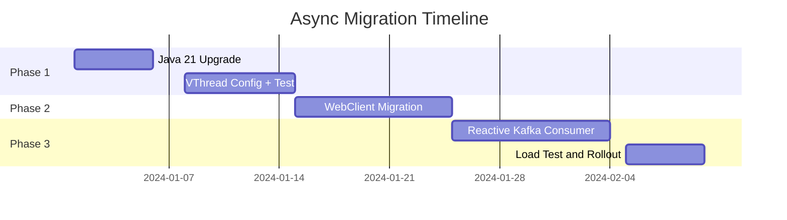
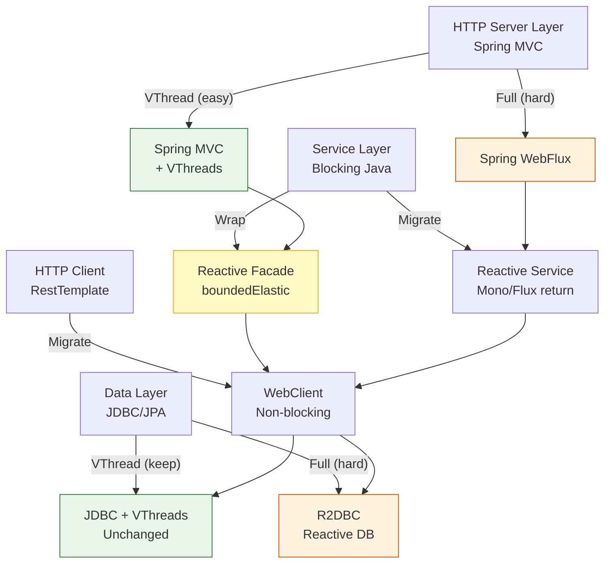

# Async Java - L5 Async Migration

---

# Migrating Blocking Java to Async and Reactive

---
id: AJA-027
title: Migrating Blocking Java to Async and Reactive
category: Async Java
difficulty: ★★★
interview_weight: critical
asked_at: Senior-Staff
seniority: staff
status: draft
version: 1
---

### 🎯 Model Answer

**30 seconds:**
> Migrating blocking Java to async is a multi-phase effort. The Strangler Fig
> pattern is safest: add async at the edge (HTTP layer), wrap blocking code in
> `Schedulers.boundedElastic()`, then migrate core dependencies one by one
> (JDBC -> R2DBC, RestTemplate -> WebClient). Key risks: blocking calls
> in reactive pipelines silently block event-loop threads, data consistency
> across the migration boundary, and team knowledge gaps. For Java 21 target:
> virtual threads are often a better migration target than full reactive.

**3 minutes:**
> Full reactive migration touches every layer: HTTP (Spring MVC -> WebFlux),
> data access (JDBC/JPA -> R2DBC), external HTTP clients (RestTemplate ->
> WebClient), caching, security context propagation, and testing. Each
> layer migration is a project in itself.
>
> The critical danger: partial migration. A mixed codebase where some code
> is reactive and some is blocking is WORSE than either pure approach:
> developers aren't sure which paradigm a given class uses, blocking calls
> sneak into reactive pipelines, and debugging requires knowledge of both
> paradigms.
>
> Migration strategy: (1) assess what to migrate and what to leave; (2) pick
> a migration target (full reactive, or virtual threads on Java 21); (3) use
> Strangler Fig to incrementally migrate; (4) use BlockHound in staging to
> catch remaining blocking calls; (5) validate performance matches or exceeds
> baseline before decommissioning old code.
>
> For most Java services on Java 21: migrate to virtual threads, not reactive.
> It's a 10-line config change vs a 3-month rewrite.

**Blank Mind Recovery:**

**(1) Restate:** "Migrating blocking Java to async - the Strangler Fig pattern.
Add async at the edge, wrap blocking code temporarily, migrate dependencies
one by one. Check for blocking calls with BlockHound."

**(2) First principles:** "A running system can't stop to be rewritten. Strangler
Fig: add new async code alongside old blocking code, gradually route traffic
to new code, strangle the old code until it disappears."

**(3) Bridge:** "Like renovating a house while living in it: you can't tear down
all the walls at once. You renovate one room at a time. The old room still
works while you renovate. Once the new room is done and furnished, you move
in and tear down the old one."

---

### 📘 Concept Explanation

**What it is:**
Strategies and patterns for migrating an existing blocking/synchronous Java
application to asynchronous patterns - either full reactive (Project Reactor
+ Spring WebFlux) or virtual threads (Java 21). Covers the Strangler Fig
migration pattern, layer-by-layer migration, risk management, and the
Java 21 alternative migration path.

**Migration targets and when to use each:**

```
Migration Target A: Full Reactive (Spring WebFlux + Reactor)
  When: streaming required, reactive team, Java < 21 with high concurrency
  Cost: HIGH - all layers must migrate
  Benefit: highest possible concurrency, streaming, backpressure

Migration Target B: Virtual Threads (Java 21, Spring MVC)
  When: most cases; Java 21 available; no streaming requirement
  Cost: VERY LOW - config change + remove workarounds
  Benefit: near-reactive throughput, no code rewrite

Migration Target C: Selective Async (CompletableFuture for hot paths)
  When: specific bottlenecks identified; partial async acceptable
  Cost: LOW per path
  Benefit: targeted improvement without full migration
```

**Strangler Fig pattern:**

```
Phase 0: Status quo
  [Client] -> [Blocking MVC]
                 -> [JDBC]
                 -> [RestTemplate]

Phase 1: Add reactive facade (strangler)
  [Client] -> [WebFlux Facade] -> [Blocking MVC]
  Facade wraps blocking code in boundedElastic
  No performance gain yet; proves migration approach

Phase 2: Migrate data layer
  [Client] -> [WebFlux Facade] -> [R2DBC Repos]
                               -> [Blocking legacy MVC] (still exists)
  Data access non-blocking; facade still wraps some blocking code

Phase 3: Migrate service layer
  [Client] -> [WebFlux Service Layer] -> [R2DBC]
                                      -> [WebClient]
  Old MVC routes still active for unmigrated endpoints

Phase 4: Complete, decommission legacy
  [Client] -> [Full WebFlux] -> [R2DBC] -> [WebClient]
  Legacy MVC completely removed
```

**Layer migration order and complexity:**

```
Layer 1 (easiest): HTTP Client
  RestTemplate -> WebClient
  Drop-in replacement per call site
  Risk: LOW

Layer 2 (medium): HTTP Server
  @Controller -> (WebFlux) @RestController + Mono/Flux return types
  OR: Spring MVC with virtual threads (no code change)
  Risk: MEDIUM (testing, error handling changes)

Layer 3 (hardest): Data Access
  JPA/JDBC -> R2DBC
  Full ORM rewrite; JPA features not available in R2DBC
  Risk: HIGH (correctness, transaction handling)

Layer 4 (critical): Security Context
  ThreadLocal -> Reactor Context (WebFlux)
  OR: DelegatingSecurityContextExecutor (virtual threads)
  Risk: HIGH (security bugs if wrong)
```

---

### 💻 Code Example

**Migration progression patterns:**

```java
// PHASE 1: Wrap blocking service in reactive (Strangler Fig)
// Keep existing blocking UserService; add reactive facade
@Service
public class ReactiveUserServiceFacade {

    private final UserService legacyService; // blocking
    private final Scheduler ioScheduler =
        Schedulers.boundedElastic();

    // Wrap blocking findUser in Mono
    public Mono<User> findUser(String id) {
        return Mono.fromCallable(
                () -> legacyService.findUser(id)) // blocking call
            .subscribeOn(ioScheduler); // runs on bounded thread pool
        // Event loop thread not blocked; pool thread is
    }

    // Wrap blocking list in Flux
    public Flux<User> findAll() {
        return Flux.defer(
            () -> Flux.fromIterable(legacyService.findAll()))
            .subscribeOn(ioScheduler);
    }
}

// PHASE 2: Migrate to R2DBC (remove blocking wrapper)
// BAD (pre-migration): JPA blocking
@Repository
public interface UserJpaRepository
        extends JpaRepository<User, String> {
    // Blocking: returns List<User>, uses ThreadLocal connection
    List<User> findByStatus(String status);
}

// GOOD (post-migration): R2DBC reactive
@Repository
public interface UserR2dbcRepository
        extends ReactiveCrudRepository<User, String> {
    // Non-blocking: returns Flux<User>
    Flux<User> findByStatus(String status);
}

// PHASE 3: Migrate RestTemplate to WebClient
// BAD (pre-migration): RestTemplate
@Service
public class OrderServiceClient {
    private final RestTemplate restTemplate; // blocking

    public Order getOrder(String orderId) {
        return restTemplate.getForObject(
            "/orders/" + orderId, Order.class); // blocks current thread
    }
}

// GOOD (post-migration): WebClient
@Service
public class OrderServiceClient {
    private final WebClient webClient;

    public Mono<Order> getOrder(String orderId) {
        return webClient.get()
            .uri("/orders/{id}", orderId)
            .retrieve()
            .onStatus(
                HttpStatusCode::is4xxClientError,
                r -> Mono.error(new OrderNotFoundException(orderId)))
            .bodyToMono(Order.class);
    }
}

// PHASE 4: Fix @Transactional (JPA -> R2DBC)
// BAD: @Transactional with R2DBC and returning Mono
// (JPA @Transactional uses ThreadLocal - broken for reactive)
@Transactional // wrong: JPA transaction manager, ThreadLocal
public Mono<Order> createOrder(OrderRequest req) {
    return orderRepo.save(new Order(req)); // R2DBC repo
    // Transaction not applied correctly; potential data corruption
}

// GOOD: ReactiveTransactionManager with R2DBC
@Transactional // correct: uses R2DBC TransactionManager (via R2dbcTransactionManager)
public Mono<Order> createOrder(OrderRequest req) {
    // Spring Data R2DBC detects R2dbcTransactionManager
    return orderRepo.save(new Order(req))
        .flatMap(order ->
            inventoryRepo.decrement(req.itemId()));
    // Both in same R2DBC-managed reactive transaction
}
```

> **Code walkthrough:** Phase 1 shows the Strangler Fig's first move: wrap
> the existing blocking service in `Mono.fromCallable(...).subscribeOn(boundedElastic)`.
> This unblocks the event-loop thread (WebFlux can accept new requests) while
> the pool thread handles the blocking call. It's not the final state but enables
> incremental migration. Phase 2 shows the R2DBC migration: the same repository
> interface, but returning `Flux<User>` instead of `List<User>`. Phase 3 shows
> RestTemplate -> WebClient migration: the call site changes from `return value`
> to `return Mono`. Phase 4 is the critical correctness issue: `@Transactional`
> with R2DBC must use `R2dbcTransactionManager`, not the JPA `JpaTransactionManager`.
> Spring auto-configures the correct manager if R2DBC is on the classpath.

---

### 🎓 Answers by Seniority

**Junior / Mid:**
> When migrating blocking code to reactive, I use the Strangler Fig: add the
> new reactive code alongside the existing blocking code, then gradually
> migrate. For temporary wrappers, I use `Mono.fromCallable(() ->
> blockingCall()).subscribeOn(Schedulers.boundedElastic())` which runs the
> blocking call on a bounded thread pool instead of blocking the event loop.
> I then migrate each layer: RestTemplate to WebClient, JDBC to R2DBC.
> I use BlockHound in staging to find any remaining blocking calls in
> reactive pipelines.

---

**Senior / Staff:**
> Full reactive migration is expensive: R2DBC lacks JPA features (complex
> entity graphs, second-level cache, JPQL), testing changes significantly
> (StepVerifier, virtual time), security context propagation changes, and
> the entire team must upskill.
>
> For Java 21 targets: virtual threads are a compelling alternative. The
> migration is `spring.threads.virtual.enabled=true` and removing thread
> pool sizing configs. The blocking code is unchanged, JPA works, transaction
> semantics are unchanged. Performance matches reactive for non-streaming
> workloads.
>
> I'd recommend full reactive only when: (a) streaming with backpressure is
> a core requirement, (b) the team is already reactive-competent, or (c) the
> existing codebase is already mostly reactive (partial migration complete).
> For everything else, virtual threads deliver the throughput benefit without
> the migration cost.

---

### ⚠️ Common Misconceptions

**Misconception: "Partial migration is safe if blocking calls use subscribeOn."**

`subscribeOn(Schedulers.boundedElastic())` wrapping blocking calls is a
valid TEMPORARY measure. The boundedElastic pool has a default cap of
10x CPU cores (or 200 threads, whichever is larger). If you have 100
service methods each wrapping blocking calls, and 200 concurrent requests,
the boundedElastic pool can still exhaust. The partial migration gives you
event-loop thread safety but NOT infinite concurrency. `subscribeOn` wrappers
must be considered technical debt with a plan to eliminate, not a permanent
solution.

---

### 🚨 Failure Modes and Diagnosis

**Failure: Silent blocking in reactive pipeline after migration**

Symptom: WebFlux service response times degrade under moderate load.
`reactor-http` threads show high utilization in thread dumps. P99 latency
high even at 200 concurrent requests.

Cause: a blocking call was missed during migration and is executing on an
event-loop thread.

```bash
# Detection 1: BlockHound (staging only - performance overhead)
BlockHound.install();
# Any blocking call on event-loop thread throws BlockingOperationError
# with full stack trace including the offending call

# Detection 2: Thread dump analysis
jstack <pid> | grep -A 5 "reactor-http"
# Look for reactor-http threads in BLOCKED or WAITING state on:
#   - java.sql.Connection.getStatement (JDBC)
#   - java.net.Socket.read (RestTemplate)
#   - java.io.FileInputStream.read (file I/O)

# Detection 3: Micrometer metrics
# reactor-http thread pool: should rarely be > 50% utilized
# If consistently > 80%: blocking calls suspected

# Fix: add subscribeOn wrapper
service.blockingMethod()
# becomes:
Mono.fromCallable(() -> service.blockingMethod())
    .subscribeOn(Schedulers.boundedElastic())
```

Permanent fix: complete the R2DBC/WebClient migration for the affected layer.
Remove the `subscribeOn` wrapper once the underlying call is non-blocking.

---

### 🎯 Interview Deep-Dive

**Timing:** Hard ★★★ - 12 questions minimum.

---

#### Q1 - What is the Strangler Fig pattern and how does it apply to async migration?

The Strangler Fig pattern (Martin Fowler) migrates a system incrementally
by building new functionality alongside old code, then gradually replacing
old code. Named for the strangler fig tree that grows around an existing
tree, eventually replacing it.

```
Applied to async migration:
  Step 1: Build reactive/async facade around existing system
  Step 2: Route NEW requests to the facade
  Step 3: Migrate individual components behind the facade
  Step 4: Old components "strangled" when replaced
  Step 5: Remove facade when fully replaced

Concrete example:
  t=0: All traffic -> Spring MVC -> JDBC -> DB
  t=1: Add WebFlux layer -> wraps Spring MVC (facade)
        New endpoints -> WebFlux directly (no facade)
        Old endpoints -> WebFlux -> MVC wrapper
  t=2: Migrate data: WebFlux -> R2DBC (old JDBC gone for some paths)
  t=3: All paths -> WebFlux -> R2DBC
        Spring MVC removed entirely
```

Benefits of Strangler Fig over "big bang" migration:
- System remains operational throughout migration
- Each step can be validated before proceeding
- Rollback is possible at each step
- Migration can be paused if priorities change

*What separates good from great:* The facade must maintain the SAME behavior
contract as the system it wraps. If the blocking service throws
`UserNotFoundException`, the reactive facade must emit `Mono.error(new
UserNotFoundException(...))` - not silently return `Mono.empty()`. Behavioral
changes during migration cause subtle bugs that are hard to attribute to
the migration specifically.

---

#### Q2 - How do you migrate @Transactional semantics from JDBC to R2DBC?

`@Transactional` with Spring Data JPA uses `JpaTransactionManager` which
stores connection in ThreadLocal. R2DBC uses `R2dbcTransactionManager`
which stores connection in Reactor Context.

```java
// Spring Boot auto-configuration:
// - If spring-data-r2dbc on classpath: R2dbcTransactionManager configured
// - If spring-data-jpa on classpath: JpaTransactionManager configured
// - BOTH on classpath: both; @Transactional uses PRIMARY one

// Explicit transaction manager selection (transitional):
@Transactional("r2dbcTransactionManager")
public Mono<Order> createOrderReactive(OrderRequest req) {
    return orderR2dbcRepo.save(new Order(req));
}

@Transactional("jpaTransactionManager")
public Order createOrderBlocking(OrderRequest req) {
    return orderJpaRepo.save(new Order(req));
}

// TransactionalOperator for programmatic reactive transactions:
@Autowired
TransactionalOperator txOp;

public Mono<Order> createOrder(OrderRequest req) {
    Mono<Order> work = orderR2dbcRepo.save(new Order(req))
        .flatMap(order ->
            inventoryR2dbcRepo.decrement(req.itemId())
                .thenReturn(order));
    return txOp.transactional(work);
}
```

R2DBC transaction limitations vs JPA:
1. No `@Transactional(propagation = REQUIRES_NEW)` nested transactions
   in the same way (requires explicit `TransactionalOperator`)
2. No JPA second-level cache
3. No optimistic locking via `@Version` (R2DBC supports but differently)
4. No JPQL; use Spring Data R2DBC query methods or `DatabaseClient.sql()`

*What separates good from great:* During mixed migration (some JPA, some
R2DBC): never mix R2DBC and JPA in the same transaction. They use different
connection managers. If an R2DBC write and JPA write must be atomic, use
a saga pattern with compensation, not a shared transaction.

---

#### Q3 - How do you migrate RestTemplate to WebClient?

RestTemplate is synchronous and blocking. WebClient is non-blocking.

```java
// RestTemplate patterns and WebClient equivalents:

// 1. Simple GET
// Old:
User user = restTemplate.getForObject(
    "/users/{id}", User.class, userId);

// New:
Mono<User> user = webClient.get()
    .uri("/users/{id}", userId)
    .retrieve()
    .bodyToMono(User.class);

// 2. POST with request body
// Old:
Order order = restTemplate.postForObject(
    "/orders", orderRequest, Order.class);

// New:
Mono<Order> order = webClient.post()
    .uri("/orders")
    .bodyValue(orderRequest)
    .retrieve()
    .bodyToMono(Order.class);

// 3. Error handling
// Old: throws RestClientException on 4xx/5xx
try {
    User user = restTemplate.getForObject("/users/{id}",
        User.class, userId);
} catch (HttpClientErrorException.NotFound ex) {
    return defaultUser;
}

// New: explicit error handling
Mono<User> user = webClient.get()
    .uri("/users/{id}", userId)
    .retrieve()
    .onStatus(HttpStatusCode::is4xxClientError,
        resp -> resp.bodyToMono(ErrorBody.class)
            .flatMap(err ->
                Mono.error(new UserNotFoundException(userId))))
    .bodyToMono(User.class)
    .onErrorReturn(UserNotFoundException.class, defaultUser);

// 4. Parallel calls (shows reactive advantage)
// Old: sequential, 2x latency
User user = restTemplate.getForObject("/users/{id}",
    User.class, userId);
List<Order> orders = restTemplate.getForObject("/orders/{uid}",
    List.class, userId);

// New: parallel, max(user_latency, orders_latency)
Mono.zip(
    webClient.get().uri("/users/{id}", userId)
        .retrieve().bodyToMono(User.class),
    webClient.get().uri("/orders/{uid}", userId)
        .retrieve().bodyToFlux(Order.class).collectList()
).map(tuple -> new UserWithOrders(
    tuple.getT1(), tuple.getT2()));
```

*What separates good from great:* WebClient configuration for production:
connection pooling (Netty uses connection pools by default),
connection timeout, read timeout, and base URL configuration:
```java
@Bean
WebClient externalServiceClient(WebClient.Builder builder) {
    HttpClient httpClient = HttpClient.create()
        .option(ChannelOption.CONNECT_TIMEOUT_MILLIS, 5000)
        .responseTimeout(Duration.ofSeconds(10))
        .doOnConnected(conn ->
            conn.addHandlerLast(new ReadTimeoutHandler(10))
                .addHandlerLast(new WriteTimeoutHandler(10)));

    return builder
        .baseUrl("https://api.external.com")
        .clientConnector(new ReactorClientHttpConnector(httpClient))
        .defaultHeader(HttpHeaders.ACCEPT,
            MediaType.APPLICATION_JSON_VALUE)
        .build();
}
```

---

#### Q4 - What are the risks of migrating JPA to R2DBC?

R2DBC is a first-class non-blocking JDBC alternative, but lacks several
JPA features:

**Feature gaps:**

```
Available in R2DBC (Spring Data R2DBC):
  CRUD operations via repository
  @Query with SQL
  Transactions (R2dbcTransactionManager)
  Auditing (@CreatedDate, @LastModifiedDate)
  Paging and sorting
  Simple one-to-many with DatabaseClient

NOT available in R2DBC:
  JPA entity relationships (@OneToMany, @ManyToMany mappings)
  JPQL (use SQL instead)
  Entity graphs (@EntityGraph for fetch strategies)
  Second-level cache (Ehcache, Hazelcast)
  Lazy loading (@FetchType.LAZY)
  Hibernate-specific features (envers, multi-tenancy)
  Stored procedure support (limited)
```

**Risk assessment:**

```java
// High-risk migration: complex entity relationships
@Entity
public class Order {
    @OneToMany(mappedBy = "order", fetch = FetchType.LAZY)
    private List<OrderItem> items; // automatic lazy load in JPA

    @ManyToOne
    @JoinColumn(name = "customer_id")
    private Customer customer; // JPA resolves automatically
}

// R2DBC equivalent: manual joins required
@Table("orders")
public record Order(
    @Id Long id,
    String customerId, // just the ID; no automatic join
    // no List<OrderItem>: must fetch separately
    String status) {}

// R2DBC fetch with manual join:
Mono<OrderWithDetails> findOrderWithDetails(Long orderId) {
    Mono<Order> order = orderRepo.findById(orderId);
    Flux<OrderItem> items = itemRepo.findByOrderId(orderId);
    return Mono.zip(order, items.collectList())
        .map(t -> new OrderWithDetails(t.getT1(), t.getT2()));
    // Manual what JPA did automatically
}
```

*What separates good from great:* For services with complex object graphs,
the JPA -> R2DBC migration may require redesigning the domain model. If the
service currently uses 10 `@OneToMany` relationships that JPA resolves
automatically, R2DBC requires 10 explicit queries. This is often the right
approach (avoids N+1 problems, explicit fetching is clearer), but it's a
significant behavioral change that requires testing every query.

---

#### Q5 - How do you approach a virtual-thread migration instead of reactive migration?

Virtual thread migration is significantly simpler than reactive migration:

```yaml
# application.properties (Spring Boot 3.2+):
spring:
  threads:
    virtual:
      enabled: true

# This single setting:
# - Switches Tomcat to use virtual threads for HTTP requests
# - Switches @Async to use virtual threads
# - No code changes required
```

```java
// BEFORE (blocking, Spring MVC):
@GetMapping("/profile/{id}")
public UserProfile getProfile(@PathVariable String id) {
    User user = userService.getUser(id);      // blocks thread
    List<Order> orders = orderService.get(id); // blocks thread
    return UserProfile.of(user, orders);
}
// With virtual threads: both calls release OS thread while waiting
// One virtual thread per request; simple blocking code

// OPTIONALLY: parallel with StructuredTaskScope (Java 21)
@GetMapping("/profile/{id}")
public UserProfile getProfile(@PathVariable String id)
        throws Exception {
    try (var scope =
            new StructuredTaskScope.ShutdownOnFailure()) {
        var userTask = scope.fork(() -> userService.getUser(id));
        var orderTask = scope.fork(() -> orderService.get(id));
        scope.join().throwIfFailed();
        return UserProfile.of(userTask.get(), orderTask.get());
    }
    // Parallel calls with structured concurrency
    // Still blocking code; virtual threads do the heavy lifting
}
```

**Virtual thread migration checklist:**
1. Upgrade to Java 21 (compile and runtime)
2. Set `spring.threads.virtual.enabled=true`
3. Remove thread pool sizing configs (virtual threads are cheap)
4. Find and fix pinning: `synchronized` blocks -> `ReentrantLock`
   (`-Djdk.tracePinnedThreads=full` during load test)
5. Remove `@Async` executors with large thread pools (no longer needed)
6. Keep `@Async` for fire-and-forget patterns but simplify executor config

*What separates good from great:* The JDBC stack is virtual-thread-safe
starting from Java 21 (JDBC 4.3+). One catch: old JDBC drivers that use
`synchronized` internally will pin virtual threads. Verify driver version:
PostgreSQL JDBC 42.6+, MySQL Connector/J 8.1+, HikariCP 5.1+ are virtual
thread safe. Run with `jdk.tracePinnedThreads` under load to verify.

---

#### Q6 - How do you handle the parallel operation migration from sync to async?

Blocking sequential code often benefits most from parallelism in migration:

```java
// BLOCKING SEQUENTIAL: 3 calls, each 100ms = 300ms total
public Dashboard getDashboard(String userId) {
    UserProfile profile =
        userService.getProfile(userId);     // 100ms
    List<Order> orders =
        orderService.getRecent(userId);     // 100ms
    List<Notification> notifs =
        notifService.getUnread(userId);     // 100ms
    return new Dashboard(profile, orders, notifs);
    // Total: ~300ms
}

// REACTIVE PARALLEL: 3 concurrent calls = max(100ms each) = ~100ms
public Mono<Dashboard> getDashboard(String userId) {
    return Mono.zip(
        userService.getProfile(userId),
        orderService.getRecent(userId),
        notifService.getUnread(userId)
    ).map(t ->
        new Dashboard(t.getT1(), t.getT2(), t.getT3()));
    // Total: ~100ms (parallel)
}

// VIRTUAL THREAD PARALLEL: Java 21 StructuredTaskScope
public Dashboard getDashboard(String userId) throws Exception {
    try (var scope =
            new StructuredTaskScope.ShutdownOnFailure()) {
        var profileTask =
            scope.fork(() -> userService.getProfile(userId));
        var ordersTask =
            scope.fork(() -> orderService.getRecent(userId));
        var notifsTask =
            scope.fork(() -> notifService.getUnread(userId));

        scope.join().throwIfFailed();
        return new Dashboard(
            profileTask.get(),
            ordersTask.get(),
            notifsTask.get());
        // Total: ~100ms (parallel), simple code
    }
}
```

Performance comparison for this pattern:
- Blocking sequential: 300ms
- Reactive parallel: ~100ms + operator overhead (<5ms)
- Virtual thread parallel: ~100ms + task creation overhead (<1ms)

*What separates good from great:* The `ShutdownOnFailure` vs
`ShutdownOnSuccess` choice for parallel calls: `ShutdownOnFailure` cancels
remaining tasks when any task fails (all-or-nothing). `ShutdownOnSuccess`
cancels remaining tasks when the FIRST task succeeds (race-to-first). For
dashboard: use `ShutdownOnFailure` (all data needed). For cache-miss +
DB lookup: use `ShutdownOnSuccess` (whichever returns first wins).

---

#### Q7 - How do you migrate Spring Security configuration from MVC to WebFlux?

Spring Security has different APIs for MVC and WebFlux:

```java
// MVC Security Config:
@Configuration
@EnableWebSecurity
public class SecurityConfig extends WebSecurityConfigurerAdapter {
    @Override
    protected void configure(HttpSecurity http) throws Exception {
        http
            .authorizeRequests()
            .antMatchers("/public/**").permitAll()
            .anyRequest().authenticated()
            .and()
            .httpBasic();
    }
}

// WebFlux Security Config:
@Configuration
@EnableWebFluxSecurity
public class SecurityConfig {
    @Bean
    public SecurityWebFilterChain securityChain(
            ServerHttpSecurity http) {
        return http
            .authorizeExchange(ex -> ex
                .pathMatchers("/public/**").permitAll()
                .anyExchange().authenticated())
            .httpBasic(Customizer.withDefaults())
            .build();
    }

    // Reactive password encoder (same as MVC)
    @Bean
    public PasswordEncoder passwordEncoder() {
        return new BCryptPasswordEncoder();
    }

    // Reactive UserDetails service
    @Bean
    public ReactiveUserDetailsService userDetailsService() {
        return username ->
            userRepository.findByUsername(username)
                .map(user -> User.builder()
                    .username(user.username())
                    .password(user.passwordHash())
                    .roles(user.roles().toArray(String[]::new))
                    .build());
    }
}
```

Key differences:
- `WebSecurityConfigurerAdapter` -> `SecurityWebFilterChain` bean
- `HttpSecurity` -> `ServerHttpSecurity`
- `UserDetailsService` -> `ReactiveUserDetailsService`
- `SecurityContextHolder` -> `ReactiveSecurityContextHolder`
- `antMatchers` -> `pathMatchers`

*What separates good from great:* JWT migration: the JWT filter is
different. MVC uses `OncePerRequestFilter`; WebFlux uses `WebFilter`:
```java
// WebFlux JWT filter:
@Component
public class JwtAuthFilter implements WebFilter {
    @Override
    public Mono<Void> filter(ServerWebExchange exchange,
            WebFilterChain chain) {
        String token = extractToken(exchange.getRequest());
        if (token == null) return chain.filter(exchange);
        return validateToken(token)
            .flatMap(auth ->
                chain.filter(exchange)
                    .contextWrite(ReactiveSecurityContextHolder
                        .withAuthentication(auth)));
    }
}
```

---

#### Q8 - How do you ensure data consistency during the migration period?

During migration, some code is reactive (new) and some is blocking (legacy).
Consistency risks:

```java
// RISK 1: Two clients for same DB - mixed transaction state
// Old code: JPA saves Order with Hibernate
// New code: R2DBC saves Order reactively
// They share the same database but different connection pools
// Hibernate transaction may not see uncommitted R2DBC data

// RULE: During migration, one writer pattern
// Either old code OR new code writes to a table; never both
// Read from both is acceptable (eventual consistency)

// RISK 2: Event sourcing approach for zero-downtime migration
// Both old and new code publish to an events topic
// Migration service reads events, backfills new schema
// Once backfill complete: switch reads to new schema

// Pattern: dual-write during migration
public Mono<Order> createOrder(OrderRequest req) {
    return r2dbcOrderRepo.save(new Order(req))  // new schema
        .doOnSuccess(order ->
            legacyOrderService.save(req))      // old schema too
        // Both writes: remove legacy write after old readers migrated
        ;
}

// RISK 3: Saga compensation incomplete during migration
// Log every compensation action:
compensationLog.record(
    "ORDER_COMPENSATION",
    orderId,
    "INVENTORY_RELEASED",
    Instant.now());
```

*What separates good from great:* Feature flags for gradual rollout of
migrated code paths:
```java
if (featureFlags.isEnabled("use-r2dbc-orders")) {
    return r2dbcOrderRepo.findById(id);
} else {
    return Mono.fromCallable(
        () -> jpaOrderRepo.findById(id).orElseThrow())
        .subscribeOn(Schedulers.boundedElastic());
}
```
Feature flags allow 1%, 10%, 100% rollout of migrated paths. Any consistency
issue: toggle off the feature flag, revert to old path, investigate.

---

#### Q9 - How do you measure the success of an async migration?

Key metrics to compare before/after migration:

```bash
# 1. Throughput: requests per second under load test
# Tool: k6, wrk, or gatling
k6 run --vus 1000 --duration 60s load-test.js
# Compare: pre-migration P50/P95/P99 vs post-migration

# 2. Thread count: should decrease dramatically with reactive/VThreads
# Before: 500 threads at 500 concurrent requests
# After reactive: ~20 threads (Netty event loop + boundedElastic)
# After VThreads: 500 virtual threads, ~10 OS threads

# Monitor:
jcmd <pid> Thread.print | grep "threads" | wc -l

# 3. Memory: reactive may increase short-lived object count
# GC pressure metric via JVM MXBeans:
jcmd <pid> GC.heap_info
# Compare GC frequency and pause times before/after

# 4. Error rate: any new async-specific errors
# Look for: TimeoutException, BackpressureException,
# BlockingOperationError (if BlockHound installed)
# Monitor error rate via Micrometer:
meter_registry.counter("errors",
    "type", ex.getClass().getSimpleName()).increment();

# 5. Latency under load: the key metric
# Before: P99 = 500ms (thread queuing under load)
# After: P99 = 120ms (no queuing; non-blocking)
```

Success criteria checklist:
- Throughput equal or higher under same concurrency
- P99 latency lower under peak load
- No new error types introduced
- Thread count reduced (reactive) or virtual thread count manageable
- No BlockHound violations in staging
- All existing integration tests pass

*What separates good from great:* Synthetic load tests don't capture all
production patterns. Run shadow traffic (replay production traffic to new
service) before final cutover. Shadow traffic reveals: (1) edge case
request patterns not in load tests; (2) downstream service behavior under
async call patterns; (3) actual error rates on production data.

---

#### Q10 - How do you handle test migration from MVC to WebFlux?

Test migration is often underestimated:

```java
// MVC test: MockMvc (synchronous)
@WebMvcTest(UserController.class)
class UserControllerTest {
    @Autowired
    MockMvc mockMvc;

    @Test
    void getUserReturns200() throws Exception {
        when(userService.findUser("u1"))
            .thenReturn(new User("u1", "Alice")); // returns User directly

        mockMvc.perform(get("/users/u1"))
            .andExpect(status().isOk())
            .andExpect(jsonPath("$.name").value("Alice"));
    }
}

// WebFlux test: WebTestClient (reactive)
@WebFluxTest(UserController.class)
class UserControllerTest {
    @Autowired
    WebTestClient client;

    @MockBean
    UserService userService;

    @Test
    void getUserReturns200() {
        when(userService.findUser("u1"))
            .thenReturn(Mono.just(new User("u1", "Alice"))); // returns Mono

        client.get()
            .uri("/users/u1")
            .exchange()
            .expectStatus().isOk()
            .expectBody()
            .jsonPath("$.name").isEqualTo("Alice");
    }
}
```

Additional test migration:
- Service layer: `assertEquals(result, expected)` -> `StepVerifier`
- Error tests: `assertThrows(...)` -> `StepVerifier.create(...).expectError(...)`
- Parallel tests: sequential test assertions -> `StepVerifier.create(Mono.zip(...))`
- Time tests: `Thread.sleep(delay)` -> `withVirtualTime + thenAwait`

*What separates good from great:* Test migration reveals hidden coupling
in the service code. Synchronous services return `T`; reactive services
return `Mono<T>`. If the service interface changes, ALL callers and ALL
tests change. Plan for test rewrite effort: typically 20-30% of total
migration effort. Tests that were "already slow" (real sleep for async
timing) benefit most from reactive migration (virtual time makes them fast).

---

#### Q11 - How do you handle connection pool migration from blocking to reactive?

Blocking JDBC uses HikariCP (thread-per-connection model).
Reactive R2DBC uses r2dbc-pool (connection pool, not thread pool).

```yaml
# HikariCP (blocking JDBC) config:
spring:
  datasource:
    hikari:
      maximum-pool-size: 50   # one connection per thread
      minimum-idle: 10
      connection-timeout: 30000

# R2DBC Pool config (reactive):
spring:
  r2dbc:
    pool:
      max-size: 20          # fewer connections; non-blocking reuse
      initial-size: 5
      max-idle-time: 30m
      acquire-retry: 3
```

Why R2DBC pool is smaller: with blocking JDBC, one thread holds one
connection for the duration of the query. With R2DBC, a connection is
held only during the actual DB write/read operation; the connection is
returned to the pool during awaits. Fewer connections needed.

```java
// Connection pool sizing formula:
// Blocking: connections ~= concurrency (one per request)
// Reactive: connections ~= CPU cores * 2 (+ buffer for latency spikes)
//   For 8 CPU cores: R2DBC pool size ~16-20
//   For 500 concurrent blocking requests: HikariCP pool size ~50-100

// Monitoring connection pool with R2DBC:
ConnectionPoolMetrics metrics = ((ConnectionPool)connectionFactory)
    .getMetrics().orElseThrow();
int acquired = metrics.acquiredSize();
int pending = metrics.pendingAcquireSize();
// If pendingAcquireSize > 0 consistently: pool too small
```

*What separates good from great:* Mixed migration: for services using both
JPA (for complex queries) and R2DBC (for hot paths), maintain BOTH connection
pools. Each has its own sizing. The JPA pool is sized for sync concurrency;
R2DBC pool is sized for async concurrency. The total DB connection count
increases temporarily during migration but allows safe incremental validation.

---

#### Q12 - What is your recommended migration strategy for a production Java service?

Recommended migration plan:

**Decision gate first:**
```
Java 21 available?
  Yes + no streaming requirement -> Virtual threads migration (1 week)
  Yes + streaming requirement -> Reactive migration (3-6 months)
  No + < 5k concurrency -> Thread pool tuning (no migration)
  No + > 5k concurrency + streaming -> Reactive migration (3-6 months)
```

**Virtual thread migration (if Java 21):**
```
Week 1:
  1. Upgrade to Java 21
  2. spring.threads.virtual.enabled=true
  3. Remove custom executor configs (@Async, thread pool sizing)
  4. Load test: verify throughput equal or better
  5. Check pinning: -Djdk.tracePinnedThreads=full under load
     Fix synchronized -> ReentrantLock if pinning found
  6. Deploy to production (gradual rollout: 10%, 50%, 100%)
```

**Full reactive migration (if required):**
```
Month 1: Foundation
  - HTTP client: RestTemplate -> WebClient
  - Security: migrate WebSecurityConfigurerAdapter
  - Test scaffold: convert service tests to StepVerifier

Month 2: Data layer
  - R2DBC setup alongside JPA
  - One repository migrated to R2DBC with feature flag
  - Validate correctness with shadow traffic
  - Expand to remaining repositories

Month 3: Controller layer
  - WebFlux controller alongside MVC (feature flag per endpoint)
  - BlockHound in staging: eliminate remaining blocking calls
  - Full load test comparing MVC baseline vs WebFlux

Month 4: Cleanup
  - Remove JPA, MVC, RestTemplate dependencies
  - Remove feature flags (100% on new code)
  - Performance validation in production
  - Incident review: document any migration-related incidents
```

*What separates good from great:* The most common migration failure mode:
skipping the "validate correctness" step in month 2. R2DBC query behavior
may differ from JPA in subtle ways (JOIN resolution, lazy vs eager loading).
Shadow traffic (running new code in parallel, comparing responses) is the
only reliable way to find behavioral differences before cutover. Automated
response comparison of old vs new code on production traffic is invaluable.

---

### ⚖️ Comparison Table

**Migration approach comparison:**

| Factor | Virtual Threads | Full Reactive Migration |
|---|---|---|
| Java version required | Java 21+ | Java 8+ |
| Code changes | Minimal (config) | Major (all layers) |
| JPA/Hibernate | Unchanged | Replace with R2DBC |
| Duration | 1-2 weeks | 2-6 months |
| Risk level | Low | High |
| Performance gain | High (matches reactive) | Highest (streaming capable) |
| Streaming support | No (no backpressure) | Yes (first-class) |
| Team upskilling | Minimal | Significant |

---

### 🏛️ System Design

**Design: migrating a high-traffic Spring MVC API to support 50k concurrent**

**Current state:**
- Spring MVC, Java 17, HikariCP 50 threads, JDBC
- 2,000 concurrent users, 95% I/O bound (DB + HTTP calls)
- Peak concurrency causes thread exhaustion, latency spikes to 5s P99

**Migration options analysis:**

Option A: Upgrade to Java 21 + virtual threads (4 weeks)
- `spring.threads.virtual.enabled=true`
- No code changes to business logic
- JDBC remains; no R2DBC migration
- Thread exhaustion eliminated; P99 latency drops to ~200ms
- Cost: Java 21 upgrade + testing

Option B: Migrate to Spring WebFlux + R2DBC (4 months)
- Full reactive pipeline
- Maximum concurrency (event loop)
- Complex migration; R2DBC feature gaps to assess
- P99 latency: ~150ms (slight improvement over VThreads)

Option C: Add virtual threads for API, reactive for streaming (6 weeks)
- Best of both: simple API code, reactive for event streams
- Covers all current requirements + future streaming

**Decision**: Option C - virtual threads API + reactive streaming

```
Architecture after migration:
  Clients -> Spring MVC (VThreads, Java 21)
               -> PostgreSQL (JDBC + HikariCP, unchanged)
               -> External APIs (WebClient, non-blocking)
               -> Kafka producer (non-blocking)

  Kafka -> Reactive Consumer (Reactor Kafka)
              -> Flux pipeline with backpressure
              -> Database (R2DBC for write-heavy analytics)
```

Migration plan:
- Week 1-2: Java 21 upgrade + VThread config + load test
- Week 3-4: RestTemplate -> WebClient migration
- Week 5-6: Kafka consumer -> Reactor Kafka with backpressure



> **Diagram walkthrough:** The Gantt chart shows the incremental migration
> phases. Phase 1 (Java 21 + virtual threads) provides the most immediate
> performance benefit with the least risk - it can be deployed at the end
> of Week 2. Phase 2 (WebClient) eliminates the last blocking I/O call
> (external HTTP). Phase 3 adds reactive capability only where it's truly
> needed (streaming Kafka). Each phase is independently deployable and
> provides value on its own. Total elapsed time: 6 weeks vs 4 months for
> full reactive migration, with comparable end performance.

---

### 📊 Diagram

**Migration layers and dependency order:**

```
Layer 4: HTTP server
  Spring MVC controller
      |
      | easiest: virtual threads (config change)
      | harder:  WebFlux (code change)
      v
Layer 3: Service layer
  Blocking Java services
      |
      | wrap blocking: Mono.fromCallable + subscribeOn
      | full migrate: return Mono<T> throughout
      v
Layer 2: HTTP Client
  RestTemplate (blocking)
      |
      | migrate: WebClient (non-blocking)
      v
Layer 1: Data access
  JDBC / JPA / Hibernate
      |
      | hardest: R2DBC (full ORM rewrite)
      | alternative: JDBC + virtual threads (no rewrite)
      v
Database
```



> **Diagram walkthrough:** The layered diagram shows that migration can be
> selective. The left path (green) is the virtual thread migration: only the
> HTTP server layer changes (config), everything else stays. The right path
> (orange) is full reactive: all layers rewrite. The yellow middle path is the
> Strangler Fig: service layer wrapped reactively as a transitional state.
> The diagram shows that HTTP client migration (RestTemplate -> WebClient) is
> shared by both paths - it's the one layer that benefits both approaches.
> Starting with WebClient migration (low risk, high value) is the recommended
> first step for either migration path.
