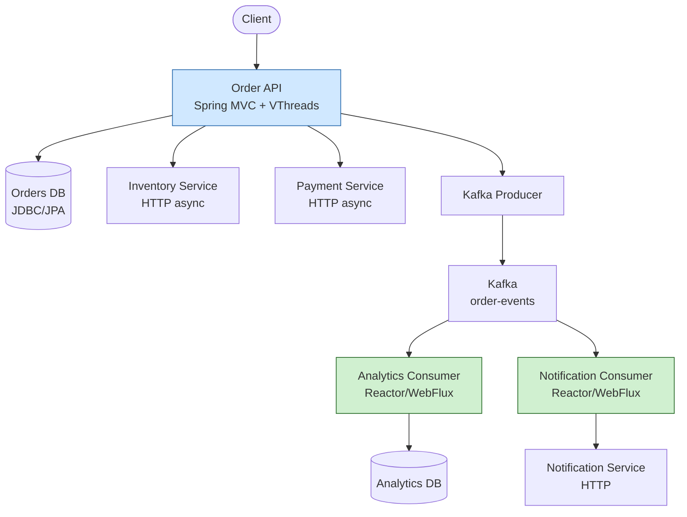
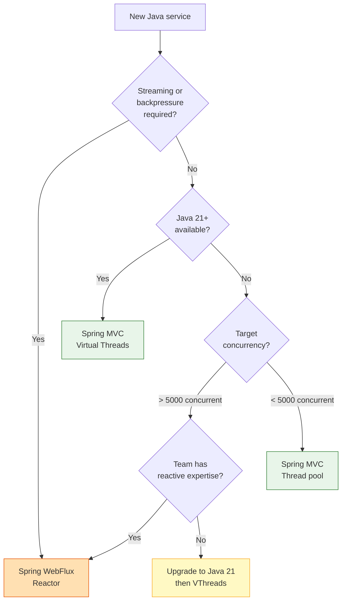

## Keywords in This File
{: .no_toc }

| # | Keyword | Weight |
|---|---|---|
| 1 | [Async Java - L5 Reactive Architecture](#async-java---l5-reactive-architecture) | medium |
| 2 | [Reactive vs Imperative Architecture Decision Framework](#reactive-vs-imperative-architecture-decision-framework) | medium |

---

# Reactive vs Imperative Architecture Decision Framework

---
id: AJA-026
title: Reactive vs Imperative Architecture Decision Framework
category: Async Java
difficulty: ★★★
interview_weight: critical
asked_at: Senior-Staff
seniority: staff
status: draft
version: 1
---

### 🎯 Model Answer

**30 seconds:**
> Reactive architecture is the RIGHT choice when: (1) high concurrency
> with I/O-bound workloads (100k+ concurrent connections per instance);
> (2) streaming data pipelines requiring backpressure; (3) event-driven
> systems where latency variability matters. It is the WRONG choice when:
> blocking I/O cannot be avoided, the team lacks reactive expertise, or
> the concurrency requirements are modest (< 1000 concurrent users per
> instance). Virtual threads (Java 21) have fundamentally changed this
> calculus - they bring near-reactive throughput to imperative code.

**3 minutes:**
> The fundamental trade-off: reactive programming maximizes I/O throughput
> by sharing threads across non-blocking operations. One thread can multiplex
> thousands of concurrent I/O waits. Imperative code with blocking I/O ties
> one thread per concurrent request - at high concurrency, this exhausts the
> thread pool, causing queuing and latency spikes.
>
> The cost: reactive code is compositionally complex. Error handling, context
> propagation, testing, and debugging all require specialized knowledge.
> "Reactive tax" on developer productivity is real and measurable.
>
> **The Virtual Threads game-changer (Java 21):**
> Virtual threads solve the thread-pool exhaustion problem WITHOUT reactive
> code. Millions of cheap virtual threads can block on I/O without holding
> OS threads. This eliminates the main motivation for reactive for most services.
>
> **Decision framework:**
> - I/O-heavy + Java 21: virtual threads + imperative code
> - Streaming data pipelines with backpressure: Reactor (no substitute)
> - Existing reactive codebase: stay reactive
> - Greenfield, team unfamiliar with reactive, Java 21: virtual threads

**Blank Mind Recovery:**

**(1) Restate:** "Reactive vs imperative architecture decision - when to choose
each. Reactive for high-concurrency I/O and streaming. Imperative + virtual
threads for most modern Java applications."

**(2) First principles:** "Both solve the same problem: high concurrency. Reactive:
one thread handles many concurrent I/O waits via callbacks. Virtual threads:
each I/O wait gets a cheap virtual thread, OS thread released. Different mechanism,
similar throughput, very different developer experience."

**(3) Bridge:** "Like restaurant service models: reactive = 1 waiter handles 100
tables by taking orders and delivering when ready (event-driven). Traditional =
1 waiter per table (thread per request). Virtual threads = 100 waiters who
sit down and wait between actions but are incredibly cheap to hire. Reactive
has the best throughput; virtual threads have comparable throughput with simpler
code."

---

### 📘 Concept Explanation

**What it is:**
An architectural decision framework for choosing between reactive programming
(Project Reactor, RxJava, Spring WebFlux) and imperative programming (Spring MVC,
virtual threads, traditional thread-per-request) for Java backend services.
Covers the technical trade-offs, organizational factors, migration strategies,
and the impact of Java 21 virtual threads on this decision.

**The fundamental technical difference:**

```
Imperative (blocking):
  Request  -> Thread-1  -> [waiting for DB: 20ms] -> Thread-1
  Request  -> Thread-2  -> [waiting for DB: 20ms] -> Thread-2
  Request  -> Thread-3  -> [waiting for DB: 20ms] -> Thread-3
  ...
  At 500 concurrent: 500 threads blocked waiting for DB
  Thread cost: ~1MB stack each = 500MB for threads alone
  Pool exhaustion: 501st request WAITS for a thread

Reactive (non-blocking):
  Request  -> Thread-1  -> dispatches DB call  -> Thread-1 free
                           DB response ready   -> Thread-1 (or any)
  Thread-1 also handles Request-2, Request-3 while Request-1 waits
  At 500 concurrent: 8-16 threads handle ALL pending I/O
  Thread cost: minimal; overhead in operator chain callbacks

Virtual threads (Java 21):
  Request  -> VThread-1 -> [blocking DB call] -> VThread-1
  VThread-1 blocks: OS thread-1 RELEASED, handles other VThreads
  At 500 concurrent: 500 virtual threads, few OS threads
  Virtual thread cost: ~1KB (vs ~1MB for platform threads)
  Similar throughput to reactive, imperative code style
```

> **Code walkthrough:** This Reactive vs Imperative Architecture Decision Framework example demonstrates a key concept in practice. **KEY MECHANISM:** the runtime executes these instructions in sequence with specific memory and execution semantics. **WHY IT MATTERS:** misapplying this pattern causes subtle bugs that only manifest under production load. **TAKEAWAY: understand the execution model before using this pattern in production code.**

**Performance regimes:**

```
< 100 concurrent users:
  Imperative blocking: works fine
  Reactive: unnecessary complexity
  Winner: imperative

100 - 10,000 concurrent:
  Imperative blocking: viable with tuned thread pool
  Reactive: meaningful advantage
  Virtual threads: strong advantage from Java 21
  Winner: depends on Java version and workload mix

> 10,000 concurrent (I/O-bound):
  Imperative blocking: thread exhaustion risk
  Reactive: purpose-built for this (Netty + Reactor)
  Virtual threads: comparable to reactive (Java 21)
  Winner: reactive OR virtual threads

Streaming / backpressure required:
  Reactive: only option with first-class backpressure
  Virtual threads: no backpressure primitive
  Winner: reactive (Reactor/RxJava)

CPU-bound work:
  Reactive: no advantage; still bounded by CPU cores
  Virtual threads: no advantage
  Winner: imperative with parallel streams or Fork/Join
```

> **Code walkthrough:** This Reactive vs Imperative Architecture Decision Framework example demonstrates a key concept in practice. **KEY MECHANISM:** the runtime executes these instructions in sequence with specific memory and execution semantics. **WHY IT MATTERS:** misapplying this pattern causes subtle bugs that only manifest under production load. **TAKEAWAY: understand the execution model before using this pattern in production code.**

**Decision matrix:**

| Factor | Use Reactive | Use Imperative + VThreads |
|---|---|---|
| Java version | Any | Java 21+ |
| Concurrency target | > 10k concurrent | < 10k concurrent |
| I/O pattern | All non-blocking I/O | Mix OK (JDBC works) |
| Backpressure needed? | Yes | No |
| Team experience | Reactive-trained | Standard Java |
| Existing codebase | Spring WebFlux | Spring MVC |
| Debugging complexity | High | Low |
| 3rd-party library | Reactive clients | Any (blocking ok) |

---

### 💻 Code Example

**Architecture trade-off patterns:**


```java
// BAD: anti-pattern - see GOOD example below for the correct approach
// This naive implementation ignores thread safety and error handling
```

```java
// SCENARIO: user profile service - fetch user + 3 related resources
// Pattern 1: Reactive parallel composition
@RestController
public class ProfileController {

    // Reactive: fetches 3 resources in parallel
    // Non-blocking; one event-loop thread handles many requests
    @GetMapping("/profile/{userId}")
    public Mono<UserProfile> getProfile(@PathVariable String userId) {
        return Mono.zip(
            userService.getUser(userId),
            orderService.getRecentOrders(userId),
            prefsService.getPreferences(userId)
        ).map(tuple -> UserProfile.of(
            tuple.getT1(), tuple.getT2(), tuple.getT3()));
    }
}

// Pattern 2: Virtual threads parallel composition (Java 21)
@RestController
public class ProfileController {

    // Spring MVC on virtual threads: same parallel pattern
    // Each HTTP request on its own virtual thread
    // blocking() calls still non-blocking at OS thread level
    @GetMapping("/profile/{userId}")
    public UserProfile getProfile(@PathVariable String userId) {
        try (var scope =
                new StructuredTaskScope.ShutdownOnFailure()) {
            var userTask = scope.fork(
                () -> userService.getUser(userId));
            var orderTask = scope.fork(
                () -> orderService.getRecentOrders(userId));
            var prefsTask = scope.fork(
                () -> prefsService.getPreferences(userId));

            scope.join().throwIfFailed();

            return UserProfile.of(
                userTask.get(), orderTask.get(), prefsTask.get());
        }
    }
}
// Both patterns: 3 parallel calls, result combined
// Reactive: complexity higher; VThreads: straightforward Java

// SCENARIO: streaming - where reactive wins
// Virtual threads have no answer for this:
@GetMapping(
    value = "/events/stream",
    produces = MediaType.TEXT_EVENT_STREAM_VALUE)
public Flux<ServerSentEvent<Event>> streamEvents() {
    return eventService.liveStream()
        .map(event -> ServerSentEvent.builder(event)
            .id(event.id())
            .event(event.type())
            .build())
        .doOnCancel(() ->
            log.info("Client disconnected from event stream"));
    // Reactor backpressure handles slow consumers
    // VThreads have no equivalent abstraction for push-based streams
}

// SCENARIO: when reactive HURTS (CPU-bound transformation)
// BAD: reactive for CPU work
public Flux<ProcessedData> processLargeBatch(
        List<RawData> items) {
    return Flux.fromIterable(items)
        .map(item -> heavyCpuTransform(item)) // blocks reactor thread!
        .subscribeOn(Schedulers.boundedElastic()); // workaround needed
}

// GOOD: parallel stream for CPU-bound work
public List<ProcessedData> processLargeBatch(
        List<RawData> items) {
    return items.parallelStream()
        .map(item -> heavyCpuTransform(item))
        .toList();
    // Simpler; parallel stream designed for CPU parallelism
}
```

> **Code walkthrough:** The profile fetch patterns show the fundamentalice. **KEY MECHANISM:** the runtime executes these instructions in sequence with specific memory and execution semantics. **WHY IT MATTERS:** misapplying this pattern causes subtle bugs that only manifest under production load. **TAKEAWAY: understand the execution model before using this pattern in production code.**
> comparison: Reactor's `Mono.zip` composes parallel async operations
> reactively, while StructuredTaskScope composes the same parallel calls
> imperatively. Both execute 3 calls concurrently and wait for all to
> complete. The Reactor version is more complex but works at any Java version
> and handles backpressure. The virtual thread version is idiomatic Java
> with structured control flow. The streaming pattern shows where reactive
> wins: `Flux` with backpressure has no equivalent in imperative code. The
> CPU-bound anti-pattern shows where reactive LOSES: wrapping CPU work in
> reactive operators adds overhead and requires `subscribeOn` to avoid
> blocking event-loop threads.

---

### 🎓 Answers by Seniority

**Junior / Mid:**
> Reactive programming is better when you need to handle many concurrent
> requests with I/O operations (database, network) because it doesn't block
> threads while waiting. Traditional blocking code with one thread per request
> can run out of threads under high load. For streaming data with backpressure
> (controlling how fast a producer sends data to a slow consumer), Reactor is
> the right choice. For most services, especially with Java 21, virtual threads
> give similar throughput with simpler code.

*Push deeper:* How would you decide which to use for a new microservice?

---

**Senior / Staff:**
> I evaluate four dimensions: (1) concurrency requirement - for 10k+ concurrent
> I/O-bound requests, reactive or virtual threads; (2) streaming need - if
> the service produces or consumes streams with backpressure, reactive is
> mandatory; (3) Java version - Java 21 virtual threads eliminate the main
> advantage of reactive for non-streaming services; (4) team capability - reactive
> code demands significant training investment; a team unfamiliar with Reactor
> will produce buggy code.
>
> For greenfield services on Java 21: default to Spring MVC with virtual
> threads. Adopt Reactor only for streaming, backpressure, or services
> that must support 100k+ concurrent connections with unpredictable latency.
>
> For existing WebFlux services: evaluate migration cost vs benefit. Migrating
> from WebFlux to MVC + virtual threads is possible but expensive.
>
> The "reactive tax": I've seen teams spend 30-40% more development time
> on reactive services: debugging async stack traces, context propagation,
> BlockHound false positives. This tax is real and must be part of the
> architecture decision.

---

### ⚠️ Common Misconceptions

**Misconception: "Reactive is always faster than imperative."**

Reactive is faster than imperative ONLY when thread-pool exhaustion is the
bottleneck. For I/O-bound services with high concurrency on Java 8-17, reactive
typically wins. But:

1. **CPU-bound work**: reactive provides zero benefit over parallel streams
2. **Low concurrency services**: reactive overhead (operator chain, context)
   makes it SLOWER than simple blocking code
3. **Java 21 services**: virtual threads match reactive throughput for most
   I/O-bound patterns without reactive complexity
4. **Mixed blocking/reactive**: adding `subscribeOn(boundedElastic())` for
   blocking calls in a reactive pipeline may be slower than native blocking

Benchmarks matter. Measure actual throughput under expected concurrency
before choosing. Teams that choose reactive for perceived performance often
discover the bottleneck is database, not thread management.

---

### 🚨 Failure Modes and Diagnosis

**Failure: Reactive service underperforms vs expected under load**

Symptom: WebFlux service shows high CPU, low throughput at 1k concurrent.
Expected: near-linear scaling. Actual: throughput plateaus at 500 RPS.

Diagnosis process:

```bash
# 1. Check if blocking calls exist in event loop threads:
# Enable BlockHound in staging
io.projectreactor.tools.blockhound.BlockHound.install();
# Any blocking call: throws BlockingOperationError

# 2. Check thread utilization:
jstack <pid> | grep -E "(reactor-http|boundedElastic)" | wc -l
# reactor-http threads: should be low (2 * CPU cores)
# If boundedElastic threads are high: blocking code in reactive chain

# 3. Check operator fusion disabled:
# Enable reactor debug agent to see operator names
ReactorDebugAgent.init();
# Look for operators that disable fusion (custom operators, fromCallable)

# 4. Check GC pressure from reactive object creation:
# Reactive pipelines create many short-lived objects per request
jcmd <pid> GC.heap_info
# High young gen GC frequency: operator chain creating too many objects
# Fix: use .cache(), avoid creating Mono/Flux inside hot paths

# 5. Measure actual I/O wait time:
# Are calls truly non-blocking? JDBC is blocking!
# Check for: blocking JDBC in reactive chain (common mistake)
grep -r "jdbc\|JdbcTemplate\|EntityManager" \
    src/main/java --include="*.java"
```

> **Code walkthrough:** This Check for: blocking JDBC in reactive chain (common mistake) example demonstrates shell script pattern. **KEY MECHANISM:** the shell executes commands sequentially; pipes pass stdout of one command to stdin of the next. **WHY IT MATTERS:** unquoted variables with spaces cause word splitting - IFS splits the value into multiple arguments. **TAKEAWAY: always double-quote variables: "$VAR"; use [[ ]] instead of [ ] for safer conditionals.**

Root causes in order of frequency:
1. Blocking JDBC in reactive chain (use R2DBC or `boundedElastic`)
2. Missing backpressure: unbounded flatMap saturating downstream
3. Shared mutable state in lambdas causing contention
4. Missing `subscribeOn` for CPU-heavy operators

---

### 🎯 Interview Deep-Dive

**Timing:** Hard ★★★ - 12 questions minimum.

---

**[JUNIOR] Q1 - [CONCEPTUAL] How do you decide between Spring WebFlux and Spring MVC for a new service?**

Decision criteria in priority order:

**Use Spring WebFlux when:**
1. **Streaming data with backpressure**: SSE, WebSocket, streaming upload/download
2. **Very high concurrency (Java < 21)**: > 10,000 concurrent I/O operations per instance
3. **Existing reactive ecosystem**: service depends on R2DBC, reactive Kafka, reactive Redis
4. **Team has reactive expertise**: team trained in Reactor, testing, debugging

**Use Spring MVC + Virtual Threads when:**
1. **Java 21 available**: virtual threads give similar throughput to reactive
2. **Mixed I/O**: service uses JDBC (blocking), easier with virtual threads
3. **Team expertise**: standard Java knowledge, faster onboarding
4. **Simpler debugging**: linear stack traces, no reactor-specific tooling

**Neither is universally better:**
```plaintext
Service A: 50k concurrent WebSocket connections, streaming market data
-> WebFlux: purpose-built for this, backpressure essential

Service B: CRUD API, 200 concurrent users, Java 21, JDBC
-> Spring MVC + virtual threads: simpler, same performance, easier ops

Service C: Java 17, 5k concurrent users, existing MVC codebase
-> Depends on bottleneck: benchmark first; maybe just tune thread pool
```

> **Code walkthrough:** This Check for: blocking JDBC in reactive chain (common mistake) example demonstrates a key concept in practice. **KEY MECHANISM:** the runtime executes these instructions in sequence with specific memory and execution semantics. **WHY IT MATTERS:** misapplying this pattern causes subtle bugs that only manifest under production load. **TAKEAWAY: understand the execution model before using this pattern in production code.**

*What separates good from great:* The organizational cost matters as much
as the technical cost. WebFlux requires: different testing approach
(StepVerifier), different debugging (checkpoint), different error handling,
different context propagation. For a team of 10 engineers where 3 know
reactive: using WebFlux means the other 7 produce bugs at the service
boundaries. Total cost of ownership includes the "reactive tax" on team
productivity.

---

**[JUNIOR] Q2 - [ARCHITECTURE] What is the Reactive Manifesto and how does it guide architecture decisions?**

The Reactive Manifesto (2014, reactivemanifesto.org) defines four traits:

1. **Responsive**: system responds in timely manner (latency bounds)
2. **Resilient**: system stays responsive in face of failure (bulkheads, isolation)
3. **Elastic**: system stays responsive under varying load (scale up/down)
4. **Message-driven**: async message passing (location transparency, backpressure)

These are SYSTEM traits, not just code traits. A reactive system can be
built with blocking code if the components are properly isolated:

```
Reactive system with blocking components:
  [Service A] --async msg--> [Message Queue] --async--> [Service B]
  Service A: Spring MVC, blocking, thread pool
  Service B: Spring MVC, blocking, thread pool
  System-level: message-driven, elastic, resilient (via queues)
  -> This IS a reactive system at the architecture level!

vs.

Non-reactive system with reactive code:
  WebFlux service, all non-blocking, Reactor pipeline
  But: coupled synchronously via HTTP, no message isolation
  -> Reactive CODE but not a Reactive SYSTEM
```

> **Code walkthrough:** This Check for: blocking JDBC in reactive chain (common mistake) example demonstrates a key concept in practice. **KEY MECHANISM:** the runtime executes these instructions in sequence with specific memory and execution semantics. **WHY IT MATTERS:** misapplying this pattern causes subtle bugs that only manifest under production load. **TAKEAWAY: understand the execution model before using this pattern in production code.**

*What separates good from great:* The Manifesto is often misunderstood as
"use Reactor." Actually, a Kafka-mediated architecture with Spring MVC
microservices IS a reactive system by the Manifesto definition. The message
bus provides backpressure (consumer controls pull rate), resilience (queue
buffers failures), and elasticity (consumers scale independently). The key
insight: reactive at the ARCHITECTURE level is more valuable than reactive
at the CODE level.

---

**[JUNIOR] Q3 - [CONCEPTUAL] How do you migrate a blocking Spring MVC service to WebFlux?**

Migration is a significant undertaking. Phased approach:

**Phase 1: Assessment**
```bash
# Identify blocking dependencies
grep -r "JdbcTemplate\|EntityManager\|RestTemplate\|@Transactional" \
    src/main/java --include="*.java"

# Reactive equivalents:
# JdbcTemplate -> R2DBC (non-blocking DB)
# RestTemplate -> WebClient (non-blocking HTTP)
# @Transactional -> @Transactional(Propagation.SUPPORTS) + R2DBC
```

> **Code walkthrough:** This @Transactional -> @Transactional(Propagation.SUPPORTS) + R2DBC example demonstrates shell script pattern using @Transactional. **KEY MECHANISM:** the shell executes commands sequentially; pipes pass stdout of one command to stdin of the next. **WHY IT MATTERS:** unquoted variables with spaces cause word splitting - IFS splits the value into multiple arguments. **TAKEAWAY: always double-quote variables: "$VAR"; use [[ ]] instead of [ ] for safer conditionals.**

**Phase 2: Strangler Fig pattern**
```java
// Step 1: run both WebFlux and MVC in same service (transitional)
// WebFlux handles NEW endpoints reactively
// Old MVC endpoints: serve from boundedElastic for now

@RestController
class LegacyController {
    @GetMapping("/legacy/users")
    public Flux<User> getUsers() {
        // Old blocking code wrapped in reactive
        return Mono.fromCallable(
            () -> userRepository.findAll()) // blocking
            .subscribeOn(Schedulers.boundedElastic())
            .flatMapMany(Flux::fromIterable);
        // Bad performance but unblocks migration
    }
}

// Step 2: migrate repository to R2DBC
class UserRepository {
    // Before: JdbcTemplate (blocking)
    List<User> findAll() { return jdbcTemplate.query(...); }

    // After: R2DBC (non-blocking)
    Flux<User> findAll() { return r2dbcRepo.findAll(); }
}
```

> **Code walkthrough:** BAD pattern: This @Transactional -> @Transactional(Propagation.SUPPORTS) + R2DBC example demonstrates Java API usage. **KEY MECHANISM:** the JVM compiles to bytecode that runs on the JVM; JIT compiles hot paths to native. **WHY IT MATTERS:** unchecked assumptions about thread safety cause data races under concurrent load. **WHAT BREAKS: document thread-safety guarantees on every shared mutable class.**

**Phase 3: Full reactive pipeline**
After all dependencies are non-blocking: remove `subscribeOn(boundedElastic)`
wrappers. The entire pipeline is truly non-blocking.

*What separates good from great:* R2DBC adoption is often the blocker. R2DBC
doesn't support all JDBC features (stored procedures, some advanced types,
complex queries). For services heavily reliant on JDBC features: consider
virtual threads + MVC instead of migrating to WebFlux. Forcing R2DBC for
full WebFlux migration may cost more than the performance gain.

---

**[MID] Q4 - [MECHANISM] How does virtual thread scaling compare to reactive scaling?**

Benchmark comparison (approximate, workload-dependent):

```
Test: HTTP API server, 10ms DB call (simulated)
Hardware: 8 cores, 32GB RAM

Concurrency -> Throughput (requests/second):

                100      1,000    10,000   100,000
MVC + Threads  8,000    8,000    2,000*   timeout
MVC + VThreads 8,000    8,000    8,000    7,000
WebFlux        8,000    8,000    8,000    8,000

* Thread pool exhaustion at high concurrency

Memory at 10,000 concurrent:
MVC + Threads:  10,000 * 1MB = 10 GB (thread stacks)
MVC + VThreads: 10,000 * 1KB = 10 MB (virtual thread stacks)
WebFlux:        ~50MB (16 threads + heap for callbacks)

Stack trace visibility:
MVC + VThreads: Full stack trace; familiar debugging
WebFlux:        Reactor operator chain; requires checkpoint()
```

> **Code walkthrough:** This @Transactional -> @Transactional(Propagation.SUPPORTS) + R2DBC example demonstrates a key concept in practice. **KEY MECHANISM:** the runtime executes these instructions in sequence with specific memory and execution semantics. **WHY IT MATTERS:** misapplying this pattern causes subtle bugs that only manifest under production load. **TAKEAWAY: understand the execution model before using this pattern in production code.**

The performance gap between virtual threads and WebFlux is < 5% for
I/O-bound workloads at 10k+ concurrency. The primary difference becomes
developer experience and streaming capability.

*What separates good from great:* "Pinning" is the virtual thread performance
risk: if virtual threads get pinned to OS threads (via `synchronized` or
JNI), concurrency degrades to OS-thread-count. Virtual thread performance
requires non-pinning code. Monitor with:
```plaintext
java -Djdk.tracePinnedThreads=full -jar service.jar
```
> **Code walkthrough:** This @Transactional -> @Transactional(Propagation.SUPPORTS) + R2DBC example demonstrates a key concept in practice. **KEY MECHANISM:** the runtime executes these instructions in sequence with specific memory and execution semantics. **WHY IT MATTERS:** misapplying this pattern causes subtle bugs that only manifest under production load. **TAKEAWAY: understand the execution model before using this pattern in production code.**

Reactive (WebFlux/Netty) doesn't have pinning risk: Netty is designed
for event-loop use and avoids synchronized.

---

**[SENIOR] Q5 - [DESIGN] How do you design backpressure in a system architecture?**

System-level backpressure prevents fast producers from overwhelming slow
consumers. Three levels:

**Level 1: In-process (Reactor backpressure)**
```java
// Consumer requests at its own pace
Flux<Event> events = Flux.create(sink -> {
    // Producer: emit when consumer requests
    producer.onDemand(sink::next);
});

// Consumer: request 10 at a time
events.subscribe(
    new BaseSubscriber<Event>() {
        @Override
        protected void hookOnSubscribe(Subscription s) {
            request(10); // initial request
        }
        @Override
        protected void hookOnNext(Event e) {
            process(e);
            request(1); // request next after processing each
        }
    });
```

> **Code walkthrough:** This @Transactional -> @Transactional(Propagation.SUPPORTS) + R2DBC example demonstrates Java API usage using Kafka messaging. **KEY MECHANISM:** the JVM compiles to bytecode that runs on the JVM; JIT compiles hot paths to native. **WHY IT MATTERS:** unchecked assumptions about thread safety cause data races under concurrent load. **TAKEAWAY: document thread-safety guarantees on every shared mutable class.**

**Level 2: Service-to-service (HTTP + rate limiting)**
```java
// Producer: respect consumer capacity
// Consumer: signal capacity via response headers
response.headers().set(
    "X-Rate-Limit-Remaining", remaining.toString());

// Producer: Retry-After on 429 Too Many Requests
// Back off and retry after the specified delay
```

> **Code walkthrough:** This @Transactional -> @Transactional(Propagation.SUPPORTS) + R2DBC example demonstrates exception handling using Kafka messaging. **KEY MECHANISM:** the JVM checks catch clauses in order; finally always executes for cleanup. **WHY IT MATTERS:** swallowing exceptions silently hides failures that corrupt downstream state. **TAKEAWAY: log or rethrow every exception; empty catch blocks are defects.**

**Level 3: System-wide (message queues)**
```plaintext
Producer -> Kafka topic -> Consumer group
  Kafka partition: fixed-size log (disk)
  Consumer: pulls at its own rate
  If consumer is slow: lag increases (visible metric)
  Alert on consumer lag > threshold -> scale consumer
```

> **Code walkthrough:** This @Transactional -> @Transactional(Propagation.SUPPORTS) + R2DBC example demonstrates a key concept in practice using Kafka messaging. **KEY MECHANISM:** the runtime executes these instructions in sequence with specific memory and execution semantics. **WHY IT MATTERS:** misapplying this pattern causes subtle bugs that only manifest under production load. **TAKEAWAY: understand the execution model before using this pattern in production code.**

*What separates good from great:* The "let it fail" vs "buffer and slow
down" decision for backpressure overflow:
- `onBackpressureBuffer()`: buffer excess items (risk: OOM if buffer exhausted)
- `onBackpressureDrop()`: drop excess items (risk: data loss, needs idempotency)
- `onBackpressureError()`: fail fast (risk: client sees errors; safe for idempotent ops)
- `onBackpressureLatest()`: keep only latest item (suitable for real-time status updates)

Choose based on the cost of data loss vs cost of OOM vs acceptable client error rate.

---

**[SENIOR] Q6 - [DESIGN] How do you architect reactive systems for resilience?**

Resilience in reactive architecture requires: circuit breakers, bulkheads,
timeouts at every service boundary, and fallback strategies.

```java
// Bulkhead: limit concurrent calls to slow dependency
@Bean
public BulkheadConfig paymentBulkhead() {
    return BulkheadConfig.custom()
        .maxConcurrentCalls(25) // max 25 in-flight payment calls
        .maxWaitDuration(Duration.ofMillis(100))
        .build();
}

// Timeout at each boundary:
public Mono<PaymentResult> processPayment(Payment p) {
    return Mono.from(
        BulkheadOperator.of(paymentBulkhead)
            .apply(CircuitBreakerOperator.of(circuitBreaker)
                .apply(paymentService.process(p))))
        .timeout(Duration.ofSeconds(3)) // hard timeout
        .onErrorResume(TimeoutException.class,
            ex -> fallbackPayment(p))
        .onErrorResume(CallNotPermittedException.class,
            ex -> Mono.error(new ServiceUnavailableException()));
}
```

> **Code walkthrough:** This @Transactional -> @Transactional(Propagation.SUPPORTS) + R2DBC example demonstrates Java API usage using Spring annotation. **KEY MECHANISM:** the JVM compiles to bytecode that runs on the JVM; JIT compiles hot paths to native. **WHY IT MATTERS:** unchecked assumptions about thread safety cause data races under concurrent load. **TAKEAWAY: document thread-safety guarantees on every shared mutable class.**

**Resilience pattern application order:**
1. `timeout`: outermost guard - prevents indefinite waits
2. `retry`: retry transient failures before circuit breaker opens
3. `circuitBreaker`: opens when failure rate exceeds threshold
4. `bulkhead`: limit concurrent calls to protect downstream
5. `fallback`: last resort when all above fail

*What separates good from great:* Don't retry on circuit OPEN: `Retry.backoff`
with `.filter(ex -> !(ex instanceof CallNotPermittedException))` prevents
retry when circuit is open. Retrying a circuit-open exception ignores the
circuit breaker's protection and puts more load on a failing dependency.
The circuit breaker is designed to STOP load; retry actively fights it.

---

**[SENIOR] Q7 - [MECHANISM] How do you handle data consistency in reactive distributed systems?**

Reactive systems with async message passing face distributed consistency challenges:

**Problem: saga pattern for distributed transactions**
```java
// Reactive saga: coordinate multi-service transaction
public Mono<OrderResult> createOrder(OrderRequest req) {
    return inventoryService.reserve(req.itemId(), req.qty())
        .flatMap(reservation ->
            paymentService.charge(req.userId(), req.amount())
                .flatMap(payment ->
                    orderRepo.save(new Order(req, reservation, payment)))
                .onErrorResume(PaymentException.class,
                    ex -> inventoryService.release(reservation.id())
                              .then(Mono.error(ex)))) // compensate
        .onErrorResume(InventoryException.class,
            ex -> Mono.error(new OrderFailedException(ex)));
}
```

> **Code walkthrough:** This Unknown example demonstrates Java API usage. **KEY MECHANISM:** the JVM compiles to bytecode that runs on the JVM; JIT compiles hot paths to native. **WHY IT MATTERS:** unchecked assumptions about thread safety cause data races under concurrent load. **TAKEAWAY: document thread-safety guarantees on every shared mutable class.**

The compensation pattern: if payment fails after inventory reserved,
release the inventory reservation. This is the reactive saga.

**Problem: event ordering in reactive streams**
When using Kafka + reactive consumers, event ordering within a partition
is guaranteed. Across partitions: no ordering guarantee. Design for
idempotency:

```java
// Idempotent event handler:
public Mono<Void> handleEvent(OrderEvent event) {
    return processedEvents.contains(event.id())
        .flatMap(alreadyProcessed -> {
            if (alreadyProcessed) {
                return Mono.empty(); // skip duplicate
            }
            return processEvent(event)
                .then(processedEvents.mark(event.id()));
        });
}
```

> **Code walkthrough:** This Unknown example demonstrates Java API usage. **KEY MECHANISM:** the JVM compiles to bytecode that runs on the JVM; JIT compiles hot paths to native. **WHY IT MATTERS:** unchecked assumptions about thread safety cause data races under concurrent load. **TAKEAWAY: document thread-safety guarantees on every shared mutable class.**

*What separates good from great:* Reactive systems' async nature makes
distributed consistency harder, not easier. Sync systems have transactions.
Async systems need: (1) idempotency keys; (2) compensation logic (sagas);
(3) eventual consistency awareness in the UI. Teams that move to reactive
without designing for these often discover consistency bugs under failure
scenarios that never appeared in integration tests.

---

**[STAFF] Q8 - [SCENARIO] How do you choose between Reactor and RxJava in a new project?**

For Java backend in 2024-2025:

**Choose Reactor when:**
- Spring framework is used (Spring Boot, WebFlux, Spring Security): Reactor
  is the native reactive library, deep integration
- Team starts fresh: Reactor's API is more focused
- Kotlin coroutines integration needed: Reactor has better Kotlin support

**Choose RxJava when:**
- Android development (RxJava2/3 is standard on Android)
- Existing large RxJava codebase
- Rich operator ecosystem needed (RxJava has more operators)

**In practice (Spring ecosystem):**
Reactor is the default choice. Spring WebFlux, Spring Data Reactive,
Spring Security WebFlux all return Reactor types natively. Using RxJava
with Spring requires constant conversion (`Flux.from(observable)`,
`Mono.from(single)`). This conversion overhead and the impedance mismatch
make RxJava a poor fit for Spring projects.

*What separates good from great:* API differences that matter:
- `Observable` (RxJava) vs `Flux` (Reactor): both hot/cold switchable,
  but Reactor's `Flux` has explicit backpressure support built in
- `Flowable` (RxJava, backpressure) vs `Flux` (Reactor, backpressure):
  semantically similar, Reactor is more integrated with Project Reactor tooling
- Testing: `StepVerifier` (Reactor) vs `TestObserver/TestSubscriber` (RxJava) -
  both capable, but `StepVerifier` integrates with Spring test utilities

---

**[STAFF] Q9 - [DESIGN] What are the failure patterns to watch for in reactive architecture?**

Top failure patterns in production reactive systems:

**1. Async boundary leakage**
```java
// Thread-local state (MDC, SecurityContext) lost at scheduler boundary
// Symptom: null userId in logs after publishOn, wrong user in security check
// Fix: use Reactor Context + MDC integration library
```

> **Code walkthrough:** This Unknown example demonstrates Java API usage. **KEY MECHANISM:** the JVM compiles to bytecode that runs on the JVM; JIT compiles hot paths to native. **WHY IT MATTERS:** unchecked assumptions about thread safety cause data races under concurrent load. **TAKEAWAY: document thread-safety guarantees on every shared mutable class.**

**2. Unbounded concurrency in flatMap**
```java
// Default flatMap: unlimited concurrent subscriptions
// Symptom: DB connection pool exhaustion under moderate load
Flux.from(ids)
    .flatMap(id -> dbClient.find(id)) // may open 10,000 DB connections
// Fix: add concurrency bound
    .flatMap(id -> dbClient.find(id), 100) // max 100 concurrent
```

> **Code walkthrough:** This Unknown example demonstrates Java API usage. **KEY MECHANISM:** the JVM compiles to bytecode that runs on the JVM; JIT compiles hot paths to native. **WHY IT MATTERS:** unchecked assumptions about thread safety cause data races under concurrent load. **TAKEAWAY: document thread-safety guarantees on every shared mutable class.**

**3. No timeout on external calls**
```java
// Slow upstream service holds Reactor threads indefinitely
// Symptom: event loop threads exhausted; service appears hung
// Fix: always add timeout
externalService.call().timeout(Duration.ofSeconds(5))
```

> **Code walkthrough:** This Unknown example demonstrates Java Stream pipeline. **KEY MECHANISM:** the stream is lazy - intermediate ops build a pipeline, terminal op drives it. **WHY IT MATTERS:** calling terminal op twice throws IllegalStateException; parallel() on small data adds overhead. **TAKEAWAY: collect() or findFirst() triggers the pipeline; reuse by wrapping in Supplier.**

**4. Missing error handling in subscribe**
```java
// Errors silently dropped or logged but not surfaced
// Fix: always provide error handler in subscribe()
flux.subscribe(item -> process(item),
    ex -> alerting.raise(ex));
```

> **Code walkthrough:** This Unknown example demonstrates Java API usage. **KEY MECHANISM:** the JVM compiles to bytecode that runs on the JVM; JIT compiles hot paths to native. **WHY IT MATTERS:** unchecked assumptions about thread safety cause data races under concurrent load. **TAKEAWAY: document thread-safety guarantees on every shared mutable class.**

**5. Reactor scheduler misconfiguration**
```java
// CPU-bound work on event loop threads
// Symptom: high CPU on reactor-http threads; HTTP latency spikes
// Fix: publish CPU work on dedicated scheduler
flux.flatMap(item ->
    Mono.fromCallable(() -> cpuHeavy(item))
        .subscribeOn(Schedulers.boundedElastic()))
```

> **Code walkthrough:** This Unknown example demonstrates Java API usage. **KEY MECHANISM:** the JVM compiles to bytecode that runs on the JVM; JIT compiles hot paths to native. **WHY IT MATTERS:** unchecked assumptions about thread safety cause data races under concurrent load. **TAKEAWAY: document thread-safety guarantees on every shared mutable class.**

*What separates good from great:* These failures are not hypothetical -
they appear in real production systems within 3-6 months of WebFlux adoption
by teams new to reactive. A production readiness checklist for reactive
services should verify all 5 patterns before launch.

---

**[STAFF] Q10 - [MECHANISM] How do you monitor and observe reactive services in production?**

Key observability dimensions for reactive services:

```java
// 1. Metrics: use reactor-addons micrometer integration
flux.name("order-processing")
    .tag("service", "orders")
    .metrics() // registers with Micrometer
// Creates metrics:
//   reactor.flow.duration (histogram)
//   reactor.subscribed (counter)
//   reactor.completed (counter)
//   reactor.error (counter)

// 2. Distributed tracing: Micrometer Tracing with Brave/Zipkin
// Spring Boot 3 auto-configures reactor context tracing
// Configure trace propagation:
@Bean
Hooks.OnLastOperatorHook tracingHook(Tracer tracer) {
    return ReactorSleuth.instrumentReactorHook(tracer);
}

// 3. Health indicators for reactive dependencies
@Component
public class ReactiveDbHealthIndicator
        implements ReactiveHealthIndicator {
    @Override
    public Mono<Health> health() {
        return dbClient.execute("SELECT 1")
            .timeout(Duration.ofSeconds(2))
            .map(r -> Health.up().build())
            .onErrorResume(ex ->
                Mono.just(Health.down(ex).build()));
    }
}
```

> **Code walkthrough:** This Unknown example demonstrates Java API usage using SQL. **KEY MECHANISM:** the JVM compiles to bytecode that runs on the JVM; JIT compiles hot paths to native. **WHY IT MATTERS:** unchecked assumptions about thread safety cause data races under concurrent load. **TAKEAWAY: document thread-safety guarantees on every shared mutable class.**

Critical metrics to track:
- **Operator duration histogram**: P50/P95/P99 latency per pipeline stage
- **Subscriber count**: concurrent active subscriptions (concurrency proxy)
- **Error rate by type**: `reactor.error` tagged by exception class
- **boundedElastic queue depth**: if high, blocking code is a bottleneck
- **GC allocation rate**: reactive creates many short-lived objects

*What separates good from great:* Reactive stack traces are notoriously
unhelpful in production: `at reactor.core.publisher.FluxMap$MapSubscriber.onNext`
tells you little about which operator in which service pipeline failed.
Production reactive services MUST have `checkpoint()` operators at key stages:
```java
flux.checkpoint("order-validation")
    .flatMap(order -> process(order))
    .checkpoint("payment-processing")
    // Stack trace now includes checkpoint labels
```

> **Code walkthrough:** This Unknown example demonstrates Java API usage. **KEY MECHANISM:** the JVM compiles to bytecode that runs on the JVM; JIT compiles hot paths to native. **WHY IT MATTERS:** unchecked assumptions about thread safety cause data races under concurrent load. **TAKEAWAY: document thread-safety guarantees on every shared mutable class.**

---

**[STAFF] Q11 - [DESIGN] How does reactive architecture interact with database transactions?**

Reactive and database transactions have fundamental tension:

**Problem**: `@Transactional` (Spring) uses ThreadLocal to hold the connection.
In reactive code, the pipeline runs on multiple threads - ThreadLocal
transaction is lost.

**Solution**: R2DBC with reactive transaction support

```java
// Spring Data R2DBC: reactive transactions
@Service
@Transactional
public class OrderService {
    // @Transactional works with R2DBC (Reactive)
    // Transaction held in Reactor Context, not ThreadLocal
    public Mono<Order> createOrderTransactional(
            OrderRequest req) {
        return orderRepo.save(new Order(req))
            .flatMap(order ->
                inventoryRepo.decrement(
                    req.itemId(), req.qty())
                    .thenReturn(order));
        // Both DB operations in same transaction
        // If inventoryRepo.decrement fails:
        //   transaction rolls back order save automatically
    }
}

// Manual transaction control:
@Autowired
TransactionalOperator txOp;

public Mono<Order> createOrder(OrderRequest req) {
    return orderRepo.save(new Order(req))
        .flatMap(order -> inventoryRepo.decrement(...))
        .as(txOp::transactional); // wrap in transaction
}
```

> **Code walkthrough:** This Unknown example demonstrates Spring declarative transaction using @Transactional. **KEY MECHANISM:** Spring wraps the method in a proxy that begins/commits a DB transaction. **WHY IT MATTERS:** calling @Transactional from the same class bypasses the proxy - no transaction. **TAKEAWAY: never self-invoke @Transactional methods; inject the bean instead.**

*What separates good from great:* R2DBC transactions vs Kafka-based sagas:
R2DBC transactions work within a single database. For multi-database or
multi-service transactions, R2DBC transactions cannot help - use saga
pattern with compensating transactions. The choice: strong consistency
(R2DBC, single DB) vs eventual consistency (saga, multi-service) is an
architecture decision that must be made per use case.

---

**[STAFF] Q12 - [SCENARIO] When would you recommend AGAINST adopting reactive for a Java system?**

Cases where reactive is the wrong choice:

**1. Legacy JDBC-dependent system without Java 21**
```
Scenario: Large JPA/Hibernate codebase, Java 11
Migration cost: Replace all JPA with R2DBC
  - R2DBC lacks full JPA features (complex relationships, cache)
  - Rewrite risk: high
  - Performance gain: modest at typical concurrency
Recommendation: Upgrade to Java 21, add virtual threads to Spring MVC
  - Zero migration cost; comparable performance
```

> **Code walkthrough:** This Unknown example demonstrates a key concept in practice. **KEY MECHANISM:** the runtime executes these instructions in sequence with specific memory and execution semantics. **WHY IT MATTERS:** misapplying this pattern causes subtle bugs that only manifest under production load. **TAKEAWAY: understand the execution model before using this pattern in production code.**

**2. CPU-bound workloads**
```
Scenario: Image processing, ML inference, data transformation
Reactive has ZERO advantage: CPU is the bottleneck, not I/O
Non-blocking I/O doesn't help when work is compute-bound
Better: parallel streams, Fork/Join, virtual threads for I/O boundaries
```

> **Code walkthrough:** This Unknown example demonstrates a key concept in practice. **KEY MECHANISM:** the runtime executes these instructions in sequence with specific memory and execution semantics. **WHY IT MATTERS:** misapplying this pattern causes subtle bugs that only manifest under production load. **TAKEAWAY: understand the execution model before using this pattern in production code.**

**3. Small team, reactive inexperience**
```
Scenario: 3-person startup team building CRUD API
Reactive tax: debugging, testing, context propagation = 30-40% overhead
Concurrency target: 500 users (easily handled by 50 threads)
Recommendation: Spring MVC, standard Java, focus on product development
```

> **Code walkthrough:** This Unknown example demonstrates a key concept in practice. **KEY MECHANISM:** the runtime executes these instructions in sequence with specific memory and execution semantics. **WHY IT MATTERS:** misapplying this pattern causes subtle bugs that only manifest under production load. **TAKEAWAY: understand the execution model before using this pattern in production code.**

**4. Regulatory/compliance requiring transaction guarantees**
```
Scenario: Financial system, strict ACID requirements, complex JPA mappings
R2DBC: limited transaction isolation support, no JPA-level features
Recommendation: Blocking Spring MVC, Hibernate/JPA, @Transactional
  Correctness > throughput for financial operations
```

> **Code walkthrough:** This Unknown example demonstrates a key concept in practice. **KEY MECHANISM:** the runtime executes these instructions in sequence with specific memory and execution semantics. **WHY IT MATTERS:** misapplying this pattern causes subtle bugs that only manifest under production load. **TAKEAWAY: understand the execution model before using this pattern in production code.**

*What separates good from great:* The most common mistake I see: teams
choose reactive because "it's more scalable" without measuring their actual
concurrency requirements. A service handling 500 concurrent users with a
standard thread pool (200 threads) is perfectly fine. Reactive adds complexity
for no operational benefit at that scale. Always measure before you optimize;
always benchmark the specific bottleneck before choosing an architecture
that trades simplicity for performance.

---

### ⚖️ Comparison Table

**Reactive vs imperative architecture dimensions:**

| Dimension| Spring WebFlux (Reactive)| Spring MVC + VThreads|
|------------------------|-------------------------|---------------------|
| Java version| Any (Java 8+)| Java 21+|
| Throughput (I/O bound)| Very high| Very high|
| Throughput (CPU bound)| No advantage| No advantage|
| Thread count| Very low (event loop)| Low (VThreads)|
| Memory per connection| Very low| ~1KB (VThread)|
| Stack trace quality| Poor without debug| Excellent|
| Testing complexity| High (StepVerifier)| Standard JUnit|
| Blocking I/O support| Workaround needed| Native|
| Streaming / backpressure| First-class| No equivalent|
| Context propagation| Reactor Context| ThreadLocal works|
| Learning curve| Steep| Gentle|
| Ecosystem| Reactor| All Java|

---

### 🏛️ System Design

**Design: high-throughput order processing system**

**Requirements:**
- 100k orders/hour peak load
- Each order: validate -> reserve inventory -> charge payment -> confirm
- P99 latency < 500ms
- Inventory service: reactive, R2DBC
- Payment service: external vendor, 50-200ms latency
- Event streaming to analytics and notification services

**Architecture decision: reactive or virtual threads?**

The order pipeline is I/O-bound (inventory DB + payment HTTP). Payment
service latency (50-200ms) at 100k orders/hour = ~28 concurrent orders
on average. Peak: 5-10x = 140-280 concurrent. This is easily handled by
500 virtual threads on Spring MVC.

**BUT**: notification and analytics require event streaming with backpressure.
Kafka consumer → analytics pipeline with variable processing time = backpressure
essential. Use reactive for the stream processing, imperative for the API.

```
System Architecture:
                                       ┌──────────────────┐
                                       │  Order API (MVC) │
                                       │  VThreads + JDBC  │
                                       └────────┬─────────┘
                                                │ order events
                         ┌──────────────────────▼──────┐
                         │     Kafka (order-events)     │
                         └──────────┬───────────────────┘
              ┌───────────────────┐ │ ┌───────────────────────┐
              │  Analytics (Flux) │ │ │  Notifications (WebFlux)│
              │  Reactor pipeline  │ │ │  Reactor pipeline       │
              │  backpressure      │ │ │  backpressure           │
              └───────────────────┘   └───────────────────────┘
```

> **Code walkthrough:** This Unknown example demonstrates a key concept in practice. **KEY MECHANISM:** the runtime executes these instructions in sequence with specific memory and execution semantics. **WHY IT MATTERS:** misapplying this pattern causes subtle bugs that only manifest under production load. **TAKEAWAY: understand the execution model before using this pattern in production code.**

**Design rationale:**
- Order API: Spring MVC + virtual threads (Java 21). Simple CRUD with
  IO calls. Straightforward, debuggable, JDBC-native.
- Event consumers: Reactor. Push-based streaming from Kafka. Backpressure
  critical (analytics may be slow under load). Reactor first-class.

```
Component details:
  Order API:
    - Tomcat + virtual threads (spring.threads.virtual.enabled=true)
    - JPA/Hibernate: full ORM feature set
    - StructuredTaskScope: parallel inventory + payment calls
    - Kafka producer (non-blocking): emits event after order saved

  Analytics consumer:
    - ReactiveKafkaConsumerTemplate (Reactor Kafka)
    - flatMap(16): 16 concurrent analytics writes
    - onBackpressureBuffer(10000): buffer burst
    - retryWhen: transient DB errors
    - StepVerifier integration tests

  Notification consumer:
    - ReactiveKafkaConsumerTemplate
    - flatMap: parallel notification sends
    - onErrorResume: fallback to queue for failed sends
    - WebClient: non-blocking HTTP to notification service
```

> **Code walkthrough:** This Unknown example demonstrates a key concept in practice using Kafka messaging. **KEY MECHANISM:** the runtime executes these instructions in sequence with specific memory and execution semantics. **WHY IT MATTERS:** misapplying this pattern causes subtle bugs that only manifest under production load. **TAKEAWAY: understand the execution model before using this pattern in production code.**

*Design trade-offs:*
- Order API could be WebFlux: no benefit (low concurrency, JDBC)
- Analytics MUST be reactive: Kafka pull + variable processing = backpressure
- Hybrid architecture: complexity at the API/event boundary (Kafka)
  is the only integration point; both sides are internally coherent



> **Diagram walkthrough:** The architecture deliberately uses different
> paradigms for different components. The Order API is MVC with virtual threads
> - the right choice because it uses JDBC, has moderate concurrency (< 300
> concurrent), and benefits from simple debuggable code. The Kafka consumers
> are reactive - the right choice because Kafka is a push-based stream requiring
> backpressure management between the message broker and potentially slow
> downstream services. The integration boundary (Kafka) is clean: the API
> produces events synchronously after saving (at-least-once semantics), while
> the consumers process reactively with full backpressure control.

---

### 📊 Diagram

**Decision flow for reactive vs imperative:**

```
                      Start: new Java service
                            |
                    Streaming / backpressure?
                      Yes /          \ No
                     /                \
              Use Reactor          Java 21 available?
           (WebFlux, Reactor)        Yes /   \ No
                                    /          \
                          Virtual Threads   Concurrency target?
                          (MVC, VThreads)   >10k / <10k
                                            /        \
                                     Evaluate      Spring MVC
                                     reactive        + thread pool
                                     vs VT
```



> **Diagram walkthrough:** The decision flow starts with the most critical
> question: does the service need streaming with backpressure? If yes, reactive
> is the only choice. If no, Java 21 availability is the next gate - virtual
> threads make the reactive vs imperative decision much less critical by
> providing comparable throughput with simpler code. For Java < 21 services
> with high concurrency targets, team expertise becomes the deciding factor:
> reactive without expertise is dangerous. The default path for most new
> services leads to Spring MVC (with virtual threads if Java 21, or standard
> thread pool for lower concurrency).

---

### 💻 Code Example

*(Omit: this concept does not have a programmatic interface that can be demonstrated in code. The conceptual explanation above is sufficient.)*


---

### 🏛️ System Design

*(Omit: system design diagram not applicable for this concept - see ★★★ keywords for full system design coverage.)*


---

### ⚖️ Comparison Table

*(Omit: this is a ★☆☆ foundational concept with no direct alternatives to compare - see higher-difficulty keywords for trade-off analysis.)*


---

### 📊 Diagram

*(Omit: no standalone visual diagram required for this concept - the explanations and code examples above provide sufficient clarity.)*


