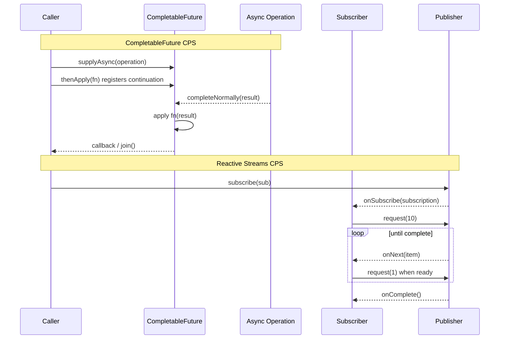
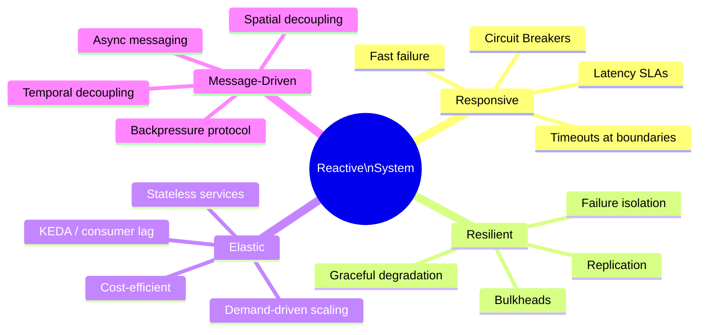

## Keywords in This File
{: .no_toc }

| # | Keyword | Weight |
|---|---|---|
| 1 | [Async Java - L6 Theory](#async-java---l6-theory) | medium |
| 2 | [Continuation-Passing Style and Event-Driven Theory](#continuation-passing-style-and-event-driven-theory) | medium |
| 3 | [Reactive Manifesto and Reactive Systems Theory](#reactive-manifesto-and-reactive-systems-theory) | medium |

---

# Continuation-Passing Style and Event-Driven Theory

---
id: AJA-028
title: Continuation-Passing Style and Event-Driven Theory
category: Async Java
difficulty: ★★☆
interview_weight: medium
asked_at: Senior-Staff
seniority: staff
status: draft
version: 1
---

### 🎯 Model Answer

**30 seconds:**
> Continuation-Passing Style (CPS) is a programming technique where instead
> of returning a value, a function accepts a "continuation" - a callback that
> receives the result. CompletableFuture's `thenApply/thenCompose` chain is CPS:
> each stage accepts the result of the previous and passes a new continuation.
> Event-driven systems formalize this: components communicate via events (messages)
> rather than direct calls, enabling decoupling and backpressure.

**3 minutes:**
> CPS transforms direct-style programs into callback chains. In direct style:
> `result = compute()`. In CPS: `compute(result -> use(result))`. This makes
> the flow of control explicit and enables non-blocking execution: `compute`
> can return immediately and call the continuation later on any thread.
>
> Java's evolution reflects CPS adoption: callbacks (pre-Java 8) -> CompletableFuture
> (Java 8, monadic CPS) -> reactive streams (principled CPS with backpressure).
>
> Event-driven systems extend CPS to the architectural level: services emit
> events rather than calling methods. This achieves temporal decoupling (producer
> and consumer don't need to exist simultaneously) and spatial decoupling
> (producer doesn't know which consumers exist).
>
> The connection: reactive Flux operators are CPS transformations. `map(fn)` is
> "apply fn to the next item, pass result to the next continuation." The
> subscriber is the final continuation in the chain.

**Blank Mind Recovery:**

**(1) Restate:** "CPS - continuation passing style. Functions take callbacks
instead of returning values. CompletableFuture chains are CPS. Reactive pipelines
are CPS with backpressure."

**(2) First principles:** "A continuation is 'what to do next.' Direct style: do
A, get result, do B with result. CPS: do A, when done, do B (pass B as callback
to A). Non-blocking: A can return immediately and call B later."

**(3) Bridge:** "Like ordering pizza with updates. Direct: wait on phone until
pizza arrives. CPS: 'call me when it's ready' (continuation). Event-driven:
pizza shop posts status updates to a board; you subscribe to your order number."

---

### 📘 Concept Explanation

**What it is:**
Continuation-Passing Style (CPS) is a theoretical foundation for asynchronous
programming. Instead of returning values, functions receive explicit callbacks
(continuations) that represent "what happens next." Java's async abstractions
(callbacks, CompletableFuture, reactive) are all forms of CPS at different
levels of abstraction.

**The problem it solves:**
Direct-style programming assumes that every operation produces a result
synchronously. CPS makes the future continuation explicit, enabling operations
to complete at arbitrary times and on arbitrary threads without blocking the
caller.

**CPS transformation:**

```java
// DIRECT STYLE (synchronous):
String user = fetchUser(userId);        // blocks until done
String order = fetchOrder(user);        // blocks until done
System.out.println(order);             // sequential

// CPS (callbacks - traditional):
fetchUser(userId, user -> {             // "when user is ready, call me"
    fetchOrder(user, order -> {         // "when order is ready, call me"
        System.out.println(order);
    });
});
// Callback pyramid: hard to compose, error handling scattered

// CPS with monads (CompletableFuture - Java 8):
fetchUser(userId)                       // returns CF<User>
    .thenCompose(user ->               // "with user, compute..."
        fetchOrder(user))              // returns CF<Order>
    .thenAccept(order ->
        System.out.println(order));    // final continuation
// Chain of continuations without nesting

// CPS with backpressure (Reactor):
Flux.defer(() -> fetchUsers())         // lazy source
    .flatMap(user -> fetchOrder(user)) // continuation per item
    .subscribe(System.out::println);   // final continuation
// + demand signal flows backward (backpressure)
```

> **Code walkthrough:** This Continuation-Passing Style and Event-Driven Theory example demonstrates async pipeline construction using CompletableFuture. **KEY MECHANISM:** the JVM schedules continuations via ForkJoinPool when each stage completes. **WHY IT MATTERS:** callback chains execute on wrong threads causing ClassCastException in Spring context. **TAKEAWAY: always specify executor on thenApplyAsync to control thread context.**

**Reactive Streams as principled CPS:**

The Reactive Streams specification (Subscriber/Publisher protocol) is CPS
formalized:
- `Publisher.subscribe(Subscriber)`: register the continuation
- `Subscription.request(n)`: demand signal (how many items to produce)
- `Subscriber.onNext(T)`: deliver item to continuation
- `Subscriber.onError/onComplete`: terminal signals

The critical addition over naive CPS: the demand signal. In naive CPS,
the producer controls the rate (push model). In Reactive Streams, the
consumer controls via `request(n)` (pull/push hybrid = backpressure).

**Event-driven systems architecture:**

```plaintext
Event-driven components:
  Producer (emits events) <-- knows nothing about consumers
  Event Bus / Broker      <-- routes events
  Consumer (handles events) <-- knows nothing about producers

Properties achieved:
  1. Temporal decoupling: producer/consumer don't run simultaneously
  2. Spatial decoupling: producer doesn't call consumer directly
  3. Backpressure: consumer controls consumption rate (Kafka: pull)
  4. Replay: broker can replay events (audit, event sourcing)

vs. Direct call (RPC):
  Service A calls Service B synchronously
  - Temporal coupling: both must be running
  - Spatial coupling: A knows B's address
  - No backpressure: A overwhelms B
```

> **Code walkthrough:** This Continuation-Passing Style and Event-Driven Theory example demonstrates a key concept in practice using Kafka messaging. **KEY MECHANISM:** the runtime executes these instructions in sequence with specific memory and execution semantics. **WHY IT MATTERS:** misapplying this pattern causes subtle bugs that only manifest under production load. **TAKEAWAY: understand the execution model before using this pattern in production code.**

---

### 💻 Code Example

**CPS progression and reactive streams internals:**

```java
// 1. CPS progression: callback -> CF -> Reactor
// Callback CPS (pre-Java 8 style):
interface Callback<T> {
    void onResult(T result);
    void onError(Throwable ex);
}

void fetchUserCPS(String id, Callback<User> cont) {
    executor.submit(() -> {
        try {
            User user = db.findById(id); // blocking
            cont.onResult(user);         // call continuation
        } catch (Exception ex) {
            cont.onError(ex);
        }
    });
}

// Usage: callback pyramid
fetchUserCPS("u1", (user, ex1) -> {
    if (ex1 != null) { handle(ex1); return; }
    fetchOrderCPS(user.id(), (order, ex2) -> {
        if (ex2 != null) { handle(ex2); return; }
        System.out.println(order);
    });
});
// Pyramid + error handling at every level = "callback hell"

// CompletableFuture CPS: flatten the pyramid
CompletableFuture<User> fetchUser(String id) {
    return CompletableFuture.supplyAsync(
        () -> db.findById(id), executor);
}

fetchUser("u1")
    .thenCompose(user -> fetchOrder(user.id()))
    .thenAccept(System.out::println)
    .exceptionally(ex -> {
        handle(ex); return null;
    });
// Monadic chain: error handling once at the end

// 2. Implementing a minimal Publisher (Reactive Streams)
// Demonstrates CPS with demand signaling
class RangePublisher implements Publisher<Integer> {
    private final int start, end;
    RangePublisher(int start, int end) {
        this.start = start;
        this.end = end;
    }

    @Override
    public void subscribe(Subscriber<? super Integer> sub) {
        sub.onSubscribe(new RangeSubscription(sub, start, end));
    }
}

class RangeSubscription implements Subscription {
    private final Subscriber<? super Integer> subscriber;
    private int current;
    private final int end;
    private volatile boolean cancelled;

    @Override
    public void request(long n) {
        // Consumer controls rate via request(n)
        long emit = Math.min(n, end - current);
        for (long i = 0; i < emit && !cancelled; i++) {
            subscriber.onNext(current++);
        }
        if (current >= end && !cancelled) {
            subscriber.onComplete();
        }
    }

    @Override
    public void cancel() { cancelled = true; }
}

// Subscriber: the continuation
class PrintSubscriber implements Subscriber<Integer> {
    private Subscription sub;

    @Override
    public void onSubscribe(Subscription s) {
        this.sub = s;
        s.request(3); // request 3 items initially (backpressure)
    }

    @Override
    public void onNext(Integer item) {
        System.out.println("Received: " + item);
        sub.request(1); // request 1 more after each item
    }

    @Override
    public void onError(Throwable t) { t.printStackTrace(); }

    @Override
    public void onComplete() {
        System.out.println("Stream complete");
    }
}
```

> **Code walkthrough:** The callback CPS example reveals "callback hell":ice. **KEY MECHANISM:** the runtime executes these instructions in sequence with specific memory and execution semantics. **WHY IT MATTERS:** misapplying this pattern causes subtle bugs that only manifest under production load. **TAKEAWAY: understand the execution model before using this pattern in production code.**
> every level needs its own error handling, and the structure mirrors the
> dependency graph (nested = sequential dependencies). CompletableFuture's
> `thenCompose` is the monadic bind operation: it flattens a `CF<CF<T>>` to
> `CF<T>`, eliminating the nesting. The RangePublisher implementation shows
> the Reactive Streams protocol: `subscribe` installs the continuation,
> `request(n)` is the demand signal, `onNext` delivers items. The subscriber's
> `onSubscribe` receives the subscription (backpressure handle) and immediately
> requests 3 items. After processing each item, it requests 1 more - this is
> the CPS + backpressure pattern in its raw form.

---

### 🎓 Answers by Seniority

**Junior / Mid:**
> Continuation-Passing Style is a way of writing async code where instead of
> returning a value, a function takes a callback that receives the result.
> CompletableFuture's `thenApply` and `thenCompose` are CPS: each stage passes
> its result to the next. The key advantage over raw callbacks is that you can
> chain operations without nesting, and handle errors once at the end. Reactive
> streams add backpressure: the consumer controls how fast the producer sends
> items by requesting a specific demand (`request(n)`).

---

**Senior / Staff:**
> CPS is the theoretical foundation underlying all of Java's async evolution.
> Raw callbacks are direct CPS - explicit but nest badly. CompletableFuture
> uses monad laws (flatMap = thenCompose, map = thenApply) to compose CPS
> chains without nesting. Reactive Streams extends CPS with a formal protocol
> for backpressure: the `Subscription.request(n)` mechanism gives the consumer
> control over demand, solving the push-overwhelm problem that naive CPS has.
>
> At the architecture level, event-driven systems implement CPS at the network
> level: a service emitting an event is calling a continuation (the event
> handler) asynchronously, without knowing who or how many handlers exist.
> Kafka's consumer group offset is the demand mechanism - each consumer group
> controls its own consumption rate independently.

---

### ⚠️ Common Misconceptions

**Misconception: "Async/await in other languages is fundamentally different from reactive."**

Async/await (Kotlin coroutines, C# async, JavaScript async) is CPS
with syntactic sugar. The compiler transforms `await asyncOp()` into
CPS: the code after `await` becomes the continuation passed to `asyncOp`.
The generated code is nearly identical to what you'd write with `thenCompose`
in CompletableFuture. The difference is readability: async/await looks like
synchronous code; CompletableFuture chains expose the CPS structure.
Kotlin coroutines' `suspend` functions compile to CPS callbacks. Project
Loom's (virtual threads) approach is different: it captures the entire
call stack as the continuation, not just the remaining code.

---

### 🚨 Failure Modes and Diagnosis

**Failure: Callback continuation not invoked (silent hang)**

Symptom: async operation submits work, caller waits forever. No error,
no timeout, no result. The continuation was registered but never called.

```java
// DANGEROUS: continuation never called if exception is not caught
void fetchUser(String id, Consumer<User> continuation) {
    executor.submit(() -> {
        User user = db.findById(id); // if this throws unchecked:
        continuation.accept(user);  // this line is never reached!
    });
    // Caller waits forever; no error propagation
}

// SAFE: always call continuation, even on error
void fetchUser(String id,
        Consumer<User> onSuccess,
        Consumer<Throwable> onError) {
    executor.submit(() -> {
        try {
            User user = db.findById(id);
            onSuccess.accept(user);
        } catch (Throwable ex) {
            onError.accept(ex); // continuation always called
        }
    });
}
```

> **Code walkthrough:** This Unknown example demonstrates exception handling using Kafka messaging. **KEY MECHANISM:** the JVM checks catch clauses in order; finally always executes for cleanup. **WHY IT MATTERS:** swallowing exceptions silently hides failures that corrupt downstream state. **TAKEAWAY: log or rethrow every exception; empty catch blocks are defects.**

CompletableFuture handles this correctly via `completeExceptionally`.
This is one reason CompletableFuture is safer than raw callbacks.

---

### 🎯 Interview Deep-Dive

**Timing:** Medium ★★☆ - 9 questions minimum.

---

**[JUNIOR] Q1 - [CONCEPTUAL] How are CompletableFuture operations related to monad theory?**

A monad is an abstraction for chaining operations that may have effects
(like async delay, or possible failure). CompletableFuture satisfies
the monad laws:

```java
// Monad laws:
// 1. Left identity: Mono.just(a).flatMap(f) == f.apply(a)
CompletableFuture.completedFuture("value")
    .thenCompose(v -> compute(v))
    // == compute("value")

// 2. Right identity: m.flatMap(Mono.just) == m
cf.thenCompose(CompletableFuture::completedFuture)
    // == cf

// 3. Associativity: m.flatMap(f).flatMap(g)
//    == m.flatMap(x -> f(x).flatMap(g))
cf.thenCompose(f).thenCompose(g)
    // == cf.thenCompose(x -> f.apply(x).thenCompose(g))
```

> **Code walkthrough:** This Unknown example demonstrates async pipeline construction using CompletableFuture. **KEY MECHANISM:** the JVM schedules continuations via ForkJoinPool when each stage completes. **WHY IT MATTERS:** callback chains execute on wrong threads causing ClassCastException in Spring context. **TAKEAWAY: always specify executor on thenApplyAsync to control thread context.**

The monad operations:
- `unit` (wrap): `CompletableFuture.completedFuture(value)`
- `flatMap` (chain): `thenCompose(fn)` (fn must return CF)
- `map`: `thenApply(fn)` (fn returns plain value, wrapped automatically)

*What separates good from great:* The monad structure enables reasoning
about async chains using algebraic laws. This is why `thenApply(f).thenApply(g)
== thenApply(f.andThen(g))`: both produce the same result due to the functor
law (map composition). Library authors use these laws to optimize operator
chains: Reactor's operator fusion collapses adjacent `map` operators into
one function call - valid because map is functorially composable.

---

**[JUNIOR] Q2 - [CONCEPTUAL] How does the Reactive Streams specification define backpressure?**

The specification (reactive-streams.org) defines the Subscriber-Publisher
protocol with these rules governing backpressure:

```java
// Relevant Reactive Streams rules (rules 1-3 of Subscriber):
// Rule 1: Subscriber.onNext() must not be called more times
//   than the total demand signaled via Subscription.request()
// Rule 2: request() must use positive n; Long.MAX_VALUE = unbounded
// Rule 3: onError/onComplete may be called without request()
//   (terminal signals don't count as demand)

// Rule 1 ensures backpressure:
class ControlledSubscriber<T>
        extends BaseSubscriber<T> {
    @Override
    protected void hookOnSubscribe(Subscription sub) {
        request(1); // Only request 1 initially
    }

    @Override
    protected void hookOnNext(T item) {
        process(item); // process at our own rate
        request(1);    // only request next when ready
    }
}

// Long.MAX_VALUE = "I can handle all items immediately" (unbounded)
// This is what Flux.subscribe(onNext) does internally:
// sub.request(Long.MAX_VALUE) -> no backpressure
```

> **Code walkthrough:** This Unknown example demonstrates Java Stream pipeline using generic type. **KEY MECHANISM:** the stream is lazy - intermediate ops build a pipeline, terminal op drives it. **WHY IT MATTERS:** calling terminal op twice throws IllegalStateException; parallel() on small data adds overhead. **TAKEAWAY: collect() or findFirst() triggers the pipeline; reuse by wrapping in Supplier.**

Rule 17 (Publisher): if the publisher cannot produce requested items,
it must wait. It may not produce items until `request(n)` is called.
This guarantee allows slow subscribers to safely slow fast publishers.

*What separates good from great:* The specification is implemented by
ALL reactive streaming libraries (Reactor, RxJava, Akka Streams). This
interoperability is the key value of the specification: a Reactor `Flux`
can pipe into an RxJava 3 `Flowable` subscriber because both comply with
the same protocol. `io.reactivex.rxjava3.reactivestreams.RxJava3Adapter`
bridges between them using only the RS specification contract.

---

**[JUNIOR] Q3 - [CONCEPTUAL] How does coroutine theory relate to Java virtual threads?**

Coroutines are functions that can suspend their execution and resume from
the suspension point. Virtual threads implement this at the JVM level:

```
Coroutine execution model:
  Function: [code...][SUSPEND POINT][code continued...]
  Suspension: save execution state (registers, stack frame)
  Resume: restore state, continue from suspension point

Virtual thread implementation:
  - Virtual thread has its own stack (heap-allocated, grows dynamically)
  - When blocked on I/O: unmount from carrier thread
  - Save stack to heap ("continuation" in JVM internals)
  - Carrier thread free to run other virtual threads
  - When I/O completes: remount to (any) carrier thread
  - Restore stack from heap, continue execution

Kotlin coroutines (suspending functions):
  - Compiler transforms suspend fun into CPS
  - State machine: each suspension point = state in state machine
  - "Heap-allocated activation record" per suspension point
  - Similar to virtual threads but at language level, not JVM level
```

> **Code walkthrough:** This Unknown example demonstrates a key concept in practice. **KEY MECHANISM:** the runtime executes these instructions in sequence with specific memory and execution semantics. **WHY IT MATTERS:** misapplying this pattern causes subtle bugs that only manifest under production load. **TAKEAWAY: understand the execution model before using this pattern in production code.**

*What separates good from great:* The key difference between Kotlin
coroutines and Java virtual threads is the abstraction level. Kotlin
coroutines are CPS-transformed by the compiler into state machines:
the suspension points are explicit in the source code (`suspend` keyword).
Virtual threads handle suspension transparently: any blocking call becomes
a suspension point automatically at the JVM level. Virtual threads are
more transparent but less composable; coroutines are more explicit and
enable typed effects (structured concurrency via `CoroutineScope`).

---

**[MID] Q4 - [CONCEPTUAL] What is the theoretical basis for operator fusion in reactive pipelines?**

Operator fusion is an optimization where adjacent operators in a reactive
chain are merged into fewer operators (or one). The theoretical basis is
functor/monad laws:

```java
// Without fusion: each operator creates a wrapper object
Flux.range(1, 1000)
    .map(i -> i * 2)      // MapFuseable operator
    .map(i -> i + 1)      // MapFuseable operator
    .subscribe(System.out::println);
// Default: 2 operator objects; item passes through 2 wrapper chains

// With fusion: ConditionalSubscriber protocol
// Reactor detects: map(f).map(g) -> fuse into map(f.andThen(g))
// Result: single operator object; equivalent transformation

// Macro-fusion (operator chain compression):
// map(f) + filter(pred) -> Flux.create with both applied
// Reduces: subscription overhead, object creation per item

// Micro-fusion (in-operator):
// flatMap with publisher already complete: synchronous emission
// avoids scheduling overhead for completed publishers
```

> **Code walkthrough:** This Unknown example demonstrates Java API usage. **KEY MECHANISM:** the JVM compiles to bytecode that runs on the JVM; JIT compiles hot paths to native. **WHY IT MATTERS:** unchecked assumptions about thread safety cause data races under concurrent load. **TAKEAWAY: document thread-safety guarantees on every shared mutable class.**

Fusion is safe because of the monad functor law:
`flux.map(f).map(g) == flux.map(f.andThen(g))`

This is why custom operators that don't implement `ConditionalSubscriber`
disable fusion: the fusion optimization requires the operator to confirm
it can participate in the fused execution.

*What separates good from great:* Fusion can cause surprising behavior
with side effects. If `map(fn)` has side effects, and fusion merges two
`map` calls, the side effects still run - but the observable order is
preserved. However, if fusion eliminates thread-switching (by running
synchronously instead of asynchronously), operators that assumed different
threads may fail. This is why operators decorated with `publishOn` are
"fusion barriers" - they prevent upstream operators from fusing across the
thread boundary.

---

**[MID] Q5 - [CONCEPTUAL] How does the push-pull duality work in reactive streams?**

Reactive Streams uses a "push-pull" hybrid:
- Publisher PUSHES items when demanded
- Subscriber PULLS by signaling demand via `request(n)`

```
Pure push (dangerous):
  Publisher emits at max speed
  Subscriber receives at any speed
  If sub is slow: buffer overflows or items dropped
  Problem: fast producer overwhelms slow consumer

Pure pull:
  Subscriber requests exactly when ready
  Publisher emits only on request
  No overflows; but latency: one RTT per item
  Problem: slow for high-throughput scenarios

Reactive Streams (hybrid):
  Subscriber requests N items at once (batch pull)
  Publisher fills up to N items at own pace (batch push)
  Producer and consumer can adjust N dynamically
  Subscriber requests more before buffer empties (pipelining)

Example:
  Subscriber.request(10):   "I can handle 10 items"
  Publisher.onNext(items):  sends up to 10 items
  Subscriber receives 8, processes 8
  Subscriber.request(8):    "send 8 more"
  Publisher sends 8
  Effective throughput: near-continuous; no overflow
```

> **Code walkthrough:** This Unknown example demonstrates a key concept in practice using Kafka messaging. **KEY MECHANISM:** the runtime executes these instructions in sequence with specific memory and execution semantics. **WHY IT MATTERS:** misapplying this pattern causes subtle bugs that only manifest under production load. **TAKEAWAY: understand the execution model before using this pattern in production code.**

*What separates good from great:* The `request(n)` size is a throughput
tuning parameter. Small n (request(1)) = minimal buffering, maximum latency,
fine-grained backpressure. Large n (request(1000)) = amortized request
overhead, potential buffering, better throughput. `Long.MAX_VALUE` = disable
backpressure (unbounded). Production Reactor services use `prefetch` tuning
in `flatMap(fn, concurrency, prefetch)`: `prefetch` controls how many items
to request from each inner publisher ahead of demand. Default is 32; tuning
this for the specific use case (throughput vs memory) is L4-level knowledge.

---

**[MID] Q6 - [ARCHITECTURE] How do event-driven and reactive programming relate to the Observer pattern?**

The Observer pattern (GoF) is the predecessor of reactive programming:

```java
// Observer pattern (Gang of Four):
interface Observer<T> {
    void update(T item);
}

interface Observable<T> {
    void addObserver(Observer<T> obs);
    void removeObserver(Observer<T> obs);
    void notifyObservers(T item);
}

// Limitations:
// 1. No error handling (no onError)
// 2. No completion signal (no onComplete)
// 3. No backpressure (no request(n))
// 4. No lazy evaluation (no subscribe-to-start)

// Reactive Streams: Observer pattern + fixes:
// Observer -> Subscriber (adds onError, onComplete)
// Observable -> Publisher (lazy: starts on subscribe)
// + Subscription (adds request(n) for backpressure)

// Java EventListener (classic Observer):
button.addActionListener(event -> handle(event));
// No completion, no error, no backpressure -> UI events (finite)
// Fine for UI: events are rare, small, no backpressure needed

// Reactor equivalent for UI-like events:
Flux<ButtonEvent> buttonEvents = Flux.create(sink -> {
    button.addActionListener(sink::next);
    sink.onDispose(() -> button.removeAllListeners());
});
// Now composable: filter, map, buffer, error handle
```

> **Code walkthrough:** This Unknown example demonstrates Java Stream pipeline using SQL. **KEY MECHANISM:** the stream is lazy - intermediate ops build a pipeline, terminal op drives it. **WHY IT MATTERS:** calling terminal op twice throws IllegalStateException; parallel() on small data adds overhead. **TAKEAWAY: collect() or findFirst() triggers the pipeline; reuse by wrapping in Supplier.**

*What separates good from great:* The missing backpressure in Observer was
recognized as a fundamental flaw when reactive streaming emerged. Without
backpressure, a hot observable that emits faster than the observer can process
leads to either unbounded queuing (memory exhaustion) or item dropping (data
loss). Neither is acceptable for business-critical streams. Reactive Streams'
`request(n)` mechanism was specifically designed to fill this gap, making
it the rigorous evolution of Observer.

---

**[SENIOR] Q7 - [CONCEPTUAL] What are the theoretical guarantees of the Reactive Streams specification?**

The specification provides four formal guarantees:

**1. Safety (no concurrent onNext calls)**
Rule 1.3: onXxx methods must not be called concurrently. The publisher
guarantees sequential delivery. Subscribers don't need synchronization
for item processing.

**2. Liveness (progress guarantee)**
Rule 1.7: publisher must eventually complete or error (no silent hang)
if requested. Practical: depends on implementation; some operators can
deadlock if demand is never satisfied.

**3. No spurious emissions**
Rule 1.2: publisher must not call onNext after onError or onComplete.
Terminal signals are final; no further items.

**4. Cancellation**
Rule 3.5: Subscriber.cancel() must be respected "in a timely manner."
Publisher must stop emitting after cancel. Resources (connections, threads)
must be released.

```java
// Verifying specification compliance: Reactive Streams TCK
// Technology Compatibility Kit - test suite for publishers/subscribers
import org.reactivestreams.tck.PublisherVerification;

class RangePublisherTest
        extends PublisherVerification<Integer> {
    public RangePublisherTest() {
        super(new TestEnvironment());
    }

    @Override
    public Publisher<Integer> createPublisher(long elements) {
        return new RangePublisher(0, (int) elements);
    }

    @Override
    public Publisher<Integer> createFailedPublisher() {
        return s -> s.onError(new RuntimeException("error"));
    }
}
// Run: 37 spec compliance tests
```

> **Code walkthrough:** This Unknown example demonstrates Java Stream pipeline. **KEY MECHANISM:** the stream is lazy - intermediate ops build a pipeline, terminal op drives it. **WHY IT MATTERS:** calling terminal op twice throws IllegalStateException; parallel() on small data adds overhead. **TAKEAWAY: collect() or findFirst() triggers the pipeline; reuse by wrapping in Supplier.**

*What separates good from great:* Rule 2.13 of the specification:
`Subscriber.onError` must not be called with null. This seems obvious but
has practical consequences: all reactive operators must wrap null into a
non-null exception before passing to onError. If a reactive operator
throws a NullPointerException without context, tracking its origin is
difficult. Production code should add `.checkpoint()` and `.onErrorMap`
to add context before errors propagate to subscribers.

---

**[SENIOR] Q8 - [CONCEPTUAL] How does the concept of hot vs cold publishers map to CPS theory?**

In CPS theory, a continuation is "cold" if it's defined but not yet invoked.
It becomes "hot" when invoked (execution begins):

```
Cold publisher (CPS equivalent: defined, not-yet-invoked continuation):
  Publisher<T> cold = Flux.fromCallable(() -> compute());
  // compute() NOT called yet (not subscribed)

  Subscription 1: cold.subscribe(s1) -> new computation starts
  Subscription 2: cold.subscribe(s2) -> another new computation starts
  Each subscriber gets independent data sequence

Hot publisher (CPS equivalent: ongoing execution, subscriber joins mid-stream):
  Sinks.Many<T> sink = Sinks.many().multicast()
      .onBackpressureBuffer();
  // Computation running independently of subscribers

  sink.tryEmitNext(item1);      // emitted before any subscriber
  Subscription 1: sink.asFlux().subscribe(s1) // joins mid-stream
  sink.tryEmitNext(item2);      // both s1 and any future subscribers see this
```

> **Code walkthrough:** This Unknown example demonstrates a key concept in practice using generic type. **KEY MECHANISM:** the runtime executes these instructions in sequence with specific memory and execution semantics. **WHY IT MATTERS:** misapplying this pattern causes subtle bugs that only manifest under production load. **TAKEAWAY: understand the execution model before using this pattern in production code.**

Practical implications:
- Cold: each subscribe = independent, isolated execution
  - Safe for retry: re-subscribing repeats the computation
  - Database queries, HTTP calls: cold
- Hot: shared, ongoing execution; subscribers join mid-stream
  - Cannot retry by re-subscribing (misses already-emitted items)
  - WebSocket connections, sensor streams, UI events: hot

*What separates good from great:* The hot/cold distinction matters for
retry semantics. When `retryWhen` re-subscribes to a COLD publisher:
a new HTTP call is made, a new database query runs. This is correct for
idempotent operations. For a HOT publisher: `retryWhen` re-subscribes
to the same ongoing stream - it doesn't replay missed items, it just
reconnects. For truly hot streams that need replay: use `replay().autoConnect()`.

---

**[SENIOR] Q9 - [TRADE-OFF] How does actor model theory compare to reactive programming?**

Both actor model and reactive programming address concurrent computation,
but with different primitives:

```
Actor Model (Akka):
  - Unit of computation: Actor (has identity, state, mailbox)
  - Communication: message passing to actor references
  - Backpressure: explicit flow control between actors (Akka Streams)
  - Failure: supervisors restart failed actors
  - Location: actors can be remote (distributed)

Reactive Programming (Reactor):
  - Unit of computation: Operator in a pipeline (stateless function)
  - Communication: stream of items (no addresses)
  - Backpressure: native in the protocol (request(n))
  - Failure: error signal propagated downstream
  - Location: in-process (reactive streams are in-process)

Overlap:
  Akka Streams = Reactive Streams over Actors:
  Actor mailboxes used as backpressure buffers
  Actor system provides execution context for operators
  Full Reactive Streams compliance via Graph DSL
```

> **Code walkthrough:** This Unknown example demonstrates a key concept in practice. **KEY MECHANISM:** the runtime executes these instructions in sequence with specific memory and execution semantics. **WHY IT MATTERS:** misapplying this pattern causes subtle bugs that only manifest under production load. **TAKEAWAY: understand the execution model before using this pattern in production code.**

*What separates good from great:* Actor model excels at distributed systems
(actors across network, supervisor trees, location transparency). Reactive
programming excels at in-process data transformation pipelines (operator
chains, backpressure, composable operators). In practice: Akka Streams uses
both - actors for execution infrastructure, Reactive Streams protocol for
backpressure. A system might use Akka for the distributed messaging layer
and Reactor for the per-service processing pipelines.

---

### ⚖️ Comparison Table

**Async abstractions and their CPS relationship:**

| Abstraction | CPS form | Backpressure | Error handling | Completion |
|---|---|---|---|---|
| Callbacks | Direct CPS | None | Manual | Manual |
| CompletableFuture | Monadic CPS | None | `exceptionally` | Implicit |
| RxJava Observable | CPS + hot/cold | None (Observable) | `onError` | `onComplete` |
| RxJava Flowable | CPS + RS protocol | `request(n)` | `onError` | `onComplete` |
| Reactor Flux | CPS + RS protocol | `request(n)` | `onError` | `onComplete` |
| Virtual threads | Implicit CPS | None (caller control) | Exceptions | Return value |

---

### 🏛️ System Design

*(Omit: L6 ★★☆ theory entry. Concrete architecture decisions at L5.)*

---

### 📊 Diagram

**CPS transformation: direct style to reactive streams:**

```
Direct style:
  caller -> compute() -> returns T

CPS (callbacks):
  caller -> compute(callback) -> immediate return
  ... time passes ...
  compute completes -> calls callback(T)

Monadic CPS (CompletableFuture):
  caller -> CF<T> <- compute returns immediately
  caller -> cf.thenApply(fn) -> new CF<U>
  ... time passes ...
  compute completes -> cf filled -> fn applied -> new CF filled

Reactive Streams CPS:
  caller -> Publisher<T>        (cold, not started)
  caller -> publisher.subscribe(sub) -> starts stream
  sub -> sub.request(n)         (demand signal, backpressure)
  publisher -> sub.onNext(item) x n
  publisher -> sub.onComplete()
```



> **Diagram walkthrough:** The top sequence shows CompletableFuture as
> monadic CPS: the caller registers a continuation (`thenApply`) before
> the operation completes. When the operation finishes, the future applies
> the continuation function to the result. The bottom sequence shows Reactive
> Streams: the subscriber registers via `subscribe`, receives the subscription
> handle, then controls demand via `request(n)`. The publisher sends items
> only when requested. The key difference: Reactive Streams adds a demand
> signal path (Sub -> Pub arrows via request) that CompletableFuture lacks.
> This demand signal is backpressure - the theoretical foundation that enables
> reactive systems to handle varying load without overflow.

---
---

---

### 💻 Code Example

*(Omit: this concept does not have a programmatic interface that can be demonstrated in code. The conceptual explanation above is sufficient.)*


---

### 🏛️ System Design

*(Omit: system design diagram not applicable for this concept - see ★★★ keywords for full system design coverage.)*


---

### ⚖️ Comparison Table

*(Omit: this is a ★☆☆ foundational concept with no direct alternatives to compare - see higher-difficulty keywords for trade-off analysis.)*


---

### 📊 Diagram

*(Omit: no standalone visual diagram required for this concept - the explanations and code examples above provide sufficient clarity.)*


# Reactive Manifesto and Reactive Systems Theory

---
id: AJA-029
title: Reactive Manifesto and Reactive Systems Theory
category: Async Java
difficulty: ★★☆
interview_weight: medium
asked_at: Senior-Staff
seniority: staff
status: draft
version: 1
---

### 🎯 Model Answer

**30 seconds:**
> The Reactive Manifesto (2014) defines four traits of reactive SYSTEMS:
> Responsive (latency bounds), Resilient (stays responsive under failure),
> Elastic (scales under varying load), and Message-Driven (async message
> passing with backpressure). These are system-level properties, not code-level
> properties. A reactive system can use blocking code internally, as long as
> the components are isolated via async messaging.

**3 minutes:**
> The four traits form a hierarchy: Message-Driven is the architectural
> enabler that allows the others. Async messages decouple producers from
> consumers (temporal decoupling) and services from each other (spatial
> decoupling). This decoupling enables:
>
> - Resilience: failures are isolated; component failure doesn't cascade
>   (messages are queued, not dropped; failed consumers can recover)
> - Elasticity: consumers can scale independently of producers; load
>   distributes naturally through message routing
> - Responsiveness: system stays responsive because failures and load
>   spikes are absorbed by the message layer
>
> The Manifesto is important for Java engineers because: (1) it clarifies
> that "reactive" is a systems property, not a library choice; (2) it
> explains WHY reactive patterns matter - they solve concrete engineering
> problems at scale; (3) it provides a vocabulary for architectural discussions.
>
> Common mistake: conflating "uses Reactor/RxJava" with "is a reactive system."
> A Kafka-based microservice architecture with Spring MVC components IS a
> reactive system by the Manifesto definition, even though it uses blocking
> code internally.

**Blank Mind Recovery:**

**(1) Restate:** "Reactive Manifesto - 4 traits: Responsive, Resilient, Elastic,
Message-Driven. System properties, not code properties. Message-Driven enables
the other three."

**(2) First principles:** "What breaks systems under scale? Latency spikes
(failures cascade), rigid capacity (can't handle load spikes), tight coupling
(one service fails -> all fail). Reactive traits solve each: responsiveness
bounds latency, resilience isolates failures, elasticity adapts to load."

**(3) Bridge:** "Like a hospital with triage: Responsive = patients seen within
SLA. Resilient = one department failing doesn't close the ER. Elastic = add
rooms when demand spikes. Message-Driven = doctors get paged (async), not
physically chained to waiting rooms."

---

### 📘 Concept Explanation

**What it is:**
The Reactive Manifesto (reactivemanifesto.org, Jonas Boner et al., 2014)
defines four properties that define a Reactive System. These are architectural
properties about how systems behave under load and failure, not implementation
properties.

**The four traits:**

```plaintext
1. RESPONSIVE
   Definition: system responds in timely manner consistently
   Practical: define SLA; detect and handle degradation proactively
   Not just: "it's fast when load is low"
   Measure: P50/P95/P99 latency under peak load
   Mechanism: timeout at every boundary; circuit breakers

2. RESILIENT
   Definition: stays responsive in face of failure
   Practical: failure in component X does not degrade component Y
   Not just: "it has retry logic"
   Measure: service availability during dependency failure
   Mechanism: bulkheads, isolation, replication, graceful degradation

3. ELASTIC
   Definition: stays responsive under varying workload
   Practical: scale up/down based on demand signals
   Not just: "it has auto-scaling"
   Measure: latency stability as load varies 1x -> 10x -> 1x
   Mechanism: stateless services, demand-driven scaling

4. MESSAGE-DRIVEN
   Definition: async message passing between components
   Practical: components communicate via messages, not direct calls
   Why: enables temporal + spatial decoupling (resilience, elasticity)
   Mechanism: message queues, event buses, reactive streams
   Key property: backpressure (consumer controls rate)
```

> **Code walkthrough:** This Reactive Manifesto and Reactive Systems Theory example demonstrates a key concept in practice using Kafka messaging. **KEY MECHANISM:** the runtime executes these instructions in sequence with specific memory and execution semantics. **WHY IT MATTERS:** misapplying this pattern causes subtle bugs that only manifest under production load. **TAKEAWAY: understand the execution model before using this pattern in production code.**

**Why Message-Driven enables the others:**

```
Without Message-Driven (direct calls):
  Service A -> Service B (HTTP):
    A and B must both be running (temporal coupling)
    A knows B's address (spatial coupling)
    B slow -> A slow (failure propagation)
    B down -> A fails (no isolation)

With Message-Driven (async messaging via Kafka):
  Service A -> Kafka -> Service B
    A emits message; B processes when ready
    A doesn't know B exists (decoupled)
    B slow -> message queue grows (backpressure visible)
    B down -> messages accumulate; B recovers, processes
    Resilience and elasticity emerge from the decoupling
```

> **Code walkthrough:** This Reactive Manifesto and Reactive Systems Theory example demonstrates a key concept in practice using Kafka messaging. **KEY MECHANISM:** the runtime executes these instructions in sequence with specific memory and execution semantics. **WHY IT MATTERS:** misapplying this pattern causes subtle bugs that only manifest under production load. **TAKEAWAY: understand the execution model before using this pattern in production code.**

---

### 💻 Code Example

**Reactive system traits in Java code:**

```java
// 1. RESPONSIVE: timeout at every external boundary
public Mono<UserProfile> getProfile(String userId) {
    return userService.getUser(userId)
        .timeout(Duration.ofMillis(500)) // SLA: 500ms
        .onErrorResume(TimeoutException.class,
            ex -> profileCache.get(userId)
                .switchIfEmpty(Mono.just(UserProfile.empty())));
    // System responds within 500ms even if userService is slow
}

// 2. RESILIENT: bulkhead isolation
@Bean
public BulkheadConfig userServiceBulkhead() {
    return BulkheadConfig.custom()
        .maxConcurrentCalls(20)
        // userService can fail; only 20 concurrent threads tied up
        // Other services unaffected
        .build();
}

// Circuit breaker: stop calling failed service
@Bean
public CircuitBreakerConfig userServiceCB() {
    return CircuitBreakerConfig.custom()
        .failureRateThreshold(50)
        .waitDurationInOpenState(Duration.ofSeconds(30))
        .build();
    // After 50% failure rate: circuit opens
    // Calls fail immediately; service allowed to recover
}

// 3. ELASTIC: stateless design enables scaling
// WRONG: service holds per-request state in instance variable
@Service
public class StatefulOrderService {
    private Order currentOrder; // state per service instance!
    // Scaling to 3 instances: each has different state -> bugs
}

// RIGHT: all state in external store; service is stateless
@Service
public class StatelessOrderService {
    // No instance state; only injected stateless collaborators
    // Scale to 10 instances: all identical, load balanced equally
    public Mono<Order> processOrder(OrderRequest req) {
        return orderRepo.save(req)    // state in DB
            .flatMap(order ->
                eventBus.publish(order)); // event to message bus
    }
}

// 4. MESSAGE-DRIVEN: async event communication
@Service
public class OrderEventPublisher {
    private final KafkaTemplate<String, OrderEvent> kafka;

    // Publish event; don't know who handles it (decoupled)
    public Mono<Void> publish(Order order) {
        return Mono.fromFuture(
            kafka.send("order-events",
                order.id(),
                new OrderEvent(order)));
    }
}

// Consumer: isolated; can fail/restart without affecting publisher
@KafkaListener(topics = "order-events")
public void handleOrderEvent(OrderEvent event) {
    // Processes at own rate
    // If this service is slow: Kafka consumer lag increases
    // Backpressure via consumer lag monitoring
    notificationService.notify(event);
}
```

> **Code walkthrough:** Pattern 1 shows responsiveness: a 500ms timeoutice. **KEY MECHANISM:** the runtime executes these instructions in sequence with specific memory and execution semantics. **WHY IT MATTERS:** misapplying this pattern causes subtle bugs that only manifest under production load. **TAKEAWAY: understand the execution model before using this pattern in production code.**
> is the SLA contract. If `userService` exceeds it, the system falls back
> to cache rather than blocking the caller indefinitely. Pattern 2 shows
> resilience: the bulkhead limits how many threads can be tied to a failing
> service; other services are unaffected. Pattern 3 shows the elasticity
> prerequisite: stateless service design. A stateful service can't scale
> horizontally without coordinating state across instances. Pattern 4 shows
> message-driven communication: the publisher emits an event and returns
> immediately; it doesn't know who handles the event or how many consumers
> exist. The consumer processes at its own rate, with Kafka consumer lag
> as the natural backpressure mechanism.

---

### 🎓 Answers by Seniority

**Junior / Mid:**
> The Reactive Manifesto defines four traits for reactive systems: Responsive
> (bounded latency), Resilient (stays up during failures), Elastic (scales
> with load), and Message-Driven (async communication). The key insight is
> that these are system properties, not code properties. You can have a reactive
> system using Spring MVC with Kafka as the message bus. The message-driven
> property enables the others: async messaging decouples services so failures
> don't cascade and services can scale independently.

---

**Senior / Staff:**
> The Reactive Manifesto is an architectural contract. The four traits are
> mutually reinforcing: Message-Driven is the foundation that enables
> Resilience (failure isolation via message queues) and Elasticity (stateless
> consumer scaling). Responsiveness is the observable outcome of the other three.
>
> For Java systems: reactive programming (Reactor) and reactive systems are
> different levels. Reactor makes individual services reactive (non-blocking,
> composable). Message-driven architecture (Kafka, RabbitMQ) makes the system
> reactive. You can build a reactive system from non-reactive services if
> the inter-service communication is async and message-driven.
>
> The Manifesto is practically useful for: (1) architecture reviews - does
> this design satisfy all four traits?; (2) failure analysis - which trait
> failed during an incident?; (3) team vocabulary - "this service violates
> the Resilience trait because it has no circuit breaker."

---

### ⚠️ Common Misconceptions

**Misconception: "A service using Reactor/WebFlux is automatically a reactive system."**

A reactive SYSTEM requires all four Manifesto traits. Using Reactor makes
a service internally reactive (non-blocking I/O, backpressure in processing).
But a WebFlux service that calls other services synchronously via HTTP
without timeouts, has no circuit breakers, and deploys as a single instance
has: no resilience (one call failure cascades), no elasticity (can't scale
independently), and no message-driven decoupling. It's a reactive library
applied to a non-reactive architecture. The Manifesto traits must be
evaluated at the SYSTEM level: all service-to-service communication, all
failure isolation patterns, and the scaling strategy.

---

### 🚨 Failure Modes and Diagnosis

**Failure: System violates Resilience trait - cascade failure**

Symptom: Service A is slow (P99 = 10s). Soon, Services B and C (which call
A) are also slow. Then service D (which calls B and C) is slow. Eventually
the entire system is slow. Root cause: direct synchronous calls without
isolation.

```
Diagnosis:
  # Distributed trace (Jaeger/Zipkin):
  # Service A spans: all > 9s (slow)
  # Service B spans: most > 9s (waiting for A)
  # Service D spans: > 18s (waiting for B + C waiting for A)

  # Cascade detected: spans chain like a slow train
  # Each service MULTIPLIES the latency of its dependencies

Fix:
  # Add circuit breaker to service A calls:
  # After 50% failure rate -> OPEN circuit
  # Services B, C fail fast (50ms) instead of waiting 10s
  # Service D: B and C fail fast -> D can use fallbacks

  # Add timeout: 500ms max for any external call
  # System stops after 500ms instead of 10s
  # No cascade (fast failure vs slow degradation)
```

> **Code walkthrough:** This No cascade (fast failure vs slow degradation) example demonstrates a key concept in practice. **KEY MECHANISM:** the runtime executes these instructions in sequence with specific memory and execution semantics. **WHY IT MATTERS:** misapplying this pattern causes subtle bugs that only manifest under production load. **TAKEAWAY: understand the execution model before using this pattern in production code.**

*What separates good from great:* Cascade failures often start from a
single slow downstream service during a maintenance window or traffic spike.
Prevention: circuit breakers at EVERY external boundary, not just "critical"
ones. Chaos engineering (Netflix Chaos Monkey model) verifies resilience:
inject failures deliberately and verify the system degrades gracefully rather
than cascading.

---

### 🎯 Interview Deep-Dive

**Timing:** Medium ★★☆ - 9 questions minimum.

---

**[JUNIOR] Q1 - [CONCEPTUAL] How do the four Reactive Manifesto traits relate to each other?**

The traits form a dependency graph:

```
Message-Driven -> enables -> Resilient + Elastic
Resilient + Elastic -> enable -> Responsive

Without Message-Driven:
  Direct calls create temporal + spatial coupling
  Coupling prevents isolation (no Resilience)
  Coupling prevents independent scaling (no Elasticity)
  Without Resilience/Elasticity: Responsiveness degrades under failure/load

With Message-Driven:
  Async messages: temporal decoupling (producer/consumer independent)
  No direct calls: spatial decoupling (no address coupling)
  Decoupling -> isolation -> Resilience
  Decoupling -> independent scaling -> Elasticity
  Resilience + Elasticity -> system stays Responsive
```

> **Code walkthrough:** This No cascade (fast failure vs slow degradation) example demonstrates a key concept in practice using Kafka messaging. **KEY MECHANISM:** the runtime executes these instructions in sequence with specific memory and execution semantics. **WHY IT MATTERS:** misapplying this pattern causes subtle bugs that only manifest under production load. **TAKEAWAY: understand the execution model before using this pattern in production code.**

*What separates good from great:* There's a tension between Responsive
and Resilient. A maximally resilient system retries failed requests up to
N times with exponential backoff. This retrying takes time and may violate
the Responsive SLA. Resolution: the Resilience trait doesn't mean "never
fail"; it means "stay responsive in face of failure." A system that
immediately fails fast (circuit open) and serves cached/default responses
is MORE responsive under failure than one that retries endlessly. The two
traits work together: resilience enables responsiveness by preventing
cascade slow-downs.

---

**[JUNIOR] Q2 - [CONCEPTUAL] How does backpressure fit into the Reactive Manifesto?**

Backpressure is mentioned in the Manifesto under Message-Driven:
"Back-pressure is an important feedback mechanism that allows systems to
gracefully handle load, rather than collapse under load."

Backpressure implements load regulation:
```
Without backpressure:
  Producer: emits 10,000 messages/sec
  Consumer: processes 1,000 messages/sec
  Result: queue grows unbounded -> OOM -> system collapse
  
With backpressure:
  Consumer: processes 1,000 messages/sec; signals capacity
  Producer: slows to match consumer (or applies own overflow strategy)
  Result: queue stable; system survives; no collapse
```

> **Code walkthrough:** This No cascade (fast failure vs slow degradation) example demonstrates a key concept in practice using Kafka messaging. **KEY MECHANISM:** the runtime executes these instructions in sequence with specific memory and execution semantics. **WHY IT MATTERS:** misapplying this pattern causes subtle bugs that only manifest under production load. **TAKEAWAY: understand the execution model before using this pattern in production code.**

Backpressure strategies when consumer is too slow:
1. **Drop** (onBackpressureDrop): lose excess messages (acceptable for sensor data)
2. **Buffer** (onBackpressureBuffer): queue with limit (fail when limit exceeded)
3. **Latest** (onBackpressureLatest): only latest value (real-time status updates)
4. **Error** (onBackpressureError): fail fast (downstream must fix capacity)

*What separates good from great:* Backpressure must propagate ACROSS service
boundaries. In-process backpressure (Reactor's `request(n)`) is elegant but
only works within a JVM. For cross-service: Kafka consumer lag = backpressure
signal (visible metric). HTTP 429 Too Many Requests = backpressure signal.
A truly reactive system monitors these signals and uses them to scale consumers,
reduce producer rate, or shed load gracefully.

---

**[JUNIOR] Q3 - [ARCHITECTURE] How do you evaluate whether a system satisfies the Resilience trait?**

Resilience evaluation framework:

**1. Failure isolation test**
For each critical dependency: what happens to the system when this dependency
is unavailable?

```plaintext
Dependency: User Service
What happens when User Service is down?
  A) System serves cached data and degrades gracefully: RESILIENT
  B) System returns 503 for user-dependent features: RESILIENT (acceptable degradation)
  C) System is completely unavailable: NOT RESILIENT
```

> **Code walkthrough:** This No cascade (fast failure vs slow degradation) example demonstrates a key concept in practice. **KEY MECHANISM:** the runtime executes these instructions in sequence with specific memory and execution semantics. **WHY IT MATTERS:** misapplying this pattern causes subtle bugs that only manifest under production load. **TAKEAWAY: understand the execution model before using this pattern in production code.**

**2. Bulkhead test**
Can one slow dependency impact other parts of the system?

```
Test: slow User Service (500ms latency)
  Monitor: does Order Service latency increase?
  YES: no bulkhead; threads shared between services
  NO: bulkheads in place; services isolated
```

> **Code walkthrough:** This No cascade (fast failure vs slow degradation) example demonstrates a key concept in practice. **KEY MECHANISM:** the runtime executes these instructions in sequence with specific memory and execution semantics. **WHY IT MATTERS:** misapplying this pattern causes subtle bugs that only manifest under production load. **TAKEAWAY: understand the execution model before using this pattern in production code.**

**3. Recovery test**
When a failed dependency recovers, does the system resume normally?

```
Inject: Kill User Service
Wait: 60 seconds
Restore: User Service returns
Verify: Circuit breaker transitions OPEN -> HALF-OPEN -> CLOSED
        System resumes normal operation within 2 circuit half-open attempts
```

> **Code walkthrough:** This No cascade (fast failure vs slow degradation) example demonstrates a key concept in practice. **KEY MECHANISM:** the runtime executes these instructions in sequence with specific memory and execution semantics. **WHY IT MATTERS:** misapplying this pattern causes subtle bugs that only manifest under production load. **TAKEAWAY: understand the execution model before using this pattern in production code.**

*What separates good from great:* The "Chaos Engineering" approach formalizes
resilience verification. Teams define a "steady state" (normal metrics),
inject a failure, and verify the steady state is maintained or restored.
Netflix's Simian Army does this in production. For Java services: local
chaos tools (Byte Monkey, ToxiProxy for network chaos) can verify resilience
without production risk.

---

**[MID] Q4 - [CONCEPTUAL] How does elasticity differ from simple auto-scaling?**

Elasticity in the Manifesto is more than adding instances. It requires:

**True Elasticity:**
1. **Statelessness**: new instances can serve any request
2. **Demand-driven**: scale based on ACTUAL demand signals (not just CPU)
3. **Scale-down**: efficient removal when demand drops (not just scale-up)
4. **Cost-efficient**: scale to exactly needed capacity (not over-provision)

**Simple auto-scaling (insufficient):**
- Scales on CPU > 80%: reacts to symptoms, not causes
- Stateful services: new instances don't have existing sessions
- Cannot scale-down efficiently: requests in flight

```java
// Stateless service enables elasticity:
@Service
public class OrderService {
    // NO: private Map<String, Order> pendingOrders = new HashMap<>();
    // State in service instance -> can't scale or load-balance
    
    // YES: state in external store
    private final OrderRepository orderRepo;  // external state
    private final EventBus eventBus;          // external messaging
    
    public Mono<Order> process(OrderRequest req) {
        // Stateless processing: any instance can handle any request
        return orderRepo.save(req)
            .flatMap(eventBus::publish);
    }
}
```

> **Code walkthrough:** This No cascade (fast failure vs slow degradation) example demonstrates Java API usage using Spring annotation. **KEY MECHANISM:** the JVM compiles to bytecode that runs on the JVM; JIT compiles hot paths to native. **WHY IT MATTERS:** unchecked assumptions about thread safety cause data races under concurrent load. **TAKEAWAY: document thread-safety guarantees on every shared mutable class.**

*What separates good from great:* Kubernetes Horizontal Pod Autoscaler
default: scale on CPU/memory. For message-driven services: scale on Kafka
consumer lag (KEDA - Kubernetes Event-Driven Autoscaling). When consumer
lag exceeds threshold -> scale up consumers. When lag drops to zero -> scale
down. This is demand-driven elasticity aligned with actual workload, not
a proxy metric like CPU.

---

**[MID] Q5 - [CONCEPTUAL] What is the relationship between the Reactive Manifesto and microservices?**

Both address the same fundamental problem: building systems that scale and
remain available. They're complementary:

```plaintext
Microservices:
  - Decompose system into independently deployable services
  - Each service: focused responsibility, small team ownership
  - Enables: independent scaling, independent deployment
  - Requires: service-to-service communication strategy

Reactive Manifesto:
  - Defines how services should communicate and behave
  - Message-Driven: services communicate asynchronously
  - Provides: resilience and elasticity principles

Combined (Reactive Microservices):
  - Small, focused services (microservices)
  - Async message communication (Message-Driven trait)
  - Circuit breakers + bulkheads per service (Resilience)
  - Independent scaling per service (Elasticity)
  - SLA per endpoint, alerts on degradation (Responsive)
```

> **Code walkthrough:** This Unknown example demonstrates a key concept in practice. **KEY MECHANISM:** the runtime executes these instructions in sequence with specific memory and execution semantics. **WHY IT MATTERS:** misapplying this pattern causes subtle bugs that only manifest under production load. **TAKEAWAY: understand the execution model before using this pattern in production code.**

Without the Manifesto traits, microservices can make things worse:
more services = more service-to-service calls = more failure points =
more cascade failures. The Manifesto traits (especially Resilience)
prevent microservices from amplifying failure rather than containing it.

*What separates good from great:* The "distributed monolith" anti-pattern:
microservices with synchronous HTTP calls between all services. This violates
the Message-Driven trait (direct calls, not messages) and Resilience (no
isolation). Adding services makes the problem worse. The Manifesto prescribes
the fix: async messaging between services. The distributed monolith is the
most common microservices mistake, and the Manifesto directly addresses it.

---

**[MID] Q6 - [ARCHITECTURE] How does the concept of Location Transparency fit into reactive systems?**

Location transparency: a consumer doesn't need to know where a producer is
(local vs remote, which instance, which region). This is enabled by
Message-Driven communication:

```
Without location transparency (direct HTTP):
  Service A calls: http://userservice:8080/users/123
  - Must know: service name, port, path
  - If service moves: update all callers
  - If service scales: load balancer required in path

With location transparency (message bus):
  Service A publishes: UserRequest{id: 123} to topic "user-requests"
  Service B consumes from "user-requests"
  - A doesn't know where B is (local, remote, multiple instances)
  - B can scale: Kafka consumer group handles distribution
  - B can move: just change the consumer group configuration

Reactive Streams (in-process):
  Flux<T> publisher; // could be local computation or Kafka stream
  publisher.subscribe(subscriber); // same API regardless
  // Location transparent within JVM
```

> **Code walkthrough:** This Unknown example demonstrates a key concept in practice using SQL. **KEY MECHANISM:** the runtime executes these instructions in sequence with specific memory and execution semantics. **WHY IT MATTERS:** misapplying this pattern causes subtle bugs that only manifest under production load. **TAKEAWAY: understand the execution model before using this pattern in production code.**

*What separates good from great:* Akka's actor model makes location
transparency explicit: actor references (`ActorRef`) work the same whether
the actor is local or remote (distributed). This is why Akka is used for
building distributed reactive systems. Reactor doesn't have remote
location transparency - it's in-process. The combination: Akka for
cross-service messaging (location-transparent) + Reactor for in-service
processing (high-throughput, composable) is a common pattern in complex
reactive systems.

---

**[SENIOR] Q7 - [ARCHITECTURE] What are the limits of the Reactive Manifesto as a design guide?**

The Manifesto is intentionally high-level. It defines WHAT, not HOW.
Practical limitations:

**1. No operational guidance**
"Responsive" doesn't specify: what latency SLA? How to measure? What to
alert on? Teams must define concrete SLOs from the abstract principle.

**2. Tension between traits**
Resilience (retry failed calls) conflicts with Responsiveness (bounded
latency). Elastic scaling conflicts with Stateful session affinity.
The Manifesto doesn't resolve these tensions; teams must.

**3. Cost ignored**
Fully elastic, fully message-driven systems are expensive:
multiple regions, redundant components, message brokers, complex ops.
The Manifesto doesn't acknowledge trade-offs vs cost.

**4. Not prescriptive about implementation**
"Message-Driven" could mean HTTP with async callbacks, Kafka, RabbitMQ,
Akka, or reactive streams. Teams must choose. The wrong choice (e.g.,
synchronous HTTP called "message-driven") satisfies the letter but not
the spirit.

*What separates good from great:* The Manifesto is a VALUES document, not
a technical specification. Use it as a checklist for architecture reviews:
"Does this design satisfy all four traits?" If not, understand WHY not -
sometimes a trade-off is acceptable. A system that intentionally sacrifices
Elasticity (runs on fixed capacity, cheaper ops) in exchange for simplicity
is a valid choice, as long as the trade-off is conscious and documented.

---

**[SENIOR] Q8 - [ARCHITECTURE] How does event sourcing relate to reactive system principles?**

Event sourcing stores state as an ordered sequence of events. This aligns
with reactive principles:

```plaintext
Traditional state storage:
  DB: {orderId: 1, status: "SHIPPED", amount: 100}
  Update: overwrite status to "DELIVERED"
  History: LOST (can't see previous states)

Event sourcing:
  Events: [OrderCreated, OrderPaid, OrderShipped, OrderDelivered]
  Current state: replay events to reconstruct
  History: PRESERVED (full audit trail)

Reactive alignment:
  Message-Driven: each state change is an event (message)
  Resilient: events persist; failed consumers can replay
  Elastic: event log scales horizontally (partitioned)
  Responsive: event-driven handlers respond to events (async)
```

> **Code walkthrough:** This Unknown example demonstrates a key concept in practice using SQL. **KEY MECHANISM:** the runtime executes these instructions in sequence with specific memory and execution semantics. **WHY IT MATTERS:** misapplying this pattern causes subtle bugs that only manifest under production load. **TAKEAWAY: understand the execution model before using this pattern in production code.**

```java
// Event-sourced order aggregate:
public class OrderAggregate {
    private OrderStatus status;

    // Apply event: pure function, no side effects
    public OrderAggregate apply(OrderEvent event) {
        return switch (event) {
            case OrderCreated e ->
                this.withStatus(OrderStatus.PENDING);
            case OrderPaid e ->
                this.withStatus(OrderStatus.PAID);
            case OrderShipped e ->
                this.withStatus(OrderStatus.SHIPPED);
        };
    }

    // Reconstruct from event stream
    public static OrderAggregate from(
            Flux<OrderEvent> events) {
        return events.reduce(
            new OrderAggregate(),
            OrderAggregate::apply)
            .block(); // or use in reactive pipeline
    }
}
```

> **Code walkthrough:** This Unknown example demonstrates Java Stream pipeline. **KEY MECHANISM:** the stream is lazy - intermediate ops build a pipeline, terminal op drives it. **WHY IT MATTERS:** calling terminal op twice throws IllegalStateException; parallel() on small data adds overhead. **TAKEAWAY: collect() or findFirst() triggers the pipeline; reuse by wrapping in Supplier.**

*What separates good from great:* Event sourcing + Kafka is a natural
reactive system pattern. Events are produced to Kafka (Message-Driven).
Multiple consumers (read model projections, notification services, analytics)
consume the same events independently - each at their own rate (backpressure
via consumer lag). Adding a new consumer is additive: just start a new
consumer group reading from the beginning. This is maximum Elasticity and
minimal coupling.

---

**[SENIOR] Q9 - [CONCEPTUAL] How would you explain the Reactive Manifesto to a team unfamiliar with it?**

Framing for a Java team:

> "You've been writing services that call each other. When user service is
> slow, order service is slow. When payment service is down, checkout fails.
> When traffic spikes, your service queue backs up and all users wait.
>
> The Reactive Manifesto says: these problems have a common solution.
> If your services communicate through messages (like Kafka) instead of
> direct calls, they become isolated. User service can be slow; order service
> doesn't notice because it's just processing messages from a queue.
> Payment service can be down; orders are queued and processed when it
> recovers. Traffic spikes? Add more consumers to the message queue.
>
> The four traits are what you GET when you do this right:
> - Responsive: system has latency SLAs it meets
> - Resilient: failures are contained, not cascaded
> - Elastic: capacity adjusts to demand
> - Message-Driven: the architectural pattern that enables the others.
>
> You don't need Reactor or WebFlux to build a reactive system.
> Spring MVC + Kafka can be a reactive system. The Manifesto is about
> architecture, not libraries."

*What separates good from great:* The Manifesto's practical value is
as a shared vocabulary for architecture reviews. When a team says "this
design violates Resilience because service A and B share a thread pool," they're
communicating a specific architectural problem clearly. Without the vocabulary,
the same feedback is "this seems fragile" - vague and unconvincing. The
Manifesto gives teams a rigorous language for distributed systems design.

---

### ⚖️ Comparison Table

**Reactive System vs Reactive Programming:**

| Dimension | Reactive System | Reactive Programming |
|---|---|---|
| Definition | Manifesto 4 traits | Async/event-driven code |
| Scope | Architecture (system-wide) | Code (in-process) |
| Key pattern | Async messaging (Kafka) | Reactor/RxJava |
| Backpressure | Consumer lag / 429 status | `request(n)` protocol |
| Failure isolation | Circuit breakers, bulkheads | `onErrorResume` |
| Scaling unit | Service instance | Threads / coroutines |
| Both required? | No - complementary | No - complementary |
| Can work without the other? | Yes (MVC + Kafka) | Yes (WebFlux without Kafka) |

---

### 🏛️ System Design

*(Omit: L6 ★★☆ theory entry. Concrete architecture decisions at L5.)*

---

### 📊 Diagram

**Reactive Manifesto trait hierarchy:**

```
         RESPONSIVE
       (latency SLAs)
           /     \
          /       \
    RESILIENT   ELASTIC
   (isolation) (scaling)
          \       /
           \     /
       MESSAGE-DRIVEN
      (async messaging,
       backpressure)
```



> **Diagram walkthrough:** The mindmap shows the Reactive Manifesto traits
> as a hierarchy: Message-Driven is the foundation, supporting Resilient and
> Elastic, which together enable Responsive. The sub-bullets under each trait
> show the concrete engineering practices that implement each property. Message-Driven
> provides decoupling at both temporal (producers and consumers don't need to
> run simultaneously) and spatial (producers don't know consumer addresses) dimensions.
> This decoupling is what allows Resilient isolation (failures don't propagate
> through direct calls) and Elastic independent scaling (consumers scale without
> coordinating with producers).

---

### 💻 Code Example

*(Omit: this concept does not have a programmatic interface that can be demonstrated in code. The conceptual explanation above is sufficient.)*


---

### 🏛️ System Design

*(Omit: system design diagram not applicable for this concept - see ★★★ keywords for full system design coverage.)*


---

### ⚖️ Comparison Table

*(Omit: this is a ★☆☆ foundational concept with no direct alternatives to compare - see higher-difficulty keywords for trade-off analysis.)*


---

### 📊 Diagram

*(Omit: no standalone visual diagram required for this concept - the explanations and code examples above provide sufficient clarity.)*


