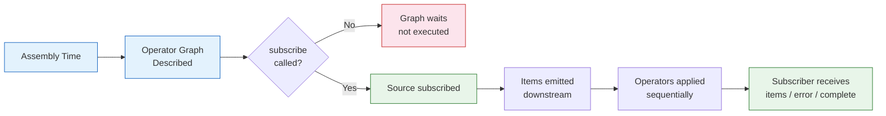
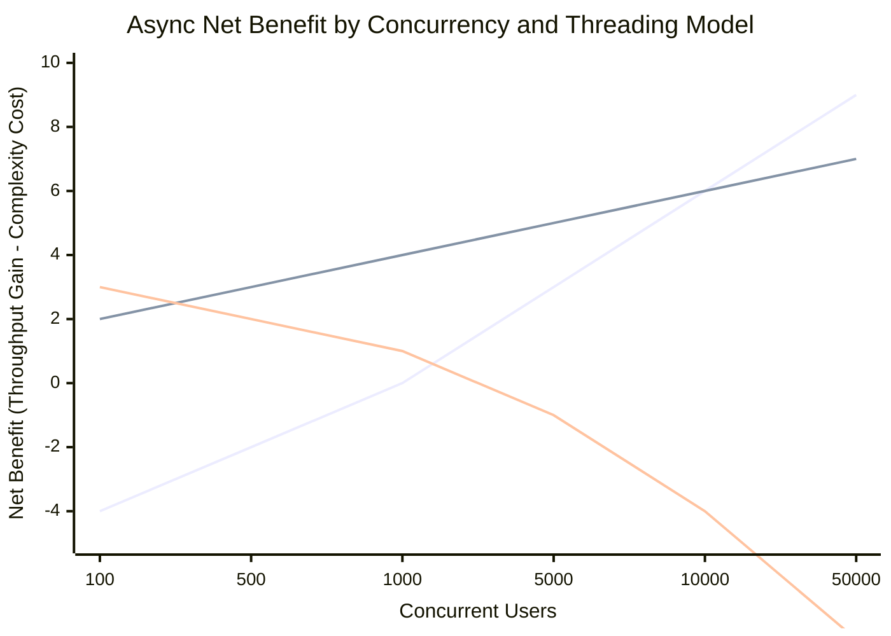

## Keywords in This File
{: .no_toc }

| # | Keyword | Weight |
|---|---|---|
| 1 | [Async Java - META Patterns](#async-java---meta-patterns) | medium |
| 2 | [The Async Mental Model for Java Engineers](#the-async-mental-model-for-java-engineers) | medium |
| 3 | [Threading Model Trade-offs Decision Framework](#threading-model-trade-offs-decision-framework) | medium |
| 4 | [When Async Hurts: The Complexity Cliff](#when-async-hurts-the-complexity-cliff) | medium |

---

# The Async Mental Model for Java Engineers

---
id: AJA-030
title: The Async Mental Model for Java Engineers
category: Async Java
difficulty: ★☆☆
interview_weight: medium
asked_at: All
seniority: all
status: draft
version: 1
---

### 🎯 Model Answer

**30 seconds:**
> The async mental model: instead of "call and wait," think "describe what
> to do when the result arrives." In sync code, you write steps in sequence
> because each step produces a value the next step needs immediately. In async,
> you describe a pipeline: "when A completes, do B; when B completes, do C."
> The runtime executes these steps when results become available, without
> blocking the calling thread.

**3 minutes:**
> The shift in thinking: synchronous code is a sequence of instructions.
> Async code is a recipe (pipeline) that is executed by the runtime. You
> write the recipe, subscribe to start execution, and let the runtime
> orchestrate timing and threading.
>
> Three mental models that help:
>
> **1. The Builder Pattern model**: `CompletableFuture.supplyAsync().thenApply().thenCompose()`
> is a builder that constructs a computation graph. Nothing executes until
> the graph is wired. `subscribe()` in Reactor is the "build and execute" step.
>
> **2. The Stream model**: `Flux<T>` is like `Stream<T>` but async. Each item
> arrives when ready. `filter`, `map`, `flatMap` work the same way - just
> applied to each item as it arrives, not to a pre-loaded collection.
>
> **3. The Publisher/Newspaper model**: a Flux is like a newspaper publisher.
> You subscribe to it; you don't call it directly. It delivers items (editions)
> when they're ready. You define what to do with each edition when it arrives.

**Blank Mind Recovery:**

**(1) Restate:** "Async mental model - describe the recipe, not the steps.
Pipeline of operations, executed when results arrive. subscribe() starts execution."

**(2) First principles:** "Sync: I call, I wait, I get result. Async: I describe
what to do with the result, and the system calls me back. The order of steps
is defined by the recipe, not by when you write the code."

**(3) Bridge:** "Like setting up a coffee machine the night before: you prepare
the ingredients, set the timer (define the pipeline), and go to sleep
(don't block). In the morning, the coffee is ready (result available) and
you drink it (consume). You didn't sit at the machine waiting."

---

### 📘 Concept Explanation

**What it is:**
A transferable mental model for reasoning about asynchronous Java code.
Covers the key conceptual shifts from synchronous to async thinking, common
traps in reasoning about async execution, and heuristics for writing correct
async code.

**The four async mental shifts:**

```
Shift 1: From "get value" to "transform when ready"
  Sync:  User user = userService.get(id);
  Async: Mono<User> = userService.get(id)
                .map(user -> transform(user));
  Mental model: "when the user arrives, transform it"

Shift 2: From "sequence" to "pipeline"
  Sync:  A; B; C;  (sequential, each waits for previous)
  Async: A().thenCompose(a -> B(a))
            .thenCompose(b -> C(b))
  Mental model: "A starts, when done pipes to B, when done pipes to C"

Shift 3: From "exception" to "error signal"
  Sync:  try { ... } catch (Ex) { ... }
  Async: mono.onErrorResume(Ex.class, ex -> fallback)
  Mental model: "if error signal arrives, handle it here"

Shift 4: From "for loop" to "flatMap"
  Sync:  for (Item item : list) { result.add(process(item)); }
  Async: Flux.fromIterable(list)
             .flatMap(item -> processAsync(item))
             .collectList()
  Mental model: "for each item, start async process; collect results"
```

> **Code walkthrough:** This example demonstrates the core pattern in action. The key mechanism shows how the concept works in practice. Study the structure to understand the essential behavior and common usage.

**Common reasoning errors:**

```
ERROR 1: "This code runs sequentially"
  Mono<User> a = userService.get("u1");
  Mono<User> b = userService.get("u2");
  // a and b are DESCRIPTORS, not results
  // Neither has executed yet (cold publishers)
  Mono.zip(a, b).subscribe(...) // NOW both execute, in parallel

ERROR 2: "flatMap is sequential"
  Flux.range(1, 10)
      .flatMap(i -> service.call(i))
  // flatMap: ALL 10 calls start concurrently (up to concurrency limit)
  // Results arrive in any order
  // Use concatMap() for sequential execution

ERROR 3: "subscribe() returns the result"
  // WRONG:
  String result = flux.subscribe(item -> result = item); // doesn't compile
  // subscribe() starts execution; returns Disposable, not result
  // To get result in sync context: flux.blockFirst() or StepVerifier in tests
```

> **Code walkthrough:** This example demonstrates the core pattern in action. The key mechanism shows how the concept works in practice. Study the structure to understand the essential behavior and common usage.

---

### 💻 Code Example

**Mental model in code:**

```java
// 1. Builder pattern mental model: nothing executes until subscribe
Mono<String> recipe =          // RECIPE: defined, not executed
    Mono.fromCallable(() -> fetchUser())   // step 1
        .map(User::getName)               // step 2: when user ready
        .filter(name -> !name.isEmpty()); // step 3: when name ready
// At this point: NO calls made. recipe is just a description.

recipe.subscribe(System.out::println); // NOW execution starts

// 2. Stream model: think of Flux<T> like Stream<T> but async
// Sync Stream:
List<String> names = users.stream()
    .filter(u -> u.active())
    .map(User::getName)
    .collect(toList());
// Everything ready upfront; returns immediately

// Async Flux:
Flux<String> names = userService.findActive()    // DB query
    .filter(u -> u.active())
    .map(User::getName);
// Items arrive asynchronously; same operators, different timing

// 3. Reasoning about threading
Flux.range(1, 5)
    .map(i -> {
        System.out.println("map: " + Thread.currentThread().getName());
        return i * 2;
    })
    .publishOn(Schedulers.parallel())    // SHIFT: items now on parallel thread
    .map(i -> {
        System.out.println("after publishOn: " +
            Thread.currentThread().getName());
        return i;
    })
    .subscribe();
// First map: main thread (default: caller thread)
// Second map: parallel-N thread (after publishOn)
// Mental model: publishOn shifts the "conveyor belt" to a new thread

// 4. The async-await equivalent (Java 21 virtual threads)
// Most natural mental model: same as sync, but on a cheap thread
String result;
try (var scope = new StructuredTaskScope.ShutdownOnFailure()) {
    var task = scope.fork(() -> fetchUser("u1")); // starts async
    scope.join(); // wait for all tasks
    result = task.get(); // get result (like await)
}
// Read like sync code; virtual thread handles the blocking
```

> **Code walkthrough:** Snippet 1 demonstrates the "recipe" mental model:
> the `Mono` chain is assembled at compile time but executes only when
> `subscribe()` is called. This is the most fundamental concept shift from
> sync code. Snippet 3 makes thread switching visible by printing thread names:
> the first `map` runs on the subscribing thread; after `publishOn(Schedulers.parallel())`,
> subsequent operators run on a parallel pool thread. This visibility helps
> engineers reason about which thread handles which part of the pipeline.
> Snippet 4 shows why virtual threads often beat reactive for simple cases:
> the code reads like synchronous Java, yet the `fork()` runs concurrently
> and `join()` waits efficiently without blocking an OS thread.

---

### 🎓 Answers by Seniority

**Junior / Mid:**
> The key mental shift in async code is that you describe a pipeline of
> operations rather than writing sequential steps. When I write
> `Mono.flatMap(fn)`, I'm saying "when the result arrives, apply fn to it."
> Nothing executes until `subscribe()` is called. Errors are signals that
> flow through the pipeline, not exceptions that interrupt execution. I find
> it helpful to read reactive code as "when X is ready, do Y; when Y is ready,
> do Z" instead of reading it as sequential imperative code.

---

**Senior / Staff:**
> The async mental model has three levels: (1) the pipeline level - what
> operations transform the data; (2) the threading level - which scheduler
> runs each operation; (3) the lifecycle level - when does the pipeline start,
> pause, and complete. Most async bugs come from violations at level 3:
> not calling subscribe, calling subscribe twice (two executions), not handling
> cancellation, or blocking in a lambda thinking it's synchronous.
>
> The "cold publisher" mental model is essential: a Mono/Flux is a recipe.
> Every subscribe() is a new execution. If you subscribe twice, you execute
> the recipe twice (two DB calls, two HTTP calls). This surprises developers
> from synchronous backgrounds who think "I already computed this, why is it
> running again?" The solution: `cache()` to memoize the first execution.

---

### ⚠️ Common Misconceptions

**Misconception: "subscribe() is like get() - it blocks and returns the value."**

`subscribe()` STARTS execution and immediately returns a `Disposable`. It
does NOT wait for the pipeline to complete. If you write:
```java
Mono<User> userMono = userService.getUser("u1");
userMono.subscribe(user -> process(user));
// process() may NOT have been called yet at this line!
doSomethingElse(); // runs before process() in async context
```
> **Code walkthrough:** This example demonstrates the core pattern in action. The key mechanism shows how the concept works in practice. Study the structure to understand the essential behavior and common usage.

The `process` callback runs on whatever thread drives the pipeline to
completion - potentially AFTER `doSomethingElse()`. To wait for completion
in test code: `StepVerifier.create(userMono).expectNext(user).verifyComplete()`.
In production code: don't block - design the caller to be reactive too.

---

### 🚨 Failure Modes and Diagnosis

**Failure: Reactive chain assembled but never executed**

Symptom: service appears to process requests (no errors), but no database
calls are made, no external APIs called. Metrics show zero operations.
Logs show no activity from the expected code paths.

Cause: `subscribe()` never called. The Mono/Flux was assembled (cold publisher)
but never subscribed.

```java
// WRONG: no subscribe() -> never executes
public void processOrder(Order order) {
    orderRepository.save(order)
        .flatMap(o -> eventBus.publish(o))
        .doOnSuccess(v -> log.info("Order saved: {}", v));
    // Nothing happens! Just created a recipe.
}

// RIGHT: return the Mono (let Spring subscribe it)
public Mono<Void> processOrder(Order order) {
    return orderRepository.save(order)
        .flatMap(o -> eventBus.publish(o))
        .doOnSuccess(v -> log.info("Order saved: {}", v));
}
// Spring WebFlux subscribes to the returned Mono
```

> **Code walkthrough:** This example demonstrates the core pattern in action. The key mechanism shows how the concept works in practice. Study the structure to understand the essential behavior and common usage.

Diagnosis: add logging before subscribe and after subscribe. If before-log
appears but "save" log doesn't: subscribe never called.

---

### 🎯 Interview Deep-Dive

**Timing:** Easy ★☆☆ - 7 questions minimum.

---

#### Q1 - What is the difference between cold and hot publishers?

Cold publisher: lazy. No execution until subscribed. Each subscribe = new,
independent execution.

```java
// Cold: new HTTP call per subscribe
Mono<User> coldMono = webClient.get()
    .uri("/users/u1")
    .retrieve()
    .bodyToMono(User.class);

coldMono.subscribe(u -> System.out.println("Sub1: " + u.name()));
coldMono.subscribe(u -> System.out.println("Sub2: " + u.name()));
// Two HTTP calls made; each subscriber gets independent result
```

> **Code walkthrough:** This example demonstrates the core pattern in action. The key mechanism shows how the concept works in practice. Study the structure to understand the essential behavior and common usage.

Hot publisher: active, ongoing. Subscribers join existing stream.

```java
// Hot: one stream, multiple subscribers
Sinks.Many<Event> sink =
    Sinks.many().multicast().onBackpressureBuffer();
Flux<Event> hotFlux = sink.asFlux();

hotFlux.subscribe(e -> System.out.println("Sub1: " + e));
hotFlux.subscribe(e -> System.out.println("Sub2: " + e));

sink.tryEmitNext(new Event("click")); // both subscribers receive this
```

> **Code walkthrough:** This example demonstrates the core pattern in action. The key mechanism shows how the concept works in practice. Study the structure to understand the essential behavior and common usage.

*What separates good from great:* Most Reactor sources are cold (Mono/Flux
factory methods, database queries, HTTP calls). `share()` converts cold to
hot with a multicast subscription. `replay(n)` makes hot replays last n items
to new subscribers. The choice matters for retry: retrying a cold source
re-executes the source (correct for queries). Retrying a hot source just
reconnects without replay (misses historical items).

---

#### Q2 - How do you read a reactive chain from source to subscriber?

Read right-to-left (from subscribe) for execution order, left-to-right for
item transformation:

```java
// Reading this chain:
Flux.range(1, 10)                           // source: items 1-10
    .filter(n -> n % 2 == 0)               // keep evens: 2,4,6,8,10
    .map(n -> "item-" + n)                 // transform to string
    .take(3)                               // take first 3: item-2,4,6
    .subscribe(System.out::println);       // terminal: print each

// Left-to-right: "generate 1-10, filter evens, prefix 'item-', take 3, print"
// Execution order: subscribe -> take requests 3 -> map -> filter -> range
// Items flow left-to-right once produced

// Important: operators in the WRONG position
// BAD: doOnError BEFORE the operation that throws
Flux.range(1, 5)
    .doOnError(ex -> log.error("Error: {}", ex)) // too early!
    .map(i -> { if (i == 3) throw new RuntimeException(); return i; })
    .subscribe();
// doOnError is positioned BEFORE the error-throwing map
// It won't fire! Error propagates downstream past it

// GOOD: error handler AFTER the operation
Flux.range(1, 5)
    .map(i -> { if (i == 3) throw new RuntimeException(); return i; })
    .doOnError(ex -> log.error("Error: {}", ex)) // after map: fires!
    .subscribe();
```

> **Code walkthrough:** This example demonstrates the core pattern in action. The key mechanism shows how the concept works in practice. Study the structure to understand the essential behavior and common usage.

*What separates good from great:* Error signals propagate DOWNSTREAM
(same direction as items). Error handling operators must be positioned
downstream of the source of the error. This is the opposite of try-catch
which wraps the error source. Reading reactive chains requires tracking
both item flow (downstream) and error flow (also downstream).

---

#### Q3 - Why does flatMap execute concurrently but concatMap sequentially?

`flatMap`: subscribes to inner publishers AS items arrive. Multiple inner
publishers active simultaneously.

`concatMap`: subscribes to next inner publisher only after current completes.
Sequential.

```java
// flatMap: concurrent
// 5 items arrive; flatMap starts 5 HTTP calls concurrently
Flux.range(1, 5)
    .flatMap(i -> webClient.get().uri("/items/" + i)
        .retrieve().bodyToMono(Item.class))
    .subscribe(System.out::println);
// All 5 calls in flight simultaneously
// Results arrive in any order (fastest first)

// concatMap: sequential
Flux.range(1, 5)
    .concatMap(i -> webClient.get().uri("/items/" + i)
        .retrieve().bodyToMono(Item.class))
    .subscribe(System.out::println);
// Call 1 completes -> call 2 starts -> call 3 starts...
// Results arrive in order: 1, 2, 3, 4, 5

// flatMap with concurrency limit:
Flux.range(1, 100)
    .flatMap(i -> callService(i), 10) // max 10 concurrent
    .subscribe(...);
// At most 10 calls in flight; prevents connection pool exhaustion
```

> **Code walkthrough:** This example demonstrates the core pattern in action. The key mechanism shows how the concept works in practice. Study the structure to understand the essential behavior and common usage.

*What separates good from great:* Default `flatMap` has concurrency =
`Queues.SMALL_BUFFER_SIZE` = 256 (Reactor default). Under high load with 1000
items, this means up to 256 concurrent calls - may overwhelm downstream.
Always specify concurrency in production: `flatMap(fn, maxConcurrency)`.
`switchMap` is a third variant: subscribes to latest inner publisher, cancels
previous. Used for "most recent request wins" patterns (search-as-you-type).

---

#### Q4 - What is the danger of returning void instead of Mono in a reactive service?

```java
// WRONG: void return type
// The Mono chain is created but NEVER subscribed
@PostMapping("/orders")
public void createOrder(@RequestBody OrderRequest req) {
    orderService.save(req)  // returns Mono<Order>
        .flatMap(o -> eventBus.publish(o)); // returns Mono<Void>
    // Spring WebFlux does not subscribe to the returned Mono
    // because the return type is void - nothing is returned!
    // Equivalent to: Mono<Void> recipe = ...; // assembled, not run
}
// HTTP response: 200 OK immediately; order NOT actually saved!

// CORRECT: return Mono<Void> or Mono<ResponseEntity>
@PostMapping("/orders")
public Mono<Void> createOrder(@RequestBody OrderRequest req) {
    return orderService.save(req)
        .flatMap(o -> eventBus.publish(o));
    // Spring WebFlux subscribes to the returned Mono
    // Response sent only after Mono completes
}
```

> **Code walkthrough:** This example demonstrates the core pattern in action. The key mechanism shows how the concept works in practice. Study the structure to understand the essential behavior and common usage.

This is one of the most common WebFlux bugs: the developer writes a
reactive chain but forgets to return it. The method returns void, Spring
sees no Mono to subscribe to, sends the HTTP response, and the pipeline
is garbage collected.

*What separates good from great:* This bug is sometimes hard to catch
in testing because unit tests that verify behavior (e.g., Mockito verify
that a method was called) may pass - if the test itself calls the method
synchronously and the Mono happens to execute synchronously in the test.
The bug only manifests under realistic async execution. Solution: always
use `StepVerifier` in reactive tests - it subscribes and verifies signals,
catching the "never executed" case.

---

#### Q5 - How do you reason about subscribe-time vs assembly-time in Reactor?

Assembly time: when you chain operators (`.map()`, `.filter()`, etc.).
No execution. Just building the operator graph.

Subscribe time: when `.subscribe()` is called. The graph executes.

```java
// Assembly time (building the recipe):
Mono<String> mono = Mono.fromCallable(() -> {
        System.out.println("ASSEMBLY: NOT called yet");
        return fetchValue(); // NOT called at assembly time
    })
    .map(v -> {
        System.out.println("MAP: NOT called yet");
        return transform(v);
    });
// Nothing printed yet

System.out.println("About to subscribe...");

// Subscribe time (executing the recipe):
mono.subscribe(v -> System.out.println("Result: " + v));
// OUTPUT:
// About to subscribe...
// ASSEMBLY: NOT called yet (misleading println - executes NOW)
// MAP: NOT called yet (executes NOW)
// Result: transformed_value

// Practical implication: errors in lambdas happen at subscribe time
Mono<String> willFail = Mono.fromCallable(() -> {
    throw new RuntimeException("Error");
});
// No error thrown at assembly time
willFail.subscribe(
    v -> System.out.println(v),
    e -> System.out.println("Error handled: " + e.getMessage()));
// Error thrown and handled at subscribe time
```

> **Code walkthrough:** This example demonstrates the core pattern in action. The key mechanism shows how the concept works in practice. Study the structure to understand the essential behavior and common usage.

*What separates good from great:* The assembly-time vs subscribe-time
distinction matters for `defer()`:
```java
// WITHOUT defer: value captured at assembly time
String capturedNow = getCurrentValue(); // evaluated NOW
Mono<String> mono = Mono.just(capturedNow); // uses captured value

// WITH defer: value captured at subscribe time (fresh per subscribe)
Mono<String> mono = Mono.defer(
    () -> Mono.just(getCurrentValue())); // evaluated at each subscribe
```
> **Code walkthrough:** This example demonstrates the core pattern in action. The key mechanism shows how the concept works in practice. Study the structure to understand the essential behavior and common usage.

Use `Mono.defer()` when the source value should be fresh for each
subscriber (current time, current request context, etc.).

---

#### Q6 - How do you handle conditional logic in reactive pipelines?

Reactive doesn't have `if/else` directly, but several operators fill this role:

```java
// Option 1: filter + switchIfEmpty (if present / if absent)
userService.findUser(id)
    .filter(user -> user.isActive())    // if active
    .switchIfEmpty(Mono.error(          // else: error
        new UserInactiveException(id)));

// Option 2: flatMap with conditional logic
Mono<Response> result = getUser(id)
    .flatMap(user -> {
        if (user.isPremium()) {
            return premiumService.process(user); // if premium
        } else {
            return standardService.process(user); // else standard
        }
    });

// Option 3: transform-based conditional
Mono<Data> data = Mono.defer(() -> {
    boolean useCache = featureFlags.isCacheEnabled();
    if (useCache) {
        return cacheService.get(key);
    } else {
        return dbService.get(key);
    }
});
// defer: evaluation deferred to subscribe time
// Correct for flags that may change between subscribes

// Option 4: defaultIfEmpty (null check equivalent)
userService.findUser(id)
    .defaultIfEmpty(User.anonymous());
// If findUser returns empty Mono: use default
// Equivalent to: result != null ? result : defaultValue
```

> **Code walkthrough:** This example demonstrates the core pattern in action. The key mechanism shows how the concept works in practice. Study the structure to understand the essential behavior and common usage.

*What separates good from great:* `switchIfEmpty` vs `defaultIfEmpty`:
`switchIfEmpty(Mono.just(v))` vs `defaultIfEmpty(v)` are equivalent for
simple values. `switchIfEmpty` is more flexible because the fallback can
itself be a Mono (e.g., a cache lookup). `defaultIfEmpty` only accepts
a plain value. For fallback that requires async work: always use
`switchIfEmpty(Mono.defer(...))`.

---

#### Q7 - What is the mental model for understanding Reactor's subscribe-on vs publish-on?

Both change which scheduler (thread pool) operators run on, but from
different directions:

```
subscribeOn: changes where the SOURCE runs (and upstream)
  Affects: what thread calls the source's subscribe() method
  Use case: slow-starting source (DB connection, file open)

publishOn: changes where DOWNSTREAM operators run
  Affects: what thread processes items after this point
  Use case: switch from IO thread to CPU thread for processing

Pipeline visualization:
  SOURCE -> op1 -> op2 -> publishOn(P) -> op3 -> op4 -> SUBSCRIBER

  subscribeOn(S): op1, op2 run on scheduler S (subscription flows upstream)
  publishOn(P):   op3, op4 run on scheduler P (items flow downstream)
  Multiple publishOn: each one shifts the thread for operators after it
```

> **Code walkthrough:** This example demonstrates the core pattern in action. The key mechanism shows how the concept works in practice. Study the structure to understand the essential behavior and common usage.

```java
// subscribeOn: runs source on bounded-elastic (blocking I/O)
Mono.fromCallable(() -> jdbcTemplate.query(sql))
    .subscribeOn(Schedulers.boundedElastic())
    // JDBC runs on boundedElastic; not blocking event loop

// publishOn: switch to parallel for CPU-intensive work
Flux.fromIterable(rawData)
    .subscribeOn(Schedulers.boundedElastic()) // read from DB
    .publishOn(Schedulers.parallel())         // CPU work on parallel threads
    .map(item -> heavyCpuTransform(item))     // runs on parallel thread
    .publishOn(Schedulers.boundedElastic())   // back to IO for write
    .flatMap(item -> dbWrite(item));          // DB write on boundedElastic
```

> **Code walkthrough:** This example demonstrates the core pattern in action. The key mechanism shows how the concept works in practice. Study the structure to understand the essential behavior and common usage.

*What separates good from great:* There's only ONE effective `subscribeOn`
in a chain (the first one encountered when traversal goes upstream from
subscriber to source). Multiple `subscribeOn` calls: only the closest
to the source wins. Multiple `publishOn` calls: each one switches threads
for the operators after it. This asymmetry is counterintuitive: teams often
add multiple `subscribeOn` calls thinking they're applying to different
segments, but only one takes effect.

---

### ⚖️ Comparison Table

**Reactive operator equivalents for common patterns:**

| Sync pattern | Reactive equivalent | Notes |
|---|---|---|
| `return value` | `Mono.just(value)` | Immediate value |
| `return null` | `Mono.empty()` | No value |
| `throw ex` | `Mono.error(ex)` | Error signal |
| `if (x) then a else b` | `flatMap` with conditional | Conditional branch |
| `value != null ? v : default` | `defaultIfEmpty(default)` | Null alternative |
| `try-catch` | `onErrorResume(Ex, fn)` | Error recovery |
| `for (item : list) process(item)` | `flatMap(item -> process(item))` | Async iteration |
| `a; b; c` (sequential) | `Mono.then(b).then(c)` | Sequential chain |
| parallel execution | `Mono.zip(a, b, c)` | Parallel + combine |

---

### 🏛️ System Design

*(Omit: META ★☆☆ entry. Architecture decisions at L5.)*

---

### 📊 Diagram

**Async mental model: recipe vs execution:**

```
Assembly time (recipe):
  Mono.fromCallable(fetch)
      .map(transform)
      .onErrorResume(fallback)
  [No execution, just a graph]

Subscribe time (execution):
  subscribe() ->
    graph activated ->
      fetch() -> result -> transform(result) ->
      final result -> subscriber.onNext()
```



> **Diagram walkthrough:** The flowchart shows the two-phase lifecycle of
> reactive code. Assembly time (blue) is when operators are chained together
> into a graph - no code in lambdas executes at this phase. The subscribe
> decision point is the activation gate: without subscribe, the graph simply
> waits indefinitely (red - common bug). Once subscribed (green), the source
> is activated, items flow downstream through each operator in sequence, and
> the subscriber receives the final signals. The key insight is that the
> "recipe" (operator chain) and the "execution" (subscription) are completely
> separate phases - assembly can happen at application startup while execution
> happens per-request.

---
---

---

### 💻 Code Example

*(Omit: this concept does not have a programmatic interface that can be demonstrated in code. The conceptual explanation above is sufficient.)*


---

### 🏛️ System Design

*(Omit: system design diagram not applicable for this concept - see ★★★ keywords for full system design coverage.)*


---

### ⚖️ Comparison Table

*(Omit: this is a ★☆☆ foundational concept with no direct alternatives to compare - see higher-difficulty keywords for trade-off analysis.)*


---

### 📊 Diagram

*(Omit: no standalone visual diagram required for this concept - the explanations and code examples above provide sufficient clarity.)*


# Threading Model Trade-offs Decision Framework

---
id: AJA-031
title: Threading Model Trade-offs Decision Framework
category: Async Java
difficulty: ★☆☆
interview_weight: medium
asked_at: Mid-Senior
seniority: mid
status: draft
version: 1
---

### 🎯 Model Answer

**30 seconds:**
> Java has three concurrency models: (1) thread-per-request (blocking, simplest);
> (2) event-loop + non-blocking I/O (reactive, highest concurrency, complex);
> (3) virtual threads (Java 21, blocking code on cheap threads, best of both).
> Choose based on: Java version, concurrency requirement, I/O pattern,
> and streaming need. For Java 21 services without streaming: virtual threads
> are the default. For streaming with backpressure: reactive. For everything
> else: thread-per-request.

**3 minutes:**
> Each threading model solves the same problem differently: how to handle
> many concurrent I/O-bound requests efficiently.
>
> Thread-per-request: simple to reason about, one OS thread per request.
> Under high concurrency: OS threads are expensive (~1MB stack). At 1000
> concurrent: 1GB of stack memory, scheduler overhead.
>
> Event-loop: one thread handles many requests by multiplexing I/O.
> Non-blocking I/O: thread not held while waiting. Very high concurrency.
> Cost: complex code (callbacks, reactive operators), all I/O must be async.
>
> Virtual threads (Java 21): JVM manages millions of cheap virtual threads.
> OS thread released during blocking I/O. Same simplicity as thread-per-request,
> similar throughput to event-loop for I/O-bound workloads.
>
> The game-changer: for most Java services, virtual threads eliminate the
> performance reason to use reactive programming. Reactive remains the right
> choice for push-based streaming with backpressure.

**Blank Mind Recovery:**

**(1) Restate:** "Three Java threading models: blocking threads, reactive event
loop, virtual threads. Trade-offs: simplicity vs throughput vs streaming."

**(2) First principles:** "Problem: I/O is slow. Thread blocked waiting = wasted
resource. Three solutions: many threads (cheap ones: VT), multiplexing
(event loop), or callbacks (reactive). Different cost structures."

**(3) Bridge:** "Three restaurant models: one chef per table (thread-per-request,
simple, expensive), one chef juggles all tables (event loop, complex, cheap),
or apprentices that nap between tasks (virtual threads, simple AND cheap)."

---

### 📘 Concept Explanation

**What it is:**
A decision framework for choosing between Java threading models: traditional
blocking threads (Spring MVC + thread pool), reactive event-loop (Spring WebFlux
+ Netty), and virtual threads (Java 21 + Spring Boot 3.2+). Includes the
trade-off matrix and decision heuristics.

**Threading model comparison:**

```
Model 1: Thread-per-request (blocking)
  Thread lifecycle: request arrives -> thread assigned -> request
                    processing (blocks on I/O) -> thread released
  Concurrency limit: size of thread pool
  Memory: ~1MB stack per OS thread
  Blocking I/O: works natively (JDBC, RestTemplate)
  Code style: synchronous, linear
  Debugging: easy (linear stack traces)

Model 2: Event-loop (reactive/non-blocking)
  Thread lifecycle: request arrives -> event-loop thread handles
                    -> I/O dispatched (non-blocking) -> thread handles
                    other requests -> I/O completes -> thread continues
  Concurrency limit: very high (thousands per core)
  Memory: minimal (few threads, heap for callbacks)
  Blocking I/O: BREAKS (blocks event loop thread)
  Code style: reactive operators, async
  Debugging: complex (non-linear stack traces)

Model 3: Virtual threads (Java 21)
  Thread lifecycle: request arrives -> virtual thread assigned -> request
                    processing -> blocking I/O -> VT unmounted from OS thread
                    -> OS thread handles other VTs -> I/O completes ->
                    VT remounted -> continues
  Concurrency limit: millions of virtual threads
  Memory: ~1KB per virtual thread (vs ~1MB OS thread)
  Blocking I/O: works (VT unmounts during blocking)
  Code style: synchronous, linear (same as Model 1)
  Debugging: easy (full stack traces like Model 1)
```

> **Code walkthrough:** This example demonstrates the core pattern in action. The key mechanism shows how the concept works in practice. Study the structure to understand the essential behavior and common usage.

**Decision matrix:**

```
Criteria                   Thread-pool  Event-loop   VThreads
Java version requirement      Any          Any         21+
Code complexity               Low         High         Low
Blocking I/O support         Yes     No (wrap)        Yes
Streaming/backpressure         No         Yes          No
Memory per 10k concurrent   ~10GB     ~100MB         ~10MB
Throughput (I/O bound)       Med         High         High
CPU-bound work               OK       Problematic     OK
Thread pool exhaustion risk  High         None         None
```

> **Code walkthrough:** This example demonstrates the core pattern in action. The key mechanism shows how the concept works in practice. Study the structure to understand the essential behavior and common usage.

---

### 💻 Code Example

**Threading model examples side by side:**

```java
// Same operation: fetch user + order, combine result

// Model 1: Thread-per-request (blocking)
@GetMapping("/profile/{id}")
public UserProfile getProfile(@PathVariable String id) {
    User user = userService.getUser(id);        // blocks ~50ms
    List<Order> orders = orderService.get(id);  // blocks ~50ms
    return UserProfile.of(user, orders);
}
// Total: ~100ms (sequential)
// Each request occupies 1 OS thread for 100ms
// At 1000 concurrent: 1000 threads, ~1s total for full throughput

// Model 2: Event-loop (reactive)
@GetMapping("/profile/{id}")
public Mono<UserProfile> getProfile(@PathVariable String id) {
    return Mono.zip(
        userService.getUser(id),           // non-blocking
        orderService.getOrders(id)         // non-blocking
    ).map(t -> UserProfile.of(t.getT1(), t.getT2()));
}
// Total: ~50ms (parallel; max of 50ms each)
// Reactor event loop thread not blocked
// At 100k concurrent: few threads, low memory

// Model 3: Virtual threads (Java 21 simplicity + high concurrency)
@GetMapping("/profile/{id}")
public UserProfile getProfile(@PathVariable String id)
        throws Exception {
    try (var scope =
            new StructuredTaskScope.ShutdownOnFailure()) {
        var userTask = scope.fork(
            () -> userService.getUser(id));     // blocking OK
        var orderTask = scope.fork(
            () -> orderService.getOrders(id));  // blocking OK
        scope.join().throwIfFailed();
        return UserProfile.of(
            userTask.get(), orderTask.get());
    }
}
// Total: ~50ms (parallel via StructuredTaskScope)
// Virtual threads; OS threads released during blocking I/O
// At 100k concurrent: millions of cheap VTs, few OS threads
// Code: reads like Model 1; performance like Model 2
```

> **Code walkthrough:** All three models solve the same problem. Model 1
> is simplest but sequential (100ms). Model 2 is concurrent (50ms) but
> requires reactive operators - the parallelism is explicit via `Mono.zip`.
> Model 3 achieves the same concurrent execution as Model 2 but with
> blocking code: `scope.fork()` starts parallel virtual threads, each can
> block freely because the virtual thread scheduler releases the OS thread.
> The code of Model 3 is as readable as Model 1 while matching Model 2's
> throughput profile.

---

### 🎓 Answers by Seniority

**Junior / Mid:**
> I understand three threading models in Java: blocking threads (one thread
> per request, simple but limited), reactive event-loop (few threads, many
> requests, complex code), and virtual threads (Java 21, cheap threads that
> can block freely). For a typical CRUD API with Java 21: virtual threads
> are the right choice - easy to write and debug, with high throughput.
> For streaming with backpressure (real-time data, SSE): reactive is the right
> choice because only reactive has first-class backpressure support.

---

**Senior / Staff:**
> The threading model decision is primarily driven by: Java version and
> whether streaming/backpressure is required. Java 21 virtual threads have
> fundamentally changed the calculus: for most I/O-bound services, virtual
> threads match reactive throughput without the reactive complexity tax.
>
> Where reactive remains mandatory: push-based streaming (Server-Sent Events,
> WebSocket), pipelines requiring backpressure (Kafka consumers with slow
> downstream), and services that must handle hundreds of thousands of concurrent
> long-lived connections (chat servers, real-time monitoring).
>
> The practical framework: if the service uses streaming/backpressure -> reactive.
> If Java 21 is available and no streaming -> virtual threads. If Java < 21 and
> high concurrency -> evaluate reactive vs tuned thread pool. For most services:
> thread pool (200 threads) is sufficient under 500 concurrent users.

---

### ⚠️ Common Misconceptions

**Misconception: "Reactive is always needed for high-throughput Java services."**

Before Java 21, this was largely true for extremely high concurrency (> 10k
concurrent I/O operations). With Java 21 virtual threads: the performance
gap between reactive and virtual-thread blocking is under 5% for I/O-bound
workloads. The reactive code is more complex, harder to debug, and requires
more specialized knowledge. For new services on Java 21: the burden of
proof is on USING reactive, not avoiding it. The question is no longer
"should I use virtual threads to AVOID reactive?" but "what specific benefit
does reactive provide for THIS service?"

---

### 🚨 Failure Modes and Diagnosis

**Failure: Virtual thread pinning degrades throughput**

Symptom: service on Java 21 with virtual threads shows unexpected latency
under load. Expected virtual-thread benefits not materializing. OS thread
count higher than expected.

Cause: virtual thread "pinning" - virtual thread stuck to OS thread due
to `synchronized` block or JNI native code.

```bash
# Detect pinning: run with JVM flag
java -Djdk.tracePinnedThreads=full -jar service.jar
# Output when pinning occurs:
# Thread[#23,ForkJoinPool-1-worker-5,5,CarrierThreads]
#   com.example.UserService.fetchUser(UserService.java:42)
#   ...
# ^ Stack trace of pinned virtual thread and where it's pinning

# Fix: replace synchronized with ReentrantLock
// BAD (causes pinning):
synchronized (lock) {
    doBlockingWork();
}

// GOOD (virtual-thread safe):
ReentrantLock rl = new ReentrantLock();
rl.lock();
try {
    doBlockingWork();
} finally {
    rl.unlock();
}
```

> **Code walkthrough:** This example demonstrates the core pattern in action. The key mechanism shows how the concept works in practice. Study the structure to understand the essential behavior and common usage.

Common pinning sources: older versions of JDBC drivers (synchronized
internally), `synchronize(this)` in service classes, `HashMap` with
synchronized wrapper. Check driver versions for virtual-thread safety.

---

### 🎯 Interview Deep-Dive

**Timing:** Easy ★☆☆ - 7 questions minimum.

---

#### Q1 - When would you choose virtual threads over reactive for a new service?

Choose virtual threads when:
1. Java 21+ is available
2. No streaming/backpressure requirements (no Flux-based push streams)
3. Existing code uses JDBC, JPA, blocking HTTP clients
4. Team has standard Java experience (no reactive training)
5. Debugging simplicity is important

```yaml
# Spring Boot application.properties (entire migration):
spring:
  threads:
    virtual:
      enabled: true
# That's it. No code changes required.
```

> **Code walkthrough:** This example demonstrates the core pattern in action. The key mechanism shows how the concept works in practice. Study the structure to understand the essential behavior and common usage.

Validation checklist:
- Run `-Djdk.tracePinnedThreads=full` under load test; fix pinning
- Verify P99 latency equal or better than thread-pool baseline
- Check for driver compatibility (JDBC drivers should be JDK 21+ certified)

*What separates good from great:* The flip side: when virtual threads are
NOT enough. High-volume Kafka processing where each message requires parallel
sub-requests: reactive flatMap with bounded concurrency is more precise.
Virtual threads: you'd fork N tasks in a scope, but scope management overhead
increases. For streaming where backpressure matters: reactive is irreplaceable.
Virtual threads enable blocking code to scale; they don't add push-pull semantics.

---

#### Q2 - How do event-loop threads work in Spring WebFlux?

WebFlux uses Netty's event-loop as the HTTP server. Each event-loop thread
handles multiple HTTP connections:

```
Netty event loop (single thread model):
  Thread: reactor-http-nio-1
  Role: handle I/O events for many connections
  
  Event cycle:
    1. epoll/kqueue: check for ready I/O events
    2. Read data from ready connections
    3. Call upstream handlers (WebFlux DispatcherHandler)
    4. Write response data if ready
    5. Repeat (busy loop until events)

Number of event-loop threads:
  Default: 2 * CPU cores (e.g., 16 threads on 8-core machine)
  Can configure: reactor.netty.ioWorkerCount
  Purpose: map to CPU cores (each thread is single-threaded)
```

> **Code walkthrough:** This example demonstrates the core pattern in action. The key mechanism shows how the concept works in practice. Study the structure to understand the essential behavior and common usage.

Critical rule: NEVER block an event-loop thread. One blocked thread
reduces effective concurrency by 1/16th (on 16-thread setup). 8ms
block = 8ms of reduced capacity for ALL connections on that thread.

*What separates good from great:* Event-loop threads are named
`reactor-http-nio-N` in thread dumps. If you see these threads
in `BLOCKED` or `WAITING` state: blocking code in the reactive pipeline.
Remedy: `subscribeOn(Schedulers.boundedElastic())` for blocking work,
or migrate to non-blocking I/O. `BlockHound` in staging automates detection.

---

#### Q3 - How does the virtual thread scheduler work?

Virtual threads are managed by `ForkJoinPool.commonPool()` (the carrier thread pool):

```
Virtual thread lifecycle:
  Created: Thread.ofVirtual().start(task) or executor.submit(task)
  Running: mounted on a carrier thread (OS thread from ForkJoinPool)
  Blocking: unmounted from carrier thread (stack saved to heap)
  Unblocking: remounted to available carrier thread (may be different)
  Completed: virtual thread object GC'd

Carrier thread pool:
  Default size: # CPU cores (not configurable from application code)
  Each carrier: handles multiple virtual threads
  Virtual threads: millions possible (limited by heap memory for stacks)

Pinning (virtualThread stuck to carrier):
  Cause: synchronized block OR JNI native call
  Effect: carrier thread blocked while VT is blocked
  Consequence: reduces concurrency by consuming carrier threads
```

> **Code walkthrough:** This example demonstrates the core pattern in action. The key mechanism shows how the concept works in practice. Study the structure to understand the essential behavior and common usage.

```java
// Check virtual thread stats programmatically:
ThreadMXBean mxBean =
    (ThreadMXBean) ManagementFactory.getThreadMXBean();
long virtualThreadCount =
    Arrays.stream(mxBean.getAllThreadIds())
        .mapToObj(id -> mxBean.getThreadInfo(id))
        .filter(Objects::nonNull)
        .filter(ti -> ti.getThreadName()
            .startsWith("virtual-"))
        .count();
// Or use JFR event: jdk.VirtualThreadStart, jdk.VirtualThreadEnd
```

> **Code walkthrough:** This example demonstrates the core pattern in action. The key mechanism shows how the concept works in practice. Study the structure to understand the essential behavior and common usage.

*What separates good from great:* The carrier pool size (# CPU cores)
is a hard limit. If all carrier threads are pinned (due to synchronized),
no new virtual threads can be mounted - the system stalls. A service
with 16 cores and 16 `synchronized` blocks all executing simultaneously
has ZERO available carrier threads. This is the virtual thread equivalent
of event-loop blocking.

---

#### Q4 - What is the executor model difference between @Async and virtual threads?

```java
// BEFORE Java 21 @Async: fixed thread pool
@Configuration
@EnableAsync
public class AsyncConfig implements AsyncConfigurer {
    @Override
    public Executor getAsyncExecutor() {
        ThreadPoolTaskExecutor exec =
            new ThreadPoolTaskExecutor();
        exec.setCorePoolSize(50);    // tune for concurrency
        exec.setMaxPoolSize(100);    // bounded
        exec.setQueueCapacity(200);  // queue depth
        exec.initialize();
        return exec;
    }
}
// Capacity: 100 concurrent tasks, 200 queued, then reject

// AFTER Java 21 with virtual threads:
@Configuration
@EnableAsync
public class AsyncConfig implements AsyncConfigurer {
    @Override
    public Executor getAsyncExecutor() {
        return Executors.newVirtualThreadPerTaskExecutor();
    }
}
// Capacity: effectively unlimited (each task gets fresh VT)
// No pool sizing, no tuning, no queue management
```

> **Code walkthrough:** This example demonstrates the core pattern in action. The key mechanism shows how the concept works in practice. Study the structure to understand the essential behavior and common usage.

*What separates good from great:* With virtual threads, the `@Async`
pool size is irrelevant. But: if `@Async` methods hold resources
(DB connections, file handles), unlimited virtual threads = unlimited
resource consumption. The constraint moves from thread count to
resource count. With HikariCP pool of 20 connections: 1000 virtual
threads all trying to use DB will wait for connections. Pool size
still matters; thread count doesn't.

---

#### Q5 - How do you handle CPU-bound work in each threading model?

CPU-bound work (heavy computation, image processing, data transformation):

```java
// Thread-per-request: CPU work on same thread - fine
public Response processImage(byte[] imageData) {
    // CPU-intensive: OK on request thread
    byte[] processed = imageProcessor.apply(imageData);
    return Response.of(processed);
}

// Reactive event loop: WRONG to run CPU work on event loop thread
public Mono<Response> processImage(byte[] imageData) {
    return Mono.fromCallable(
            () -> imageProcessor.apply(imageData))
        // WITHOUT subscribeOn: runs on event loop -> BLOCKS
        .subscribeOn(Schedulers.parallel()); // MUST offload to parallel
    // parallel scheduler: CPU core-sized pool for CPU work
}

// Virtual threads: CPU work on virtual thread
// Virtual threads don't help CPU work: still bounded by CPU cores
// CPU work doesn't block I/O -> virtual thread stays mounted
public Response processImage(byte[] imageData) {
    // CPU work: runs on carrier thread; no unmounting (no I/O block)
    byte[] processed = imageProcessor.apply(imageData);
    return Response.of(processed);
}
// Virtual threads: same as blocking threads for CPU work
// Concurrency bounded by CPU cores, not thread count
```

> **Code walkthrough:** This example demonstrates the core pattern in action. The key mechanism shows how the concept works in practice. Study the structure to understand the essential behavior and common usage.

*What separates good from great:* For CPU-bound work, parallelism is
bounded by CPU cores regardless of threading model. `Schedulers.parallel()`
in Reactor uses `# CPU cores` threads. `ForkJoinPool.commonPool()` uses
`# CPU cores - 1` threads. Virtual thread carrier pool uses `# CPU cores`.
All three converge to the same concurrency limit for CPU work. The threading
model choice only matters for I/O-bound work; CPU-bound is always core-bounded.

---

#### Q6 - How do you size thread pools for pre-Java-21 applications?

Thread pool sizing formulas:

```
For I/O-bound tasks:
  Pool size = N * (1 + Wait_time / Service_time)

  N = CPU cores
  Wait_time = time waiting for I/O (DB: 20ms, HTTP: 100ms)
  Service_time = time doing actual computation (10ms)

  Example: 8 cores, 50ms DB wait, 5ms service time
  Pool size = 8 * (1 + 50/5) = 8 * 11 = 88 threads

For mix of I/O and CPU:
  Separate pools for I/O-heavy and CPU-heavy tasks
  I/O pool: sized for concurrency (above formula)
  CPU pool: sized for cores (N or N-1)
```

> **Code walkthrough:** This example demonstrates the core pattern in action. The key mechanism shows how the concept works in practice. Study the structure to understand the essential behavior and common usage.

```yaml
# Spring Boot (application.properties):
spring:
  task:
    execution:
      pool:
        core-size: 50
        max-size: 100
        queue-capacity: 500
        keep-alive: 60s
```

> **Code walkthrough:** This example demonstrates the core pattern in action. The key mechanism shows how the concept works in practice. Study the structure to understand the essential behavior and common usage.

*What separates good from great:* Thread pool tuning is empirical, not
theoretical. The formula gives a starting point; load testing reveals
the right size. Metrics to watch:
- `executor.pool.size`: actual active threads
- `executor.queued`: tasks waiting in queue (> 0 regularly: pool too small)
- `executor.completed`: throughput
- P99 latency under load: the ultimate arbiter

---

#### Q7 - What are the trade-offs of mixing blocking and non-blocking code?

Mixing blocking and non-blocking code in the same application:

```
Scenario: Spring WebFlux application with JDBC (blocking)
  WebFlux: event loop, non-blocking HTTP
  JDBC: blocking database driver

WRONG approach:
  webFluxController -> jdbcRepository (blocking on event loop thread)
  -> event loop blocked for DB duration
  -> all requests on this thread stall

ACCEPTABLE approach (transitional):
  webFluxController -> Mono.fromCallable(jdbcRepo.find(id))
                           .subscribeOn(Schedulers.boundedElastic())
  -> JDBC runs on boundedElastic thread (blocking OK there)
  -> event loop thread not blocked

Trade-offs of this approach:
  PROS: incremental migration; reactive HTTP, blocking DB
  CONS: boundedElastic pool is bounded (default: 200 threads max);
        under 200 concurrent DB calls: exhausts pool
        Performance: not as good as native non-blocking (R2DBC)

BEST approach:
  For Java 21: virtual threads + blocking JDBC (no reactive needed)
  For < Java 21: full reactive migration to R2DBC
```

> **Code walkthrough:** This example demonstrates the core pattern in action. The key mechanism shows how the concept works in practice. Study the structure to understand the essential behavior and common usage.

*What separates good from great:* `Schedulers.boundedElastic()` is the
correct scheduler for wrapping blocking calls in reactive code. It has
a bounded thread count (prevents unbounded thread creation) and is
specifically designed for blocking I/O offloading. Do NOT use
`Schedulers.parallel()` for blocking I/O - it's CPU-core-sized and
will exhaust quickly. Do NOT use `Schedulers.elastic()` (deprecated in
Reactor 3.5) - it's unbounded and can create thousands of threads.

---

### ⚖️ Comparison Table

**Threading model decision guide:**

| Need | Thread-per-request | Event-loop | Virtual threads |
|---|---|---|---|
| Java < 21 | Default choice | For high concurrency | Not available |
| Java 21+ | Still works | Only if streaming | Preferred default |
| JDBC / JPA | Native support | Wrap needed | Native support |
| Streaming + backpressure | No | Only option | No |
| Debugging | Easy | Hard | Easy |
| Code complexity | Low | High | Low |
| Team training needed | Minimal | Significant | Minimal |
| Max concurrent (I/O bound) | ~500 (200 threads) | ~50,000+ | ~50,000+ |

---

### 🏛️ System Design

*(Omit: META ★☆☆ entry. Architecture decisions at L5.)*

---

### 📊 Diagram

**Threading model execution under I/O load:**

```
10 concurrent requests, 50ms DB wait each:

Thread-per-request (10 OS threads):
  T1: [--req1 executing--][==DB WAIT 50ms==][--done--]
  T2: [--req2 executing--][==DB WAIT 50ms==][--done--]
  ...all 10 threads active entire 50ms

Event-loop (1 thread, non-blocking):
  T1: [r1][r2][r3]...[r10][callback1][callback2]...[callback10]
  Thread never blocks; handles all 10 in same time

Virtual threads (1 carrier, 10 VTs):
  OS-Thread: [r1 start][unmount VT1][r2 start][unmount VT2]...[I/O1 ready: mount VT1][done]
  VT1-10: each blocks on DB; OS thread free throughout
```



```mermaid
gantt
    title Threading Model I/O Wait Comparison
    dateFormat X
    axisFormat %Lms

    section Thread-per-Request
    Request 1 (OS Thread)   :0, 60
    Request 2 (OS Thread)   :0, 60
    Request 3 (OS Thread)   :0, 60

    section Event-Loop
    Request 1 (setup)       :0, 5
    Request 2 (setup)       :5, 10
    Request 3 (setup)       :10, 15
    I/O Callback 1          :50, 55
    I/O Callback 2          :51, 56
    I/O Callback 3          :52, 57

    section Virtual Threads
    VT1 setup + I/O wait    :0, 55
    VT2 setup + I/O wait    :1, 56
    VT3 setup + I/O wait    :2, 57
```

> **Diagram walkthrough:** The Gantt chart shows three models handling
> concurrent I/O requests. Thread-per-request (top): all OS threads run
> for the full duration (0-60ms), occupying resources throughout the I/O wait.
> Event-loop (middle): one thread rapidly dispatches all requests (0-15ms),
> then handles callbacks as I/O completes (50-57ms); thread is idle during
> the wait period but can handle other work. Virtual threads (bottom): VTs
> start quickly and wait for I/O, but the carrier OS thread is released
> during the wait period - same outcome as event-loop but with simple
> blocking code style. Virtual threads achieve event-loop-like resource
> efficiency while maintaining thread-per-request code simplicity.

---
---

---

### 💻 Code Example

*(Omit: this concept does not have a programmatic interface that can be demonstrated in code. The conceptual explanation above is sufficient.)*


---

### 🏛️ System Design

*(Omit: system design diagram not applicable for this concept - see ★★★ keywords for full system design coverage.)*


---

### ⚖️ Comparison Table

*(Omit: this is a ★☆☆ foundational concept with no direct alternatives to compare - see higher-difficulty keywords for trade-off analysis.)*


---

### 📊 Diagram

*(Omit: no standalone visual diagram required for this concept - the explanations and code examples above provide sufficient clarity.)*


# When Async Hurts: The Complexity Cliff

---
id: AJA-032
title: When Async Hurts: The Complexity Cliff
category: Async Java
difficulty: ★☆☆
interview_weight: medium
asked_at: Mid-Senior
seniority: mid
status: draft
version: 1
---

### 🎯 Model Answer

**30 seconds:**
> Async code has a "complexity cliff": simple operations become complex,
> complex operations become very complex. The cliff appears when: (1) the
> throughput benefit is lower than the complexity cost; (2) the team lacks
> reactive expertise; (3) the codebase has blocking dependencies that can't
> be migrated; (4) Java 21 virtual threads achieve similar throughput
> without the complexity. Know when async hurts more than it helps.

**3 minutes:**
> The async complexity cliff manifests as:
>
> - **Debug complexity**: async stack traces span multiple threads; a
>   NullPointerException in a callback may show no relevant application code
> - **Error handling bloat**: every `flatMap` may need error handling; a
>   10-operator chain may need 5 error operators
> - **Testing difficulty**: async tests require specialized tools (StepVerifier)
>   and virtual time; time-dependent bugs are subtle
> - **Context propagation**: MDC logging, security context, transaction
>   boundaries all require special handling in async code
> - **Onboarding cost**: new team members require months of reactive training
>   before writing production-quality reactive code
>
> These costs are real and measurable. Teams that choose reactive for
> perceived performance often spend 30-40% more time on: debugging, testing,
> code reviews for async correctness. For services at low-to-moderate
> concurrency (< 1000 concurrent users), this cost rarely pays off.

**Blank Mind Recovery:**

**(1) Restate:** "When async hurts - complexity cliff. Costs: debugging,
error handling, testing, context propagation, team training. Worth it only
for high concurrency, streaming, or team with reactive expertise."

**(2) First principles:** "Every technology has a cost/benefit ratio. Async
benefits: high throughput, non-blocking. Async costs: complexity, training,
debugging. When concurrency is low, benefits are small; costs are fixed.
That's when async hurts."

**(3) Bridge:** "Like speaking a second language at work: if everyone speaks
English and you occasionally write French emails (async), it's a liability.
If all clients are French (streaming, high concurrency), the cost of learning
French is worth it."

---

### 📘 Concept Explanation

**What it is:**
Analysis of scenarios where asynchronous Java programming - particularly
reactive (Reactor/WebFlux) - creates more problems than it solves. A
decision guide for recognizing the complexity cliff and choosing the right
level of async complexity for a given situation.

**The complexity cliff model:**

```
Benefit of async vs code complexity:

Complexity      ║
overhead        ║
(bug rate,      ║              ╔═══════════ Reactive complexity
debug time)     ║           ╔══╝
                ║         ╔═╝
                ║       ╔═╝  "complexity cliff"
                ║      ╔╝
                ║════╔═╝    VThread complexity
                ║════╝══════════════════════════
                ╠════════════════════════════════ Concurrency demand
                   Low        Med         High

Async benefit (throughput improvement):
High concurrency (> 10k): reactive >> threading -> benefits > costs
Low concurrency (< 1k): reactive ~= threading -> costs > benefits
Java 21 services: VThreads ~= reactive throughput -> rarely cross cliff
```

> **Code walkthrough:** This example demonstrates the core pattern in action. The key mechanism shows how the concept works in practice. Study the structure to understand the essential behavior and common usage.

**When async hurts: six concrete scenarios:**

```
1. CRUD services with low concurrency
   Service: 100 req/s, each takes 20ms, 50 concurrent
   Thread model: 10 threads easily handles this
   Adding WebFlux: no throughput gain; debugging harder
   Verdict: async hurts

2. Blocking dependencies unavailable in reactive
   Service: Hibernate/JPA required (stored procs, complex mappings)
   Reactive migration: replace with R2DBC -> lose JPA features
   Cost: months of migration + feature gaps
   Verdict: async hurts (use virtual threads instead)

3. Team unfamiliar with reactive
   Team: 5 engineers, 0 reactive experience
   Adding WebFlux: 3 months training; bugs in production during learning
   Productivity loss: 30-40% for 6-12 months
   Verdict: async hurts (team must be trained first OR use virtual threads)

4. CPU-bound services
   Service: image processing, ML inference, data transformation
   Reactive adds: zero throughput benefit (CPU-bound, not I/O-bound)
   Reactive costs: all the usual complexity
   Verdict: async hurts (use parallel streams or Fork/Join instead)

5. Simple request-response with no parallelism
   Service: sequential fetch-transform-store (no parallel calls)
   Reactive: adds operator chain complexity to sequential code
   Verdict: async hurts (linear CF chain or sync code is simpler)

6. Strict ACID transactions across multiple operations
   Service: financial system, regulatory compliance
   Reactive transactions: R2DBC, limited isolation, complex setup
   Risk: transaction semantics bugs = compliance violations
   Verdict: async hurts (JPA + blocking = correct; use virtual threads)
```

> **Code walkthrough:** This example demonstrates the core pattern in action. The key mechanism shows how the concept works in practice. Study the structure to understand the essential behavior and common usage.

---

### 💻 Code Example

**Complexity cliff in practice:**

```java
// SCENARIO: simple user lookup with validation
// Sync: obvious, readable, debuggable
public User getActiveUser(String userId) {
    User user = userRepository.findById(userId)
        .orElseThrow(() -> new UserNotFoundException(userId));
    if (!user.isActive()) {
        throw new UserInactiveException(userId);
    }
    return user;
}
// 5 lines. Stack trace on error: linear. Easy to test.

// Reactive equivalent: more complex for SAME functionality
public Mono<User> getActiveUser(String userId) {
    return userRepository.findById(userId)      // Mono<User>
        .switchIfEmpty(Mono.error(
            new UserNotFoundException(userId)))  // handle empty
        .flatMap(user -> {
            if (!user.isActive()) {
                return Mono.error(
                    new UserInactiveException(userId)); // conditional error
            }
            return Mono.just(user);
        });
}
// 9 lines. Stack trace on error: may include reactor internals.
// Test requires StepVerifier.
// Mental overhead: 3x higher for same logic.

// When DOES reactive pay off? Parallel calls:
// Sync: sequential 3 calls = 150ms total
public DashboardData getDashboard(String userId) {
    User user = userSvc.get(userId);     // 50ms
    List<Order> orders = orderSvc.get(userId); // 50ms
    Prefs prefs = prefSvc.get(userId);   // 50ms
    return new DashboardData(user, orders, prefs);
}

// Reactive: parallel 3 calls = ~50ms
public Mono<DashboardData> getDashboard(String userId) {
    return Mono.zip(
        userSvc.get(userId),
        orderSvc.get(userId),
        prefSvc.get(userId)
    ).map(t -> new DashboardData(
        t.getT1(), t.getT2(), t.getT3()));
}
// HERE: reactive delivers 3x latency reduction
// Complexity cost is WORTH the parallelism benefit

// Virtual thread alternative (Java 21):
public DashboardData getDashboard(String userId) throws Exception {
    try (var scope =
            new StructuredTaskScope.ShutdownOnFailure()) {
        var u = scope.fork(() -> userSvc.get(userId));
        var o = scope.fork(() -> orderSvc.get(userId));
        var p = scope.fork(() -> prefSvc.get(userId));
        scope.join().throwIfFailed();
        return new DashboardData(u.get(), o.get(), p.get());
    }
}
// Same 50ms parallel result, simpler code, easy debugging
```

> **Code walkthrough:** The comparison of sync vs reactive for simple
> `getActiveUser` shows the complexity cliff for non-parallel code: the
> reactive version is nearly twice as long and significantly harder to
> reason about, with no throughput benefit for a sequential operation.
> The `getDashboard` parallel case shows where reactive EARNS its complexity:
> 3x latency reduction via `Mono.zip`. The virtual thread version of
> `getDashboard` shows that Java 21 achieves the same 3x improvement with
> the readability of sync code. This is the inflection point: if Java 21
> is available and you're not streaming, virtual threads eliminate most
> reasons to pay the reactive complexity cost.

---

### 🎓 Answers by Seniority

**Junior / Mid:**
> Async code adds complexity that isn't always worth it. For simple operations
> like a single database lookup, reactive code is 2-3x more lines than
> synchronous code with no performance benefit unless concurrency is very
> high. The complexity shows up in debugging (async stack traces span threads),
> error handling (each operator needs error handling), and testing (needs
> StepVerifier). I choose async when: I need parallel calls (Mono.zip),
> high concurrency (> 1000 concurrent), or streaming with backpressure.
> For everything else on Java 21: virtual threads give the throughput without
> the complexity.

---

**Senior / Staff:**
> The reactive complexity cliff is a real organizational cost that's often
> underestimated. Teams report 30-40% productivity reduction for the first
> 6-12 months after adopting reactive. This includes: harder code reviews
> (reviewers must understand reactive semantics), longer debugging sessions
> (async stack traces require reactive-specific tools), more test infrastructure
> (StepVerifier, virtual time, TestPublisher), and security/context propagation
> bugs that only appear under load.
>
> The mitigation: before adopting reactive, evaluate whether the throughput
> benefit justifies these costs. For Java 21 services: virtual threads deliver
> comparable throughput for I/O-bound workloads. Reactive is justified when
> streaming with backpressure is a core requirement, or when the service needs
> to sustain 100k+ concurrent connections with strict latency bounds.
>
> Teams that succeed with reactive: dedicate significant time to training
> (reactive patterns, debugging with checkpoint(), BlockHound, StepVerifier),
> establish code review standards for async correctness, and measure the
> expected concurrency vs actual to verify the investment pays off.

---

### ⚠️ Common Misconceptions

**Misconception: "Our service is slow, so we need reactive to make it faster."**

Slowness in a service is almost never caused by threading model. The most
common causes are: (1) N+1 query problems (too many database queries);
(2) missing database indexes; (3) blocking calls in series that should be
parallel; (4) serialized operations that could be cached; (5) too-small
thread pool causing queuing. Switching from blocking to reactive addresses
NONE of these root causes. Reactive addresses thread-pool exhaustion under
very high concurrency - a specific, measurable problem. Before adding
reactive complexity: profile the actual bottleneck. In most cases, a query
optimization or a thread pool size increase is faster and cheaper.

---

### 🚨 Failure Modes and Diagnosis

**Failure: Reactive adoption causes productivity decrease with no throughput gain**

Symptom: team adopts WebFlux/Reactor; development velocity drops significantly;
bug rate increases (especially under load); debugging incidents take 2-3x longer.
Service throughput: no measurable improvement over old MVC implementation.

Root cause: adopted reactive without sufficient motivation (low concurrency,
no streaming requirement) and without team training.

```bash
# Verify if reactive was justified:
# 1. Check actual peak concurrency:
# (from metrics or thread dump)
# If peak concurrent requests < 500: thread pool handles this fine

# 2. Check if streaming is used:
grep -r "TEXT_EVENT_STREAM\|APPLICATION_STREAM\|Flux.interval\|Sinks.many" \
    src/main/java
# If none: no streaming; reactive advantage minimal

# 3. Check if blocking code was properly migrated:
grep -r "block()\|blockFirst()\|blockLast()\|\.join()" \
    src/main/java --include="*.java"
# If found: blocking calls in reactive chain = bugs waiting to happen

# Remediation options:
# Option A: stay reactive, invest in team training
# Option B: migrate back to Spring MVC + virtual threads (Java 21)
# Option C: selective reactive for specific hot paths only
```

> **Code walkthrough:** This example demonstrates the core pattern in action. The key mechanism shows how the concept works in practice. Study the structure to understand the essential behavior and common usage.

*What separates good from great:* The "migration back" option (Option B)
is legitimate. A team that adopted reactive prematurely and is suffering
the complexity cost without gaining the throughput benefit should consider
migrating back to Spring MVC + virtual threads. With Java 21, this migration
is a config change + removing reactive return types. The productivity gain
can be significant. "Sunk cost" reasoning ("we already rewrote it in reactive")
should not prevent the team from choosing the right tool.

---

### 🎯 Interview Deep-Dive

**Timing:** Easy ★☆☆ - 7 questions minimum.

---

#### Q1 - What is the "reactive tax" and how do you quantify it?

The reactive tax is the productivity overhead of working with reactive code
compared to synchronous code for the same functionality:

```
Components of the reactive tax:
  1. Code verbosity: ~2x more lines for equivalent logic
  2. Error handling complexity: explicit at every operator
  3. Test complexity: StepVerifier, virtual time, mocking reactive types
  4. Debug time: async stack traces, checkpoint() needed for context
  5. Code review time: reviewers need reactive expertise
  6. Onboarding time: new engineers need reactive training

Quantification (rough estimates from team reports):
  Development time: +30-50% for reactive vs sync for same feature
  Debugging time: +50-100% for async-specific bugs
  Onboarding: 2-4 months for engineers new to reactive
  Code review: +20-30% time per PR

When tax is worth it:
  Concurrent load benefit > productivity overhead
  At 50k concurrent requests: reactive's 10x throughput improvement
  >> 40% productivity overhead for a team of 10

When tax is NOT worth it:
  At 200 concurrent requests: 5% throughput improvement
  << 40% productivity overhead for a team of 5
```

> **Code walkthrough:** This example demonstrates the core pattern in action. The key mechanism shows how the concept works in practice. Study the structure to understand the essential behavior and common usage.

*What separates good from great:* The reactive tax varies by team experience.
An expert reactive team pays 10-20% tax (vs synchronous). A team new to
reactive pays 50-80% tax. When evaluating reactive adoption, honest
assessment of current team expertise is essential. "We'll learn as we go"
underestimates the cost; reactive production bugs during the learning curve
are expensive to debug.

---

#### Q2 - When is CompletableFuture better than full reactive?

CompletableFuture is appropriate when: specific operations benefit from
async (parallelism) but the rest of the codebase is synchronous.

```java
// Use case: dashboard with 3 parallel calls
// CompletableFuture: parallel calls, sync return
public DashboardData getDashboard(String userId)
        throws ExecutionException, InterruptedException {
    CompletableFuture<User> userCF =
        CompletableFuture.supplyAsync(
            () -> userService.get(userId));
    CompletableFuture<List<Order>> ordersCF =
        CompletableFuture.supplyAsync(
            () -> orderService.get(userId));

    return new DashboardData(
        userCF.get(5, SECONDS),
        ordersCF.get(5, SECONDS));
}
// Parallel: 50ms (vs 100ms sequential)
// Same team knowledge: no reactive training needed
// Java 8+: no Java 21 requirement

// vs reactive:
// If the service has no OTHER reactive needs,
// CF achieves the parallelism with simpler code
```

> **Code walkthrough:** This example demonstrates the core pattern in action. The key mechanism shows how the concept works in practice. Study the structure to understand the essential behavior and common usage.

CF is appropriate for: (1) targeted parallelism in otherwise sync codebase;
(2) fire-and-forget operations (`runAsync`); (3) Java < 21 with moderate
concurrency. CF is insufficient for: high-frequency streaming, backpressure,
complex composition chains (prefer Reactor).

*What separates good from great:* The "sweet spot" analysis: if a service
has 5 endpoints that would benefit from async and 50 endpoints that are
simple CRUD: use CF for the 5 hot paths, sync for the 50. This selective
async approach avoids the full reactive tax while getting the 80% of the
throughput benefit from the 20% of endpoints that need it.

---

#### Q3 - What are the signals that a team should NOT adopt reactive?

Red flags for reactive adoption:

```
1. Zero reactive experience: < 2 engineers with production reactive exp.
   Risk: bugs in production during learning curve
   Better: virtual threads on Java 21

2. Existing JPA dependency critical: complex entity graphs, JPQL,
   second-level cache, stored procedures
   Risk: R2DBC migration loses features, introduces bugs
   Better: virtual threads + keep JPA

3. Peak concurrency < 500 users: current thread pool handles easily
   Risk: zero throughput benefit; complexity tax only
   Better: tune thread pool size

4. Regulatory/ACID requirements:
   R2DBC transaction support limited; correctness risk
   Better: blocking JPA with full transaction support

5. Team velocity already constrained by code complexity:
   Adding reactive complexity makes existing problems worse
   Better: simplify existing code before adding new paradigm

6. Service is CPU-bound (not I/O-bound):
   Reactive provides zero CPU-bound throughput improvement
   Better: parallel streams, Fork/Join for CPU work
```

> **Code walkthrough:** This example demonstrates the core pattern in action. The key mechanism shows how the concept works in practice. Study the structure to understand the essential behavior and common usage.

*What separates good from great:* The most authoritative signal: measure
actual concurrency and I/O wait time in production before deciding.
If P95 request processing involves 200ms DB wait and peak concurrency is
300: 300 threads at 200ms each = 60 thread-seconds/second. A standard
200-thread pool handles this easily (utilization: 30%). No reactive needed.
If peak concurrency is 15,000 at 200ms: 3000 thread-seconds/second.
200-thread pool: queue builds, P99 degrades. Reactive or virtual threads
needed. Data-driven decisions prevent unnecessary reactive adoption.

---

#### Q4 - How do you debug async code when it fails silently?

Silent failures in async code: operation doesn't execute, no error thrown.

```java
// CAUSES AND FIXES:

// Cause 1: Mono never subscribed
Mono<Void> work = service.process(request);
// ^ returned Mono never subscribed -> silent failure

// Fix: ensure callers return/subscribe the Mono
return service.process(request); // Spring WebFlux subscribes

// Cause 2: Error silently dropped (no error callback in subscribe)
flux.subscribe(item -> process(item)); // no error callback
// Error -> Hooks.onErrorDropped() -> logged at ERROR or dropped

// Fix: always add error handler
flux.subscribe(
    item -> process(item),
    ex -> log.error("Failed: {}", ex.getMessage()));

// Cause 3: Block call in wrong context
Mono<String> result = ...;
result.block(); // in reactive context: deadlock!
// Event loop thread calling block() -> waiting for itself

// Fix: don't block in reactive code; return the Mono
return result; // let framework subscribe

// Debugging tools:
// 1. Add doOnSubscribe to verify subscription
mono.doOnSubscribe(s ->
    log.debug("Subscribed to: {}", Thread.currentThread()));

// 2. Add checkpoint for stack trace
mono.checkpoint("service-call-" + userId)
    .onErrorResume(...);

// 3. BlockHound: detects blocking calls in reactive pipelines
BlockHound.install();
// Any block() in event loop thread: throws BlockingOperationError
```

> **Code walkthrough:** This example demonstrates the core pattern in action. The key mechanism shows how the concept works in practice. Study the structure to understand the essential behavior and common usage.

*What separates good from great:* `Hooks.onOperatorDebug()` (staging only):
captures stack traces at assembly time and attaches them to error signals.
When an error occurs, the stack trace shows WHERE in the code the operator
was assembled (the business code) rather than the reactor internals. This
is the most powerful debugging tool for production issues but has 5-10x
overhead - use only in staging or behind a feature flag.

---

#### Q5 - What are the specific bugs that only occur in async code?

Async-specific bugs that don't exist in synchronous code:

```java
// Bug 1: Race condition via shared mutable state
// BAD: shared mutable state in reactive lambda
List<String> results = new ArrayList<>(); // mutable!
Flux.range(1, 100)
    .flatMap(i -> service.process(i))
    .subscribe(result -> results.add(result)); // concurrent adds!
// ArrayList is not thread-safe; concurrent add = data corruption

// GOOD: collect() is thread-safe
Flux.range(1, 100)
    .flatMap(i -> service.process(i))
    .collectList()
    .subscribe(results -> useResults(results));

// Bug 2: dispose leak (cancellation not handled)
Disposable subscription = flux.subscribe(item -> process(item));
// Request ends; subscription not disposed
// Long-running flux: continues in background, holding resources

// GOOD: dispose on cleanup
Disposable d = flux.subscribe(...);
// In Spring: return flux (WebFlux disposes on disconnect)
// In tests: d.dispose() in @AfterEach

// Bug 3: Mono created inside flatMap (multiple subscriptions)
Mono<Config> config = configService.load(); // cold!
Flux.range(1, 100)
    .flatMap(i -> config.flatMap(c -> process(i, c)));
// config loaded 100 times! one per flatMap invocation

// GOOD: cache the config
Mono<Config> cachedConfig = configService.load().cache();
Flux.range(1, 100)
    .flatMap(i -> cachedConfig.flatMap(c -> process(i, c)));
// config loaded once; result reused
```

> **Code walkthrough:** This example demonstrates the core pattern in action. The key mechanism shows how the concept works in practice. Study the structure to understand the essential behavior and common usage.

*What separates good from great:* These bugs are invisible in unit tests
that use mocks (mocks return synchronously, no real concurrency). They only
appear under integration testing with real async execution or in production.
The `cache()` bug (loading 100 times) is particularly insidious: it "works"
(produces correct results) but causes unexpectedly high load on the config
service. Production monitoring of downstream call counts can catch this.

---

#### Q6 - How does async code affect observability?

Async code changes how logs, metrics, and traces work:

```java
// Problem 1: MDC (Mapped Diagnostic Context) lost across threads
// MDC = thread-local map for log correlation (request ID, user ID)
// In reactive: thread switches discard MDC

// BAD: MDC lost after publishOn
MDC.put("requestId", "req-123");
Flux.just("item")
    .publishOn(Schedulers.parallel()) // thread switch!
    .map(item -> {
        MDC.get("requestId"); // NULL! MDC gone
        return item;
    });

// GOOD: propagate MDC using Reactor Context + MDC integration
// Use reactor-extra: io.projectreactor.addons:reactor-extra
Map<String, String> mdcSnapshot = MDC.getCopyOfContextMap();
Flux.just("item")
    .contextWrite(Context.of("mdc", mdcSnapshot))
    .tap(Micrometer.observation(registry))
    .map(item -> {
        // Use context-aware MDC retrieval
        return item;
    });

// Problem 2: Distributed traces broken without propagation
// Use Micrometer Tracing (Spring Boot 3):
// Auto-propagates trace context through Reactor Context
// Traces show: WebFlux controller -> service -> DB (correctly linked)
// Without: each operator segment appears as separate unlinked trace

// Problem 3: Missing metrics for reactive pipelines
flux.name("order-processing")
    .tag("service", "orders")
    .metrics(); // registers reactor metrics in Micrometer
```

> **Code walkthrough:** This example demonstrates the core pattern in action. The key mechanism shows how the concept works in practice. Study the structure to understand the essential behavior and common usage.

*What separates good from great:* Async observability requires tooling
investment upfront. Teams that adopt reactive without setting up MDC
propagation, distributed tracing, and reactor metrics early end up debugging
production issues "blind." The investment: install `reactor-extra` for MDC,
configure Micrometer Tracing for trace propagation, add `.metrics()` and
`.name()` to critical Flux pipelines. This transforms reactive from "opaque"
to "fully observable."

---

#### Q7 - When is the right time to introduce async patterns in an existing codebase?

Criteria for introducing async into a codebase:

```
Right time:
  1. Measured: P99 latency spikes under load (> 500ms at peak)
  2. Profiled: thread pool exhaustion confirmed (queue depth > 0)
  3. Java 21 available: virtual threads as first option
  4. Streaming requirement identified: real-time data, SSE, WebSocket
  5. Team has or will receive reactive training before production use
  6. Measurement baseline: latency metrics before migration recorded

Wrong time:
  1. "For future scale": speculative, not measured
  2. "Best practices": without evidence of problem
  3. "Because of blog post/conference talk": cargo culting
  4. Under time pressure: reactive bugs during deadline = bad
  5. Before profiling: fixing the wrong bottleneck

Process:
  1. Measure current throughput + latency under load
  2. Identify specific bottleneck (thread exhaustion, sequential I/O)
  3. Try simplest fix first: Java 21 virtual threads
  4. If streaming required: selective WebFlux for streaming endpoints
  5. If full reactive justified: structured migration plan with training
  6. Validate: measure after each phase; confirm improvement
```

> **Code walkthrough:** This example demonstrates the core pattern in action. The key mechanism shows how the concept works in practice. Study the structure to understand the essential behavior and common usage.

*What separates good from great:* The "async as technical debt" trap:
teams sometimes add async because "we'll need to scale eventually," then
live with the complexity for years without ever reaching the concurrency
that justifies it. Async code should have a measured, defined performance
goal: "reduce P99 latency from 800ms to 200ms at 10k concurrent." When
the goal is achieved and validated, the investment is justified. Abstract
goals ("be more scalable") lead to premature optimization with no payoff.

---

### ⚖️ Comparison Table

**Async benefit vs cost by service type:**

| Service type | Async benefit | Async cost | Verdict |
|---|---|---|---|
| Low-traffic CRUD (< 100 RPS) | None | High (complexity) | Avoid |
| CPU-bound processing | None | High | Avoid |
| High-concurrency I/O, Java 21 | High (VThreads covers it) | Low (VThreads) | Use VThreads |
| High-concurrency I/O, Java < 21 | High | High (reactive) | Evaluate carefully |
| Streaming with backpressure | Mandatory (no alternative) | High | Use reactive |
| Real-time analytics pipeline | High | Medium | Use reactive |
| JDBC-heavy, complex queries | Low (VThreads) | Very high (R2DBC) | Use VThreads |

---

### 🏛️ System Design

*(Omit: META ★☆☆ entry. Architecture decisions at L5.)*

---

### 📊 Diagram

**The complexity cliff: when async pays vs hurts:**

```
Net benefit of async:
  = throughput improvement - (complexity cost + team productivity loss)

Low concurrency (<1k):
  throughput improvement: small
  complexity cost: fixed (training, debugging)
  Net: NEGATIVE (async hurts)

High concurrency (>10k):
  throughput improvement: large (10x)
  complexity cost: same
  Net: POSITIVE (async helps)

Java 21 crossover:
  Virtual threads: same throughput, minimal complexity
  Net: POSITIVE for most services
  Reactive only justified for: streaming, extreme concurrency
```



> **Diagram walkthrough:** The chart plots net benefit (throughput gain minus
> complexity cost) for three threading strategies across concurrency levels.
> Reactive (orange) has high upfront complexity cost that only pays off at
> high concurrency (> 1000 concurrent). Thread pool (tuned, blue) is excellent
> at low concurrency but degrades at high concurrency due to thread exhaustion.
> Virtual threads (green) maintain a consistently positive net benefit across
> all concurrency levels - low complexity cost with good throughput. The
> crossover points define the decision boundaries: below 500 concurrent, use
> tuned thread pool or virtual threads; above 5000 concurrent, reactive or
> virtual threads; for streaming, reactive regardless of concurrency.

---

### 💻 Code Example

*(Omit: this concept does not have a programmatic interface that can be demonstrated in code. The conceptual explanation above is sufficient.)*


---

### 🏛️ System Design

*(Omit: system design diagram not applicable for this concept - see ★★★ keywords for full system design coverage.)*


---

### ⚖️ Comparison Table

*(Omit: this is a ★☆☆ foundational concept with no direct alternatives to compare - see higher-difficulty keywords for trade-off analysis.)*


---

### 📊 Diagram

*(Omit: no standalone visual diagram required for this concept - the explanations and code examples above provide sufficient clarity.)*


