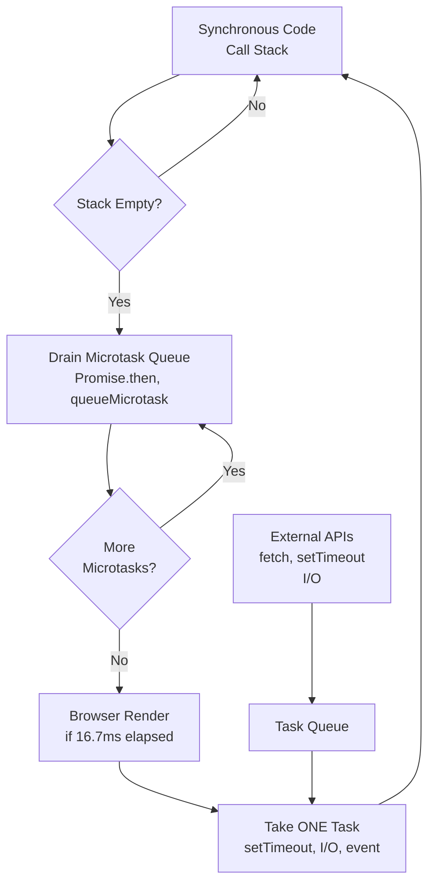
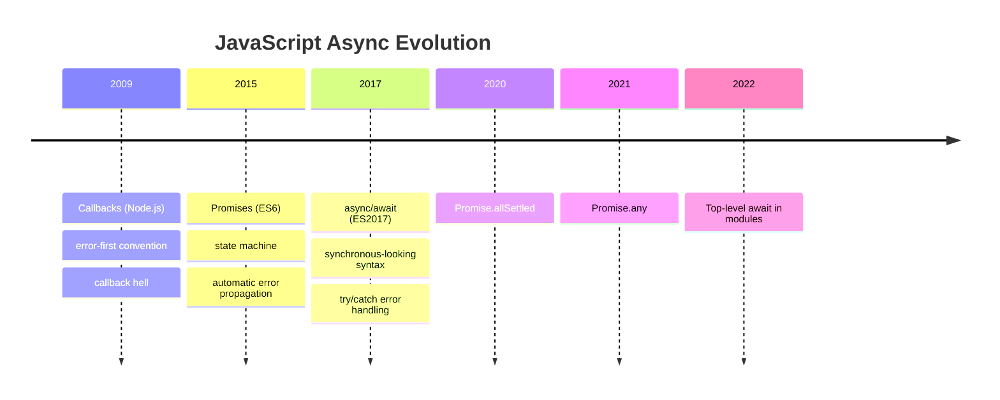

## Keywords in This File

{: .no_toc }

| # | Keyword | Difficulty |
|---|---------|------------|
| 1 | [Why Async JavaScript Exists](#why-async-javascript-exists) | ★☆☆ |
| 2 | [The JavaScript Event Loop and Call Stack](#the-javascript-event-loop-and-call-stack) | ★☆☆ |
| 3 | [JavaScript Async Evolution: Callbacks to Async/Await](#javascript-async-evolution-callbacks-to-asyncawait) | ★☆☆ |

---

# Why Async JavaScript Exists

---

### 🎯 Model Answer

**30 seconds:**
> JavaScript is single-threaded: it can only execute one
> thing at a time. Without async, any operation that
> takes time - reading a file, fetching an API, querying
> a database - would freeze the entire program until
> it finished. Async JavaScript solves this by delegating
> waiting to the browser or Node.js runtime, freeing the
> thread to do other work, and resuming when the result
> arrives. The event loop is the mechanism that makes
> this possible.

**3 minutes:**
> The core constraint is the single thread. JavaScript
> was designed to run in a browser where blocking the
> main thread freezes the UI. A 200ms network request,
> synchronous, means 200ms where scroll events, clicks,
> and animations are frozen. For users that is
> catastrophic; for server-side (Node.js) it means
> one request blocks all others.
>
> The solution is to separate "starting the operation"
> from "receiving the result." When you call
> `fetch('/api/data')`, JavaScript hands the network
> request to the browser's network stack (or Node.js
> libuv), which runs in a separate OS thread managed
> by the runtime. The JavaScript thread continues
> running - handling events, executing other code.
> When the network response arrives, the runtime
> places a callback into the event queue. The event
> loop picks it up when the call stack is empty and
> runs it.
>
> This model is called non-blocking I/O or cooperative
> concurrency. It differs from multi-threading: there
> is still only one JavaScript execution thread. The
> concurrency is achieved by interleaving callbacks,
> not by parallelizing threads.

**Blank Mind Recovery:**

**(1) Restate:** "The question is: why do we need
async JavaScript at all? Let me start from the
constraint."

**(2) First principles:** "JavaScript is single-
threaded. I/O operations take time. If I/O blocked
the thread, the program would freeze. Async
separates starting from completing - the thread
stays available during the wait."

**(3) Bridge:** "Think of a single chef in a restaurant
kitchen. Synchronous: the chef starts boiling water,
stands there watching it boil, then proceeds. Async:
the chef starts the water, goes to prep vegetables
while waiting, comes back when the water is ready.
The chef is still one person - concurrency through
coordination, not parallelism."

---

### 📘 Concept Explanation

**What it is:**
Async JavaScript is the set of language features and
runtime mechanisms that allow JavaScript to handle
time-based operations (I/O, timers, network) without
blocking the single execution thread. The async model
enables concurrent behavior from a single-threaded
runtime.

**The problem it solves:**
Without async: any operation that waits would
freeze all other operations. With async: the runtime
delegates waiting to native OS threads or browser APIs
and resumes JavaScript code only when results arrive.

**How it works:**
The async model has three layers:
1. JavaScript call stack: executes synchronous code
2. Browser/Node.js APIs: handles I/O outside the JS thread
3. Event loop + queue: bridges the two - picks up
   callbacks when the stack is clear

**The key insight:**
JavaScript's concurrency model is not parallelism.
Two JavaScript callbacks never run simultaneously.
Concurrency is achieved by interleaving: when one
callback yields (completes or awaits), another can run.
CPU-bound computation still blocks the thread.
Only I/O-bound work benefits from the async model.

**When to use it:**
All I/O-bound operations: fetch, file reading, database
queries, timers, DOM events. Effectively always in
browser JavaScript.

**When NOT to use it:**
CPU-bound work (image processing, cryptography,
large array sorting) should not use async - it should
use Web Workers, which run in a separate OS thread.
Async callbacks give the illusion of non-blocking
but CPU-bound code still ties up the thread.

**Alternatives:**
- Multi-threading (Go, Java): true parallelism,
  more complex synchronization, not available in
  core JavaScript
- Web Workers: parallel JS threads, no shared memory
  (except SharedArrayBuffer), communication via messages
- Synchronous blocking I/O: appropriate only in
  scripts (not browser), e.g. `fs.readFileSync` in
  Node.js build tools

**First-principles derivation:**
A single-threaded language needs to handle operations
that complete at unknown future times. The solution:
register a callback to run when the operation
completes, return immediately, and run other code
in the meantime. The event loop provides the
scheduling mechanism.

---

### 💻 Code Example

```javascript
// BAD: Synchronous - blocks the thread during I/O
// (Node.js only - browser has no readFileSync)
const fs = require('fs');

function loadConfig() {
  // Blocks everything until file is read
  const data = fs.readFileSync('./config.json', 'utf8');
  return JSON.parse(data);
}

// During readFileSync, no events can be processed:
// no requests, no timers, no other callbacks.
// At scale: one slow disk read blocks all users.
const config = loadConfig();
console.log('Config loaded:', config);
```

> **Code walkthrough:** `readFileSync` is a blockingice. **KEY MECHANISM:** the runtime executes these instructions in sequence with specific memory and execution semantics. **WHY IT MATTERS:** misapplying this pattern causes subtle bugs that only manifest under production load. **TAKEAWAY: understand the execution model before using this pattern in production code.**
> call: the thread stalls until the OS returns the file
> data. While it waits, no other JavaScript runs. In a
> web server, this means every concurrent request stalls
> during this file read. The pattern is only acceptable
> in startup scripts or CLI tools where blocking is
> tolerable and there are no concurrent users.

```javascript
// GOOD: Async - yields the thread during I/O
const fs = require('fs/promises');

async function loadConfig() {
  // Delegates to OS I/O thread; JS thread continues
  const data = await fs.readFile('./config.json', 'utf8');
  return JSON.parse(data);
}

// Thread is released during the await:
// other requests, timers, and events run freely
async function startServer() {
  const config = await loadConfig();
  console.log('Config loaded:', config.port);
  // Server startup continues only after config is ready
}

startServer();
```

> **Code walkthrough:** `fs.readFile` returns a Promiseice. **KEY MECHANISM:** the runtime executes these instructions in sequence with specific memory and execution semantics. **WHY IT MATTERS:** misapplying this pattern causes subtle bugs that only manifest under production load. **TAKEAWAY: understand the execution model before using this pattern in production code.**
> and hands the file read to Node.js libuv's thread pool.
> The `await` suspends `loadConfig`'s execution frame
> without blocking the thread. Other callbacks, timers,
> and incoming requests can run while the I/O completes.
> When the file read finishes, the Promise resolves and
> `loadConfig` resumes from the `await` point. This is
> the fundamental pattern: delegate to the runtime,
> resume on completion.

---

### 🎓 Answers by Seniority

**Junior / Mid (0-5 years):**
> "JavaScript is single-threaded. If a network request
> blocked the thread, the browser would freeze until it
> completed. Async JavaScript allows the thread to keep
> running while waiting for I/O to finish. The event
> loop picks up the result when it's ready."

*Push deeper:* "What does single-threaded mean exactly?
One call stack, one instruction executing at a time.
JavaScript cannot do two things literally simultaneously.
Async is the mechanism for efficiently using the thread
during wait times - not parallel execution."

---

**Senior / Staff (5+ years):**
> "The async model is a form of cooperative concurrency.
> The thread can handle many concurrent I/O operations
> because the actual waiting happens outside the JS thread
> in the runtime's I/O subsystem. The tradeoff: CPU-bound
> operations still block everything. Architecture decisions
> flow from this constraint: CPU-heavy work goes to Web
> Workers or off-process services, and blocking the main
> thread in any hot path is a hard anti-pattern."

*Push deeper:* "In Node.js, libuv manages the I/O thread
pool (default 4 threads). `fs.readFile` uses a thread
pool thread, not kernel async I/O. `net.connect` and
`http.request` use the OS's non-blocking I/O (epoll on
Linux, kqueue on macOS). The distinction matters: heavy
file I/O under load can exhaust the thread pool."

---

### ⚠️ Common Misconceptions

**Misconception 1:** "Async means multi-threaded."
JavaScript async is not multi-threading. There is one
JavaScript thread. Multiple I/O operations can be
in-flight simultaneously because the waiting happens
in the runtime, not in JavaScript. Two async functions
never execute their JavaScript concurrently.

**Misconception 2:** "Async makes everything faster."
Async prevents blocking, but does not reduce the
total time for a single operation. `await fetch(url)`
takes the same time as the synchronous equivalent.
The benefit is that other work can happen during the
wait - at the system level, not per-operation.

**Misconception 3:** "All async operations are non-blocking."
`JSON.parse(largeString)` and `largeArray.sort()` are
synchronous and CPU-bound. Wrapping them in a Promise
does not make them non-blocking - it just delays when
they block. Genuinely non-blocking requires moving work
off the thread (Web Workers) or reducing the work.

---

### 🚨 Failure Modes and Diagnosis

**Failure 1: Blocking the event loop with CPU work**

Symptoms: UI freeze in browsers; high latency and timeouts
in Node.js; `--max-semi-space-size` warnings; "This page
is slowing down your browser" alerts.

```javascript
// BAD: Blocking synchronous CPU work in an async context
app.get('/report', async (req, res) => {
  const data = await fetchLargeDataset(); // async, fine
  // But then: synchronous, blocks the thread
  const result = data.reduce((acc, row) => {
    // Heavy computation - blocks ALL requests during this
    return acc + heavyCalculation(row);
  }, 0);
  res.json({ result });
});
```

> **Code walkthrough:** BAD pattern: This Unknown example demonstrates async/await Promise resolution using async/await. **KEY MECHANISM:** async functions return Promises; await suspends the microtask until the Promise settles. **WHY IT MATTERS:** unhandled Promise rejections crash the Node process in v15+ or fire unhandledRejection event. **WHAT BREAKS: always await or .catch() every Promise - silent rejections are production defects.**

Fix: Move CPU work to a Worker thread or chunk it
with `setImmediate` to yield between batches.

**Failure 2: Synchronous blocking in startup code**

Symptoms: slow startup time, especially under load.

Fix: Replace `readFileSync`/`existsSync` with async
equivalents in server code. Use sync only at true
startup before the event loop starts accepting requests.

**Diagnosis commands:**
```javascript
// Detect event loop lag in Node.js
const { monitorEventLoopDelay } = require('perf_hooks');
const h = monitorEventLoopDelay({ resolution: 10 });
h.enable();
setInterval(() => {
  // mean delay in nanoseconds
  console.log('EL lag mean:', h.mean / 1e6, 'ms');
  console.log('EL lag p99:', h.percentile(99) / 1e6, 'ms');
}, 5000);
```

> **Code walkthrough:** This Unknown example demonstrates variable declaration. **KEY MECHANISM:** const prevents reassignment but not mutation; the reference is locked, the value is not. **WHY IT MATTERS:** const obj = {}; obj.x = 1 works - const does not freeze the object. **TAKEAWAY: use Object.freeze() to prevent mutation; const only guards the binding.**

---

### 🎯 Interview Deep-Dive

| Category | Count | Coverage |
|---|---|---|
| Conceptual | 2 | Why async exists, single-thread model |
| Trade-off | 1 | Async vs sync, concurrent vs parallel |
| Failure Mode | 1 | CPU blocking in async context |
| Debugging | 1 | Diagnosing event loop lag |
| Design | 1 | When to use async vs Worker |
| Beginner-trap | 1 | Async = multi-threaded misconception |

**[JUNIOR] Q1 - [MECHANISM] Why is JavaScript single-threaded, and how does async programming compensate for this limitation?**

JavaScript was designed for the browser where a single
thread simplifies the programming model: no race conditions
on DOM manipulation, no locks needed for shared state.
Single-threaded was a deliberate simplification. The cost:
any blocking operation freezes everything.

Async compensates through delegation. The thread starts
an I/O operation, registers a callback, and returns
immediately. The runtime (browser APIs or Node.js libuv)
handles the I/O in native threads. When complete, the
result is placed in the event queue. The event loop
delivers it to the JavaScript thread when the call stack
is empty.

The compensation is effective for I/O-bound work: network,
disk, timers, DOM events. It is not effective for CPU-bound
work - synchronous computation on large data still blocks
the thread regardless of async syntax.

*What separates good from great:* Understanding that "async"
and "non-blocking" refer specifically to I/O delegation, not
to all time-consuming operations. Knowing the boundary between
I/O-bound (handled by async) and CPU-bound (requires Workers).

---

**[JUNIOR] Q2 - [TRADE-OFF] What is the difference between concurrency and parallelism in the context of JavaScript?**

Parallelism: multiple computations happening at the same
physical instant on multiple hardware threads or cores.
Java threads, Go goroutines, and Worker threads achieve
true parallelism.

Concurrency: multiple tasks making progress over the same
time period by interleaving. JavaScript's event loop is
concurrent but not parallel in the main thread.

In JavaScript: two async operations can be in-flight
simultaneously (both waiting for I/O), but their callbacks
never execute simultaneously. They interleave: one runs
to completion (or yields at an `await`), then the other runs.

Practical implication: race conditions on shared JavaScript
variables are not possible between two async functions
(because they cannot run simultaneously) but they are
possible between interleaved operations that share state.
A pattern like "read counter, increment, write counter"
is still vulnerable if another callback runs between read
and write.

*What separates good from great:* Correctly identifying
that JavaScript's async model eliminates traditional data
race conditions (two writes at the same instruction) but
not logical race conditions (two operations that share
logical state with a gap between read and write).

---

**[JUNIOR] Q3 - [FAILURE] What happens if you put CPU-intensive code inside an async function? Is it non-blocking?**

No. An async function with CPU-intensive code blocks the
thread during that computation regardless of the `async`
keyword or `await` expressions.

```javascript
async function looksConcurrent() {
  const result = await fetch('/api/data');
  const json = await result.json();
  // This still blocks the thread completely:
  return json.items.sort((a, b) =>
    expensiveComparator(a, b));
}
```

> **Code walkthrough:** This Unknown example demonstrates async/await Promise resolution using async/await. **KEY MECHANISM:** async functions return Promises; await suspends the microtask until the Promise settles. **WHY IT MATTERS:** unhandled Promise rejections crash the Node process in v15+ or fire unhandledRejection event. **TAKEAWAY: always await or .catch() every Promise - silent rejections are production defects.**

The `async`/`await` yields at I/O boundaries (the `fetch`
and `.json()` calls). But the `.sort()` with an expensive
comparator runs synchronously on the thread. During that
sort, no other callbacks execute.

Fix: move CPU work to a Worker thread or split it into
batches with `setImmediate`:

```javascript
async function chunkedSort(items) {
  const batchSize = 1000;
  for (let i = 0; i < items.length; i += batchSize) {
    items.slice(i, i + batchSize).sort(comparator);
    await new Promise(r => setImmediate(r)); // yield
  }
  return items;
}
```

> **Code walkthrough:** This Unknown example demonstrates async/await Promise resolution using async/await. **KEY MECHANISM:** async functions return Promises; await suspends the microtask until the Promise settles. **WHY IT MATTERS:** unhandled Promise rejections crash the Node process in v15+ or fire unhandledRejection event. **TAKEAWAY: always await or .catch() every Promise - silent rejections are production defects.**

*What separates good from great:* Knowing the specific
boundary: `await` yields at the expression it modifies,
not at arbitrary computation that follows. And knowing that
the correct solution depends on work type: Worker for true
CPU parallelism, chunking for cooperative yielding.

---

**[MID] Q4 - [SCENARIO] When would you choose synchronous blocking I/O over async I/O in Node.js?**

Sync I/O is appropriate when:
- The application is in startup mode before the event loop
  starts processing requests (reading config files once)
- The script is a CLI tool where there are no concurrent
  requests to protect (build scripts, code generators)
- The sync call is in a worker thread (isolated thread,
  blocking it does not affect the main thread or other
  requests)

Sync I/O is inappropriate when:
- In a web server request handler
- In any function called during an active event loop
- In any code that may run concurrently with other requests

The diagnostic: ask "what else is running on this thread?"
If the answer is "nothing else matters while this runs,"
sync is acceptable. If the answer is "other requests,
timers, event handlers," async is required.

*What separates good from great:* Framing the decision
as "what else is sharing this thread?" rather than a
blanket rule. And knowing that worker threads change the
calculus: sync I/O in a worker is isolated from the main
thread's event loop.

---

**[MID] Q5 - [DEBUGGING] How would you diagnose whether the event loop is being blocked in a production Node.js service?**

Multiple tools at different levels:

1. Event loop delay metrics: Node.js `perf_hooks`
   `monitorEventLoopDelay` measures the delay between
   when a timer is scheduled and when it actually fires.
   Healthy: < 10ms. Concerning: > 50ms. Critical: > 100ms.

2. APM tools: DataDog, New Relic, Clinic.js all expose
   event loop utilization. `clinic doctor` is a first
   diagnostic tool.

3. `--prof` V8 profiling: generates a V8 CPU profile.
   `node --prof app.js` then `node --prof-process isolate-*.log`
   shows where CPU time is spent. Synchronous operations
   that appear in the hot path indicate blocking.

4. Prometheus histogram on request latency: if p50 and
   p95 are close together but p99 is 10x higher, this
   suggests occasional blocking spikes (e.g., GC pauses
   or CPU bursts) rather than uniform I/O latency.

*What separates good from great:* Combining reactive
signals (high latency p99) with proactive instrumentation
(event loop delay monitoring) rather than waiting for
a crisis to diagnose.

---

**[SENIOR] Q6 - [MECHANISM] What would you expect to happen to a Node.js server if a synchronous `JSON.parse` call on a very large payload was added to a hot request handler?**

All concurrent requests would experience increased
latency proportional to the parse time, with no concurrency
benefit. Specifically:

- During the `JSON.parse` call, no other request callbacks
  can run. The thread is occupied.
- If the parse takes 50ms, every request that arrives
  during that 50ms sits in the event queue waiting.
- Under load, multiple requests may queue up behind a
  single expensive parse.
- Tail latency (p99) will increase significantly while
  average latency may only increase slightly.
- The effect compounds: if 10 concurrent requests are
  processing, each with a 50ms parse, the last request
  could wait 500ms before its callback even starts.

Fix options: stream the JSON parsing (`JSONStream` or
`@discoveryjs/json-ext`), validate and reject large
payloads at the request layer, or move parsing to a
Worker thread for payloads above a size threshold.

*What separates good from great:* Understanding the
queuing effect under concurrency - that blocking in one
handler compounds across all concurrent requests, not
just the one being processed.

---

**[SENIOR] Q7 - [TRADE-OFF] What trade-offs does the async single-threaded model create for library and framework authors?**

Library authors cannot use synchronous blocking I/O in
any function intended for use in web servers or browsers.
This propagates: if a function needs to do async I/O,
every caller must be async. This is sometimes called
"async contagion" or "colored functions" - async infects
the call chain.

For framework authors (Express, Fastify, Next.js), all
plugin hooks, middleware, and lifecycle callbacks must
either be fully async-compatible or provide mechanisms
to prevent blocking.

The practical constraint: a single synchronous heavy
computation in one npm package can degrade an entire
application's responsiveness. Library authors must audit
for CPU-heavy synchronous operations and either document
them clearly or provide async alternatives.

Trade-off summary: the simplicity of single-threaded code
(no locks, no data races) comes at the cost of event loop
sensitivity - one bad actor blocks everyone. Multi-threaded
models isolate poorly-behaved code but add synchronization
complexity.

*What separates good from great:* Understanding that async
single-threaded systems have a global shared resource (the
event loop) that any function can monopolize, which is a
fundamentally different constraint than multi-threaded
systems where threads compete on specific shared data.

---

### ⚖️ Comparison Table

*(Omit: ★☆☆ foundational keyword - comparison handled in
file Async JavaScript - L2 Advanced Promises.md)*

---

### 🏛️ System Design

*(Omit: ★☆☆ orientation keyword - not applicable)*

---

### 📊 Diagram

*(Omit: covered in next keyword - JavaScript Event Loop
and Call Stack includes the primary diagram for this topic)*

---

---

---

### 💻 Code Example

*(Omit: this concept does not have a programmatic interface that can be demonstrated in code. The conceptual explanation above is sufficient.)*


---

### 🏛️ System Design

*(Omit: system design diagram not applicable for this concept - see ★★★ keywords for full system design coverage.)*


---

### ⚖️ Comparison Table

*(Omit: this is a ★☆☆ foundational concept with no direct alternatives to compare - see higher-difficulty keywords for trade-off analysis.)*


---

### 📊 Diagram

*(Omit: no standalone visual diagram required for this concept - the explanations and code examples above provide sufficient clarity.)*


# The JavaScript Event Loop and Call Stack

---

### 🎯 Model Answer

**30 seconds:**
> The event loop is the scheduler that runs JavaScript code.
> It works by repeatedly checking: is the call stack empty?
> If yes, take the next task from the task queue and run it.
> The call stack is a LIFO stack of execution frames. The
> task queue holds callbacks ready to run. The microtask
> queue (Promises, queueMicrotask) is drained completely
> after each task before the next task runs.

**3 minutes:**
> Four components interact:
>
> Call stack: where synchronous code executes. When you
> call a function, a frame is pushed. When it returns, it
> is popped. One frame active at a time. An empty call stack
> means JavaScript is idle and ready for the next task.
>
> Web APIs / Node.js APIs: where async work happens outside
> the JavaScript thread. `setTimeout`, `fetch`, `fs.readFile`
> register work here. These APIs have their own threads
> managed by the browser or Node.js runtime.
>
> Task queue (macrotask queue): holds callbacks from Web
> APIs when their work is done - setTimeout callbacks,
> event listener callbacks, I/O completion callbacks. The
> event loop takes one task per iteration.
>
> Microtask queue: holds Promise `.then` callbacks and
> `queueMicrotask` callbacks. Critical distinction: after
> each task (and after the call stack empties from a task),
> the entire microtask queue is drained before the next
> task runs. Microtasks have higher priority than tasks.
>
> The loop executes in this order:
> 1. Run one task from the task queue
> 2. Drain the entire microtask queue
> 3. (Render update in browsers, if needed)
> 4. Go to step 1

**Blank Mind Recovery:**

**(1) Restate:** "The event loop is the mechanism that
coordinates what code runs when. Let me build it from
the components."

**(2) First principles:** "There is one execution thread.
It can only do one thing at a time. Async results need
to be picked up somehow. The event loop is the pickup
mechanism: when the thread is free, it picks up the next
pending callback and runs it."

**(3) Bridge:** "The event loop is like an airport gate
agent. The gate agent (event loop) processes one passenger
(task) at a time. Before calling the next passenger, they
must finish processing all urgent standby passengers
(microtasks). Promises are standby passengers; setTimeout
callbacks are regular passengers."

---

### 📘 Concept Explanation

**What it is:**
The event loop is JavaScript's concurrency mechanism.
It continuously polls: is the call stack empty? If yes,
execute the next pending task. Tasks come from Web APIs
(timers, I/O, events). Microtasks from Promises are
processed with higher priority.

**The problem it solves:**
A single thread cannot be polling for I/O results while
also running code. The event loop separates: run code
(call stack) from wait for results (task/microtask queues).

**How it works:**

```
EVENT LOOP COMPONENTS
==========================
     Call Stack
    +----------+
    | frame 3  |  <- top (currently executing)
    | frame 2  |
    | frame 1  |  <- bottom
    +----------+
         |
         | empties ->
         v
    Event Loop checks:
    1. Microtask queue (drain ALL)
       [promise.then, queueMicrotask]
    2. Task queue (take ONE)
       [setTimeout, setInterval, I/O]
    3. Render (browser only)
    -> back to start

Browser/Node Runtime (outside JS thread):
    - setTimeout: native timer
    - fetch/xhr: network stack
    - fs.readFile: OS thread pool
    When done: pushes callback to task queue
```

> **Code walkthrough:** This The JavaScript Event Loop and Call Stack example demonstrates a key concept in practice using Promise. **KEY MECHANISM:** the runtime executes these instructions in sequence with specific memory and execution semantics. **WHY IT MATTERS:** misapplying this pattern causes subtle bugs that only manifest under production load. **TAKEAWAY: understand the execution model before using this pattern in production code.**

**The key insight:**
The microtask queue is drained completely after
every task. This means a Promise chain with 1000
`.then` callbacks all resolve before the next
`setTimeout` callback runs. This has important
consequences: microtask starvation is possible (an
infinite Promise loop can prevent all tasks from running)
and the ordering of Promise vs setTimeout callbacks is
deterministic, not random.

**When to use it:**
Understanding the event loop is fundamental to predicting
callback execution order, debugging timing issues, and
understanding why `setTimeout(fn, 0)` does not mean
"run immediately."

**When NOT to use it:**
Worker threads have their own event loops, isolated
from the main thread. The call stack / microtask / task
queue model describes the main thread and each worker
independently.

**Alternatives:**
Node.js also has `setImmediate` (runs at the start of
the next iteration of the event loop, after I/O callbacks
but before timers) and `process.nextTick` (runs before
microtasks, at the end of the current operation, before
the event loop continues). Understanding these nuances
is a Node.js-specific advanced topic.

**First-principles derivation:**
One thread can only execute one callback at a time.
Multiple callbacks may be ready at the same time. A
scheduler is needed to decide which runs next. The event
loop is that scheduler: task queue for normal async
results, microtask queue for continuation callbacks
(Promises) that need to run before yielding back to
the task scheduler.

---

### 💻 Code Example

```javascript
// Execution order quiz - predict the output
console.log('1: synchronous');

setTimeout(() => console.log('2: setTimeout 0ms'), 0);

Promise.resolve()
  .then(() => console.log('3: promise microtask'));

console.log('4: synchronous');

// OUTPUT ORDER:
// 1: synchronous
// 4: synchronous
// 3: promise microtask  <- microtask before task!
// 2: setTimeout 0ms
```

> **Code walkthrough:** Synchronous code (1 and 4) runsice. **KEY MECHANISM:** the runtime executes these instructions in sequence with specific memory and execution semantics. **WHY IT MATTERS:** misapplying this pattern causes subtle bugs that only manifest under production load. **TAKEAWAY: understand the execution model before using this pattern in production code.**
> first - the call stack executes completely. Then the
> microtask queue is drained: the Promise `.then` callback
> runs (3). Only after microtasks are cleared does the event
> loop pick up the setTimeout callback (2). The key insight:
> `setTimeout(fn, 0)` does not mean "run immediately" - it
> means "run after the current task AND all microtasks."


```javascript
// BAD: unhandled Promise rejection
fetchData(url).then(data => {
    processData(data);
}); // no .catch() - rejection silently ignored
```

```javascript
// ADVANCED: Microtask starvation
// BAD: infinite microtask loop - starves all tasks
function infiniteMicrotask() {
  Promise.resolve().then(infiniteMicrotask);
}
infiniteMicrotask();
// setTimeout callbacks, click handlers, I/O callbacks:
// NONE will ever run. The microtask queue never empties.

// GOOD: use setImmediate or setTimeout to yield
// between iterations of long async operations
async function processLargeList(items) {
  for (let i = 0; i < items.length; i++) {
    process(items[i]);
    // Yield to task queue every 100 items
    if (i % 100 === 0) {
      await new Promise(r => setImmediate(r));
    }
  }
}
```

> **Code walkthrough:** The BAD example demonstratesice. **KEY MECHANISM:** the runtime executes these instructions in sequence with specific memory and execution semantics. **WHY IT MATTERS:** misapplying this pattern causes subtle bugs that only manifest under production load. **TAKEAWAY: understand the execution model before using this pattern in production code.**
> microtask starvation: each `.then` callback schedules
> another microtask before the queue can empty. The event
> loop will never reach the task queue. The GOOD example
> uses `setImmediate` wrapped in a Promise - `setImmediate`
> schedules a task (not a microtask), so each iteration
> yields to the event loop, allowing other callbacks to run.

---

### 🎓 Answers by Seniority

**Junior / Mid (0-5 years):**
> "The event loop checks if the call stack is empty, then
> runs the next task. Microtasks (Promises) run before
> tasks (setTimeout). That's why `setTimeout(fn, 0)` runs
> after Promise callbacks even though it looks like it
> should be immediate."

*Push deeper:* "Can you draw the flow? Synchronous code
-> call stack executes -> stack empties -> microtask queue
drains -> one task from task queue -> repeat."

---

**Senior / Staff (5+ years):**
> "Understanding the event loop is essential for Node.js
> performance. The key operational concerns: event loop lag
> (measure with monitorEventLoopDelay), task queue depth
> under load (too many pending tasks indicates backpressure),
> and microtask flooding (rare but catastrophic when it
> occurs). At the architecture level: any operation that
> must complete before rendering (browser) or before
> the next request (server) should be a microtask;
> any operation that should yield to other work should
> use a task."

*Push deeper:* "`process.nextTick` runs before Promise
microtasks in Node.js. This is a legacy behavior and a
common trap. If you call `process.nextTick` recursively,
you starve even the microtask queue."

---

### ⚠️ Common Misconceptions

**Misconception 1:** "`setTimeout(fn, 0)` runs immediately."
`setTimeout(fn, 0)` schedules a task with a minimum delay
of 0ms. But it runs after the current task completes and
all microtasks are drained. In practice, minimum browser
delay is often 1ms or 4ms (to prevent infinite loops from
consuming 100% CPU with 0ms timers).

**Misconception 2:** "Promises run immediately when resolved."
A resolved Promise's `.then` callback is added to the
microtask queue. It runs when the current synchronous
execution completes - not immediately when `resolve()` is
called.

**Misconception 3:** "The task queue and microtask queue
are the same thing."
They differ in priority and draining behavior. Microtasks
(Promises, `queueMicrotask`) drain completely after each
task. Tasks (setTimeout, setInterval, I/O) run one per
event loop iteration. Confusing these leads to incorrect
execution order predictions.

---

### 🚨 Failure Modes and Diagnosis

**Failure 1: Accidental blocking of the event loop**
Symptom: server responses stall intermittently; CPU
usage spikes to 100% on one core; `ETIMEDOUT` errors.
Cause: a synchronous heavy computation (regex on large
strings, recursive data structure traversal) in a request
handler.

```javascript
// Diagnosis: detect blocking via event loop delay
const { monitorEventLoopDelay } = require('perf_hooks');
const histogram = monitorEventLoopDelay({ resolution: 10 });
histogram.enable();

setInterval(() => {
  const p99Ms = histogram.percentile(99) / 1e6;
  if (p99Ms > 50) {
    console.warn(`Event loop p99 lag: ${p99Ms.toFixed(1)}ms`);
  }
  histogram.reset();
}, 1000);
```

> **Code walkthrough:** This Unknown example demonstrates variable declaration. **KEY MECHANISM:** const prevents reassignment but not mutation; the reference is locked, the value is not. **WHY IT MATTERS:** const obj = {}; obj.x = 1 works - const does not freeze the object. **TAKEAWAY: use Object.freeze() to prevent mutation; const only guards the binding.**

**Failure 2: Microtask starvation from recursive Promises**
Symptom: application freezes with 100% CPU; setTimeout
callbacks never fire; event emitters stop working.
Cause: recursive Promise chains without task boundaries.
Fix: insert `setImmediate` breaks to yield to the task queue.

**Failure 3: Unexpected execution order bugs**
Symptom: state reads stale values; race condition in
multi-step async operations.
Diagnosis: trace the call stack and queue transitions at
each `await`. Use Node.js `--trace-events` flag for
detailed task scheduling logs.

---

### 🎯 Interview Deep-Dive

| Category | Count | Coverage |
|---|---|---|
| Conceptual | 2 | Event loop model, microtask vs task |
| Trade-off | 1 | Microtask vs task priority trade-offs |
| Failure Mode | 1 | Starvation, blocking |
| Debugging | 1 | Diagnosing execution order issues |
| Design | 1 | Choosing task vs microtask |
| Trap | 1 | nextTick vs Promise ordering |

**[JUNIOR] Q1 - [TRADE-OFF] Explain the difference between the task queue and the microtask queue. Why does this distinction matter?**

The task queue (macrotask queue) holds callbacks from:
`setTimeout`, `setInterval`, I/O completions, UI events.
The event loop takes one task per iteration.

The microtask queue holds: Promise `.then` callbacks,
`queueMicrotask` callbacks, `MutationObserver` callbacks.
After each task, the event loop drains the entire microtask
queue before taking the next task.

Why it matters: Promise chains execute atomically relative
to other tasks. If you have a multi-step Promise chain,
all steps complete before any setTimeout callback runs.
This provides a stronger ordering guarantee for Promise-
based code than for setTimeout-based code.

Practical consequence: code that needs to run "as soon as
possible" but after the current synchronous code should
use `queueMicrotask` or `Promise.resolve().then()`. Code
that needs to yield to I/O and rendering should use
`setTimeout(fn, 0)` or `setImmediate`.

*What separates good from great:* Understanding that
microtask queue draining is a per-task operation, not
per-await. A single `await` does not drain the microtask
queue; it adds to it.

---

**[JUNIOR] Q2 - [MECHANISM] What is the execution order of the following?**

```javascript
console.log('A');
setTimeout(() => console.log('B'), 0);
Promise.resolve().then(() => console.log('C'));
queueMicrotask(() => console.log('D'));
console.log('E');
```

> **Code walkthrough:** This Unknown example demonstrates Promise chain construction using Promise. **KEY MECHANISM:** Promise.then() registers a microtask; all microtasks drain before the next macrotask. **WHY IT MATTERS:** Promise.all() fails fast on first rejection; use Promise.allSettled() to collect all results. **TAKEAWAY: prefer Promise.allSettled() over Promise.all() when partial success is acceptable.**

Answer: A, E, C, D, B.

Reasoning: A and E are synchronous - they run in order.
The call stack then empties. The microtask queue is checked:
Promise `.then` (C) and `queueMicrotask` (D) are both
microtasks - they drain in order. Only then does the event
loop pick up the task queue: setTimeout (B) runs.

Between C and D: microtasks execute in FIFO order. The
Promise `.then` was added first (synchronously resolved
before queueMicrotask was called), so C runs before D.

*What separates good from great:* Being able to reason
through execution order step by step rather than just
knowing "microtasks before tasks." Knowing that `queueMicrotask`
and `Promise.resolve().then()` are both microtasks with
the same priority, ordered by insertion time.

---

**[JUNIOR] Q3 - [FAILURE] What happens when you `await` a non-Promise value?**

`await nonPromise` wraps the value in `Promise.resolve()`.
The current async function is suspended and its continuation
is scheduled as a microtask. Even if `nonPromise` is a
plain number or string, the `await` still yields the
function to the microtask queue.

```javascript
async function example() {
  console.log('before await');
  await 42; // still yields!
  console.log('after await');
}
example();
console.log('after example()');
// Output: 'before await', 'after example()', 'after await'
```

> **Code walkthrough:** This Unknown example demonstrates async/await Promise resolution using async/await. **KEY MECHANISM:** async functions return Promises; await suspends the microtask until the Promise settles. **WHY IT MATTERS:** unhandled Promise rejections crash the Node process in v15+ or fire unhandledRejection event. **TAKEAWAY: always await or .catch() every Promise - silent rejections are production defects.**

`await 42` suspends the function even though 42 is not
async. The continuation is added as a microtask.

*What separates good from great:* Knowing that `await`
always introduces an asynchronous boundary, even for
synchronous values. This has performance implications:
unnecessary `await` adds microtask scheduling overhead.

---

**[MID] Q4 - [TRADE-OFF] When should you use `process.nextTick` vs `Promise.resolve().then()` in Node.js?**

Both schedule a microtask-like callback, but with different
priority: `process.nextTick` callbacks run before Promise
microtasks, before I/O events, before timers.

`process.nextTick` use cases:
- When a callback must run before any I/O can intervene
- For error-first event emitter patterns where the error
  handler must be set before the error fires

`Promise.resolve().then()` use cases:
- Standard async continuation
- Yielding to allow other Promises to resolve first
- When you need `await`-compatible behavior

The rule for new code: prefer `queueMicrotask` or
`Promise.resolve().then()`. Use `process.nextTick` only
when you specifically need its higher-priority behavior,
and document why.

*What separates good from great:* Knowing that `process.nextTick`
has higher priority than Promises and can starve Promise
callbacks if used recursively. And knowing it exists for
historical Node.js API compatibility reasons.

---

**[MID] Q5 - [MECHANISM] What is backpressure in the context of the event loop, and when does it become a problem?**

Backpressure occurs when tasks are added to the task queue
faster than the event loop can process them. The queue grows
unboundedly.

Causes in Node.js:
- Ingesting streaming data faster than processing it
- A long-running task that delays all subsequent callbacks
- High-frequency event firing (mousemove, scroll) without
  debouncing in browsers

Symptoms: increasing event loop lag; memory growth from
queued callbacks; timeouts on connections waiting for responses.

Diagnosis: monitor queue depth (event loop lag as proxy) and
memory usage trends. Tools: `clinic doctor` in Node.js,
`chrome://tracing` in browsers.

Resolution: rate-limit input sources; offload processing
to Worker threads; implement explicit backpressure in streams
(pause/resume).

*What separates good from great:* Understanding backpressure
as a queuing theory problem: when arrival rate > service rate,
queue length grows unboundedly. The fix is always at one of
these two rates.

---

**[SENIOR] Q6 - [MECHANISM] How does the browser's rendering process interact with the event loop?**

Browsers typically try to render at 60fps (every ~16.7ms).
The browser uses the event loop structure: after each task
and microtask drain, if 16.7ms has elapsed since the last
render, it performs a render cycle (layout, paint, composite).

Implications:
- Heavy task execution can delay rendering, causing frame drops
- Long-running tasks (> 50ms) are "Long Tasks" in the
  Performance timeline
- `requestAnimationFrame` (rAF) callbacks run before the render,
  making them ideal for visual updates
- CSS animations and `requestAnimationFrame` are both subject
  to the same event loop scheduling

For smooth 60fps: ensure no single task exceeds 16.7ms.
Long computation should be split with `setTimeout` breaks
or moved to a Worker.

*What separates good from great:* Connecting the event loop
model to actual user-perceptible outcomes: frame drops,
janky animations, delayed click responses. The event loop
is not just a theoretical model - it directly determines
whether the UI feels responsive.

---

**[SENIOR] Q7 - [MECHANISM] What is the `queueMicrotask` API and why was it added when `Promise.resolve().then()` already existed?**

`queueMicrotask(fn)` schedules `fn` as a microtask without
allocating a Promise object. It was added in the HTML
specification and Node.js 11+ as a lower-overhead alternative.

Reasons for existence:
1. Performance: `Promise.resolve().then(fn)` allocates a
   Promise object. `queueMicrotask(fn)` does not. At very
   high frequencies (millions per second), this allocation
   difference is measurable.
2. Clarity: explicitly communicates intent to schedule a
   microtask, rather than creating a throwaway Promise.
3. Error handling difference: an unhandled error in a
   `queueMicrotask` callback goes through the standard
   unhandled error mechanism. A `Promise.resolve().then`
   error becomes an unhandled Promise rejection.

For typical application code: the difference is negligible.
For library internals at high call volumes: `queueMicrotask`
is preferred.

*What separates good from great:* Knowing that API additions
to the platform are often about performance at edge cases
and API clarity, not because the previous approach was broken.

---

### ⚖️ Comparison Table

*(Omit: ★☆☆ foundational keyword - comparison covered in
Async JavaScript - L6 Theory.md)*

---

### 🏛️ System Design

*(Omit: ★☆☆ - not applicable at this level)*

---

### 📊 Diagram

```
JAVASCRIPT EVENT LOOP
=====================================
  Sync code
  (Call Stack)
  +--------+
  | main() |
  +--------+
      |
      | synchronous execution completes
      |
      v
  Event Loop
  +---------------------------+
  | 1. Drain microtask queue  |
  |    [Promise.then, nextTick|
  |     queueMicrotask]       |
  |    ALL items, FIFO order  |
  |                           |
  | 2. Render (browser only)  |
  |    [requestAnimationFrame,|
  |     layout, paint]        |
  |                           |
  | 3. Take ONE task          |
  |    [setTimeout, setInterval
  |     I/O callback, event]  |
  |                           |
  | -> back to step 1         |
  +---------------------------+

  External APIs (outside JS thread):
  +-----------------------------------+
  | Browser: Fetch, setTimeout, XHR   |
  | Node.js: libuv (I/O thread pool,  |
  |          OS epoll/kqueue/IOCP)     |
  | -> push callback to task queue     |
  |    when complete                   |
  +-----------------------------------+
```



> **Diagram walkthrough:** The call stack runs synchronous
> code until empty. The event loop then drains ALL microtasks
> in FIFO order before doing anything else. After microtasks,
> the browser may render a frame. Finally, exactly one task
> is dequeued and executed, after which the cycle repeats.
> External APIs (network, timers, OS I/O) run outside the
> JavaScript thread and push callbacks into the task queue
> when complete. The asymmetry between "drain all microtasks"
> and "take one task" is the key to understanding Promise
> vs setTimeout ordering.

---

---

---

### 💻 Code Example

*(Omit: this concept does not have a programmatic interface that can be demonstrated in code. The conceptual explanation above is sufficient.)*


---

### 🏛️ System Design

*(Omit: system design diagram not applicable for this concept - see ★★★ keywords for full system design coverage.)*


---

### ⚖️ Comparison Table

*(Omit: this is a ★☆☆ foundational concept with no direct alternatives to compare - see higher-difficulty keywords for trade-off analysis.)*


---

### 📊 Diagram

*(Omit: no standalone visual diagram required for this concept - the explanations and code examples above provide sufficient clarity.)*


# JavaScript Async Evolution: Callbacks to Async/Await

---

### 🎯 Model Answer

**30 seconds:**
> JavaScript async evolved through three generations: callbacks
> (Node.js origin, error-first convention), Promises (ES2015,
> explicit async state machine), and async/await (ES2017,
> synchronous-looking syntax over Promises). Each generation
> solved the primary readability and error-handling problem of
> the previous one. Async/await is syntactic sugar over
> Promises - understanding Promises is required to use
> async/await correctly.

**3 minutes:**
> Generation 1 - Callbacks (2009-2015):
> The standard was error-first callbacks: `function(err, result)`.
> Node.js popularized this. The problem: nested callbacks
> become "callback hell" - deeply indented, hard to read,
> hard to handle errors across multiple async steps. Error
> handling required manual `if (err) return callback(err)` at
> every level. Composing multiple async operations was painful.
>
> Generation 2 - Promises (ES2015, 2015):
> Promises provided a standard async state machine with three
> states: pending, fulfilled, rejected. Chaining with `.then()`
> flattened the nesting. Error propagation with `.catch()` was
> automatic. Promise combinators (`Promise.all`, `Promise.race`)
> made concurrent async patterns manageable. The remaining
> problem: `.then()` chains still differed syntactically from
> synchronous code.
>
> Generation 3 - async/await (ES2017, 2017):
> `async` functions return Promises; `await` suspends the
> function until a Promise resolves. The code reads like
> synchronous code. Error handling uses standard try/catch.
> The tradeoff: if you do not understand Promises, you will
> misuse async/await (forgetting to `await`, sequential
> `await`s when `Promise.all` would be faster, unhandled
> rejections).

**Blank Mind Recovery:**

**(1) Restate:** "You are asking how JavaScript async
programming evolved. Let me walk through the three generations."

**(2) First principles:** "Each generation had one primary
problem to solve. Callbacks: no problem yet, just the first
approach. Promises: callback hell. Async/await: Promise chain
readability."

---

### 📘 Concept Explanation

**What it is:**
The evolution from callbacks to async/await is the history
of JavaScript's approach to expressing and composing async
operations. Each approach is still valid and each is still
encountered in modern codebases.

**The problem it solves:**
Readability, composability, and error handling in async code.
Each generation solved the primary pain point of the previous
approach.

**How it works:**

```
ASYNC EVOLUTION COMPARISON
============================

GENERATION 1: CALLBACKS
  Convention: function(err, result)
  Error handling: manual if (err) check at every level
  Nesting: deep for sequential operations ("callback hell")
  Composability: difficult (async.js library helped)
  Error propagation: manual at every call

// Three sequential async operations with callbacks
readFile('a.txt', (err, a) => {
  if (err) return handle(err);     // manual at every level
  readFile('b.txt', (err, b) => {  // nested one level
    if (err) return handle(err);
    readFile('c.txt', (err, c) => { // nested two levels
      if (err) return handle(err);
      combine(a, b, c);
    });
  });
});

GENERATION 2: PROMISES
  State machine: pending -> fulfilled | rejected
  Error handling: .catch() propagates automatically
  Nesting: flattened with .then() chaining
  Composability: Promise.all, Promise.race built-in
  Error propagation: automatic through chain

// Same three operations with Promises
readFile('a.txt')
  .then(a => readFile('b.txt')
    .then(b => ({ a, b })))  // still nesting for vars
  .then(({ a, b }) => readFile('c.txt')
    .then(c => combine(a, b, c)))
  .catch(handle); // one handler for all errors

GENERATION 3: ASYNC/AWAIT
  Syntax: synchronous-looking
  Error handling: try/catch
  Composability: Promise.all still needed for concurrent
  Error propagation: natural exception propagation
  Trade-off: sequential awaits add latency

// Same three operations with async/await
async function combineFiles() {
  try {
    const a = await readFile('a.txt'); // sequential!
    const b = await readFile('b.txt'); // sequential!
    const c = await readFile('c.txt'); // sequential!
    return combine(a, b, c);
  } catch (err) {
    handle(err);
  }
}
// Total time: sum of all three reads (not concurrent)
// Fix: const [a, b, c] = await Promise.all([...])
```

> **Code walkthrough:** This JavaScript Async Evolution: Callbacks to Async/Await example demonstrates a key concept in practice using async/await. **KEY MECHANISM:** the runtime executes these instructions in sequence with specific memory and execution semantics. **WHY IT MATTERS:** misapplying this pattern causes subtle bugs that only manifest under production load. **TAKEAWAY: understand the execution model before using this pattern in production code.**

**The key insight:**
Async/await is syntactic sugar over Promises. An `async`
function returns a Promise. `await` is equivalent to `.then()`.
`try/catch` in async functions catches rejected Promises. You
cannot escape Promises by using async/await - you can only
express them differently.

**When to use it:**
- Callbacks: when working with older Node.js APIs or libraries
  that do not support Promises. Use `util.promisify` to convert.
- Promises: when you need explicit Promise combinators or
  when async/await is not available.
- Async/await: default for all new code. More readable,
  easier error handling, familiar to developers from other
  languages.

**When NOT to use it:**
Do not use async/await blindly for concurrent operations.
Sequential `await` calls are slower than `Promise.all` for
independent operations. Always ask: "do these operations
depend on each other?"

**Alternatives:**
- RxJS Observables: reactive streams, more powerful than
  Promises for multi-value, cancellable async operations
- Generator-based approaches (co library): historical, predates
  async/await, similar pattern

**First-principles derivation:**
The core problem is: how do you sequence operations that
complete at unknown future times while maintaining readable
code and correct error handling? Callbacks solve the first
part (sequencing) but fail on readability and errors.
Promises solve errors through the state machine. Async/await
solves readability through syntax transformation.

---

### 💻 Code Example

```javascript
// BAD: Callback hell - three sequential operations
function getUserOrders(userId, callback) {
  db.getUser(userId, (err, user) => {
    if (err) return callback(err); // repeated pattern
    db.getOrders(user.id, (err, orders) => {
      if (err) return callback(err);
      db.getProducts(orders[0].id, (err, products) => {
        if (err) return callback(err);
        callback(null, { user, orders, products });
        // error: forgot to handle empty orders
      });
    });
  });
}
```

> **Code walkthrough:** Three levels of nesting for threeice. **KEY MECHANISM:** the runtime executes these instructions in sequence with specific memory and execution semantics. **WHY IT MATTERS:** misapplying this pattern causes subtle bugs that only manifest under production load. **TAKEAWAY: understand the execution model before using this pattern in production code.**
> sequential operations. Error handling is manual and repeated
> at every level - if you forget one `if (err) return`, errors
> silently disappear. Variable access across levels requires
> outer closures. Adding a fourth operation adds another level
> of nesting. This is callback hell.

```javascript
// GOOD: async/await with parallel execution
async function getUserOrders(userId) {
  const user = await db.getUser(userId);
  // orders and products don't depend on each other:
  // run them in parallel with Promise.all
  const [orders, preferences] = await Promise.all([
    db.getOrders(user.id),
    db.getPreferences(user.id)
  ]);
  // Only after both complete, get products
  const products = await db.getProducts(orders[0]?.id);
  return { user, orders, preferences, products };
}

// Caller with error handling
async function handler(req, res) {
  try {
    const data = await getUserOrders(req.params.id);
    res.json(data);
  } catch (err) {
    // Single catch handles all errors from the chain
    res.status(500).json({ error: err.message });
  }
}
```

> **Code walkthrough:** Three transformations from the BADice. **KEY MECHANISM:** the runtime executes these instructions in sequence with specific memory and execution semantics. **WHY IT MATTERS:** misapplying this pattern causes subtle bugs that only manifest under production load. **TAKEAWAY: understand the execution model before using this pattern in production code.**
> example. First: async/await replaces nesting with linear
> code. Second: `Promise.all` runs `getOrders` and `getPreferences`
> concurrently - their total time is `max(orders, preferences)`,
> not `orders + preferences`. Third: a single `try/catch` in
> the caller handles all errors from the entire operation.
> The optional chaining `orders[0]?.id` adds the null check
> that the callback version missed.

---

### 🎓 Answers by Seniority

**Junior / Mid (0-5 years):**
> "We went from callbacks (error-first, nesting problem)
> to Promises (chaining, automatic error propagation) to
> async/await (synchronous-looking syntax). Async/await is
> Promises underneath - you need to understand both."

*Push deeper:* "What breaks if you forget `await` before
a Promise? The function continues immediately without waiting.
The operation runs but you have no reference to the result
and errors may become unhandled rejections."

---

**Senior / Staff (5+ years):**
> "The evolution reflects the maturing of the async mental
> model. Callbacks were pragmatic but unmaintainable at scale.
> Promises gave us the correct abstraction but awkward syntax.
> Async/await gave us readable code but introduced a new
> class of bugs: sequential awaits where concurrent would
> be faster, forgotten awaits, and lost error context in
> deeply nested try/catch blocks."

*Push deeper:* "Callback-style APIs still appear in legacy
code and older npm packages. `util.promisify` converts
error-first callbacks to Promises. Understanding all three
styles is necessary for maintaining real codebases."

---

### ⚠️ Common Misconceptions

**Misconception 1:** "Async/await replaces Promises."
Async/await IS Promises. An `async` function returns a
Promise. `await` calls `.then()` under the hood. You still
need `Promise.all`, `Promise.race`, `Promise.allSettled`
for concurrent patterns.

**Misconception 2:** "Sequential awaits are fine for
performance."
Sequential awaits on independent operations are 2-10x slower
than `Promise.all`. If `getUser` and `getConfig` do not
depend on each other, `await Promise.all([getUser(), getConfig()])`
runs them in parallel.

**Misconception 3:** "Wrapping in try/catch handles all
Promise errors."
Only `await`-ed Promises are caught by `try/catch`. A
Promise that is started but not `await`-ed will not be
caught. This is the most common source of unhandled Promise
rejections.

---

### 🚨 Failure Modes and Diagnosis

**Failure 1: Unhandled Promise rejections**


```javascript
// BAD: not awaiting async operations
function saveUser(user) {
    db.save(user); // async call not awaited
    return { success: true }; // returns before save completes
}
```

```javascript
// BAD: Promise not awaited - error disappears silently
async function badPattern() {
  fetchData(); // not awaited! Error becomes unhandled rejection
  console.log('This runs immediately');
}

// GOOD: always await or explicitly handle
async function goodPattern() {
  try {
    await fetchData();
  } catch (err) {
    handleError(err);
  }
}
```

> **Code walkthrough:** BAD pattern: This Unknown example demonstrates async/await Promise resolution using async/await. **KEY MECHANISM:** async functions return Promises; await suspends the microtask until the Promise settles. **WHY IT MATTERS:** unhandled Promise rejections crash the Node process in v15+ or fire unhandledRejection event. **WHAT BREAKS: always await or .catch() every Promise - silent rejections are production defects.**

Node.js: `--unhandled-rejections=throw` crashes on
unhandled rejections. Enable in production. Browser:
`window.addEventListener('unhandledrejection', handler)`.

**Failure 2: Sequential awaits on independent operations**

```javascript
// BAD: 600ms total (300 + 200 + 100)
const user = await getUser(); // 300ms
const orders = await getOrders(); // 200ms
const config = await getConfig(); // 100ms

// GOOD: 300ms total (max of all three)
const [user, orders, config] = await Promise.all([
  getUser(), getOrders(), getConfig()
]);
```

> **Code walkthrough:** BAD pattern: This Unknown example demonstrates Promise chain construction using async/await. **KEY MECHANISM:** Promise.then() registers a microtask; all microtasks drain before the next macrotask. **WHY IT MATTERS:** Promise.all() fails fast on first rejection; use Promise.allSettled() to collect all results. **WHAT BREAKS: prefer Promise.allSettled() over Promise.all() when partial success is acceptable.**

**Failure 3: Lost error context in callback conversion**

```javascript
// BAD: util.promisify loses the callback error stack
const promisified = util.promisify(legacyFn);
// The error thrown inside legacyFn may have a truncated
// stack trace because it originated in a callback

// GOOD: when converting, add error context logging
async function wrappedLegacy(...args) {
  try {
    return await promisified(...args);
  } catch (err) {
    err.message = `LegacyFn failed: ${err.message}`;
    throw err;
  }
}
```

> **Code walkthrough:** BAD pattern: This Unknown example demonstrates async/await Promise resolution using async/await. **KEY MECHANISM:** async functions return Promises; await suspends the microtask until the Promise settles. **WHY IT MATTERS:** unhandled Promise rejections crash the Node process in v15+ or fire unhandledRejection event. **WHAT BREAKS: always await or .catch() every Promise - silent rejections are production defects.**

---

### 🎯 Interview Deep-Dive

| Category | Count | Coverage |
|---|---|---|
| Conceptual | 2 | Evolution, async/await internals |
| Trade-off | 1 | Sequential vs parallel awaits |
| Failure Mode | 1 | Unhandled rejections |
| Debugging | 1 | Promise rejection tracking |
| Design | 1 | When to use each style |
| Beginner-trap | 1 | Await in loops |

**[JUNIOR] Q1 - [MECHANISM] What is async/await syntactic sugar for? Explain the transformation.**

An `async` function is syntactic sugar for a function that
returns a Promise. The function body is wrapped in a Promise
constructor. `await expression` is sugar for `.then()` - it
suspends the function, awaiting the Promise's resolution,
then continues.

```javascript
// ORIGINAL async function
async function example() {
  const a = await fetchA();
  const b = await fetchB(a);
  return b;
}

// DESUGARED approximation (simplified)
function example() {
  return fetchA()
    .then(a => fetchB(a))
    .then(b => b);
}
```

> **Code walkthrough:** This Unknown example demonstrates async/await Promise resolution using async/await. **KEY MECHANISM:** async functions return Promises; await suspends the microtask until the Promise settles. **WHY IT MATTERS:** unhandled Promise rejections crash the Node process in v15+ or fire unhandledRejection event. **TAKEAWAY: always await or .catch() every Promise - silent rejections are production defects.**

The practical implication: `async` functions always return
Promises even if they return plain values. `return 42`
in an async function returns `Promise<number>` resolved
with 42. A `throw` in an async function returns a rejected
Promise.

*What separates good from great:* Being able to manually
desugar async/await to Promise chains, which enables correct
reasoning about execution order, error propagation, and the
behavior of unhandled rejections.

---

**[JUNIOR] Q2 - [MECHANISM] What is the behavior of `await` in a `for` loop, and how does it differ from `Promise.all`?**

`await` in a `for` loop is sequential: each iteration waits
for the previous to complete before starting the next.

```javascript
// Sequential - total time: sum of all durations
for (const url of urls) {
  const data = await fetch(url); // waits each time
  process(data);
}

// Parallel - total time: max of all durations
const results = await Promise.all(
  urls.map(url => fetch(url))
);
results.forEach(process);
```

> **Code walkthrough:** This Unknown example demonstrates Promise chain construction using async/await. **KEY MECHANISM:** Promise.then() registers a microtask; all microtasks drain before the next macrotask. **WHY IT MATTERS:** Promise.all() fails fast on first rejection; use Promise.allSettled() to collect all results. **TAKEAWAY: prefer Promise.allSettled() over Promise.all() when partial success is acceptable.**

Sequential is correct when: each iteration depends on the
previous result, or when you need to limit concurrency to
avoid overwhelming a server.

Parallel is correct when: operations are independent, or
when you want maximum throughput.

`for await...of` with an async iterable is sequential by
nature - it consumes a stream of Promises one at a time.

*What separates good from great:* Recognizing that `for...of`
with `await` is a deliberate performance trade-off, not a
mistake. Knowing when sequential is the right choice
(rate limiting, dependent operations) vs when `Promise.all`
is required (maximum throughput, independent operations).

---

**[JUNIOR] Q3 - [MECHANISM] How do you handle errors from `Promise.all` when you need to know which Promise failed?**

`Promise.all` short-circuits on the first rejection: it
rejects with the error from the first failed Promise, and
the other Promises continue running but their results are
lost.

Options for partial failure handling:

1. `Promise.allSettled` (ES2020): returns an array of
   `{status, value|reason}` for all Promises, regardless
   of failure. You inspect results individually.

2. `.catch` on individual Promises before passing to `.all`:
   convert rejections to error values so `.all` always resolves.

```javascript
const results = await Promise.allSettled([
  fetch('/api/users'),
  fetch('/api/orders'),
  fetch('/api/config')
]);

const errors = results
  .filter(r => r.status === 'rejected')
  .map(r => r.reason);

const data = results
  .filter(r => r.status === 'fulfilled')
  .map(r => r.value);
```

> **Code walkthrough:** This Unknown example demonstrates Promise chain construction using async/await. **KEY MECHANISM:** Promise.then() registers a microtask; all microtasks drain before the next macrotask. **WHY IT MATTERS:** Promise.all() fails fast on first rejection; use Promise.allSettled() to collect all results. **TAKEAWAY: prefer Promise.allSettled() over Promise.all() when partial success is acceptable.**

*What separates good from great:* Knowing `Promise.allSettled`
exists and preferring it when partial success is acceptable.
And knowing the `.all` short-circuit behavior well enough to
use it intentionally when "all or nothing" is the correct
failure mode.

---

**[MID] Q4 - [MECHANISM] What are unhandled Promise rejections and how do you prevent them?**

An unhandled Promise rejection occurs when a Promise is
rejected and no `.catch()` handler or `try/catch` around
`await` handles the rejection.

Common causes:
1. `fire-and-forget` Promises: `doSomething()` without `await`
2. Promise in a callback that is not returned: inside
   `setTimeout` or event handlers
3. `Promise.all` where one Promise is rejected but the
   `.catch` is missing

Prevention:
1. Always `await` or `.catch()` every Promise
2. Enable `--unhandled-rejections=throw` in Node.js
3. Add global handlers: `process.on('unhandledRejection', ...)`
   and `window.addEventListener('unhandledrejection', ...)`
4. Use TypeScript with strict null checks - helps catch
   missing awaits at compile time

*What separates good from great:* Understanding that unhandled
rejections are silent by default in older environments and
can cause subtle data corruption or missed side effects without
any visible error.

---

**[MID] Q5 - [MECHANISM] How would you convert a callback-based function to a Promise-based one?**

Two approaches:

1. `util.promisify` for error-first callbacks:
```javascript
const { promisify } = require('util');
const readFile = promisify(fs.readFile);
const data = await readFile('./config.json', 'utf8');
```

> **Code walkthrough:** This Unknown example demonstrates variable declaration using async/await. **KEY MECHANISM:** const prevents reassignment but not mutation; the reference is locked, the value is not. **WHY IT MATTERS:** const obj = {}; obj.x = 1 works - const does not freeze the object. **TAKEAWAY: use Object.freeze() to prevent mutation; const only guards the binding.**

2. Manual wrapping for non-standard callbacks:
```javascript
function delay(ms) {
  return new Promise(resolve => setTimeout(resolve, ms));
}

function readWithProgress(path, onProgress) {
  return new Promise((resolve, reject) => {
    const chunks = [];
    const stream = fs.createReadStream(path);
    stream.on('data', chunk => {
      chunks.push(chunk);
      onProgress(chunks.length);
    });
    stream.on('end', () =>
      resolve(Buffer.concat(chunks)));
    stream.on('error', reject); // don't forget error
  });
}
```

> **Code walkthrough:** This Unknown example demonstrates Promise chain construcice. **KEY MECHANISM:** the runtime executes these instructions in sequence with specific memory and execution semantics. **WHY IT MATTERS:** misapplying this pattern causes subtle bugs that only manifest under production load. **TAKEAWAY: understand the execution model before using this pattern in production code.**

*What separates good from great:* Remembering to handle
the error case in manual Promise wrappers. The most common
bug in manual wrapping: handling the success case but not
the error case, resulting in Promises that never settle.

---

**[SENIOR] Q6 - [DESIGN] What is "async contagion" and how does it affect codebase architecture?**

Async contagion (sometimes called "colored functions") refers
to the fact that once a function is `async`, every function
that calls it and needs the result must also be `async`.
The async modifier propagates up the call chain.

Practical consequences:
- A sync utility function that needs I/O access must become
  async, making all its callers async, making their callers
  async...
- Converting a sync codebase to async requires touching
  a large portion of the call graph
- Mixed sync/async code is complex and error-prone

Architecture response:
- Put async at the edges (I/O boundaries) and keep as
  much business logic as possible in pure sync functions
  that operate on already-fetched data
- Use the "ports and adapters" pattern: pure domain
  logic is sync; I/O adapters are async; they are composed
  at application boundaries

*What separates good from great:* Understanding async
contagion as a design force, not just a language quirk.
The architecture response - keeping business logic sync and
I/O at the edges - is a valuable pattern that reduces testing
complexity (sync functions are easier to test) and keeps the
blast radius of async changes small.

---

**[SENIOR] Q7 - [TRADE-OFF] What is the difference between `Promise.race` and `Promise.any`, and when would you use each?**

`Promise.race`: resolves or rejects with the first settled
Promise (whichever finishes first, whether fulfilled or
rejected). If the fastest Promise is a rejection, `.race`
rejects.

`Promise.any`: resolves with the first fulfilled Promise,
ignoring rejections. Only rejects if ALL Promises reject
(with `AggregateError`). ES2021.

Use cases:
- `Promise.race`: implementing a timeout: `Promise.race([
  doOperation(), timeout(5000) ])` - if the operation is
  slower than 5 seconds, the timeout Promise rejects and
  `.race` rejects.
- `Promise.any`: trying multiple endpoints or sources where
  you want the first successful result and failures are
  acceptable as long as at least one succeeds. Useful for
  multi-CDN fallback or redundant database reads.

*What separates good from great:* The timeout pattern
with `Promise.race` is a production idiom. `Promise.any`
for multi-source fallback is less common but valuable.
Knowing which to reach for without looking up the API.

---

### ⚖️ Comparison Table

*(Omit: ★☆☆ foundational keyword - comparison table in
Async JavaScript - L2 Advanced Promises.md)*

---

### 🏛️ System Design

*(Omit: ★☆☆ - not applicable at this level)*

---

### 📊 Diagram

```
ASYNC EVOLUTION TIMELINE
=========================
2009  Node.js ships
      [Callbacks - error-first convention]
      fs.readFile(path, (err, data) => {...})
      Problem: callback hell, manual error handling

2012  Promises spec drafted (Promises/A+)
2015  ES6/ES2015 - Promise built-in
      [Promises - state machine]
      readFile(path).then(data => ...).catch(err => ...)
      Problem: .then() chains differ from sync style

2017  ES2017 - async/await
      [async/await - syntactic sugar over Promises]
      const data = await readFile(path);
      Problem: sequential awaits, missing awaits

2020  ES2020 - Promise.allSettled
2021  ES2021 - Promise.any
2022  ES2022 - top-level await in modules
Current: async/await is the default
```



> **Diagram walkthrough:** Each generation targeted the
> primary pain point of the previous. Callbacks (2009) were
> the first async primitive but nested poorly. Promises (2015)
> introduced a standard state machine and automatic error
> propagation, eliminating manual `if (err) return` chains.
> Async/await (2017) kept Promises as the underlying model
> but gave them synchronous-looking syntax, enabling try/catch
> and reducing cognitive load. Subsequent additions
> (allSettled, any, top-level await) refined specific edge
> cases without changing the fundamental model.

---

### 💻 Code Example

*(Omit: this concept does not have a programmatic interface that can be demonstrated in code. The conceptual explanation above is sufficient.)*


---

### 🏛️ System Design

*(Omit: system design diagram not applicable for this concept - see ★★★ keywords for full system design coverage.)*


---

### ⚖️ Comparison Table

*(Omit: this is a ★☆☆ foundational concept with no direct alternatives to compare - see higher-difficulty keywords for trade-off analysis.)*


---

### 📊 Diagram

*(Omit: no standalone visual diagram required for this concept - the explanations and code examples above provide sufficient clarity.)*
