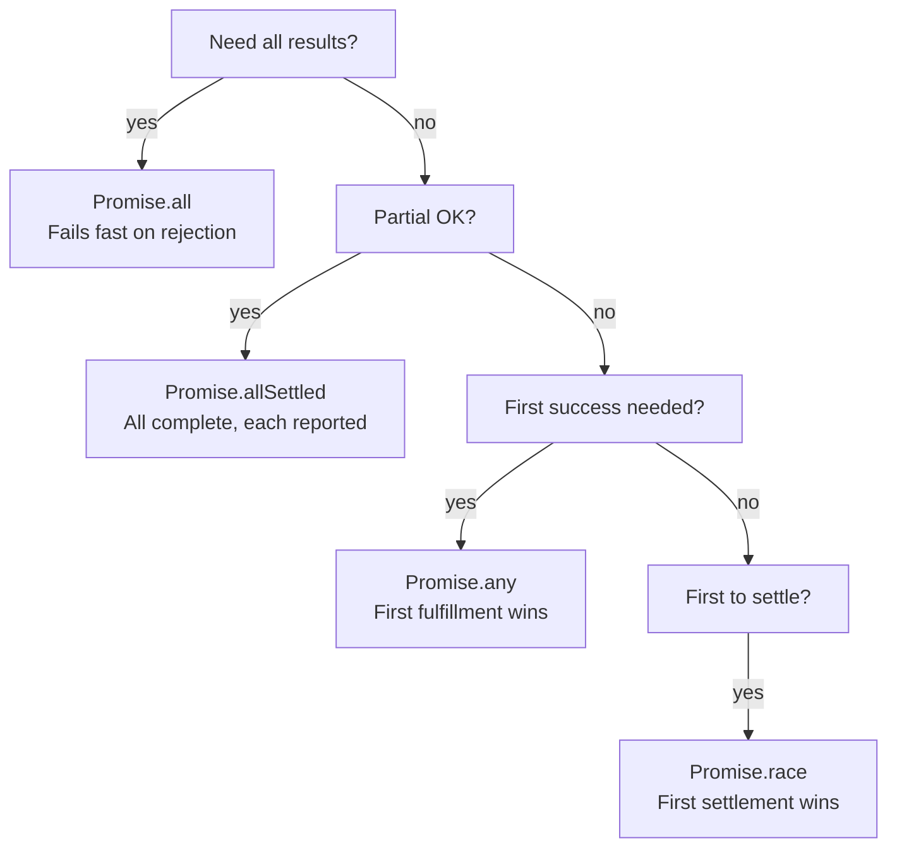

## Keywords in This File

{: .no_toc }

| # | Keyword | Difficulty |
|---|---------|------------|
| 1 | [async/await Syntax and Semantics](#asyncawait-syntax-and-semantics) | ★☆☆ |
| 2 | [Error Handling in Async Functions](#error-handling-in-async-functions) | ★☆☆ |
| 3 | [Promise.all vs Promise.race vs Promise.allSettled](#promiseall-vs-promiserace-vs-promiseallsettled) | ★☆☆ |

---

# async/await Syntax and Semantics

---

### 🎯 Model Answer

**30 seconds:**
> `async` functions return Promises. `await` pauses the
> function until a Promise resolves and returns its value.
> This lets you write async code that looks and reads like
> synchronous code. Under the hood, async/await is syntactic
> sugar over Promises - an `async` function body is a Promise
> chain expressed with sequential syntax.

**3 minutes:**
> `async` before a function declaration does two things:
> it marks the function as asynchronous and it wraps the
> return value in a Promise. If the function returns 42,
> callers receive `Promise<42>`. If it throws, callers
> receive a rejected Promise.
>
> `await` can only be used inside an `async` function (or
> at the module top level in ES modules). It pauses the
> function's execution frame until the awaited Promise settles.
> The JavaScript thread is not paused - other callbacks can
> run while the function waits. Only the async function's
> execution is suspended.
>
> The transformation: each `await` corresponds to a `.then()`
> in the equivalent Promise chain. The rest of the function
> after the `await` is the `.then` callback. `try/catch`
> around `await` corresponds to `.catch()`.
>
> The key trap: forgetting `await` means the function continues
> immediately with the Promise object instead of the resolved
> value. TypeScript's type system catches most of these with
> `no-floating-promises` and proper return types.

**Blank Mind Recovery:**

**(1) Restate:** "`async` returns a Promise. `await` pauses
the function - not the thread - until a Promise resolves."

**(2) First principles:** "You want to write async code that
reads like sync code. `await` lets you write `const result =
await asyncOp()` instead of `.then(result => ...)`. The
semantics are the same; the syntax is more readable."

---

### 📘 Concept Explanation

**What it is:**
`async`/`await` is ES2017 syntax that enables writing async
code with synchronous-looking control flow. An `async` function
always returns a Promise. `await` suspends a function's
execution until a Promise settles.

**The problem it solves:**
Promise `.then()` chains are hard to follow for multi-step
sequential operations and complex conditional logic. async/await
makes async code read top-to-bottom like synchronous code.

**How it works:**

```javascript
// DESUGARING: async/await <-> Promise chains

// async/await form:
async function getOrderTotal(userId) {
  const user = await getUser(userId);
  const orders = await getOrders(user.id);
  return orders.reduce((sum, o) => sum + o.total, 0);
}

// Equivalent Promise form (approximate):
function getOrderTotal(userId) {
  return getUser(userId)
    .then(user => getOrders(user.id)
      .then(orders =>
        orders.reduce((sum, o) => sum + o.total, 0)
      )
    );
}

// RULE: async function always returns Promise
async function alwaysPromise() {
  return 42; // returns Promise<42>
}
alwaysPromise().then(v => console.log(v)); // 42

// RULE: await on non-Promise wraps it
async function awaitNonPromise() {
  const v = await 42; // wraps: Promise.resolve(42)
  return v + 1; // returns Promise<43>
}
```

> **Code walkthrough:** This async/await Syntax and Semantics example demonstrates async/await Promise resolution using async/await. **KEY MECHANISM:** async functions return Promises; await suspends the microtask until the Promise settles. **WHY IT MATTERS:** unhandled Promise rejections crash the Node process in v15+ or fire unhandledRejection event. **TAKEAWAY: always await or .catch() every Promise - silent rejections are production defects.**

**The key insight:**
`await` suspends the FUNCTION, not the THREAD. When an
`async` function hits `await`, it yields control back to the
event loop. Other callbacks, timers, and async functions can
run. The function resumes from exactly where it paused when
the awaited Promise settles.

**When to use it:**
Sequential async operations; conditional async logic; loops
with async steps; anywhere Promise chains would be hard to read.

**When NOT to use it:**
When operations are independent: `await A; await B` is serial.
`await Promise.all([A, B])` is parallel. Use `Promise.all`
for concurrent operations.

**Alternatives:**
- Promise `.then` chains: more explicit, better for functional
  pipeline patterns
- Generator functions + a runner (co): historical predecessor,
  same pattern

**First-principles derivation:**
Generators (ES6) proved you could suspend and resume functions.
`async/await` extends this with automatic Promise integration:
`yield` becomes `await`, the generator runner becomes the
JavaScript engine, and the communication channel becomes
a Promise.

---

### 💻 Code Example

```javascript
// BAD: Sequential awaits on independent operations
async function loadDashboard(userId) {
  const user = await getUser(userId);     // 200ms
  const posts = await getPosts(userId);   // 300ms
  const follows = await getFollows(userId); // 150ms
  // Total: 650ms - unnecessary, posts/follows don't
  // depend on user or each other
  return { user, posts, follows };
}
```

> **Code walkthrough:** Three independent async operationsice. **KEY MECHANISM:** the runtime executes these instructions in sequence with specific memory and execution semantics. **WHY IT MATTERS:** misapplying this pattern causes subtle bugs that only manifest under production load. **TAKEAWAY: understand the execution model before using this pattern in production code.**
> run sequentially because each `await` blocks until the
> previous completes. Total time is the sum (650ms). The
> user, posts, and follows endpoints don't depend on each
> other - there's no reason to serialize them.

```javascript
// GOOD: Parallel execution with Promise.all
async function loadDashboard(userId) {
  // All three start concurrently:
  const [user, posts, follows] = await Promise.all([
    getUser(userId),      // 200ms
    getPosts(userId),     // 300ms
    getFollows(userId)    // 150ms
  ]);
  // Total: 300ms (max of three, not sum)
  return { user, posts, follows };
}

// ALSO GOOD: Start before await for mixed dependencies
async function loadFeed(userId) {
  const user = await getUser(userId); // 200ms - needed first
  // posts and follows can run in parallel:
  const [posts, follows] = await Promise.all([
    getPosts(user.id),       // needs user.id
    getFollows(user.id)      // needs user.id
  ]);
  return { user, posts, follows };
  // Total: 200 + max(posts, follows)ms
}
```

> **Code walkthrough:** `Promise.all` starts all operationsice. **KEY MECHANISM:** the runtime executes these instructions in sequence with specific memory and execution semantics. **WHY IT MATTERS:** misapplying this pattern causes subtle bugs that only manifest under production load. **TAKEAWAY: understand the execution model before using this pattern in production code.**
> simultaneously and waits for all to complete. Total time
> is the maximum of all operation durations, not the sum.
> The second example shows the mixed case: when `user` is
> needed before other operations, await it alone first, then
> use `Promise.all` for the independent operations that follow.

---

### 🎓 Answers by Seniority

**Junior / Mid (0-5 years):**
> "`async` marks a function as asynchronous and makes it
> return a Promise. `await` waits for a Promise to resolve.
> You can only use `await` inside an `async` function.
> Common mistake: forgetting that sequential `await`s run
> one at a time, not simultaneously."

*Push deeper:* "What type does an `async` function return
if you write `return 42`? A Promise that resolves with 42."

---

**Senior / Staff (5+ years):**
> "async/await is my default for sequential async logic.
> The cases where I reach for Promise chains: functional
> pipelines with dynamic step counts, and library code
> where allocation overhead matters. The primary trap I
> catch in code review: sequential awaits on independent
> operations that should be `Promise.all`."

---

### ⚠️ Common Misconceptions

**Misconception 1:** "`await` pauses the entire JavaScript
thread."
`await` pauses the function, not the thread. The event loop
continues running other callbacks while the function waits.
JavaScript is still single-threaded - no code runs in parallel -
but other callbacks can execute while this function is
suspended.

**Misconception 2:** "You must use `await` every time you
call an async function."
You call an async function without `await` when you want to
start the operation without waiting for it. This is intentional
for fire-and-forget patterns - but you should still handle
errors via `.catch()` to avoid unhandled rejections.

**Misconception 3:** "`async` functions run faster."
`async` does not change execution speed. It changes how the
function suspends and resumes. The underlying operations take
exactly the same time. The performance difference is in how
you compose multiple operations (parallel vs sequential).

---

### 🚨 Failure Modes and Diagnosis

**Failure 1: Missing `await` before a Promise**
```javascript
async function broken() {
  const user = getUser(id); // forgot await!
  // user is a Promise object, not a User
  console.log(user.name); // undefined
  return user.name; // undefined
}
// TypeScript with strict types would catch this:
// Type 'Promise<User>' has no property 'name'
```

> **Code walkthrough:** This Unknown example demonstrates async/await Promise resolution. **KEY MECHANISM:** async functions return Promises; await suspends the microtask until the Promise settles. **WHY IT MATTERS:** unhandled Promise rejections crash the Node process in v15+ or fire unhandledRejection event. **TAKEAWAY: always await or .catch() every Promise - silent rejections are production defects.**

**Failure 2: `await` in non-async function**
```javascript
// This is a syntax error in regular functions:
function notAsync() {
  const data = await fetch('/api'); // SyntaxError
}
// Fix: make the function async
async function isAsync() {
  const data = await fetch('/api'); // OK
}
```

> **Code walkthrough:** This Unknown example demonstrates async/await Promise resolution using async/await. **KEY MECHANISM:** async functions return Promises; await suspends the microtask until the Promise settles. **WHY IT MATTERS:** unhandled Promise rejections crash the Node process in v15+ or fire unhandledRejection event. **TAKEAWAY: always await or .catch() every Promise - silent rejections are production defects.**

**Failure 3: Top-level await in non-module files**
Top-level `await` (outside a function) is only valid in ES
modules (`type: "module"` or `.mjs`). In CommonJS modules
it throws a SyntaxError.

---

### 🎯 Interview Deep-Dive

| Category | Count | Coverage |
|---|---|---|
| Conceptual | 2 | Desugaring, function vs thread pause |
| Trade-off | 1 | Sequential vs parallel |
| Failure Mode | 1 | Missing await |
| Debugging | 1 | Async stack traces |
| Design | 1 | When to use vs Promise chains |
| Trap | 1 | await in loop |

**[JUNIOR] Q1 - [MECHANISM] What does `async` keyword do to a function?**

`async` transforms the function's return behavior: it always
returns a Promise. If the function body returns a value `v`,
the returned Promise resolves with `v`. If the function throws,
the returned Promise rejects with the thrown error.

Additionally, inside the function, `await` becomes available
as syntax (it is a syntax error in non-async functions).

The function's internal execution still starts synchronously -
code before the first `await` runs immediately when the function
is called.

```javascript
async function f() {
  console.log('sync start'); // runs immediately
  await delay(100);          // suspend here
  console.log('resumes after 100ms');
  return 'done';             // Promise<'done'>
}
f(); // starts sync execution, returns Promise<'done'>
console.log('after f()'); // runs before 'resumes...'
```

> **Code walkthrough:** This Unknown example demonstrates async/await Promise resolution using async/await. **KEY MECHANISM:** async functions return Promises; await suspends the microtask until the Promise settles. **WHY IT MATTERS:** unhandled Promise rejections crash the Node process in v15+ or fire unhandledRejection event. **TAKEAWAY: always await or .catch() every Promise - silent rejections are production defects.**

*What separates good from great:* Knowing that async functions
start synchronously and only pause at the first `await`.

---

**[JUNIOR] Q2 - [MECHANISM] How does `await` relate to the microtask queue?**

`await expr` suspends the function and schedules the
continuation as a microtask when `expr`'s Promise resolves.
Each `await` introduces at least one microtask checkpoint.

```javascript
async function example() {
  await Promise.resolve(); // one microtask tick
  console.log('after one tick');
}
example();
console.log('sync'); // runs before 'after one tick'
// Output: 'sync', 'after one tick'
```

> **Code walkthrough:** This Unknown example demonstrates async/await Promise resolution using async/await. **KEY MECHANISM:** async functions return Promises; await suspends the microtask until the Promise settles. **WHY IT MATTERS:** unhandled Promise rejections crash the Node process in v15+ or fire unhandledRejection event. **TAKEAWAY: always await or .catch() every Promise - silent rejections are production defects.**

Even `await 42` (non-Promise) wraps in `Promise.resolve(42)`,
introducing a microtask checkpoint. This is why `await`
always yields to other pending microtasks.

*What separates good from great:* Understanding that `await`
is not just a syntax convenience - it has specific microtask
scheduling semantics that affect execution order.

---

**[JUNIOR] Q3 - [MECHANISM] What are the async/await patterns for loop iteration?**

Sequential iteration (each step waits for the previous):
```javascript
// for...of with await - sequential
for (const item of items) {
  await processItem(item); // waits each iteration
}
```

> **Code walkthrough:** This Unknown example demonstrates variable declaration using async/await. **KEY MECHANISM:** const prevents reassignment but not mutation; the reference is locked, the value is not. **WHY IT MATTERS:** const obj = {}; obj.x = 1 works - const does not freeze the object. **TAKEAWAY: use Object.freeze() to prevent mutation; const only guards the binding.**

Parallel iteration:
```javascript
// Promise.all with map - all start immediately
await Promise.all(items.map(item => processItem(item)));
```

> **Code walkthrough:** This Unknown example demonstrates Promise chain construction using async/await. **KEY MECHANISM:** Promise.then() registers a microtask; all microtasks drain before the next macrotask. **WHY IT MATTERS:** Promise.all() fails fast on first rejection; use Promise.allSettled() to collect all results. **TAKEAWAY: prefer Promise.allSettled() over Promise.all() when partial success is acceptable.**

Parallel with concurrency limit:
```javascript
// Process at most 3 at a time
const limit = 3;
for (let i = 0; i < items.length; i += limit) {
  const batch = items.slice(i, i + limit);
  await Promise.all(batch.map(processItem));
}
```

> **Code walkthrough:** This Unknown example demonstrates Promise chain construction using async/await. **KEY MECHANISM:** Promise.then() registers a microtask; all microtasks drain before the next macrotask. **WHY IT MATTERS:** Promise.all() fails fast on first rejection; use Promise.allSettled() to collect all results. **TAKEAWAY: prefer Promise.allSettled() over Promise.all() when partial success is acceptable.**

`forEach` does NOT work with await:
```javascript
// BAD: forEach with async callback - doesn't wait
items.forEach(async item => {
  await processItem(item); // awaits inside callback
  // but forEach ignores returned Promises
});
// Code after forEach continues immediately
```

> **Code walkthrough:** BAD pattern: This Unknown example demonstrates async/await Promise resolution using async/await. **KEY MECHANISM:** async functions return Promises; await suspends the microtask until the Promise settles. **WHY IT MATTERS:** unhandled Promise rejections crash the Node process in v15+ or fire unhandledRejection event. **WHAT BREAKS: always await or .catch() every Promise - silent rejections are production defects.**

*What separates good from great:* Knowing that `forEach` ignores
Promise return values, making async callbacks in `forEach`
fire-and-forget. This is a common source of bugs where code
appears to work but races occur.

---

**[MID] Q4 - [MECHANISM] Describe top-level await and its use cases.**

Top-level `await` allows `await` outside async functions at
the module top level (ES modules only). It was added in ES2022
and Node.js 14.8+.

```javascript
// ES module: valid top-level await
const config = await loadConfig(); // blocks module evaluation
export const port = config.port;
```

> **Code walkthrough:** This Unknown example demonstrates variable declaration using async/await. **KEY MECHANISM:** const prevents reassignment but not mutation; the reference is locked, the value is not. **WHY IT MATTERS:** const obj = {}; obj.x = 1 works - const does not freeze the object. **TAKEAWAY: use Object.freeze() to prevent mutation; const only guards the binding.**

Use cases:
- Module initialization that requires async setup
- Dynamic imports: `const module = await import('./large.js')`
- Conditional module selection at startup

Caution: top-level `await` blocks the evaluation of the
importing module until the awaited operation completes. A
module that top-level awaits a slow operation delays all
modules that import it.

*What separates good from great:* Understanding that top-level
`await` has a blocking effect on the module graph - it is not
free. Use it for initialization patterns where the alternative
is an init function that callers must remember to call.

---

**[MID] Q5 - [MECHANISM] How do you handle concurrent async operations with different error handling requirements?**

When some failures are acceptable and others are fatal:

```javascript
async function processWithPartialFailure(items) {
  const results = await Promise.allSettled(
    items.map(item => processItem(item))
  );

  const successful = results
    .filter(r => r.status === 'fulfilled')
    .map(r => r.value);

  const failed = results
    .filter(r => r.status === 'rejected')
    .map(r => r.reason);

  // Log failures but continue with successes
  if (failed.length > 0) {
    logger.warn(`${failed.length} items failed:`, failed);
  }

  return successful;
}
```

> **Code walkthrough:** This Unknown example demonstrates async/await Promise resolution using async/await. **KEY MECHANISM:** async functions return Promises; await suspends the microtask until the Promise settles. **WHY IT MATTERS:** unhandled Promise rejections crash the Node process in v15+ or fire unhandledRejection event. **TAKEAWAY: always await or .catch() every Promise - silent rejections are production defects.**

When all-or-nothing: `Promise.all` (throws on first rejection).
When partial success acceptable: `Promise.allSettled`.
When you want the first success: `Promise.any`.

*What separates good from great:* Choosing the right combinator
for the actual error semantics, not defaulting to `Promise.all`
for everything.

---

**[SENIOR] Q6 - [MECHANISM] What is the "async tax" and when does it matter?**

Every `await` introduces a microtask checkpoint, and every
`async` function allocates a Promise object. At high call
volumes (millions/second), these allocations are measurable.

V8 optimizations have reduced this significantly. Modern V8
can optimize "simple" async functions (no try/catch, no
complex control flow) to have minimal overhead.

When the async tax matters:
- Hot utility functions called millions of times per second
- Tight inner loops in processing pipelines
- Library code where allocation pressure is critical

Mitigation:
- Avoid unnecessary `await` on already-resolved operations
- Consider sync functions where async is not actually needed
- Profile before optimizing: premature optimization based on
  "async is slower" is usually wrong

*What separates good from great:* Knowing the async tax is
real but usually negligible, and having specific data (profiling)
before optimizing away async patterns.

---

**[SENIOR] Q7 - [MECHANISM] What is the `void` operator pattern with async functions?**

`void asyncFn()` is a pattern for intentional fire-and-forget
that explicitly communicates intent to TypeScript and readers.

Without `void`, calling an async function and ignoring the
result produces a TypeScript warning with `no-floating-promises`:
```javascript
// TypeScript warning: Promise returned but not awaited
fetchAndSave(data); // floating promise

// Explicit fire-and-forget with void:
void fetchAndSave(data); // intentional, suppresses warning
```

> **Code walkthrough:** This Unknown example demonstrates Promise chain construction. **KEY MECHANISM:** Promise.then() registers a microtask; all microtasks drain before the next macrotask. **WHY IT MATTERS:** Promise.all() fails fast on first rejection; use Promise.allSettled() to collect all results. **TAKEAWAY: prefer Promise.allSettled() over Promise.all() when partial success is acceptable.**

The `void` operator evaluates the expression and returns
`undefined`, making it clear the Promise is intentionally
ignored.

Best practice: use `void` for intentional fire-and-forget,
but always add error handling:
```javascript
void fetchAndSave(data).catch(err =>
  logger.error('Background save failed:', err)
);
```

> **Code walkthrough:** This Unknown example demonstrates arrow function using error handling. **KEY MECHANISM:** arrow functions capture `this` lexically from the enclosing scope at definition time. **WHY IT MATTERS:** using arrow function as an object method loses `this` - it becomes the outer context. **TAKEAWAY: use arrow functions for callbacks; use regular functions for object methods.**

*What separates good from great:* Understanding that `void`
is not just a TypeScript workaround - it communicates intent
to human readers. "I know this returns a Promise and I am
deliberately not waiting for it" is meaningful information.

---

### ⚖️ Comparison Table

*(Omit: ★☆☆ - comparison in L2 Advanced Promises)*

---

### 🏛️ System Design

*(Omit: ★☆☆ - not applicable)*

---

### 📊 Diagram

*(Omit: execution flow covered in L0 Orientation event loop
diagram)*

---

---

---

### 💻 Code Example

*(Omit: this concept does not have a programmatic interface that can be demonstrated in code. The conceptual explanation above is sufficient.)*


---

### 🏛️ System Design

*(Omit: system design diagram not applicable for this concept - see ★★★ keywords for full system design coverage.)*


---

### ⚖️ Comparison Table

*(Omit: this is a ★☆☆ foundational concept with no direct alternatives to compare - see higher-difficulty keywords for trade-off analysis.)*


---

### 📊 Diagram

*(Omit: no standalone visual diagram required for this concept - the explanations and code examples above provide sufficient clarity.)*


# Error Handling in Async Functions

---

### 🎯 Model Answer

**30 seconds:**
> Errors in async functions are handled with `try/catch`
> around `await` expressions. An unhandled throw inside an
> `async` function rejects the returned Promise. Without
> `try/catch`, the error must be caught by the caller with
> `.catch()` or another `try/catch`. Forgetting to catch errors
> is the most common source of silent failures in async code.

**3 minutes:**
> Three error propagation paths in async code:
>
> 1. Await inside try/catch: errors from the awaited Promise
>    or synchronous throws inside the block are caught locally.
>    The catch block can recover (return a fallback) or rethrow.
>
> 2. Unhandled throw in async function: the function's returned
>    Promise is rejected. The error propagates to the caller,
>    who must handle it or it becomes an unhandled rejection.
>
> 3. Unhandled rejection: a Promise rejection that no code
>    handles. In Node.js 15+, this crashes the process by
>    default. In browsers, it fires the `unhandledrejection`
>    event.
>
> The critical failure mode: a try/catch that catches too
> broadly, hiding errors that should propagate. Every catch
> block should either handle the error (with genuine recovery),
> rethrow it, or at minimum log it before rethrowing.
>
> Another failure mode: `try/catch` around an `async` function
> call that is not awaited - the catch does not run because
> the async function returns a Promise, not a thrown value.

**Blank Mind Recovery:**

**(1) Restate:** "Errors in async functions work like sync
errors but travel through Promises. `try/catch` around `await`
catches them locally."

**(2) First principles:** "A rejected Promise is the async
equivalent of a thrown error. `await` converts Promise
rejection into a `throw` inside the async function, enabling
`try/catch` to work naturally."

---

### 📘 Concept Explanation

**What it is:**
Error handling in async functions bridges synchronous
`try/catch` semantics with asynchronous Promise rejection
propagation. `await` converts Promise rejection into a
local throw, enabling familiar control flow.

**The problem it solves:**
Callback-era error handling required manual `if (err) return`
at every step. `.catch()` chains required separate error
handling from the main flow. `try/catch` with `async/await`
provides unified, familiar error handling for async code.

**How it works:**

```javascript
// Three patterns for async error handling

// Pattern 1: try/catch - local recovery
async function withLocalRecovery(id) {
  try {
    const user = await getUser(id);
    return user;
  } catch (err) {
    if (err.code === 'NOT_FOUND') {
      return null; // local recovery
    }
    throw err; // re-throw unexpected errors
  }
}

// Pattern 2: .catch on the awaited value
async function withCatchMethod(id) {
  const user = await getUser(id).catch(err => {
    if (err.code === 'NOT_FOUND') return null;
    throw err;
  });
  return user;
}

// Pattern 3: propagate to caller
async function withPropagation(id) {
  // No try/catch - caller is responsible
  const user = await getUser(id);
  return user;
}
// Caller:
try {
  const user = await withPropagation(id);
} catch (err) {
  handleError(err);
}
```

> **Code walkthrough:** This Error Handling in Async Functions example demonstrates async/await Promise resolution using async/await. **KEY MECHANISM:** async functions return Promises; await suspends the microtask until the Promise settles. **WHY IT MATTERS:** unhandled Promise rejections crash the Node process in v15+ or fire unhandledRejection event. **TAKEAWAY: always await or .catch() every Promise - silent rejections are production defects.**

**The key insight:**
`await promise` converts promise rejection into a throw inside
the async function. This means synchronous errors and async
errors are handled with the same `try/catch` mechanism. The
symmetry is the main value of async/await over Promise chains.

**When to use it:**
In all async functions that perform I/O or operations that
can fail. At the boundary where an error is first known to
be handleable.

**When NOT to use it:**
Do not use `try/catch` to catch errors you cannot meaningfully
handle. An empty catch block (swallowing errors) is worse
than not catching - it actively hides failures.

**Alternatives:**
- `.catch()` method on Promises: useful for inline error
  handling in a chain step
- Result types (TypeScript): `{ok: true, value}` or `{ok: false,
  error}` - avoids exceptions entirely, requires explicit handling

**First-principles derivation:**
In synchronous code, exceptions propagate up the call stack
until caught. In async code, rejections propagate through
the Promise chain until caught. `await` bridges these: by
converting rejection to throw, it makes async errors propagate
through the call stack using the same mechanism.

---

### 💻 Code Example

```javascript
// BAD: try/catch around non-awaited call (catches nothing)
async function broken(id) {
  try {
    processData(fetchUser(id)); // fetchUser not awaited!
    // try/catch does not catch Promise rejection here
  } catch (err) {
    console.error(err); // never runs for async errors
  }
}

// BAD: empty catch (error swallowed)
async function silent(id) {
  try {
    const user = await getUser(id);
    return user;
  } catch (err) {
    // silent failure - caller gets undefined
    // no log, no rethrow, no recovery
  }
}
```

> **Code walkthrough:** Two common patterns that look likeice. **KEY MECHANISM:** the runtime executes these instructions in sequence with specific memory and execution semantics. **WHY IT MATTERS:** misapplying this pattern causes subtle bugs that only manifest under production load. **TAKEAWAY: understand the execution model before using this pattern in production code.**
> they handle errors but do not. The first wraps a non-awaited
> call in `try/catch` - since `fetchUser` returns a Promise
> without throwing, the catch block never fires. The second
> swallows the error entirely: the function returns `undefined`
> on failure, and the caller has no way to know the operation
> failed.

```javascript
// GOOD: Correct async error handling patterns

// Pattern A: Handle specific errors, rethrow rest
async function getUser(id) {
  try {
    const response = await fetch(`/api/users/${id}`);
    if (!response.ok) {
      throw new ApiError(response.status, await response.text());
    }
    return await response.json();
  } catch (err) {
    if (err instanceof ApiError && err.status === 404) {
      return null; // known, recoverable
    }
    // Unknown error: add context and rethrow
    throw new Error(`Failed to get user ${id}: ${err.message}`,
      { cause: err });
  }
}

// Pattern B: Error boundary at the top level
async function requestHandler(req, res) {
  try {
    const result = await processRequest(req);
    res.json(result);
  } catch (err) {
    // Catch-all at the boundary
    logger.error('Request failed:', {
      path: req.path,
      error: err.message,
      stack: err.stack
    });
    res.status(500).json({ error: 'Internal server error' });
  }
}
```

> **Code walkthrough:** Pattern A handles specific errorsice. **KEY MECHANISM:** the runtime executes these instructions in sequence with specific memory and execution semantics. **WHY IT MATTERS:** misapplying this pattern causes subtle bugs that only manifest under production load. **TAKEAWAY: understand the execution model before using this pattern in production code.**
> (404 -> null) and re-throws unknowns with additional context
> using the ES2022 `cause` property. This preserves the original
> error chain for debugging while adding semantic context.
> Pattern B is an error boundary at the request level: it catches
> any unhandled error from the entire request pipeline, logs it
> with context, and converts it to a safe HTTP response without
> leaking internal error details to the client.

---

### 🎓 Answers by Seniority

**Junior / Mid (0-5 years):**
> "Wrap `await` calls in `try/catch`. If an awaited Promise
> rejects, the catch block runs with the rejection reason.
> Never have an empty catch block - always at minimum log
> the error before swallowing it."

---

**Senior / Staff (5+ years):**
> "The error handling discipline I enforce: every async
> function either (a) handles errors it can recover from and
> rethrows the rest, or (b) is explicitly documented as
> propagating. I use the ES2022 `cause` option when rethrowing
> to preserve error chains. At service boundaries, I always
> add structured logging with request context before sending
> a generic error to the caller."

---

### ⚠️ Common Misconceptions

**Misconception 1:** "`try/catch` around an async function
call (without `await`) catches rejections."
`try { asyncFn(); } catch(e) {}` does not catch the Promise
rejection. The function returns a Promise synchronously without
throwing. The rejection happens later, asynchronously. You must
`await asyncFn()` for `try/catch` to work.

**Misconception 2:** "A `.catch()` at the end of a chain
catches errors from `.then` callbacks."
It does catch errors from all preceding `.then` callbacks.
But if you `await` the entire chain and do not use `.catch()`,
you need `try/catch` at the `await` point.

**Misconception 3:** "Re-throwing an error in a `catch`
block loses the original stack trace."
It does not (in V8 and modern environments). Re-throwing
preserves the stack. Adding context with `new Error(msg, {cause: original})`
actually adds information without losing the original.

---

### 🚨 Failure Modes and Diagnosis

**Failure 1: Unhandled rejection from fire-and-forget**

```javascript
// BAD: not awaiting async operations
function saveUser(user) {
    db.save(user); // async call not awaited
    return { success: true }; // returns before save completes
}
```

```javascript
// BAD: backgroundOperation() may reject silently
async function handler(req) {
  const result = await primaryOperation(req);
  backgroundOperation(result); // fire-and-forget, unhandled
  return result;
}

// GOOD: handle fire-and-forget errors
async function handler(req) {
  const result = await primaryOperation(req);
  backgroundOperation(result)
    .catch(err => logger.error('Background op failed:', err));
  return result;
}
```

> **Code walkthrough:** BAD pattern: This Unknown example demonstrates async/await Promise resolution using async/await. **KEY MECHANISM:** async functions return Promises; await suspends the microtask until the Promise settles. **WHY IT MATTERS:** unhandled Promise rejections crash the Node process in v15+ or fire unhandledRejection event. **WHAT BREAKS: always await or .catch() every Promise - silent rejections are production defects.**

**Failure 2: Error context lost in rethrowing**
```javascript
// BAD: rethrow loses context
try {
  await doWork();
} catch (err) {
  throw new Error('Work failed'); // original err lost!
}

// GOOD: preserve original error as cause
try {
  await doWork();
} catch (err) {
  throw new Error('Work failed', { cause: err });
  // err.cause === original, stack trace preserved
}
```

> **Code walkthrough:** BAD pattern: This Unknown example demonstrates JavaScript pattern using async/await. **KEY MECHANISM:** V8 JIT-compiles hot functions to machine code; polymorphic call sites deoptimize the function. **WHY IT MATTERS:** closure captures the reference not the value - loop variables captured in closures retain last value. **WHAT BREAKS: use block-scoped let/const in loops and closures to prevent stale reference bugs.**

---

### 🎯 Interview Deep-Dive

| Category | Count | Coverage |
|---|---|---|
| Conceptual | 2 | try/catch mechanics, rejection propagation |
| Trade-off | 1 | Error handling strategy choices |
| Failure Mode | 1 | Swallowed errors, non-awaited async |
| Debugging | 1 | Error chains and cause property |
| Design | 1 | Error boundaries |
| Behavioral | 1 | Code review error handling |

**[JUNIOR] Q1 - [MECHANISM] How does `try/catch` work with async functions and `await`?**

`await expr` converts a rejected Promise into a thrown error
inside the async function. This bridges the Promise rejection
model with the synchronous exception model.

The transformation:
```javascript
// async/await with try/catch:
async function f() {
  try {
    const v = await rejectingOp();
  } catch (err) {
    // err is the rejection reason
  }
}

// Equivalent Promise form:
function f() {
  return rejectingOp()
    .then(v => { /* success */ })
    .catch(err => { /* rejection */ });
}
```

> **Code walkthrough:** This Unknown example demonstrates async/await Promise resolution using async/await. **KEY MECHANISM:** async functions return Promises; await suspends the microtask until the Promise settles. **WHY IT MATTERS:** unhandled Promise rejections crash the Node process in v15+ or fire unhandledRejection event. **TAKEAWAY: always await or .catch() every Promise - silent rejections are production defects.**

The `try/catch` catches: Promise rejections at `await`, synchronous
throws, and type errors in the try block. It does NOT catch
rejections from non-awaited Promises started inside the block.

*What separates good from great:* The specific limitation:
only `await`-ed rejections are caught. A Promise started but
not awaited inside a `try` block creates an unhandled rejection.

---

**[JUNIOR] Q2 - [TRADE-OFF] What is the difference between returning an error vs throwing it from an async function?**

Returning an error as a value: the function fulfills with
the error as data. The caller receives the error object as
a normal resolved value. The caller must explicitly check
for it.

Throwing the error: the function's Promise rejects. The error
propagates through Promise rejection until caught with
`.catch()` or `try/catch`. The caller must have error handling.

Use cases for returning errors (result pattern):
- Functions where errors are expected and should be handled
  inline by every caller
- Discriminated union return types in TypeScript

Use cases for throwing:
- Unexpected errors (network failures, server errors, bugs)
- When you want errors to propagate to an error boundary

TypeScript result pattern:
```typescript
type Result<T, E = Error> =
  | { ok: true; value: T }
  | { ok: false; error: E };

async function getUser(id: string): Promise<Result<User>> {
  try {
    const user = await fetchUser(id);
    return { ok: true, value: user };
  } catch (err) {
    return { ok: false, error: err as Error };
  }
}
// Caller must handle both cases - no silent failure
const result = await getUser(id);
if (!result.ok) { /* handle */ }
```

> **Code walkthrough:** This Unknown example demonstrates type alias definition using async/await. **KEY MECHANISM:** type aliases are erased at compile time; they create no runtime overhead. **WHY IT MATTERS:** circular type aliases cause infinite recursion during type checking. **TAKEAWAY: prefer type aliases for union types and mapped types; interfaces for object shapes.**

*What separates good from great:* Knowing the result pattern
and when it is better than exceptions. Exceptions-as-control-
flow is often criticized, but result types add verbosity.
The trade-off: result types for expected failures, exceptions
for unexpected failures.

---

**[JUNIOR] Q3 - [MECHANISM] How do you handle errors from multiple concurrent async operations?**

With `Promise.all`: the first rejection rejects the whole
operation. Later operations may have already started and
will complete (or fail) - their results are lost.

With `Promise.allSettled`: all operations run to completion,
you get individual status/value/reason for each.

```javascript
// For partial failure tolerance:
const results = await Promise.allSettled([op1(), op2(), op3()]);
const errors = results
  .filter(r => r.status === 'rejected')
  .map(r => r.reason);

if (errors.length === results.length) {
  throw new AggregateError(errors, 'All operations failed');
}

// Process successful results
const values = results
  .filter(r => r.status === 'fulfilled')
  .map(r => r.value);
```

> **Code walkthrough:** This Unknown example demonstrates Promise chain construction using async/await. **KEY MECHANISM:** Promise.then() registers a microtask; all microtasks drain before the next macrotask. **WHY IT MATTERS:** Promise.all() fails fast on first rejection; use Promise.allSettled() to collect all results. **TAKEAWAY: prefer Promise.allSettled() over Promise.all() when partial success is acceptable.**

*What separates good from great:* Knowing to use `AggregateError`
(ES2021) when aggregating multiple errors, and knowing that
`Promise.all` short-circuits but does NOT cancel in-flight
operations.

---

**[MID] Q4 - [MECHANISM] What is error chaining with `cause` and why is it important?**

ES2022 added `cause` support to `Error`:
```javascript
new Error('High-level message', { cause: originalError })
```

> **Code walkthrough:** This Unknown example demonstrates JavaScript pattern. **KEY MECHANISM:** V8 JIT-compiles hot functions to machine code; polymorphic call sites deoptimize the function. **WHY IT MATTERS:** closure captures the reference not the value - loop variables captured in closures retain last value. **TAKEAWAY: use block-scoped let/const in loops and closures to prevent stale reference bugs.**

`err.cause` preserves the original error chain. When rethrowing
with added context, `cause` allows both the high-level error
(which provides semantic context) and the original error
(which has the technical detail) to be accessible.

```javascript
async function processPayment(orderId) {
  try {
    return await paymentGateway.charge(orderId);
  } catch (err) {
    throw new PaymentError(
      `Payment processing failed for order ${orderId}`,
      { cause: err } // preserves gateway error details
    );
  }
}
// Logger can traverse: err.message, err.cause.message,
// err.cause.cause.message... for full error chain
```

> **Code walkthrough:** This Unknown example demonstrates async/await Promise resolution using async/await. **KEY MECHANISM:** async functions return Promises; await suspends the microtask until the Promise settles. **WHY IT MATTERS:** unhandled Promise rejections crash the Node process in v15+ or fire unhandledRejection event. **TAKEAWAY: always await or .catch() every Promise - silent rejections are production defects.**

*What separates good from great:* Using `cause` consistently
means error logging can traverse the full chain from the high-
level semantic error to the root technical cause without losing
either context.

---

**[MID] Q5 - [MECHANISM] How do you test that an async function throws a specific error?**

Jest/Vitest:
```javascript
// Using expect().rejects:
await expect(getUser('invalid'))
  .rejects.toThrow('User not found');

// Using try/catch in the test:
async function assertThrows(fn, ErrorClass) {
  try {
    await fn();
    fail('Expected error was not thrown');
  } catch (err) {
    expect(err).toBeInstanceOf(ErrorClass);
  }
}
```

> **Code walkthrough:** This Unknown example demonstrates async/await Promise resolution using async/await. **KEY MECHANISM:** async functions return Promises; await suspends the microtask until the Promise settles. **WHY IT MATTERS:** unhandled Promise rejections crash the Node process in v15+ or fire unhandledRejection event. **TAKEAWAY: always await or .catch() every Promise - silent rejections are production defects.**

Pitfall: not `await`-ing the `expect().rejects` assertion:

```javascript
// BAD: anti-pattern - see GOOD example below
```

```javascript
// BAD: missing await - test passes even if no error thrown
expect(getUser('invalid')).rejects.toThrow('...');

// GOOD: await the assertion
await expect(getUser('invalid')).rejects.toThrow('...');
```

> **Code walkthrough:** BAD pattern: This Unknown example demonstrates JavaScript pattern using async/await. **KEY MECHANISM:** V8 JIT-compiles hot functions to machine code; polymorphic call sites deoptimize the function. **WHY IT MATTERS:** closure captures the reference not the value - loop variables captured in closures retain last value. **WHAT BREAKS: use block-scoped let/const in loops and closures to prevent stale reference bugs.**

*What separates good from great:* Knowing the specific failure
mode of non-awaited assertions in async tests, and having a
consistent testing pattern for error cases.

---

**[SENIOR] Q6 - [SCENARIO] What is the "async error boundary" pattern and when should you use it?**

An async error boundary is a top-level `try/catch` that
catches all errors from an async pipeline and provides a
safe fallback response. It is the async equivalent of React's
error boundary component.

Common placement: HTTP request handlers, message queue
consumers, scheduled job runners.

```javascript
// Express middleware error boundary
const asyncHandler = fn => (req, res, next) => {
  Promise.resolve(fn(req, res, next)).catch(next);
};

// Usage: wrap all route handlers
app.get('/user/:id', asyncHandler(async (req, res) => {
  const user = await getUser(req.params.id);
  res.json(user);
  // Any error thrown here propagates to Express error handler
}));

// Top-level error handler
app.use((err, req, res, next) => {
  logger.error('Unhandled error:', err);
  res.status(500).json({ error: 'Internal server error' });
});
```

> **Code walkthrough:** This Unknown example demonstrates async/await Promise resolution using async/await. **KEY MECHANISM:** async functions return Promises; await suspends the microtask until the Promise settles. **WHY IT MATTERS:** unhandled Promise rejections crash the Node process in v15+ or fire unhandledRejection event. **TAKEAWAY: always await or .catch() every Promise - silent rejections are production defects.**

*What separates good from great:* Knowing that async route
handlers in Express do not automatically propagate errors to
the error middleware - you need a wrapper like `asyncHandler`.
This is one of the most common Express async pitfalls.

---

**[SENIOR] Q7 - [MECHANISM] How do you distinguish between a programming error (bug) and an operational error (expected failure) in async error handling?**

Programming errors (bugs): TypeError, ReferenceError, assertion
failures, invalid argument errors. These should not be caught
and recovered - they should crash loudly, trigger alerts, and
be fixed. Catching programming errors hides bugs.

Operational errors (expected failures): network timeouts,
404s, database connection failures, rate limit responses.
These should be caught and handled with appropriate retry,
fallback, or user feedback.

The pattern:
```javascript
async function robustFetch(url) {
  try {
    const resp = await fetch(url);
    if (!resp.ok) {
      // Operational error - handle
      throw new ApiError(resp.status);
    }
    return await resp.json();
  } catch (err) {
    if (err instanceof TypeError) {
      // Programming error or network unavailable
      // Don't swallow - let it propagate
      throw err;
    }
    if (err instanceof ApiError) {
      // Operational error - handle with fallback
      return getDefaultData();
    }
    throw err; // Unknown - propagate
  }
}
```

> **Code walkthrough:** This Unknown example demonstrates async/await Promise resolution using async/await. **KEY MECHANISM:** async functions return Promises; await suspends the microtask until the Promise settles. **WHY IT MATTERS:** unhandled Promise rejections crash the Node process in v15+ or fire unhandledRejection event. **TAKEAWAY: always await or .catch() every Promise - silent rejections are production defects.**

*What separates good from great:* Applying the distinction
consistently in code review and architecture decisions. A
service that catches all errors and returns 200 with error
JSON is hiding bugs. A service that lets programming errors
propagate as 500s is correct.

---

### ⚖️ Comparison Table

*(Omit: ★☆☆ - covered in L3 files)*

---

### 🏛️ System Design

*(Omit: ★☆☆ - not applicable)*

---

### 📊 Diagram

*(Omit: error propagation is adequately covered in the
Promise state diagram in L1 Promise Basics)*

---

---

---

### 💻 Code Example

*(Omit: this concept does not have a programmatic interface that can be demonstrated in code. The conceptual explanation above is sufficient.)*


---

### 🏛️ System Design

*(Omit: system design diagram not applicable for this concept - see ★★★ keywords for full system design coverage.)*


---

### ⚖️ Comparison Table

*(Omit: this is a ★☆☆ foundational concept with no direct alternatives to compare - see higher-difficulty keywords for trade-off analysis.)*


---

### 📊 Diagram

*(Omit: no standalone visual diagram required for this concept - the explanations and code examples above provide sufficient clarity.)*


# Promise.all vs Promise.race vs Promise.allSettled

---

### 🎯 Model Answer

**30 seconds:**
> `Promise.all` waits for all Promises to fulfill and rejects
> immediately if any rejects. `Promise.race` resolves or rejects
> with the FIRST settled Promise. `Promise.allSettled` (ES2020)
> waits for all to complete and returns the status of each -
> it never rejects. Choose based on your failure semantics:
> all-or-nothing (`all`), fastest-wins (`race`), or partial
> success (`allSettled`).

**3 minutes:**
> `Promise.all(array)`: starts all Promises simultaneously.
> Waits until ALL fulfill. Resolves with an array of all values
> in order. Rejects immediately with the first rejection -
> does NOT wait for others to complete. Other in-flight
> operations continue running but their results are lost.
>
> `Promise.race(array)`: resolves or rejects with the first
> Promise to settle. Other Promises continue running but their
> results are ignored. Primary use: timeouts. Limitation: if
> the first settler is a rejection, the race rejects even if
> others would succeed.
>
> `Promise.allSettled(array)`: waits for all Promises to settle
> (fulfill or reject). Never rejects. Returns an array of
> result objects: `{status: 'fulfilled', value}` or
> `{status: 'rejected', reason}`. Correct choice when partial
> success is acceptable and you need to know which items failed.
>
> `Promise.any(array)` (ES2021): resolves with the FIRST
> fulfillment, ignoring rejections. Only rejects if ALL
> Promises reject (with `AggregateError`). Use case: first
> successful result from multiple sources.

**Blank Mind Recovery:**

**(1) Restate:** "Four Promise combinators with different
failure semantics: all, race, allSettled, any. The key
distinction is how each handles individual failures."

**(2) First principles:** "Concurrent async operations can
fail independently. The question is: what's the right behavior
when some succeed and some fail? Four answers: fail all,
fail on first (race), report each independently, or succeed
on any one."

---

### 📘 Concept Explanation

**What it is:**
Promise combinators are static methods that compose multiple
Promises into one. They differ in their semantics for how
they handle individual success and failure.

**The problem it solves:**
When running multiple async operations concurrently, you need
a way to aggregate results and handle mixed success/failure
scenarios with a single await.

**How it works:**

```javascript
// COMPARISON MATRIX
// ==================

// Promise.all: all succeed or fail on first rejection
const [a, b, c] = await Promise.all([fetchA(), fetchB(), fetchC()]);
// Resolves: [valueA, valueB, valueC] in order
// Rejects: with first rejection, immediately
// Risk: lost results from other operations

// Promise.race: first to settle wins
const result = await Promise.race([
  fetchSlow(), // 500ms
  fetchFast()  // 100ms
]);
// Resolves: fetchFast's result (100ms)
// Rejects: if fetchFast rejects (100ms)
// Note: fetchSlow continues running in background

// Promise.allSettled: wait for all, report each
const results = await Promise.allSettled([
  fetchA(), fetchB(), fetchC()
]);
// Always resolves with:
// [{status:'fulfilled', value:...},
//  {status:'rejected', reason:...}, ...]
// Never rejects

// Promise.any: first fulfillment wins
const data = await Promise.any([
  fetchPrimary(),
  fetchBackup1(),
  fetchBackup2()
]);
// Resolves: first to FULFILL
// Rejects: AggregateError if ALL reject

// TIMEOUT PATTERN with race:
function withTimeout(promise, ms) {
  const timeout = new Promise((_, reject) =>
    setTimeout(() => reject(new Error(`Timeout after ${ms}ms`)), ms)
  );
  return Promise.race([promise, timeout]);
}
const data = await withTimeout(fetchData(), 5000);
```

> **Code walkthrough:** This Promise.all vs Promise.race vs Promise.allSettled example demonstrates Promise chain construction using async/await. **KEY MECHANISM:** Promise.then() registers a microtask; all microtasks drain before the next macrotask. **WHY IT MATTERS:** Promise.all() fails fast on first rejection; use Promise.allSettled() to collect all results. **TAKEAWAY: prefer Promise.allSettled() over Promise.all() when partial success is acceptable.**

**The key insight:**
`Promise.all` does not cancel operations when it rejects.
In-flight operations continue to run. If they eventually
succeed or fail, those results are silently lost. JavaScript
has no built-in Promise cancellation - for that you need
`AbortController` or `rxjs` unsubscription.

**When to use it:**
- `Promise.all`: fan-out + fan-in patterns where all results
  are required
- `Promise.race`: timeouts; first-available cache lookups
- `Promise.allSettled`: batch operations where partial
  success is acceptable (sending multiple notifications)
- `Promise.any`: redundant sources where first success suffices

**When NOT to use it:**
`Promise.all` with a large array of operations that talk to
the same service: can overwhelm the target with concurrent
requests. Add concurrency limits.

**Alternatives:**
- Sequential loops: when operations are dependent or rate-limited
- Chunked `Promise.all`: batches of N concurrent operations
- RxJS `forkJoin` / `merge`: reactive equivalents with more
  control

**First-principles derivation:**
Concurrent async operations are a set of independent results
arriving at unknown times. Different applications need different
aggregation semantics. The four combinators cover the four
fundamental cases: all-required, first-settles, each-individually,
first-succeeds.

---

### 💻 Code Example

```javascript
// BAD: Sequential fetches when operations are independent
async function loadPageBad(userId) {
  const user = await getUser(userId);       // wait 200ms
  const posts = await getPosts(userId);     // wait 300ms
  const ads = await getAds(userId);         // wait 100ms
  return { user, posts, ads };
  // Total: 600ms (serial)
}

// BAD: Promise.all with operations that have dependencies
async function badConcurrent(userId) {
  const [user, orders] = await Promise.all([
    getUser(userId),
    getOrders(userId) // needs user.id - but user not ready!
    // This works by coincidence (userId == user.id)
    // but is fragile: if getOrders needs user.createdAt,
    // it would fail silently or use undefined
  ]);
}
```

> **Code walkthrough:** The BAD serial pattern wastes timeice. **KEY MECHANISM:** the runtime executes these instructions in sequence with specific memory and execution semantics. **WHY IT MATTERS:** misapplying this pattern causes subtle bugs that only manifest under production load. **TAKEAWAY: understand the execution model before using this pattern in production code.**
> on independent operations. The second BAD pattern is more
> subtle: it appears to use concurrent loading, but the comment
> identifies the dependency risk. If `getOrders` needed a field
> from the `user` object (not just its ID), this would silently
> fail with undefined input.

```javascript
// GOOD: Parallel with Promise.all
async function loadPageGood(userId) {
  const [user, posts, ads] = await Promise.all([
    getUser(userId),
    getPosts(userId),
    getAds(userId)
  ]);
  return { user, posts, ads };
  // Total: 300ms (max of 200, 300, 100)
}

// GOOD: allSettled for partial-failure tolerance
async function sendNotifications(userIds) {
  const results = await Promise.allSettled(
    userIds.map(id => sendEmail(id))
  );

  const sent = results.filter(r => r.status === 'fulfilled').length;
  const failed = results.filter(r => r.status === 'rejected');

  if (failed.length > 0) {
    logger.warn(`${failed.length} notifications failed`, {
      errors: failed.map(r => r.reason.message)
    });
  }

  return { sent, failed: failed.length };
  // Caller gets totals, not an error
}

// BAD: see prior example above (race for timeout...)
// GOOD: race for timeout
async function fetchWithTimeout(url, ms = 5000) {
  const controller = new AbortController();
  const timeout = setTimeout(() => controller.abort(), ms);

  try {
    const response = await fetch(url, {
      signal: controller.signal
    });
    return await response.json();
  } finally {
    clearTimeout(timeout); // cleanup timer if fetch succeeded
  }
  // Using AbortController is better than Promise.race:
  // it actually cancels the network request
}
```

> **Code walkthrough:** `Promise.all` runs three independentice. **KEY MECHANISM:** the runtime executes these instructions in sequence with specific memory and execution semantics. **WHY IT MATTERS:** misapplying this pattern causes subtle bugs that only manifest under production load. **TAKEAWAY: understand the execution model before using this pattern in production code.**
> operations concurrently, reducing total time from 600ms to
> 300ms. `Promise.allSettled` handles the notification pattern
> where partial success is correct - we want to send as many
> as possible and report failures, not abort on the first failure.
> The timeout pattern uses `AbortController` rather than a bare
> `Promise.race` - `AbortController` actually cancels the fetch
> request, preventing resource waste, while `Promise.race` alone
> would leave the fetch running.

---

### 🎓 Answers by Seniority

**Junior / Mid (0-5 years):**
> "`Promise.all` runs multiple Promises at once and waits for
> all. Fails if any fail. Use when you need all results.
> `Promise.allSettled` is like all but doesn't fail - use when
> some failures are OK. `Promise.race` gives you the first
> result - use for timeouts."

---

**Senior / Staff (5+ years):**
> "The combinator choice reflects the service's failure
> semantics, not just convenience. For a checkout flow,
> `Promise.all` for inventory + pricing is correct: both are
> required. For sending analytics events, `Promise.allSettled`
> is correct: some failures are acceptable. The production
> concern I add: `Promise.all` with large arrays may overwhelm
> downstream services. Use chunked processing or a concurrency
> limiter (p-limit npm package) for large fan-outs."

---

### ⚠️ Common Misconceptions

**Misconception 1:** "`Promise.all` cancels other operations
when one rejects."
It does not. All operations continue to run. `Promise.all`
just stops waiting. For actual cancellation, use AbortController
(for fetch) or custom cancellation tokens.

**Misconception 2:** "`Promise.race` resolves only when
the first one fulfills."
`Promise.race` resolves or rejects with the FIRST settled
Promise - including rejections. If the fastest Promise is
a rejection, the race rejects. For "first fulfillment," use
`Promise.any`.

**Misconception 3:** "The values in `Promise.all` results
are in completion order."
Results are in the same order as the input array, regardless
of completion order. The first element resolves with the
first input Promise's value, even if the third input resolved
first.

---

### 🚨 Failure Modes and Diagnosis

**Failure 1: Overwhelming a service with Promise.all**

```javascript
// BAD: unhandled Promise rejection
fetchData(url).then(data => {
    processData(data);
}); // no .catch() - rejection silently ignored
```

```javascript
// BAD: 1000 concurrent requests to the same endpoint
const results = await Promise.all(
  userIds.map(id => fetchUser(id)) // 1000 concurrent!
);

// GOOD: limit concurrency with p-limit
import pLimit from 'p-limit';
const limit = pLimit(10); // max 10 concurrent
const results = await Promise.all(
  userIds.map(id => limit(() => fetchUser(id)))
);
```

> **Code walkthrough:** BAD pattern: This Unknown example demonstrates Promise chain construction using async/await. **KEY MECHANISM:** Promise.then() registers a microtask; all microtasks drain before the next macrotask. **WHY IT MATTERS:** Promise.all() fails fast on first rejection; use Promise.allSettled() to collect all results. **WHAT BREAKS: prefer Promise.allSettled() over Promise.all() when partial success is acceptable.**

**Failure 2: Lost error context in Promise.all rejection**
```javascript
// Promise.all gives you one error - you don't know which failed
try {
  const [a, b, c] = await Promise.all([fn1(), fn2(), fn3()]);
} catch (err) {
  // Which of fn1, fn2, fn3 failed? err doesn't tell you.
  // Fix: use allSettled and inspect individual results
}
```

> **Code walkthrough:** This Unknown example demonstrates Promise chain construction using async/await. **KEY MECHANISM:** Promise.then() registers a microtask; all microtasks drain before the next macrotask. **WHY IT MATTERS:** Promise.all() fails fast on first rejection; use Promise.allSettled() to collect all results. **TAKEAWAY: prefer Promise.allSettled() over Promise.all() when partial success is acceptable.**

---

### 🎯 Interview Deep-Dive

| Category | Count | Coverage |
|---|---|---|
| Conceptual | 2 | All four combinators, semantics |
| Trade-off | 1 | all vs allSettled, race vs any |
| Failure Mode | 1 | Concurrency overwhelm |
| Debugging | 1 | Identifying which Promise failed |
| Design | 1 | Concurrency limiting pattern |
| Trap | 1 | Race rejects on first rejection |

**[JUNIOR] Q1 - [TRADE-OFF] What is the difference between `Promise.all` and `Promise.allSettled`? When would you choose each?**

`Promise.all`: fulfills with all values or rejects with
the first rejection. Correct for "all are required" semantics.

`Promise.allSettled`: always fulfills (never rejects) with
an array of `{status, value|reason}` objects. Correct for
"report each independently" semantics.

Choose `Promise.all` when: the operation is only useful if
all sub-operations succeed (loading required data for a page
render, validating multiple fields where all must pass).

Choose `Promise.allSettled` when: partial success is acceptable
and you need detailed results (sending notifications to a list,
bulk processing with per-item error reporting).

The anti-pattern: using `Promise.all` with individual `.catch()`
wrappers to prevent rejection is a roundabout way of doing
what `Promise.allSettled` does directly.

*What separates good from great:* Connecting the choice to
the actual business semantics of the operation, not just the
technical API difference.

---

**[JUNIOR] Q2 - [SCENARIO] Implement a timeout wrapper for any async operation using Promise.race.**

```javascript
function withTimeout(operation, timeoutMs, timeoutMsg) {
  const timeoutPromise = new Promise((_, reject) =>
    setTimeout(
      () => reject(new Error(timeoutMsg || `Timed out after ${timeoutMs}ms`)),
      timeoutMs
    )
  );
  return Promise.race([operation, timeoutPromise]);
}

// Usage:
const data = await withTimeout(
  fetchLargeDataset(),
  10_000,
  'Dataset fetch exceeded 10s limit'
);
```

> **Code walkthrough:** This Unknown example demonstrates Promise chain construction using async/await. **KEY MECHANISM:** Promise.then() registers a microtask; all microtasks drain before the next macrotask. **WHY IT MATTERS:** Promise.all() fails fast on first rejection; use Promise.allSettled() to collect all results. **TAKEAWAY: prefer Promise.allSettled() over Promise.all() when partial success is acceptable.**

Limitation: the operation continues running after timeout.
For network requests, use `AbortController` to actually cancel:

```javascript
async function fetchWithTimeout(url, timeoutMs) {
  const controller = new AbortController();
  const timer = setTimeout(() => controller.abort(), timeoutMs);
  try {
    const resp = await fetch(url, { signal: controller.signal });
    return await resp.json();
  } finally {
    clearTimeout(timer);
  }
}
```

> **Code walkthrough:** This Unknown example demonstrates async/await Promise resolution using async/await. **KEY MECHANISM:** async functions return Promises; await suspends the microtask until the Promise settles. **WHY IT MATTERS:** unhandled Promise rejections crash the Node process in v15+ or fire unhandledRejection event. **TAKEAWAY: always await or .catch() every Promise - silent rejections are production defects.**

*What separates good from great:* Identifying that `Promise.race`
for timeouts is a pattern but does not cancel the underlying
operation. Providing `AbortController` as the correct approach
for actual cancellation.

---

**[JUNIOR] Q3 - [MECHANISM] How does `Promise.any` differ from `Promise.race` and when is it useful?**

`Promise.race`: settles with the FIRST settlement (fulfilled or rejected).

`Promise.any`: settles with the FIRST FULFILLMENT. Rejections
are ignored unless all reject (then rejects with `AggregateError`).

`Promise.any` is useful for: redundant sources where you want
the first success and failures are acceptable as fallbacks.

```javascript
// Multi-CDN asset loading: first CDN to respond wins
const image = await Promise.any([
  fetchFromCDN1(path),
  fetchFromCDN2(path),
  fetchFromCDN3(path)
]);
// If CDN1 and CDN2 are down but CDN3 works,
// Promise.race would reject (CDN1 rejects first)
// Promise.any resolves with CDN3's result
```

> **Code walkthrough:** This Unknown example demonstrates Promise chain construction using async/await. **KEY MECHANISM:** Promise.then() registers a microtask; all microtasks drain before the next macrotask. **WHY IT MATTERS:** Promise.all() fails fast on first rejection; use Promise.allSettled() to collect all results. **TAKEAWAY: prefer Promise.allSettled() over Promise.all() when partial success is acceptable.**

*What separates good from great:* Knowing that `Promise.any`
was specifically designed for redundant-source patterns.
`Promise.race` is the wrong tool for this use case because
slow failures beat fast successes.

---

**[MID] Q4 - [FAILURE] What happens to in-flight Promises when `Promise.all` rejects?**

They continue running. `Promise.all` stops waiting, rejects
with the first error, and the remaining operations are
orphaned. They will eventually settle, but their results
are lost. If they reject, those rejections become unhandled.

This has implications:
- Resources allocated by the orphaned operations may not
  be freed (database connections, file handles)
- Side effects from orphaned operations may still occur
  (database writes, email sends, state mutations)

Production mitigation:
1. Design operations to be idempotent where possible
2. Add `.catch(() => {})` to Promise.all inputs to prevent
   unhandled rejections (though results are still lost)
3. For operations with cleanup needs, use AbortController
   or explicit cancellation tokens

*What separates good from great:* Framing this as a production
concern, not just an API behavior. Unhandled rejections from
orphaned Promises have caused production incidents.

---

**[MID] Q5 - [SCENARIO] How do you implement a concurrency-limited batch processor with Promises?**

```javascript
// Process items in batches of N concurrent operations
async function batchProcess(items, concurrency, processFn) {
  const results = [];

  for (let i = 0; i < items.length; i += concurrency) {
    const batch = items.slice(i, i + concurrency);
    const batchResults = await Promise.all(
      batch.map(item => processFn(item))
    );
    results.push(...batchResults);
  }

  return results;
}

// Or with p-limit for finer control:
import pLimit from 'p-limit';

async function processAll(items, processFn, maxConcurrent = 10) {
  const limit = pLimit(maxConcurrent);
  return Promise.all(
    items.map(item => limit(() => processFn(item)))
  );
}
// p-limit allows N concurrent at any time, not per batch
```

> **Code walkthrough:** This Unknown example demonstrates async/await Promise resolution using async/await. **KEY MECHANISM:** async functions return Promises; await suspends the microtask until the Promise settles. **WHY IT MATTERS:** unhandled Promise rejections crash the Node process in v15+ or fire unhandledRejection event. **TAKEAWAY: always await or .catch() every Promise - silent rejections are production defects.**

The difference: batch processing (N per batch) serializes
batches. `p-limit` maintains N concurrent at all times
regardless of which operations complete first. `p-limit` is
generally more efficient.

*What separates good from great:* Distinguishing between
batch-serial (simple but less efficient) and sliding-window
concurrency (p-limit style, more complex but better throughput).
Knowing `p-limit` is the standard library for this.

---

**[SENIOR] Q6 - [MECHANISM] What is `AggregateError` and when does it appear?**

`AggregateError` (ES2021) is an error type that holds multiple
errors. It appears when `Promise.any` rejects (all input Promises
rejected) - the `AggregateError` contains all the rejection
reasons.

```javascript
try {
  await Promise.any([
    Promise.reject(new Error('Source 1 failed')),
    Promise.reject(new Error('Source 2 failed')),
    Promise.reject(new Error('Source 3 failed'))
  ]);
} catch (err) {
  if (err instanceof AggregateError) {
    console.log('All sources failed:');
    err.errors.forEach(e => console.log(' -', e.message));
  }
}
```

> **Code walkthrough:** This Unknown example demonstrates Promise chain construction using async/await. **KEY MECHANISM:** Promise.then() registers a microtask; all microtasks drain before the next macrotask. **WHY IT MATTERS:** Promise.all() fails fast on first rejection; use Promise.allSettled() to collect all results. **TAKEAWAY: prefer Promise.allSettled() over Promise.all() when partial success is acceptable.**

`AggregateError` also appears from `Promise.any` in the browser
when the Fetch API's `fetchLater` queues all fail. It is the
correct type for "multiple failures, each needs to be reported."

*What separates good from great:* Knowing `AggregateError`
exists and handling it correctly when using `Promise.any`,
rather than assuming the rejection reason is a simple `Error`.

---

**[SENIOR] Q7 - [SCENARIO] How do you implement a fallback chain where each source is tried in order until one succeeds?**

Two approaches depending on whether they should be tried
sequentially or concurrently:

Sequential (try each in order, stop on first success):
```javascript
async function tryInOrder(fns) {
  let lastError;
  for (const fn of fns) {
    try {
      return await fn();
    } catch (err) {
      lastError = err;
      // try next
    }
  }
  throw new AggregateError([lastError], 'All fallbacks failed');
}

const result = await tryInOrder([
  () => fetchFromCache(key),
  () => fetchFromPrimary(key),
  () => fetchFromBackup(key)
]);
```

> **Code walkthrough:** This Unknown example demonstrates async/await Promise resolution using async/await. **KEY MECHANISM:** async functions return Promises; await suspends the microtask until the Promise settles. **WHY IT MATTERS:** unhandled Promise rejections crash the Node process in v15+ or fire unhandledRejection event. **TAKEAWAY: always await or .catch() every Promise - silent rejections are production defects.**

Concurrent (all start simultaneously, first success wins):
```javascript
const result = await Promise.any([
  fetchFromCache(key),
  fetchFromPrimary(key),
  fetchFromBackup(key)
]);
```

> **Code walkthrough:** This Unknown example demonstrates Promise chain construcice. **KEY MECHANISM:** the runtime executes these instructions in sequence with specific memory and execution semantics. **WHY IT MATTERS:** misapplying this pattern causes subtle bugs that only manifest under production load. **TAKEAWAY: understand the execution model before using this pattern in production code.**

Sequential is correct for expensive operations or when later
tries should not start if earlier ones succeed. Concurrent is
correct for latency-sensitive operations where the cost of
running all in parallel is acceptable.

*What separates good from great:* Knowing both patterns and
understanding when to use each based on cost and latency
requirements. In most client-side scenarios, concurrent
fallback (`Promise.any`) is preferable for latency. In server-
side scenarios with expensive operations, sequential fallback
is correct to avoid unnecessary load.

---

### ⚖️ Comparison Table

*(Omit: ★☆☆ - see table in concept explanation above)*

---

### 🏛️ System Design

*(Omit: ★☆☆ - not applicable)*

---

### 📊 Diagram

```
PROMISE COMBINATOR SEMANTICS
==============================
Input: [P1, P2, P3]  (all start concurrently)

Promise.all([P1, P2, P3])
  P1: fulfill       P2: fulfill     P3: reject
  Result: REJECT with P3 reason (immediately)
  P1, P2 results lost

Promise.allSettled([P1, P2, P3])
  P1: fulfill       P2: fulfill     P3: reject
  Result: FULFILL with
  [{status:'fulfilled', value:V1},
   {status:'fulfilled', value:V2},
   {status:'rejected', reason:R3}]

Promise.race([P1, P2, P3])
  P2 settles first (fastest)
  Result: same as P2 (fulfill or reject)
  P1, P3 continue running, results ignored

Promise.any([P1, P2, P3])
  P2: reject (fastest)  P1: fulfill  P3: reject
  Result: FULFILL with P1 value
  (first FULFILLMENT wins, not first settlement)
```



> **Diagram walkthrough:** The decision tree selects the
> correct combinator based on failure semantics. `Promise.all`
> enforces all-or-nothing. `Promise.allSettled` tolerates
> individual failures and reports each. `Promise.any` finds
> the first success from multiple sources. `Promise.race`
> takes the first result regardless of success or failure -
> primarily useful for timeouts. The Mermaid diagram provides
> a quick reference for choosing the right combinator in code
> review and design discussions.

---

### 💻 Code Example

*(Omit: this concept does not have a programmatic interface that can be demonstrated in code. The conceptual explanation above is sufficient.)*


---

### 🏛️ System Design

*(Omit: system design diagram not applicable for this concept - see ★★★ keywords for full system design coverage.)*


---

### ⚖️ Comparison Table

*(Omit: this is a ★☆☆ foundational concept with no direct alternatives to compare - see higher-difficulty keywords for trade-off analysis.)*


---

### 📊 Diagram

*(Omit: no standalone visual diagram required for this concept - the explanations and code examples above provide sufficient clarity.)*


